# Opinion Poll by Kantar Emor for BNS and Postimees, 12–18 May 2021

<a href="#voting-intentions">Voting Intentions</a> | <a href="#seats">Seats</a> | <a href="#coalitions">Coalitions</a> | <a href="#technical-information">Technical Information</a>

## Voting Intentions

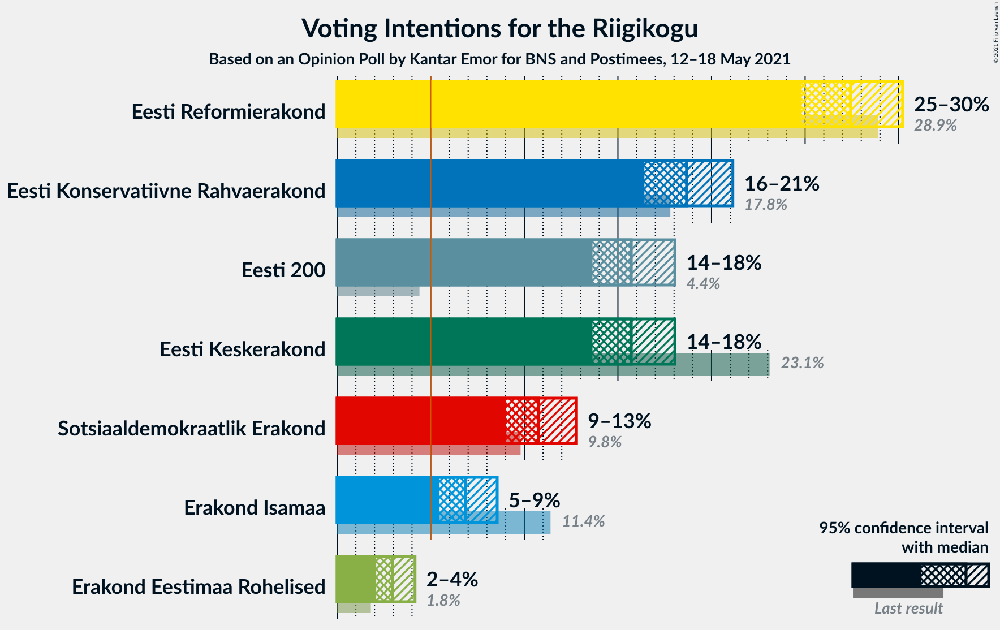

### Confidence Intervals

| Party | Last Result | Poll Result | 80% Confidence Interval | 90% Confidence Interval | 95% Confidence Interval | 99% Confidence Interval |
|:-----:|:-----------:|:-----------:|:-----------------------:|:-----------------------:|:-----------------------:|:-----------------------:|
| Eesti Reformierakond | 28.9% | 27.4% | 25.7–29.2% |25.2–29.8% |24.8–30.2% |24.0–31.1% |
| Eesti Konservatiivne Rahvaerakond | 17.8% | 18.7% | 17.2–20.3% |16.8–20.7% |16.4–21.1% |15.7–21.9% |
| Eesti Keskerakond | 23.1% | 15.7% | 14.3–17.2% |14.0–17.7% |13.6–18.0% |13.0–18.8% |
| Eesti 200 | 4.4% | 15.7% | 14.3–17.2% |14.0–17.7% |13.6–18.0% |13.0–18.8% |
| Sotsiaaldemokraatlik Erakond | 9.8% | 10.8% | 9.6–12.1% |9.3–12.5% |9.0–12.8% |8.5–13.4% |
| Erakond Isamaa | 11.4% | 6.9% | 5.9–8.0% |5.7–8.3% |5.5–8.6% |5.1–9.1% |
| Erakond Eestimaa Rohelised | 1.8% | 3.0% | 2.4–3.7% |2.2–4.0% |2.1–4.2% |1.8–4.6% |

*Note:* The poll result column reflects the actual value used in the calculations. Published results may vary slightly, and in addition be rounded to fewer digits.

## Seats

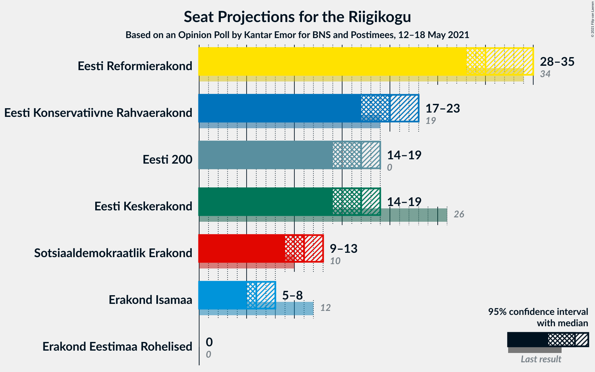

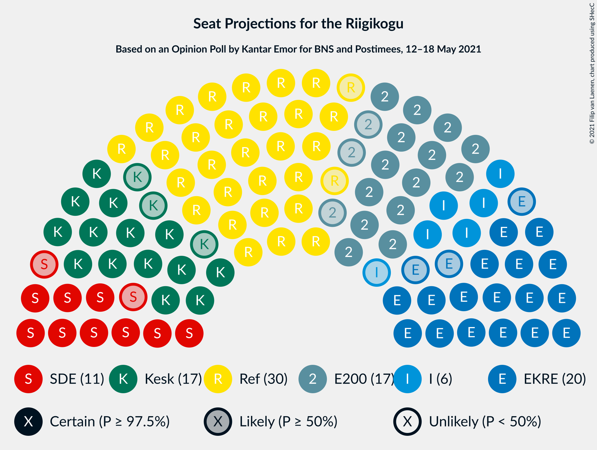

### Confidence Intervals

| Party | Last Result | Median | 80% Confidence Interval | 90% Confidence Interval | 95% Confidence Interval | 99% Confidence Interval |
|:-----:|:-----------:|:------:|:-----------------------:|:-----------------------:|:-----------------------:|:-----------------------:|
| <a href="#eesti-reformierakond">Eesti Reformierakond</a> | 34 | 30 | 29–33 |28–34 |28–35 |27–36 |
| <a href="#eesti-konservatiivne-rahvaerakond">Eesti Konservatiivne Rahvaerakond</a> | 19 | 20 | 18–22 |18–23 |17–23 |16–24 |
| <a href="#eesti-keskerakond">Eesti Keskerakond</a> | 26 | 17 | 15–18 |14–19 |14–19 |13–20 |
| <a href="#eesti-200">Eesti 200</a> | 0 | 17 | 15–18 |14–19 |14–19 |13–20 |
| <a href="#sotsiaaldemokraatlik-erakond">Sotsiaaldemokraatlik Erakond</a> | 10 | 11 | 9–12 |9–12 |9–13 |8–14 |
| <a href="#erakond-isamaa">Erakond Isamaa</a> | 12 | 6 | 5–7 |5–8 |5–8 |4–9 |
| <a href="#erakond-eestimaa-rohelised">Erakond Eestimaa Rohelised</a> | 0 | 0 | 0 |0 |0 |0 |

### Eesti Reformierakond

*For a full overview of the results for this party, see the [Eesti Reformierakond](party-eestireformierakond.html) page.*

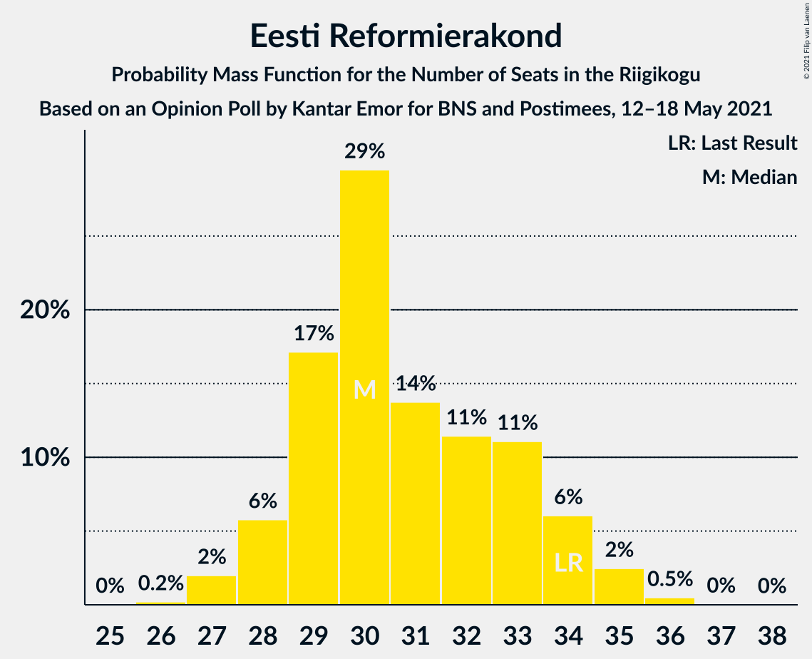

| Number of Seats | Probability | Accumulated | Special Marks |
|:---------------:|:-----------:|:-----------:|:-------------:|
| 26 | 0.2% | 100% |  |
| 27 | 2% | 99.8% |  |
| 28 | 6% | 98% |  |
| 29 | 17% | 92% |  |
| 30 | 29% | 75% | Median |
| 31 | 14% | 45% |  |
| 32 | 11% | 32% |  |
| 33 | 11% | 20% |  |
| 34 | 6% | 9% | Last Result |
| 35 | 2% | 3% |  |
| 36 | 0.5% | 0.6% |  |
| 37 | 0% | 0.1% |  |
| 38 | 0% | 0% |  |

### Eesti Konservatiivne Rahvaerakond

*For a full overview of the results for this party, see the [Eesti Konservatiivne Rahvaerakond](party-eestikonservatiivnerahvaerakond.html) page.*

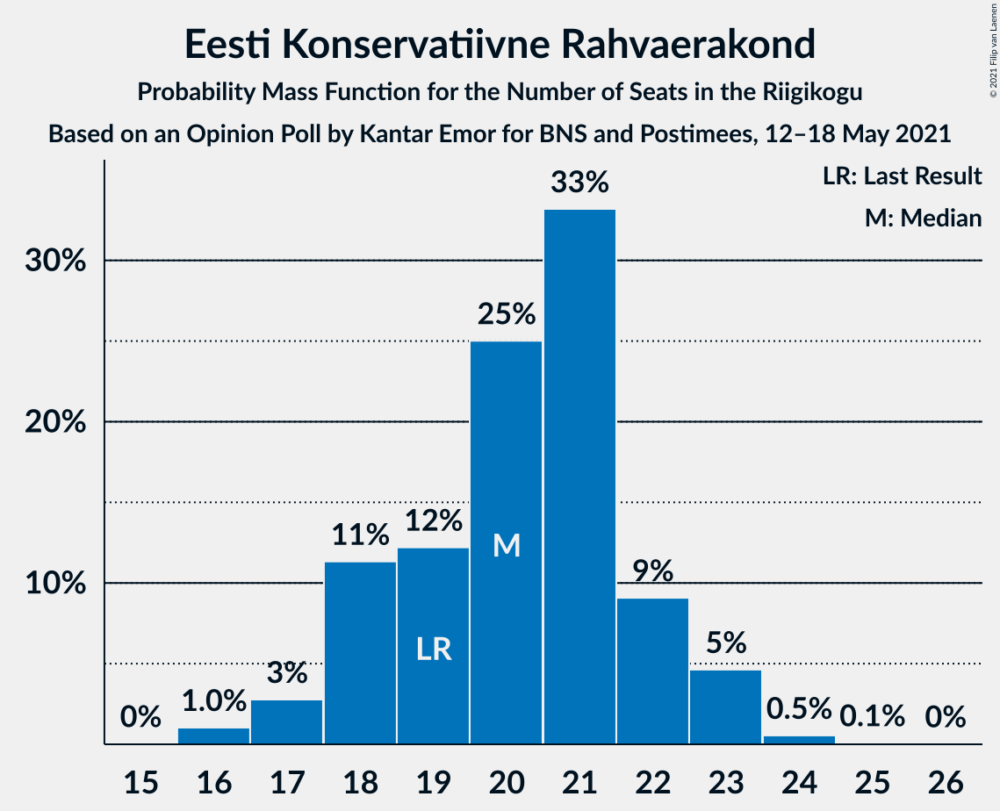

| Number of Seats | Probability | Accumulated | Special Marks |
|:---------------:|:-----------:|:-----------:|:-------------:|
| 16 | 1.0% | 100% |  |
| 17 | 3% | 98.9% |  |
| 18 | 11% | 96% |  |
| 19 | 12% | 85% | Last Result |
| 20 | 25% | 73% | Median |
| 21 | 33% | 48% |  |
| 22 | 9% | 14% |  |
| 23 | 5% | 5% |  |
| 24 | 0.5% | 0.7% |  |
| 25 | 0.1% | 0.1% |  |
| 26 | 0% | 0% |  |

### Eesti Keskerakond

*For a full overview of the results for this party, see the [Eesti Keskerakond](party-eestikeskerakond.html) page.*

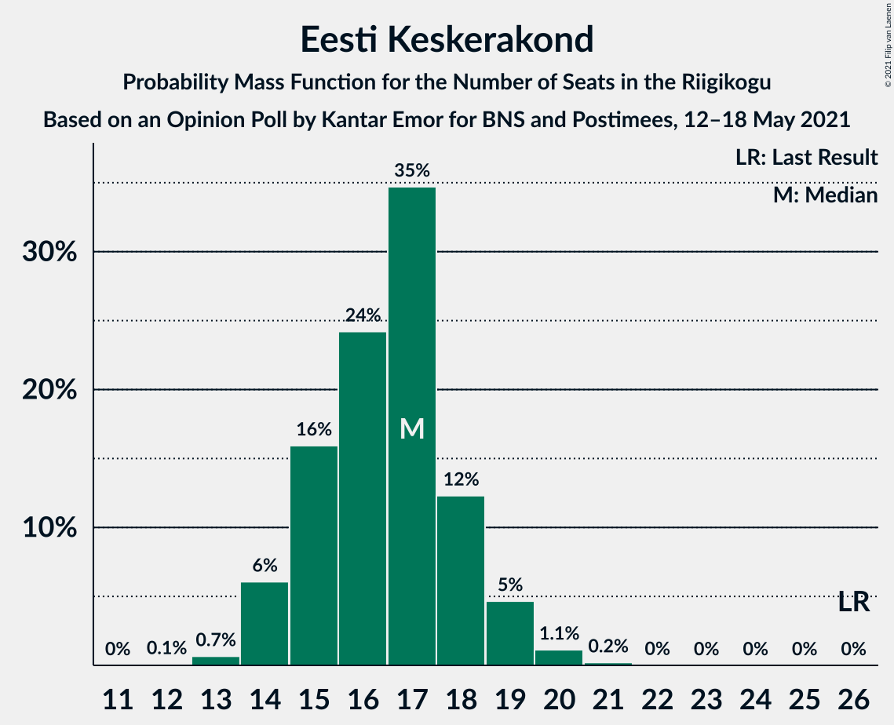

| Number of Seats | Probability | Accumulated | Special Marks |
|:---------------:|:-----------:|:-----------:|:-------------:|
| 12 | 0.1% | 100% |  |
| 13 | 0.7% | 99.9% |  |
| 14 | 6% | 99.3% |  |
| 15 | 16% | 93% |  |
| 16 | 24% | 77% |  |
| 17 | 35% | 53% | Median |
| 18 | 12% | 18% |  |
| 19 | 5% | 6% |  |
| 20 | 1.1% | 1.4% |  |
| 21 | 0.2% | 0.2% |  |
| 22 | 0% | 0% |  |
| 23 | 0% | 0% |  |
| 24 | 0% | 0% |  |
| 25 | 0% | 0% |  |
| 26 | 0% | 0% | Last Result |

### Eesti 200

*For a full overview of the results for this party, see the [Eesti 200](party-eesti200.html) page.*

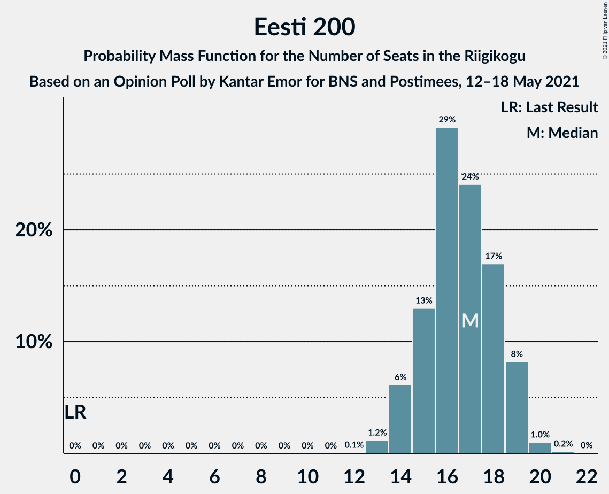

| Number of Seats | Probability | Accumulated | Special Marks |
|:---------------:|:-----------:|:-----------:|:-------------:|
| 0 | 0% | 100% | Last Result |
| 1 | 0% | 100% |  |
| 2 | 0% | 100% |  |
| 3 | 0% | 100% |  |
| 4 | 0% | 100% |  |
| 5 | 0% | 100% |  |
| 6 | 0% | 100% |  |
| 7 | 0% | 100% |  |
| 8 | 0% | 100% |  |
| 9 | 0% | 100% |  |
| 10 | 0% | 100% |  |
| 11 | 0% | 100% |  |
| 12 | 0.1% | 100% |  |
| 13 | 1.2% | 99.9% |  |
| 14 | 6% | 98.8% |  |
| 15 | 13% | 93% |  |
| 16 | 29% | 80% |  |
| 17 | 24% | 50% | Median |
| 18 | 17% | 26% |  |
| 19 | 8% | 9% |  |
| 20 | 1.0% | 1.2% |  |
| 21 | 0.2% | 0.2% |  |
| 22 | 0% | 0% |  |

### Sotsiaaldemokraatlik Erakond

*For a full overview of the results for this party, see the [Sotsiaaldemokraatlik Erakond](party-sotsiaaldemokraatlikerakond.html) page.*

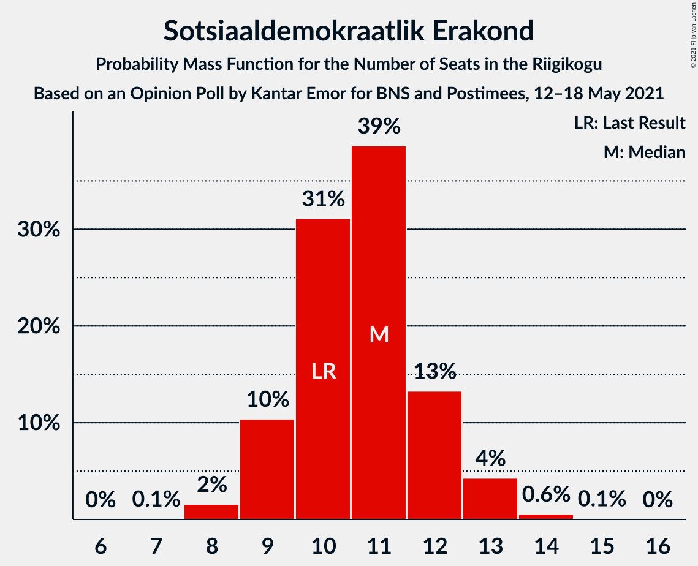

| Number of Seats | Probability | Accumulated | Special Marks |
|:---------------:|:-----------:|:-----------:|:-------------:|
| 7 | 0.1% | 100% |  |
| 8 | 2% | 99.9% |  |
| 9 | 10% | 98% |  |
| 10 | 31% | 88% | Last Result |
| 11 | 39% | 57% | Median |
| 12 | 13% | 18% |  |
| 13 | 4% | 5% |  |
| 14 | 0.6% | 0.7% |  |
| 15 | 0.1% | 0.1% |  |
| 16 | 0% | 0% |  |

### Erakond Isamaa

*For a full overview of the results for this party, see the [Erakond Isamaa](party-erakondisamaa.html) page.*

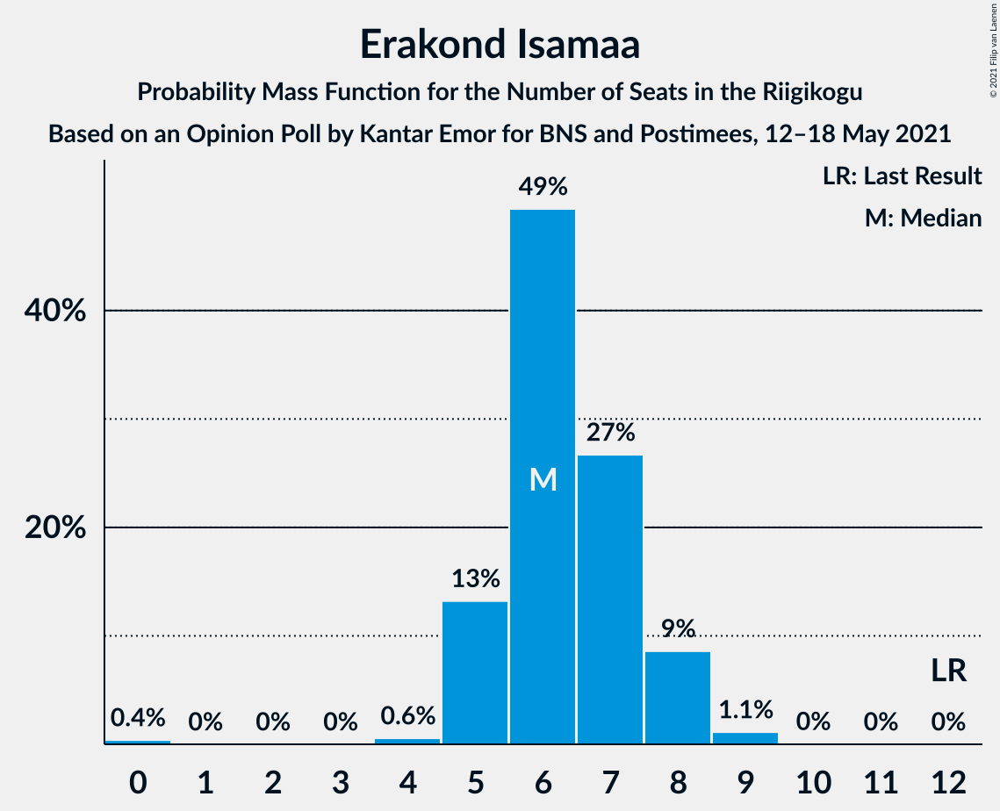

| Number of Seats | Probability | Accumulated | Special Marks |
|:---------------:|:-----------:|:-----------:|:-------------:|
| 0 | 0.4% | 100% |  |
| 1 | 0% | 99.6% |  |
| 2 | 0% | 99.6% |  |
| 3 | 0% | 99.6% |  |
| 4 | 0.6% | 99.6% |  |
| 5 | 13% | 99.0% |  |
| 6 | 49% | 86% | Median |
| 7 | 27% | 36% |  |
| 8 | 9% | 10% |  |
| 9 | 1.1% | 1.2% |  |
| 10 | 0% | 0% |  |
| 11 | 0% | 0% |  |
| 12 | 0% | 0% | Last Result |

### Erakond Eestimaa Rohelised

*For a full overview of the results for this party, see the [Erakond Eestimaa Rohelised](party-erakondeestimaarohelised.html) page.*

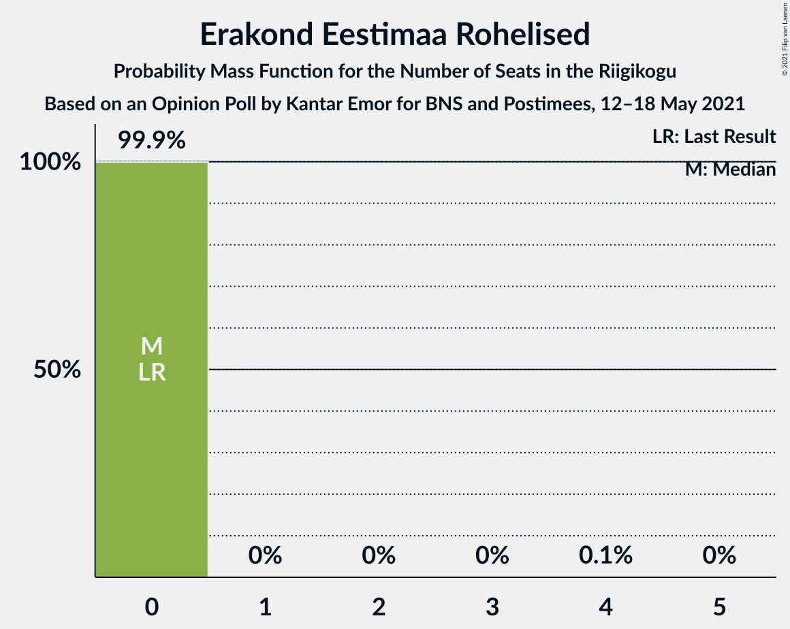

| Number of Seats | Probability | Accumulated | Special Marks |
|:---------------:|:-----------:|:-----------:|:-------------:|
| 0 | 99.9% | 100% | Last Result, Median |
| 1 | 0% | 0.1% |  |
| 2 | 0% | 0.1% |  |
| 3 | 0% | 0.1% |  |
| 4 | 0.1% | 0.1% |  |
| 5 | 0% | 0% |  |

## Coalitions

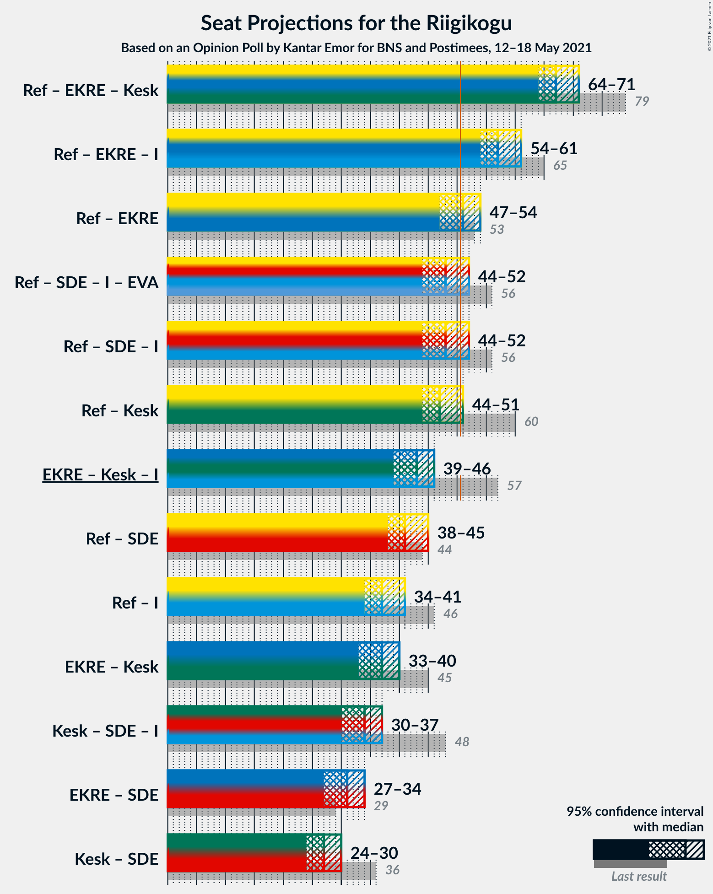

### Confidence Intervals

| Coalition | Last Result | Median | Majority? | 80% Confidence Interval | 90% Confidence Interval | 95% Confidence Interval | 99% Confidence Interval |
|:---------:|:-----------:|:------:|:---------:|:-----------------------:|:-----------------------:|:-----------------------:|:-----------------------:|
| Eesti Reformierakond – Eesti Konservatiivne Rahvaerakond – Eesti Keskerakond | 79 | 67 | 100% | 65–70 | 65–70 | 64–71 | 63–72 |
| Eesti Reformierakond – Eesti Konservatiivne Rahvaerakond – Erakond Isamaa | 65 | 57 | 100% | 55–59 | 55–61 | 54–61 | 52–62 |
| Eesti Reformierakond – Eesti Konservatiivne Rahvaerakond | 53 | 51 | 59% | 49–53 | 48–54 | 47–54 | 46–56 |
| Eesti Reformierakond – Sotsiaaldemokraatlik Erakond – Erakond Isamaa | 56 | 48 | 8% | 45–50 | 45–51 | 44–52 | 43–53 |
| Eesti Reformierakond – Eesti Keskerakond | 60 | 47 | 6% | 45–50 | 45–51 | 44–51 | 43–52 |
| Eesti Konservatiivne Rahvaerakond – Eesti Keskerakond – Erakond Isamaa | 57 | 43 | 0% | 40–45 | 40–46 | 39–46 | 38–48 |
| Eesti Reformierakond – Sotsiaaldemokraatlik Erakond | 44 | 41 | 0% | 39–44 | 38–45 | 38–45 | 37–47 |
| Eesti Reformierakond – Erakond Isamaa | 46 | 37 | 0% | 35–40 | 34–40 | 34–41 | 32–42 |
| Eesti Konservatiivne Rahvaerakond – Eesti Keskerakond | 45 | 37 | 0% | 34–39 | 34–40 | 33–40 | 32–41 |
| Eesti Keskerakond – Sotsiaaldemokraatlik Erakond – Erakond Isamaa | 48 | 34 | 0% | 31–35 | 31–36 | 30–37 | 29–38 |
| Eesti Konservatiivne Rahvaerakond – Sotsiaaldemokraatlik Erakond | 29 | 31 | 0% | 29–33 | 28–33 | 27–34 | 26–35 |
| Eesti Keskerakond – Sotsiaaldemokraatlik Erakond | 36 | 27 | 0% | 25–29 | 24–30 | 24–30 | 23–32 |

### Eesti Reformierakond – Eesti Konservatiivne Rahvaerakond – Eesti Keskerakond

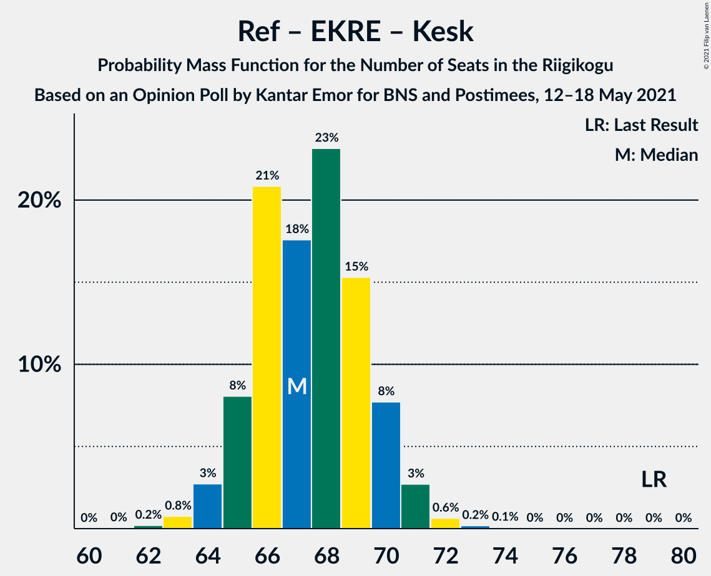

| Number of Seats | Probability | Accumulated | Special Marks |
|:---------------:|:-----------:|:-----------:|:-------------:|
| 62 | 0.2% | 100% |  |
| 63 | 0.8% | 99.8% |  |
| 64 | 3% | 99.0% |  |
| 65 | 8% | 96% |  |
| 66 | 21% | 88% |  |
| 67 | 18% | 67% | Median |
| 68 | 23% | 50% |  |
| 69 | 15% | 27% |  |
| 70 | 8% | 11% |  |
| 71 | 3% | 4% |  |
| 72 | 0.6% | 0.9% |  |
| 73 | 0.2% | 0.3% |  |
| 74 | 0.1% | 0.1% |  |
| 75 | 0% | 0% |  |
| 76 | 0% | 0% |  |
| 77 | 0% | 0% |  |
| 78 | 0% | 0% |  |
| 79 | 0% | 0% | Last Result |

### Eesti Reformierakond – Eesti Konservatiivne Rahvaerakond – Erakond Isamaa

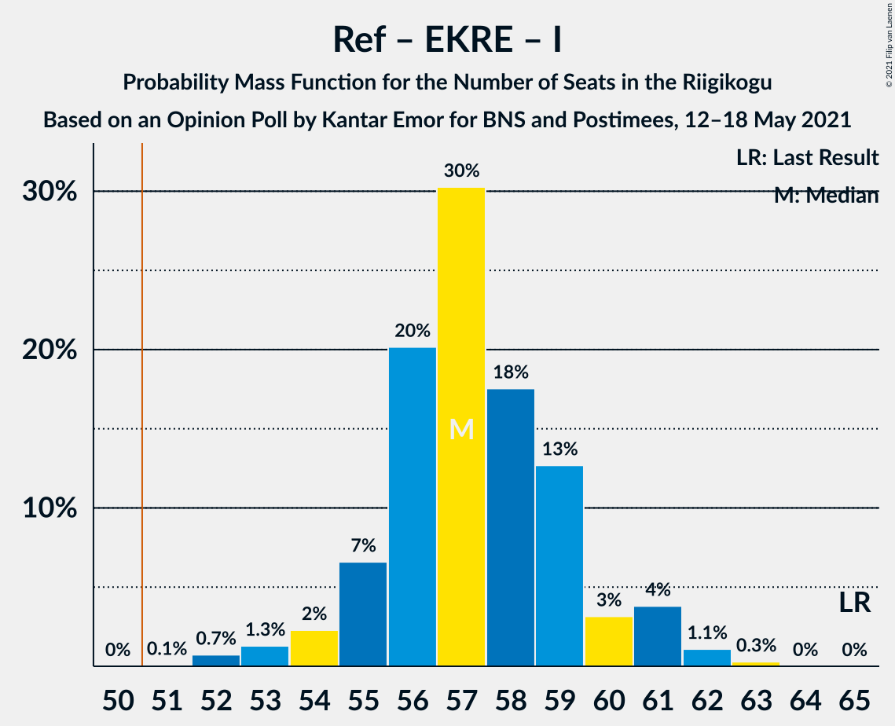

| Number of Seats | Probability | Accumulated | Special Marks |
|:---------------:|:-----------:|:-----------:|:-------------:|
| 51 | 0.1% | 100% | Majority |
| 52 | 0.7% | 99.9% |  |
| 53 | 1.3% | 99.2% |  |
| 54 | 2% | 98% |  |
| 55 | 7% | 96% |  |
| 56 | 20% | 89% | Median |
| 57 | 30% | 69% |  |
| 58 | 18% | 39% |  |
| 59 | 13% | 21% |  |
| 60 | 3% | 8% |  |
| 61 | 4% | 5% |  |
| 62 | 1.1% | 1.4% |  |
| 63 | 0.3% | 0.3% |  |
| 64 | 0% | 0% |  |
| 65 | 0% | 0% | Last Result |

### Eesti Reformierakond – Eesti Konservatiivne Rahvaerakond

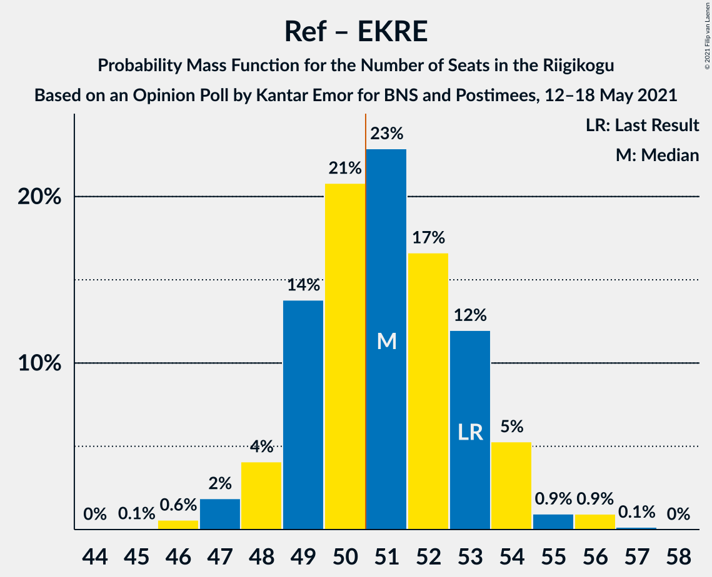

| Number of Seats | Probability | Accumulated | Special Marks |
|:---------------:|:-----------:|:-----------:|:-------------:|
| 45 | 0.1% | 100% |  |
| 46 | 0.6% | 99.9% |  |
| 47 | 2% | 99.3% |  |
| 48 | 4% | 97% |  |
| 49 | 14% | 93% |  |
| 50 | 21% | 80% | Median |
| 51 | 23% | 59% | Majority |
| 52 | 17% | 36% |  |
| 53 | 12% | 19% | Last Result |
| 54 | 5% | 7% |  |
| 55 | 0.9% | 2% |  |
| 56 | 0.9% | 1.1% |  |
| 57 | 0.1% | 0.2% |  |
| 58 | 0% | 0% |  |

### Eesti Reformierakond – Sotsiaaldemokraatlik Erakond – Erakond Isamaa

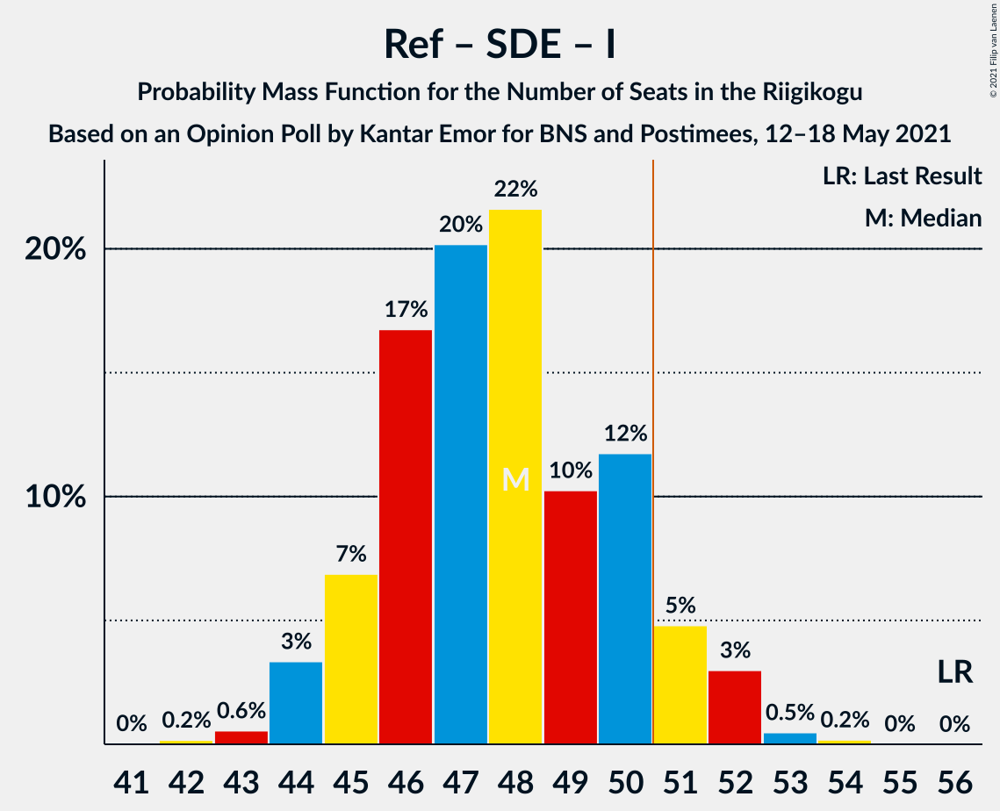

| Number of Seats | Probability | Accumulated | Special Marks |
|:---------------:|:-----------:|:-----------:|:-------------:|
| 42 | 0.2% | 100% |  |
| 43 | 0.6% | 99.8% |  |
| 44 | 3% | 99.2% |  |
| 45 | 7% | 96% |  |
| 46 | 17% | 89% |  |
| 47 | 20% | 72% | Median |
| 48 | 22% | 52% |  |
| 49 | 10% | 30% |  |
| 50 | 12% | 20% |  |
| 51 | 5% | 8% | Majority |
| 52 | 3% | 4% |  |
| 53 | 0.5% | 0.7% |  |
| 54 | 0.2% | 0.2% |  |
| 55 | 0% | 0% |  |
| 56 | 0% | 0% | Last Result |

### Eesti Reformierakond – Eesti Keskerakond

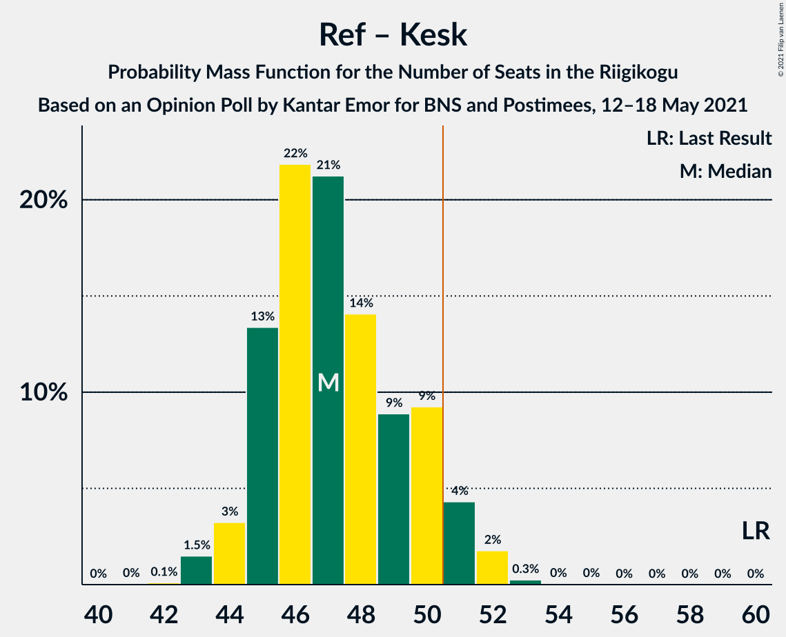

| Number of Seats | Probability | Accumulated | Special Marks |
|:---------------:|:-----------:|:-----------:|:-------------:|
| 41 | 0% | 100% |  |
| 42 | 0.1% | 99.9% |  |
| 43 | 1.5% | 99.8% |  |
| 44 | 3% | 98% |  |
| 45 | 13% | 95% |  |
| 46 | 22% | 82% |  |
| 47 | 21% | 60% | Median |
| 48 | 14% | 39% |  |
| 49 | 9% | 25% |  |
| 50 | 9% | 16% |  |
| 51 | 4% | 6% | Majority |
| 52 | 2% | 2% |  |
| 53 | 0.3% | 0.3% |  |
| 54 | 0% | 0.1% |  |
| 55 | 0% | 0% |  |
| 56 | 0% | 0% |  |
| 57 | 0% | 0% |  |
| 58 | 0% | 0% |  |
| 59 | 0% | 0% |  |
| 60 | 0% | 0% | Last Result |

### Eesti Konservatiivne Rahvaerakond – Eesti Keskerakond – Erakond Isamaa

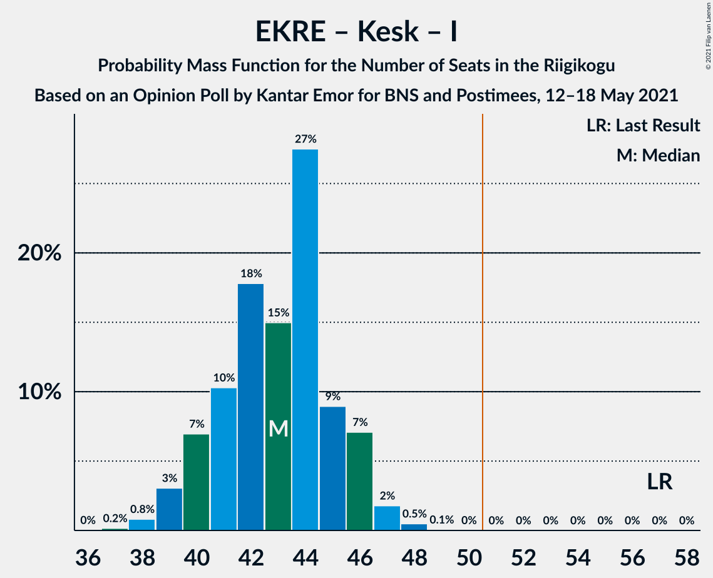

| Number of Seats | Probability | Accumulated | Special Marks |
|:---------------:|:-----------:|:-----------:|:-------------:|
| 37 | 0.2% | 100% |  |
| 38 | 0.8% | 99.8% |  |
| 39 | 3% | 99.0% |  |
| 40 | 7% | 96% |  |
| 41 | 10% | 89% |  |
| 42 | 18% | 79% |  |
| 43 | 15% | 61% | Median |
| 44 | 27% | 46% |  |
| 45 | 9% | 18% |  |
| 46 | 7% | 9% |  |
| 47 | 2% | 2% |  |
| 48 | 0.5% | 0.6% |  |
| 49 | 0.1% | 0.1% |  |
| 50 | 0% | 0% |  |
| 51 | 0% | 0% | Majority |
| 52 | 0% | 0% |  |
| 53 | 0% | 0% |  |
| 54 | 0% | 0% |  |
| 55 | 0% | 0% |  |
| 56 | 0% | 0% |  |
| 57 | 0% | 0% | Last Result |

### Eesti Reformierakond – Sotsiaaldemokraatlik Erakond

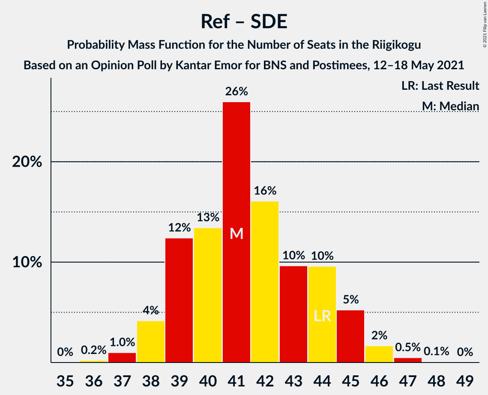

| Number of Seats | Probability | Accumulated | Special Marks |
|:---------------:|:-----------:|:-----------:|:-------------:|
| 36 | 0.2% | 100% |  |
| 37 | 1.0% | 99.8% |  |
| 38 | 4% | 98.8% |  |
| 39 | 12% | 95% |  |
| 40 | 13% | 82% |  |
| 41 | 26% | 69% | Median |
| 42 | 16% | 43% |  |
| 43 | 10% | 27% |  |
| 44 | 10% | 17% | Last Result |
| 45 | 5% | 7% |  |
| 46 | 2% | 2% |  |
| 47 | 0.5% | 0.6% |  |
| 48 | 0.1% | 0.1% |  |
| 49 | 0% | 0% |  |

### Eesti Reformierakond – Erakond Isamaa

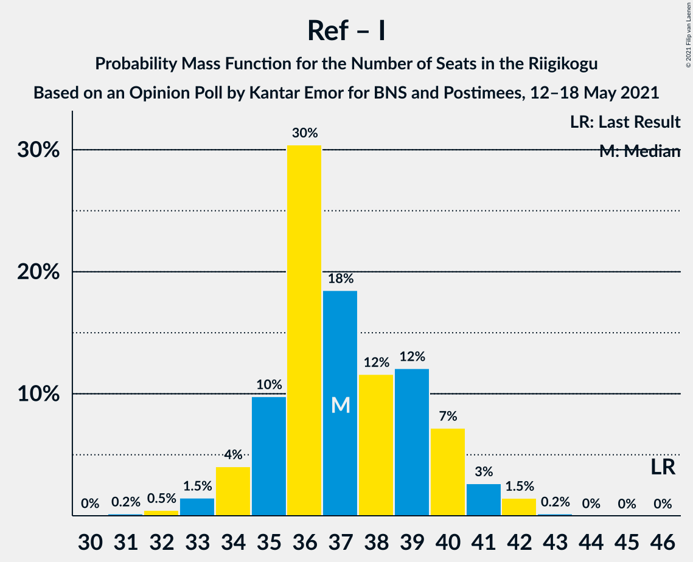

| Number of Seats | Probability | Accumulated | Special Marks |
|:---------------:|:-----------:|:-----------:|:-------------:|
| 31 | 0.2% | 100% |  |
| 32 | 0.5% | 99.8% |  |
| 33 | 1.5% | 99.3% |  |
| 34 | 4% | 98% |  |
| 35 | 10% | 94% |  |
| 36 | 30% | 84% | Median |
| 37 | 18% | 54% |  |
| 38 | 12% | 35% |  |
| 39 | 12% | 24% |  |
| 40 | 7% | 11% |  |
| 41 | 3% | 4% |  |
| 42 | 1.5% | 2% |  |
| 43 | 0.2% | 0.2% |  |
| 44 | 0% | 0% |  |
| 45 | 0% | 0% |  |
| 46 | 0% | 0% | Last Result |

### Eesti Konservatiivne Rahvaerakond – Eesti Keskerakond

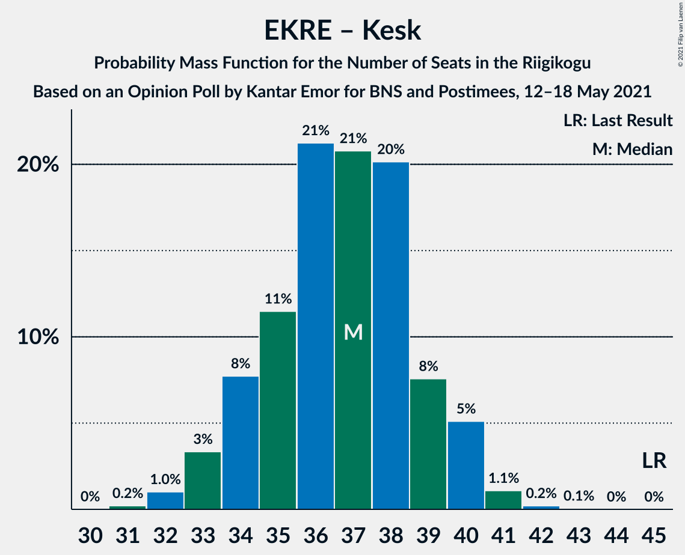

| Number of Seats | Probability | Accumulated | Special Marks |
|:---------------:|:-----------:|:-----------:|:-------------:|
| 31 | 0.2% | 100% |  |
| 32 | 1.0% | 99.8% |  |
| 33 | 3% | 98.8% |  |
| 34 | 8% | 95% |  |
| 35 | 11% | 88% |  |
| 36 | 21% | 76% |  |
| 37 | 21% | 55% | Median |
| 38 | 20% | 34% |  |
| 39 | 8% | 14% |  |
| 40 | 5% | 6% |  |
| 41 | 1.1% | 1.4% |  |
| 42 | 0.2% | 0.3% |  |
| 43 | 0.1% | 0.1% |  |
| 44 | 0% | 0% |  |
| 45 | 0% | 0% | Last Result |

### Eesti Keskerakond – Sotsiaaldemokraatlik Erakond – Erakond Isamaa

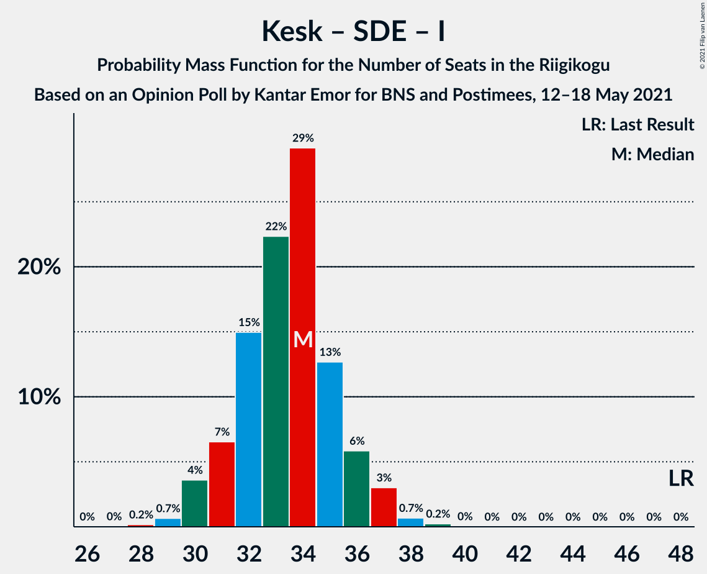

| Number of Seats | Probability | Accumulated | Special Marks |
|:---------------:|:-----------:|:-----------:|:-------------:|
| 27 | 0% | 100% |  |
| 28 | 0.2% | 99.9% |  |
| 29 | 0.7% | 99.8% |  |
| 30 | 4% | 99.1% |  |
| 31 | 7% | 96% |  |
| 32 | 15% | 89% |  |
| 33 | 22% | 74% |  |
| 34 | 29% | 52% | Median |
| 35 | 13% | 22% |  |
| 36 | 6% | 10% |  |
| 37 | 3% | 4% |  |
| 38 | 0.7% | 1.0% |  |
| 39 | 0.2% | 0.3% |  |
| 40 | 0% | 0% |  |
| 41 | 0% | 0% |  |
| 42 | 0% | 0% |  |
| 43 | 0% | 0% |  |
| 44 | 0% | 0% |  |
| 45 | 0% | 0% |  |
| 46 | 0% | 0% |  |
| 47 | 0% | 0% |  |
| 48 | 0% | 0% | Last Result |

### Eesti Konservatiivne Rahvaerakond – Sotsiaaldemokraatlik Erakond

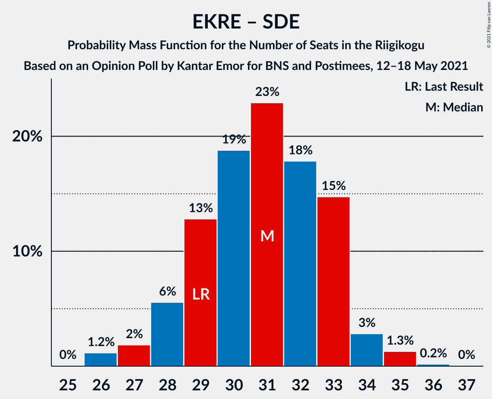

| Number of Seats | Probability | Accumulated | Special Marks |
|:---------------:|:-----------:|:-----------:|:-------------:|
| 26 | 1.2% | 100% |  |
| 27 | 2% | 98.8% |  |
| 28 | 6% | 97% |  |
| 29 | 13% | 91% | Last Result |
| 30 | 19% | 79% |  |
| 31 | 23% | 60% | Median |
| 32 | 18% | 37% |  |
| 33 | 15% | 19% |  |
| 34 | 3% | 4% |  |
| 35 | 1.3% | 2% |  |
| 36 | 0.2% | 0.2% |  |
| 37 | 0% | 0% |  |

### Eesti Keskerakond – Sotsiaaldemokraatlik Erakond

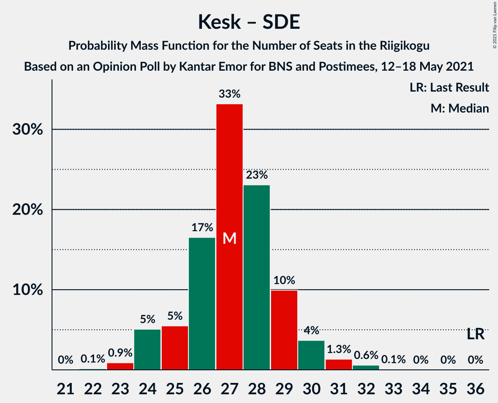

| Number of Seats | Probability | Accumulated | Special Marks |
|:---------------:|:-----------:|:-----------:|:-------------:|
| 22 | 0.1% | 100% |  |
| 23 | 0.9% | 99.9% |  |
| 24 | 5% | 99.0% |  |
| 25 | 5% | 94% |  |
| 26 | 17% | 88% |  |
| 27 | 33% | 72% |  |
| 28 | 23% | 39% | Median |
| 29 | 10% | 16% |  |
| 30 | 4% | 6% |  |
| 31 | 1.3% | 2% |  |
| 32 | 0.6% | 0.7% |  |
| 33 | 0.1% | 0.1% |  |
| 34 | 0% | 0% |  |
| 35 | 0% | 0% |  |
| 36 | 0% | 0% | Last Result |

## Technical Information

### Opinion Poll

+ **Polling firm:** Kantar Emor
+ **Commissioner(s):** BNS and Postimees
+ **Fieldwork period:** 12–18 May 2021

### Calculations

+ **Sample size:** 1050
+ **Simulations done:** 131,072
+ **Error estimate:** 1.65%

