# Opinion Poll by Norstat for MTÜ Ühiskonnauuringute Instituut, 19–25 May 2021

<a href="#voting-intentions">Voting Intentions</a> | <a href="#seats">Seats</a> | <a href="#coalitions">Coalitions</a> | <a href="#technical-information">Technical Information</a>

## Voting Intentions

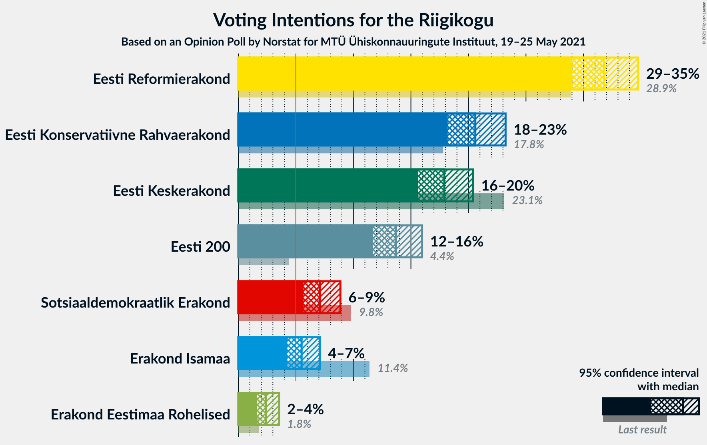

### Confidence Intervals

| Party | Last Result | Poll Result | 80% Confidence Interval | 90% Confidence Interval | 95% Confidence Interval | 99% Confidence Interval |
|:-----:|:-----------:|:-----------:|:-----------------------:|:-----------------------:|:-----------------------:|:-----------------------:|
| Eesti Reformierakond | 28.9% | 31.8% | 29.9–33.7% |29.4–34.3% |29.0–34.8% |28.1–35.7% |
| Eesti Konservatiivne Rahvaerakond | 17.8% | 20.6% | 19.0–22.3% |18.6–22.8% |18.2–23.2% |17.5–24.1% |
| Eesti Keskerakond | 23.1% | 17.9% | 16.4–19.5% |16.0–20.0% |15.6–20.4% |15.0–21.2% |
| Eesti 200 | 4.4% | 13.7% | 12.4–15.2% |12.0–15.6% |11.7–16.0% |11.1–16.7% |
| Sotsiaaldemokraatlik Erakond | 9.8% | 7.1% | 6.2–8.3% |5.9–8.6% |5.7–8.9% |5.2–9.4% |
| Erakond Isamaa | 11.4% | 5.5% | 4.7–6.5% |4.4–6.8% |4.3–7.1% |3.9–7.6% |
| Erakond Eestimaa Rohelised | 1.8% | 2.4% | 1.9–3.2% |1.7–3.4% |1.6–3.6% |1.4–3.9% |

*Note:* The poll result column reflects the actual value used in the calculations. Published results may vary slightly, and in addition be rounded to fewer digits.

## Seats

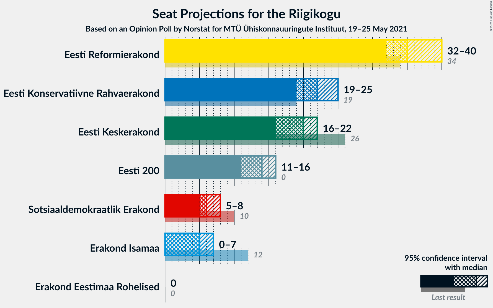

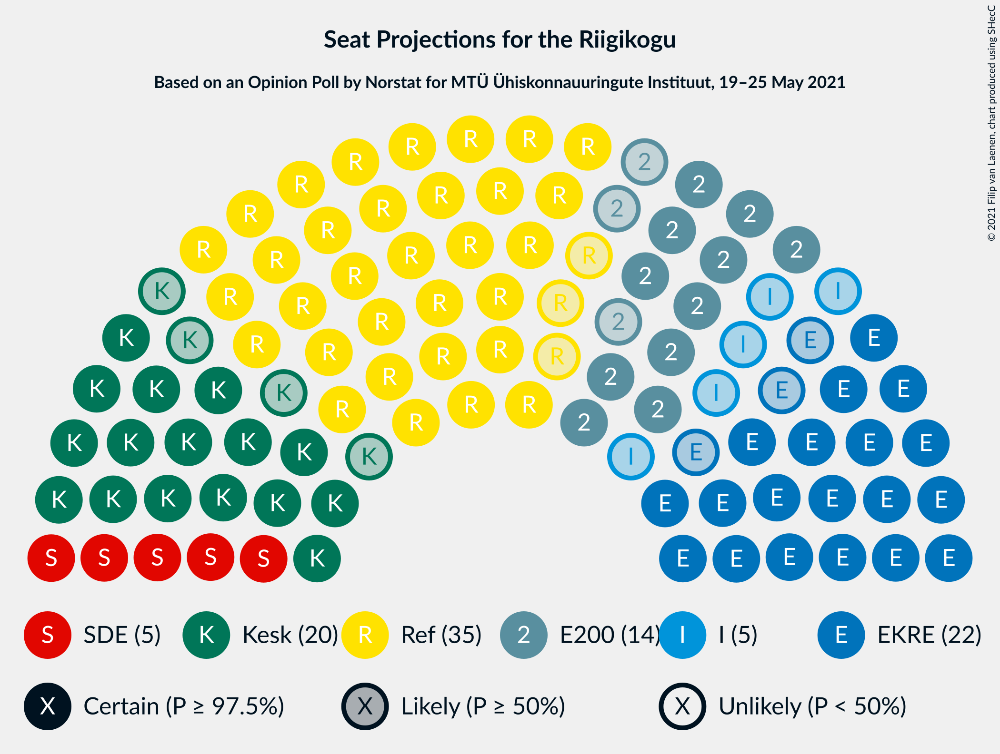

### Confidence Intervals

| Party | Last Result | Median | 80% Confidence Interval | 90% Confidence Interval | 95% Confidence Interval | 99% Confidence Interval |
|:-----:|:-----------:|:------:|:-----------------------:|:-----------------------:|:-----------------------:|:-----------------------:|
| <a href="#eesti-reformierakond">Eesti Reformierakond</a> | 34 | 35 | 34–39 |33–40 |32–40 |31–42 |
| <a href="#eesti-konservatiivne-rahvaerakond">Eesti Konservatiivne Rahvaerakond</a> | 19 | 22 | 20–23 |20–25 |19–25 |18–27 |
| <a href="#eesti-keskerakond">Eesti Keskerakond</a> | 26 | 20 | 17–21 |17–22 |16–22 |15–23 |
| <a href="#eesti-200">Eesti 200</a> | 0 | 14 | 12–16 |12–16 |11–16 |11–17 |
| <a href="#sotsiaaldemokraatlik-erakond">Sotsiaaldemokraatlik Erakond</a> | 10 | 6 | 5–7 |5–8 |5–8 |4–9 |
| <a href="#erakond-isamaa">Erakond Isamaa</a> | 12 | 5 | 0–6 |0–6 |0–7 |0–7 |
| <a href="#erakond-eestimaa-rohelised">Erakond Eestimaa Rohelised</a> | 0 | 0 | 0 |0 |0 |0 |

### Eesti Reformierakond

*For a full overview of the results for this party, see the [Eesti Reformierakond](party-eestireformierakond.html) page.*

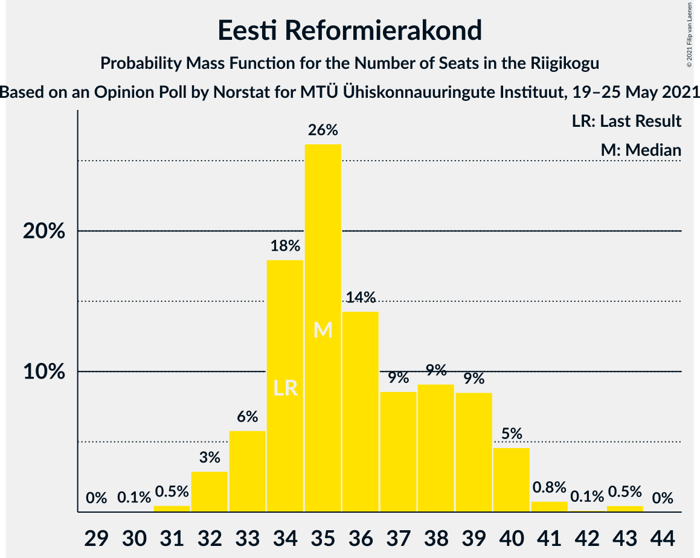

| Number of Seats | Probability | Accumulated | Special Marks |
|:---------------:|:-----------:|:-----------:|:-------------:|
| 30 | 0.1% | 100% |  |
| 31 | 0.5% | 99.9% |  |
| 32 | 3% | 99.4% |  |
| 33 | 6% | 97% |  |
| 34 | 18% | 91% | Last Result |
| 35 | 26% | 73% | Median |
| 36 | 14% | 47% |  |
| 37 | 9% | 32% |  |
| 38 | 9% | 24% |  |
| 39 | 9% | 15% |  |
| 40 | 5% | 6% |  |
| 41 | 0.8% | 1.4% |  |
| 42 | 0.1% | 0.6% |  |
| 43 | 0.5% | 0.5% |  |
| 44 | 0% | 0% |  |

### Eesti Konservatiivne Rahvaerakond

*For a full overview of the results for this party, see the [Eesti Konservatiivne Rahvaerakond](party-eestikonservatiivnerahvaerakond.html) page.*

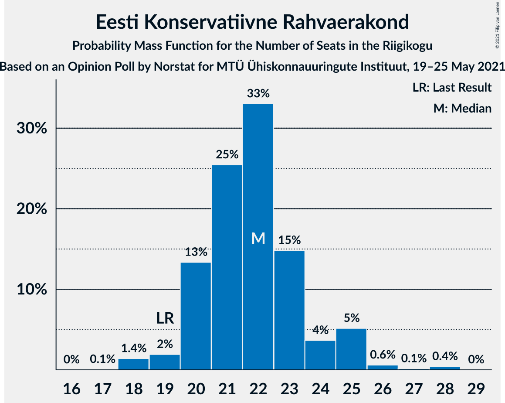

| Number of Seats | Probability | Accumulated | Special Marks |
|:---------------:|:-----------:|:-----------:|:-------------:|
| 17 | 0.1% | 100% |  |
| 18 | 1.4% | 99.9% |  |
| 19 | 2% | 98.5% | Last Result |
| 20 | 13% | 97% |  |
| 21 | 25% | 83% |  |
| 22 | 33% | 58% | Median |
| 23 | 15% | 25% |  |
| 24 | 4% | 10% |  |
| 25 | 5% | 6% |  |
| 26 | 0.6% | 1.2% |  |
| 27 | 0.1% | 0.6% |  |
| 28 | 0.4% | 0.4% |  |
| 29 | 0% | 0% |  |

### Eesti Keskerakond

*For a full overview of the results for this party, see the [Eesti Keskerakond](party-eestikeskerakond.html) page.*

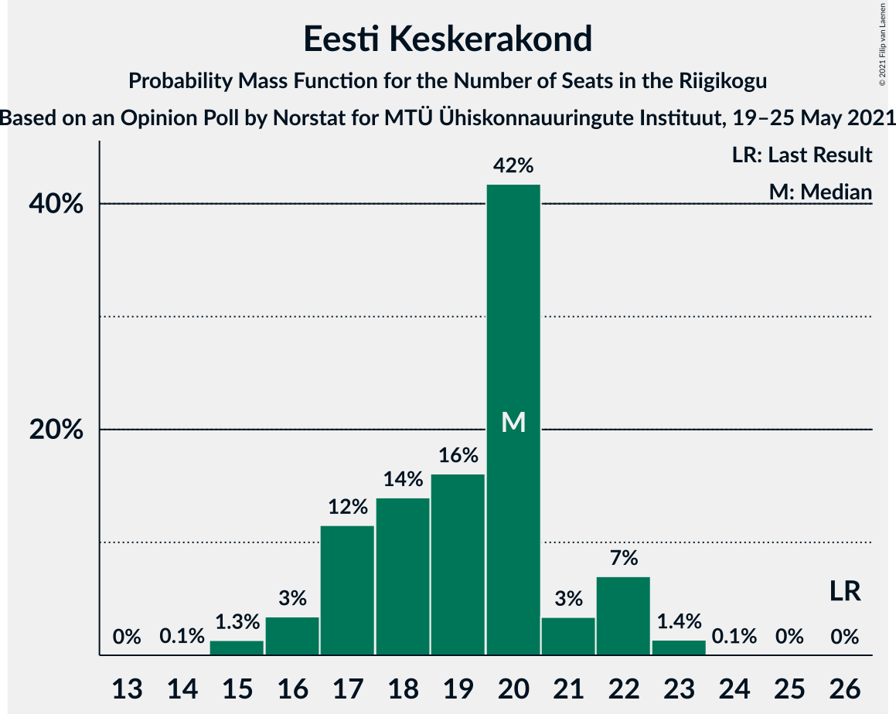

| Number of Seats | Probability | Accumulated | Special Marks |
|:---------------:|:-----------:|:-----------:|:-------------:|
| 14 | 0.1% | 100% |  |
| 15 | 1.3% | 99.9% |  |
| 16 | 3% | 98.6% |  |
| 17 | 12% | 95% |  |
| 18 | 14% | 84% |  |
| 19 | 16% | 70% |  |
| 20 | 42% | 54% | Median |
| 21 | 3% | 12% |  |
| 22 | 7% | 8% |  |
| 23 | 1.4% | 1.5% |  |
| 24 | 0.1% | 0.1% |  |
| 25 | 0% | 0% |  |
| 26 | 0% | 0% | Last Result |

### Eesti 200

*For a full overview of the results for this party, see the [Eesti 200](party-eesti200.html) page.*

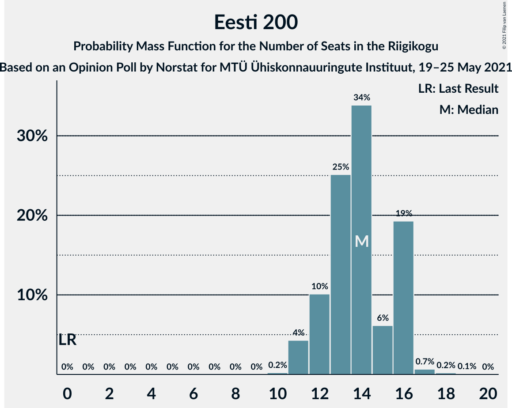

| Number of Seats | Probability | Accumulated | Special Marks |
|:---------------:|:-----------:|:-----------:|:-------------:|
| 0 | 0% | 100% | Last Result |
| 1 | 0% | 100% |  |
| 2 | 0% | 100% |  |
| 3 | 0% | 100% |  |
| 4 | 0% | 100% |  |
| 5 | 0% | 100% |  |
| 6 | 0% | 100% |  |
| 7 | 0% | 100% |  |
| 8 | 0% | 100% |  |
| 9 | 0% | 100% |  |
| 10 | 0.2% | 100% |  |
| 11 | 4% | 99.8% |  |
| 12 | 10% | 95% |  |
| 13 | 25% | 85% |  |
| 14 | 34% | 60% | Median |
| 15 | 6% | 26% |  |
| 16 | 19% | 20% |  |
| 17 | 0.7% | 0.9% |  |
| 18 | 0.2% | 0.3% |  |
| 19 | 0.1% | 0.1% |  |
| 20 | 0% | 0% |  |

### Sotsiaaldemokraatlik Erakond

*For a full overview of the results for this party, see the [Sotsiaaldemokraatlik Erakond](party-sotsiaaldemokraatlikerakond.html) page.*

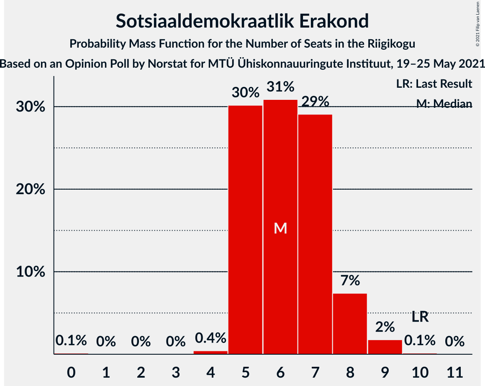

| Number of Seats | Probability | Accumulated | Special Marks |
|:---------------:|:-----------:|:-----------:|:-------------:|
| 0 | 0.1% | 100% |  |
| 1 | 0% | 99.9% |  |
| 2 | 0% | 99.9% |  |
| 3 | 0% | 99.9% |  |
| 4 | 0.4% | 99.9% |  |
| 5 | 30% | 99.4% |  |
| 6 | 31% | 69% | Median |
| 7 | 29% | 38% |  |
| 8 | 7% | 9% |  |
| 9 | 2% | 2% |  |
| 10 | 0.1% | 0.1% | Last Result |
| 11 | 0% | 0% |  |

### Erakond Isamaa

*For a full overview of the results for this party, see the [Erakond Isamaa](party-erakondisamaa.html) page.*

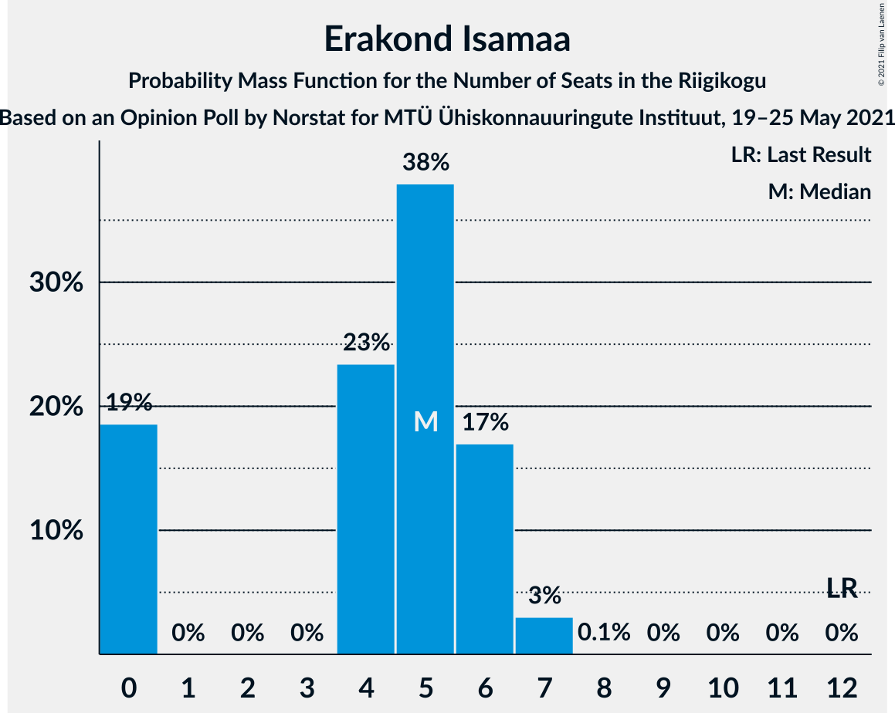

| Number of Seats | Probability | Accumulated | Special Marks |
|:---------------:|:-----------:|:-----------:|:-------------:|
| 0 | 19% | 100% |  |
| 1 | 0% | 81% |  |
| 2 | 0% | 81% |  |
| 3 | 0% | 81% |  |
| 4 | 23% | 81% |  |
| 5 | 38% | 58% | Median |
| 6 | 17% | 20% |  |
| 7 | 3% | 3% |  |
| 8 | 0.1% | 0.1% |  |
| 9 | 0% | 0% |  |
| 10 | 0% | 0% |  |
| 11 | 0% | 0% |  |
| 12 | 0% | 0% | Last Result |

### Erakond Eestimaa Rohelised

*For a full overview of the results for this party, see the [Erakond Eestimaa Rohelised](party-erakondeestimaarohelised.html) page.*

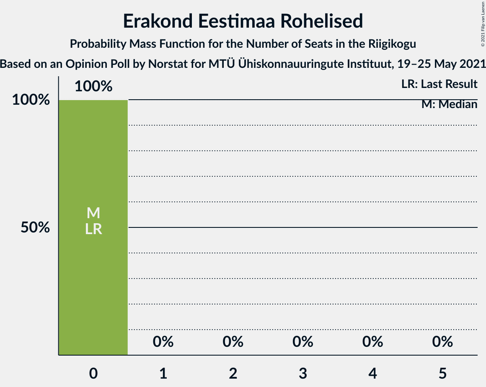

| Number of Seats | Probability | Accumulated | Special Marks |
|:---------------:|:-----------:|:-----------:|:-------------:|
| 0 | 100% | 100% | Last Result, Median |

## Coalitions

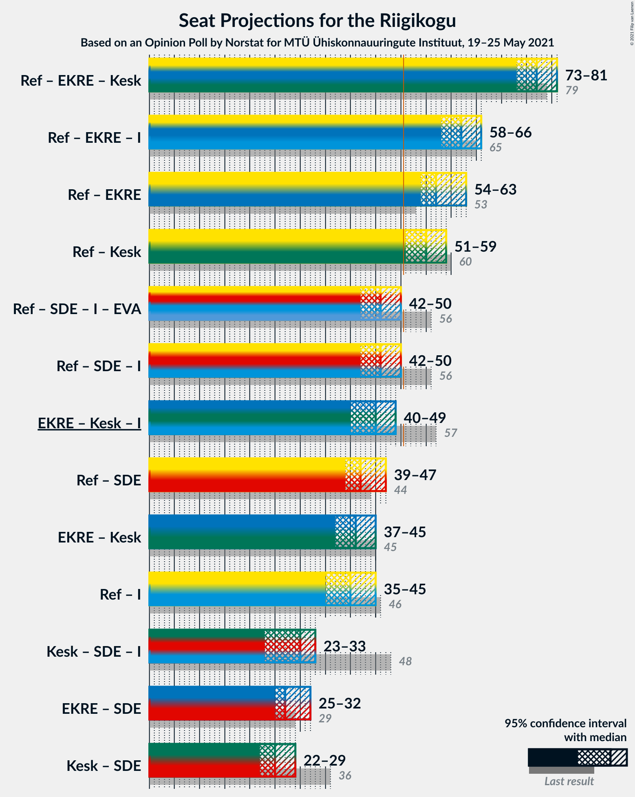

### Confidence Intervals

| Coalition | Last Result | Median | Majority? | 80% Confidence Interval | 90% Confidence Interval | 95% Confidence Interval | 99% Confidence Interval |
|:---------:|:-----------:|:------:|:---------:|:-----------------------:|:-----------------------:|:-----------------------:|:-----------------------:|
| Eesti Reformierakond – Eesti Konservatiivne Rahvaerakond – Eesti Keskerakond | 79 | 77 | 100% | 74–80 | 74–81 | 73–81 | 72–82 |
| Eesti Reformierakond – Eesti Konservatiivne Rahvaerakond – Erakond Isamaa | 65 | 62 | 100% | 58–65 | 58–66 | 58–66 | 57–66 |
| Eesti Reformierakond – Eesti Konservatiivne Rahvaerakond | 53 | 57 | 100% | 55–61 | 54–62 | 54–63 | 53–65 |
| Eesti Reformierakond – Eesti Keskerakond | 60 | 55 | 98% | 53–58 | 52–59 | 51–59 | 49–61 |
| Eesti Reformierakond – Sotsiaaldemokraatlik Erakond – Erakond Isamaa | 56 | 46 | 1.2% | 44–49 | 43–50 | 42–50 | 41–52 |
| Eesti Konservatiivne Rahvaerakond – Eesti Keskerakond – Erakond Isamaa | 57 | 45 | 0.1% | 42–47 | 41–48 | 40–49 | 39–50 |
| Eesti Reformierakond – Sotsiaaldemokraatlik Erakond | 44 | 42 | 0% | 40–46 | 39–46 | 39–47 | 37–49 |
| Eesti Konservatiivne Rahvaerakond – Eesti Keskerakond | 45 | 41 | 0% | 38–43 | 37–45 | 37–45 | 36–46 |
| Eesti Reformierakond – Erakond Isamaa | 46 | 40 | 0% | 37–43 | 36–43 | 35–45 | 34–45 |
| Eesti Keskerakond – Sotsiaaldemokraatlik Erakond – Erakond Isamaa | 48 | 30 | 0% | 27–32 | 26–33 | 23–33 | 23–34 |
| Eesti Konservatiivne Rahvaerakond – Sotsiaaldemokraatlik Erakond | 29 | 27 | 0% | 26–31 | 25–31 | 25–32 | 24–34 |
| Eesti Keskerakond – Sotsiaaldemokraatlik Erakond | 36 | 25 | 0% | 23–28 | 22–29 | 22–29 | 22–30 |

### Eesti Reformierakond – Eesti Konservatiivne Rahvaerakond – Eesti Keskerakond

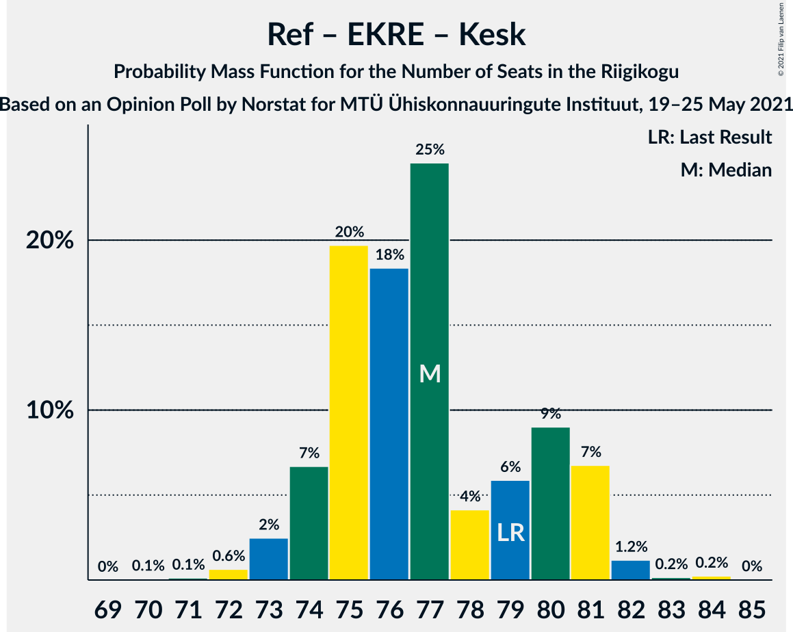

| Number of Seats | Probability | Accumulated | Special Marks |
|:---------------:|:-----------:|:-----------:|:-------------:|
| 70 | 0.1% | 100% |  |
| 71 | 0.1% | 99.9% |  |
| 72 | 0.6% | 99.8% |  |
| 73 | 2% | 99.2% |  |
| 74 | 7% | 97% |  |
| 75 | 20% | 90% |  |
| 76 | 18% | 70% |  |
| 77 | 25% | 52% | Median |
| 78 | 4% | 27% |  |
| 79 | 6% | 23% | Last Result |
| 80 | 9% | 17% |  |
| 81 | 7% | 8% |  |
| 82 | 1.2% | 2% |  |
| 83 | 0.2% | 0.4% |  |
| 84 | 0.2% | 0.3% |  |
| 85 | 0% | 0% |  |

### Eesti Reformierakond – Eesti Konservatiivne Rahvaerakond – Erakond Isamaa

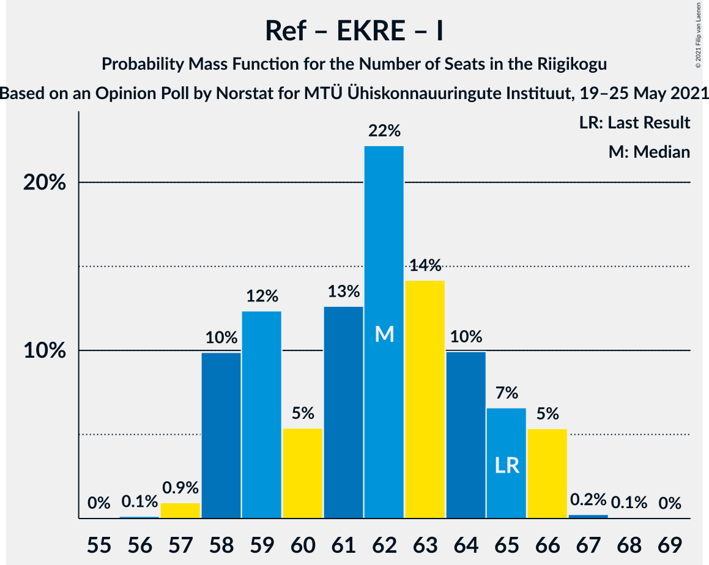

| Number of Seats | Probability | Accumulated | Special Marks |
|:---------------:|:-----------:|:-----------:|:-------------:|
| 55 | 0% | 100% |  |
| 56 | 0.1% | 99.9% |  |
| 57 | 0.9% | 99.8% |  |
| 58 | 10% | 98.8% |  |
| 59 | 12% | 89% |  |
| 60 | 5% | 77% |  |
| 61 | 13% | 71% |  |
| 62 | 22% | 59% | Median |
| 63 | 14% | 36% |  |
| 64 | 10% | 22% |  |
| 65 | 7% | 12% | Last Result |
| 66 | 5% | 6% |  |
| 67 | 0.2% | 0.3% |  |
| 68 | 0.1% | 0.1% |  |
| 69 | 0% | 0% |  |

### Eesti Reformierakond – Eesti Konservatiivne Rahvaerakond

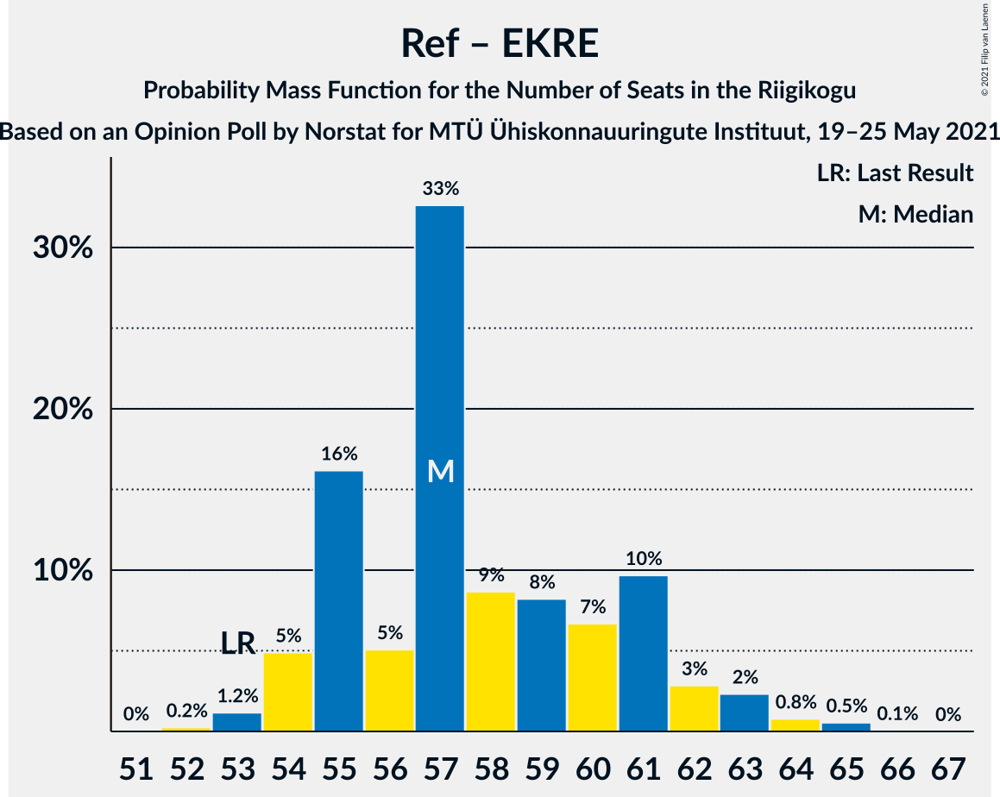

| Number of Seats | Probability | Accumulated | Special Marks |
|:---------------:|:-----------:|:-----------:|:-------------:|
| 51 | 0% | 100% | Majority |
| 52 | 0.2% | 99.9% |  |
| 53 | 1.2% | 99.7% | Last Result |
| 54 | 5% | 98.5% |  |
| 55 | 16% | 94% |  |
| 56 | 5% | 77% |  |
| 57 | 33% | 72% | Median |
| 58 | 9% | 40% |  |
| 59 | 8% | 31% |  |
| 60 | 7% | 23% |  |
| 61 | 10% | 16% |  |
| 62 | 3% | 7% |  |
| 63 | 2% | 4% |  |
| 64 | 0.8% | 1.4% |  |
| 65 | 0.5% | 0.6% |  |
| 66 | 0.1% | 0.1% |  |
| 67 | 0% | 0% |  |

### Eesti Reformierakond – Eesti Keskerakond

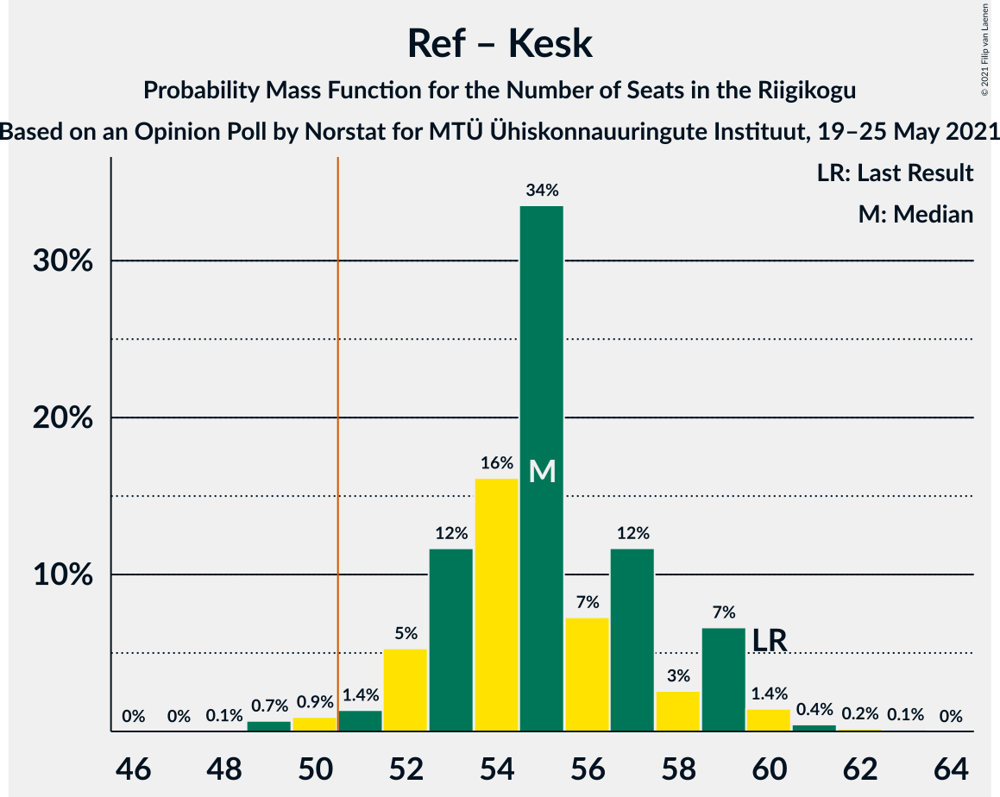

| Number of Seats | Probability | Accumulated | Special Marks |
|:---------------:|:-----------:|:-----------:|:-------------:|
| 48 | 0.1% | 100% |  |
| 49 | 0.7% | 99.9% |  |
| 50 | 0.9% | 99.3% |  |
| 51 | 1.4% | 98% | Majority |
| 52 | 5% | 97% |  |
| 53 | 12% | 92% |  |
| 54 | 16% | 80% |  |
| 55 | 34% | 64% | Median |
| 56 | 7% | 30% |  |
| 57 | 12% | 23% |  |
| 58 | 3% | 11% |  |
| 59 | 7% | 9% |  |
| 60 | 1.4% | 2% | Last Result |
| 61 | 0.4% | 0.7% |  |
| 62 | 0.2% | 0.3% |  |
| 63 | 0.1% | 0.1% |  |
| 64 | 0% | 0% |  |

### Eesti Reformierakond – Sotsiaaldemokraatlik Erakond – Erakond Isamaa

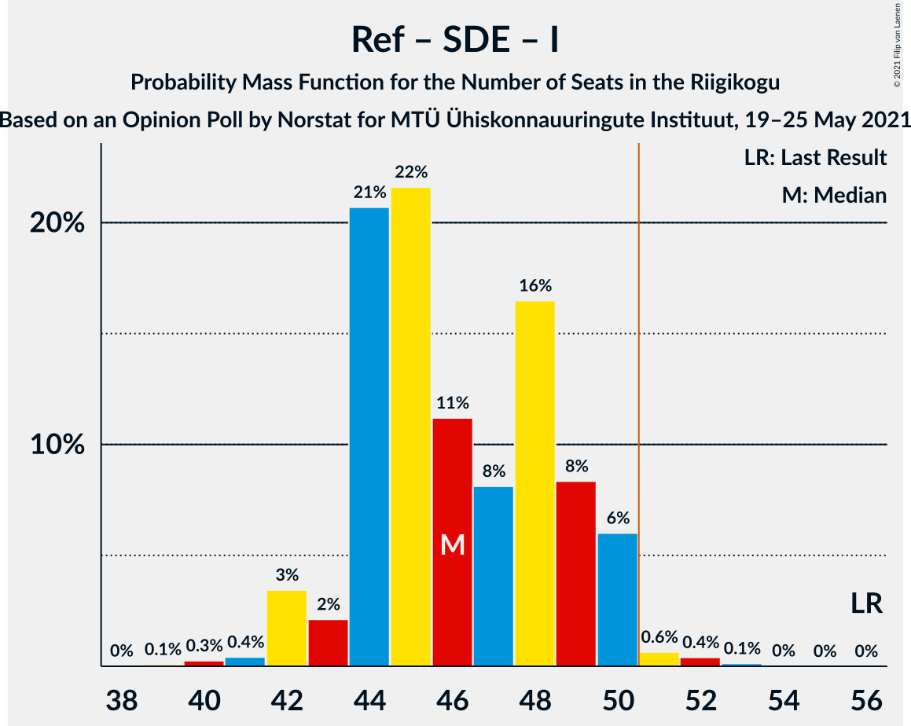

| Number of Seats | Probability | Accumulated | Special Marks |
|:---------------:|:-----------:|:-----------:|:-------------:|
| 39 | 0.1% | 100% |  |
| 40 | 0.3% | 99.9% |  |
| 41 | 0.4% | 99.6% |  |
| 42 | 3% | 99.2% |  |
| 43 | 2% | 96% |  |
| 44 | 21% | 94% |  |
| 45 | 22% | 73% |  |
| 46 | 11% | 51% | Median |
| 47 | 8% | 40% |  |
| 48 | 16% | 32% |  |
| 49 | 8% | 16% |  |
| 50 | 6% | 7% |  |
| 51 | 0.6% | 1.2% | Majority |
| 52 | 0.4% | 0.6% |  |
| 53 | 0.1% | 0.2% |  |
| 54 | 0% | 0% |  |
| 55 | 0% | 0% |  |
| 56 | 0% | 0% | Last Result |

### Eesti Konservatiivne Rahvaerakond – Eesti Keskerakond – Erakond Isamaa

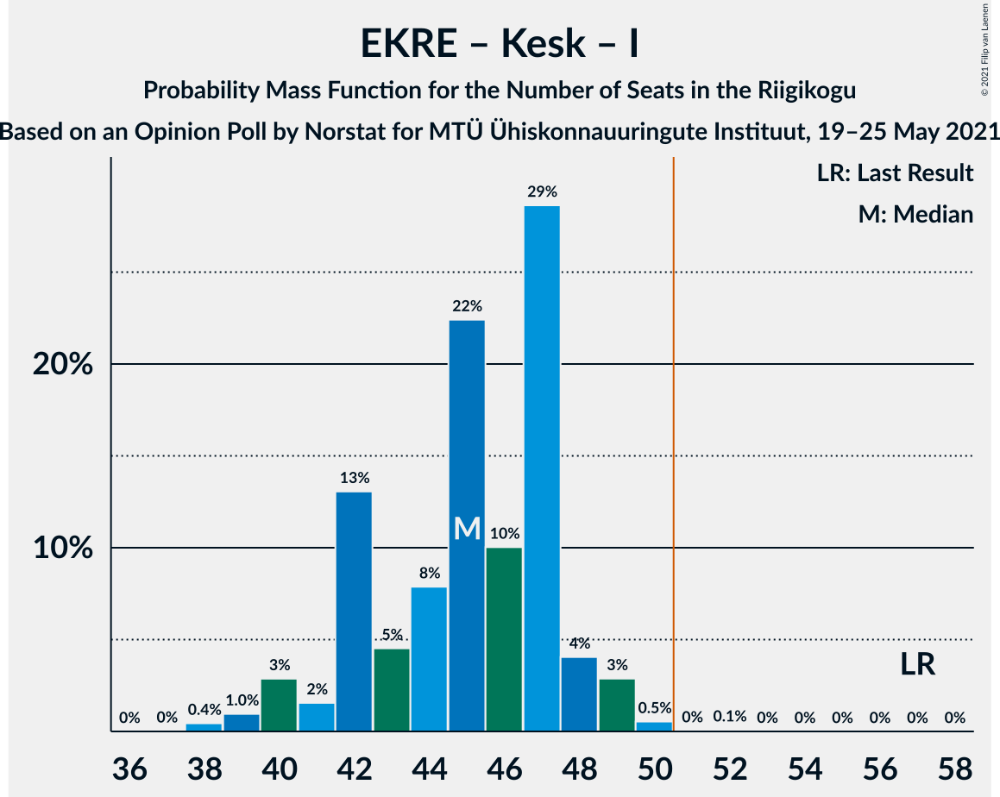

| Number of Seats | Probability | Accumulated | Special Marks |
|:---------------:|:-----------:|:-----------:|:-------------:|
| 38 | 0.4% | 100% |  |
| 39 | 1.0% | 99.5% |  |
| 40 | 3% | 98.6% |  |
| 41 | 2% | 96% |  |
| 42 | 13% | 94% |  |
| 43 | 5% | 81% |  |
| 44 | 8% | 77% |  |
| 45 | 22% | 69% |  |
| 46 | 10% | 46% |  |
| 47 | 29% | 36% | Median |
| 48 | 4% | 8% |  |
| 49 | 3% | 4% |  |
| 50 | 0.5% | 0.7% |  |
| 51 | 0% | 0.1% | Majority |
| 52 | 0.1% | 0.1% |  |
| 53 | 0% | 0% |  |
| 54 | 0% | 0% |  |
| 55 | 0% | 0% |  |
| 56 | 0% | 0% |  |
| 57 | 0% | 0% | Last Result |

### Eesti Reformierakond – Sotsiaaldemokraatlik Erakond

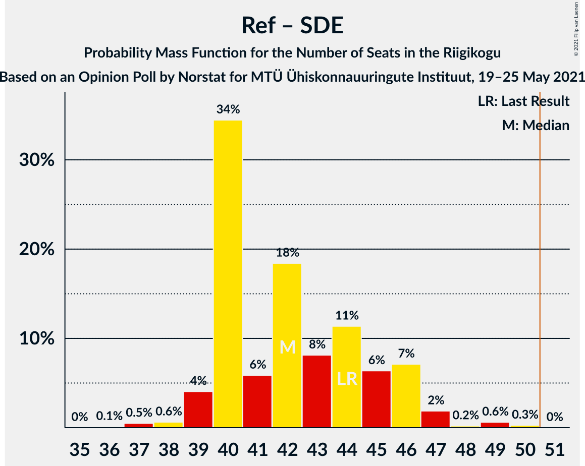

| Number of Seats | Probability | Accumulated | Special Marks |
|:---------------:|:-----------:|:-----------:|:-------------:|
| 36 | 0.1% | 100% |  |
| 37 | 0.5% | 99.8% |  |
| 38 | 0.6% | 99.4% |  |
| 39 | 4% | 98.7% |  |
| 40 | 34% | 95% |  |
| 41 | 6% | 60% | Median |
| 42 | 18% | 54% |  |
| 43 | 8% | 36% |  |
| 44 | 11% | 28% | Last Result |
| 45 | 6% | 16% |  |
| 46 | 7% | 10% |  |
| 47 | 2% | 3% |  |
| 48 | 0.2% | 1.1% |  |
| 49 | 0.6% | 0.9% |  |
| 50 | 0.3% | 0.3% |  |
| 51 | 0% | 0% | Majority |

### Eesti Konservatiivne Rahvaerakond – Eesti Keskerakond

| Number of Seats | Probability | Accumulated | Special Marks |
|:---------------:|:-----------:|:-----------:|:-------------:|
| 35 | 0.3% | 100% |  |
| 36 | 1.3% | 99.7% |  |
| 37 | 4% | 98% |  |
| 38 | 7% | 95% |  |
| 39 | 3% | 87% |  |
| 40 | 23% | 84% |  |
| 41 | 15% | 61% |  |
| 42 | 31% | 46% | Median |
| 43 | 7% | 15% |  |
| 44 | 3% | 8% |  |
| 45 | 5% | 6% | Last Result |
| 46 | 0.6% | 0.9% |  |
| 47 | 0.3% | 0.3% |  |
| 48 | 0% | 0% |  |

### Eesti Reformierakond – Erakond Isamaa

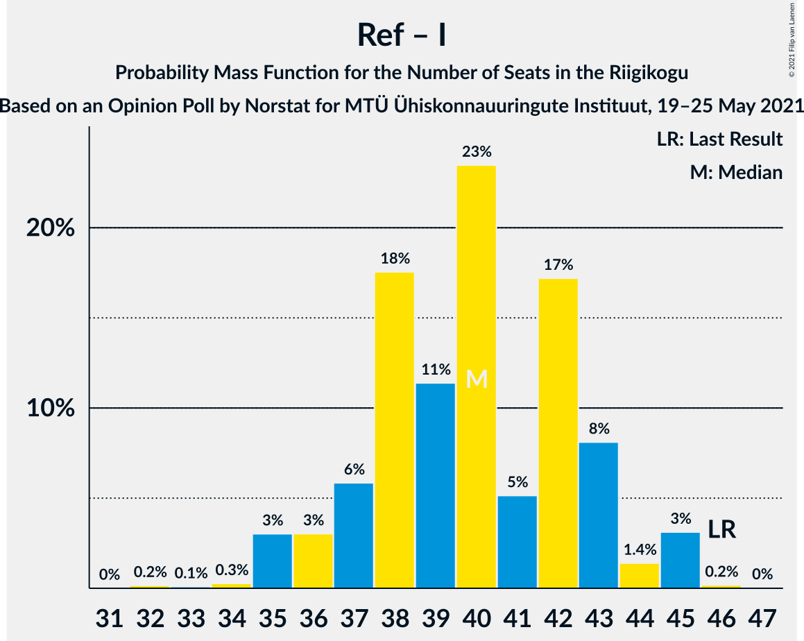

| Number of Seats | Probability | Accumulated | Special Marks |
|:---------------:|:-----------:|:-----------:|:-------------:|
| 32 | 0.2% | 100% |  |
| 33 | 0.1% | 99.8% |  |
| 34 | 0.3% | 99.7% |  |
| 35 | 3% | 99.5% |  |
| 36 | 3% | 96% |  |
| 37 | 6% | 93% |  |
| 38 | 18% | 88% |  |
| 39 | 11% | 70% |  |
| 40 | 23% | 59% | Median |
| 41 | 5% | 35% |  |
| 42 | 17% | 30% |  |
| 43 | 8% | 13% |  |
| 44 | 1.4% | 5% |  |
| 45 | 3% | 3% |  |
| 46 | 0.2% | 0.2% | Last Result |
| 47 | 0% | 0% |  |

### Eesti Keskerakond – Sotsiaaldemokraatlik Erakond – Erakond Isamaa

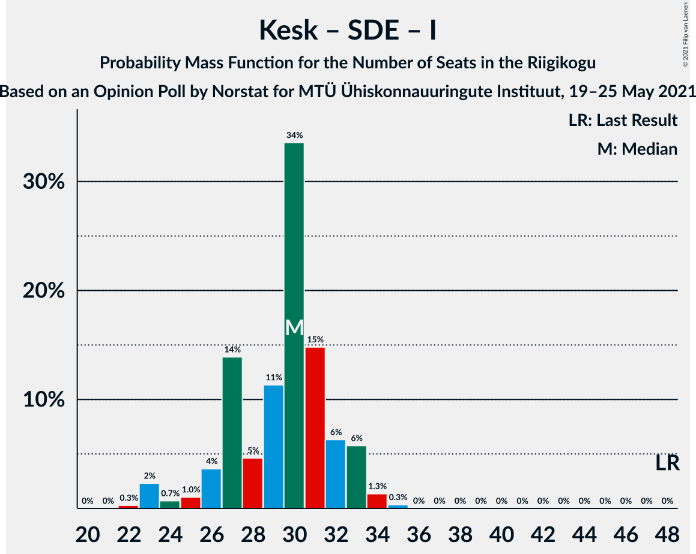

| Number of Seats | Probability | Accumulated | Special Marks |
|:---------------:|:-----------:|:-----------:|:-------------:|
| 22 | 0.3% | 100% |  |
| 23 | 2% | 99.7% |  |
| 24 | 0.7% | 97% |  |
| 25 | 1.0% | 97% |  |
| 26 | 4% | 96% |  |
| 27 | 14% | 92% |  |
| 28 | 5% | 78% |  |
| 29 | 11% | 73% |  |
| 30 | 34% | 62% |  |
| 31 | 15% | 29% | Median |
| 32 | 6% | 14% |  |
| 33 | 6% | 7% |  |
| 34 | 1.3% | 2% |  |
| 35 | 0.3% | 0.4% |  |
| 36 | 0% | 0% |  |
| 37 | 0% | 0% |  |
| 38 | 0% | 0% |  |
| 39 | 0% | 0% |  |
| 40 | 0% | 0% |  |
| 41 | 0% | 0% |  |
| 42 | 0% | 0% |  |
| 43 | 0% | 0% |  |
| 44 | 0% | 0% |  |
| 45 | 0% | 0% |  |
| 46 | 0% | 0% |  |
| 47 | 0% | 0% |  |
| 48 | 0% | 0% | Last Result |

### Eesti Konservatiivne Rahvaerakond – Sotsiaaldemokraatlik Erakond

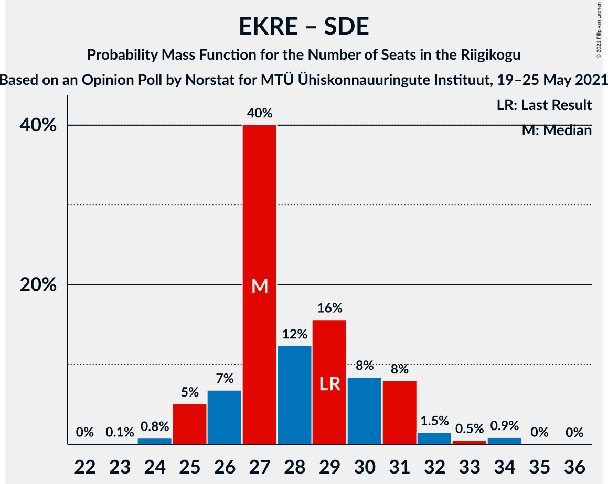

| Number of Seats | Probability | Accumulated | Special Marks |
|:---------------:|:-----------:|:-----------:|:-------------:|
| 22 | 0% | 100% |  |
| 23 | 0.1% | 99.9% |  |
| 24 | 0.8% | 99.8% |  |
| 25 | 5% | 99.1% |  |
| 26 | 7% | 94% |  |
| 27 | 40% | 87% |  |
| 28 | 12% | 47% | Median |
| 29 | 16% | 35% | Last Result |
| 30 | 8% | 19% |  |
| 31 | 8% | 11% |  |
| 32 | 1.5% | 3% |  |
| 33 | 0.5% | 1.4% |  |
| 34 | 0.9% | 0.9% |  |
| 35 | 0% | 0.1% |  |
| 36 | 0% | 0% |  |

### Eesti Keskerakond – Sotsiaaldemokraatlik Erakond

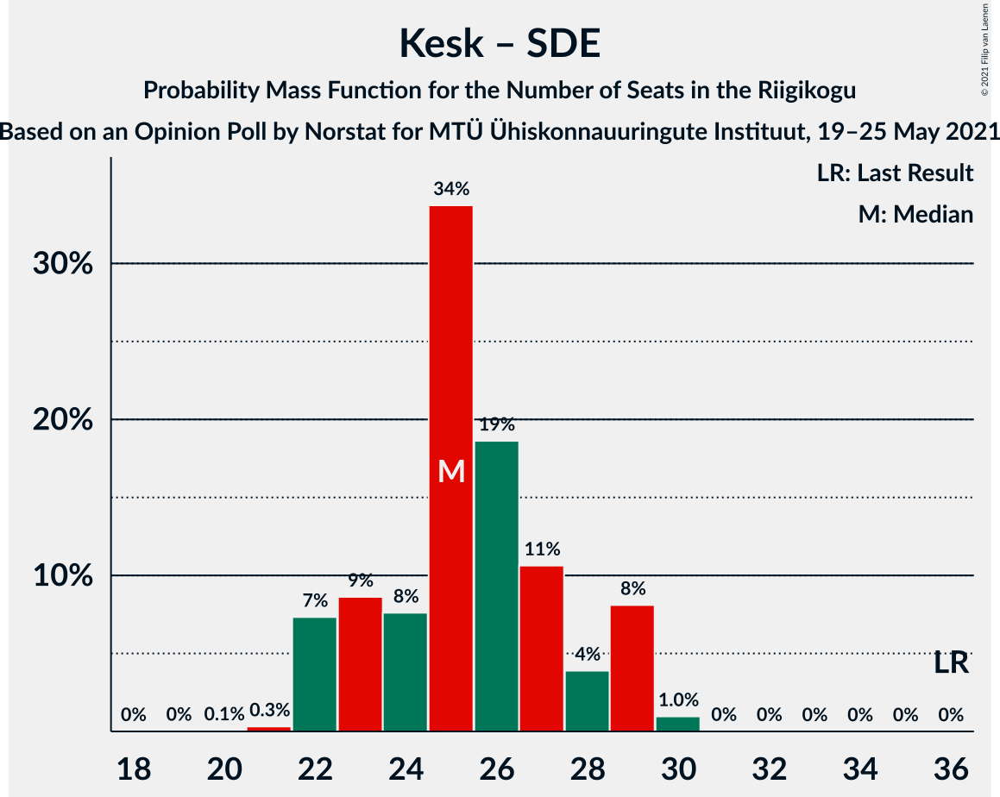

| Number of Seats | Probability | Accumulated | Special Marks |
|:---------------:|:-----------:|:-----------:|:-------------:|
| 19 | 0% | 100% |  |
| 20 | 0.1% | 99.9% |  |
| 21 | 0.3% | 99.9% |  |
| 22 | 7% | 99.6% |  |
| 23 | 9% | 92% |  |
| 24 | 8% | 84% |  |
| 25 | 34% | 76% |  |
| 26 | 19% | 42% | Median |
| 27 | 11% | 24% |  |
| 28 | 4% | 13% |  |
| 29 | 8% | 9% |  |
| 30 | 1.0% | 1.0% |  |
| 31 | 0% | 0% |  |
| 32 | 0% | 0% |  |
| 33 | 0% | 0% |  |
| 34 | 0% | 0% |  |
| 35 | 0% | 0% |  |
| 36 | 0% | 0% | Last Result |

## Technical Information

### Opinion Poll

+ **Polling firm:** Norstat
+ **Commissioner(s):** MTÜ Ühiskonnauuringute Instituut
+ **Fieldwork period:** 19–25 May 2021

### Calculations

+ **Sample size:** 1000
+ **Simulations done:** 32,768
+ **Error estimate:** 1.92%

