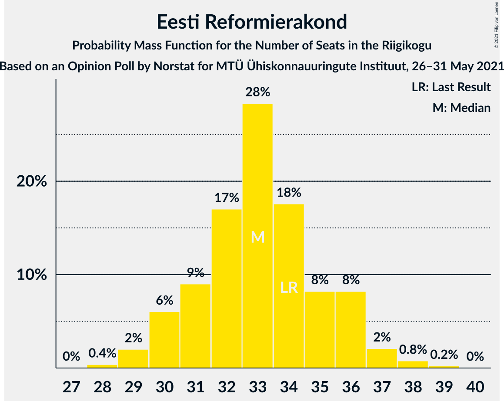

# Opinion Poll by Norstat for MTÜ Ühiskonnauuringute Instituut, 26–31 May 2021

<a href="#voting-intentions">Voting Intentions</a> | <a href="#seats">Seats</a> | <a href="#coalitions">Coalitions</a> | <a href="#technical-information">Technical Information</a>

## Voting Intentions

### Confidence Intervals

| Party | Last Result | Poll Result | 80% Confidence Interval | 90% Confidence Interval | 95% Confidence Interval | 99% Confidence Interval |
|:-----:|:-----------:|:-----------:|:-----------------------:|:-----------------------:|:-----------------------:|:-----------------------:|
| Eesti Reformierakond | 28.9% | 29.3% | 27.5–31.2% |27.0–31.7% |26.6–32.2% |25.7–33.1% |
| Eesti Keskerakond | 23.1% | 21.0% | 19.4–22.7% |19.0–23.2% |18.6–23.6% |17.8–24.5% |
| Eesti Konservatiivne Rahvaerakond | 17.8% | 19.9% | 18.4–21.6% |17.9–22.1% |17.5–22.5% |16.8–23.3% |
| Eesti 200 | 4.4% | 11.2% | 10.0–12.6% |9.7–13.0% |9.4–13.3% |8.8–14.0% |
| Sotsiaaldemokraatlik Erakond | 9.8% | 8.2% | 7.2–9.4% |6.9–9.8% |6.6–10.1% |6.2–10.7% |
| Erakond Isamaa | 11.4% | 5.9% | 5.0–7.0% |4.8–7.3% |4.6–7.5% |4.2–8.1% |
| Erakond Eestimaa Rohelised | 1.8% | 2.8% | 2.2–3.6% |2.1–3.8% |1.9–4.0% |1.7–4.4% |

*Note:* The poll result column reflects the actual value used in the calculations. Published results may vary slightly, and in addition be rounded to fewer digits.

## Seats

### Confidence Intervals

| Party | Last Result | Median | 80% Confidence Interval | 90% Confidence Interval | 95% Confidence Interval | 99% Confidence Interval |
|:-----:|:-----------:|:------:|:-----------------------:|:-----------------------:|:-----------------------:|:-----------------------:|
| <a href="#eesti-reformierakond">Eesti Reformierakond</a> | 34 | 33 | 31–36 |30–36 |30–37 |29–38 |
| <a href="#eesti-keskerakond">Eesti Keskerakond</a> | 26 | 23 | 21–25 |20–25 |20–26 |19–27 |
| <a href="#eesti-konservatiivne-rahvaerakond">Eesti Konservatiivne Rahvaerakond</a> | 19 | 22 | 20–24 |19–24 |19–25 |18–26 |
| <a href="#eesti-200">Eesti 200</a> | 0 | 11 | 10–12 |9–13 |9–13 |8–14 |
| <a href="#sotsiaaldemokraatlik-erakond">Sotsiaaldemokraatlik Erakond</a> | 10 | 8 | 6–9 |6–9 |6–10 |5–10 |
| <a href="#erakond-isamaa">Erakond Isamaa</a> | 12 | 5 | 4–6 |0–6 |0–7 |0–8 |
| <a href="#erakond-eestimaa-rohelised">Erakond Eestimaa Rohelised</a> | 0 | 0 | 0 |0 |0 |0 |

### Eesti Reformierakond

*For a full overview of the results for this party, see the [Eesti Reformierakond](party-eestireformierakond.html) page.*

| Number of Seats | Probability | Accumulated | Special Marks |
|:---------------:|:-----------:|:-----------:|:-------------:|
| 28 | 0.4% | 100% |  |
| 29 | 2% | 99.6% |  |
| 30 | 6% | 98% |  |
| 31 | 9% | 92% |  |
| 32 | 17% | 83% |  |
| 33 | 28% | 65% | Median |
| 34 | 18% | 37% | Last Result |
| 35 | 8% | 20% |  |
| 36 | 8% | 11% |  |
| 37 | 2% | 3% |  |
| 38 | 0.8% | 1.0% |  |
| 39 | 0.2% | 0.3% |  |
| 40 | 0% | 0% |  |

### Eesti Keskerakond

*For a full overview of the results for this party, see the [Eesti Keskerakond](party-eestikeskerakond.html) page.*

| Number of Seats | Probability | Accumulated | Special Marks |
|:---------------:|:-----------:|:-----------:|:-------------:|
| 18 | 0.3% | 100% |  |
| 19 | 2% | 99.7% |  |
| 20 | 8% | 98% |  |
| 21 | 12% | 90% |  |
| 22 | 25% | 79% |  |
| 23 | 27% | 54% | Median |
| 24 | 15% | 27% |  |
| 25 | 9% | 12% |  |
| 26 | 2% | 3% | Last Result |
| 27 | 1.0% | 1.1% |  |
| 28 | 0.1% | 0.2% |  |
| 29 | 0% | 0% |  |

### Eesti Konservatiivne Rahvaerakond

*For a full overview of the results for this party, see the [Eesti Konservatiivne Rahvaerakond](party-eestikonservatiivnerahvaerakond.html) page.*

| Number of Seats | Probability | Accumulated | Special Marks |
|:---------------:|:-----------:|:-----------:|:-------------:|
| 17 | 0.4% | 100% |  |
| 18 | 2% | 99.6% |  |
| 19 | 7% | 98% | Last Result |
| 20 | 13% | 91% |  |
| 21 | 24% | 78% |  |
| 22 | 28% | 54% | Median |
| 23 | 16% | 26% |  |
| 24 | 7% | 10% |  |
| 25 | 2% | 3% |  |
| 26 | 0.4% | 0.5% |  |
| 27 | 0.1% | 0.1% |  |
| 28 | 0% | 0% |  |

### Eesti 200

*For a full overview of the results for this party, see the [Eesti 200](party-eesti200.html) page.*

| Number of Seats | Probability | Accumulated | Special Marks |
|:---------------:|:-----------:|:-----------:|:-------------:|
| 0 | 0% | 100% | Last Result |
| 1 | 0% | 100% |  |
| 2 | 0% | 100% |  |
| 3 | 0% | 100% |  |
| 4 | 0% | 100% |  |
| 5 | 0% | 100% |  |
| 6 | 0% | 100% |  |
| 7 | 0% | 100% |  |
| 8 | 0.7% | 100% |  |
| 9 | 4% | 99.3% |  |
| 10 | 14% | 95% |  |
| 11 | 44% | 81% | Median |
| 12 | 28% | 37% |  |
| 13 | 8% | 9% |  |
| 14 | 0.9% | 1.2% |  |
| 15 | 0.2% | 0.3% |  |
| 16 | 0% | 0% |  |

### Sotsiaaldemokraatlik Erakond

*For a full overview of the results for this party, see the [Sotsiaaldemokraatlik Erakond](party-sotsiaaldemokraatlikerakond.html) page.*

| Number of Seats | Probability | Accumulated | Special Marks |
|:---------------:|:-----------:|:-----------:|:-------------:|
| 5 | 0.8% | 100% |  |
| 6 | 10% | 99.2% |  |
| 7 | 34% | 89% |  |
| 8 | 36% | 55% | Median |
| 9 | 16% | 19% |  |
| 10 | 3% | 3% | Last Result |
| 11 | 0.3% | 0.4% |  |
| 12 | 0% | 0% |  |

### Erakond Isamaa

*For a full overview of the results for this party, see the [Erakond Isamaa](party-erakondisamaa.html) page.*

| Number of Seats | Probability | Accumulated | Special Marks |
|:---------------:|:-----------:|:-----------:|:-------------:|
| 0 | 9% | 100% |  |
| 1 | 0% | 91% |  |
| 2 | 0% | 91% |  |
| 3 | 0% | 91% |  |
| 4 | 9% | 91% |  |
| 5 | 54% | 82% | Median |
| 6 | 24% | 28% |  |
| 7 | 4% | 4% |  |
| 8 | 0.5% | 0.5% |  |
| 9 | 0% | 0% |  |
| 10 | 0% | 0% |  |
| 11 | 0% | 0% |  |
| 12 | 0% | 0% | Last Result |

### Erakond Eestimaa Rohelised

*For a full overview of the results for this party, see the [Erakond Eestimaa Rohelised](party-erakondeestimaarohelised.html) page.*

| Number of Seats | Probability | Accumulated | Special Marks |
|:---------------:|:-----------:|:-----------:|:-------------:|
| 0 | 100% | 100% | Last Result, Median |

## Coalitions

### Confidence Intervals

| Coalition | Last Result | Median | Majority? | 80% Confidence Interval | 90% Confidence Interval | 95% Confidence Interval | 99% Confidence Interval |
|:---------:|:-----------:|:------:|:---------:|:-----------------------:|:-----------------------:|:-----------------------:|:-----------------------:|
| Eesti Reformierakond – Eesti Keskerakond – Eesti Konservatiivne Rahvaerakond | 79 | 77 | 100% | 75–80 | 74–81 | 74–82 | 73–84 |
| Eesti Reformierakond – Eesti Konservatiivne Rahvaerakond – Erakond Isamaa | 65 | 60 | 100% | 57–62 | 56–63 | 55–63 | 54–64 |
| Eesti Reformierakond – Eesti Keskerakond | 60 | 56 | 99.7% | 53–58 | 52–59 | 52–60 | 51–62 |
| Eesti Reformierakond – Eesti Konservatiivne Rahvaerakond | 53 | 54 | 98% | 52–57 | 52–58 | 51–60 | 49–60 |
| Eesti Keskerakond – Eesti Konservatiivne Rahvaerakond – Erakond Isamaa | 57 | 49 | 22% | 46–52 | 46–52 | 45–52 | 43–54 |
| Eesti Reformierakond – Sotsiaaldemokraatlik Erakond – Erakond Isamaa | 56 | 46 | 0.6% | 43–48 | 42–49 | 42–49 | 40–51 |
| Eesti Keskerakond – Eesti Konservatiivne Rahvaerakond | 45 | 44 | 0.1% | 42–47 | 41–47 | 41–48 | 39–49 |
| Eesti Reformierakond – Sotsiaaldemokraatlik Erakond | 44 | 41 | 0% | 38–43 | 38–44 | 37–45 | 36–46 |
| Eesti Reformierakond – Erakond Isamaa | 46 | 38 | 0% | 35–41 | 34–41 | 33–42 | 32–43 |
| Eesti Keskerakond – Sotsiaaldemokraatlik Erakond – Erakond Isamaa | 48 | 35 | 0% | 33–37 | 32–38 | 30–39 | 29–40 |
| Eesti Keskerakond – Sotsiaaldemokraatlik Erakond | 36 | 30 | 0% | 28–32 | 27–33 | 27–34 | 26–35 |
| Eesti Konservatiivne Rahvaerakond – Sotsiaaldemokraatlik Erakond | 29 | 29 | 0% | 27–32 | 26–32 | 26–33 | 25–34 |

### Eesti Reformierakond – Eesti Keskerakond – Eesti Konservatiivne Rahvaerakond

| Number of Seats | Probability | Accumulated | Special Marks |
|:---------------:|:-----------:|:-----------:|:-------------:|
| 72 | 0.2% | 100% |  |
| 73 | 1.2% | 99.7% |  |
| 74 | 5% | 98.6% |  |
| 75 | 6% | 93% |  |
| 76 | 21% | 87% |  |
| 77 | 27% | 66% |  |
| 78 | 17% | 39% | Median |
| 79 | 9% | 22% | Last Result |
| 80 | 5% | 13% |  |
| 81 | 3% | 8% |  |
| 82 | 3% | 5% |  |
| 83 | 0.7% | 1.3% |  |
| 84 | 0.4% | 0.5% |  |
| 85 | 0.2% | 0.2% |  |
| 86 | 0% | 0% |  |

### Eesti Reformierakond – Eesti Konservatiivne Rahvaerakond – Erakond Isamaa

| Number of Seats | Probability | Accumulated | Special Marks |
|:---------------:|:-----------:|:-----------:|:-------------:|
| 52 | 0.1% | 100% |  |
| 53 | 0.2% | 99.9% |  |
| 54 | 0.7% | 99.7% |  |
| 55 | 2% | 99.0% |  |
| 56 | 3% | 97% |  |
| 57 | 10% | 94% |  |
| 58 | 15% | 84% |  |
| 59 | 19% | 69% |  |
| 60 | 17% | 50% | Median |
| 61 | 19% | 33% |  |
| 62 | 8% | 14% |  |
| 63 | 5% | 6% |  |
| 64 | 0.9% | 1.2% |  |
| 65 | 0.3% | 0.3% | Last Result |
| 66 | 0% | 0% |  |

### Eesti Reformierakond – Eesti Keskerakond

| Number of Seats | Probability | Accumulated | Special Marks |
|:---------------:|:-----------:|:-----------:|:-------------:|
| 49 | 0% | 100% |  |
| 50 | 0.3% | 99.9% |  |
| 51 | 1.0% | 99.7% | Majority |
| 52 | 4% | 98.6% |  |
| 53 | 7% | 95% |  |
| 54 | 13% | 88% |  |
| 55 | 19% | 75% |  |
| 56 | 25% | 56% | Median |
| 57 | 16% | 31% |  |
| 58 | 8% | 15% |  |
| 59 | 3% | 7% |  |
| 60 | 2% | 4% | Last Result |
| 61 | 1.0% | 2% |  |
| 62 | 0.3% | 0.6% |  |
| 63 | 0.3% | 0.3% |  |
| 64 | 0% | 0% |  |

### Eesti Reformierakond – Eesti Konservatiivne Rahvaerakond

| Number of Seats | Probability | Accumulated | Special Marks |
|:---------------:|:-----------:|:-----------:|:-------------:|
| 48 | 0.1% | 100% |  |
| 49 | 0.7% | 99.9% |  |
| 50 | 0.9% | 99.2% |  |
| 51 | 2% | 98% | Majority |
| 52 | 11% | 96% |  |
| 53 | 13% | 85% | Last Result |
| 54 | 22% | 72% |  |
| 55 | 15% | 50% | Median |
| 56 | 17% | 35% |  |
| 57 | 10% | 18% |  |
| 58 | 4% | 8% |  |
| 59 | 1.3% | 4% |  |
| 60 | 2% | 3% |  |
| 61 | 0.2% | 0.3% |  |
| 62 | 0.1% | 0.1% |  |
| 63 | 0% | 0% |  |

### Eesti Keskerakond – Eesti Konservatiivne Rahvaerakond – Erakond Isamaa

| Number of Seats | Probability | Accumulated | Special Marks |
|:---------------:|:-----------:|:-----------:|:-------------:|
| 42 | 0.2% | 100% |  |
| 43 | 0.3% | 99.8% |  |
| 44 | 1.5% | 99.5% |  |
| 45 | 1.3% | 98% |  |
| 46 | 8% | 97% |  |
| 47 | 17% | 89% |  |
| 48 | 3% | 72% |  |
| 49 | 27% | 69% |  |
| 50 | 20% | 41% | Median |
| 51 | 9% | 22% | Majority |
| 52 | 11% | 13% |  |
| 53 | 0.9% | 2% |  |
| 54 | 0.7% | 1.0% |  |
| 55 | 0.3% | 0.3% |  |
| 56 | 0% | 0% |  |
| 57 | 0% | 0% | Last Result |

### Eesti Reformierakond – Sotsiaaldemokraatlik Erakond – Erakond Isamaa

| Number of Seats | Probability | Accumulated | Special Marks |
|:---------------:|:-----------:|:-----------:|:-------------:|
| 38 | 0.1% | 100% |  |
| 39 | 0.3% | 99.9% |  |
| 40 | 0.3% | 99.6% |  |
| 41 | 0.7% | 99.3% |  |
| 42 | 6% | 98.6% |  |
| 43 | 7% | 93% |  |
| 44 | 11% | 86% |  |
| 45 | 25% | 75% |  |
| 46 | 24% | 50% | Median |
| 47 | 10% | 27% |  |
| 48 | 9% | 17% |  |
| 49 | 6% | 7% |  |
| 50 | 1.2% | 2% |  |
| 51 | 0.4% | 0.6% | Majority |
| 52 | 0.2% | 0.2% |  |
| 53 | 0% | 0% |  |
| 54 | 0% | 0% |  |
| 55 | 0% | 0% |  |
| 56 | 0% | 0% | Last Result |

### Eesti Keskerakond – Eesti Konservatiivne Rahvaerakond

| Number of Seats | Probability | Accumulated | Special Marks |
|:---------------:|:-----------:|:-----------:|:-------------:|
| 38 | 0.2% | 100% |  |
| 39 | 1.0% | 99.8% |  |
| 40 | 0.4% | 98.8% |  |
| 41 | 6% | 98% |  |
| 42 | 15% | 92% |  |
| 43 | 4% | 77% |  |
| 44 | 32% | 72% |  |
| 45 | 15% | 40% | Last Result, Median |
| 46 | 12% | 25% |  |
| 47 | 10% | 13% |  |
| 48 | 0.7% | 3% |  |
| 49 | 2% | 2% |  |
| 50 | 0.3% | 0.5% |  |
| 51 | 0.1% | 0.1% | Majority |
| 52 | 0.1% | 0.1% |  |
| 53 | 0% | 0% |  |

### Eesti Reformierakond – Sotsiaaldemokraatlik Erakond

| Number of Seats | Probability | Accumulated | Special Marks |
|:---------------:|:-----------:|:-----------:|:-------------:|
| 35 | 0.2% | 100% |  |
| 36 | 0.6% | 99.7% |  |
| 37 | 3% | 99.1% |  |
| 38 | 7% | 96% |  |
| 39 | 19% | 89% |  |
| 40 | 16% | 71% |  |
| 41 | 22% | 54% | Median |
| 42 | 12% | 32% |  |
| 43 | 11% | 20% |  |
| 44 | 7% | 10% | Last Result |
| 45 | 2% | 3% |  |
| 46 | 0.6% | 1.0% |  |
| 47 | 0.2% | 0.4% |  |
| 48 | 0.1% | 0.1% |  |
| 49 | 0% | 0% |  |

### Eesti Reformierakond – Erakond Isamaa

| Number of Seats | Probability | Accumulated | Special Marks |
|:---------------:|:-----------:|:-----------:|:-------------:|
| 30 | 0% | 100% |  |
| 31 | 0.3% | 99.9% |  |
| 32 | 0.3% | 99.6% |  |
| 33 | 2% | 99.3% |  |
| 34 | 3% | 97% |  |
| 35 | 6% | 94% |  |
| 36 | 9% | 88% |  |
| 37 | 12% | 79% |  |
| 38 | 34% | 67% | Median |
| 39 | 16% | 33% |  |
| 40 | 7% | 17% |  |
| 41 | 7% | 10% |  |
| 42 | 2% | 3% |  |
| 43 | 0.7% | 0.9% |  |
| 44 | 0.2% | 0.2% |  |
| 45 | 0% | 0% |  |
| 46 | 0% | 0% | Last Result |

### Eesti Keskerakond – Sotsiaaldemokraatlik Erakond – Erakond Isamaa

| Number of Seats | Probability | Accumulated | Special Marks |
|:---------------:|:-----------:|:-----------:|:-------------:|
| 27 | 0% | 100% |  |
| 28 | 0.1% | 99.9% |  |
| 29 | 0.4% | 99.9% |  |
| 30 | 2% | 99.4% |  |
| 31 | 0.6% | 97% |  |
| 32 | 4% | 97% |  |
| 33 | 7% | 93% |  |
| 34 | 23% | 86% |  |
| 35 | 19% | 63% |  |
| 36 | 26% | 43% | Median |
| 37 | 10% | 17% |  |
| 38 | 3% | 7% |  |
| 39 | 3% | 5% |  |
| 40 | 1.0% | 1.4% |  |
| 41 | 0.3% | 0.4% |  |
| 42 | 0.1% | 0.1% |  |
| 43 | 0% | 0% |  |
| 44 | 0% | 0% |  |
| 45 | 0% | 0% |  |
| 46 | 0% | 0% |  |
| 47 | 0% | 0% |  |
| 48 | 0% | 0% | Last Result |

### Eesti Keskerakond – Sotsiaaldemokraatlik Erakond

| Number of Seats | Probability | Accumulated | Special Marks |
|:---------------:|:-----------:|:-----------:|:-------------:|
| 25 | 0.1% | 100% |  |
| 26 | 0.8% | 99.9% |  |
| 27 | 5% | 99.1% |  |
| 28 | 6% | 94% |  |
| 29 | 21% | 88% |  |
| 30 | 23% | 67% |  |
| 31 | 22% | 45% | Median |
| 32 | 13% | 22% |  |
| 33 | 4% | 9% |  |
| 34 | 4% | 5% |  |
| 35 | 0.7% | 1.0% |  |
| 36 | 0.3% | 0.3% | Last Result |
| 37 | 0.1% | 0.1% |  |
| 38 | 0% | 0% |  |

### Eesti Konservatiivne Rahvaerakond – Sotsiaaldemokraatlik Erakond

| Number of Seats | Probability | Accumulated | Special Marks |
|:---------------:|:-----------:|:-----------:|:-------------:|
| 24 | 0.2% | 100% |  |
| 25 | 1.5% | 99.8% |  |
| 26 | 4% | 98% |  |
| 27 | 8% | 95% |  |
| 28 | 18% | 87% |  |
| 29 | 29% | 69% | Last Result |
| 30 | 16% | 40% | Median |
| 31 | 13% | 23% |  |
| 32 | 8% | 11% |  |
| 33 | 1.2% | 3% |  |
| 34 | 1.2% | 1.4% |  |
| 35 | 0.2% | 0.2% |  |
| 36 | 0% | 0% |  |

## Technical Information

### Opinion Poll

+ **Polling firm:** Norstat
+ **Commissioner(s):** MTÜ Ühiskonnauuringute Instituut
+ **Fieldwork period:** 26–31 May 2021

### Calculations

+ **Sample size:** 1000
+ **Simulations done:** 131,072
+ **Error estimate:** 0.85%

