# Opinion Poll by Norstat for MTÜ Ühiskonnauuringute Instituut, 1–7 June 2021

<a href="#voting-intentions">Voting Intentions</a> | <a href="#seats">Seats</a> | <a href="#coalitions">Coalitions</a> | <a href="#technical-information">Technical Information</a>

## Voting Intentions

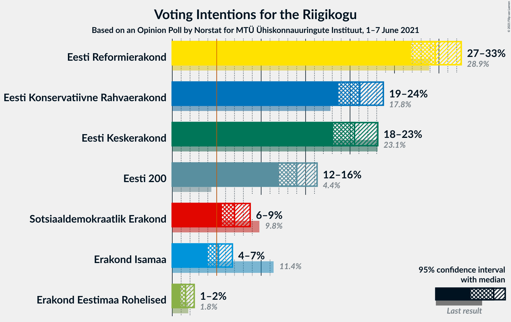

### Confidence Intervals

| Party | Last Result | Poll Result | 80% Confidence Interval | 90% Confidence Interval | 95% Confidence Interval | 99% Confidence Interval |
|:-----:|:-----------:|:-----------:|:-----------------------:|:-----------------------:|:-----------------------:|:-----------------------:|
| Eesti Reformierakond | 28.9% | 29.6% | 27.8–31.5% |27.3–32.0% |26.9–32.5% |26.0–33.4% |
| Eesti Konservatiivne Rahvaerakond | 17.8% | 21.1% | 19.5–22.8% |19.1–23.3% |18.7–23.7% |17.9–24.6% |
| Eesti Keskerakond | 23.1% | 20.5% | 18.9–22.2% |18.5–22.7% |18.1–23.1% |17.4–24.0% |
| Eesti 200 | 4.4% | 14.0% | 12.7–15.5% |12.3–15.9% |12.0–16.3% |11.4–17.0% |
| Sotsiaaldemokraatlik Erakond | 9.8% | 7.0% | 6.1–8.2% |5.8–8.5% |5.6–8.8% |5.2–9.3% |
| Erakond Isamaa | 11.4% | 5.2% | 4.4–6.2% |4.2–6.5% |4.0–6.8% |3.6–7.3% |
| Erakond Eestimaa Rohelised | 1.8% | 1.5% | 1.1–2.1% |1.0–2.3% |0.9–2.5% |0.7–2.8% |

*Note:* The poll result column reflects the actual value used in the calculations. Published results may vary slightly, and in addition be rounded to fewer digits.

## Seats

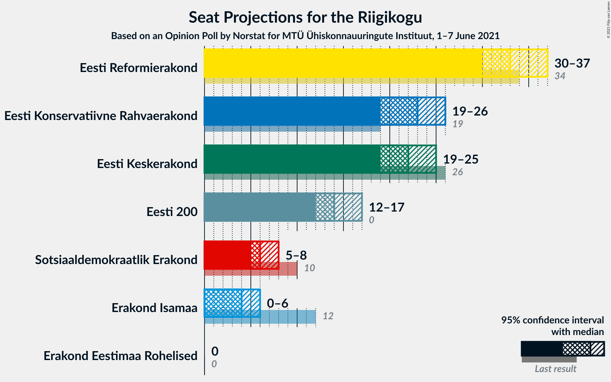

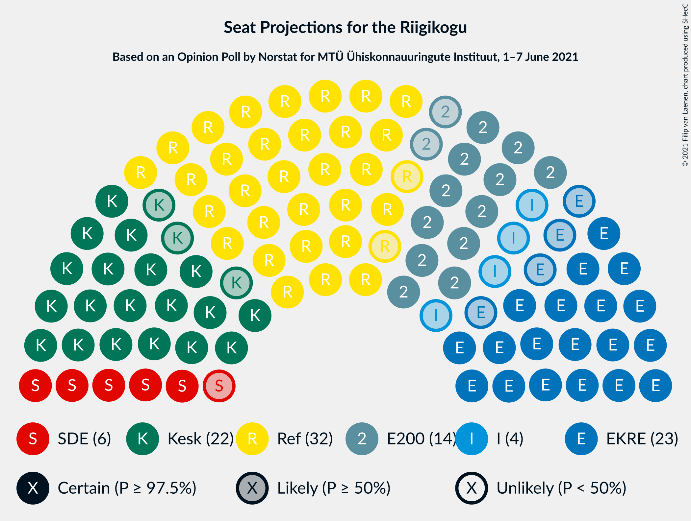

### Confidence Intervals

| Party | Last Result | Median | 80% Confidence Interval | 90% Confidence Interval | 95% Confidence Interval | 99% Confidence Interval |
|:-----:|:-----------:|:------:|:-----------------------:|:-----------------------:|:-----------------------:|:-----------------------:|
| <a href="#eesti-reformierakond">Eesti Reformierakond</a> | 34 | 33 | 30–35 |30–36 |30–37 |28–38 |
| <a href="#eesti-konservatiivne-rahvaerakond">Eesti Konservatiivne Rahvaerakond</a> | 19 | 23 | 21–24 |20–25 |19–26 |18–27 |
| <a href="#eesti-keskerakond">Eesti Keskerakond</a> | 26 | 22 | 20–24 |19–25 |19–25 |18–26 |
| <a href="#eesti-200">Eesti 200</a> | 0 | 14 | 13–16 |12–16 |12–17 |11–18 |
| <a href="#sotsiaaldemokraatlik-erakond">Sotsiaaldemokraatlik Erakond</a> | 10 | 6 | 5–7 |5–8 |5–8 |4–9 |
| <a href="#erakond-isamaa">Erakond Isamaa</a> | 12 | 4 | 0–5 |0–6 |0–6 |0–6 |
| <a href="#erakond-eestimaa-rohelised">Erakond Eestimaa Rohelised</a> | 0 | 0 | 0 |0 |0 |0 |

### Eesti Reformierakond

*For a full overview of the results for this party, see the [Eesti Reformierakond](party-eestireformierakond.html) page.*

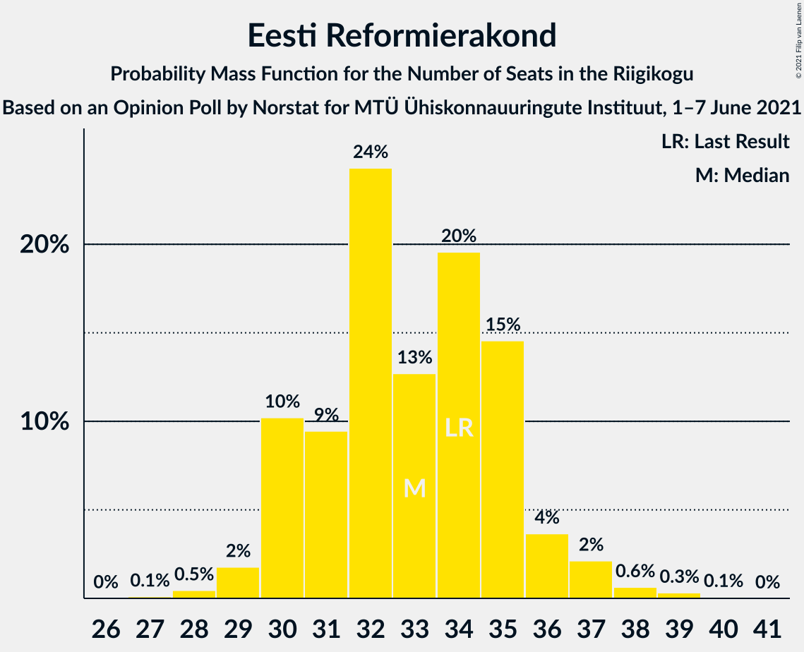

| Number of Seats | Probability | Accumulated | Special Marks |
|:---------------:|:-----------:|:-----------:|:-------------:|
| 27 | 0.1% | 100% |  |
| 28 | 0.5% | 99.9% |  |
| 29 | 2% | 99.4% |  |
| 30 | 10% | 98% |  |
| 31 | 9% | 87% |  |
| 32 | 24% | 78% |  |
| 33 | 13% | 54% | Median |
| 34 | 20% | 41% | Last Result |
| 35 | 15% | 21% |  |
| 36 | 4% | 7% |  |
| 37 | 2% | 3% |  |
| 38 | 0.6% | 1.0% |  |
| 39 | 0.3% | 0.4% |  |
| 40 | 0.1% | 0.1% |  |
| 41 | 0% | 0% |  |

### Eesti Konservatiivne Rahvaerakond

*For a full overview of the results for this party, see the [Eesti Konservatiivne Rahvaerakond](party-eestikonservatiivnerahvaerakond.html) page.*

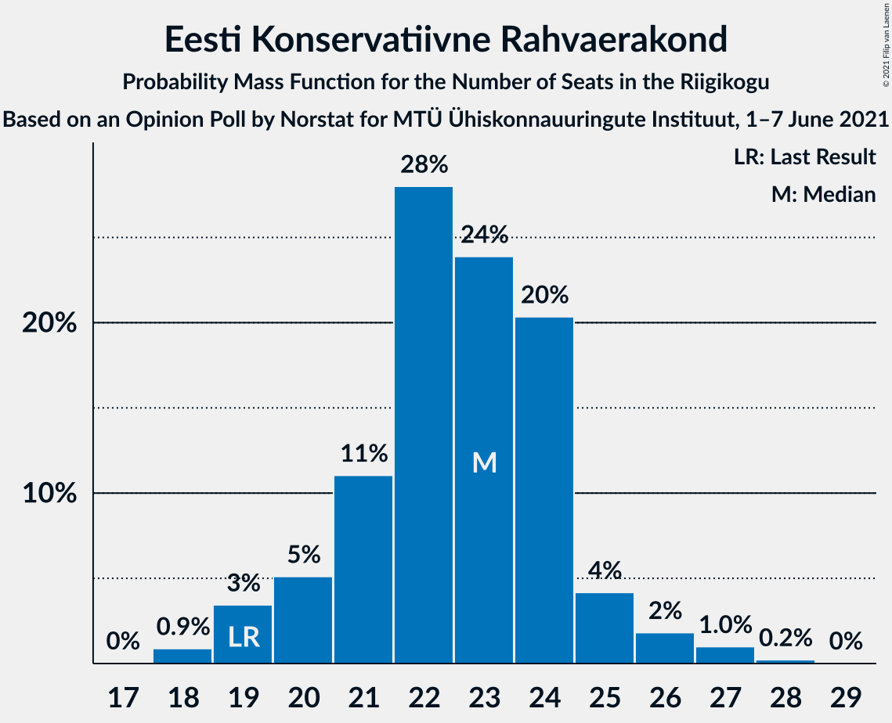

| Number of Seats | Probability | Accumulated | Special Marks |
|:---------------:|:-----------:|:-----------:|:-------------:|
| 18 | 0.9% | 100% |  |
| 19 | 3% | 99.1% | Last Result |
| 20 | 5% | 96% |  |
| 21 | 11% | 91% |  |
| 22 | 28% | 79% |  |
| 23 | 24% | 51% | Median |
| 24 | 20% | 28% |  |
| 25 | 4% | 7% |  |
| 26 | 2% | 3% |  |
| 27 | 1.0% | 1.3% |  |
| 28 | 0.2% | 0.3% |  |
| 29 | 0% | 0% |  |

### Eesti Keskerakond

*For a full overview of the results for this party, see the [Eesti Keskerakond](party-eestikeskerakond.html) page.*

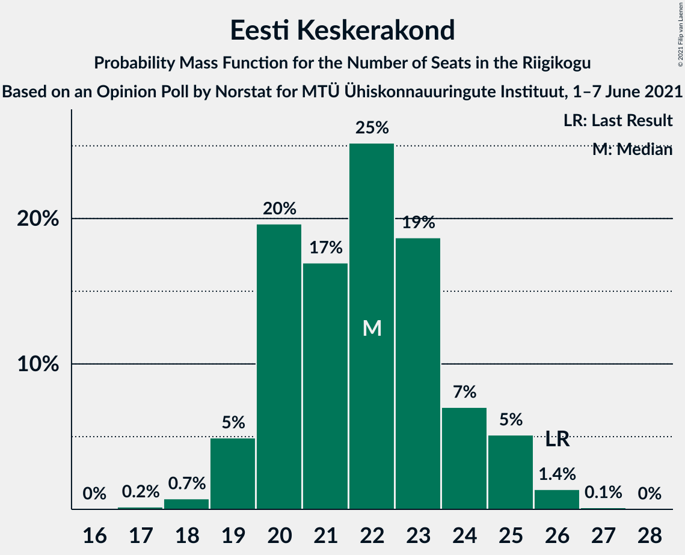

| Number of Seats | Probability | Accumulated | Special Marks |
|:---------------:|:-----------:|:-----------:|:-------------:|
| 17 | 0.2% | 100% |  |
| 18 | 0.7% | 99.8% |  |
| 19 | 5% | 99.1% |  |
| 20 | 20% | 94% |  |
| 21 | 17% | 75% |  |
| 22 | 25% | 58% | Median |
| 23 | 19% | 32% |  |
| 24 | 7% | 14% |  |
| 25 | 5% | 7% |  |
| 26 | 1.4% | 2% | Last Result |
| 27 | 0.1% | 0.2% |  |
| 28 | 0% | 0% |  |

### Eesti 200

*For a full overview of the results for this party, see the [Eesti 200](party-eesti200.html) page.*

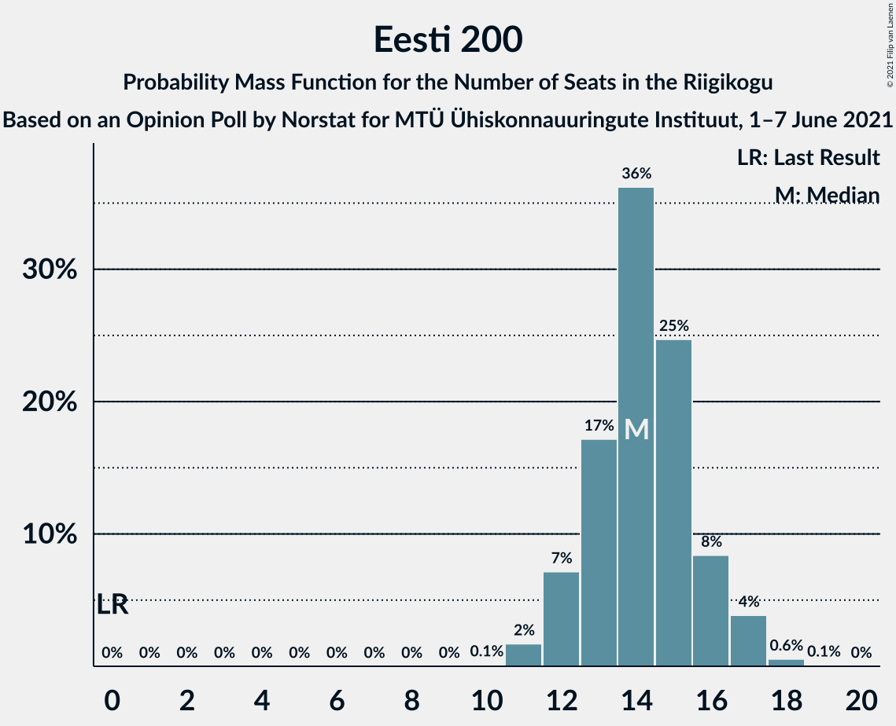

| Number of Seats | Probability | Accumulated | Special Marks |
|:---------------:|:-----------:|:-----------:|:-------------:|
| 0 | 0% | 100% | Last Result |
| 1 | 0% | 100% |  |
| 2 | 0% | 100% |  |
| 3 | 0% | 100% |  |
| 4 | 0% | 100% |  |
| 5 | 0% | 100% |  |
| 6 | 0% | 100% |  |
| 7 | 0% | 100% |  |
| 8 | 0% | 100% |  |
| 9 | 0% | 100% |  |
| 10 | 0.1% | 100% |  |
| 11 | 2% | 99.9% |  |
| 12 | 7% | 98% |  |
| 13 | 17% | 91% |  |
| 14 | 36% | 74% | Median |
| 15 | 25% | 38% |  |
| 16 | 8% | 13% |  |
| 17 | 4% | 5% |  |
| 18 | 0.6% | 0.7% |  |
| 19 | 0.1% | 0.1% |  |
| 20 | 0% | 0% |  |

### Sotsiaaldemokraatlik Erakond

*For a full overview of the results for this party, see the [Sotsiaaldemokraatlik Erakond](party-sotsiaaldemokraatlikerakond.html) page.*

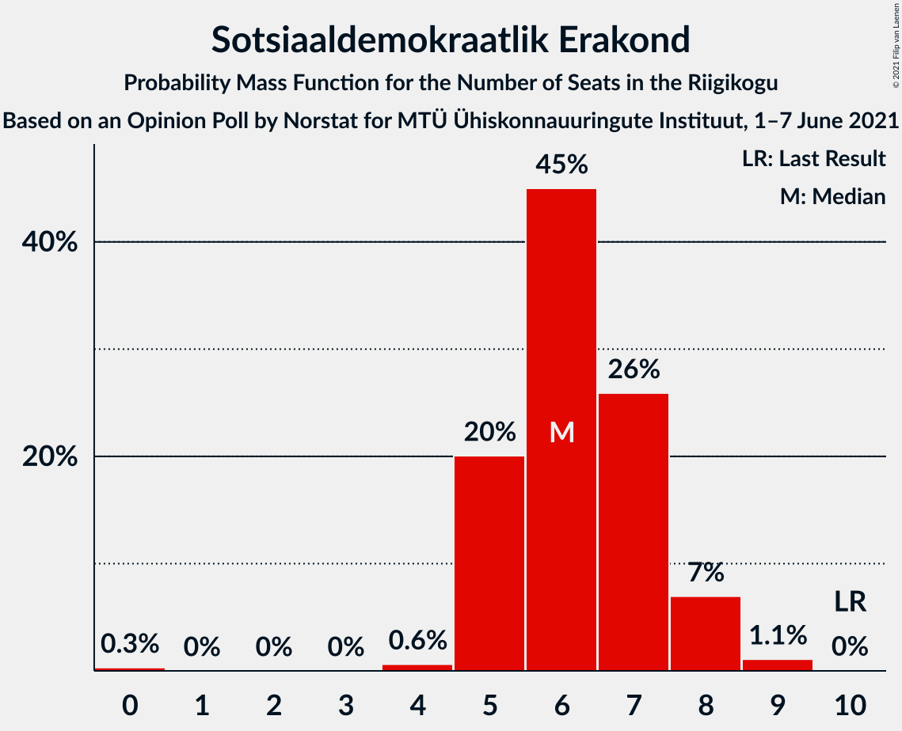

| Number of Seats | Probability | Accumulated | Special Marks |
|:---------------:|:-----------:|:-----------:|:-------------:|
| 0 | 0.3% | 100% |  |
| 1 | 0% | 99.7% |  |
| 2 | 0% | 99.7% |  |
| 3 | 0% | 99.7% |  |
| 4 | 0.6% | 99.7% |  |
| 5 | 20% | 99.1% |  |
| 6 | 45% | 79% | Median |
| 7 | 26% | 34% |  |
| 8 | 7% | 8% |  |
| 9 | 1.1% | 1.1% |  |
| 10 | 0% | 0% | Last Result |

### Erakond Isamaa

*For a full overview of the results for this party, see the [Erakond Isamaa](party-erakondisamaa.html) page.*

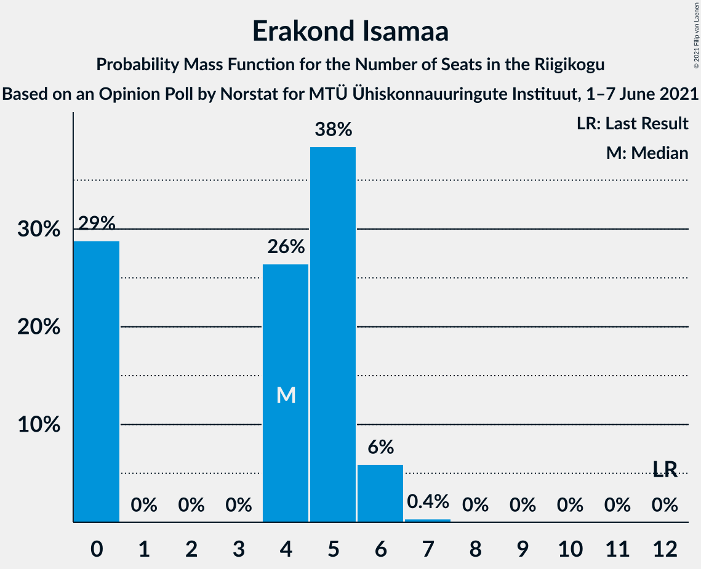

| Number of Seats | Probability | Accumulated | Special Marks |
|:---------------:|:-----------:|:-----------:|:-------------:|
| 0 | 29% | 100% |  |
| 1 | 0% | 71% |  |
| 2 | 0% | 71% |  |
| 3 | 0% | 71% |  |
| 4 | 26% | 71% | Median |
| 5 | 38% | 45% |  |
| 6 | 6% | 6% |  |
| 7 | 0.4% | 0.4% |  |
| 8 | 0% | 0% |  |
| 9 | 0% | 0% |  |
| 10 | 0% | 0% |  |
| 11 | 0% | 0% |  |
| 12 | 0% | 0% | Last Result |

### Erakond Eestimaa Rohelised

*For a full overview of the results for this party, see the [Erakond Eestimaa Rohelised](party-erakondeestimaarohelised.html) page.*

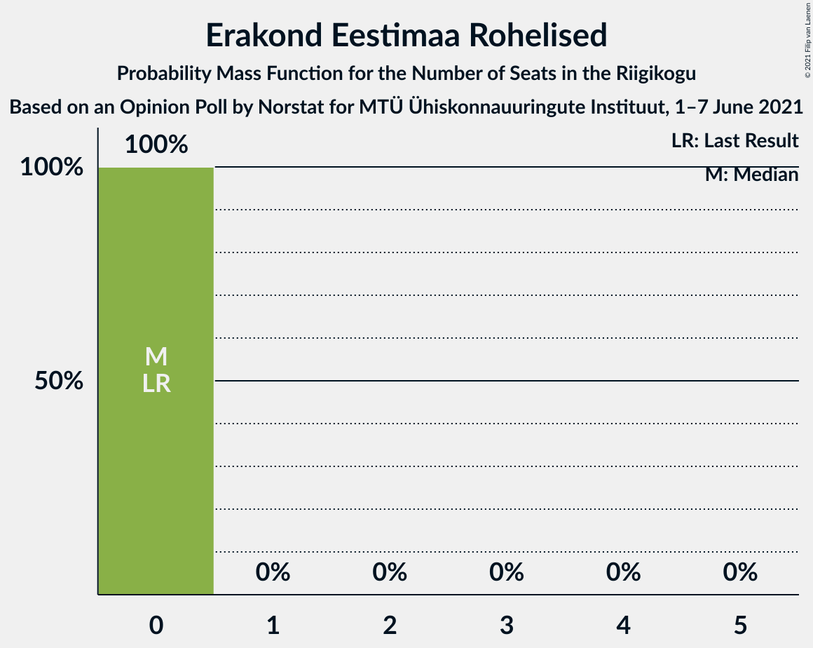

| Number of Seats | Probability | Accumulated | Special Marks |
|:---------------:|:-----------:|:-----------:|:-------------:|
| 0 | 100% | 100% | Last Result, Median |

## Coalitions

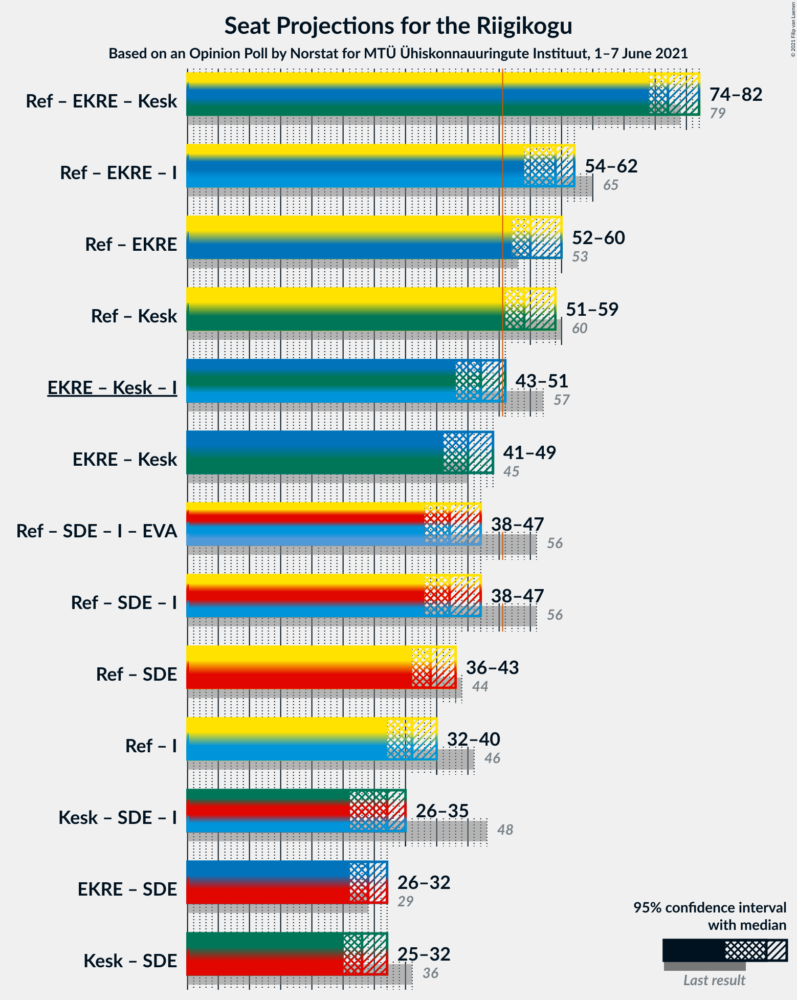

### Confidence Intervals

| Coalition | Last Result | Median | Majority? | 80% Confidence Interval | 90% Confidence Interval | 95% Confidence Interval | 99% Confidence Interval |
|:---------:|:-----------:|:------:|:---------:|:-----------------------:|:-----------------------:|:-----------------------:|:-----------------------:|
| Eesti Reformierakond – Eesti Konservatiivne Rahvaerakond – Eesti Keskerakond | 79 | 77 | 100% | 74–81 | 74–81 | 74–82 | 72–83 |
| Eesti Reformierakond – Eesti Konservatiivne Rahvaerakond – Erakond Isamaa | 65 | 59 | 100% | 56–61 | 55–62 | 54–62 | 53–64 |
| Eesti Reformierakond – Eesti Konservatiivne Rahvaerakond | 53 | 55 | 99.4% | 53–58 | 52–59 | 52–60 | 50–61 |
| Eesti Reformierakond – Eesti Keskerakond | 60 | 54 | 98% | 52–58 | 52–59 | 51–59 | 50–61 |
| Eesti Konservatiivne Rahvaerakond – Eesti Keskerakond – Erakond Isamaa | 57 | 47 | 9% | 45–50 | 44–51 | 43–51 | 41–53 |
| Eesti Konservatiivne Rahvaerakond – Eesti Keskerakond | 45 | 45 | 0.2% | 42–47 | 41–48 | 41–49 | 39–50 |
| Eesti Reformierakond – Sotsiaaldemokraatlik Erakond – Erakond Isamaa | 56 | 42 | 0% | 40–45 | 39–46 | 38–47 | 36–48 |
| Eesti Reformierakond – Sotsiaaldemokraatlik Erakond | 44 | 39 | 0% | 37–42 | 36–42 | 36–43 | 34–45 |
| Eesti Reformierakond – Erakond Isamaa | 46 | 36 | 0% | 33–39 | 33–40 | 32–40 | 30–41 |
| Eesti Keskerakond – Sotsiaaldemokraatlik Erakond – Erakond Isamaa | 48 | 32 | 0% | 28–34 | 27–35 | 26–35 | 25–37 |
| Eesti Konservatiivne Rahvaerakond – Sotsiaaldemokraatlik Erakond | 29 | 29 | 0% | 27–31 | 26–32 | 26–32 | 24–34 |
| Eesti Keskerakond – Sotsiaaldemokraatlik Erakond | 36 | 28 | 0% | 26–30 | 25–32 | 25–32 | 23–33 |

### Eesti Reformierakond – Eesti Konservatiivne Rahvaerakond – Eesti Keskerakond

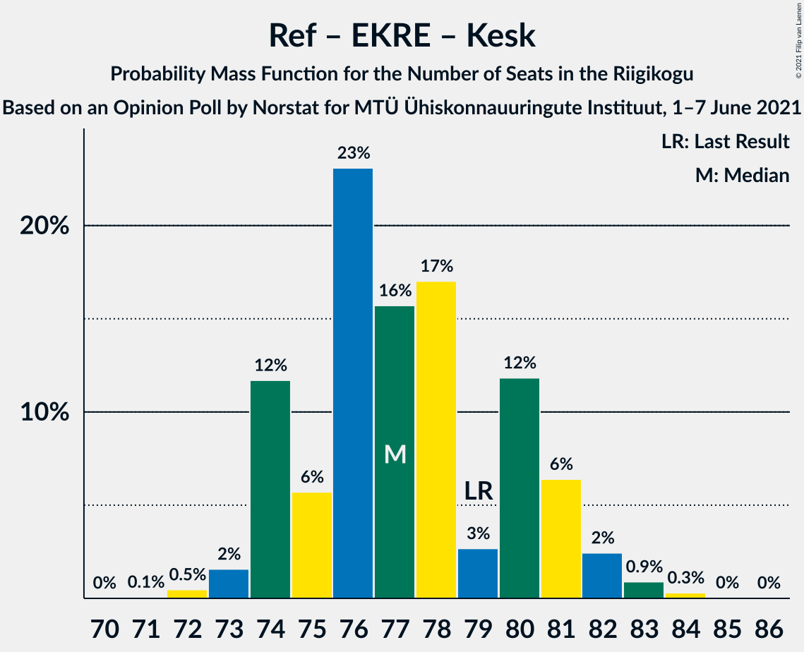

| Number of Seats | Probability | Accumulated | Special Marks |
|:---------------:|:-----------:|:-----------:|:-------------:|
| 71 | 0.1% | 100% |  |
| 72 | 0.5% | 99.9% |  |
| 73 | 2% | 99.4% |  |
| 74 | 12% | 98% |  |
| 75 | 6% | 86% |  |
| 76 | 23% | 80% |  |
| 77 | 16% | 57% |  |
| 78 | 17% | 42% | Median |
| 79 | 3% | 25% | Last Result |
| 80 | 12% | 22% |  |
| 81 | 6% | 10% |  |
| 82 | 2% | 4% |  |
| 83 | 0.9% | 1.3% |  |
| 84 | 0.3% | 0.4% |  |
| 85 | 0% | 0.1% |  |
| 86 | 0% | 0% |  |

### Eesti Reformierakond – Eesti Konservatiivne Rahvaerakond – Erakond Isamaa

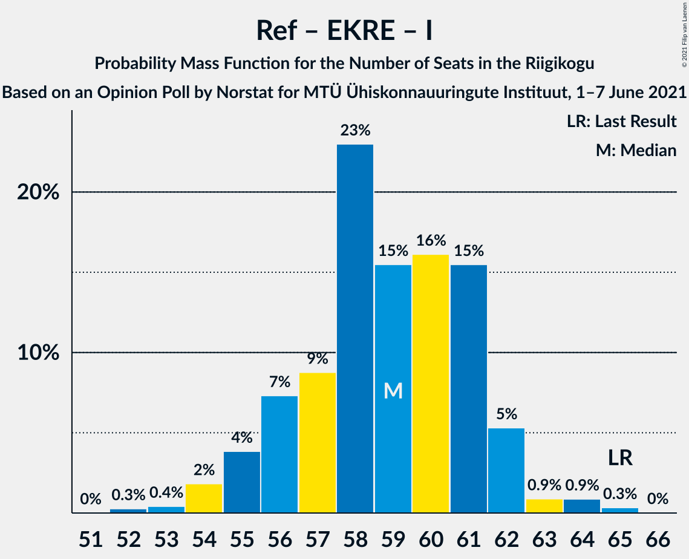

| Number of Seats | Probability | Accumulated | Special Marks |
|:---------------:|:-----------:|:-----------:|:-------------:|
| 52 | 0.3% | 100% |  |
| 53 | 0.4% | 99.7% |  |
| 54 | 2% | 99.3% |  |
| 55 | 4% | 97% |  |
| 56 | 7% | 94% |  |
| 57 | 9% | 86% |  |
| 58 | 23% | 78% |  |
| 59 | 15% | 55% |  |
| 60 | 16% | 39% | Median |
| 61 | 15% | 23% |  |
| 62 | 5% | 7% |  |
| 63 | 0.9% | 2% |  |
| 64 | 0.9% | 1.2% |  |
| 65 | 0.3% | 0.4% | Last Result |
| 66 | 0% | 0% |  |

### Eesti Reformierakond – Eesti Konservatiivne Rahvaerakond

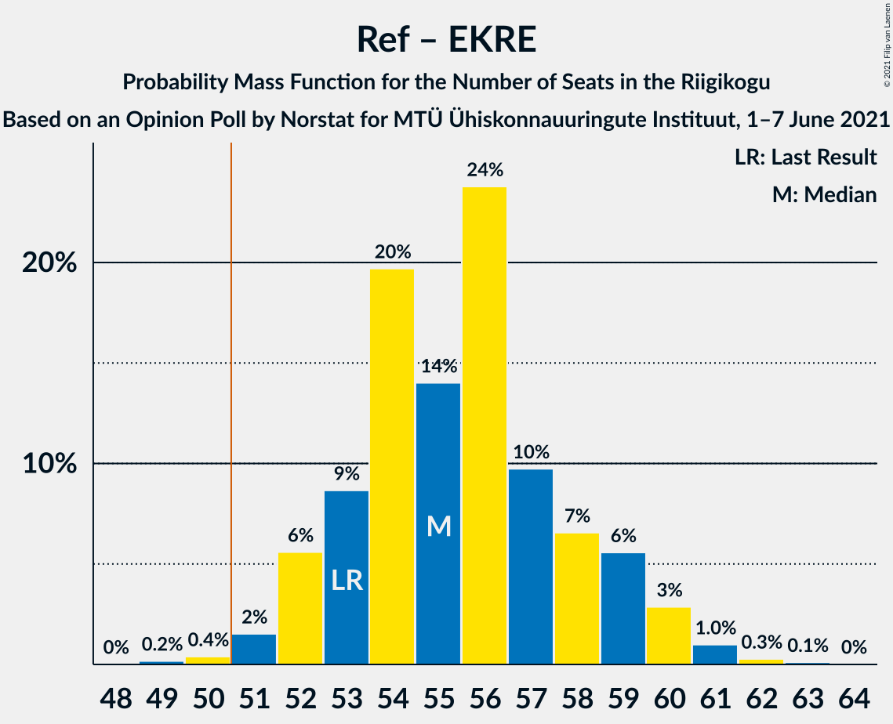

| Number of Seats | Probability | Accumulated | Special Marks |
|:---------------:|:-----------:|:-----------:|:-------------:|
| 49 | 0.2% | 100% |  |
| 50 | 0.4% | 99.8% |  |
| 51 | 2% | 99.4% | Majority |
| 52 | 6% | 98% |  |
| 53 | 9% | 92% | Last Result |
| 54 | 20% | 84% |  |
| 55 | 14% | 64% |  |
| 56 | 24% | 50% | Median |
| 57 | 10% | 26% |  |
| 58 | 7% | 16% |  |
| 59 | 6% | 10% |  |
| 60 | 3% | 4% |  |
| 61 | 1.0% | 1.4% |  |
| 62 | 0.3% | 0.4% |  |
| 63 | 0.1% | 0.1% |  |
| 64 | 0% | 0% |  |

### Eesti Reformierakond – Eesti Keskerakond

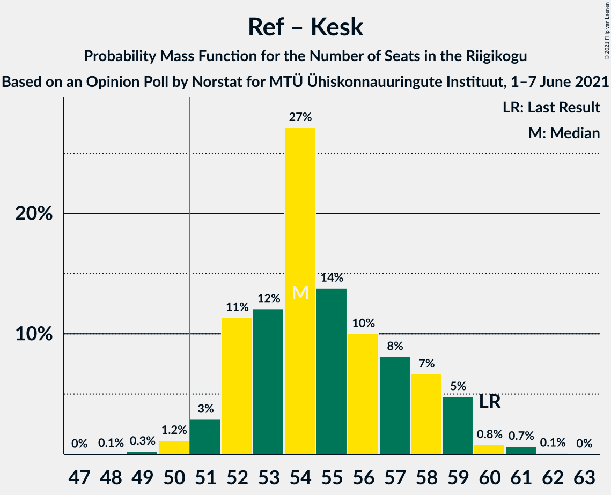

| Number of Seats | Probability | Accumulated | Special Marks |
|:---------------:|:-----------:|:-----------:|:-------------:|
| 48 | 0.1% | 100% |  |
| 49 | 0.3% | 99.9% |  |
| 50 | 1.2% | 99.7% |  |
| 51 | 3% | 98% | Majority |
| 52 | 11% | 96% |  |
| 53 | 12% | 84% |  |
| 54 | 27% | 72% |  |
| 55 | 14% | 45% | Median |
| 56 | 10% | 31% |  |
| 57 | 8% | 21% |  |
| 58 | 7% | 13% |  |
| 59 | 5% | 6% |  |
| 60 | 0.8% | 2% | Last Result |
| 61 | 0.7% | 0.8% |  |
| 62 | 0.1% | 0.1% |  |
| 63 | 0% | 0% |  |

### Eesti Konservatiivne Rahvaerakond – Eesti Keskerakond – Erakond Isamaa

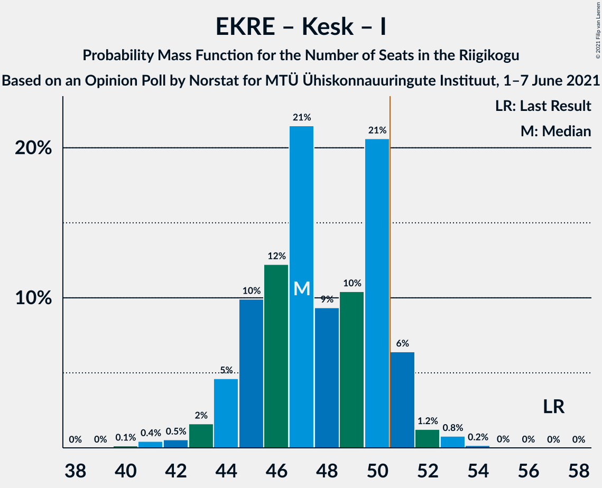

| Number of Seats | Probability | Accumulated | Special Marks |
|:---------------:|:-----------:|:-----------:|:-------------:|
| 40 | 0.1% | 100% |  |
| 41 | 0.4% | 99.8% |  |
| 42 | 0.5% | 99.4% |  |
| 43 | 2% | 98.9% |  |
| 44 | 5% | 97% |  |
| 45 | 10% | 93% |  |
| 46 | 12% | 83% |  |
| 47 | 21% | 70% |  |
| 48 | 9% | 49% |  |
| 49 | 10% | 40% | Median |
| 50 | 21% | 29% |  |
| 51 | 6% | 9% | Majority |
| 52 | 1.2% | 2% |  |
| 53 | 0.8% | 1.0% |  |
| 54 | 0.2% | 0.2% |  |
| 55 | 0% | 0% |  |
| 56 | 0% | 0% |  |
| 57 | 0% | 0% | Last Result |

### Eesti Konservatiivne Rahvaerakond – Eesti Keskerakond

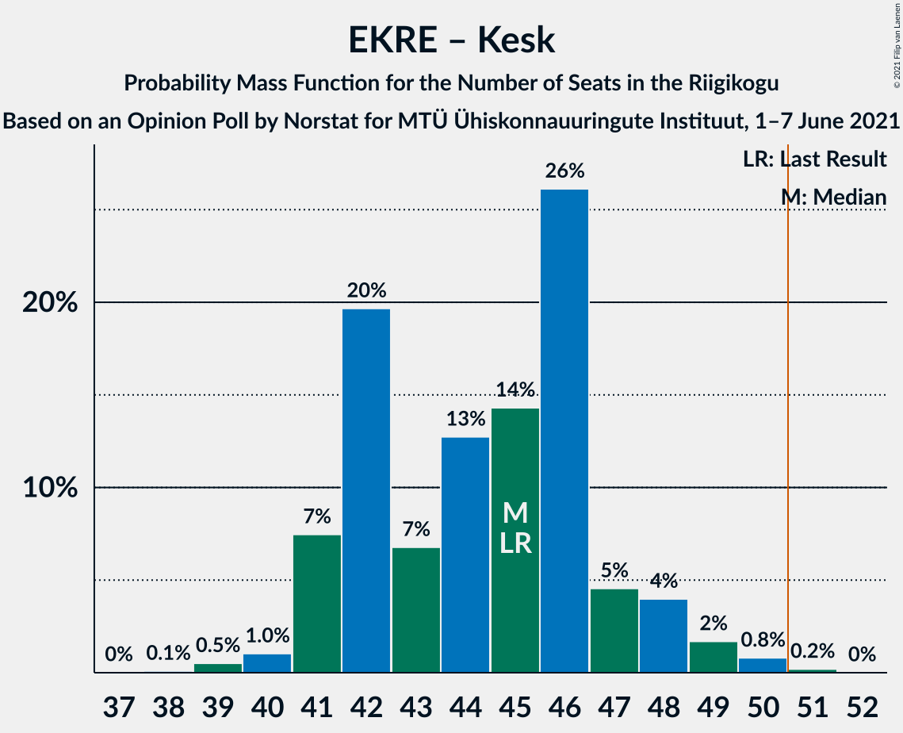

| Number of Seats | Probability | Accumulated | Special Marks |
|:---------------:|:-----------:|:-----------:|:-------------:|
| 38 | 0.1% | 100% |  |
| 39 | 0.5% | 99.9% |  |
| 40 | 1.0% | 99.4% |  |
| 41 | 7% | 98% |  |
| 42 | 20% | 91% |  |
| 43 | 7% | 71% |  |
| 44 | 13% | 64% |  |
| 45 | 14% | 52% | Last Result, Median |
| 46 | 26% | 37% |  |
| 47 | 5% | 11% |  |
| 48 | 4% | 7% |  |
| 49 | 2% | 3% |  |
| 50 | 0.8% | 1.0% |  |
| 51 | 0.2% | 0.2% | Majority |
| 52 | 0% | 0% |  |

### Eesti Reformierakond – Sotsiaaldemokraatlik Erakond – Erakond Isamaa

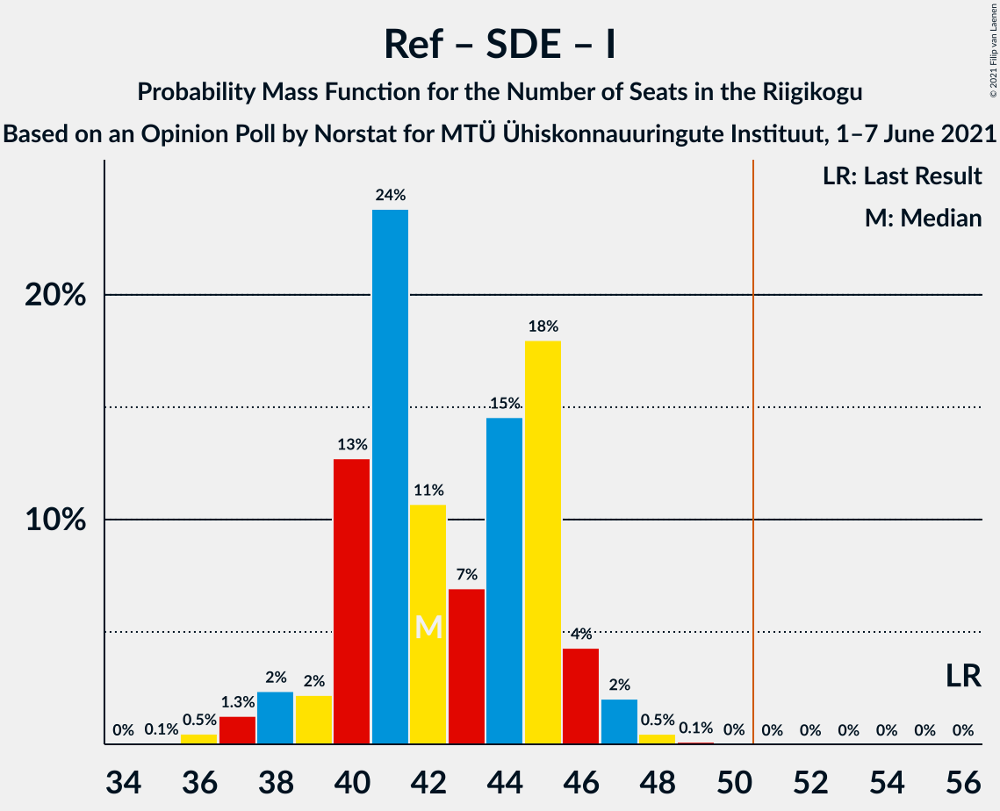

| Number of Seats | Probability | Accumulated | Special Marks |
|:---------------:|:-----------:|:-----------:|:-------------:|
| 35 | 0.1% | 100% |  |
| 36 | 0.5% | 99.9% |  |
| 37 | 1.3% | 99.5% |  |
| 38 | 2% | 98% |  |
| 39 | 2% | 96% |  |
| 40 | 13% | 94% |  |
| 41 | 24% | 81% |  |
| 42 | 11% | 57% |  |
| 43 | 7% | 46% | Median |
| 44 | 15% | 39% |  |
| 45 | 18% | 25% |  |
| 46 | 4% | 7% |  |
| 47 | 2% | 3% |  |
| 48 | 0.5% | 0.6% |  |
| 49 | 0.1% | 0.1% |  |
| 50 | 0% | 0% |  |
| 51 | 0% | 0% | Majority |
| 52 | 0% | 0% |  |
| 53 | 0% | 0% |  |
| 54 | 0% | 0% |  |
| 55 | 0% | 0% |  |
| 56 | 0% | 0% | Last Result |

### Eesti Reformierakond – Sotsiaaldemokraatlik Erakond

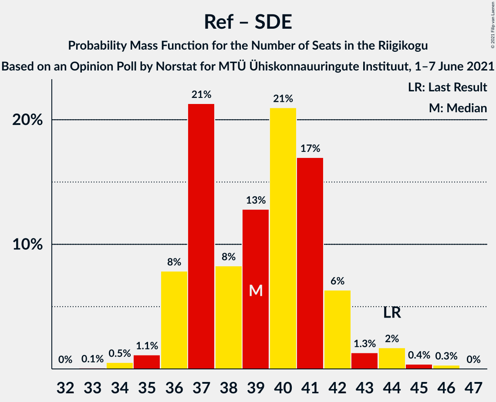

| Number of Seats | Probability | Accumulated | Special Marks |
|:---------------:|:-----------:|:-----------:|:-------------:|
| 33 | 0.1% | 100% |  |
| 34 | 0.5% | 99.9% |  |
| 35 | 1.1% | 99.4% |  |
| 36 | 8% | 98% |  |
| 37 | 21% | 90% |  |
| 38 | 8% | 69% |  |
| 39 | 13% | 61% | Median |
| 40 | 21% | 48% |  |
| 41 | 17% | 27% |  |
| 42 | 6% | 10% |  |
| 43 | 1.3% | 4% |  |
| 44 | 2% | 2% | Last Result |
| 45 | 0.4% | 0.7% |  |
| 46 | 0.3% | 0.3% |  |
| 47 | 0% | 0% |  |

### Eesti Reformierakond – Erakond Isamaa

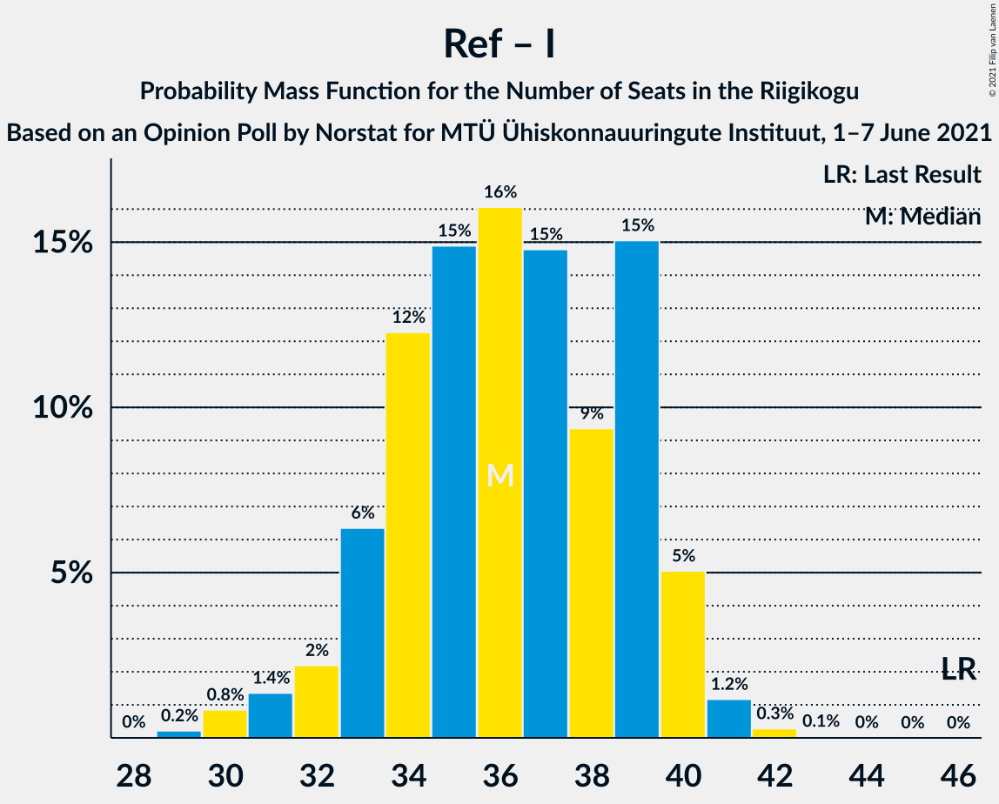

| Number of Seats | Probability | Accumulated | Special Marks |
|:---------------:|:-----------:|:-----------:|:-------------:|
| 29 | 0.2% | 100% |  |
| 30 | 0.8% | 99.8% |  |
| 31 | 1.4% | 98.9% |  |
| 32 | 2% | 98% |  |
| 33 | 6% | 95% |  |
| 34 | 12% | 89% |  |
| 35 | 15% | 77% |  |
| 36 | 16% | 62% |  |
| 37 | 15% | 46% | Median |
| 38 | 9% | 31% |  |
| 39 | 15% | 22% |  |
| 40 | 5% | 7% |  |
| 41 | 1.2% | 2% |  |
| 42 | 0.3% | 0.4% |  |
| 43 | 0.1% | 0.1% |  |
| 44 | 0% | 0% |  |
| 45 | 0% | 0% |  |
| 46 | 0% | 0% | Last Result |

### Eesti Keskerakond – Sotsiaaldemokraatlik Erakond – Erakond Isamaa

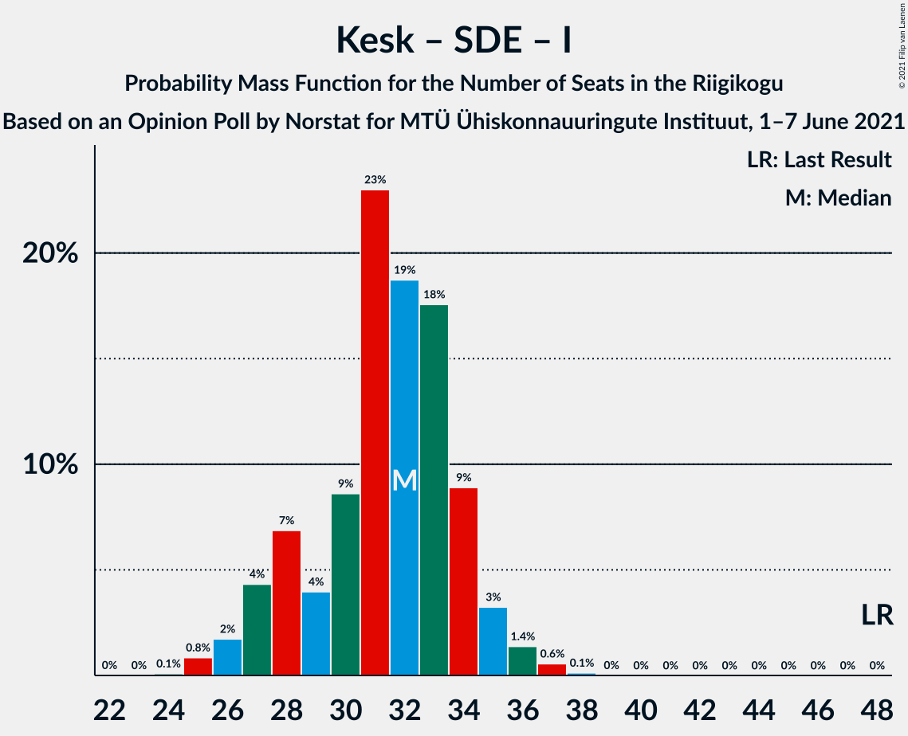

| Number of Seats | Probability | Accumulated | Special Marks |
|:---------------:|:-----------:|:-----------:|:-------------:|
| 24 | 0.1% | 100% |  |
| 25 | 0.8% | 99.9% |  |
| 26 | 2% | 99.0% |  |
| 27 | 4% | 97% |  |
| 28 | 7% | 93% |  |
| 29 | 4% | 86% |  |
| 30 | 9% | 82% |  |
| 31 | 23% | 74% |  |
| 32 | 19% | 51% | Median |
| 33 | 18% | 32% |  |
| 34 | 9% | 14% |  |
| 35 | 3% | 5% |  |
| 36 | 1.4% | 2% |  |
| 37 | 0.6% | 0.7% |  |
| 38 | 0.1% | 0.1% |  |
| 39 | 0% | 0% |  |
| 40 | 0% | 0% |  |
| 41 | 0% | 0% |  |
| 42 | 0% | 0% |  |
| 43 | 0% | 0% |  |
| 44 | 0% | 0% |  |
| 45 | 0% | 0% |  |
| 46 | 0% | 0% |  |
| 47 | 0% | 0% |  |
| 48 | 0% | 0% | Last Result |

### Eesti Konservatiivne Rahvaerakond – Sotsiaaldemokraatlik Erakond

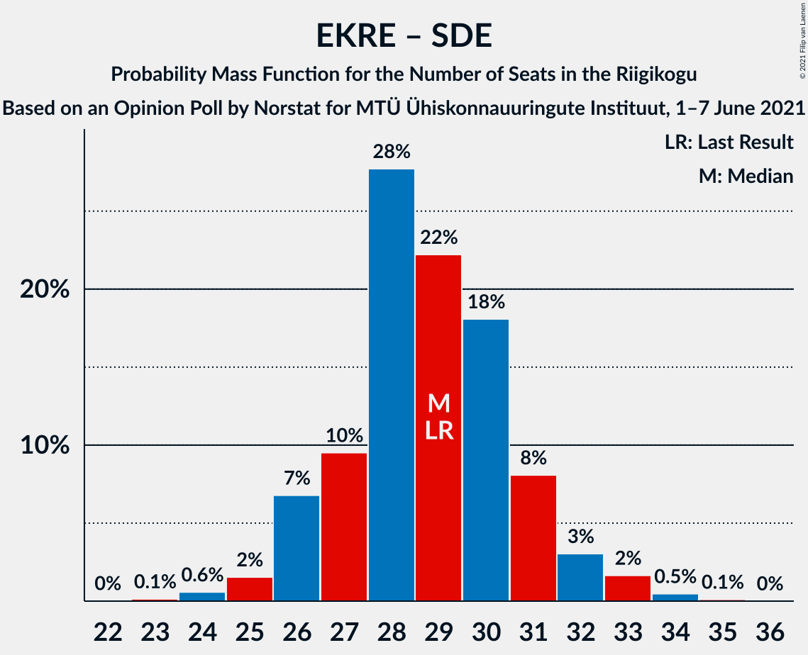

| Number of Seats | Probability | Accumulated | Special Marks |
|:---------------:|:-----------:|:-----------:|:-------------:|
| 23 | 0.1% | 100% |  |
| 24 | 0.6% | 99.8% |  |
| 25 | 2% | 99.2% |  |
| 26 | 7% | 98% |  |
| 27 | 10% | 91% |  |
| 28 | 28% | 81% |  |
| 29 | 22% | 54% | Last Result, Median |
| 30 | 18% | 31% |  |
| 31 | 8% | 13% |  |
| 32 | 3% | 5% |  |
| 33 | 2% | 2% |  |
| 34 | 0.5% | 0.6% |  |
| 35 | 0.1% | 0.1% |  |
| 36 | 0% | 0% |  |

### Eesti Keskerakond – Sotsiaaldemokraatlik Erakond

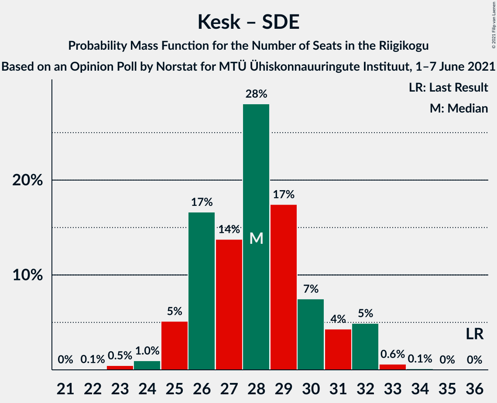

| Number of Seats | Probability | Accumulated | Special Marks |
|:---------------:|:-----------:|:-----------:|:-------------:|
| 22 | 0.1% | 100% |  |
| 23 | 0.5% | 99.9% |  |
| 24 | 1.0% | 99.4% |  |
| 25 | 5% | 98% |  |
| 26 | 17% | 93% |  |
| 27 | 14% | 77% |  |
| 28 | 28% | 63% | Median |
| 29 | 17% | 35% |  |
| 30 | 7% | 17% |  |
| 31 | 4% | 10% |  |
| 32 | 5% | 6% |  |
| 33 | 0.6% | 0.8% |  |
| 34 | 0.1% | 0.1% |  |
| 35 | 0% | 0% |  |
| 36 | 0% | 0% | Last Result |

## Technical Information

### Opinion Poll

+ **Polling firm:** Norstat
+ **Commissioner(s):** MTÜ Ühiskonnauuringute Instituut
+ **Fieldwork period:** 1–7 June 2021

### Calculations

+ **Sample size:** 1000
+ **Simulations done:** 131,072
+ **Error estimate:** 1.54%

