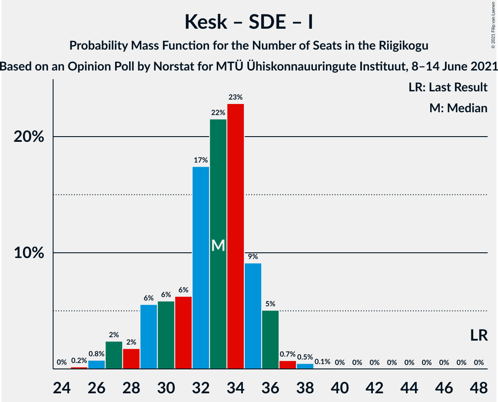

# Opinion Poll by Norstat for MTÜ Ühiskonnauuringute Instituut, 8–14 June 2021

<a href="#voting-intentions">Voting Intentions</a> | <a href="#seats">Seats</a> | <a href="#coalitions">Coalitions</a> | <a href="#technical-information">Technical Information</a>

## Voting Intentions

### Confidence Intervals

| Party | Last Result | Poll Result | 80% Confidence Interval | 90% Confidence Interval | 95% Confidence Interval | 99% Confidence Interval |
|:-----:|:-----------:|:-----------:|:-----------------------:|:-----------------------:|:-----------------------:|:-----------------------:|
| Eesti Reformierakond | 28.9% | 26.6% | 24.9–28.5% |24.4–29.0% |23.9–29.4% |23.1–30.3% |
| Eesti Konservatiivne Rahvaerakond | 17.8% | 25.5% | 23.8–27.3% |23.3–27.8% |22.9–28.3% |22.1–29.2% |
| Eesti Keskerakond | 23.1% | 18.8% | 17.3–20.5% |16.9–20.9% |16.5–21.4% |15.8–22.2% |
| Eesti 200 | 4.4% | 10.9% | 9.7–12.3% |9.4–12.7% |9.1–13.0% |8.6–13.7% |
| Sotsiaaldemokraatlik Erakond | 9.8% | 8.5% | 7.5–9.7% |7.2–10.1% |6.9–10.4% |6.5–11.0% |
| Erakond Isamaa | 11.4% | 5.6% | 4.8–6.6% |4.5–7.0% |4.3–7.2% |4.0–7.7% |
| Erakond Eestimaa Rohelised | 1.8% | 1.7% | 1.3–2.4% |1.2–2.5% |1.1–2.7% |0.9–3.1% |

*Note:* The poll result column reflects the actual value used in the calculations. Published results may vary slightly, and in addition be rounded to fewer digits.

## Seats

### Confidence Intervals

| Party | Last Result | Median | 80% Confidence Interval | 90% Confidence Interval | 95% Confidence Interval | 99% Confidence Interval |
|:-----:|:-----------:|:------:|:-----------------------:|:-----------------------:|:-----------------------:|:-----------------------:|
| <a href="#eesti-reformierakond">Eesti Reformierakond</a> | 34 | 29 | 27–32 |27–32 |26–33 |25–34 |
| <a href="#eesti-konservatiivne-rahvaerakond">Eesti Konservatiivne Rahvaerakond</a> | 19 | 28 | 26–31 |25–31 |25–32 |24–33 |
| <a href="#eesti-keskerakond">Eesti Keskerakond</a> | 26 | 20 | 18–22 |18–23 |17–23 |16–24 |
| <a href="#eesti-200">Eesti 200</a> | 0 | 11 | 10–12 |9–12 |8–13 |8–14 |
| <a href="#sotsiaaldemokraatlik-erakond">Sotsiaaldemokraatlik Erakond</a> | 10 | 8 | 7–9 |6–10 |6–10 |6–11 |
| <a href="#erakond-isamaa">Erakond Isamaa</a> | 12 | 5 | 0–6 |0–6 |0–6 |0–7 |
| <a href="#erakond-eestimaa-rohelised">Erakond Eestimaa Rohelised</a> | 0 | 0 | 0 |0 |0 |0 |

### Eesti Reformierakond

*For a full overview of the results for this party, see the [Eesti Reformierakond](party-eestireformierakond.html) page.*

| Number of Seats | Probability | Accumulated | Special Marks |
|:---------------:|:-----------:|:-----------:|:-------------:|
| 24 | 0.1% | 100% |  |
| 25 | 0.5% | 99.9% |  |
| 26 | 4% | 99.4% |  |
| 27 | 9% | 95% |  |
| 28 | 16% | 86% |  |
| 29 | 30% | 70% | Median |
| 30 | 14% | 39% |  |
| 31 | 15% | 26% |  |
| 32 | 6% | 11% |  |
| 33 | 3% | 5% |  |
| 34 | 1.2% | 2% | Last Result |
| 35 | 0.3% | 0.4% |  |
| 36 | 0.1% | 0.1% |  |
| 37 | 0% | 0% |  |

### Eesti Konservatiivne Rahvaerakond

*For a full overview of the results for this party, see the [Eesti Konservatiivne Rahvaerakond](party-eestikonservatiivnerahvaerakond.html) page.*

| Number of Seats | Probability | Accumulated | Special Marks |
|:---------------:|:-----------:|:-----------:|:-------------:|
| 19 | 0% | 100% | Last Result |
| 20 | 0% | 100% |  |
| 21 | 0% | 100% |  |
| 22 | 0% | 100% |  |
| 23 | 0.2% | 100% |  |
| 24 | 2% | 99.7% |  |
| 25 | 4% | 98% |  |
| 26 | 15% | 94% |  |
| 27 | 19% | 80% |  |
| 28 | 14% | 60% | Median |
| 29 | 20% | 46% |  |
| 30 | 15% | 26% |  |
| 31 | 7% | 11% |  |
| 32 | 3% | 4% |  |
| 33 | 0.7% | 1.0% |  |
| 34 | 0.3% | 0.3% |  |
| 35 | 0.1% | 0.1% |  |
| 36 | 0% | 0% |  |

### Eesti Keskerakond

*For a full overview of the results for this party, see the [Eesti Keskerakond](party-eestikeskerakond.html) page.*

| Number of Seats | Probability | Accumulated | Special Marks |
|:---------------:|:-----------:|:-----------:|:-------------:|
| 15 | 0.1% | 100% |  |
| 16 | 0.7% | 99.9% |  |
| 17 | 2% | 99.2% |  |
| 18 | 9% | 97% |  |
| 19 | 22% | 88% |  |
| 20 | 23% | 66% | Median |
| 21 | 19% | 43% |  |
| 22 | 18% | 24% |  |
| 23 | 5% | 6% |  |
| 24 | 1.0% | 1.2% |  |
| 25 | 0.1% | 0.2% |  |
| 26 | 0% | 0% | Last Result |

### Eesti 200

*For a full overview of the results for this party, see the [Eesti 200](party-eesti200.html) page.*

| Number of Seats | Probability | Accumulated | Special Marks |
|:---------------:|:-----------:|:-----------:|:-------------:|
| 0 | 0% | 100% | Last Result |
| 1 | 0% | 100% |  |
| 2 | 0% | 100% |  |
| 3 | 0% | 100% |  |
| 4 | 0% | 100% |  |
| 5 | 0% | 100% |  |
| 6 | 0% | 100% |  |
| 7 | 0.1% | 100% |  |
| 8 | 3% | 99.9% |  |
| 9 | 4% | 97% |  |
| 10 | 27% | 93% |  |
| 11 | 42% | 65% | Median |
| 12 | 20% | 24% |  |
| 13 | 2% | 4% |  |
| 14 | 2% | 2% |  |
| 15 | 0.4% | 0.4% |  |
| 16 | 0% | 0% |  |

### Sotsiaaldemokraatlik Erakond

*For a full overview of the results for this party, see the [Sotsiaaldemokraatlik Erakond](party-sotsiaaldemokraatlikerakond.html) page.*

| Number of Seats | Probability | Accumulated | Special Marks |
|:---------------:|:-----------:|:-----------:|:-------------:|
| 5 | 0.2% | 100% |  |
| 6 | 7% | 99.8% |  |
| 7 | 34% | 93% |  |
| 8 | 31% | 58% | Median |
| 9 | 19% | 27% |  |
| 10 | 7% | 8% | Last Result |
| 11 | 2% | 2% |  |
| 12 | 0.1% | 0.1% |  |
| 13 | 0% | 0% |  |

### Erakond Isamaa

*For a full overview of the results for this party, see the [Erakond Isamaa](party-erakondisamaa.html) page.*

| Number of Seats | Probability | Accumulated | Special Marks |
|:---------------:|:-----------:|:-----------:|:-------------:|
| 0 | 15% | 100% |  |
| 1 | 0% | 85% |  |
| 2 | 0% | 85% |  |
| 3 | 0% | 85% |  |
| 4 | 4% | 85% |  |
| 5 | 55% | 81% | Median |
| 6 | 25% | 27% |  |
| 7 | 1.4% | 2% |  |
| 8 | 0.1% | 0.1% |  |
| 9 | 0% | 0% |  |
| 10 | 0% | 0% |  |
| 11 | 0% | 0% |  |
| 12 | 0% | 0% | Last Result |

### Erakond Eestimaa Rohelised

*For a full overview of the results for this party, see the [Erakond Eestimaa Rohelised](party-erakondeestimaarohelised.html) page.*

| Number of Seats | Probability | Accumulated | Special Marks |
|:---------------:|:-----------:|:-----------:|:-------------:|
| 0 | 100% | 100% | Last Result, Median |

## Coalitions

### Confidence Intervals

| Coalition | Last Result | Median | Majority? | 80% Confidence Interval | 90% Confidence Interval | 95% Confidence Interval | 99% Confidence Interval |
|:---------:|:-----------:|:------:|:---------:|:-----------------------:|:-----------------------:|:-----------------------:|:-----------------------:|
| Eesti Reformierakond – Eesti Konservatiivne Rahvaerakond – Eesti Keskerakond | 79 | 77 | 100% | 75–80 | 75–81 | 74–82 | 74–83 |
| Eesti Reformierakond – Eesti Konservatiivne Rahvaerakond – Erakond Isamaa | 65 | 62 | 100% | 60–65 | 59–65 | 58–66 | 57–67 |
| Eesti Reformierakond – Eesti Konservatiivne Rahvaerakond | 53 | 57 | 100% | 55–61 | 54–62 | 54–63 | 53–64 |
| Eesti Konservatiivne Rahvaerakond – Eesti Keskerakond – Erakond Isamaa | 57 | 53 | 85% | 50–56 | 49–56 | 48–57 | 47–58 |
| Eesti Reformierakond – Eesti Keskerakond | 60 | 50 | 31% | 47–52 | 46–53 | 46–53 | 44–55 |
| Eesti Konservatiivne Rahvaerakond – Eesti Keskerakond | 45 | 48 | 16% | 46–51 | 45–52 | 45–52 | 44–54 |
| Eesti Reformierakond – Sotsiaaldemokraatlik Erakond – Erakond Isamaa | 56 | 42 | 0% | 39–44 | 39–45 | 38–45 | 36–47 |
| Eesti Reformierakond – Sotsiaaldemokraatlik Erakond | 44 | 37 | 0% | 35–40 | 34–41 | 34–42 | 33–43 |
| Eesti Konservatiivne Rahvaerakond – Sotsiaaldemokraatlik Erakond | 29 | 36 | 0% | 33–39 | 33–40 | 33–41 | 31–42 |
| Eesti Reformierakond – Erakond Isamaa | 46 | 34 | 0% | 31–36 | 30–37 | 29–38 | 28–39 |
| Eesti Keskerakond – Sotsiaaldemokraatlik Erakond – Erakond Isamaa | 48 | 33 | 0% | 29–35 | 28–36 | 27–36 | 26–38 |
| Eesti Keskerakond – Sotsiaaldemokraatlik Erakond | 36 | 28 | 0% | 26–30 | 25–31 | 25–31 | 24–33 |

### Eesti Reformierakond – Eesti Konservatiivne Rahvaerakond – Eesti Keskerakond

| Number of Seats | Probability | Accumulated | Special Marks |
|:---------------:|:-----------:|:-----------:|:-------------:|
| 72 | 0.2% | 100% |  |
| 73 | 0.3% | 99.8% |  |
| 74 | 3% | 99.5% |  |
| 75 | 9% | 97% |  |
| 76 | 10% | 88% |  |
| 77 | 29% | 77% | Median |
| 78 | 13% | 49% |  |
| 79 | 19% | 36% | Last Result |
| 80 | 7% | 17% |  |
| 81 | 5% | 10% |  |
| 82 | 3% | 4% |  |
| 83 | 0.7% | 0.9% |  |
| 84 | 0.1% | 0.3% |  |
| 85 | 0.1% | 0.1% |  |
| 86 | 0% | 0% |  |

### Eesti Reformierakond – Eesti Konservatiivne Rahvaerakond – Erakond Isamaa

| Number of Seats | Probability | Accumulated | Special Marks |
|:---------------:|:-----------:|:-----------:|:-------------:|
| 55 | 0.1% | 100% |  |
| 56 | 0.3% | 99.9% |  |
| 57 | 0.3% | 99.6% |  |
| 58 | 2% | 99.3% |  |
| 59 | 7% | 97% |  |
| 60 | 13% | 90% |  |
| 61 | 20% | 77% |  |
| 62 | 18% | 58% | Median |
| 63 | 19% | 39% |  |
| 64 | 8% | 21% |  |
| 65 | 8% | 12% | Last Result |
| 66 | 3% | 5% |  |
| 67 | 2% | 2% |  |
| 68 | 0.2% | 0.2% |  |
| 69 | 0% | 0% |  |

### Eesti Reformierakond – Eesti Konservatiivne Rahvaerakond

| Number of Seats | Probability | Accumulated | Special Marks |
|:---------------:|:-----------:|:-----------:|:-------------:|
| 51 | 0.1% | 100% | Majority |
| 52 | 0.1% | 99.9% |  |
| 53 | 0.9% | 99.8% | Last Result |
| 54 | 4% | 98.9% |  |
| 55 | 16% | 94% |  |
| 56 | 13% | 78% |  |
| 57 | 17% | 65% | Median |
| 58 | 20% | 48% |  |
| 59 | 10% | 28% |  |
| 60 | 6% | 18% |  |
| 61 | 6% | 12% |  |
| 62 | 3% | 6% |  |
| 63 | 1.1% | 3% |  |
| 64 | 1.4% | 2% |  |
| 65 | 0.1% | 0.2% |  |
| 66 | 0.1% | 0.1% |  |
| 67 | 0% | 0% |  |

### Eesti Konservatiivne Rahvaerakond – Eesti Keskerakond – Erakond Isamaa

| Number of Seats | Probability | Accumulated | Special Marks |
|:---------------:|:-----------:|:-----------:|:-------------:|
| 45 | 0.1% | 100% |  |
| 46 | 0.2% | 99.9% |  |
| 47 | 0.5% | 99.7% |  |
| 48 | 2% | 99.2% |  |
| 49 | 5% | 97% |  |
| 50 | 7% | 92% |  |
| 51 | 14% | 85% | Majority |
| 52 | 14% | 71% |  |
| 53 | 9% | 57% | Median |
| 54 | 19% | 48% |  |
| 55 | 16% | 29% |  |
| 56 | 10% | 13% |  |
| 57 | 2% | 3% | Last Result |
| 58 | 0.8% | 0.9% |  |
| 59 | 0.1% | 0.1% |  |
| 60 | 0% | 0% |  |

### Eesti Reformierakond – Eesti Keskerakond

| Number of Seats | Probability | Accumulated | Special Marks |
|:---------------:|:-----------:|:-----------:|:-------------:|
| 43 | 0.1% | 100% |  |
| 44 | 0.5% | 99.9% |  |
| 45 | 2% | 99.4% |  |
| 46 | 4% | 98% |  |
| 47 | 5% | 93% |  |
| 48 | 16% | 88% |  |
| 49 | 16% | 72% | Median |
| 50 | 25% | 56% |  |
| 51 | 18% | 31% | Majority |
| 52 | 6% | 12% |  |
| 53 | 4% | 6% |  |
| 54 | 1.4% | 2% |  |
| 55 | 0.5% | 0.7% |  |
| 56 | 0.1% | 0.2% |  |
| 57 | 0.1% | 0.1% |  |
| 58 | 0% | 0% |  |
| 59 | 0% | 0% |  |
| 60 | 0% | 0% | Last Result |

### Eesti Konservatiivne Rahvaerakond – Eesti Keskerakond

| Number of Seats | Probability | Accumulated | Special Marks |
|:---------------:|:-----------:|:-----------:|:-------------:|
| 42 | 0.1% | 100% |  |
| 43 | 0.4% | 99.9% |  |
| 44 | 2% | 99.5% |  |
| 45 | 4% | 98% | Last Result |
| 46 | 12% | 94% |  |
| 47 | 17% | 83% |  |
| 48 | 18% | 66% | Median |
| 49 | 17% | 48% |  |
| 50 | 16% | 32% |  |
| 51 | 11% | 16% | Majority |
| 52 | 3% | 5% |  |
| 53 | 1.4% | 2% |  |
| 54 | 0.5% | 0.6% |  |
| 55 | 0.1% | 0.1% |  |
| 56 | 0% | 0% |  |

### Eesti Reformierakond – Sotsiaaldemokraatlik Erakond – Erakond Isamaa

| Number of Seats | Probability | Accumulated | Special Marks |
|:---------------:|:-----------:|:-----------:|:-------------:|
| 34 | 0.1% | 100% |  |
| 35 | 0.2% | 99.9% |  |
| 36 | 0.5% | 99.8% |  |
| 37 | 1.3% | 99.3% |  |
| 38 | 3% | 98% |  |
| 39 | 7% | 95% |  |
| 40 | 15% | 88% |  |
| 41 | 16% | 74% |  |
| 42 | 23% | 58% | Median |
| 43 | 20% | 35% |  |
| 44 | 8% | 14% |  |
| 45 | 4% | 6% |  |
| 46 | 1.4% | 2% |  |
| 47 | 0.6% | 1.0% |  |
| 48 | 0.3% | 0.3% |  |
| 49 | 0.1% | 0.1% |  |
| 50 | 0% | 0% |  |
| 51 | 0% | 0% | Majority |
| 52 | 0% | 0% |  |
| 53 | 0% | 0% |  |
| 54 | 0% | 0% |  |
| 55 | 0% | 0% |  |
| 56 | 0% | 0% | Last Result |

### Eesti Reformierakond – Sotsiaaldemokraatlik Erakond

| Number of Seats | Probability | Accumulated | Special Marks |
|:---------------:|:-----------:|:-----------:|:-------------:|
| 32 | 0.1% | 100% |  |
| 33 | 0.9% | 99.9% |  |
| 34 | 5% | 98.9% |  |
| 35 | 15% | 94% |  |
| 36 | 23% | 79% |  |
| 37 | 15% | 56% | Median |
| 38 | 17% | 41% |  |
| 39 | 10% | 24% |  |
| 40 | 5% | 14% |  |
| 41 | 5% | 9% |  |
| 42 | 4% | 4% |  |
| 43 | 0.7% | 0.8% |  |
| 44 | 0.1% | 0.2% | Last Result |
| 45 | 0% | 0% |  |

### Eesti Konservatiivne Rahvaerakond – Sotsiaaldemokraatlik Erakond

| Number of Seats | Probability | Accumulated | Special Marks |
|:---------------:|:-----------:|:-----------:|:-------------:|
| 29 | 0% | 100% | Last Result |
| 30 | 0.1% | 100% |  |
| 31 | 0.8% | 99.9% |  |
| 32 | 1.3% | 99.1% |  |
| 33 | 8% | 98% |  |
| 34 | 16% | 90% |  |
| 35 | 16% | 74% |  |
| 36 | 18% | 57% | Median |
| 37 | 17% | 39% |  |
| 38 | 8% | 23% |  |
| 39 | 6% | 14% |  |
| 40 | 5% | 8% |  |
| 41 | 2% | 3% |  |
| 42 | 0.9% | 1.1% |  |
| 43 | 0.2% | 0.2% |  |
| 44 | 0% | 0% |  |

### Eesti Reformierakond – Erakond Isamaa

| Number of Seats | Probability | Accumulated | Special Marks |
|:---------------:|:-----------:|:-----------:|:-------------:|
| 26 | 0% | 100% |  |
| 27 | 0.2% | 99.9% |  |
| 28 | 0.8% | 99.7% |  |
| 29 | 2% | 98.9% |  |
| 30 | 4% | 97% |  |
| 31 | 7% | 93% |  |
| 32 | 9% | 86% |  |
| 33 | 15% | 76% |  |
| 34 | 24% | 62% | Median |
| 35 | 18% | 38% |  |
| 36 | 12% | 20% |  |
| 37 | 5% | 8% |  |
| 38 | 2% | 3% |  |
| 39 | 0.8% | 1.0% |  |
| 40 | 0.2% | 0.2% |  |
| 41 | 0% | 0% |  |
| 42 | 0% | 0% |  |
| 43 | 0% | 0% |  |
| 44 | 0% | 0% |  |
| 45 | 0% | 0% |  |
| 46 | 0% | 0% | Last Result |

### Eesti Keskerakond – Sotsiaaldemokraatlik Erakond – Erakond Isamaa

| Number of Seats | Probability | Accumulated | Special Marks |
|:---------------:|:-----------:|:-----------:|:-------------:|
| 25 | 0.2% | 100% |  |
| 26 | 0.8% | 99.8% |  |
| 27 | 2% | 99.0% |  |
| 28 | 2% | 97% |  |
| 29 | 6% | 95% |  |
| 30 | 6% | 89% |  |
| 31 | 6% | 83% |  |
| 32 | 17% | 77% |  |
| 33 | 22% | 60% | Median |
| 34 | 23% | 38% |  |
| 35 | 9% | 15% |  |
| 36 | 5% | 6% |  |
| 37 | 0.7% | 1.3% |  |
| 38 | 0.5% | 0.6% |  |
| 39 | 0.1% | 0.1% |  |
| 40 | 0% | 0% |  |
| 41 | 0% | 0% |  |
| 42 | 0% | 0% |  |
| 43 | 0% | 0% |  |
| 44 | 0% | 0% |  |
| 45 | 0% | 0% |  |
| 46 | 0% | 0% |  |
| 47 | 0% | 0% |  |
| 48 | 0% | 0% | Last Result |

### Eesti Keskerakond – Sotsiaaldemokraatlik Erakond

| Number of Seats | Probability | Accumulated | Special Marks |
|:---------------:|:-----------:|:-----------:|:-------------:|
| 23 | 0.4% | 100% |  |
| 24 | 2% | 99.6% |  |
| 25 | 5% | 98% |  |
| 26 | 11% | 93% |  |
| 27 | 16% | 83% |  |
| 28 | 24% | 66% | Median |
| 29 | 23% | 42% |  |
| 30 | 10% | 19% |  |
| 31 | 7% | 9% |  |
| 32 | 2% | 2% |  |
| 33 | 0.6% | 0.7% |  |
| 34 | 0.1% | 0.1% |  |
| 35 | 0% | 0% |  |
| 36 | 0% | 0% | Last Result |

## Technical Information

### Opinion Poll

+ **Polling firm:** Norstat
+ **Commissioner(s):** MTÜ Ühiskonnauuringute Instituut
+ **Fieldwork period:** 8–14 June 2021

### Calculations

+ **Sample size:** 1000
+ **Simulations done:** 131,072
+ **Error estimate:** 1.74%

