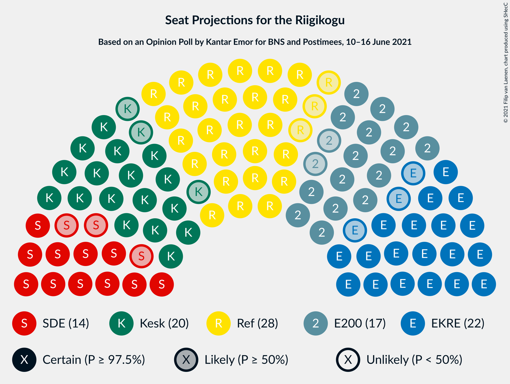
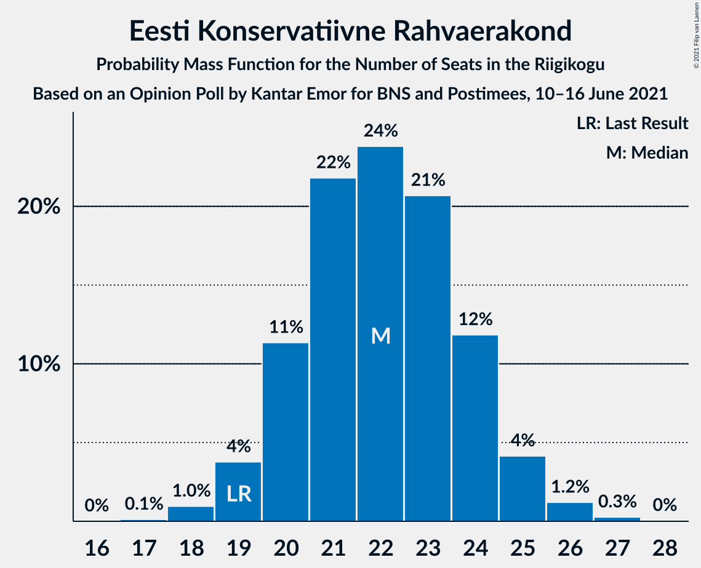
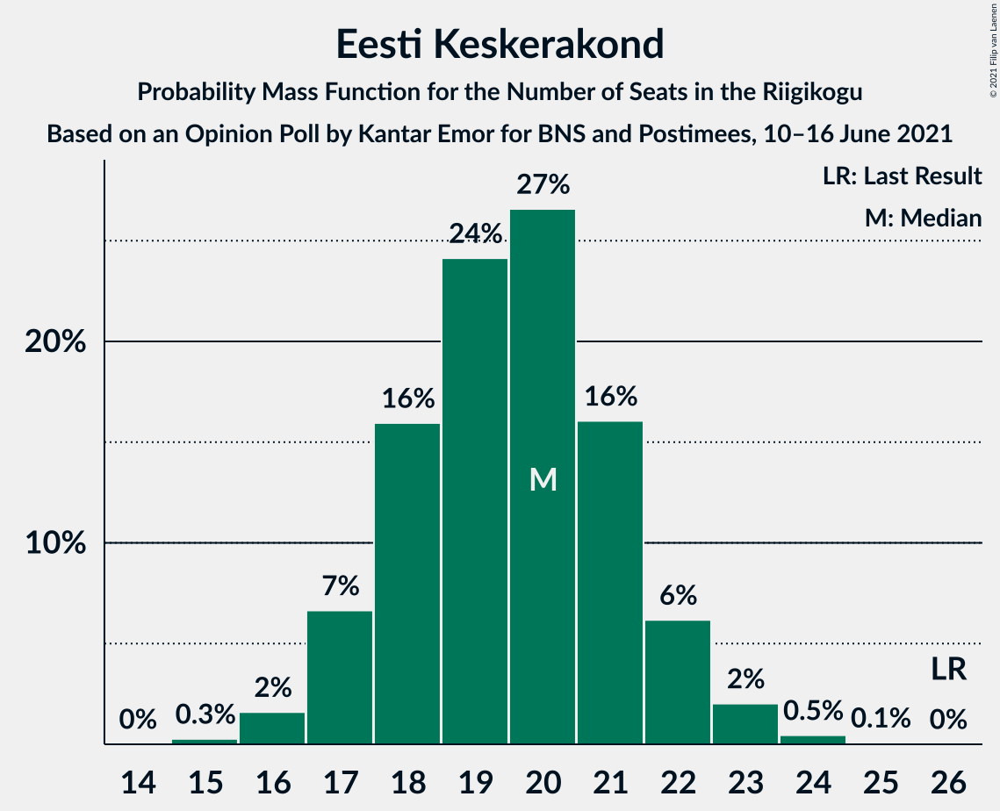
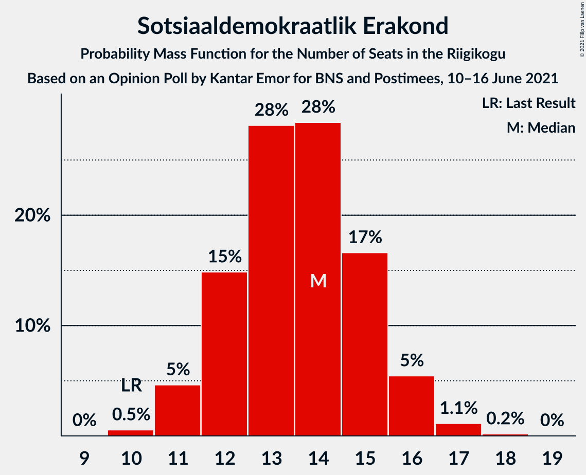
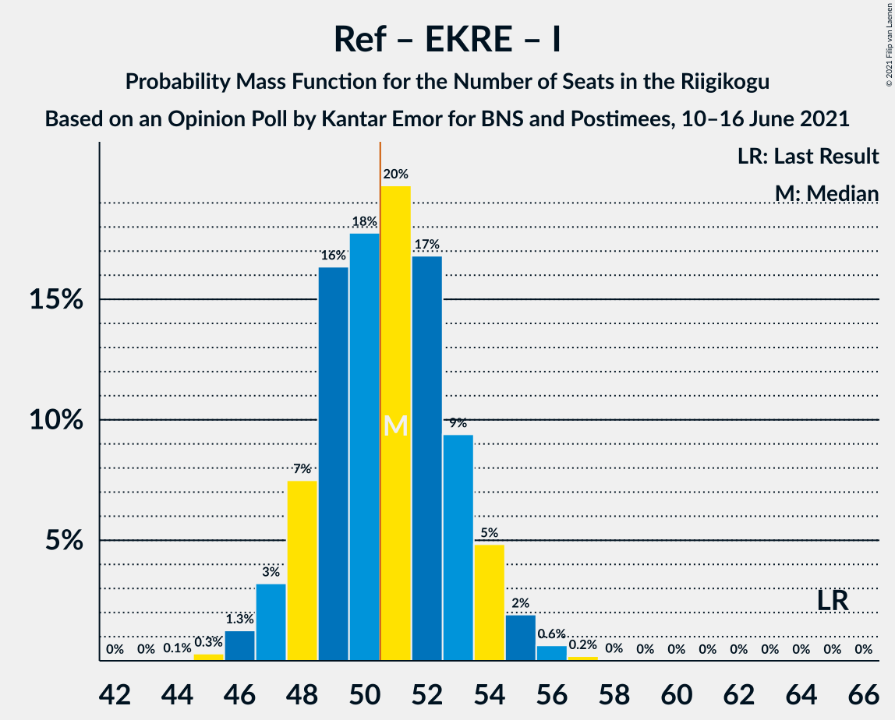
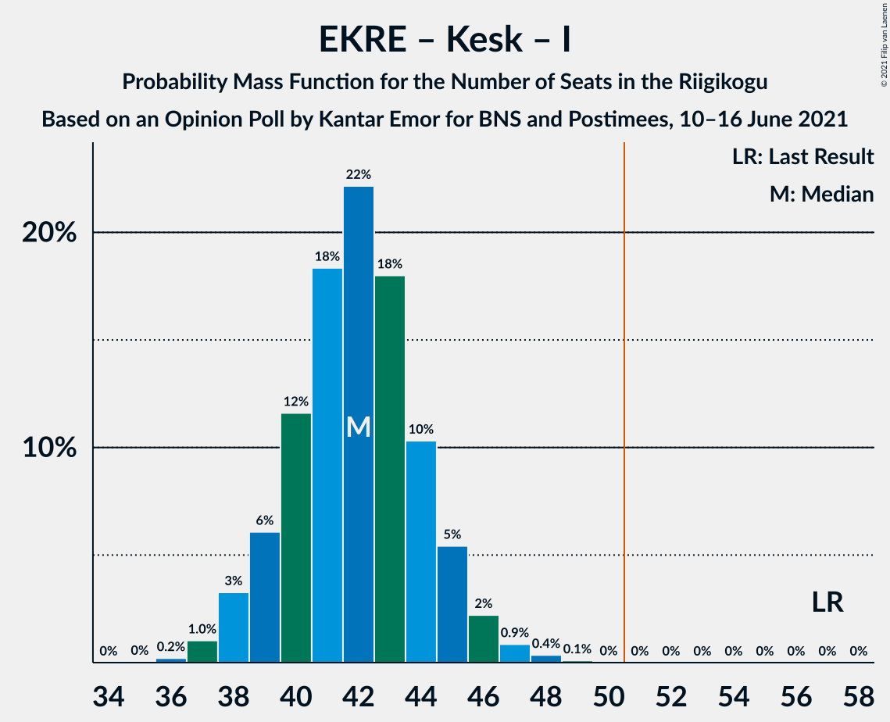
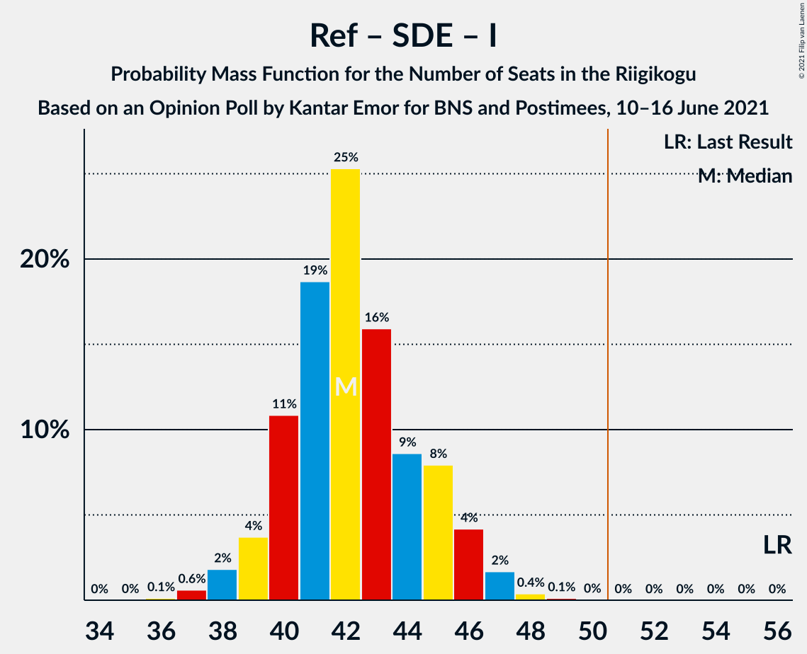
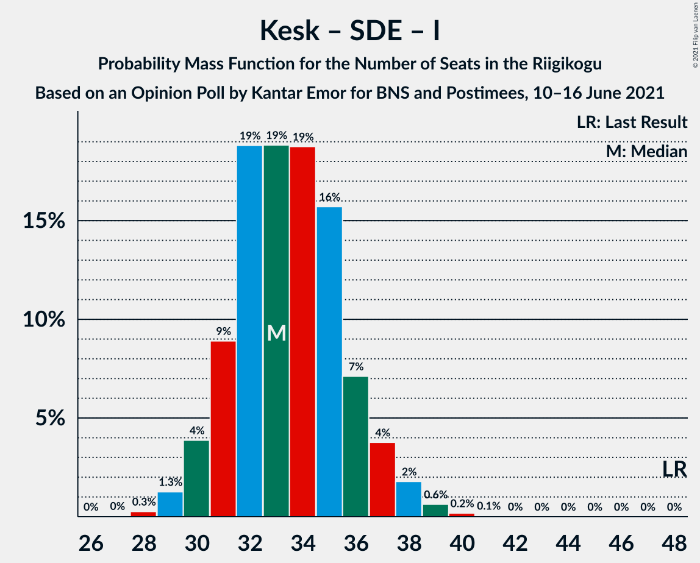

# Opinion Poll by Kantar Emor for BNS and Postimees, 10–16 June 2021

<a href="#voting-intentions">Voting Intentions</a> | <a href="#seats">Seats</a> | <a href="#coalitions">Coalitions</a> | <a href="#technical-information">Technical Information</a>

## Voting Intentions

### Confidence Intervals

| Party | Last Result | Poll Result | 80% Confidence Interval | 90% Confidence Interval | 95% Confidence Interval | 99% Confidence Interval |
|:-----:|:-----------:|:-----------:|:-----------------------:|:-----------------------:|:-----------------------:|:-----------------------:|
| Eesti Reformierakond | 28.9% | 25.0% | 23.3–26.8% |22.8–27.3% |22.4–27.8% |21.6–28.7% |
| Eesti Konservatiivne Rahvaerakond | 17.8% | 20.0% | 18.4–21.7% |18.0–22.1% |17.6–22.6% |16.9–23.4% |
| Eesti Keskerakond | 23.1% | 18.0% | 16.5–19.6% |16.0–20.1% |15.7–20.5% |15.0–21.3% |
| Eesti 200 | 4.4% | 16.0% | 14.6–17.6% |14.2–18.1% |13.9–18.5% |13.2–19.2% |
| Sotsiaaldemokraatlik Erakond | 9.8% | 13.0% | 11.8–14.5% |11.4–14.9% |11.1–15.3% |10.5–16.0% |
| Erakond Isamaa | 11.4% | 4.0% | 3.3–4.9% |3.1–5.2% |3.0–5.4% |2.7–5.9% |
| Erakond Eestimaa Rohelised | 1.8% | 2.0% | 1.5–2.7% |1.4–2.9% |1.3–3.1% |1.1–3.5% |

*Note:* The poll result column reflects the actual value used in the calculations. Published results may vary slightly, and in addition be rounded to fewer digits.

## Seats

### Confidence Intervals

| Party | Last Result | Median | 80% Confidence Interval | 90% Confidence Interval | 95% Confidence Interval | 99% Confidence Interval |
|:-----:|:-----------:|:------:|:-----------------------:|:-----------------------:|:-----------------------:|:-----------------------:|
| <a href="#eesti-reformierakond">Eesti Reformierakond</a> | 34 | 28 | 26–31 |26–31 |25–32 |24–33 |
| <a href="#eesti-konservatiivne-rahvaerakond">Eesti Konservatiivne Rahvaerakond</a> | 19 | 22 | 20–24 |20–25 |19–25 |18–26 |
| <a href="#eesti-keskerakond">Eesti Keskerakond</a> | 26 | 20 | 18–21 |17–22 |17–23 |16–24 |
| <a href="#eesti-200">Eesti 200</a> | 0 | 17 | 15–19 |15–20 |15–20 |14–21 |
| <a href="#sotsiaaldemokraatlik-erakond">Sotsiaaldemokraatlik Erakond</a> | 10 | 14 | 12–15 |11–16 |11–16 |10–17 |
| <a href="#erakond-isamaa">Erakond Isamaa</a> | 12 | 0 | 0 |0–4 |0–5 |0–5 |
| <a href="#erakond-eestimaa-rohelised">Erakond Eestimaa Rohelised</a> | 0 | 0 | 0 |0 |0 |0 |

### Eesti Reformierakond

*For a full overview of the results for this party, see the [Eesti Reformierakond](party-eestireformierakond.html) page.*

| Number of Seats | Probability | Accumulated | Special Marks |
|:---------------:|:-----------:|:-----------:|:-------------:|
| 23 | 0.2% | 100% |  |
| 24 | 1.1% | 99.8% |  |
| 25 | 3% | 98.7% |  |
| 26 | 10% | 96% |  |
| 27 | 16% | 86% |  |
| 28 | 27% | 70% | Median |
| 29 | 20% | 42% |  |
| 30 | 12% | 22% |  |
| 31 | 7% | 10% |  |
| 32 | 3% | 4% |  |
| 33 | 0.9% | 1.1% |  |
| 34 | 0.2% | 0.2% | Last Result |
| 35 | 0% | 0% |  |

### Eesti Konservatiivne Rahvaerakond

*For a full overview of the results for this party, see the [Eesti Konservatiivne Rahvaerakond](party-eestikonservatiivnerahvaerakond.html) page.*

| Number of Seats | Probability | Accumulated | Special Marks |
|:---------------:|:-----------:|:-----------:|:-------------:|
| 17 | 0.1% | 100% |  |
| 18 | 1.0% | 99.9% |  |
| 19 | 4% | 98.9% | Last Result |
| 20 | 11% | 95% |  |
| 21 | 22% | 84% |  |
| 22 | 24% | 62% | Median |
| 23 | 21% | 38% |  |
| 24 | 12% | 17% |  |
| 25 | 4% | 6% |  |
| 26 | 1.2% | 2% |  |
| 27 | 0.3% | 0.3% |  |
| 28 | 0% | 0% |  |

### Eesti Keskerakond

*For a full overview of the results for this party, see the [Eesti Keskerakond](party-eestikeskerakond.html) page.*

| Number of Seats | Probability | Accumulated | Special Marks |
|:---------------:|:-----------:|:-----------:|:-------------:|
| 15 | 0.3% | 100% |  |
| 16 | 2% | 99.7% |  |
| 17 | 7% | 98% |  |
| 18 | 16% | 91% |  |
| 19 | 24% | 76% |  |
| 20 | 27% | 51% | Median |
| 21 | 16% | 25% |  |
| 22 | 6% | 9% |  |
| 23 | 2% | 3% |  |
| 24 | 0.5% | 0.5% |  |
| 25 | 0.1% | 0.1% |  |
| 26 | 0% | 0% | Last Result |

### Eesti 200

*For a full overview of the results for this party, see the [Eesti 200](party-eesti200.html) page.*

| Number of Seats | Probability | Accumulated | Special Marks |
|:---------------:|:-----------:|:-----------:|:-------------:|
| 0 | 0% | 100% | Last Result |
| 1 | 0% | 100% |  |
| 2 | 0% | 100% |  |
| 3 | 0% | 100% |  |
| 4 | 0% | 100% |  |
| 5 | 0% | 100% |  |
| 6 | 0% | 100% |  |
| 7 | 0% | 100% |  |
| 8 | 0% | 100% |  |
| 9 | 0% | 100% |  |
| 10 | 0% | 100% |  |
| 11 | 0% | 100% |  |
| 12 | 0% | 100% |  |
| 13 | 0.3% | 100% |  |
| 14 | 2% | 99.7% |  |
| 15 | 10% | 98% |  |
| 16 | 18% | 88% |  |
| 17 | 29% | 70% | Median |
| 18 | 25% | 41% |  |
| 19 | 10% | 16% |  |
| 20 | 6% | 7% |  |
| 21 | 0.8% | 1.0% |  |
| 22 | 0.2% | 0.2% |  |
| 23 | 0% | 0% |  |

### Sotsiaaldemokraatlik Erakond

*For a full overview of the results for this party, see the [Sotsiaaldemokraatlik Erakond](party-sotsiaaldemokraatlikerakond.html) page.*

| Number of Seats | Probability | Accumulated | Special Marks |
|:---------------:|:-----------:|:-----------:|:-------------:|
| 10 | 0.5% | 100% | Last Result |
| 11 | 5% | 99.4% |  |
| 12 | 15% | 95% |  |
| 13 | 28% | 80% |  |
| 14 | 28% | 52% | Median |
| 15 | 17% | 23% |  |
| 16 | 5% | 7% |  |
| 17 | 1.1% | 1.3% |  |
| 18 | 0.2% | 0.2% |  |
| 19 | 0% | 0% |  |

### Erakond Isamaa

*For a full overview of the results for this party, see the [Erakond Isamaa](party-erakondisamaa.html) page.*

| Number of Seats | Probability | Accumulated | Special Marks |
|:---------------:|:-----------:|:-----------:|:-------------:|
| 0 | 92% | 100% | Median |
| 1 | 0% | 8% |  |
| 2 | 0% | 8% |  |
| 3 | 0% | 8% |  |
| 4 | 4% | 8% |  |
| 5 | 4% | 4% |  |
| 6 | 0.1% | 0.1% |  |
| 7 | 0% | 0% |  |
| 8 | 0% | 0% |  |
| 9 | 0% | 0% |  |
| 10 | 0% | 0% |  |
| 11 | 0% | 0% |  |
| 12 | 0% | 0% | Last Result |

### Erakond Eestimaa Rohelised

*For a full overview of the results for this party, see the [Erakond Eestimaa Rohelised](party-erakondeestimaarohelised.html) page.*

| Number of Seats | Probability | Accumulated | Special Marks |
|:---------------:|:-----------:|:-----------:|:-------------:|
| 0 | 100% | 100% | Last Result, Median |

## Coalitions

### Confidence Intervals

| Coalition | Last Result | Median | Majority? | 80% Confidence Interval | 90% Confidence Interval | 95% Confidence Interval | 99% Confidence Interval |
|:---------:|:-----------:|:------:|:---------:|:-----------------------:|:-----------------------:|:-----------------------:|:-----------------------:|
| Eesti Reformierakond – Eesti Konservatiivne Rahvaerakond – Eesti Keskerakond | 79 | 70 | 100% | 67–72 | 67–73 | 66–73 | 64–75 |
| Eesti Reformierakond – Eesti Konservatiivne Rahvaerakond – Erakond Isamaa | 65 | 51 | 54% | 48–53 | 48–54 | 47–55 | 46–56 |
| Eesti Reformierakond – Eesti Konservatiivne Rahvaerakond | 53 | 50 | 47% | 48–53 | 47–54 | 46–54 | 45–55 |
| Eesti Reformierakond – Eesti Keskerakond | 60 | 48 | 9% | 45–50 | 45–51 | 44–52 | 43–53 |
| Eesti Konservatiivne Rahvaerakond – Eesti Keskerakond – Erakond Isamaa | 57 | 42 | 0% | 39–44 | 39–45 | 38–46 | 37–47 |
| Eesti Reformierakond – Sotsiaaldemokraatlik Erakond – Erakond Isamaa | 56 | 42 | 0% | 40–45 | 39–46 | 38–46 | 37–48 |
| Eesti Reformierakond – Sotsiaaldemokraatlik Erakond | 44 | 42 | 0% | 40–44 | 39–45 | 38–46 | 37–47 |
| Eesti Konservatiivne Rahvaerakond – Eesti Keskerakond | 45 | 42 | 0% | 39–44 | 38–45 | 38–45 | 37–46 |
| Eesti Konservatiivne Rahvaerakond – Sotsiaaldemokraatlik Erakond | 29 | 36 | 0% | 33–38 | 32–39 | 32–39 | 31–41 |
| Eesti Keskerakond – Sotsiaaldemokraatlik Erakond – Erakond Isamaa | 48 | 33 | 0% | 31–36 | 30–37 | 30–38 | 29–39 |
| Eesti Keskerakond – Sotsiaaldemokraatlik Erakond | 36 | 33 | 0% | 31–35 | 30–36 | 30–37 | 28–38 |
| Eesti Reformierakond – Erakond Isamaa | 46 | 28 | 0% | 26–31 | 26–32 | 25–33 | 24–34 |

### Eesti Reformierakond – Eesti Konservatiivne Rahvaerakond – Eesti Keskerakond

| Number of Seats | Probability | Accumulated | Special Marks |
|:---------------:|:-----------:|:-----------:|:-------------:|
| 62 | 0% | 100% |  |
| 63 | 0.1% | 99.9% |  |
| 64 | 0.5% | 99.8% |  |
| 65 | 1.4% | 99.4% |  |
| 66 | 3% | 98% |  |
| 67 | 6% | 95% |  |
| 68 | 12% | 89% |  |
| 69 | 18% | 77% |  |
| 70 | 21% | 59% | Median |
| 71 | 19% | 38% |  |
| 72 | 11% | 19% |  |
| 73 | 6% | 8% |  |
| 74 | 2% | 2% |  |
| 75 | 0.4% | 0.5% |  |
| 76 | 0.1% | 0.1% |  |
| 77 | 0% | 0% |  |
| 78 | 0% | 0% |  |
| 79 | 0% | 0% | Last Result |

### Eesti Reformierakond – Eesti Konservatiivne Rahvaerakond – Erakond Isamaa

| Number of Seats | Probability | Accumulated | Special Marks |
|:---------------:|:-----------:|:-----------:|:-------------:|
| 44 | 0.1% | 100% |  |
| 45 | 0.3% | 99.9% |  |
| 46 | 1.3% | 99.6% |  |
| 47 | 3% | 98% |  |
| 48 | 7% | 95% |  |
| 49 | 16% | 88% |  |
| 50 | 18% | 71% | Median |
| 51 | 20% | 54% | Majority |
| 52 | 17% | 34% |  |
| 53 | 9% | 17% |  |
| 54 | 5% | 8% |  |
| 55 | 2% | 3% |  |
| 56 | 0.6% | 0.9% |  |
| 57 | 0.2% | 0.2% |  |
| 58 | 0% | 0.1% |  |
| 59 | 0% | 0% |  |
| 60 | 0% | 0% |  |
| 61 | 0% | 0% |  |
| 62 | 0% | 0% |  |
| 63 | 0% | 0% |  |
| 64 | 0% | 0% |  |
| 65 | 0% | 0% | Last Result |

### Eesti Reformierakond – Eesti Konservatiivne Rahvaerakond

| Number of Seats | Probability | Accumulated | Special Marks |
|:---------------:|:-----------:|:-----------:|:-------------:|
| 44 | 0.2% | 100% |  |
| 45 | 0.6% | 99.8% |  |
| 46 | 2% | 99.2% |  |
| 47 | 4% | 97% |  |
| 48 | 9% | 93% |  |
| 49 | 18% | 84% |  |
| 50 | 18% | 65% | Median |
| 51 | 19% | 47% | Majority |
| 52 | 16% | 28% |  |
| 53 | 7% | 12% | Last Result |
| 54 | 4% | 5% |  |
| 55 | 1.1% | 2% |  |
| 56 | 0.4% | 0.4% |  |
| 57 | 0.1% | 0.1% |  |
| 58 | 0% | 0% |  |

### Eesti Reformierakond – Eesti Keskerakond

| Number of Seats | Probability | Accumulated | Special Marks |
|:---------------:|:-----------:|:-----------:|:-------------:|
| 41 | 0.1% | 100% |  |
| 42 | 0.3% | 99.9% |  |
| 43 | 1.2% | 99.6% |  |
| 44 | 3% | 98% |  |
| 45 | 7% | 95% |  |
| 46 | 16% | 89% |  |
| 47 | 13% | 73% |  |
| 48 | 26% | 60% | Median |
| 49 | 14% | 34% |  |
| 50 | 11% | 20% |  |
| 51 | 6% | 9% | Majority |
| 52 | 2% | 3% |  |
| 53 | 0.9% | 1.0% |  |
| 54 | 0.1% | 0.2% |  |
| 55 | 0% | 0% |  |
| 56 | 0% | 0% |  |
| 57 | 0% | 0% |  |
| 58 | 0% | 0% |  |
| 59 | 0% | 0% |  |
| 60 | 0% | 0% | Last Result |

### Eesti Konservatiivne Rahvaerakond – Eesti Keskerakond – Erakond Isamaa

| Number of Seats | Probability | Accumulated | Special Marks |
|:---------------:|:-----------:|:-----------:|:-------------:|
| 36 | 0.2% | 100% |  |
| 37 | 1.0% | 99.8% |  |
| 38 | 3% | 98.7% |  |
| 39 | 6% | 95% |  |
| 40 | 12% | 89% |  |
| 41 | 18% | 78% |  |
| 42 | 22% | 59% | Median |
| 43 | 18% | 37% |  |
| 44 | 10% | 19% |  |
| 45 | 5% | 9% |  |
| 46 | 2% | 4% |  |
| 47 | 0.9% | 1.3% |  |
| 48 | 0.4% | 0.5% |  |
| 49 | 0.1% | 0.1% |  |
| 50 | 0% | 0% |  |
| 51 | 0% | 0% | Majority |
| 52 | 0% | 0% |  |
| 53 | 0% | 0% |  |
| 54 | 0% | 0% |  |
| 55 | 0% | 0% |  |
| 56 | 0% | 0% |  |
| 57 | 0% | 0% | Last Result |

### Eesti Reformierakond – Sotsiaaldemokraatlik Erakond – Erakond Isamaa

| Number of Seats | Probability | Accumulated | Special Marks |
|:---------------:|:-----------:|:-----------:|:-------------:|
| 36 | 0.1% | 100% |  |
| 37 | 0.6% | 99.9% |  |
| 38 | 2% | 99.3% |  |
| 39 | 4% | 97% |  |
| 40 | 11% | 94% |  |
| 41 | 19% | 83% |  |
| 42 | 25% | 64% | Median |
| 43 | 16% | 39% |  |
| 44 | 9% | 23% |  |
| 45 | 8% | 14% |  |
| 46 | 4% | 6% |  |
| 47 | 2% | 2% |  |
| 48 | 0.4% | 0.5% |  |
| 49 | 0.1% | 0.2% |  |
| 50 | 0% | 0% |  |
| 51 | 0% | 0% | Majority |
| 52 | 0% | 0% |  |
| 53 | 0% | 0% |  |
| 54 | 0% | 0% |  |
| 55 | 0% | 0% |  |
| 56 | 0% | 0% | Last Result |

### Eesti Reformierakond – Sotsiaaldemokraatlik Erakond

| Number of Seats | Probability | Accumulated | Special Marks |
|:---------------:|:-----------:|:-----------:|:-------------:|
| 36 | 0.3% | 100% |  |
| 37 | 1.0% | 99.6% |  |
| 38 | 2% | 98.6% |  |
| 39 | 5% | 96% |  |
| 40 | 13% | 92% |  |
| 41 | 21% | 79% |  |
| 42 | 26% | 58% | Median |
| 43 | 16% | 32% |  |
| 44 | 7% | 17% | Last Result |
| 45 | 6% | 10% |  |
| 46 | 3% | 4% |  |
| 47 | 0.8% | 1.0% |  |
| 48 | 0.2% | 0.2% |  |
| 49 | 0% | 0% |  |

### Eesti Konservatiivne Rahvaerakond – Eesti Keskerakond

| Number of Seats | Probability | Accumulated | Special Marks |
|:---------------:|:-----------:|:-----------:|:-------------:|
| 35 | 0.1% | 100% |  |
| 36 | 0.4% | 99.9% |  |
| 37 | 1.4% | 99.5% |  |
| 38 | 4% | 98% |  |
| 39 | 8% | 94% |  |
| 40 | 13% | 86% |  |
| 41 | 19% | 72% |  |
| 42 | 22% | 53% | Median |
| 43 | 17% | 31% |  |
| 44 | 9% | 14% |  |
| 45 | 4% | 6% | Last Result |
| 46 | 1.3% | 2% |  |
| 47 | 0.4% | 0.5% |  |
| 48 | 0.1% | 0.1% |  |
| 49 | 0% | 0% |  |

### Eesti Konservatiivne Rahvaerakond – Sotsiaaldemokraatlik Erakond

| Number of Seats | Probability | Accumulated | Special Marks |
|:---------------:|:-----------:|:-----------:|:-------------:|
| 29 | 0% | 100% | Last Result |
| 30 | 0.2% | 99.9% |  |
| 31 | 1.1% | 99.8% |  |
| 32 | 4% | 98.7% |  |
| 33 | 6% | 95% |  |
| 34 | 16% | 88% |  |
| 35 | 21% | 72% |  |
| 36 | 21% | 52% | Median |
| 37 | 14% | 31% |  |
| 38 | 11% | 17% |  |
| 39 | 4% | 5% |  |
| 40 | 1.1% | 2% |  |
| 41 | 0.4% | 0.5% |  |
| 42 | 0.1% | 0.1% |  |
| 43 | 0% | 0% |  |

### Eesti Keskerakond – Sotsiaaldemokraatlik Erakond – Erakond Isamaa

| Number of Seats | Probability | Accumulated | Special Marks |
|:---------------:|:-----------:|:-----------:|:-------------:|
| 28 | 0.3% | 100% |  |
| 29 | 1.3% | 99.7% |  |
| 30 | 4% | 98% |  |
| 31 | 9% | 95% |  |
| 32 | 19% | 86% |  |
| 33 | 19% | 67% |  |
| 34 | 19% | 48% | Median |
| 35 | 16% | 29% |  |
| 36 | 7% | 14% |  |
| 37 | 4% | 6% |  |
| 38 | 2% | 3% |  |
| 39 | 0.6% | 0.9% |  |
| 40 | 0.2% | 0.2% |  |
| 41 | 0.1% | 0.1% |  |
| 42 | 0% | 0% |  |
| 43 | 0% | 0% |  |
| 44 | 0% | 0% |  |
| 45 | 0% | 0% |  |
| 46 | 0% | 0% |  |
| 47 | 0% | 0% |  |
| 48 | 0% | 0% | Last Result |

### Eesti Keskerakond – Sotsiaaldemokraatlik Erakond

| Number of Seats | Probability | Accumulated | Special Marks |
|:---------------:|:-----------:|:-----------:|:-------------:|
| 27 | 0.1% | 100% |  |
| 28 | 0.4% | 99.9% |  |
| 29 | 2% | 99.5% |  |
| 30 | 5% | 98% |  |
| 31 | 11% | 93% |  |
| 32 | 21% | 82% |  |
| 33 | 20% | 61% |  |
| 34 | 19% | 41% | Median |
| 35 | 14% | 23% |  |
| 36 | 6% | 9% | Last Result |
| 37 | 3% | 3% |  |
| 38 | 0.6% | 0.8% |  |
| 39 | 0.1% | 0.2% |  |
| 40 | 0% | 0% |  |

### Eesti Reformierakond – Erakond Isamaa

| Number of Seats | Probability | Accumulated | Special Marks |
|:---------------:|:-----------:|:-----------:|:-------------:|
| 23 | 0.1% | 100% |  |
| 24 | 0.8% | 99.9% |  |
| 25 | 2% | 99.0% |  |
| 26 | 8% | 97% |  |
| 27 | 15% | 88% |  |
| 28 | 25% | 74% | Median |
| 29 | 20% | 49% |  |
| 30 | 12% | 29% |  |
| 31 | 8% | 16% |  |
| 32 | 5% | 8% |  |
| 33 | 2% | 4% |  |
| 34 | 0.8% | 1.2% |  |
| 35 | 0.3% | 0.4% |  |
| 36 | 0.1% | 0.1% |  |
| 37 | 0% | 0% |  |
| 38 | 0% | 0% |  |
| 39 | 0% | 0% |  |
| 40 | 0% | 0% |  |
| 41 | 0% | 0% |  |
| 42 | 0% | 0% |  |
| 43 | 0% | 0% |  |
| 44 | 0% | 0% |  |
| 45 | 0% | 0% |  |
| 46 | 0% | 0% | Last Result |

## Technical Information

### Opinion Poll

+ **Polling firm:** Kantar Emor
+ **Commissioner(s):** BNS and Postimees
+ **Fieldwork period:** 10–16 June 2021

### Calculations

+ **Sample size:** 997
+ **Simulations done:** 1,048,576
+ **Error estimate:** 0.76%

