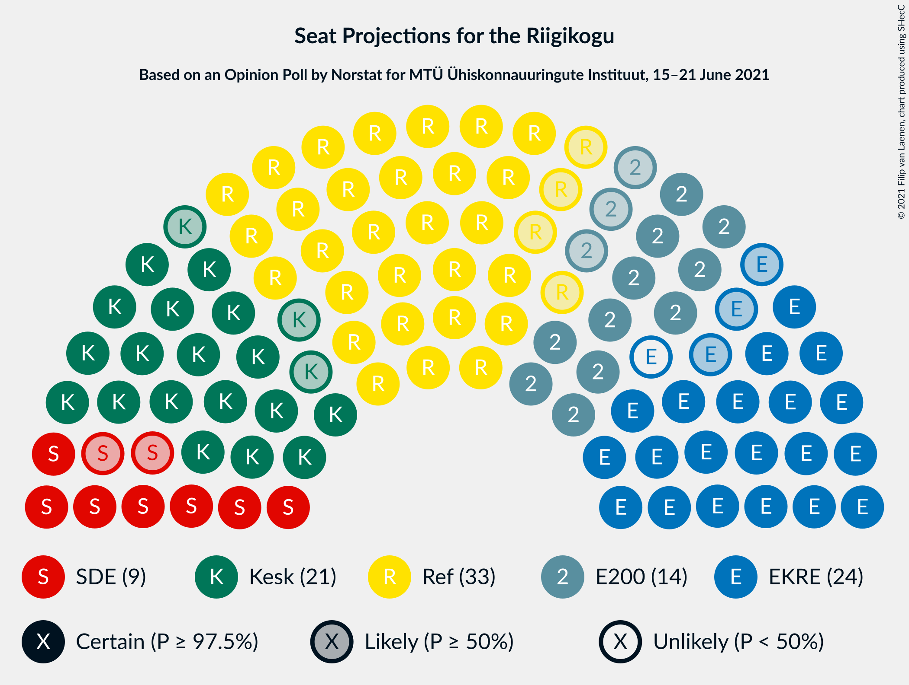

# Opinion Poll by Norstat for MTÜ Ühiskonnauuringute Instituut, 15–21 June 2021

<a href="#voting-intentions">Voting Intentions</a> | <a href="#seats">Seats</a> | <a href="#coalitions">Coalitions</a> | <a href="#technical-information">Technical Information</a>

## Voting Intentions

### Confidence Intervals

| Party | Last Result | Poll Result | 80% Confidence Interval | 90% Confidence Interval | 95% Confidence Interval | 99% Confidence Interval |
|:-----:|:-----------:|:-----------:|:-----------------------:|:-----------------------:|:-----------------------:|:-----------------------:|
| Eesti Reformierakond | 28.9% | 28.7% | 26.9–30.6% |26.4–31.1% |26.0–31.6% |25.1–32.5% |
| Eesti Konservatiivne Rahvaerakond | 17.8% | 21.1% | 19.5–22.8% |19.1–23.3% |18.7–23.7% |17.9–24.6% |
| Eesti Keskerakond | 23.1% | 18.9% | 17.4–20.6% |16.9–21.0% |16.6–21.4% |15.9–22.3% |
| Eesti 200 | 4.4% | 13.5% | 12.2–15.0% |11.8–15.4% |11.5–15.8% |10.9–16.5% |
| Sotsiaaldemokraatlik Erakond | 9.8% | 9.2% | 8.1–10.5% |7.8–10.8% |7.6–11.2% |7.1–11.8% |
| Erakond Isamaa | 11.4% | 4.7% | 3.9–5.7% |3.7–6.0% |3.6–6.2% |3.2–6.7% |
| Erakond Eestimaa Rohelised | 1.8% | 2.1% | 1.6–2.8% |1.5–3.0% |1.4–3.2% |1.2–3.6% |

*Note:* The poll result column reflects the actual value used in the calculations. Published results may vary slightly, and in addition be rounded to fewer digits.

## Seats

### Confidence Intervals

| Party | Last Result | Median | 80% Confidence Interval | 90% Confidence Interval | 95% Confidence Interval | 99% Confidence Interval |
|:-----:|:-----------:|:------:|:-----------------------:|:-----------------------:|:-----------------------:|:-----------------------:|
| <a href="#eesti-reformierakond">Eesti Reformierakond</a> | 34 | 33 | 30–35 |30–36 |29–37 |28–38 |
| <a href="#eesti-konservatiivne-rahvaerakond">Eesti Konservatiivne Rahvaerakond</a> | 19 | 23 | 21–25 |21–26 |20–26 |19–28 |
| <a href="#eesti-keskerakond">Eesti Keskerakond</a> | 26 | 21 | 18–22 |18–23 |18–24 |17–25 |
| <a href="#eesti-200">Eesti 200</a> | 0 | 14 | 12–16 |12–16 |11–17 |11–18 |
| <a href="#sotsiaaldemokraatlik-erakond">Sotsiaaldemokraatlik Erakond</a> | 10 | 9 | 8–10 |7–11 |7–11 |6–12 |
| <a href="#erakond-isamaa">Erakond Isamaa</a> | 12 | 0 | 0–5 |0–5 |0–5 |0–6 |
| <a href="#erakond-eestimaa-rohelised">Erakond Eestimaa Rohelised</a> | 0 | 0 | 0 |0 |0 |0 |

### Eesti Reformierakond

*For a full overview of the results for this party, see the [Eesti Reformierakond](party-eestireformierakond.html) page.*

| Number of Seats | Probability | Accumulated | Special Marks |
|:---------------:|:-----------:|:-----------:|:-------------:|
| 27 | 0.2% | 100% |  |
| 28 | 0.9% | 99.8% |  |
| 29 | 2% | 98.9% |  |
| 30 | 7% | 96% |  |
| 31 | 15% | 89% |  |
| 32 | 16% | 74% |  |
| 33 | 21% | 58% | Median |
| 34 | 19% | 37% | Last Result |
| 35 | 11% | 18% |  |
| 36 | 4% | 7% |  |
| 37 | 2% | 3% |  |
| 38 | 0.7% | 0.8% |  |
| 39 | 0.1% | 0.1% |  |
| 40 | 0% | 0% |  |

### Eesti Konservatiivne Rahvaerakond

*For a full overview of the results for this party, see the [Eesti Konservatiivne Rahvaerakond](party-eestikonservatiivnerahvaerakond.html) page.*

| Number of Seats | Probability | Accumulated | Special Marks |
|:---------------:|:-----------:|:-----------:|:-------------:|
| 18 | 0.1% | 100% |  |
| 19 | 1.0% | 99.8% | Last Result |
| 20 | 4% | 98.8% |  |
| 21 | 11% | 95% |  |
| 22 | 19% | 84% |  |
| 23 | 23% | 65% | Median |
| 24 | 21% | 41% |  |
| 25 | 13% | 20% |  |
| 26 | 5% | 7% |  |
| 27 | 2% | 2% |  |
| 28 | 0.4% | 0.5% |  |
| 29 | 0.1% | 0.1% |  |
| 30 | 0% | 0% |  |

### Eesti Keskerakond

*For a full overview of the results for this party, see the [Eesti Keskerakond](party-eestikeskerakond.html) page.*

| Number of Seats | Probability | Accumulated | Special Marks |
|:---------------:|:-----------:|:-----------:|:-------------:|
| 16 | 0.3% | 100% |  |
| 17 | 2% | 99.7% |  |
| 18 | 8% | 98% |  |
| 19 | 16% | 90% |  |
| 20 | 24% | 74% |  |
| 21 | 24% | 50% | Median |
| 22 | 17% | 27% |  |
| 23 | 6% | 10% |  |
| 24 | 2% | 3% |  |
| 25 | 0.6% | 0.7% |  |
| 26 | 0.1% | 0.1% | Last Result |
| 27 | 0% | 0% |  |

### Eesti 200

*For a full overview of the results for this party, see the [Eesti 200](party-eesti200.html) page.*

| Number of Seats | Probability | Accumulated | Special Marks |
|:---------------:|:-----------:|:-----------:|:-------------:|
| 0 | 0% | 100% | Last Result |
| 1 | 0% | 100% |  |
| 2 | 0% | 100% |  |
| 3 | 0% | 100% |  |
| 4 | 0% | 100% |  |
| 5 | 0% | 100% |  |
| 6 | 0% | 100% |  |
| 7 | 0% | 100% |  |
| 8 | 0% | 100% |  |
| 9 | 0% | 100% |  |
| 10 | 0.2% | 100% |  |
| 11 | 2% | 99.8% |  |
| 12 | 11% | 97% |  |
| 13 | 25% | 86% |  |
| 14 | 30% | 61% | Median |
| 15 | 20% | 31% |  |
| 16 | 8% | 11% |  |
| 17 | 2% | 3% |  |
| 18 | 0.5% | 0.5% |  |
| 19 | 0% | 0.1% |  |
| 20 | 0% | 0% |  |

### Sotsiaaldemokraatlik Erakond

*For a full overview of the results for this party, see the [Sotsiaaldemokraatlik Erakond](party-sotsiaaldemokraatlikerakond.html) page.*

| Number of Seats | Probability | Accumulated | Special Marks |
|:---------------:|:-----------:|:-----------:|:-------------:|
| 6 | 0.5% | 100% |  |
| 7 | 7% | 99.5% |  |
| 8 | 27% | 92% |  |
| 9 | 34% | 65% | Median |
| 10 | 23% | 31% | Last Result |
| 11 | 7% | 8% |  |
| 12 | 1.0% | 1.2% |  |
| 13 | 0.1% | 0.1% |  |
| 14 | 0% | 0% |  |

### Erakond Isamaa

*For a full overview of the results for this party, see the [Erakond Isamaa](party-erakondisamaa.html) page.*

| Number of Seats | Probability | Accumulated | Special Marks |
|:---------------:|:-----------:|:-----------:|:-------------:|
| 0 | 64% | 100% | Median |
| 1 | 0% | 36% |  |
| 2 | 0% | 36% |  |
| 3 | 0% | 36% |  |
| 4 | 15% | 36% |  |
| 5 | 18% | 20% |  |
| 6 | 2% | 2% |  |
| 7 | 0.1% | 0.1% |  |
| 8 | 0% | 0% |  |
| 9 | 0% | 0% |  |
| 10 | 0% | 0% |  |
| 11 | 0% | 0% |  |
| 12 | 0% | 0% | Last Result |

### Erakond Eestimaa Rohelised

*For a full overview of the results for this party, see the [Erakond Eestimaa Rohelised](party-erakondeestimaarohelised.html) page.*

| Number of Seats | Probability | Accumulated | Special Marks |
|:---------------:|:-----------:|:-----------:|:-------------:|
| 0 | 100% | 100% | Last Result, Median |

## Coalitions

### Confidence Intervals

| Coalition | Last Result | Median | Majority? | 80% Confidence Interval | 90% Confidence Interval | 95% Confidence Interval | 99% Confidence Interval |
|:---------:|:-----------:|:------:|:---------:|:-----------------------:|:-----------------------:|:-----------------------:|:-----------------------:|
| Eesti Reformierakond – Eesti Konservatiivne Rahvaerakond – Eesti Keskerakond | 79 | 77 | 100% | 73–79 | 73–80 | 72–80 | 71–81 |
| Eesti Reformierakond – Eesti Konservatiivne Rahvaerakond – Erakond Isamaa | 65 | 58 | 100% | 55–60 | 54–61 | 53–62 | 52–63 |
| Eesti Reformierakond – Eesti Konservatiivne Rahvaerakond | 53 | 56 | 99.3% | 53–59 | 52–59 | 52–60 | 50–61 |
| Eesti Reformierakond – Eesti Keskerakond | 60 | 53 | 89% | 50–56 | 50–57 | 49–57 | 48–59 |
| Eesti Konservatiivne Rahvaerakond – Eesti Keskerakond – Erakond Isamaa | 57 | 45 | 1.0% | 43–48 | 42–49 | 41–50 | 40–51 |
| Eesti Konservatiivne Rahvaerakond – Eesti Keskerakond | 45 | 44 | 0% | 41–46 | 40–47 | 40–48 | 38–49 |
| Eesti Reformierakond – Sotsiaaldemokraatlik Erakond – Erakond Isamaa | 56 | 43 | 0.1% | 40–46 | 40–47 | 39–48 | 38–49 |
| Eesti Reformierakond – Sotsiaaldemokraatlik Erakond | 44 | 42 | 0% | 39–44 | 38–45 | 38–46 | 37–47 |
| Eesti Reformierakond – Erakond Isamaa | 46 | 34 | 0% | 31–38 | 31–38 | 30–39 | 29–40 |
| Eesti Konservatiivne Rahvaerakond – Sotsiaaldemokraatlik Erakond | 29 | 32 | 0% | 30–35 | 29–35 | 28–36 | 27–37 |
| Eesti Keskerakond – Sotsiaaldemokraatlik Erakond – Erakond Isamaa | 48 | 31 | 0% | 28–34 | 27–35 | 27–36 | 26–37 |
| Eesti Keskerakond – Sotsiaaldemokraatlik Erakond | 36 | 30 | 0% | 27–32 | 26–32 | 26–33 | 25–34 |

### Eesti Reformierakond – Eesti Konservatiivne Rahvaerakond – Eesti Keskerakond

| Number of Seats | Probability | Accumulated | Special Marks |
|:---------------:|:-----------:|:-----------:|:-------------:|
| 69 | 0.1% | 100% |  |
| 70 | 0.3% | 99.9% |  |
| 71 | 1.3% | 99.6% |  |
| 72 | 3% | 98% |  |
| 73 | 6% | 95% |  |
| 74 | 10% | 89% |  |
| 75 | 11% | 78% |  |
| 76 | 16% | 68% |  |
| 77 | 16% | 52% | Median |
| 78 | 16% | 36% |  |
| 79 | 11% | 20% | Last Result |
| 80 | 7% | 9% |  |
| 81 | 2% | 2% |  |
| 82 | 0.4% | 0.4% |  |
| 83 | 0.1% | 0.1% |  |
| 84 | 0% | 0% |  |

### Eesti Reformierakond – Eesti Konservatiivne Rahvaerakond – Erakond Isamaa

| Number of Seats | Probability | Accumulated | Special Marks |
|:---------------:|:-----------:|:-----------:|:-------------:|
| 51 | 0.1% | 100% | Majority |
| 52 | 0.5% | 99.8% |  |
| 53 | 2% | 99.3% |  |
| 54 | 5% | 97% |  |
| 55 | 7% | 92% |  |
| 56 | 15% | 85% | Median |
| 57 | 17% | 70% |  |
| 58 | 20% | 53% |  |
| 59 | 16% | 34% |  |
| 60 | 10% | 18% |  |
| 61 | 5% | 8% |  |
| 62 | 2% | 3% |  |
| 63 | 0.8% | 1.0% |  |
| 64 | 0.2% | 0.2% |  |
| 65 | 0% | 0% | Last Result |

### Eesti Reformierakond – Eesti Konservatiivne Rahvaerakond

| Number of Seats | Probability | Accumulated | Special Marks |
|:---------------:|:-----------:|:-----------:|:-------------:|
| 49 | 0.1% | 100% |  |
| 50 | 0.6% | 99.8% |  |
| 51 | 1.3% | 99.3% | Majority |
| 52 | 4% | 98% |  |
| 53 | 8% | 94% | Last Result |
| 54 | 13% | 86% |  |
| 55 | 15% | 74% |  |
| 56 | 17% | 58% | Median |
| 57 | 16% | 41% |  |
| 58 | 13% | 26% |  |
| 59 | 7% | 12% |  |
| 60 | 3% | 5% |  |
| 61 | 1.2% | 2% |  |
| 62 | 0.3% | 0.4% |  |
| 63 | 0.1% | 0.1% |  |
| 64 | 0% | 0% |  |

### Eesti Reformierakond – Eesti Keskerakond

| Number of Seats | Probability | Accumulated | Special Marks |
|:---------------:|:-----------:|:-----------:|:-------------:|
| 46 | 0.1% | 100% |  |
| 47 | 0.4% | 99.9% |  |
| 48 | 1.0% | 99.5% |  |
| 49 | 3% | 98% |  |
| 50 | 6% | 96% |  |
| 51 | 11% | 89% | Majority |
| 52 | 12% | 78% |  |
| 53 | 17% | 66% |  |
| 54 | 19% | 49% | Median |
| 55 | 13% | 30% |  |
| 56 | 9% | 17% |  |
| 57 | 5% | 7% |  |
| 58 | 2% | 2% |  |
| 59 | 0.5% | 0.6% |  |
| 60 | 0.1% | 0.1% | Last Result |
| 61 | 0% | 0% |  |

### Eesti Konservatiivne Rahvaerakond – Eesti Keskerakond – Erakond Isamaa

| Number of Seats | Probability | Accumulated | Special Marks |
|:---------------:|:-----------:|:-----------:|:-------------:|
| 38 | 0% | 100% |  |
| 39 | 0.2% | 99.9% |  |
| 40 | 1.1% | 99.7% |  |
| 41 | 3% | 98.6% |  |
| 42 | 5% | 96% |  |
| 43 | 11% | 91% |  |
| 44 | 16% | 79% | Median |
| 45 | 18% | 63% |  |
| 46 | 15% | 45% |  |
| 47 | 12% | 30% |  |
| 48 | 9% | 17% |  |
| 49 | 5% | 8% |  |
| 50 | 2% | 3% |  |
| 51 | 0.8% | 1.0% | Majority |
| 52 | 0.2% | 0.3% |  |
| 53 | 0% | 0.1% |  |
| 54 | 0% | 0% |  |
| 55 | 0% | 0% |  |
| 56 | 0% | 0% |  |
| 57 | 0% | 0% | Last Result |

### Eesti Konservatiivne Rahvaerakond – Eesti Keskerakond

| Number of Seats | Probability | Accumulated | Special Marks |
|:---------------:|:-----------:|:-----------:|:-------------:|
| 37 | 0.1% | 100% |  |
| 38 | 0.5% | 99.8% |  |
| 39 | 1.5% | 99.3% |  |
| 40 | 4% | 98% |  |
| 41 | 10% | 94% |  |
| 42 | 12% | 84% |  |
| 43 | 17% | 72% |  |
| 44 | 19% | 54% | Median |
| 45 | 17% | 35% | Last Result |
| 46 | 9% | 18% |  |
| 47 | 5% | 8% |  |
| 48 | 2% | 3% |  |
| 49 | 0.6% | 0.8% |  |
| 50 | 0.2% | 0.2% |  |
| 51 | 0% | 0% | Majority |

### Eesti Reformierakond – Sotsiaaldemokraatlik Erakond – Erakond Isamaa

| Number of Seats | Probability | Accumulated | Special Marks |
|:---------------:|:-----------:|:-----------:|:-------------:|
| 37 | 0.1% | 100% |  |
| 38 | 1.1% | 99.8% |  |
| 39 | 2% | 98.8% |  |
| 40 | 6% | 96% |  |
| 41 | 8% | 90% |  |
| 42 | 16% | 82% | Median |
| 43 | 17% | 66% |  |
| 44 | 17% | 49% |  |
| 45 | 14% | 32% |  |
| 46 | 8% | 17% |  |
| 47 | 6% | 9% |  |
| 48 | 2% | 4% |  |
| 49 | 1.2% | 1.4% |  |
| 50 | 0.1% | 0.2% |  |
| 51 | 0.1% | 0.1% | Majority |
| 52 | 0% | 0% |  |
| 53 | 0% | 0% |  |
| 54 | 0% | 0% |  |
| 55 | 0% | 0% |  |
| 56 | 0% | 0% | Last Result |

### Eesti Reformierakond – Sotsiaaldemokraatlik Erakond

| Number of Seats | Probability | Accumulated | Special Marks |
|:---------------:|:-----------:|:-----------:|:-------------:|
| 35 | 0.1% | 100% |  |
| 36 | 0.4% | 99.9% |  |
| 37 | 1.2% | 99.5% |  |
| 38 | 4% | 98% |  |
| 39 | 8% | 94% |  |
| 40 | 14% | 86% |  |
| 41 | 17% | 73% |  |
| 42 | 18% | 56% | Median |
| 43 | 17% | 38% |  |
| 44 | 12% | 21% | Last Result |
| 45 | 5% | 9% |  |
| 46 | 2% | 3% |  |
| 47 | 0.9% | 1.1% |  |
| 48 | 0.2% | 0.2% |  |
| 49 | 0% | 0% |  |

### Eesti Reformierakond – Erakond Isamaa

| Number of Seats | Probability | Accumulated | Special Marks |
|:---------------:|:-----------:|:-----------:|:-------------:|
| 28 | 0.1% | 100% |  |
| 29 | 0.8% | 99.8% |  |
| 30 | 3% | 99.1% |  |
| 31 | 6% | 96% |  |
| 32 | 9% | 90% |  |
| 33 | 16% | 81% | Median |
| 34 | 17% | 65% |  |
| 35 | 17% | 48% |  |
| 36 | 11% | 31% |  |
| 37 | 9% | 20% |  |
| 38 | 6% | 11% |  |
| 39 | 3% | 5% |  |
| 40 | 0.9% | 1.4% |  |
| 41 | 0.4% | 0.5% |  |
| 42 | 0.1% | 0.1% |  |
| 43 | 0% | 0% |  |
| 44 | 0% | 0% |  |
| 45 | 0% | 0% |  |
| 46 | 0% | 0% | Last Result |

### Eesti Konservatiivne Rahvaerakond – Sotsiaaldemokraatlik Erakond

| Number of Seats | Probability | Accumulated | Special Marks |
|:---------------:|:-----------:|:-----------:|:-------------:|
| 26 | 0.1% | 100% |  |
| 27 | 0.5% | 99.9% |  |
| 28 | 2% | 99.4% |  |
| 29 | 5% | 97% | Last Result |
| 30 | 12% | 92% |  |
| 31 | 19% | 80% |  |
| 32 | 17% | 61% | Median |
| 33 | 22% | 44% |  |
| 34 | 12% | 22% |  |
| 35 | 7% | 11% |  |
| 36 | 3% | 4% |  |
| 37 | 0.9% | 1.2% |  |
| 38 | 0.2% | 0.3% |  |
| 39 | 0% | 0% |  |

### Eesti Keskerakond – Sotsiaaldemokraatlik Erakond – Erakond Isamaa

| Number of Seats | Probability | Accumulated | Special Marks |
|:---------------:|:-----------:|:-----------:|:-------------:|
| 25 | 0.2% | 100% |  |
| 26 | 1.1% | 99.7% |  |
| 27 | 4% | 98.7% |  |
| 28 | 7% | 95% |  |
| 29 | 13% | 88% |  |
| 30 | 18% | 75% | Median |
| 31 | 15% | 58% |  |
| 32 | 16% | 43% |  |
| 33 | 10% | 27% |  |
| 34 | 9% | 17% |  |
| 35 | 5% | 8% |  |
| 36 | 2% | 3% |  |
| 37 | 0.9% | 1.1% |  |
| 38 | 0.2% | 0.3% |  |
| 39 | 0% | 0% |  |
| 40 | 0% | 0% |  |
| 41 | 0% | 0% |  |
| 42 | 0% | 0% |  |
| 43 | 0% | 0% |  |
| 44 | 0% | 0% |  |
| 45 | 0% | 0% |  |
| 46 | 0% | 0% |  |
| 47 | 0% | 0% |  |
| 48 | 0% | 0% | Last Result |

### Eesti Keskerakond – Sotsiaaldemokraatlik Erakond

| Number of Seats | Probability | Accumulated | Special Marks |
|:---------------:|:-----------:|:-----------:|:-------------:|
| 24 | 0.2% | 100% |  |
| 25 | 1.1% | 99.8% |  |
| 26 | 4% | 98.7% |  |
| 27 | 10% | 95% |  |
| 28 | 14% | 85% |  |
| 29 | 21% | 71% |  |
| 30 | 21% | 50% | Median |
| 31 | 15% | 29% |  |
| 32 | 10% | 14% |  |
| 33 | 3% | 5% |  |
| 34 | 1.3% | 2% |  |
| 35 | 0.2% | 0.3% |  |
| 36 | 0.1% | 0.1% | Last Result |
| 37 | 0% | 0% |  |

## Technical Information

### Opinion Poll

+ **Polling firm:** Norstat
+ **Commissioner(s):** MTÜ Ühiskonnauuringute Instituut
+ **Fieldwork period:** 15–21 June 2021

### Calculations

+ **Sample size:** 1000
+ **Simulations done:** 1,048,576
+ **Error estimate:** 1.04%

