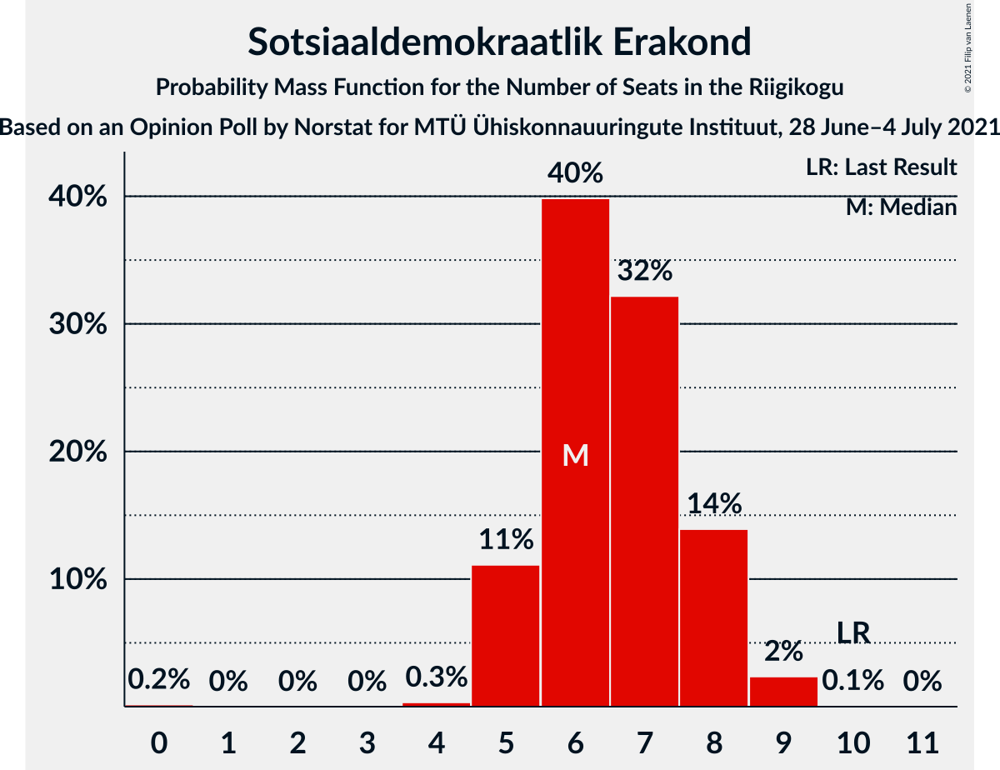

# Opinion Poll by Norstat for MTÜ Ühiskonnauuringute Instituut, 28 June–4 July 2021

<a href="#voting-intentions">Voting Intentions</a> | <a href="#seats">Seats</a> | <a href="#coalitions">Coalitions</a> | <a href="#technical-information">Technical Information</a>

## Voting Intentions

### Confidence Intervals

| Party | Last Result | Poll Result | 80% Confidence Interval | 90% Confidence Interval | 95% Confidence Interval | 99% Confidence Interval |
|:-----:|:-----------:|:-----------:|:-----------------------:|:-----------------------:|:-----------------------:|:-----------------------:|
| Eesti Reformierakond | 28.9% | 30.0% | 28.2–31.9% |27.7–32.4% |27.2–32.9% |26.4–33.9% |
| Eesti Konservatiivne Rahvaerakond | 17.8% | 21.0% | 19.4–22.7% |19.0–23.2% |18.6–23.6% |17.8–24.5% |
| Eesti Keskerakond | 23.1% | 20.4% | 18.8–22.1% |18.4–22.6% |18.0–23.0% |17.3–23.9% |
| Eesti 200 | 4.4% | 11.4% | 10.2–12.8% |9.9–13.2% |9.6–13.5% |9.0–14.2% |
| Sotsiaaldemokraatlik Erakond | 9.8% | 7.0% | 6.1–8.2% |5.8–8.5% |5.6–8.8% |5.2–9.3% |
| Erakond Isamaa | 11.4% | 6.1% | 5.2–7.2% |5.0–7.5% |4.8–7.8% |4.4–8.3% |
| Erakond Eestimaa Rohelised | 1.8% | 2.5% | 2.0–3.3% |1.8–3.5% |1.7–3.7% |1.5–4.1% |

*Note:* The poll result column reflects the actual value used in the calculations. Published results may vary slightly, and in addition be rounded to fewer digits.

## Seats

### Confidence Intervals

| Party | Last Result | Median | 80% Confidence Interval | 90% Confidence Interval | 95% Confidence Interval | 99% Confidence Interval |
|:-----:|:-----------:|:------:|:-----------------------:|:-----------------------:|:-----------------------:|:-----------------------:|
| <a href="#eesti-reformierakond">Eesti Reformierakond</a> | 34 | 34 | 31–36 |31–37 |30–37 |29–39 |
| <a href="#eesti-konservatiivne-rahvaerakond">Eesti Konservatiivne Rahvaerakond</a> | 19 | 22 | 20–24 |20–25 |20–26 |19–26 |
| <a href="#eesti-keskerakond">Eesti Keskerakond</a> | 26 | 21 | 20–24 |19–24 |19–25 |18–26 |
| <a href="#eesti-200">Eesti 200</a> | 0 | 12 | 10–13 |10–13 |9–14 |9–15 |
| <a href="#sotsiaaldemokraatlik-erakond">Sotsiaaldemokraatlik Erakond</a> | 10 | 6 | 5–8 |5–8 |5–8 |4–9 |
| <a href="#erakond-isamaa">Erakond Isamaa</a> | 12 | 5 | 4–6 |0–7 |0–7 |0–8 |
| <a href="#erakond-eestimaa-rohelised">Erakond Eestimaa Rohelised</a> | 0 | 0 | 0 |0 |0 |0 |

### Eesti Reformierakond

*For a full overview of the results for this party, see the [Eesti Reformierakond](party-eestireformierakond.html) page.*

| Number of Seats | Probability | Accumulated | Special Marks |
|:---------------:|:-----------:|:-----------:|:-------------:|
| 28 | 0.1% | 100% |  |
| 29 | 0.8% | 99.9% |  |
| 30 | 2% | 99.1% |  |
| 31 | 9% | 97% |  |
| 32 | 9% | 88% |  |
| 33 | 25% | 79% |  |
| 34 | 11% | 54% | Last Result, Median |
| 35 | 24% | 43% |  |
| 36 | 11% | 18% |  |
| 37 | 5% | 8% |  |
| 38 | 2% | 2% |  |
| 39 | 0.4% | 0.5% |  |
| 40 | 0.1% | 0.2% |  |
| 41 | 0% | 0% |  |

### Eesti Konservatiivne Rahvaerakond

*For a full overview of the results for this party, see the [Eesti Konservatiivne Rahvaerakond](party-eestikonservatiivnerahvaerakond.html) page.*

| Number of Seats | Probability | Accumulated | Special Marks |
|:---------------:|:-----------:|:-----------:|:-------------:|
| 18 | 0.4% | 100% |  |
| 19 | 1.3% | 99.5% | Last Result |
| 20 | 9% | 98% |  |
| 21 | 25% | 89% |  |
| 22 | 24% | 64% | Median |
| 23 | 18% | 40% |  |
| 24 | 14% | 22% |  |
| 25 | 6% | 9% |  |
| 26 | 2% | 3% |  |
| 27 | 0.2% | 0.3% |  |
| 28 | 0.1% | 0.1% |  |
| 29 | 0% | 0% |  |

### Eesti Keskerakond

*For a full overview of the results for this party, see the [Eesti Keskerakond](party-eestikeskerakond.html) page.*

| Number of Seats | Probability | Accumulated | Special Marks |
|:---------------:|:-----------:|:-----------:|:-------------:|
| 17 | 0.2% | 100% |  |
| 18 | 0.9% | 99.8% |  |
| 19 | 8% | 98.9% |  |
| 20 | 18% | 91% |  |
| 21 | 23% | 73% | Median |
| 22 | 24% | 50% |  |
| 23 | 15% | 26% |  |
| 24 | 8% | 11% |  |
| 25 | 3% | 3% |  |
| 26 | 0.7% | 0.8% | Last Result |
| 27 | 0.1% | 0.1% |  |
| 28 | 0% | 0% |  |

### Eesti 200

*For a full overview of the results for this party, see the [Eesti 200](party-eesti200.html) page.*

| Number of Seats | Probability | Accumulated | Special Marks |
|:---------------:|:-----------:|:-----------:|:-------------:|
| 0 | 0% | 100% | Last Result |
| 1 | 0% | 100% |  |
| 2 | 0% | 100% |  |
| 3 | 0% | 100% |  |
| 4 | 0% | 100% |  |
| 5 | 0% | 100% |  |
| 6 | 0% | 100% |  |
| 7 | 0% | 100% |  |
| 8 | 0.4% | 100% |  |
| 9 | 4% | 99.6% |  |
| 10 | 16% | 96% |  |
| 11 | 27% | 80% |  |
| 12 | 32% | 53% | Median |
| 13 | 17% | 21% |  |
| 14 | 3% | 4% |  |
| 15 | 0.5% | 0.6% |  |
| 16 | 0.1% | 0.1% |  |
| 17 | 0% | 0% |  |

### Sotsiaaldemokraatlik Erakond

*For a full overview of the results for this party, see the [Sotsiaaldemokraatlik Erakond](party-sotsiaaldemokraatlikerakond.html) page.*

| Number of Seats | Probability | Accumulated | Special Marks |
|:---------------:|:-----------:|:-----------:|:-------------:|
| 0 | 0.2% | 100% |  |
| 1 | 0% | 99.8% |  |
| 2 | 0% | 99.8% |  |
| 3 | 0% | 99.8% |  |
| 4 | 0.3% | 99.8% |  |
| 5 | 11% | 99.5% |  |
| 6 | 40% | 88% | Median |
| 7 | 32% | 49% |  |
| 8 | 14% | 16% |  |
| 9 | 2% | 2% |  |
| 10 | 0.1% | 0.1% | Last Result |
| 11 | 0% | 0% |  |

### Erakond Isamaa

*For a full overview of the results for this party, see the [Erakond Isamaa](party-erakondisamaa.html) page.*

| Number of Seats | Probability | Accumulated | Special Marks |
|:---------------:|:-----------:|:-----------:|:-------------:|
| 0 | 5% | 100% |  |
| 1 | 0% | 95% |  |
| 2 | 0% | 95% |  |
| 3 | 0% | 95% |  |
| 4 | 5% | 95% |  |
| 5 | 46% | 90% | Median |
| 6 | 34% | 44% |  |
| 7 | 9% | 10% |  |
| 8 | 1.0% | 1.1% |  |
| 9 | 0% | 0% |  |
| 10 | 0% | 0% |  |
| 11 | 0% | 0% |  |
| 12 | 0% | 0% | Last Result |

### Erakond Eestimaa Rohelised

*For a full overview of the results for this party, see the [Erakond Eestimaa Rohelised](party-erakondeestimaarohelised.html) page.*

| Number of Seats | Probability | Accumulated | Special Marks |
|:---------------:|:-----------:|:-----------:|:-------------:|
| 0 | 100% | 100% | Last Result, Median |

## Coalitions

### Confidence Intervals

| Coalition | Last Result | Median | Majority? | 80% Confidence Interval | 90% Confidence Interval | 95% Confidence Interval | 99% Confidence Interval |
|:---------:|:-----------:|:------:|:---------:|:-----------------------:|:-----------------------:|:-----------------------:|:-----------------------:|
| Eesti Reformierakond – Eesti Konservatiivne Rahvaerakond – Eesti Keskerakond | 79 | 77 | 100% | 76–80 | 75–81 | 74–82 | 74–84 |
| Eesti Reformierakond – Eesti Konservatiivne Rahvaerakond – Erakond Isamaa | 65 | 62 | 100% | 59–64 | 58–64 | 58–65 | 56–66 |
| Eesti Reformierakond – Eesti Konservatiivne Rahvaerakond | 53 | 56 | 99.9% | 53–59 | 53–60 | 52–60 | 51–62 |
| Eesti Reformierakond – Eesti Keskerakond | 60 | 55 | 99.7% | 53–58 | 52–59 | 51–60 | 51–61 |
| Eesti Konservatiivne Rahvaerakond – Eesti Keskerakond – Erakond Isamaa | 57 | 49 | 26% | 47–52 | 46–52 | 45–53 | 44–55 |
| Eesti Reformierakond – Sotsiaaldemokraatlik Erakond – Erakond Isamaa | 56 | 46 | 0.5% | 43–48 | 42–49 | 42–49 | 40–51 |
| Eesti Konservatiivne Rahvaerakond – Eesti Keskerakond | 45 | 44 | 0.1% | 42–46 | 41–47 | 41–48 | 40–49 |
| Eesti Reformierakond – Sotsiaaldemokraatlik Erakond | 44 | 40 | 0% | 38–43 | 37–44 | 37–44 | 36–46 |
| Eesti Reformierakond – Erakond Isamaa | 46 | 39 | 0% | 36–42 | 36–42 | 35–42 | 33–44 |
| Eesti Keskerakond – Sotsiaaldemokraatlik Erakond – Erakond Isamaa | 48 | 33 | 0% | 31–36 | 30–37 | 29–37 | 27–38 |
| Eesti Konservatiivne Rahvaerakond – Sotsiaaldemokraatlik Erakond | 29 | 29 | 0% | 27–31 | 26–32 | 26–32 | 24–34 |
| Eesti Keskerakond – Sotsiaaldemokraatlik Erakond | 36 | 28 | 0% | 26–30 | 25–31 | 25–32 | 24–33 |

### Eesti Reformierakond – Eesti Konservatiivne Rahvaerakond – Eesti Keskerakond

| Number of Seats | Probability | Accumulated | Special Marks |
|:---------------:|:-----------:|:-----------:|:-------------:|
| 73 | 0.2% | 100% |  |
| 74 | 3% | 99.8% |  |
| 75 | 6% | 97% |  |
| 76 | 13% | 92% |  |
| 77 | 30% | 79% | Median |
| 78 | 25% | 49% |  |
| 79 | 11% | 24% | Last Result |
| 80 | 6% | 13% |  |
| 81 | 4% | 7% |  |
| 82 | 1.2% | 3% |  |
| 83 | 1.1% | 2% |  |
| 84 | 0.5% | 0.8% |  |
| 85 | 0.1% | 0.3% |  |
| 86 | 0.1% | 0.1% |  |
| 87 | 0% | 0% |  |

### Eesti Reformierakond – Eesti Konservatiivne Rahvaerakond – Erakond Isamaa

| Number of Seats | Probability | Accumulated | Special Marks |
|:---------------:|:-----------:|:-----------:|:-------------:|
| 55 | 0.1% | 100% |  |
| 56 | 0.4% | 99.9% |  |
| 57 | 2% | 99.4% |  |
| 58 | 4% | 98% |  |
| 59 | 13% | 94% |  |
| 60 | 13% | 81% |  |
| 61 | 17% | 68% | Median |
| 62 | 20% | 51% |  |
| 63 | 20% | 31% |  |
| 64 | 7% | 11% |  |
| 65 | 3% | 4% | Last Result |
| 66 | 0.7% | 1.0% |  |
| 67 | 0.3% | 0.3% |  |
| 68 | 0.1% | 0.1% |  |
| 69 | 0% | 0% |  |

### Eesti Reformierakond – Eesti Konservatiivne Rahvaerakond

| Number of Seats | Probability | Accumulated | Special Marks |
|:---------------:|:-----------:|:-----------:|:-------------:|
| 50 | 0% | 100% |  |
| 51 | 0.6% | 99.9% | Majority |
| 52 | 4% | 99.3% |  |
| 53 | 8% | 95% | Last Result |
| 54 | 7% | 87% |  |
| 55 | 15% | 81% |  |
| 56 | 20% | 65% | Median |
| 57 | 24% | 45% |  |
| 58 | 11% | 22% |  |
| 59 | 5% | 11% |  |
| 60 | 4% | 5% |  |
| 61 | 1.1% | 2% |  |
| 62 | 0.5% | 0.6% |  |
| 63 | 0.1% | 0.1% |  |
| 64 | 0% | 0% |  |

### Eesti Reformierakond – Eesti Keskerakond

| Number of Seats | Probability | Accumulated | Special Marks |
|:---------------:|:-----------:|:-----------:|:-------------:|
| 49 | 0.1% | 100% |  |
| 50 | 0.3% | 99.9% |  |
| 51 | 3% | 99.7% | Majority |
| 52 | 3% | 97% |  |
| 53 | 10% | 94% |  |
| 54 | 17% | 84% |  |
| 55 | 17% | 66% | Median |
| 56 | 20% | 49% |  |
| 57 | 17% | 29% |  |
| 58 | 7% | 13% |  |
| 59 | 3% | 6% |  |
| 60 | 2% | 3% | Last Result |
| 61 | 0.8% | 1.1% |  |
| 62 | 0.2% | 0.3% |  |
| 63 | 0% | 0.1% |  |
| 64 | 0.1% | 0.1% |  |
| 65 | 0% | 0% |  |

### Eesti Konservatiivne Rahvaerakond – Eesti Keskerakond – Erakond Isamaa

| Number of Seats | Probability | Accumulated | Special Marks |
|:---------------:|:-----------:|:-----------:|:-------------:|
| 42 | 0% | 100% |  |
| 43 | 0.1% | 99.9% |  |
| 44 | 1.1% | 99.8% |  |
| 45 | 2% | 98.7% |  |
| 46 | 5% | 96% |  |
| 47 | 8% | 92% |  |
| 48 | 29% | 83% | Median |
| 49 | 19% | 55% |  |
| 50 | 11% | 36% |  |
| 51 | 15% | 26% | Majority |
| 52 | 6% | 10% |  |
| 53 | 3% | 4% |  |
| 54 | 0.6% | 1.2% |  |
| 55 | 0.4% | 0.6% |  |
| 56 | 0.1% | 0.1% |  |
| 57 | 0% | 0% | Last Result |

### Eesti Reformierakond – Sotsiaaldemokraatlik Erakond – Erakond Isamaa

| Number of Seats | Probability | Accumulated | Special Marks |
|:---------------:|:-----------:|:-----------:|:-------------:|
| 38 | 0.1% | 100% |  |
| 39 | 0.2% | 99.9% |  |
| 40 | 0.5% | 99.7% |  |
| 41 | 2% | 99.2% |  |
| 42 | 3% | 98% |  |
| 43 | 8% | 95% |  |
| 44 | 10% | 87% |  |
| 45 | 24% | 76% | Median |
| 46 | 19% | 52% |  |
| 47 | 16% | 33% |  |
| 48 | 9% | 18% |  |
| 49 | 7% | 8% |  |
| 50 | 0.8% | 1.3% |  |
| 51 | 0.5% | 0.5% | Majority |
| 52 | 0% | 0.1% |  |
| 53 | 0% | 0% |  |
| 54 | 0% | 0% |  |
| 55 | 0% | 0% |  |
| 56 | 0% | 0% | Last Result |

### Eesti Konservatiivne Rahvaerakond – Eesti Keskerakond

| Number of Seats | Probability | Accumulated | Special Marks |
|:---------------:|:-----------:|:-----------:|:-------------:|
| 38 | 0.1% | 100% |  |
| 39 | 0.2% | 99.9% |  |
| 40 | 0.8% | 99.7% |  |
| 41 | 6% | 98.9% |  |
| 42 | 22% | 93% |  |
| 43 | 19% | 71% | Median |
| 44 | 19% | 52% |  |
| 45 | 13% | 32% | Last Result |
| 46 | 11% | 19% |  |
| 47 | 3% | 7% |  |
| 48 | 3% | 4% |  |
| 49 | 0.9% | 1.3% |  |
| 50 | 0.3% | 0.4% |  |
| 51 | 0.1% | 0.1% | Majority |
| 52 | 0% | 0.1% |  |
| 53 | 0% | 0% |  |

### Eesti Reformierakond – Sotsiaaldemokraatlik Erakond

| Number of Seats | Probability | Accumulated | Special Marks |
|:---------------:|:-----------:|:-----------:|:-------------:|
| 34 | 0.1% | 100% |  |
| 35 | 0.3% | 99.9% |  |
| 36 | 2% | 99.6% |  |
| 37 | 5% | 98% |  |
| 38 | 8% | 93% |  |
| 39 | 16% | 85% |  |
| 40 | 21% | 68% | Median |
| 41 | 19% | 47% |  |
| 42 | 14% | 28% |  |
| 43 | 8% | 14% |  |
| 44 | 4% | 6% | Last Result |
| 45 | 2% | 2% |  |
| 46 | 0.5% | 0.5% |  |
| 47 | 0% | 0.1% |  |
| 48 | 0% | 0% |  |

### Eesti Reformierakond – Erakond Isamaa

| Number of Seats | Probability | Accumulated | Special Marks |
|:---------------:|:-----------:|:-----------:|:-------------:|
| 32 | 0.1% | 100% |  |
| 33 | 0.5% | 99.9% |  |
| 34 | 1.2% | 99.3% |  |
| 35 | 2% | 98% |  |
| 36 | 7% | 96% |  |
| 37 | 9% | 90% |  |
| 38 | 20% | 81% |  |
| 39 | 18% | 61% | Median |
| 40 | 13% | 43% |  |
| 41 | 17% | 29% |  |
| 42 | 10% | 12% |  |
| 43 | 1.5% | 2% |  |
| 44 | 0.5% | 0.7% |  |
| 45 | 0.2% | 0.2% |  |
| 46 | 0% | 0% | Last Result |

### Eesti Keskerakond – Sotsiaaldemokraatlik Erakond – Erakond Isamaa

| Number of Seats | Probability | Accumulated | Special Marks |
|:---------------:|:-----------:|:-----------:|:-------------:|
| 26 | 0.1% | 100% |  |
| 27 | 0.4% | 99.8% |  |
| 28 | 0.6% | 99.4% |  |
| 29 | 2% | 98.8% |  |
| 30 | 5% | 97% |  |
| 31 | 9% | 91% |  |
| 32 | 9% | 82% | Median |
| 33 | 30% | 73% |  |
| 34 | 18% | 42% |  |
| 35 | 9% | 25% |  |
| 36 | 10% | 16% |  |
| 37 | 4% | 6% |  |
| 38 | 2% | 2% |  |
| 39 | 0.3% | 0.3% |  |
| 40 | 0% | 0% |  |
| 41 | 0% | 0% |  |
| 42 | 0% | 0% |  |
| 43 | 0% | 0% |  |
| 44 | 0% | 0% |  |
| 45 | 0% | 0% |  |
| 46 | 0% | 0% |  |
| 47 | 0% | 0% |  |
| 48 | 0% | 0% | Last Result |

### Eesti Konservatiivne Rahvaerakond – Sotsiaaldemokraatlik Erakond

| Number of Seats | Probability | Accumulated | Special Marks |
|:---------------:|:-----------:|:-----------:|:-------------:|
| 23 | 0.1% | 100% |  |
| 24 | 0.5% | 99.9% |  |
| 25 | 1.4% | 99.4% |  |
| 26 | 6% | 98% |  |
| 27 | 20% | 92% |  |
| 28 | 21% | 73% | Median |
| 29 | 15% | 52% | Last Result |
| 30 | 18% | 37% |  |
| 31 | 12% | 19% |  |
| 32 | 5% | 7% |  |
| 33 | 2% | 2% |  |
| 34 | 0.4% | 0.5% |  |
| 35 | 0.1% | 0.1% |  |
| 36 | 0% | 0% |  |

### Eesti Keskerakond – Sotsiaaldemokraatlik Erakond

| Number of Seats | Probability | Accumulated | Special Marks |
|:---------------:|:-----------:|:-----------:|:-------------:|
| 22 | 0.1% | 100% |  |
| 23 | 0.2% | 99.9% |  |
| 24 | 1.1% | 99.7% |  |
| 25 | 7% | 98.6% |  |
| 26 | 8% | 91% |  |
| 27 | 21% | 84% | Median |
| 28 | 26% | 63% |  |
| 29 | 17% | 37% |  |
| 30 | 11% | 20% |  |
| 31 | 5% | 9% |  |
| 32 | 4% | 4% |  |
| 33 | 0.5% | 0.7% |  |
| 34 | 0.1% | 0.1% |  |
| 35 | 0% | 0% |  |
| 36 | 0% | 0% | Last Result |

## Technical Information

### Opinion Poll

+ **Polling firm:** Norstat
+ **Commissioner(s):** MTÜ Ühiskonnauuringute Instituut
+ **Fieldwork period:** 28 June–4 July 2021

### Calculations

+ **Sample size:** 1000
+ **Simulations done:** 131,072
+ **Error estimate:** 0.96%

