# Opinion Poll by Kantar Emor for BNS and Postimees, 14–22 July 2021

<a href="#voting-intentions">Voting Intentions</a> | <a href="#seats">Seats</a> | <a href="#coalitions">Coalitions</a> | <a href="#technical-information">Technical Information</a>

## Voting Intentions

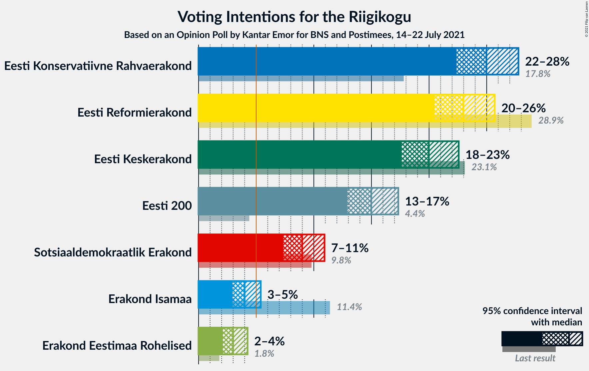

### Confidence Intervals

| Party | Last Result | Poll Result | 80% Confidence Interval | 90% Confidence Interval | 95% Confidence Interval | 99% Confidence Interval |
|:-----:|:-----------:|:-----------:|:-----------------------:|:-----------------------:|:-----------------------:|:-----------------------:|
| Eesti Konservatiivne Rahvaerakond | 17.8% | 25.0% | 23.3–26.8% |22.8–27.3% |22.4–27.8% |21.6–28.6% |
| Eesti Reformierakond | 28.9% | 23.0% | 21.3–24.8% |20.9–25.3% |20.5–25.7% |19.7–26.6% |
| Eesti Keskerakond | 23.1% | 20.0% | 18.4–21.7% |18.0–22.2% |17.6–22.6% |16.9–23.4% |
| Eesti 200 | 4.4% | 15.0% | 13.6–16.5% |13.2–16.9% |12.9–17.3% |12.3–18.1% |
| Sotsiaaldemokraatlik Erakond | 9.8% | 9.0% | 7.9–10.3% |7.6–10.6% |7.4–10.9% |6.9–11.6% |
| Erakond Isamaa | 11.4% | 4.0% | 3.3–4.9% |3.1–5.2% |2.9–5.4% |2.7–5.9% |
| Erakond Eestimaa Rohelised | 1.8% | 3.0% | 2.4–3.8% |2.2–4.0% |2.1–4.3% |1.9–4.7% |

*Note:* The poll result column reflects the actual value used in the calculations. Published results may vary slightly, and in addition be rounded to fewer digits.

## Seats

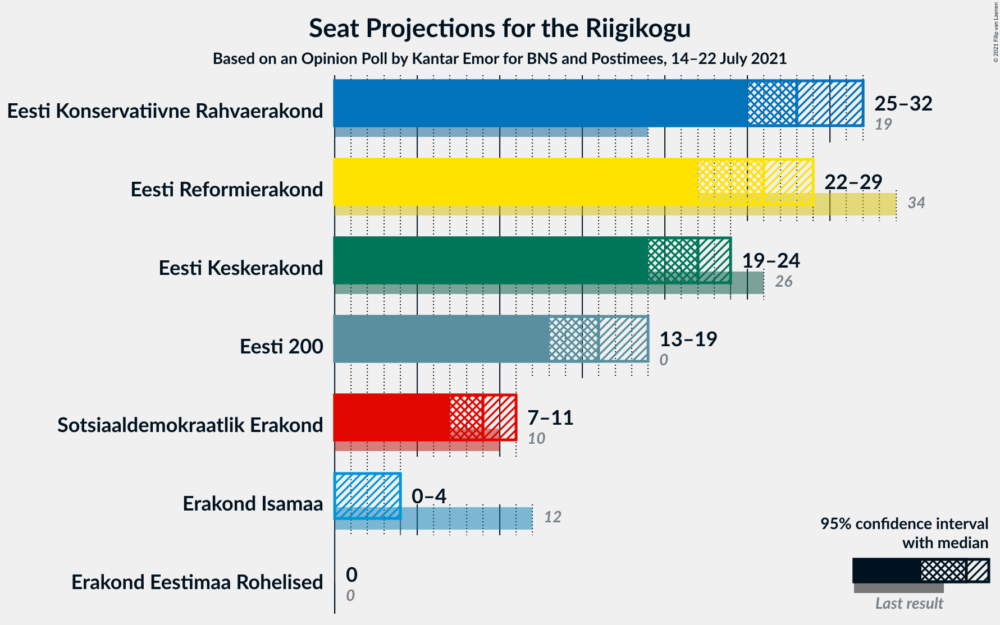

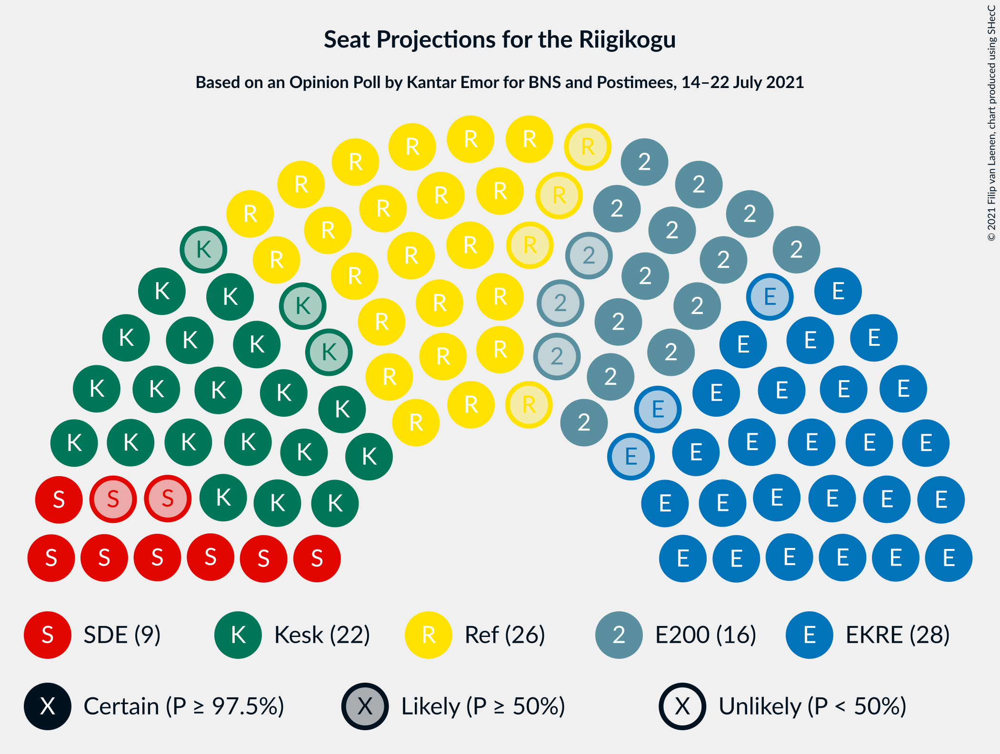

### Confidence Intervals

| Party | Last Result | Median | 80% Confidence Interval | 90% Confidence Interval | 95% Confidence Interval | 99% Confidence Interval |
|:-----:|:-----------:|:------:|:-----------------------:|:-----------------------:|:-----------------------:|:-----------------------:|
| <a href="#eesti-konservatiivne-rahvaerakond">Eesti Konservatiivne Rahvaerakond</a> | 19 | 28 | 26–30 |26–31 |25–32 |24–33 |
| <a href="#eesti-reformierakond">Eesti Reformierakond</a> | 34 | 26 | 24–28 |23–28 |22–29 |21–30 |
| <a href="#eesti-keskerakond">Eesti Keskerakond</a> | 26 | 22 | 20–24 |19–24 |19–24 |18–27 |
| <a href="#eesti-200">Eesti 200</a> | 0 | 16 | 14–18 |14–18 |13–19 |12–20 |
| <a href="#sotsiaaldemokraatlik-erakond">Sotsiaaldemokraatlik Erakond</a> | 10 | 9 | 8–10 |7–11 |7–11 |6–12 |
| <a href="#erakond-isamaa">Erakond Isamaa</a> | 12 | 0 | 0–4 |0–4 |0–4 |0–5 |
| <a href="#erakond-eestimaa-rohelised">Erakond Eestimaa Rohelised</a> | 0 | 0 | 0 |0 |0 |0 |

### Eesti Konservatiivne Rahvaerakond

*For a full overview of the results for this party, see the [Eesti Konservatiivne Rahvaerakond](party-eestikonservatiivnerahvaerakond.html) page.*

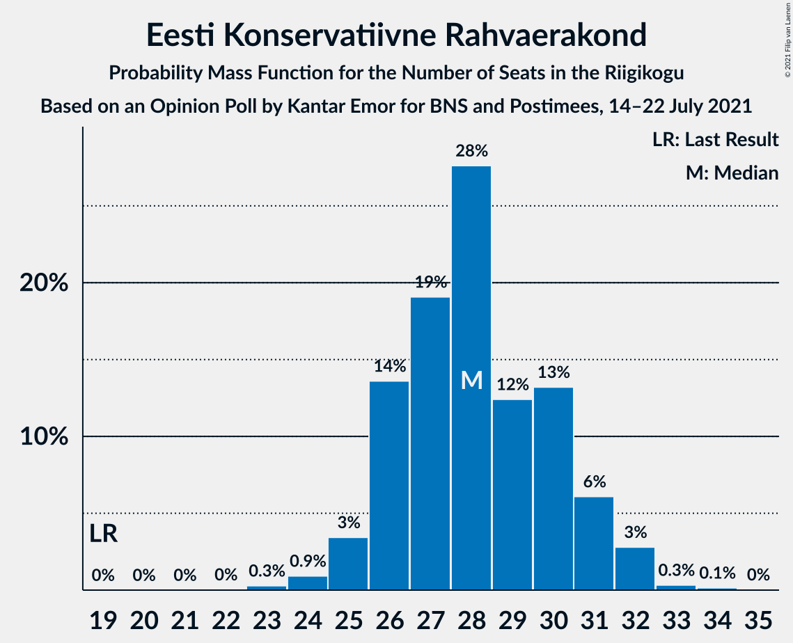

| Number of Seats | Probability | Accumulated | Special Marks |
|:---------------:|:-----------:|:-----------:|:-------------:|
| 19 | 0% | 100% | Last Result |
| 20 | 0% | 100% |  |
| 21 | 0% | 100% |  |
| 22 | 0% | 100% |  |
| 23 | 0.3% | 100% |  |
| 24 | 0.9% | 99.7% |  |
| 25 | 3% | 98.8% |  |
| 26 | 14% | 95% |  |
| 27 | 19% | 82% |  |
| 28 | 28% | 63% | Median |
| 29 | 12% | 35% |  |
| 30 | 13% | 23% |  |
| 31 | 6% | 9% |  |
| 32 | 3% | 3% |  |
| 33 | 0.3% | 0.5% |  |
| 34 | 0.1% | 0.2% |  |
| 35 | 0% | 0% |  |

### Eesti Reformierakond

*For a full overview of the results for this party, see the [Eesti Reformierakond](party-eestireformierakond.html) page.*

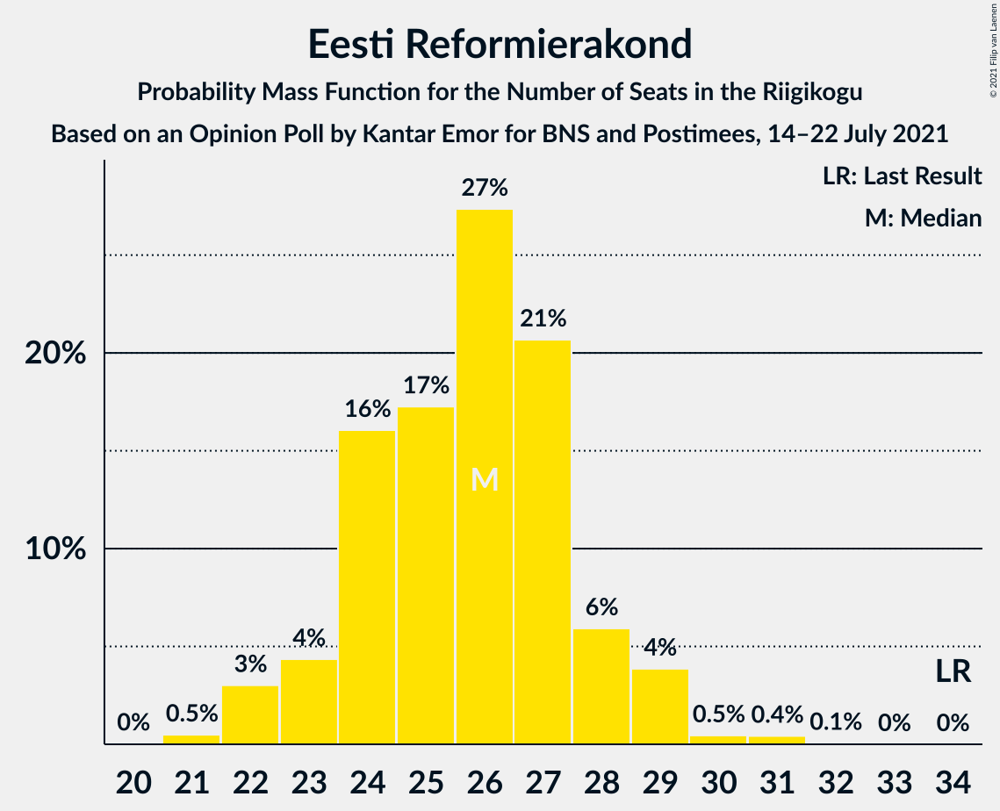

| Number of Seats | Probability | Accumulated | Special Marks |
|:---------------:|:-----------:|:-----------:|:-------------:|
| 21 | 0.5% | 100% |  |
| 22 | 3% | 99.5% |  |
| 23 | 4% | 96% |  |
| 24 | 16% | 92% |  |
| 25 | 17% | 76% |  |
| 26 | 27% | 59% | Median |
| 27 | 21% | 31% |  |
| 28 | 6% | 11% |  |
| 29 | 4% | 5% |  |
| 30 | 0.5% | 1.0% |  |
| 31 | 0.4% | 0.5% |  |
| 32 | 0.1% | 0.1% |  |
| 33 | 0% | 0% |  |
| 34 | 0% | 0% | Last Result |

### Eesti Keskerakond

*For a full overview of the results for this party, see the [Eesti Keskerakond](party-eestikeskerakond.html) page.*

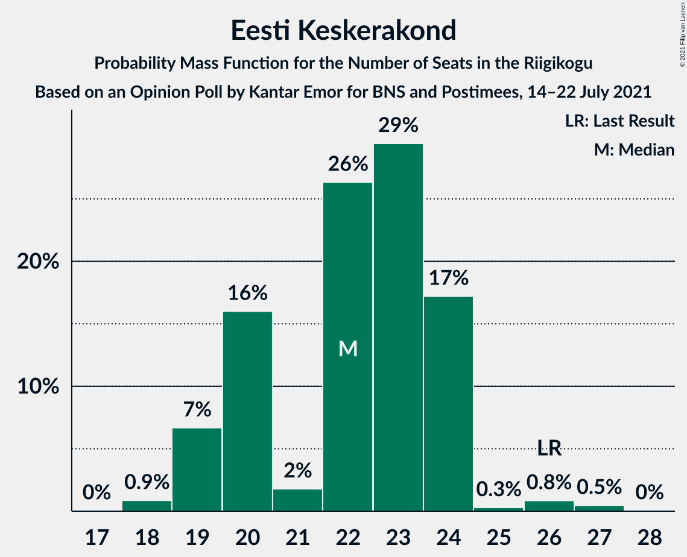

| Number of Seats | Probability | Accumulated | Special Marks |
|:---------------:|:-----------:|:-----------:|:-------------:|
| 18 | 0.9% | 100% |  |
| 19 | 7% | 99.1% |  |
| 20 | 16% | 92% |  |
| 21 | 2% | 76% |  |
| 22 | 26% | 75% | Median |
| 23 | 29% | 48% |  |
| 24 | 17% | 19% |  |
| 25 | 0.3% | 2% |  |
| 26 | 0.8% | 1.4% | Last Result |
| 27 | 0.5% | 0.5% |  |
| 28 | 0% | 0% |  |

### Eesti 200

*For a full overview of the results for this party, see the [Eesti 200](party-eesti200.html) page.*

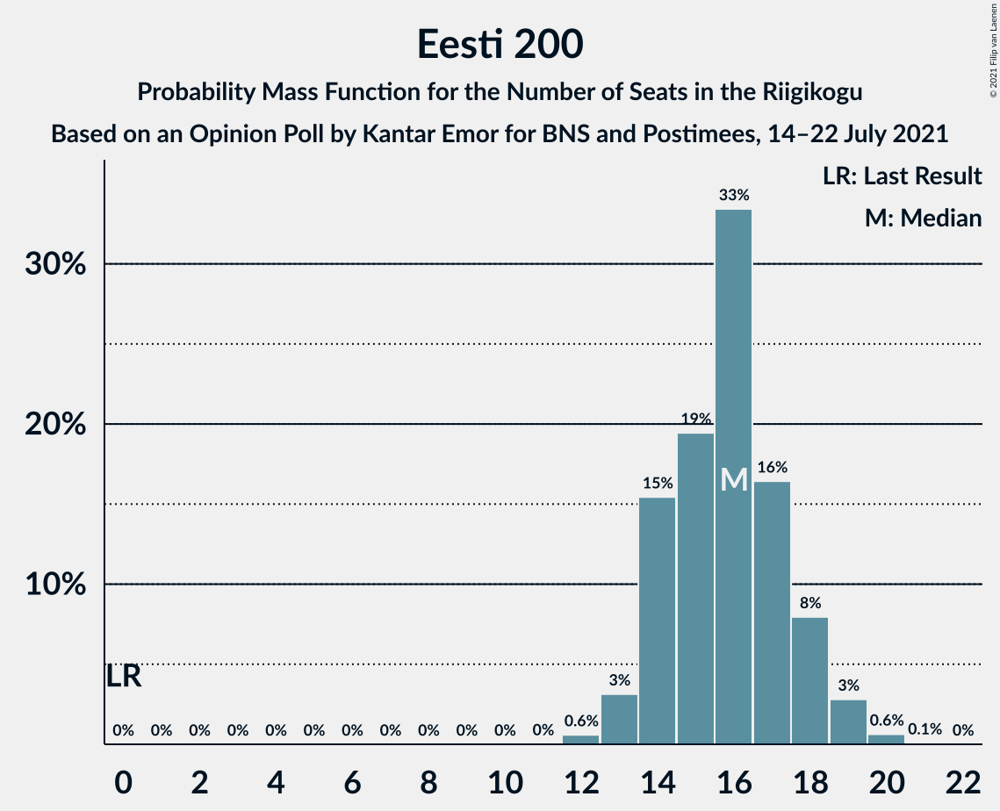

| Number of Seats | Probability | Accumulated | Special Marks |
|:---------------:|:-----------:|:-----------:|:-------------:|
| 0 | 0% | 100% | Last Result |
| 1 | 0% | 100% |  |
| 2 | 0% | 100% |  |
| 3 | 0% | 100% |  |
| 4 | 0% | 100% |  |
| 5 | 0% | 100% |  |
| 6 | 0% | 100% |  |
| 7 | 0% | 100% |  |
| 8 | 0% | 100% |  |
| 9 | 0% | 100% |  |
| 10 | 0% | 100% |  |
| 11 | 0% | 100% |  |
| 12 | 0.6% | 100% |  |
| 13 | 3% | 99.4% |  |
| 14 | 15% | 96% |  |
| 15 | 19% | 81% |  |
| 16 | 33% | 61% | Median |
| 17 | 16% | 28% |  |
| 18 | 8% | 11% |  |
| 19 | 3% | 4% |  |
| 20 | 0.6% | 0.7% |  |
| 21 | 0.1% | 0.1% |  |
| 22 | 0% | 0% |  |

### Sotsiaaldemokraatlik Erakond

*For a full overview of the results for this party, see the [Sotsiaaldemokraatlik Erakond](party-sotsiaaldemokraatlikerakond.html) page.*

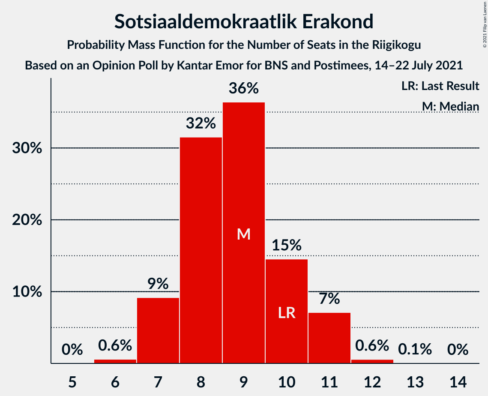

| Number of Seats | Probability | Accumulated | Special Marks |
|:---------------:|:-----------:|:-----------:|:-------------:|
| 6 | 0.6% | 100% |  |
| 7 | 9% | 99.4% |  |
| 8 | 32% | 90% |  |
| 9 | 36% | 59% | Median |
| 10 | 15% | 22% | Last Result |
| 11 | 7% | 8% |  |
| 12 | 0.6% | 0.6% |  |
| 13 | 0.1% | 0.1% |  |
| 14 | 0% | 0% |  |

### Erakond Isamaa

*For a full overview of the results for this party, see the [Erakond Isamaa](party-erakondisamaa.html) page.*

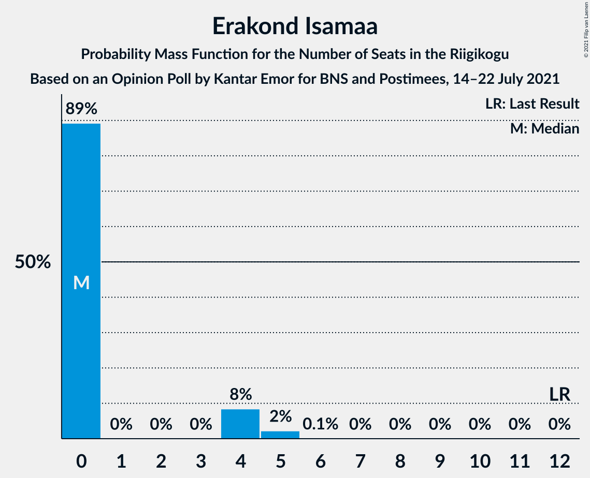

| Number of Seats | Probability | Accumulated | Special Marks |
|:---------------:|:-----------:|:-----------:|:-------------:|
| 0 | 89% | 100% | Median |
| 1 | 0% | 11% |  |
| 2 | 0% | 11% |  |
| 3 | 0% | 11% |  |
| 4 | 8% | 11% |  |
| 5 | 2% | 2% |  |
| 6 | 0.1% | 0.1% |  |
| 7 | 0% | 0% |  |
| 8 | 0% | 0% |  |
| 9 | 0% | 0% |  |
| 10 | 0% | 0% |  |
| 11 | 0% | 0% |  |
| 12 | 0% | 0% | Last Result |

### Erakond Eestimaa Rohelised

*For a full overview of the results for this party, see the [Erakond Eestimaa Rohelised](party-erakondeestimaarohelised.html) page.*

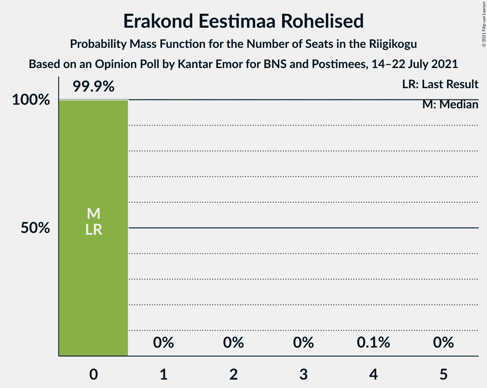

| Number of Seats | Probability | Accumulated | Special Marks |
|:---------------:|:-----------:|:-----------:|:-------------:|
| 0 | 99.9% | 100% | Last Result, Median |
| 1 | 0% | 0.1% |  |
| 2 | 0% | 0.1% |  |
| 3 | 0% | 0.1% |  |
| 4 | 0.1% | 0.1% |  |
| 5 | 0% | 0% |  |

## Coalitions

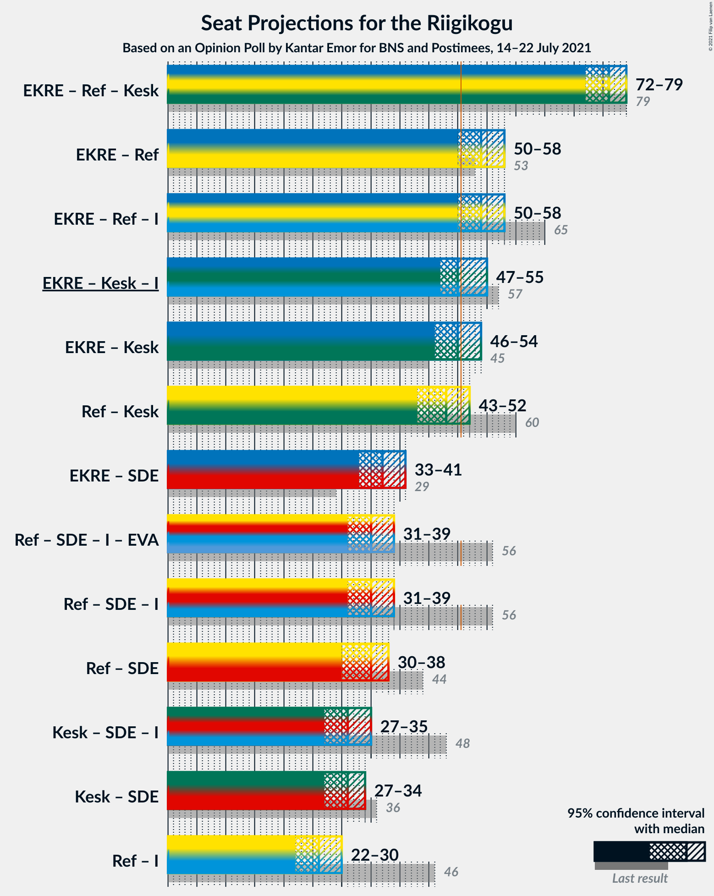

### Confidence Intervals

| Coalition | Last Result | Median | Majority? | 80% Confidence Interval | 90% Confidence Interval | 95% Confidence Interval | 99% Confidence Interval |
|:---------:|:-----------:|:------:|:---------:|:-----------------------:|:-----------------------:|:-----------------------:|:-----------------------:|
| Eesti Konservatiivne Rahvaerakond – Eesti Reformierakond – Eesti Keskerakond | 79 | 76 | 100% | 73–78 | 73–79 | 72–79 | 70–80 |
| Eesti Konservatiivne Rahvaerakond – Eesti Reformierakond | 53 | 54 | 94% | 51–57 | 50–57 | 50–58 | 48–59 |
| Eesti Konservatiivne Rahvaerakond – Eesti Reformierakond – Erakond Isamaa | 65 | 54 | 97% | 52–57 | 51–58 | 50–58 | 49–59 |
| Eesti Konservatiivne Rahvaerakond – Eesti Keskerakond – Erakond Isamaa | 57 | 50 | 44% | 49–53 | 48–54 | 47–55 | 45–56 |
| Eesti Konservatiivne Rahvaerakond – Eesti Keskerakond | 45 | 50 | 35% | 48–52 | 47–54 | 46–54 | 45–56 |
| Eesti Reformierakond – Eesti Keskerakond | 60 | 48 | 7% | 45–50 | 44–51 | 43–52 | 43–52 |
| Eesti Konservatiivne Rahvaerakond – Sotsiaaldemokraatlik Erakond | 29 | 37 | 0% | 34–39 | 34–40 | 33–41 | 32–42 |
| Eesti Reformierakond – Sotsiaaldemokraatlik Erakond – Erakond Isamaa | 56 | 35 | 0% | 33–37 | 31–38 | 31–39 | 30–41 |
| Eesti Reformierakond – Sotsiaaldemokraatlik Erakond | 44 | 35 | 0% | 32–36 | 31–37 | 30–38 | 29–40 |
| Eesti Keskerakond – Sotsiaaldemokraatlik Erakond – Erakond Isamaa | 48 | 31 | 0% | 28–34 | 28–35 | 27–35 | 27–36 |
| Eesti Keskerakond – Sotsiaaldemokraatlik Erakond | 36 | 31 | 0% | 28–33 | 28–34 | 27–34 | 26–36 |
| Eesti Reformierakond – Erakond Isamaa | 46 | 26 | 0% | 24–29 | 23–29 | 22–30 | 22–31 |

### Eesti Konservatiivne Rahvaerakond – Eesti Reformierakond – Eesti Keskerakond

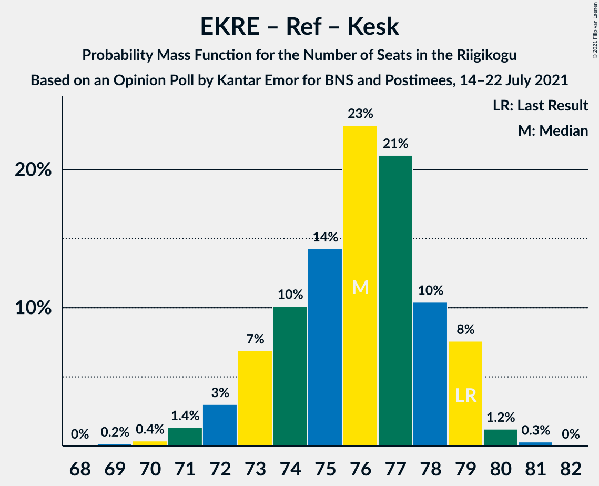

| Number of Seats | Probability | Accumulated | Special Marks |
|:---------------:|:-----------:|:-----------:|:-------------:|
| 69 | 0.2% | 100% |  |
| 70 | 0.4% | 99.8% |  |
| 71 | 1.4% | 99.4% |  |
| 72 | 3% | 98% |  |
| 73 | 7% | 95% |  |
| 74 | 10% | 88% |  |
| 75 | 14% | 78% |  |
| 76 | 23% | 64% | Median |
| 77 | 21% | 41% |  |
| 78 | 10% | 20% |  |
| 79 | 8% | 9% | Last Result |
| 80 | 1.2% | 2% |  |
| 81 | 0.3% | 0.3% |  |
| 82 | 0% | 0% |  |

### Eesti Konservatiivne Rahvaerakond – Eesti Reformierakond

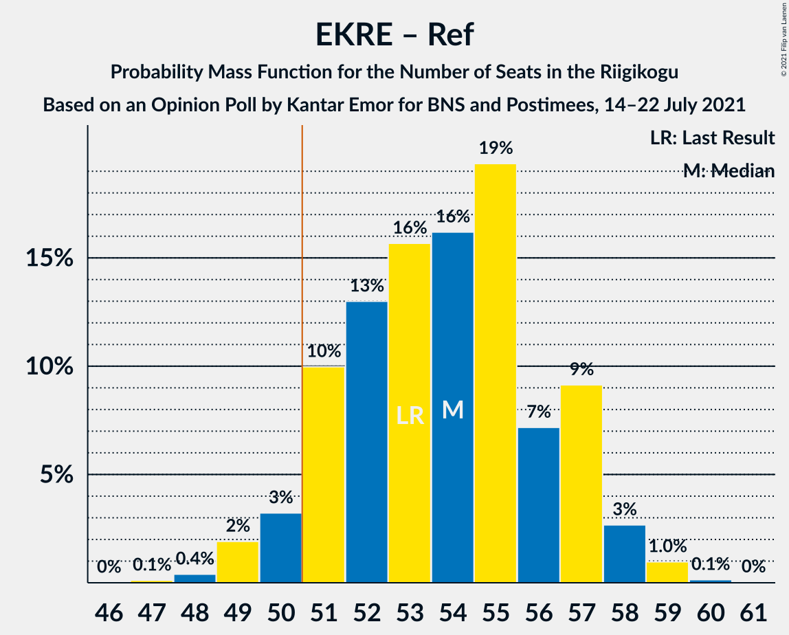

| Number of Seats | Probability | Accumulated | Special Marks |
|:---------------:|:-----------:|:-----------:|:-------------:|
| 47 | 0.1% | 100% |  |
| 48 | 0.4% | 99.9% |  |
| 49 | 2% | 99.5% |  |
| 50 | 3% | 98% |  |
| 51 | 10% | 94% | Majority |
| 52 | 13% | 84% |  |
| 53 | 16% | 71% | Last Result |
| 54 | 16% | 56% | Median |
| 55 | 19% | 39% |  |
| 56 | 7% | 20% |  |
| 57 | 9% | 13% |  |
| 58 | 3% | 4% |  |
| 59 | 1.0% | 1.2% |  |
| 60 | 0.1% | 0.2% |  |
| 61 | 0% | 0% |  |

### Eesti Konservatiivne Rahvaerakond – Eesti Reformierakond – Erakond Isamaa

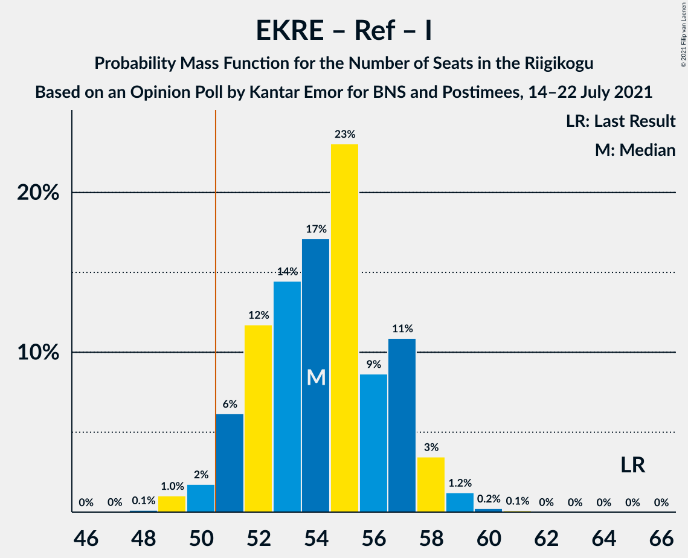

| Number of Seats | Probability | Accumulated | Special Marks |
|:---------------:|:-----------:|:-----------:|:-------------:|
| 48 | 0.1% | 100% |  |
| 49 | 1.0% | 99.9% |  |
| 50 | 2% | 98.8% |  |
| 51 | 6% | 97% | Majority |
| 52 | 12% | 91% |  |
| 53 | 14% | 79% |  |
| 54 | 17% | 65% | Median |
| 55 | 23% | 48% |  |
| 56 | 9% | 25% |  |
| 57 | 11% | 16% |  |
| 58 | 3% | 5% |  |
| 59 | 1.2% | 2% |  |
| 60 | 0.2% | 0.4% |  |
| 61 | 0.1% | 0.1% |  |
| 62 | 0% | 0% |  |
| 63 | 0% | 0% |  |
| 64 | 0% | 0% |  |
| 65 | 0% | 0% | Last Result |

### Eesti Konservatiivne Rahvaerakond – Eesti Keskerakond – Erakond Isamaa

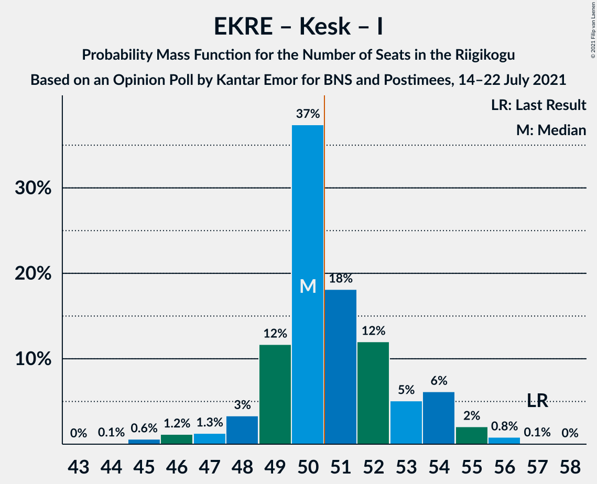

| Number of Seats | Probability | Accumulated | Special Marks |
|:---------------:|:-----------:|:-----------:|:-------------:|
| 44 | 0.1% | 100% |  |
| 45 | 0.6% | 99.9% |  |
| 46 | 1.2% | 99.3% |  |
| 47 | 1.3% | 98% |  |
| 48 | 3% | 97% |  |
| 49 | 12% | 94% |  |
| 50 | 37% | 82% | Median |
| 51 | 18% | 44% | Majority |
| 52 | 12% | 26% |  |
| 53 | 5% | 14% |  |
| 54 | 6% | 9% |  |
| 55 | 2% | 3% |  |
| 56 | 0.8% | 1.0% |  |
| 57 | 0.1% | 0.2% | Last Result |
| 58 | 0% | 0% |  |

### Eesti Konservatiivne Rahvaerakond – Eesti Keskerakond

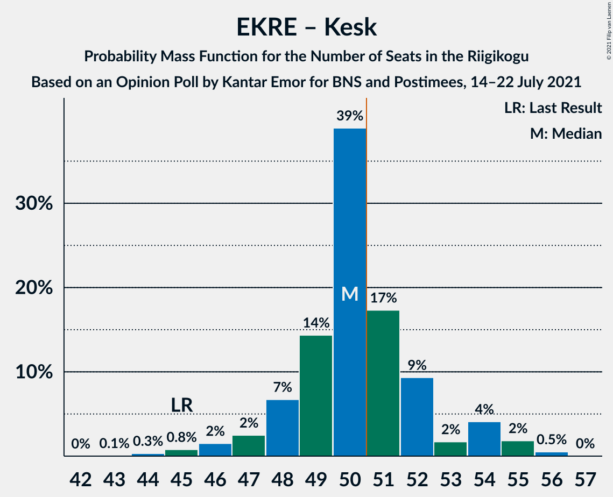

| Number of Seats | Probability | Accumulated | Special Marks |
|:---------------:|:-----------:|:-----------:|:-------------:|
| 43 | 0.1% | 100% |  |
| 44 | 0.3% | 99.9% |  |
| 45 | 0.8% | 99.6% | Last Result |
| 46 | 2% | 98.8% |  |
| 47 | 2% | 97% |  |
| 48 | 7% | 95% |  |
| 49 | 14% | 88% |  |
| 50 | 39% | 74% | Median |
| 51 | 17% | 35% | Majority |
| 52 | 9% | 18% |  |
| 53 | 2% | 8% |  |
| 54 | 4% | 6% |  |
| 55 | 2% | 2% |  |
| 56 | 0.5% | 0.5% |  |
| 57 | 0% | 0% |  |

### Eesti Reformierakond – Eesti Keskerakond

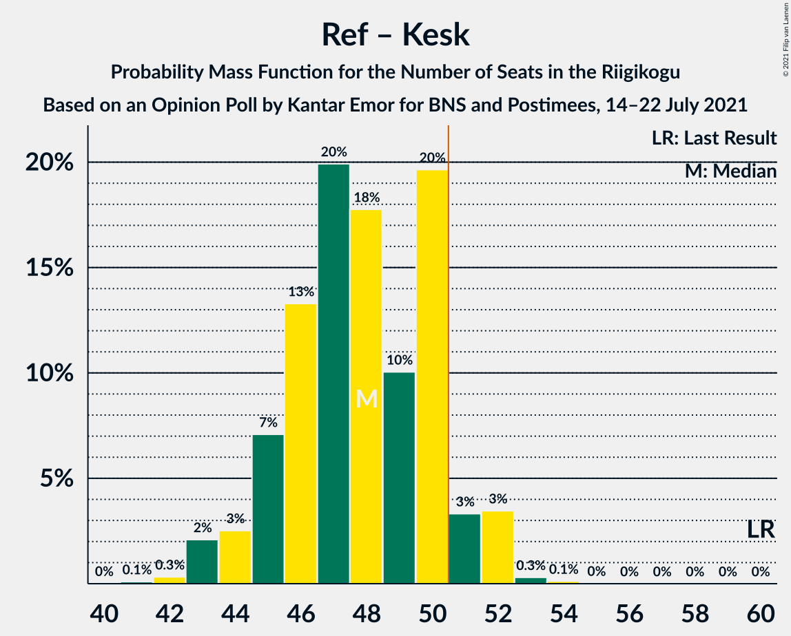

| Number of Seats | Probability | Accumulated | Special Marks |
|:---------------:|:-----------:|:-----------:|:-------------:|
| 41 | 0.1% | 100% |  |
| 42 | 0.3% | 99.9% |  |
| 43 | 2% | 99.6% |  |
| 44 | 3% | 97% |  |
| 45 | 7% | 95% |  |
| 46 | 13% | 88% |  |
| 47 | 20% | 75% |  |
| 48 | 18% | 55% | Median |
| 49 | 10% | 37% |  |
| 50 | 20% | 27% |  |
| 51 | 3% | 7% | Majority |
| 52 | 3% | 4% |  |
| 53 | 0.3% | 0.4% |  |
| 54 | 0.1% | 0.1% |  |
| 55 | 0% | 0% |  |
| 56 | 0% | 0% |  |
| 57 | 0% | 0% |  |
| 58 | 0% | 0% |  |
| 59 | 0% | 0% |  |
| 60 | 0% | 0% | Last Result |

### Eesti Konservatiivne Rahvaerakond – Sotsiaaldemokraatlik Erakond

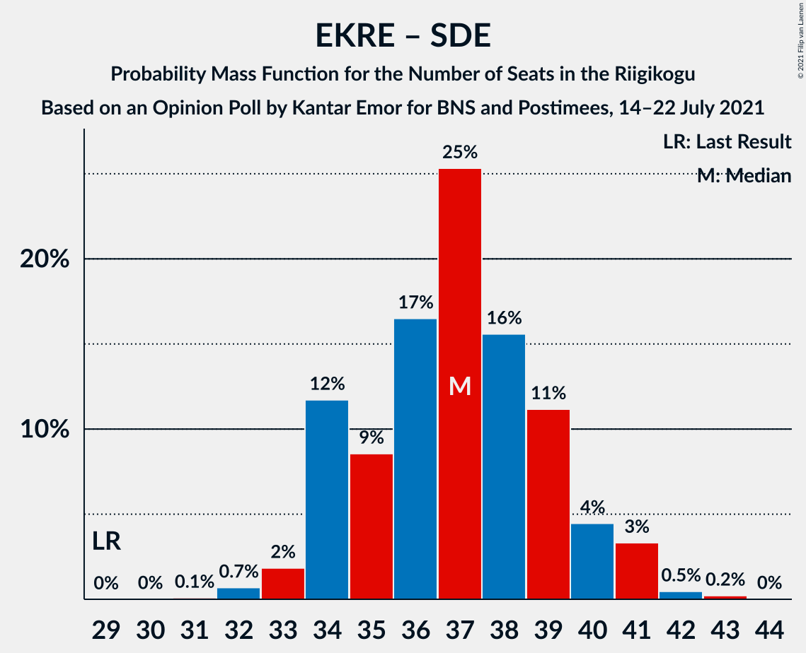

| Number of Seats | Probability | Accumulated | Special Marks |
|:---------------:|:-----------:|:-----------:|:-------------:|
| 29 | 0% | 100% | Last Result |
| 30 | 0% | 100% |  |
| 31 | 0.1% | 100% |  |
| 32 | 0.7% | 99.9% |  |
| 33 | 2% | 99.2% |  |
| 34 | 12% | 97% |  |
| 35 | 9% | 86% |  |
| 36 | 17% | 77% |  |
| 37 | 25% | 61% | Median |
| 38 | 16% | 35% |  |
| 39 | 11% | 20% |  |
| 40 | 4% | 8% |  |
| 41 | 3% | 4% |  |
| 42 | 0.5% | 0.7% |  |
| 43 | 0.2% | 0.2% |  |
| 44 | 0% | 0% |  |

### Eesti Reformierakond – Sotsiaaldemokraatlik Erakond – Erakond Isamaa

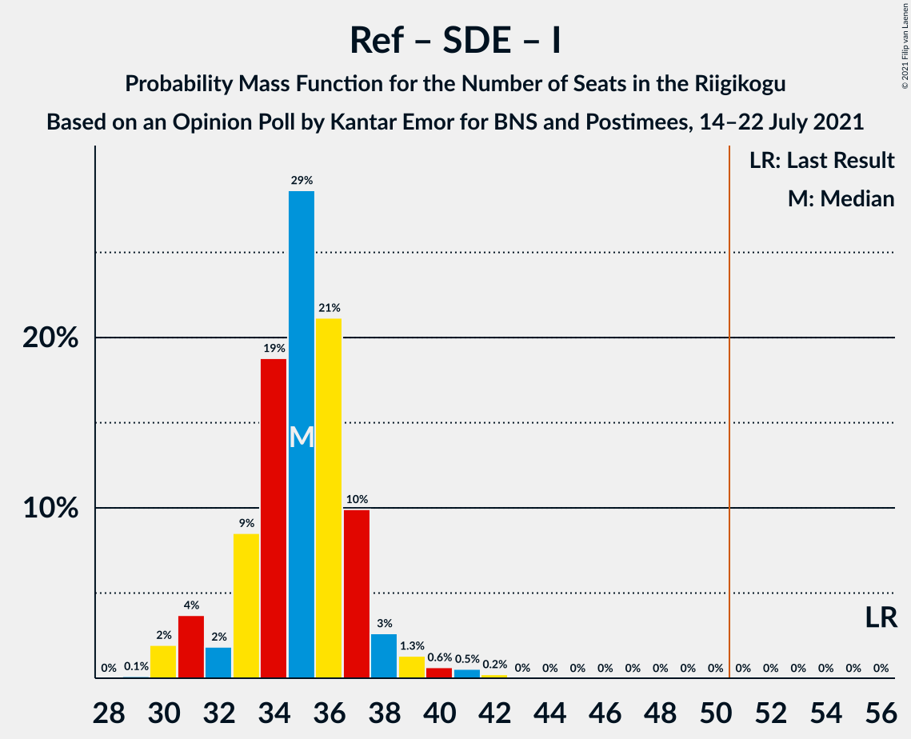

| Number of Seats | Probability | Accumulated | Special Marks |
|:---------------:|:-----------:|:-----------:|:-------------:|
| 29 | 0.1% | 100% |  |
| 30 | 2% | 99.9% |  |
| 31 | 4% | 98% |  |
| 32 | 2% | 94% |  |
| 33 | 9% | 92% |  |
| 34 | 19% | 84% |  |
| 35 | 29% | 65% | Median |
| 36 | 21% | 36% |  |
| 37 | 10% | 15% |  |
| 38 | 3% | 5% |  |
| 39 | 1.3% | 3% |  |
| 40 | 0.6% | 1.4% |  |
| 41 | 0.5% | 0.8% |  |
| 42 | 0.2% | 0.2% |  |
| 43 | 0% | 0% |  |
| 44 | 0% | 0% |  |
| 45 | 0% | 0% |  |
| 46 | 0% | 0% |  |
| 47 | 0% | 0% |  |
| 48 | 0% | 0% |  |
| 49 | 0% | 0% |  |
| 50 | 0% | 0% |  |
| 51 | 0% | 0% | Majority |
| 52 | 0% | 0% |  |
| 53 | 0% | 0% |  |
| 54 | 0% | 0% |  |
| 55 | 0% | 0% |  |
| 56 | 0% | 0% | Last Result |

### Eesti Reformierakond – Sotsiaaldemokraatlik Erakond

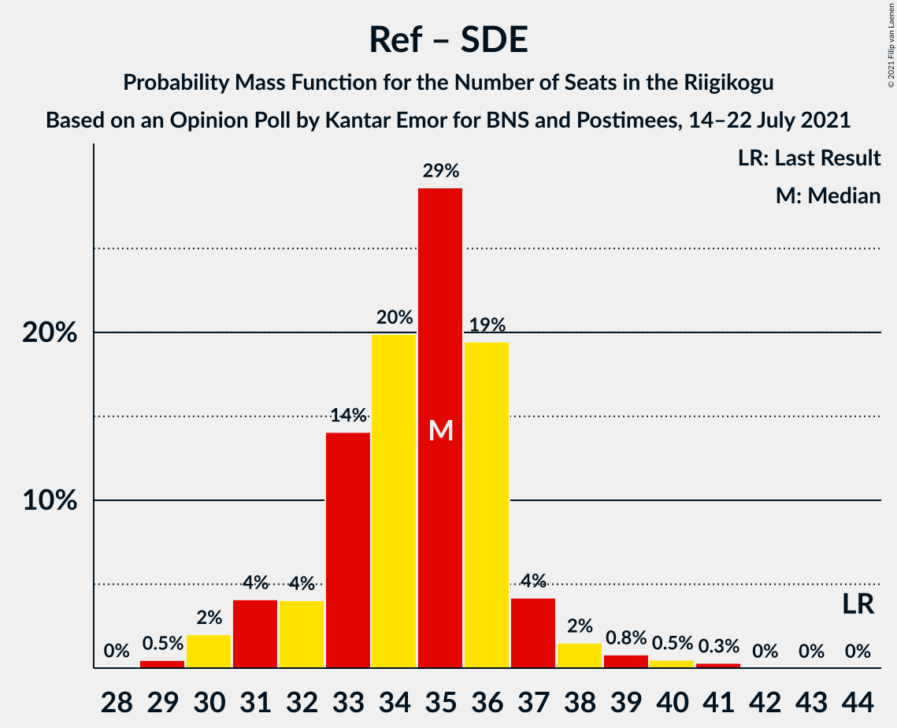

| Number of Seats | Probability | Accumulated | Special Marks |
|:---------------:|:-----------:|:-----------:|:-------------:|
| 29 | 0.5% | 100% |  |
| 30 | 2% | 99.5% |  |
| 31 | 4% | 97% |  |
| 32 | 4% | 93% |  |
| 33 | 14% | 89% |  |
| 34 | 20% | 75% |  |
| 35 | 29% | 55% | Median |
| 36 | 19% | 27% |  |
| 37 | 4% | 7% |  |
| 38 | 2% | 3% |  |
| 39 | 0.8% | 2% |  |
| 40 | 0.5% | 0.8% |  |
| 41 | 0.3% | 0.3% |  |
| 42 | 0% | 0% |  |
| 43 | 0% | 0% |  |
| 44 | 0% | 0% | Last Result |

### Eesti Keskerakond – Sotsiaaldemokraatlik Erakond – Erakond Isamaa

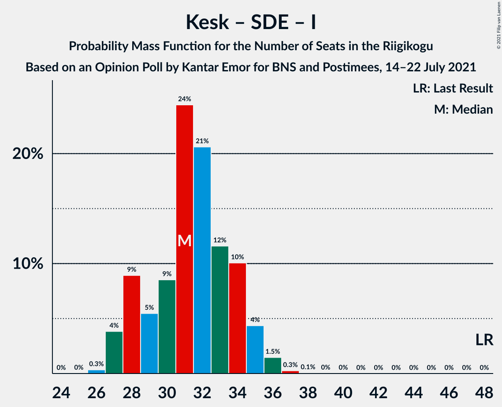

| Number of Seats | Probability | Accumulated | Special Marks |
|:---------------:|:-----------:|:-----------:|:-------------:|
| 26 | 0.3% | 100% |  |
| 27 | 4% | 99.6% |  |
| 28 | 9% | 96% |  |
| 29 | 5% | 87% |  |
| 30 | 9% | 81% |  |
| 31 | 24% | 73% | Median |
| 32 | 21% | 48% |  |
| 33 | 12% | 28% |  |
| 34 | 10% | 16% |  |
| 35 | 4% | 6% |  |
| 36 | 1.5% | 2% |  |
| 37 | 0.3% | 0.4% |  |
| 38 | 0.1% | 0.1% |  |
| 39 | 0% | 0% |  |
| 40 | 0% | 0% |  |
| 41 | 0% | 0% |  |
| 42 | 0% | 0% |  |
| 43 | 0% | 0% |  |
| 44 | 0% | 0% |  |
| 45 | 0% | 0% |  |
| 46 | 0% | 0% |  |
| 47 | 0% | 0% |  |
| 48 | 0% | 0% | Last Result |

### Eesti Keskerakond – Sotsiaaldemokraatlik Erakond

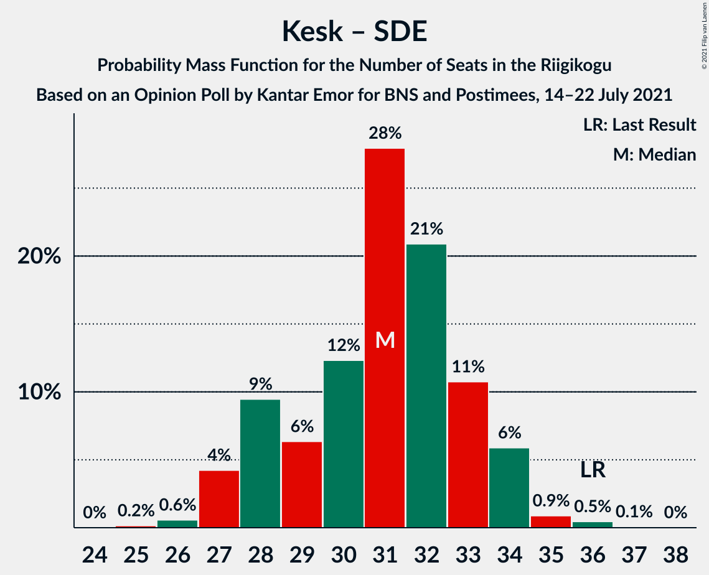

| Number of Seats | Probability | Accumulated | Special Marks |
|:---------------:|:-----------:|:-----------:|:-------------:|
| 25 | 0.2% | 100% |  |
| 26 | 0.6% | 99.8% |  |
| 27 | 4% | 99.3% |  |
| 28 | 9% | 95% |  |
| 29 | 6% | 86% |  |
| 30 | 12% | 79% |  |
| 31 | 28% | 67% | Median |
| 32 | 21% | 39% |  |
| 33 | 11% | 18% |  |
| 34 | 6% | 7% |  |
| 35 | 0.9% | 1.4% |  |
| 36 | 0.5% | 0.5% | Last Result |
| 37 | 0.1% | 0.1% |  |
| 38 | 0% | 0% |  |

### Eesti Reformierakond – Erakond Isamaa

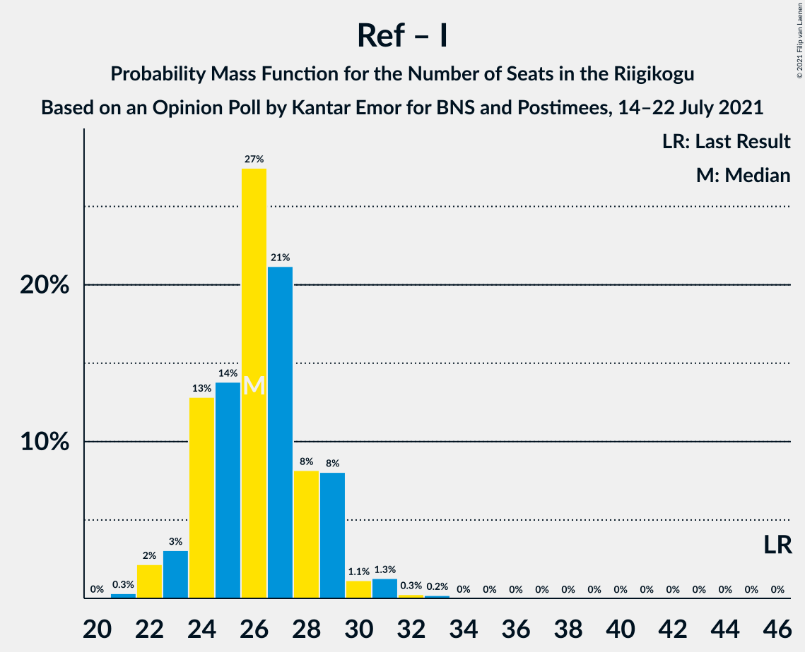

| Number of Seats | Probability | Accumulated | Special Marks |
|:---------------:|:-----------:|:-----------:|:-------------:|
| 21 | 0.3% | 100% |  |
| 22 | 2% | 99.7% |  |
| 23 | 3% | 97% |  |
| 24 | 13% | 94% |  |
| 25 | 14% | 82% |  |
| 26 | 27% | 68% | Median |
| 27 | 21% | 40% |  |
| 28 | 8% | 19% |  |
| 29 | 8% | 11% |  |
| 30 | 1.1% | 3% |  |
| 31 | 1.3% | 2% |  |
| 32 | 0.3% | 0.5% |  |
| 33 | 0.2% | 0.2% |  |
| 34 | 0% | 0% |  |
| 35 | 0% | 0% |  |
| 36 | 0% | 0% |  |
| 37 | 0% | 0% |  |
| 38 | 0% | 0% |  |
| 39 | 0% | 0% |  |
| 40 | 0% | 0% |  |
| 41 | 0% | 0% |  |
| 42 | 0% | 0% |  |
| 43 | 0% | 0% |  |
| 44 | 0% | 0% |  |
| 45 | 0% | 0% |  |
| 46 | 0% | 0% | Last Result |

## Technical Information

### Opinion Poll

+ **Polling firm:** Kantar Emor
+ **Commissioner(s):** BNS and Postimees
+ **Fieldwork period:** 14–22 July 2021

### Calculations

+ **Sample size:** 1001
+ **Simulations done:** 131,072
+ **Error estimate:** 2.09%

