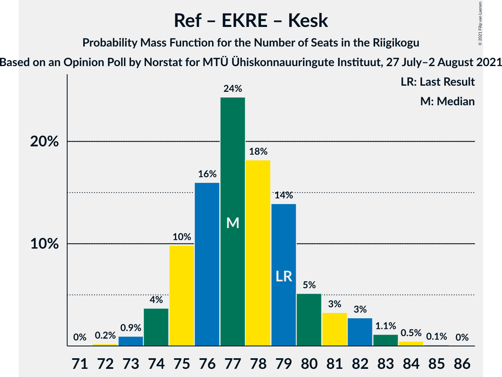

# Opinion Poll by Norstat for MTÜ Ühiskonnauuringute Instituut, 27 July–2 August 2021

<a href="#voting-intentions">Voting Intentions</a> | <a href="#seats">Seats</a> | <a href="#coalitions">Coalitions</a> | <a href="#technical-information">Technical Information</a>

## Voting Intentions

### Confidence Intervals

| Party | Last Result | Poll Result | 80% Confidence Interval | 90% Confidence Interval | 95% Confidence Interval | 99% Confidence Interval |
|:-----:|:-----------:|:-----------:|:-----------------------:|:-----------------------:|:-----------------------:|:-----------------------:|
| Eesti Reformierakond | 28.9% | 28.8% | 27.0–30.7% |26.5–31.2% |26.1–31.7% |25.2–32.6% |
| Eesti Konservatiivne Rahvaerakond | 17.8% | 24.8% | 23.1–26.6% |22.6–27.1% |22.2–27.6% |21.4–28.5% |
| Eesti Keskerakond | 23.1% | 17.8% | 16.3–19.4% |15.9–19.9% |15.5–20.3% |14.9–21.1% |
| Eesti 200 | 4.4% | 12.1% | 10.9–13.5% |10.5–13.9% |10.2–14.3% |9.6–15.0% |
| Sotsiaaldemokraatlik Erakond | 9.8% | 7.6% | 6.6–8.8% |6.3–9.1% |6.1–9.4% |5.7–10.0% |
| Erakond Isamaa | 11.4% | 5.8% | 5.0–6.9% |4.7–7.2% |4.5–7.4% |4.1–8.0% |
| Erakond Eestimaa Rohelised | 1.8% | 2.3% | 1.8–3.0% |1.6–3.2% |1.5–3.4% |1.3–3.8% |

*Note:* The poll result column reflects the actual value used in the calculations. Published results may vary slightly, and in addition be rounded to fewer digits.

## Seats

### Confidence Intervals

| Party | Last Result | Median | 80% Confidence Interval | 90% Confidence Interval | 95% Confidence Interval | 99% Confidence Interval |
|:-----:|:-----------:|:------:|:-----------------------:|:-----------------------:|:-----------------------:|:-----------------------:|
| <a href="#eesti-reformierakond">Eesti Reformierakond</a> | 34 | 32 | 30–34 |29–35 |28–36 |28–37 |
| <a href="#eesti-konservatiivne-rahvaerakond">Eesti Konservatiivne Rahvaerakond</a> | 19 | 27 | 25–29 |24–30 |24–30 |23–32 |
| <a href="#eesti-keskerakond">Eesti Keskerakond</a> | 26 | 18 | 17–20 |16–21 |16–22 |15–23 |
| <a href="#eesti-200">Eesti 200</a> | 0 | 12 | 10–13 |10–14 |10–14 |9–15 |
| <a href="#sotsiaaldemokraatlik-erakond">Sotsiaaldemokraatlik Erakond</a> | 10 | 7 | 6–8 |6–8 |5–9 |5–10 |
| <a href="#erakond-isamaa">Erakond Isamaa</a> | 12 | 5 | 4–6 |0–6 |0–7 |0–7 |
| <a href="#erakond-eestimaa-rohelised">Erakond Eestimaa Rohelised</a> | 0 | 0 | 0 |0 |0 |0 |

### Eesti Reformierakond

*For a full overview of the results for this party, see the [Eesti Reformierakond](party-eestireformierakond.html) page.*

| Number of Seats | Probability | Accumulated | Special Marks |
|:---------------:|:-----------:|:-----------:|:-------------:|
| 26 | 0.1% | 100% |  |
| 27 | 0.4% | 99.9% |  |
| 28 | 2% | 99.5% |  |
| 29 | 7% | 97% |  |
| 30 | 11% | 91% |  |
| 31 | 19% | 79% |  |
| 32 | 24% | 60% | Median |
| 33 | 20% | 37% |  |
| 34 | 10% | 17% | Last Result |
| 35 | 5% | 8% |  |
| 36 | 2% | 3% |  |
| 37 | 0.6% | 0.8% |  |
| 38 | 0.1% | 0.2% |  |
| 39 | 0% | 0% |  |

### Eesti Konservatiivne Rahvaerakond

*For a full overview of the results for this party, see the [Eesti Konservatiivne Rahvaerakond](party-eestikonservatiivnerahvaerakond.html) page.*

| Number of Seats | Probability | Accumulated | Special Marks |
|:---------------:|:-----------:|:-----------:|:-------------:|
| 19 | 0% | 100% | Last Result |
| 20 | 0% | 100% |  |
| 21 | 0% | 100% |  |
| 22 | 0.2% | 100% |  |
| 23 | 1.2% | 99.7% |  |
| 24 | 5% | 98% |  |
| 25 | 12% | 94% |  |
| 26 | 21% | 82% |  |
| 27 | 23% | 61% | Median |
| 28 | 19% | 38% |  |
| 29 | 11% | 19% |  |
| 30 | 5% | 8% |  |
| 31 | 2% | 2% |  |
| 32 | 0.4% | 0.5% |  |
| 33 | 0.1% | 0.1% |  |
| 34 | 0% | 0% |  |

### Eesti Keskerakond

*For a full overview of the results for this party, see the [Eesti Keskerakond](party-eestikeskerakond.html) page.*

| Number of Seats | Probability | Accumulated | Special Marks |
|:---------------:|:-----------:|:-----------:|:-------------:|
| 14 | 0.2% | 100% |  |
| 15 | 1.3% | 99.8% |  |
| 16 | 6% | 98.5% |  |
| 17 | 17% | 93% |  |
| 18 | 26% | 76% | Median |
| 19 | 26% | 50% |  |
| 20 | 15% | 23% |  |
| 21 | 6% | 9% |  |
| 22 | 2% | 3% |  |
| 23 | 0.5% | 0.6% |  |
| 24 | 0.1% | 0.1% |  |
| 25 | 0% | 0% |  |
| 26 | 0% | 0% | Last Result |

### Eesti 200

*For a full overview of the results for this party, see the [Eesti 200](party-eesti200.html) page.*

| Number of Seats | Probability | Accumulated | Special Marks |
|:---------------:|:-----------:|:-----------:|:-------------:|
| 0 | 0% | 100% | Last Result |
| 1 | 0% | 100% |  |
| 2 | 0% | 100% |  |
| 3 | 0% | 100% |  |
| 4 | 0% | 100% |  |
| 5 | 0% | 100% |  |
| 6 | 0% | 100% |  |
| 7 | 0% | 100% |  |
| 8 | 0.1% | 100% |  |
| 9 | 1.3% | 99.9% |  |
| 10 | 9% | 98.6% |  |
| 11 | 30% | 90% |  |
| 12 | 30% | 60% | Median |
| 13 | 20% | 30% |  |
| 14 | 8% | 10% |  |
| 15 | 2% | 2% |  |
| 16 | 0.3% | 0.3% |  |
| 17 | 0% | 0% |  |

### Sotsiaaldemokraatlik Erakond

*For a full overview of the results for this party, see the [Sotsiaaldemokraatlik Erakond](party-sotsiaaldemokraatlikerakond.html) page.*

| Number of Seats | Probability | Accumulated | Special Marks |
|:---------------:|:-----------:|:-----------:|:-------------:|
| 4 | 0.1% | 100% |  |
| 5 | 5% | 99.9% |  |
| 6 | 27% | 95% |  |
| 7 | 41% | 68% | Median |
| 8 | 22% | 27% |  |
| 9 | 4% | 5% |  |
| 10 | 0.6% | 0.6% | Last Result |
| 11 | 0% | 0% |  |

### Erakond Isamaa

*For a full overview of the results for this party, see the [Erakond Isamaa](party-erakondisamaa.html) page.*

| Number of Seats | Probability | Accumulated | Special Marks |
|:---------------:|:-----------:|:-----------:|:-------------:|
| 0 | 10% | 100% |  |
| 1 | 0% | 90% |  |
| 2 | 0% | 90% |  |
| 3 | 0% | 90% |  |
| 4 | 12% | 90% |  |
| 5 | 55% | 78% | Median |
| 6 | 19% | 23% |  |
| 7 | 4% | 4% |  |
| 8 | 0.2% | 0.2% |  |
| 9 | 0% | 0% |  |
| 10 | 0% | 0% |  |
| 11 | 0% | 0% |  |
| 12 | 0% | 0% | Last Result |

### Erakond Eestimaa Rohelised

*For a full overview of the results for this party, see the [Erakond Eestimaa Rohelised](party-erakondeestimaarohelised.html) page.*

| Number of Seats | Probability | Accumulated | Special Marks |
|:---------------:|:-----------:|:-----------:|:-------------:|
| 0 | 100% | 100% | Last Result, Median |

## Coalitions

### Confidence Intervals

| Coalition | Last Result | Median | Majority? | 80% Confidence Interval | 90% Confidence Interval | 95% Confidence Interval | 99% Confidence Interval |
|:---------:|:-----------:|:------:|:---------:|:-----------------------:|:-----------------------:|:-----------------------:|:-----------------------:|
| Eesti Reformierakond – Eesti Konservatiivne Rahvaerakond – Eesti Keskerakond | 79 | 77 | 100% | 75–80 | 75–81 | 74–82 | 73–84 |
| Eesti Reformierakond – Eesti Konservatiivne Rahvaerakond – Erakond Isamaa | 65 | 64 | 100% | 61–66 | 60–67 | 60–67 | 58–68 |
| Eesti Reformierakond – Eesti Konservatiivne Rahvaerakond | 53 | 59 | 100% | 56–62 | 56–62 | 55–63 | 54–65 |
| Eesti Reformierakond – Eesti Keskerakond | 60 | 50 | 49% | 48–53 | 47–54 | 47–55 | 45–56 |
| Eesti Konservatiivne Rahvaerakond – Eesti Keskerakond – Erakond Isamaa | 57 | 50 | 46% | 48–53 | 47–53 | 46–54 | 44–55 |
| Eesti Konservatiivne Rahvaerakond – Eesti Keskerakond | 45 | 45 | 1.0% | 43–48 | 42–49 | 42–50 | 41–51 |
| Eesti Reformierakond – Sotsiaaldemokraatlik Erakond – Erakond Isamaa | 56 | 44 | 0% | 41–46 | 40–47 | 39–47 | 38–49 |
| Eesti Reformierakond – Sotsiaaldemokraatlik Erakond | 44 | 39 | 0% | 36–41 | 36–42 | 35–43 | 34–44 |
| Eesti Reformierakond – Erakond Isamaa | 46 | 37 | 0% | 34–39 | 33–40 | 32–40 | 30–42 |
| Eesti Konservatiivne Rahvaerakond – Sotsiaaldemokraatlik Erakond | 29 | 34 | 0% | 32–36 | 31–37 | 30–38 | 29–39 |
| Eesti Keskerakond – Sotsiaaldemokraatlik Erakond – Erakond Isamaa | 48 | 30 | 0% | 28–33 | 27–33 | 26–34 | 24–35 |
| Eesti Keskerakond – Sotsiaaldemokraatlik Erakond | 36 | 25 | 0% | 23–28 | 23–28 | 22–29 | 21–30 |

### Eesti Reformierakond – Eesti Konservatiivne Rahvaerakond – Eesti Keskerakond

| Number of Seats | Probability | Accumulated | Special Marks |
|:---------------:|:-----------:|:-----------:|:-------------:|
| 72 | 0.2% | 100% |  |
| 73 | 0.9% | 99.8% |  |
| 74 | 4% | 98.8% |  |
| 75 | 10% | 95% |  |
| 76 | 16% | 85% |  |
| 77 | 24% | 69% | Median |
| 78 | 18% | 45% |  |
| 79 | 14% | 27% | Last Result |
| 80 | 5% | 13% |  |
| 81 | 3% | 8% |  |
| 82 | 3% | 4% |  |
| 83 | 1.1% | 2% |  |
| 84 | 0.5% | 0.6% |  |
| 85 | 0.1% | 0.1% |  |
| 86 | 0% | 0% |  |

### Eesti Reformierakond – Eesti Konservatiivne Rahvaerakond – Erakond Isamaa

| Number of Seats | Probability | Accumulated | Special Marks |
|:---------------:|:-----------:|:-----------:|:-------------:|
| 57 | 0.1% | 100% |  |
| 58 | 0.5% | 99.8% |  |
| 59 | 1.3% | 99.3% |  |
| 60 | 4% | 98% |  |
| 61 | 8% | 94% |  |
| 62 | 14% | 87% |  |
| 63 | 17% | 73% |  |
| 64 | 23% | 56% | Median |
| 65 | 18% | 33% | Last Result |
| 66 | 10% | 15% |  |
| 67 | 4% | 5% |  |
| 68 | 1.2% | 1.5% |  |
| 69 | 0.2% | 0.3% |  |
| 70 | 0% | 0.1% |  |
| 71 | 0% | 0% |  |

### Eesti Reformierakond – Eesti Konservatiivne Rahvaerakond

| Number of Seats | Probability | Accumulated | Special Marks |
|:---------------:|:-----------:|:-----------:|:-------------:|
| 53 | 0.2% | 100% | Last Result |
| 54 | 1.0% | 99.7% |  |
| 55 | 3% | 98.7% |  |
| 56 | 8% | 96% |  |
| 57 | 11% | 88% |  |
| 58 | 18% | 78% |  |
| 59 | 23% | 60% | Median |
| 60 | 17% | 37% |  |
| 61 | 10% | 20% |  |
| 62 | 6% | 10% |  |
| 63 | 2% | 4% |  |
| 64 | 1.3% | 2% |  |
| 65 | 0.5% | 0.7% |  |
| 66 | 0.2% | 0.2% |  |
| 67 | 0% | 0.1% |  |
| 68 | 0% | 0% |  |

### Eesti Reformierakond – Eesti Keskerakond

| Number of Seats | Probability | Accumulated | Special Marks |
|:---------------:|:-----------:|:-----------:|:-------------:|
| 44 | 0.1% | 100% |  |
| 45 | 0.4% | 99.9% |  |
| 46 | 2% | 99.5% |  |
| 47 | 5% | 98% |  |
| 48 | 9% | 93% |  |
| 49 | 16% | 84% |  |
| 50 | 19% | 68% | Median |
| 51 | 20% | 49% | Majority |
| 52 | 15% | 29% |  |
| 53 | 7% | 14% |  |
| 54 | 4% | 7% |  |
| 55 | 2% | 3% |  |
| 56 | 0.8% | 1.2% |  |
| 57 | 0.3% | 0.4% |  |
| 58 | 0.1% | 0.1% |  |
| 59 | 0% | 0% |  |
| 60 | 0% | 0% | Last Result |

### Eesti Konservatiivne Rahvaerakond – Eesti Keskerakond – Erakond Isamaa

| Number of Seats | Probability | Accumulated | Special Marks |
|:---------------:|:-----------:|:-----------:|:-------------:|
| 43 | 0.1% | 100% |  |
| 44 | 0.4% | 99.8% |  |
| 45 | 1.1% | 99.4% |  |
| 46 | 2% | 98% |  |
| 47 | 5% | 96% |  |
| 48 | 10% | 91% |  |
| 49 | 17% | 81% |  |
| 50 | 18% | 64% | Median |
| 51 | 18% | 46% | Majority |
| 52 | 16% | 28% |  |
| 53 | 7% | 12% |  |
| 54 | 3% | 5% |  |
| 55 | 1.1% | 1.4% |  |
| 56 | 0.2% | 0.3% |  |
| 57 | 0% | 0.1% | Last Result |
| 58 | 0% | 0% |  |

### Eesti Konservatiivne Rahvaerakond – Eesti Keskerakond

| Number of Seats | Probability | Accumulated | Special Marks |
|:---------------:|:-----------:|:-----------:|:-------------:|
| 39 | 0.1% | 100% |  |
| 40 | 0.4% | 99.9% |  |
| 41 | 1.4% | 99.6% |  |
| 42 | 4% | 98% |  |
| 43 | 8% | 94% |  |
| 44 | 17% | 86% |  |
| 45 | 19% | 69% | Last Result, Median |
| 46 | 18% | 50% |  |
| 47 | 16% | 31% |  |
| 48 | 8% | 16% |  |
| 49 | 5% | 8% |  |
| 50 | 2% | 3% |  |
| 51 | 0.6% | 1.0% | Majority |
| 52 | 0.3% | 0.3% |  |
| 53 | 0.1% | 0.1% |  |
| 54 | 0% | 0% |  |

### Eesti Reformierakond – Sotsiaaldemokraatlik Erakond – Erakond Isamaa

| Number of Seats | Probability | Accumulated | Special Marks |
|:---------------:|:-----------:|:-----------:|:-------------:|
| 36 | 0.1% | 100% |  |
| 37 | 0.3% | 99.9% |  |
| 38 | 0.7% | 99.6% |  |
| 39 | 2% | 98.9% |  |
| 40 | 4% | 97% |  |
| 41 | 8% | 93% |  |
| 42 | 12% | 84% |  |
| 43 | 21% | 72% |  |
| 44 | 19% | 52% | Median |
| 45 | 16% | 33% |  |
| 46 | 10% | 17% |  |
| 47 | 5% | 7% |  |
| 48 | 2% | 2% |  |
| 49 | 0.4% | 0.5% |  |
| 50 | 0.1% | 0.1% |  |
| 51 | 0% | 0% | Majority |
| 52 | 0% | 0% |  |
| 53 | 0% | 0% |  |
| 54 | 0% | 0% |  |
| 55 | 0% | 0% |  |
| 56 | 0% | 0% | Last Result |

### Eesti Reformierakond – Sotsiaaldemokraatlik Erakond

| Number of Seats | Probability | Accumulated | Special Marks |
|:---------------:|:-----------:|:-----------:|:-------------:|
| 33 | 0.1% | 100% |  |
| 34 | 0.6% | 99.8% |  |
| 35 | 3% | 99.2% |  |
| 36 | 7% | 96% |  |
| 37 | 13% | 89% |  |
| 38 | 19% | 77% |  |
| 39 | 22% | 57% | Median |
| 40 | 15% | 36% |  |
| 41 | 12% | 20% |  |
| 42 | 5% | 9% |  |
| 43 | 2% | 3% |  |
| 44 | 1.0% | 1.3% | Last Result |
| 45 | 0.2% | 0.3% |  |
| 46 | 0.1% | 0.1% |  |
| 47 | 0% | 0% |  |

### Eesti Reformierakond – Erakond Isamaa

| Number of Seats | Probability | Accumulated | Special Marks |
|:---------------:|:-----------:|:-----------:|:-------------:|
| 29 | 0.1% | 100% |  |
| 30 | 0.4% | 99.8% |  |
| 31 | 1.1% | 99.5% |  |
| 32 | 2% | 98% |  |
| 33 | 4% | 97% |  |
| 34 | 7% | 93% |  |
| 35 | 12% | 86% |  |
| 36 | 18% | 73% |  |
| 37 | 20% | 55% | Median |
| 38 | 19% | 34% |  |
| 39 | 9% | 15% |  |
| 40 | 4% | 7% |  |
| 41 | 1.4% | 2% |  |
| 42 | 0.6% | 0.7% |  |
| 43 | 0.1% | 0.1% |  |
| 44 | 0% | 0% |  |
| 45 | 0% | 0% |  |
| 46 | 0% | 0% | Last Result |

### Eesti Konservatiivne Rahvaerakond – Sotsiaaldemokraatlik Erakond

| Number of Seats | Probability | Accumulated | Special Marks |
|:---------------:|:-----------:|:-----------:|:-------------:|
| 28 | 0.1% | 100% |  |
| 29 | 0.5% | 99.9% | Last Result |
| 30 | 2% | 99.4% |  |
| 31 | 6% | 97% |  |
| 32 | 12% | 92% |  |
| 33 | 21% | 80% |  |
| 34 | 22% | 59% | Median |
| 35 | 16% | 37% |  |
| 36 | 12% | 20% |  |
| 37 | 5% | 8% |  |
| 38 | 2% | 3% |  |
| 39 | 0.7% | 0.9% |  |
| 40 | 0.2% | 0.2% |  |
| 41 | 0% | 0.1% |  |
| 42 | 0% | 0% |  |

### Eesti Keskerakond – Sotsiaaldemokraatlik Erakond – Erakond Isamaa

| Number of Seats | Probability | Accumulated | Special Marks |
|:---------------:|:-----------:|:-----------:|:-------------:|
| 22 | 0.1% | 100% |  |
| 23 | 0.3% | 99.9% |  |
| 24 | 0.6% | 99.7% |  |
| 25 | 2% | 99.1% |  |
| 26 | 2% | 98% |  |
| 27 | 4% | 95% |  |
| 28 | 8% | 91% |  |
| 29 | 14% | 83% |  |
| 30 | 27% | 69% | Median |
| 31 | 20% | 42% |  |
| 32 | 11% | 22% |  |
| 33 | 7% | 11% |  |
| 34 | 3% | 4% |  |
| 35 | 0.9% | 1.0% |  |
| 36 | 0.1% | 0.2% |  |
| 37 | 0% | 0% |  |
| 38 | 0% | 0% |  |
| 39 | 0% | 0% |  |
| 40 | 0% | 0% |  |
| 41 | 0% | 0% |  |
| 42 | 0% | 0% |  |
| 43 | 0% | 0% |  |
| 44 | 0% | 0% |  |
| 45 | 0% | 0% |  |
| 46 | 0% | 0% |  |
| 47 | 0% | 0% |  |
| 48 | 0% | 0% | Last Result |

### Eesti Keskerakond – Sotsiaaldemokraatlik Erakond

| Number of Seats | Probability | Accumulated | Special Marks |
|:---------------:|:-----------:|:-----------:|:-------------:|
| 20 | 0.1% | 100% |  |
| 21 | 0.4% | 99.9% |  |
| 22 | 3% | 99.5% |  |
| 23 | 8% | 97% |  |
| 24 | 14% | 89% |  |
| 25 | 29% | 75% | Median |
| 26 | 22% | 46% |  |
| 27 | 12% | 24% |  |
| 28 | 8% | 12% |  |
| 29 | 3% | 4% |  |
| 30 | 0.9% | 1.2% |  |
| 31 | 0.3% | 0.4% |  |
| 32 | 0% | 0.1% |  |
| 33 | 0% | 0% |  |
| 34 | 0% | 0% |  |
| 35 | 0% | 0% |  |
| 36 | 0% | 0% | Last Result |

## Technical Information

### Opinion Poll

+ **Polling firm:** Norstat
+ **Commissioner(s):** MTÜ Ühiskonnauuringute Instituut
+ **Fieldwork period:** 27 July–2 August 2021

### Calculations

+ **Sample size:** 1000
+ **Simulations done:** 1,048,576
+ **Error estimate:** 1.78%

