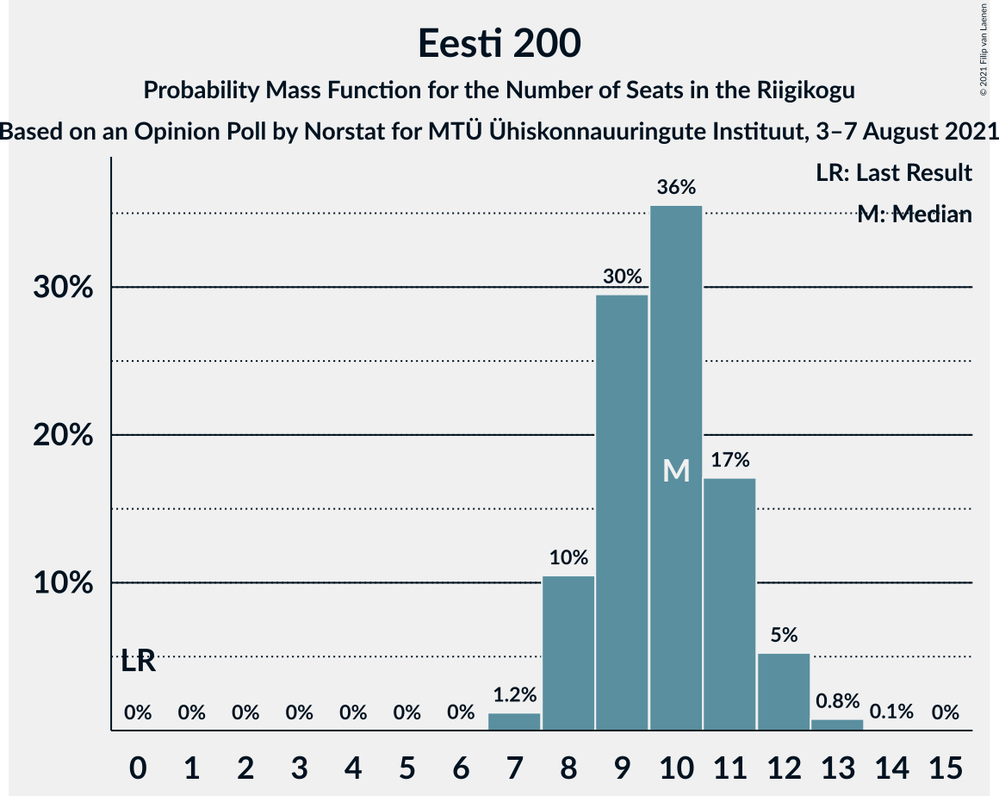
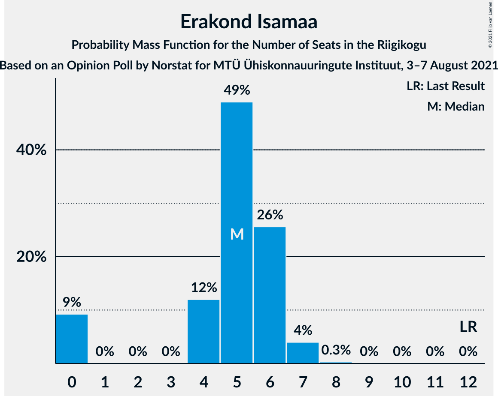
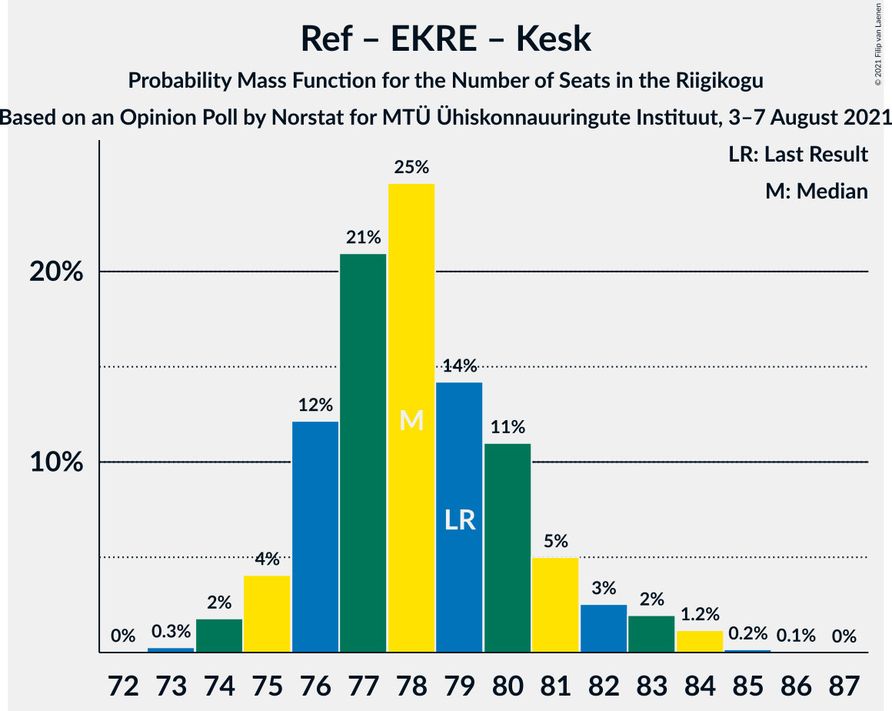

# Opinion Poll by Norstat for MTÜ Ühiskonnauuringute Instituut, 3–7 August 2021

<a href="#voting-intentions">Voting Intentions</a> | <a href="#seats">Seats</a> | <a href="#coalitions">Coalitions</a> | <a href="#technical-information">Technical Information</a>

## Voting Intentions

### Confidence Intervals

| Party | Last Result | Poll Result | 80% Confidence Interval | 90% Confidence Interval | 95% Confidence Interval | 99% Confidence Interval |
|:-----:|:-----------:|:-----------:|:-----------------------:|:-----------------------:|:-----------------------:|:-----------------------:|
| Eesti Reformierakond | 28.9% | 29.9% | 28.1–31.8% |27.6–32.3% |27.1–32.8% |26.3–33.7% |
| Eesti Konservatiivne Rahvaerakond | 17.8% | 23.5% | 21.8–25.3% |21.4–25.8% |21.0–26.2% |20.2–27.1% |
| Eesti Keskerakond | 23.1% | 18.8% | 17.3–20.5% |16.9–20.9% |16.5–21.4% |15.8–22.2% |
| Eesti 200 | 4.4% | 10.2% | 9.1–11.5% |8.7–11.9% |8.5–12.2% |8.0–12.9% |
| Sotsiaaldemokraatlik Erakond | 9.8% | 8.9% | 7.8–10.2% |7.5–10.5% |7.3–10.8% |6.8–11.5% |
| Erakond Isamaa | 11.4% | 5.9% | 5.0–7.0% |4.8–7.3% |4.6–7.5% |4.2–8.1% |
| Erakond Eestimaa Rohelised | 1.8% | 1.8% | 1.4–2.5% |1.2–2.7% |1.1–2.8% |1.0–3.2% |

*Note:* The poll result column reflects the actual value used in the calculations. Published results may vary slightly, and in addition be rounded to fewer digits.

## Seats

### Confidence Intervals

| Party | Last Result | Median | 80% Confidence Interval | 90% Confidence Interval | 95% Confidence Interval | 99% Confidence Interval |
|:-----:|:-----------:|:------:|:-----------------------:|:-----------------------:|:-----------------------:|:-----------------------:|
| <a href="#eesti-reformierakond">Eesti Reformierakond</a> | 34 | 33 | 31–36 |30–36 |30–37 |29–38 |
| <a href="#eesti-konservatiivne-rahvaerakond">Eesti Konservatiivne Rahvaerakond</a> | 19 | 25 | 23–28 |23–28 |22–29 |21–30 |
| <a href="#eesti-keskerakond">Eesti Keskerakond</a> | 26 | 19 | 18–21 |17–22 |16–23 |16–24 |
| <a href="#eesti-200">Eesti 200</a> | 0 | 10 | 8–11 |8–12 |8–12 |7–13 |
| <a href="#sotsiaaldemokraatlik-erakond">Sotsiaaldemokraatlik Erakond</a> | 10 | 8 | 7–10 |7–10 |7–10 |6–11 |
| <a href="#erakond-isamaa">Erakond Isamaa</a> | 12 | 5 | 0–6 |0–6 |0–7 |0–7 |
| <a href="#erakond-eestimaa-rohelised">Erakond Eestimaa Rohelised</a> | 0 | 0 | 0 |0 |0 |0 |

### Eesti Reformierakond

*For a full overview of the results for this party, see the [Eesti Reformierakond](party-eestireformierakond.html) page.*

| Number of Seats | Probability | Accumulated | Special Marks |
|:---------------:|:-----------:|:-----------:|:-------------:|
| 27 | 0.1% | 100% |  |
| 28 | 0.2% | 99.9% |  |
| 29 | 1.4% | 99.7% |  |
| 30 | 6% | 98% |  |
| 31 | 9% | 93% |  |
| 32 | 18% | 83% |  |
| 33 | 21% | 65% | Median |
| 34 | 16% | 44% | Last Result |
| 35 | 15% | 28% |  |
| 36 | 8% | 13% |  |
| 37 | 4% | 5% |  |
| 38 | 0.4% | 0.7% |  |
| 39 | 0.2% | 0.2% |  |
| 40 | 0% | 0% |  |

### Eesti Konservatiivne Rahvaerakond

*For a full overview of the results for this party, see the [Eesti Konservatiivne Rahvaerakond](party-eestikonservatiivnerahvaerakond.html) page.*

| Number of Seats | Probability | Accumulated | Special Marks |
|:---------------:|:-----------:|:-----------:|:-------------:|
| 19 | 0% | 100% | Last Result |
| 20 | 0.2% | 100% |  |
| 21 | 0.6% | 99.8% |  |
| 22 | 4% | 99.2% |  |
| 23 | 18% | 95% |  |
| 24 | 14% | 77% |  |
| 25 | 24% | 64% | Median |
| 26 | 15% | 39% |  |
| 27 | 14% | 24% |  |
| 28 | 7% | 10% |  |
| 29 | 3% | 4% |  |
| 30 | 0.6% | 0.8% |  |
| 31 | 0.1% | 0.2% |  |
| 32 | 0.1% | 0.1% |  |
| 33 | 0% | 0% |  |

### Eesti Keskerakond

*For a full overview of the results for this party, see the [Eesti Keskerakond](party-eestikeskerakond.html) page.*

| Number of Seats | Probability | Accumulated | Special Marks |
|:---------------:|:-----------:|:-----------:|:-------------:|
| 16 | 3% | 100% |  |
| 17 | 2% | 97% |  |
| 18 | 18% | 95% |  |
| 19 | 28% | 77% | Median |
| 20 | 10% | 49% |  |
| 21 | 31% | 39% |  |
| 22 | 5% | 9% |  |
| 23 | 2% | 3% |  |
| 24 | 0.8% | 0.9% |  |
| 25 | 0% | 0.1% |  |
| 26 | 0% | 0% | Last Result |

### Eesti 200

*For a full overview of the results for this party, see the [Eesti 200](party-eesti200.html) page.*

| Number of Seats | Probability | Accumulated | Special Marks |
|:---------------:|:-----------:|:-----------:|:-------------:|
| 0 | 0% | 100% | Last Result |
| 1 | 0% | 100% |  |
| 2 | 0% | 100% |  |
| 3 | 0% | 100% |  |
| 4 | 0% | 100% |  |
| 5 | 0% | 100% |  |
| 6 | 0% | 100% |  |
| 7 | 1.3% | 100% |  |
| 8 | 10% | 98.7% |  |
| 9 | 26% | 88% |  |
| 10 | 38% | 63% | Median |
| 11 | 17% | 25% |  |
| 12 | 6% | 7% |  |
| 13 | 0.9% | 1.0% |  |
| 14 | 0.1% | 0.1% |  |
| 15 | 0% | 0% |  |

### Sotsiaaldemokraatlik Erakond

*For a full overview of the results for this party, see the [Sotsiaaldemokraatlik Erakond](party-sotsiaaldemokraatlikerakond.html) page.*

| Number of Seats | Probability | Accumulated | Special Marks |
|:---------------:|:-----------:|:-----------:|:-------------:|
| 5 | 0.1% | 100% |  |
| 6 | 2% | 99.9% |  |
| 7 | 21% | 98% |  |
| 8 | 35% | 77% | Median |
| 9 | 31% | 43% |  |
| 10 | 10% | 12% | Last Result |
| 11 | 2% | 2% |  |
| 12 | 0.2% | 0.2% |  |
| 13 | 0% | 0% |  |

### Erakond Isamaa

*For a full overview of the results for this party, see the [Erakond Isamaa](party-erakondisamaa.html) page.*

| Number of Seats | Probability | Accumulated | Special Marks |
|:---------------:|:-----------:|:-----------:|:-------------:|
| 0 | 11% | 100% |  |
| 1 | 0% | 89% |  |
| 2 | 0% | 89% |  |
| 3 | 0% | 89% |  |
| 4 | 12% | 89% |  |
| 5 | 46% | 77% | Median |
| 6 | 26% | 31% |  |
| 7 | 4% | 5% |  |
| 8 | 0.4% | 0.4% |  |
| 9 | 0% | 0% |  |
| 10 | 0% | 0% |  |
| 11 | 0% | 0% |  |
| 12 | 0% | 0% | Last Result |

### Erakond Eestimaa Rohelised

*For a full overview of the results for this party, see the [Erakond Eestimaa Rohelised](party-erakondeestimaarohelised.html) page.*

| Number of Seats | Probability | Accumulated | Special Marks |
|:---------------:|:-----------:|:-----------:|:-------------:|
| 0 | 100% | 100% | Last Result, Median |

## Coalitions

### Confidence Intervals

| Coalition | Last Result | Median | Majority? | 80% Confidence Interval | 90% Confidence Interval | 95% Confidence Interval | 99% Confidence Interval |
|:---------:|:-----------:|:------:|:---------:|:-----------------------:|:-----------------------:|:-----------------------:|:-----------------------:|
| Eesti Reformierakond – Eesti Konservatiivne Rahvaerakond – Eesti Keskerakond | 79 | 78 | 100% | 76–81 | 75–82 | 75–82 | 74–84 |
| Eesti Reformierakond – Eesti Konservatiivne Rahvaerakond – Erakond Isamaa | 65 | 63 | 100% | 61–66 | 60–66 | 59–67 | 58–68 |
| Eesti Reformierakond – Eesti Konservatiivne Rahvaerakond | 53 | 58 | 100% | 56–61 | 55–62 | 54–63 | 54–64 |
| Eesti Reformierakond – Eesti Keskerakond | 60 | 53 | 87% | 50–56 | 50–57 | 49–57 | 48–59 |
| Eesti Konservatiivne Rahvaerakond – Eesti Keskerakond – Erakond Isamaa | 57 | 49 | 30% | 47–53 | 47–53 | 46–54 | 44–54 |
| Eesti Reformierakond – Sotsiaaldemokraatlik Erakond – Erakond Isamaa | 56 | 47 | 2% | 44–49 | 43–50 | 42–50 | 40–51 |
| Eesti Konservatiivne Rahvaerakond – Eesti Keskerakond | 45 | 44 | 0.4% | 42–48 | 42–48 | 41–49 | 40–50 |
| Eesti Reformierakond – Sotsiaaldemokraatlik Erakond | 44 | 42 | 0% | 39–44 | 38–45 | 38–45 | 37–47 |
| Eesti Reformierakond – Erakond Isamaa | 46 | 38 | 0% | 35–41 | 34–41 | 34–42 | 32–43 |
| Eesti Konservatiivne Rahvaerakond – Sotsiaaldemokraatlik Erakond | 29 | 34 | 0% | 31–36 | 31–37 | 30–37 | 29–39 |
| Eesti Keskerakond – Sotsiaaldemokraatlik Erakond – Erakond Isamaa | 48 | 33 | 0% | 30–35 | 29–36 | 28–37 | 27–38 |
| Eesti Keskerakond – Sotsiaaldemokraatlik Erakond | 36 | 28 | 0% | 26–30 | 25–31 | 25–31 | 24–33 |

### Eesti Reformierakond – Eesti Konservatiivne Rahvaerakond – Eesti Keskerakond

| Number of Seats | Probability | Accumulated | Special Marks |
|:---------------:|:-----------:|:-----------:|:-------------:|
| 73 | 0.3% | 100% |  |
| 74 | 2% | 99.7% |  |
| 75 | 5% | 98% |  |
| 76 | 13% | 93% |  |
| 77 | 25% | 80% | Median |
| 78 | 17% | 55% |  |
| 79 | 12% | 38% | Last Result |
| 80 | 15% | 26% |  |
| 81 | 5% | 12% |  |
| 82 | 5% | 7% |  |
| 83 | 1.1% | 2% |  |
| 84 | 1.0% | 1.2% |  |
| 85 | 0.2% | 0.2% |  |
| 86 | 0.1% | 0.1% |  |
| 87 | 0% | 0% |  |

### Eesti Reformierakond – Eesti Konservatiivne Rahvaerakond – Erakond Isamaa

| Number of Seats | Probability | Accumulated | Special Marks |
|:---------------:|:-----------:|:-----------:|:-------------:|
| 57 | 0.3% | 100% |  |
| 58 | 0.3% | 99.7% |  |
| 59 | 3% | 99.3% |  |
| 60 | 4% | 97% |  |
| 61 | 14% | 93% |  |
| 62 | 13% | 79% |  |
| 63 | 28% | 66% | Median |
| 64 | 14% | 39% |  |
| 65 | 11% | 24% | Last Result |
| 66 | 9% | 13% |  |
| 67 | 3% | 4% |  |
| 68 | 0.6% | 0.8% |  |
| 69 | 0.2% | 0.2% |  |
| 70 | 0% | 0% |  |

### Eesti Reformierakond – Eesti Konservatiivne Rahvaerakond

| Number of Seats | Probability | Accumulated | Special Marks |
|:---------------:|:-----------:|:-----------:|:-------------:|
| 52 | 0.1% | 100% |  |
| 53 | 0.4% | 99.9% | Last Result |
| 54 | 2% | 99.5% |  |
| 55 | 5% | 97% |  |
| 56 | 12% | 92% |  |
| 57 | 11% | 80% |  |
| 58 | 25% | 69% | Median |
| 59 | 14% | 44% |  |
| 60 | 11% | 30% |  |
| 61 | 11% | 19% |  |
| 62 | 4% | 8% |  |
| 63 | 3% | 4% |  |
| 64 | 0.4% | 0.7% |  |
| 65 | 0.2% | 0.3% |  |
| 66 | 0% | 0.1% |  |
| 67 | 0% | 0% |  |

### Eesti Reformierakond – Eesti Keskerakond

| Number of Seats | Probability | Accumulated | Special Marks |
|:---------------:|:-----------:|:-----------:|:-------------:|
| 47 | 0.2% | 100% |  |
| 48 | 1.5% | 99.7% |  |
| 49 | 2% | 98% |  |
| 50 | 8% | 96% |  |
| 51 | 11% | 87% | Majority |
| 52 | 16% | 77% | Median |
| 53 | 20% | 61% |  |
| 54 | 19% | 40% |  |
| 55 | 10% | 22% |  |
| 56 | 7% | 12% |  |
| 57 | 4% | 5% |  |
| 58 | 0.4% | 1.3% |  |
| 59 | 0.8% | 0.9% |  |
| 60 | 0.1% | 0.1% | Last Result |
| 61 | 0% | 0% |  |

### Eesti Konservatiivne Rahvaerakond – Eesti Keskerakond – Erakond Isamaa

| Number of Seats | Probability | Accumulated | Special Marks |
|:---------------:|:-----------:|:-----------:|:-------------:|
| 42 | 0.1% | 100% |  |
| 43 | 0.4% | 99.9% |  |
| 44 | 0.4% | 99.5% |  |
| 45 | 0.5% | 99.1% |  |
| 46 | 2% | 98.5% |  |
| 47 | 12% | 97% |  |
| 48 | 20% | 84% |  |
| 49 | 19% | 64% | Median |
| 50 | 16% | 45% |  |
| 51 | 9% | 30% | Majority |
| 52 | 7% | 21% |  |
| 53 | 11% | 14% |  |
| 54 | 2% | 3% |  |
| 55 | 0.4% | 0.5% |  |
| 56 | 0% | 0.1% |  |
| 57 | 0% | 0% | Last Result |

### Eesti Reformierakond – Sotsiaaldemokraatlik Erakond – Erakond Isamaa

| Number of Seats | Probability | Accumulated | Special Marks |
|:---------------:|:-----------:|:-----------:|:-------------:|
| 39 | 0% | 100% |  |
| 40 | 0.4% | 99.9% |  |
| 41 | 0.9% | 99.5% |  |
| 42 | 2% | 98.6% |  |
| 43 | 5% | 96% |  |
| 44 | 11% | 91% |  |
| 45 | 17% | 80% |  |
| 46 | 11% | 64% | Median |
| 47 | 25% | 53% |  |
| 48 | 15% | 28% |  |
| 49 | 5% | 13% |  |
| 50 | 6% | 8% |  |
| 51 | 2% | 2% | Majority |
| 52 | 0.4% | 0.4% |  |
| 53 | 0.1% | 0.1% |  |
| 54 | 0% | 0% |  |
| 55 | 0% | 0% |  |
| 56 | 0% | 0% | Last Result |

### Eesti Konservatiivne Rahvaerakond – Eesti Keskerakond

| Number of Seats | Probability | Accumulated | Special Marks |
|:---------------:|:-----------:|:-----------:|:-------------:|
| 39 | 0.3% | 100% |  |
| 40 | 0.6% | 99.7% |  |
| 41 | 3% | 99.2% |  |
| 42 | 7% | 97% |  |
| 43 | 17% | 89% |  |
| 44 | 25% | 72% | Median |
| 45 | 12% | 47% | Last Result |
| 46 | 8% | 35% |  |
| 47 | 15% | 27% |  |
| 48 | 8% | 12% |  |
| 49 | 2% | 4% |  |
| 50 | 1.0% | 1.4% |  |
| 51 | 0.3% | 0.4% | Majority |
| 52 | 0.1% | 0.1% |  |
| 53 | 0% | 0% |  |

### Eesti Reformierakond – Sotsiaaldemokraatlik Erakond

| Number of Seats | Probability | Accumulated | Special Marks |
|:---------------:|:-----------:|:-----------:|:-------------:|
| 36 | 0.3% | 100% |  |
| 37 | 1.5% | 99.6% |  |
| 38 | 4% | 98% |  |
| 39 | 9% | 94% |  |
| 40 | 15% | 85% |  |
| 41 | 19% | 70% | Median |
| 42 | 18% | 51% |  |
| 43 | 12% | 33% |  |
| 44 | 13% | 21% | Last Result |
| 45 | 6% | 8% |  |
| 46 | 2% | 2% |  |
| 47 | 0.4% | 0.5% |  |
| 48 | 0.1% | 0.1% |  |
| 49 | 0% | 0% |  |

### Eesti Reformierakond – Erakond Isamaa

| Number of Seats | Probability | Accumulated | Special Marks |
|:---------------:|:-----------:|:-----------:|:-------------:|
| 30 | 0% | 100% |  |
| 31 | 0.2% | 99.9% |  |
| 32 | 0.6% | 99.8% |  |
| 33 | 1.1% | 99.1% |  |
| 34 | 5% | 98% |  |
| 35 | 7% | 93% |  |
| 36 | 9% | 86% |  |
| 37 | 17% | 78% |  |
| 38 | 19% | 61% | Median |
| 39 | 18% | 42% |  |
| 40 | 12% | 25% |  |
| 41 | 9% | 13% |  |
| 42 | 4% | 4% |  |
| 43 | 0.5% | 0.7% |  |
| 44 | 0.2% | 0.2% |  |
| 45 | 0% | 0% |  |
| 46 | 0% | 0% | Last Result |

### Eesti Konservatiivne Rahvaerakond – Sotsiaaldemokraatlik Erakond

| Number of Seats | Probability | Accumulated | Special Marks |
|:---------------:|:-----------:|:-----------:|:-------------:|
| 28 | 0.2% | 100% |  |
| 29 | 1.0% | 99.8% | Last Result |
| 30 | 3% | 98.8% |  |
| 31 | 12% | 95% |  |
| 32 | 20% | 84% |  |
| 33 | 14% | 64% | Median |
| 34 | 23% | 50% |  |
| 35 | 13% | 28% |  |
| 36 | 6% | 15% |  |
| 37 | 6% | 8% |  |
| 38 | 2% | 2% |  |
| 39 | 0.4% | 0.6% |  |
| 40 | 0.2% | 0.2% |  |
| 41 | 0% | 0% |  |

### Eesti Keskerakond – Sotsiaaldemokraatlik Erakond – Erakond Isamaa

| Number of Seats | Probability | Accumulated | Special Marks |
|:---------------:|:-----------:|:-----------:|:-------------:|
| 25 | 0% | 100% |  |
| 26 | 0.2% | 99.9% |  |
| 27 | 1.4% | 99.7% |  |
| 28 | 2% | 98% |  |
| 29 | 4% | 96% |  |
| 30 | 6% | 92% |  |
| 31 | 16% | 87% |  |
| 32 | 12% | 70% | Median |
| 33 | 20% | 58% |  |
| 34 | 17% | 39% |  |
| 35 | 14% | 22% |  |
| 36 | 6% | 8% |  |
| 37 | 2% | 3% |  |
| 38 | 0.5% | 0.6% |  |
| 39 | 0.1% | 0.1% |  |
| 40 | 0% | 0% |  |
| 41 | 0% | 0% |  |
| 42 | 0% | 0% |  |
| 43 | 0% | 0% |  |
| 44 | 0% | 0% |  |
| 45 | 0% | 0% |  |
| 46 | 0% | 0% |  |
| 47 | 0% | 0% |  |
| 48 | 0% | 0% | Last Result |

### Eesti Keskerakond – Sotsiaaldemokraatlik Erakond

| Number of Seats | Probability | Accumulated | Special Marks |
|:---------------:|:-----------:|:-----------:|:-------------:|
| 23 | 0.2% | 100% |  |
| 24 | 2% | 99.7% |  |
| 25 | 7% | 98% |  |
| 26 | 11% | 91% |  |
| 27 | 17% | 80% | Median |
| 28 | 24% | 63% |  |
| 29 | 18% | 40% |  |
| 30 | 14% | 21% |  |
| 31 | 5% | 8% |  |
| 32 | 2% | 2% |  |
| 33 | 0.5% | 0.6% |  |
| 34 | 0.1% | 0.1% |  |
| 35 | 0% | 0% |  |
| 36 | 0% | 0% | Last Result |

## Technical Information

### Opinion Poll

+ **Polling firm:** Norstat
+ **Commissioner(s):** MTÜ Ühiskonnauuringute Instituut
+ **Fieldwork period:** 3–7 August 2021

### Calculations

+ **Sample size:** 1000
+ **Simulations done:** 131,072
+ **Error estimate:** 1.37%

