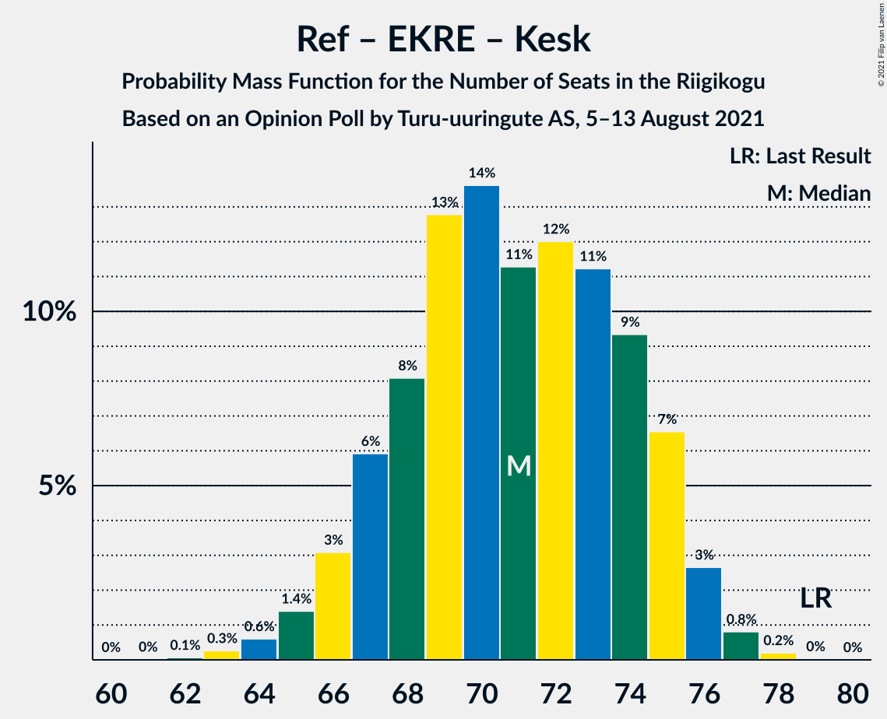
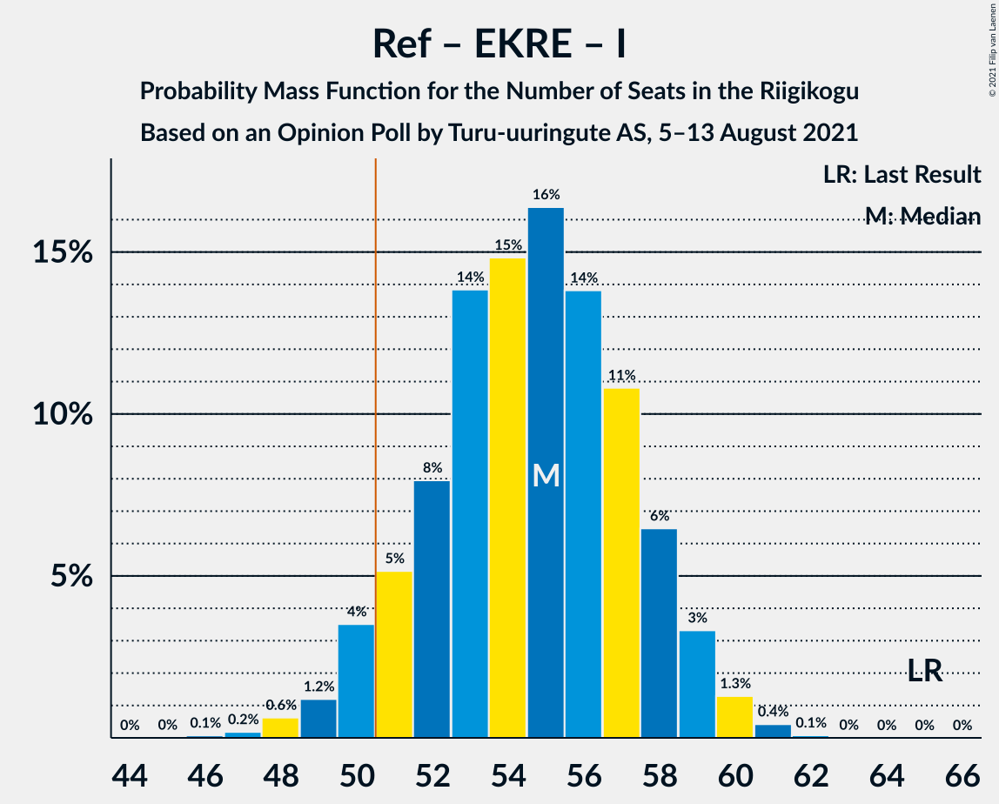
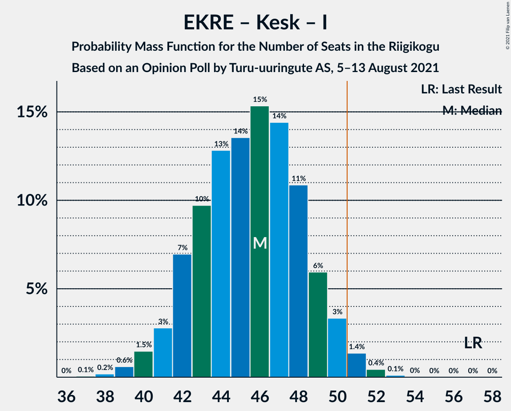

# Opinion Poll by Turu-uuringute AS, 5–13 August 2021

<a href="#voting-intentions">Voting Intentions</a> | <a href="#seats">Seats</a> | <a href="#coalitions">Coalitions</a> | <a href="#technical-information">Technical Information</a>

## Voting Intentions

### Confidence Intervals

| Party | Last Result | Poll Result | 80% Confidence Interval | 90% Confidence Interval | 95% Confidence Interval | 99% Confidence Interval |
|:-----:|:-----------:|:-----------:|:-----------------------:|:-----------------------:|:-----------------------:|:-----------------------:|
| Eesti Reformierakond | 28.9% | 24.0% | 22.3–25.8% |21.9–26.3% |21.4–26.7% |20.7–27.6% |
| Eesti Konservatiivne Rahvaerakond | 17.8% | 21.0% | 19.4–22.7% |19.0–23.2% |18.6–23.6% |17.8–24.5% |
| Eesti Keskerakond | 23.1% | 17.0% | 15.5–18.6% |15.2–19.1% |14.8–19.5% |14.1–20.3% |
| Eesti 200 | 4.4% | 16.0% | 14.6–17.6% |14.2–18.0% |13.9–18.4% |13.2–19.2% |
| Sotsiaaldemokraatlik Erakond | 9.8% | 9.0% | 7.9–10.3% |7.6–10.6% |7.4–10.9% |6.9–11.6% |
| Erakond Isamaa | 11.4% | 5.0% | 4.2–6.0% |4.0–6.3% |3.8–6.5% |3.5–7.1% |
| Erakond Eestimaa Rohelised | 1.8% | 4.0% | 3.3–4.9% |3.1–5.2% |2.9–5.4% |2.7–5.9% |

*Note:* The poll result column reflects the actual value used in the calculations. Published results may vary slightly, and in addition be rounded to fewer digits.

## Seats

### Confidence Intervals

| Party | Last Result | Median | 80% Confidence Interval | 90% Confidence Interval | 95% Confidence Interval | 99% Confidence Interval |
|:-----:|:-----------:|:------:|:-----------------------:|:-----------------------:|:-----------------------:|:-----------------------:|
| <a href="#eesti-reformierakond">Eesti Reformierakond</a> | 34 | 28 | 26–30 |25–31 |25–32 |23–33 |
| <a href="#eesti-konservatiivne-rahvaerakond">Eesti Konservatiivne Rahvaerakond</a> | 19 | 24 | 21–26 |21–26 |21–27 |19–28 |
| <a href="#eesti-keskerakond">Eesti Keskerakond</a> | 26 | 18 | 17–21 |17–22 |16–23 |15–23 |
| <a href="#eesti-200">Eesti 200</a> | 0 | 18 | 15–20 |15–20 |15–21 |14–21 |
| <a href="#sotsiaaldemokraatlik-erakond">Sotsiaaldemokraatlik Erakond</a> | 10 | 9 | 8–10 |7–11 |7–11 |6–12 |
| <a href="#erakond-isamaa">Erakond Isamaa</a> | 12 | 4 | 0–5 |0–6 |0–6 |0–7 |
| <a href="#erakond-eestimaa-rohelised">Erakond Eestimaa Rohelised</a> | 0 | 0 | 0 |0 |0–5 |0–5 |

### Eesti Reformierakond

*For a full overview of the results for this party, see the [Eesti Reformierakond](party-eestireformierakond.html) page.*

| Number of Seats | Probability | Accumulated | Special Marks |
|:---------------:|:-----------:|:-----------:|:-------------:|
| 22 | 0.1% | 100% |  |
| 23 | 0.8% | 99.8% |  |
| 24 | 0.8% | 99.0% |  |
| 25 | 4% | 98% |  |
| 26 | 18% | 95% |  |
| 27 | 23% | 76% |  |
| 28 | 15% | 54% | Median |
| 29 | 21% | 39% |  |
| 30 | 11% | 18% |  |
| 31 | 3% | 7% |  |
| 32 | 3% | 4% |  |
| 33 | 0.4% | 0.6% |  |
| 34 | 0.1% | 0.1% | Last Result |
| 35 | 0% | 0% |  |

### Eesti Konservatiivne Rahvaerakond

*For a full overview of the results for this party, see the [Eesti Konservatiivne Rahvaerakond](party-eestikonservatiivnerahvaerakond.html) page.*

| Number of Seats | Probability | Accumulated | Special Marks |
|:---------------:|:-----------:|:-----------:|:-------------:|
| 18 | 0.1% | 100% |  |
| 19 | 1.3% | 99.9% | Last Result |
| 20 | 0.4% | 98.6% |  |
| 21 | 11% | 98% |  |
| 22 | 5% | 87% |  |
| 23 | 24% | 82% |  |
| 24 | 10% | 58% | Median |
| 25 | 34% | 48% |  |
| 26 | 11% | 14% |  |
| 27 | 2% | 3% |  |
| 28 | 0.5% | 1.0% |  |
| 29 | 0.3% | 0.5% |  |
| 30 | 0.1% | 0.2% |  |
| 31 | 0% | 0% |  |

### Eesti Keskerakond

*For a full overview of the results for this party, see the [Eesti Keskerakond](party-eestikeskerakond.html) page.*

| Number of Seats | Probability | Accumulated | Special Marks |
|:---------------:|:-----------:|:-----------:|:-------------:|
| 14 | 0.1% | 100% |  |
| 15 | 0.9% | 99.9% |  |
| 16 | 3% | 99.0% |  |
| 17 | 22% | 96% |  |
| 18 | 24% | 74% | Median |
| 19 | 16% | 50% |  |
| 20 | 19% | 34% |  |
| 21 | 9% | 15% |  |
| 22 | 3% | 6% |  |
| 23 | 2% | 3% |  |
| 24 | 0.2% | 0.2% |  |
| 25 | 0.1% | 0.1% |  |
| 26 | 0% | 0% | Last Result |

### Eesti 200

*For a full overview of the results for this party, see the [Eesti 200](party-eesti200.html) page.*

| Number of Seats | Probability | Accumulated | Special Marks |
|:---------------:|:-----------:|:-----------:|:-------------:|
| 0 | 0% | 100% | Last Result |
| 1 | 0% | 100% |  |
| 2 | 0% | 100% |  |
| 3 | 0% | 100% |  |
| 4 | 0% | 100% |  |
| 5 | 0% | 100% |  |
| 6 | 0% | 100% |  |
| 7 | 0% | 100% |  |
| 8 | 0% | 100% |  |
| 9 | 0% | 100% |  |
| 10 | 0% | 100% |  |
| 11 | 0% | 100% |  |
| 12 | 0% | 100% |  |
| 13 | 0.1% | 100% |  |
| 14 | 2% | 99.9% |  |
| 15 | 13% | 98% |  |
| 16 | 12% | 86% |  |
| 17 | 19% | 74% |  |
| 18 | 25% | 55% | Median |
| 19 | 19% | 30% |  |
| 20 | 7% | 11% |  |
| 21 | 4% | 4% |  |
| 22 | 0.2% | 0.2% |  |
| 23 | 0% | 0% |  |

### Sotsiaaldemokraatlik Erakond

*For a full overview of the results for this party, see the [Sotsiaaldemokraatlik Erakond](party-sotsiaaldemokraatlikerakond.html) page.*

| Number of Seats | Probability | Accumulated | Special Marks |
|:---------------:|:-----------:|:-----------:|:-------------:|
| 6 | 0.5% | 100% |  |
| 7 | 5% | 99.5% |  |
| 8 | 20% | 95% |  |
| 9 | 31% | 75% | Median |
| 10 | 36% | 44% | Last Result |
| 11 | 7% | 8% |  |
| 12 | 0.9% | 1.1% |  |
| 13 | 0.3% | 0.3% |  |
| 14 | 0% | 0% |  |

### Erakond Isamaa

*For a full overview of the results for this party, see the [Erakond Isamaa](party-erakondisamaa.html) page.*

| Number of Seats | Probability | Accumulated | Special Marks |
|:---------------:|:-----------:|:-----------:|:-------------:|
| 0 | 40% | 100% |  |
| 1 | 0% | 60% |  |
| 2 | 0% | 60% |  |
| 3 | 0% | 60% |  |
| 4 | 13% | 60% | Median |
| 5 | 41% | 48% |  |
| 6 | 6% | 7% |  |
| 7 | 1.0% | 1.0% |  |
| 8 | 0% | 0% |  |
| 9 | 0% | 0% |  |
| 10 | 0% | 0% |  |
| 11 | 0% | 0% |  |
| 12 | 0% | 0% | Last Result |

### Erakond Eestimaa Rohelised

*For a full overview of the results for this party, see the [Erakond Eestimaa Rohelised](party-erakondeestimaarohelised.html) page.*

| Number of Seats | Probability | Accumulated | Special Marks |
|:---------------:|:-----------:|:-----------:|:-------------:|
| 0 | 96% | 100% | Last Result, Median |
| 1 | 0% | 4% |  |
| 2 | 0% | 4% |  |
| 3 | 0% | 4% |  |
| 4 | 0.1% | 4% |  |
| 5 | 3% | 3% |  |
| 6 | 0.2% | 0.2% |  |
| 7 | 0% | 0% |  |

## Coalitions

### Confidence Intervals

| Coalition | Last Result | Median | Majority? | 80% Confidence Interval | 90% Confidence Interval | 95% Confidence Interval | 99% Confidence Interval |
|:---------:|:-----------:|:------:|:---------:|:-----------------------:|:-----------------------:|:-----------------------:|:-----------------------:|
| Eesti Reformierakond – Eesti Konservatiivne Rahvaerakond – Eesti Keskerakond | 79 | 70 | 100% | 68–74 | 66–75 | 66–76 | 64–77 |
| Eesti Reformierakond – Eesti Konservatiivne Rahvaerakond – Erakond Isamaa | 65 | 55 | 95% | 51–58 | 51–59 | 50–59 | 49–61 |
| Eesti Reformierakond – Eesti Konservatiivne Rahvaerakond | 53 | 52 | 75% | 49–55 | 48–56 | 47–57 | 46–57 |
| Eesti Reformierakond – Eesti Keskerakond | 60 | 46 | 8% | 44–50 | 44–51 | 43–51 | 41–53 |
| Eesti Konservatiivne Rahvaerakond – Eesti Keskerakond – Erakond Isamaa | 57 | 45 | 2% | 43–49 | 42–49 | 41–50 | 39–52 |
| Eesti Konservatiivne Rahvaerakond – Eesti Keskerakond | 45 | 43 | 0% | 40–46 | 39–46 | 39–46 | 37–49 |
| Eesti Reformierakond – Sotsiaaldemokraatlik Erakond – Erakond Isamaa | 56 | 41 | 0% | 36–43 | 35–43 | 35–44 | 34–46 |
| Eesti Reformierakond – Sotsiaaldemokraatlik Erakond | 44 | 37 | 0% | 35–39 | 34–41 | 34–42 | 32–42 |
| Eesti Konservatiivne Rahvaerakond – Sotsiaaldemokraatlik Erakond | 29 | 33 | 0% | 30–35 | 30–36 | 29–37 | 27–38 |
| Eesti Reformierakond – Erakond Isamaa | 46 | 31 | 0% | 26–34 | 26–34 | 26–36 | 24–37 |
| Eesti Keskerakond – Sotsiaaldemokraatlik Erakond – Erakond Isamaa | 48 | 31 | 0% | 28–34 | 27–34 | 26–35 | 25–36 |
| Eesti Keskerakond – Sotsiaaldemokraatlik Erakond | 36 | 28 | 0% | 26–31 | 25–31 | 25–31 | 23–33 |

### Eesti Reformierakond – Eesti Konservatiivne Rahvaerakond – Eesti Keskerakond

| Number of Seats | Probability | Accumulated | Special Marks |
|:---------------:|:-----------:|:-----------:|:-------------:|
| 63 | 0.3% | 100% |  |
| 64 | 0.7% | 99.7% |  |
| 65 | 1.0% | 99.0% |  |
| 66 | 5% | 98% |  |
| 67 | 2% | 93% |  |
| 68 | 3% | 91% |  |
| 69 | 29% | 88% |  |
| 70 | 15% | 59% | Median |
| 71 | 10% | 45% |  |
| 72 | 16% | 35% |  |
| 73 | 1.5% | 19% |  |
| 74 | 7% | 17% |  |
| 75 | 7% | 10% |  |
| 76 | 2% | 3% |  |
| 77 | 0.6% | 0.7% |  |
| 78 | 0.1% | 0.1% |  |
| 79 | 0% | 0% | Last Result |

### Eesti Reformierakond – Eesti Konservatiivne Rahvaerakond – Erakond Isamaa

| Number of Seats | Probability | Accumulated | Special Marks |
|:---------------:|:-----------:|:-----------:|:-------------:|
| 46 | 0.1% | 100% |  |
| 47 | 0.1% | 99.9% |  |
| 48 | 0.2% | 99.8% |  |
| 49 | 2% | 99.5% |  |
| 50 | 2% | 98% |  |
| 51 | 13% | 95% | Majority |
| 52 | 6% | 82% |  |
| 53 | 7% | 76% |  |
| 54 | 9% | 69% |  |
| 55 | 15% | 61% |  |
| 56 | 13% | 46% | Median |
| 57 | 23% | 33% |  |
| 58 | 4% | 10% |  |
| 59 | 5% | 6% |  |
| 60 | 0.6% | 1.2% |  |
| 61 | 0.5% | 0.5% |  |
| 62 | 0% | 0% |  |
| 63 | 0% | 0% |  |
| 64 | 0% | 0% |  |
| 65 | 0% | 0% | Last Result |

### Eesti Reformierakond – Eesti Konservatiivne Rahvaerakond

| Number of Seats | Probability | Accumulated | Special Marks |
|:---------------:|:-----------:|:-----------:|:-------------:|
| 44 | 0% | 100% |  |
| 45 | 0.3% | 99.9% |  |
| 46 | 0.7% | 99.7% |  |
| 47 | 2% | 99.0% |  |
| 48 | 4% | 97% |  |
| 49 | 4% | 93% |  |
| 50 | 14% | 89% |  |
| 51 | 15% | 75% | Majority |
| 52 | 35% | 60% | Median |
| 53 | 5% | 26% | Last Result |
| 54 | 8% | 21% |  |
| 55 | 8% | 13% |  |
| 56 | 2% | 5% |  |
| 57 | 2% | 3% |  |
| 58 | 0.1% | 0.2% |  |
| 59 | 0.1% | 0.1% |  |
| 60 | 0% | 0% |  |

### Eesti Reformierakond – Eesti Keskerakond

| Number of Seats | Probability | Accumulated | Special Marks |
|:---------------:|:-----------:|:-----------:|:-------------:|
| 39 | 0.1% | 100% |  |
| 40 | 0.1% | 99.9% |  |
| 41 | 0.5% | 99.8% |  |
| 42 | 1.2% | 99.3% |  |
| 43 | 2% | 98% |  |
| 44 | 10% | 96% |  |
| 45 | 23% | 86% |  |
| 46 | 14% | 63% | Median |
| 47 | 17% | 50% |  |
| 48 | 17% | 33% |  |
| 49 | 0.8% | 16% |  |
| 50 | 8% | 15% |  |
| 51 | 6% | 8% | Majority |
| 52 | 0.7% | 1.3% |  |
| 53 | 0.3% | 0.6% |  |
| 54 | 0.3% | 0.4% |  |
| 55 | 0% | 0% |  |
| 56 | 0% | 0% |  |
| 57 | 0% | 0% |  |
| 58 | 0% | 0% |  |
| 59 | 0% | 0% |  |
| 60 | 0% | 0% | Last Result |

### Eesti Konservatiivne Rahvaerakond – Eesti Keskerakond – Erakond Isamaa

| Number of Seats | Probability | Accumulated | Special Marks |
|:---------------:|:-----------:|:-----------:|:-------------:|
| 38 | 0.1% | 100% |  |
| 39 | 0.8% | 99.8% |  |
| 40 | 0.2% | 99.0% |  |
| 41 | 2% | 98.8% |  |
| 42 | 3% | 97% |  |
| 43 | 9% | 94% |  |
| 44 | 9% | 85% |  |
| 45 | 29% | 75% |  |
| 46 | 12% | 46% | Median |
| 47 | 15% | 34% |  |
| 48 | 6% | 18% |  |
| 49 | 9% | 12% |  |
| 50 | 0.7% | 3% |  |
| 51 | 2% | 2% | Majority |
| 52 | 0.2% | 0.5% |  |
| 53 | 0.3% | 0.3% |  |
| 54 | 0% | 0% |  |
| 55 | 0% | 0% |  |
| 56 | 0% | 0% |  |
| 57 | 0% | 0% | Last Result |

### Eesti Konservatiivne Rahvaerakond – Eesti Keskerakond

| Number of Seats | Probability | Accumulated | Special Marks |
|:---------------:|:-----------:|:-----------:|:-------------:|
| 36 | 0% | 100% |  |
| 37 | 1.0% | 99.9% |  |
| 38 | 1.1% | 98.9% |  |
| 39 | 7% | 98% |  |
| 40 | 20% | 91% |  |
| 41 | 4% | 71% |  |
| 42 | 6% | 67% | Median |
| 43 | 24% | 61% |  |
| 44 | 11% | 37% |  |
| 45 | 11% | 25% | Last Result |
| 46 | 12% | 14% |  |
| 47 | 0.3% | 2% |  |
| 48 | 0.6% | 2% |  |
| 49 | 0.6% | 1.0% |  |
| 50 | 0.4% | 0.5% |  |
| 51 | 0% | 0% | Majority |

### Eesti Reformierakond – Sotsiaaldemokraatlik Erakond – Erakond Isamaa

| Number of Seats | Probability | Accumulated | Special Marks |
|:---------------:|:-----------:|:-----------:|:-------------:|
| 32 | 0.1% | 100% |  |
| 33 | 0.2% | 99.9% |  |
| 34 | 2% | 99.7% |  |
| 35 | 3% | 98% |  |
| 36 | 16% | 94% |  |
| 37 | 2% | 78% |  |
| 38 | 8% | 76% |  |
| 39 | 3% | 68% |  |
| 40 | 6% | 64% |  |
| 41 | 18% | 58% | Median |
| 42 | 15% | 40% |  |
| 43 | 22% | 25% |  |
| 44 | 1.1% | 3% |  |
| 45 | 0.3% | 2% |  |
| 46 | 2% | 2% |  |
| 47 | 0.3% | 0.4% |  |
| 48 | 0% | 0% |  |
| 49 | 0% | 0% |  |
| 50 | 0% | 0% |  |
| 51 | 0% | 0% | Majority |
| 52 | 0% | 0% |  |
| 53 | 0% | 0% |  |
| 54 | 0% | 0% |  |
| 55 | 0% | 0% |  |
| 56 | 0% | 0% | Last Result |

### Eesti Reformierakond – Sotsiaaldemokraatlik Erakond

| Number of Seats | Probability | Accumulated | Special Marks |
|:---------------:|:-----------:|:-----------:|:-------------:|
| 30 | 0.1% | 100% |  |
| 31 | 0.1% | 99.9% |  |
| 32 | 0.9% | 99.8% |  |
| 33 | 0.7% | 98.9% |  |
| 34 | 5% | 98% |  |
| 35 | 8% | 93% |  |
| 36 | 18% | 86% |  |
| 37 | 27% | 67% | Median |
| 38 | 29% | 40% |  |
| 39 | 3% | 11% |  |
| 40 | 3% | 8% |  |
| 41 | 2% | 5% |  |
| 42 | 3% | 3% |  |
| 43 | 0.3% | 0.4% |  |
| 44 | 0.1% | 0.1% | Last Result |
| 45 | 0% | 0% |  |

### Eesti Konservatiivne Rahvaerakond – Sotsiaaldemokraatlik Erakond

| Number of Seats | Probability | Accumulated | Special Marks |
|:---------------:|:-----------:|:-----------:|:-------------:|
| 26 | 0% | 100% |  |
| 27 | 0.5% | 99.9% |  |
| 28 | 1.0% | 99.5% |  |
| 29 | 3% | 98% | Last Result |
| 30 | 6% | 95% |  |
| 31 | 6% | 89% |  |
| 32 | 22% | 83% |  |
| 33 | 22% | 62% | Median |
| 34 | 5% | 39% |  |
| 35 | 26% | 34% |  |
| 36 | 5% | 9% |  |
| 37 | 2% | 3% |  |
| 38 | 0.8% | 1.1% |  |
| 39 | 0.1% | 0.3% |  |
| 40 | 0.2% | 0.2% |  |
| 41 | 0% | 0% |  |

### Eesti Reformierakond – Erakond Isamaa

| Number of Seats | Probability | Accumulated | Special Marks |
|:---------------:|:-----------:|:-----------:|:-------------:|
| 23 | 0.1% | 100% |  |
| 24 | 0.5% | 99.9% |  |
| 25 | 1.0% | 99.4% |  |
| 26 | 16% | 98% |  |
| 27 | 2% | 82% |  |
| 28 | 4% | 81% |  |
| 29 | 3% | 76% |  |
| 30 | 9% | 73% |  |
| 31 | 16% | 64% |  |
| 32 | 13% | 48% | Median |
| 33 | 13% | 34% |  |
| 34 | 18% | 21% |  |
| 35 | 1.3% | 4% |  |
| 36 | 2% | 3% |  |
| 37 | 0.4% | 0.7% |  |
| 38 | 0.2% | 0.2% |  |
| 39 | 0% | 0% |  |
| 40 | 0% | 0% |  |
| 41 | 0% | 0% |  |
| 42 | 0% | 0% |  |
| 43 | 0% | 0% |  |
| 44 | 0% | 0% |  |
| 45 | 0% | 0% |  |
| 46 | 0% | 0% | Last Result |

### Eesti Keskerakond – Sotsiaaldemokraatlik Erakond – Erakond Isamaa

| Number of Seats | Probability | Accumulated | Special Marks |
|:---------------:|:-----------:|:-----------:|:-------------:|
| 23 | 0.1% | 100% |  |
| 24 | 0.1% | 99.9% |  |
| 25 | 2% | 99.8% |  |
| 26 | 1.0% | 98% |  |
| 27 | 4% | 97% |  |
| 28 | 12% | 93% |  |
| 29 | 8% | 80% |  |
| 30 | 5% | 73% |  |
| 31 | 30% | 68% | Median |
| 32 | 10% | 38% |  |
| 33 | 12% | 28% |  |
| 34 | 12% | 16% |  |
| 35 | 3% | 4% |  |
| 36 | 0.8% | 1.2% |  |
| 37 | 0.3% | 0.3% |  |
| 38 | 0.1% | 0.1% |  |
| 39 | 0% | 0% |  |
| 40 | 0% | 0% |  |
| 41 | 0% | 0% |  |
| 42 | 0% | 0% |  |
| 43 | 0% | 0% |  |
| 44 | 0% | 0% |  |
| 45 | 0% | 0% |  |
| 46 | 0% | 0% |  |
| 47 | 0% | 0% |  |
| 48 | 0% | 0% | Last Result |

### Eesti Keskerakond – Sotsiaaldemokraatlik Erakond

| Number of Seats | Probability | Accumulated | Special Marks |
|:---------------:|:-----------:|:-----------:|:-------------:|
| 22 | 0% | 100% |  |
| 23 | 0.7% | 99.9% |  |
| 24 | 0.8% | 99.3% |  |
| 25 | 7% | 98% |  |
| 26 | 18% | 92% |  |
| 27 | 9% | 74% | Median |
| 28 | 29% | 64% |  |
| 29 | 16% | 36% |  |
| 30 | 6% | 19% |  |
| 31 | 10% | 13% |  |
| 32 | 0.5% | 2% |  |
| 33 | 2% | 2% |  |
| 34 | 0.1% | 0.2% |  |
| 35 | 0.1% | 0.1% |  |
| 36 | 0% | 0% | Last Result |

## Technical Information

### Opinion Poll

+ **Polling firm:** Turu-uuringute AS
+ **Commissioner(s):** —
+ **Fieldwork period:** 5–13 August 2021

### Calculations

+ **Sample size:** 1000
+ **Simulations done:** 32,768
+ **Error estimate:** 2.01%

