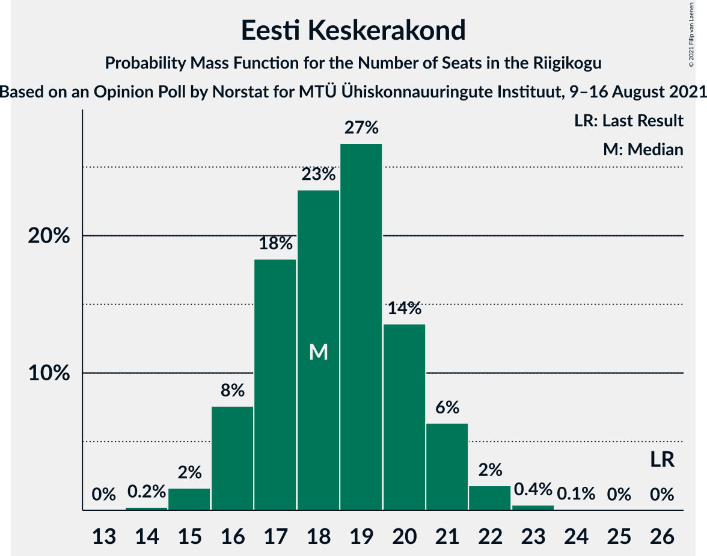
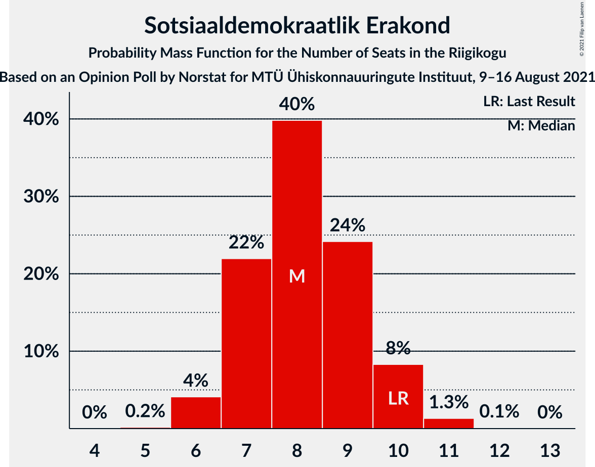
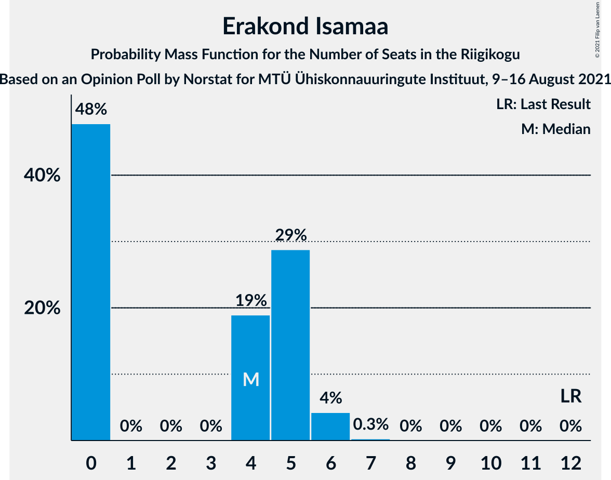
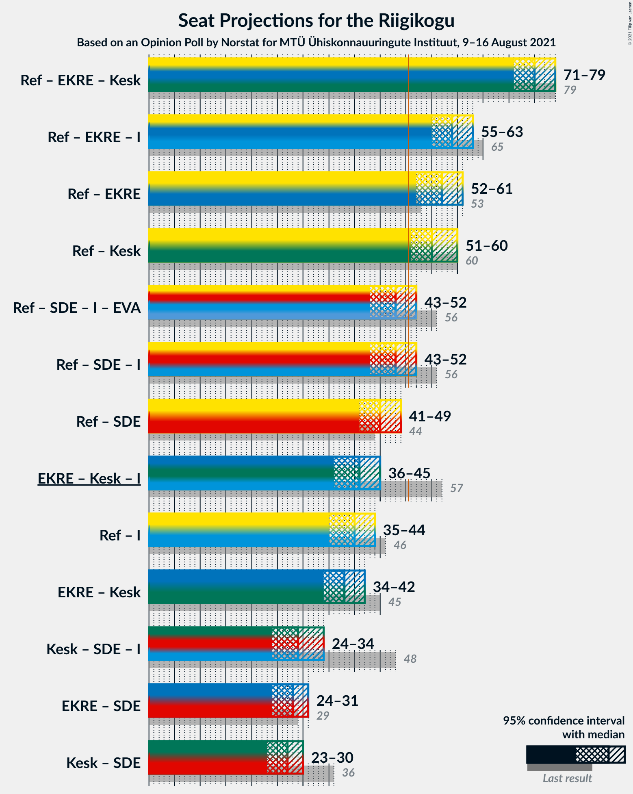
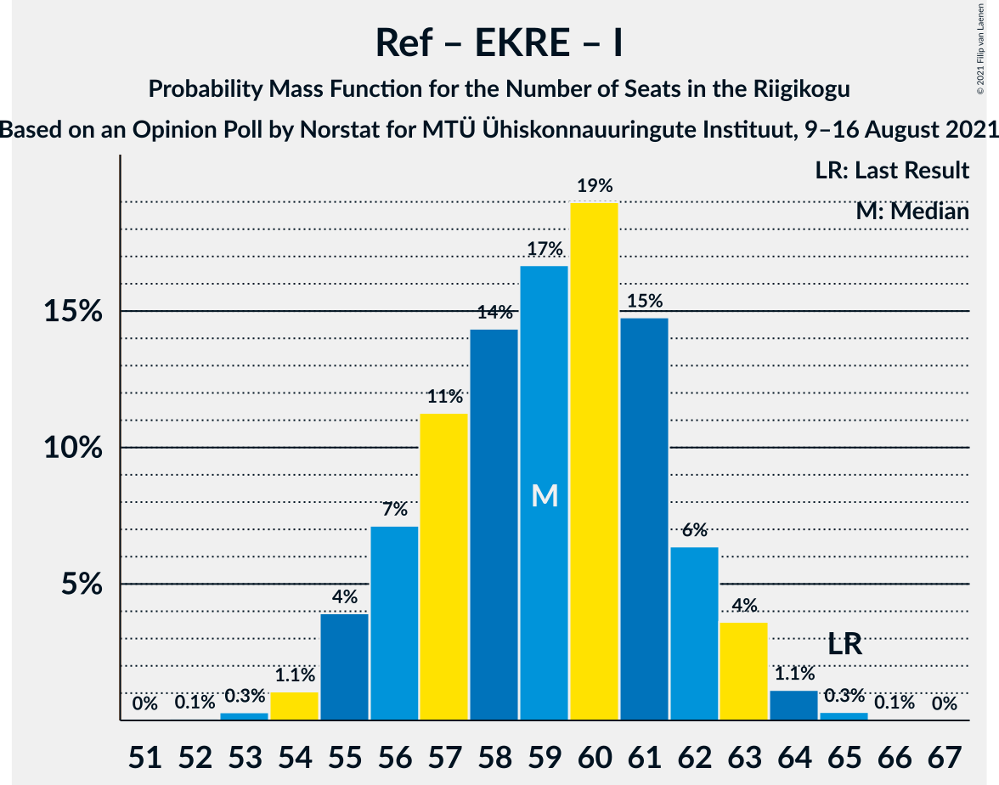
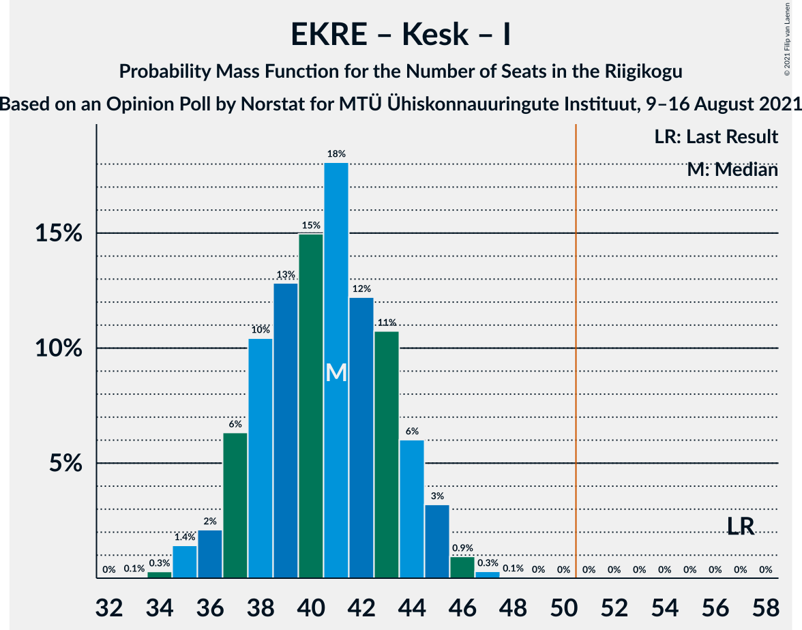

# Opinion Poll by Norstat for MTÜ Ühiskonnauuringute Instituut, 9–16 August 2021

<a href="#voting-intentions">Voting Intentions</a> | <a href="#seats">Seats</a> | <a href="#coalitions">Coalitions</a> | <a href="#technical-information">Technical Information</a>

## Voting Intentions

### Confidence Intervals

| Party | Last Result | Poll Result | 80% Confidence Interval | 90% Confidence Interval | 95% Confidence Interval | 99% Confidence Interval |
|:-----:|:-----------:|:-----------:|:-----------------------:|:-----------------------:|:-----------------------:|:-----------------------:|
| Eesti Reformierakond | 28.9% | 32.1% | 30.3–34.0% |29.7–34.6% |29.3–35.1% |28.4–36.0% |
| Eesti Konservatiivne Rahvaerakond | 17.8% | 18.3% | 16.8–20.0% |16.4–20.4% |16.0–20.8% |15.3–21.6% |
| Eesti Keskerakond | 23.1% | 17.3% | 15.8–18.9% |15.4–19.4% |15.1–19.8% |14.4–20.6% |
| Eesti 200 | 4.4% | 14.7% | 13.3–16.2% |13.0–16.7% |12.6–17.0% |12.0–17.8% |
| Sotsiaaldemokraatlik Erakond | 9.8% | 8.5% | 7.5–9.7% |7.2–10.1% |6.9–10.4% |6.5–11.0% |
| Erakond Isamaa | 11.4% | 5.0% | 4.2–6.0% |4.0–6.3% |3.8–6.5% |3.5–7.1% |
| Erakond Eestimaa Rohelised | 1.8% | 2.7% | 2.1–3.5% |2.0–3.7% |1.9–3.9% |1.6–4.3% |

*Note:* The poll result column reflects the actual value used in the calculations. Published results may vary slightly, and in addition be rounded to fewer digits.

## Seats

### Confidence Intervals

| Party | Last Result | Median | 80% Confidence Interval | 90% Confidence Interval | 95% Confidence Interval | 99% Confidence Interval |
|:-----:|:-----------:|:------:|:-----------------------:|:-----------------------:|:-----------------------:|:-----------------------:|
| <a href="#eesti-reformierakond">Eesti Reformierakond</a> | 34 | 37 | 34–40 |34–40 |33–41 |32–42 |
| <a href="#eesti-konservatiivne-rahvaerakond">Eesti Konservatiivne Rahvaerakond</a> | 19 | 20 | 18–22 |17–22 |17–23 |16–24 |
| <a href="#eesti-keskerakond">Eesti Keskerakond</a> | 26 | 18 | 17–20 |16–21 |16–21 |15–22 |
| <a href="#eesti-200">Eesti 200</a> | 0 | 15 | 14–17 |13–18 |13–18 |12–19 |
| <a href="#sotsiaaldemokraatlik-erakond">Sotsiaaldemokraatlik Erakond</a> | 10 | 8 | 7–9 |7–10 |6–10 |6–11 |
| <a href="#erakond-isamaa">Erakond Isamaa</a> | 12 | 4 | 0–5 |0–5 |0–6 |0–6 |
| <a href="#erakond-eestimaa-rohelised">Erakond Eestimaa Rohelised</a> | 0 | 0 | 0 |0 |0 |0 |

### Eesti Reformierakond

*For a full overview of the results for this party, see the [Eesti Reformierakond](party-eestireformierakond.html) page.*

| Number of Seats | Probability | Accumulated | Special Marks |
|:---------------:|:-----------:|:-----------:|:-------------:|
| 31 | 0.2% | 100% |  |
| 32 | 0.9% | 99.8% |  |
| 33 | 3% | 98.9% |  |
| 34 | 7% | 96% | Last Result |
| 35 | 11% | 89% |  |
| 36 | 17% | 78% |  |
| 37 | 23% | 61% | Median |
| 38 | 17% | 38% |  |
| 39 | 10% | 21% |  |
| 40 | 7% | 11% |  |
| 41 | 3% | 4% |  |
| 42 | 0.9% | 1.2% |  |
| 43 | 0.3% | 0.4% |  |
| 44 | 0.1% | 0.1% |  |
| 45 | 0% | 0% |  |

### Eesti Konservatiivne Rahvaerakond

*For a full overview of the results for this party, see the [Eesti Konservatiivne Rahvaerakond](party-eestikonservatiivnerahvaerakond.html) page.*

| Number of Seats | Probability | Accumulated | Special Marks |
|:---------------:|:-----------:|:-----------:|:-------------:|
| 15 | 0.2% | 100% |  |
| 16 | 1.5% | 99.8% |  |
| 17 | 6% | 98% |  |
| 18 | 16% | 92% |  |
| 19 | 23% | 76% | Last Result |
| 20 | 25% | 52% | Median |
| 21 | 16% | 28% |  |
| 22 | 8% | 12% |  |
| 23 | 3% | 4% |  |
| 24 | 0.6% | 0.8% |  |
| 25 | 0.2% | 0.2% |  |
| 26 | 0% | 0% |  |

### Eesti Keskerakond

*For a full overview of the results for this party, see the [Eesti Keskerakond](party-eestikeskerakond.html) page.*

| Number of Seats | Probability | Accumulated | Special Marks |
|:---------------:|:-----------:|:-----------:|:-------------:|
| 14 | 0.2% | 100% |  |
| 15 | 2% | 99.8% |  |
| 16 | 8% | 98% |  |
| 17 | 18% | 91% |  |
| 18 | 23% | 72% | Median |
| 19 | 27% | 49% |  |
| 20 | 14% | 22% |  |
| 21 | 6% | 9% |  |
| 22 | 2% | 2% |  |
| 23 | 0.4% | 0.5% |  |
| 24 | 0.1% | 0.1% |  |
| 25 | 0% | 0% |  |
| 26 | 0% | 0% | Last Result |

### Eesti 200

*For a full overview of the results for this party, see the [Eesti 200](party-eesti200.html) page.*

| Number of Seats | Probability | Accumulated | Special Marks |
|:---------------:|:-----------:|:-----------:|:-------------:|
| 0 | 0% | 100% | Last Result |
| 1 | 0% | 100% |  |
| 2 | 0% | 100% |  |
| 3 | 0% | 100% |  |
| 4 | 0% | 100% |  |
| 5 | 0% | 100% |  |
| 6 | 0% | 100% |  |
| 7 | 0% | 100% |  |
| 8 | 0% | 100% |  |
| 9 | 0% | 100% |  |
| 10 | 0% | 100% |  |
| 11 | 0.1% | 100% |  |
| 12 | 2% | 99.9% |  |
| 13 | 7% | 98% |  |
| 14 | 18% | 91% |  |
| 15 | 28% | 73% | Median |
| 16 | 26% | 45% |  |
| 17 | 13% | 19% |  |
| 18 | 5% | 6% |  |
| 19 | 1.2% | 1.4% |  |
| 20 | 0.2% | 0.2% |  |
| 21 | 0% | 0% |  |

### Sotsiaaldemokraatlik Erakond

*For a full overview of the results for this party, see the [Sotsiaaldemokraatlik Erakond](party-sotsiaaldemokraatlikerakond.html) page.*

| Number of Seats | Probability | Accumulated | Special Marks |
|:---------------:|:-----------:|:-----------:|:-------------:|
| 5 | 0.2% | 100% |  |
| 6 | 4% | 99.8% |  |
| 7 | 22% | 96% |  |
| 8 | 40% | 74% | Median |
| 9 | 24% | 34% |  |
| 10 | 8% | 10% | Last Result |
| 11 | 1.3% | 1.5% |  |
| 12 | 0.1% | 0.1% |  |
| 13 | 0% | 0% |  |

### Erakond Isamaa

*For a full overview of the results for this party, see the [Erakond Isamaa](party-erakondisamaa.html) page.*

| Number of Seats | Probability | Accumulated | Special Marks |
|:---------------:|:-----------:|:-----------:|:-------------:|
| 0 | 48% | 100% |  |
| 1 | 0% | 52% |  |
| 2 | 0% | 52% |  |
| 3 | 0% | 52% |  |
| 4 | 19% | 52% | Median |
| 5 | 29% | 33% |  |
| 6 | 4% | 5% |  |
| 7 | 0.3% | 0.3% |  |
| 8 | 0% | 0% |  |
| 9 | 0% | 0% |  |
| 10 | 0% | 0% |  |
| 11 | 0% | 0% |  |
| 12 | 0% | 0% | Last Result |

### Erakond Eestimaa Rohelised

*For a full overview of the results for this party, see the [Erakond Eestimaa Rohelised](party-erakondeestimaarohelised.html) page.*

| Number of Seats | Probability | Accumulated | Special Marks |
|:---------------:|:-----------:|:-----------:|:-------------:|
| 0 | 100% | 100% | Last Result, Median |

## Coalitions

### Confidence Intervals

| Coalition | Last Result | Median | Majority? | 80% Confidence Interval | 90% Confidence Interval | 95% Confidence Interval | 99% Confidence Interval |
|:---------:|:-----------:|:------:|:---------:|:-----------------------:|:-----------------------:|:-----------------------:|:-----------------------:|
| Eesti Reformierakond – Eesti Konservatiivne Rahvaerakond – Eesti Keskerakond | 79 | 75 | 100% | 72–78 | 72–79 | 71–79 | 69–81 |
| Eesti Reformierakond – Eesti Konservatiivne Rahvaerakond – Erakond Isamaa | 65 | 59 | 100% | 56–62 | 55–63 | 55–63 | 54–64 |
| Eesti Reformierakond – Eesti Konservatiivne Rahvaerakond | 53 | 57 | 99.7% | 54–60 | 53–61 | 52–61 | 51–62 |
| Eesti Reformierakond – Eesti Keskerakond | 60 | 55 | 98.9% | 53–58 | 52–59 | 51–60 | 50–61 |
| Eesti Reformierakond – Sotsiaaldemokraatlik Erakond – Erakond Isamaa | 56 | 48 | 11% | 45–51 | 44–51 | 43–52 | 42–53 |
| Eesti Reformierakond – Sotsiaaldemokraatlik Erakond | 44 | 45 | 0.6% | 42–48 | 41–49 | 41–49 | 40–51 |
| Eesti Konservatiivne Rahvaerakond – Eesti Keskerakond – Erakond Isamaa | 57 | 41 | 0% | 37–44 | 37–44 | 36–45 | 35–46 |
| Eesti Reformierakond – Erakond Isamaa | 46 | 40 | 0% | 36–42 | 36–43 | 35–44 | 34–45 |
| Eesti Konservatiivne Rahvaerakond – Eesti Keskerakond | 45 | 38 | 0% | 35–41 | 35–41 | 34–42 | 33–43 |
| Eesti Keskerakond – Sotsiaaldemokraatlik Erakond – Erakond Isamaa | 48 | 29 | 0% | 26–32 | 25–33 | 24–34 | 23–35 |
| Eesti Konservatiivne Rahvaerakond – Sotsiaaldemokraatlik Erakond | 29 | 28 | 0% | 26–30 | 25–31 | 24–31 | 23–33 |
| Eesti Keskerakond – Sotsiaaldemokraatlik Erakond | 36 | 27 | 0% | 24–29 | 24–30 | 23–30 | 22–31 |

### Eesti Reformierakond – Eesti Konservatiivne Rahvaerakond – Eesti Keskerakond

| Number of Seats | Probability | Accumulated | Special Marks |
|:---------------:|:-----------:|:-----------:|:-------------:|
| 68 | 0.1% | 100% |  |
| 69 | 0.5% | 99.9% |  |
| 70 | 2% | 99.4% |  |
| 71 | 3% | 98% |  |
| 72 | 9% | 95% |  |
| 73 | 13% | 86% |  |
| 74 | 16% | 73% |  |
| 75 | 14% | 57% | Median |
| 76 | 17% | 43% |  |
| 77 | 10% | 26% |  |
| 78 | 7% | 16% |  |
| 79 | 7% | 9% | Last Result |
| 80 | 1.4% | 2% |  |
| 81 | 0.4% | 0.5% |  |
| 82 | 0.1% | 0.1% |  |
| 83 | 0% | 0% |  |

### Eesti Reformierakond – Eesti Konservatiivne Rahvaerakond – Erakond Isamaa

| Number of Seats | Probability | Accumulated | Special Marks |
|:---------------:|:-----------:|:-----------:|:-------------:|
| 52 | 0.1% | 100% |  |
| 53 | 0.3% | 99.9% |  |
| 54 | 1.1% | 99.6% |  |
| 55 | 4% | 98.6% |  |
| 56 | 7% | 95% |  |
| 57 | 11% | 88% |  |
| 58 | 14% | 76% |  |
| 59 | 17% | 62% |  |
| 60 | 19% | 45% |  |
| 61 | 15% | 26% | Median |
| 62 | 6% | 11% |  |
| 63 | 4% | 5% |  |
| 64 | 1.1% | 1.5% |  |
| 65 | 0.3% | 0.4% | Last Result |
| 66 | 0.1% | 0.1% |  |
| 67 | 0% | 0% |  |

### Eesti Reformierakond – Eesti Konservatiivne Rahvaerakond

| Number of Seats | Probability | Accumulated | Special Marks |
|:---------------:|:-----------:|:-----------:|:-------------:|
| 50 | 0.2% | 100% |  |
| 51 | 0.8% | 99.7% | Majority |
| 52 | 2% | 99.0% |  |
| 53 | 5% | 97% | Last Result |
| 54 | 8% | 92% |  |
| 55 | 16% | 84% |  |
| 56 | 18% | 68% |  |
| 57 | 17% | 50% | Median |
| 58 | 13% | 33% |  |
| 59 | 10% | 20% |  |
| 60 | 5% | 10% |  |
| 61 | 3% | 5% |  |
| 62 | 1.5% | 2% |  |
| 63 | 0.3% | 0.4% |  |
| 64 | 0.1% | 0.1% |  |
| 65 | 0% | 0% |  |

### Eesti Reformierakond – Eesti Keskerakond

| Number of Seats | Probability | Accumulated | Special Marks |
|:---------------:|:-----------:|:-----------:|:-------------:|
| 48 | 0% | 100% |  |
| 49 | 0.3% | 99.9% |  |
| 50 | 0.7% | 99.7% |  |
| 51 | 3% | 98.9% | Majority |
| 52 | 5% | 96% |  |
| 53 | 11% | 91% |  |
| 54 | 15% | 80% |  |
| 55 | 16% | 65% | Median |
| 56 | 18% | 50% |  |
| 57 | 15% | 31% |  |
| 58 | 8% | 16% |  |
| 59 | 5% | 9% |  |
| 60 | 2% | 3% | Last Result |
| 61 | 1.0% | 1.2% |  |
| 62 | 0.2% | 0.3% |  |
| 63 | 0% | 0.1% |  |
| 64 | 0% | 0% |  |

### Eesti Reformierakond – Sotsiaaldemokraatlik Erakond – Erakond Isamaa

| Number of Seats | Probability | Accumulated | Special Marks |
|:---------------:|:-----------:|:-----------:|:-------------:|
| 40 | 0% | 100% |  |
| 41 | 0.2% | 99.9% |  |
| 42 | 0.9% | 99.7% |  |
| 43 | 2% | 98.8% |  |
| 44 | 5% | 97% |  |
| 45 | 12% | 92% |  |
| 46 | 14% | 80% |  |
| 47 | 13% | 67% |  |
| 48 | 18% | 54% |  |
| 49 | 15% | 36% | Median |
| 50 | 10% | 21% |  |
| 51 | 7% | 11% | Majority |
| 52 | 2% | 4% |  |
| 53 | 1.2% | 1.5% |  |
| 54 | 0.3% | 0.3% |  |
| 55 | 0% | 0% |  |
| 56 | 0% | 0% | Last Result |

### Eesti Reformierakond – Sotsiaaldemokraatlik Erakond

| Number of Seats | Probability | Accumulated | Special Marks |
|:---------------:|:-----------:|:-----------:|:-------------:|
| 38 | 0.1% | 100% |  |
| 39 | 0.2% | 99.9% |  |
| 40 | 1.0% | 99.7% |  |
| 41 | 4% | 98.7% |  |
| 42 | 6% | 95% |  |
| 43 | 10% | 89% |  |
| 44 | 17% | 79% | Last Result |
| 45 | 19% | 62% | Median |
| 46 | 17% | 42% |  |
| 47 | 10% | 25% |  |
| 48 | 9% | 15% |  |
| 49 | 3% | 6% |  |
| 50 | 2% | 2% |  |
| 51 | 0.4% | 0.6% | Majority |
| 52 | 0.1% | 0.2% |  |
| 53 | 0% | 0% |  |

### Eesti Konservatiivne Rahvaerakond – Eesti Keskerakond – Erakond Isamaa

| Number of Seats | Probability | Accumulated | Special Marks |
|:---------------:|:-----------:|:-----------:|:-------------:|
| 33 | 0.1% | 100% |  |
| 34 | 0.3% | 99.9% |  |
| 35 | 1.4% | 99.7% |  |
| 36 | 2% | 98% |  |
| 37 | 6% | 96% |  |
| 38 | 10% | 90% |  |
| 39 | 13% | 79% |  |
| 40 | 15% | 67% |  |
| 41 | 18% | 52% |  |
| 42 | 12% | 33% | Median |
| 43 | 11% | 21% |  |
| 44 | 6% | 11% |  |
| 45 | 3% | 5% |  |
| 46 | 0.9% | 1.3% |  |
| 47 | 0.3% | 0.4% |  |
| 48 | 0.1% | 0.1% |  |
| 49 | 0% | 0% |  |
| 50 | 0% | 0% |  |
| 51 | 0% | 0% | Majority |
| 52 | 0% | 0% |  |
| 53 | 0% | 0% |  |
| 54 | 0% | 0% |  |
| 55 | 0% | 0% |  |
| 56 | 0% | 0% |  |
| 57 | 0% | 0% | Last Result |

### Eesti Reformierakond – Erakond Isamaa

| Number of Seats | Probability | Accumulated | Special Marks |
|:---------------:|:-----------:|:-----------:|:-------------:|
| 32 | 0.1% | 100% |  |
| 33 | 0.3% | 99.9% |  |
| 34 | 1.0% | 99.6% |  |
| 35 | 3% | 98.6% |  |
| 36 | 7% | 96% |  |
| 37 | 12% | 89% |  |
| 38 | 13% | 77% |  |
| 39 | 13% | 64% |  |
| 40 | 16% | 51% |  |
| 41 | 14% | 35% | Median |
| 42 | 11% | 21% |  |
| 43 | 6% | 10% |  |
| 44 | 3% | 4% |  |
| 45 | 1.0% | 1.3% |  |
| 46 | 0.3% | 0.3% | Last Result |
| 47 | 0% | 0.1% |  |
| 48 | 0% | 0% |  |

### Eesti Konservatiivne Rahvaerakond – Eesti Keskerakond

| Number of Seats | Probability | Accumulated | Special Marks |
|:---------------:|:-----------:|:-----------:|:-------------:|
| 32 | 0.2% | 100% |  |
| 33 | 0.8% | 99.8% |  |
| 34 | 2% | 99.0% |  |
| 35 | 7% | 97% |  |
| 36 | 12% | 90% |  |
| 37 | 19% | 78% |  |
| 38 | 19% | 60% | Median |
| 39 | 16% | 41% |  |
| 40 | 13% | 24% |  |
| 41 | 7% | 11% |  |
| 42 | 3% | 4% |  |
| 43 | 1.0% | 1.4% |  |
| 44 | 0.3% | 0.4% |  |
| 45 | 0.1% | 0.1% | Last Result |
| 46 | 0% | 0% |  |

### Eesti Keskerakond – Sotsiaaldemokraatlik Erakond – Erakond Isamaa

| Number of Seats | Probability | Accumulated | Special Marks |
|:---------------:|:-----------:|:-----------:|:-------------:|
| 22 | 0.1% | 100% |  |
| 23 | 0.5% | 99.9% |  |
| 24 | 2% | 99.4% |  |
| 25 | 4% | 97% |  |
| 26 | 8% | 93% |  |
| 27 | 13% | 85% |  |
| 28 | 13% | 72% |  |
| 29 | 16% | 59% |  |
| 30 | 14% | 44% | Median |
| 31 | 13% | 29% |  |
| 32 | 9% | 16% |  |
| 33 | 4% | 7% |  |
| 34 | 2% | 3% |  |
| 35 | 0.5% | 0.6% |  |
| 36 | 0.1% | 0.1% |  |
| 37 | 0% | 0% |  |
| 38 | 0% | 0% |  |
| 39 | 0% | 0% |  |
| 40 | 0% | 0% |  |
| 41 | 0% | 0% |  |
| 42 | 0% | 0% |  |
| 43 | 0% | 0% |  |
| 44 | 0% | 0% |  |
| 45 | 0% | 0% |  |
| 46 | 0% | 0% |  |
| 47 | 0% | 0% |  |
| 48 | 0% | 0% | Last Result |

### Eesti Konservatiivne Rahvaerakond – Sotsiaaldemokraatlik Erakond

| Number of Seats | Probability | Accumulated | Special Marks |
|:---------------:|:-----------:|:-----------:|:-------------:|
| 22 | 0.1% | 100% |  |
| 23 | 0.5% | 99.9% |  |
| 24 | 3% | 99.4% |  |
| 25 | 7% | 97% |  |
| 26 | 15% | 90% |  |
| 27 | 20% | 75% |  |
| 28 | 22% | 56% | Median |
| 29 | 17% | 34% | Last Result |
| 30 | 10% | 17% |  |
| 31 | 5% | 7% |  |
| 32 | 2% | 2% |  |
| 33 | 0.5% | 0.6% |  |
| 34 | 0.1% | 0.1% |  |
| 35 | 0% | 0% |  |

### Eesti Keskerakond – Sotsiaaldemokraatlik Erakond

| Number of Seats | Probability | Accumulated | Special Marks |
|:---------------:|:-----------:|:-----------:|:-------------:|
| 21 | 0.1% | 100% |  |
| 22 | 0.7% | 99.9% |  |
| 23 | 2% | 99.2% |  |
| 24 | 8% | 97% |  |
| 25 | 17% | 89% |  |
| 26 | 21% | 72% | Median |
| 27 | 22% | 51% |  |
| 28 | 15% | 29% |  |
| 29 | 9% | 14% |  |
| 30 | 4% | 6% |  |
| 31 | 1.0% | 1.4% |  |
| 32 | 0.3% | 0.3% |  |
| 33 | 0.1% | 0.1% |  |
| 34 | 0% | 0% |  |
| 35 | 0% | 0% |  |
| 36 | 0% | 0% | Last Result |

## Technical Information

### Opinion Poll

+ **Polling firm:** Norstat
+ **Commissioner(s):** MTÜ Ühiskonnauuringute Instituut
+ **Fieldwork period:** 9–16 August 2021

### Calculations

+ **Sample size:** 1000
+ **Simulations done:** 1,048,576
+ **Error estimate:** 2.12%

