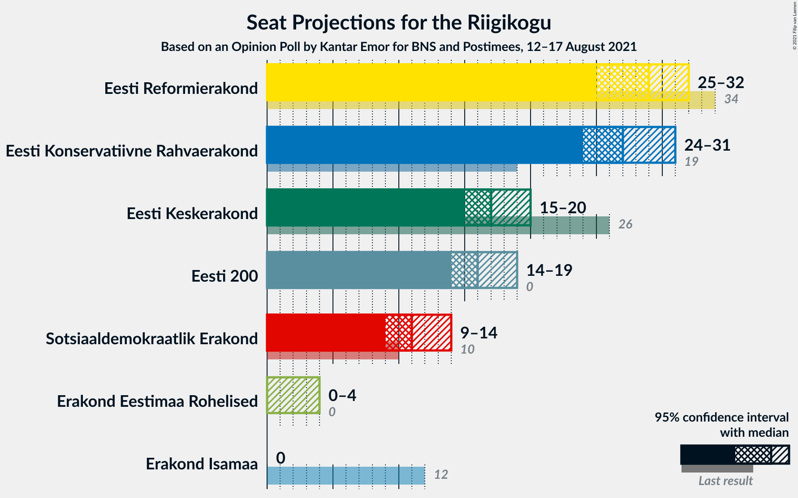
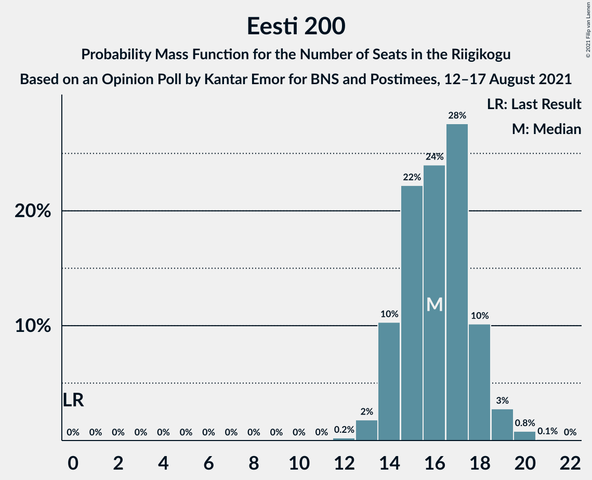
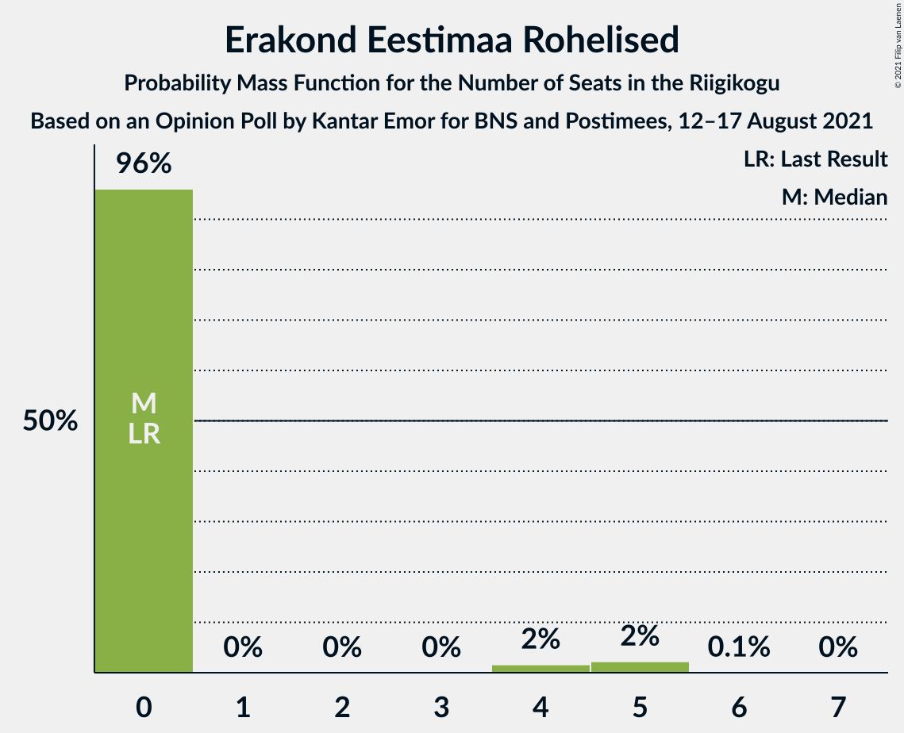
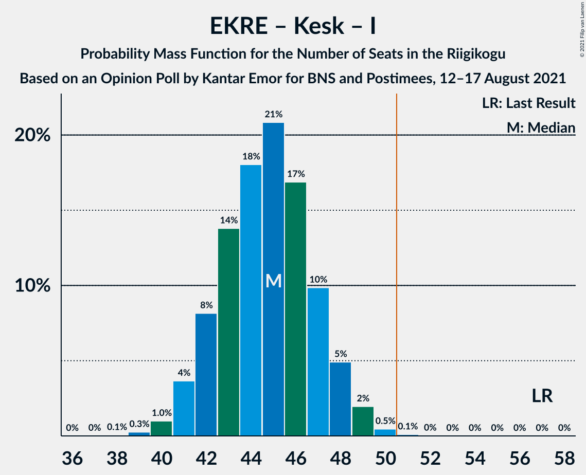

# Opinion Poll by Kantar Emor for BNS and Postimees, 12–17 August 2021

<a href="#voting-intentions">Voting Intentions</a> | <a href="#seats">Seats</a> | <a href="#coalitions">Coalitions</a> | <a href="#technical-information">Technical Information</a>

## Voting Intentions

### Confidence Intervals

| Party | Last Result | Poll Result | 80% Confidence Interval | 90% Confidence Interval | 95% Confidence Interval | 99% Confidence Interval |
|:-----:|:-----------:|:-----------:|:-----------------------:|:-----------------------:|:-----------------------:|:-----------------------:|
| Eesti Reformierakond | 28.9% | 25.0% | 23.4–26.8% |22.9–27.3% |22.5–27.8% |21.7–28.6% |
| Eesti Konservatiivne Rahvaerakond | 17.8% | 24.0% | 22.4–25.8% |21.9–26.2% |21.5–26.7% |20.8–27.5% |
| Eesti Keskerakond | 23.1% | 16.0% | 14.6–17.5% |14.2–17.9% |13.9–18.3% |13.3–19.1% |
| Eesti 200 | 4.4% | 15.0% | 13.7–16.5% |13.3–16.9% |13.0–17.3% |12.4–18.0% |
| Sotsiaaldemokraatlik Erakond | 9.8% | 11.0% | 9.8–12.3% |9.5–12.7% |9.2–13.0% |8.7–13.7% |
| Erakond Isamaa | 11.4% | 4.0% | 3.3–4.9% |3.1–5.1% |2.9–5.3% |2.7–5.8% |
| Erakond Eestimaa Rohelised | 1.8% | 4.0% | 3.3–4.9% |3.1–5.1% |2.9–5.3% |2.7–5.8% |

*Note:* The poll result column reflects the actual value used in the calculations. Published results may vary slightly, and in addition be rounded to fewer digits.

## Seats

### Confidence Intervals

| Party | Last Result | Median | 80% Confidence Interval | 90% Confidence Interval | 95% Confidence Interval | 99% Confidence Interval |
|:-----:|:-----------:|:------:|:-----------------------:|:-----------------------:|:-----------------------:|:-----------------------:|
| <a href="#eesti-reformierakond">Eesti Reformierakond</a> | 34 | 29 | 26–31 |26–31 |26–32 |24–33 |
| <a href="#eesti-konservatiivne-rahvaerakond">Eesti Konservatiivne Rahvaerakond</a> | 19 | 28 | 25–29 |25–30 |24–31 |23–32 |
| <a href="#eesti-keskerakond">Eesti Keskerakond</a> | 26 | 17 | 15–19 |15–20 |15–20 |14–21 |
| <a href="#eesti-200">Eesti 200</a> | 0 | 16 | 14–17 |14–19 |13–19 |13–20 |
| <a href="#sotsiaaldemokraatlik-erakond">Sotsiaaldemokraatlik Erakond</a> | 10 | 11 | 10–13 |9–13 |9–14 |9–14 |
| <a href="#erakond-isamaa">Erakond Isamaa</a> | 12 | 0 | 0 |0 |0 |0–4 |
| <a href="#erakond-eestimaa-rohelised">Erakond Eestimaa Rohelised</a> | 0 | 0 | 0 |0 |0 |0–5 |

### Eesti Reformierakond

*For a full overview of the results for this party, see the [Eesti Reformierakond](party-eestireformierakond.html) page.*

| Number of Seats | Probability | Accumulated | Special Marks |
|:---------------:|:-----------:|:-----------:|:-------------:|
| 23 | 0.1% | 100% |  |
| 24 | 0.5% | 99.9% |  |
| 25 | 2% | 99.4% |  |
| 26 | 8% | 98% |  |
| 27 | 12% | 90% |  |
| 28 | 26% | 78% |  |
| 29 | 19% | 52% | Median |
| 30 | 11% | 34% |  |
| 31 | 18% | 23% |  |
| 32 | 4% | 5% |  |
| 33 | 1.0% | 1.3% |  |
| 34 | 0.3% | 0.3% | Last Result |
| 35 | 0% | 0% |  |

### Eesti Konservatiivne Rahvaerakond

*For a full overview of the results for this party, see the [Eesti Konservatiivne Rahvaerakond](party-eestikonservatiivnerahvaerakond.html) page.*

| Number of Seats | Probability | Accumulated | Special Marks |
|:---------------:|:-----------:|:-----------:|:-------------:|
| 19 | 0% | 100% | Last Result |
| 20 | 0% | 100% |  |
| 21 | 0% | 100% |  |
| 22 | 0.1% | 100% |  |
| 23 | 0.7% | 99.8% |  |
| 24 | 3% | 99.1% |  |
| 25 | 9% | 96% |  |
| 26 | 16% | 87% |  |
| 27 | 21% | 71% |  |
| 28 | 21% | 50% | Median |
| 29 | 19% | 29% |  |
| 30 | 7% | 10% |  |
| 31 | 2% | 3% |  |
| 32 | 0.7% | 0.9% |  |
| 33 | 0.1% | 0.2% |  |
| 34 | 0% | 0% |  |

### Eesti Keskerakond

*For a full overview of the results for this party, see the [Eesti Keskerakond](party-eestikeskerakond.html) page.*

| Number of Seats | Probability | Accumulated | Special Marks |
|:---------------:|:-----------:|:-----------:|:-------------:|
| 13 | 0.3% | 100% |  |
| 14 | 1.2% | 99.7% |  |
| 15 | 9% | 98.5% |  |
| 16 | 17% | 90% |  |
| 17 | 28% | 73% | Median |
| 18 | 28% | 45% |  |
| 19 | 12% | 17% |  |
| 20 | 3% | 5% |  |
| 21 | 2% | 2% |  |
| 22 | 0.3% | 0.3% |  |
| 23 | 0% | 0% |  |
| 24 | 0% | 0% |  |
| 25 | 0% | 0% |  |
| 26 | 0% | 0% | Last Result |

### Eesti 200

*For a full overview of the results for this party, see the [Eesti 200](party-eesti200.html) page.*

| Number of Seats | Probability | Accumulated | Special Marks |
|:---------------:|:-----------:|:-----------:|:-------------:|
| 0 | 0% | 100% | Last Result |
| 1 | 0% | 100% |  |
| 2 | 0% | 100% |  |
| 3 | 0% | 100% |  |
| 4 | 0% | 100% |  |
| 5 | 0% | 100% |  |
| 6 | 0% | 100% |  |
| 7 | 0% | 100% |  |
| 8 | 0% | 100% |  |
| 9 | 0% | 100% |  |
| 10 | 0% | 100% |  |
| 11 | 0% | 100% |  |
| 12 | 0.1% | 100% |  |
| 13 | 4% | 99.9% |  |
| 14 | 8% | 96% |  |
| 15 | 5% | 87% |  |
| 16 | 52% | 82% | Median |
| 17 | 21% | 30% |  |
| 18 | 2% | 9% |  |
| 19 | 6% | 7% |  |
| 20 | 0.7% | 0.8% |  |
| 21 | 0% | 0.1% |  |
| 22 | 0% | 0% |  |

### Sotsiaaldemokraatlik Erakond

*For a full overview of the results for this party, see the [Sotsiaaldemokraatlik Erakond](party-sotsiaaldemokraatlikerakond.html) page.*

| Number of Seats | Probability | Accumulated | Special Marks |
|:---------------:|:-----------:|:-----------:|:-------------:|
| 8 | 0.5% | 100% |  |
| 9 | 6% | 99.5% |  |
| 10 | 27% | 94% | Last Result |
| 11 | 27% | 67% | Median |
| 12 | 28% | 40% |  |
| 13 | 9% | 13% |  |
| 14 | 3% | 3% |  |
| 15 | 0.3% | 0.4% |  |
| 16 | 0% | 0% |  |

### Erakond Isamaa

*For a full overview of the results for this party, see the [Erakond Isamaa](party-erakondisamaa.html) page.*

| Number of Seats | Probability | Accumulated | Special Marks |
|:---------------:|:-----------:|:-----------:|:-------------:|
| 0 | 99.4% | 100% | Median |
| 1 | 0% | 0.6% |  |
| 2 | 0% | 0.6% |  |
| 3 | 0% | 0.6% |  |
| 4 | 0.3% | 0.6% |  |
| 5 | 0.1% | 0.3% |  |
| 6 | 0.2% | 0.2% |  |
| 7 | 0% | 0% |  |
| 8 | 0% | 0% |  |
| 9 | 0% | 0% |  |
| 10 | 0% | 0% |  |
| 11 | 0% | 0% |  |
| 12 | 0% | 0% | Last Result |

### Erakond Eestimaa Rohelised

*For a full overview of the results for this party, see the [Erakond Eestimaa Rohelised](party-erakondeestimaarohelised.html) page.*

| Number of Seats | Probability | Accumulated | Special Marks |
|:---------------:|:-----------:|:-----------:|:-------------:|
| 0 | 98% | 100% | Last Result, Median |
| 1 | 0% | 2% |  |
| 2 | 0% | 2% |  |
| 3 | 0% | 2% |  |
| 4 | 0.4% | 2% |  |
| 5 | 2% | 2% |  |
| 6 | 0.1% | 0.1% |  |
| 7 | 0% | 0% |  |

## Coalitions

### Confidence Intervals

| Coalition | Last Result | Median | Majority? | 80% Confidence Interval | 90% Confidence Interval | 95% Confidence Interval | 99% Confidence Interval |
|:---------:|:-----------:|:------:|:---------:|:-----------------------:|:-----------------------:|:-----------------------:|:-----------------------:|
| Eesti Reformierakond – Eesti Konservatiivne Rahvaerakond – Eesti Keskerakond | 79 | 74 | 100% | 71–75 | 71–76 | 70–77 | 68–78 |
| Eesti Reformierakond – Eesti Konservatiivne Rahvaerakond | 53 | 56 | 99.7% | 54–59 | 53–59 | 53–60 | 51–61 |
| Eesti Reformierakond – Eesti Konservatiivne Rahvaerakond – Erakond Isamaa | 65 | 56 | 99.9% | 54–59 | 53–59 | 53–60 | 51–61 |
| Eesti Reformierakond – Eesti Keskerakond | 60 | 46 | 1.0% | 44–48 | 43–49 | 42–50 | 41–51 |
| Eesti Konservatiivne Rahvaerakond – Eesti Keskerakond | 45 | 45 | 0.1% | 42–47 | 41–48 | 41–48 | 39–50 |
| Eesti Konservatiivne Rahvaerakond – Eesti Keskerakond – Erakond Isamaa | 57 | 45 | 0.1% | 42–47 | 41–48 | 41–48 | 39–50 |
| Eesti Reformierakond – Sotsiaaldemokraatlik Erakond – Erakond Isamaa | 56 | 40 | 0% | 38–43 | 37–43 | 37–44 | 35–45 |
| Eesti Reformierakond – Sotsiaaldemokraatlik Erakond | 44 | 40 | 0% | 38–43 | 37–43 | 37–44 | 35–45 |
| Eesti Konservatiivne Rahvaerakond – Sotsiaaldemokraatlik Erakond | 29 | 39 | 0% | 36–41 | 36–42 | 35–42 | 34–43 |
| Eesti Reformierakond – Erakond Isamaa | 46 | 29 | 0% | 27–31 | 26–32 | 26–32 | 24–33 |
| Eesti Keskerakond – Sotsiaaldemokraatlik Erakond – Erakond Isamaa | 48 | 29 | 0% | 26–31 | 26–31 | 25–32 | 24–33 |
| Eesti Keskerakond – Sotsiaaldemokraatlik Erakond | 36 | 29 | 0% | 26–31 | 26–31 | 25–32 | 24–33 |

### Eesti Reformierakond – Eesti Konservatiivne Rahvaerakond – Eesti Keskerakond

| Number of Seats | Probability | Accumulated | Special Marks |
|:---------------:|:-----------:|:-----------:|:-------------:|
| 66 | 0.1% | 100% |  |
| 67 | 0.2% | 99.8% |  |
| 68 | 0.5% | 99.7% |  |
| 69 | 0.9% | 99.2% |  |
| 70 | 3% | 98% |  |
| 71 | 7% | 96% |  |
| 72 | 14% | 88% |  |
| 73 | 22% | 74% |  |
| 74 | 18% | 52% | Median |
| 75 | 24% | 34% |  |
| 76 | 5% | 10% |  |
| 77 | 4% | 5% |  |
| 78 | 0.9% | 0.9% |  |
| 79 | 0.1% | 0.1% | Last Result |
| 80 | 0% | 0% |  |

### Eesti Reformierakond – Eesti Konservatiivne Rahvaerakond

| Number of Seats | Probability | Accumulated | Special Marks |
|:---------------:|:-----------:|:-----------:|:-------------:|
| 49 | 0.1% | 100% |  |
| 50 | 0.2% | 99.9% |  |
| 51 | 0.5% | 99.7% | Majority |
| 52 | 1.4% | 99.2% |  |
| 53 | 5% | 98% | Last Result |
| 54 | 12% | 93% |  |
| 55 | 12% | 80% |  |
| 56 | 23% | 68% |  |
| 57 | 16% | 45% | Median |
| 58 | 18% | 29% |  |
| 59 | 7% | 11% |  |
| 60 | 3% | 4% |  |
| 61 | 0.7% | 0.9% |  |
| 62 | 0.2% | 0.2% |  |
| 63 | 0% | 0% |  |

### Eesti Reformierakond – Eesti Konservatiivne Rahvaerakond – Erakond Isamaa

| Number of Seats | Probability | Accumulated | Special Marks |
|:---------------:|:-----------:|:-----------:|:-------------:|
| 50 | 0.1% | 100% |  |
| 51 | 0.4% | 99.9% | Majority |
| 52 | 1.3% | 99.4% |  |
| 53 | 5% | 98% |  |
| 54 | 12% | 93% |  |
| 55 | 12% | 80% |  |
| 56 | 23% | 68% |  |
| 57 | 16% | 45% | Median |
| 58 | 18% | 29% |  |
| 59 | 7% | 11% |  |
| 60 | 3% | 4% |  |
| 61 | 0.7% | 0.9% |  |
| 62 | 0.2% | 0.2% |  |
| 63 | 0% | 0% |  |
| 64 | 0% | 0% |  |
| 65 | 0% | 0% | Last Result |

### Eesti Reformierakond – Eesti Keskerakond

| Number of Seats | Probability | Accumulated | Special Marks |
|:---------------:|:-----------:|:-----------:|:-------------:|
| 40 | 0.2% | 100% |  |
| 41 | 0.7% | 99.7% |  |
| 42 | 2% | 99.0% |  |
| 43 | 7% | 97% |  |
| 44 | 10% | 90% |  |
| 45 | 15% | 80% |  |
| 46 | 24% | 65% | Median |
| 47 | 15% | 41% |  |
| 48 | 17% | 26% |  |
| 49 | 7% | 9% |  |
| 50 | 2% | 3% |  |
| 51 | 0.8% | 1.0% | Majority |
| 52 | 0.1% | 0.2% |  |
| 53 | 0% | 0% |  |
| 54 | 0% | 0% |  |
| 55 | 0% | 0% |  |
| 56 | 0% | 0% |  |
| 57 | 0% | 0% |  |
| 58 | 0% | 0% |  |
| 59 | 0% | 0% |  |
| 60 | 0% | 0% | Last Result |

### Eesti Konservatiivne Rahvaerakond – Eesti Keskerakond

| Number of Seats | Probability | Accumulated | Special Marks |
|:---------------:|:-----------:|:-----------:|:-------------:|
| 38 | 0.1% | 100% |  |
| 39 | 0.5% | 99.9% |  |
| 40 | 0.8% | 99.4% |  |
| 41 | 5% | 98.5% |  |
| 42 | 4% | 93% |  |
| 43 | 13% | 89% |  |
| 44 | 20% | 76% |  |
| 45 | 21% | 56% | Last Result, Median |
| 46 | 16% | 35% |  |
| 47 | 12% | 19% |  |
| 48 | 5% | 7% |  |
| 49 | 1.3% | 2% |  |
| 50 | 0.4% | 0.5% |  |
| 51 | 0.1% | 0.1% | Majority |
| 52 | 0% | 0% |  |

### Eesti Konservatiivne Rahvaerakond – Eesti Keskerakond – Erakond Isamaa

| Number of Seats | Probability | Accumulated | Special Marks |
|:---------------:|:-----------:|:-----------:|:-------------:|
| 38 | 0.1% | 100% |  |
| 39 | 0.5% | 99.9% |  |
| 40 | 0.7% | 99.4% |  |
| 41 | 5% | 98.7% |  |
| 42 | 4% | 93% |  |
| 43 | 13% | 89% |  |
| 44 | 20% | 76% |  |
| 45 | 21% | 56% | Median |
| 46 | 16% | 35% |  |
| 47 | 12% | 20% |  |
| 48 | 5% | 7% |  |
| 49 | 1.4% | 2% |  |
| 50 | 0.4% | 0.6% |  |
| 51 | 0.1% | 0.1% | Majority |
| 52 | 0% | 0% |  |
| 53 | 0% | 0% |  |
| 54 | 0% | 0% |  |
| 55 | 0% | 0% |  |
| 56 | 0% | 0% |  |
| 57 | 0% | 0% | Last Result |

### Eesti Reformierakond – Sotsiaaldemokraatlik Erakond – Erakond Isamaa

| Number of Seats | Probability | Accumulated | Special Marks |
|:---------------:|:-----------:|:-----------:|:-------------:|
| 34 | 0.2% | 100% |  |
| 35 | 0.9% | 99.8% |  |
| 36 | 1.1% | 98.9% |  |
| 37 | 5% | 98% |  |
| 38 | 15% | 92% |  |
| 39 | 18% | 78% |  |
| 40 | 18% | 60% | Median |
| 41 | 24% | 42% |  |
| 42 | 8% | 18% |  |
| 43 | 7% | 11% |  |
| 44 | 2% | 3% |  |
| 45 | 0.9% | 1.1% |  |
| 46 | 0.2% | 0.2% |  |
| 47 | 0% | 0% |  |
| 48 | 0% | 0% |  |
| 49 | 0% | 0% |  |
| 50 | 0% | 0% |  |
| 51 | 0% | 0% | Majority |
| 52 | 0% | 0% |  |
| 53 | 0% | 0% |  |
| 54 | 0% | 0% |  |
| 55 | 0% | 0% |  |
| 56 | 0% | 0% | Last Result |

### Eesti Reformierakond – Sotsiaaldemokraatlik Erakond

| Number of Seats | Probability | Accumulated | Special Marks |
|:---------------:|:-----------:|:-----------:|:-------------:|
| 34 | 0.2% | 100% |  |
| 35 | 0.9% | 99.8% |  |
| 36 | 1.3% | 98.8% |  |
| 37 | 6% | 98% |  |
| 38 | 15% | 92% |  |
| 39 | 18% | 77% |  |
| 40 | 18% | 59% | Median |
| 41 | 23% | 41% |  |
| 42 | 7% | 18% |  |
| 43 | 7% | 10% |  |
| 44 | 2% | 3% | Last Result |
| 45 | 0.8% | 0.9% |  |
| 46 | 0.2% | 0.2% |  |
| 47 | 0% | 0% |  |

### Eesti Konservatiivne Rahvaerakond – Sotsiaaldemokraatlik Erakond

| Number of Seats | Probability | Accumulated | Special Marks |
|:---------------:|:-----------:|:-----------:|:-------------:|
| 29 | 0% | 100% | Last Result |
| 30 | 0% | 100% |  |
| 31 | 0% | 100% |  |
| 32 | 0.1% | 100% |  |
| 33 | 0.2% | 99.9% |  |
| 34 | 1.2% | 99.7% |  |
| 35 | 2% | 98.5% |  |
| 36 | 8% | 96% |  |
| 37 | 21% | 88% |  |
| 38 | 12% | 67% |  |
| 39 | 24% | 55% | Median |
| 40 | 13% | 31% |  |
| 41 | 12% | 18% |  |
| 42 | 5% | 7% |  |
| 43 | 0.9% | 1.4% |  |
| 44 | 0.4% | 0.5% |  |
| 45 | 0.1% | 0.1% |  |
| 46 | 0% | 0% |  |

### Eesti Reformierakond – Erakond Isamaa

| Number of Seats | Probability | Accumulated | Special Marks |
|:---------------:|:-----------:|:-----------:|:-------------:|
| 23 | 0.1% | 100% |  |
| 24 | 0.4% | 99.9% |  |
| 25 | 2% | 99.5% |  |
| 26 | 8% | 98% |  |
| 27 | 11% | 90% |  |
| 28 | 26% | 79% |  |
| 29 | 19% | 53% | Median |
| 30 | 11% | 34% |  |
| 31 | 18% | 23% |  |
| 32 | 4% | 5% |  |
| 33 | 1.1% | 2% |  |
| 34 | 0.3% | 0.4% |  |
| 35 | 0.1% | 0.1% |  |
| 36 | 0% | 0% |  |
| 37 | 0% | 0% |  |
| 38 | 0% | 0% |  |
| 39 | 0% | 0% |  |
| 40 | 0% | 0% |  |
| 41 | 0% | 0% |  |
| 42 | 0% | 0% |  |
| 43 | 0% | 0% |  |
| 44 | 0% | 0% |  |
| 45 | 0% | 0% |  |
| 46 | 0% | 0% | Last Result |

### Eesti Keskerakond – Sotsiaaldemokraatlik Erakond – Erakond Isamaa

| Number of Seats | Probability | Accumulated | Special Marks |
|:---------------:|:-----------:|:-----------:|:-------------:|
| 23 | 0.1% | 100% |  |
| 24 | 0.5% | 99.9% |  |
| 25 | 3% | 99.5% |  |
| 26 | 7% | 97% |  |
| 27 | 20% | 90% |  |
| 28 | 18% | 70% | Median |
| 29 | 26% | 51% |  |
| 30 | 12% | 25% |  |
| 31 | 9% | 13% |  |
| 32 | 3% | 4% |  |
| 33 | 0.8% | 1.1% |  |
| 34 | 0.3% | 0.3% |  |
| 35 | 0% | 0.1% |  |
| 36 | 0% | 0% |  |
| 37 | 0% | 0% |  |
| 38 | 0% | 0% |  |
| 39 | 0% | 0% |  |
| 40 | 0% | 0% |  |
| 41 | 0% | 0% |  |
| 42 | 0% | 0% |  |
| 43 | 0% | 0% |  |
| 44 | 0% | 0% |  |
| 45 | 0% | 0% |  |
| 46 | 0% | 0% |  |
| 47 | 0% | 0% |  |
| 48 | 0% | 0% | Last Result |

### Eesti Keskerakond – Sotsiaaldemokraatlik Erakond

| Number of Seats | Probability | Accumulated | Special Marks |
|:---------------:|:-----------:|:-----------:|:-------------:|
| 23 | 0.1% | 100% |  |
| 24 | 0.5% | 99.9% |  |
| 25 | 3% | 99.4% |  |
| 26 | 7% | 96% |  |
| 27 | 20% | 90% |  |
| 28 | 19% | 69% | Median |
| 29 | 26% | 51% |  |
| 30 | 12% | 24% |  |
| 31 | 9% | 13% |  |
| 32 | 3% | 4% |  |
| 33 | 0.7% | 0.9% |  |
| 34 | 0.2% | 0.2% |  |
| 35 | 0% | 0% |  |
| 36 | 0% | 0% | Last Result |

## Technical Information

### Opinion Poll

+ **Polling firm:** Kantar Emor
+ **Commissioner(s):** BNS and Postimees
+ **Fieldwork period:** 12–17 August 2021

### Calculations

+ **Sample size:** 1058
+ **Simulations done:** 131,072
+ **Error estimate:** 2.16%

