# Opinion Poll by Norstat for MTÜ Ühiskonnauuringute Instituut, 17–24 August 2021

<a href="#voting-intentions">Voting Intentions</a> | <a href="#seats">Seats</a> | <a href="#coalitions">Coalitions</a> | <a href="#technical-information">Technical Information</a>

## Voting Intentions

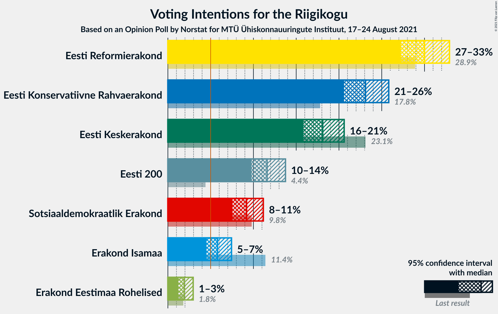

### Confidence Intervals

| Party | Last Result | Poll Result | 80% Confidence Interval | 90% Confidence Interval | 95% Confidence Interval | 99% Confidence Interval |
|:-----:|:-----------:|:-----------:|:-----------------------:|:-----------------------:|:-----------------------:|:-----------------------:|
| Eesti Reformierakond | 28.9% | 30.0% | 28.2–31.9% |27.7–32.4% |27.2–32.9% |26.4–33.9% |
| Eesti Konservatiivne Rahvaerakond | 17.8% | 23.1% | 21.4–24.9% |21.0–25.4% |20.6–25.8% |19.8–26.7% |
| Eesti Keskerakond | 23.1% | 18.1% | 16.6–19.7% |16.2–20.2% |15.8–20.6% |15.2–21.4% |
| Eesti 200 | 4.4% | 11.6% | 10.4–13.0% |10.0–13.4% |9.8–13.7% |9.2–14.4% |
| Sotsiaaldemokraatlik Erakond | 9.8% | 9.2% | 8.1–10.5% |7.8–10.8% |7.6–11.2% |7.1–11.8% |
| Erakond Isamaa | 11.4% | 5.8% | 5.0–6.9% |4.7–7.2% |4.5–7.4% |4.1–8.0% |
| Erakond Eestimaa Rohelised | 1.8% | 1.9% | 1.4–2.6% |1.3–2.8% |1.2–3.0% |1.0–3.3% |

*Note:* The poll result column reflects the actual value used in the calculations. Published results may vary slightly, and in addition be rounded to fewer digits.

## Seats

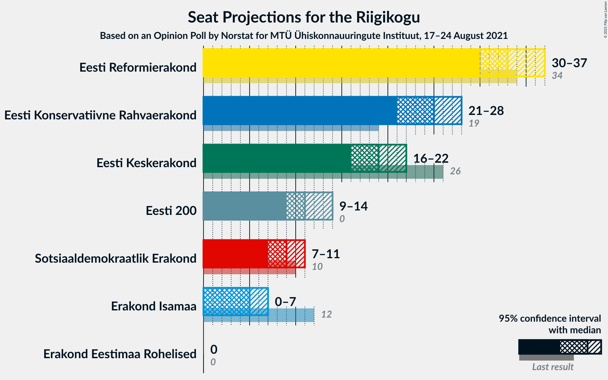

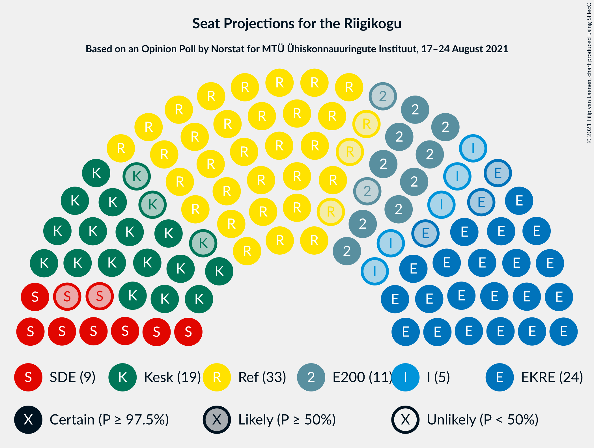

### Confidence Intervals

| Party | Last Result | Median | 80% Confidence Interval | 90% Confidence Interval | 95% Confidence Interval | 99% Confidence Interval |
|:-----:|:-----------:|:------:|:-----------------------:|:-----------------------:|:-----------------------:|:-----------------------:|
| <a href="#eesti-reformierakond">Eesti Reformierakond</a> | 34 | 33 | 31–36 |30–36 |30–37 |29–38 |
| <a href="#eesti-konservatiivne-rahvaerakond">Eesti Konservatiivne Rahvaerakond</a> | 19 | 25 | 23–27 |22–28 |21–28 |21–29 |
| <a href="#eesti-keskerakond">Eesti Keskerakond</a> | 26 | 19 | 17–21 |16–21 |16–22 |15–23 |
| <a href="#eesti-200">Eesti 200</a> | 0 | 11 | 10–13 |9–13 |9–14 |8–15 |
| <a href="#sotsiaaldemokraatlik-erakond">Sotsiaaldemokraatlik Erakond</a> | 10 | 9 | 7–10 |7–10 |7–11 |6–11 |
| <a href="#erakond-isamaa">Erakond Isamaa</a> | 12 | 5 | 0–6 |0–6 |0–7 |0–7 |
| <a href="#erakond-eestimaa-rohelised">Erakond Eestimaa Rohelised</a> | 0 | 0 | 0 |0 |0 |0 |

### Eesti Reformierakond

*For a full overview of the results for this party, see the [Eesti Reformierakond](party-eestireformierakond.html) page.*

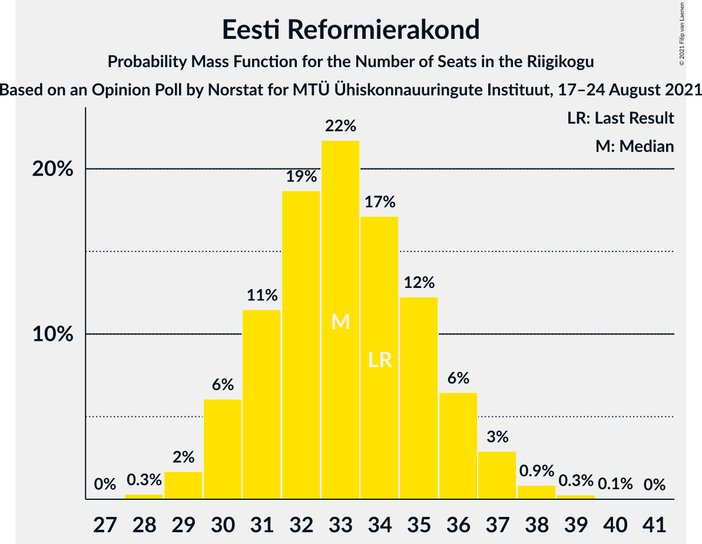

| Number of Seats | Probability | Accumulated | Special Marks |
|:---------------:|:-----------:|:-----------:|:-------------:|
| 27 | 0% | 100% |  |
| 28 | 0.3% | 99.9% |  |
| 29 | 2% | 99.6% |  |
| 30 | 6% | 98% |  |
| 31 | 11% | 92% |  |
| 32 | 19% | 80% |  |
| 33 | 22% | 62% | Median |
| 34 | 17% | 40% | Last Result |
| 35 | 12% | 23% |  |
| 36 | 6% | 11% |  |
| 37 | 3% | 4% |  |
| 38 | 0.9% | 1.2% |  |
| 39 | 0.3% | 0.4% |  |
| 40 | 0.1% | 0.1% |  |
| 41 | 0% | 0% |  |

### Eesti Konservatiivne Rahvaerakond

*For a full overview of the results for this party, see the [Eesti Konservatiivne Rahvaerakond](party-eestikonservatiivnerahvaerakond.html) page.*

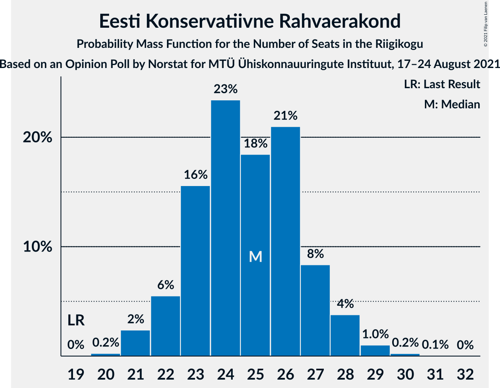

| Number of Seats | Probability | Accumulated | Special Marks |
|:---------------:|:-----------:|:-----------:|:-------------:|
| 19 | 0% | 100% | Last Result |
| 20 | 0.2% | 100% |  |
| 21 | 2% | 99.7% |  |
| 22 | 6% | 97% |  |
| 23 | 16% | 92% |  |
| 24 | 23% | 76% |  |
| 25 | 18% | 53% | Median |
| 26 | 21% | 34% |  |
| 27 | 8% | 13% |  |
| 28 | 4% | 5% |  |
| 29 | 1.0% | 1.3% |  |
| 30 | 0.2% | 0.3% |  |
| 31 | 0.1% | 0.1% |  |
| 32 | 0% | 0% |  |

### Eesti Keskerakond

*For a full overview of the results for this party, see the [Eesti Keskerakond](party-eestikeskerakond.html) page.*

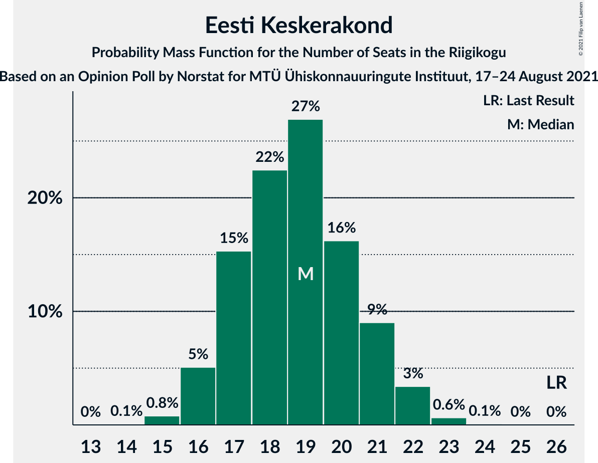

| Number of Seats | Probability | Accumulated | Special Marks |
|:---------------:|:-----------:|:-----------:|:-------------:|
| 14 | 0.1% | 100% |  |
| 15 | 0.8% | 99.9% |  |
| 16 | 5% | 99.1% |  |
| 17 | 15% | 94% |  |
| 18 | 22% | 79% |  |
| 19 | 27% | 56% | Median |
| 20 | 16% | 29% |  |
| 21 | 9% | 13% |  |
| 22 | 3% | 4% |  |
| 23 | 0.6% | 0.7% |  |
| 24 | 0.1% | 0.1% |  |
| 25 | 0% | 0% |  |
| 26 | 0% | 0% | Last Result |

### Eesti 200

*For a full overview of the results for this party, see the [Eesti 200](party-eesti200.html) page.*

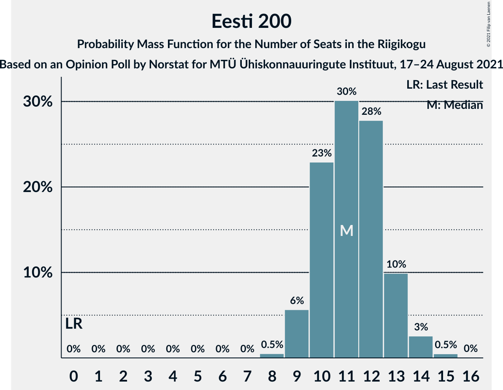

| Number of Seats | Probability | Accumulated | Special Marks |
|:---------------:|:-----------:|:-----------:|:-------------:|
| 0 | 0% | 100% | Last Result |
| 1 | 0% | 100% |  |
| 2 | 0% | 100% |  |
| 3 | 0% | 100% |  |
| 4 | 0% | 100% |  |
| 5 | 0% | 100% |  |
| 6 | 0% | 100% |  |
| 7 | 0% | 100% |  |
| 8 | 0.5% | 100% |  |
| 9 | 6% | 99.5% |  |
| 10 | 23% | 94% |  |
| 11 | 30% | 71% | Median |
| 12 | 28% | 41% |  |
| 13 | 10% | 13% |  |
| 14 | 3% | 3% |  |
| 15 | 0.5% | 0.5% |  |
| 16 | 0% | 0% |  |

### Sotsiaaldemokraatlik Erakond

*For a full overview of the results for this party, see the [Sotsiaaldemokraatlik Erakond](party-sotsiaaldemokraatlikerakond.html) page.*

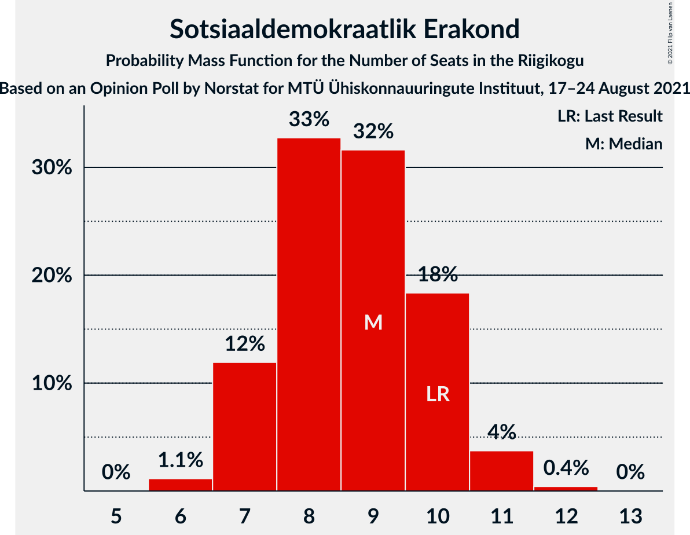

| Number of Seats | Probability | Accumulated | Special Marks |
|:---------------:|:-----------:|:-----------:|:-------------:|
| 6 | 1.1% | 100% |  |
| 7 | 12% | 98.8% |  |
| 8 | 33% | 87% |  |
| 9 | 32% | 54% | Median |
| 10 | 18% | 23% | Last Result |
| 11 | 4% | 4% |  |
| 12 | 0.4% | 0.5% |  |
| 13 | 0% | 0% |  |

### Erakond Isamaa

*For a full overview of the results for this party, see the [Erakond Isamaa](party-erakondisamaa.html) page.*

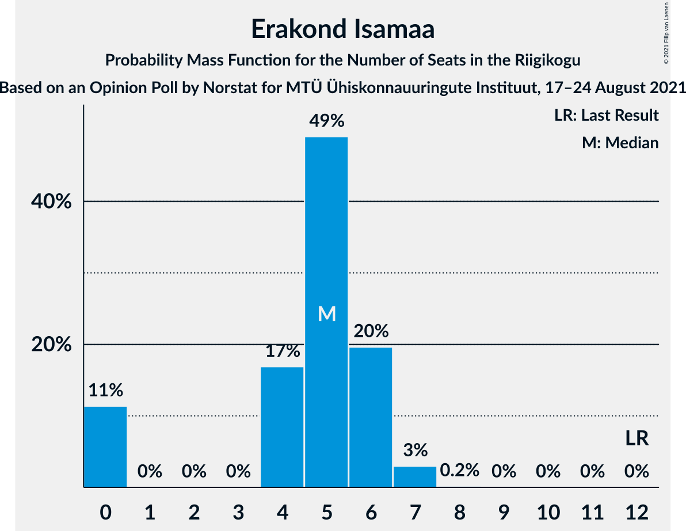

| Number of Seats | Probability | Accumulated | Special Marks |
|:---------------:|:-----------:|:-----------:|:-------------:|
| 0 | 11% | 100% |  |
| 1 | 0% | 89% |  |
| 2 | 0% | 89% |  |
| 3 | 0% | 89% |  |
| 4 | 17% | 89% |  |
| 5 | 49% | 72% | Median |
| 6 | 20% | 23% |  |
| 7 | 3% | 3% |  |
| 8 | 0.2% | 0.2% |  |
| 9 | 0% | 0% |  |
| 10 | 0% | 0% |  |
| 11 | 0% | 0% |  |
| 12 | 0% | 0% | Last Result |

### Erakond Eestimaa Rohelised

*For a full overview of the results for this party, see the [Erakond Eestimaa Rohelised](party-erakondeestimaarohelised.html) page.*

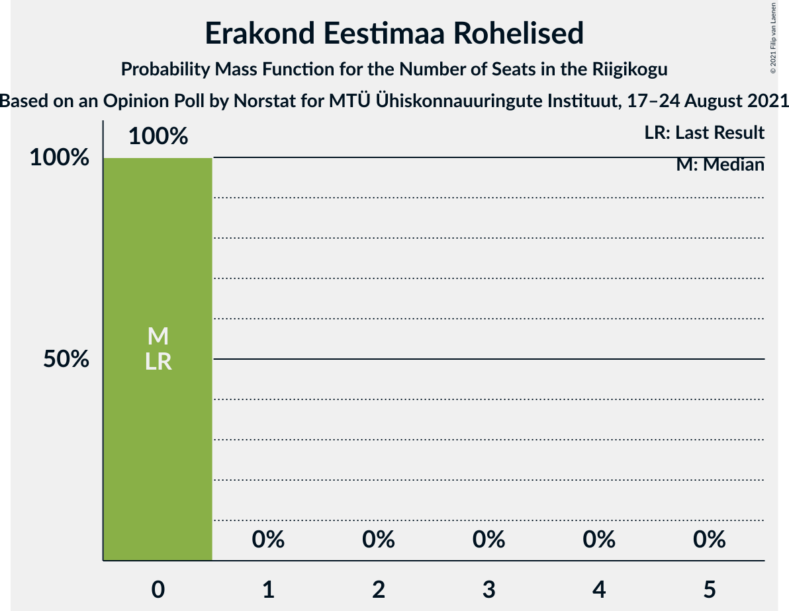

| Number of Seats | Probability | Accumulated | Special Marks |
|:---------------:|:-----------:|:-----------:|:-------------:|
| 0 | 100% | 100% | Last Result, Median |

## Coalitions

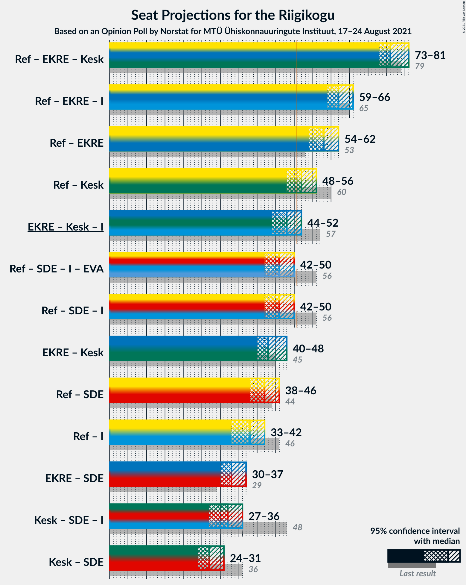

### Confidence Intervals

| Coalition | Last Result | Median | Majority? | 80% Confidence Interval | 90% Confidence Interval | 95% Confidence Interval | 99% Confidence Interval |
|:---------:|:-----------:|:------:|:---------:|:-----------------------:|:-----------------------:|:-----------------------:|:-----------------------:|
| Eesti Reformierakond – Eesti Konservatiivne Rahvaerakond – Eesti Keskerakond | 79 | 76 | 100% | 74–79 | 74–81 | 73–81 | 72–83 |
| Eesti Reformierakond – Eesti Konservatiivne Rahvaerakond – Erakond Isamaa | 65 | 62 | 100% | 60–65 | 59–65 | 59–66 | 57–67 |
| Eesti Reformierakond – Eesti Konservatiivne Rahvaerakond | 53 | 58 | 100% | 55–61 | 54–61 | 54–62 | 53–64 |
| Eesti Reformierakond – Eesti Keskerakond | 60 | 52 | 74% | 49–54 | 49–55 | 48–56 | 47–58 |
| Eesti Konservatiivne Rahvaerakond – Eesti Keskerakond – Erakond Isamaa | 57 | 48 | 12% | 45–51 | 44–51 | 44–52 | 42–53 |
| Eesti Reformierakond – Sotsiaaldemokraatlik Erakond – Erakond Isamaa | 56 | 46 | 2% | 44–49 | 43–50 | 42–50 | 40–51 |
| Eesti Konservatiivne Rahvaerakond – Eesti Keskerakond | 45 | 43 | 0.1% | 41–46 | 40–47 | 40–48 | 39–49 |
| Eesti Reformierakond – Sotsiaaldemokraatlik Erakond | 44 | 42 | 0% | 39–44 | 39–45 | 38–46 | 37–47 |
| Eesti Reformierakond – Erakond Isamaa | 46 | 38 | 0% | 35–40 | 34–41 | 33–42 | 32–43 |
| Eesti Konservatiivne Rahvaerakond – Sotsiaaldemokraatlik Erakond | 29 | 33 | 0% | 31–36 | 30–37 | 30–37 | 29–38 |
| Eesti Keskerakond – Sotsiaaldemokraatlik Erakond – Erakond Isamaa | 48 | 32 | 0% | 29–34 | 28–35 | 27–36 | 26–37 |
| Eesti Keskerakond – Sotsiaaldemokraatlik Erakond | 36 | 27 | 0% | 25–30 | 25–30 | 24–31 | 23–32 |

### Eesti Reformierakond – Eesti Konservatiivne Rahvaerakond – Eesti Keskerakond

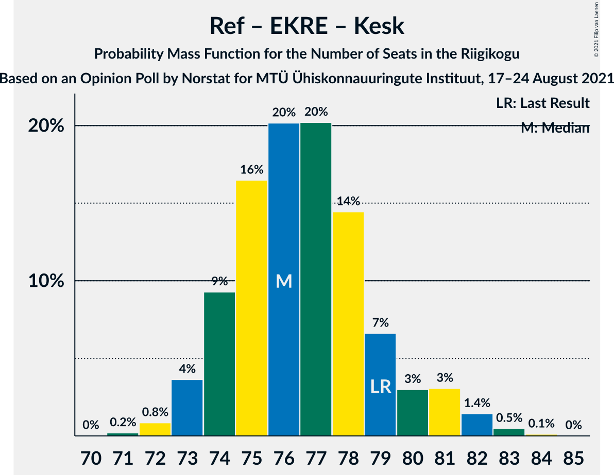

| Number of Seats | Probability | Accumulated | Special Marks |
|:---------------:|:-----------:|:-----------:|:-------------:|
| 71 | 0.2% | 100% |  |
| 72 | 0.8% | 99.8% |  |
| 73 | 4% | 98.9% |  |
| 74 | 9% | 95% |  |
| 75 | 16% | 86% |  |
| 76 | 20% | 70% |  |
| 77 | 20% | 49% | Median |
| 78 | 14% | 29% |  |
| 79 | 7% | 15% | Last Result |
| 80 | 3% | 8% |  |
| 81 | 3% | 5% |  |
| 82 | 1.4% | 2% |  |
| 83 | 0.5% | 0.6% |  |
| 84 | 0.1% | 0.1% |  |
| 85 | 0% | 0% |  |

### Eesti Reformierakond – Eesti Konservatiivne Rahvaerakond – Erakond Isamaa

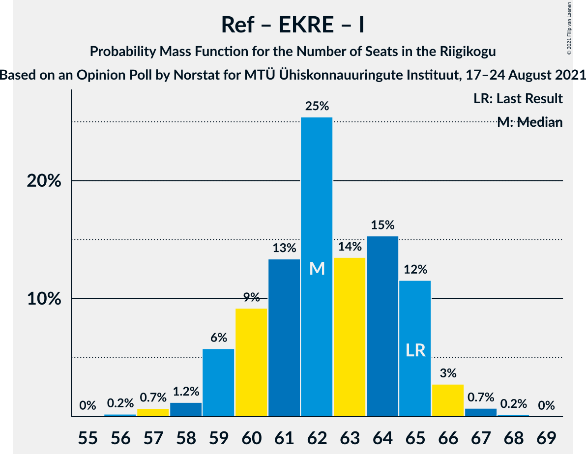

| Number of Seats | Probability | Accumulated | Special Marks |
|:---------------:|:-----------:|:-----------:|:-------------:|
| 56 | 0.2% | 100% |  |
| 57 | 0.7% | 99.7% |  |
| 58 | 1.2% | 99.0% |  |
| 59 | 6% | 98% |  |
| 60 | 9% | 92% |  |
| 61 | 13% | 83% |  |
| 62 | 25% | 69% |  |
| 63 | 14% | 44% | Median |
| 64 | 15% | 31% |  |
| 65 | 12% | 15% | Last Result |
| 66 | 3% | 4% |  |
| 67 | 0.7% | 0.9% |  |
| 68 | 0.2% | 0.2% |  |
| 69 | 0% | 0% |  |

### Eesti Reformierakond – Eesti Konservatiivne Rahvaerakond

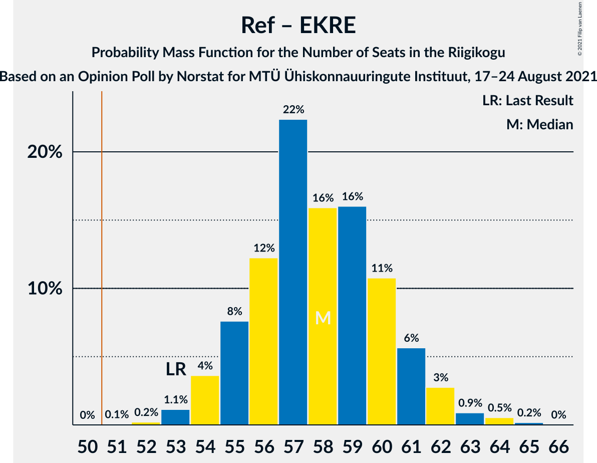

| Number of Seats | Probability | Accumulated | Special Marks |
|:---------------:|:-----------:|:-----------:|:-------------:|
| 51 | 0.1% | 100% | Majority |
| 52 | 0.2% | 99.9% |  |
| 53 | 1.1% | 99.7% | Last Result |
| 54 | 4% | 98.6% |  |
| 55 | 8% | 95% |  |
| 56 | 12% | 87% |  |
| 57 | 22% | 75% |  |
| 58 | 16% | 53% | Median |
| 59 | 16% | 37% |  |
| 60 | 11% | 21% |  |
| 61 | 6% | 10% |  |
| 62 | 3% | 4% |  |
| 63 | 0.9% | 2% |  |
| 64 | 0.5% | 0.7% |  |
| 65 | 0.2% | 0.2% |  |
| 66 | 0% | 0% |  |

### Eesti Reformierakond – Eesti Keskerakond

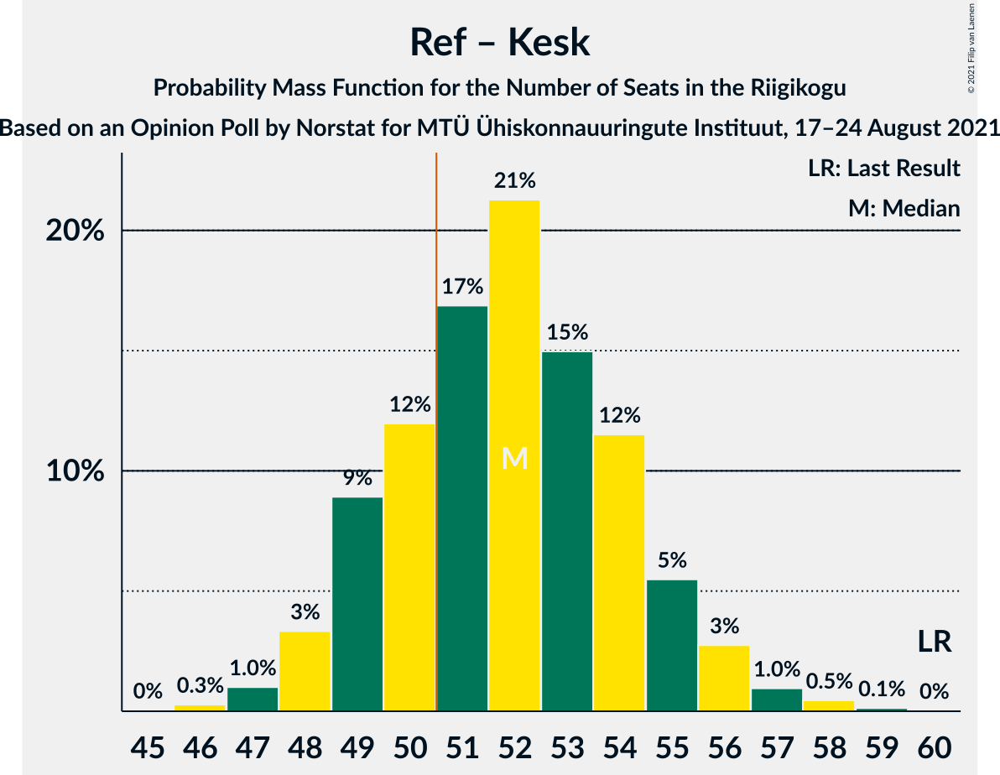

| Number of Seats | Probability | Accumulated | Special Marks |
|:---------------:|:-----------:|:-----------:|:-------------:|
| 46 | 0.3% | 100% |  |
| 47 | 1.0% | 99.7% |  |
| 48 | 3% | 98.7% |  |
| 49 | 9% | 95% |  |
| 50 | 12% | 86% |  |
| 51 | 17% | 74% | Majority |
| 52 | 21% | 58% | Median |
| 53 | 15% | 36% |  |
| 54 | 12% | 21% |  |
| 55 | 5% | 10% |  |
| 56 | 3% | 4% |  |
| 57 | 1.0% | 2% |  |
| 58 | 0.5% | 0.6% |  |
| 59 | 0.1% | 0.2% |  |
| 60 | 0% | 0% | Last Result |

### Eesti Konservatiivne Rahvaerakond – Eesti Keskerakond – Erakond Isamaa

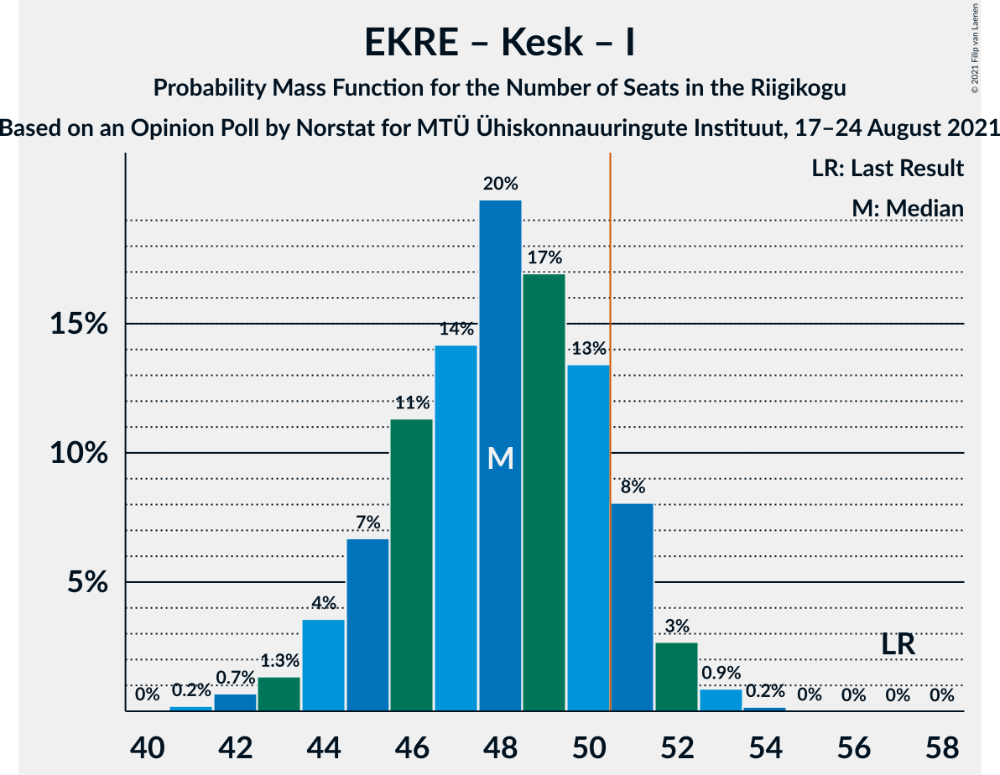

| Number of Seats | Probability | Accumulated | Special Marks |
|:---------------:|:-----------:|:-----------:|:-------------:|
| 41 | 0.2% | 100% |  |
| 42 | 0.7% | 99.8% |  |
| 43 | 1.3% | 99.1% |  |
| 44 | 4% | 98% |  |
| 45 | 7% | 94% |  |
| 46 | 11% | 87% |  |
| 47 | 14% | 76% |  |
| 48 | 20% | 62% |  |
| 49 | 17% | 42% | Median |
| 50 | 13% | 25% |  |
| 51 | 8% | 12% | Majority |
| 52 | 3% | 4% |  |
| 53 | 0.9% | 1.1% |  |
| 54 | 0.2% | 0.2% |  |
| 55 | 0% | 0% |  |
| 56 | 0% | 0% |  |
| 57 | 0% | 0% | Last Result |

### Eesti Reformierakond – Sotsiaaldemokraatlik Erakond – Erakond Isamaa

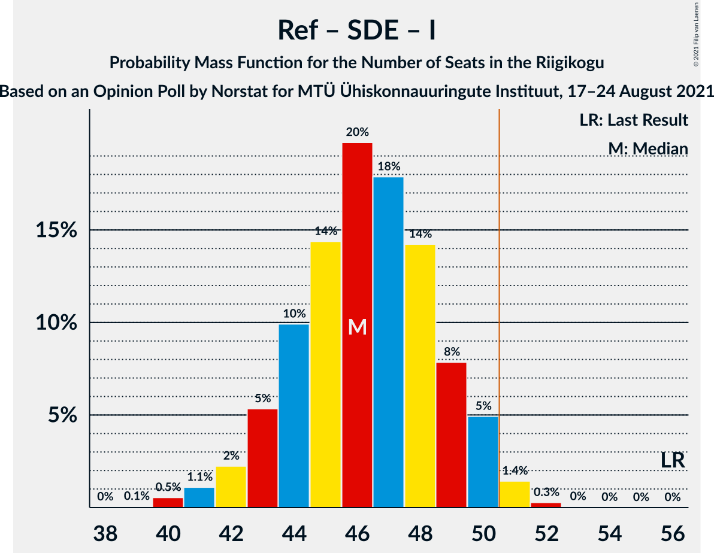

| Number of Seats | Probability | Accumulated | Special Marks |
|:---------------:|:-----------:|:-----------:|:-------------:|
| 39 | 0.1% | 100% |  |
| 40 | 0.5% | 99.9% |  |
| 41 | 1.1% | 99.4% |  |
| 42 | 2% | 98% |  |
| 43 | 5% | 96% |  |
| 44 | 10% | 91% |  |
| 45 | 14% | 81% |  |
| 46 | 20% | 66% |  |
| 47 | 18% | 47% | Median |
| 48 | 14% | 29% |  |
| 49 | 8% | 15% |  |
| 50 | 5% | 7% |  |
| 51 | 1.4% | 2% | Majority |
| 52 | 0.3% | 0.3% |  |
| 53 | 0% | 0.1% |  |
| 54 | 0% | 0% |  |
| 55 | 0% | 0% |  |
| 56 | 0% | 0% | Last Result |

### Eesti Konservatiivne Rahvaerakond – Eesti Keskerakond

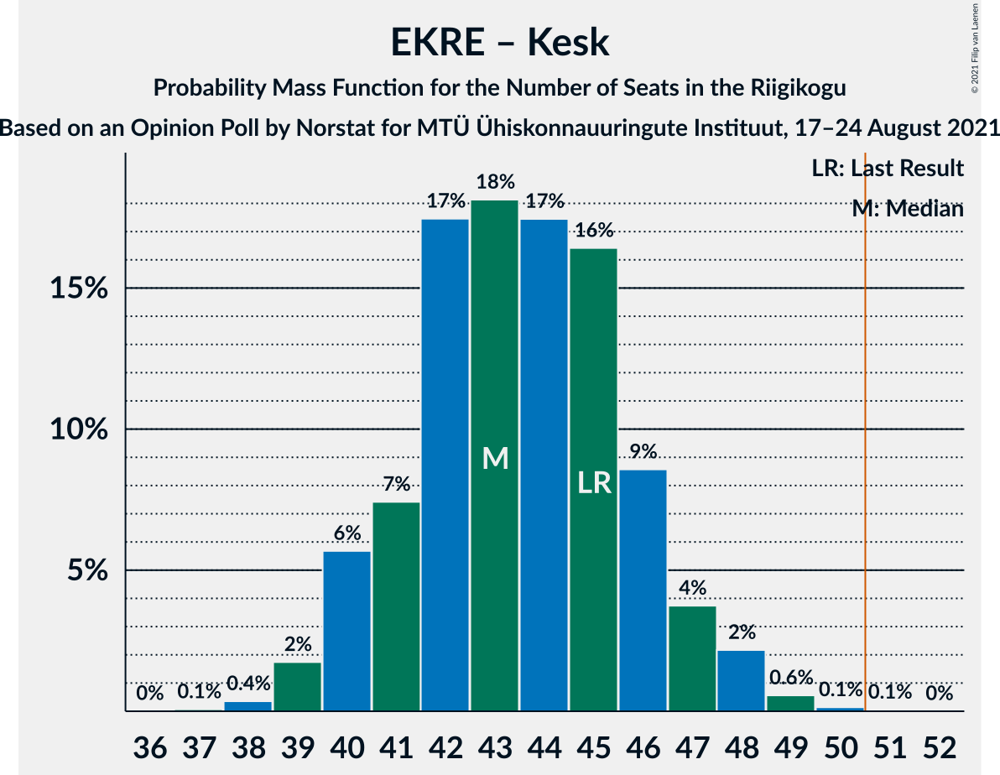

| Number of Seats | Probability | Accumulated | Special Marks |
|:---------------:|:-----------:|:-----------:|:-------------:|
| 37 | 0.1% | 100% |  |
| 38 | 0.4% | 99.9% |  |
| 39 | 2% | 99.6% |  |
| 40 | 6% | 98% |  |
| 41 | 7% | 92% |  |
| 42 | 17% | 85% |  |
| 43 | 18% | 67% |  |
| 44 | 17% | 49% | Median |
| 45 | 16% | 32% | Last Result |
| 46 | 9% | 15% |  |
| 47 | 4% | 7% |  |
| 48 | 2% | 3% |  |
| 49 | 0.6% | 0.8% |  |
| 50 | 0.1% | 0.2% |  |
| 51 | 0.1% | 0.1% | Majority |
| 52 | 0% | 0% |  |

### Eesti Reformierakond – Sotsiaaldemokraatlik Erakond

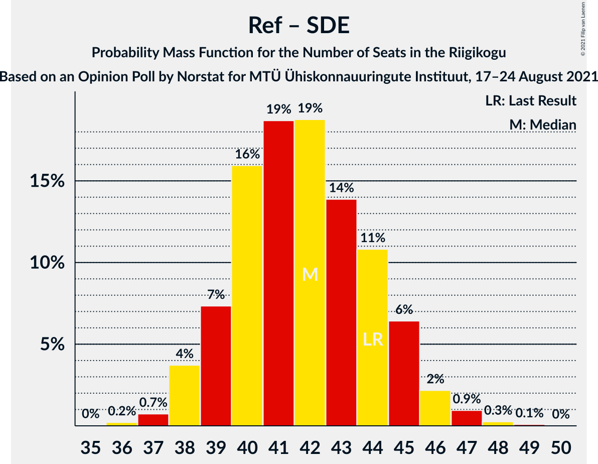

| Number of Seats | Probability | Accumulated | Special Marks |
|:---------------:|:-----------:|:-----------:|:-------------:|
| 36 | 0.2% | 100% |  |
| 37 | 0.7% | 99.7% |  |
| 38 | 4% | 99.0% |  |
| 39 | 7% | 95% |  |
| 40 | 16% | 88% |  |
| 41 | 19% | 72% |  |
| 42 | 19% | 53% | Median |
| 43 | 14% | 35% |  |
| 44 | 11% | 21% | Last Result |
| 45 | 6% | 10% |  |
| 46 | 2% | 3% |  |
| 47 | 0.9% | 1.3% |  |
| 48 | 0.3% | 0.4% |  |
| 49 | 0.1% | 0.1% |  |
| 50 | 0% | 0% |  |

### Eesti Reformierakond – Erakond Isamaa

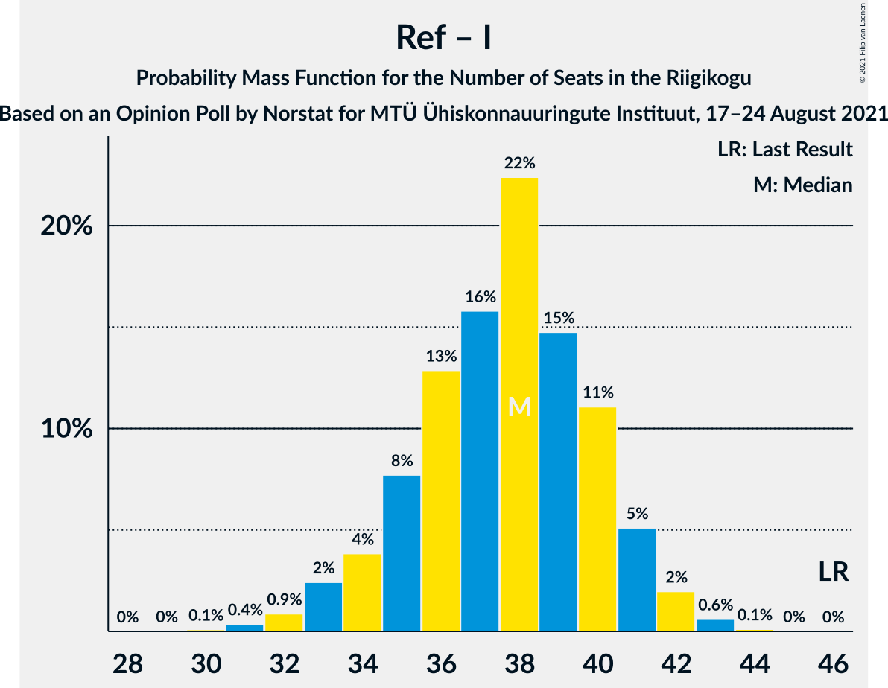

| Number of Seats | Probability | Accumulated | Special Marks |
|:---------------:|:-----------:|:-----------:|:-------------:|
| 30 | 0.1% | 100% |  |
| 31 | 0.4% | 99.9% |  |
| 32 | 0.9% | 99.5% |  |
| 33 | 2% | 98.7% |  |
| 34 | 4% | 96% |  |
| 35 | 8% | 92% |  |
| 36 | 13% | 85% |  |
| 37 | 16% | 72% |  |
| 38 | 22% | 56% | Median |
| 39 | 15% | 34% |  |
| 40 | 11% | 19% |  |
| 41 | 5% | 8% |  |
| 42 | 2% | 3% |  |
| 43 | 0.6% | 0.7% |  |
| 44 | 0.1% | 0.1% |  |
| 45 | 0% | 0% |  |
| 46 | 0% | 0% | Last Result |

### Eesti Konservatiivne Rahvaerakond – Sotsiaaldemokraatlik Erakond

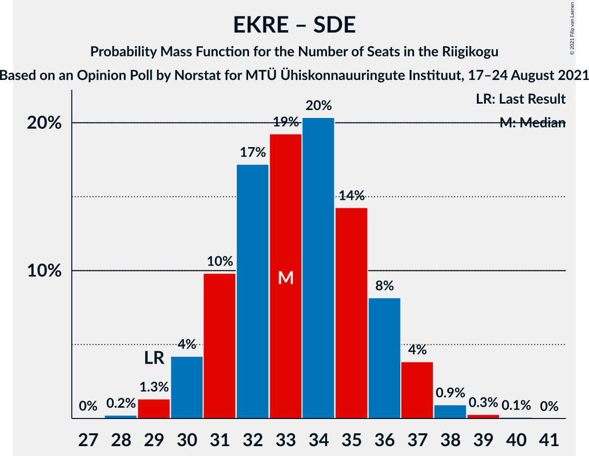

| Number of Seats | Probability | Accumulated | Special Marks |
|:---------------:|:-----------:|:-----------:|:-------------:|
| 28 | 0.2% | 100% |  |
| 29 | 1.3% | 99.7% | Last Result |
| 30 | 4% | 98% |  |
| 31 | 10% | 94% |  |
| 32 | 17% | 84% |  |
| 33 | 19% | 67% |  |
| 34 | 20% | 48% | Median |
| 35 | 14% | 28% |  |
| 36 | 8% | 13% |  |
| 37 | 4% | 5% |  |
| 38 | 0.9% | 1.3% |  |
| 39 | 0.3% | 0.4% |  |
| 40 | 0.1% | 0.1% |  |
| 41 | 0% | 0% |  |

### Eesti Keskerakond – Sotsiaaldemokraatlik Erakond – Erakond Isamaa

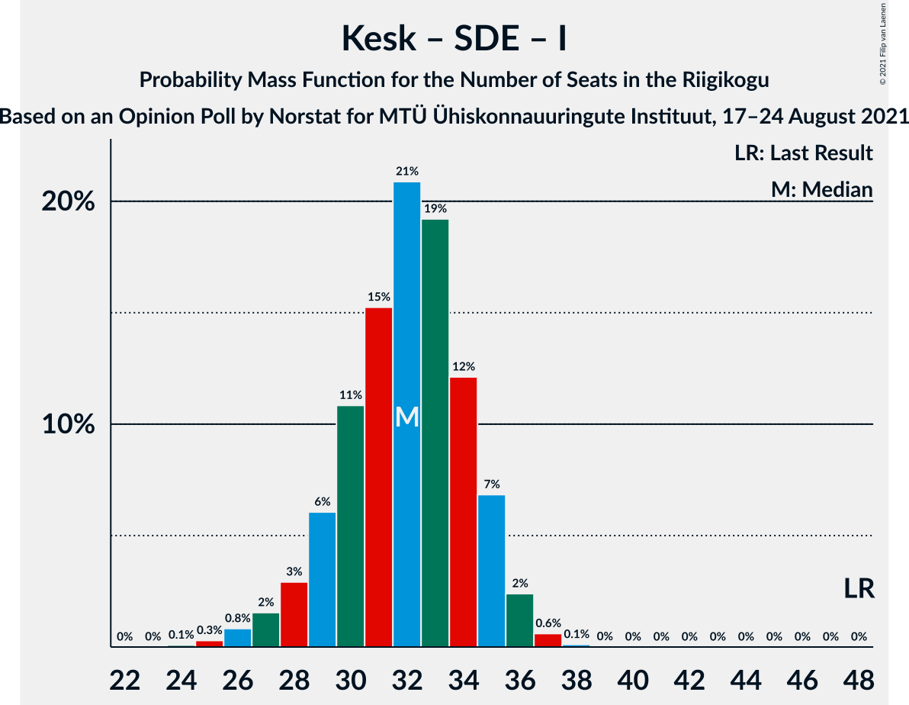

| Number of Seats | Probability | Accumulated | Special Marks |
|:---------------:|:-----------:|:-----------:|:-------------:|
| 24 | 0.1% | 100% |  |
| 25 | 0.3% | 99.9% |  |
| 26 | 0.8% | 99.6% |  |
| 27 | 2% | 98.8% |  |
| 28 | 3% | 97% |  |
| 29 | 6% | 94% |  |
| 30 | 11% | 88% |  |
| 31 | 15% | 77% |  |
| 32 | 21% | 62% |  |
| 33 | 19% | 41% | Median |
| 34 | 12% | 22% |  |
| 35 | 7% | 10% |  |
| 36 | 2% | 3% |  |
| 37 | 0.6% | 0.7% |  |
| 38 | 0.1% | 0.1% |  |
| 39 | 0% | 0% |  |
| 40 | 0% | 0% |  |
| 41 | 0% | 0% |  |
| 42 | 0% | 0% |  |
| 43 | 0% | 0% |  |
| 44 | 0% | 0% |  |
| 45 | 0% | 0% |  |
| 46 | 0% | 0% |  |
| 47 | 0% | 0% |  |
| 48 | 0% | 0% | Last Result |

### Eesti Keskerakond – Sotsiaaldemokraatlik Erakond

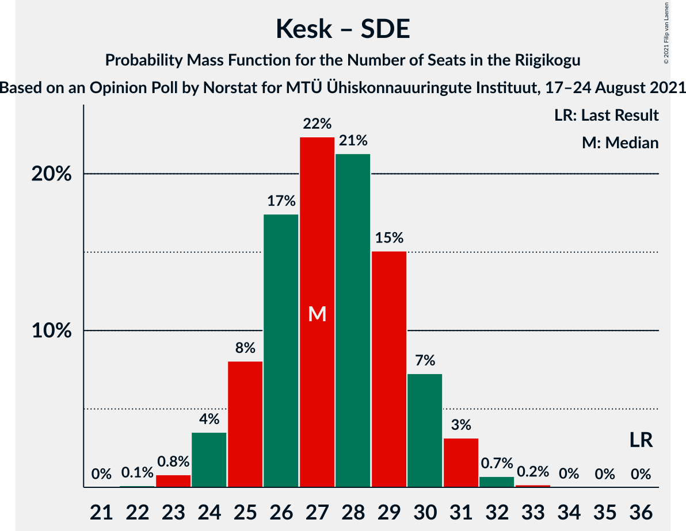

| Number of Seats | Probability | Accumulated | Special Marks |
|:---------------:|:-----------:|:-----------:|:-------------:|
| 22 | 0.1% | 100% |  |
| 23 | 0.8% | 99.9% |  |
| 24 | 4% | 99.1% |  |
| 25 | 8% | 96% |  |
| 26 | 17% | 87% |  |
| 27 | 22% | 70% |  |
| 28 | 21% | 48% | Median |
| 29 | 15% | 26% |  |
| 30 | 7% | 11% |  |
| 31 | 3% | 4% |  |
| 32 | 0.7% | 0.9% |  |
| 33 | 0.2% | 0.2% |  |
| 34 | 0% | 0% |  |
| 35 | 0% | 0% |  |
| 36 | 0% | 0% | Last Result |

## Technical Information

### Opinion Poll

+ **Polling firm:** Norstat
+ **Commissioner(s):** MTÜ Ühiskonnauuringute Instituut
+ **Fieldwork period:** 17–24 August 2021

### Calculations

+ **Sample size:** 1000
+ **Simulations done:** 1,048,576
+ **Error estimate:** 0.90%

