# Opinion Poll by Norstat for MTÜ Ühiskonnauuringute Instituut, 25–31 August 2021

<a href="#voting-intentions">Voting Intentions</a> | <a href="#seats">Seats</a> | <a href="#coalitions">Coalitions</a> | <a href="#technical-information">Technical Information</a>

## Voting Intentions

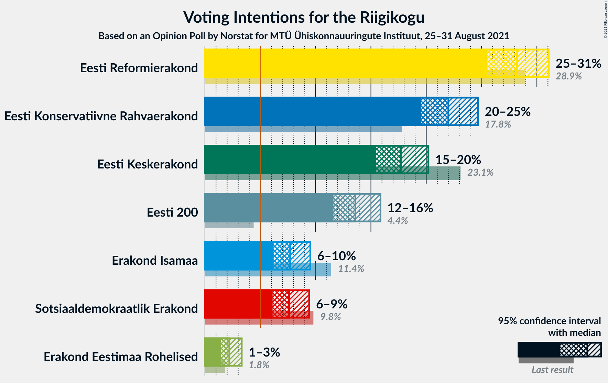

### Confidence Intervals

| Party | Last Result | Poll Result | 80% Confidence Interval | 90% Confidence Interval | 95% Confidence Interval | 99% Confidence Interval |
|:-----:|:-----------:|:-----------:|:-----------------------:|:-----------------------:|:-----------------------:|:-----------------------:|
| Eesti Reformierakond | 28.9% | 28.2% | 26.4–30.1% |25.9–30.6% |25.5–31.1% |24.7–32.0% |
| Eesti Konservatiivne Rahvaerakond | 17.8% | 22.0% | 20.4–23.7% |19.9–24.2% |19.5–24.7% |18.8–25.5% |
| Eesti Keskerakond | 23.1% | 17.7% | 16.2–19.3% |15.8–19.8% |15.5–20.2% |14.8–21.0% |
| Eesti 200 | 4.4% | 13.6% | 12.3–15.1% |11.9–15.5% |11.6–15.9% |11.0–16.6% |
| Erakond Isamaa | 11.4% | 7.7% | 6.7–8.9% |6.4–9.2% |6.2–9.5% |5.8–10.1% |
| Sotsiaaldemokraatlik Erakond | 9.8% | 7.6% | 6.6–8.8% |6.3–9.1% |6.1–9.4% |5.7–10.0% |
| Erakond Eestimaa Rohelised | 1.8% | 2.2% | 1.7–2.9% |1.6–3.1% |1.4–3.3% |1.2–3.7% |

*Note:* The poll result column reflects the actual value used in the calculations. Published results may vary slightly, and in addition be rounded to fewer digits.

## Seats

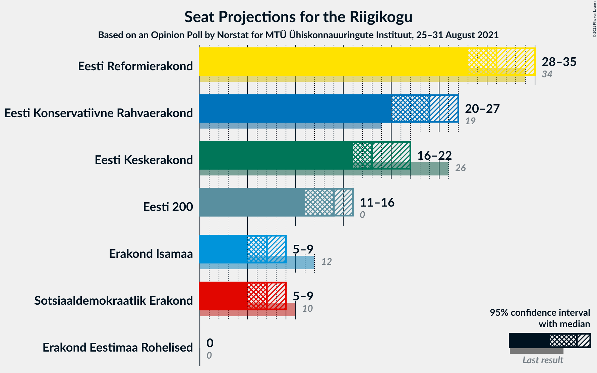

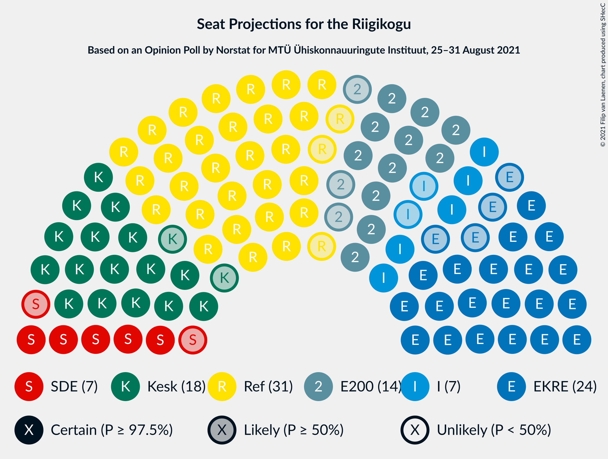

### Confidence Intervals

| Party | Last Result | Median | 80% Confidence Interval | 90% Confidence Interval | 95% Confidence Interval | 99% Confidence Interval |
|:-----:|:-----------:|:------:|:-----------------------:|:-----------------------:|:-----------------------:|:-----------------------:|
| <a href="#eesti-reformierakond">Eesti Reformierakond</a> | 34 | 31 | 29–33 |28–34 |28–35 |26–36 |
| <a href="#eesti-konservatiivne-rahvaerakond">Eesti Konservatiivne Rahvaerakond</a> | 19 | 24 | 21–26 |21–26 |20–27 |20–28 |
| <a href="#eesti-keskerakond">Eesti Keskerakond</a> | 26 | 18 | 17–21 |16–21 |16–22 |15–22 |
| <a href="#eesti-200">Eesti 200</a> | 0 | 14 | 12–15 |12–16 |11–16 |10–17 |
| <a href="#erakond-isamaa">Erakond Isamaa</a> | 12 | 7 | 6–8 |6–9 |5–9 |5–10 |
| <a href="#sotsiaaldemokraatlik-erakond">Sotsiaaldemokraatlik Erakond</a> | 10 | 7 | 6–8 |5–9 |5–9 |5–10 |
| <a href="#erakond-eestimaa-rohelised">Erakond Eestimaa Rohelised</a> | 0 | 0 | 0 |0 |0 |0 |

### Eesti Reformierakond

*For a full overview of the results for this party, see the [Eesti Reformierakond](party-eestireformierakond.html) page.*

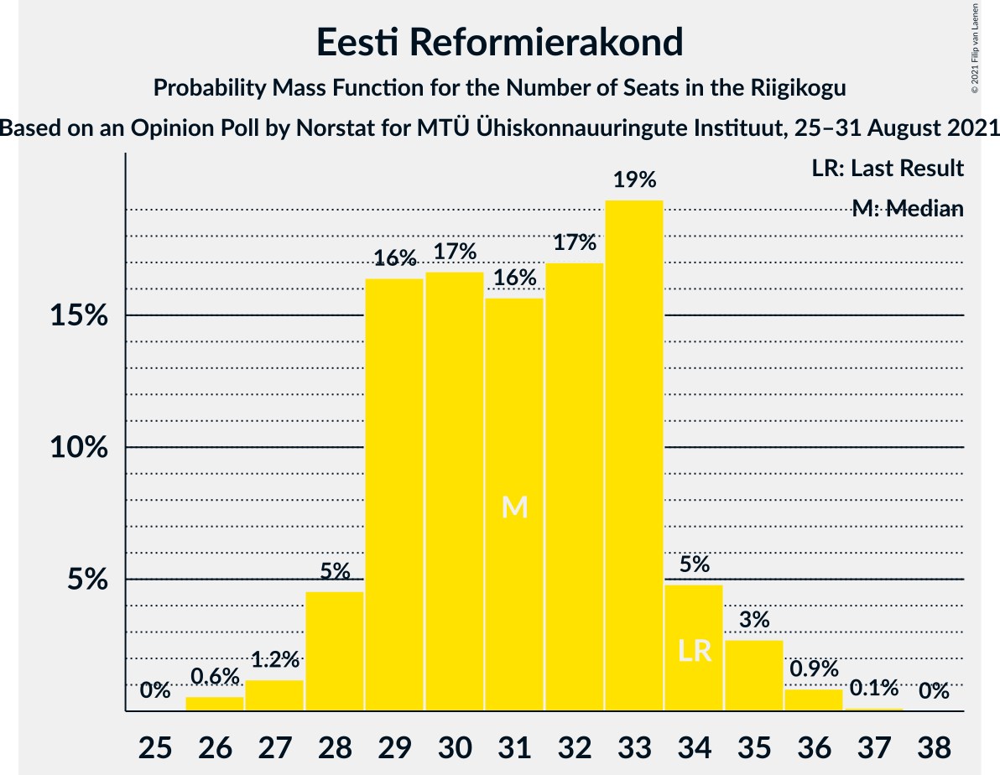

| Number of Seats | Probability | Accumulated | Special Marks |
|:---------------:|:-----------:|:-----------:|:-------------:|
| 26 | 0.6% | 100% |  |
| 27 | 1.2% | 99.4% |  |
| 28 | 5% | 98% |  |
| 29 | 16% | 94% |  |
| 30 | 17% | 77% |  |
| 31 | 16% | 61% | Median |
| 32 | 17% | 45% |  |
| 33 | 19% | 28% |  |
| 34 | 5% | 9% | Last Result |
| 35 | 3% | 4% |  |
| 36 | 0.9% | 1.0% |  |
| 37 | 0.1% | 0.1% |  |
| 38 | 0% | 0% |  |

### Eesti Konservatiivne Rahvaerakond

*For a full overview of the results for this party, see the [Eesti Konservatiivne Rahvaerakond](party-eestikonservatiivnerahvaerakond.html) page.*

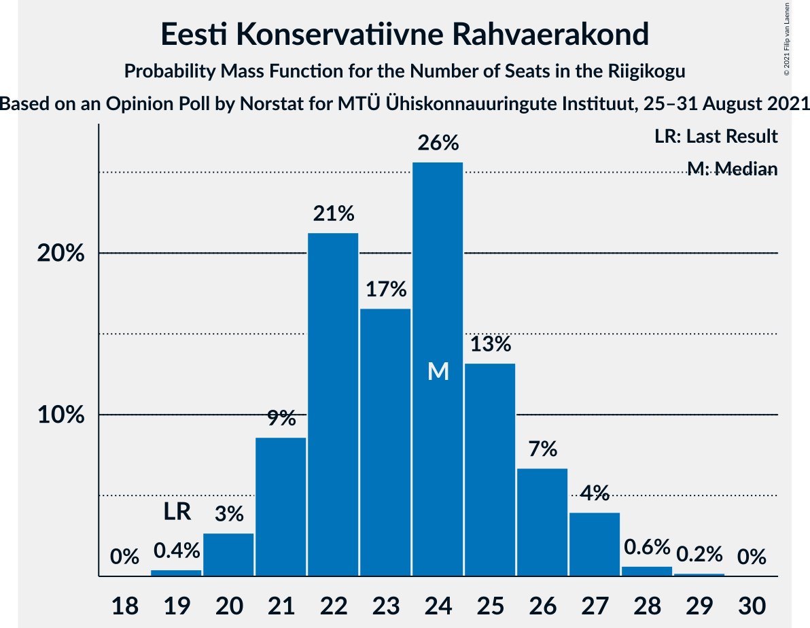

| Number of Seats | Probability | Accumulated | Special Marks |
|:---------------:|:-----------:|:-----------:|:-------------:|
| 19 | 0.4% | 100% | Last Result |
| 20 | 3% | 99.5% |  |
| 21 | 9% | 97% |  |
| 22 | 21% | 88% |  |
| 23 | 17% | 67% |  |
| 24 | 26% | 50% | Median |
| 25 | 13% | 25% |  |
| 26 | 7% | 12% |  |
| 27 | 4% | 5% |  |
| 28 | 0.6% | 0.9% |  |
| 29 | 0.2% | 0.2% |  |
| 30 | 0% | 0% |  |

### Eesti Keskerakond

*For a full overview of the results for this party, see the [Eesti Keskerakond](party-eestikeskerakond.html) page.*

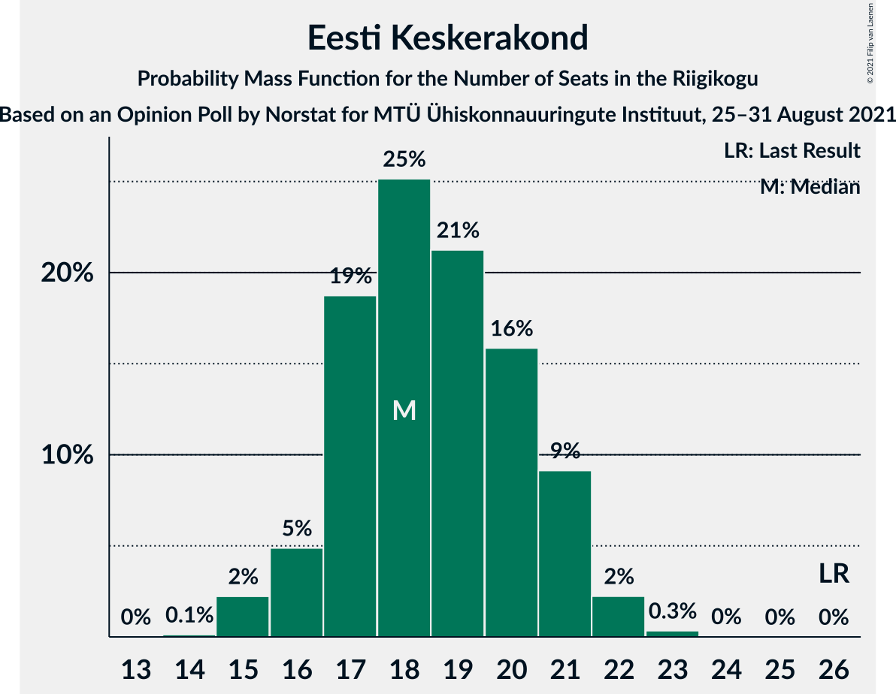

| Number of Seats | Probability | Accumulated | Special Marks |
|:---------------:|:-----------:|:-----------:|:-------------:|
| 14 | 0.1% | 100% |  |
| 15 | 2% | 99.9% |  |
| 16 | 5% | 98% |  |
| 17 | 19% | 93% |  |
| 18 | 25% | 74% | Median |
| 19 | 21% | 49% |  |
| 20 | 16% | 28% |  |
| 21 | 9% | 12% |  |
| 22 | 2% | 3% |  |
| 23 | 0.3% | 0.4% |  |
| 24 | 0% | 0% |  |
| 25 | 0% | 0% |  |
| 26 | 0% | 0% | Last Result |

### Eesti 200

*For a full overview of the results for this party, see the [Eesti 200](party-eesti200.html) page.*

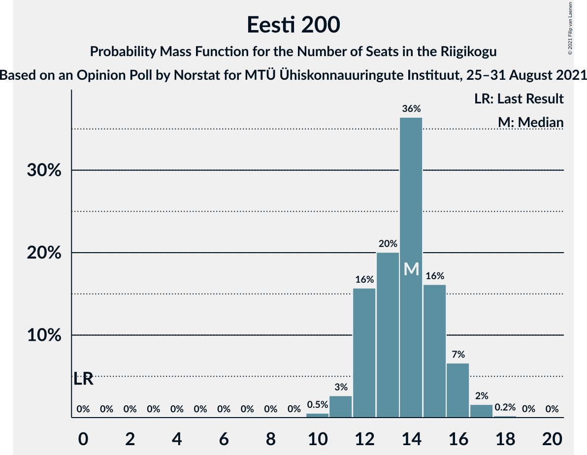

| Number of Seats | Probability | Accumulated | Special Marks |
|:---------------:|:-----------:|:-----------:|:-------------:|
| 0 | 0% | 100% | Last Result |
| 1 | 0% | 100% |  |
| 2 | 0% | 100% |  |
| 3 | 0% | 100% |  |
| 4 | 0% | 100% |  |
| 5 | 0% | 100% |  |
| 6 | 0% | 100% |  |
| 7 | 0% | 100% |  |
| 8 | 0% | 100% |  |
| 9 | 0% | 100% |  |
| 10 | 0.5% | 100% |  |
| 11 | 3% | 99.4% |  |
| 12 | 16% | 97% |  |
| 13 | 20% | 81% |  |
| 14 | 36% | 61% | Median |
| 15 | 16% | 25% |  |
| 16 | 7% | 8% |  |
| 17 | 2% | 2% |  |
| 18 | 0.2% | 0.2% |  |
| 19 | 0% | 0% |  |

### Erakond Isamaa

*For a full overview of the results for this party, see the [Erakond Isamaa](party-erakondisamaa.html) page.*

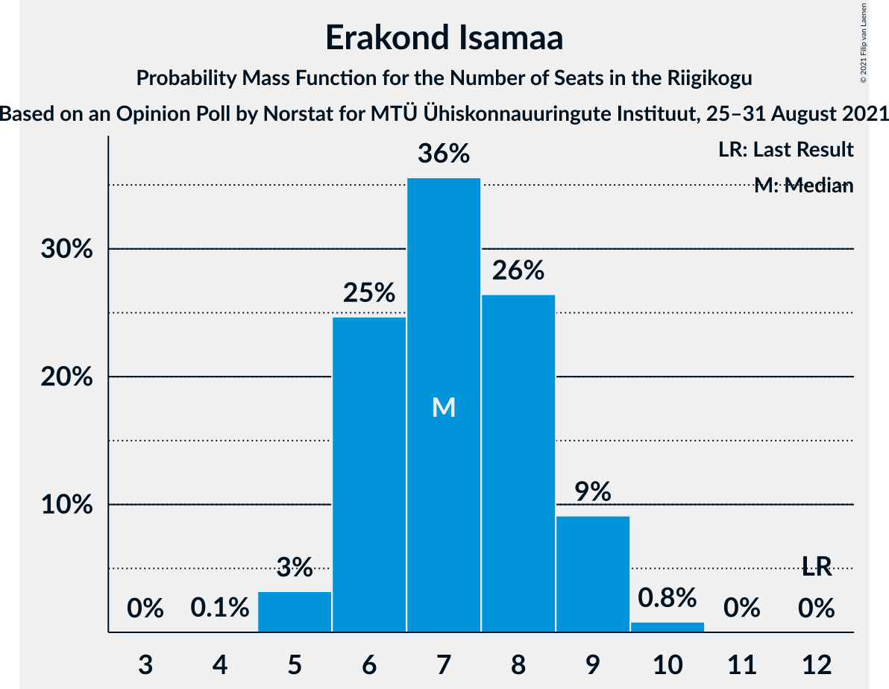

| Number of Seats | Probability | Accumulated | Special Marks |
|:---------------:|:-----------:|:-----------:|:-------------:|
| 4 | 0.1% | 100% |  |
| 5 | 3% | 99.9% |  |
| 6 | 25% | 97% |  |
| 7 | 36% | 72% | Median |
| 8 | 26% | 36% |  |
| 9 | 9% | 10% |  |
| 10 | 0.8% | 0.9% |  |
| 11 | 0% | 0% |  |
| 12 | 0% | 0% | Last Result |

### Sotsiaaldemokraatlik Erakond

*For a full overview of the results for this party, see the [Sotsiaaldemokraatlik Erakond](party-sotsiaaldemokraatlikerakond.html) page.*

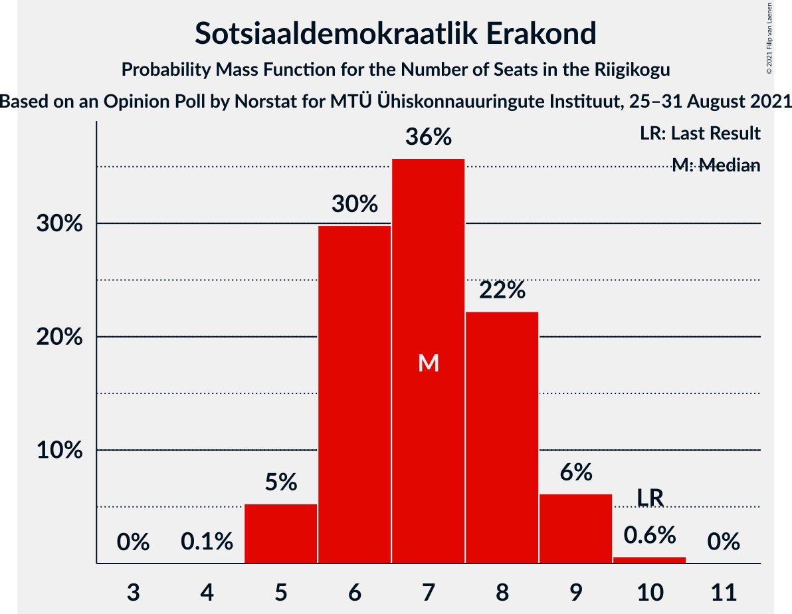

| Number of Seats | Probability | Accumulated | Special Marks |
|:---------------:|:-----------:|:-----------:|:-------------:|
| 4 | 0.1% | 100% |  |
| 5 | 5% | 99.9% |  |
| 6 | 30% | 95% |  |
| 7 | 36% | 65% | Median |
| 8 | 22% | 29% |  |
| 9 | 6% | 7% |  |
| 10 | 0.6% | 0.7% | Last Result |
| 11 | 0% | 0% |  |

### Erakond Eestimaa Rohelised

*For a full overview of the results for this party, see the [Erakond Eestimaa Rohelised](party-erakondeestimaarohelised.html) page.*

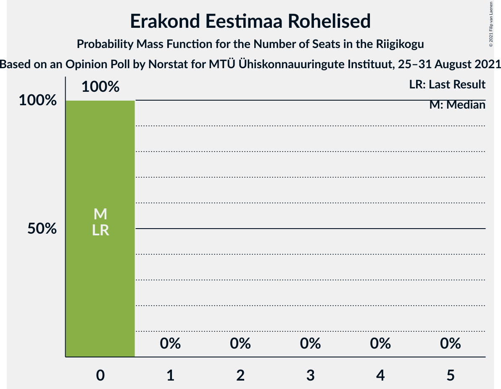

| Number of Seats | Probability | Accumulated | Special Marks |
|:---------------:|:-----------:|:-----------:|:-------------:|
| 0 | 100% | 100% | Last Result, Median |

## Coalitions

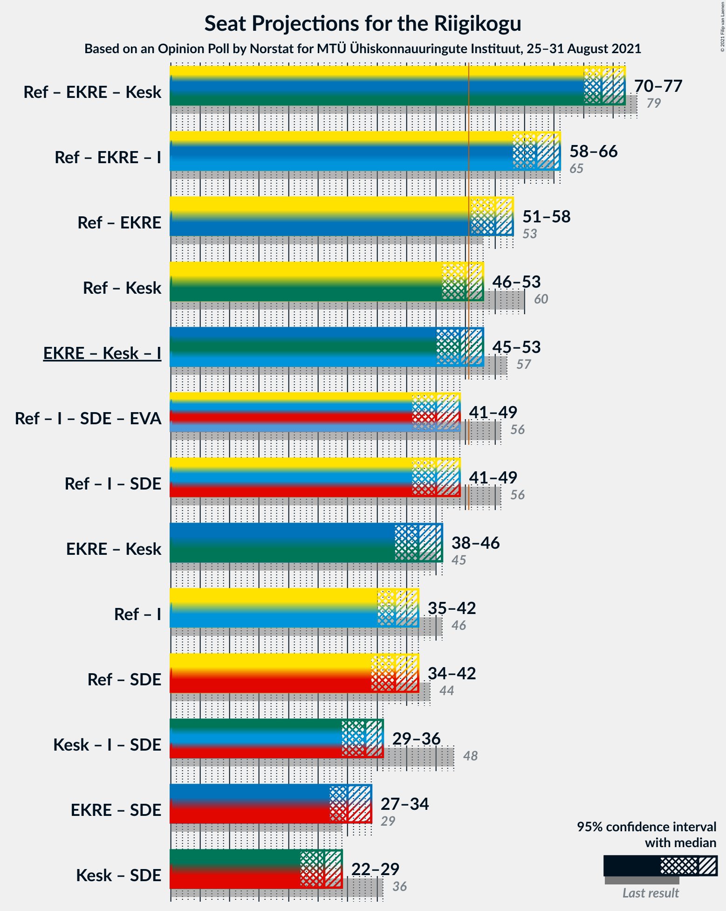

### Confidence Intervals

| Coalition | Last Result | Median | Majority? | 80% Confidence Interval | 90% Confidence Interval | 95% Confidence Interval | 99% Confidence Interval |
|:---------:|:-----------:|:------:|:---------:|:-----------------------:|:-----------------------:|:-----------------------:|:-----------------------:|
| Eesti Reformierakond – Eesti Konservatiivne Rahvaerakond – Eesti Keskerakond | 79 | 73 | 100% | 71–75 | 70–76 | 70–77 | 69–77 |
| Eesti Reformierakond – Eesti Konservatiivne Rahvaerakond – Erakond Isamaa | 65 | 62 | 100% | 59–64 | 59–65 | 58–66 | 57–66 |
| Eesti Reformierakond – Eesti Konservatiivne Rahvaerakond | 53 | 55 | 99.2% | 52–57 | 52–58 | 51–58 | 50–59 |
| Eesti Reformierakond – Eesti Keskerakond | 60 | 50 | 33% | 47–52 | 47–53 | 46–53 | 45–54 |
| Eesti Konservatiivne Rahvaerakond – Eesti Keskerakond – Erakond Isamaa | 57 | 49 | 28% | 47–52 | 46–52 | 45–53 | 44–54 |
| Eesti Reformierakond – Erakond Isamaa – Sotsiaaldemokraatlik Erakond | 56 | 45 | 0.2% | 43–48 | 42–48 | 41–49 | 40–50 |
| Eesti Konservatiivne Rahvaerakond – Eesti Keskerakond | 45 | 42 | 0% | 39–45 | 39–46 | 38–46 | 37–47 |
| Eesti Reformierakond – Erakond Isamaa | 46 | 38 | 0% | 36–41 | 35–42 | 35–42 | 34–43 |
| Eesti Reformierakond – Sotsiaaldemokraatlik Erakond | 44 | 38 | 0% | 36–41 | 35–41 | 34–42 | 33–43 |
| Eesti Keskerakond – Erakond Isamaa – Sotsiaaldemokraatlik Erakond | 48 | 33 | 0% | 30–35 | 30–36 | 29–36 | 28–37 |
| Eesti Konservatiivne Rahvaerakond – Sotsiaaldemokraatlik Erakond | 29 | 30 | 0% | 28–33 | 28–34 | 27–34 | 26–35 |
| Eesti Keskerakond – Sotsiaaldemokraatlik Erakond | 36 | 26 | 0% | 23–28 | 23–29 | 22–29 | 21–30 |

### Eesti Reformierakond – Eesti Konservatiivne Rahvaerakond – Eesti Keskerakond

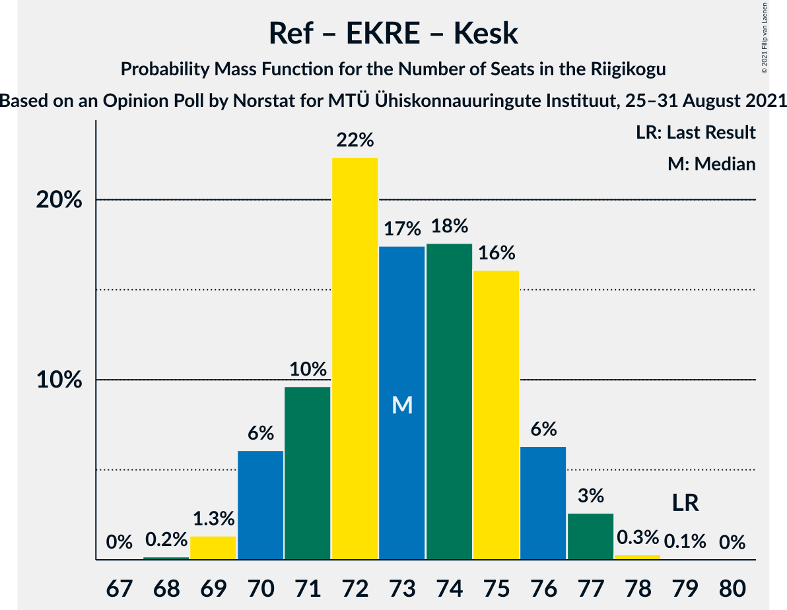

| Number of Seats | Probability | Accumulated | Special Marks |
|:---------------:|:-----------:|:-----------:|:-------------:|
| 68 | 0.2% | 100% |  |
| 69 | 1.3% | 99.8% |  |
| 70 | 6% | 98% |  |
| 71 | 10% | 92% |  |
| 72 | 22% | 83% |  |
| 73 | 17% | 60% | Median |
| 74 | 18% | 43% |  |
| 75 | 16% | 25% |  |
| 76 | 6% | 9% |  |
| 77 | 3% | 3% |  |
| 78 | 0.3% | 0.4% |  |
| 79 | 0.1% | 0.1% | Last Result |
| 80 | 0% | 0% |  |

### Eesti Reformierakond – Eesti Konservatiivne Rahvaerakond – Erakond Isamaa

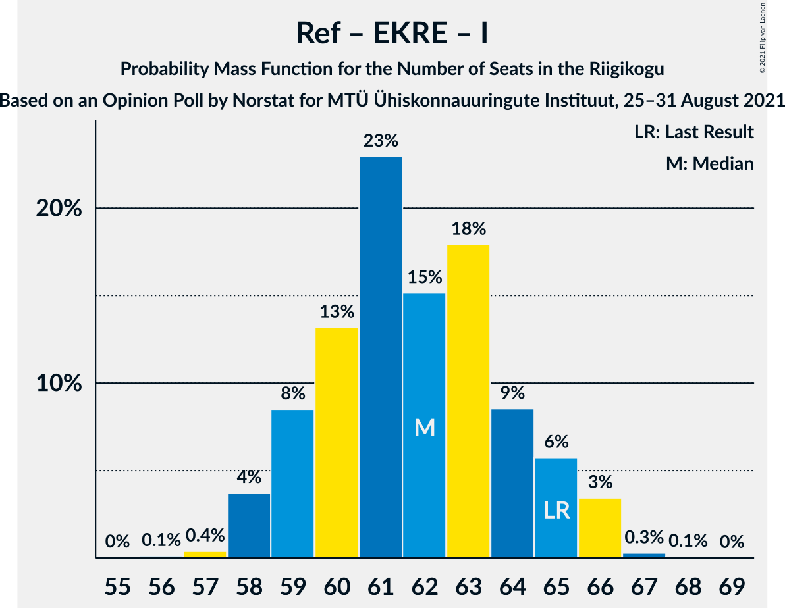

| Number of Seats | Probability | Accumulated | Special Marks |
|:---------------:|:-----------:|:-----------:|:-------------:|
| 56 | 0.1% | 100% |  |
| 57 | 0.4% | 99.8% |  |
| 58 | 4% | 99.5% |  |
| 59 | 8% | 96% |  |
| 60 | 13% | 87% |  |
| 61 | 23% | 74% |  |
| 62 | 15% | 51% | Median |
| 63 | 18% | 36% |  |
| 64 | 9% | 18% |  |
| 65 | 6% | 10% | Last Result |
| 66 | 3% | 4% |  |
| 67 | 0.3% | 0.4% |  |
| 68 | 0.1% | 0.1% |  |
| 69 | 0% | 0% |  |

### Eesti Reformierakond – Eesti Konservatiivne Rahvaerakond

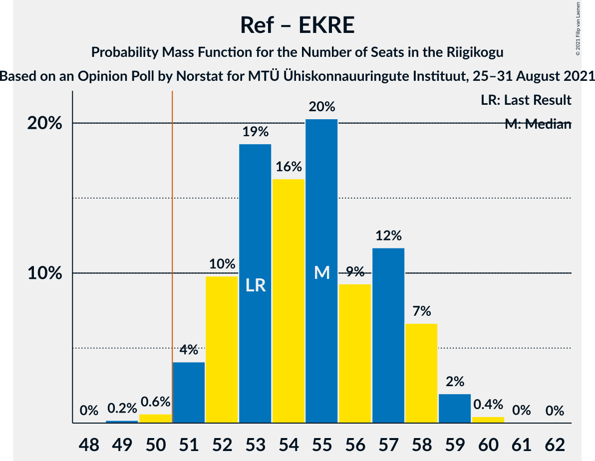

| Number of Seats | Probability | Accumulated | Special Marks |
|:---------------:|:-----------:|:-----------:|:-------------:|
| 49 | 0.2% | 100% |  |
| 50 | 0.6% | 99.8% |  |
| 51 | 4% | 99.2% | Majority |
| 52 | 10% | 95% |  |
| 53 | 19% | 85% | Last Result |
| 54 | 16% | 67% |  |
| 55 | 20% | 50% | Median |
| 56 | 9% | 30% |  |
| 57 | 12% | 21% |  |
| 58 | 7% | 9% |  |
| 59 | 2% | 2% |  |
| 60 | 0.4% | 0.5% |  |
| 61 | 0% | 0.1% |  |
| 62 | 0% | 0% |  |

### Eesti Reformierakond – Eesti Keskerakond

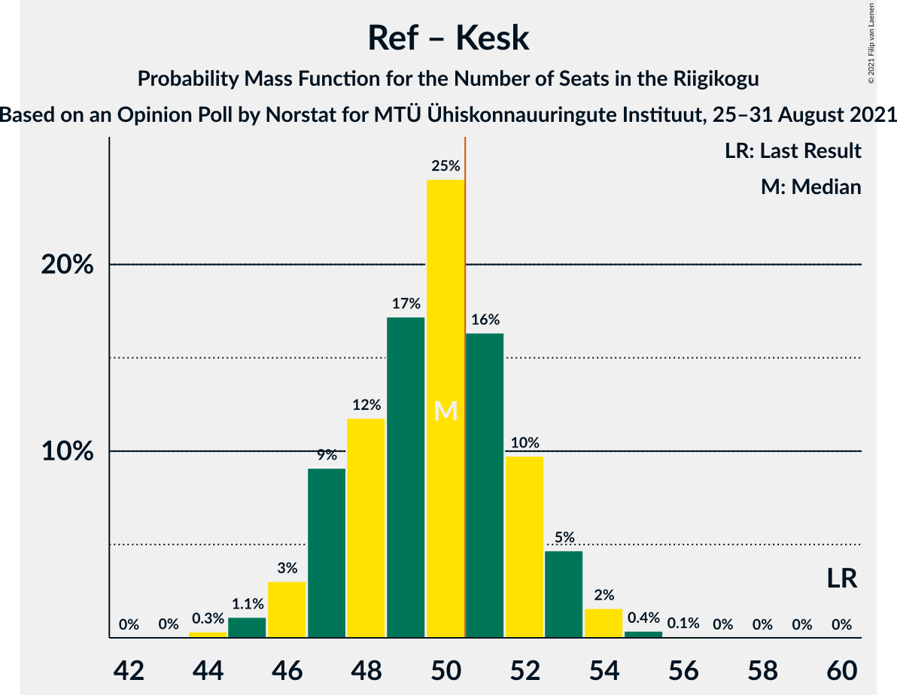

| Number of Seats | Probability | Accumulated | Special Marks |
|:---------------:|:-----------:|:-----------:|:-------------:|
| 44 | 0.3% | 100% |  |
| 45 | 1.1% | 99.6% |  |
| 46 | 3% | 98.5% |  |
| 47 | 9% | 95% |  |
| 48 | 12% | 86% |  |
| 49 | 17% | 75% | Median |
| 50 | 25% | 57% |  |
| 51 | 16% | 33% | Majority |
| 52 | 10% | 16% |  |
| 53 | 5% | 7% |  |
| 54 | 2% | 2% |  |
| 55 | 0.4% | 0.5% |  |
| 56 | 0.1% | 0.1% |  |
| 57 | 0% | 0% |  |
| 58 | 0% | 0% |  |
| 59 | 0% | 0% |  |
| 60 | 0% | 0% | Last Result |

### Eesti Konservatiivne Rahvaerakond – Eesti Keskerakond – Erakond Isamaa

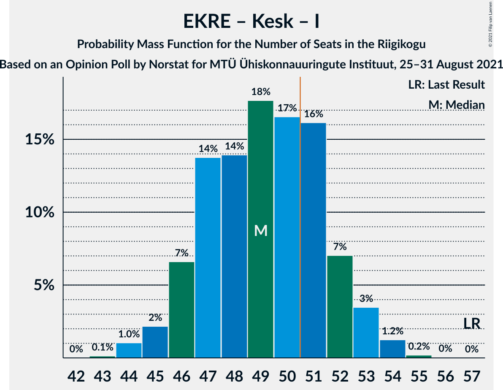

| Number of Seats | Probability | Accumulated | Special Marks |
|:---------------:|:-----------:|:-----------:|:-------------:|
| 43 | 0.1% | 100% |  |
| 44 | 1.0% | 99.9% |  |
| 45 | 2% | 98.8% |  |
| 46 | 7% | 97% |  |
| 47 | 14% | 90% |  |
| 48 | 14% | 76% |  |
| 49 | 18% | 62% | Median |
| 50 | 17% | 45% |  |
| 51 | 16% | 28% | Majority |
| 52 | 7% | 12% |  |
| 53 | 3% | 5% |  |
| 54 | 1.2% | 1.5% |  |
| 55 | 0.2% | 0.2% |  |
| 56 | 0% | 0.1% |  |
| 57 | 0% | 0% | Last Result |

### Eesti Reformierakond – Erakond Isamaa – Sotsiaaldemokraatlik Erakond

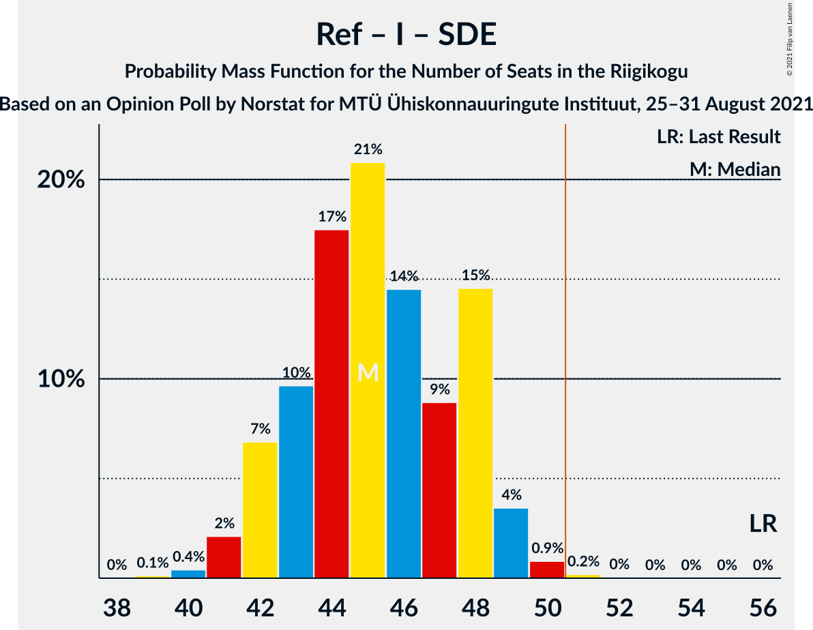

| Number of Seats | Probability | Accumulated | Special Marks |
|:---------------:|:-----------:|:-----------:|:-------------:|
| 39 | 0.1% | 100% |  |
| 40 | 0.4% | 99.9% |  |
| 41 | 2% | 99.4% |  |
| 42 | 7% | 97% |  |
| 43 | 10% | 90% |  |
| 44 | 17% | 81% |  |
| 45 | 21% | 63% | Median |
| 46 | 14% | 42% |  |
| 47 | 9% | 28% |  |
| 48 | 15% | 19% |  |
| 49 | 4% | 5% |  |
| 50 | 0.9% | 1.1% |  |
| 51 | 0.2% | 0.2% | Majority |
| 52 | 0% | 0% |  |
| 53 | 0% | 0% |  |
| 54 | 0% | 0% |  |
| 55 | 0% | 0% |  |
| 56 | 0% | 0% | Last Result |

### Eesti Konservatiivne Rahvaerakond – Eesti Keskerakond

| Number of Seats | Probability | Accumulated | Special Marks |
|:---------------:|:-----------:|:-----------:|:-------------:|
| 36 | 0.1% | 100% |  |
| 37 | 1.0% | 99.9% |  |
| 38 | 3% | 98.9% |  |
| 39 | 11% | 96% |  |
| 40 | 9% | 85% |  |
| 41 | 17% | 76% |  |
| 42 | 18% | 58% | Median |
| 43 | 14% | 41% |  |
| 44 | 14% | 26% |  |
| 45 | 8% | 13% | Last Result |
| 46 | 4% | 5% |  |
| 47 | 0.8% | 0.9% |  |
| 48 | 0.1% | 0.1% |  |
| 49 | 0% | 0% |  |

### Eesti Reformierakond – Erakond Isamaa

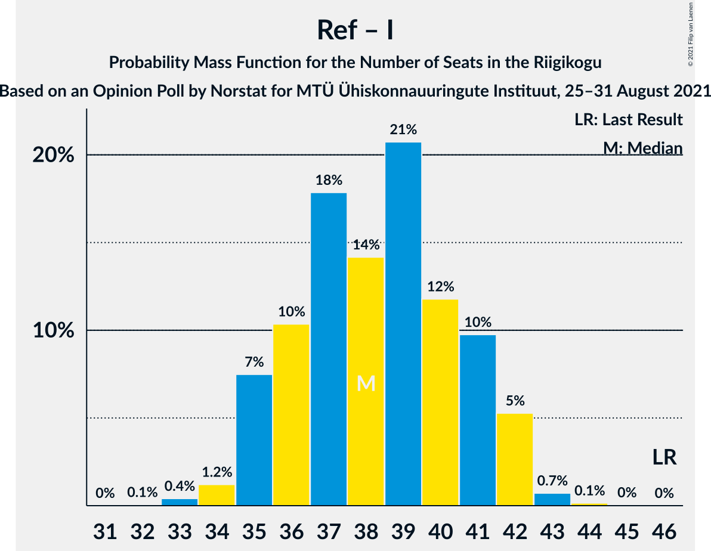

| Number of Seats | Probability | Accumulated | Special Marks |
|:---------------:|:-----------:|:-----------:|:-------------:|
| 32 | 0.1% | 100% |  |
| 33 | 0.4% | 99.9% |  |
| 34 | 1.2% | 99.5% |  |
| 35 | 7% | 98% |  |
| 36 | 10% | 91% |  |
| 37 | 18% | 80% |  |
| 38 | 14% | 63% | Median |
| 39 | 21% | 48% |  |
| 40 | 12% | 28% |  |
| 41 | 10% | 16% |  |
| 42 | 5% | 6% |  |
| 43 | 0.7% | 0.9% |  |
| 44 | 0.1% | 0.2% |  |
| 45 | 0% | 0% |  |
| 46 | 0% | 0% | Last Result |

### Eesti Reformierakond – Sotsiaaldemokraatlik Erakond

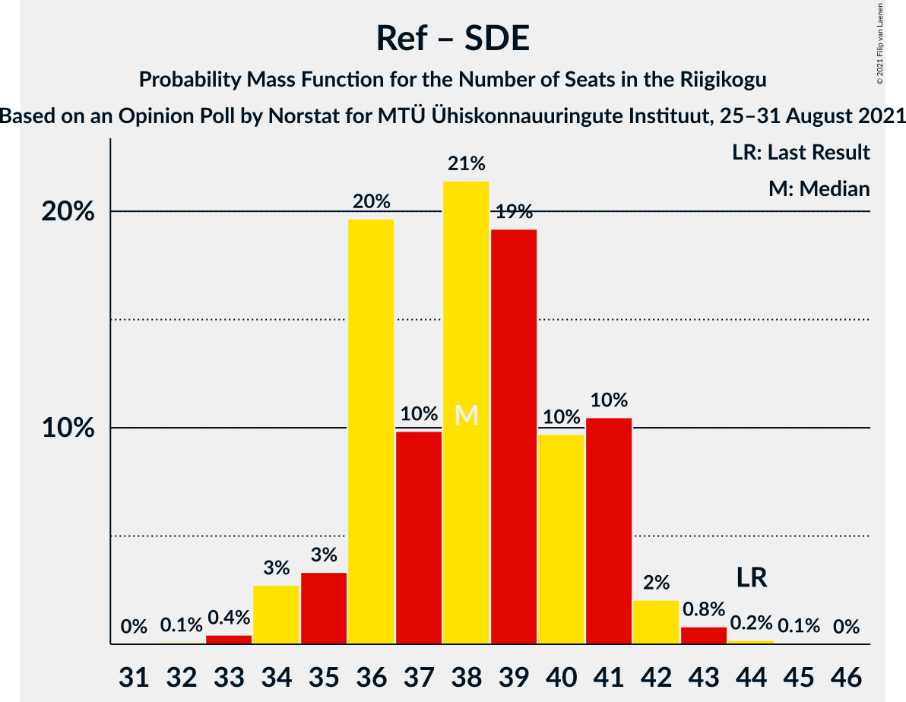

| Number of Seats | Probability | Accumulated | Special Marks |
|:---------------:|:-----------:|:-----------:|:-------------:|
| 32 | 0.1% | 100% |  |
| 33 | 0.4% | 99.9% |  |
| 34 | 3% | 99.5% |  |
| 35 | 3% | 97% |  |
| 36 | 20% | 93% |  |
| 37 | 10% | 74% |  |
| 38 | 21% | 64% | Median |
| 39 | 19% | 42% |  |
| 40 | 10% | 23% |  |
| 41 | 10% | 14% |  |
| 42 | 2% | 3% |  |
| 43 | 0.8% | 1.1% |  |
| 44 | 0.2% | 0.3% | Last Result |
| 45 | 0.1% | 0.1% |  |
| 46 | 0% | 0% |  |

### Eesti Keskerakond – Erakond Isamaa – Sotsiaaldemokraatlik Erakond

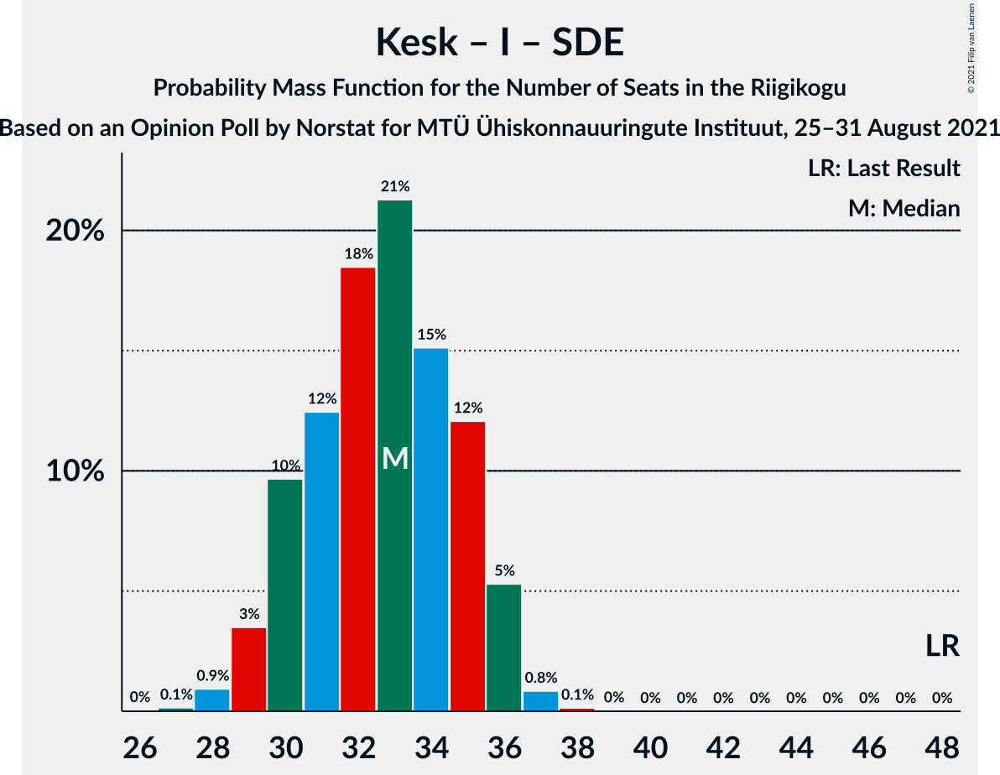

| Number of Seats | Probability | Accumulated | Special Marks |
|:---------------:|:-----------:|:-----------:|:-------------:|
| 27 | 0.1% | 100% |  |
| 28 | 0.9% | 99.8% |  |
| 29 | 3% | 98.9% |  |
| 30 | 10% | 95% |  |
| 31 | 12% | 86% |  |
| 32 | 18% | 73% | Median |
| 33 | 21% | 55% |  |
| 34 | 15% | 34% |  |
| 35 | 12% | 18% |  |
| 36 | 5% | 6% |  |
| 37 | 0.8% | 1.0% |  |
| 38 | 0.1% | 0.2% |  |
| 39 | 0% | 0% |  |
| 40 | 0% | 0% |  |
| 41 | 0% | 0% |  |
| 42 | 0% | 0% |  |
| 43 | 0% | 0% |  |
| 44 | 0% | 0% |  |
| 45 | 0% | 0% |  |
| 46 | 0% | 0% |  |
| 47 | 0% | 0% |  |
| 48 | 0% | 0% | Last Result |

### Eesti Konservatiivne Rahvaerakond – Sotsiaaldemokraatlik Erakond

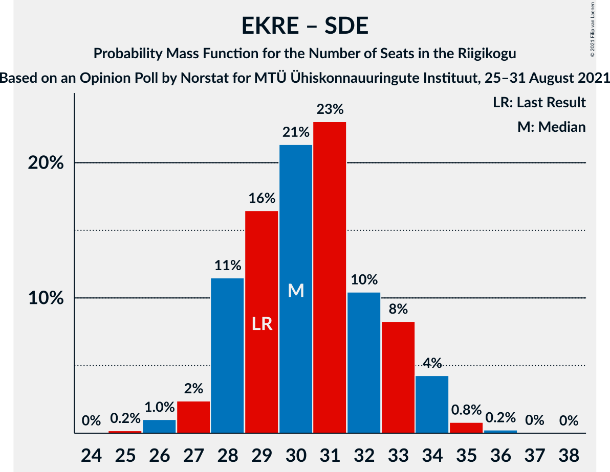

| Number of Seats | Probability | Accumulated | Special Marks |
|:---------------:|:-----------:|:-----------:|:-------------:|
| 25 | 0.2% | 100% |  |
| 26 | 1.0% | 99.8% |  |
| 27 | 2% | 98.8% |  |
| 28 | 11% | 96% |  |
| 29 | 16% | 85% | Last Result |
| 30 | 21% | 68% |  |
| 31 | 23% | 47% | Median |
| 32 | 10% | 24% |  |
| 33 | 8% | 14% |  |
| 34 | 4% | 5% |  |
| 35 | 0.8% | 1.1% |  |
| 36 | 0.2% | 0.3% |  |
| 37 | 0% | 0.1% |  |
| 38 | 0% | 0% |  |

### Eesti Keskerakond – Sotsiaaldemokraatlik Erakond

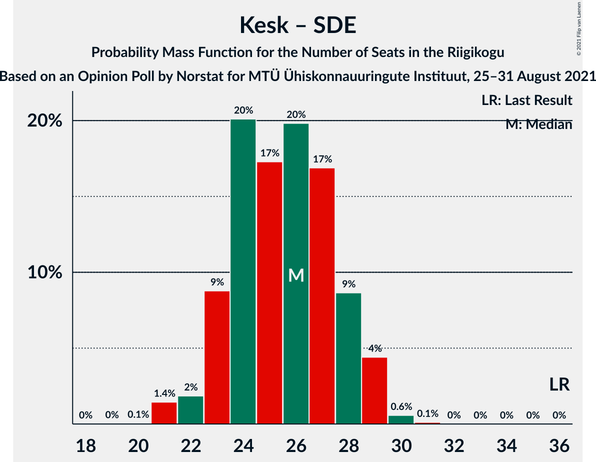

| Number of Seats | Probability | Accumulated | Special Marks |
|:---------------:|:-----------:|:-----------:|:-------------:|
| 20 | 0.1% | 100% |  |
| 21 | 1.4% | 99.9% |  |
| 22 | 2% | 98% |  |
| 23 | 9% | 97% |  |
| 24 | 20% | 88% |  |
| 25 | 17% | 68% | Median |
| 26 | 20% | 50% |  |
| 27 | 17% | 31% |  |
| 28 | 9% | 14% |  |
| 29 | 4% | 5% |  |
| 30 | 0.6% | 0.7% |  |
| 31 | 0.1% | 0.1% |  |
| 32 | 0% | 0% |  |
| 33 | 0% | 0% |  |
| 34 | 0% | 0% |  |
| 35 | 0% | 0% |  |
| 36 | 0% | 0% | Last Result |

## Technical Information

### Opinion Poll

+ **Polling firm:** Norstat
+ **Commissioner(s):** MTÜ Ühiskonnauuringute Instituut
+ **Fieldwork period:** 25–31 August 2021

### Calculations

+ **Sample size:** 1000
+ **Simulations done:** 131,072
+ **Error estimate:** 0.69%

