# Opinion Poll by Norstat for MTÜ Ühiskonnauuringute Instituut, 1–7 September 2021

<a href="#voting-intentions">Voting Intentions</a> | <a href="#seats">Seats</a> | <a href="#coalitions">Coalitions</a> | <a href="#technical-information">Technical Information</a>

## Voting Intentions

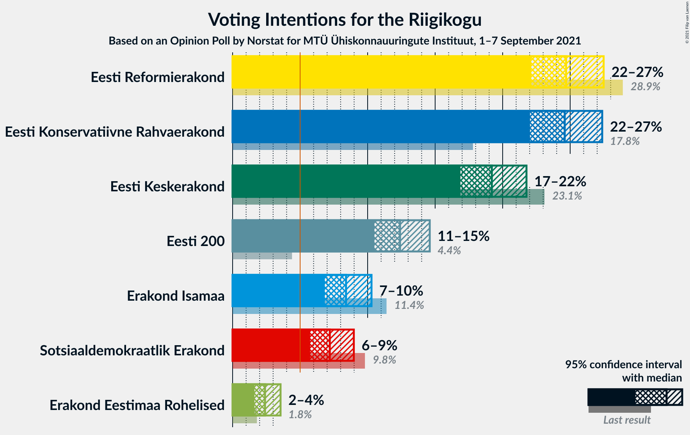

### Confidence Intervals

| Party | Last Result | Poll Result | 80% Confidence Interval | 90% Confidence Interval | 95% Confidence Interval | 99% Confidence Interval |
|:-----:|:-----------:|:-----------:|:-----------------------:|:-----------------------:|:-----------------------:|:-----------------------:|
| Eesti Reformierakond | 28.9% | 24.7% | 23.0–26.5% |22.5–27.0% |22.1–27.5% |21.3–28.3% |
| Eesti Konservatiivne Rahvaerakond | 17.8% | 24.6% | 22.9–26.4% |22.4–26.9% |22.0–27.4% |21.2–28.3% |
| Eesti Keskerakond | 23.1% | 19.2% | 17.7–20.9% |17.2–21.4% |16.9–21.8% |16.2–22.6% |
| Eesti 200 | 4.4% | 12.4% | 11.1–13.8% |10.8–14.2% |10.5–14.6% |9.9–15.3% |
| Erakond Isamaa | 11.4% | 8.4% | 7.4–9.6% |7.1–10.0% |6.8–10.3% |6.4–10.9% |
| Sotsiaaldemokraatlik Erakond | 9.8% | 7.2% | 6.2–8.4% |6.0–8.7% |5.7–9.0% |5.3–9.6% |
| Erakond Eestimaa Rohelised | 1.8% | 2.4% | 1.9–3.2% |1.7–3.4% |1.6–3.6% |1.4–3.9% |

*Note:* The poll result column reflects the actual value used in the calculations. Published results may vary slightly, and in addition be rounded to fewer digits.

## Seats

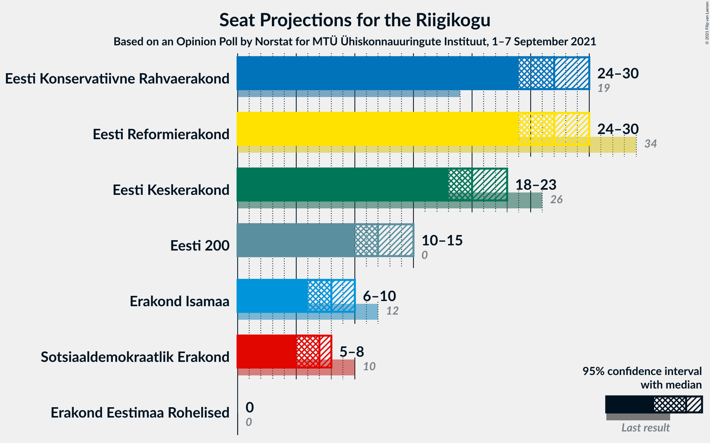

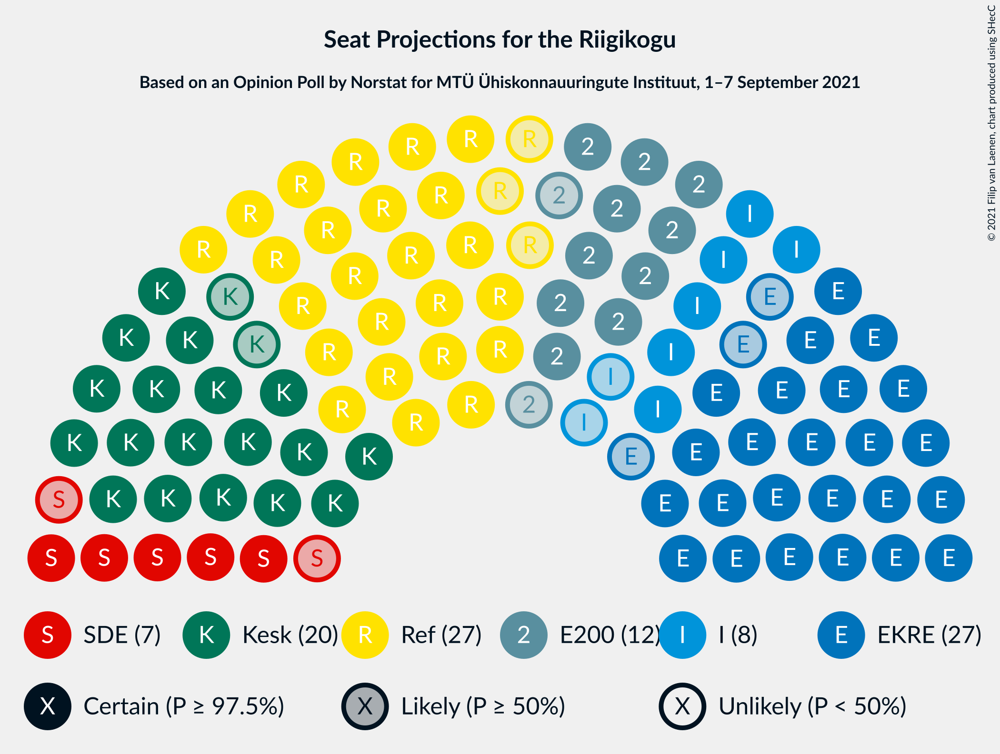

### Confidence Intervals

| Party | Last Result | Median | 80% Confidence Interval | 90% Confidence Interval | 95% Confidence Interval | 99% Confidence Interval |
|:-----:|:-----------:|:------:|:-----------------------:|:-----------------------:|:-----------------------:|:-----------------------:|
| <a href="#eesti-reformierakond">Eesti Reformierakond</a> | 34 | 27 | 25–29 |24–30 |24–30 |23–31 |
| <a href="#eesti-konservatiivne-rahvaerakond">Eesti Konservatiivne Rahvaerakond</a> | 19 | 27 | 25–29 |24–30 |24–30 |23–31 |
| <a href="#eesti-keskerakond">Eesti Keskerakond</a> | 26 | 20 | 19–22 |18–23 |18–23 |17–24 |
| <a href="#eesti-200">Eesti 200</a> | 0 | 12 | 11–14 |10–14 |10–15 |9–16 |
| <a href="#erakond-isamaa">Erakond Isamaa</a> | 12 | 8 | 7–9 |6–10 |6–10 |6–11 |
| <a href="#sotsiaaldemokraatlik-erakond">Sotsiaaldemokraatlik Erakond</a> | 10 | 7 | 6–8 |5–8 |5–8 |5–9 |
| <a href="#erakond-eestimaa-rohelised">Erakond Eestimaa Rohelised</a> | 0 | 0 | 0 |0 |0 |0 |

### Eesti Reformierakond

*For a full overview of the results for this party, see the [Eesti Reformierakond](party-eestireformierakond.html) page.*

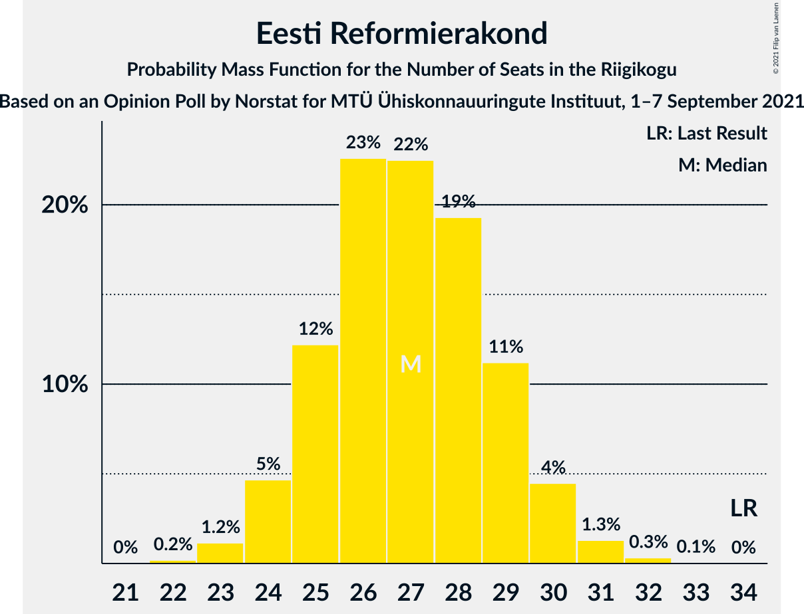

| Number of Seats | Probability | Accumulated | Special Marks |
|:---------------:|:-----------:|:-----------:|:-------------:|
| 22 | 0.2% | 100% |  |
| 23 | 1.2% | 99.8% |  |
| 24 | 5% | 98.6% |  |
| 25 | 12% | 94% |  |
| 26 | 23% | 82% |  |
| 27 | 22% | 59% | Median |
| 28 | 19% | 37% |  |
| 29 | 11% | 17% |  |
| 30 | 4% | 6% |  |
| 31 | 1.3% | 2% |  |
| 32 | 0.3% | 0.4% |  |
| 33 | 0.1% | 0.1% |  |
| 34 | 0% | 0% | Last Result |

### Eesti Konservatiivne Rahvaerakond

*For a full overview of the results for this party, see the [Eesti Konservatiivne Rahvaerakond](party-eestikonservatiivnerahvaerakond.html) page.*

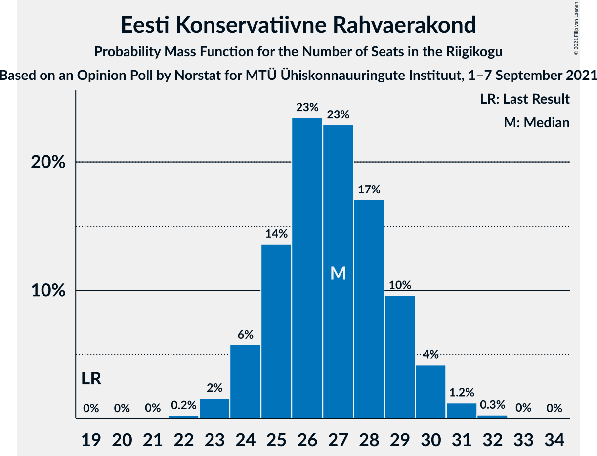

| Number of Seats | Probability | Accumulated | Special Marks |
|:---------------:|:-----------:|:-----------:|:-------------:|
| 19 | 0% | 100% | Last Result |
| 20 | 0% | 100% |  |
| 21 | 0% | 100% |  |
| 22 | 0.2% | 100% |  |
| 23 | 2% | 99.7% |  |
| 24 | 6% | 98% |  |
| 25 | 14% | 92% |  |
| 26 | 23% | 79% |  |
| 27 | 23% | 55% | Median |
| 28 | 17% | 32% |  |
| 29 | 10% | 15% |  |
| 30 | 4% | 6% |  |
| 31 | 1.2% | 2% |  |
| 32 | 0.3% | 0.3% |  |
| 33 | 0% | 0.1% |  |
| 34 | 0% | 0% |  |

### Eesti Keskerakond

*For a full overview of the results for this party, see the [Eesti Keskerakond](party-eestikeskerakond.html) page.*

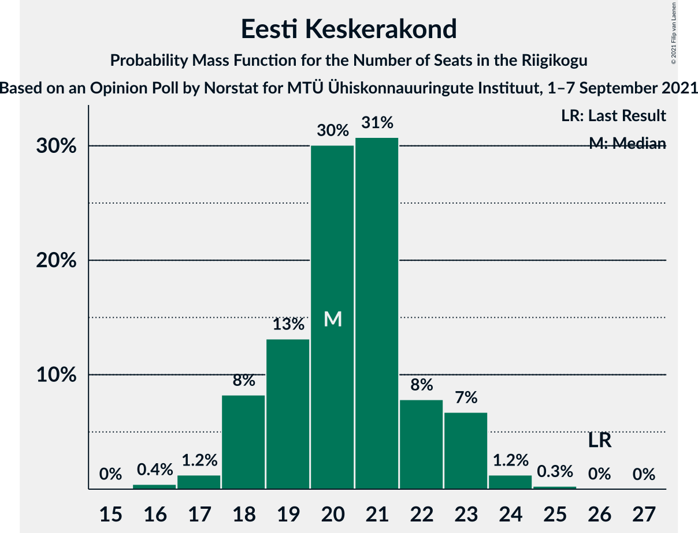

| Number of Seats | Probability | Accumulated | Special Marks |
|:---------------:|:-----------:|:-----------:|:-------------:|
| 16 | 0.4% | 100% |  |
| 17 | 1.2% | 99.5% |  |
| 18 | 8% | 98% |  |
| 19 | 13% | 90% |  |
| 20 | 30% | 77% | Median |
| 21 | 31% | 47% |  |
| 22 | 8% | 16% |  |
| 23 | 7% | 8% |  |
| 24 | 1.2% | 2% |  |
| 25 | 0.3% | 0.3% |  |
| 26 | 0% | 0.1% | Last Result |
| 27 | 0% | 0% |  |

### Eesti 200

*For a full overview of the results for this party, see the [Eesti 200](party-eesti200.html) page.*

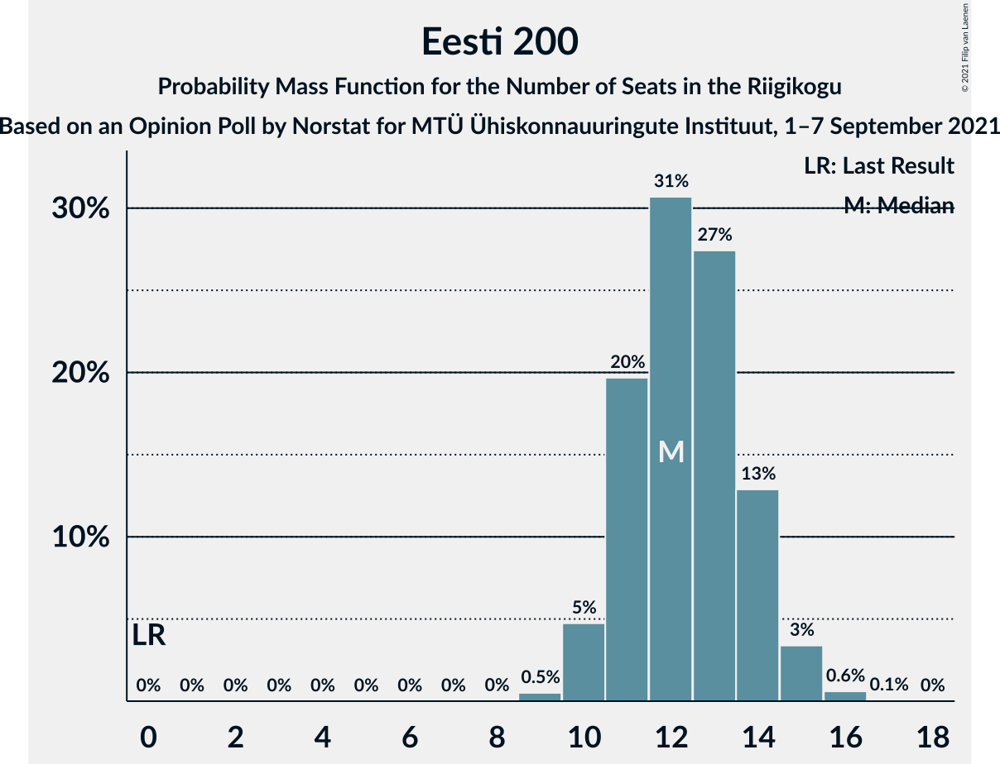

| Number of Seats | Probability | Accumulated | Special Marks |
|:---------------:|:-----------:|:-----------:|:-------------:|
| 0 | 0% | 100% | Last Result |
| 1 | 0% | 100% |  |
| 2 | 0% | 100% |  |
| 3 | 0% | 100% |  |
| 4 | 0% | 100% |  |
| 5 | 0% | 100% |  |
| 6 | 0% | 100% |  |
| 7 | 0% | 100% |  |
| 8 | 0% | 100% |  |
| 9 | 0.5% | 100% |  |
| 10 | 5% | 99.5% |  |
| 11 | 20% | 95% |  |
| 12 | 31% | 75% | Median |
| 13 | 27% | 44% |  |
| 14 | 13% | 17% |  |
| 15 | 3% | 4% |  |
| 16 | 0.6% | 0.7% |  |
| 17 | 0.1% | 0.1% |  |
| 18 | 0% | 0% |  |

### Erakond Isamaa

*For a full overview of the results for this party, see the [Erakond Isamaa](party-erakondisamaa.html) page.*

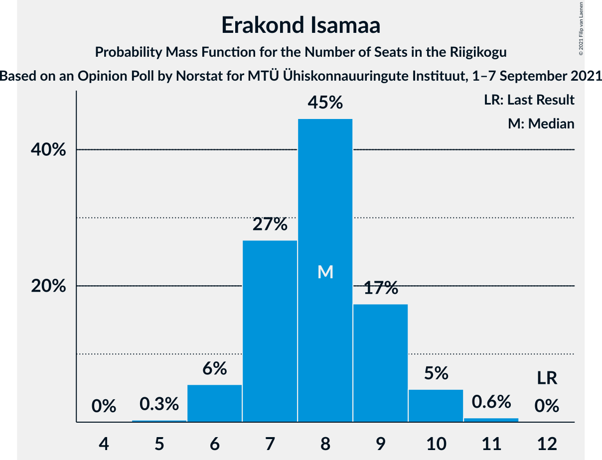

| Number of Seats | Probability | Accumulated | Special Marks |
|:---------------:|:-----------:|:-----------:|:-------------:|
| 5 | 0.3% | 100% |  |
| 6 | 6% | 99.7% |  |
| 7 | 27% | 94% |  |
| 8 | 45% | 67% | Median |
| 9 | 17% | 23% |  |
| 10 | 5% | 6% |  |
| 11 | 0.6% | 0.7% |  |
| 12 | 0% | 0% | Last Result |

### Sotsiaaldemokraatlik Erakond

*For a full overview of the results for this party, see the [Sotsiaaldemokraatlik Erakond](party-sotsiaaldemokraatlikerakond.html) page.*

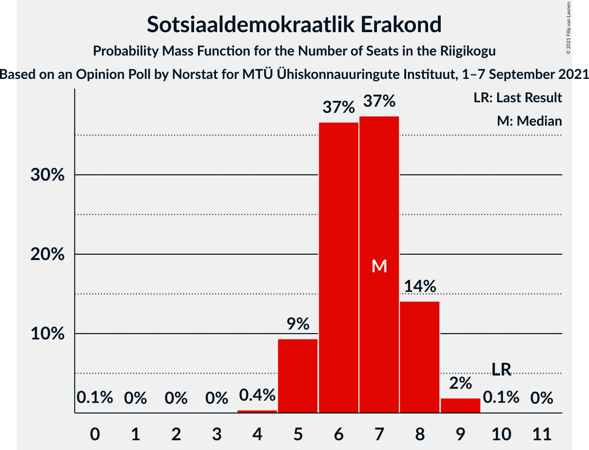

| Number of Seats | Probability | Accumulated | Special Marks |
|:---------------:|:-----------:|:-----------:|:-------------:|
| 0 | 0.1% | 100% |  |
| 1 | 0% | 99.9% |  |
| 2 | 0% | 99.9% |  |
| 3 | 0% | 99.9% |  |
| 4 | 0.4% | 99.9% |  |
| 5 | 9% | 99.5% |  |
| 6 | 37% | 90% |  |
| 7 | 37% | 54% | Median |
| 8 | 14% | 16% |  |
| 9 | 2% | 2% |  |
| 10 | 0.1% | 0.1% | Last Result |
| 11 | 0% | 0% |  |

### Erakond Eestimaa Rohelised

*For a full overview of the results for this party, see the [Erakond Eestimaa Rohelised](party-erakondeestimaarohelised.html) page.*

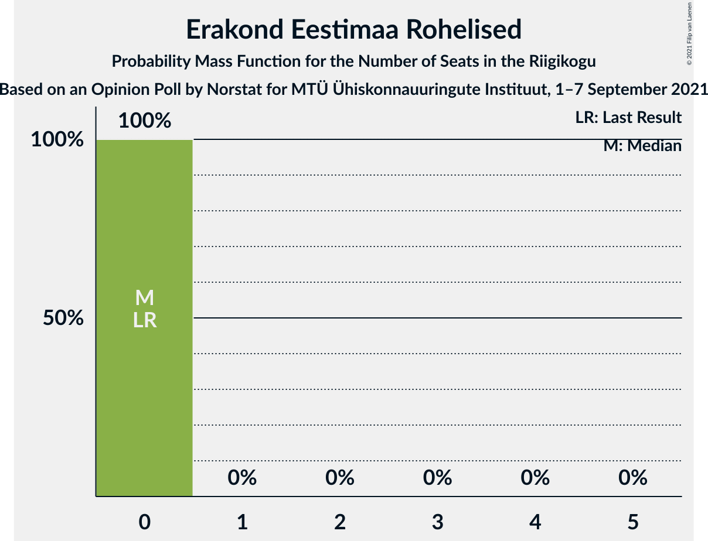

| Number of Seats | Probability | Accumulated | Special Marks |
|:---------------:|:-----------:|:-----------:|:-------------:|
| 0 | 100% | 100% | Last Result, Median |

## Coalitions

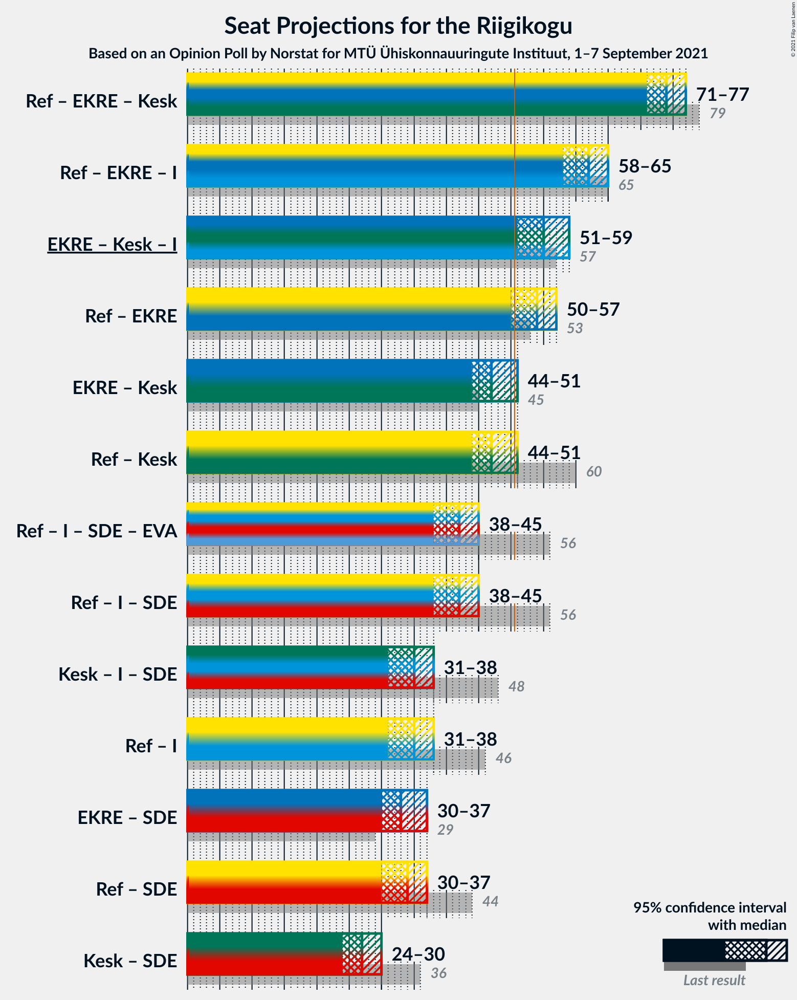

### Confidence Intervals

| Coalition | Last Result | Median | Majority? | 80% Confidence Interval | 90% Confidence Interval | 95% Confidence Interval | 99% Confidence Interval |
|:---------:|:-----------:|:------:|:---------:|:-----------------------:|:-----------------------:|:-----------------------:|:-----------------------:|
| Eesti Reformierakond – Eesti Konservatiivne Rahvaerakond – Eesti Keskerakond | 79 | 74 | 100% | 72–76 | 71–77 | 71–77 | 70–78 |
| Eesti Reformierakond – Eesti Konservatiivne Rahvaerakond – Erakond Isamaa | 65 | 62 | 100% | 60–64 | 59–65 | 58–65 | 57–67 |
| Eesti Konservatiivne Rahvaerakond – Eesti Keskerakond – Erakond Isamaa | 57 | 55 | 99.3% | 53–57 | 52–58 | 51–59 | 50–60 |
| Eesti Reformierakond – Eesti Konservatiivne Rahvaerakond | 53 | 54 | 97% | 52–56 | 51–57 | 50–57 | 49–59 |
| Eesti Konservatiivne Rahvaerakond – Eesti Keskerakond | 45 | 47 | 4% | 45–49 | 44–50 | 44–51 | 42–52 |
| Eesti Reformierakond – Eesti Keskerakond | 60 | 47 | 4% | 45–50 | 44–50 | 44–51 | 43–52 |
| Eesti Reformierakond – Erakond Isamaa – Sotsiaaldemokraatlik Erakond | 56 | 42 | 0% | 39–44 | 38–44 | 38–45 | 37–46 |
| Eesti Keskerakond – Erakond Isamaa – Sotsiaaldemokraatlik Erakond | 48 | 35 | 0% | 33–37 | 32–38 | 31–38 | 30–40 |
| Eesti Reformierakond – Erakond Isamaa | 46 | 35 | 0% | 33–37 | 32–38 | 31–38 | 30–40 |
| Eesti Konservatiivne Rahvaerakond – Sotsiaaldemokraatlik Erakond | 29 | 33 | 0% | 31–36 | 30–36 | 30–37 | 29–38 |
| Eesti Reformierakond – Sotsiaaldemokraatlik Erakond | 44 | 34 | 0% | 31–36 | 31–36 | 30–37 | 29–38 |
| Eesti Keskerakond – Sotsiaaldemokraatlik Erakond | 36 | 27 | 0% | 25–29 | 24–30 | 24–30 | 23–31 |

### Eesti Reformierakond – Eesti Konservatiivne Rahvaerakond – Eesti Keskerakond

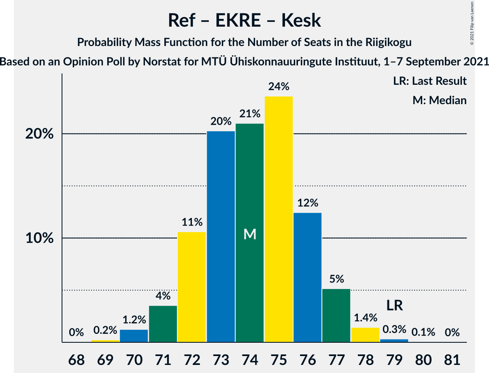

| Number of Seats | Probability | Accumulated | Special Marks |
|:---------------:|:-----------:|:-----------:|:-------------:|
| 69 | 0.2% | 100% |  |
| 70 | 1.2% | 99.7% |  |
| 71 | 4% | 98% |  |
| 72 | 11% | 95% |  |
| 73 | 20% | 84% |  |
| 74 | 21% | 64% | Median |
| 75 | 24% | 43% |  |
| 76 | 12% | 19% |  |
| 77 | 5% | 7% |  |
| 78 | 1.4% | 2% |  |
| 79 | 0.3% | 0.4% | Last Result |
| 80 | 0.1% | 0.1% |  |
| 81 | 0% | 0% |  |

### Eesti Reformierakond – Eesti Konservatiivne Rahvaerakond – Erakond Isamaa

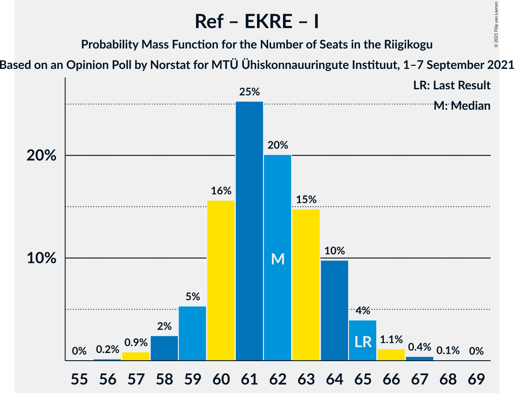

| Number of Seats | Probability | Accumulated | Special Marks |
|:---------------:|:-----------:|:-----------:|:-------------:|
| 56 | 0.2% | 100% |  |
| 57 | 0.9% | 99.8% |  |
| 58 | 2% | 98.9% |  |
| 59 | 5% | 97% |  |
| 60 | 16% | 91% |  |
| 61 | 25% | 76% |  |
| 62 | 20% | 50% | Median |
| 63 | 15% | 30% |  |
| 64 | 10% | 15% |  |
| 65 | 4% | 6% | Last Result |
| 66 | 1.1% | 2% |  |
| 67 | 0.4% | 0.5% |  |
| 68 | 0.1% | 0.1% |  |
| 69 | 0% | 0% |  |

### Eesti Konservatiivne Rahvaerakond – Eesti Keskerakond – Erakond Isamaa

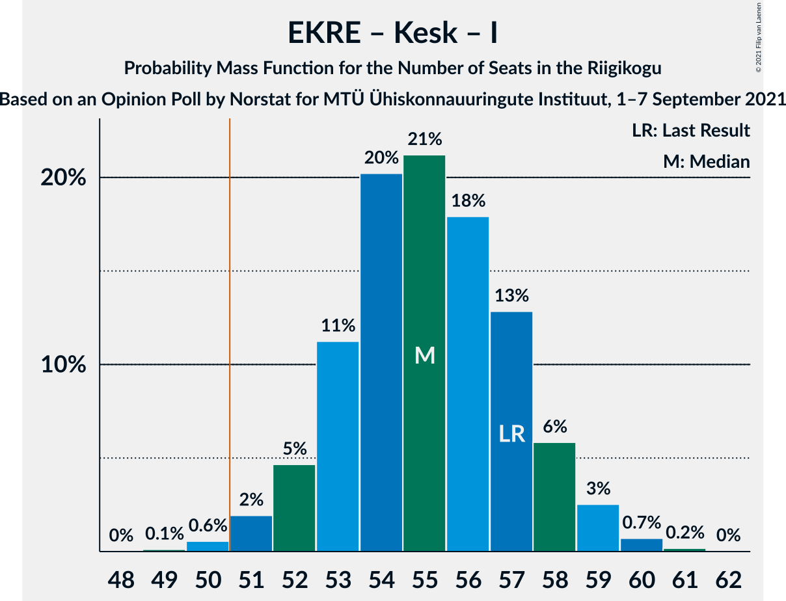

| Number of Seats | Probability | Accumulated | Special Marks |
|:---------------:|:-----------:|:-----------:|:-------------:|
| 49 | 0.1% | 100% |  |
| 50 | 0.6% | 99.9% |  |
| 51 | 2% | 99.3% | Majority |
| 52 | 5% | 97% |  |
| 53 | 11% | 93% |  |
| 54 | 20% | 81% |  |
| 55 | 21% | 61% | Median |
| 56 | 18% | 40% |  |
| 57 | 13% | 22% | Last Result |
| 58 | 6% | 9% |  |
| 59 | 3% | 3% |  |
| 60 | 0.7% | 0.9% |  |
| 61 | 0.2% | 0.2% |  |
| 62 | 0% | 0% |  |

### Eesti Reformierakond – Eesti Konservatiivne Rahvaerakond

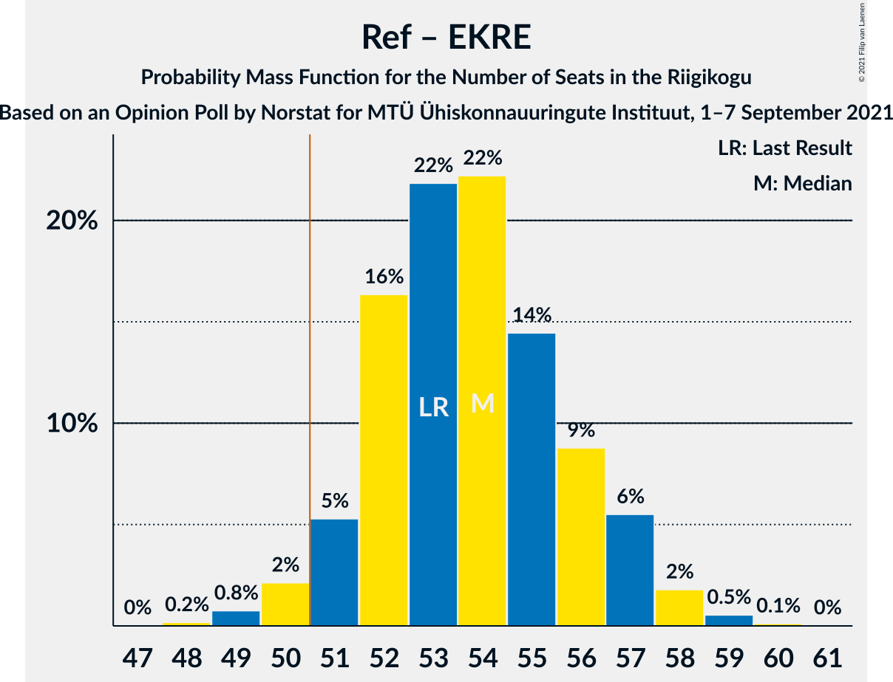

| Number of Seats | Probability | Accumulated | Special Marks |
|:---------------:|:-----------:|:-----------:|:-------------:|
| 48 | 0.2% | 100% |  |
| 49 | 0.8% | 99.8% |  |
| 50 | 2% | 99.0% |  |
| 51 | 5% | 97% | Majority |
| 52 | 16% | 92% |  |
| 53 | 22% | 75% | Last Result |
| 54 | 22% | 53% | Median |
| 55 | 14% | 31% |  |
| 56 | 9% | 17% |  |
| 57 | 6% | 8% |  |
| 58 | 2% | 2% |  |
| 59 | 0.5% | 0.7% |  |
| 60 | 0.1% | 0.1% |  |
| 61 | 0% | 0% |  |

### Eesti Konservatiivne Rahvaerakond – Eesti Keskerakond

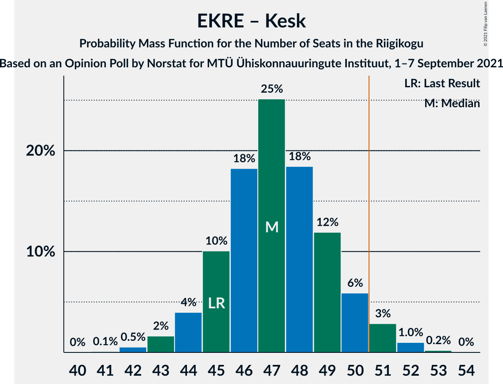

| Number of Seats | Probability | Accumulated | Special Marks |
|:---------------:|:-----------:|:-----------:|:-------------:|
| 41 | 0.1% | 100% |  |
| 42 | 0.5% | 99.9% |  |
| 43 | 2% | 99.4% |  |
| 44 | 4% | 98% |  |
| 45 | 10% | 94% | Last Result |
| 46 | 18% | 84% |  |
| 47 | 25% | 65% | Median |
| 48 | 18% | 40% |  |
| 49 | 12% | 22% |  |
| 50 | 6% | 10% |  |
| 51 | 3% | 4% | Majority |
| 52 | 1.0% | 1.2% |  |
| 53 | 0.2% | 0.2% |  |
| 54 | 0% | 0% |  |

### Eesti Reformierakond – Eesti Keskerakond

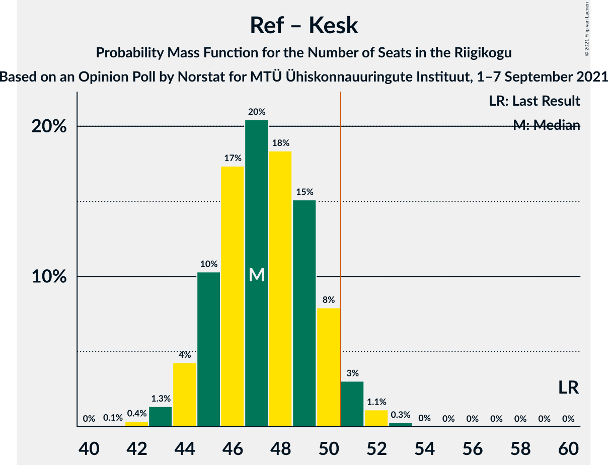

| Number of Seats | Probability | Accumulated | Special Marks |
|:---------------:|:-----------:|:-----------:|:-------------:|
| 41 | 0.1% | 100% |  |
| 42 | 0.4% | 99.9% |  |
| 43 | 1.3% | 99.6% |  |
| 44 | 4% | 98% |  |
| 45 | 10% | 94% |  |
| 46 | 17% | 84% |  |
| 47 | 20% | 66% | Median |
| 48 | 18% | 46% |  |
| 49 | 15% | 28% |  |
| 50 | 8% | 12% |  |
| 51 | 3% | 4% | Majority |
| 52 | 1.1% | 1.4% |  |
| 53 | 0.3% | 0.3% |  |
| 54 | 0% | 0.1% |  |
| 55 | 0% | 0% |  |
| 56 | 0% | 0% |  |
| 57 | 0% | 0% |  |
| 58 | 0% | 0% |  |
| 59 | 0% | 0% |  |
| 60 | 0% | 0% | Last Result |

### Eesti Reformierakond – Erakond Isamaa – Sotsiaaldemokraatlik Erakond

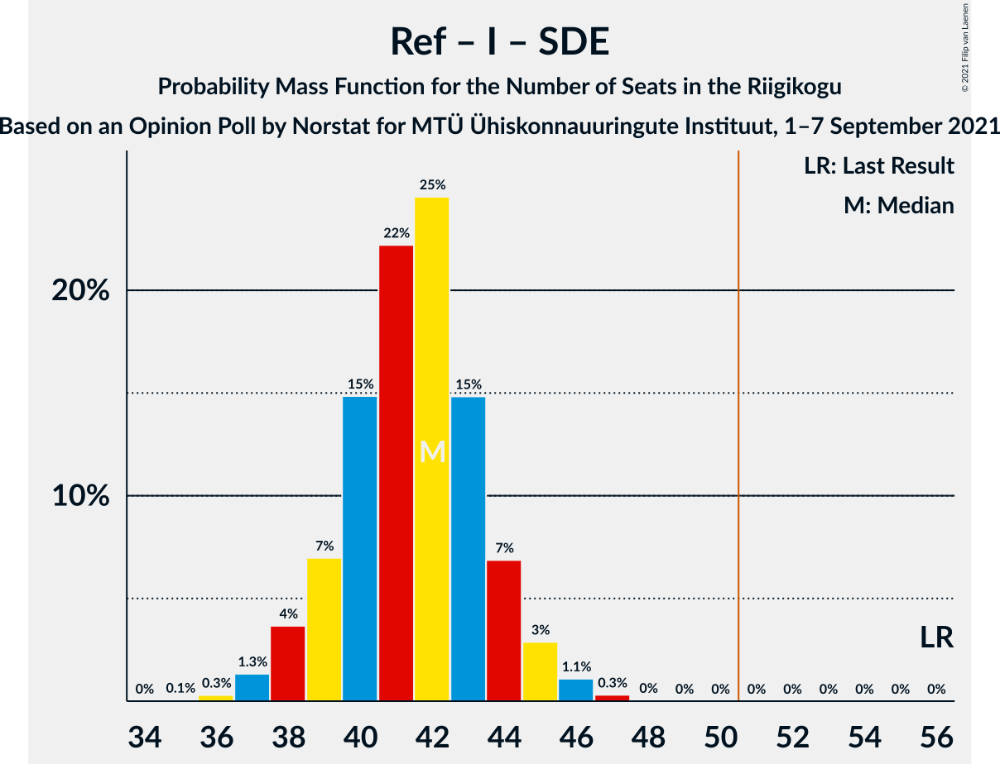

| Number of Seats | Probability | Accumulated | Special Marks |
|:---------------:|:-----------:|:-----------:|:-------------:|
| 35 | 0.1% | 100% |  |
| 36 | 0.3% | 99.9% |  |
| 37 | 1.3% | 99.6% |  |
| 38 | 4% | 98% |  |
| 39 | 7% | 95% |  |
| 40 | 15% | 88% |  |
| 41 | 22% | 73% |  |
| 42 | 25% | 51% | Median |
| 43 | 15% | 26% |  |
| 44 | 7% | 11% |  |
| 45 | 3% | 4% |  |
| 46 | 1.1% | 1.5% |  |
| 47 | 0.3% | 0.4% |  |
| 48 | 0% | 0.1% |  |
| 49 | 0% | 0% |  |
| 50 | 0% | 0% |  |
| 51 | 0% | 0% | Majority |
| 52 | 0% | 0% |  |
| 53 | 0% | 0% |  |
| 54 | 0% | 0% |  |
| 55 | 0% | 0% |  |
| 56 | 0% | 0% | Last Result |

### Eesti Keskerakond – Erakond Isamaa – Sotsiaaldemokraatlik Erakond

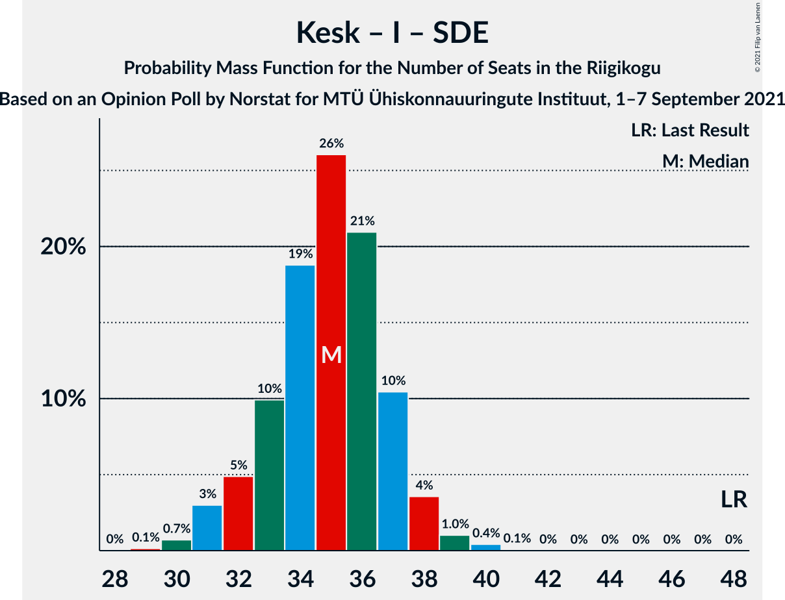

| Number of Seats | Probability | Accumulated | Special Marks |
|:---------------:|:-----------:|:-----------:|:-------------:|
| 29 | 0.1% | 100% |  |
| 30 | 0.7% | 99.8% |  |
| 31 | 3% | 99.1% |  |
| 32 | 5% | 96% |  |
| 33 | 10% | 91% |  |
| 34 | 19% | 81% |  |
| 35 | 26% | 63% | Median |
| 36 | 21% | 36% |  |
| 37 | 10% | 16% |  |
| 38 | 4% | 5% |  |
| 39 | 1.0% | 2% |  |
| 40 | 0.4% | 0.5% |  |
| 41 | 0.1% | 0.1% |  |
| 42 | 0% | 0% |  |
| 43 | 0% | 0% |  |
| 44 | 0% | 0% |  |
| 45 | 0% | 0% |  |
| 46 | 0% | 0% |  |
| 47 | 0% | 0% |  |
| 48 | 0% | 0% | Last Result |

### Eesti Reformierakond – Erakond Isamaa

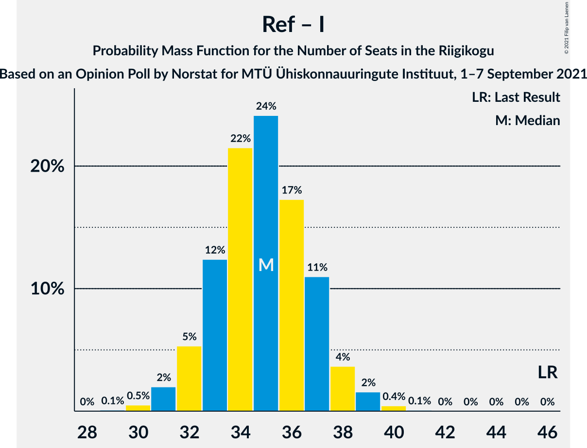

| Number of Seats | Probability | Accumulated | Special Marks |
|:---------------:|:-----------:|:-----------:|:-------------:|
| 29 | 0.1% | 100% |  |
| 30 | 0.5% | 99.9% |  |
| 31 | 2% | 99.4% |  |
| 32 | 5% | 97% |  |
| 33 | 12% | 92% |  |
| 34 | 22% | 80% |  |
| 35 | 24% | 58% | Median |
| 36 | 17% | 34% |  |
| 37 | 11% | 17% |  |
| 38 | 4% | 6% |  |
| 39 | 2% | 2% |  |
| 40 | 0.4% | 0.5% |  |
| 41 | 0.1% | 0.1% |  |
| 42 | 0% | 0% |  |
| 43 | 0% | 0% |  |
| 44 | 0% | 0% |  |
| 45 | 0% | 0% |  |
| 46 | 0% | 0% | Last Result |

### Eesti Konservatiivne Rahvaerakond – Sotsiaaldemokraatlik Erakond

| Number of Seats | Probability | Accumulated | Special Marks |
|:---------------:|:-----------:|:-----------:|:-------------:|
| 28 | 0.2% | 100% |  |
| 29 | 0.9% | 99.8% | Last Result |
| 30 | 4% | 98.8% |  |
| 31 | 9% | 95% |  |
| 32 | 16% | 86% |  |
| 33 | 24% | 71% |  |
| 34 | 22% | 47% | Median |
| 35 | 13% | 25% |  |
| 36 | 8% | 12% |  |
| 37 | 3% | 4% |  |
| 38 | 0.9% | 1.2% |  |
| 39 | 0.2% | 0.2% |  |
| 40 | 0% | 0% |  |

### Eesti Reformierakond – Sotsiaaldemokraatlik Erakond

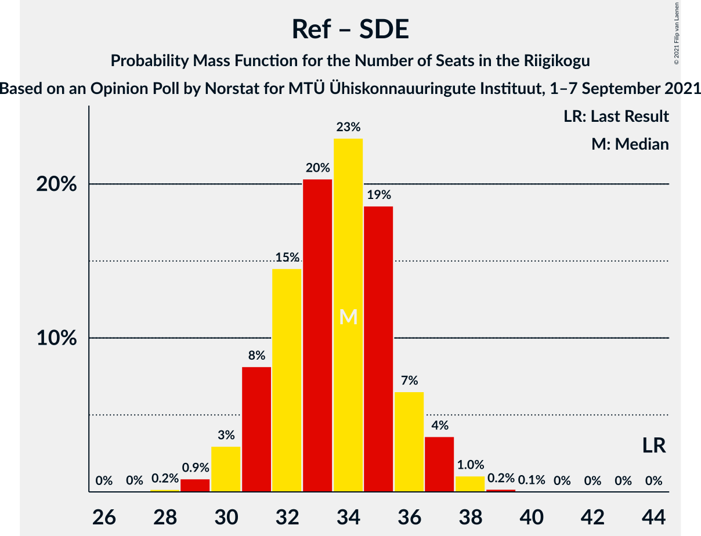

| Number of Seats | Probability | Accumulated | Special Marks |
|:---------------:|:-----------:|:-----------:|:-------------:|
| 28 | 0.2% | 100% |  |
| 29 | 0.9% | 99.8% |  |
| 30 | 3% | 98.9% |  |
| 31 | 8% | 96% |  |
| 32 | 15% | 88% |  |
| 33 | 20% | 73% |  |
| 34 | 23% | 53% | Median |
| 35 | 19% | 30% |  |
| 36 | 7% | 11% |  |
| 37 | 4% | 5% |  |
| 38 | 1.0% | 1.3% |  |
| 39 | 0.2% | 0.2% |  |
| 40 | 0.1% | 0.1% |  |
| 41 | 0% | 0% |  |
| 42 | 0% | 0% |  |
| 43 | 0% | 0% |  |
| 44 | 0% | 0% | Last Result |

### Eesti Keskerakond – Sotsiaaldemokraatlik Erakond

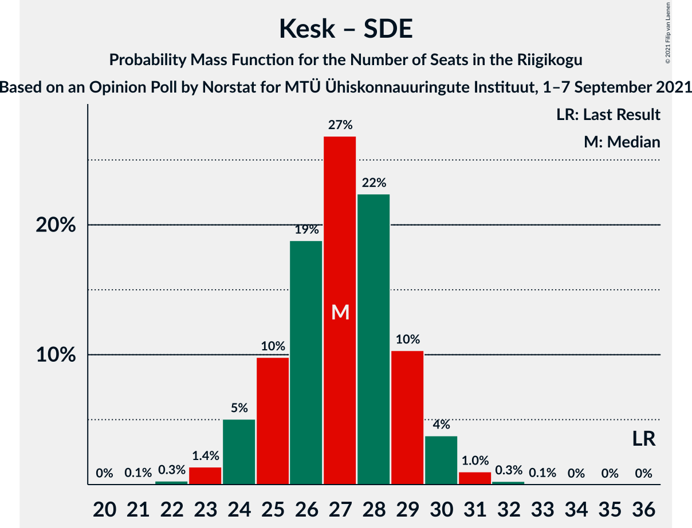

| Number of Seats | Probability | Accumulated | Special Marks |
|:---------------:|:-----------:|:-----------:|:-------------:|
| 21 | 0.1% | 100% |  |
| 22 | 0.3% | 99.9% |  |
| 23 | 1.4% | 99.6% |  |
| 24 | 5% | 98% |  |
| 25 | 10% | 93% |  |
| 26 | 19% | 83% |  |
| 27 | 27% | 65% | Median |
| 28 | 22% | 38% |  |
| 29 | 10% | 15% |  |
| 30 | 4% | 5% |  |
| 31 | 1.0% | 1.3% |  |
| 32 | 0.3% | 0.3% |  |
| 33 | 0.1% | 0.1% |  |
| 34 | 0% | 0% |  |
| 35 | 0% | 0% |  |
| 36 | 0% | 0% | Last Result |

## Technical Information

### Opinion Poll

+ **Polling firm:** Norstat
+ **Commissioner(s):** MTÜ Ühiskonnauuringute Instituut
+ **Fieldwork period:** 1–7 September 2021

### Calculations

+ **Sample size:** 1000
+ **Simulations done:** 1,048,576
+ **Error estimate:** 0.56%

