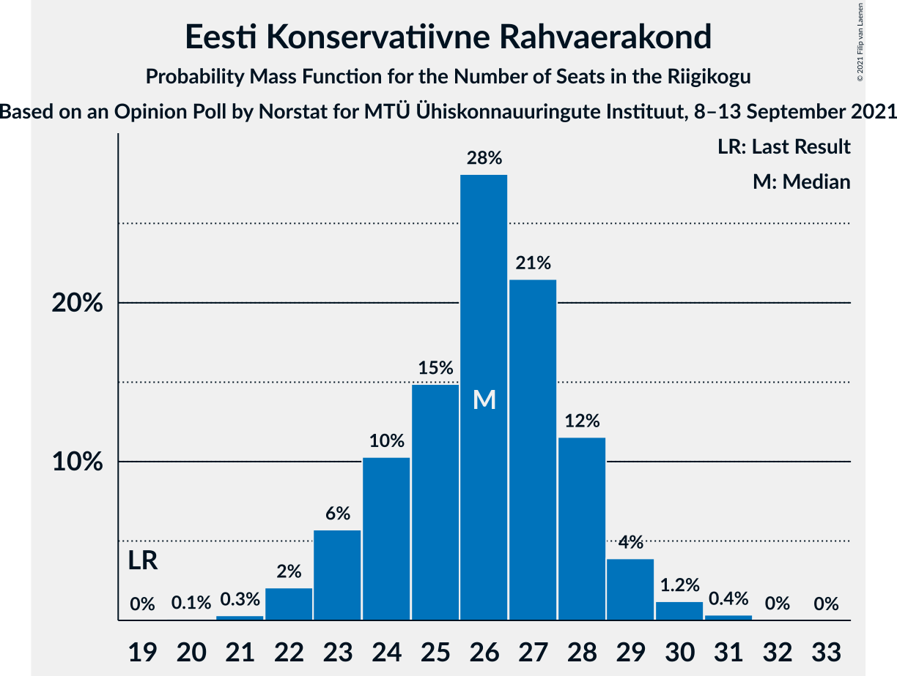
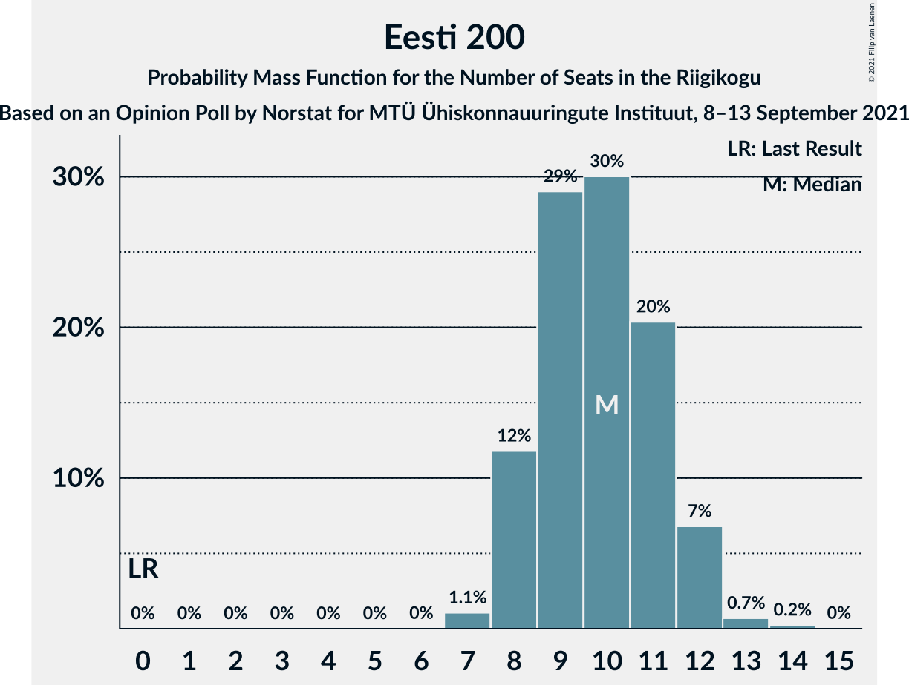

# Opinion Poll by Norstat for MTÜ Ühiskonnauuringute Instituut, 8–13 September 2021

<a href="#voting-intentions">Voting Intentions</a> | <a href="#seats">Seats</a> | <a href="#coalitions">Coalitions</a> | <a href="#technical-information">Technical Information</a>

## Voting Intentions

### Confidence Intervals

| Party | Last Result | Poll Result | 80% Confidence Interval | 90% Confidence Interval | 95% Confidence Interval | 99% Confidence Interval |
|:-----:|:-----------:|:-----------:|:-----------------------:|:-----------------------:|:-----------------------:|:-----------------------:|
| Eesti Reformierakond | 28.9% | 25.6% | 23.9–27.4% |23.4–28.0% |23.0–28.4% |22.2–29.3% |
| Eesti Konservatiivne Rahvaerakond | 17.8% | 23.6% | 21.9–25.4% |21.5–25.9% |21.1–26.3% |20.3–27.2% |
| Eesti Keskerakond | 23.1% | 21.3% | 19.7–23.0% |19.3–23.5% |18.9–23.9% |18.1–24.8% |
| Eesti 200 | 4.4% | 10.4% | 9.3–11.7% |8.9–12.1% |8.7–12.5% |8.1–13.1% |
| Sotsiaaldemokraatlik Erakond | 9.8% | 9.8% | 8.7–11.1% |8.4–11.5% |8.1–11.8% |7.6–12.5% |
| Erakond Isamaa | 11.4% | 6.2% | 5.3–7.3% |5.1–7.6% |4.9–7.9% |4.5–8.4% |
| Erakond Eestimaa Rohelised | 1.8% | 2.2% | 1.7–2.9% |1.6–3.1% |1.4–3.3% |1.2–3.7% |

*Note:* The poll result column reflects the actual value used in the calculations. Published results may vary slightly, and in addition be rounded to fewer digits.

## Seats

### Confidence Intervals

| Party | Last Result | Median | 80% Confidence Interval | 90% Confidence Interval | 95% Confidence Interval | 99% Confidence Interval |
|:-----:|:-----------:|:------:|:-----------------------:|:-----------------------:|:-----------------------:|:-----------------------:|
| <a href="#eesti-reformierakond">Eesti Reformierakond</a> | 34 | 28 | 26–30 |25–30 |25–31 |23–33 |
| <a href="#eesti-konservatiivne-rahvaerakond">Eesti Konservatiivne Rahvaerakond</a> | 19 | 26 | 24–28 |23–29 |23–29 |22–30 |
| <a href="#eesti-keskerakond">Eesti Keskerakond</a> | 26 | 23 | 21–25 |21–26 |20–26 |19–27 |
| <a href="#eesti-200">Eesti 200</a> | 0 | 10 | 8–11 |8–12 |8–12 |7–13 |
| <a href="#sotsiaaldemokraatlik-erakond">Sotsiaaldemokraatlik Erakond</a> | 10 | 10 | 8–11 |8–11 |7–12 |7–12 |
| <a href="#erakond-isamaa">Erakond Isamaa</a> | 12 | 5 | 5–7 |4–7 |0–7 |0–8 |
| <a href="#erakond-eestimaa-rohelised">Erakond Eestimaa Rohelised</a> | 0 | 0 | 0 |0 |0 |0 |

### Eesti Reformierakond

*For a full overview of the results for this party, see the [Eesti Reformierakond](party-eestireformierakond.html) page.*

| Number of Seats | Probability | Accumulated | Special Marks |
|:---------------:|:-----------:|:-----------:|:-------------:|
| 23 | 0.5% | 100% |  |
| 24 | 1.4% | 99.5% |  |
| 25 | 8% | 98% |  |
| 26 | 12% | 90% |  |
| 27 | 25% | 78% |  |
| 28 | 22% | 53% | Median |
| 29 | 14% | 31% |  |
| 30 | 12% | 17% |  |
| 31 | 3% | 5% |  |
| 32 | 1.0% | 2% |  |
| 33 | 0.4% | 0.5% |  |
| 34 | 0.1% | 0.1% | Last Result |
| 35 | 0% | 0% |  |

### Eesti Konservatiivne Rahvaerakond

*For a full overview of the results for this party, see the [Eesti Konservatiivne Rahvaerakond](party-eestikonservatiivnerahvaerakond.html) page.*

| Number of Seats | Probability | Accumulated | Special Marks |
|:---------------:|:-----------:|:-----------:|:-------------:|
| 19 | 0% | 100% | Last Result |
| 20 | 0.1% | 100% |  |
| 21 | 0.3% | 99.9% |  |
| 22 | 2% | 99.6% |  |
| 23 | 6% | 98% |  |
| 24 | 10% | 92% |  |
| 25 | 15% | 82% |  |
| 26 | 28% | 67% | Median |
| 27 | 21% | 39% |  |
| 28 | 12% | 17% |  |
| 29 | 4% | 6% |  |
| 30 | 1.2% | 2% |  |
| 31 | 0.4% | 0.4% |  |
| 32 | 0% | 0.1% |  |
| 33 | 0% | 0% |  |

### Eesti Keskerakond

*For a full overview of the results for this party, see the [Eesti Keskerakond](party-eestikeskerakond.html) page.*

| Number of Seats | Probability | Accumulated | Special Marks |
|:---------------:|:-----------:|:-----------:|:-------------:|
| 18 | 0.2% | 100% |  |
| 19 | 2% | 99.8% |  |
| 20 | 2% | 98% |  |
| 21 | 23% | 96% |  |
| 22 | 19% | 73% |  |
| 23 | 26% | 53% | Median |
| 24 | 12% | 28% |  |
| 25 | 9% | 15% |  |
| 26 | 5% | 6% | Last Result |
| 27 | 0.7% | 0.9% |  |
| 28 | 0.2% | 0.2% |  |
| 29 | 0% | 0% |  |

### Eesti 200

*For a full overview of the results for this party, see the [Eesti 200](party-eesti200.html) page.*

| Number of Seats | Probability | Accumulated | Special Marks |
|:---------------:|:-----------:|:-----------:|:-------------:|
| 0 | 0% | 100% | Last Result |
| 1 | 0% | 100% |  |
| 2 | 0% | 100% |  |
| 3 | 0% | 100% |  |
| 4 | 0% | 100% |  |
| 5 | 0% | 100% |  |
| 6 | 0% | 100% |  |
| 7 | 1.1% | 100% |  |
| 8 | 12% | 98.9% |  |
| 9 | 29% | 87% |  |
| 10 | 30% | 58% | Median |
| 11 | 20% | 28% |  |
| 12 | 7% | 8% |  |
| 13 | 0.7% | 1.0% |  |
| 14 | 0.2% | 0.3% |  |
| 15 | 0% | 0% |  |

### Sotsiaaldemokraatlik Erakond

*For a full overview of the results for this party, see the [Sotsiaaldemokraatlik Erakond](party-sotsiaaldemokraatlikerakond.html) page.*

| Number of Seats | Probability | Accumulated | Special Marks |
|:---------------:|:-----------:|:-----------:|:-------------:|
| 6 | 0.2% | 100% |  |
| 7 | 3% | 99.8% |  |
| 8 | 20% | 97% |  |
| 9 | 26% | 77% |  |
| 10 | 37% | 52% | Last Result, Median |
| 11 | 12% | 15% |  |
| 12 | 3% | 3% |  |
| 13 | 0.3% | 0.4% |  |
| 14 | 0% | 0% |  |

### Erakond Isamaa

*For a full overview of the results for this party, see the [Erakond Isamaa](party-erakondisamaa.html) page.*

| Number of Seats | Probability | Accumulated | Special Marks |
|:---------------:|:-----------:|:-----------:|:-------------:|
| 0 | 3% | 100% |  |
| 1 | 0% | 97% |  |
| 2 | 0% | 97% |  |
| 3 | 0% | 97% |  |
| 4 | 6% | 97% |  |
| 5 | 49% | 91% | Median |
| 6 | 31% | 42% |  |
| 7 | 9% | 10% |  |
| 8 | 2% | 2% |  |
| 9 | 0.1% | 0.1% |  |
| 10 | 0% | 0% |  |
| 11 | 0% | 0% |  |
| 12 | 0% | 0% | Last Result |

### Erakond Eestimaa Rohelised

*For a full overview of the results for this party, see the [Erakond Eestimaa Rohelised](party-erakondeestimaarohelised.html) page.*

| Number of Seats | Probability | Accumulated | Special Marks |
|:---------------:|:-----------:|:-----------:|:-------------:|
| 0 | 100% | 100% | Last Result, Median |

## Coalitions

### Confidence Intervals

| Coalition | Last Result | Median | Majority? | 80% Confidence Interval | 90% Confidence Interval | 95% Confidence Interval | 99% Confidence Interval |
|:---------:|:-----------:|:------:|:---------:|:-----------------------:|:-----------------------:|:-----------------------:|:-----------------------:|
| Eesti Reformierakond – Eesti Konservatiivne Rahvaerakond – Eesti Keskerakond | 79 | 76 | 100% | 74–79 | 73–79 | 73–80 | 72–82 |
| Eesti Reformierakond – Eesti Konservatiivne Rahvaerakond – Erakond Isamaa | 65 | 59 | 100% | 57–62 | 56–62 | 55–63 | 54–64 |
| Eesti Konservatiivne Rahvaerakond – Eesti Keskerakond – Erakond Isamaa | 57 | 54 | 96% | 51–56 | 51–57 | 50–58 | 48–59 |
| Eesti Reformierakond – Eesti Konservatiivne Rahvaerakond | 53 | 54 | 96% | 51–56 | 51–57 | 50–58 | 49–59 |
| Eesti Reformierakond – Eesti Keskerakond | 60 | 50 | 44% | 48–53 | 47–54 | 47–54 | 46–56 |
| Eesti Konservatiivne Rahvaerakond – Eesti Keskerakond | 45 | 48 | 20% | 46–51 | 46–52 | 45–53 | 44–54 |
| Eesti Reformierakond – Sotsiaaldemokraatlik Erakond – Erakond Isamaa | 56 | 43 | 0% | 40–45 | 39–45 | 39–46 | 37–47 |
| Eesti Keskerakond – Sotsiaaldemokraatlik Erakond – Erakond Isamaa | 48 | 37 | 0% | 35–40 | 35–40 | 34–41 | 31–43 |
| Eesti Reformierakond – Sotsiaaldemokraatlik Erakond | 44 | 37 | 0% | 35–40 | 34–40 | 34–41 | 33–42 |
| Eesti Konservatiivne Rahvaerakond – Sotsiaaldemokraatlik Erakond | 29 | 35 | 0% | 33–38 | 32–38 | 31–39 | 30–40 |
| Eesti Reformierakond – Erakond Isamaa | 46 | 33 | 0% | 31–35 | 30–36 | 29–37 | 27–38 |
| Eesti Keskerakond – Sotsiaaldemokraatlik Erakond | 36 | 32 | 0% | 30–34 | 30–35 | 29–36 | 28–37 |

### Eesti Reformierakond – Eesti Konservatiivne Rahvaerakond – Eesti Keskerakond

| Number of Seats | Probability | Accumulated | Special Marks |
|:---------------:|:-----------:|:-----------:|:-------------:|
| 71 | 0.1% | 100% |  |
| 72 | 0.9% | 99.8% |  |
| 73 | 4% | 99.0% |  |
| 74 | 6% | 95% |  |
| 75 | 22% | 88% |  |
| 76 | 19% | 66% |  |
| 77 | 20% | 48% | Median |
| 78 | 14% | 27% |  |
| 79 | 8% | 13% | Last Result |
| 80 | 3% | 5% |  |
| 81 | 0.9% | 1.5% |  |
| 82 | 0.3% | 0.6% |  |
| 83 | 0.2% | 0.3% |  |
| 84 | 0.1% | 0.1% |  |
| 85 | 0% | 0% |  |

### Eesti Reformierakond – Eesti Konservatiivne Rahvaerakond – Erakond Isamaa

| Number of Seats | Probability | Accumulated | Special Marks |
|:---------------:|:-----------:|:-----------:|:-------------:|
| 52 | 0.1% | 100% |  |
| 53 | 0.2% | 99.9% |  |
| 54 | 0.6% | 99.8% |  |
| 55 | 3% | 99.2% |  |
| 56 | 4% | 96% |  |
| 57 | 11% | 92% |  |
| 58 | 22% | 82% |  |
| 59 | 20% | 59% | Median |
| 60 | 18% | 39% |  |
| 61 | 10% | 21% |  |
| 62 | 8% | 11% |  |
| 63 | 3% | 3% |  |
| 64 | 0.5% | 0.6% |  |
| 65 | 0.1% | 0.1% | Last Result |
| 66 | 0% | 0% |  |

### Eesti Konservatiivne Rahvaerakond – Eesti Keskerakond – Erakond Isamaa

| Number of Seats | Probability | Accumulated | Special Marks |
|:---------------:|:-----------:|:-----------:|:-------------:|
| 46 | 0% | 100% |  |
| 47 | 0.1% | 99.9% |  |
| 48 | 0.3% | 99.8% |  |
| 49 | 0.9% | 99.5% |  |
| 50 | 3% | 98.5% |  |
| 51 | 7% | 96% | Majority |
| 52 | 10% | 89% |  |
| 53 | 19% | 79% |  |
| 54 | 15% | 59% | Median |
| 55 | 22% | 44% |  |
| 56 | 12% | 22% |  |
| 57 | 5% | 10% | Last Result |
| 58 | 4% | 5% |  |
| 59 | 0.5% | 0.6% |  |
| 60 | 0.1% | 0.1% |  |
| 61 | 0% | 0% |  |

### Eesti Reformierakond – Eesti Konservatiivne Rahvaerakond

| Number of Seats | Probability | Accumulated | Special Marks |
|:---------------:|:-----------:|:-----------:|:-------------:|
| 47 | 0.1% | 100% |  |
| 48 | 0.2% | 99.9% |  |
| 49 | 1.2% | 99.7% |  |
| 50 | 3% | 98% |  |
| 51 | 9% | 96% | Majority |
| 52 | 15% | 87% |  |
| 53 | 17% | 72% | Last Result |
| 54 | 21% | 55% | Median |
| 55 | 15% | 34% |  |
| 56 | 12% | 19% |  |
| 57 | 4% | 7% |  |
| 58 | 2% | 3% |  |
| 59 | 0.7% | 1.0% |  |
| 60 | 0.2% | 0.3% |  |
| 61 | 0.1% | 0.1% |  |
| 62 | 0% | 0% |  |

### Eesti Reformierakond – Eesti Keskerakond

| Number of Seats | Probability | Accumulated | Special Marks |
|:---------------:|:-----------:|:-----------:|:-------------:|
| 44 | 0.1% | 100% |  |
| 45 | 0.2% | 99.9% |  |
| 46 | 1.1% | 99.7% |  |
| 47 | 7% | 98.6% |  |
| 48 | 5% | 92% |  |
| 49 | 18% | 86% |  |
| 50 | 24% | 68% |  |
| 51 | 15% | 44% | Median, Majority |
| 52 | 16% | 30% |  |
| 53 | 8% | 14% |  |
| 54 | 5% | 7% |  |
| 55 | 1.3% | 2% |  |
| 56 | 0.4% | 0.8% |  |
| 57 | 0.3% | 0.3% |  |
| 58 | 0% | 0% |  |
| 59 | 0% | 0% |  |
| 60 | 0% | 0% | Last Result |

### Eesti Konservatiivne Rahvaerakond – Eesti Keskerakond

| Number of Seats | Probability | Accumulated | Special Marks |
|:---------------:|:-----------:|:-----------:|:-------------:|
| 42 | 0.1% | 100% |  |
| 43 | 0.3% | 99.9% |  |
| 44 | 0.9% | 99.6% |  |
| 45 | 3% | 98.7% | Last Result |
| 46 | 10% | 96% |  |
| 47 | 13% | 86% |  |
| 48 | 25% | 73% |  |
| 49 | 10% | 48% | Median |
| 50 | 18% | 38% |  |
| 51 | 13% | 20% | Majority |
| 52 | 4% | 7% |  |
| 53 | 2% | 3% |  |
| 54 | 0.5% | 0.7% |  |
| 55 | 0.1% | 0.2% |  |
| 56 | 0.1% | 0.1% |  |
| 57 | 0% | 0% |  |

### Eesti Reformierakond – Sotsiaaldemokraatlik Erakond – Erakond Isamaa

| Number of Seats | Probability | Accumulated | Special Marks |
|:---------------:|:-----------:|:-----------:|:-------------:|
| 35 | 0.1% | 100% |  |
| 36 | 0.1% | 99.9% |  |
| 37 | 0.5% | 99.8% |  |
| 38 | 1.1% | 99.3% |  |
| 39 | 5% | 98% |  |
| 40 | 11% | 93% |  |
| 41 | 16% | 82% |  |
| 42 | 12% | 66% |  |
| 43 | 25% | 54% | Median |
| 44 | 10% | 29% |  |
| 45 | 15% | 19% |  |
| 46 | 3% | 4% |  |
| 47 | 1.2% | 2% |  |
| 48 | 0.3% | 0.4% |  |
| 49 | 0.1% | 0.1% |  |
| 50 | 0% | 0% |  |
| 51 | 0% | 0% | Majority |
| 52 | 0% | 0% |  |
| 53 | 0% | 0% |  |
| 54 | 0% | 0% |  |
| 55 | 0% | 0% |  |
| 56 | 0% | 0% | Last Result |

### Eesti Keskerakond – Sotsiaaldemokraatlik Erakond – Erakond Isamaa

| Number of Seats | Probability | Accumulated | Special Marks |
|:---------------:|:-----------:|:-----------:|:-------------:|
| 30 | 0.2% | 100% |  |
| 31 | 0.4% | 99.8% |  |
| 32 | 0.5% | 99.4% |  |
| 33 | 0.8% | 98.9% |  |
| 34 | 2% | 98% |  |
| 35 | 8% | 96% |  |
| 36 | 23% | 88% |  |
| 37 | 16% | 65% |  |
| 38 | 17% | 49% | Median |
| 39 | 20% | 32% |  |
| 40 | 8% | 12% |  |
| 41 | 3% | 5% |  |
| 42 | 1.3% | 2% |  |
| 43 | 0.5% | 0.7% |  |
| 44 | 0.1% | 0.1% |  |
| 45 | 0% | 0% |  |
| 46 | 0% | 0% |  |
| 47 | 0% | 0% |  |
| 48 | 0% | 0% | Last Result |

### Eesti Reformierakond – Sotsiaaldemokraatlik Erakond

| Number of Seats | Probability | Accumulated | Special Marks |
|:---------------:|:-----------:|:-----------:|:-------------:|
| 31 | 0.1% | 100% |  |
| 32 | 0.4% | 99.9% |  |
| 33 | 1.3% | 99.5% |  |
| 34 | 5% | 98% |  |
| 35 | 16% | 93% |  |
| 36 | 15% | 77% |  |
| 37 | 17% | 62% |  |
| 38 | 20% | 45% | Median |
| 39 | 12% | 25% |  |
| 40 | 9% | 13% |  |
| 41 | 2% | 4% |  |
| 42 | 1.0% | 1.3% |  |
| 43 | 0.2% | 0.3% |  |
| 44 | 0.1% | 0.1% | Last Result |
| 45 | 0% | 0% |  |

### Eesti Konservatiivne Rahvaerakond – Sotsiaaldemokraatlik Erakond

| Number of Seats | Probability | Accumulated | Special Marks |
|:---------------:|:-----------:|:-----------:|:-------------:|
| 29 | 0.1% | 100% | Last Result |
| 30 | 0.5% | 99.9% |  |
| 31 | 2% | 99.4% |  |
| 32 | 3% | 97% |  |
| 33 | 9% | 94% |  |
| 34 | 13% | 85% |  |
| 35 | 23% | 72% |  |
| 36 | 17% | 49% | Median |
| 37 | 19% | 32% |  |
| 38 | 8% | 12% |  |
| 39 | 3% | 4% |  |
| 40 | 0.8% | 1.1% |  |
| 41 | 0.2% | 0.3% |  |
| 42 | 0.1% | 0.1% |  |
| 43 | 0% | 0% |  |

### Eesti Reformierakond – Erakond Isamaa

| Number of Seats | Probability | Accumulated | Special Marks |
|:---------------:|:-----------:|:-----------:|:-------------:|
| 26 | 0% | 100% |  |
| 27 | 0.7% | 99.9% |  |
| 28 | 0.4% | 99.2% |  |
| 29 | 2% | 98.8% |  |
| 30 | 6% | 97% |  |
| 31 | 8% | 91% |  |
| 32 | 21% | 83% |  |
| 33 | 23% | 62% | Median |
| 34 | 17% | 39% |  |
| 35 | 13% | 22% |  |
| 36 | 5% | 8% |  |
| 37 | 2% | 3% |  |
| 38 | 0.7% | 0.9% |  |
| 39 | 0.1% | 0.2% |  |
| 40 | 0% | 0% |  |
| 41 | 0% | 0% |  |
| 42 | 0% | 0% |  |
| 43 | 0% | 0% |  |
| 44 | 0% | 0% |  |
| 45 | 0% | 0% |  |
| 46 | 0% | 0% | Last Result |

### Eesti Keskerakond – Sotsiaaldemokraatlik Erakond

| Number of Seats | Probability | Accumulated | Special Marks |
|:---------------:|:-----------:|:-----------:|:-------------:|
| 27 | 0.3% | 100% |  |
| 28 | 1.1% | 99.7% |  |
| 29 | 3% | 98.5% |  |
| 30 | 7% | 96% |  |
| 31 | 30% | 89% |  |
| 32 | 22% | 59% |  |
| 33 | 14% | 37% | Median |
| 34 | 13% | 23% |  |
| 35 | 7% | 10% |  |
| 36 | 2% | 3% | Last Result |
| 37 | 0.7% | 0.9% |  |
| 38 | 0.1% | 0.2% |  |
| 39 | 0% | 0% |  |

## Technical Information

### Opinion Poll

+ **Polling firm:** Norstat
+ **Commissioner(s):** MTÜ Ühiskonnauuringute Instituut
+ **Fieldwork period:** 8–13 September 2021

### Calculations

+ **Sample size:** 1000
+ **Simulations done:** 131,072
+ **Error estimate:** 1.23%

