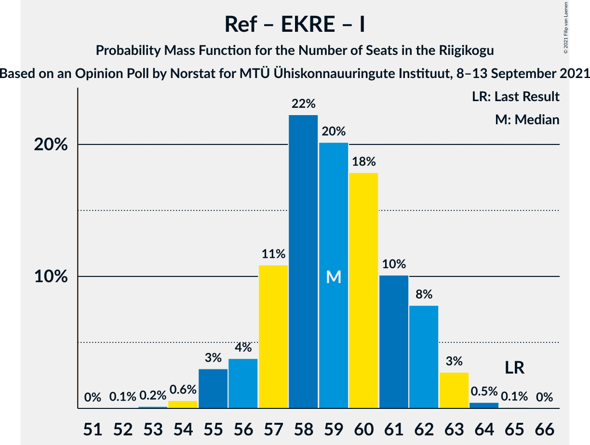
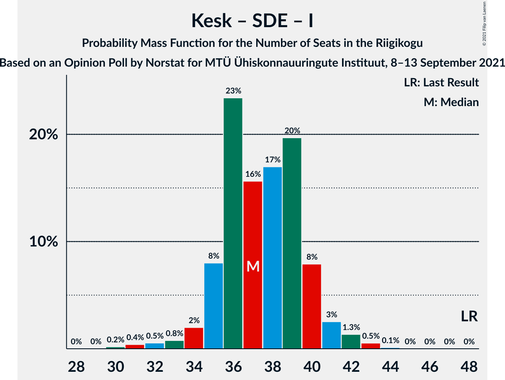

# Opinion Poll by Norstat for MTÜ Ühiskonnauuringute Instituut, 8–13 September 2021

<a href="#voting-intentions">Voting Intentions</a> | <a href="#seats">Seats</a> | <a href="#coalitions">Coalitions</a> | <a href="#technical-information">Technical Information</a>

## Voting Intentions

### Confidence Intervals

| Party | Last Result | Poll Result | 80% Confidence Interval | 90% Confidence Interval | 95% Confidence Interval | 99% Confidence Interval |
|:-----:|:-----------:|:-----------:|:-----------------------:|:-----------------------:|:-----------------------:|:-----------------------:|
| Eesti Reformierakond | 28.9% | 25.6% | 23.9–27.4% |23.4–28.0% |23.0–28.4% |22.2–29.3% |
| Eesti Konservatiivne Rahvaerakond | 17.8% | 23.6% | 21.9–25.4% |21.5–25.9% |21.1–26.3% |20.3–27.2% |
| Eesti Keskerakond | 23.1% | 21.3% | 19.7–23.0% |19.3–23.5% |18.9–23.9% |18.1–24.8% |
| Eesti 200 | 4.4% | 10.4% | 9.3–11.7% |8.9–12.1% |8.7–12.5% |8.1–13.1% |
| Sotsiaaldemokraatlik Erakond | 9.8% | 9.8% | 8.7–11.1% |8.4–11.5% |8.1–11.8% |7.6–12.5% |
| Erakond Isamaa | 11.4% | 6.2% | 5.3–7.3% |5.1–7.6% |4.9–7.9% |4.5–8.4% |
| Erakond Eestimaa Rohelised | 1.8% | 2.2% | 1.7–2.9% |1.6–3.1% |1.4–3.3% |1.2–3.7% |

*Note:* The poll result column reflects the actual value used in the calculations. Published results may vary slightly, and in addition be rounded to fewer digits.

## Seats

### Confidence Intervals

| Party | Last Result | Median | 80% Confidence Interval | 90% Confidence Interval | 95% Confidence Interval | 99% Confidence Interval |
|:-----:|:-----------:|:------:|:-----------------------:|:-----------------------:|:-----------------------:|:-----------------------:|
| <a href="#eesti-reformierakond">Eesti Reformierakond</a> | 34 | 28 | 26–30 |26–30 |25–31 |23–32 |
| <a href="#eesti-konservatiivne-rahvaerakond">Eesti Konservatiivne Rahvaerakond</a> | 19 | 26 | 24–28 |24–28 |23–29 |22–30 |
| <a href="#eesti-keskerakond">Eesti Keskerakond</a> | 26 | 22 | 21–25 |21–26 |20–26 |19–27 |
| <a href="#eesti-200">Eesti 200</a> | 0 | 10 | 9–11 |8–12 |8–12 |7–13 |
| <a href="#sotsiaaldemokraatlik-erakond">Sotsiaaldemokraatlik Erakond</a> | 10 | 10 | 8–11 |8–11 |7–12 |7–13 |
| <a href="#erakond-isamaa">Erakond Isamaa</a> | 12 | 5 | 4–7 |0–7 |0–8 |0–8 |
| <a href="#erakond-eestimaa-rohelised">Erakond Eestimaa Rohelised</a> | 0 | 0 | 0 |0 |0 |0 |

### Eesti Reformierakond

*For a full overview of the results for this party, see the [Eesti Reformierakond](party-eestireformierakond.html) page.*

| Number of Seats | Probability | Accumulated | Special Marks |
|:---------------:|:-----------:|:-----------:|:-------------:|
| 23 | 0.7% | 100% |  |
| 24 | 1.3% | 99.2% |  |
| 25 | 2% | 98% |  |
| 26 | 19% | 96% |  |
| 27 | 23% | 77% |  |
| 28 | 32% | 54% | Median |
| 29 | 8% | 23% |  |
| 30 | 10% | 14% |  |
| 31 | 4% | 5% |  |
| 32 | 0.9% | 1.2% |  |
| 33 | 0.1% | 0.3% |  |
| 34 | 0.1% | 0.2% | Last Result |
| 35 | 0% | 0% |  |

### Eesti Konservatiivne Rahvaerakond

*For a full overview of the results for this party, see the [Eesti Konservatiivne Rahvaerakond](party-eestikonservatiivnerahvaerakond.html) page.*

| Number of Seats | Probability | Accumulated | Special Marks |
|:---------------:|:-----------:|:-----------:|:-------------:|
| 19 | 0% | 100% | Last Result |
| 20 | 0% | 100% |  |
| 21 | 0.2% | 100% |  |
| 22 | 2% | 99.7% |  |
| 23 | 2% | 98% |  |
| 24 | 9% | 95% |  |
| 25 | 11% | 87% |  |
| 26 | 32% | 76% | Median |
| 27 | 31% | 43% |  |
| 28 | 9% | 12% |  |
| 29 | 2% | 3% |  |
| 30 | 1.5% | 2% |  |
| 31 | 0.1% | 0.2% |  |
| 32 | 0.1% | 0.1% |  |
| 33 | 0% | 0% |  |

### Eesti Keskerakond

*For a full overview of the results for this party, see the [Eesti Keskerakond](party-eestikeskerakond.html) page.*

| Number of Seats | Probability | Accumulated | Special Marks |
|:---------------:|:-----------:|:-----------:|:-------------:|
| 18 | 0.3% | 100% |  |
| 19 | 1.3% | 99.6% |  |
| 20 | 2% | 98% |  |
| 21 | 35% | 96% |  |
| 22 | 12% | 61% | Median |
| 23 | 13% | 50% |  |
| 24 | 11% | 36% |  |
| 25 | 18% | 25% |  |
| 26 | 6% | 7% | Last Result |
| 27 | 0.6% | 0.9% |  |
| 28 | 0.1% | 0.2% |  |
| 29 | 0.1% | 0.1% |  |
| 30 | 0% | 0% |  |

### Eesti 200

*For a full overview of the results for this party, see the [Eesti 200](party-eesti200.html) page.*

| Number of Seats | Probability | Accumulated | Special Marks |
|:---------------:|:-----------:|:-----------:|:-------------:|
| 0 | 0% | 100% | Last Result |
| 1 | 0% | 100% |  |
| 2 | 0% | 100% |  |
| 3 | 0% | 100% |  |
| 4 | 0% | 100% |  |
| 5 | 0% | 100% |  |
| 6 | 0% | 100% |  |
| 7 | 1.4% | 100% |  |
| 8 | 8% | 98.6% |  |
| 9 | 28% | 90% |  |
| 10 | 46% | 62% | Median |
| 11 | 8% | 16% |  |
| 12 | 7% | 8% |  |
| 13 | 0.8% | 0.8% |  |
| 14 | 0% | 0% |  |

### Sotsiaaldemokraatlik Erakond

*For a full overview of the results for this party, see the [Sotsiaaldemokraatlik Erakond](party-sotsiaaldemokraatlikerakond.html) page.*

| Number of Seats | Probability | Accumulated | Special Marks |
|:---------------:|:-----------:|:-----------:|:-------------:|
| 6 | 0.4% | 100% |  |
| 7 | 3% | 99.6% |  |
| 8 | 18% | 97% |  |
| 9 | 25% | 79% |  |
| 10 | 39% | 54% | Last Result, Median |
| 11 | 10% | 15% |  |
| 12 | 4% | 5% |  |
| 13 | 0.5% | 0.6% |  |
| 14 | 0.1% | 0.1% |  |
| 15 | 0% | 0% |  |

### Erakond Isamaa

*For a full overview of the results for this party, see the [Erakond Isamaa](party-erakondisamaa.html) page.*

| Number of Seats | Probability | Accumulated | Special Marks |
|:---------------:|:-----------:|:-----------:|:-------------:|
| 0 | 5% | 100% |  |
| 1 | 0% | 95% |  |
| 2 | 0% | 95% |  |
| 3 | 0% | 95% |  |
| 4 | 5% | 95% |  |
| 5 | 56% | 90% | Median |
| 6 | 23% | 34% |  |
| 7 | 8% | 11% |  |
| 8 | 3% | 3% |  |
| 9 | 0.1% | 0.1% |  |
| 10 | 0% | 0% |  |
| 11 | 0% | 0% |  |
| 12 | 0% | 0% | Last Result |

### Erakond Eestimaa Rohelised

*For a full overview of the results for this party, see the [Erakond Eestimaa Rohelised](party-erakondeestimaarohelised.html) page.*

| Number of Seats | Probability | Accumulated | Special Marks |
|:---------------:|:-----------:|:-----------:|:-------------:|
| 0 | 100% | 100% | Last Result, Median |

## Coalitions

### Confidence Intervals

| Coalition | Last Result | Median | Majority? | 80% Confidence Interval | 90% Confidence Interval | 95% Confidence Interval | 99% Confidence Interval |
|:---------:|:-----------:|:------:|:---------:|:-----------------------:|:-----------------------:|:-----------------------:|:-----------------------:|
| Eesti Reformierakond – Eesti Konservatiivne Rahvaerakond – Eesti Keskerakond | 79 | 76 | 100% | 74–79 | 74–80 | 73–80 | 72–81 |
| Eesti Reformierakond – Eesti Konservatiivne Rahvaerakond – Erakond Isamaa | 65 | 59 | 100% | 57–61 | 56–62 | 55–62 | 54–64 |
| Eesti Konservatiivne Rahvaerakond – Eesti Keskerakond – Erakond Isamaa | 57 | 54 | 96% | 52–56 | 51–57 | 50–57 | 49–59 |
| Eesti Reformierakond – Eesti Konservatiivne Rahvaerakond | 53 | 54 | 96% | 52–56 | 51–57 | 50–57 | 49–60 |
| Eesti Reformierakond – Eesti Keskerakond | 60 | 50 | 44% | 48–53 | 47–54 | 47–55 | 46–56 |
| Eesti Konservatiivne Rahvaerakond – Eesti Keskerakond | 45 | 49 | 26% | 46–51 | 46–51 | 45–52 | 44–54 |
| Eesti Reformierakond – Sotsiaaldemokraatlik Erakond – Erakond Isamaa | 56 | 43 | 0% | 40–45 | 39–45 | 38–47 | 37–47 |
| Eesti Keskerakond – Sotsiaaldemokraatlik Erakond – Erakond Isamaa | 48 | 37 | 0% | 35–40 | 35–40 | 34–41 | 31–42 |
| Eesti Reformierakond – Sotsiaaldemokraatlik Erakond | 44 | 38 | 0% | 35–39 | 34–40 | 34–41 | 32–42 |
| Eesti Konservatiivne Rahvaerakond – Sotsiaaldemokraatlik Erakond | 29 | 36 | 0% | 33–38 | 32–38 | 31–39 | 30–40 |
| Eesti Reformierakond – Erakond Isamaa | 46 | 33 | 0% | 31–36 | 30–36 | 29–37 | 27–38 |
| Eesti Keskerakond – Sotsiaaldemokraatlik Erakond | 36 | 32 | 0% | 30–34 | 30–35 | 29–35 | 28–37 |

### Eesti Reformierakond – Eesti Konservatiivne Rahvaerakond – Eesti Keskerakond

| Number of Seats | Probability | Accumulated | Special Marks |
|:---------------:|:-----------:|:-----------:|:-------------:|
| 71 | 0.3% | 100% |  |
| 72 | 1.1% | 99.7% |  |
| 73 | 2% | 98.6% |  |
| 74 | 12% | 96% |  |
| 75 | 4% | 85% |  |
| 76 | 41% | 81% | Median |
| 77 | 6% | 40% |  |
| 78 | 20% | 34% |  |
| 79 | 8% | 14% | Last Result |
| 80 | 4% | 6% |  |
| 81 | 2% | 2% |  |
| 82 | 0.2% | 0.3% |  |
| 83 | 0.1% | 0.1% |  |
| 84 | 0% | 0% |  |

### Eesti Reformierakond – Eesti Konservatiivne Rahvaerakond – Erakond Isamaa

| Number of Seats | Probability | Accumulated | Special Marks |
|:---------------:|:-----------:|:-----------:|:-------------:|
| 53 | 0.1% | 100% |  |
| 54 | 0.6% | 99.9% |  |
| 55 | 3% | 99.3% |  |
| 56 | 5% | 97% |  |
| 57 | 7% | 92% |  |
| 58 | 24% | 84% |  |
| 59 | 18% | 61% | Median |
| 60 | 28% | 42% |  |
| 61 | 5% | 14% |  |
| 62 | 7% | 9% |  |
| 63 | 2% | 2% |  |
| 64 | 0.5% | 0.5% |  |
| 65 | 0.1% | 0.1% | Last Result |
| 66 | 0% | 0% |  |

### Eesti Konservatiivne Rahvaerakond – Eesti Keskerakond – Erakond Isamaa

| Number of Seats | Probability | Accumulated | Special Marks |
|:---------------:|:-----------:|:-----------:|:-------------:|
| 47 | 0.1% | 100% |  |
| 48 | 0.1% | 99.9% |  |
| 49 | 0.6% | 99.8% |  |
| 50 | 3% | 99.1% |  |
| 51 | 5% | 96% | Majority |
| 52 | 6% | 90% |  |
| 53 | 30% | 84% | Median |
| 54 | 8% | 53% |  |
| 55 | 19% | 45% |  |
| 56 | 16% | 26% |  |
| 57 | 8% | 10% | Last Result |
| 58 | 2% | 2% |  |
| 59 | 0.5% | 0.6% |  |
| 60 | 0.1% | 0.1% |  |
| 61 | 0% | 0% |  |

### Eesti Reformierakond – Eesti Konservatiivne Rahvaerakond

| Number of Seats | Probability | Accumulated | Special Marks |
|:---------------:|:-----------:|:-----------:|:-------------:|
| 47 | 0.2% | 100% |  |
| 48 | 0.2% | 99.8% |  |
| 49 | 0.9% | 99.6% |  |
| 50 | 3% | 98.7% |  |
| 51 | 4% | 96% | Majority |
| 52 | 14% | 92% |  |
| 53 | 25% | 79% | Last Result |
| 54 | 11% | 54% | Median |
| 55 | 30% | 43% |  |
| 56 | 7% | 13% |  |
| 57 | 3% | 6% |  |
| 58 | 0.5% | 2% |  |
| 59 | 1.1% | 2% |  |
| 60 | 0.5% | 0.5% |  |
| 61 | 0% | 0% |  |

### Eesti Reformierakond – Eesti Keskerakond

| Number of Seats | Probability | Accumulated | Special Marks |
|:---------------:|:-----------:|:-----------:|:-------------:|
| 44 | 0% | 100% |  |
| 45 | 0.2% | 99.9% |  |
| 46 | 0.9% | 99.7% |  |
| 47 | 6% | 98.8% |  |
| 48 | 6% | 92% |  |
| 49 | 30% | 86% |  |
| 50 | 12% | 56% | Median |
| 51 | 7% | 44% | Majority |
| 52 | 22% | 38% |  |
| 53 | 9% | 16% |  |
| 54 | 4% | 7% |  |
| 55 | 2% | 3% |  |
| 56 | 0.5% | 0.7% |  |
| 57 | 0.2% | 0.2% |  |
| 58 | 0% | 0% |  |
| 59 | 0% | 0% |  |
| 60 | 0% | 0% | Last Result |

### Eesti Konservatiivne Rahvaerakond – Eesti Keskerakond

| Number of Seats | Probability | Accumulated | Special Marks |
|:---------------:|:-----------:|:-----------:|:-------------:|
| 43 | 0.2% | 100% |  |
| 44 | 1.0% | 99.7% |  |
| 45 | 3% | 98.7% | Last Result |
| 46 | 9% | 96% |  |
| 47 | 3% | 86% |  |
| 48 | 32% | 84% | Median |
| 49 | 11% | 51% |  |
| 50 | 15% | 40% |  |
| 51 | 21% | 26% | Majority |
| 52 | 3% | 5% |  |
| 53 | 1.1% | 2% |  |
| 54 | 0.7% | 0.8% |  |
| 55 | 0.1% | 0.1% |  |
| 56 | 0% | 0% |  |

### Eesti Reformierakond – Sotsiaaldemokraatlik Erakond – Erakond Isamaa

| Number of Seats | Probability | Accumulated | Special Marks |
|:---------------:|:-----------:|:-----------:|:-------------:|
| 35 | 0% | 100% |  |
| 36 | 0% | 99.9% |  |
| 37 | 0.9% | 99.9% |  |
| 38 | 2% | 99.0% |  |
| 39 | 5% | 97% |  |
| 40 | 3% | 91% |  |
| 41 | 25% | 88% |  |
| 42 | 7% | 63% |  |
| 43 | 35% | 56% | Median |
| 44 | 7% | 21% |  |
| 45 | 10% | 14% |  |
| 46 | 2% | 4% |  |
| 47 | 2% | 3% |  |
| 48 | 0.2% | 0.3% |  |
| 49 | 0.1% | 0.1% |  |
| 50 | 0% | 0% |  |
| 51 | 0% | 0% | Majority |
| 52 | 0% | 0% |  |
| 53 | 0% | 0% |  |
| 54 | 0% | 0% |  |
| 55 | 0% | 0% |  |
| 56 | 0% | 0% | Last Result |

### Eesti Keskerakond – Sotsiaaldemokraatlik Erakond – Erakond Isamaa

| Number of Seats | Probability | Accumulated | Special Marks |
|:---------------:|:-----------:|:-----------:|:-------------:|
| 30 | 0.5% | 100% |  |
| 31 | 0.8% | 99.5% |  |
| 32 | 0.1% | 98.7% |  |
| 33 | 0.7% | 98.6% |  |
| 34 | 2% | 98% |  |
| 35 | 9% | 96% |  |
| 36 | 28% | 87% |  |
| 37 | 13% | 59% | Median |
| 38 | 9% | 46% |  |
| 39 | 26% | 38% |  |
| 40 | 7% | 12% |  |
| 41 | 3% | 5% |  |
| 42 | 1.3% | 2% |  |
| 43 | 0.2% | 0.5% |  |
| 44 | 0.2% | 0.2% |  |
| 45 | 0% | 0% |  |
| 46 | 0% | 0% |  |
| 47 | 0% | 0% |  |
| 48 | 0% | 0% | Last Result |

### Eesti Reformierakond – Sotsiaaldemokraatlik Erakond

| Number of Seats | Probability | Accumulated | Special Marks |
|:---------------:|:-----------:|:-----------:|:-------------:|
| 32 | 0.8% | 100% |  |
| 33 | 1.0% | 99.2% |  |
| 34 | 6% | 98% |  |
| 35 | 7% | 92% |  |
| 36 | 23% | 86% |  |
| 37 | 11% | 62% |  |
| 38 | 38% | 51% | Median |
| 39 | 5% | 14% |  |
| 40 | 4% | 9% |  |
| 41 | 3% | 5% |  |
| 42 | 2% | 2% |  |
| 43 | 0.2% | 0.2% |  |
| 44 | 0% | 0% | Last Result |

### Eesti Konservatiivne Rahvaerakond – Sotsiaaldemokraatlik Erakond

| Number of Seats | Probability | Accumulated | Special Marks |
|:---------------:|:-----------:|:-----------:|:-------------:|
| 29 | 0.1% | 100% | Last Result |
| 30 | 0.6% | 99.9% |  |
| 31 | 2% | 99.4% |  |
| 32 | 2% | 97% |  |
| 33 | 8% | 95% |  |
| 34 | 13% | 87% |  |
| 35 | 20% | 74% |  |
| 36 | 13% | 53% | Median |
| 37 | 27% | 41% |  |
| 38 | 9% | 13% |  |
| 39 | 4% | 5% |  |
| 40 | 0.9% | 1.1% |  |
| 41 | 0.1% | 0.2% |  |
| 42 | 0.1% | 0.1% |  |
| 43 | 0% | 0% |  |

### Eesti Reformierakond – Erakond Isamaa

| Number of Seats | Probability | Accumulated | Special Marks |
|:---------------:|:-----------:|:-----------:|:-------------:|
| 26 | 0.1% | 100% |  |
| 27 | 2% | 99.9% |  |
| 28 | 0.6% | 98% |  |
| 29 | 2% | 98% |  |
| 30 | 3% | 95% |  |
| 31 | 11% | 92% |  |
| 32 | 22% | 81% |  |
| 33 | 33% | 59% | Median |
| 34 | 6% | 26% |  |
| 35 | 9% | 20% |  |
| 36 | 8% | 11% |  |
| 37 | 3% | 3% |  |
| 38 | 0.3% | 0.6% |  |
| 39 | 0.2% | 0.3% |  |
| 40 | 0% | 0% |  |
| 41 | 0% | 0% |  |
| 42 | 0% | 0% |  |
| 43 | 0% | 0% |  |
| 44 | 0% | 0% |  |
| 45 | 0% | 0% |  |
| 46 | 0% | 0% | Last Result |

### Eesti Keskerakond – Sotsiaaldemokraatlik Erakond

| Number of Seats | Probability | Accumulated | Special Marks |
|:---------------:|:-----------:|:-----------:|:-------------:|
| 26 | 0.1% | 100% |  |
| 27 | 0.2% | 99.9% |  |
| 28 | 0.4% | 99.7% |  |
| 29 | 3% | 99.4% |  |
| 30 | 7% | 96% |  |
| 31 | 37% | 89% |  |
| 32 | 12% | 52% | Median |
| 33 | 6% | 40% |  |
| 34 | 25% | 34% |  |
| 35 | 7% | 9% |  |
| 36 | 2% | 2% | Last Result |
| 37 | 0.3% | 0.5% |  |
| 38 | 0.2% | 0.2% |  |
| 39 | 0% | 0% |  |

## Technical Information

### Opinion Poll

+ **Polling firm:** Norstat
+ **Commissioner(s):** MTÜ Ühiskonnauuringute Instituut
+ **Fieldwork period:** 8–13 September 2021

### Calculations

+ **Sample size:** 1000
+ **Simulations done:** 32,768
+ **Error estimate:** 2.94%

