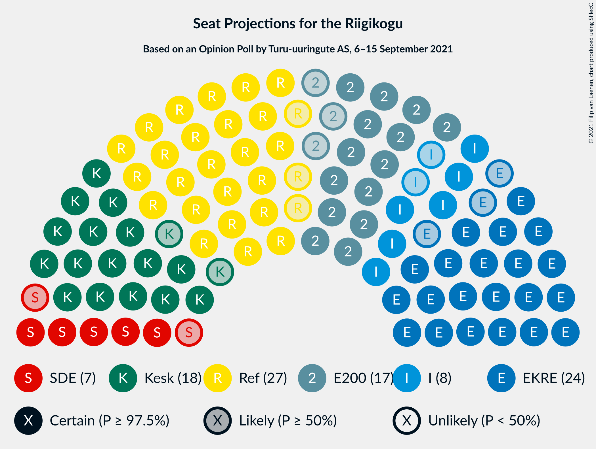
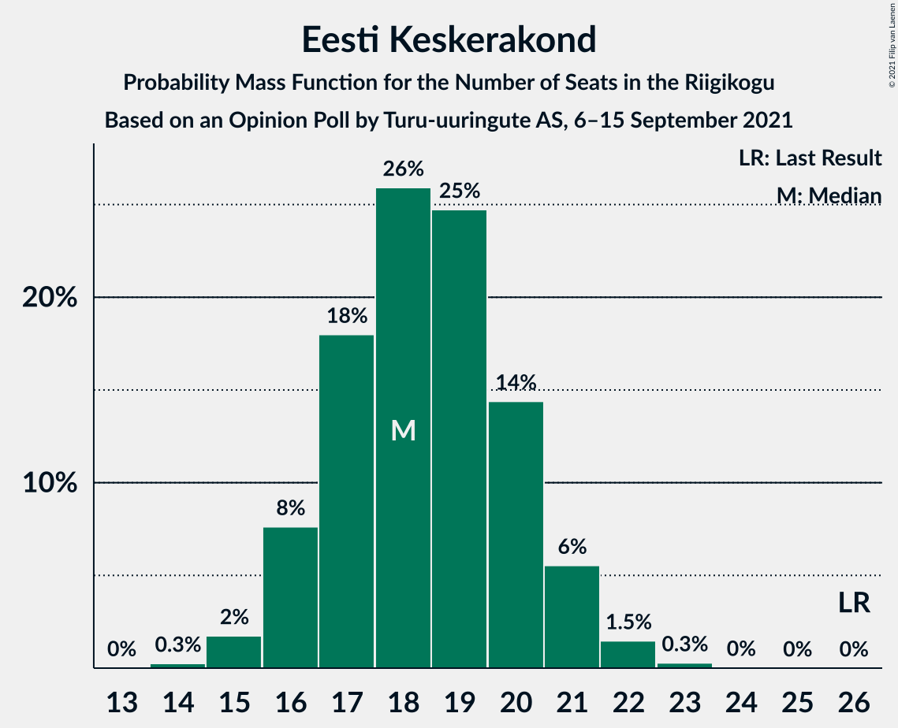
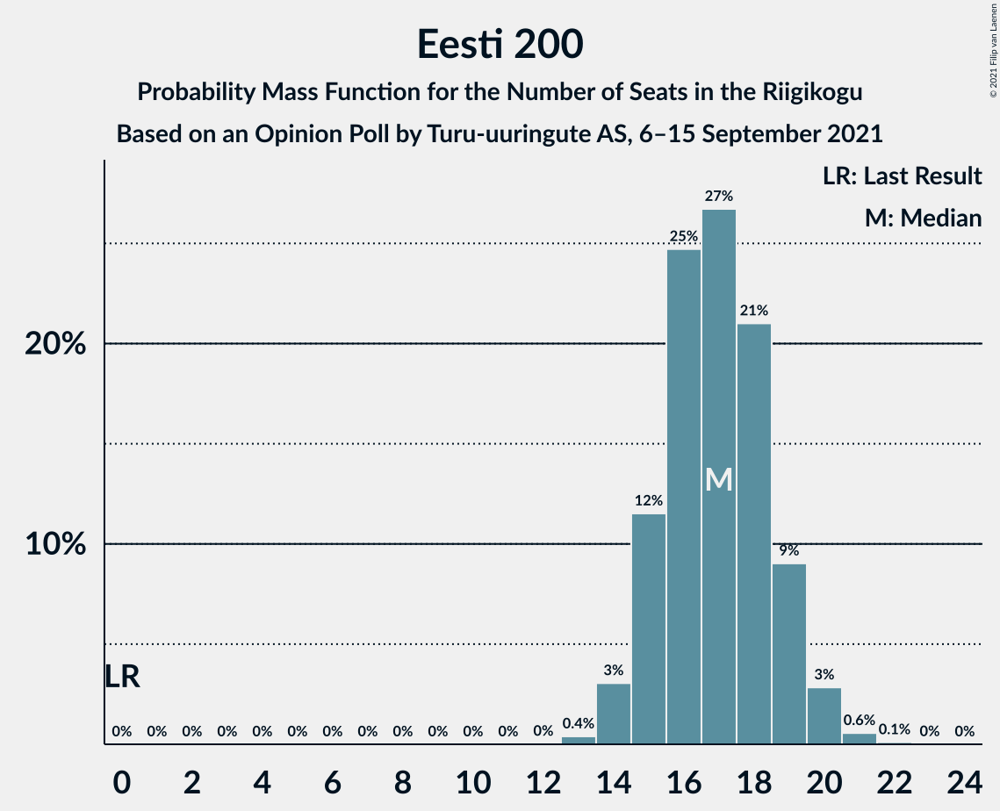
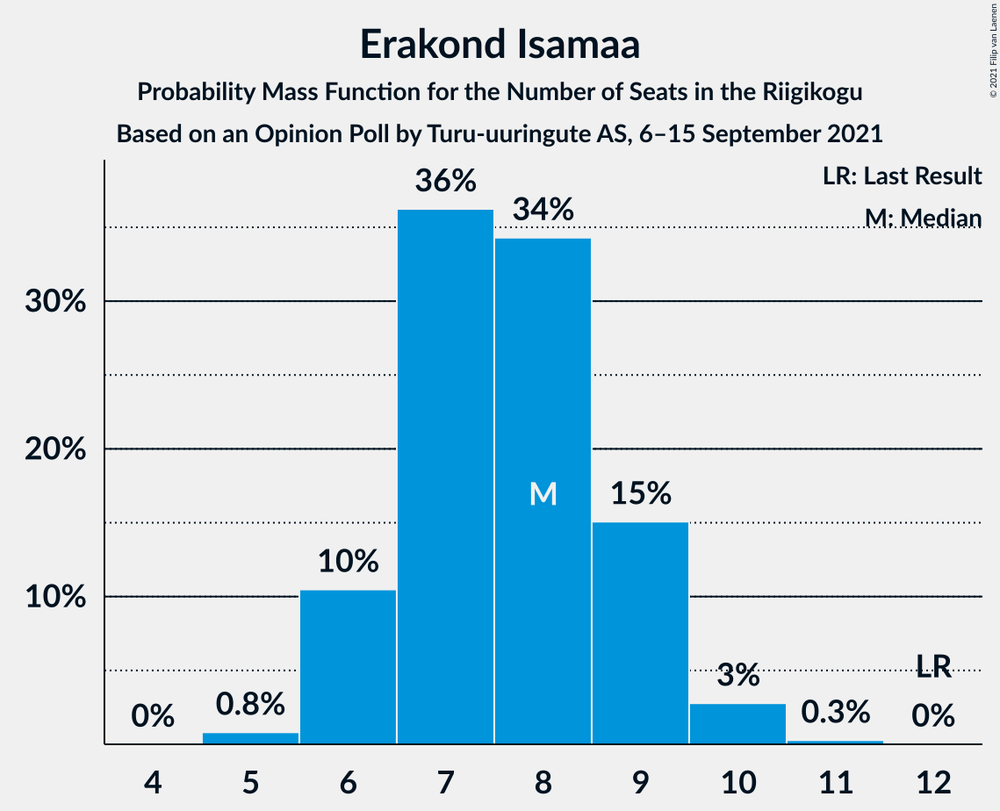

# Opinion Poll by Turu-uuringute AS, 6–15 September 2021

<a href="#voting-intentions">Voting Intentions</a> | <a href="#seats">Seats</a> | <a href="#coalitions">Coalitions</a> | <a href="#technical-information">Technical Information</a>

## Voting Intentions

### Confidence Intervals

| Party | Last Result | Poll Result | 80% Confidence Interval | 90% Confidence Interval | 95% Confidence Interval | 99% Confidence Interval |
|:-----:|:-----------:|:-----------:|:-----------------------:|:-----------------------:|:-----------------------:|:-----------------------:|
| Eesti Reformierakond | 28.9% | 24.0% | 22.4–25.8% |21.9–26.3% |21.5–26.8% |20.7–27.6% |
| Eesti Konservatiivne Rahvaerakond | 17.8% | 22.0% | 20.4–23.8% |20.0–24.3% |19.6–24.7% |18.8–25.6% |
| Eesti Keskerakond | 23.1% | 17.0% | 15.6–18.7% |15.2–19.1% |14.8–19.5% |14.2–20.3% |
| Eesti 200 | 4.4% | 16.0% | 14.5–17.5% |14.1–18.0% |13.8–18.4% |13.2–19.1% |
| Erakond Isamaa | 11.4% | 8.0% | 7.0–9.2% |6.7–9.5% |6.4–9.8% |6.0–10.4% |
| Sotsiaaldemokraatlik Erakond | 9.8% | 7.0% | 6.0–8.1% |5.8–8.4% |5.6–8.7% |5.1–9.3% |
| Erakond Eestimaa Rohelised | 1.8% | 3.0% | 2.4–3.8% |2.2–4.0% |2.1–4.3% |1.8–4.7% |

*Note:* The poll result column reflects the actual value used in the calculations. Published results may vary slightly, and in addition be rounded to fewer digits.

## Seats

### Confidence Intervals

| Party | Last Result | Median | 80% Confidence Interval | 90% Confidence Interval | 95% Confidence Interval | 99% Confidence Interval |
|:-----:|:-----------:|:------:|:-----------------------:|:-----------------------:|:-----------------------:|:-----------------------:|
| <a href="#eesti-reformierakond">Eesti Reformierakond</a> | 34 | 27 | 25–29 |24–30 |24–30 |23–31 |
| <a href="#eesti-konservatiivne-rahvaerakond">Eesti Konservatiivne Rahvaerakond</a> | 19 | 25 | 22–27 |22–27 |22–27 |20–29 |
| <a href="#eesti-keskerakond">Eesti Keskerakond</a> | 26 | 18 | 16–20 |16–21 |16–21 |15–22 |
| <a href="#eesti-200">Eesti 200</a> | 0 | 17 | 15–18 |15–19 |15–19 |14–21 |
| <a href="#erakond-isamaa">Erakond Isamaa</a> | 12 | 7 | 7–9 |6–9 |6–9 |6–10 |
| <a href="#sotsiaaldemokraatlik-erakond">Sotsiaaldemokraatlik Erakond</a> | 10 | 7 | 6–7 |6–7 |5–8 |4–9 |
| <a href="#erakond-eestimaa-rohelised">Erakond Eestimaa Rohelised</a> | 0 | 0 | 0 |0 |0 |0 |

### Eesti Reformierakond

*For a full overview of the results for this party, see the [Eesti Reformierakond](party-eestireformierakond.html) page.*

| Number of Seats | Probability | Accumulated | Special Marks |
|:---------------:|:-----------:|:-----------:|:-------------:|
| 22 | 0.2% | 100% |  |
| 23 | 1.2% | 99.8% |  |
| 24 | 4% | 98.6% |  |
| 25 | 10% | 95% |  |
| 26 | 16% | 85% |  |
| 27 | 30% | 69% | Median |
| 28 | 19% | 39% |  |
| 29 | 13% | 20% |  |
| 30 | 5% | 7% |  |
| 31 | 1.1% | 2% |  |
| 32 | 0.3% | 0.5% |  |
| 33 | 0.1% | 0.1% |  |
| 34 | 0% | 0% | Last Result |

### Eesti Konservatiivne Rahvaerakond

*For a full overview of the results for this party, see the [Eesti Konservatiivne Rahvaerakond](party-eestikonservatiivnerahvaerakond.html) page.*

| Number of Seats | Probability | Accumulated | Special Marks |
|:---------------:|:-----------:|:-----------:|:-------------:|
| 19 | 0% | 100% | Last Result |
| 20 | 0.5% | 100% |  |
| 21 | 2% | 99.5% |  |
| 22 | 8% | 98% |  |
| 23 | 20% | 90% |  |
| 24 | 14% | 70% |  |
| 25 | 32% | 56% | Median |
| 26 | 12% | 24% |  |
| 27 | 9% | 12% |  |
| 28 | 2% | 2% |  |
| 29 | 0.5% | 0.7% |  |
| 30 | 0.1% | 0.2% |  |
| 31 | 0% | 0% |  |

### Eesti Keskerakond

*For a full overview of the results for this party, see the [Eesti Keskerakond](party-eestikeskerakond.html) page.*

| Number of Seats | Probability | Accumulated | Special Marks |
|:---------------:|:-----------:|:-----------:|:-------------:|
| 14 | 0.2% | 100% |  |
| 15 | 2% | 99.7% |  |
| 16 | 8% | 98% |  |
| 17 | 20% | 90% |  |
| 18 | 26% | 70% | Median |
| 19 | 25% | 44% |  |
| 20 | 11% | 19% |  |
| 21 | 7% | 8% |  |
| 22 | 0.8% | 1.0% |  |
| 23 | 0.1% | 0.2% |  |
| 24 | 0% | 0% |  |
| 25 | 0% | 0% |  |
| 26 | 0% | 0% | Last Result |

### Eesti 200

*For a full overview of the results for this party, see the [Eesti 200](party-eesti200.html) page.*

| Number of Seats | Probability | Accumulated | Special Marks |
|:---------------:|:-----------:|:-----------:|:-------------:|
| 0 | 0% | 100% | Last Result |
| 1 | 0% | 100% |  |
| 2 | 0% | 100% |  |
| 3 | 0% | 100% |  |
| 4 | 0% | 100% |  |
| 5 | 0% | 100% |  |
| 6 | 0% | 100% |  |
| 7 | 0% | 100% |  |
| 8 | 0% | 100% |  |
| 9 | 0% | 100% |  |
| 10 | 0% | 100% |  |
| 11 | 0% | 100% |  |
| 12 | 0% | 100% |  |
| 13 | 0.2% | 100% |  |
| 14 | 1.3% | 99.8% |  |
| 15 | 13% | 98.6% |  |
| 16 | 24% | 86% |  |
| 17 | 33% | 62% | Median |
| 18 | 23% | 28% |  |
| 19 | 4% | 6% |  |
| 20 | 1.0% | 2% |  |
| 21 | 0.5% | 0.6% |  |
| 22 | 0.1% | 0.1% |  |
| 23 | 0% | 0% |  |

### Erakond Isamaa

*For a full overview of the results for this party, see the [Erakond Isamaa](party-erakondisamaa.html) page.*

| Number of Seats | Probability | Accumulated | Special Marks |
|:---------------:|:-----------:|:-----------:|:-------------:|
| 5 | 0.3% | 100% |  |
| 6 | 6% | 99.6% |  |
| 7 | 44% | 94% | Median |
| 8 | 28% | 50% |  |
| 9 | 19% | 21% |  |
| 10 | 2% | 2% |  |
| 11 | 0.1% | 0.2% |  |
| 12 | 0% | 0% | Last Result |

### Sotsiaaldemokraatlik Erakond

*For a full overview of the results for this party, see the [Sotsiaaldemokraatlik Erakond](party-sotsiaaldemokraatlikerakond.html) page.*

| Number of Seats | Probability | Accumulated | Special Marks |
|:---------------:|:-----------:|:-----------:|:-------------:|
| 0 | 0.3% | 100% |  |
| 1 | 0% | 99.7% |  |
| 2 | 0% | 99.7% |  |
| 3 | 0% | 99.7% |  |
| 4 | 0.2% | 99.7% |  |
| 5 | 3% | 99.5% |  |
| 6 | 41% | 97% |  |
| 7 | 51% | 56% | Median |
| 8 | 3% | 4% |  |
| 9 | 0.9% | 1.0% |  |
| 10 | 0.2% | 0.2% | Last Result |
| 11 | 0% | 0% |  |

### Erakond Eestimaa Rohelised

*For a full overview of the results for this party, see the [Erakond Eestimaa Rohelised](party-erakondeestimaarohelised.html) page.*

| Number of Seats | Probability | Accumulated | Special Marks |
|:---------------:|:-----------:|:-----------:|:-------------:|
| 0 | 99.9% | 100% | Last Result, Median |
| 1 | 0% | 0.1% |  |
| 2 | 0% | 0.1% |  |
| 3 | 0% | 0.1% |  |
| 4 | 0% | 0.1% |  |
| 5 | 0% | 0% |  |

## Coalitions

### Confidence Intervals

| Coalition | Last Result | Median | Majority? | 80% Confidence Interval | 90% Confidence Interval | 95% Confidence Interval | 99% Confidence Interval |
|:---------:|:-----------:|:------:|:---------:|:-----------------------:|:-----------------------:|:-----------------------:|:-----------------------:|
| Eesti Reformierakond – Eesti Konservatiivne Rahvaerakond – Eesti Keskerakond | 79 | 70 | 100% | 68–73 | 67–73 | 67–73 | 65–74 |
| Eesti Reformierakond – Eesti Konservatiivne Rahvaerakond – Erakond Isamaa | 65 | 59 | 100% | 57–61 | 57–62 | 56–62 | 55–64 |
| Eesti Reformierakond – Eesti Konservatiivne Rahvaerakond | 53 | 52 | 75% | 49–54 | 49–54 | 48–55 | 47–56 |
| Eesti Konservatiivne Rahvaerakond – Eesti Keskerakond – Erakond Isamaa | 57 | 51 | 53% | 48–53 | 48–54 | 47–54 | 46–55 |
| Eesti Reformierakond – Eesti Keskerakond | 60 | 45 | 0.2% | 43–48 | 42–48 | 42–49 | 41–50 |
| Eesti Konservatiivne Rahvaerakond – Eesti Keskerakond | 45 | 43 | 0% | 40–45 | 40–46 | 39–46 | 38–47 |
| Eesti Reformierakond – Erakond Isamaa – Sotsiaaldemokraatlik Erakond | 56 | 41 | 0% | 39–43 | 39–44 | 38–45 | 37–46 |
| Eesti Reformierakond – Erakond Isamaa | 46 | 34 | 0% | 33–37 | 32–38 | 31–38 | 30–40 |
| Eesti Reformierakond – Sotsiaaldemokraatlik Erakond | 44 | 34 | 0% | 31–36 | 31–36 | 30–37 | 29–38 |
| Eesti Keskerakond – Erakond Isamaa – Sotsiaaldemokraatlik Erakond | 48 | 32 | 0% | 31–34 | 30–35 | 30–36 | 28–37 |
| Eesti Konservatiivne Rahvaerakond – Sotsiaaldemokraatlik Erakond | 29 | 31 | 0% | 29–33 | 28–34 | 28–34 | 26–35 |
| Eesti Keskerakond – Sotsiaaldemokraatlik Erakond | 36 | 25 | 0% | 23–26 | 23–27 | 22–28 | 20–29 |

### Eesti Reformierakond – Eesti Konservatiivne Rahvaerakond – Eesti Keskerakond

| Number of Seats | Probability | Accumulated | Special Marks |
|:---------------:|:-----------:|:-----------:|:-------------:|
| 64 | 0.1% | 100% |  |
| 65 | 0.6% | 99.9% |  |
| 66 | 0.9% | 99.3% |  |
| 67 | 7% | 98% |  |
| 68 | 11% | 91% |  |
| 69 | 23% | 80% |  |
| 70 | 16% | 57% | Median |
| 71 | 25% | 41% |  |
| 72 | 6% | 16% |  |
| 73 | 9% | 10% |  |
| 74 | 1.1% | 1.4% |  |
| 75 | 0.2% | 0.3% |  |
| 76 | 0.1% | 0.1% |  |
| 77 | 0% | 0% |  |
| 78 | 0% | 0% |  |
| 79 | 0% | 0% | Last Result |

### Eesti Reformierakond – Eesti Konservatiivne Rahvaerakond – Erakond Isamaa

| Number of Seats | Probability | Accumulated | Special Marks |
|:---------------:|:-----------:|:-----------:|:-------------:|
| 53 | 0.1% | 100% |  |
| 54 | 0.3% | 99.9% |  |
| 55 | 1.0% | 99.6% |  |
| 56 | 3% | 98.6% |  |
| 57 | 8% | 96% |  |
| 58 | 12% | 88% |  |
| 59 | 37% | 76% | Median |
| 60 | 15% | 39% |  |
| 61 | 15% | 24% |  |
| 62 | 7% | 9% |  |
| 63 | 1.4% | 2% |  |
| 64 | 0.6% | 0.7% |  |
| 65 | 0.1% | 0.1% | Last Result |
| 66 | 0% | 0.1% |  |
| 67 | 0% | 0% |  |

### Eesti Reformierakond – Eesti Konservatiivne Rahvaerakond

| Number of Seats | Probability | Accumulated | Special Marks |
|:---------------:|:-----------:|:-----------:|:-------------:|
| 46 | 0.3% | 100% |  |
| 47 | 0.6% | 99.7% |  |
| 48 | 3% | 99.1% |  |
| 49 | 6% | 96% |  |
| 50 | 15% | 90% |  |
| 51 | 19% | 75% | Majority |
| 52 | 28% | 56% | Median |
| 53 | 11% | 28% | Last Result |
| 54 | 13% | 17% |  |
| 55 | 3% | 5% |  |
| 56 | 1.2% | 1.5% |  |
| 57 | 0.2% | 0.3% |  |
| 58 | 0.1% | 0.1% |  |
| 59 | 0% | 0% |  |

### Eesti Konservatiivne Rahvaerakond – Eesti Keskerakond – Erakond Isamaa

| Number of Seats | Probability | Accumulated | Special Marks |
|:---------------:|:-----------:|:-----------:|:-------------:|
| 44 | 0% | 100% |  |
| 45 | 0.2% | 99.9% |  |
| 46 | 1.2% | 99.7% |  |
| 47 | 3% | 98% |  |
| 48 | 9% | 96% |  |
| 49 | 21% | 87% |  |
| 50 | 12% | 65% | Median |
| 51 | 29% | 53% | Majority |
| 52 | 6% | 24% |  |
| 53 | 12% | 17% |  |
| 54 | 5% | 6% |  |
| 55 | 0.7% | 1.1% |  |
| 56 | 0.3% | 0.3% |  |
| 57 | 0% | 0.1% | Last Result |
| 58 | 0% | 0% |  |

### Eesti Reformierakond – Eesti Keskerakond

| Number of Seats | Probability | Accumulated | Special Marks |
|:---------------:|:-----------:|:-----------:|:-------------:|
| 39 | 0% | 100% |  |
| 40 | 0.3% | 99.9% |  |
| 41 | 1.1% | 99.6% |  |
| 42 | 6% | 98.5% |  |
| 43 | 6% | 93% |  |
| 44 | 20% | 87% |  |
| 45 | 18% | 67% | Median |
| 46 | 24% | 50% |  |
| 47 | 9% | 26% |  |
| 48 | 12% | 16% |  |
| 49 | 4% | 5% |  |
| 50 | 0.7% | 1.0% |  |
| 51 | 0.2% | 0.2% | Majority |
| 52 | 0.1% | 0.1% |  |
| 53 | 0% | 0% |  |
| 54 | 0% | 0% |  |
| 55 | 0% | 0% |  |
| 56 | 0% | 0% |  |
| 57 | 0% | 0% |  |
| 58 | 0% | 0% |  |
| 59 | 0% | 0% |  |
| 60 | 0% | 0% | Last Result |

### Eesti Konservatiivne Rahvaerakond – Eesti Keskerakond

| Number of Seats | Probability | Accumulated | Special Marks |
|:---------------:|:-----------:|:-----------:|:-------------:|
| 37 | 0.2% | 100% |  |
| 38 | 0.6% | 99.8% |  |
| 39 | 3% | 99.2% |  |
| 40 | 9% | 96% |  |
| 41 | 10% | 87% |  |
| 42 | 25% | 77% |  |
| 43 | 15% | 52% | Median |
| 44 | 18% | 37% |  |
| 45 | 9% | 19% | Last Result |
| 46 | 8% | 10% |  |
| 47 | 2% | 2% |  |
| 48 | 0.3% | 0.4% |  |
| 49 | 0.1% | 0.1% |  |
| 50 | 0% | 0% |  |

### Eesti Reformierakond – Erakond Isamaa – Sotsiaaldemokraatlik Erakond

| Number of Seats | Probability | Accumulated | Special Marks |
|:---------------:|:-----------:|:-----------:|:-------------:|
| 35 | 0.1% | 100% |  |
| 36 | 0.2% | 99.8% |  |
| 37 | 1.2% | 99.6% |  |
| 38 | 3% | 98% |  |
| 39 | 9% | 95% |  |
| 40 | 12% | 86% |  |
| 41 | 30% | 74% | Median |
| 42 | 20% | 44% |  |
| 43 | 15% | 25% |  |
| 44 | 5% | 9% |  |
| 45 | 4% | 5% |  |
| 46 | 0.7% | 0.8% |  |
| 47 | 0.1% | 0.1% |  |
| 48 | 0% | 0% |  |
| 49 | 0% | 0% |  |
| 50 | 0% | 0% |  |
| 51 | 0% | 0% | Majority |
| 52 | 0% | 0% |  |
| 53 | 0% | 0% |  |
| 54 | 0% | 0% |  |
| 55 | 0% | 0% |  |
| 56 | 0% | 0% | Last Result |

### Eesti Reformierakond – Erakond Isamaa

| Number of Seats | Probability | Accumulated | Special Marks |
|:---------------:|:-----------:|:-----------:|:-------------:|
| 29 | 0.1% | 100% |  |
| 30 | 0.9% | 99.9% |  |
| 31 | 2% | 99.0% |  |
| 32 | 6% | 97% |  |
| 33 | 9% | 91% |  |
| 34 | 32% | 82% | Median |
| 35 | 12% | 50% |  |
| 36 | 23% | 38% |  |
| 37 | 9% | 15% |  |
| 38 | 5% | 6% |  |
| 39 | 0.9% | 1.4% |  |
| 40 | 0.5% | 0.6% |  |
| 41 | 0% | 0% |  |
| 42 | 0% | 0% |  |
| 43 | 0% | 0% |  |
| 44 | 0% | 0% |  |
| 45 | 0% | 0% |  |
| 46 | 0% | 0% | Last Result |

### Eesti Reformierakond – Sotsiaaldemokraatlik Erakond

| Number of Seats | Probability | Accumulated | Special Marks |
|:---------------:|:-----------:|:-----------:|:-------------:|
| 27 | 0.1% | 100% |  |
| 28 | 0.2% | 99.9% |  |
| 29 | 0.5% | 99.7% |  |
| 30 | 2% | 99.2% |  |
| 31 | 7% | 97% |  |
| 32 | 11% | 90% |  |
| 33 | 21% | 79% |  |
| 34 | 29% | 59% | Median |
| 35 | 18% | 29% |  |
| 36 | 7% | 12% |  |
| 37 | 4% | 5% |  |
| 38 | 0.8% | 1.0% |  |
| 39 | 0.2% | 0.2% |  |
| 40 | 0% | 0% |  |
| 41 | 0% | 0% |  |
| 42 | 0% | 0% |  |
| 43 | 0% | 0% |  |
| 44 | 0% | 0% | Last Result |

### Eesti Keskerakond – Erakond Isamaa – Sotsiaaldemokraatlik Erakond

| Number of Seats | Probability | Accumulated | Special Marks |
|:---------------:|:-----------:|:-----------:|:-------------:|
| 26 | 0.1% | 100% |  |
| 27 | 0.2% | 99.9% |  |
| 28 | 0.4% | 99.7% |  |
| 29 | 2% | 99.3% |  |
| 30 | 5% | 98% |  |
| 31 | 18% | 92% |  |
| 32 | 25% | 75% | Median |
| 33 | 24% | 50% |  |
| 34 | 17% | 26% |  |
| 35 | 6% | 9% |  |
| 36 | 2% | 3% |  |
| 37 | 0.5% | 0.7% |  |
| 38 | 0.1% | 0.2% |  |
| 39 | 0% | 0% |  |
| 40 | 0% | 0% |  |
| 41 | 0% | 0% |  |
| 42 | 0% | 0% |  |
| 43 | 0% | 0% |  |
| 44 | 0% | 0% |  |
| 45 | 0% | 0% |  |
| 46 | 0% | 0% |  |
| 47 | 0% | 0% |  |
| 48 | 0% | 0% | Last Result |

### Eesti Konservatiivne Rahvaerakond – Sotsiaaldemokraatlik Erakond

| Number of Seats | Probability | Accumulated | Special Marks |
|:---------------:|:-----------:|:-----------:|:-------------:|
| 25 | 0.1% | 100% |  |
| 26 | 0.4% | 99.9% |  |
| 27 | 0.9% | 99.4% |  |
| 28 | 6% | 98% |  |
| 29 | 14% | 92% | Last Result |
| 30 | 13% | 78% |  |
| 31 | 19% | 65% |  |
| 32 | 29% | 46% | Median |
| 33 | 9% | 17% |  |
| 34 | 6% | 8% |  |
| 35 | 2% | 2% |  |
| 36 | 0.3% | 0.5% |  |
| 37 | 0.1% | 0.1% |  |
| 38 | 0% | 0% |  |

### Eesti Keskerakond – Sotsiaaldemokraatlik Erakond

| Number of Seats | Probability | Accumulated | Special Marks |
|:---------------:|:-----------:|:-----------:|:-------------:|
| 18 | 0.1% | 100% |  |
| 19 | 0.2% | 99.9% |  |
| 20 | 0.4% | 99.8% |  |
| 21 | 0.5% | 99.3% |  |
| 22 | 2% | 98.8% |  |
| 23 | 9% | 96% |  |
| 24 | 26% | 88% |  |
| 25 | 34% | 61% | Median |
| 26 | 18% | 28% |  |
| 27 | 7% | 10% |  |
| 28 | 2% | 3% |  |
| 29 | 0.6% | 0.8% |  |
| 30 | 0.1% | 0.2% |  |
| 31 | 0% | 0% |  |
| 32 | 0% | 0% |  |
| 33 | 0% | 0% |  |
| 34 | 0% | 0% |  |
| 35 | 0% | 0% |  |
| 36 | 0% | 0% | Last Result |

## Technical Information

### Opinion Poll

+ **Polling firm:** Turu-uuringute AS
+ **Commissioner(s):** —
+ **Fieldwork period:** 6–15 September 2021

### Calculations

+ **Sample size:** 1003
+ **Simulations done:** 131,072
+ **Error estimate:** 1.01%

