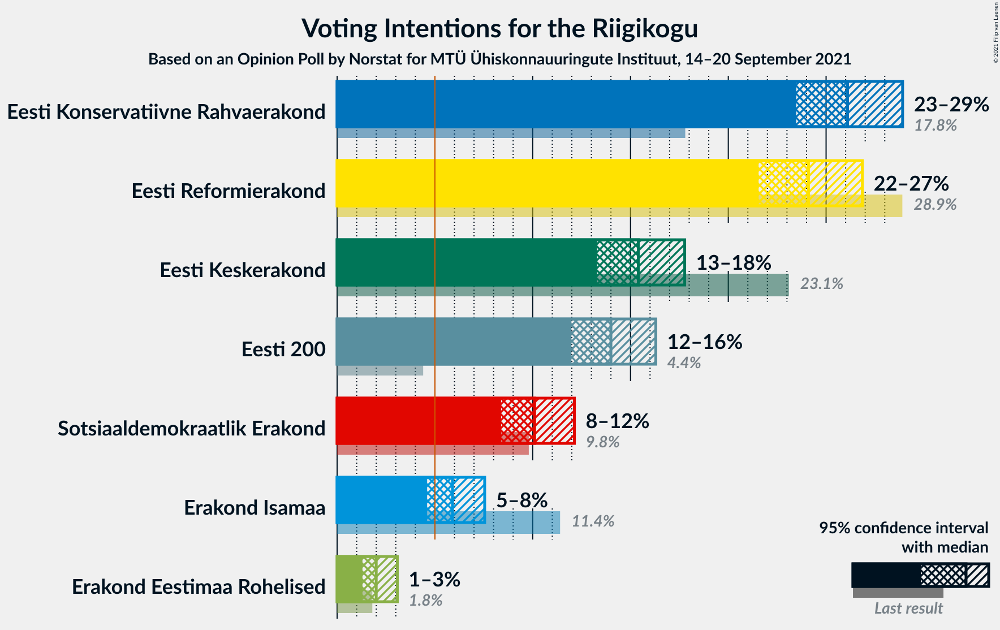
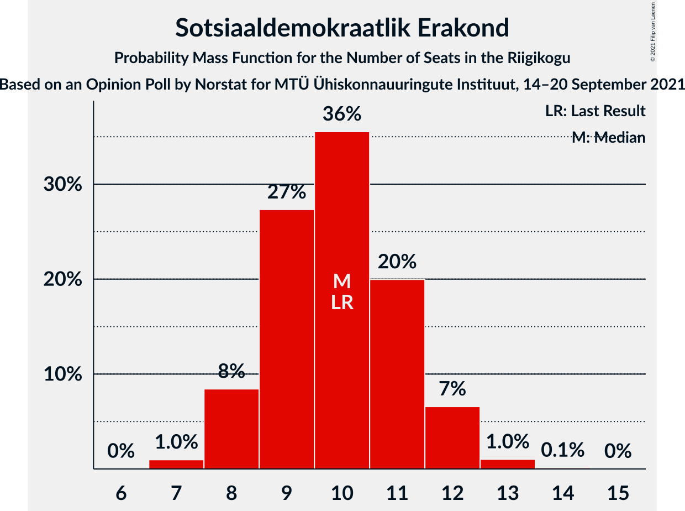
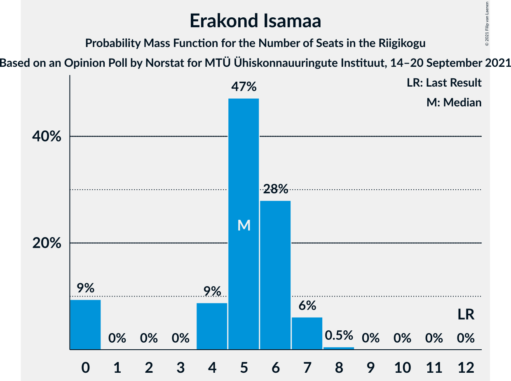
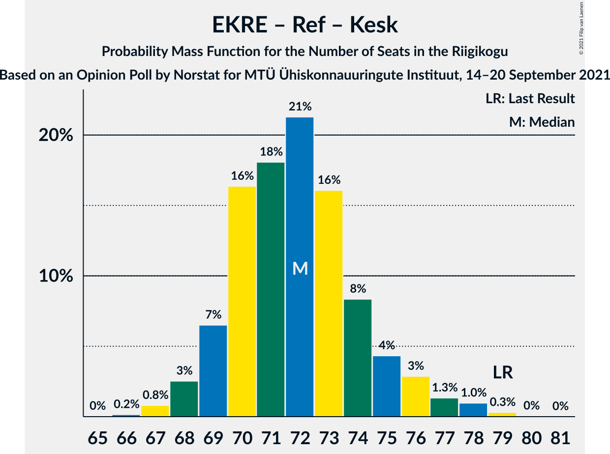
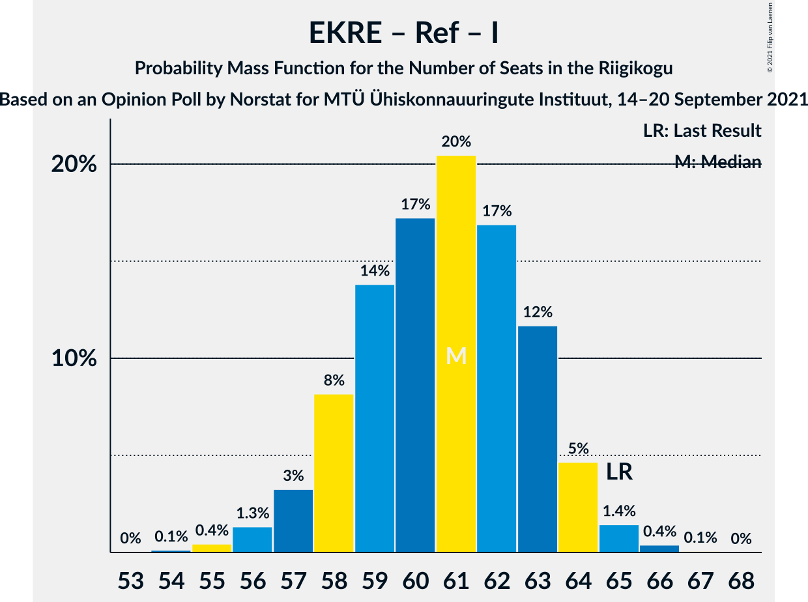
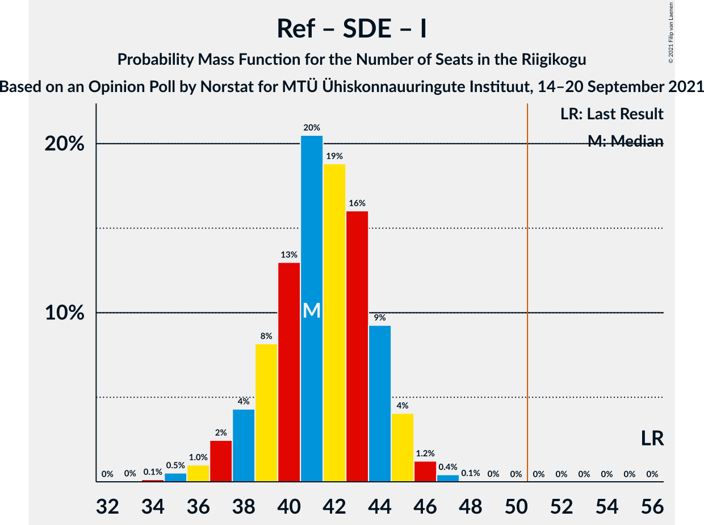
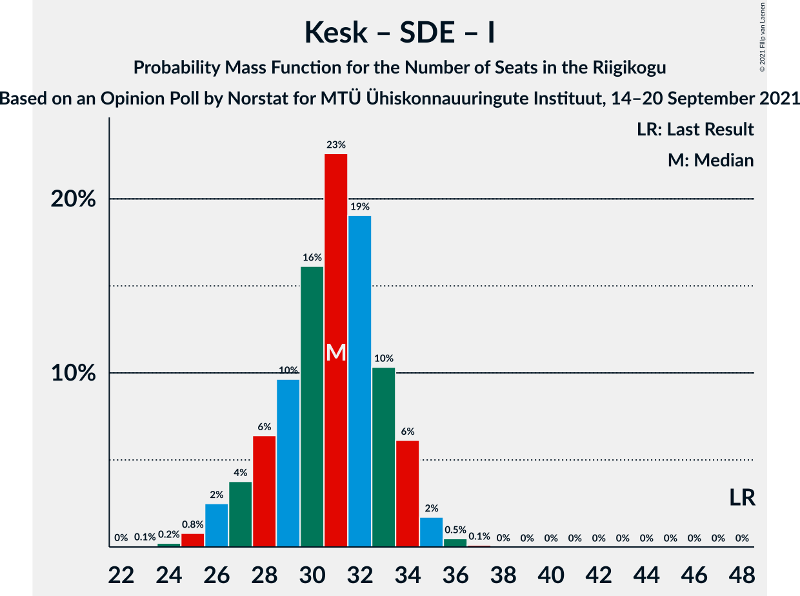

# Opinion Poll by Norstat for MTÜ Ühiskonnauuringute Instituut, 14–20 September 2021

<a href="#voting-intentions">Voting Intentions</a> | <a href="#seats">Seats</a> | <a href="#coalitions">Coalitions</a> | <a href="#technical-information">Technical Information</a>

## Voting Intentions

### Confidence Intervals

| Party | Last Result | Poll Result | 80% Confidence Interval | 90% Confidence Interval | 95% Confidence Interval | 99% Confidence Interval |
|:-----:|:-----------:|:-----------:|:-----------------------:|:-----------------------:|:-----------------------:|:-----------------------:|
| Eesti Konservatiivne Rahvaerakond | 17.8% | 26.1% | 24.4–27.9% |23.9–28.5% |23.5–28.9% |22.7–29.8% |
| Eesti Reformierakond | 28.9% | 24.1% | 22.4–25.9% |21.9–26.4% |21.6–26.9% |20.8–27.7% |
| Eesti Keskerakond | 23.1% | 15.4% | 14.0–16.9% |13.6–17.4% |13.3–17.8% |12.7–18.5% |
| Eesti 200 | 4.4% | 14.0% | 12.7–15.5% |12.3–15.9% |12.0–16.3% |11.4–17.0% |
| Sotsiaaldemokraatlik Erakond | 9.8% | 10.1% | 9.0–11.4% |8.6–11.8% |8.4–12.1% |7.9–12.8% |
| Erakond Isamaa | 11.4% | 5.9% | 5.0–7.0% |4.8–7.3% |4.6–7.5% |4.2–8.1% |
| Erakond Eestimaa Rohelised | 1.8% | 2.0% | 1.5–2.7% |1.4–2.9% |1.3–3.1% |1.1–3.4% |

*Note:* The poll result column reflects the actual value used in the calculations. Published results may vary slightly, and in addition be rounded to fewer digits.

## Seats

### Confidence Intervals

| Party | Last Result | Median | 80% Confidence Interval | 90% Confidence Interval | 95% Confidence Interval | 99% Confidence Interval |
|:-----:|:-----------:|:------:|:-----------------------:|:-----------------------:|:-----------------------:|:-----------------------:|
| <a href="#eesti-konservatiivne-rahvaerakond">Eesti Konservatiivne Rahvaerakond</a> | 19 | 30 | 27–31 |26–32 |26–33 |25–34 |
| <a href="#eesti-reformierakond">Eesti Reformierakond</a> | 34 | 27 | 24–29 |24–30 |23–30 |22–31 |
| <a href="#eesti-keskerakond">Eesti Keskerakond</a> | 26 | 16 | 14–18 |14–18 |13–19 |13–20 |
| <a href="#eesti-200">Eesti 200</a> | 0 | 14 | 13–16 |12–17 |12–17 |11–18 |
| <a href="#sotsiaaldemokraatlik-erakond">Sotsiaaldemokraatlik Erakond</a> | 10 | 10 | 8–11 |8–12 |8–12 |7–13 |
| <a href="#erakond-isamaa">Erakond Isamaa</a> | 12 | 5 | 4–6 |0–7 |0–7 |0–8 |
| <a href="#erakond-eestimaa-rohelised">Erakond Eestimaa Rohelised</a> | 0 | 0 | 0 |0 |0 |0 |

### Eesti Konservatiivne Rahvaerakond

*For a full overview of the results for this party, see the [Eesti Konservatiivne Rahvaerakond](party-eestikonservatiivnerahvaerakond.html) page.*

| Number of Seats | Probability | Accumulated | Special Marks |
|:---------------:|:-----------:|:-----------:|:-------------:|
| 19 | 0% | 100% | Last Result |
| 20 | 0% | 100% |  |
| 21 | 0% | 100% |  |
| 22 | 0% | 100% |  |
| 23 | 0% | 100% |  |
| 24 | 0.3% | 100% |  |
| 25 | 1.0% | 99.7% |  |
| 26 | 4% | 98.7% |  |
| 27 | 11% | 94% |  |
| 28 | 13% | 83% |  |
| 29 | 19% | 70% |  |
| 30 | 26% | 51% | Median |
| 31 | 18% | 25% |  |
| 32 | 4% | 6% |  |
| 33 | 2% | 3% |  |
| 34 | 0.5% | 0.8% |  |
| 35 | 0.2% | 0.2% |  |
| 36 | 0% | 0% |  |

### Eesti Reformierakond

*For a full overview of the results for this party, see the [Eesti Reformierakond](party-eestireformierakond.html) page.*

| Number of Seats | Probability | Accumulated | Special Marks |
|:---------------:|:-----------:|:-----------:|:-------------:|
| 22 | 0.6% | 100% |  |
| 23 | 4% | 99.4% |  |
| 24 | 7% | 96% |  |
| 25 | 16% | 89% |  |
| 26 | 18% | 73% |  |
| 27 | 23% | 55% | Median |
| 28 | 19% | 31% |  |
| 29 | 6% | 13% |  |
| 30 | 5% | 6% |  |
| 31 | 1.0% | 1.3% |  |
| 32 | 0.3% | 0.3% |  |
| 33 | 0.1% | 0.1% |  |
| 34 | 0% | 0% | Last Result |

### Eesti Keskerakond

*For a full overview of the results for this party, see the [Eesti Keskerakond](party-eestikeskerakond.html) page.*

| Number of Seats | Probability | Accumulated | Special Marks |
|:---------------:|:-----------:|:-----------:|:-------------:|
| 12 | 0.2% | 100% |  |
| 13 | 3% | 99.7% |  |
| 14 | 8% | 97% |  |
| 15 | 33% | 90% |  |
| 16 | 30% | 57% | Median |
| 17 | 16% | 27% |  |
| 18 | 7% | 11% |  |
| 19 | 3% | 5% |  |
| 20 | 1.1% | 1.2% |  |
| 21 | 0.1% | 0.1% |  |
| 22 | 0% | 0% |  |
| 23 | 0% | 0% |  |
| 24 | 0% | 0% |  |
| 25 | 0% | 0% |  |
| 26 | 0% | 0% | Last Result |

### Eesti 200

*For a full overview of the results for this party, see the [Eesti 200](party-eesti200.html) page.*

| Number of Seats | Probability | Accumulated | Special Marks |
|:---------------:|:-----------:|:-----------:|:-------------:|
| 0 | 0% | 100% | Last Result |
| 1 | 0% | 100% |  |
| 2 | 0% | 100% |  |
| 3 | 0% | 100% |  |
| 4 | 0% | 100% |  |
| 5 | 0% | 100% |  |
| 6 | 0% | 100% |  |
| 7 | 0% | 100% |  |
| 8 | 0% | 100% |  |
| 9 | 0% | 100% |  |
| 10 | 0.1% | 100% |  |
| 11 | 1.2% | 99.9% |  |
| 12 | 7% | 98.8% |  |
| 13 | 21% | 92% |  |
| 14 | 24% | 71% | Median |
| 15 | 30% | 46% |  |
| 16 | 9% | 16% |  |
| 17 | 6% | 7% |  |
| 18 | 1.5% | 2% |  |
| 19 | 0.1% | 0.1% |  |
| 20 | 0% | 0% |  |

### Sotsiaaldemokraatlik Erakond

*For a full overview of the results for this party, see the [Sotsiaaldemokraatlik Erakond](party-sotsiaaldemokraatlikerakond.html) page.*

| Number of Seats | Probability | Accumulated | Special Marks |
|:---------------:|:-----------:|:-----------:|:-------------:|
| 7 | 0.6% | 100% |  |
| 8 | 10% | 99.4% |  |
| 9 | 28% | 89% |  |
| 10 | 36% | 61% | Last Result, Median |
| 11 | 17% | 25% |  |
| 12 | 6% | 8% |  |
| 13 | 1.2% | 1.3% |  |
| 14 | 0.1% | 0.1% |  |
| 15 | 0% | 0% |  |

### Erakond Isamaa

*For a full overview of the results for this party, see the [Erakond Isamaa](party-erakondisamaa.html) page.*

| Number of Seats | Probability | Accumulated | Special Marks |
|:---------------:|:-----------:|:-----------:|:-------------:|
| 0 | 6% | 100% |  |
| 1 | 0% | 94% |  |
| 2 | 0% | 94% |  |
| 3 | 0% | 94% |  |
| 4 | 6% | 94% |  |
| 5 | 55% | 88% | Median |
| 6 | 28% | 33% |  |
| 7 | 5% | 5% |  |
| 8 | 0.6% | 0.6% |  |
| 9 | 0% | 0% |  |
| 10 | 0% | 0% |  |
| 11 | 0% | 0% |  |
| 12 | 0% | 0% | Last Result |

### Erakond Eestimaa Rohelised

*For a full overview of the results for this party, see the [Erakond Eestimaa Rohelised](party-erakondeestimaarohelised.html) page.*

| Number of Seats | Probability | Accumulated | Special Marks |
|:---------------:|:-----------:|:-----------:|:-------------:|
| 0 | 100% | 100% | Last Result, Median |

## Coalitions

### Confidence Intervals

| Coalition | Last Result | Median | Majority? | 80% Confidence Interval | 90% Confidence Interval | 95% Confidence Interval | 99% Confidence Interval |
|:---------:|:-----------:|:------:|:---------:|:-----------------------:|:-----------------------:|:-----------------------:|:-----------------------:|
| Eesti Konservatiivne Rahvaerakond – Eesti Reformierakond – Eesti Keskerakond | 79 | 72 | 100% | 69–74 | 69–75 | 68–77 | 67–79 |
| Eesti Konservatiivne Rahvaerakond – Eesti Reformierakond – Erakond Isamaa | 65 | 61 | 100% | 58–63 | 57–64 | 57–65 | 55–66 |
| Eesti Konservatiivne Rahvaerakond – Eesti Reformierakond | 53 | 56 | 99.7% | 53–58 | 52–59 | 52–60 | 51–62 |
| Eesti Konservatiivne Rahvaerakond – Eesti Keskerakond – Erakond Isamaa | 57 | 50 | 42% | 48–52 | 47–53 | 46–54 | 44–55 |
| Eesti Konservatiivne Rahvaerakond – Eesti Keskerakond | 45 | 45 | 0.6% | 43–48 | 42–48 | 41–49 | 40–51 |
| Eesti Reformierakond – Eesti Keskerakond | 60 | 42 | 0% | 40–45 | 40–47 | 39–47 | 38–48 |
| Eesti Reformierakond – Sotsiaaldemokraatlik Erakond – Erakond Isamaa | 56 | 41 | 0% | 39–44 | 38–45 | 37–45 | 36–47 |
| Eesti Konservatiivne Rahvaerakond – Sotsiaaldemokraatlik Erakond | 29 | 39 | 0% | 37–41 | 36–42 | 35–42 | 34–44 |
| Eesti Reformierakond – Sotsiaaldemokraatlik Erakond | 44 | 36 | 0% | 34–39 | 34–40 | 33–40 | 32–41 |
| Eesti Reformierakond – Erakond Isamaa | 46 | 32 | 0% | 29–34 | 28–35 | 27–35 | 25–37 |
| Eesti Keskerakond – Sotsiaaldemokraatlik Erakond – Erakond Isamaa | 48 | 31 | 0% | 28–33 | 28–34 | 27–34 | 25–36 |
| Eesti Keskerakond – Sotsiaaldemokraatlik Erakond | 36 | 26 | 0% | 24–28 | 23–29 | 22–29 | 22–31 |

### Eesti Konservatiivne Rahvaerakond – Eesti Reformierakond – Eesti Keskerakond

| Number of Seats | Probability | Accumulated | Special Marks |
|:---------------:|:-----------:|:-----------:|:-------------:|
| 66 | 0.1% | 100% |  |
| 67 | 0.6% | 99.8% |  |
| 68 | 3% | 99.2% |  |
| 69 | 7% | 96% |  |
| 70 | 15% | 90% |  |
| 71 | 15% | 75% |  |
| 72 | 28% | 60% |  |
| 73 | 17% | 32% | Median |
| 74 | 8% | 15% |  |
| 75 | 2% | 7% |  |
| 76 | 2% | 5% |  |
| 77 | 2% | 3% |  |
| 78 | 0.2% | 0.9% |  |
| 79 | 0.7% | 0.8% | Last Result |
| 80 | 0.1% | 0.1% |  |
| 81 | 0% | 0% |  |

### Eesti Konservatiivne Rahvaerakond – Eesti Reformierakond – Erakond Isamaa

| Number of Seats | Probability | Accumulated | Special Marks |
|:---------------:|:-----------:|:-----------:|:-------------:|
| 54 | 0.1% | 100% |  |
| 55 | 0.4% | 99.9% |  |
| 56 | 1.4% | 99.4% |  |
| 57 | 3% | 98% |  |
| 58 | 9% | 95% |  |
| 59 | 12% | 86% |  |
| 60 | 11% | 75% |  |
| 61 | 19% | 64% |  |
| 62 | 21% | 45% | Median |
| 63 | 17% | 24% |  |
| 64 | 4% | 6% |  |
| 65 | 2% | 3% | Last Result |
| 66 | 0.4% | 0.5% |  |
| 67 | 0.1% | 0.1% |  |
| 68 | 0% | 0% |  |

### Eesti Konservatiivne Rahvaerakond – Eesti Reformierakond

| Number of Seats | Probability | Accumulated | Special Marks |
|:---------------:|:-----------:|:-----------:|:-------------:|
| 49 | 0% | 100% |  |
| 50 | 0.2% | 99.9% |  |
| 51 | 2% | 99.7% | Majority |
| 52 | 3% | 98% |  |
| 53 | 8% | 95% | Last Result |
| 54 | 13% | 87% |  |
| 55 | 14% | 74% |  |
| 56 | 16% | 60% |  |
| 57 | 22% | 45% | Median |
| 58 | 15% | 23% |  |
| 59 | 3% | 7% |  |
| 60 | 2% | 4% |  |
| 61 | 0.9% | 2% |  |
| 62 | 0.6% | 0.7% |  |
| 63 | 0.1% | 0.2% |  |
| 64 | 0% | 0% |  |

### Eesti Konservatiivne Rahvaerakond – Eesti Keskerakond – Erakond Isamaa

| Number of Seats | Probability | Accumulated | Special Marks |
|:---------------:|:-----------:|:-----------:|:-------------:|
| 43 | 0.2% | 100% |  |
| 44 | 0.4% | 99.8% |  |
| 45 | 0.6% | 99.4% |  |
| 46 | 2% | 98.8% |  |
| 47 | 4% | 97% |  |
| 48 | 7% | 92% |  |
| 49 | 17% | 85% |  |
| 50 | 25% | 68% |  |
| 51 | 20% | 42% | Median, Majority |
| 52 | 14% | 23% |  |
| 53 | 5% | 9% |  |
| 54 | 3% | 5% |  |
| 55 | 1.3% | 2% |  |
| 56 | 0.2% | 0.3% |  |
| 57 | 0% | 0.1% | Last Result |
| 58 | 0% | 0% |  |

### Eesti Konservatiivne Rahvaerakond – Eesti Keskerakond

| Number of Seats | Probability | Accumulated | Special Marks |
|:---------------:|:-----------:|:-----------:|:-------------:|
| 39 | 0.1% | 100% |  |
| 40 | 0.5% | 99.9% |  |
| 41 | 3% | 99.4% |  |
| 42 | 4% | 97% |  |
| 43 | 9% | 92% |  |
| 44 | 19% | 83% |  |
| 45 | 18% | 64% | Last Result |
| 46 | 24% | 45% | Median |
| 47 | 11% | 22% |  |
| 48 | 5% | 10% |  |
| 49 | 3% | 5% |  |
| 50 | 1.2% | 2% |  |
| 51 | 0.4% | 0.6% | Majority |
| 52 | 0.1% | 0.1% |  |
| 53 | 0% | 0% |  |

### Eesti Reformierakond – Eesti Keskerakond

| Number of Seats | Probability | Accumulated | Special Marks |
|:---------------:|:-----------:|:-----------:|:-------------:|
| 36 | 0% | 100% |  |
| 37 | 0.3% | 99.9% |  |
| 38 | 0.6% | 99.6% |  |
| 39 | 2% | 99.0% |  |
| 40 | 7% | 97% |  |
| 41 | 20% | 89% |  |
| 42 | 23% | 69% |  |
| 43 | 24% | 46% | Median |
| 44 | 9% | 22% |  |
| 45 | 5% | 13% |  |
| 46 | 3% | 8% |  |
| 47 | 3% | 5% |  |
| 48 | 2% | 2% |  |
| 49 | 0.2% | 0.3% |  |
| 50 | 0% | 0% |  |
| 51 | 0% | 0% | Majority |
| 52 | 0% | 0% |  |
| 53 | 0% | 0% |  |
| 54 | 0% | 0% |  |
| 55 | 0% | 0% |  |
| 56 | 0% | 0% |  |
| 57 | 0% | 0% |  |
| 58 | 0% | 0% |  |
| 59 | 0% | 0% |  |
| 60 | 0% | 0% | Last Result |

### Eesti Reformierakond – Sotsiaaldemokraatlik Erakond – Erakond Isamaa

| Number of Seats | Probability | Accumulated | Special Marks |
|:---------------:|:-----------:|:-----------:|:-------------:|
| 34 | 0.1% | 100% |  |
| 35 | 0.3% | 99.9% |  |
| 36 | 0.7% | 99.6% |  |
| 37 | 2% | 98.9% |  |
| 38 | 3% | 97% |  |
| 39 | 11% | 94% |  |
| 40 | 15% | 83% |  |
| 41 | 19% | 68% |  |
| 42 | 18% | 49% | Median |
| 43 | 14% | 32% |  |
| 44 | 12% | 18% |  |
| 45 | 4% | 6% |  |
| 46 | 1.3% | 2% |  |
| 47 | 0.8% | 0.9% |  |
| 48 | 0.1% | 0.1% |  |
| 49 | 0% | 0% |  |
| 50 | 0% | 0% |  |
| 51 | 0% | 0% | Majority |
| 52 | 0% | 0% |  |
| 53 | 0% | 0% |  |
| 54 | 0% | 0% |  |
| 55 | 0% | 0% |  |
| 56 | 0% | 0% | Last Result |

### Eesti Konservatiivne Rahvaerakond – Sotsiaaldemokraatlik Erakond

| Number of Seats | Probability | Accumulated | Special Marks |
|:---------------:|:-----------:|:-----------:|:-------------:|
| 29 | 0% | 100% | Last Result |
| 30 | 0% | 100% |  |
| 31 | 0% | 100% |  |
| 32 | 0% | 100% |  |
| 33 | 0.2% | 100% |  |
| 34 | 0.7% | 99.8% |  |
| 35 | 3% | 99.1% |  |
| 36 | 4% | 96% |  |
| 37 | 9% | 92% |  |
| 38 | 15% | 83% |  |
| 39 | 25% | 68% |  |
| 40 | 22% | 43% | Median |
| 41 | 14% | 22% |  |
| 42 | 5% | 8% |  |
| 43 | 1.4% | 2% |  |
| 44 | 0.6% | 1.1% |  |
| 45 | 0.3% | 0.5% |  |
| 46 | 0.1% | 0.2% |  |
| 47 | 0% | 0% |  |

### Eesti Reformierakond – Sotsiaaldemokraatlik Erakond

| Number of Seats | Probability | Accumulated | Special Marks |
|:---------------:|:-----------:|:-----------:|:-------------:|
| 31 | 0.2% | 100% |  |
| 32 | 1.2% | 99.7% |  |
| 33 | 3% | 98.6% |  |
| 34 | 11% | 95% |  |
| 35 | 15% | 84% |  |
| 36 | 20% | 69% |  |
| 37 | 18% | 49% | Median |
| 38 | 18% | 31% |  |
| 39 | 6% | 13% |  |
| 40 | 5% | 7% |  |
| 41 | 2% | 2% |  |
| 42 | 0.2% | 0.4% |  |
| 43 | 0.1% | 0.2% |  |
| 44 | 0% | 0% | Last Result |

### Eesti Reformierakond – Erakond Isamaa

| Number of Seats | Probability | Accumulated | Special Marks |
|:---------------:|:-----------:|:-----------:|:-------------:|
| 24 | 0.1% | 100% |  |
| 25 | 0.5% | 99.9% |  |
| 26 | 0.4% | 99.4% |  |
| 27 | 2% | 99.0% |  |
| 28 | 4% | 97% |  |
| 29 | 7% | 94% |  |
| 30 | 16% | 87% |  |
| 31 | 16% | 71% |  |
| 32 | 20% | 55% | Median |
| 33 | 20% | 36% |  |
| 34 | 8% | 16% |  |
| 35 | 6% | 8% |  |
| 36 | 1.3% | 2% |  |
| 37 | 0.5% | 0.5% |  |
| 38 | 0.1% | 0.1% |  |
| 39 | 0% | 0% |  |
| 40 | 0% | 0% |  |
| 41 | 0% | 0% |  |
| 42 | 0% | 0% |  |
| 43 | 0% | 0% |  |
| 44 | 0% | 0% |  |
| 45 | 0% | 0% |  |
| 46 | 0% | 0% | Last Result |

### Eesti Keskerakond – Sotsiaaldemokraatlik Erakond – Erakond Isamaa

| Number of Seats | Probability | Accumulated | Special Marks |
|:---------------:|:-----------:|:-----------:|:-------------:|
| 23 | 0% | 100% |  |
| 24 | 0.1% | 99.9% |  |
| 25 | 0.8% | 99.8% |  |
| 26 | 0.7% | 99.0% |  |
| 27 | 2% | 98% |  |
| 28 | 6% | 96% |  |
| 29 | 18% | 90% |  |
| 30 | 19% | 72% |  |
| 31 | 21% | 53% | Median |
| 32 | 12% | 33% |  |
| 33 | 13% | 21% |  |
| 34 | 6% | 8% |  |
| 35 | 2% | 2% |  |
| 36 | 0.4% | 0.5% |  |
| 37 | 0.1% | 0.1% |  |
| 38 | 0% | 0% |  |
| 39 | 0% | 0% |  |
| 40 | 0% | 0% |  |
| 41 | 0% | 0% |  |
| 42 | 0% | 0% |  |
| 43 | 0% | 0% |  |
| 44 | 0% | 0% |  |
| 45 | 0% | 0% |  |
| 46 | 0% | 0% |  |
| 47 | 0% | 0% |  |
| 48 | 0% | 0% | Last Result |

### Eesti Keskerakond – Sotsiaaldemokraatlik Erakond

| Number of Seats | Probability | Accumulated | Special Marks |
|:---------------:|:-----------:|:-----------:|:-------------:|
| 21 | 0.2% | 100% |  |
| 22 | 3% | 99.8% |  |
| 23 | 5% | 97% |  |
| 24 | 16% | 92% |  |
| 25 | 24% | 76% |  |
| 26 | 23% | 52% | Median |
| 27 | 14% | 29% |  |
| 28 | 8% | 15% |  |
| 29 | 5% | 7% |  |
| 30 | 2% | 2% |  |
| 31 | 0.4% | 0.5% |  |
| 32 | 0.1% | 0.1% |  |
| 33 | 0% | 0% |  |
| 34 | 0% | 0% |  |
| 35 | 0% | 0% |  |
| 36 | 0% | 0% | Last Result |

## Technical Information

### Opinion Poll

+ **Polling firm:** Norstat
+ **Commissioner(s):** MTÜ Ühiskonnauuringute Instituut
+ **Fieldwork period:** 14–20 September 2021

### Calculations

+ **Sample size:** 1000
+ **Simulations done:** 131,072
+ **Error estimate:** 1.51%

