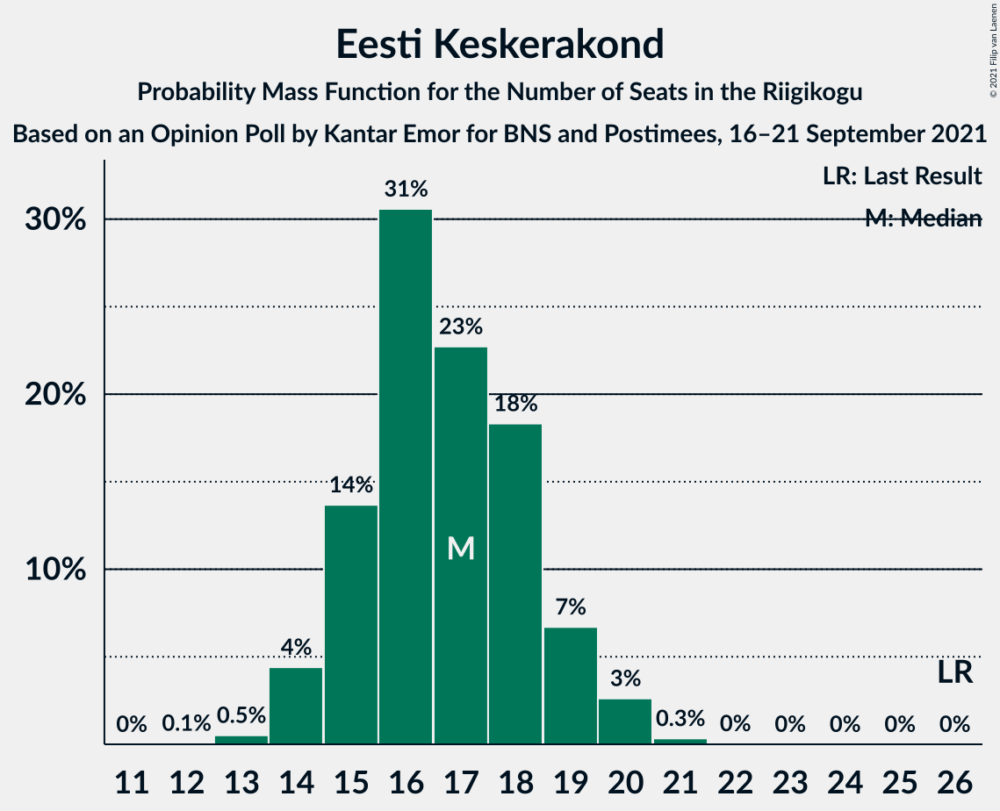

# Opinion Poll by Kantar Emor for BNS and Postimees, 16–21 September 2021

<a href="#voting-intentions">Voting Intentions</a> | <a href="#seats">Seats</a> | <a href="#coalitions">Coalitions</a> | <a href="#technical-information">Technical Information</a>

## Voting Intentions

### Confidence Intervals

| Party | Last Result | Poll Result | 80% Confidence Interval | 90% Confidence Interval | 95% Confidence Interval | 99% Confidence Interval |
|:-----:|:-----------:|:-----------:|:-----------------------:|:-----------------------:|:-----------------------:|:-----------------------:|
| Eesti Reformierakond | 28.9% | 27.0% | 25.3–28.8% |24.8–29.3% |24.4–29.7% |23.6–30.6% |
| Eesti Konservatiivne Rahvaerakond | 17.8% | 22.0% | 20.4–23.7% |20.0–24.2% |19.6–24.6% |18.9–25.4% |
| Eesti Keskerakond | 23.1% | 16.0% | 14.7–17.6% |14.3–18.0% |13.9–18.4% |13.3–19.1% |
| Eesti 200 | 4.4% | 16.0% | 14.7–17.6% |14.3–18.0% |13.9–18.4% |13.3–19.1% |
| Sotsiaaldemokraatlik Erakond | 9.8% | 9.0% | 7.9–10.2% |7.6–10.5% |7.4–10.8% |6.9–11.4% |
| Erakond Isamaa | 11.4% | 6.0% | 5.2–7.1% |5.0–7.4% |4.8–7.7% |4.4–8.2% |
| Erakond Eestimaa Rohelised | 1.8% | 3.0% | 2.4–3.8% |2.3–4.0% |2.1–4.2% |1.9–4.6% |

*Note:* The poll result column reflects the actual value used in the calculations. Published results may vary slightly, and in addition be rounded to fewer digits.

## Seats

### Confidence Intervals

| Party | Last Result | Median | 80% Confidence Interval | 90% Confidence Interval | 95% Confidence Interval | 99% Confidence Interval |
|:-----:|:-----------:|:------:|:-----------------------:|:-----------------------:|:-----------------------:|:-----------------------:|
| <a href="#eesti-reformierakond">Eesti Reformierakond</a> | 34 | 30 | 28–32 |27–33 |27–33 |26–35 |
| <a href="#eesti-konservatiivne-rahvaerakond">Eesti Konservatiivne Rahvaerakond</a> | 19 | 24 | 22–26 |21–27 |21–27 |20–28 |
| <a href="#eesti-keskerakond">Eesti Keskerakond</a> | 26 | 17 | 15–18 |15–19 |14–20 |13–20 |
| <a href="#eesti-200">Eesti 200</a> | 0 | 17 | 15–18 |14–19 |14–19 |13–20 |
| <a href="#sotsiaaldemokraatlik-erakond">Sotsiaaldemokraatlik Erakond</a> | 10 | 9 | 7–10 |7–10 |7–10 |6–11 |
| <a href="#erakond-isamaa">Erakond Isamaa</a> | 12 | 5 | 4–6 |0–7 |0–7 |0–8 |
| <a href="#erakond-eestimaa-rohelised">Erakond Eestimaa Rohelised</a> | 0 | 0 | 0 |0 |0 |0 |

### Eesti Reformierakond

*For a full overview of the results for this party, see the [Eesti Reformierakond](party-eestireformierakond.html) page.*

| Number of Seats | Probability | Accumulated | Special Marks |
|:---------------:|:-----------:|:-----------:|:-------------:|
| 25 | 0.2% | 100% |  |
| 26 | 1.0% | 99.7% |  |
| 27 | 5% | 98.7% |  |
| 28 | 12% | 94% |  |
| 29 | 28% | 81% |  |
| 30 | 15% | 53% | Median |
| 31 | 19% | 38% |  |
| 32 | 13% | 19% |  |
| 33 | 4% | 6% |  |
| 34 | 1.2% | 2% | Last Result |
| 35 | 0.7% | 0.9% |  |
| 36 | 0.2% | 0.2% |  |
| 37 | 0% | 0% |  |

### Eesti Konservatiivne Rahvaerakond

*For a full overview of the results for this party, see the [Eesti Konservatiivne Rahvaerakond](party-eestikonservatiivnerahvaerakond.html) page.*

| Number of Seats | Probability | Accumulated | Special Marks |
|:---------------:|:-----------:|:-----------:|:-------------:|
| 19 | 0.2% | 100% | Last Result |
| 20 | 1.2% | 99.8% |  |
| 21 | 4% | 98.6% |  |
| 22 | 13% | 94% |  |
| 23 | 24% | 81% |  |
| 24 | 25% | 57% | Median |
| 25 | 16% | 32% |  |
| 26 | 8% | 15% |  |
| 27 | 6% | 7% |  |
| 28 | 0.8% | 0.9% |  |
| 29 | 0.1% | 0.2% |  |
| 30 | 0% | 0.1% |  |
| 31 | 0% | 0% |  |

### Eesti Keskerakond

*For a full overview of the results for this party, see the [Eesti Keskerakond](party-eestikeskerakond.html) page.*

| Number of Seats | Probability | Accumulated | Special Marks |
|:---------------:|:-----------:|:-----------:|:-------------:|
| 12 | 0.1% | 100% |  |
| 13 | 0.5% | 99.9% |  |
| 14 | 4% | 99.4% |  |
| 15 | 14% | 95% |  |
| 16 | 31% | 81% |  |
| 17 | 23% | 51% | Median |
| 18 | 18% | 28% |  |
| 19 | 7% | 10% |  |
| 20 | 3% | 3% |  |
| 21 | 0.3% | 0.4% |  |
| 22 | 0% | 0% |  |
| 23 | 0% | 0% |  |
| 24 | 0% | 0% |  |
| 25 | 0% | 0% |  |
| 26 | 0% | 0% | Last Result |

### Eesti 200

*For a full overview of the results for this party, see the [Eesti 200](party-eesti200.html) page.*

| Number of Seats | Probability | Accumulated | Special Marks |
|:---------------:|:-----------:|:-----------:|:-------------:|
| 0 | 0% | 100% | Last Result |
| 1 | 0% | 100% |  |
| 2 | 0% | 100% |  |
| 3 | 0% | 100% |  |
| 4 | 0% | 100% |  |
| 5 | 0% | 100% |  |
| 6 | 0% | 100% |  |
| 7 | 0% | 100% |  |
| 8 | 0% | 100% |  |
| 9 | 0% | 100% |  |
| 10 | 0% | 100% |  |
| 11 | 0% | 100% |  |
| 12 | 0% | 100% |  |
| 13 | 0.6% | 100% |  |
| 14 | 5% | 99.3% |  |
| 15 | 12% | 95% |  |
| 16 | 20% | 82% |  |
| 17 | 37% | 62% | Median |
| 18 | 15% | 25% |  |
| 19 | 7% | 10% |  |
| 20 | 2% | 2% |  |
| 21 | 0.5% | 0.5% |  |
| 22 | 0% | 0% |  |

### Sotsiaaldemokraatlik Erakond

*For a full overview of the results for this party, see the [Sotsiaaldemokraatlik Erakond](party-sotsiaaldemokraatlikerakond.html) page.*

| Number of Seats | Probability | Accumulated | Special Marks |
|:---------------:|:-----------:|:-----------:|:-------------:|
| 6 | 2% | 100% |  |
| 7 | 11% | 98% |  |
| 8 | 31% | 87% |  |
| 9 | 36% | 56% | Median |
| 10 | 17% | 19% | Last Result |
| 11 | 2% | 2% |  |
| 12 | 0.3% | 0.3% |  |
| 13 | 0% | 0% |  |

### Erakond Isamaa

*For a full overview of the results for this party, see the [Erakond Isamaa](party-erakondisamaa.html) page.*

| Number of Seats | Probability | Accumulated | Special Marks |
|:---------------:|:-----------:|:-----------:|:-------------:|
| 0 | 5% | 100% |  |
| 1 | 0% | 95% |  |
| 2 | 0% | 95% |  |
| 3 | 0% | 95% |  |
| 4 | 8% | 95% |  |
| 5 | 41% | 86% | Median |
| 6 | 39% | 45% |  |
| 7 | 5% | 6% |  |
| 8 | 0.8% | 0.8% |  |
| 9 | 0% | 0% |  |
| 10 | 0% | 0% |  |
| 11 | 0% | 0% |  |
| 12 | 0% | 0% | Last Result |

### Erakond Eestimaa Rohelised

*For a full overview of the results for this party, see the [Erakond Eestimaa Rohelised](party-erakondeestimaarohelised.html) page.*

| Number of Seats | Probability | Accumulated | Special Marks |
|:---------------:|:-----------:|:-----------:|:-------------:|
| 0 | 99.9% | 100% | Last Result, Median |
| 1 | 0% | 0.1% |  |
| 2 | 0% | 0.1% |  |
| 3 | 0% | 0.1% |  |
| 4 | 0.1% | 0.1% |  |
| 5 | 0% | 0% |  |

## Coalitions

### Confidence Intervals

| Coalition | Last Result | Median | Majority? | 80% Confidence Interval | 90% Confidence Interval | 95% Confidence Interval | 99% Confidence Interval |
|:---------:|:-----------:|:------:|:---------:|:-----------------------:|:-----------------------:|:-----------------------:|:-----------------------:|
| Eesti Reformierakond – Eesti Konservatiivne Rahvaerakond – Eesti Keskerakond | 79 | 70 | 100% | 69–73 | 68–74 | 67–75 | 66–77 |
| Eesti Reformierakond – Eesti Konservatiivne Rahvaerakond – Erakond Isamaa | 65 | 59 | 100% | 56–62 | 56–62 | 55–62 | 54–64 |
| Eesti Reformierakond – Eesti Konservatiivne Rahvaerakond | 53 | 53 | 97% | 51–56 | 51–57 | 50–58 | 49–60 |
| Eesti Reformierakond – Eesti Keskerakond | 60 | 46 | 4% | 44–49 | 43–50 | 43–51 | 42–52 |
| Eesti Konservatiivne Rahvaerakond – Eesti Keskerakond – Erakond Isamaa | 57 | 46 | 0.7% | 43–48 | 42–49 | 42–49 | 40–51 |
| Eesti Reformierakond – Sotsiaaldemokraatlik Erakond – Erakond Isamaa | 56 | 44 | 0% | 41–46 | 41–47 | 40–48 | 38–49 |
| Eesti Konservatiivne Rahvaerakond – Eesti Keskerakond | 45 | 40 | 0% | 38–43 | 37–44 | 37–44 | 36–46 |
| Eesti Reformierakond – Sotsiaaldemokraatlik Erakond | 44 | 38 | 0% | 36–41 | 36–42 | 35–42 | 34–43 |
| Eesti Reformierakond – Erakond Isamaa | 46 | 35 | 0% | 33–38 | 32–38 | 31–39 | 29–40 |
| Eesti Konservatiivne Rahvaerakond – Sotsiaaldemokraatlik Erakond | 29 | 32 | 0% | 30–35 | 30–35 | 29–36 | 28–37 |
| Eesti Keskerakond – Sotsiaaldemokraatlik Erakond – Erakond Isamaa | 48 | 31 | 0% | 28–33 | 27–33 | 26–34 | 25–35 |
| Eesti Keskerakond – Sotsiaaldemokraatlik Erakond | 36 | 25 | 0% | 23–27 | 23–28 | 22–28 | 21–30 |

### Eesti Reformierakond – Eesti Konservatiivne Rahvaerakond – Eesti Keskerakond

| Number of Seats | Probability | Accumulated | Special Marks |
|:---------------:|:-----------:|:-----------:|:-------------:|
| 65 | 0.1% | 100% |  |
| 66 | 0.8% | 99.9% |  |
| 67 | 3% | 99.1% |  |
| 68 | 5% | 96% |  |
| 69 | 31% | 91% |  |
| 70 | 13% | 60% |  |
| 71 | 21% | 47% | Median |
| 72 | 12% | 26% |  |
| 73 | 8% | 14% |  |
| 74 | 4% | 7% |  |
| 75 | 1.1% | 3% |  |
| 76 | 0.8% | 2% |  |
| 77 | 0.4% | 0.7% |  |
| 78 | 0.3% | 0.3% |  |
| 79 | 0% | 0% | Last Result |

### Eesti Reformierakond – Eesti Konservatiivne Rahvaerakond – Erakond Isamaa

| Number of Seats | Probability | Accumulated | Special Marks |
|:---------------:|:-----------:|:-----------:|:-------------:|
| 52 | 0.1% | 100% |  |
| 53 | 0.3% | 99.9% |  |
| 54 | 0.9% | 99.6% |  |
| 55 | 1.3% | 98.7% |  |
| 56 | 9% | 97% |  |
| 57 | 10% | 88% |  |
| 58 | 17% | 78% |  |
| 59 | 29% | 61% | Median |
| 60 | 12% | 33% |  |
| 61 | 8% | 21% |  |
| 62 | 11% | 13% |  |
| 63 | 2% | 2% |  |
| 64 | 0.4% | 0.5% |  |
| 65 | 0.1% | 0.1% | Last Result |
| 66 | 0% | 0% |  |

### Eesti Reformierakond – Eesti Konservatiivne Rahvaerakond

| Number of Seats | Probability | Accumulated | Special Marks |
|:---------------:|:-----------:|:-----------:|:-------------:|
| 48 | 0.2% | 100% |  |
| 49 | 0.9% | 99.8% |  |
| 50 | 2% | 98.9% |  |
| 51 | 8% | 97% | Majority |
| 52 | 14% | 89% |  |
| 53 | 28% | 75% | Last Result |
| 54 | 13% | 47% | Median |
| 55 | 14% | 34% |  |
| 56 | 10% | 20% |  |
| 57 | 6% | 10% |  |
| 58 | 2% | 4% |  |
| 59 | 0.7% | 1.4% |  |
| 60 | 0.6% | 0.7% |  |
| 61 | 0.1% | 0.1% |  |
| 62 | 0% | 0% |  |

### Eesti Reformierakond – Eesti Keskerakond

| Number of Seats | Probability | Accumulated | Special Marks |
|:---------------:|:-----------:|:-----------:|:-------------:|
| 41 | 0.1% | 100% |  |
| 42 | 0.7% | 99.8% |  |
| 43 | 4% | 99.2% |  |
| 44 | 7% | 95% |  |
| 45 | 21% | 87% |  |
| 46 | 17% | 67% |  |
| 47 | 16% | 50% | Median |
| 48 | 18% | 34% |  |
| 49 | 8% | 16% |  |
| 50 | 4% | 7% |  |
| 51 | 3% | 4% | Majority |
| 52 | 0.4% | 0.8% |  |
| 53 | 0.3% | 0.4% |  |
| 54 | 0.1% | 0.1% |  |
| 55 | 0% | 0% |  |
| 56 | 0% | 0% |  |
| 57 | 0% | 0% |  |
| 58 | 0% | 0% |  |
| 59 | 0% | 0% |  |
| 60 | 0% | 0% | Last Result |

### Eesti Konservatiivne Rahvaerakond – Eesti Keskerakond – Erakond Isamaa

| Number of Seats | Probability | Accumulated | Special Marks |
|:---------------:|:-----------:|:-----------:|:-------------:|
| 38 | 0.1% | 100% |  |
| 39 | 0.1% | 99.9% |  |
| 40 | 0.6% | 99.8% |  |
| 41 | 1.5% | 99.2% |  |
| 42 | 4% | 98% |  |
| 43 | 9% | 94% |  |
| 44 | 6% | 85% |  |
| 45 | 16% | 79% |  |
| 46 | 31% | 62% | Median |
| 47 | 18% | 32% |  |
| 48 | 8% | 14% |  |
| 49 | 4% | 5% |  |
| 50 | 1.0% | 2% |  |
| 51 | 0.6% | 0.7% | Majority |
| 52 | 0.1% | 0.1% |  |
| 53 | 0% | 0% |  |
| 54 | 0% | 0% |  |
| 55 | 0% | 0% |  |
| 56 | 0% | 0% |  |
| 57 | 0% | 0% | Last Result |

### Eesti Reformierakond – Sotsiaaldemokraatlik Erakond – Erakond Isamaa

| Number of Seats | Probability | Accumulated | Special Marks |
|:---------------:|:-----------:|:-----------:|:-------------:|
| 36 | 0.1% | 100% |  |
| 37 | 0% | 99.8% |  |
| 38 | 0.5% | 99.8% |  |
| 39 | 1.4% | 99.3% |  |
| 40 | 1.2% | 98% |  |
| 41 | 7% | 97% |  |
| 42 | 17% | 90% |  |
| 43 | 11% | 72% |  |
| 44 | 38% | 62% | Median |
| 45 | 6% | 24% |  |
| 46 | 9% | 18% |  |
| 47 | 6% | 9% |  |
| 48 | 2% | 3% |  |
| 49 | 0.5% | 0.5% |  |
| 50 | 0.1% | 0.1% |  |
| 51 | 0% | 0% | Majority |
| 52 | 0% | 0% |  |
| 53 | 0% | 0% |  |
| 54 | 0% | 0% |  |
| 55 | 0% | 0% |  |
| 56 | 0% | 0% | Last Result |

### Eesti Konservatiivne Rahvaerakond – Eesti Keskerakond

| Number of Seats | Probability | Accumulated | Special Marks |
|:---------------:|:-----------:|:-----------:|:-------------:|
| 35 | 0.1% | 100% |  |
| 36 | 1.2% | 99.8% |  |
| 37 | 5% | 98.7% |  |
| 38 | 6% | 94% |  |
| 39 | 10% | 88% |  |
| 40 | 28% | 77% |  |
| 41 | 22% | 49% | Median |
| 42 | 16% | 27% |  |
| 43 | 6% | 11% |  |
| 44 | 3% | 5% |  |
| 45 | 1.4% | 2% | Last Result |
| 46 | 0.4% | 0.6% |  |
| 47 | 0.1% | 0.2% |  |
| 48 | 0% | 0% |  |

### Eesti Reformierakond – Sotsiaaldemokraatlik Erakond

| Number of Seats | Probability | Accumulated | Special Marks |
|:---------------:|:-----------:|:-----------:|:-------------:|
| 33 | 0.2% | 100% |  |
| 34 | 0.7% | 99.8% |  |
| 35 | 3% | 99.1% |  |
| 36 | 7% | 96% |  |
| 37 | 16% | 89% |  |
| 38 | 30% | 74% |  |
| 39 | 19% | 43% | Median |
| 40 | 7% | 25% |  |
| 41 | 10% | 18% |  |
| 42 | 6% | 8% |  |
| 43 | 2% | 2% |  |
| 44 | 0.4% | 0.5% | Last Result |
| 45 | 0% | 0.1% |  |
| 46 | 0% | 0% |  |

### Eesti Reformierakond – Erakond Isamaa

| Number of Seats | Probability | Accumulated | Special Marks |
|:---------------:|:-----------:|:-----------:|:-------------:|
| 28 | 0.1% | 100% |  |
| 29 | 0.7% | 99.8% |  |
| 30 | 0.6% | 99.2% |  |
| 31 | 1.5% | 98.5% |  |
| 32 | 5% | 97% |  |
| 33 | 12% | 92% |  |
| 34 | 15% | 80% |  |
| 35 | 26% | 65% | Median |
| 36 | 17% | 39% |  |
| 37 | 12% | 22% |  |
| 38 | 7% | 10% |  |
| 39 | 3% | 3% |  |
| 40 | 0.5% | 0.7% |  |
| 41 | 0.1% | 0.2% |  |
| 42 | 0% | 0% |  |
| 43 | 0% | 0% |  |
| 44 | 0% | 0% |  |
| 45 | 0% | 0% |  |
| 46 | 0% | 0% | Last Result |

### Eesti Konservatiivne Rahvaerakond – Sotsiaaldemokraatlik Erakond

| Number of Seats | Probability | Accumulated | Special Marks |
|:---------------:|:-----------:|:-----------:|:-------------:|
| 27 | 0.2% | 100% |  |
| 28 | 0.7% | 99.8% |  |
| 29 | 3% | 99.1% | Last Result |
| 30 | 8% | 96% |  |
| 31 | 13% | 88% |  |
| 32 | 29% | 75% |  |
| 33 | 21% | 46% | Median |
| 34 | 13% | 25% |  |
| 35 | 7% | 12% |  |
| 36 | 3% | 5% |  |
| 37 | 2% | 2% |  |
| 38 | 0.1% | 0.2% |  |
| 39 | 0.1% | 0.1% |  |
| 40 | 0% | 0% |  |

### Eesti Keskerakond – Sotsiaaldemokraatlik Erakond – Erakond Isamaa

| Number of Seats | Probability | Accumulated | Special Marks |
|:---------------:|:-----------:|:-----------:|:-------------:|
| 23 | 0.1% | 100% |  |
| 24 | 0.2% | 99.8% |  |
| 25 | 1.3% | 99.7% |  |
| 26 | 1.4% | 98% |  |
| 27 | 4% | 97% |  |
| 28 | 8% | 93% |  |
| 29 | 13% | 85% |  |
| 30 | 14% | 72% |  |
| 31 | 27% | 58% | Median |
| 32 | 20% | 31% |  |
| 33 | 7% | 10% |  |
| 34 | 3% | 3% |  |
| 35 | 0.7% | 0.9% |  |
| 36 | 0.2% | 0.2% |  |
| 37 | 0% | 0% |  |
| 38 | 0% | 0% |  |
| 39 | 0% | 0% |  |
| 40 | 0% | 0% |  |
| 41 | 0% | 0% |  |
| 42 | 0% | 0% |  |
| 43 | 0% | 0% |  |
| 44 | 0% | 0% |  |
| 45 | 0% | 0% |  |
| 46 | 0% | 0% |  |
| 47 | 0% | 0% |  |
| 48 | 0% | 0% | Last Result |

### Eesti Keskerakond – Sotsiaaldemokraatlik Erakond

| Number of Seats | Probability | Accumulated | Special Marks |
|:---------------:|:-----------:|:-----------:|:-------------:|
| 20 | 0.1% | 100% |  |
| 21 | 0.8% | 99.9% |  |
| 22 | 4% | 99.1% |  |
| 23 | 12% | 95% |  |
| 24 | 11% | 83% |  |
| 25 | 25% | 72% |  |
| 26 | 22% | 46% | Median |
| 27 | 16% | 24% |  |
| 28 | 6% | 8% |  |
| 29 | 1.5% | 2% |  |
| 30 | 0.6% | 0.7% |  |
| 31 | 0.1% | 0.1% |  |
| 32 | 0% | 0% |  |
| 33 | 0% | 0% |  |
| 34 | 0% | 0% |  |
| 35 | 0% | 0% |  |
| 36 | 0% | 0% | Last Result |

## Technical Information

### Opinion Poll

+ **Polling firm:** Kantar Emor
+ **Commissioner(s):** BNS and Postimees
+ **Fieldwork period:** 16–21 September 2021

### Calculations

+ **Sample size:** 1060
+ **Simulations done:** 131,072
+ **Error estimate:** 1.63%

