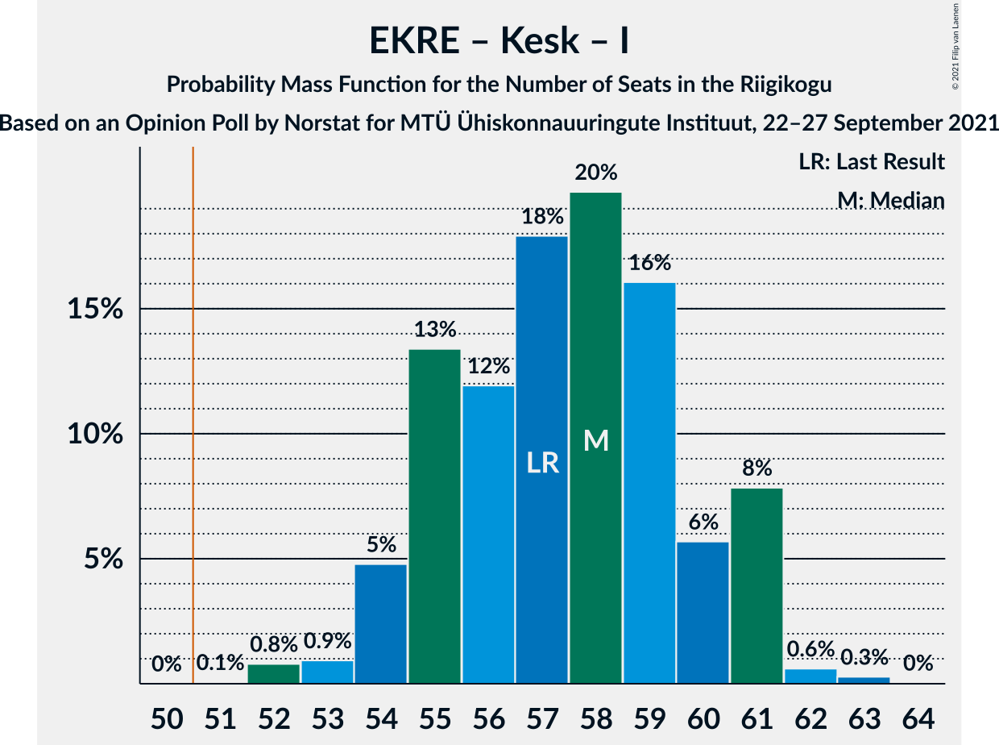
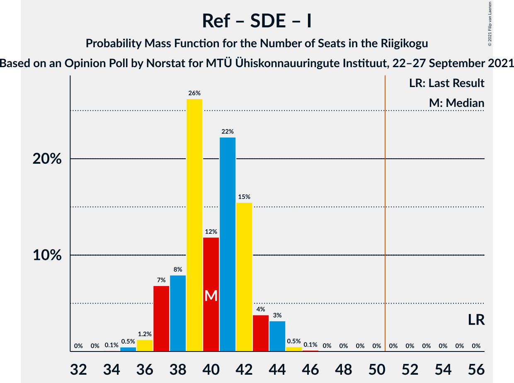

# Opinion Poll by Norstat for MTÜ Ühiskonnauuringute Instituut, 22–27 September 2021

<a href="#voting-intentions">Voting Intentions</a> | <a href="#seats">Seats</a> | <a href="#coalitions">Coalitions</a> | <a href="#technical-information">Technical Information</a>

## Voting Intentions

### Confidence Intervals

| Party | Last Result | Poll Result | 80% Confidence Interval | 90% Confidence Interval | 95% Confidence Interval | 99% Confidence Interval |
|:-----:|:-----------:|:-----------:|:-----------------------:|:-----------------------:|:-----------------------:|:-----------------------:|
| Eesti Konservatiivne Rahvaerakond | 17.8% | 24.6% | 22.9–26.4% |22.4–26.9% |22.0–27.4% |21.2–28.3% |
| Eesti Reformierakond | 28.9% | 22.9% | 21.3–24.7% |20.8–25.2% |20.4–25.6% |19.6–26.5% |
| Eesti Keskerakond | 23.1% | 22.3% | 20.7–24.1% |20.2–24.6% |19.8–25.0% |19.1–25.8% |
| Eesti 200 | 4.4% | 11.1% | 9.9–12.5% |9.6–12.9% |9.3–13.2% |8.8–13.9% |
| Sotsiaaldemokraatlik Erakond | 9.8% | 9.0% | 7.9–10.3% |7.6–10.6% |7.4–10.9% |6.9–11.6% |
| Erakond Isamaa | 11.4% | 7.9% | 6.9–9.1% |6.6–9.4% |6.4–9.7% |5.9–10.3% |
| Erakond Eestimaa Rohelised | 1.8% | 1.5% | 1.1–2.1% |1.0–2.3% |0.9–2.5% |0.7–2.8% |

*Note:* The poll result column reflects the actual value used in the calculations. Published results may vary slightly, and in addition be rounded to fewer digits.

## Seats

### Confidence Intervals

| Party | Last Result | Median | 80% Confidence Interval | 90% Confidence Interval | 95% Confidence Interval | 99% Confidence Interval |
|:-----:|:-----------:|:------:|:-----------------------:|:-----------------------:|:-----------------------:|:-----------------------:|
| <a href="#eesti-konservatiivne-rahvaerakond">Eesti Konservatiivne Rahvaerakond</a> | 19 | 26 | 24–29 |24–29 |23–30 |22–31 |
| <a href="#eesti-reformierakond">Eesti Reformierakond</a> | 34 | 24 | 22–26 |22–27 |22–28 |20–29 |
| <a href="#eesti-keskerakond">Eesti Keskerakond</a> | 26 | 24 | 22–26 |21–26 |21–27 |20–28 |
| <a href="#eesti-200">Eesti 200</a> | 0 | 11 | 9–12 |9–13 |8–13 |8–14 |
| <a href="#sotsiaaldemokraatlik-erakond">Sotsiaaldemokraatlik Erakond</a> | 10 | 9 | 7–10 |7–10 |6–10 |6–11 |
| <a href="#erakond-isamaa">Erakond Isamaa</a> | 12 | 7 | 6–9 |6–9 |6–9 |5–10 |
| <a href="#erakond-eestimaa-rohelised">Erakond Eestimaa Rohelised</a> | 0 | 0 | 0 |0 |0 |0 |

### Eesti Konservatiivne Rahvaerakond

*For a full overview of the results for this party, see the [Eesti Konservatiivne Rahvaerakond](party-eestikonservatiivnerahvaerakond.html) page.*

| Number of Seats | Probability | Accumulated | Special Marks |
|:---------------:|:-----------:|:-----------:|:-------------:|
| 19 | 0% | 100% | Last Result |
| 20 | 0% | 100% |  |
| 21 | 0.1% | 100% |  |
| 22 | 0.7% | 99.9% |  |
| 23 | 2% | 99.2% |  |
| 24 | 14% | 97% |  |
| 25 | 14% | 83% |  |
| 26 | 19% | 69% | Median |
| 27 | 28% | 49% |  |
| 28 | 8% | 21% |  |
| 29 | 9% | 14% |  |
| 30 | 4% | 5% |  |
| 31 | 0.7% | 0.8% |  |
| 32 | 0.1% | 0.1% |  |
| 33 | 0% | 0% |  |

### Eesti Reformierakond

*For a full overview of the results for this party, see the [Eesti Reformierakond](party-eestireformierakond.html) page.*

| Number of Seats | Probability | Accumulated | Special Marks |
|:---------------:|:-----------:|:-----------:|:-------------:|
| 20 | 0.6% | 100% |  |
| 21 | 1.2% | 99.3% |  |
| 22 | 12% | 98% |  |
| 23 | 14% | 86% |  |
| 24 | 29% | 73% | Median |
| 25 | 15% | 44% |  |
| 26 | 21% | 29% |  |
| 27 | 5% | 8% |  |
| 28 | 2% | 3% |  |
| 29 | 0.7% | 0.8% |  |
| 30 | 0.1% | 0.1% |  |
| 31 | 0% | 0% |  |
| 32 | 0% | 0% |  |
| 33 | 0% | 0% |  |
| 34 | 0% | 0% | Last Result |

### Eesti Keskerakond

*For a full overview of the results for this party, see the [Eesti Keskerakond](party-eestikeskerakond.html) page.*

| Number of Seats | Probability | Accumulated | Special Marks |
|:---------------:|:-----------:|:-----------:|:-------------:|
| 19 | 0.3% | 100% |  |
| 20 | 1.5% | 99.7% |  |
| 21 | 6% | 98% |  |
| 22 | 12% | 93% |  |
| 23 | 19% | 81% |  |
| 24 | 30% | 61% | Median |
| 25 | 18% | 32% |  |
| 26 | 9% | 14% | Last Result |
| 27 | 3% | 4% |  |
| 28 | 0.8% | 1.0% |  |
| 29 | 0.2% | 0.2% |  |
| 30 | 0% | 0% |  |

### Eesti 200

*For a full overview of the results for this party, see the [Eesti 200](party-eesti200.html) page.*

| Number of Seats | Probability | Accumulated | Special Marks |
|:---------------:|:-----------:|:-----------:|:-------------:|
| 0 | 0% | 100% | Last Result |
| 1 | 0% | 100% |  |
| 2 | 0% | 100% |  |
| 3 | 0% | 100% |  |
| 4 | 0% | 100% |  |
| 5 | 0% | 100% |  |
| 6 | 0% | 100% |  |
| 7 | 0.1% | 100% |  |
| 8 | 3% | 99.9% |  |
| 9 | 16% | 97% |  |
| 10 | 25% | 81% |  |
| 11 | 28% | 56% | Median |
| 12 | 21% | 27% |  |
| 13 | 5% | 6% |  |
| 14 | 1.2% | 1.3% |  |
| 15 | 0.1% | 0.1% |  |
| 16 | 0% | 0% |  |

### Sotsiaaldemokraatlik Erakond

*For a full overview of the results for this party, see the [Sotsiaaldemokraatlik Erakond](party-sotsiaaldemokraatlikerakond.html) page.*

| Number of Seats | Probability | Accumulated | Special Marks |
|:---------------:|:-----------:|:-----------:|:-------------:|
| 6 | 3% | 100% |  |
| 7 | 13% | 97% |  |
| 8 | 34% | 84% |  |
| 9 | 38% | 50% | Median |
| 10 | 10% | 12% | Last Result |
| 11 | 2% | 2% |  |
| 12 | 0.3% | 0.3% |  |
| 13 | 0% | 0% |  |

### Erakond Isamaa

*For a full overview of the results for this party, see the [Erakond Isamaa](party-erakondisamaa.html) page.*

| Number of Seats | Probability | Accumulated | Special Marks |
|:---------------:|:-----------:|:-----------:|:-------------:|
| 5 | 2% | 100% |  |
| 6 | 21% | 98% |  |
| 7 | 40% | 76% | Median |
| 8 | 26% | 37% |  |
| 9 | 9% | 10% |  |
| 10 | 1.0% | 1.1% |  |
| 11 | 0.1% | 0.1% |  |
| 12 | 0% | 0% | Last Result |

### Erakond Eestimaa Rohelised

*For a full overview of the results for this party, see the [Erakond Eestimaa Rohelised](party-erakondeestimaarohelised.html) page.*

| Number of Seats | Probability | Accumulated | Special Marks |
|:---------------:|:-----------:|:-----------:|:-------------:|
| 0 | 100% | 100% | Last Result, Median |

## Coalitions

### Confidence Intervals

| Coalition | Last Result | Median | Majority? | 80% Confidence Interval | 90% Confidence Interval | 95% Confidence Interval | 99% Confidence Interval |
|:---------:|:-----------:|:------:|:---------:|:-----------------------:|:-----------------------:|:-----------------------:|:-----------------------:|
| Eesti Konservatiivne Rahvaerakond – Eesti Reformierakond – Eesti Keskerakond | 79 | 75 | 100% | 73–77 | 72–77 | 71–78 | 70–79 |
| Eesti Konservatiivne Rahvaerakond – Eesti Reformierakond – Erakond Isamaa | 65 | 58 | 100% | 56–60 | 55–61 | 55–62 | 53–63 |
| Eesti Konservatiivne Rahvaerakond – Eesti Keskerakond – Erakond Isamaa | 57 | 58 | 100% | 55–60 | 54–61 | 54–61 | 52–62 |
| Eesti Konservatiivne Rahvaerakond – Eesti Reformierakond | 53 | 51 | 59% | 48–53 | 48–54 | 47–55 | 46–56 |
| Eesti Konservatiivne Rahvaerakond – Eesti Keskerakond | 45 | 50 | 46% | 48–53 | 47–53 | 47–54 | 45–55 |
| Eesti Reformierakond – Eesti Keskerakond | 60 | 48 | 10% | 46–50 | 45–51 | 45–52 | 43–53 |
| Eesti Reformierakond – Sotsiaaldemokraatlik Erakond – Erakond Isamaa | 56 | 40 | 0% | 38–42 | 37–43 | 37–44 | 35–45 |
| Eesti Keskerakond – Sotsiaaldemokraatlik Erakond – Erakond Isamaa | 48 | 40 | 0% | 37–42 | 36–43 | 35–43 | 35–44 |
| Eesti Konservatiivne Rahvaerakond – Sotsiaaldemokraatlik Erakond | 29 | 35 | 0% | 33–37 | 32–38 | 31–39 | 30–40 |
| Eesti Reformierakond – Sotsiaaldemokraatlik Erakond | 44 | 33 | 0% | 30–35 | 30–36 | 30–36 | 28–37 |
| Eesti Keskerakond – Sotsiaaldemokraatlik Erakond | 36 | 33 | 0% | 30–34 | 29–35 | 29–36 | 27–37 |
| Eesti Reformierakond – Erakond Isamaa | 46 | 32 | 0% | 30–34 | 29–35 | 28–35 | 27–36 |

### Eesti Konservatiivne Rahvaerakond – Eesti Reformierakond – Eesti Keskerakond

| Number of Seats | Probability | Accumulated | Special Marks |
|:---------------:|:-----------:|:-----------:|:-------------:|
| 69 | 0.1% | 100% |  |
| 70 | 0.4% | 99.9% |  |
| 71 | 2% | 99.5% |  |
| 72 | 5% | 97% |  |
| 73 | 18% | 92% |  |
| 74 | 21% | 74% | Median |
| 75 | 22% | 53% |  |
| 76 | 21% | 31% |  |
| 77 | 6% | 10% |  |
| 78 | 4% | 4% |  |
| 79 | 0.7% | 0.8% | Last Result |
| 80 | 0.1% | 0.1% |  |
| 81 | 0% | 0% |  |

### Eesti Konservatiivne Rahvaerakond – Eesti Reformierakond – Erakond Isamaa

| Number of Seats | Probability | Accumulated | Special Marks |
|:---------------:|:-----------:|:-----------:|:-------------:|
| 52 | 0.1% | 100% |  |
| 53 | 0.5% | 99.9% |  |
| 54 | 1.4% | 99.3% |  |
| 55 | 6% | 98% |  |
| 56 | 14% | 92% |  |
| 57 | 20% | 79% | Median |
| 58 | 18% | 59% |  |
| 59 | 20% | 41% |  |
| 60 | 12% | 20% |  |
| 61 | 5% | 8% |  |
| 62 | 2% | 3% |  |
| 63 | 1.3% | 2% |  |
| 64 | 0.2% | 0.3% |  |
| 65 | 0% | 0% | Last Result |

### Eesti Konservatiivne Rahvaerakond – Eesti Keskerakond – Erakond Isamaa

| Number of Seats | Probability | Accumulated | Special Marks |
|:---------------:|:-----------:|:-----------:|:-------------:|
| 51 | 0.1% | 100% | Majority |
| 52 | 0.8% | 99.9% |  |
| 53 | 0.9% | 99.1% |  |
| 54 | 5% | 98% |  |
| 55 | 13% | 93% |  |
| 56 | 12% | 80% |  |
| 57 | 18% | 68% | Last Result, Median |
| 58 | 20% | 50% |  |
| 59 | 16% | 31% |  |
| 60 | 6% | 14% |  |
| 61 | 8% | 9% |  |
| 62 | 0.6% | 0.9% |  |
| 63 | 0.3% | 0.3% |  |
| 64 | 0% | 0% |  |

### Eesti Konservatiivne Rahvaerakond – Eesti Reformierakond

| Number of Seats | Probability | Accumulated | Special Marks |
|:---------------:|:-----------:|:-----------:|:-------------:|
| 45 | 0.2% | 100% |  |
| 46 | 0.8% | 99.8% |  |
| 47 | 3% | 99.0% |  |
| 48 | 7% | 96% |  |
| 49 | 16% | 89% |  |
| 50 | 15% | 73% | Median |
| 51 | 26% | 59% | Majority |
| 52 | 14% | 32% |  |
| 53 | 11% | 19% | Last Result |
| 54 | 5% | 8% |  |
| 55 | 2% | 3% |  |
| 56 | 0.8% | 0.9% |  |
| 57 | 0.1% | 0.1% |  |
| 58 | 0% | 0% |  |

### Eesti Konservatiivne Rahvaerakond – Eesti Keskerakond

| Number of Seats | Probability | Accumulated | Special Marks |
|:---------------:|:-----------:|:-----------:|:-------------:|
| 44 | 0.1% | 100% |  |
| 45 | 0.5% | 99.9% | Last Result |
| 46 | 2% | 99.4% |  |
| 47 | 7% | 98% |  |
| 48 | 11% | 91% |  |
| 49 | 16% | 80% |  |
| 50 | 17% | 64% | Median |
| 51 | 18% | 46% | Majority |
| 52 | 17% | 28% |  |
| 53 | 9% | 12% |  |
| 54 | 2% | 3% |  |
| 55 | 0.5% | 0.8% |  |
| 56 | 0.2% | 0.3% |  |
| 57 | 0% | 0% |  |

### Eesti Reformierakond – Eesti Keskerakond

| Number of Seats | Probability | Accumulated | Special Marks |
|:---------------:|:-----------:|:-----------:|:-------------:|
| 42 | 0.1% | 100% |  |
| 43 | 0.6% | 99.9% |  |
| 44 | 2% | 99.3% |  |
| 45 | 4% | 98% |  |
| 46 | 9% | 94% |  |
| 47 | 22% | 85% |  |
| 48 | 19% | 63% | Median |
| 49 | 15% | 43% |  |
| 50 | 19% | 29% |  |
| 51 | 6% | 10% | Majority |
| 52 | 2% | 3% |  |
| 53 | 1.0% | 1.2% |  |
| 54 | 0.2% | 0.2% |  |
| 55 | 0% | 0% |  |
| 56 | 0% | 0% |  |
| 57 | 0% | 0% |  |
| 58 | 0% | 0% |  |
| 59 | 0% | 0% |  |
| 60 | 0% | 0% | Last Result |

### Eesti Reformierakond – Sotsiaaldemokraatlik Erakond – Erakond Isamaa

| Number of Seats | Probability | Accumulated | Special Marks |
|:---------------:|:-----------:|:-----------:|:-------------:|
| 34 | 0.1% | 100% |  |
| 35 | 0.5% | 99.9% |  |
| 36 | 1.2% | 99.4% |  |
| 37 | 7% | 98% |  |
| 38 | 8% | 91% |  |
| 39 | 26% | 83% |  |
| 40 | 12% | 57% | Median |
| 41 | 22% | 45% |  |
| 42 | 15% | 23% |  |
| 43 | 4% | 8% |  |
| 44 | 3% | 4% |  |
| 45 | 0.5% | 0.6% |  |
| 46 | 0.1% | 0.2% |  |
| 47 | 0% | 0% |  |
| 48 | 0% | 0% |  |
| 49 | 0% | 0% |  |
| 50 | 0% | 0% |  |
| 51 | 0% | 0% | Majority |
| 52 | 0% | 0% |  |
| 53 | 0% | 0% |  |
| 54 | 0% | 0% |  |
| 55 | 0% | 0% |  |
| 56 | 0% | 0% | Last Result |

### Eesti Keskerakond – Sotsiaaldemokraatlik Erakond – Erakond Isamaa

| Number of Seats | Probability | Accumulated | Special Marks |
|:---------------:|:-----------:|:-----------:|:-------------:|
| 34 | 0.3% | 100% |  |
| 35 | 2% | 99.7% |  |
| 36 | 4% | 97% |  |
| 37 | 6% | 93% |  |
| 38 | 19% | 87% |  |
| 39 | 15% | 68% |  |
| 40 | 21% | 52% | Median |
| 41 | 14% | 31% |  |
| 42 | 12% | 17% |  |
| 43 | 4% | 5% |  |
| 44 | 1.1% | 1.4% |  |
| 45 | 0.3% | 0.3% |  |
| 46 | 0.1% | 0.1% |  |
| 47 | 0% | 0% |  |
| 48 | 0% | 0% | Last Result |

### Eesti Konservatiivne Rahvaerakond – Sotsiaaldemokraatlik Erakond

| Number of Seats | Probability | Accumulated | Special Marks |
|:---------------:|:-----------:|:-----------:|:-------------:|
| 29 | 0.1% | 100% | Last Result |
| 30 | 0.7% | 99.9% |  |
| 31 | 3% | 99.2% |  |
| 32 | 5% | 97% |  |
| 33 | 18% | 91% |  |
| 34 | 14% | 73% |  |
| 35 | 20% | 59% | Median |
| 36 | 24% | 39% |  |
| 37 | 8% | 15% |  |
| 38 | 4% | 7% |  |
| 39 | 3% | 3% |  |
| 40 | 0.5% | 0.6% |  |
| 41 | 0.1% | 0.1% |  |
| 42 | 0% | 0% |  |

### Eesti Reformierakond – Sotsiaaldemokraatlik Erakond

| Number of Seats | Probability | Accumulated | Special Marks |
|:---------------:|:-----------:|:-----------:|:-------------:|
| 27 | 0.1% | 100% |  |
| 28 | 0.4% | 99.9% |  |
| 29 | 0.9% | 99.5% |  |
| 30 | 9% | 98.6% |  |
| 31 | 13% | 89% |  |
| 32 | 17% | 76% |  |
| 33 | 24% | 59% | Median |
| 34 | 14% | 35% |  |
| 35 | 15% | 22% |  |
| 36 | 4% | 6% |  |
| 37 | 2% | 2% |  |
| 38 | 0.3% | 0.4% |  |
| 39 | 0.1% | 0.1% |  |
| 40 | 0% | 0% |  |
| 41 | 0% | 0% |  |
| 42 | 0% | 0% |  |
| 43 | 0% | 0% |  |
| 44 | 0% | 0% | Last Result |

### Eesti Keskerakond – Sotsiaaldemokraatlik Erakond

| Number of Seats | Probability | Accumulated | Special Marks |
|:---------------:|:-----------:|:-----------:|:-------------:|
| 26 | 0.1% | 100% |  |
| 27 | 0.6% | 99.9% |  |
| 28 | 1.4% | 99.4% |  |
| 29 | 4% | 98% |  |
| 30 | 9% | 94% |  |
| 31 | 19% | 85% |  |
| 32 | 15% | 66% |  |
| 33 | 29% | 51% | Median |
| 34 | 12% | 22% |  |
| 35 | 7% | 10% |  |
| 36 | 2% | 3% | Last Result |
| 37 | 0.8% | 0.9% |  |
| 38 | 0.1% | 0.1% |  |
| 39 | 0% | 0% |  |

### Eesti Reformierakond – Erakond Isamaa

| Number of Seats | Probability | Accumulated | Special Marks |
|:---------------:|:-----------:|:-----------:|:-------------:|
| 26 | 0.1% | 100% |  |
| 27 | 0.5% | 99.8% |  |
| 28 | 2% | 99.3% |  |
| 29 | 6% | 97% |  |
| 30 | 18% | 91% |  |
| 31 | 21% | 73% | Median |
| 32 | 19% | 52% |  |
| 33 | 21% | 33% |  |
| 34 | 7% | 12% |  |
| 35 | 4% | 5% |  |
| 36 | 0.9% | 1.2% |  |
| 37 | 0.3% | 0.3% |  |
| 38 | 0% | 0% |  |
| 39 | 0% | 0% |  |
| 40 | 0% | 0% |  |
| 41 | 0% | 0% |  |
| 42 | 0% | 0% |  |
| 43 | 0% | 0% |  |
| 44 | 0% | 0% |  |
| 45 | 0% | 0% |  |
| 46 | 0% | 0% | Last Result |

## Technical Information

### Opinion Poll

+ **Polling firm:** Norstat
+ **Commissioner(s):** MTÜ Ühiskonnauuringute Instituut
+ **Fieldwork period:** 22–27 September 2021

### Calculations

+ **Sample size:** 1000
+ **Simulations done:** 131,072
+ **Error estimate:** 2.39%

