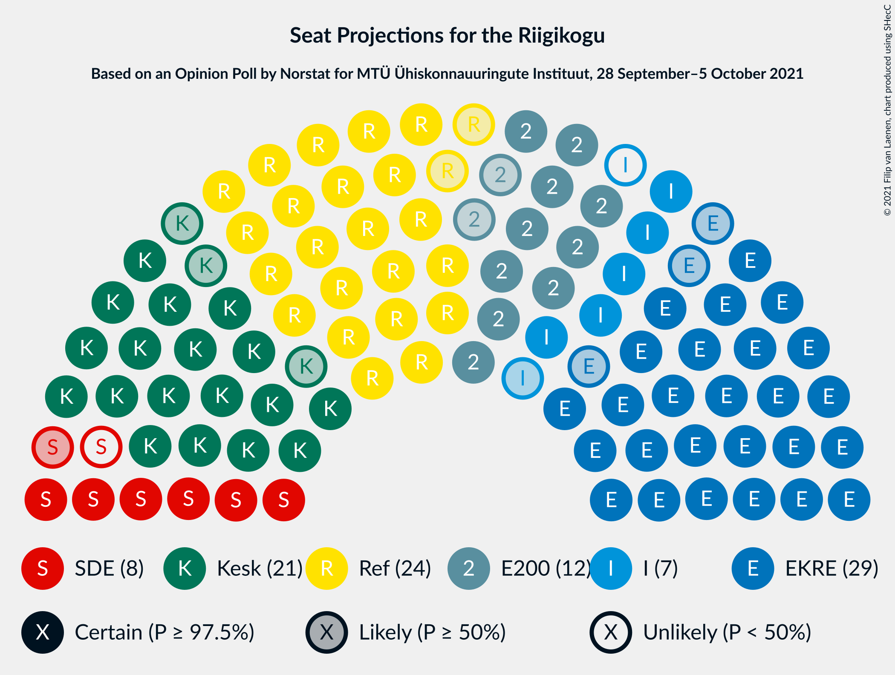
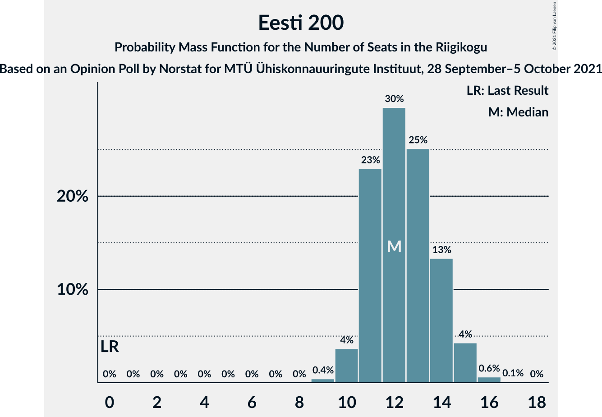
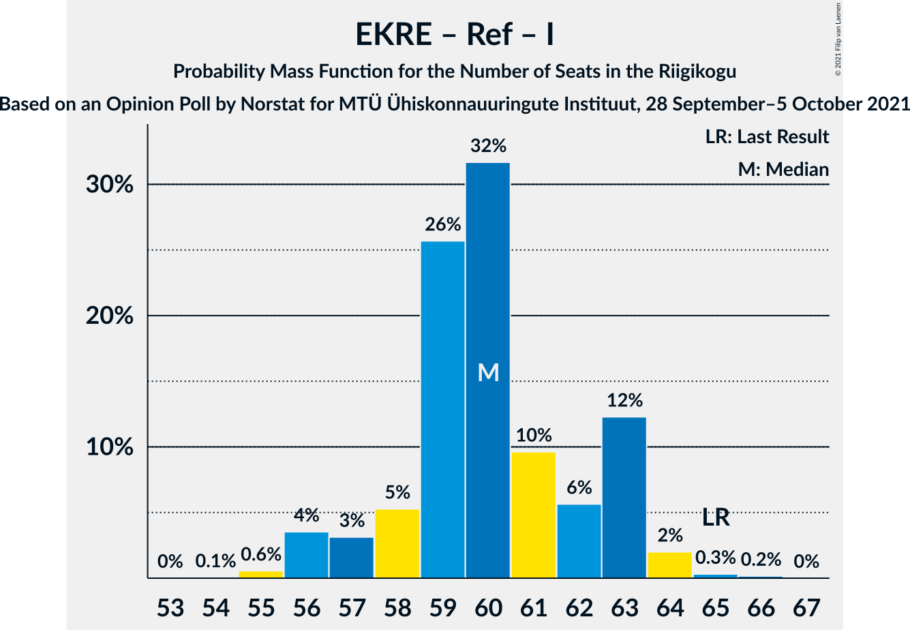

# Opinion Poll by Norstat for MTÜ Ühiskonnauuringute Instituut, 28 September–5 October 2021

<a href="#voting-intentions">Voting Intentions</a> | <a href="#seats">Seats</a> | <a href="#coalitions">Coalitions</a> | <a href="#technical-information">Technical Information</a>

## Voting Intentions

### Confidence Intervals

| Party | Last Result | Poll Result | 80% Confidence Interval | 90% Confidence Interval | 95% Confidence Interval | 99% Confidence Interval |
|:-----:|:-----------:|:-----------:|:-----------------------:|:-----------------------:|:-----------------------:|:-----------------------:|
| Eesti Konservatiivne Rahvaerakond | 17.8% | 26.3% | 24.6–28.2% |24.1–28.7% |23.7–29.1% |22.8–30.0% |
| Eesti Reformierakond | 28.9% | 22.8% | 21.2–24.6% |20.7–25.1% |20.3–25.5% |19.5–26.4% |
| Eesti Keskerakond | 23.1% | 19.8% | 18.3–21.5% |17.8–22.0% |17.4–22.4% |16.7–23.2% |
| Eesti 200 | 4.4% | 12.5% | 11.2–13.9% |10.9–14.3% |10.6–14.7% |10.0–15.4% |
| Sotsiaaldemokraatlik Erakond | 9.8% | 7.9% | 6.9–9.1% |6.6–9.4% |6.4–9.7% |5.9–10.3% |
| Erakond Isamaa | 11.4% | 7.0% | 6.1–8.2% |5.8–8.5% |5.6–8.8% |5.2–9.3% |
| Erakond Eestimaa Rohelised | 1.8% | 2.3% | 1.8–3.0% |1.6–3.2% |1.5–3.4% |1.3–3.8% |

*Note:* The poll result column reflects the actual value used in the calculations. Published results may vary slightly, and in addition be rounded to fewer digits.

## Seats

### Confidence Intervals

| Party | Last Result | Median | 80% Confidence Interval | 90% Confidence Interval | 95% Confidence Interval | 99% Confidence Interval |
|:-----:|:-----------:|:------:|:-----------------------:|:-----------------------:|:-----------------------:|:-----------------------:|
| <a href="#eesti-konservatiivne-rahvaerakond">Eesti Konservatiivne Rahvaerakond</a> | 19 | 29 | 27–31 |26–32 |26–32 |25–33 |
| <a href="#eesti-reformierakond">Eesti Reformierakond</a> | 34 | 24 | 23–27 |22–28 |22–28 |21–29 |
| <a href="#eesti-keskerakond">Eesti Keskerakond</a> | 26 | 21 | 20–23 |19–23 |18–24 |18–25 |
| <a href="#eesti-200">Eesti 200</a> | 0 | 12 | 11–14 |11–15 |10–15 |10–16 |
| <a href="#sotsiaaldemokraatlik-erakond">Sotsiaaldemokraatlik Erakond</a> | 10 | 7 | 6–9 |6–9 |6–9 |5–10 |
| <a href="#erakond-isamaa">Erakond Isamaa</a> | 12 | 6 | 5–8 |5–8 |5–8 |4–9 |
| <a href="#erakond-eestimaa-rohelised">Erakond Eestimaa Rohelised</a> | 0 | 0 | 0 |0 |0 |0 |

### Eesti Konservatiivne Rahvaerakond

*For a full overview of the results for this party, see the [Eesti Konservatiivne Rahvaerakond](party-eestikonservatiivnerahvaerakond.html) page.*

| Number of Seats | Probability | Accumulated | Special Marks |
|:---------------:|:-----------:|:-----------:|:-------------:|
| 19 | 0% | 100% | Last Result |
| 20 | 0% | 100% |  |
| 21 | 0% | 100% |  |
| 22 | 0% | 100% |  |
| 23 | 0% | 100% |  |
| 24 | 0.2% | 100% |  |
| 25 | 1.0% | 99.8% |  |
| 26 | 6% | 98.8% |  |
| 27 | 7% | 93% |  |
| 28 | 19% | 85% |  |
| 29 | 28% | 67% | Median |
| 30 | 24% | 39% |  |
| 31 | 8% | 15% |  |
| 32 | 5% | 7% |  |
| 33 | 1.5% | 2% |  |
| 34 | 0.3% | 0.3% |  |
| 35 | 0% | 0.1% |  |
| 36 | 0% | 0% |  |

### Eesti Reformierakond

*For a full overview of the results for this party, see the [Eesti Reformierakond](party-eestireformierakond.html) page.*

| Number of Seats | Probability | Accumulated | Special Marks |
|:---------------:|:-----------:|:-----------:|:-------------:|
| 20 | 0.4% | 100% |  |
| 21 | 1.4% | 99.6% |  |
| 22 | 7% | 98% |  |
| 23 | 12% | 91% |  |
| 24 | 34% | 79% | Median |
| 25 | 19% | 45% |  |
| 26 | 12% | 26% |  |
| 27 | 9% | 14% |  |
| 28 | 4% | 5% |  |
| 29 | 0.8% | 0.9% |  |
| 30 | 0.1% | 0.1% |  |
| 31 | 0% | 0% |  |
| 32 | 0% | 0% |  |
| 33 | 0% | 0% |  |
| 34 | 0% | 0% | Last Result |

### Eesti Keskerakond

*For a full overview of the results for this party, see the [Eesti Keskerakond](party-eestikeskerakond.html) page.*

| Number of Seats | Probability | Accumulated | Special Marks |
|:---------------:|:-----------:|:-----------:|:-------------:|
| 17 | 0.4% | 100% |  |
| 18 | 4% | 99.6% |  |
| 19 | 5% | 96% |  |
| 20 | 20% | 91% |  |
| 21 | 32% | 71% | Median |
| 22 | 20% | 38% |  |
| 23 | 13% | 18% |  |
| 24 | 4% | 5% |  |
| 25 | 1.1% | 1.4% |  |
| 26 | 0.3% | 0.3% | Last Result |
| 27 | 0% | 0% |  |

### Eesti 200

*For a full overview of the results for this party, see the [Eesti 200](party-eesti200.html) page.*

| Number of Seats | Probability | Accumulated | Special Marks |
|:---------------:|:-----------:|:-----------:|:-------------:|
| 0 | 0% | 100% | Last Result |
| 1 | 0% | 100% |  |
| 2 | 0% | 100% |  |
| 3 | 0% | 100% |  |
| 4 | 0% | 100% |  |
| 5 | 0% | 100% |  |
| 6 | 0% | 100% |  |
| 7 | 0% | 100% |  |
| 8 | 0% | 100% |  |
| 9 | 0.4% | 100% |  |
| 10 | 4% | 99.6% |  |
| 11 | 23% | 96% |  |
| 12 | 30% | 73% | Median |
| 13 | 25% | 43% |  |
| 14 | 13% | 18% |  |
| 15 | 4% | 5% |  |
| 16 | 0.6% | 0.7% |  |
| 17 | 0.1% | 0.1% |  |
| 18 | 0% | 0% |  |

### Sotsiaaldemokraatlik Erakond

*For a full overview of the results for this party, see the [Sotsiaaldemokraatlik Erakond](party-sotsiaaldemokraatlikerakond.html) page.*

| Number of Seats | Probability | Accumulated | Special Marks |
|:---------------:|:-----------:|:-----------:|:-------------:|
| 5 | 2% | 100% |  |
| 6 | 19% | 98% |  |
| 7 | 29% | 79% | Median |
| 8 | 39% | 50% |  |
| 9 | 9% | 11% |  |
| 10 | 1.4% | 2% | Last Result |
| 11 | 0.2% | 0.2% |  |
| 12 | 0% | 0% |  |

### Erakond Isamaa

*For a full overview of the results for this party, see the [Erakond Isamaa](party-erakondisamaa.html) page.*

| Number of Seats | Probability | Accumulated | Special Marks |
|:---------------:|:-----------:|:-----------:|:-------------:|
| 0 | 0.3% | 100% |  |
| 1 | 0% | 99.7% |  |
| 2 | 0% | 99.7% |  |
| 3 | 0% | 99.7% |  |
| 4 | 0.7% | 99.7% |  |
| 5 | 17% | 99.0% |  |
| 6 | 34% | 82% | Median |
| 7 | 37% | 48% |  |
| 8 | 10% | 11% |  |
| 9 | 0.8% | 0.8% |  |
| 10 | 0.1% | 0.1% |  |
| 11 | 0% | 0% |  |
| 12 | 0% | 0% | Last Result |

### Erakond Eestimaa Rohelised

*For a full overview of the results for this party, see the [Erakond Eestimaa Rohelised](party-erakondeestimaarohelised.html) page.*

| Number of Seats | Probability | Accumulated | Special Marks |
|:---------------:|:-----------:|:-----------:|:-------------:|
| 0 | 100% | 100% | Last Result, Median |

## Coalitions

### Confidence Intervals

| Coalition | Last Result | Median | Majority? | 80% Confidence Interval | 90% Confidence Interval | 95% Confidence Interval | 99% Confidence Interval |
|:---------:|:-----------:|:------:|:---------:|:-----------------------:|:-----------------------:|:-----------------------:|:-----------------------:|
| Eesti Konservatiivne Rahvaerakond – Eesti Reformierakond – Eesti Keskerakond | 79 | 75 | 100% | 73–77 | 72–78 | 72–78 | 70–79 |
| Eesti Konservatiivne Rahvaerakond – Eesti Reformierakond – Erakond Isamaa | 65 | 60 | 100% | 58–63 | 57–63 | 56–63 | 55–64 |
| Eesti Konservatiivne Rahvaerakond – Eesti Keskerakond – Erakond Isamaa | 57 | 56 | 99.9% | 54–59 | 54–59 | 53–60 | 51–61 |
| Eesti Konservatiivne Rahvaerakond – Eesti Reformierakond | 53 | 54 | 95% | 51–56 | 51–57 | 50–58 | 49–59 |
| Eesti Konservatiivne Rahvaerakond – Eesti Keskerakond | 45 | 50 | 50% | 48–53 | 47–53 | 47–54 | 45–55 |
| Eesti Reformierakond – Eesti Keskerakond | 60 | 46 | 0.8% | 43–48 | 43–49 | 42–49 | 41–51 |
| Eesti Reformierakond – Sotsiaaldemokraatlik Erakond – Erakond Isamaa | 56 | 38 | 0% | 36–41 | 36–41 | 35–42 | 34–43 |
| Eesti Konservatiivne Rahvaerakond – Sotsiaaldemokraatlik Erakond | 29 | 37 | 0% | 34–38 | 33–39 | 33–40 | 32–41 |
| Eesti Keskerakond – Sotsiaaldemokraatlik Erakond – Erakond Isamaa | 48 | 35 | 0% | 33–37 | 32–38 | 31–38 | 30–39 |
| Eesti Reformierakond – Sotsiaaldemokraatlik Erakond | 44 | 32 | 0% | 30–34 | 29–35 | 29–35 | 28–37 |
| Eesti Reformierakond – Erakond Isamaa | 46 | 31 | 0% | 29–34 | 28–34 | 28–35 | 26–35 |
| Eesti Keskerakond – Sotsiaaldemokraatlik Erakond | 36 | 29 | 0% | 27–30 | 26–31 | 25–32 | 24–33 |

### Eesti Konservatiivne Rahvaerakond – Eesti Reformierakond – Eesti Keskerakond

| Number of Seats | Probability | Accumulated | Special Marks |
|:---------------:|:-----------:|:-----------:|:-------------:|
| 69 | 0.1% | 100% |  |
| 70 | 0.7% | 99.9% |  |
| 71 | 2% | 99.2% |  |
| 72 | 4% | 98% |  |
| 73 | 15% | 93% |  |
| 74 | 15% | 78% | Median |
| 75 | 32% | 63% |  |
| 76 | 15% | 31% |  |
| 77 | 11% | 16% |  |
| 78 | 4% | 5% |  |
| 79 | 0.6% | 0.9% | Last Result |
| 80 | 0.2% | 0.3% |  |
| 81 | 0.1% | 0.1% |  |
| 82 | 0% | 0% |  |

### Eesti Konservatiivne Rahvaerakond – Eesti Reformierakond – Erakond Isamaa

| Number of Seats | Probability | Accumulated | Special Marks |
|:---------------:|:-----------:|:-----------:|:-------------:|
| 54 | 0.1% | 100% |  |
| 55 | 0.6% | 99.9% |  |
| 56 | 4% | 99.4% |  |
| 57 | 3% | 96% |  |
| 58 | 5% | 93% |  |
| 59 | 26% | 87% | Median |
| 60 | 32% | 62% |  |
| 61 | 10% | 30% |  |
| 62 | 6% | 20% |  |
| 63 | 12% | 15% |  |
| 64 | 2% | 2% |  |
| 65 | 0.3% | 0.5% | Last Result |
| 66 | 0.2% | 0.2% |  |
| 67 | 0% | 0% |  |

### Eesti Konservatiivne Rahvaerakond – Eesti Keskerakond – Erakond Isamaa

| Number of Seats | Probability | Accumulated | Special Marks |
|:---------------:|:-----------:|:-----------:|:-------------:|
| 50 | 0.1% | 100% |  |
| 51 | 0.5% | 99.9% | Majority |
| 52 | 0.9% | 99.5% |  |
| 53 | 3% | 98.6% |  |
| 54 | 7% | 96% |  |
| 55 | 14% | 89% |  |
| 56 | 26% | 76% | Median |
| 57 | 13% | 50% | Last Result |
| 58 | 21% | 36% |  |
| 59 | 12% | 15% |  |
| 60 | 2% | 3% |  |
| 61 | 0.6% | 1.0% |  |
| 62 | 0.3% | 0.4% |  |
| 63 | 0.1% | 0.1% |  |
| 64 | 0% | 0% |  |

### Eesti Konservatiivne Rahvaerakond – Eesti Reformierakond

| Number of Seats | Probability | Accumulated | Special Marks |
|:---------------:|:-----------:|:-----------:|:-------------:|
| 48 | 0.2% | 100% |  |
| 49 | 1.0% | 99.8% |  |
| 50 | 3% | 98.8% |  |
| 51 | 7% | 95% | Majority |
| 52 | 12% | 89% |  |
| 53 | 23% | 76% | Last Result, Median |
| 54 | 28% | 53% |  |
| 55 | 7% | 25% |  |
| 56 | 10% | 18% |  |
| 57 | 5% | 8% |  |
| 58 | 2% | 3% |  |
| 59 | 0.5% | 0.6% |  |
| 60 | 0.1% | 0.1% |  |
| 61 | 0% | 0% |  |

### Eesti Konservatiivne Rahvaerakond – Eesti Keskerakond

| Number of Seats | Probability | Accumulated | Special Marks |
|:---------------:|:-----------:|:-----------:|:-------------:|
| 44 | 0.1% | 100% |  |
| 45 | 0.8% | 99.9% | Last Result |
| 46 | 0.8% | 99.1% |  |
| 47 | 6% | 98% |  |
| 48 | 4% | 92% |  |
| 49 | 25% | 88% |  |
| 50 | 13% | 63% | Median |
| 51 | 29% | 50% | Majority |
| 52 | 10% | 21% |  |
| 53 | 8% | 11% |  |
| 54 | 2% | 3% |  |
| 55 | 0.4% | 0.7% |  |
| 56 | 0.2% | 0.3% |  |
| 57 | 0% | 0% |  |

### Eesti Reformierakond – Eesti Keskerakond

| Number of Seats | Probability | Accumulated | Special Marks |
|:---------------:|:-----------:|:-----------:|:-------------:|
| 40 | 0.1% | 100% |  |
| 41 | 0.7% | 99.9% |  |
| 42 | 2% | 99.2% |  |
| 43 | 9% | 97% |  |
| 44 | 10% | 89% |  |
| 45 | 20% | 78% | Median |
| 46 | 26% | 58% |  |
| 47 | 19% | 32% |  |
| 48 | 6% | 13% |  |
| 49 | 6% | 8% |  |
| 50 | 1.4% | 2% |  |
| 51 | 0.7% | 0.8% | Majority |
| 52 | 0.1% | 0.1% |  |
| 53 | 0.1% | 0.1% |  |
| 54 | 0% | 0% |  |
| 55 | 0% | 0% |  |
| 56 | 0% | 0% |  |
| 57 | 0% | 0% |  |
| 58 | 0% | 0% |  |
| 59 | 0% | 0% |  |
| 60 | 0% | 0% | Last Result |

### Eesti Reformierakond – Sotsiaaldemokraatlik Erakond – Erakond Isamaa

| Number of Seats | Probability | Accumulated | Special Marks |
|:---------------:|:-----------:|:-----------:|:-------------:|
| 32 | 0.1% | 100% |  |
| 33 | 0.2% | 99.9% |  |
| 34 | 1.1% | 99.7% |  |
| 35 | 2% | 98.6% |  |
| 36 | 11% | 96% |  |
| 37 | 20% | 86% | Median |
| 38 | 15% | 65% |  |
| 39 | 24% | 50% |  |
| 40 | 14% | 26% |  |
| 41 | 9% | 13% |  |
| 42 | 3% | 4% |  |
| 43 | 1.0% | 1.2% |  |
| 44 | 0.2% | 0.2% |  |
| 45 | 0% | 0% |  |
| 46 | 0% | 0% |  |
| 47 | 0% | 0% |  |
| 48 | 0% | 0% |  |
| 49 | 0% | 0% |  |
| 50 | 0% | 0% |  |
| 51 | 0% | 0% | Majority |
| 52 | 0% | 0% |  |
| 53 | 0% | 0% |  |
| 54 | 0% | 0% |  |
| 55 | 0% | 0% |  |
| 56 | 0% | 0% | Last Result |

### Eesti Konservatiivne Rahvaerakond – Sotsiaaldemokraatlik Erakond

| Number of Seats | Probability | Accumulated | Special Marks |
|:---------------:|:-----------:|:-----------:|:-------------:|
| 29 | 0% | 100% | Last Result |
| 30 | 0% | 100% |  |
| 31 | 0.3% | 100% |  |
| 32 | 0.7% | 99.7% |  |
| 33 | 5% | 99.0% |  |
| 34 | 8% | 94% |  |
| 35 | 13% | 85% |  |
| 36 | 20% | 73% | Median |
| 37 | 24% | 53% |  |
| 38 | 21% | 29% |  |
| 39 | 5% | 8% |  |
| 40 | 2% | 3% |  |
| 41 | 1.5% | 2% |  |
| 42 | 0.2% | 0.2% |  |
| 43 | 0% | 0% |  |

### Eesti Keskerakond – Sotsiaaldemokraatlik Erakond – Erakond Isamaa

| Number of Seats | Probability | Accumulated | Special Marks |
|:---------------:|:-----------:|:-----------:|:-------------:|
| 28 | 0% | 100% |  |
| 29 | 0.1% | 99.9% |  |
| 30 | 0.5% | 99.8% |  |
| 31 | 4% | 99.3% |  |
| 32 | 3% | 95% |  |
| 33 | 11% | 92% |  |
| 34 | 19% | 81% | Median |
| 35 | 23% | 62% |  |
| 36 | 18% | 39% |  |
| 37 | 14% | 21% |  |
| 38 | 5% | 7% |  |
| 39 | 1.0% | 1.4% |  |
| 40 | 0.3% | 0.4% |  |
| 41 | 0.1% | 0.1% |  |
| 42 | 0% | 0% |  |
| 43 | 0% | 0% |  |
| 44 | 0% | 0% |  |
| 45 | 0% | 0% |  |
| 46 | 0% | 0% |  |
| 47 | 0% | 0% |  |
| 48 | 0% | 0% | Last Result |

### Eesti Reformierakond – Sotsiaaldemokraatlik Erakond

| Number of Seats | Probability | Accumulated | Special Marks |
|:---------------:|:-----------:|:-----------:|:-------------:|
| 27 | 0.3% | 100% |  |
| 28 | 2% | 99.7% |  |
| 29 | 7% | 98% |  |
| 30 | 10% | 91% |  |
| 31 | 15% | 81% | Median |
| 32 | 27% | 66% |  |
| 33 | 22% | 38% |  |
| 34 | 10% | 17% |  |
| 35 | 4% | 6% |  |
| 36 | 1.3% | 2% |  |
| 37 | 0.5% | 0.6% |  |
| 38 | 0.1% | 0.1% |  |
| 39 | 0% | 0% |  |
| 40 | 0% | 0% |  |
| 41 | 0% | 0% |  |
| 42 | 0% | 0% |  |
| 43 | 0% | 0% |  |
| 44 | 0% | 0% | Last Result |

### Eesti Reformierakond – Erakond Isamaa

| Number of Seats | Probability | Accumulated | Special Marks |
|:---------------:|:-----------:|:-----------:|:-------------:|
| 25 | 0.1% | 100% |  |
| 26 | 0.5% | 99.9% |  |
| 27 | 1.2% | 99.4% |  |
| 28 | 4% | 98% |  |
| 29 | 15% | 95% |  |
| 30 | 23% | 80% | Median |
| 31 | 20% | 57% |  |
| 32 | 17% | 37% |  |
| 33 | 9% | 20% |  |
| 34 | 8% | 11% |  |
| 35 | 2% | 3% |  |
| 36 | 0.4% | 0.4% |  |
| 37 | 0% | 0.1% |  |
| 38 | 0% | 0% |  |
| 39 | 0% | 0% |  |
| 40 | 0% | 0% |  |
| 41 | 0% | 0% |  |
| 42 | 0% | 0% |  |
| 43 | 0% | 0% |  |
| 44 | 0% | 0% |  |
| 45 | 0% | 0% |  |
| 46 | 0% | 0% | Last Result |

### Eesti Keskerakond – Sotsiaaldemokraatlik Erakond

| Number of Seats | Probability | Accumulated | Special Marks |
|:---------------:|:-----------:|:-----------:|:-------------:|
| 23 | 0.1% | 100% |  |
| 24 | 0.5% | 99.9% |  |
| 25 | 3% | 99.4% |  |
| 26 | 6% | 96% |  |
| 27 | 18% | 90% |  |
| 28 | 16% | 73% | Median |
| 29 | 27% | 57% |  |
| 30 | 20% | 29% |  |
| 31 | 6% | 9% |  |
| 32 | 2% | 3% |  |
| 33 | 0.9% | 1.1% |  |
| 34 | 0.2% | 0.2% |  |
| 35 | 0% | 0% |  |
| 36 | 0% | 0% | Last Result |

## Technical Information

### Opinion Poll

+ **Polling firm:** Norstat
+ **Commissioner(s):** MTÜ Ühiskonnauuringute Instituut
+ **Fieldwork period:** 28 September–5 October 2021

### Calculations

+ **Sample size:** 1000
+ **Simulations done:** 131,072
+ **Error estimate:** 0.87%

