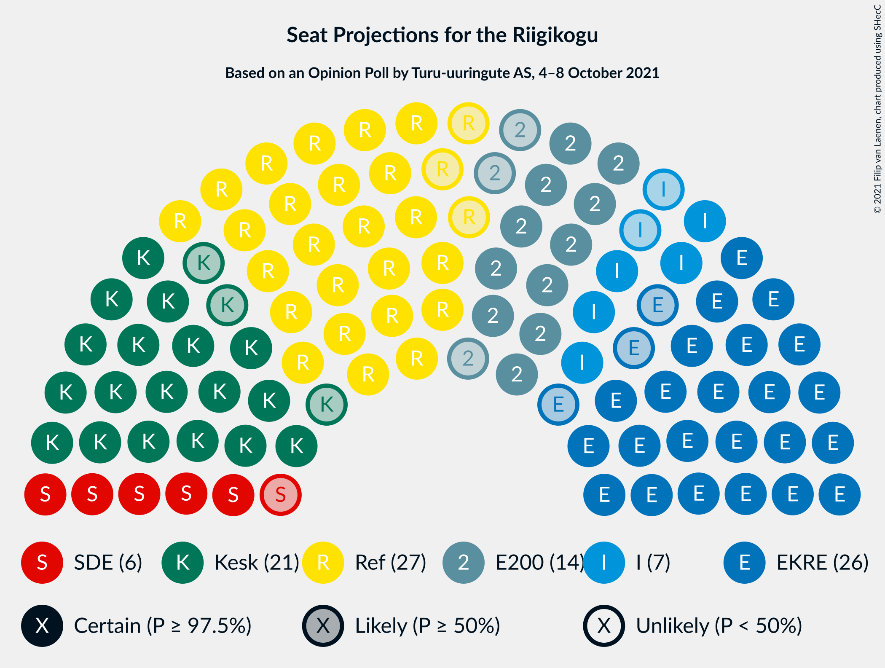
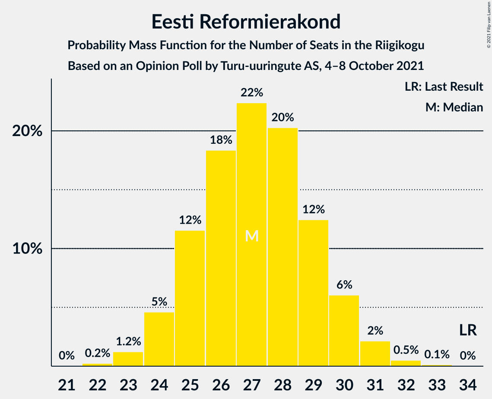
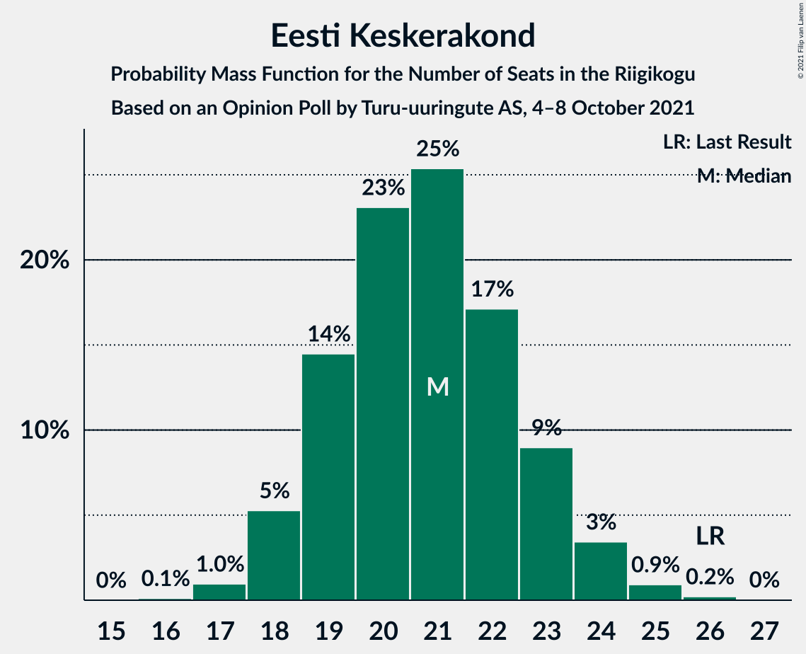
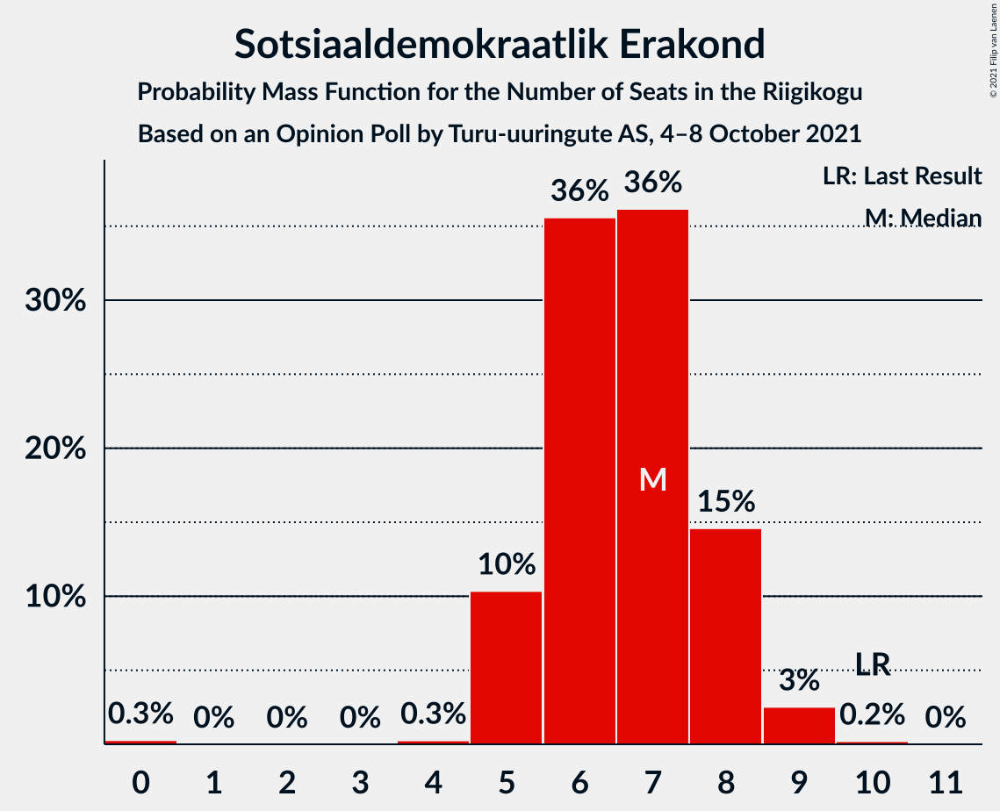
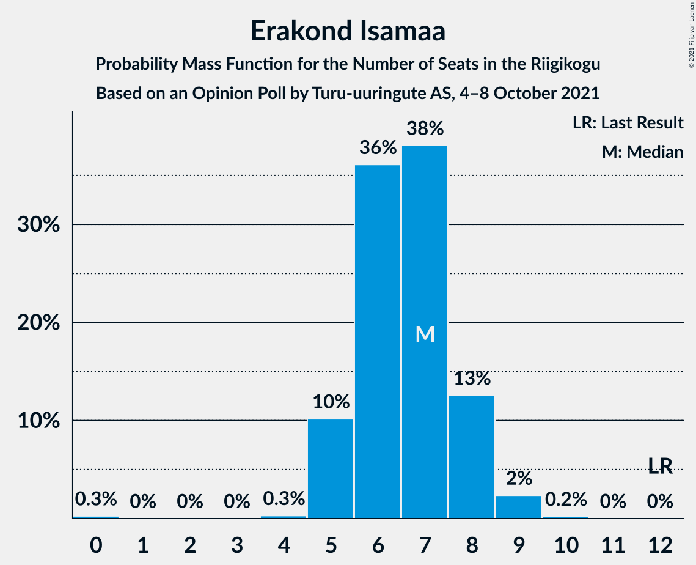
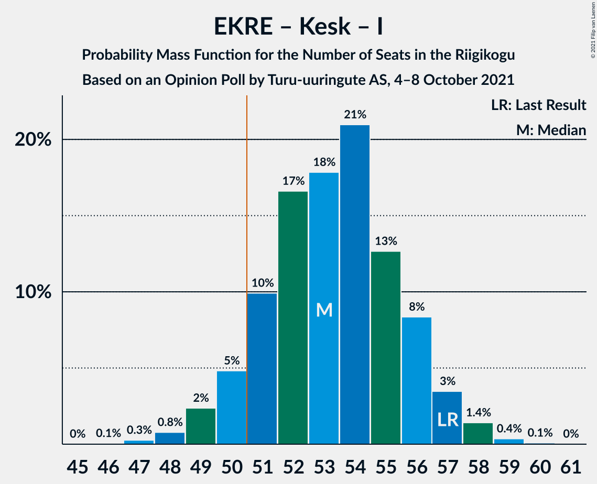

# Opinion Poll by Turu-uuringute AS, 4–8 October 2021

<a href="#voting-intentions">Voting Intentions</a> | <a href="#seats">Seats</a> | <a href="#coalitions">Coalitions</a> | <a href="#technical-information">Technical Information</a>

## Voting Intentions

### Confidence Intervals

| Party | Last Result | Poll Result | 80% Confidence Interval | 90% Confidence Interval | 95% Confidence Interval | 99% Confidence Interval |
|:-----:|:-----------:|:-----------:|:-----------------------:|:-----------------------:|:-----------------------:|:-----------------------:|
| Eesti Reformierakond | 28.9% | 24.0% | 22.3–25.8% |21.9–26.3% |21.4–26.7% |20.7–27.6% |
| Eesti Konservatiivne Rahvaerakond | 17.8% | 23.0% | 21.4–24.8% |20.9–25.3% |20.5–25.7% |19.7–26.6% |
| Eesti Keskerakond | 23.1% | 19.0% | 17.5–20.7% |17.1–21.1% |16.7–21.6% |16.0–22.4% |
| Eesti 200 | 4.4% | 13.0% | 11.7–14.5% |11.4–14.9% |11.1–15.2% |10.5–16.0% |
| Sotsiaaldemokraatlik Erakond | 9.8% | 7.0% | 6.1–8.2% |5.8–8.5% |5.6–8.8% |5.2–9.3% |
| Erakond Isamaa | 11.4% | 7.0% | 6.1–8.2% |5.8–8.5% |5.6–8.8% |5.2–9.3% |
| Erakond Eestimaa Rohelised | 1.8% | 3.0% | 2.4–3.8% |2.2–4.1% |2.1–4.3% |1.9–4.7% |

*Note:* The poll result column reflects the actual value used in the calculations. Published results may vary slightly, and in addition be rounded to fewer digits.

## Seats

### Confidence Intervals

| Party | Last Result | Median | 80% Confidence Interval | 90% Confidence Interval | 95% Confidence Interval | 99% Confidence Interval |
|:-----:|:-----------:|:------:|:-----------------------:|:-----------------------:|:-----------------------:|:-----------------------:|
| <a href="#eesti-reformierakond">Eesti Reformierakond</a> | 34 | 27 | 25–29 |24–30 |24–30 |23–32 |
| <a href="#eesti-konservatiivne-rahvaerakond">Eesti Konservatiivne Rahvaerakond</a> | 19 | 26 | 24–28 |23–29 |23–29 |22–31 |
| <a href="#eesti-keskerakond">Eesti Keskerakond</a> | 26 | 21 | 19–23 |18–23 |18–24 |17–25 |
| <a href="#eesti-200">Eesti 200</a> | 0 | 14 | 12–15 |11–16 |11–16 |10–17 |
| <a href="#sotsiaaldemokraatlik-erakond">Sotsiaaldemokraatlik Erakond</a> | 10 | 7 | 5–8 |5–8 |5–9 |4–9 |
| <a href="#erakond-isamaa">Erakond Isamaa</a> | 12 | 7 | 5–8 |5–8 |5–9 |5–9 |
| <a href="#erakond-eestimaa-rohelised">Erakond Eestimaa Rohelised</a> | 0 | 0 | 0 |0 |0 |0 |

### Eesti Reformierakond

*For a full overview of the results for this party, see the [Eesti Reformierakond](party-eestireformierakond.html) page.*

| Number of Seats | Probability | Accumulated | Special Marks |
|:---------------:|:-----------:|:-----------:|:-------------:|
| 22 | 0.2% | 100% |  |
| 23 | 1.1% | 99.7% |  |
| 24 | 5% | 98.6% |  |
| 25 | 12% | 94% |  |
| 26 | 15% | 82% |  |
| 27 | 18% | 68% | Median |
| 28 | 27% | 49% |  |
| 29 | 14% | 22% |  |
| 30 | 6% | 9% |  |
| 31 | 2% | 2% |  |
| 32 | 0.6% | 0.7% |  |
| 33 | 0.1% | 0.1% |  |
| 34 | 0% | 0% | Last Result |

### Eesti Konservatiivne Rahvaerakond

*For a full overview of the results for this party, see the [Eesti Konservatiivne Rahvaerakond](party-eestikonservatiivnerahvaerakond.html) page.*

| Number of Seats | Probability | Accumulated | Special Marks |
|:---------------:|:-----------:|:-----------:|:-------------:|
| 19 | 0% | 100% | Last Result |
| 20 | 0% | 100% |  |
| 21 | 0.3% | 100% |  |
| 22 | 1.5% | 99.7% |  |
| 23 | 5% | 98% |  |
| 24 | 12% | 93% |  |
| 25 | 31% | 81% |  |
| 26 | 19% | 51% | Median |
| 27 | 17% | 32% |  |
| 28 | 9% | 14% |  |
| 29 | 4% | 6% |  |
| 30 | 1.0% | 2% |  |
| 31 | 0.5% | 0.6% |  |
| 32 | 0.1% | 0.1% |  |
| 33 | 0% | 0% |  |

### Eesti Keskerakond

*For a full overview of the results for this party, see the [Eesti Keskerakond](party-eestikeskerakond.html) page.*

| Number of Seats | Probability | Accumulated | Special Marks |
|:---------------:|:-----------:|:-----------:|:-------------:|
| 16 | 0.1% | 100% |  |
| 17 | 0.6% | 99.9% |  |
| 18 | 5% | 99.3% |  |
| 19 | 12% | 95% |  |
| 20 | 19% | 82% |  |
| 21 | 37% | 63% | Median |
| 22 | 15% | 26% |  |
| 23 | 8% | 12% |  |
| 24 | 2% | 3% |  |
| 25 | 0.8% | 1.0% |  |
| 26 | 0.2% | 0.2% | Last Result |
| 27 | 0% | 0% |  |

### Eesti 200

*For a full overview of the results for this party, see the [Eesti 200](party-eesti200.html) page.*

| Number of Seats | Probability | Accumulated | Special Marks |
|:---------------:|:-----------:|:-----------:|:-------------:|
| 0 | 0% | 100% | Last Result |
| 1 | 0% | 100% |  |
| 2 | 0% | 100% |  |
| 3 | 0% | 100% |  |
| 4 | 0% | 100% |  |
| 5 | 0% | 100% |  |
| 6 | 0% | 100% |  |
| 7 | 0% | 100% |  |
| 8 | 0% | 100% |  |
| 9 | 0% | 100% |  |
| 10 | 0.5% | 100% |  |
| 11 | 5% | 99.5% |  |
| 12 | 18% | 95% |  |
| 13 | 19% | 77% |  |
| 14 | 34% | 58% | Median |
| 15 | 16% | 24% |  |
| 16 | 6% | 8% |  |
| 17 | 1.4% | 2% |  |
| 18 | 0.2% | 0.2% |  |
| 19 | 0% | 0% |  |

### Sotsiaaldemokraatlik Erakond

*For a full overview of the results for this party, see the [Sotsiaaldemokraatlik Erakond](party-sotsiaaldemokraatlikerakond.html) page.*

| Number of Seats | Probability | Accumulated | Special Marks |
|:---------------:|:-----------:|:-----------:|:-------------:|
| 0 | 0.3% | 100% |  |
| 1 | 0% | 99.7% |  |
| 2 | 0% | 99.7% |  |
| 3 | 0% | 99.7% |  |
| 4 | 0.3% | 99.7% |  |
| 5 | 10% | 99.4% |  |
| 6 | 35% | 89% |  |
| 7 | 38% | 55% | Median |
| 8 | 13% | 16% |  |
| 9 | 3% | 3% |  |
| 10 | 0.1% | 0.1% | Last Result |
| 11 | 0% | 0% |  |

### Erakond Isamaa

*For a full overview of the results for this party, see the [Erakond Isamaa](party-erakondisamaa.html) page.*

| Number of Seats | Probability | Accumulated | Special Marks |
|:---------------:|:-----------:|:-----------:|:-------------:|
| 0 | 0.2% | 100% |  |
| 1 | 0% | 99.8% |  |
| 2 | 0% | 99.8% |  |
| 3 | 0% | 99.8% |  |
| 4 | 0.2% | 99.8% |  |
| 5 | 11% | 99.7% |  |
| 6 | 36% | 89% |  |
| 7 | 38% | 53% | Median |
| 8 | 12% | 15% |  |
| 9 | 2% | 3% |  |
| 10 | 0.4% | 0.4% |  |
| 11 | 0% | 0% |  |
| 12 | 0% | 0% | Last Result |

### Erakond Eestimaa Rohelised

*For a full overview of the results for this party, see the [Erakond Eestimaa Rohelised](party-erakondeestimaarohelised.html) page.*

| Number of Seats | Probability | Accumulated | Special Marks |
|:---------------:|:-----------:|:-----------:|:-------------:|
| 0 | 99.9% | 100% | Last Result, Median |
| 1 | 0% | 0.1% |  |
| 2 | 0% | 0.1% |  |
| 3 | 0% | 0.1% |  |
| 4 | 0.1% | 0.1% |  |
| 5 | 0% | 0% |  |

## Coalitions

### Confidence Intervals

| Coalition | Last Result | Median | Majority? | 80% Confidence Interval | 90% Confidence Interval | 95% Confidence Interval | 99% Confidence Interval |
|:---------:|:-----------:|:------:|:---------:|:-----------------------:|:-----------------------:|:-----------------------:|:-----------------------:|
| Eesti Reformierakond – Eesti Konservatiivne Rahvaerakond – Eesti Keskerakond | 79 | 74 | 100% | 71–76 | 71–77 | 70–77 | 69–78 |
| Eesti Reformierakond – Eesti Konservatiivne Rahvaerakond – Erakond Isamaa | 65 | 60 | 100% | 57–62 | 56–63 | 55–63 | 54–65 |
| Eesti Konservatiivne Rahvaerakond – Eesti Keskerakond – Erakond Isamaa | 57 | 53 | 93% | 51–56 | 50–57 | 50–57 | 48–58 |
| Eesti Reformierakond – Eesti Konservatiivne Rahvaerakond | 53 | 53 | 88% | 50–56 | 49–56 | 49–57 | 48–58 |
| Eesti Reformierakond – Eesti Keskerakond | 60 | 48 | 9% | 46–50 | 45–51 | 44–52 | 43–53 |
| Eesti Konservatiivne Rahvaerakond – Eesti Keskerakond | 45 | 47 | 2% | 44–49 | 44–50 | 43–50 | 42–52 |
| Eesti Reformierakond – Erakond Isamaa – Sotsiaaldemokraatlik Erakond | 56 | 41 | 0% | 38–43 | 37–44 | 37–44 | 35–45 |
| Eesti Keskerakond – Erakond Isamaa – Sotsiaaldemokraatlik Erakond | 48 | 34 | 0% | 32–36 | 31–37 | 31–38 | 30–39 |
| Eesti Reformierakond – Erakond Isamaa | 46 | 34 | 0% | 32–36 | 31–37 | 30–38 | 29–39 |
| Eesti Reformierakond – Sotsiaaldemokraatlik Erakond | 44 | 34 | 0% | 31–36 | 31–37 | 30–37 | 29–39 |
| Eesti Konservatiivne Rahvaerakond – Sotsiaaldemokraatlik Erakond | 29 | 32 | 0% | 30–35 | 29–35 | 29–36 | 28–37 |
| Eesti Keskerakond – Sotsiaaldemokraatlik Erakond | 36 | 27 | 0% | 25–30 | 25–30 | 24–31 | 23–32 |

### Eesti Reformierakond – Eesti Konservatiivne Rahvaerakond – Eesti Keskerakond

| Number of Seats | Probability | Accumulated | Special Marks |
|:---------------:|:-----------:|:-----------:|:-------------:|
| 67 | 0.1% | 100% |  |
| 68 | 0.4% | 99.9% |  |
| 69 | 1.4% | 99.5% |  |
| 70 | 3% | 98% |  |
| 71 | 6% | 96% |  |
| 72 | 12% | 89% |  |
| 73 | 13% | 77% |  |
| 74 | 31% | 64% | Median |
| 75 | 14% | 33% |  |
| 76 | 11% | 19% |  |
| 77 | 6% | 7% |  |
| 78 | 1.3% | 2% |  |
| 79 | 0.3% | 0.4% | Last Result |
| 80 | 0.1% | 0.2% |  |
| 81 | 0% | 0.1% |  |
| 82 | 0% | 0% |  |

### Eesti Reformierakond – Eesti Konservatiivne Rahvaerakond – Erakond Isamaa

| Number of Seats | Probability | Accumulated | Special Marks |
|:---------------:|:-----------:|:-----------:|:-------------:|
| 53 | 0.2% | 100% |  |
| 54 | 0.8% | 99.8% |  |
| 55 | 2% | 98.9% |  |
| 56 | 4% | 97% |  |
| 57 | 8% | 93% |  |
| 58 | 13% | 85% |  |
| 59 | 22% | 72% |  |
| 60 | 17% | 50% | Median |
| 61 | 11% | 33% |  |
| 62 | 15% | 22% |  |
| 63 | 5% | 7% |  |
| 64 | 1.3% | 2% |  |
| 65 | 0.4% | 0.5% | Last Result |
| 66 | 0.1% | 0.1% |  |
| 67 | 0% | 0.1% |  |
| 68 | 0% | 0% |  |

### Eesti Konservatiivne Rahvaerakond – Eesti Keskerakond – Erakond Isamaa

| Number of Seats | Probability | Accumulated | Special Marks |
|:---------------:|:-----------:|:-----------:|:-------------:|
| 47 | 0.1% | 100% |  |
| 48 | 0.8% | 99.8% |  |
| 49 | 1.3% | 99.0% |  |
| 50 | 5% | 98% |  |
| 51 | 10% | 93% | Majority |
| 52 | 26% | 83% |  |
| 53 | 9% | 57% |  |
| 54 | 26% | 48% | Median |
| 55 | 11% | 22% |  |
| 56 | 6% | 11% |  |
| 57 | 3% | 5% | Last Result |
| 58 | 2% | 2% |  |
| 59 | 0.3% | 0.4% |  |
| 60 | 0.1% | 0.1% |  |
| 61 | 0% | 0% |  |

### Eesti Reformierakond – Eesti Konservatiivne Rahvaerakond

| Number of Seats | Probability | Accumulated | Special Marks |
|:---------------:|:-----------:|:-----------:|:-------------:|
| 46 | 0% | 100% |  |
| 47 | 0.3% | 99.9% |  |
| 48 | 0.8% | 99.6% |  |
| 49 | 4% | 98.8% |  |
| 50 | 7% | 94% |  |
| 51 | 12% | 88% | Majority |
| 52 | 10% | 75% |  |
| 53 | 26% | 65% | Last Result, Median |
| 54 | 13% | 40% |  |
| 55 | 16% | 26% |  |
| 56 | 6% | 10% |  |
| 57 | 3% | 4% |  |
| 58 | 0.6% | 0.9% |  |
| 59 | 0.2% | 0.3% |  |
| 60 | 0.1% | 0.1% |  |
| 61 | 0% | 0% |  |

### Eesti Reformierakond – Eesti Keskerakond

| Number of Seats | Probability | Accumulated | Special Marks |
|:---------------:|:-----------:|:-----------:|:-------------:|
| 41 | 0% | 100% |  |
| 42 | 0.1% | 99.9% |  |
| 43 | 0.7% | 99.9% |  |
| 44 | 2% | 99.2% |  |
| 45 | 4% | 97% |  |
| 46 | 14% | 93% |  |
| 47 | 16% | 79% |  |
| 48 | 19% | 63% | Median |
| 49 | 26% | 44% |  |
| 50 | 10% | 18% |  |
| 51 | 6% | 9% | Majority |
| 52 | 2% | 3% |  |
| 53 | 0.5% | 1.0% |  |
| 54 | 0.4% | 0.4% |  |
| 55 | 0.1% | 0.1% |  |
| 56 | 0% | 0% |  |
| 57 | 0% | 0% |  |
| 58 | 0% | 0% |  |
| 59 | 0% | 0% |  |
| 60 | 0% | 0% | Last Result |

### Eesti Konservatiivne Rahvaerakond – Eesti Keskerakond

| Number of Seats | Probability | Accumulated | Special Marks |
|:---------------:|:-----------:|:-----------:|:-------------:|
| 40 | 0.1% | 100% |  |
| 41 | 0.4% | 99.9% |  |
| 42 | 1.2% | 99.5% |  |
| 43 | 2% | 98% |  |
| 44 | 11% | 96% |  |
| 45 | 10% | 85% | Last Result |
| 46 | 24% | 75% |  |
| 47 | 23% | 51% | Median |
| 48 | 11% | 28% |  |
| 49 | 11% | 17% |  |
| 50 | 4% | 6% |  |
| 51 | 2% | 2% | Majority |
| 52 | 0.6% | 0.8% |  |
| 53 | 0.1% | 0.2% |  |
| 54 | 0% | 0.1% |  |
| 55 | 0% | 0% |  |

### Eesti Reformierakond – Erakond Isamaa – Sotsiaaldemokraatlik Erakond

| Number of Seats | Probability | Accumulated | Special Marks |
|:---------------:|:-----------:|:-----------:|:-------------:|
| 33 | 0% | 100% |  |
| 34 | 0.2% | 99.9% |  |
| 35 | 0.6% | 99.8% |  |
| 36 | 1.2% | 99.2% |  |
| 37 | 6% | 98% |  |
| 38 | 11% | 92% |  |
| 39 | 10% | 82% |  |
| 40 | 18% | 71% |  |
| 41 | 25% | 54% | Median |
| 42 | 17% | 29% |  |
| 43 | 6% | 12% |  |
| 44 | 4% | 6% |  |
| 45 | 2% | 2% |  |
| 46 | 0.4% | 0.5% |  |
| 47 | 0.1% | 0.1% |  |
| 48 | 0% | 0% |  |
| 49 | 0% | 0% |  |
| 50 | 0% | 0% |  |
| 51 | 0% | 0% | Majority |
| 52 | 0% | 0% |  |
| 53 | 0% | 0% |  |
| 54 | 0% | 0% |  |
| 55 | 0% | 0% |  |
| 56 | 0% | 0% | Last Result |

### Eesti Keskerakond – Erakond Isamaa – Sotsiaaldemokraatlik Erakond

| Number of Seats | Probability | Accumulated | Special Marks |
|:---------------:|:-----------:|:-----------:|:-------------:|
| 27 | 0% | 100% |  |
| 28 | 0.1% | 99.9% |  |
| 29 | 0.3% | 99.8% |  |
| 30 | 2% | 99.5% |  |
| 31 | 6% | 98% |  |
| 32 | 11% | 92% |  |
| 33 | 17% | 81% |  |
| 34 | 27% | 64% |  |
| 35 | 16% | 37% | Median |
| 36 | 13% | 21% |  |
| 37 | 5% | 8% |  |
| 38 | 2% | 3% |  |
| 39 | 0.8% | 1.0% |  |
| 40 | 0.1% | 0.2% |  |
| 41 | 0% | 0% |  |
| 42 | 0% | 0% |  |
| 43 | 0% | 0% |  |
| 44 | 0% | 0% |  |
| 45 | 0% | 0% |  |
| 46 | 0% | 0% |  |
| 47 | 0% | 0% |  |
| 48 | 0% | 0% | Last Result |

### Eesti Reformierakond – Erakond Isamaa

| Number of Seats | Probability | Accumulated | Special Marks |
|:---------------:|:-----------:|:-----------:|:-------------:|
| 27 | 0% | 100% |  |
| 28 | 0.2% | 99.9% |  |
| 29 | 0.7% | 99.7% |  |
| 30 | 3% | 99.1% |  |
| 31 | 5% | 96% |  |
| 32 | 14% | 90% |  |
| 33 | 15% | 76% |  |
| 34 | 29% | 62% | Median |
| 35 | 15% | 33% |  |
| 36 | 10% | 17% |  |
| 37 | 5% | 7% |  |
| 38 | 2% | 3% |  |
| 39 | 0.4% | 0.5% |  |
| 40 | 0.1% | 0.1% |  |
| 41 | 0% | 0% |  |
| 42 | 0% | 0% |  |
| 43 | 0% | 0% |  |
| 44 | 0% | 0% |  |
| 45 | 0% | 0% |  |
| 46 | 0% | 0% | Last Result |

### Eesti Reformierakond – Sotsiaaldemokraatlik Erakond

| Number of Seats | Probability | Accumulated | Special Marks |
|:---------------:|:-----------:|:-----------:|:-------------:|
| 27 | 0.1% | 100% |  |
| 28 | 0.3% | 99.9% |  |
| 29 | 0.7% | 99.7% |  |
| 30 | 3% | 99.0% |  |
| 31 | 9% | 96% |  |
| 32 | 11% | 87% |  |
| 33 | 18% | 77% |  |
| 34 | 14% | 59% | Median |
| 35 | 30% | 45% |  |
| 36 | 7% | 15% |  |
| 37 | 6% | 8% |  |
| 38 | 0.9% | 2% |  |
| 39 | 0.7% | 0.8% |  |
| 40 | 0.1% | 0.1% |  |
| 41 | 0% | 0% |  |
| 42 | 0% | 0% |  |
| 43 | 0% | 0% |  |
| 44 | 0% | 0% | Last Result |

### Eesti Konservatiivne Rahvaerakond – Sotsiaaldemokraatlik Erakond

| Number of Seats | Probability | Accumulated | Special Marks |
|:---------------:|:-----------:|:-----------:|:-------------:|
| 26 | 0.1% | 100% |  |
| 27 | 0.2% | 99.8% |  |
| 28 | 1.0% | 99.6% |  |
| 29 | 4% | 98.6% | Last Result |
| 30 | 8% | 95% |  |
| 31 | 14% | 87% |  |
| 32 | 32% | 74% |  |
| 33 | 17% | 42% | Median |
| 34 | 14% | 25% |  |
| 35 | 7% | 12% |  |
| 36 | 3% | 5% |  |
| 37 | 1.1% | 1.5% |  |
| 38 | 0.3% | 0.3% |  |
| 39 | 0% | 0% |  |

### Eesti Keskerakond – Sotsiaaldemokraatlik Erakond

| Number of Seats | Probability | Accumulated | Special Marks |
|:---------------:|:-----------:|:-----------:|:-------------:|
| 21 | 0.1% | 100% |  |
| 22 | 0.2% | 99.9% |  |
| 23 | 0.5% | 99.7% |  |
| 24 | 3% | 99.2% |  |
| 25 | 9% | 96% |  |
| 26 | 13% | 88% |  |
| 27 | 27% | 75% |  |
| 28 | 25% | 48% | Median |
| 29 | 13% | 23% |  |
| 30 | 7% | 11% |  |
| 31 | 3% | 4% |  |
| 32 | 1.0% | 1.2% |  |
| 33 | 0.2% | 0.2% |  |
| 34 | 0% | 0% |  |
| 35 | 0% | 0% |  |
| 36 | 0% | 0% | Last Result |

## Technical Information

### Opinion Poll

+ **Polling firm:** Turu-uuringute AS
+ **Commissioner(s):** —
+ **Fieldwork period:** 4–8 October 2021

### Calculations

+ **Sample size:** 1000
+ **Simulations done:** 131,072
+ **Error estimate:** 1.14%

