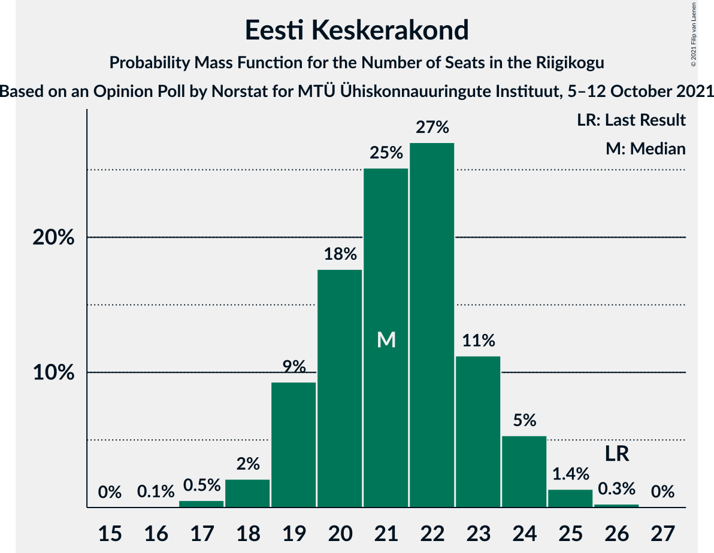
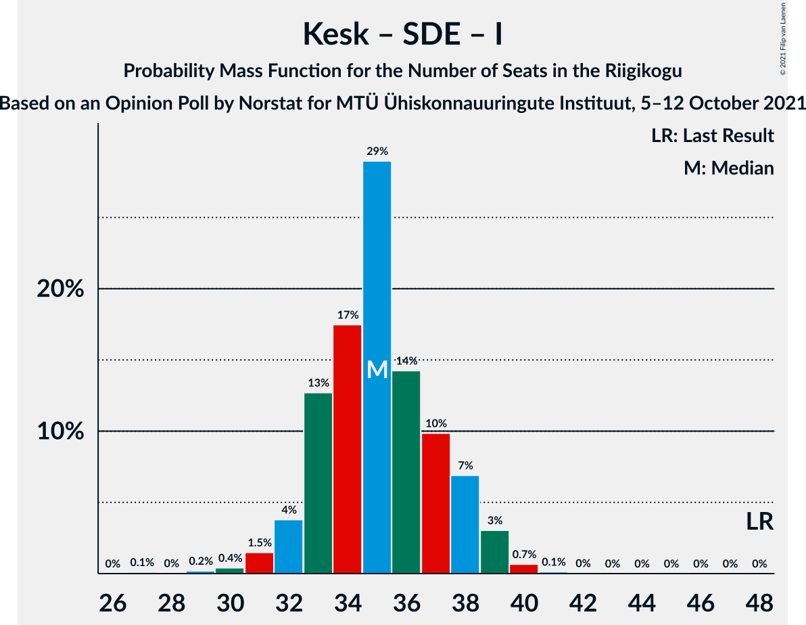

# Opinion Poll by Norstat for MTÜ Ühiskonnauuringute Instituut, 5–12 October 2021

<a href="#voting-intentions">Voting Intentions</a> | <a href="#seats">Seats</a> | <a href="#coalitions">Coalitions</a> | <a href="#technical-information">Technical Information</a>

## Voting Intentions

### Confidence Intervals

| Party | Last Result | Poll Result | 80% Confidence Interval | 90% Confidence Interval | 95% Confidence Interval | 99% Confidence Interval |
|:-----:|:-----------:|:-----------:|:-----------------------:|:-----------------------:|:-----------------------:|:-----------------------:|
| Eesti Reformierakond | 28.9% | 26.7% | 25.0–28.5% |24.5–29.1% |24.1–29.5% |23.2–30.4% |
| Eesti Konservatiivne Rahvaerakond | 17.8% | 22.0% | 20.4–23.7% |19.9–24.2% |19.5–24.7% |18.8–25.5% |
| Eesti Keskerakond | 23.1% | 19.7% | 18.2–21.4% |17.7–21.9% |17.3–22.3% |16.6–23.1% |
| Eesti 200 | 4.4% | 11.9% | 10.7–13.3% |10.3–13.7% |10.0–14.1% |9.5–14.8% |
| Sotsiaaldemokraatlik Erakond | 9.8% | 8.3% | 7.3–9.5% |7.0–9.9% |6.7–10.2% |6.3–10.8% |
| Erakond Isamaa | 11.4% | 6.7% | 5.8–7.8% |5.5–8.1% |5.3–8.4% |4.9–9.0% |
| Erakond Eestimaa Rohelised | 1.8% | 2.4% | 1.9–3.2% |1.7–3.4% |1.6–3.6% |1.4–3.9% |

*Note:* The poll result column reflects the actual value used in the calculations. Published results may vary slightly, and in addition be rounded to fewer digits.

## Seats

### Confidence Intervals

| Party | Last Result | Median | 80% Confidence Interval | 90% Confidence Interval | 95% Confidence Interval | 99% Confidence Interval |
|:-----:|:-----------:|:------:|:-----------------------:|:-----------------------:|:-----------------------:|:-----------------------:|
| <a href="#eesti-reformierakond">Eesti Reformierakond</a> | 34 | 30 | 28–32 |27–32 |27–33 |26–34 |
| <a href="#eesti-konservatiivne-rahvaerakond">Eesti Konservatiivne Rahvaerakond</a> | 19 | 25 | 22–26 |21–26 |21–27 |20–28 |
| <a href="#eesti-keskerakond">Eesti Keskerakond</a> | 26 | 21 | 19–23 |19–24 |18–24 |17–25 |
| <a href="#eesti-200">Eesti 200</a> | 0 | 12 | 10–14 |10–14 |9–14 |9–15 |
| <a href="#sotsiaaldemokraatlik-erakond">Sotsiaaldemokraatlik Erakond</a> | 10 | 8 | 7–9 |6–10 |6–10 |6–11 |
| <a href="#erakond-isamaa">Erakond Isamaa</a> | 12 | 6 | 5–7 |5–7 |5–8 |0–9 |
| <a href="#erakond-eestimaa-rohelised">Erakond Eestimaa Rohelised</a> | 0 | 0 | 0 |0 |0 |0 |

### Eesti Reformierakond

*For a full overview of the results for this party, see the [Eesti Reformierakond](party-eestireformierakond.html) page.*

| Number of Seats | Probability | Accumulated | Special Marks |
|:---------------:|:-----------:|:-----------:|:-------------:|
| 24 | 0.1% | 100% |  |
| 25 | 0.4% | 99.9% |  |
| 26 | 2% | 99.5% |  |
| 27 | 5% | 98% |  |
| 28 | 11% | 93% |  |
| 29 | 31% | 82% |  |
| 30 | 19% | 50% | Median |
| 31 | 14% | 31% |  |
| 32 | 12% | 17% |  |
| 33 | 2% | 4% |  |
| 34 | 2% | 2% | Last Result |
| 35 | 0.2% | 0.4% |  |
| 36 | 0.1% | 0.1% |  |
| 37 | 0% | 0% |  |

### Eesti Konservatiivne Rahvaerakond

*For a full overview of the results for this party, see the [Eesti Konservatiivne Rahvaerakond](party-eestikonservatiivnerahvaerakond.html) page.*

| Number of Seats | Probability | Accumulated | Special Marks |
|:---------------:|:-----------:|:-----------:|:-------------:|
| 19 | 0.1% | 100% | Last Result |
| 20 | 1.3% | 99.9% |  |
| 21 | 5% | 98.7% |  |
| 22 | 11% | 94% |  |
| 23 | 10% | 82% |  |
| 24 | 17% | 73% |  |
| 25 | 31% | 55% | Median |
| 26 | 20% | 24% |  |
| 27 | 3% | 4% |  |
| 28 | 1.1% | 1.3% |  |
| 29 | 0.2% | 0.3% |  |
| 30 | 0% | 0.1% |  |
| 31 | 0% | 0% |  |

### Eesti Keskerakond

*For a full overview of the results for this party, see the [Eesti Keskerakond](party-eestikeskerakond.html) page.*

| Number of Seats | Probability | Accumulated | Special Marks |
|:---------------:|:-----------:|:-----------:|:-------------:|
| 16 | 0.1% | 100% |  |
| 17 | 0.5% | 99.9% |  |
| 18 | 2% | 99.4% |  |
| 19 | 9% | 97% |  |
| 20 | 18% | 88% |  |
| 21 | 25% | 70% | Median |
| 22 | 27% | 45% |  |
| 23 | 11% | 18% |  |
| 24 | 5% | 7% |  |
| 25 | 1.4% | 2% |  |
| 26 | 0.3% | 0.3% | Last Result |
| 27 | 0% | 0% |  |

### Eesti 200

*For a full overview of the results for this party, see the [Eesti 200](party-eesti200.html) page.*

| Number of Seats | Probability | Accumulated | Special Marks |
|:---------------:|:-----------:|:-----------:|:-------------:|
| 0 | 0% | 100% | Last Result |
| 1 | 0% | 100% |  |
| 2 | 0% | 100% |  |
| 3 | 0% | 100% |  |
| 4 | 0% | 100% |  |
| 5 | 0% | 100% |  |
| 6 | 0% | 100% |  |
| 7 | 0% | 100% |  |
| 8 | 0% | 100% |  |
| 9 | 3% | 100% |  |
| 10 | 10% | 97% |  |
| 11 | 23% | 87% |  |
| 12 | 39% | 64% | Median |
| 13 | 13% | 24% |  |
| 14 | 10% | 11% |  |
| 15 | 0.7% | 1.1% |  |
| 16 | 0.3% | 0.4% |  |
| 17 | 0% | 0% |  |

### Sotsiaaldemokraatlik Erakond

*For a full overview of the results for this party, see the [Sotsiaaldemokraatlik Erakond](party-sotsiaaldemokraatlikerakond.html) page.*

| Number of Seats | Probability | Accumulated | Special Marks |
|:---------------:|:-----------:|:-----------:|:-------------:|
| 5 | 0.4% | 100% |  |
| 6 | 9% | 99.6% |  |
| 7 | 33% | 90% |  |
| 8 | 34% | 57% | Median |
| 9 | 18% | 23% |  |
| 10 | 4% | 5% | Last Result |
| 11 | 0.6% | 0.7% |  |
| 12 | 0% | 0% |  |

### Erakond Isamaa

*For a full overview of the results for this party, see the [Erakond Isamaa](party-erakondisamaa.html) page.*

| Number of Seats | Probability | Accumulated | Special Marks |
|:---------------:|:-----------:|:-----------:|:-------------:|
| 0 | 0.9% | 100% |  |
| 1 | 0% | 99.1% |  |
| 2 | 0% | 99.1% |  |
| 3 | 0% | 99.1% |  |
| 4 | 0.9% | 99.1% |  |
| 5 | 24% | 98% |  |
| 6 | 45% | 74% | Median |
| 7 | 25% | 30% |  |
| 8 | 4% | 5% |  |
| 9 | 0.6% | 0.7% |  |
| 10 | 0% | 0% |  |
| 11 | 0% | 0% |  |
| 12 | 0% | 0% | Last Result |

### Erakond Eestimaa Rohelised

*For a full overview of the results for this party, see the [Erakond Eestimaa Rohelised](party-erakondeestimaarohelised.html) page.*

| Number of Seats | Probability | Accumulated | Special Marks |
|:---------------:|:-----------:|:-----------:|:-------------:|
| 0 | 100% | 100% | Last Result, Median |

## Coalitions

### Confidence Intervals

| Coalition | Last Result | Median | Majority? | 80% Confidence Interval | 90% Confidence Interval | 95% Confidence Interval | 99% Confidence Interval |
|:---------:|:-----------:|:------:|:---------:|:-----------------------:|:-----------------------:|:-----------------------:|:-----------------------:|
| Eesti Reformierakond – Eesti Konservatiivne Rahvaerakond – Eesti Keskerakond | 79 | 76 | 100% | 73–77 | 72–78 | 72–78 | 70–80 |
| Eesti Reformierakond – Eesti Konservatiivne Rahvaerakond – Erakond Isamaa | 65 | 60 | 100% | 57–62 | 56–63 | 56–63 | 55–65 |
| Eesti Reformierakond – Eesti Konservatiivne Rahvaerakond | 53 | 54 | 95% | 51–56 | 51–57 | 50–58 | 49–59 |
| Eesti Konservatiivne Rahvaerakond – Eesti Keskerakond – Erakond Isamaa | 57 | 52 | 73% | 49–54 | 48–54 | 47–55 | 46–56 |
| Eesti Reformierakond – Eesti Keskerakond | 60 | 51 | 65% | 49–53 | 48–54 | 47–55 | 46–56 |
| Eesti Konservatiivne Rahvaerakond – Eesti Keskerakond | 45 | 46 | 0.4% | 43–48 | 42–48 | 41–49 | 41–50 |
| Eesti Reformierakond – Sotsiaaldemokraatlik Erakond – Erakond Isamaa | 56 | 43 | 0% | 41–46 | 41–47 | 40–47 | 39–49 |
| Eesti Reformierakond – Sotsiaaldemokraatlik Erakond | 44 | 37 | 0% | 35–40 | 35–41 | 34–41 | 33–43 |
| Eesti Keskerakond – Sotsiaaldemokraatlik Erakond – Erakond Isamaa | 48 | 35 | 0% | 33–38 | 32–38 | 32–39 | 30–40 |
| Eesti Reformierakond – Erakond Isamaa | 46 | 36 | 0% | 34–38 | 33–38 | 32–39 | 31–41 |
| Eesti Konservatiivne Rahvaerakond – Sotsiaaldemokraatlik Erakond | 29 | 32 | 0% | 30–34 | 29–35 | 29–35 | 27–37 |
| Eesti Keskerakond – Sotsiaaldemokraatlik Erakond | 36 | 29 | 0% | 27–32 | 26–32 | 26–32 | 25–34 |

### Eesti Reformierakond – Eesti Konservatiivne Rahvaerakond – Eesti Keskerakond

| Number of Seats | Probability | Accumulated | Special Marks |
|:---------------:|:-----------:|:-----------:|:-------------:|
| 70 | 0.5% | 100% |  |
| 71 | 1.3% | 99.5% |  |
| 72 | 4% | 98% |  |
| 73 | 9% | 94% |  |
| 74 | 11% | 85% |  |
| 75 | 23% | 74% |  |
| 76 | 28% | 51% | Median |
| 77 | 16% | 23% |  |
| 78 | 5% | 7% |  |
| 79 | 1.0% | 2% | Last Result |
| 80 | 1.0% | 1.4% |  |
| 81 | 0.2% | 0.3% |  |
| 82 | 0.1% | 0.1% |  |
| 83 | 0% | 0% |  |

### Eesti Reformierakond – Eesti Konservatiivne Rahvaerakond – Erakond Isamaa

| Number of Seats | Probability | Accumulated | Special Marks |
|:---------------:|:-----------:|:-----------:|:-------------:|
| 54 | 0.1% | 100% |  |
| 55 | 0.7% | 99.8% |  |
| 56 | 4% | 99.2% |  |
| 57 | 7% | 95% |  |
| 58 | 8% | 88% |  |
| 59 | 11% | 80% |  |
| 60 | 27% | 69% |  |
| 61 | 17% | 42% | Median |
| 62 | 16% | 26% |  |
| 63 | 8% | 10% |  |
| 64 | 1.3% | 2% |  |
| 65 | 0.5% | 0.6% | Last Result |
| 66 | 0.1% | 0.1% |  |
| 67 | 0% | 0% |  |

### Eesti Reformierakond – Eesti Konservatiivne Rahvaerakond

| Number of Seats | Probability | Accumulated | Special Marks |
|:---------------:|:-----------:|:-----------:|:-------------:|
| 48 | 0.3% | 100% |  |
| 49 | 0.5% | 99.6% |  |
| 50 | 4% | 99.1% |  |
| 51 | 9% | 95% | Majority |
| 52 | 8% | 86% |  |
| 53 | 9% | 79% | Last Result |
| 54 | 24% | 70% |  |
| 55 | 25% | 46% | Median |
| 56 | 11% | 21% |  |
| 57 | 7% | 10% |  |
| 58 | 2% | 3% |  |
| 59 | 0.4% | 0.7% |  |
| 60 | 0.2% | 0.3% |  |
| 61 | 0% | 0% |  |

### Eesti Konservatiivne Rahvaerakond – Eesti Keskerakond – Erakond Isamaa

| Number of Seats | Probability | Accumulated | Special Marks |
|:---------------:|:-----------:|:-----------:|:-------------:|
| 45 | 0.2% | 100% |  |
| 46 | 0.4% | 99.7% |  |
| 47 | 2% | 99.3% |  |
| 48 | 3% | 97% |  |
| 49 | 7% | 94% |  |
| 50 | 14% | 87% |  |
| 51 | 15% | 73% | Majority |
| 52 | 22% | 58% | Median |
| 53 | 26% | 37% |  |
| 54 | 7% | 11% |  |
| 55 | 3% | 4% |  |
| 56 | 1.2% | 1.4% |  |
| 57 | 0.2% | 0.2% | Last Result |
| 58 | 0.1% | 0.1% |  |
| 59 | 0% | 0% |  |

### Eesti Reformierakond – Eesti Keskerakond

| Number of Seats | Probability | Accumulated | Special Marks |
|:---------------:|:-----------:|:-----------:|:-------------:|
| 45 | 0.1% | 100% |  |
| 46 | 0.9% | 99.8% |  |
| 47 | 3% | 99.0% |  |
| 48 | 4% | 96% |  |
| 49 | 7% | 92% |  |
| 50 | 21% | 85% |  |
| 51 | 28% | 65% | Median, Majority |
| 52 | 20% | 37% |  |
| 53 | 9% | 17% |  |
| 54 | 5% | 8% |  |
| 55 | 2% | 3% |  |
| 56 | 0.8% | 1.0% |  |
| 57 | 0.1% | 0.2% |  |
| 58 | 0% | 0.1% |  |
| 59 | 0% | 0% |  |
| 60 | 0% | 0% | Last Result |

### Eesti Konservatiivne Rahvaerakond – Eesti Keskerakond

| Number of Seats | Probability | Accumulated | Special Marks |
|:---------------:|:-----------:|:-----------:|:-------------:|
| 39 | 0.1% | 100% |  |
| 40 | 0.4% | 99.9% |  |
| 41 | 2% | 99.5% |  |
| 42 | 3% | 97% |  |
| 43 | 7% | 94% |  |
| 44 | 15% | 87% |  |
| 45 | 17% | 72% | Last Result |
| 46 | 21% | 55% | Median |
| 47 | 19% | 34% |  |
| 48 | 11% | 15% |  |
| 49 | 2% | 4% |  |
| 50 | 0.9% | 1.4% |  |
| 51 | 0.3% | 0.4% | Majority |
| 52 | 0.1% | 0.1% |  |
| 53 | 0% | 0% |  |

### Eesti Reformierakond – Sotsiaaldemokraatlik Erakond – Erakond Isamaa

| Number of Seats | Probability | Accumulated | Special Marks |
|:---------------:|:-----------:|:-----------:|:-------------:|
| 36 | 0.1% | 100% |  |
| 37 | 0.1% | 99.9% |  |
| 38 | 0.2% | 99.8% |  |
| 39 | 0.6% | 99.6% |  |
| 40 | 3% | 98.9% |  |
| 41 | 8% | 96% |  |
| 42 | 20% | 88% |  |
| 43 | 21% | 68% |  |
| 44 | 15% | 48% | Median |
| 45 | 16% | 32% |  |
| 46 | 9% | 16% |  |
| 47 | 5% | 7% |  |
| 48 | 1.4% | 2% |  |
| 49 | 0.4% | 0.5% |  |
| 50 | 0.1% | 0.1% |  |
| 51 | 0% | 0% | Majority |
| 52 | 0% | 0% |  |
| 53 | 0% | 0% |  |
| 54 | 0% | 0% |  |
| 55 | 0% | 0% |  |
| 56 | 0% | 0% | Last Result |

### Eesti Reformierakond – Sotsiaaldemokraatlik Erakond

| Number of Seats | Probability | Accumulated | Special Marks |
|:---------------:|:-----------:|:-----------:|:-------------:|
| 32 | 0.1% | 100% |  |
| 33 | 0.8% | 99.9% |  |
| 34 | 3% | 99.0% |  |
| 35 | 7% | 96% |  |
| 36 | 19% | 89% |  |
| 37 | 25% | 71% |  |
| 38 | 17% | 46% | Median |
| 39 | 16% | 29% |  |
| 40 | 7% | 13% |  |
| 41 | 3% | 6% |  |
| 42 | 2% | 2% |  |
| 43 | 0.5% | 0.7% |  |
| 44 | 0.2% | 0.2% | Last Result |
| 45 | 0% | 0% |  |

### Eesti Keskerakond – Sotsiaaldemokraatlik Erakond – Erakond Isamaa

| Number of Seats | Probability | Accumulated | Special Marks |
|:---------------:|:-----------:|:-----------:|:-------------:|
| 27 | 0.1% | 100% |  |
| 28 | 0% | 99.9% |  |
| 29 | 0.2% | 99.9% |  |
| 30 | 0.4% | 99.7% |  |
| 31 | 1.5% | 99.3% |  |
| 32 | 4% | 98% |  |
| 33 | 13% | 94% |  |
| 34 | 17% | 81% |  |
| 35 | 29% | 64% | Median |
| 36 | 14% | 35% |  |
| 37 | 10% | 21% |  |
| 38 | 7% | 11% |  |
| 39 | 3% | 4% |  |
| 40 | 0.7% | 0.8% |  |
| 41 | 0.1% | 0.2% |  |
| 42 | 0% | 0% |  |
| 43 | 0% | 0% |  |
| 44 | 0% | 0% |  |
| 45 | 0% | 0% |  |
| 46 | 0% | 0% |  |
| 47 | 0% | 0% |  |
| 48 | 0% | 0% | Last Result |

### Eesti Reformierakond – Erakond Isamaa

| Number of Seats | Probability | Accumulated | Special Marks |
|:---------------:|:-----------:|:-----------:|:-------------:|
| 28 | 0.1% | 100% |  |
| 29 | 0.2% | 99.9% |  |
| 30 | 0.2% | 99.7% |  |
| 31 | 0.6% | 99.6% |  |
| 32 | 2% | 98.9% |  |
| 33 | 4% | 97% |  |
| 34 | 18% | 93% |  |
| 35 | 26% | 76% |  |
| 36 | 13% | 50% | Median |
| 37 | 16% | 37% |  |
| 38 | 17% | 21% |  |
| 39 | 2% | 4% |  |
| 40 | 1.5% | 2% |  |
| 41 | 0.6% | 0.8% |  |
| 42 | 0.1% | 0.1% |  |
| 43 | 0% | 0% |  |
| 44 | 0% | 0% |  |
| 45 | 0% | 0% |  |
| 46 | 0% | 0% | Last Result |

### Eesti Konservatiivne Rahvaerakond – Sotsiaaldemokraatlik Erakond

| Number of Seats | Probability | Accumulated | Special Marks |
|:---------------:|:-----------:|:-----------:|:-------------:|
| 26 | 0.1% | 100% |  |
| 27 | 0.6% | 99.9% |  |
| 28 | 2% | 99.4% |  |
| 29 | 5% | 98% | Last Result |
| 30 | 9% | 92% |  |
| 31 | 15% | 83% |  |
| 32 | 30% | 68% |  |
| 33 | 20% | 38% | Median |
| 34 | 11% | 19% |  |
| 35 | 6% | 8% |  |
| 36 | 1.5% | 2% |  |
| 37 | 0.6% | 0.6% |  |
| 38 | 0.1% | 0.1% |  |
| 39 | 0% | 0% |  |

### Eesti Keskerakond – Sotsiaaldemokraatlik Erakond

| Number of Seats | Probability | Accumulated | Special Marks |
|:---------------:|:-----------:|:-----------:|:-------------:|
| 24 | 0.2% | 100% |  |
| 25 | 1.3% | 99.8% |  |
| 26 | 4% | 98.5% |  |
| 27 | 17% | 94% |  |
| 28 | 12% | 78% |  |
| 29 | 30% | 65% | Median |
| 30 | 17% | 36% |  |
| 31 | 9% | 19% |  |
| 32 | 9% | 10% |  |
| 33 | 0.9% | 2% |  |
| 34 | 0.5% | 0.6% |  |
| 35 | 0.1% | 0.1% |  |
| 36 | 0% | 0% | Last Result |

## Technical Information

### Opinion Poll

+ **Polling firm:** Norstat
+ **Commissioner(s):** MTÜ Ühiskonnauuringute Instituut
+ **Fieldwork period:** 5–12 October 2021

### Calculations

+ **Sample size:** 1000
+ **Simulations done:** 131,072
+ **Error estimate:** 1.25%

