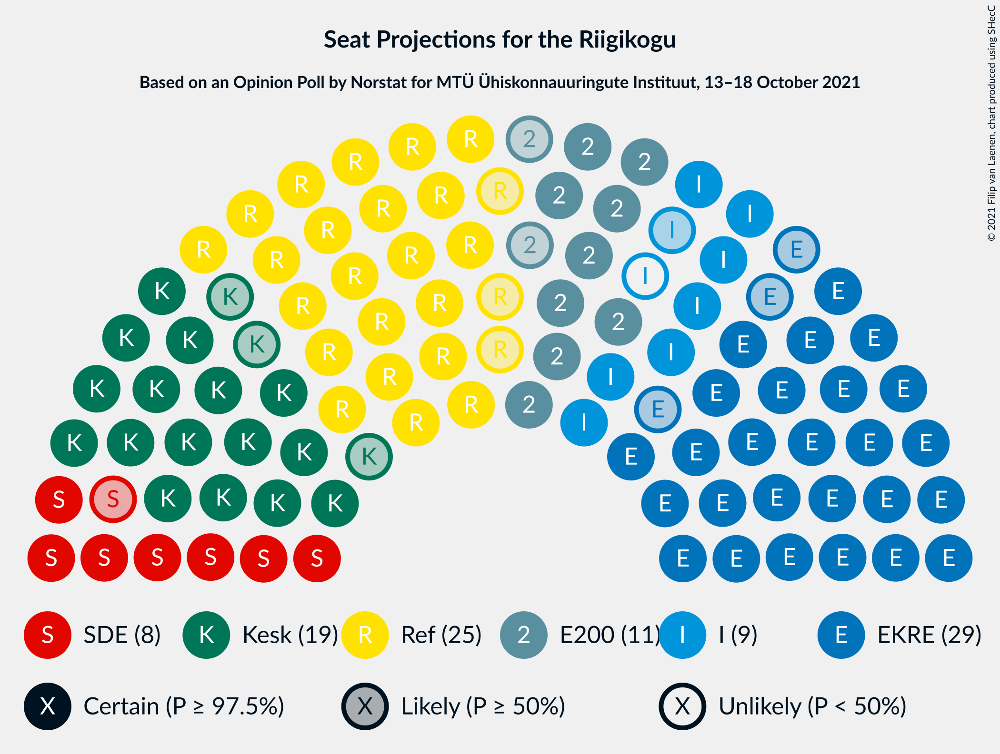
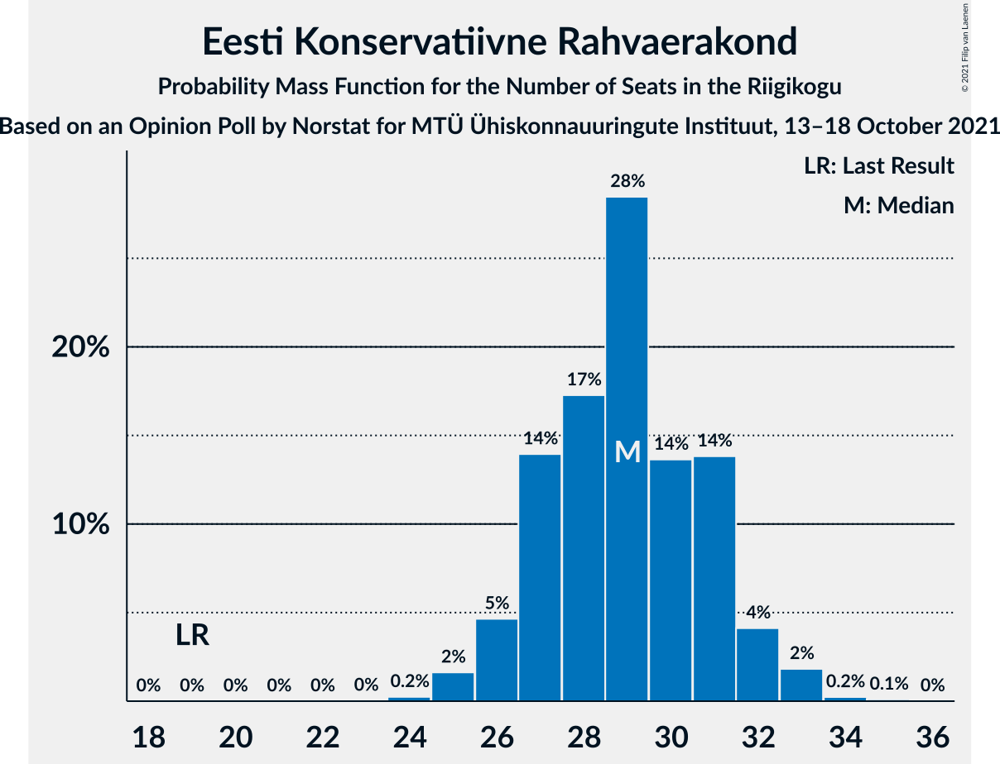
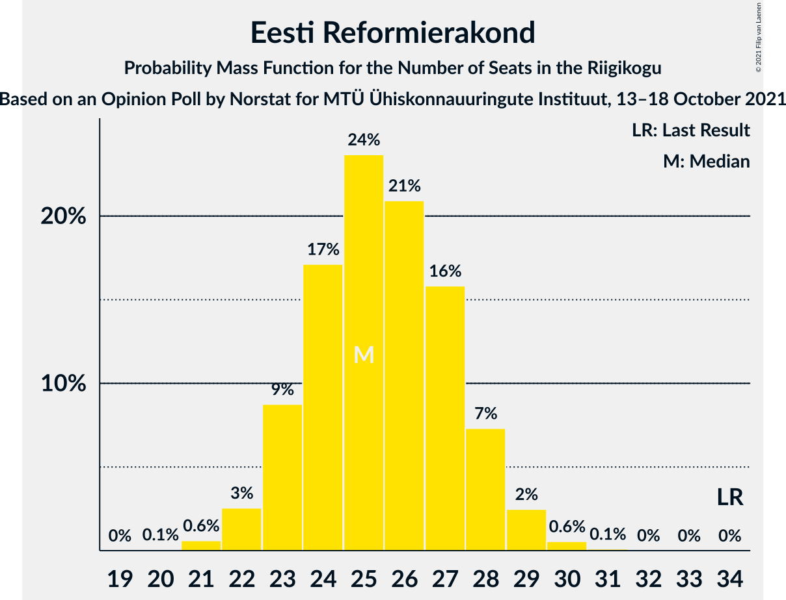
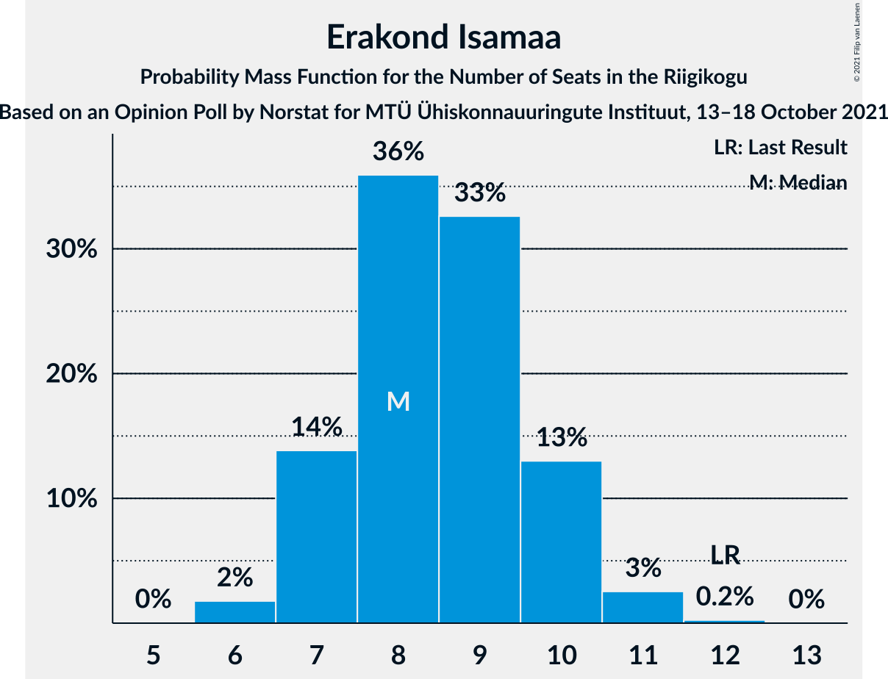
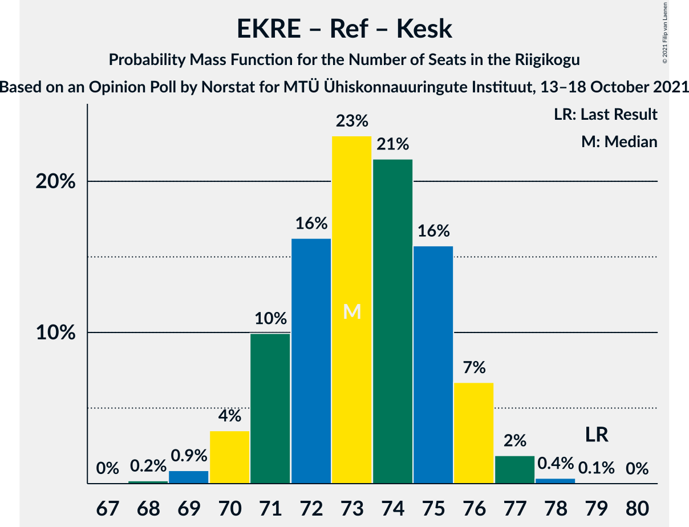
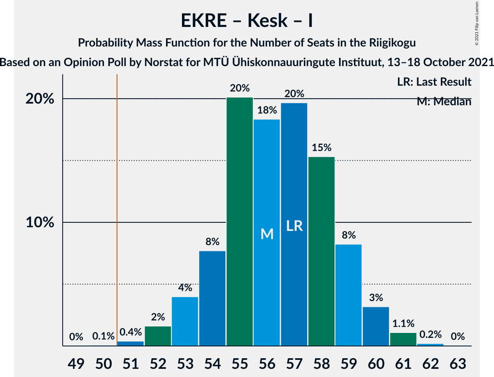
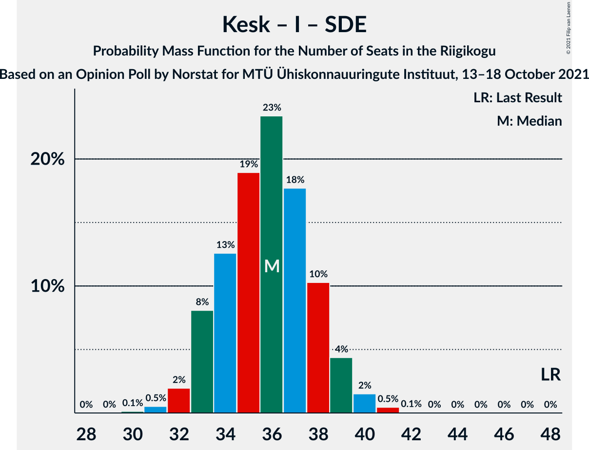

# Opinion Poll by Norstat for MTÜ Ühiskonnauuringute Instituut, 13–18 October 2021

<a href="#voting-intentions">Voting Intentions</a> | <a href="#seats">Seats</a> | <a href="#coalitions">Coalitions</a> | <a href="#technical-information">Technical Information</a>

## Voting Intentions

### Confidence Intervals

| Party | Last Result | Poll Result | 80% Confidence Interval | 90% Confidence Interval | 95% Confidence Interval | 99% Confidence Interval |
|:-----:|:-----------:|:-----------:|:-----------------------:|:-----------------------:|:-----------------------:|:-----------------------:|
| Eesti Konservatiivne Rahvaerakond | 17.8% | 26.4% | 24.7–28.2% |24.2–28.8% |23.8–29.2% |23.0–30.1% |
| Eesti Reformierakond | 28.9% | 23.5% | 21.8–25.3% |21.4–25.8% |21.0–26.2% |20.2–27.1% |
| Eesti Keskerakond | 23.1% | 18.1% | 16.6–19.7% |16.2–20.2% |15.8–20.6% |15.2–21.4% |
| Eesti 200 | 4.4% | 11.1% | 9.9–12.5% |9.6–12.9% |9.3–13.2% |8.8–13.9% |
| Erakond Isamaa | 11.4% | 9.0% | 7.9–10.3% |7.6–10.6% |7.4–10.9% |6.9–11.6% |
| Sotsiaaldemokraatlik Erakond | 9.8% | 8.9% | 7.8–10.2% |7.5–10.5% |7.3–10.8% |6.8–11.5% |
| Erakond Eestimaa Rohelised | 1.8% | 1.6% | 1.2–2.2% |1.1–2.4% |1.0–2.6% |0.8–2.9% |

*Note:* The poll result column reflects the actual value used in the calculations. Published results may vary slightly, and in addition be rounded to fewer digits.

## Seats

### Confidence Intervals

| Party | Last Result | Median | 80% Confidence Interval | 90% Confidence Interval | 95% Confidence Interval | 99% Confidence Interval |
|:-----:|:-----------:|:------:|:-----------------------:|:-----------------------:|:-----------------------:|:-----------------------:|
| <a href="#eesti-konservatiivne-rahvaerakond">Eesti Konservatiivne Rahvaerakond</a> | 19 | 29 | 27–31 |26–32 |26–32 |25–33 |
| <a href="#eesti-reformierakond">Eesti Reformierakond</a> | 34 | 25 | 23–28 |23–28 |22–29 |21–30 |
| <a href="#eesti-keskerakond">Eesti Keskerakond</a> | 26 | 19 | 17–21 |17–21 |16–22 |15–23 |
| <a href="#eesti-200">Eesti 200</a> | 0 | 11 | 9–12 |9–13 |9–13 |8–14 |
| <a href="#erakond-isamaa">Erakond Isamaa</a> | 12 | 8 | 7–10 |7–10 |7–11 |6–11 |
| <a href="#sotsiaaldemokraatlik-erakond">Sotsiaaldemokraatlik Erakond</a> | 10 | 8 | 7–10 |7–10 |7–10 |6–11 |
| <a href="#erakond-eestimaa-rohelised">Erakond Eestimaa Rohelised</a> | 0 | 0 | 0 |0 |0 |0 |

### Eesti Konservatiivne Rahvaerakond

*For a full overview of the results for this party, see the [Eesti Konservatiivne Rahvaerakond](party-eestikonservatiivnerahvaerakond.html) page.*

| Number of Seats | Probability | Accumulated | Special Marks |
|:---------------:|:-----------:|:-----------:|:-------------:|
| 19 | 0% | 100% | Last Result |
| 20 | 0% | 100% |  |
| 21 | 0% | 100% |  |
| 22 | 0% | 100% |  |
| 23 | 0% | 100% |  |
| 24 | 0.2% | 100% |  |
| 25 | 2% | 99.7% |  |
| 26 | 5% | 98% |  |
| 27 | 14% | 93% |  |
| 28 | 17% | 79% |  |
| 29 | 28% | 62% | Median |
| 30 | 14% | 34% |  |
| 31 | 14% | 20% |  |
| 32 | 4% | 6% |  |
| 33 | 2% | 2% |  |
| 34 | 0.2% | 0.3% |  |
| 35 | 0.1% | 0.1% |  |
| 36 | 0% | 0% |  |

### Eesti Reformierakond

*For a full overview of the results for this party, see the [Eesti Reformierakond](party-eestireformierakond.html) page.*

| Number of Seats | Probability | Accumulated | Special Marks |
|:---------------:|:-----------:|:-----------:|:-------------:|
| 20 | 0.1% | 100% |  |
| 21 | 0.6% | 99.9% |  |
| 22 | 3% | 99.3% |  |
| 23 | 9% | 97% |  |
| 24 | 17% | 88% |  |
| 25 | 24% | 71% | Median |
| 26 | 21% | 47% |  |
| 27 | 16% | 26% |  |
| 28 | 7% | 10% |  |
| 29 | 2% | 3% |  |
| 30 | 0.6% | 0.7% |  |
| 31 | 0.1% | 0.1% |  |
| 32 | 0% | 0% |  |
| 33 | 0% | 0% |  |
| 34 | 0% | 0% | Last Result |

### Eesti Keskerakond

*For a full overview of the results for this party, see the [Eesti Keskerakond](party-eestikeskerakond.html) page.*

| Number of Seats | Probability | Accumulated | Special Marks |
|:---------------:|:-----------:|:-----------:|:-------------:|
| 14 | 0% | 100% |  |
| 15 | 0.6% | 99.9% |  |
| 16 | 4% | 99.3% |  |
| 17 | 11% | 96% |  |
| 18 | 24% | 84% |  |
| 19 | 26% | 60% | Median |
| 20 | 20% | 34% |  |
| 21 | 10% | 14% |  |
| 22 | 3% | 4% |  |
| 23 | 0.7% | 0.8% |  |
| 24 | 0.1% | 0.1% |  |
| 25 | 0% | 0% |  |
| 26 | 0% | 0% | Last Result |

### Eesti 200

*For a full overview of the results for this party, see the [Eesti 200](party-eesti200.html) page.*

| Number of Seats | Probability | Accumulated | Special Marks |
|:---------------:|:-----------:|:-----------:|:-------------:|
| 0 | 0% | 100% | Last Result |
| 1 | 0% | 100% |  |
| 2 | 0% | 100% |  |
| 3 | 0% | 100% |  |
| 4 | 0% | 100% |  |
| 5 | 0% | 100% |  |
| 6 | 0% | 100% |  |
| 7 | 0.1% | 100% |  |
| 8 | 2% | 99.9% |  |
| 9 | 11% | 98% |  |
| 10 | 26% | 88% |  |
| 11 | 36% | 61% | Median |
| 12 | 18% | 26% |  |
| 13 | 6% | 7% |  |
| 14 | 0.9% | 1.0% |  |
| 15 | 0.1% | 0.1% |  |
| 16 | 0% | 0% |  |

### Erakond Isamaa

*For a full overview of the results for this party, see the [Erakond Isamaa](party-erakondisamaa.html) page.*

| Number of Seats | Probability | Accumulated | Special Marks |
|:---------------:|:-----------:|:-----------:|:-------------:|
| 6 | 2% | 100% |  |
| 7 | 14% | 98% |  |
| 8 | 36% | 84% | Median |
| 9 | 33% | 48% |  |
| 10 | 13% | 16% |  |
| 11 | 3% | 3% |  |
| 12 | 0.2% | 0.3% | Last Result |
| 13 | 0% | 0% |  |

### Sotsiaaldemokraatlik Erakond

*For a full overview of the results for this party, see the [Sotsiaaldemokraatlik Erakond](party-sotsiaaldemokraatlikerakond.html) page.*

| Number of Seats | Probability | Accumulated | Special Marks |
|:---------------:|:-----------:|:-----------:|:-------------:|
| 5 | 0.1% | 100% |  |
| 6 | 2% | 99.9% |  |
| 7 | 17% | 98% |  |
| 8 | 36% | 80% | Median |
| 9 | 32% | 45% |  |
| 10 | 10% | 13% | Last Result |
| 11 | 2% | 2% |  |
| 12 | 0.2% | 0.2% |  |
| 13 | 0% | 0% |  |

### Erakond Eestimaa Rohelised

*For a full overview of the results for this party, see the [Erakond Eestimaa Rohelised](party-erakondeestimaarohelised.html) page.*

| Number of Seats | Probability | Accumulated | Special Marks |
|:---------------:|:-----------:|:-----------:|:-------------:|
| 0 | 100% | 100% | Last Result, Median |

## Coalitions

### Confidence Intervals

| Coalition | Last Result | Median | Majority? | 80% Confidence Interval | 90% Confidence Interval | 95% Confidence Interval | 99% Confidence Interval |
|:---------:|:-----------:|:------:|:---------:|:-----------------------:|:-----------------------:|:-----------------------:|:-----------------------:|
| Eesti Konservatiivne Rahvaerakond – Eesti Reformierakond – Eesti Keskerakond | 79 | 73 | 100% | 71–75 | 71–76 | 70–76 | 69–77 |
| Eesti Konservatiivne Rahvaerakond – Eesti Reformierakond – Erakond Isamaa | 65 | 63 | 100% | 61–65 | 60–66 | 59–66 | 58–67 |
| Eesti Konservatiivne Rahvaerakond – Eesti Keskerakond – Erakond Isamaa | 57 | 56 | 99.9% | 54–59 | 53–59 | 53–60 | 52–61 |
| Eesti Konservatiivne Rahvaerakond – Eesti Reformierakond | 53 | 54 | 98% | 52–57 | 51–57 | 51–58 | 50–59 |
| Eesti Konservatiivne Rahvaerakond – Eesti Keskerakond | 45 | 48 | 8% | 46–50 | 45–51 | 44–52 | 43–53 |
| Eesti Reformierakond – Eesti Keskerakond | 60 | 44 | 0% | 42–47 | 41–47 | 41–48 | 39–49 |
| Eesti Reformierakond – Erakond Isamaa – Sotsiaaldemokraatlik Erakond | 56 | 42 | 0% | 40–45 | 39–45 | 39–46 | 37–47 |
| Eesti Konservatiivne Rahvaerakond – Sotsiaaldemokraatlik Erakond | 29 | 37 | 0% | 35–40 | 34–40 | 34–41 | 33–42 |
| Eesti Keskerakond – Erakond Isamaa – Sotsiaaldemokraatlik Erakond | 48 | 36 | 0% | 33–38 | 33–39 | 32–39 | 31–41 |
| Eesti Reformierakond – Sotsiaaldemokraatlik Erakond | 44 | 34 | 0% | 32–36 | 31–37 | 31–37 | 29–38 |
| Eesti Reformierakond – Erakond Isamaa | 46 | 34 | 0% | 32–36 | 31–37 | 30–37 | 29–38 |
| Eesti Keskerakond – Sotsiaaldemokraatlik Erakond | 36 | 27 | 0% | 25–29 | 25–30 | 24–31 | 23–32 |

### Eesti Konservatiivne Rahvaerakond – Eesti Reformierakond – Eesti Keskerakond

| Number of Seats | Probability | Accumulated | Special Marks |
|:---------------:|:-----------:|:-----------:|:-------------:|
| 68 | 0.2% | 100% |  |
| 69 | 0.9% | 99.8% |  |
| 70 | 4% | 98.9% |  |
| 71 | 10% | 95% |  |
| 72 | 16% | 85% |  |
| 73 | 23% | 69% | Median |
| 74 | 21% | 46% |  |
| 75 | 16% | 25% |  |
| 76 | 7% | 9% |  |
| 77 | 2% | 2% |  |
| 78 | 0.4% | 0.4% |  |
| 79 | 0.1% | 0.1% | Last Result |
| 80 | 0% | 0% |  |

### Eesti Konservatiivne Rahvaerakond – Eesti Reformierakond – Erakond Isamaa

| Number of Seats | Probability | Accumulated | Special Marks |
|:---------------:|:-----------:|:-----------:|:-------------:|
| 57 | 0.1% | 100% |  |
| 58 | 0.7% | 99.9% |  |
| 59 | 2% | 99.2% |  |
| 60 | 6% | 97% |  |
| 61 | 14% | 91% |  |
| 62 | 19% | 77% | Median |
| 63 | 21% | 58% |  |
| 64 | 18% | 37% |  |
| 65 | 12% | 19% | Last Result |
| 66 | 5% | 7% |  |
| 67 | 2% | 2% |  |
| 68 | 0.3% | 0.4% |  |
| 69 | 0.1% | 0.1% |  |
| 70 | 0% | 0% |  |

### Eesti Konservatiivne Rahvaerakond – Eesti Keskerakond – Erakond Isamaa

| Number of Seats | Probability | Accumulated | Special Marks |
|:---------------:|:-----------:|:-----------:|:-------------:|
| 50 | 0.1% | 100% |  |
| 51 | 0.4% | 99.9% | Majority |
| 52 | 2% | 99.5% |  |
| 53 | 4% | 98% |  |
| 54 | 8% | 94% |  |
| 55 | 20% | 86% |  |
| 56 | 18% | 66% | Median |
| 57 | 20% | 48% | Last Result |
| 58 | 15% | 28% |  |
| 59 | 8% | 13% |  |
| 60 | 3% | 5% |  |
| 61 | 1.1% | 1.3% |  |
| 62 | 0.2% | 0.3% |  |
| 63 | 0% | 0% |  |

### Eesti Konservatiivne Rahvaerakond – Eesti Reformierakond

| Number of Seats | Probability | Accumulated | Special Marks |
|:---------------:|:-----------:|:-----------:|:-------------:|
| 48 | 0.1% | 100% |  |
| 49 | 0.4% | 99.9% |  |
| 50 | 1.4% | 99.6% |  |
| 51 | 4% | 98% | Majority |
| 52 | 10% | 94% |  |
| 53 | 16% | 84% | Last Result |
| 54 | 19% | 68% | Median |
| 55 | 22% | 49% |  |
| 56 | 14% | 27% |  |
| 57 | 9% | 13% |  |
| 58 | 3% | 4% |  |
| 59 | 1.0% | 1.3% |  |
| 60 | 0.2% | 0.3% |  |
| 61 | 0.1% | 0.1% |  |
| 62 | 0% | 0% |  |

### Eesti Konservatiivne Rahvaerakond – Eesti Keskerakond

| Number of Seats | Probability | Accumulated | Special Marks |
|:---------------:|:-----------:|:-----------:|:-------------:|
| 42 | 0.2% | 100% |  |
| 43 | 0.8% | 99.8% |  |
| 44 | 3% | 99.0% |  |
| 45 | 6% | 96% | Last Result |
| 46 | 13% | 90% |  |
| 47 | 20% | 77% |  |
| 48 | 20% | 57% | Median |
| 49 | 17% | 37% |  |
| 50 | 12% | 20% |  |
| 51 | 6% | 8% | Majority |
| 52 | 2% | 3% |  |
| 53 | 0.5% | 0.7% |  |
| 54 | 0.1% | 0.1% |  |
| 55 | 0% | 0% |  |

### Eesti Reformierakond – Eesti Keskerakond

| Number of Seats | Probability | Accumulated | Special Marks |
|:---------------:|:-----------:|:-----------:|:-------------:|
| 38 | 0.1% | 100% |  |
| 39 | 0.4% | 99.9% |  |
| 40 | 1.3% | 99.5% |  |
| 41 | 4% | 98% |  |
| 42 | 10% | 94% |  |
| 43 | 16% | 84% |  |
| 44 | 22% | 68% | Median |
| 45 | 17% | 46% |  |
| 46 | 16% | 28% |  |
| 47 | 8% | 12% |  |
| 48 | 4% | 5% |  |
| 49 | 0.8% | 1.1% |  |
| 50 | 0.3% | 0.3% |  |
| 51 | 0% | 0% | Majority |
| 52 | 0% | 0% |  |
| 53 | 0% | 0% |  |
| 54 | 0% | 0% |  |
| 55 | 0% | 0% |  |
| 56 | 0% | 0% |  |
| 57 | 0% | 0% |  |
| 58 | 0% | 0% |  |
| 59 | 0% | 0% |  |
| 60 | 0% | 0% | Last Result |

### Eesti Reformierakond – Erakond Isamaa – Sotsiaaldemokraatlik Erakond

| Number of Seats | Probability | Accumulated | Special Marks |
|:---------------:|:-----------:|:-----------:|:-------------:|
| 36 | 0.1% | 100% |  |
| 37 | 0.4% | 99.9% |  |
| 38 | 1.2% | 99.5% |  |
| 39 | 4% | 98% |  |
| 40 | 11% | 94% |  |
| 41 | 17% | 83% | Median |
| 42 | 21% | 67% |  |
| 43 | 20% | 46% |  |
| 44 | 14% | 26% |  |
| 45 | 7% | 11% |  |
| 46 | 3% | 5% |  |
| 47 | 0.9% | 1.1% |  |
| 48 | 0.2% | 0.2% |  |
| 49 | 0% | 0% |  |
| 50 | 0% | 0% |  |
| 51 | 0% | 0% | Majority |
| 52 | 0% | 0% |  |
| 53 | 0% | 0% |  |
| 54 | 0% | 0% |  |
| 55 | 0% | 0% |  |
| 56 | 0% | 0% | Last Result |

### Eesti Konservatiivne Rahvaerakond – Sotsiaaldemokraatlik Erakond

| Number of Seats | Probability | Accumulated | Special Marks |
|:---------------:|:-----------:|:-----------:|:-------------:|
| 29 | 0% | 100% | Last Result |
| 30 | 0% | 100% |  |
| 31 | 0.1% | 100% |  |
| 32 | 0.3% | 99.9% |  |
| 33 | 0.9% | 99.7% |  |
| 34 | 4% | 98.7% |  |
| 35 | 13% | 95% |  |
| 36 | 15% | 82% |  |
| 37 | 19% | 67% | Median |
| 38 | 21% | 48% |  |
| 39 | 17% | 27% |  |
| 40 | 6% | 10% |  |
| 41 | 3% | 4% |  |
| 42 | 1.1% | 1.4% |  |
| 43 | 0.2% | 0.3% |  |
| 44 | 0% | 0% |  |

### Eesti Keskerakond – Erakond Isamaa – Sotsiaaldemokraatlik Erakond

| Number of Seats | Probability | Accumulated | Special Marks |
|:---------------:|:-----------:|:-----------:|:-------------:|
| 30 | 0.1% | 100% |  |
| 31 | 0.5% | 99.9% |  |
| 32 | 2% | 99.3% |  |
| 33 | 8% | 97% |  |
| 34 | 13% | 89% |  |
| 35 | 19% | 77% | Median |
| 36 | 23% | 58% |  |
| 37 | 18% | 34% |  |
| 38 | 10% | 17% |  |
| 39 | 4% | 6% |  |
| 40 | 2% | 2% |  |
| 41 | 0.5% | 0.5% |  |
| 42 | 0.1% | 0.1% |  |
| 43 | 0% | 0% |  |
| 44 | 0% | 0% |  |
| 45 | 0% | 0% |  |
| 46 | 0% | 0% |  |
| 47 | 0% | 0% |  |
| 48 | 0% | 0% | Last Result |

### Eesti Reformierakond – Sotsiaaldemokraatlik Erakond

| Number of Seats | Probability | Accumulated | Special Marks |
|:---------------:|:-----------:|:-----------:|:-------------:|
| 28 | 0.1% | 100% |  |
| 29 | 0.6% | 99.9% |  |
| 30 | 2% | 99.2% |  |
| 31 | 7% | 98% |  |
| 32 | 16% | 91% |  |
| 33 | 16% | 75% | Median |
| 34 | 24% | 59% |  |
| 35 | 21% | 35% |  |
| 36 | 8% | 15% |  |
| 37 | 5% | 7% |  |
| 38 | 2% | 2% |  |
| 39 | 0.3% | 0.3% |  |
| 40 | 0.1% | 0.1% |  |
| 41 | 0% | 0% |  |
| 42 | 0% | 0% |  |
| 43 | 0% | 0% |  |
| 44 | 0% | 0% | Last Result |

### Eesti Reformierakond – Erakond Isamaa

| Number of Seats | Probability | Accumulated | Special Marks |
|:---------------:|:-----------:|:-----------:|:-------------:|
| 28 | 0.1% | 100% |  |
| 29 | 0.5% | 99.9% |  |
| 30 | 2% | 99.5% |  |
| 31 | 5% | 97% |  |
| 32 | 14% | 92% |  |
| 33 | 21% | 79% | Median |
| 34 | 21% | 57% |  |
| 35 | 17% | 37% |  |
| 36 | 12% | 20% |  |
| 37 | 6% | 8% |  |
| 38 | 1.5% | 2% |  |
| 39 | 0.4% | 0.5% |  |
| 40 | 0.1% | 0.1% |  |
| 41 | 0% | 0% |  |
| 42 | 0% | 0% |  |
| 43 | 0% | 0% |  |
| 44 | 0% | 0% |  |
| 45 | 0% | 0% |  |
| 46 | 0% | 0% | Last Result |

### Eesti Keskerakond – Sotsiaaldemokraatlik Erakond

| Number of Seats | Probability | Accumulated | Special Marks |
|:---------------:|:-----------:|:-----------:|:-------------:|
| 22 | 0.1% | 100% |  |
| 23 | 0.7% | 99.9% |  |
| 24 | 3% | 99.1% |  |
| 25 | 10% | 96% |  |
| 26 | 18% | 86% |  |
| 27 | 23% | 68% | Median |
| 28 | 21% | 45% |  |
| 29 | 15% | 24% |  |
| 30 | 7% | 9% |  |
| 31 | 2% | 3% |  |
| 32 | 0.5% | 0.6% |  |
| 33 | 0.1% | 0.1% |  |
| 34 | 0% | 0% |  |
| 35 | 0% | 0% |  |
| 36 | 0% | 0% | Last Result |

## Technical Information

### Opinion Poll

+ **Polling firm:** Norstat
+ **Commissioner(s):** MTÜ Ühiskonnauuringute Instituut
+ **Fieldwork period:** 13–18 October 2021

### Calculations

+ **Sample size:** 1000
+ **Simulations done:** 1,048,576
+ **Error estimate:** 1.07%

