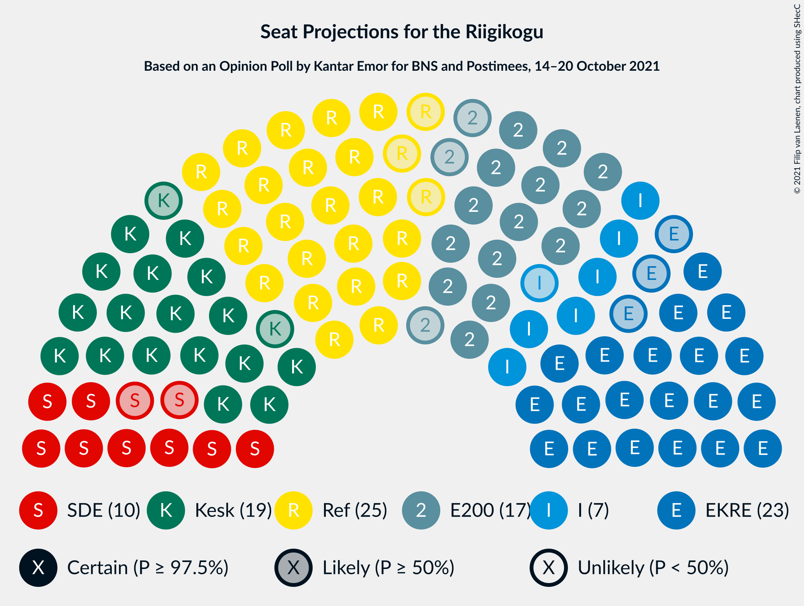
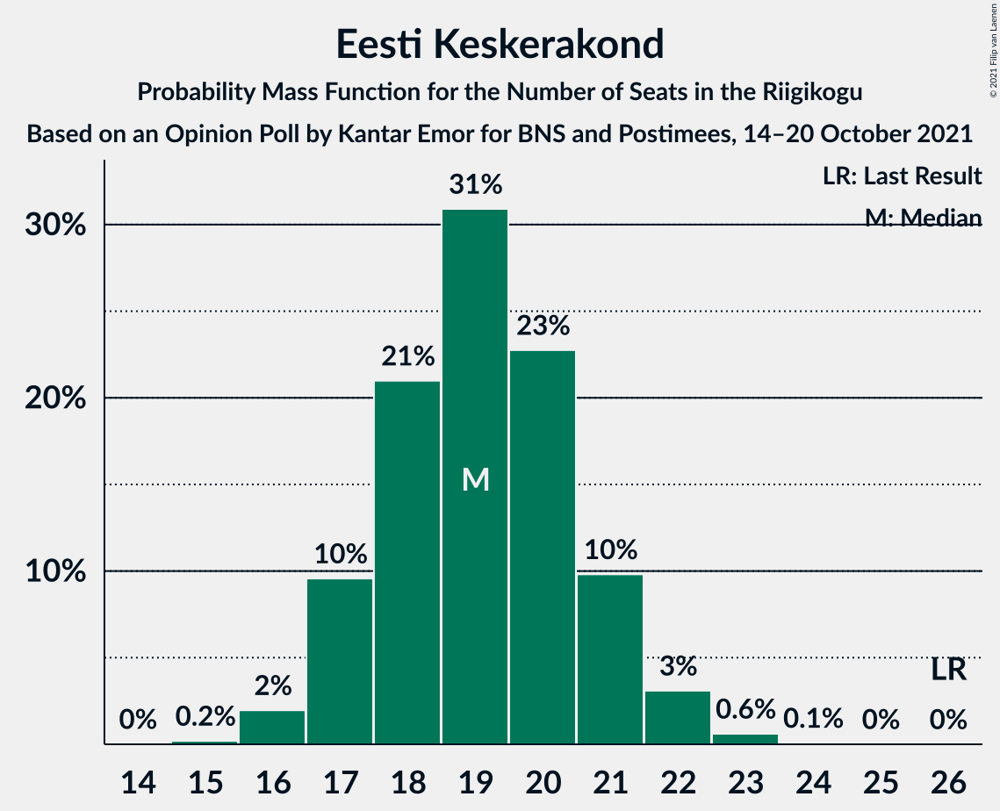
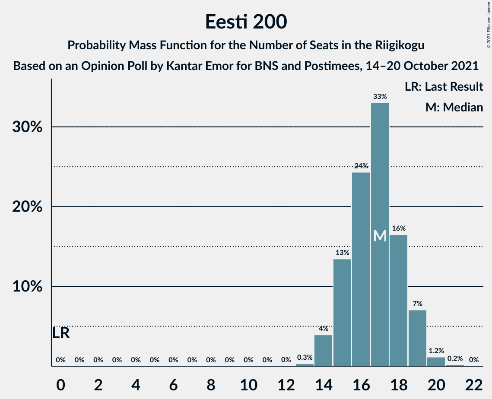

# Opinion Poll by Kantar Emor for BNS and Postimees, 14–20 October 2021

<a href="#voting-intentions">Voting Intentions</a> | <a href="#seats">Seats</a> | <a href="#coalitions">Coalitions</a> | <a href="#technical-information">Technical Information</a>

## Voting Intentions

### Confidence Intervals

| Party | Last Result | Poll Result | 80% Confidence Interval | 90% Confidence Interval | 95% Confidence Interval | 99% Confidence Interval |
|:-----:|:-----------:|:-----------:|:-----------------------:|:-----------------------:|:-----------------------:|:-----------------------:|
| Eesti Reformierakond | 28.9% | 22.7% | 21.2–24.3% |20.8–24.8% |20.5–25.2% |19.8–26.0% |
| Eesti Konservatiivne Rahvaerakond | 17.8% | 20.8% | 19.3–22.3% |18.9–22.8% |18.6–23.2% |17.9–23.9% |
| Eesti Keskerakond | 23.1% | 17.8% | 16.5–19.3% |16.1–19.7% |15.8–20.1% |15.1–20.8% |
| Eesti 200 | 4.4% | 15.8% | 14.6–17.3% |14.2–17.7% |13.9–18.0% |13.3–18.7% |
| Sotsiaaldemokraatlik Erakond | 9.8% | 9.9% | 8.9–11.1% |8.6–11.5% |8.4–11.8% |7.9–12.3% |
| Erakond Isamaa | 11.4% | 7.9% | 7.0–9.0% |6.7–9.3% |6.5–9.5% |6.1–10.1% |
| Erakond Eestimaa Rohelised | 1.8% | 3.9% | 3.3–4.8% |3.1–5.0% |3.0–5.2% |2.7–5.6% |

*Note:* The poll result column reflects the actual value used in the calculations. Published results may vary slightly, and in addition be rounded to fewer digits.

## Seats

### Confidence Intervals

| Party | Last Result | Median | 80% Confidence Interval | 90% Confidence Interval | 95% Confidence Interval | 99% Confidence Interval |
|:-----:|:-----------:|:------:|:-----------------------:|:-----------------------:|:-----------------------:|:-----------------------:|
| <a href="#eesti-reformierakond">Eesti Reformierakond</a> | 34 | 25 | 23–27 |23–28 |22–28 |21–29 |
| <a href="#eesti-konservatiivne-rahvaerakond">Eesti Konservatiivne Rahvaerakond</a> | 19 | 23 | 21–25 |20–25 |20–26 |19–26 |
| <a href="#eesti-keskerakond">Eesti Keskerakond</a> | 26 | 19 | 17–21 |17–21 |17–22 |16–23 |
| <a href="#eesti-200">Eesti 200</a> | 0 | 17 | 15–18 |15–19 |14–19 |14–20 |
| <a href="#sotsiaaldemokraatlik-erakond">Sotsiaaldemokraatlik Erakond</a> | 10 | 10 | 8–11 |8–11 |8–12 |7–12 |
| <a href="#erakond-isamaa">Erakond Isamaa</a> | 12 | 7 | 6–9 |6–9 |6–9 |5–10 |
| <a href="#erakond-eestimaa-rohelised">Erakond Eestimaa Rohelised</a> | 0 | 0 | 0 |0 |0–4 |0–5 |

### Eesti Reformierakond

*For a full overview of the results for this party, see the [Eesti Reformierakond](party-eestireformierakond.html) page.*

| Number of Seats | Probability | Accumulated | Special Marks |
|:---------------:|:-----------:|:-----------:|:-------------:|
| 20 | 0.1% | 100% |  |
| 21 | 0.5% | 99.9% |  |
| 22 | 3% | 99.4% |  |
| 23 | 10% | 96% |  |
| 24 | 20% | 86% |  |
| 25 | 27% | 66% | Median |
| 26 | 21% | 39% |  |
| 27 | 12% | 18% |  |
| 28 | 5% | 6% |  |
| 29 | 1.1% | 1.3% |  |
| 30 | 0.2% | 0.3% |  |
| 31 | 0% | 0% |  |
| 32 | 0% | 0% |  |
| 33 | 0% | 0% |  |
| 34 | 0% | 0% | Last Result |

### Eesti Konservatiivne Rahvaerakond

*For a full overview of the results for this party, see the [Eesti Konservatiivne Rahvaerakond](party-eestikonservatiivnerahvaerakond.html) page.*

| Number of Seats | Probability | Accumulated | Special Marks |
|:---------------:|:-----------:|:-----------:|:-------------:|
| 18 | 0.1% | 100% |  |
| 19 | 1.0% | 99.9% | Last Result |
| 20 | 5% | 98.9% |  |
| 21 | 16% | 94% |  |
| 22 | 24% | 78% |  |
| 23 | 26% | 54% | Median |
| 24 | 17% | 28% |  |
| 25 | 8% | 11% |  |
| 26 | 2% | 3% |  |
| 27 | 0.4% | 0.4% |  |
| 28 | 0.1% | 0.1% |  |
| 29 | 0% | 0% |  |

### Eesti Keskerakond

*For a full overview of the results for this party, see the [Eesti Keskerakond](party-eestikeskerakond.html) page.*

| Number of Seats | Probability | Accumulated | Special Marks |
|:---------------:|:-----------:|:-----------:|:-------------:|
| 15 | 0.2% | 100% |  |
| 16 | 2% | 99.8% |  |
| 17 | 10% | 98% |  |
| 18 | 21% | 88% |  |
| 19 | 31% | 67% | Median |
| 20 | 23% | 36% |  |
| 21 | 10% | 14% |  |
| 22 | 3% | 4% |  |
| 23 | 0.6% | 0.7% |  |
| 24 | 0.1% | 0.1% |  |
| 25 | 0% | 0% |  |
| 26 | 0% | 0% | Last Result |

### Eesti 200

*For a full overview of the results for this party, see the [Eesti 200](party-eesti200.html) page.*

| Number of Seats | Probability | Accumulated | Special Marks |
|:---------------:|:-----------:|:-----------:|:-------------:|
| 0 | 0% | 100% | Last Result |
| 1 | 0% | 100% |  |
| 2 | 0% | 100% |  |
| 3 | 0% | 100% |  |
| 4 | 0% | 100% |  |
| 5 | 0% | 100% |  |
| 6 | 0% | 100% |  |
| 7 | 0% | 100% |  |
| 8 | 0% | 100% |  |
| 9 | 0% | 100% |  |
| 10 | 0% | 100% |  |
| 11 | 0% | 100% |  |
| 12 | 0% | 100% |  |
| 13 | 0.3% | 100% |  |
| 14 | 4% | 99.7% |  |
| 15 | 13% | 96% |  |
| 16 | 24% | 82% |  |
| 17 | 33% | 58% | Median |
| 18 | 16% | 25% |  |
| 19 | 7% | 8% |  |
| 20 | 1.2% | 1.4% |  |
| 21 | 0.2% | 0.2% |  |
| 22 | 0% | 0% |  |

### Sotsiaaldemokraatlik Erakond

*For a full overview of the results for this party, see the [Sotsiaaldemokraatlik Erakond](party-sotsiaaldemokraatlikerakond.html) page.*

| Number of Seats | Probability | Accumulated | Special Marks |
|:---------------:|:-----------:|:-----------:|:-------------:|
| 7 | 0.7% | 100% |  |
| 8 | 9% | 99.3% |  |
| 9 | 30% | 90% |  |
| 10 | 37% | 60% | Last Result, Median |
| 11 | 18% | 23% |  |
| 12 | 4% | 5% |  |
| 13 | 0.4% | 0.4% |  |
| 14 | 0% | 0% |  |

### Erakond Isamaa

*For a full overview of the results for this party, see the [Erakond Isamaa](party-erakondisamaa.html) page.*

| Number of Seats | Probability | Accumulated | Special Marks |
|:---------------:|:-----------:|:-----------:|:-------------:|
| 5 | 0.8% | 100% |  |
| 6 | 13% | 99.2% |  |
| 7 | 36% | 86% | Median |
| 8 | 38% | 50% |  |
| 9 | 10% | 12% |  |
| 10 | 1.1% | 1.2% |  |
| 11 | 0.1% | 0.1% |  |
| 12 | 0% | 0% | Last Result |

### Erakond Eestimaa Rohelised

*For a full overview of the results for this party, see the [Erakond Eestimaa Rohelised](party-erakondeestimaarohelised.html) page.*

| Number of Seats | Probability | Accumulated | Special Marks |
|:---------------:|:-----------:|:-----------:|:-------------:|
| 0 | 96% | 100% | Last Result, Median |
| 1 | 0% | 4% |  |
| 2 | 0% | 4% |  |
| 3 | 0% | 4% |  |
| 4 | 3% | 4% |  |
| 5 | 1.3% | 1.3% |  |
| 6 | 0% | 0% |  |

## Coalitions

### Confidence Intervals

| Coalition | Last Result | Median | Majority? | 80% Confidence Interval | 90% Confidence Interval | 95% Confidence Interval | 99% Confidence Interval |
|:---------:|:-----------:|:------:|:---------:|:-----------------------:|:-----------------------:|:-----------------------:|:-----------------------:|
| Eesti Reformierakond – Eesti Konservatiivne Rahvaerakond – Eesti Keskerakond | 79 | 67 | 100% | 65–69 | 64–70 | 63–70 | 62–71 |
| Eesti Reformierakond – Eesti Konservatiivne Rahvaerakond – Erakond Isamaa | 65 | 55 | 99.5% | 53–57 | 52–58 | 52–59 | 51–60 |
| Eesti Konservatiivne Rahvaerakond – Eesti Keskerakond – Erakond Isamaa | 57 | 49 | 22% | 47–52 | 46–52 | 46–53 | 45–54 |
| Eesti Reformierakond – Eesti Konservatiivne Rahvaerakond | 53 | 48 | 6% | 46–50 | 45–51 | 44–51 | 43–52 |
| Eesti Reformierakond – Eesti Keskerakond | 60 | 44 | 0% | 42–46 | 41–47 | 41–48 | 40–49 |
| Eesti Reformierakond – Sotsiaaldemokraatlik Erakond – Erakond Isamaa | 56 | 42 | 0% | 40–45 | 40–45 | 39–46 | 38–47 |
| Eesti Konservatiivne Rahvaerakond – Eesti Keskerakond | 45 | 42 | 0% | 40–44 | 39–45 | 38–45 | 37–46 |
| Eesti Keskerakond – Sotsiaaldemokraatlik Erakond – Erakond Isamaa | 48 | 36 | 0% | 34–38 | 34–39 | 33–40 | 32–41 |
| Eesti Reformierakond – Sotsiaaldemokraatlik Erakond | 44 | 35 | 0% | 33–37 | 32–38 | 32–38 | 31–39 |
| Eesti Konservatiivne Rahvaerakond – Sotsiaaldemokraatlik Erakond | 29 | 32 | 0% | 30–35 | 30–35 | 29–36 | 28–37 |
| Eesti Reformierakond – Erakond Isamaa | 46 | 33 | 0% | 31–35 | 30–35 | 29–36 | 28–37 |
| Eesti Keskerakond – Sotsiaaldemokraatlik Erakond | 36 | 29 | 0% | 27–31 | 26–31 | 26–32 | 25–33 |

### Eesti Reformierakond – Eesti Konservatiivne Rahvaerakond – Eesti Keskerakond

| Number of Seats | Probability | Accumulated | Special Marks |
|:---------------:|:-----------:|:-----------:|:-------------:|
| 61 | 0.2% | 100% |  |
| 62 | 0.6% | 99.8% |  |
| 63 | 2% | 99.1% |  |
| 64 | 6% | 97% |  |
| 65 | 11% | 91% |  |
| 66 | 23% | 80% |  |
| 67 | 21% | 57% | Median |
| 68 | 18% | 36% |  |
| 69 | 12% | 17% |  |
| 70 | 4% | 5% |  |
| 71 | 1.3% | 2% |  |
| 72 | 0.2% | 0.2% |  |
| 73 | 0% | 0% |  |
| 74 | 0% | 0% |  |
| 75 | 0% | 0% |  |
| 76 | 0% | 0% |  |
| 77 | 0% | 0% |  |
| 78 | 0% | 0% |  |
| 79 | 0% | 0% | Last Result |

### Eesti Reformierakond – Eesti Konservatiivne Rahvaerakond – Erakond Isamaa

| Number of Seats | Probability | Accumulated | Special Marks |
|:---------------:|:-----------:|:-----------:|:-------------:|
| 49 | 0.1% | 100% |  |
| 50 | 0.4% | 99.9% |  |
| 51 | 1.3% | 99.5% | Majority |
| 52 | 4% | 98% |  |
| 53 | 12% | 94% |  |
| 54 | 16% | 83% |  |
| 55 | 19% | 66% | Median |
| 56 | 22% | 47% |  |
| 57 | 16% | 25% |  |
| 58 | 6% | 9% |  |
| 59 | 2% | 3% |  |
| 60 | 0.6% | 0.7% |  |
| 61 | 0.1% | 0.1% |  |
| 62 | 0% | 0% |  |
| 63 | 0% | 0% |  |
| 64 | 0% | 0% |  |
| 65 | 0% | 0% | Last Result |

### Eesti Konservatiivne Rahvaerakond – Eesti Keskerakond – Erakond Isamaa

| Number of Seats | Probability | Accumulated | Special Marks |
|:---------------:|:-----------:|:-----------:|:-------------:|
| 43 | 0.1% | 100% |  |
| 44 | 0.3% | 99.9% |  |
| 45 | 2% | 99.6% |  |
| 46 | 4% | 98% |  |
| 47 | 12% | 94% |  |
| 48 | 18% | 83% |  |
| 49 | 20% | 65% | Median |
| 50 | 23% | 45% |  |
| 51 | 12% | 22% | Majority |
| 52 | 7% | 10% |  |
| 53 | 3% | 3% |  |
| 54 | 0.6% | 0.7% |  |
| 55 | 0.1% | 0.1% |  |
| 56 | 0% | 0% |  |
| 57 | 0% | 0% | Last Result |

### Eesti Reformierakond – Eesti Konservatiivne Rahvaerakond

| Number of Seats | Probability | Accumulated | Special Marks |
|:---------------:|:-----------:|:-----------:|:-------------:|
| 42 | 0.1% | 100% |  |
| 43 | 0.6% | 99.8% |  |
| 44 | 2% | 99.2% |  |
| 45 | 6% | 97% |  |
| 46 | 15% | 91% |  |
| 47 | 20% | 76% |  |
| 48 | 22% | 55% | Median |
| 49 | 16% | 33% |  |
| 50 | 12% | 18% |  |
| 51 | 4% | 6% | Majority |
| 52 | 1.5% | 2% |  |
| 53 | 0.3% | 0.3% | Last Result |
| 54 | 0% | 0% |  |

### Eesti Reformierakond – Eesti Keskerakond

| Number of Seats | Probability | Accumulated | Special Marks |
|:---------------:|:-----------:|:-----------:|:-------------:|
| 38 | 0% | 100% |  |
| 39 | 0.3% | 99.9% |  |
| 40 | 1.3% | 99.6% |  |
| 41 | 4% | 98% |  |
| 42 | 11% | 94% |  |
| 43 | 17% | 83% |  |
| 44 | 24% | 67% | Median |
| 45 | 20% | 43% |  |
| 46 | 14% | 23% |  |
| 47 | 6% | 9% |  |
| 48 | 2% | 3% |  |
| 49 | 0.6% | 0.7% |  |
| 50 | 0.1% | 0.1% |  |
| 51 | 0% | 0% | Majority |
| 52 | 0% | 0% |  |
| 53 | 0% | 0% |  |
| 54 | 0% | 0% |  |
| 55 | 0% | 0% |  |
| 56 | 0% | 0% |  |
| 57 | 0% | 0% |  |
| 58 | 0% | 0% |  |
| 59 | 0% | 0% |  |
| 60 | 0% | 0% | Last Result |

### Eesti Reformierakond – Sotsiaaldemokraatlik Erakond – Erakond Isamaa

| Number of Seats | Probability | Accumulated | Special Marks |
|:---------------:|:-----------:|:-----------:|:-------------:|
| 37 | 0.2% | 100% |  |
| 38 | 1.3% | 99.7% |  |
| 39 | 3% | 98% |  |
| 40 | 10% | 95% |  |
| 41 | 16% | 86% |  |
| 42 | 21% | 70% | Median |
| 43 | 25% | 49% |  |
| 44 | 12% | 24% |  |
| 45 | 8% | 11% |  |
| 46 | 3% | 4% |  |
| 47 | 0.9% | 1.1% |  |
| 48 | 0.1% | 0.1% |  |
| 49 | 0% | 0% |  |
| 50 | 0% | 0% |  |
| 51 | 0% | 0% | Majority |
| 52 | 0% | 0% |  |
| 53 | 0% | 0% |  |
| 54 | 0% | 0% |  |
| 55 | 0% | 0% |  |
| 56 | 0% | 0% | Last Result |

### Eesti Konservatiivne Rahvaerakond – Eesti Keskerakond

| Number of Seats | Probability | Accumulated | Special Marks |
|:---------------:|:-----------:|:-----------:|:-------------:|
| 36 | 0.1% | 100% |  |
| 37 | 0.6% | 99.9% |  |
| 38 | 2% | 99.3% |  |
| 39 | 6% | 97% |  |
| 40 | 14% | 91% |  |
| 41 | 21% | 76% |  |
| 42 | 23% | 55% | Median |
| 43 | 17% | 33% |  |
| 44 | 10% | 16% |  |
| 45 | 4% | 5% | Last Result |
| 46 | 1.3% | 2% |  |
| 47 | 0.2% | 0.2% |  |
| 48 | 0% | 0% |  |

### Eesti Keskerakond – Sotsiaaldemokraatlik Erakond – Erakond Isamaa

| Number of Seats | Probability | Accumulated | Special Marks |
|:---------------:|:-----------:|:-----------:|:-------------:|
| 31 | 0.2% | 100% |  |
| 32 | 1.0% | 99.8% |  |
| 33 | 3% | 98.8% |  |
| 34 | 9% | 95% |  |
| 35 | 17% | 86% |  |
| 36 | 23% | 69% | Median |
| 37 | 20% | 46% |  |
| 38 | 16% | 26% |  |
| 39 | 6% | 9% |  |
| 40 | 2% | 3% |  |
| 41 | 0.5% | 0.6% |  |
| 42 | 0.1% | 0.1% |  |
| 43 | 0% | 0% |  |
| 44 | 0% | 0% |  |
| 45 | 0% | 0% |  |
| 46 | 0% | 0% |  |
| 47 | 0% | 0% |  |
| 48 | 0% | 0% | Last Result |

### Eesti Reformierakond – Sotsiaaldemokraatlik Erakond

| Number of Seats | Probability | Accumulated | Special Marks |
|:---------------:|:-----------:|:-----------:|:-------------:|
| 29 | 0% | 100% |  |
| 30 | 0.3% | 99.9% |  |
| 31 | 2% | 99.6% |  |
| 32 | 5% | 98% |  |
| 33 | 13% | 92% |  |
| 34 | 20% | 79% |  |
| 35 | 24% | 60% | Median |
| 36 | 18% | 35% |  |
| 37 | 11% | 17% |  |
| 38 | 4% | 6% |  |
| 39 | 1.4% | 2% |  |
| 40 | 0.2% | 0.3% |  |
| 41 | 0% | 0% |  |
| 42 | 0% | 0% |  |
| 43 | 0% | 0% |  |
| 44 | 0% | 0% | Last Result |

### Eesti Konservatiivne Rahvaerakond – Sotsiaaldemokraatlik Erakond

| Number of Seats | Probability | Accumulated | Special Marks |
|:---------------:|:-----------:|:-----------:|:-------------:|
| 27 | 0.1% | 100% |  |
| 28 | 0.6% | 99.9% |  |
| 29 | 3% | 99.3% | Last Result |
| 30 | 9% | 97% |  |
| 31 | 16% | 88% |  |
| 32 | 25% | 72% |  |
| 33 | 21% | 47% | Median |
| 34 | 16% | 26% |  |
| 35 | 7% | 10% |  |
| 36 | 2% | 3% |  |
| 37 | 0.6% | 0.7% |  |
| 38 | 0.1% | 0.1% |  |
| 39 | 0% | 0% |  |

### Eesti Reformierakond – Erakond Isamaa

| Number of Seats | Probability | Accumulated | Special Marks |
|:---------------:|:-----------:|:-----------:|:-------------:|
| 27 | 0.1% | 100% |  |
| 28 | 0.4% | 99.9% |  |
| 29 | 2% | 99.5% |  |
| 30 | 7% | 97% |  |
| 31 | 15% | 90% |  |
| 32 | 22% | 75% | Median |
| 33 | 25% | 53% |  |
| 34 | 16% | 28% |  |
| 35 | 8% | 12% |  |
| 36 | 3% | 4% |  |
| 37 | 0.8% | 1.0% |  |
| 38 | 0.1% | 0.2% |  |
| 39 | 0% | 0% |  |
| 40 | 0% | 0% |  |
| 41 | 0% | 0% |  |
| 42 | 0% | 0% |  |
| 43 | 0% | 0% |  |
| 44 | 0% | 0% |  |
| 45 | 0% | 0% |  |
| 46 | 0% | 0% | Last Result |

### Eesti Keskerakond – Sotsiaaldemokraatlik Erakond

| Number of Seats | Probability | Accumulated | Special Marks |
|:---------------:|:-----------:|:-----------:|:-------------:|
| 24 | 0.2% | 100% |  |
| 25 | 1.2% | 99.7% |  |
| 26 | 5% | 98.6% |  |
| 27 | 13% | 94% |  |
| 28 | 22% | 81% |  |
| 29 | 25% | 59% | Median |
| 30 | 19% | 33% |  |
| 31 | 10% | 14% |  |
| 32 | 3% | 5% |  |
| 33 | 1.0% | 1.2% |  |
| 34 | 0.2% | 0.2% |  |
| 35 | 0% | 0% |  |
| 36 | 0% | 0% | Last Result |

## Technical Information

### Opinion Poll

+ **Polling firm:** Kantar Emor
+ **Commissioner(s):** BNS and Postimees
+ **Fieldwork period:** 14–20 October 2021

### Calculations

+ **Sample size:** 1218
+ **Simulations done:** 1,048,576
+ **Error estimate:** 1.43%

