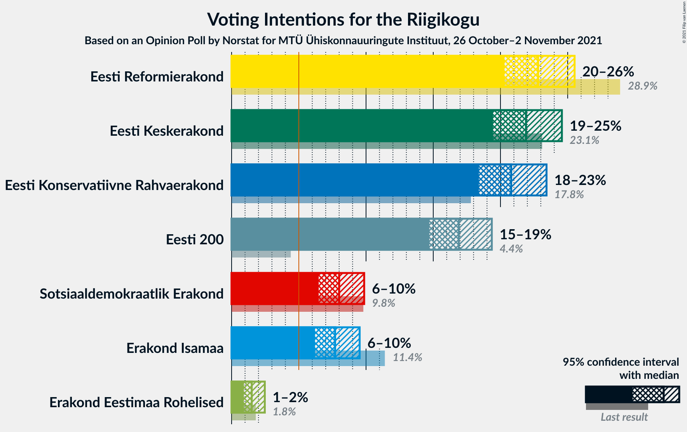
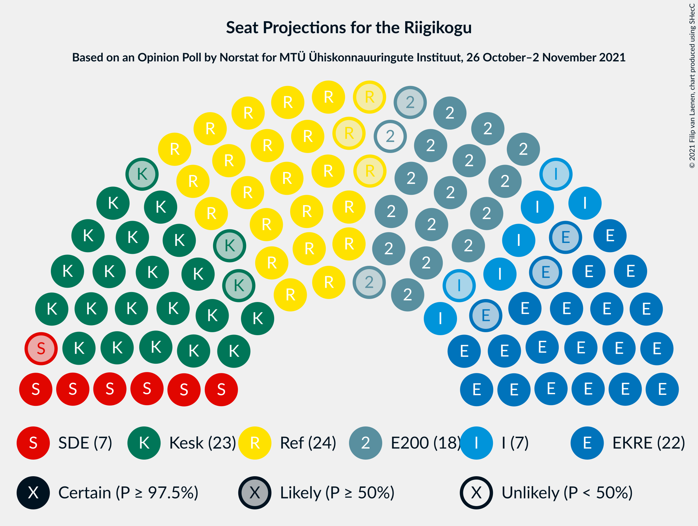
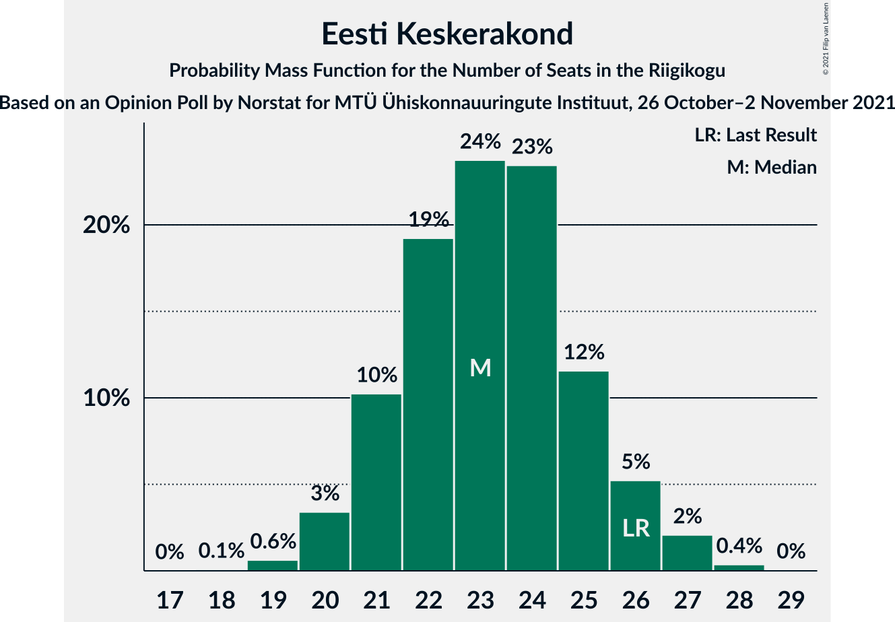
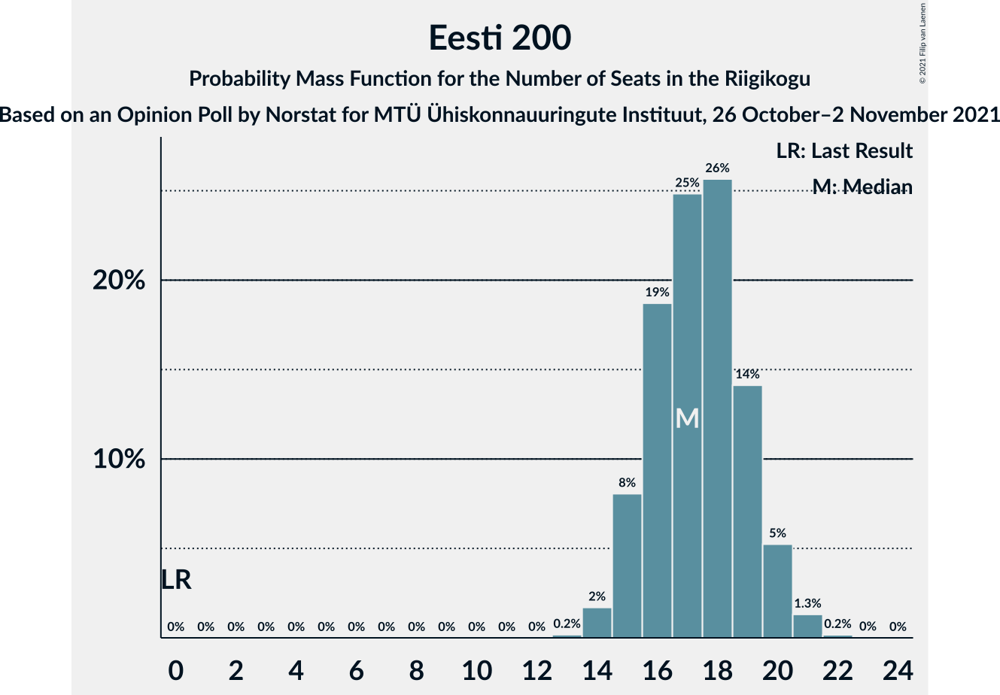
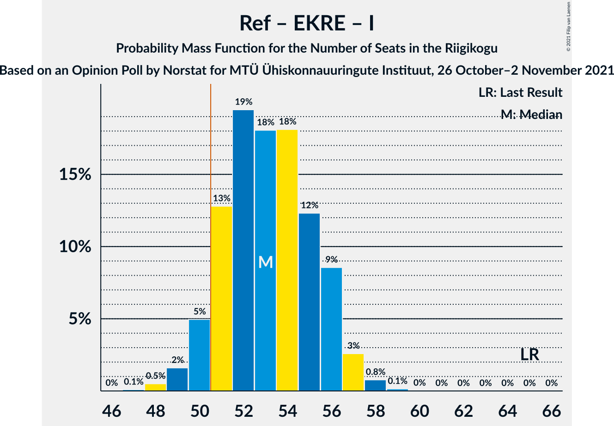

# Opinion Poll by Norstat for MTÜ Ühiskonnauuringute Instituut, 26 October–2 November 2021

<a href="#voting-intentions">Voting Intentions</a> | <a href="#seats">Seats</a> | <a href="#coalitions">Coalitions</a> | <a href="#technical-information">Technical Information</a>

## Voting Intentions

### Confidence Intervals

| Party | Last Result | Poll Result | 80% Confidence Interval | 90% Confidence Interval | 95% Confidence Interval | 99% Confidence Interval |
|:-----:|:-----------:|:-----------:|:-----------------------:|:-----------------------:|:-----------------------:|:-----------------------:|
| Eesti Reformierakond | 28.9% | 22.8% | 21.2–24.6% |20.7–25.1% |20.3–25.5% |19.5–26.4% |
| Eesti Keskerakond | 23.1% | 21.9% | 20.3–23.7% |19.8–24.1% |19.4–24.6% |18.7–25.4% |
| Eesti Konservatiivne Rahvaerakond | 17.8% | 20.8% | 19.2–22.5% |18.8–23.0% |18.4–23.4% |17.7–24.3% |
| Eesti 200 | 4.4% | 16.9% | 15.5–18.5% |15.0–19.0% |14.7–19.4% |14.0–20.1% |
| Sotsiaaldemokraatlik Erakond | 9.8% | 8.0% | 7.0–9.2% |6.7–9.6% |6.5–9.9% |6.0–10.5% |
| Erakond Isamaa | 11.4% | 7.7% | 6.7–8.9% |6.4–9.2% |6.2–9.5% |5.8–10.1% |
| Erakond Eestimaa Rohelised | 1.8% | 1.5% | 1.1–2.1% |1.0–2.3% |0.9–2.5% |0.7–2.8% |

*Note:* The poll result column reflects the actual value used in the calculations. Published results may vary slightly, and in addition be rounded to fewer digits.

## Seats

### Confidence Intervals

| Party | Last Result | Median | 80% Confidence Interval | 90% Confidence Interval | 95% Confidence Interval | 99% Confidence Interval |
|:-----:|:-----------:|:------:|:-----------------------:|:-----------------------:|:-----------------------:|:-----------------------:|
| <a href="#eesti-reformierakond">Eesti Reformierakond</a> | 34 | 24 | 23–26 |22–27 |21–27 |20–29 |
| <a href="#eesti-keskerakond">Eesti Keskerakond</a> | 26 | 24 | 21–25 |21–26 |20–26 |19–27 |
| <a href="#eesti-konservatiivne-rahvaerakond">Eesti Konservatiivne Rahvaerakond</a> | 19 | 22 | 20–24 |19–25 |19–25 |18–26 |
| <a href="#eesti-200">Eesti 200</a> | 0 | 18 | 16–19 |15–19 |15–20 |14–21 |
| <a href="#sotsiaaldemokraatlik-erakond">Sotsiaaldemokraatlik Erakond</a> | 10 | 7 | 6–8 |6–9 |6–9 |5–10 |
| <a href="#erakond-isamaa">Erakond Isamaa</a> | 12 | 7 | 6–8 |5–9 |5–9 |5–10 |
| <a href="#erakond-eestimaa-rohelised">Erakond Eestimaa Rohelised</a> | 0 | 0 | 0 |0 |0 |0 |

### Eesti Reformierakond

*For a full overview of the results for this party, see the [Eesti Reformierakond](party-eestireformierakond.html) page.*

| Number of Seats | Probability | Accumulated | Special Marks |
|:---------------:|:-----------:|:-----------:|:-------------:|
| 19 | 0.1% | 100% |  |
| 20 | 0.5% | 99.9% |  |
| 21 | 3% | 99.5% |  |
| 22 | 7% | 97% |  |
| 23 | 22% | 90% |  |
| 24 | 21% | 68% | Median |
| 25 | 33% | 47% |  |
| 26 | 9% | 14% |  |
| 27 | 3% | 5% |  |
| 28 | 1.4% | 2% |  |
| 29 | 0.4% | 0.6% |  |
| 30 | 0.2% | 0.2% |  |
| 31 | 0% | 0% |  |
| 32 | 0% | 0% |  |
| 33 | 0% | 0% |  |
| 34 | 0% | 0% | Last Result |

### Eesti Keskerakond

*For a full overview of the results for this party, see the [Eesti Keskerakond](party-eestikeskerakond.html) page.*

| Number of Seats | Probability | Accumulated | Special Marks |
|:---------------:|:-----------:|:-----------:|:-------------:|
| 18 | 0.1% | 100% |  |
| 19 | 0.6% | 99.9% |  |
| 20 | 2% | 99.3% |  |
| 21 | 11% | 97% |  |
| 22 | 15% | 86% |  |
| 23 | 20% | 71% |  |
| 24 | 32% | 51% | Median |
| 25 | 13% | 19% |  |
| 26 | 4% | 6% | Last Result |
| 27 | 1.2% | 2% |  |
| 28 | 0.4% | 0.5% |  |
| 29 | 0% | 0% |  |

### Eesti Konservatiivne Rahvaerakond

*For a full overview of the results for this party, see the [Eesti Konservatiivne Rahvaerakond](party-eestikonservatiivnerahvaerakond.html) page.*

| Number of Seats | Probability | Accumulated | Special Marks |
|:---------------:|:-----------:|:-----------:|:-------------:|
| 17 | 0.1% | 100% |  |
| 18 | 0.6% | 99.9% |  |
| 19 | 6% | 99.3% | Last Result |
| 20 | 10% | 93% |  |
| 21 | 30% | 84% |  |
| 22 | 14% | 54% | Median |
| 23 | 26% | 40% |  |
| 24 | 8% | 14% |  |
| 25 | 5% | 6% |  |
| 26 | 1.1% | 1.3% |  |
| 27 | 0.1% | 0.2% |  |
| 28 | 0% | 0% |  |

### Eesti 200

*For a full overview of the results for this party, see the [Eesti 200](party-eesti200.html) page.*

| Number of Seats | Probability | Accumulated | Special Marks |
|:---------------:|:-----------:|:-----------:|:-------------:|
| 0 | 0% | 100% | Last Result |
| 1 | 0% | 100% |  |
| 2 | 0% | 100% |  |
| 3 | 0% | 100% |  |
| 4 | 0% | 100% |  |
| 5 | 0% | 100% |  |
| 6 | 0% | 100% |  |
| 7 | 0% | 100% |  |
| 8 | 0% | 100% |  |
| 9 | 0% | 100% |  |
| 10 | 0% | 100% |  |
| 11 | 0% | 100% |  |
| 12 | 0% | 100% |  |
| 13 | 0.2% | 100% |  |
| 14 | 1.4% | 99.8% |  |
| 15 | 4% | 98% |  |
| 16 | 14% | 94% |  |
| 17 | 24% | 80% |  |
| 18 | 36% | 57% | Median |
| 19 | 17% | 21% |  |
| 20 | 3% | 4% |  |
| 21 | 1.1% | 1.3% |  |
| 22 | 0.2% | 0.2% |  |
| 23 | 0% | 0% |  |

### Sotsiaaldemokraatlik Erakond

*For a full overview of the results for this party, see the [Sotsiaaldemokraatlik Erakond](party-sotsiaaldemokraatlikerakond.html) page.*

| Number of Seats | Probability | Accumulated | Special Marks |
|:---------------:|:-----------:|:-----------:|:-------------:|
| 5 | 1.3% | 100% |  |
| 6 | 15% | 98.6% |  |
| 7 | 60% | 84% | Median |
| 8 | 16% | 24% |  |
| 9 | 7% | 8% |  |
| 10 | 1.2% | 1.3% | Last Result |
| 11 | 0.1% | 0.1% |  |
| 12 | 0% | 0% |  |

### Erakond Isamaa

*For a full overview of the results for this party, see the [Erakond Isamaa](party-erakondisamaa.html) page.*

| Number of Seats | Probability | Accumulated | Special Marks |
|:---------------:|:-----------:|:-----------:|:-------------:|
| 4 | 0.1% | 100% |  |
| 5 | 6% | 99.8% |  |
| 6 | 31% | 94% |  |
| 7 | 40% | 62% | Median |
| 8 | 17% | 22% |  |
| 9 | 4% | 5% |  |
| 10 | 0.7% | 0.8% |  |
| 11 | 0.1% | 0.1% |  |
| 12 | 0% | 0% | Last Result |

### Erakond Eestimaa Rohelised

*For a full overview of the results for this party, see the [Erakond Eestimaa Rohelised](party-erakondeestimaarohelised.html) page.*

| Number of Seats | Probability | Accumulated | Special Marks |
|:---------------:|:-----------:|:-----------:|:-------------:|
| 0 | 100% | 100% | Last Result, Median |

## Coalitions

### Confidence Intervals

| Coalition | Last Result | Median | Majority? | 80% Confidence Interval | 90% Confidence Interval | 95% Confidence Interval | 99% Confidence Interval |
|:---------:|:-----------:|:------:|:---------:|:-----------------------:|:-----------------------:|:-----------------------:|:-----------------------:|
| Eesti Reformierakond – Eesti Keskerakond – Eesti Konservatiivne Rahvaerakond | 79 | 70 | 100% | 67–71 | 67–72 | 66–73 | 65–74 |
| Eesti Reformierakond – Eesti Konservatiivne Rahvaerakond – Erakond Isamaa | 65 | 53 | 94% | 51–55 | 50–56 | 50–56 | 48–58 |
| Eesti Keskerakond – Eesti Konservatiivne Rahvaerakond – Erakond Isamaa | 57 | 52 | 85% | 50–54 | 49–55 | 48–56 | 47–57 |
| Eesti Reformierakond – Eesti Keskerakond | 60 | 47 | 3% | 46–49 | 44–50 | 44–51 | 43–52 |
| Eesti Reformierakond – Eesti Konservatiivne Rahvaerakond | 53 | 46 | 1.1% | 44–49 | 43–49 | 43–50 | 42–51 |
| Eesti Keskerakond – Eesti Konservatiivne Rahvaerakond | 45 | 45 | 0.4% | 43–47 | 42–48 | 42–49 | 40–50 |
| Eesti Reformierakond – Sotsiaaldemokraatlik Erakond – Erakond Isamaa | 56 | 38 | 0% | 37–40 | 36–41 | 35–42 | 34–43 |
| Eesti Keskerakond – Sotsiaaldemokraatlik Erakond – Erakond Isamaa | 48 | 37 | 0% | 35–39 | 34–41 | 34–41 | 33–42 |
| Eesti Reformierakond – Sotsiaaldemokraatlik Erakond | 44 | 31 | 0% | 30–33 | 29–34 | 28–35 | 27–36 |
| Eesti Reformierakond – Erakond Isamaa | 46 | 31 | 0% | 29–33 | 28–34 | 28–34 | 27–36 |
| Eesti Keskerakond – Sotsiaaldemokraatlik Erakond | 36 | 31 | 0% | 28–32 | 28–33 | 27–34 | 26–35 |
| Eesti Konservatiivne Rahvaerakond – Sotsiaaldemokraatlik Erakond | 29 | 29 | 0% | 27–31 | 26–32 | 26–32 | 25–34 |

### Eesti Reformierakond – Eesti Keskerakond – Eesti Konservatiivne Rahvaerakond

| Number of Seats | Probability | Accumulated | Special Marks |
|:---------------:|:-----------:|:-----------:|:-------------:|
| 63 | 0.1% | 100% |  |
| 64 | 0.2% | 99.9% |  |
| 65 | 0.8% | 99.8% |  |
| 66 | 4% | 99.0% |  |
| 67 | 5% | 95% |  |
| 68 | 19% | 90% |  |
| 69 | 12% | 71% |  |
| 70 | 43% | 58% | Median |
| 71 | 7% | 16% |  |
| 72 | 4% | 9% |  |
| 73 | 4% | 5% |  |
| 74 | 0.4% | 0.5% |  |
| 75 | 0.1% | 0.1% |  |
| 76 | 0% | 0% |  |
| 77 | 0% | 0% |  |
| 78 | 0% | 0% |  |
| 79 | 0% | 0% | Last Result |

### Eesti Reformierakond – Eesti Konservatiivne Rahvaerakond – Erakond Isamaa

| Number of Seats | Probability | Accumulated | Special Marks |
|:---------------:|:-----------:|:-----------:|:-------------:|
| 47 | 0.1% | 100% |  |
| 48 | 0.7% | 99.8% |  |
| 49 | 1.1% | 99.2% |  |
| 50 | 4% | 98% |  |
| 51 | 6% | 94% | Majority |
| 52 | 32% | 88% |  |
| 53 | 21% | 56% | Median |
| 54 | 17% | 34% |  |
| 55 | 10% | 17% |  |
| 56 | 5% | 8% |  |
| 57 | 1.5% | 2% |  |
| 58 | 0.9% | 1.0% |  |
| 59 | 0.1% | 0.1% |  |
| 60 | 0% | 0% |  |
| 61 | 0% | 0% |  |
| 62 | 0% | 0% |  |
| 63 | 0% | 0% |  |
| 64 | 0% | 0% |  |
| 65 | 0% | 0% | Last Result |

### Eesti Keskerakond – Eesti Konservatiivne Rahvaerakond – Erakond Isamaa

| Number of Seats | Probability | Accumulated | Special Marks |
|:---------------:|:-----------:|:-----------:|:-------------:|
| 46 | 0.1% | 100% |  |
| 47 | 1.0% | 99.8% |  |
| 48 | 2% | 98.8% |  |
| 49 | 7% | 97% |  |
| 50 | 5% | 91% |  |
| 51 | 30% | 85% | Majority |
| 52 | 13% | 56% |  |
| 53 | 19% | 42% | Median |
| 54 | 15% | 23% |  |
| 55 | 5% | 8% |  |
| 56 | 2% | 3% |  |
| 57 | 0.9% | 1.0% | Last Result |
| 58 | 0.1% | 0.1% |  |
| 59 | 0% | 0% |  |

### Eesti Reformierakond – Eesti Keskerakond

| Number of Seats | Probability | Accumulated | Special Marks |
|:---------------:|:-----------:|:-----------:|:-------------:|
| 41 | 0.1% | 100% |  |
| 42 | 0.4% | 99.9% |  |
| 43 | 1.4% | 99.5% |  |
| 44 | 4% | 98% |  |
| 45 | 4% | 94% |  |
| 46 | 19% | 90% |  |
| 47 | 23% | 72% |  |
| 48 | 13% | 49% | Median |
| 49 | 26% | 36% |  |
| 50 | 6% | 9% |  |
| 51 | 2% | 3% | Majority |
| 52 | 0.7% | 1.1% |  |
| 53 | 0.3% | 0.3% |  |
| 54 | 0% | 0% |  |
| 55 | 0% | 0% |  |
| 56 | 0% | 0% |  |
| 57 | 0% | 0% |  |
| 58 | 0% | 0% |  |
| 59 | 0% | 0% |  |
| 60 | 0% | 0% | Last Result |

### Eesti Reformierakond – Eesti Konservatiivne Rahvaerakond

| Number of Seats | Probability | Accumulated | Special Marks |
|:---------------:|:-----------:|:-----------:|:-------------:|
| 40 | 0% | 100% |  |
| 41 | 0.4% | 99.9% |  |
| 42 | 2% | 99.6% |  |
| 43 | 4% | 98% |  |
| 44 | 10% | 94% |  |
| 45 | 12% | 84% |  |
| 46 | 41% | 72% | Median |
| 47 | 10% | 31% |  |
| 48 | 10% | 21% |  |
| 49 | 7% | 10% |  |
| 50 | 3% | 4% |  |
| 51 | 0.9% | 1.1% | Majority |
| 52 | 0.2% | 0.2% |  |
| 53 | 0% | 0% | Last Result |

### Eesti Keskerakond – Eesti Konservatiivne Rahvaerakond

| Number of Seats | Probability | Accumulated | Special Marks |
|:---------------:|:-----------:|:-----------:|:-------------:|
| 39 | 0.1% | 100% |  |
| 40 | 0.6% | 99.9% |  |
| 41 | 1.3% | 99.3% |  |
| 42 | 6% | 98% |  |
| 43 | 11% | 92% |  |
| 44 | 11% | 81% |  |
| 45 | 28% | 70% | Last Result |
| 46 | 18% | 42% | Median |
| 47 | 14% | 24% |  |
| 48 | 6% | 10% |  |
| 49 | 3% | 4% |  |
| 50 | 0.7% | 1.0% |  |
| 51 | 0.3% | 0.4% | Majority |
| 52 | 0% | 0% |  |

### Eesti Reformierakond – Sotsiaaldemokraatlik Erakond – Erakond Isamaa

| Number of Seats | Probability | Accumulated | Special Marks |
|:---------------:|:-----------:|:-----------:|:-------------:|
| 32 | 0% | 100% |  |
| 33 | 0.1% | 99.9% |  |
| 34 | 1.3% | 99.8% |  |
| 35 | 2% | 98% |  |
| 36 | 5% | 96% |  |
| 37 | 25% | 91% |  |
| 38 | 30% | 66% | Median |
| 39 | 18% | 36% |  |
| 40 | 11% | 19% |  |
| 41 | 4% | 8% |  |
| 42 | 3% | 4% |  |
| 43 | 1.3% | 2% |  |
| 44 | 0.4% | 0.5% |  |
| 45 | 0% | 0% |  |
| 46 | 0% | 0% |  |
| 47 | 0% | 0% |  |
| 48 | 0% | 0% |  |
| 49 | 0% | 0% |  |
| 50 | 0% | 0% |  |
| 51 | 0% | 0% | Majority |
| 52 | 0% | 0% |  |
| 53 | 0% | 0% |  |
| 54 | 0% | 0% |  |
| 55 | 0% | 0% |  |
| 56 | 0% | 0% | Last Result |

### Eesti Keskerakond – Sotsiaaldemokraatlik Erakond – Erakond Isamaa

| Number of Seats | Probability | Accumulated | Special Marks |
|:---------------:|:-----------:|:-----------:|:-------------:|
| 32 | 0.1% | 100% |  |
| 33 | 1.1% | 99.9% |  |
| 34 | 7% | 98.8% |  |
| 35 | 7% | 92% |  |
| 36 | 9% | 84% |  |
| 37 | 33% | 75% |  |
| 38 | 21% | 43% | Median |
| 39 | 13% | 22% |  |
| 40 | 3% | 9% |  |
| 41 | 4% | 5% |  |
| 42 | 1.3% | 2% |  |
| 43 | 0.2% | 0.3% |  |
| 44 | 0% | 0% |  |
| 45 | 0% | 0% |  |
| 46 | 0% | 0% |  |
| 47 | 0% | 0% |  |
| 48 | 0% | 0% | Last Result |

### Eesti Reformierakond – Sotsiaaldemokraatlik Erakond

| Number of Seats | Probability | Accumulated | Special Marks |
|:---------------:|:-----------:|:-----------:|:-------------:|
| 26 | 0.1% | 100% |  |
| 27 | 0.6% | 99.9% |  |
| 28 | 2% | 99.3% |  |
| 29 | 5% | 97% |  |
| 30 | 21% | 92% |  |
| 31 | 26% | 71% | Median |
| 32 | 25% | 45% |  |
| 33 | 12% | 20% |  |
| 34 | 4% | 8% |  |
| 35 | 3% | 4% |  |
| 36 | 1.0% | 1.3% |  |
| 37 | 0.3% | 0.3% |  |
| 38 | 0% | 0% |  |
| 39 | 0% | 0% |  |
| 40 | 0% | 0% |  |
| 41 | 0% | 0% |  |
| 42 | 0% | 0% |  |
| 43 | 0% | 0% |  |
| 44 | 0% | 0% | Last Result |

### Eesti Reformierakond – Erakond Isamaa

| Number of Seats | Probability | Accumulated | Special Marks |
|:---------------:|:-----------:|:-----------:|:-------------:|
| 26 | 0.2% | 100% |  |
| 27 | 1.2% | 99.8% |  |
| 28 | 4% | 98.6% |  |
| 29 | 6% | 95% |  |
| 30 | 23% | 89% |  |
| 31 | 32% | 66% | Median |
| 32 | 17% | 34% |  |
| 33 | 10% | 16% |  |
| 34 | 3% | 6% |  |
| 35 | 1.2% | 2% |  |
| 36 | 0.8% | 1.0% |  |
| 37 | 0.2% | 0.2% |  |
| 38 | 0% | 0% |  |
| 39 | 0% | 0% |  |
| 40 | 0% | 0% |  |
| 41 | 0% | 0% |  |
| 42 | 0% | 0% |  |
| 43 | 0% | 0% |  |
| 44 | 0% | 0% |  |
| 45 | 0% | 0% |  |
| 46 | 0% | 0% | Last Result |

### Eesti Keskerakond – Sotsiaaldemokraatlik Erakond

| Number of Seats | Probability | Accumulated | Special Marks |
|:---------------:|:-----------:|:-----------:|:-------------:|
| 25 | 0.1% | 100% |  |
| 26 | 0.5% | 99.9% |  |
| 27 | 3% | 99.4% |  |
| 28 | 9% | 96% |  |
| 29 | 13% | 87% |  |
| 30 | 22% | 74% |  |
| 31 | 30% | 52% | Median |
| 32 | 12% | 22% |  |
| 33 | 6% | 10% |  |
| 34 | 3% | 4% |  |
| 35 | 0.7% | 0.8% |  |
| 36 | 0.1% | 0.1% | Last Result |
| 37 | 0% | 0% |  |

### Eesti Konservatiivne Rahvaerakond – Sotsiaaldemokraatlik Erakond

| Number of Seats | Probability | Accumulated | Special Marks |
|:---------------:|:-----------:|:-----------:|:-------------:|
| 24 | 0.2% | 100% |  |
| 25 | 0.5% | 99.8% |  |
| 26 | 5% | 99.3% |  |
| 27 | 9% | 94% |  |
| 28 | 28% | 85% |  |
| 29 | 15% | 57% | Last Result, Median |
| 30 | 25% | 42% |  |
| 31 | 7% | 17% |  |
| 32 | 8% | 10% |  |
| 33 | 1.4% | 2% |  |
| 34 | 0.5% | 0.6% |  |
| 35 | 0.1% | 0.1% |  |
| 36 | 0% | 0% |  |

## Technical Information

### Opinion Poll

+ **Polling firm:** Norstat
+ **Commissioner(s):** MTÜ Ühiskonnauuringute Instituut
+ **Fieldwork period:** 26 October–2 November 2021

### Calculations

+ **Sample size:** 1000
+ **Simulations done:** 131,072
+ **Error estimate:** 1.62%

