# Opinion Poll by Norstat for MTÜ Ühiskonnauuringute Instituut, 2–8 November 2021

<a href="#voting-intentions">Voting Intentions</a> | <a href="#seats">Seats</a> | <a href="#coalitions">Coalitions</a> | <a href="#technical-information">Technical Information</a>

## Voting Intentions

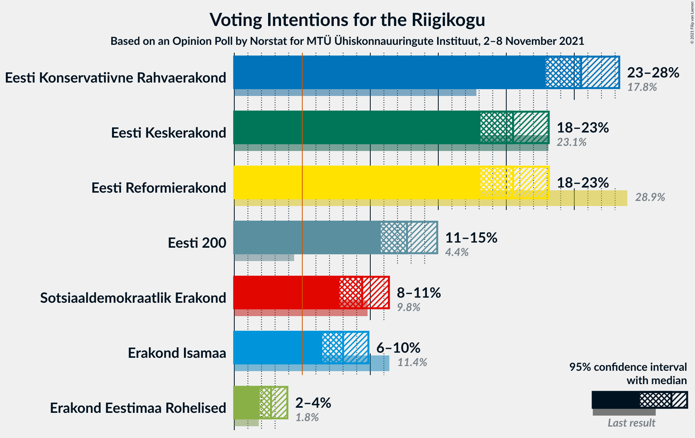

### Confidence Intervals

| Party | Last Result | Poll Result | 80% Confidence Interval | 90% Confidence Interval | 95% Confidence Interval | 99% Confidence Interval |
|:-----:|:-----------:|:-----------:|:-----------------------:|:-----------------------:|:-----------------------:|:-----------------------:|
| Eesti Konservatiivne Rahvaerakond | 17.8% | 25.5% | 23.8–27.3% |23.3–27.8% |22.9–28.3% |22.1–29.2% |
| Eesti Reformierakond | 28.9% | 20.5% | 18.9–22.2% |18.5–22.7% |18.1–23.1% |17.4–24.0% |
| Eesti Keskerakond | 23.1% | 20.5% | 18.9–22.2% |18.5–22.7% |18.1–23.1% |17.4–24.0% |
| Eesti 200 | 4.4% | 12.7% | 11.4–14.1% |11.1–14.6% |10.8–14.9% |10.2–15.6% |
| Sotsiaaldemokraatlik Erakond | 9.8% | 9.4% | 8.3–10.7% |8.0–11.1% |7.7–11.4% |7.2–12.0% |
| Erakond Isamaa | 11.4% | 8.0% | 7.0–9.2% |6.7–9.6% |6.5–9.9% |6.0–10.5% |
| Erakond Eestimaa Rohelised | 1.8% | 2.7% | 2.1–3.5% |2.0–3.7% |1.9–3.9% |1.6–4.3% |

*Note:* The poll result column reflects the actual value used in the calculations. Published results may vary slightly, and in addition be rounded to fewer digits.

## Seats

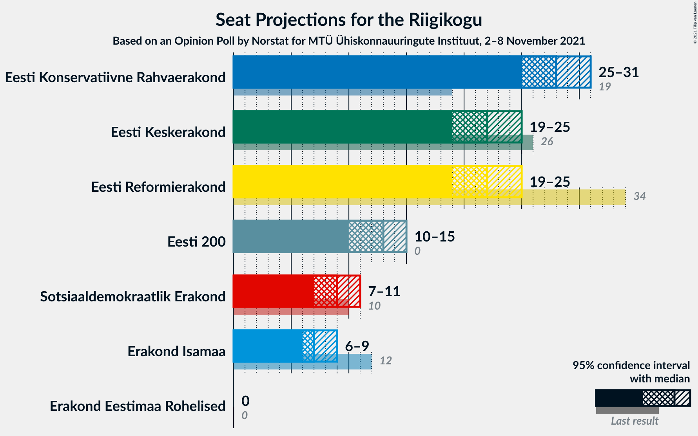

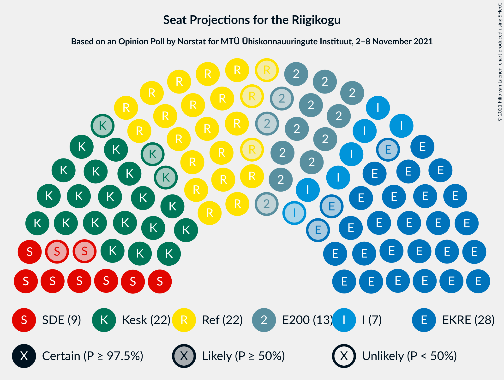

### Confidence Intervals

| Party | Last Result | Median | 80% Confidence Interval | 90% Confidence Interval | 95% Confidence Interval | 99% Confidence Interval |
|:-----:|:-----------:|:------:|:-----------------------:|:-----------------------:|:-----------------------:|:-----------------------:|
| <a href="#eesti-konservatiivne-rahvaerakond">Eesti Konservatiivne Rahvaerakond</a> | 19 | 28 | 26–30 |25–31 |25–31 |24–32 |
| <a href="#eesti-reformierakond">Eesti Reformierakond</a> | 34 | 22 | 20–24 |19–24 |19–25 |18–26 |
| <a href="#eesti-keskerakond">Eesti Keskerakond</a> | 26 | 22 | 20–24 |19–25 |19–25 |18–26 |
| <a href="#eesti-200">Eesti 200</a> | 0 | 13 | 11–14 |11–15 |10–15 |10–16 |
| <a href="#sotsiaaldemokraatlik-erakond">Sotsiaaldemokraatlik Erakond</a> | 10 | 9 | 8–10 |7–11 |7–11 |7–12 |
| <a href="#erakond-isamaa">Erakond Isamaa</a> | 12 | 7 | 6–9 |6–9 |6–9 |5–10 |
| <a href="#erakond-eestimaa-rohelised">Erakond Eestimaa Rohelised</a> | 0 | 0 | 0 |0 |0 |0 |

### Eesti Konservatiivne Rahvaerakond

*For a full overview of the results for this party, see the [Eesti Konservatiivne Rahvaerakond](party-eestikonservatiivnerahvaerakond.html) page.*

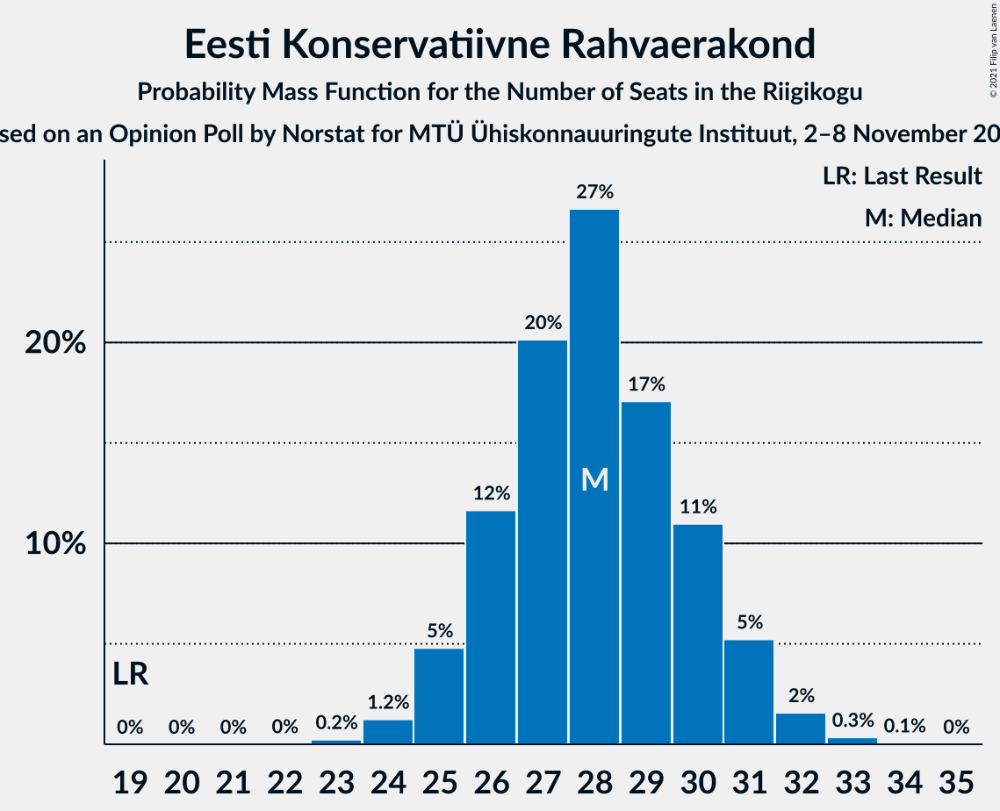

| Number of Seats | Probability | Accumulated | Special Marks |
|:---------------:|:-----------:|:-----------:|:-------------:|
| 19 | 0% | 100% | Last Result |
| 20 | 0% | 100% |  |
| 21 | 0% | 100% |  |
| 22 | 0% | 100% |  |
| 23 | 0.2% | 100% |  |
| 24 | 1.2% | 99.7% |  |
| 25 | 5% | 98% |  |
| 26 | 12% | 94% |  |
| 27 | 20% | 82% |  |
| 28 | 27% | 62% | Median |
| 29 | 17% | 35% |  |
| 30 | 11% | 18% |  |
| 31 | 5% | 7% |  |
| 32 | 2% | 2% |  |
| 33 | 0.3% | 0.4% |  |
| 34 | 0.1% | 0.1% |  |
| 35 | 0% | 0% |  |

### Eesti Reformierakond

*For a full overview of the results for this party, see the [Eesti Reformierakond](party-eestireformierakond.html) page.*

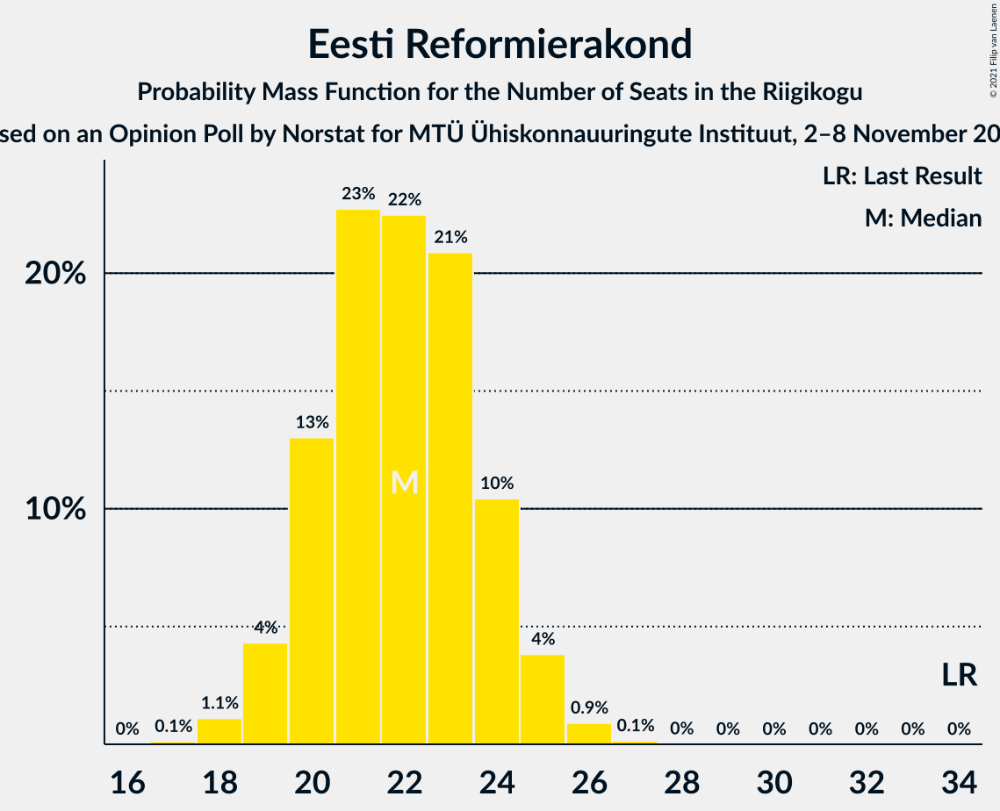

| Number of Seats | Probability | Accumulated | Special Marks |
|:---------------:|:-----------:|:-----------:|:-------------:|
| 17 | 0.1% | 100% |  |
| 18 | 1.1% | 99.9% |  |
| 19 | 4% | 98.8% |  |
| 20 | 13% | 94% |  |
| 21 | 23% | 81% |  |
| 22 | 22% | 59% | Median |
| 23 | 21% | 36% |  |
| 24 | 10% | 15% |  |
| 25 | 4% | 5% |  |
| 26 | 0.9% | 1.1% |  |
| 27 | 0.1% | 0.2% |  |
| 28 | 0% | 0% |  |
| 29 | 0% | 0% |  |
| 30 | 0% | 0% |  |
| 31 | 0% | 0% |  |
| 32 | 0% | 0% |  |
| 33 | 0% | 0% |  |
| 34 | 0% | 0% | Last Result |

### Eesti Keskerakond

*For a full overview of the results for this party, see the [Eesti Keskerakond](party-eestikeskerakond.html) page.*

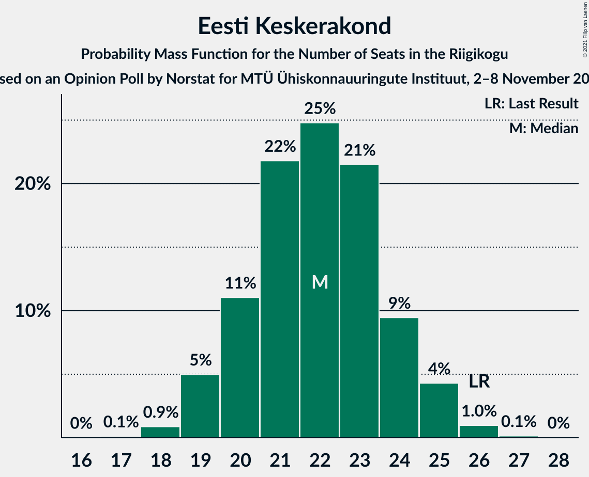

| Number of Seats | Probability | Accumulated | Special Marks |
|:---------------:|:-----------:|:-----------:|:-------------:|
| 17 | 0.1% | 100% |  |
| 18 | 0.9% | 99.9% |  |
| 19 | 5% | 99.0% |  |
| 20 | 11% | 94% |  |
| 21 | 22% | 83% |  |
| 22 | 25% | 61% | Median |
| 23 | 21% | 36% |  |
| 24 | 9% | 15% |  |
| 25 | 4% | 5% |  |
| 26 | 1.0% | 1.1% | Last Result |
| 27 | 0.1% | 0.2% |  |
| 28 | 0% | 0% |  |

### Eesti 200

*For a full overview of the results for this party, see the [Eesti 200](party-eesti200.html) page.*

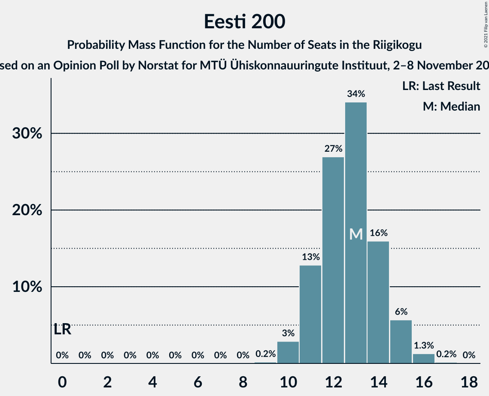

| Number of Seats | Probability | Accumulated | Special Marks |
|:---------------:|:-----------:|:-----------:|:-------------:|
| 0 | 0% | 100% | Last Result |
| 1 | 0% | 100% |  |
| 2 | 0% | 100% |  |
| 3 | 0% | 100% |  |
| 4 | 0% | 100% |  |
| 5 | 0% | 100% |  |
| 6 | 0% | 100% |  |
| 7 | 0% | 100% |  |
| 8 | 0% | 100% |  |
| 9 | 0.2% | 100% |  |
| 10 | 3% | 99.8% |  |
| 11 | 13% | 97% |  |
| 12 | 27% | 84% |  |
| 13 | 34% | 57% | Median |
| 14 | 16% | 23% |  |
| 15 | 6% | 7% |  |
| 16 | 1.3% | 1.4% |  |
| 17 | 0.2% | 0.2% |  |
| 18 | 0% | 0% |  |

### Sotsiaaldemokraatlik Erakond

*For a full overview of the results for this party, see the [Sotsiaaldemokraatlik Erakond](party-sotsiaaldemokraatlikerakond.html) page.*

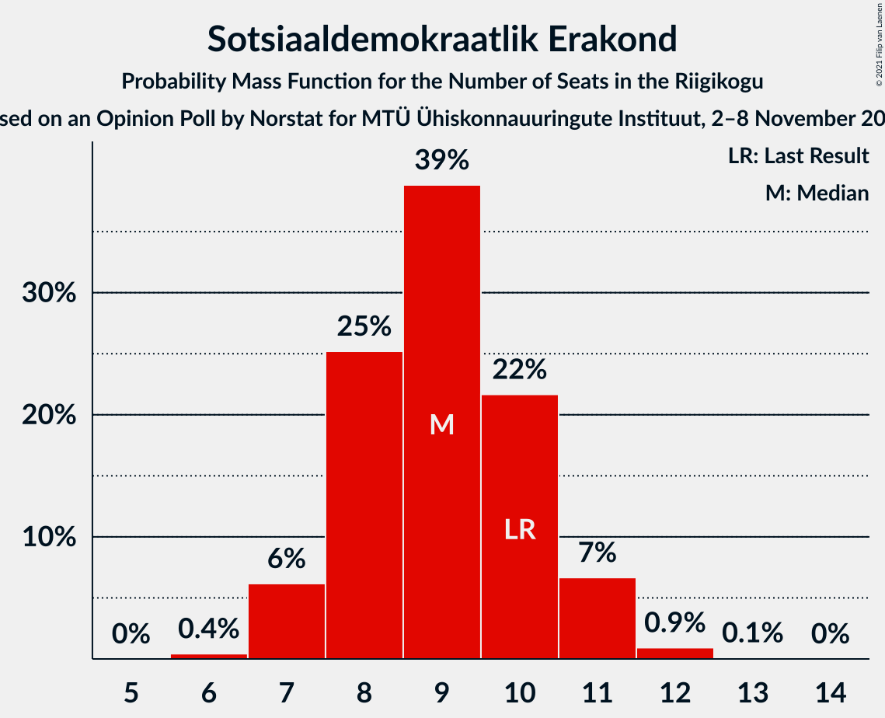

| Number of Seats | Probability | Accumulated | Special Marks |
|:---------------:|:-----------:|:-----------:|:-------------:|
| 6 | 0.4% | 100% |  |
| 7 | 6% | 99.6% |  |
| 8 | 25% | 93% |  |
| 9 | 39% | 68% | Median |
| 10 | 22% | 29% | Last Result |
| 11 | 7% | 8% |  |
| 12 | 0.9% | 1.0% |  |
| 13 | 0.1% | 0.1% |  |
| 14 | 0% | 0% |  |

### Erakond Isamaa

*For a full overview of the results for this party, see the [Erakond Isamaa](party-erakondisamaa.html) page.*

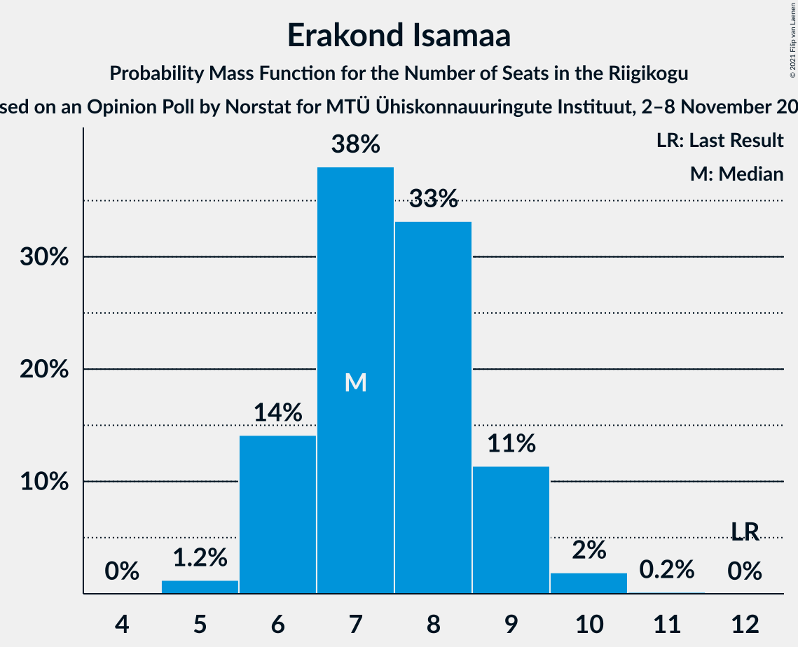

| Number of Seats | Probability | Accumulated | Special Marks |
|:---------------:|:-----------:|:-----------:|:-------------:|
| 5 | 1.2% | 100% |  |
| 6 | 14% | 98.8% |  |
| 7 | 38% | 85% | Median |
| 8 | 33% | 47% |  |
| 9 | 11% | 13% |  |
| 10 | 2% | 2% |  |
| 11 | 0.2% | 0.2% |  |
| 12 | 0% | 0% | Last Result |

### Erakond Eestimaa Rohelised

*For a full overview of the results for this party, see the [Erakond Eestimaa Rohelised](party-erakondeestimaarohelised.html) page.*

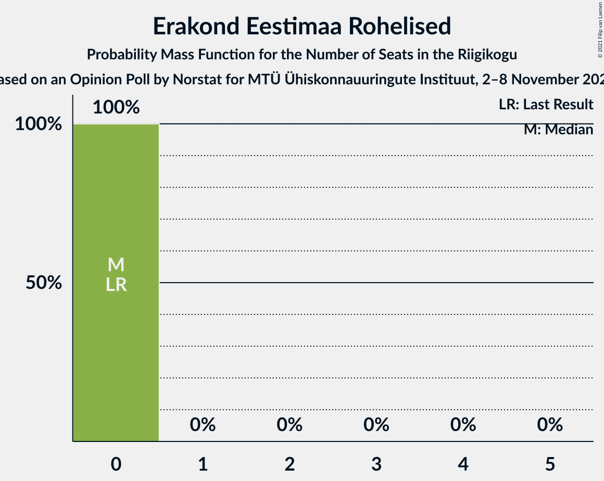

| Number of Seats | Probability | Accumulated | Special Marks |
|:---------------:|:-----------:|:-----------:|:-------------:|
| 0 | 100% | 100% | Last Result, Median |

## Coalitions

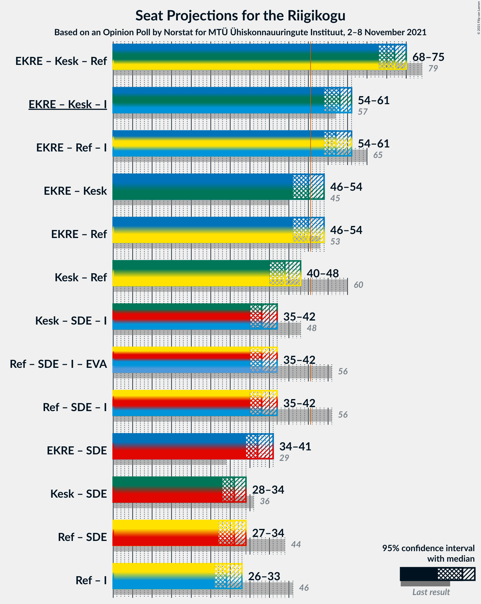

### Confidence Intervals

| Coalition | Last Result | Median | Majority? | 80% Confidence Interval | 90% Confidence Interval | 95% Confidence Interval | 99% Confidence Interval |
|:---------:|:-----------:|:------:|:---------:|:-----------------------:|:-----------------------:|:-----------------------:|:-----------------------:|
| Eesti Konservatiivne Rahvaerakond – Eesti Keskerakond – Eesti Reformierakond | 79 | 72 | 100% | 70–74 | 69–75 | 68–75 | 67–76 |
| Eesti Konservatiivne Rahvaerakond – Eesti Keskerakond – Erakond Isamaa | 57 | 58 | 100% | 55–60 | 54–60 | 54–61 | 53–62 |
| Eesti Konservatiivne Rahvaerakond – Eesti Reformierakond – Erakond Isamaa | 65 | 57 | 100% | 55–60 | 54–60 | 54–61 | 53–62 |
| Eesti Konservatiivne Rahvaerakond – Eesti Keskerakond | 45 | 50 | 38% | 48–52 | 47–53 | 46–54 | 45–55 |
| Eesti Konservatiivne Rahvaerakond – Eesti Reformierakond | 53 | 50 | 37% | 48–52 | 47–53 | 46–54 | 45–55 |
| Eesti Keskerakond – Eesti Reformierakond | 60 | 44 | 0% | 41–46 | 41–47 | 40–48 | 39–49 |
| Eesti Keskerakond – Sotsiaaldemokraatlik Erakond – Erakond Isamaa | 48 | 38 | 0% | 36–41 | 35–41 | 35–42 | 34–43 |
| Eesti Reformierakond – Sotsiaaldemokraatlik Erakond – Erakond Isamaa | 56 | 38 | 0% | 36–41 | 35–41 | 35–42 | 34–43 |
| Eesti Konservatiivne Rahvaerakond – Sotsiaaldemokraatlik Erakond | 29 | 37 | 0% | 35–39 | 34–40 | 34–41 | 32–42 |
| Eesti Keskerakond – Sotsiaaldemokraatlik Erakond | 36 | 31 | 0% | 29–33 | 28–34 | 28–34 | 27–35 |
| Eesti Reformierakond – Sotsiaaldemokraatlik Erakond | 44 | 31 | 0% | 29–33 | 28–34 | 27–34 | 27–35 |
| Eesti Reformierakond – Erakond Isamaa | 46 | 29 | 0% | 27–32 | 27–32 | 26–33 | 25–34 |

### Eesti Konservatiivne Rahvaerakond – Eesti Keskerakond – Eesti Reformierakond

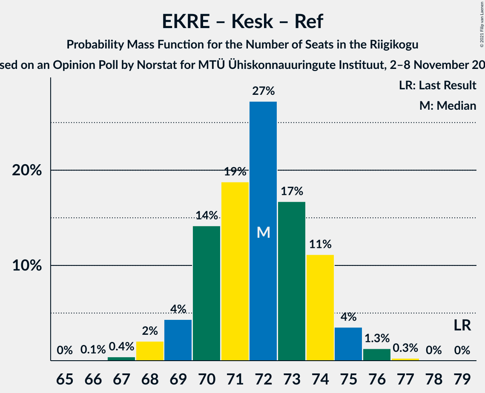

| Number of Seats | Probability | Accumulated | Special Marks |
|:---------------:|:-----------:|:-----------:|:-------------:|
| 66 | 0.1% | 100% |  |
| 67 | 0.4% | 99.9% |  |
| 68 | 2% | 99.5% |  |
| 69 | 4% | 97% |  |
| 70 | 14% | 93% |  |
| 71 | 19% | 79% |  |
| 72 | 27% | 60% | Median |
| 73 | 17% | 33% |  |
| 74 | 11% | 16% |  |
| 75 | 4% | 5% |  |
| 76 | 1.3% | 2% |  |
| 77 | 0.3% | 0.3% |  |
| 78 | 0% | 0% |  |
| 79 | 0% | 0% | Last Result |

### Eesti Konservatiivne Rahvaerakond – Eesti Keskerakond – Erakond Isamaa

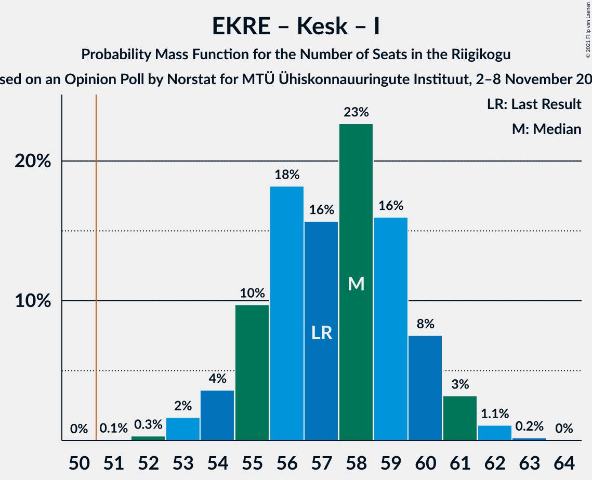

| Number of Seats | Probability | Accumulated | Special Marks |
|:---------------:|:-----------:|:-----------:|:-------------:|
| 51 | 0.1% | 100% | Majority |
| 52 | 0.3% | 99.9% |  |
| 53 | 2% | 99.6% |  |
| 54 | 4% | 98% |  |
| 55 | 10% | 94% |  |
| 56 | 18% | 85% |  |
| 57 | 16% | 66% | Last Result, Median |
| 58 | 23% | 51% |  |
| 59 | 16% | 28% |  |
| 60 | 8% | 12% |  |
| 61 | 3% | 5% |  |
| 62 | 1.1% | 1.3% |  |
| 63 | 0.2% | 0.2% |  |
| 64 | 0% | 0% |  |

### Eesti Konservatiivne Rahvaerakond – Eesti Reformierakond – Erakond Isamaa

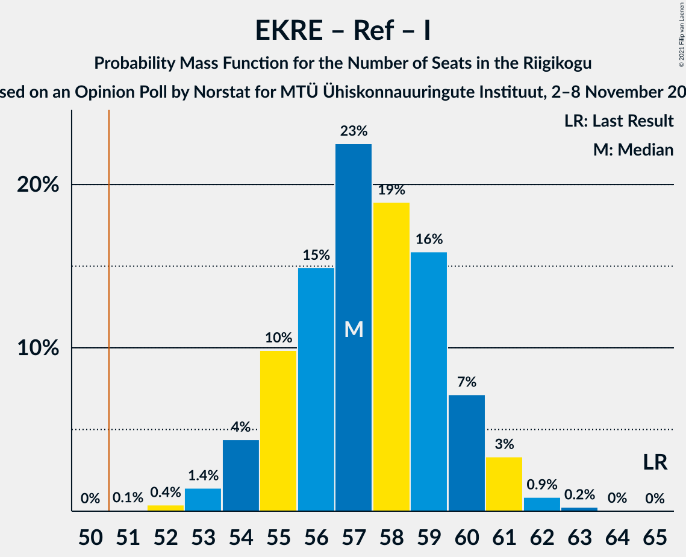

| Number of Seats | Probability | Accumulated | Special Marks |
|:---------------:|:-----------:|:-----------:|:-------------:|
| 51 | 0.1% | 100% | Majority |
| 52 | 0.4% | 99.9% |  |
| 53 | 1.4% | 99.5% |  |
| 54 | 4% | 98% |  |
| 55 | 10% | 94% |  |
| 56 | 15% | 84% |  |
| 57 | 23% | 69% | Median |
| 58 | 19% | 46% |  |
| 59 | 16% | 28% |  |
| 60 | 7% | 12% |  |
| 61 | 3% | 4% |  |
| 62 | 0.9% | 1.2% |  |
| 63 | 0.2% | 0.3% |  |
| 64 | 0% | 0% |  |
| 65 | 0% | 0% | Last Result |

### Eesti Konservatiivne Rahvaerakond – Eesti Keskerakond

| Number of Seats | Probability | Accumulated | Special Marks |
|:---------------:|:-----------:|:-----------:|:-------------:|
| 44 | 0.1% | 100% |  |
| 45 | 0.8% | 99.8% | Last Result |
| 46 | 2% | 99.1% |  |
| 47 | 6% | 97% |  |
| 48 | 13% | 91% |  |
| 49 | 19% | 78% |  |
| 50 | 21% | 60% | Median |
| 51 | 18% | 38% | Majority |
| 52 | 12% | 20% |  |
| 53 | 5% | 8% |  |
| 54 | 2% | 3% |  |
| 55 | 0.6% | 0.7% |  |
| 56 | 0.1% | 0.1% |  |
| 57 | 0% | 0% |  |

### Eesti Konservatiivne Rahvaerakond – Eesti Reformierakond

| Number of Seats | Probability | Accumulated | Special Marks |
|:---------------:|:-----------:|:-----------:|:-------------:|
| 44 | 0.2% | 100% |  |
| 45 | 0.6% | 99.8% |  |
| 46 | 3% | 99.2% |  |
| 47 | 6% | 97% |  |
| 48 | 13% | 90% |  |
| 49 | 20% | 78% |  |
| 50 | 20% | 58% | Median |
| 51 | 17% | 37% | Majority |
| 52 | 11% | 20% |  |
| 53 | 6% | 9% | Last Result |
| 54 | 2% | 3% |  |
| 55 | 0.6% | 0.8% |  |
| 56 | 0.1% | 0.2% |  |
| 57 | 0% | 0% |  |

### Eesti Keskerakond – Eesti Reformierakond

| Number of Seats | Probability | Accumulated | Special Marks |
|:---------------:|:-----------:|:-----------:|:-------------:|
| 38 | 0.1% | 100% |  |
| 39 | 0.7% | 99.8% |  |
| 40 | 3% | 99.1% |  |
| 41 | 7% | 96% |  |
| 42 | 12% | 89% |  |
| 43 | 19% | 77% |  |
| 44 | 21% | 58% | Median |
| 45 | 20% | 37% |  |
| 46 | 10% | 17% |  |
| 47 | 5% | 8% |  |
| 48 | 2% | 3% |  |
| 49 | 0.4% | 0.6% |  |
| 50 | 0.1% | 0.1% |  |
| 51 | 0% | 0% | Majority |
| 52 | 0% | 0% |  |
| 53 | 0% | 0% |  |
| 54 | 0% | 0% |  |
| 55 | 0% | 0% |  |
| 56 | 0% | 0% |  |
| 57 | 0% | 0% |  |
| 58 | 0% | 0% |  |
| 59 | 0% | 0% |  |
| 60 | 0% | 0% | Last Result |

### Eesti Keskerakond – Sotsiaaldemokraatlik Erakond – Erakond Isamaa

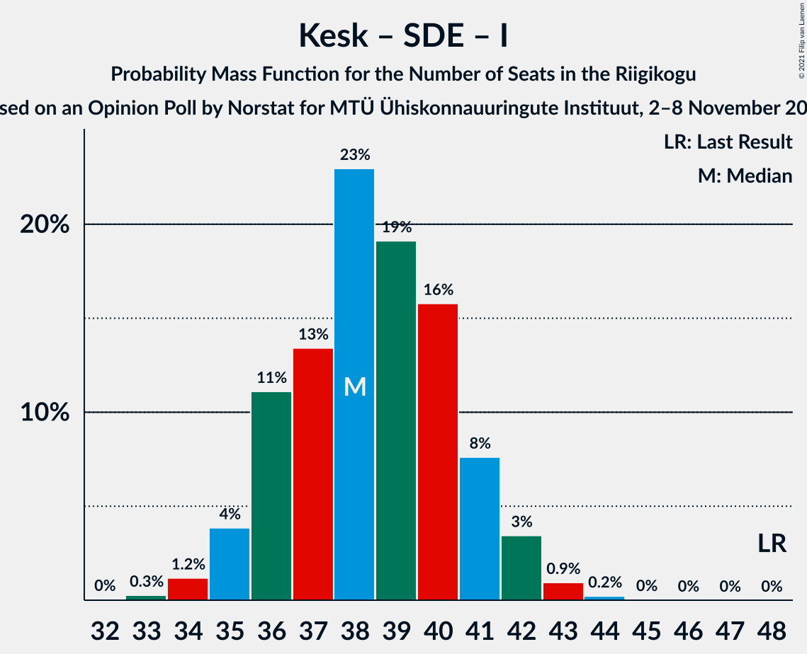

| Number of Seats | Probability | Accumulated | Special Marks |
|:---------------:|:-----------:|:-----------:|:-------------:|
| 33 | 0.3% | 100% |  |
| 34 | 1.2% | 99.7% |  |
| 35 | 4% | 98.5% |  |
| 36 | 11% | 95% |  |
| 37 | 13% | 84% |  |
| 38 | 23% | 70% | Median |
| 39 | 19% | 47% |  |
| 40 | 16% | 28% |  |
| 41 | 8% | 12% |  |
| 42 | 3% | 5% |  |
| 43 | 0.9% | 1.2% |  |
| 44 | 0.2% | 0.3% |  |
| 45 | 0% | 0% |  |
| 46 | 0% | 0% |  |
| 47 | 0% | 0% |  |
| 48 | 0% | 0% | Last Result |

### Eesti Reformierakond – Sotsiaaldemokraatlik Erakond – Erakond Isamaa

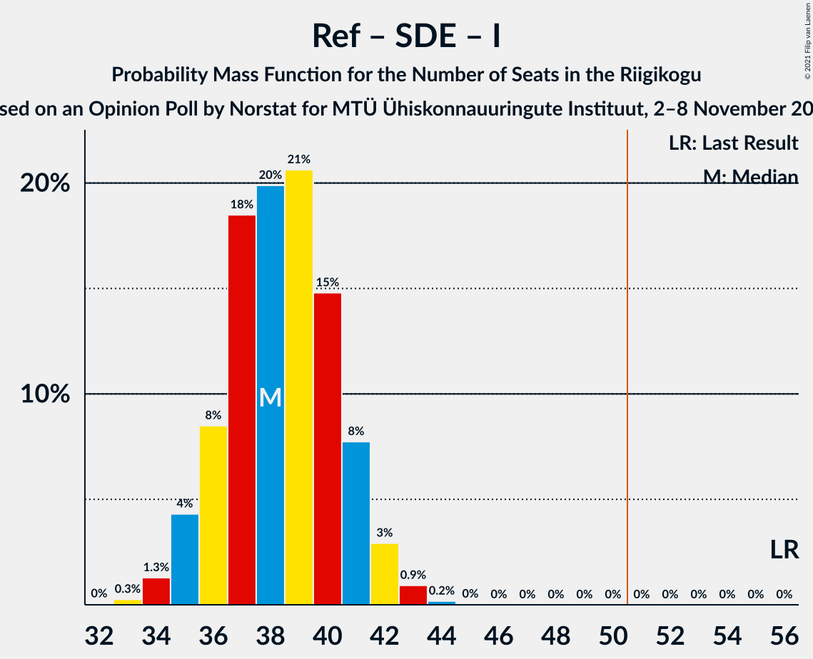

| Number of Seats | Probability | Accumulated | Special Marks |
|:---------------:|:-----------:|:-----------:|:-------------:|
| 32 | 0% | 100% |  |
| 33 | 0.3% | 99.9% |  |
| 34 | 1.3% | 99.7% |  |
| 35 | 4% | 98% |  |
| 36 | 8% | 94% |  |
| 37 | 18% | 86% |  |
| 38 | 20% | 67% | Median |
| 39 | 21% | 47% |  |
| 40 | 15% | 27% |  |
| 41 | 8% | 12% |  |
| 42 | 3% | 4% |  |
| 43 | 0.9% | 1.1% |  |
| 44 | 0.2% | 0.2% |  |
| 45 | 0% | 0% |  |
| 46 | 0% | 0% |  |
| 47 | 0% | 0% |  |
| 48 | 0% | 0% |  |
| 49 | 0% | 0% |  |
| 50 | 0% | 0% |  |
| 51 | 0% | 0% | Majority |
| 52 | 0% | 0% |  |
| 53 | 0% | 0% |  |
| 54 | 0% | 0% |  |
| 55 | 0% | 0% |  |
| 56 | 0% | 0% | Last Result |

### Eesti Konservatiivne Rahvaerakond – Sotsiaaldemokraatlik Erakond

| Number of Seats | Probability | Accumulated | Special Marks |
|:---------------:|:-----------:|:-----------:|:-------------:|
| 29 | 0% | 100% | Last Result |
| 30 | 0% | 100% |  |
| 31 | 0.1% | 100% |  |
| 32 | 0.4% | 99.9% |  |
| 33 | 2% | 99.5% |  |
| 34 | 6% | 98% |  |
| 35 | 10% | 92% |  |
| 36 | 22% | 82% |  |
| 37 | 23% | 60% | Median |
| 38 | 18% | 37% |  |
| 39 | 11% | 19% |  |
| 40 | 6% | 8% |  |
| 41 | 2% | 3% |  |
| 42 | 0.4% | 0.6% |  |
| 43 | 0.1% | 0.2% |  |
| 44 | 0% | 0% |  |

### Eesti Keskerakond – Sotsiaaldemokraatlik Erakond

| Number of Seats | Probability | Accumulated | Special Marks |
|:---------------:|:-----------:|:-----------:|:-------------:|
| 25 | 0% | 100% |  |
| 26 | 0.4% | 99.9% |  |
| 27 | 2% | 99.5% |  |
| 28 | 5% | 98% |  |
| 29 | 15% | 93% |  |
| 30 | 18% | 78% |  |
| 31 | 24% | 60% | Median |
| 32 | 18% | 37% |  |
| 33 | 12% | 19% |  |
| 34 | 5% | 7% |  |
| 35 | 2% | 2% |  |
| 36 | 0.4% | 0.4% | Last Result |
| 37 | 0.1% | 0.1% |  |
| 38 | 0% | 0% |  |

### Eesti Reformierakond – Sotsiaaldemokraatlik Erakond

| Number of Seats | Probability | Accumulated | Special Marks |
|:---------------:|:-----------:|:-----------:|:-------------:|
| 25 | 0.1% | 100% |  |
| 26 | 0.3% | 99.9% |  |
| 27 | 2% | 99.6% |  |
| 28 | 6% | 97% |  |
| 29 | 12% | 92% |  |
| 30 | 24% | 80% |  |
| 31 | 17% | 56% | Median |
| 32 | 22% | 39% |  |
| 33 | 10% | 17% |  |
| 34 | 5% | 7% |  |
| 35 | 1.3% | 2% |  |
| 36 | 0.3% | 0.4% |  |
| 37 | 0.1% | 0.1% |  |
| 38 | 0% | 0% |  |
| 39 | 0% | 0% |  |
| 40 | 0% | 0% |  |
| 41 | 0% | 0% |  |
| 42 | 0% | 0% |  |
| 43 | 0% | 0% |  |
| 44 | 0% | 0% | Last Result |

### Eesti Reformierakond – Erakond Isamaa

| Number of Seats | Probability | Accumulated | Special Marks |
|:---------------:|:-----------:|:-----------:|:-------------:|
| 24 | 0.1% | 100% |  |
| 25 | 1.0% | 99.8% |  |
| 26 | 3% | 98.9% |  |
| 27 | 10% | 96% |  |
| 28 | 16% | 86% |  |
| 29 | 22% | 70% | Median |
| 30 | 25% | 48% |  |
| 31 | 13% | 23% |  |
| 32 | 7% | 10% |  |
| 33 | 3% | 4% |  |
| 34 | 0.6% | 0.8% |  |
| 35 | 0.1% | 0.1% |  |
| 36 | 0% | 0% |  |
| 37 | 0% | 0% |  |
| 38 | 0% | 0% |  |
| 39 | 0% | 0% |  |
| 40 | 0% | 0% |  |
| 41 | 0% | 0% |  |
| 42 | 0% | 0% |  |
| 43 | 0% | 0% |  |
| 44 | 0% | 0% |  |
| 45 | 0% | 0% |  |
| 46 | 0% | 0% | Last Result |

## Technical Information

### Opinion Poll

+ **Polling firm:** Norstat
+ **Commissioner(s):** MTÜ Ühiskonnauuringute Instituut
+ **Fieldwork period:** 2–8 November 2021

### Calculations

+ **Sample size:** 1000
+ **Simulations done:** 1,048,576
+ **Error estimate:** 0.52%

