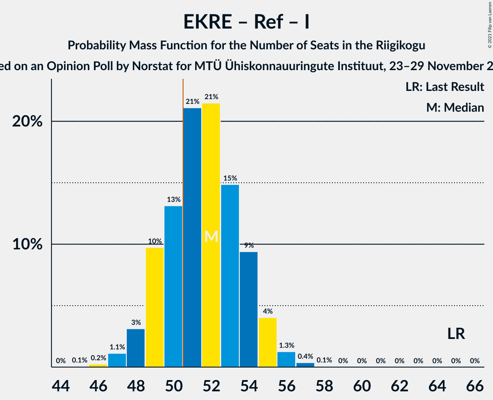

# Opinion Poll by Norstat for MTÜ Ühiskonnauuringute Instituut, 23–29 November 2021

<a href="#voting-intentions">Voting Intentions</a> | <a href="#seats">Seats</a> | <a href="#coalitions">Coalitions</a> | <a href="#technical-information">Technical Information</a>

## Voting Intentions

### Confidence Intervals

| Party | Last Result | Poll Result | 80% Confidence Interval | 90% Confidence Interval | 95% Confidence Interval | 99% Confidence Interval |
|:-----:|:-----------:|:-----------:|:-----------------------:|:-----------------------:|:-----------------------:|:-----------------------:|
| Eesti Keskerakond | 23.1% | 22.3% | 20.7–24.1% |20.2–24.6% |19.8–25.0% |19.1–25.8% |
| Eesti Konservatiivne Rahvaerakond | 17.8% | 21.3% | 19.7–23.0% |19.3–23.5% |18.9–23.9% |18.1–24.8% |
| Eesti Reformierakond | 28.9% | 19.8% | 18.3–21.5% |17.8–22.0% |17.4–22.4% |16.7–23.2% |
| Eesti 200 | 4.4% | 16.0% | 14.6–17.6% |14.2–18.0% |13.9–18.4% |13.2–19.2% |
| Sotsiaaldemokraatlik Erakond | 9.8% | 9.3% | 8.2–10.6% |7.9–10.9% |7.7–11.3% |7.2–11.9% |
| Erakond Isamaa | 11.4% | 8.2% | 7.2–9.4% |6.9–9.8% |6.6–10.1% |6.2–10.7% |
| Erakond Eestimaa Rohelised | 1.8% | 1.3% | 0.9–1.9% |0.8–2.1% |0.8–2.2% |0.6–2.5% |

*Note:* The poll result column reflects the actual value used in the calculations. Published results may vary slightly, and in addition be rounded to fewer digits.

## Seats

### Confidence Intervals

| Party | Last Result | Median | 80% Confidence Interval | 90% Confidence Interval | 95% Confidence Interval | 99% Confidence Interval |
|:-----:|:-----------:|:------:|:-----------------------:|:-----------------------:|:-----------------------:|:-----------------------:|
| <a href="#eesti-keskerakond">Eesti Keskerakond</a> | 26 | 24 | 22–26 |21–27 |21–27 |20–28 |
| <a href="#eesti-konservatiivne-rahvaerakond">Eesti Konservatiivne Rahvaerakond</a> | 19 | 23 | 21–25 |20–25 |20–26 |19–27 |
| <a href="#eesti-reformierakond">Eesti Reformierakond</a> | 34 | 21 | 19–23 |19–24 |18–24 |17–25 |
| <a href="#eesti-200">Eesti 200</a> | 0 | 16 | 15–18 |14–19 |14–19 |13–20 |
| <a href="#sotsiaaldemokraatlik-erakond">Sotsiaaldemokraatlik Erakond</a> | 10 | 9 | 8–10 |7–11 |7–11 |6–12 |
| <a href="#erakond-isamaa">Erakond Isamaa</a> | 12 | 8 | 6–9 |6–9 |6–10 |5–10 |
| <a href="#erakond-eestimaa-rohelised">Erakond Eestimaa Rohelised</a> | 0 | 0 | 0 |0 |0 |0 |

### Eesti Keskerakond

*For a full overview of the results for this party, see the [Eesti Keskerakond](party-eestikeskerakond.html) page.*

| Number of Seats | Probability | Accumulated | Special Marks |
|:---------------:|:-----------:|:-----------:|:-------------:|
| 19 | 0.1% | 100% |  |
| 20 | 0.8% | 99.9% |  |
| 21 | 5% | 99.1% |  |
| 22 | 11% | 95% |  |
| 23 | 20% | 84% |  |
| 24 | 28% | 64% | Median |
| 25 | 18% | 36% |  |
| 26 | 11% | 18% | Last Result |
| 27 | 5% | 7% |  |
| 28 | 1.0% | 1.3% |  |
| 29 | 0.3% | 0.3% |  |
| 30 | 0.1% | 0.1% |  |
| 31 | 0% | 0% |  |

### Eesti Konservatiivne Rahvaerakond

*For a full overview of the results for this party, see the [Eesti Konservatiivne Rahvaerakond](party-eestikonservatiivnerahvaerakond.html) page.*

| Number of Seats | Probability | Accumulated | Special Marks |
|:---------------:|:-----------:|:-----------:|:-------------:|
| 18 | 0.1% | 100% |  |
| 19 | 1.1% | 99.8% | Last Result |
| 20 | 5% | 98.7% |  |
| 21 | 14% | 94% |  |
| 22 | 21% | 80% |  |
| 23 | 25% | 59% | Median |
| 24 | 20% | 35% |  |
| 25 | 10% | 15% |  |
| 26 | 4% | 5% |  |
| 27 | 0.9% | 1.1% |  |
| 28 | 0.2% | 0.2% |  |
| 29 | 0% | 0% |  |

### Eesti Reformierakond

*For a full overview of the results for this party, see the [Eesti Reformierakond](party-eestireformierakond.html) page.*

| Number of Seats | Probability | Accumulated | Special Marks |
|:---------------:|:-----------:|:-----------:|:-------------:|
| 16 | 0.1% | 100% |  |
| 17 | 0.6% | 99.9% |  |
| 18 | 3% | 99.3% |  |
| 19 | 11% | 96% |  |
| 20 | 20% | 85% |  |
| 21 | 28% | 64% | Median |
| 22 | 20% | 36% |  |
| 23 | 11% | 17% |  |
| 24 | 4% | 5% |  |
| 25 | 1.0% | 1.2% |  |
| 26 | 0.2% | 0.2% |  |
| 27 | 0% | 0% |  |
| 28 | 0% | 0% |  |
| 29 | 0% | 0% |  |
| 30 | 0% | 0% |  |
| 31 | 0% | 0% |  |
| 32 | 0% | 0% |  |
| 33 | 0% | 0% |  |
| 34 | 0% | 0% | Last Result |

### Eesti 200

*For a full overview of the results for this party, see the [Eesti 200](party-eesti200.html) page.*

| Number of Seats | Probability | Accumulated | Special Marks |
|:---------------:|:-----------:|:-----------:|:-------------:|
| 0 | 0% | 100% | Last Result |
| 1 | 0% | 100% |  |
| 2 | 0% | 100% |  |
| 3 | 0% | 100% |  |
| 4 | 0% | 100% |  |
| 5 | 0% | 100% |  |
| 6 | 0% | 100% |  |
| 7 | 0% | 100% |  |
| 8 | 0% | 100% |  |
| 9 | 0% | 100% |  |
| 10 | 0% | 100% |  |
| 11 | 0% | 100% |  |
| 12 | 0.1% | 100% |  |
| 13 | 0.9% | 99.9% |  |
| 14 | 5% | 99.0% |  |
| 15 | 17% | 94% |  |
| 16 | 27% | 77% | Median |
| 17 | 27% | 50% |  |
| 18 | 14% | 23% |  |
| 19 | 7% | 8% |  |
| 20 | 1.5% | 2% |  |
| 21 | 0.3% | 0.3% |  |
| 22 | 0% | 0% |  |

### Sotsiaaldemokraatlik Erakond

*For a full overview of the results for this party, see the [Sotsiaaldemokraatlik Erakond](party-sotsiaaldemokraatlikerakond.html) page.*

| Number of Seats | Probability | Accumulated | Special Marks |
|:---------------:|:-----------:|:-----------:|:-------------:|
| 6 | 0.7% | 100% |  |
| 7 | 8% | 99.3% |  |
| 8 | 27% | 92% |  |
| 9 | 39% | 64% | Median |
| 10 | 19% | 25% | Last Result |
| 11 | 5% | 6% |  |
| 12 | 0.8% | 0.8% |  |
| 13 | 0.1% | 0.1% |  |
| 14 | 0% | 0% |  |

### Erakond Isamaa

*For a full overview of the results for this party, see the [Erakond Isamaa](party-erakondisamaa.html) page.*

| Number of Seats | Probability | Accumulated | Special Marks |
|:---------------:|:-----------:|:-----------:|:-------------:|
| 5 | 0.7% | 100% |  |
| 6 | 10% | 99.3% |  |
| 7 | 35% | 89% |  |
| 8 | 36% | 54% | Median |
| 9 | 15% | 19% |  |
| 10 | 3% | 4% |  |
| 11 | 0.3% | 0.3% |  |
| 12 | 0% | 0% | Last Result |

### Erakond Eestimaa Rohelised

*For a full overview of the results for this party, see the [Erakond Eestimaa Rohelised](party-erakondeestimaarohelised.html) page.*

| Number of Seats | Probability | Accumulated | Special Marks |
|:---------------:|:-----------:|:-----------:|:-------------:|
| 0 | 100% | 100% | Last Result, Median |

## Coalitions

### Confidence Intervals

| Coalition | Last Result | Median | Majority? | 80% Confidence Interval | 90% Confidence Interval | 95% Confidence Interval | 99% Confidence Interval |
|:---------:|:-----------:|:------:|:---------:|:-----------------------:|:-----------------------:|:-----------------------:|:-----------------------:|
| Eesti Keskerakond – Eesti Konservatiivne Rahvaerakond – Eesti Reformierakond | 79 | 68 | 100% | 66–70 | 65–71 | 64–71 | 63–72 |
| Eesti Keskerakond – Eesti Konservatiivne Rahvaerakond – Erakond Isamaa | 57 | 55 | 98.5% | 52–57 | 52–58 | 51–58 | 50–59 |
| Eesti Konservatiivne Rahvaerakond – Eesti Reformierakond – Erakond Isamaa | 65 | 52 | 73% | 49–54 | 49–55 | 48–55 | 47–56 |
| Eesti Keskerakond – Eesti Konservatiivne Rahvaerakond | 45 | 47 | 3% | 45–49 | 44–50 | 43–51 | 42–52 |
| Eesti Keskerakond – Eesti Reformierakond | 60 | 45 | 0.2% | 43–47 | 42–48 | 41–49 | 40–50 |
| Eesti Konservatiivne Rahvaerakond – Eesti Reformierakond | 53 | 44 | 0% | 42–46 | 41–47 | 40–48 | 39–49 |
| Eesti Keskerakond – Sotsiaaldemokraatlik Erakond – Erakond Isamaa | 48 | 40 | 0% | 38–43 | 38–44 | 37–44 | 36–45 |
| Eesti Reformierakond – Sotsiaaldemokraatlik Erakond – Erakond Isamaa | 56 | 38 | 0% | 35–40 | 35–40 | 34–41 | 33–42 |
| Eesti Keskerakond – Sotsiaaldemokraatlik Erakond | 36 | 33 | 0% | 31–35 | 30–36 | 30–36 | 29–37 |
| Eesti Konservatiivne Rahvaerakond – Sotsiaaldemokraatlik Erakond | 29 | 32 | 0% | 30–34 | 29–35 | 28–35 | 27–36 |
| Eesti Reformierakond – Sotsiaaldemokraatlik Erakond | 44 | 30 | 0% | 28–32 | 27–33 | 27–33 | 26–34 |
| Eesti Reformierakond – Erakond Isamaa | 46 | 29 | 0% | 27–31 | 26–32 | 25–32 | 24–33 |

### Eesti Keskerakond – Eesti Konservatiivne Rahvaerakond – Eesti Reformierakond

| Number of Seats | Probability | Accumulated | Special Marks |
|:---------------:|:-----------:|:-----------:|:-------------:|
| 62 | 0.1% | 100% |  |
| 63 | 0.6% | 99.9% |  |
| 64 | 2% | 99.3% |  |
| 65 | 6% | 97% |  |
| 66 | 12% | 92% |  |
| 67 | 18% | 79% |  |
| 68 | 24% | 61% | Median |
| 69 | 18% | 37% |  |
| 70 | 12% | 19% |  |
| 71 | 5% | 7% |  |
| 72 | 1.3% | 2% |  |
| 73 | 0.4% | 0.4% |  |
| 74 | 0% | 0.1% |  |
| 75 | 0% | 0% |  |
| 76 | 0% | 0% |  |
| 77 | 0% | 0% |  |
| 78 | 0% | 0% |  |
| 79 | 0% | 0% | Last Result |

### Eesti Keskerakond – Eesti Konservatiivne Rahvaerakond – Erakond Isamaa

| Number of Seats | Probability | Accumulated | Special Marks |
|:---------------:|:-----------:|:-----------:|:-------------:|
| 49 | 0.3% | 100% |  |
| 50 | 1.2% | 99.7% |  |
| 51 | 3% | 98.5% | Majority |
| 52 | 10% | 96% |  |
| 53 | 15% | 86% |  |
| 54 | 20% | 72% |  |
| 55 | 21% | 52% | Median |
| 56 | 16% | 30% |  |
| 57 | 9% | 15% | Last Result |
| 58 | 4% | 6% |  |
| 59 | 1.4% | 2% |  |
| 60 | 0.3% | 0.3% |  |
| 61 | 0.1% | 0.1% |  |
| 62 | 0% | 0% |  |

### Eesti Konservatiivne Rahvaerakond – Eesti Reformierakond – Erakond Isamaa

| Number of Seats | Probability | Accumulated | Special Marks |
|:---------------:|:-----------:|:-----------:|:-------------:|
| 45 | 0.1% | 100% |  |
| 46 | 0.2% | 99.9% |  |
| 47 | 1.1% | 99.7% |  |
| 48 | 3% | 98.6% |  |
| 49 | 10% | 95% |  |
| 50 | 13% | 86% |  |
| 51 | 21% | 73% | Majority |
| 52 | 21% | 51% | Median |
| 53 | 15% | 30% |  |
| 54 | 9% | 15% |  |
| 55 | 4% | 6% |  |
| 56 | 1.3% | 2% |  |
| 57 | 0.4% | 0.4% |  |
| 58 | 0.1% | 0.1% |  |
| 59 | 0% | 0% |  |
| 60 | 0% | 0% |  |
| 61 | 0% | 0% |  |
| 62 | 0% | 0% |  |
| 63 | 0% | 0% |  |
| 64 | 0% | 0% |  |
| 65 | 0% | 0% | Last Result |

### Eesti Keskerakond – Eesti Konservatiivne Rahvaerakond

| Number of Seats | Probability | Accumulated | Special Marks |
|:---------------:|:-----------:|:-----------:|:-------------:|
| 41 | 0.1% | 100% |  |
| 42 | 0.6% | 99.8% |  |
| 43 | 3% | 99.3% |  |
| 44 | 6% | 97% |  |
| 45 | 13% | 91% | Last Result |
| 46 | 18% | 78% |  |
| 47 | 26% | 60% | Median |
| 48 | 12% | 34% |  |
| 49 | 14% | 21% |  |
| 50 | 4% | 7% |  |
| 51 | 2% | 3% | Majority |
| 52 | 0.5% | 0.6% |  |
| 53 | 0.1% | 0.1% |  |
| 54 | 0% | 0% |  |

### Eesti Keskerakond – Eesti Reformierakond

| Number of Seats | Probability | Accumulated | Special Marks |
|:---------------:|:-----------:|:-----------:|:-------------:|
| 39 | 0.1% | 100% |  |
| 40 | 0.6% | 99.9% |  |
| 41 | 2% | 99.3% |  |
| 42 | 6% | 97% |  |
| 43 | 13% | 92% |  |
| 44 | 15% | 79% |  |
| 45 | 27% | 64% | Median |
| 46 | 13% | 37% |  |
| 47 | 16% | 25% |  |
| 48 | 5% | 8% |  |
| 49 | 3% | 4% |  |
| 50 | 0.6% | 0.8% |  |
| 51 | 0.2% | 0.2% | Majority |
| 52 | 0% | 0% |  |
| 53 | 0% | 0% |  |
| 54 | 0% | 0% |  |
| 55 | 0% | 0% |  |
| 56 | 0% | 0% |  |
| 57 | 0% | 0% |  |
| 58 | 0% | 0% |  |
| 59 | 0% | 0% |  |
| 60 | 0% | 0% | Last Result |

### Eesti Konservatiivne Rahvaerakond – Eesti Reformierakond

| Number of Seats | Probability | Accumulated | Special Marks |
|:---------------:|:-----------:|:-----------:|:-------------:|
| 38 | 0.2% | 100% |  |
| 39 | 0.6% | 99.8% |  |
| 40 | 3% | 99.3% |  |
| 41 | 6% | 97% |  |
| 42 | 16% | 91% |  |
| 43 | 14% | 75% |  |
| 44 | 26% | 62% | Median |
| 45 | 15% | 36% |  |
| 46 | 13% | 21% |  |
| 47 | 5% | 7% |  |
| 48 | 2% | 3% |  |
| 49 | 0.4% | 0.5% |  |
| 50 | 0.1% | 0.1% |  |
| 51 | 0% | 0% | Majority |
| 52 | 0% | 0% |  |
| 53 | 0% | 0% | Last Result |

### Eesti Keskerakond – Sotsiaaldemokraatlik Erakond – Erakond Isamaa

| Number of Seats | Probability | Accumulated | Special Marks |
|:---------------:|:-----------:|:-----------:|:-------------:|
| 35 | 0.2% | 100% |  |
| 36 | 0.9% | 99.8% |  |
| 37 | 4% | 98.9% |  |
| 38 | 8% | 95% |  |
| 39 | 15% | 88% |  |
| 40 | 23% | 73% |  |
| 41 | 19% | 50% | Median |
| 42 | 17% | 31% |  |
| 43 | 9% | 14% |  |
| 44 | 4% | 5% |  |
| 45 | 1.2% | 2% |  |
| 46 | 0.3% | 0.4% |  |
| 47 | 0.1% | 0.1% |  |
| 48 | 0% | 0% | Last Result |

### Eesti Reformierakond – Sotsiaaldemokraatlik Erakond – Erakond Isamaa

| Number of Seats | Probability | Accumulated | Special Marks |
|:---------------:|:-----------:|:-----------:|:-------------:|
| 32 | 0.2% | 100% |  |
| 33 | 0.9% | 99.7% |  |
| 34 | 3% | 98.9% |  |
| 35 | 9% | 96% |  |
| 36 | 14% | 87% |  |
| 37 | 22% | 74% |  |
| 38 | 20% | 51% | Median |
| 39 | 18% | 31% |  |
| 40 | 8% | 13% |  |
| 41 | 4% | 5% |  |
| 42 | 1.1% | 1.4% |  |
| 43 | 0.3% | 0.3% |  |
| 44 | 0.1% | 0.1% |  |
| 45 | 0% | 0% |  |
| 46 | 0% | 0% |  |
| 47 | 0% | 0% |  |
| 48 | 0% | 0% |  |
| 49 | 0% | 0% |  |
| 50 | 0% | 0% |  |
| 51 | 0% | 0% | Majority |
| 52 | 0% | 0% |  |
| 53 | 0% | 0% |  |
| 54 | 0% | 0% |  |
| 55 | 0% | 0% |  |
| 56 | 0% | 0% | Last Result |

### Eesti Keskerakond – Sotsiaaldemokraatlik Erakond

| Number of Seats | Probability | Accumulated | Special Marks |
|:---------------:|:-----------:|:-----------:|:-------------:|
| 27 | 0.1% | 100% |  |
| 28 | 0.4% | 99.9% |  |
| 29 | 2% | 99.5% |  |
| 30 | 6% | 98% |  |
| 31 | 12% | 92% |  |
| 32 | 20% | 79% |  |
| 33 | 23% | 59% | Median |
| 34 | 18% | 36% |  |
| 35 | 11% | 18% |  |
| 36 | 5% | 7% | Last Result |
| 37 | 2% | 2% |  |
| 38 | 0.4% | 0.5% |  |
| 39 | 0.1% | 0.1% |  |
| 40 | 0% | 0% |  |

### Eesti Konservatiivne Rahvaerakond – Sotsiaaldemokraatlik Erakond

| Number of Seats | Probability | Accumulated | Special Marks |
|:---------------:|:-----------:|:-----------:|:-------------:|
| 26 | 0.1% | 100% |  |
| 27 | 0.5% | 99.9% |  |
| 28 | 3% | 99.4% |  |
| 29 | 7% | 97% | Last Result |
| 30 | 14% | 90% |  |
| 31 | 20% | 76% |  |
| 32 | 22% | 56% | Median |
| 33 | 19% | 34% |  |
| 34 | 9% | 15% |  |
| 35 | 5% | 6% |  |
| 36 | 1.3% | 2% |  |
| 37 | 0.3% | 0.3% |  |
| 38 | 0.1% | 0.1% |  |
| 39 | 0% | 0% |  |

### Eesti Reformierakond – Sotsiaaldemokraatlik Erakond

| Number of Seats | Probability | Accumulated | Special Marks |
|:---------------:|:-----------:|:-----------:|:-------------:|
| 24 | 0.1% | 100% |  |
| 25 | 0.4% | 99.9% |  |
| 26 | 2% | 99.6% |  |
| 27 | 5% | 98% |  |
| 28 | 13% | 93% |  |
| 29 | 21% | 80% |  |
| 30 | 22% | 59% | Median |
| 31 | 19% | 37% |  |
| 32 | 12% | 18% |  |
| 33 | 4% | 5% |  |
| 34 | 1.4% | 2% |  |
| 35 | 0.3% | 0.4% |  |
| 36 | 0.1% | 0.1% |  |
| 37 | 0% | 0% |  |
| 38 | 0% | 0% |  |
| 39 | 0% | 0% |  |
| 40 | 0% | 0% |  |
| 41 | 0% | 0% |  |
| 42 | 0% | 0% |  |
| 43 | 0% | 0% |  |
| 44 | 0% | 0% | Last Result |

### Eesti Reformierakond – Erakond Isamaa

| Number of Seats | Probability | Accumulated | Special Marks |
|:---------------:|:-----------:|:-----------:|:-------------:|
| 23 | 0.1% | 100% |  |
| 24 | 0.4% | 99.9% |  |
| 25 | 2% | 99.5% |  |
| 26 | 7% | 97% |  |
| 27 | 13% | 90% |  |
| 28 | 23% | 77% |  |
| 29 | 22% | 54% | Median |
| 30 | 18% | 32% |  |
| 31 | 8% | 13% |  |
| 32 | 4% | 5% |  |
| 33 | 0.9% | 1.2% |  |
| 34 | 0.2% | 0.3% |  |
| 35 | 0% | 0% |  |
| 36 | 0% | 0% |  |
| 37 | 0% | 0% |  |
| 38 | 0% | 0% |  |
| 39 | 0% | 0% |  |
| 40 | 0% | 0% |  |
| 41 | 0% | 0% |  |
| 42 | 0% | 0% |  |
| 43 | 0% | 0% |  |
| 44 | 0% | 0% |  |
| 45 | 0% | 0% |  |
| 46 | 0% | 0% | Last Result |

## Technical Information

### Opinion Poll

+ **Polling firm:** Norstat
+ **Commissioner(s):** MTÜ Ühiskonnauuringute Instituut
+ **Fieldwork period:** 23–29 November 2021

### Calculations

+ **Sample size:** 1000
+ **Simulations done:** 1,048,576
+ **Error estimate:** 0.82%

