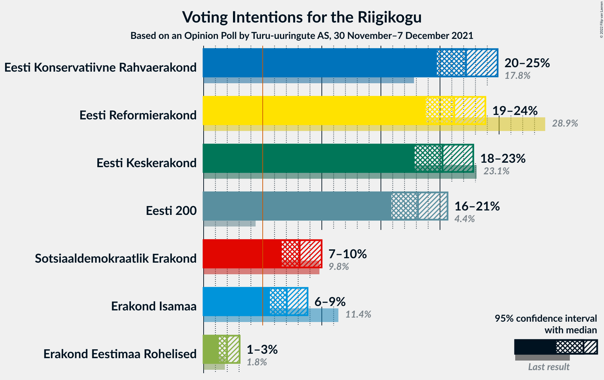

# Opinion Poll by Turu-uuringute AS, 30 November–7 December 2021

<a href="#voting-intentions">Voting Intentions</a> | <a href="#seats">Seats</a> | <a href="#coalitions">Coalitions</a> | <a href="#technical-information">Technical Information</a>

## Voting Intentions

### Confidence Intervals

| Party | Last Result | Poll Result | 80% Confidence Interval | 90% Confidence Interval | 95% Confidence Interval | 99% Confidence Interval |
|:-----:|:-----------:|:-----------:|:-----------------------:|:-----------------------:|:-----------------------:|:-----------------------:|
| Eesti Konservatiivne Rahvaerakond | 17.8% | 22.2% | 20.6–23.9% |20.1–24.4% |19.7–24.9% |19.0–25.7% |
| Eesti Reformierakond | 28.9% | 21.2% | 19.6–22.9% |19.2–23.4% |18.8–23.8% |18.1–24.7% |
| Eesti Keskerakond | 23.1% | 20.2% | 18.7–21.9% |18.2–22.4% |17.8–22.8% |17.1–23.6% |
| Eesti 200 | 4.4% | 18.1% | 16.7–19.8% |16.2–20.2% |15.9–20.6% |15.2–21.4% |
| Sotsiaaldemokraatlik Erakond | 9.8% | 8.1% | 7.1–9.3% |6.8–9.7% |6.6–10.0% |6.1–10.6% |
| Erakond Isamaa | 11.4% | 7.0% | 6.1–8.2% |5.8–8.5% |5.6–8.8% |5.2–9.4% |
| Erakond Eestimaa Rohelised | 1.8% | 2.0% | 1.5–2.7% |1.4–2.9% |1.3–3.0% |1.1–3.4% |

*Note:* The poll result column reflects the actual value used in the calculations. Published results may vary slightly, and in addition be rounded to fewer digits.

## Seats

### Confidence Intervals

| Party | Last Result | Median | 80% Confidence Interval | 90% Confidence Interval | 95% Confidence Interval | 99% Confidence Interval |
|:-----:|:-----------:|:------:|:-----------------------:|:-----------------------:|:-----------------------:|:-----------------------:|
| <a href="#eesti-konservatiivne-rahvaerakond">Eesti Konservatiivne Rahvaerakond</a> | 19 | 24 | 22–26 |21–27 |21–27 |20–28 |
| <a href="#eesti-reformierakond">Eesti Reformierakond</a> | 34 | 23 | 21–25 |20–25 |20–26 |19–27 |
| <a href="#eesti-keskerakond">Eesti Keskerakond</a> | 26 | 21 | 20–23 |19–24 |19–25 |18–26 |
| <a href="#eesti-200">Eesti 200</a> | 0 | 19 | 17–21 |17–21 |16–22 |15–23 |
| <a href="#sotsiaaldemokraatlik-erakond">Sotsiaaldemokraatlik Erakond</a> | 10 | 8 | 6–9 |6–9 |6–9 |5–10 |
| <a href="#erakond-isamaa">Erakond Isamaa</a> | 12 | 6 | 5–7 |5–8 |5–8 |4–9 |
| <a href="#erakond-eestimaa-rohelised">Erakond Eestimaa Rohelised</a> | 0 | 0 | 0 |0 |0 |0 |

### Eesti Konservatiivne Rahvaerakond

*For a full overview of the results for this party, see the [Eesti Konservatiivne Rahvaerakond](party-eestikonservatiivnerahvaerakond.html) page.*

| Number of Seats | Probability | Accumulated | Special Marks |
|:---------------:|:-----------:|:-----------:|:-------------:|
| 19 | 0.2% | 100% | Last Result |
| 20 | 1.0% | 99.8% |  |
| 21 | 5% | 98.8% |  |
| 22 | 11% | 94% |  |
| 23 | 23% | 83% |  |
| 24 | 26% | 60% | Median |
| 25 | 19% | 34% |  |
| 26 | 10% | 16% |  |
| 27 | 4% | 5% |  |
| 28 | 1.1% | 1.3% |  |
| 29 | 0.2% | 0.2% |  |
| 30 | 0% | 0% |  |

### Eesti Reformierakond

*For a full overview of the results for this party, see the [Eesti Reformierakond](party-eestireformierakond.html) page.*

| Number of Seats | Probability | Accumulated | Special Marks |
|:---------------:|:-----------:|:-----------:|:-------------:|
| 18 | 0.2% | 100% |  |
| 19 | 1.5% | 99.7% |  |
| 20 | 6% | 98% |  |
| 21 | 14% | 92% |  |
| 22 | 24% | 78% |  |
| 23 | 23% | 54% | Median |
| 24 | 18% | 31% |  |
| 25 | 9% | 13% |  |
| 26 | 3% | 4% |  |
| 27 | 0.7% | 0.8% |  |
| 28 | 0.1% | 0.1% |  |
| 29 | 0% | 0% |  |
| 30 | 0% | 0% |  |
| 31 | 0% | 0% |  |
| 32 | 0% | 0% |  |
| 33 | 0% | 0% |  |
| 34 | 0% | 0% | Last Result |

### Eesti Keskerakond

*For a full overview of the results for this party, see the [Eesti Keskerakond](party-eestikeskerakond.html) page.*

| Number of Seats | Probability | Accumulated | Special Marks |
|:---------------:|:-----------:|:-----------:|:-------------:|
| 17 | 0.3% | 100% |  |
| 18 | 2% | 99.7% |  |
| 19 | 7% | 98% |  |
| 20 | 18% | 91% |  |
| 21 | 25% | 73% | Median |
| 22 | 22% | 48% |  |
| 23 | 16% | 25% |  |
| 24 | 7% | 9% |  |
| 25 | 2% | 3% |  |
| 26 | 0.5% | 0.5% | Last Result |
| 27 | 0.1% | 0.1% |  |
| 28 | 0% | 0% |  |

### Eesti 200

*For a full overview of the results for this party, see the [Eesti 200](party-eesti200.html) page.*

| Number of Seats | Probability | Accumulated | Special Marks |
|:---------------:|:-----------:|:-----------:|:-------------:|
| 0 | 0% | 100% | Last Result |
| 1 | 0% | 100% |  |
| 2 | 0% | 100% |  |
| 3 | 0% | 100% |  |
| 4 | 0% | 100% |  |
| 5 | 0% | 100% |  |
| 6 | 0% | 100% |  |
| 7 | 0% | 100% |  |
| 8 | 0% | 100% |  |
| 9 | 0% | 100% |  |
| 10 | 0% | 100% |  |
| 11 | 0% | 100% |  |
| 12 | 0% | 100% |  |
| 13 | 0% | 100% |  |
| 14 | 0% | 100% |  |
| 15 | 0.5% | 100% |  |
| 16 | 3% | 99.5% |  |
| 17 | 12% | 96% |  |
| 18 | 23% | 85% |  |
| 19 | 26% | 62% | Median |
| 20 | 22% | 36% |  |
| 21 | 10% | 14% |  |
| 22 | 3% | 4% |  |
| 23 | 0.7% | 0.9% |  |
| 24 | 0.1% | 0.2% |  |
| 25 | 0% | 0% |  |

### Sotsiaaldemokraatlik Erakond

*For a full overview of the results for this party, see the [Sotsiaaldemokraatlik Erakond](party-sotsiaaldemokraatlikerakond.html) page.*

| Number of Seats | Probability | Accumulated | Special Marks |
|:---------------:|:-----------:|:-----------:|:-------------:|
| 5 | 1.1% | 100% |  |
| 6 | 12% | 98.9% |  |
| 7 | 35% | 87% |  |
| 8 | 35% | 52% | Median |
| 9 | 14% | 17% |  |
| 10 | 2% | 2% | Last Result |
| 11 | 0.2% | 0.2% |  |
| 12 | 0% | 0% |  |

### Erakond Isamaa

*For a full overview of the results for this party, see the [Erakond Isamaa](party-erakondisamaa.html) page.*

| Number of Seats | Probability | Accumulated | Special Marks |
|:---------------:|:-----------:|:-----------:|:-------------:|
| 0 | 0.2% | 100% |  |
| 1 | 0% | 99.8% |  |
| 2 | 0% | 99.8% |  |
| 3 | 0% | 99.8% |  |
| 4 | 0.7% | 99.8% |  |
| 5 | 16% | 99.1% |  |
| 6 | 41% | 84% | Median |
| 7 | 33% | 43% |  |
| 8 | 9% | 10% |  |
| 9 | 1.0% | 1.1% |  |
| 10 | 0.1% | 0.1% |  |
| 11 | 0% | 0% |  |
| 12 | 0% | 0% | Last Result |

### Erakond Eestimaa Rohelised

*For a full overview of the results for this party, see the [Erakond Eestimaa Rohelised](party-erakondeestimaarohelised.html) page.*

| Number of Seats | Probability | Accumulated | Special Marks |
|:---------------:|:-----------:|:-----------:|:-------------:|
| 0 | 100% | 100% | Last Result, Median |

## Coalitions

### Confidence Intervals

| Coalition | Last Result | Median | Majority? | 80% Confidence Interval | 90% Confidence Interval | 95% Confidence Interval | 99% Confidence Interval |
|:---------:|:-----------:|:------:|:---------:|:-----------------------:|:-----------------------:|:-----------------------:|:-----------------------:|
| Eesti Konservatiivne Rahvaerakond – Eesti Reformierakond – Eesti Keskerakond | 79 | 68 | 100% | 66–70 | 65–71 | 65–71 | 64–72 |
| Eesti Konservatiivne Rahvaerakond – Eesti Reformierakond – Erakond Isamaa | 65 | 53 | 91% | 51–55 | 50–56 | 49–57 | 48–58 |
| Eesti Konservatiivne Rahvaerakond – Eesti Keskerakond – Erakond Isamaa | 57 | 52 | 75% | 49–54 | 49–55 | 48–55 | 47–57 |
| Eesti Konservatiivne Rahvaerakond – Eesti Reformierakond | 53 | 47 | 2% | 44–49 | 44–50 | 43–50 | 42–51 |
| Eesti Konservatiivne Rahvaerakond – Eesti Keskerakond | 45 | 45 | 0.3% | 43–48 | 42–48 | 42–49 | 41–50 |
| Eesti Reformierakond – Eesti Keskerakond | 60 | 44 | 0% | 42–46 | 41–47 | 41–48 | 39–49 |
| Eesti Reformierakond – Sotsiaaldemokraatlik Erakond – Erakond Isamaa | 56 | 37 | 0% | 34–39 | 34–40 | 33–40 | 32–41 |
| Eesti Keskerakond – Sotsiaaldemokraatlik Erakond – Erakond Isamaa | 48 | 35 | 0% | 33–38 | 32–38 | 32–39 | 31–40 |
| Eesti Konservatiivne Rahvaerakond – Sotsiaaldemokraatlik Erakond | 29 | 31 | 0% | 29–34 | 29–34 | 28–35 | 27–36 |
| Eesti Reformierakond – Sotsiaaldemokraatlik Erakond | 44 | 30 | 0% | 28–32 | 27–33 | 27–34 | 26–35 |
| Eesti Keskerakond – Sotsiaaldemokraatlik Erakond | 36 | 29 | 0% | 27–31 | 26–32 | 26–32 | 25–34 |
| Eesti Reformierakond – Erakond Isamaa | 46 | 29 | 0% | 27–31 | 26–32 | 26–32 | 25–34 |

### Eesti Konservatiivne Rahvaerakond – Eesti Reformierakond – Eesti Keskerakond

| Number of Seats | Probability | Accumulated | Special Marks |
|:---------------:|:-----------:|:-----------:|:-------------:|
| 62 | 0.1% | 100% |  |
| 63 | 0.4% | 99.9% |  |
| 64 | 2% | 99.6% |  |
| 65 | 4% | 98% |  |
| 66 | 12% | 94% |  |
| 67 | 16% | 81% |  |
| 68 | 25% | 65% | Median |
| 69 | 18% | 40% |  |
| 70 | 15% | 22% |  |
| 71 | 5% | 7% |  |
| 72 | 2% | 2% |  |
| 73 | 0.4% | 0.5% |  |
| 74 | 0.1% | 0.1% |  |
| 75 | 0% | 0% |  |
| 76 | 0% | 0% |  |
| 77 | 0% | 0% |  |
| 78 | 0% | 0% |  |
| 79 | 0% | 0% | Last Result |

### Eesti Konservatiivne Rahvaerakond – Eesti Reformierakond – Erakond Isamaa

| Number of Seats | Probability | Accumulated | Special Marks |
|:---------------:|:-----------:|:-----------:|:-------------:|
| 47 | 0.1% | 100% |  |
| 48 | 0.8% | 99.8% |  |
| 49 | 2% | 99.0% |  |
| 50 | 5% | 97% |  |
| 51 | 15% | 91% | Majority |
| 52 | 17% | 77% |  |
| 53 | 20% | 60% | Median |
| 54 | 19% | 40% |  |
| 55 | 11% | 21% |  |
| 56 | 7% | 10% |  |
| 57 | 2% | 3% |  |
| 58 | 0.5% | 0.7% |  |
| 59 | 0.1% | 0.1% |  |
| 60 | 0% | 0% |  |
| 61 | 0% | 0% |  |
| 62 | 0% | 0% |  |
| 63 | 0% | 0% |  |
| 64 | 0% | 0% |  |
| 65 | 0% | 0% | Last Result |

### Eesti Konservatiivne Rahvaerakond – Eesti Keskerakond – Erakond Isamaa

| Number of Seats | Probability | Accumulated | Special Marks |
|:---------------:|:-----------:|:-----------:|:-------------:|
| 46 | 0.2% | 100% |  |
| 47 | 0.8% | 99.7% |  |
| 48 | 3% | 99.0% |  |
| 49 | 7% | 96% |  |
| 50 | 14% | 89% |  |
| 51 | 22% | 75% | Median, Majority |
| 52 | 18% | 53% |  |
| 53 | 18% | 35% |  |
| 54 | 10% | 18% |  |
| 55 | 5% | 7% |  |
| 56 | 2% | 2% |  |
| 57 | 0.4% | 0.5% | Last Result |
| 58 | 0.1% | 0.1% |  |
| 59 | 0% | 0% |  |

### Eesti Konservatiivne Rahvaerakond – Eesti Reformierakond

| Number of Seats | Probability | Accumulated | Special Marks |
|:---------------:|:-----------:|:-----------:|:-------------:|
| 41 | 0.2% | 100% |  |
| 42 | 1.0% | 99.7% |  |
| 43 | 3% | 98.8% |  |
| 44 | 8% | 96% |  |
| 45 | 16% | 88% |  |
| 46 | 21% | 72% |  |
| 47 | 18% | 51% | Median |
| 48 | 16% | 33% |  |
| 49 | 11% | 17% |  |
| 50 | 4% | 6% |  |
| 51 | 1.3% | 2% | Majority |
| 52 | 0.3% | 0.4% |  |
| 53 | 0.1% | 0.1% | Last Result |
| 54 | 0% | 0% |  |

### Eesti Konservatiivne Rahvaerakond – Eesti Keskerakond

| Number of Seats | Probability | Accumulated | Special Marks |
|:---------------:|:-----------:|:-----------:|:-------------:|
| 39 | 0% | 100% |  |
| 40 | 0.3% | 99.9% |  |
| 41 | 1.4% | 99.7% |  |
| 42 | 3% | 98% |  |
| 43 | 11% | 95% |  |
| 44 | 16% | 84% |  |
| 45 | 20% | 68% | Last Result, Median |
| 46 | 20% | 49% |  |
| 47 | 16% | 28% |  |
| 48 | 8% | 12% |  |
| 49 | 3% | 4% |  |
| 50 | 1.0% | 1.3% |  |
| 51 | 0.2% | 0.3% | Majority |
| 52 | 0.1% | 0.1% |  |
| 53 | 0% | 0% |  |

### Eesti Reformierakond – Eesti Keskerakond

| Number of Seats | Probability | Accumulated | Special Marks |
|:---------------:|:-----------:|:-----------:|:-------------:|
| 38 | 0.1% | 100% |  |
| 39 | 0.6% | 99.9% |  |
| 40 | 1.4% | 99.3% |  |
| 41 | 5% | 98% |  |
| 42 | 11% | 93% |  |
| 43 | 17% | 82% |  |
| 44 | 22% | 65% | Median |
| 45 | 18% | 42% |  |
| 46 | 15% | 25% |  |
| 47 | 6% | 9% |  |
| 48 | 3% | 4% |  |
| 49 | 0.7% | 1.0% |  |
| 50 | 0.2% | 0.2% |  |
| 51 | 0% | 0% | Majority |
| 52 | 0% | 0% |  |
| 53 | 0% | 0% |  |
| 54 | 0% | 0% |  |
| 55 | 0% | 0% |  |
| 56 | 0% | 0% |  |
| 57 | 0% | 0% |  |
| 58 | 0% | 0% |  |
| 59 | 0% | 0% |  |
| 60 | 0% | 0% | Last Result |

### Eesti Reformierakond – Sotsiaaldemokraatlik Erakond – Erakond Isamaa

| Number of Seats | Probability | Accumulated | Special Marks |
|:---------------:|:-----------:|:-----------:|:-------------:|
| 31 | 0.2% | 100% |  |
| 32 | 0.8% | 99.7% |  |
| 33 | 3% | 98.9% |  |
| 34 | 8% | 96% |  |
| 35 | 15% | 88% |  |
| 36 | 20% | 73% |  |
| 37 | 21% | 53% | Median |
| 38 | 16% | 31% |  |
| 39 | 10% | 15% |  |
| 40 | 4% | 6% |  |
| 41 | 1.3% | 2% |  |
| 42 | 0.3% | 0.3% |  |
| 43 | 0% | 0% |  |
| 44 | 0% | 0% |  |
| 45 | 0% | 0% |  |
| 46 | 0% | 0% |  |
| 47 | 0% | 0% |  |
| 48 | 0% | 0% |  |
| 49 | 0% | 0% |  |
| 50 | 0% | 0% |  |
| 51 | 0% | 0% | Majority |
| 52 | 0% | 0% |  |
| 53 | 0% | 0% |  |
| 54 | 0% | 0% |  |
| 55 | 0% | 0% |  |
| 56 | 0% | 0% | Last Result |

### Eesti Keskerakond – Sotsiaaldemokraatlik Erakond – Erakond Isamaa

| Number of Seats | Probability | Accumulated | Special Marks |
|:---------------:|:-----------:|:-----------:|:-------------:|
| 29 | 0.1% | 100% |  |
| 30 | 0.3% | 99.9% |  |
| 31 | 1.1% | 99.7% |  |
| 32 | 4% | 98.6% |  |
| 33 | 9% | 95% |  |
| 34 | 17% | 86% |  |
| 35 | 22% | 69% | Median |
| 36 | 20% | 47% |  |
| 37 | 16% | 28% |  |
| 38 | 7% | 12% |  |
| 39 | 3% | 4% |  |
| 40 | 1.0% | 1.2% |  |
| 41 | 0.2% | 0.2% |  |
| 42 | 0% | 0% |  |
| 43 | 0% | 0% |  |
| 44 | 0% | 0% |  |
| 45 | 0% | 0% |  |
| 46 | 0% | 0% |  |
| 47 | 0% | 0% |  |
| 48 | 0% | 0% | Last Result |

### Eesti Konservatiivne Rahvaerakond – Sotsiaaldemokraatlik Erakond

| Number of Seats | Probability | Accumulated | Special Marks |
|:---------------:|:-----------:|:-----------:|:-------------:|
| 26 | 0.1% | 100% |  |
| 27 | 0.8% | 99.9% |  |
| 28 | 3% | 99.0% |  |
| 29 | 7% | 96% | Last Result |
| 30 | 16% | 88% |  |
| 31 | 24% | 73% |  |
| 32 | 21% | 49% | Median |
| 33 | 16% | 28% |  |
| 34 | 9% | 12% |  |
| 35 | 3% | 4% |  |
| 36 | 0.9% | 1.1% |  |
| 37 | 0.1% | 0.2% |  |
| 38 | 0% | 0% |  |

### Eesti Reformierakond – Sotsiaaldemokraatlik Erakond

| Number of Seats | Probability | Accumulated | Special Marks |
|:---------------:|:-----------:|:-----------:|:-------------:|
| 25 | 0.2% | 100% |  |
| 26 | 1.2% | 99.8% |  |
| 27 | 4% | 98.6% |  |
| 28 | 10% | 94% |  |
| 29 | 17% | 84% |  |
| 30 | 21% | 68% |  |
| 31 | 23% | 47% | Median |
| 32 | 15% | 24% |  |
| 33 | 6% | 9% |  |
| 34 | 2% | 3% |  |
| 35 | 0.7% | 0.8% |  |
| 36 | 0.1% | 0.2% |  |
| 37 | 0% | 0% |  |
| 38 | 0% | 0% |  |
| 39 | 0% | 0% |  |
| 40 | 0% | 0% |  |
| 41 | 0% | 0% |  |
| 42 | 0% | 0% |  |
| 43 | 0% | 0% |  |
| 44 | 0% | 0% | Last Result |

### Eesti Keskerakond – Sotsiaaldemokraatlik Erakond

| Number of Seats | Probability | Accumulated | Special Marks |
|:---------------:|:-----------:|:-----------:|:-------------:|
| 24 | 0.3% | 100% |  |
| 25 | 1.1% | 99.7% |  |
| 26 | 5% | 98.5% |  |
| 27 | 11% | 93% |  |
| 28 | 20% | 82% |  |
| 29 | 24% | 62% | Median |
| 30 | 17% | 38% |  |
| 31 | 14% | 21% |  |
| 32 | 5% | 7% |  |
| 33 | 2% | 2% |  |
| 34 | 0.4% | 0.5% |  |
| 35 | 0.1% | 0.1% |  |
| 36 | 0% | 0% | Last Result |

### Eesti Reformierakond – Erakond Isamaa

| Number of Seats | Probability | Accumulated | Special Marks |
|:---------------:|:-----------:|:-----------:|:-------------:|
| 23 | 0.1% | 100% |  |
| 24 | 0.2% | 99.9% |  |
| 25 | 1.2% | 99.7% |  |
| 26 | 5% | 98% |  |
| 27 | 12% | 94% |  |
| 28 | 19% | 82% |  |
| 29 | 24% | 63% | Median |
| 30 | 17% | 38% |  |
| 31 | 14% | 21% |  |
| 32 | 5% | 7% |  |
| 33 | 2% | 2% |  |
| 34 | 0.4% | 0.5% |  |
| 35 | 0.1% | 0.1% |  |
| 36 | 0% | 0% |  |
| 37 | 0% | 0% |  |
| 38 | 0% | 0% |  |
| 39 | 0% | 0% |  |
| 40 | 0% | 0% |  |
| 41 | 0% | 0% |  |
| 42 | 0% | 0% |  |
| 43 | 0% | 0% |  |
| 44 | 0% | 0% |  |
| 45 | 0% | 0% |  |
| 46 | 0% | 0% | Last Result |

## Technical Information

### Opinion Poll

+ **Polling firm:** Turu-uuringute AS
+ **Commissioner(s):** —
+ **Fieldwork period:** 30 November–7 December 2021

### Calculations

+ **Sample size:** 1009
+ **Simulations done:** 1,048,576
+ **Error estimate:** 0.82%

