# Opinion Poll by Turu-uuringute AS, 12–17 January 2022

<a href="#voting-intentions">Voting Intentions</a> | <a href="#seats">Seats</a> | <a href="#coalitions">Coalitions</a> | <a href="#technical-information">Technical Information</a>

## Voting Intentions

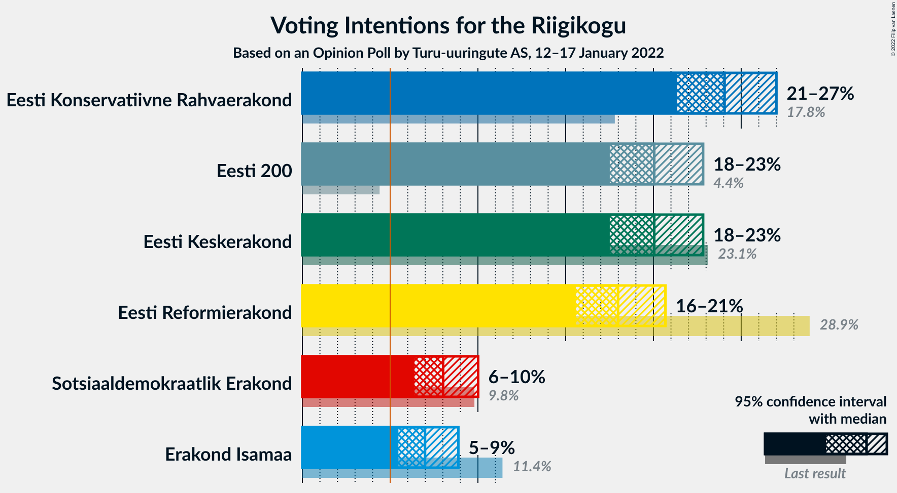

### Confidence Intervals

| Party | Last Result | Poll Result | 80% Confidence Interval | 90% Confidence Interval | 95% Confidence Interval | 99% Confidence Interval |
|:-----:|:-----------:|:-----------:|:-----------------------:|:-----------------------:|:-----------------------:|:-----------------------:|
| Eesti Konservatiivne Rahvaerakond | 17.8% | 24.1% | 22.3–26.0% |21.8–26.5% |21.3–27.0% |20.5–28.0% |
| Eesti Keskerakond | 23.1% | 20.0% | 18.4–21.9% |17.9–22.4% |17.5–22.8% |16.8–23.7% |
| Eesti 200 | 4.4% | 20.0% | 18.4–21.9% |17.9–22.4% |17.5–22.8% |16.8–23.7% |
| Eesti Reformierakond | 28.9% | 18.0% | 16.4–19.7% |16.0–20.2% |15.6–20.7% |14.8–21.5% |
| Sotsiaaldemokraatlik Erakond | 9.8% | 8.0% | 7.0–9.3% |6.6–9.7% |6.4–10.0% |5.9–10.7% |
| Erakond Isamaa | 11.4% | 7.0% | 6.0–8.2% |5.7–8.6% |5.5–8.9% |5.0–9.5% |

*Note:* The poll result column reflects the actual value used in the calculations. Published results may vary slightly, and in addition be rounded to fewer digits.

## Seats

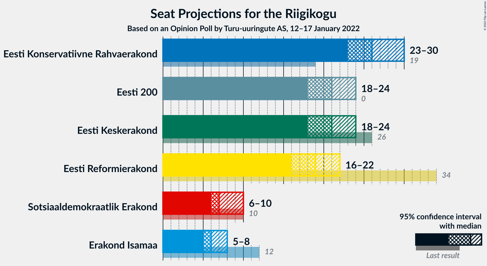

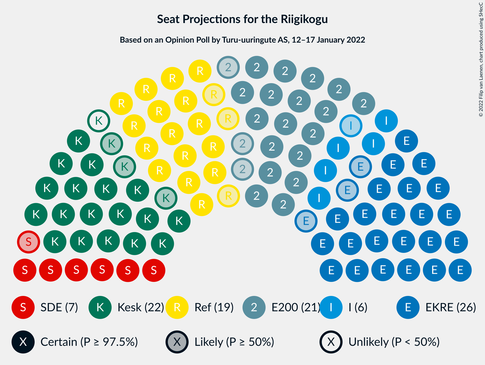

### Confidence Intervals

| Party | Last Result | Median | 80% Confidence Interval | 90% Confidence Interval | 95% Confidence Interval | 99% Confidence Interval |
|:-----:|:-----------:|:------:|:-----------------------:|:-----------------------:|:-----------------------:|:-----------------------:|
| <a href="#eesti-konservatiivne-rahvaerakond">Eesti Konservatiivne Rahvaerakond</a> | 19 | 26 | 24–28 |23–29 |23–30 |22–31 |
| <a href="#eesti-keskerakond">Eesti Keskerakond</a> | 26 | 21 | 19–23 |19–24 |18–24 |17–26 |
| <a href="#eesti-200">Eesti 200</a> | 0 | 21 | 19–23 |19–24 |18–24 |17–26 |
| <a href="#eesti-reformierakond">Eesti Reformierakond</a> | 34 | 19 | 17–21 |16–21 |16–22 |15–23 |
| <a href="#sotsiaaldemokraatlik-erakond">Sotsiaaldemokraatlik Erakond</a> | 10 | 7 | 6–9 |6–9 |6–10 |5–10 |
| <a href="#erakond-isamaa">Erakond Isamaa</a> | 12 | 6 | 5–8 |5–8 |5–8 |4–9 |

### Eesti Konservatiivne Rahvaerakond

*For a full overview of the results for this party, see the [Eesti Konservatiivne Rahvaerakond](party-eestikonservatiivnerahvaerakond.html) page.*

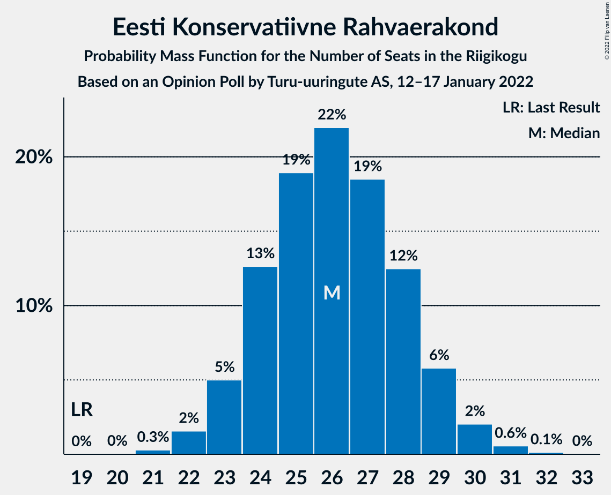

| Number of Seats | Probability | Accumulated | Special Marks |
|:---------------:|:-----------:|:-----------:|:-------------:|
| 19 | 0% | 100% | Last Result |
| 20 | 0% | 100% |  |
| 21 | 0.3% | 100% |  |
| 22 | 2% | 99.7% |  |
| 23 | 5% | 98% |  |
| 24 | 13% | 93% |  |
| 25 | 19% | 80% |  |
| 26 | 22% | 62% | Median |
| 27 | 19% | 40% |  |
| 28 | 12% | 21% |  |
| 29 | 6% | 9% |  |
| 30 | 2% | 3% |  |
| 31 | 0.6% | 0.7% |  |
| 32 | 0.1% | 0.2% |  |
| 33 | 0% | 0% |  |

### Eesti Keskerakond

*For a full overview of the results for this party, see the [Eesti Keskerakond](party-eestikeskerakond.html) page.*

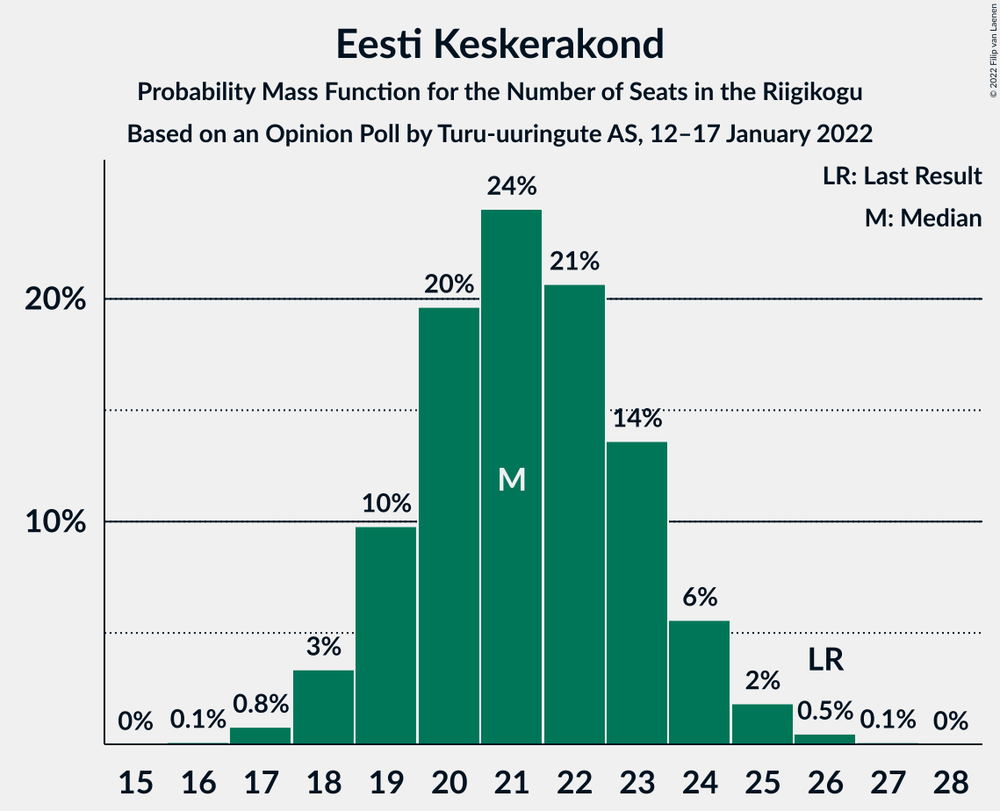

| Number of Seats | Probability | Accumulated | Special Marks |
|:---------------:|:-----------:|:-----------:|:-------------:|
| 16 | 0.1% | 100% |  |
| 17 | 0.8% | 99.9% |  |
| 18 | 3% | 99.1% |  |
| 19 | 10% | 96% |  |
| 20 | 20% | 86% |  |
| 21 | 24% | 66% | Median |
| 22 | 21% | 42% |  |
| 23 | 14% | 22% |  |
| 24 | 6% | 8% |  |
| 25 | 2% | 2% |  |
| 26 | 0.5% | 0.6% | Last Result |
| 27 | 0.1% | 0.1% |  |
| 28 | 0% | 0% |  |

### Eesti 200

*For a full overview of the results for this party, see the [Eesti 200](party-eesti200.html) page.*

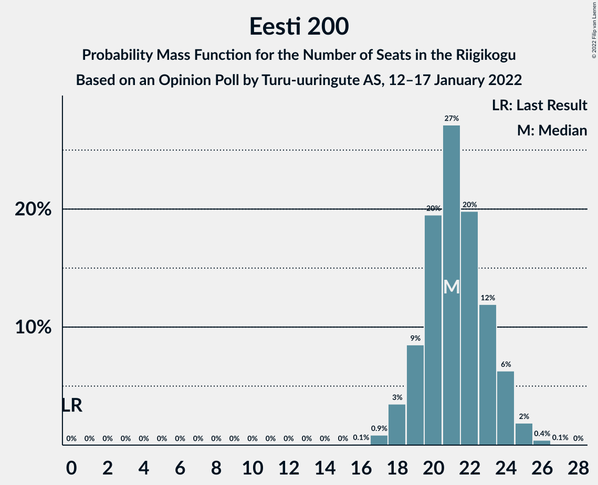

| Number of Seats | Probability | Accumulated | Special Marks |
|:---------------:|:-----------:|:-----------:|:-------------:|
| 0 | 0% | 100% | Last Result |
| 1 | 0% | 100% |  |
| 2 | 0% | 100% |  |
| 3 | 0% | 100% |  |
| 4 | 0% | 100% |  |
| 5 | 0% | 100% |  |
| 6 | 0% | 100% |  |
| 7 | 0% | 100% |  |
| 8 | 0% | 100% |  |
| 9 | 0% | 100% |  |
| 10 | 0% | 100% |  |
| 11 | 0% | 100% |  |
| 12 | 0% | 100% |  |
| 13 | 0% | 100% |  |
| 14 | 0% | 100% |  |
| 15 | 0% | 100% |  |
| 16 | 0.1% | 100% |  |
| 17 | 0.9% | 99.9% |  |
| 18 | 3% | 99.0% |  |
| 19 | 9% | 96% |  |
| 20 | 20% | 87% |  |
| 21 | 27% | 68% | Median |
| 22 | 20% | 40% |  |
| 23 | 12% | 21% |  |
| 24 | 6% | 9% |  |
| 25 | 2% | 2% |  |
| 26 | 0.4% | 0.5% |  |
| 27 | 0.1% | 0.1% |  |
| 28 | 0% | 0% |  |

### Eesti Reformierakond

*For a full overview of the results for this party, see the [Eesti Reformierakond](party-eestireformierakond.html) page.*

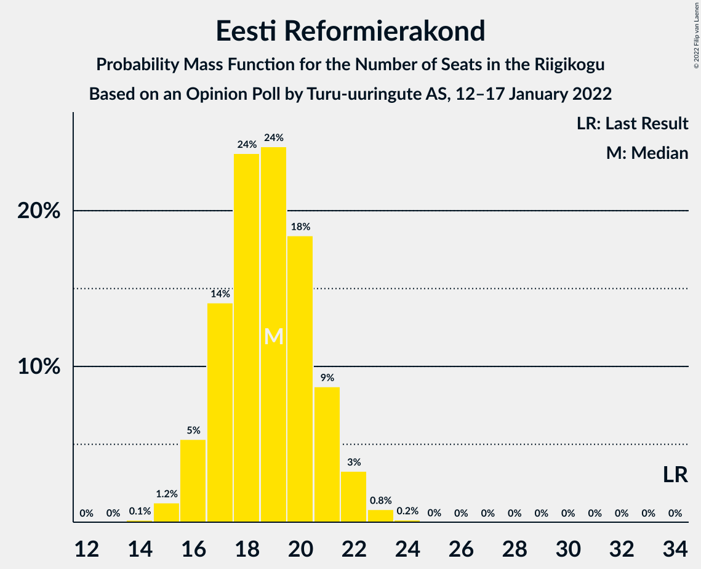

| Number of Seats | Probability | Accumulated | Special Marks |
|:---------------:|:-----------:|:-----------:|:-------------:|
| 14 | 0.1% | 100% |  |
| 15 | 1.2% | 99.8% |  |
| 16 | 5% | 98.6% |  |
| 17 | 14% | 93% |  |
| 18 | 24% | 79% |  |
| 19 | 24% | 56% | Median |
| 20 | 18% | 31% |  |
| 21 | 9% | 13% |  |
| 22 | 3% | 4% |  |
| 23 | 0.8% | 1.0% |  |
| 24 | 0.2% | 0.2% |  |
| 25 | 0% | 0% |  |
| 26 | 0% | 0% |  |
| 27 | 0% | 0% |  |
| 28 | 0% | 0% |  |
| 29 | 0% | 0% |  |
| 30 | 0% | 0% |  |
| 31 | 0% | 0% |  |
| 32 | 0% | 0% |  |
| 33 | 0% | 0% |  |
| 34 | 0% | 0% | Last Result |

### Sotsiaaldemokraatlik Erakond

*For a full overview of the results for this party, see the [Sotsiaaldemokraatlik Erakond](party-sotsiaaldemokraatlikerakond.html) page.*

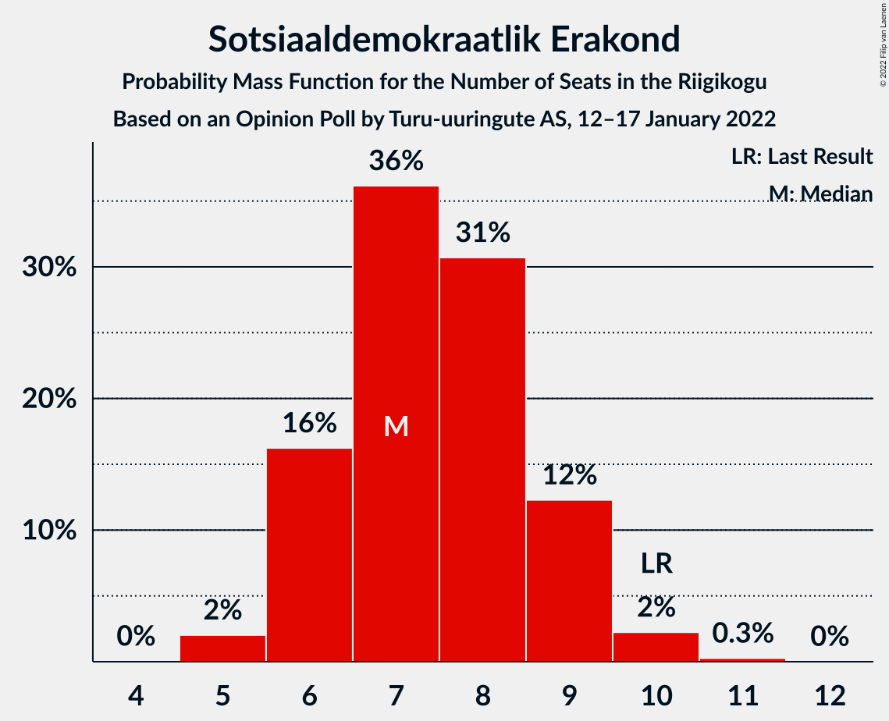

| Number of Seats | Probability | Accumulated | Special Marks |
|:---------------:|:-----------:|:-----------:|:-------------:|
| 5 | 2% | 100% |  |
| 6 | 16% | 98% |  |
| 7 | 36% | 82% | Median |
| 8 | 31% | 46% |  |
| 9 | 12% | 15% |  |
| 10 | 2% | 3% | Last Result |
| 11 | 0.3% | 0.3% |  |
| 12 | 0% | 0% |  |

### Erakond Isamaa

*For a full overview of the results for this party, see the [Erakond Isamaa](party-erakondisamaa.html) page.*

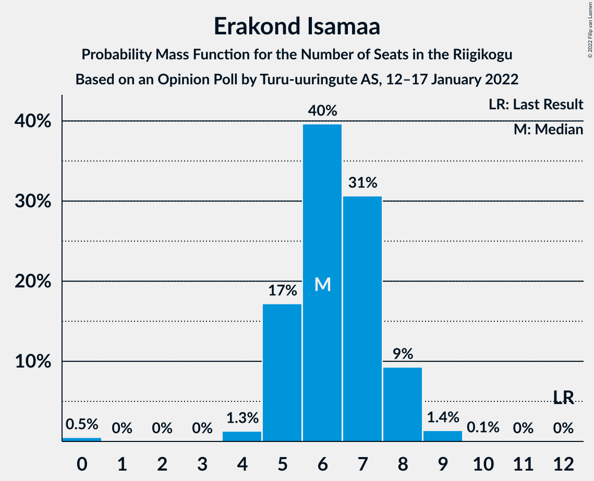

| Number of Seats | Probability | Accumulated | Special Marks |
|:---------------:|:-----------:|:-----------:|:-------------:|
| 0 | 0.5% | 100% |  |
| 1 | 0% | 99.5% |  |
| 2 | 0% | 99.5% |  |
| 3 | 0% | 99.5% |  |
| 4 | 1.3% | 99.5% |  |
| 5 | 17% | 98% |  |
| 6 | 40% | 81% | Median |
| 7 | 31% | 41% |  |
| 8 | 9% | 11% |  |
| 9 | 1.4% | 1.5% |  |
| 10 | 0.1% | 0.1% |  |
| 11 | 0% | 0% |  |
| 12 | 0% | 0% | Last Result |

## Coalitions

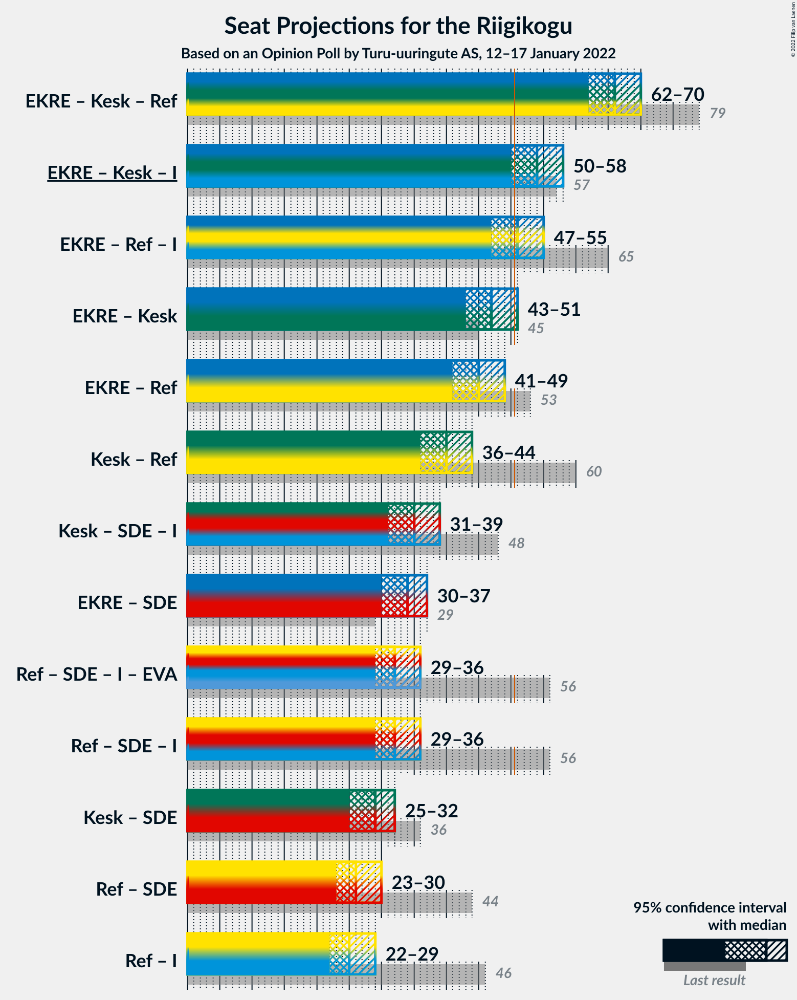

### Confidence Intervals

| Coalition | Last Result | Median | Majority? | 80% Confidence Interval | 90% Confidence Interval | 95% Confidence Interval | 99% Confidence Interval |
|:---------:|:-----------:|:------:|:---------:|:-----------------------:|:-----------------------:|:-----------------------:|:-----------------------:|
| Eesti Konservatiivne Rahvaerakond – Eesti Keskerakond – Eesti Reformierakond | 79 | 66 | 100% | 64–69 | 63–69 | 62–70 | 61–71 |
| Eesti Konservatiivne Rahvaerakond – Eesti Keskerakond – Erakond Isamaa | 57 | 54 | 94% | 51–56 | 50–57 | 50–58 | 48–59 |
| Eesti Konservatiivne Rahvaerakond – Eesti Reformierakond – Erakond Isamaa | 65 | 51 | 62% | 49–54 | 48–54 | 47–55 | 46–56 |
| Eesti Konservatiivne Rahvaerakond – Eesti Keskerakond | 45 | 47 | 6% | 45–50 | 44–51 | 43–51 | 42–53 |
| Eesti Konservatiivne Rahvaerakond – Eesti Reformierakond | 53 | 45 | 0.3% | 42–47 | 42–48 | 41–49 | 40–50 |
| Eesti Keskerakond – Eesti Reformierakond | 60 | 40 | 0% | 38–42 | 37–43 | 36–44 | 35–45 |
| Eesti Keskerakond – Sotsiaaldemokraatlik Erakond – Erakond Isamaa | 48 | 35 | 0% | 33–37 | 32–38 | 31–39 | 30–40 |
| Eesti Konservatiivne Rahvaerakond – Sotsiaaldemokraatlik Erakond | 29 | 34 | 0% | 31–36 | 30–37 | 30–37 | 29–39 |
| Eesti Reformierakond – Sotsiaaldemokraatlik Erakond – Erakond Isamaa | 56 | 32 | 0% | 30–35 | 29–36 | 29–36 | 27–37 |
| Eesti Keskerakond – Sotsiaaldemokraatlik Erakond | 36 | 29 | 0% | 26–31 | 26–32 | 25–32 | 24–33 |
| Eesti Reformierakond – Sotsiaaldemokraatlik Erakond | 44 | 26 | 0% | 24–28 | 23–29 | 23–30 | 22–31 |
| Eesti Reformierakond – Erakond Isamaa | 46 | 25 | 0% | 23–27 | 22–28 | 22–29 | 20–30 |

### Eesti Konservatiivne Rahvaerakond – Eesti Keskerakond – Eesti Reformierakond

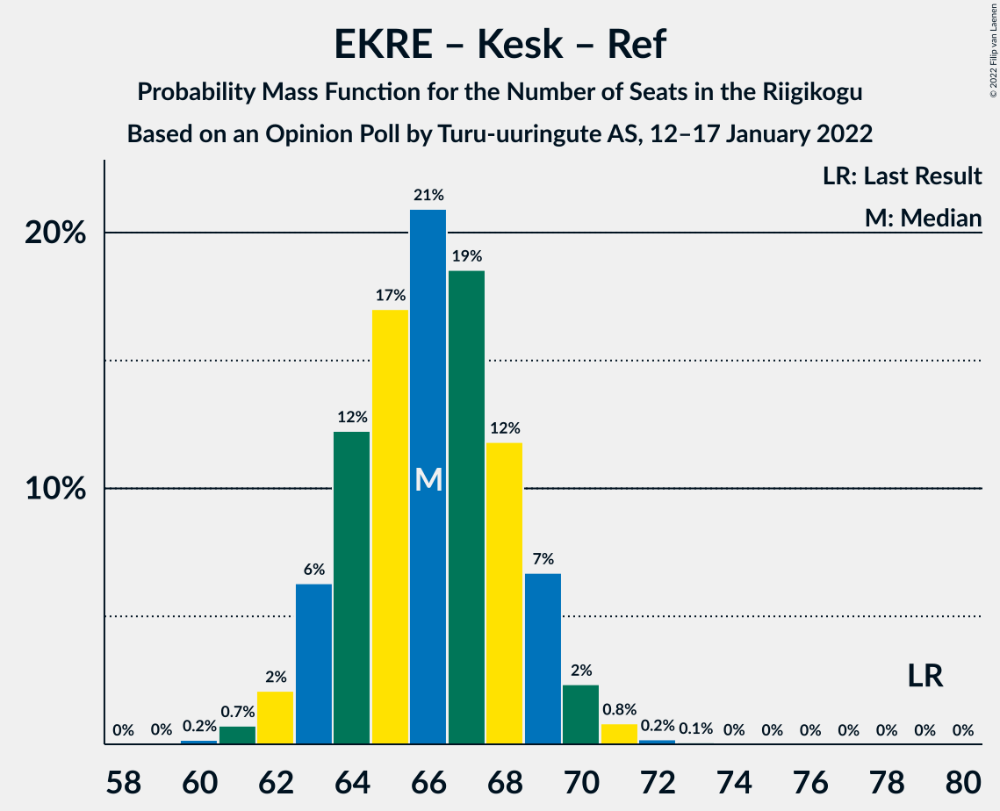

| Number of Seats | Probability | Accumulated | Special Marks |
|:---------------:|:-----------:|:-----------:|:-------------:|
| 60 | 0.2% | 100% |  |
| 61 | 0.7% | 99.8% |  |
| 62 | 2% | 99.1% |  |
| 63 | 6% | 97% |  |
| 64 | 12% | 91% |  |
| 65 | 17% | 78% |  |
| 66 | 21% | 61% | Median |
| 67 | 19% | 41% |  |
| 68 | 12% | 22% |  |
| 69 | 7% | 10% |  |
| 70 | 2% | 3% |  |
| 71 | 0.8% | 1.1% |  |
| 72 | 0.2% | 0.3% |  |
| 73 | 0.1% | 0.1% |  |
| 74 | 0% | 0% |  |
| 75 | 0% | 0% |  |
| 76 | 0% | 0% |  |
| 77 | 0% | 0% |  |
| 78 | 0% | 0% |  |
| 79 | 0% | 0% | Last Result |

### Eesti Konservatiivne Rahvaerakond – Eesti Keskerakond – Erakond Isamaa

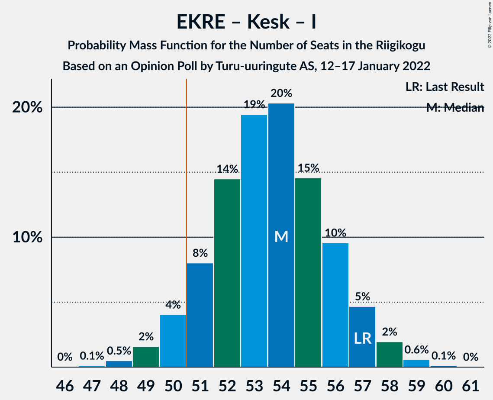

| Number of Seats | Probability | Accumulated | Special Marks |
|:---------------:|:-----------:|:-----------:|:-------------:|
| 47 | 0.1% | 100% |  |
| 48 | 0.5% | 99.9% |  |
| 49 | 2% | 99.4% |  |
| 50 | 4% | 98% |  |
| 51 | 8% | 94% | Majority |
| 52 | 14% | 86% |  |
| 53 | 19% | 71% | Median |
| 54 | 20% | 52% |  |
| 55 | 15% | 31% |  |
| 56 | 10% | 17% |  |
| 57 | 5% | 7% | Last Result |
| 58 | 2% | 3% |  |
| 59 | 0.6% | 0.7% |  |
| 60 | 0.1% | 0.1% |  |
| 61 | 0% | 0% |  |

### Eesti Konservatiivne Rahvaerakond – Eesti Reformierakond – Erakond Isamaa

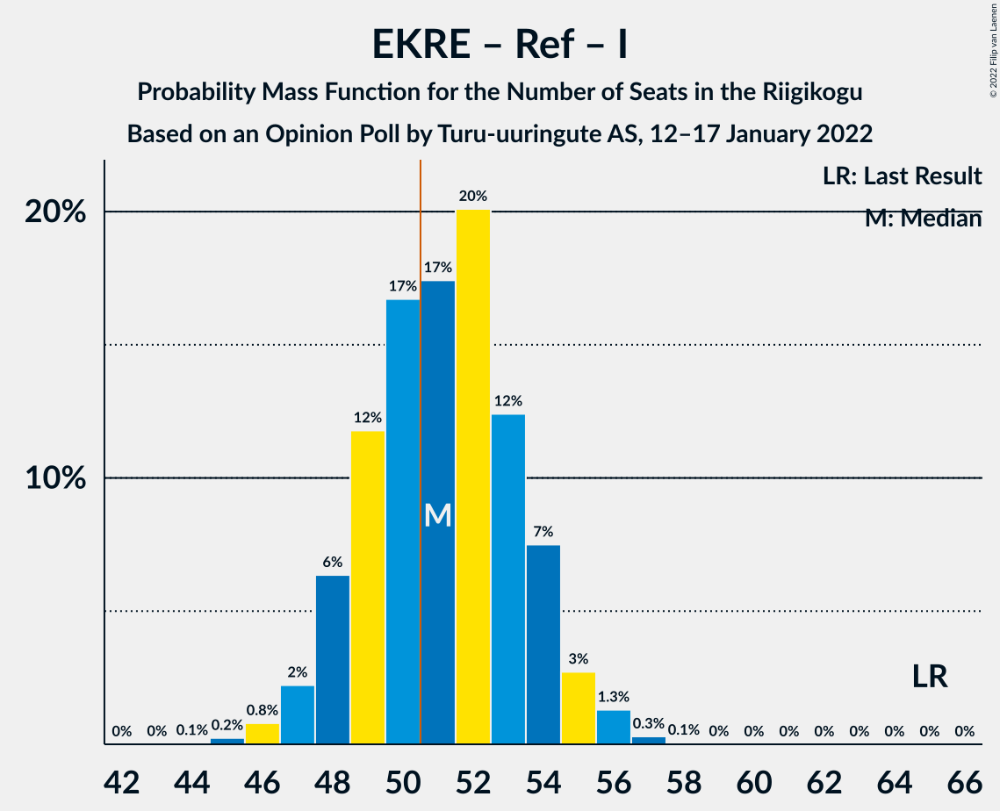

| Number of Seats | Probability | Accumulated | Special Marks |
|:---------------:|:-----------:|:-----------:|:-------------:|
| 44 | 0.1% | 100% |  |
| 45 | 0.2% | 99.9% |  |
| 46 | 0.8% | 99.7% |  |
| 47 | 2% | 98.9% |  |
| 48 | 6% | 97% |  |
| 49 | 12% | 90% |  |
| 50 | 17% | 79% |  |
| 51 | 17% | 62% | Median, Majority |
| 52 | 20% | 44% |  |
| 53 | 12% | 24% |  |
| 54 | 7% | 12% |  |
| 55 | 3% | 4% |  |
| 56 | 1.3% | 2% |  |
| 57 | 0.3% | 0.4% |  |
| 58 | 0.1% | 0.1% |  |
| 59 | 0% | 0% |  |
| 60 | 0% | 0% |  |
| 61 | 0% | 0% |  |
| 62 | 0% | 0% |  |
| 63 | 0% | 0% |  |
| 64 | 0% | 0% |  |
| 65 | 0% | 0% | Last Result |

### Eesti Konservatiivne Rahvaerakond – Eesti Keskerakond

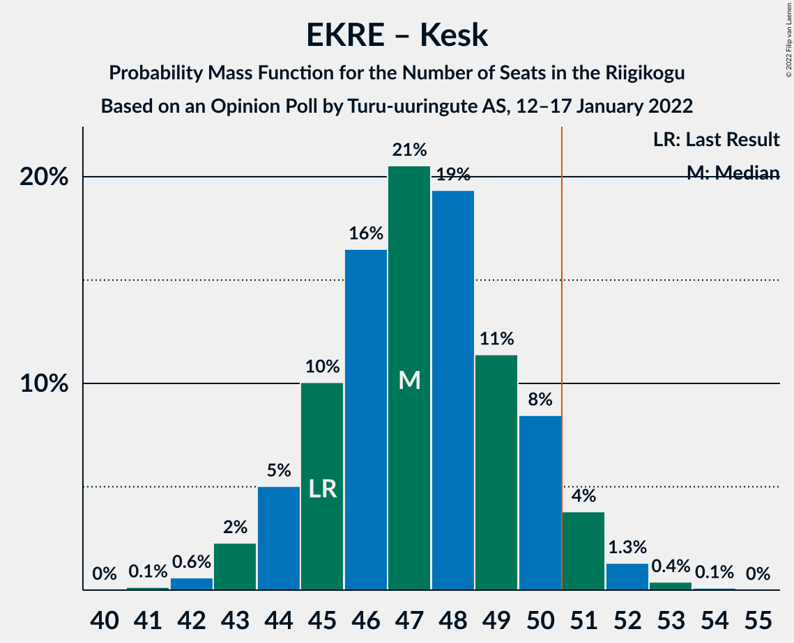

| Number of Seats | Probability | Accumulated | Special Marks |
|:---------------:|:-----------:|:-----------:|:-------------:|
| 41 | 0.1% | 100% |  |
| 42 | 0.6% | 99.8% |  |
| 43 | 2% | 99.2% |  |
| 44 | 5% | 97% |  |
| 45 | 10% | 92% | Last Result |
| 46 | 16% | 82% |  |
| 47 | 21% | 65% | Median |
| 48 | 19% | 45% |  |
| 49 | 11% | 25% |  |
| 50 | 8% | 14% |  |
| 51 | 4% | 6% | Majority |
| 52 | 1.3% | 2% |  |
| 53 | 0.4% | 0.5% |  |
| 54 | 0.1% | 0.1% |  |
| 55 | 0% | 0% |  |

### Eesti Konservatiivne Rahvaerakond – Eesti Reformierakond

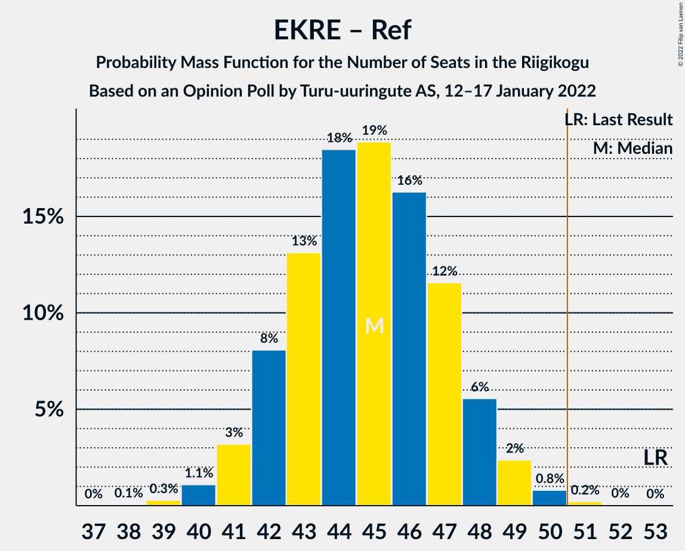

| Number of Seats | Probability | Accumulated | Special Marks |
|:---------------:|:-----------:|:-----------:|:-------------:|
| 38 | 0.1% | 100% |  |
| 39 | 0.3% | 99.9% |  |
| 40 | 1.1% | 99.7% |  |
| 41 | 3% | 98.6% |  |
| 42 | 8% | 95% |  |
| 43 | 13% | 87% |  |
| 44 | 18% | 74% |  |
| 45 | 19% | 56% | Median |
| 46 | 16% | 37% |  |
| 47 | 12% | 21% |  |
| 48 | 6% | 9% |  |
| 49 | 2% | 3% |  |
| 50 | 0.8% | 1.1% |  |
| 51 | 0.2% | 0.3% | Majority |
| 52 | 0% | 0.1% |  |
| 53 | 0% | 0% | Last Result |

### Eesti Keskerakond – Eesti Reformierakond

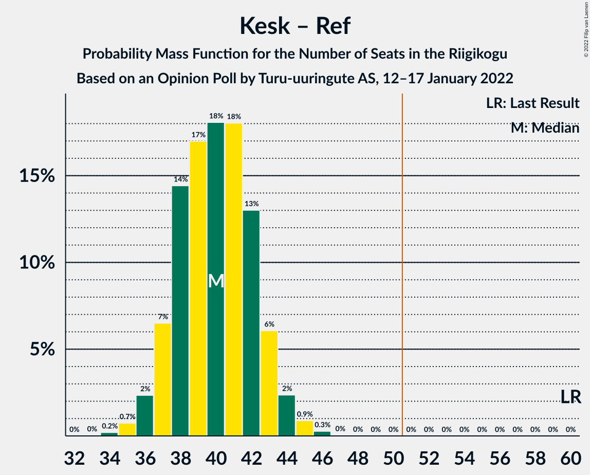

| Number of Seats | Probability | Accumulated | Special Marks |
|:---------------:|:-----------:|:-----------:|:-------------:|
| 34 | 0.2% | 100% |  |
| 35 | 0.7% | 99.8% |  |
| 36 | 2% | 99.0% |  |
| 37 | 7% | 97% |  |
| 38 | 14% | 90% |  |
| 39 | 17% | 76% |  |
| 40 | 18% | 59% | Median |
| 41 | 18% | 41% |  |
| 42 | 13% | 23% |  |
| 43 | 6% | 10% |  |
| 44 | 2% | 4% |  |
| 45 | 0.9% | 1.2% |  |
| 46 | 0.3% | 0.3% |  |
| 47 | 0% | 0.1% |  |
| 48 | 0% | 0% |  |
| 49 | 0% | 0% |  |
| 50 | 0% | 0% |  |
| 51 | 0% | 0% | Majority |
| 52 | 0% | 0% |  |
| 53 | 0% | 0% |  |
| 54 | 0% | 0% |  |
| 55 | 0% | 0% |  |
| 56 | 0% | 0% |  |
| 57 | 0% | 0% |  |
| 58 | 0% | 0% |  |
| 59 | 0% | 0% |  |
| 60 | 0% | 0% | Last Result |

### Eesti Keskerakond – Sotsiaaldemokraatlik Erakond – Erakond Isamaa

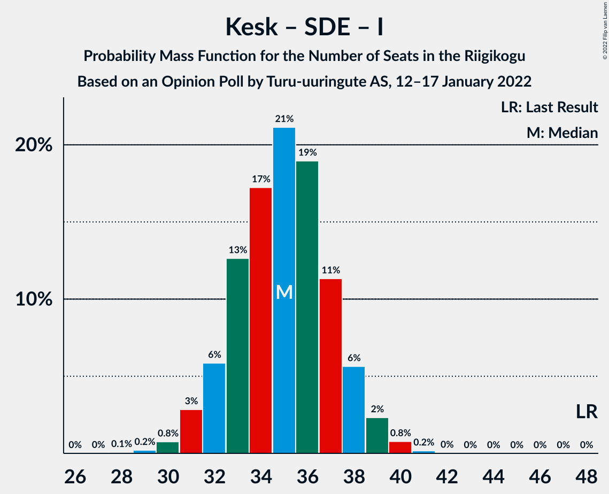

| Number of Seats | Probability | Accumulated | Special Marks |
|:---------------:|:-----------:|:-----------:|:-------------:|
| 28 | 0.1% | 100% |  |
| 29 | 0.2% | 99.9% |  |
| 30 | 0.8% | 99.7% |  |
| 31 | 3% | 98.9% |  |
| 32 | 6% | 96% |  |
| 33 | 13% | 90% |  |
| 34 | 17% | 78% | Median |
| 35 | 21% | 60% |  |
| 36 | 19% | 39% |  |
| 37 | 11% | 20% |  |
| 38 | 6% | 9% |  |
| 39 | 2% | 3% |  |
| 40 | 0.8% | 1.0% |  |
| 41 | 0.2% | 0.2% |  |
| 42 | 0% | 0% |  |
| 43 | 0% | 0% |  |
| 44 | 0% | 0% |  |
| 45 | 0% | 0% |  |
| 46 | 0% | 0% |  |
| 47 | 0% | 0% |  |
| 48 | 0% | 0% | Last Result |

### Eesti Konservatiivne Rahvaerakond – Sotsiaaldemokraatlik Erakond

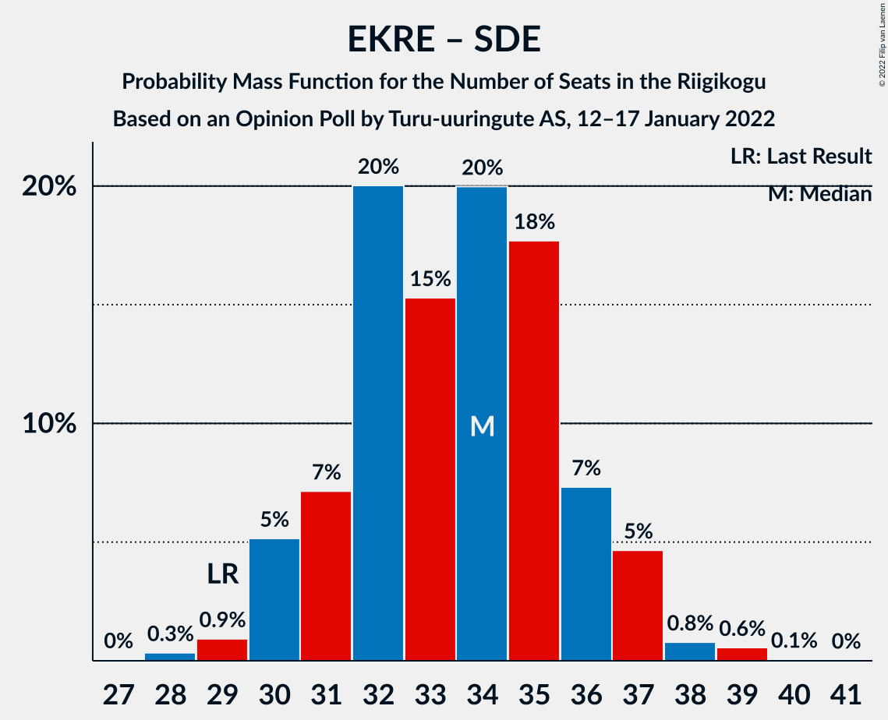

| Number of Seats | Probability | Accumulated | Special Marks |
|:---------------:|:-----------:|:-----------:|:-------------:|
| 28 | 0.3% | 100% |  |
| 29 | 0.9% | 99.6% | Last Result |
| 30 | 5% | 98.7% |  |
| 31 | 7% | 94% |  |
| 32 | 20% | 86% |  |
| 33 | 15% | 66% | Median |
| 34 | 20% | 51% |  |
| 35 | 18% | 31% |  |
| 36 | 7% | 13% |  |
| 37 | 5% | 6% |  |
| 38 | 0.8% | 1.4% |  |
| 39 | 0.6% | 0.6% |  |
| 40 | 0.1% | 0.1% |  |
| 41 | 0% | 0% |  |

### Eesti Reformierakond – Sotsiaaldemokraatlik Erakond – Erakond Isamaa

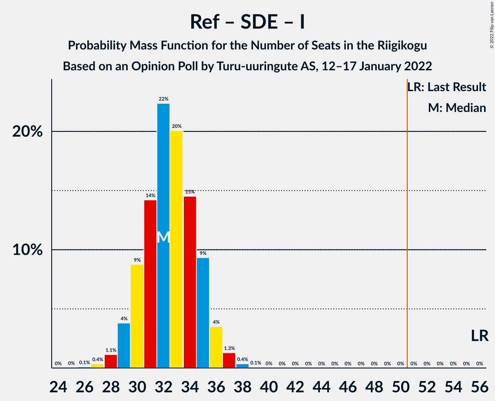

| Number of Seats | Probability | Accumulated | Special Marks |
|:---------------:|:-----------:|:-----------:|:-------------:|
| 26 | 0.1% | 100% |  |
| 27 | 0.4% | 99.9% |  |
| 28 | 1.1% | 99.5% |  |
| 29 | 4% | 98% |  |
| 30 | 9% | 95% |  |
| 31 | 14% | 86% |  |
| 32 | 22% | 72% | Median |
| 33 | 20% | 49% |  |
| 34 | 15% | 29% |  |
| 35 | 9% | 15% |  |
| 36 | 4% | 5% |  |
| 37 | 1.3% | 2% |  |
| 38 | 0.4% | 0.4% |  |
| 39 | 0.1% | 0.1% |  |
| 40 | 0% | 0% |  |
| 41 | 0% | 0% |  |
| 42 | 0% | 0% |  |
| 43 | 0% | 0% |  |
| 44 | 0% | 0% |  |
| 45 | 0% | 0% |  |
| 46 | 0% | 0% |  |
| 47 | 0% | 0% |  |
| 48 | 0% | 0% |  |
| 49 | 0% | 0% |  |
| 50 | 0% | 0% |  |
| 51 | 0% | 0% | Majority |
| 52 | 0% | 0% |  |
| 53 | 0% | 0% |  |
| 54 | 0% | 0% |  |
| 55 | 0% | 0% |  |
| 56 | 0% | 0% | Last Result |

### Eesti Keskerakond – Sotsiaaldemokraatlik Erakond

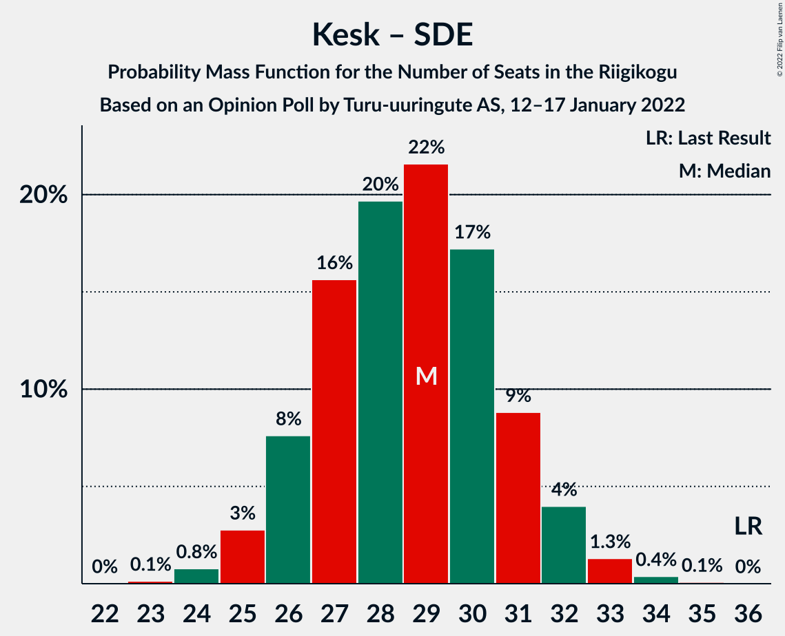

| Number of Seats | Probability | Accumulated | Special Marks |
|:---------------:|:-----------:|:-----------:|:-------------:|
| 23 | 0.1% | 100% |  |
| 24 | 0.8% | 99.8% |  |
| 25 | 3% | 99.1% |  |
| 26 | 8% | 96% |  |
| 27 | 16% | 89% |  |
| 28 | 20% | 73% | Median |
| 29 | 22% | 53% |  |
| 30 | 17% | 32% |  |
| 31 | 9% | 15% |  |
| 32 | 4% | 6% |  |
| 33 | 1.3% | 2% |  |
| 34 | 0.4% | 0.5% |  |
| 35 | 0.1% | 0.1% |  |
| 36 | 0% | 0% | Last Result |

### Eesti Reformierakond – Sotsiaaldemokraatlik Erakond

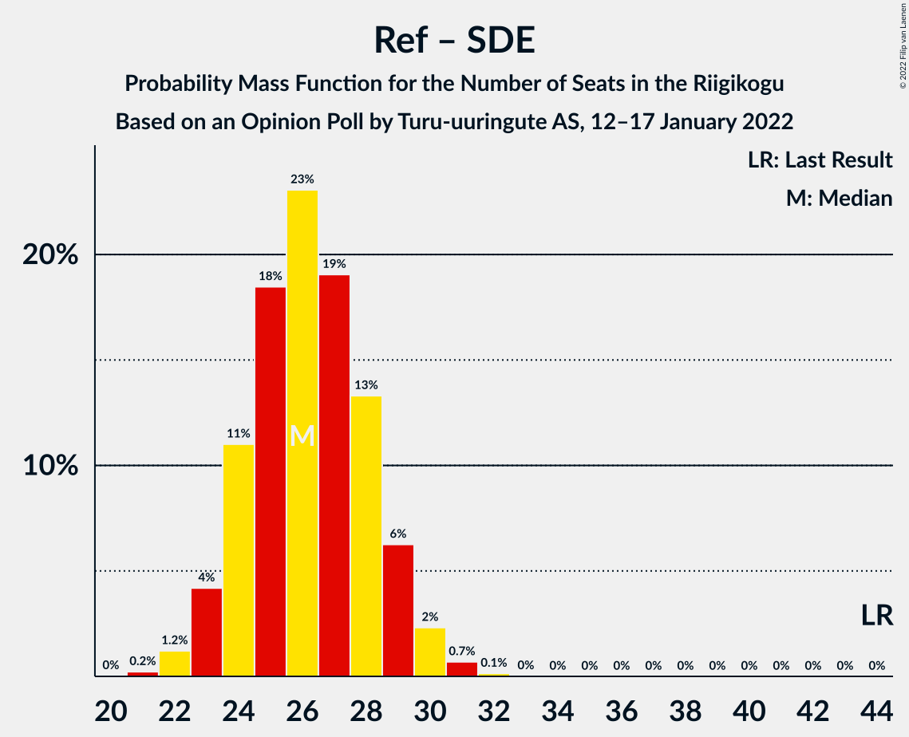

| Number of Seats | Probability | Accumulated | Special Marks |
|:---------------:|:-----------:|:-----------:|:-------------:|
| 21 | 0.2% | 100% |  |
| 22 | 1.2% | 99.7% |  |
| 23 | 4% | 98.5% |  |
| 24 | 11% | 94% |  |
| 25 | 18% | 83% |  |
| 26 | 23% | 65% | Median |
| 27 | 19% | 42% |  |
| 28 | 13% | 23% |  |
| 29 | 6% | 9% |  |
| 30 | 2% | 3% |  |
| 31 | 0.7% | 0.9% |  |
| 32 | 0.1% | 0.2% |  |
| 33 | 0% | 0% |  |
| 34 | 0% | 0% |  |
| 35 | 0% | 0% |  |
| 36 | 0% | 0% |  |
| 37 | 0% | 0% |  |
| 38 | 0% | 0% |  |
| 39 | 0% | 0% |  |
| 40 | 0% | 0% |  |
| 41 | 0% | 0% |  |
| 42 | 0% | 0% |  |
| 43 | 0% | 0% |  |
| 44 | 0% | 0% | Last Result |

### Eesti Reformierakond – Erakond Isamaa

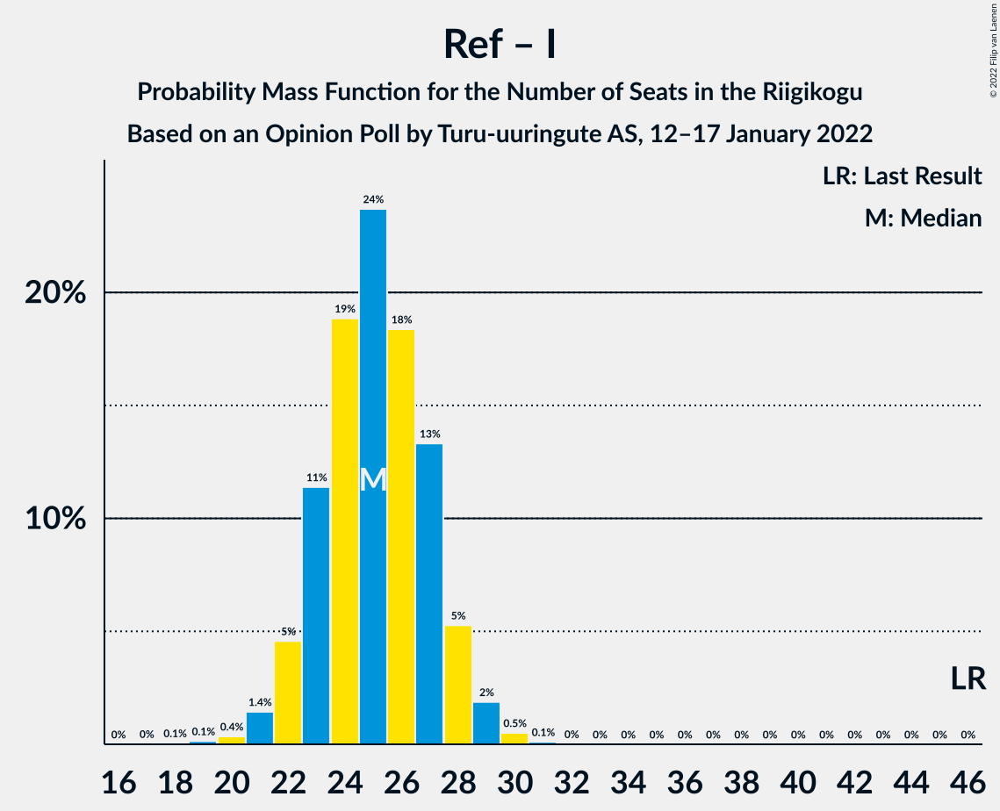

| Number of Seats | Probability | Accumulated | Special Marks |
|:---------------:|:-----------:|:-----------:|:-------------:|
| 18 | 0.1% | 100% |  |
| 19 | 0.1% | 99.9% |  |
| 20 | 0.4% | 99.8% |  |
| 21 | 1.4% | 99.4% |  |
| 22 | 5% | 98% |  |
| 23 | 11% | 93% |  |
| 24 | 19% | 82% |  |
| 25 | 24% | 63% | Median |
| 26 | 18% | 39% |  |
| 27 | 13% | 21% |  |
| 28 | 5% | 8% |  |
| 29 | 2% | 3% |  |
| 30 | 0.5% | 0.6% |  |
| 31 | 0.1% | 0.1% |  |
| 32 | 0% | 0% |  |
| 33 | 0% | 0% |  |
| 34 | 0% | 0% |  |
| 35 | 0% | 0% |  |
| 36 | 0% | 0% |  |
| 37 | 0% | 0% |  |
| 38 | 0% | 0% |  |
| 39 | 0% | 0% |  |
| 40 | 0% | 0% |  |
| 41 | 0% | 0% |  |
| 42 | 0% | 0% |  |
| 43 | 0% | 0% |  |
| 44 | 0% | 0% |  |
| 45 | 0% | 0% |  |
| 46 | 0% | 0% | Last Result |

## Technical Information

### Opinion Poll

+ **Polling firm:** Turu-uuringute AS
+ **Commissioner(s):** —
+ **Fieldwork period:** 12–17 January 2022

### Calculations

+ **Sample size:** 873
+ **Simulations done:** 1,048,576
+ **Error estimate:** 1.13%

