# Opinion Poll by Norstat for MTÜ Ühiskonnauuringute Instituut, 25–31 January 2022

<a href="#voting-intentions">Voting Intentions</a> | <a href="#seats">Seats</a> | <a href="#coalitions">Coalitions</a> | <a href="#technical-information">Technical Information</a>

## Voting Intentions

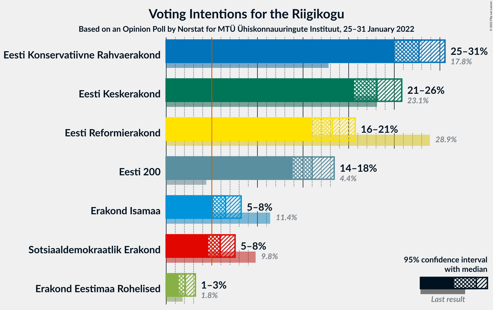

### Confidence Intervals

| Party | Last Result | Poll Result | 80% Confidence Interval | 90% Confidence Interval | 95% Confidence Interval | 99% Confidence Interval |
|:-----:|:-----------:|:-----------:|:-----------------------:|:-----------------------:|:-----------------------:|:-----------------------:|
| Eesti Konservatiivne Rahvaerakond | 17.8% | 27.7% | 25.9–29.6% |25.4–30.1% |25.0–30.6% |24.2–31.5% |
| Eesti Keskerakond | 23.1% | 23.1% | 21.4–24.9% |21.0–25.4% |20.6–25.8% |19.8–26.7% |
| Eesti Reformierakond | 28.9% | 18.2% | 16.7–19.8% |16.3–20.3% |15.9–20.7% |15.2–21.5% |
| Eesti 200 | 4.4% | 16.0% | 14.6–17.6% |14.2–18.0% |13.9–18.4% |13.2–19.2% |
| Erakond Isamaa | 11.4% | 6.5% | 5.6–7.6% |5.3–7.9% |5.1–8.2% |4.7–8.8% |
| Sotsiaaldemokraatlik Erakond | 9.8% | 5.9% | 5.0–7.0% |4.8–7.3% |4.6–7.5% |4.2–8.1% |
| Erakond Eestimaa Rohelised | 1.8% | 2.1% | 1.6–2.8% |1.5–3.0% |1.4–3.2% |1.2–3.6% |

*Note:* The poll result column reflects the actual value used in the calculations. Published results may vary slightly, and in addition be rounded to fewer digits.

## Seats

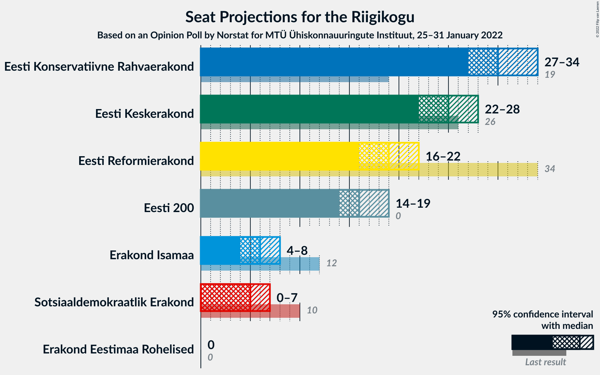

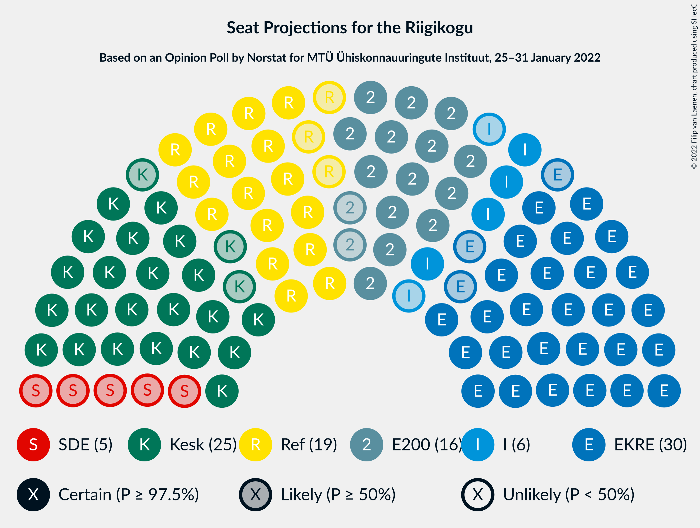

### Confidence Intervals

| Party | Last Result | Median | 80% Confidence Interval | 90% Confidence Interval | 95% Confidence Interval | 99% Confidence Interval |
|:-----:|:-----------:|:------:|:-----------------------:|:-----------------------:|:-----------------------:|:-----------------------:|
| <a href="#eesti-konservatiivne-rahvaerakond">Eesti Konservatiivne Rahvaerakond</a> | 19 | 30 | 28–33 |28–33 |27–34 |26–35 |
| <a href="#eesti-keskerakond">Eesti Keskerakond</a> | 26 | 25 | 23–27 |22–28 |22–28 |21–29 |
| <a href="#eesti-reformierakond">Eesti Reformierakond</a> | 34 | 19 | 17–21 |17–21 |16–22 |15–23 |
| <a href="#eesti-200">Eesti 200</a> | 0 | 16 | 15–18 |14–19 |14–19 |13–20 |
| <a href="#erakond-isamaa">Erakond Isamaa</a> | 12 | 6 | 5–7 |5–7 |4–8 |0–8 |
| <a href="#sotsiaaldemokraatlik-erakond">Sotsiaaldemokraatlik Erakond</a> | 10 | 5 | 4–6 |0–6 |0–7 |0–7 |
| <a href="#erakond-eestimaa-rohelised">Erakond Eestimaa Rohelised</a> | 0 | 0 | 0 |0 |0 |0 |

### Eesti Konservatiivne Rahvaerakond

*For a full overview of the results for this party, see the [Eesti Konservatiivne Rahvaerakond](party-eestikonservatiivnerahvaerakond.html) page.*

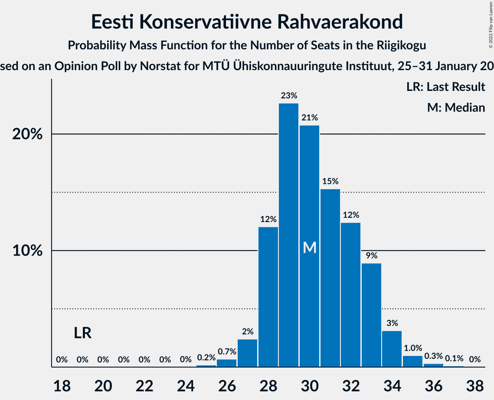

| Number of Seats | Probability | Accumulated | Special Marks |
|:---------------:|:-----------:|:-----------:|:-------------:|
| 19 | 0% | 100% | Last Result |
| 20 | 0% | 100% |  |
| 21 | 0% | 100% |  |
| 22 | 0% | 100% |  |
| 23 | 0% | 100% |  |
| 24 | 0% | 100% |  |
| 25 | 0.2% | 100% |  |
| 26 | 0.7% | 99.8% |  |
| 27 | 2% | 99.1% |  |
| 28 | 12% | 97% |  |
| 29 | 23% | 85% |  |
| 30 | 21% | 62% | Median |
| 31 | 15% | 41% |  |
| 32 | 12% | 26% |  |
| 33 | 9% | 13% |  |
| 34 | 3% | 5% |  |
| 35 | 1.0% | 1.4% |  |
| 36 | 0.3% | 0.4% |  |
| 37 | 0.1% | 0.1% |  |
| 38 | 0% | 0% |  |

### Eesti Keskerakond

*For a full overview of the results for this party, see the [Eesti Keskerakond](party-eestikeskerakond.html) page.*

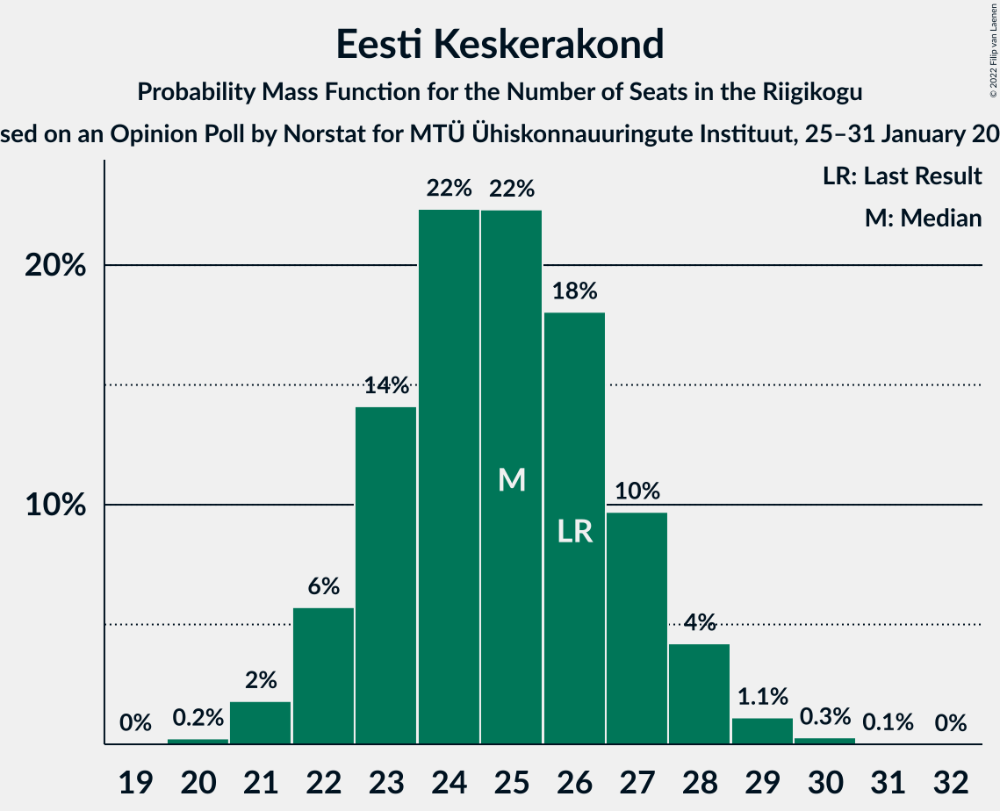

| Number of Seats | Probability | Accumulated | Special Marks |
|:---------------:|:-----------:|:-----------:|:-------------:|
| 20 | 0.2% | 100% |  |
| 21 | 2% | 99.7% |  |
| 22 | 6% | 98% |  |
| 23 | 14% | 92% |  |
| 24 | 22% | 78% |  |
| 25 | 22% | 56% | Median |
| 26 | 18% | 33% | Last Result |
| 27 | 10% | 15% |  |
| 28 | 4% | 6% |  |
| 29 | 1.1% | 1.5% |  |
| 30 | 0.3% | 0.3% |  |
| 31 | 0.1% | 0.1% |  |
| 32 | 0% | 0% |  |

### Eesti Reformierakond

*For a full overview of the results for this party, see the [Eesti Reformierakond](party-eestireformierakond.html) page.*

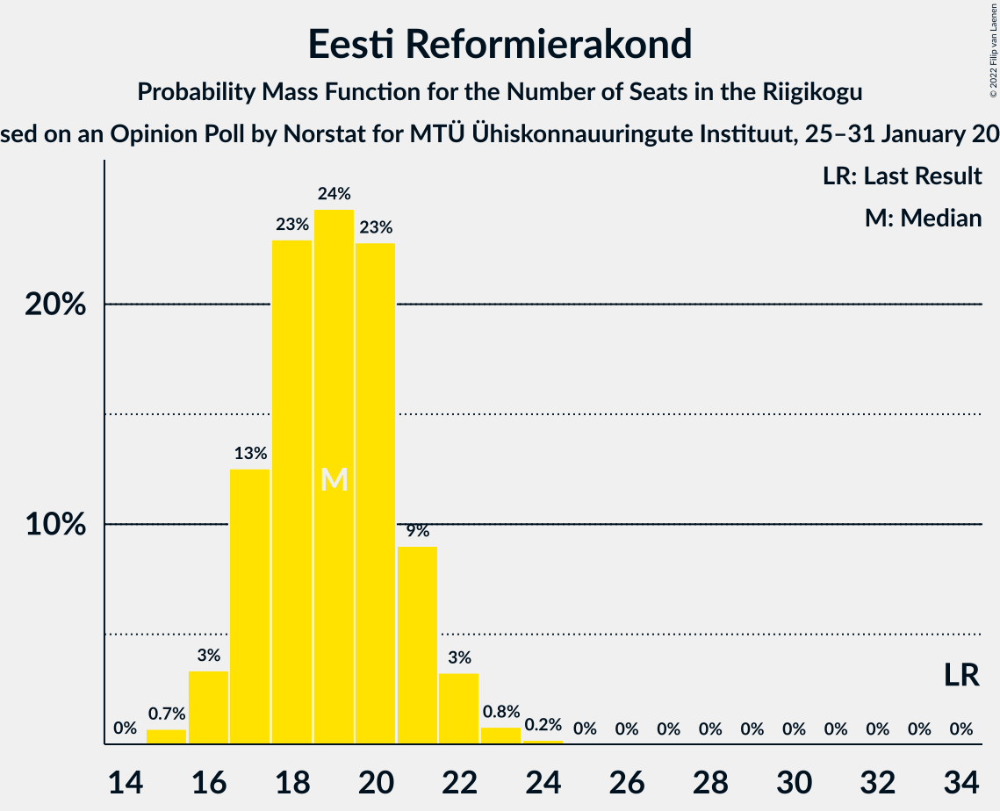

| Number of Seats | Probability | Accumulated | Special Marks |
|:---------------:|:-----------:|:-----------:|:-------------:|
| 15 | 0.7% | 100% |  |
| 16 | 3% | 99.3% |  |
| 17 | 13% | 96% |  |
| 18 | 23% | 83% |  |
| 19 | 24% | 60% | Median |
| 20 | 23% | 36% |  |
| 21 | 9% | 13% |  |
| 22 | 3% | 4% |  |
| 23 | 0.8% | 1.0% |  |
| 24 | 0.2% | 0.2% |  |
| 25 | 0% | 0% |  |
| 26 | 0% | 0% |  |
| 27 | 0% | 0% |  |
| 28 | 0% | 0% |  |
| 29 | 0% | 0% |  |
| 30 | 0% | 0% |  |
| 31 | 0% | 0% |  |
| 32 | 0% | 0% |  |
| 33 | 0% | 0% |  |
| 34 | 0% | 0% | Last Result |

### Eesti 200

*For a full overview of the results for this party, see the [Eesti 200](party-eesti200.html) page.*

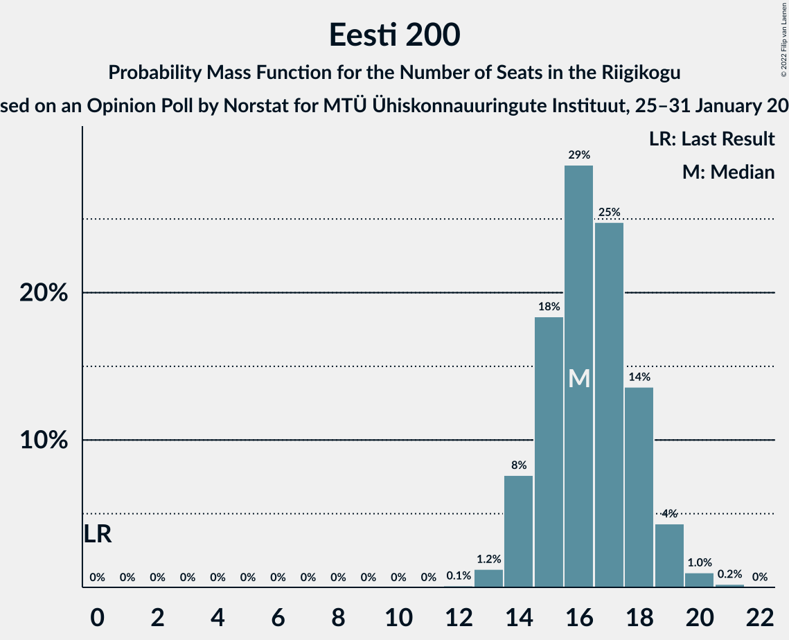

| Number of Seats | Probability | Accumulated | Special Marks |
|:---------------:|:-----------:|:-----------:|:-------------:|
| 0 | 0% | 100% | Last Result |
| 1 | 0% | 100% |  |
| 2 | 0% | 100% |  |
| 3 | 0% | 100% |  |
| 4 | 0% | 100% |  |
| 5 | 0% | 100% |  |
| 6 | 0% | 100% |  |
| 7 | 0% | 100% |  |
| 8 | 0% | 100% |  |
| 9 | 0% | 100% |  |
| 10 | 0% | 100% |  |
| 11 | 0% | 100% |  |
| 12 | 0.1% | 100% |  |
| 13 | 1.2% | 99.9% |  |
| 14 | 8% | 98.6% |  |
| 15 | 18% | 91% |  |
| 16 | 29% | 73% | Median |
| 17 | 25% | 44% |  |
| 18 | 14% | 19% |  |
| 19 | 4% | 6% |  |
| 20 | 1.0% | 1.3% |  |
| 21 | 0.2% | 0.3% |  |
| 22 | 0% | 0% |  |

### Erakond Isamaa

*For a full overview of the results for this party, see the [Erakond Isamaa](party-erakondisamaa.html) page.*

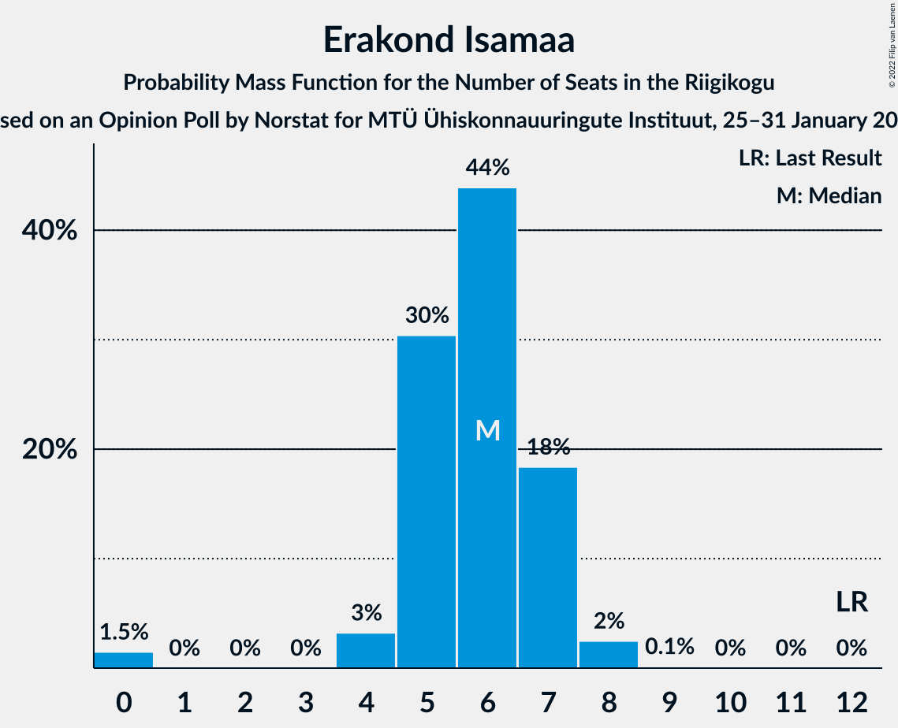

| Number of Seats | Probability | Accumulated | Special Marks |
|:---------------:|:-----------:|:-----------:|:-------------:|
| 0 | 1.5% | 100% |  |
| 1 | 0% | 98.5% |  |
| 2 | 0% | 98.5% |  |
| 3 | 0% | 98.5% |  |
| 4 | 3% | 98.5% |  |
| 5 | 30% | 95% |  |
| 6 | 44% | 65% | Median |
| 7 | 18% | 21% |  |
| 8 | 2% | 3% |  |
| 9 | 0.1% | 0.2% |  |
| 10 | 0% | 0% |  |
| 11 | 0% | 0% |  |
| 12 | 0% | 0% | Last Result |

### Sotsiaaldemokraatlik Erakond

*For a full overview of the results for this party, see the [Sotsiaaldemokraatlik Erakond](party-sotsiaaldemokraatlikerakond.html) page.*

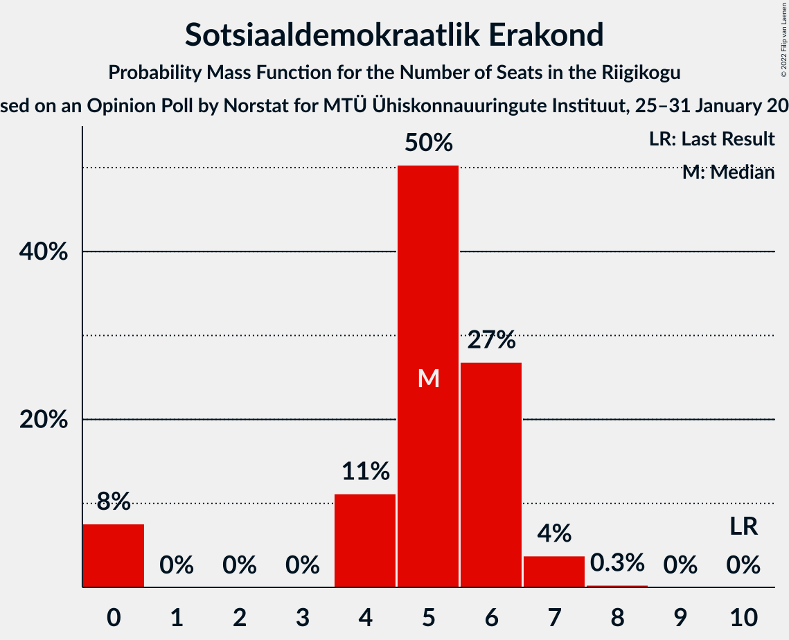

| Number of Seats | Probability | Accumulated | Special Marks |
|:---------------:|:-----------:|:-----------:|:-------------:|
| 0 | 8% | 100% |  |
| 1 | 0% | 92% |  |
| 2 | 0% | 92% |  |
| 3 | 0% | 92% |  |
| 4 | 11% | 92% |  |
| 5 | 50% | 81% | Median |
| 6 | 27% | 31% |  |
| 7 | 4% | 4% |  |
| 8 | 0.3% | 0.3% |  |
| 9 | 0% | 0% |  |
| 10 | 0% | 0% | Last Result |

### Erakond Eestimaa Rohelised

*For a full overview of the results for this party, see the [Erakond Eestimaa Rohelised](party-erakondeestimaarohelised.html) page.*

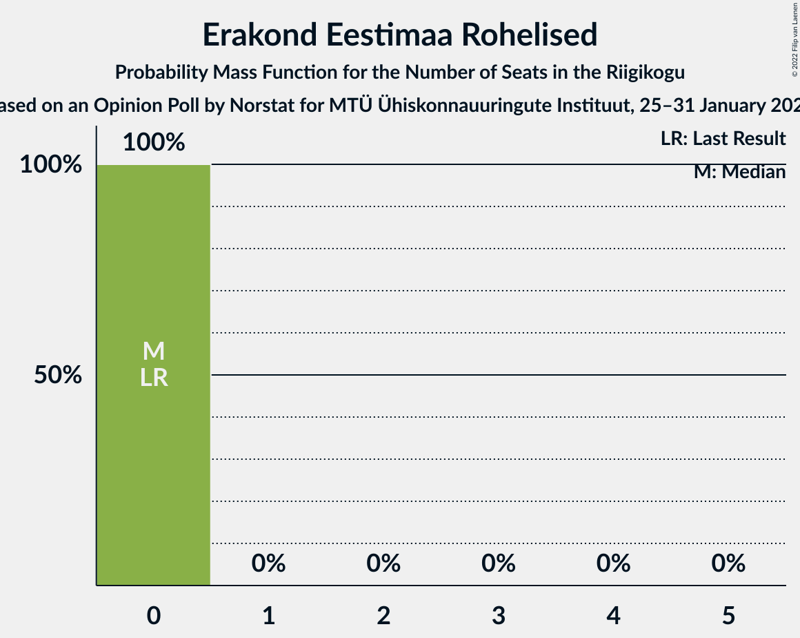

| Number of Seats | Probability | Accumulated | Special Marks |
|:---------------:|:-----------:|:-----------:|:-------------:|
| 0 | 100% | 100% | Last Result, Median |

## Coalitions

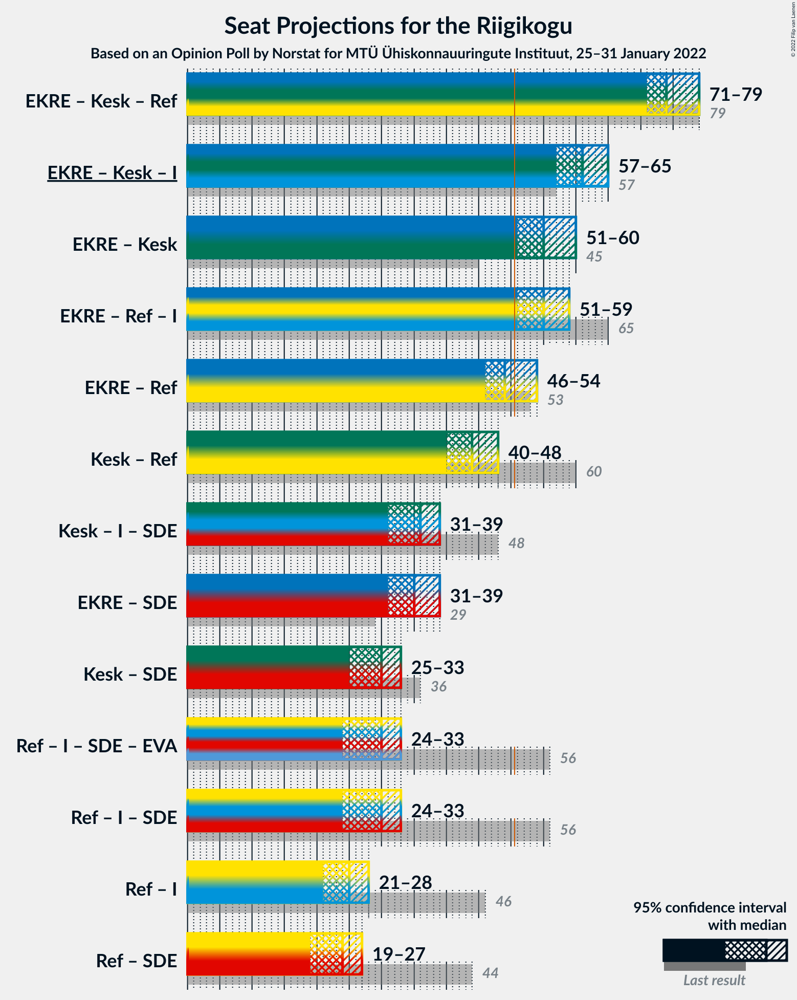

### Confidence Intervals

| Coalition | Last Result | Median | Majority? | 80% Confidence Interval | 90% Confidence Interval | 95% Confidence Interval | 99% Confidence Interval |
|:---------:|:-----------:|:------:|:---------:|:-----------------------:|:-----------------------:|:-----------------------:|:-----------------------:|
| Eesti Konservatiivne Rahvaerakond – Eesti Keskerakond – Eesti Reformierakond | 79 | 74 | 100% | 72–77 | 71–78 | 71–79 | 70–81 |
| Eesti Konservatiivne Rahvaerakond – Eesti Keskerakond – Erakond Isamaa | 57 | 61 | 100% | 58–63 | 58–64 | 57–65 | 56–67 |
| Eesti Konservatiivne Rahvaerakond – Eesti Keskerakond | 45 | 55 | 99.3% | 53–58 | 52–59 | 51–60 | 50–61 |
| Eesti Konservatiivne Rahvaerakond – Eesti Reformierakond – Erakond Isamaa | 65 | 55 | 98.7% | 52–58 | 52–58 | 51–59 | 50–61 |
| Eesti Konservatiivne Rahvaerakond – Eesti Reformierakond | 53 | 49 | 28% | 47–52 | 46–53 | 46–54 | 44–55 |
| Eesti Keskerakond – Eesti Reformierakond | 60 | 44 | 0.2% | 41–46 | 41–47 | 40–48 | 39–49 |
| Eesti Keskerakond – Erakond Isamaa – Sotsiaaldemokraatlik Erakond | 48 | 36 | 0% | 33–38 | 32–38 | 31–39 | 29–40 |
| Eesti Konservatiivne Rahvaerakond – Sotsiaaldemokraatlik Erakond | 29 | 35 | 0% | 33–38 | 32–38 | 31–39 | 29–40 |
| Eesti Keskerakond – Sotsiaaldemokraatlik Erakond | 36 | 30 | 0% | 27–32 | 26–33 | 25–33 | 23–34 |
| Eesti Reformierakond – Erakond Isamaa – Sotsiaaldemokraatlik Erakond | 56 | 30 | 0% | 27–32 | 26–32 | 24–33 | 23–34 |
| Eesti Reformierakond – Erakond Isamaa | 46 | 25 | 0% | 23–27 | 22–27 | 21–28 | 19–29 |
| Eesti Reformierakond – Sotsiaaldemokraatlik Erakond | 44 | 24 | 0% | 21–26 | 20–27 | 19–27 | 17–28 |

### Eesti Konservatiivne Rahvaerakond – Eesti Keskerakond – Eesti Reformierakond

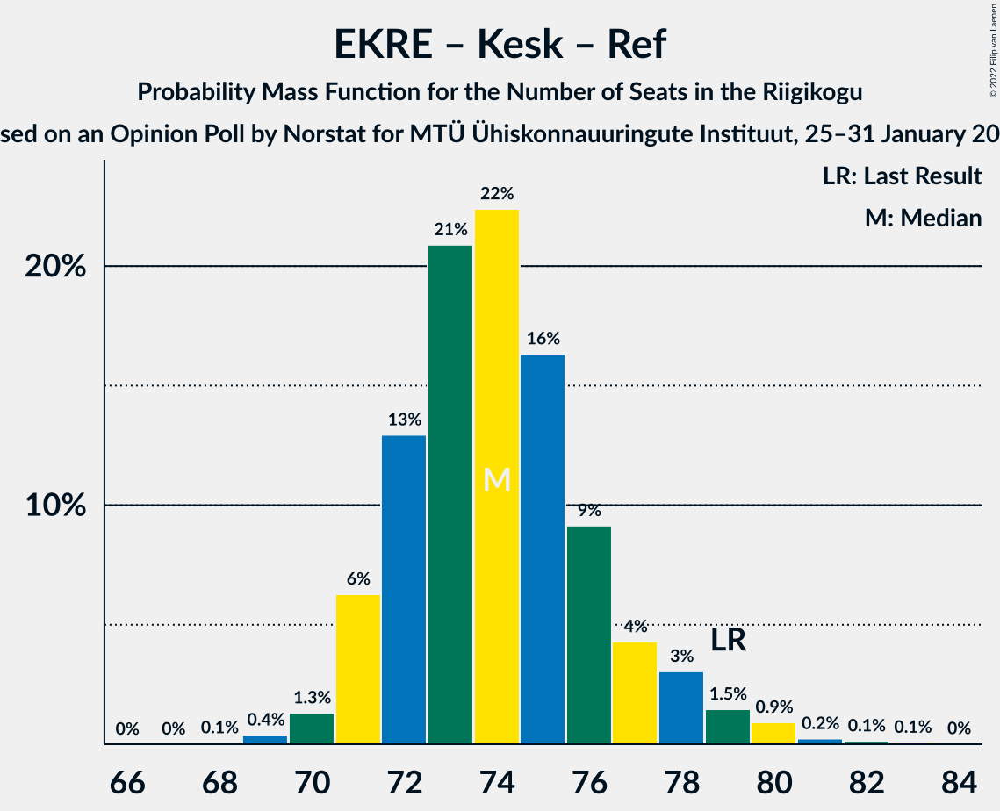

| Number of Seats | Probability | Accumulated | Special Marks |
|:---------------:|:-----------:|:-----------:|:-------------:|
| 68 | 0.1% | 100% |  |
| 69 | 0.4% | 99.9% |  |
| 70 | 1.3% | 99.5% |  |
| 71 | 6% | 98% |  |
| 72 | 13% | 92% |  |
| 73 | 21% | 79% |  |
| 74 | 22% | 58% | Median |
| 75 | 16% | 36% |  |
| 76 | 9% | 19% |  |
| 77 | 4% | 10% |  |
| 78 | 3% | 6% |  |
| 79 | 1.5% | 3% | Last Result |
| 80 | 0.9% | 1.4% |  |
| 81 | 0.2% | 0.5% |  |
| 82 | 0.1% | 0.3% |  |
| 83 | 0.1% | 0.1% |  |
| 84 | 0% | 0% |  |

### Eesti Konservatiivne Rahvaerakond – Eesti Keskerakond – Erakond Isamaa

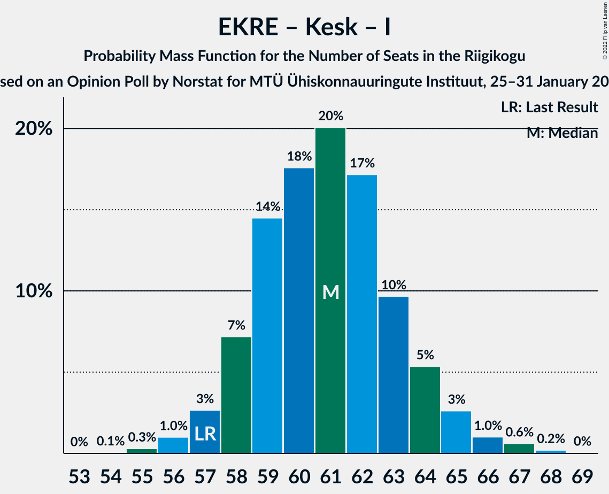

| Number of Seats | Probability | Accumulated | Special Marks |
|:---------------:|:-----------:|:-----------:|:-------------:|
| 54 | 0.1% | 100% |  |
| 55 | 0.3% | 99.9% |  |
| 56 | 1.0% | 99.6% |  |
| 57 | 3% | 98.6% | Last Result |
| 58 | 7% | 96% |  |
| 59 | 14% | 89% |  |
| 60 | 18% | 74% |  |
| 61 | 20% | 57% | Median |
| 62 | 17% | 37% |  |
| 63 | 10% | 19% |  |
| 64 | 5% | 10% |  |
| 65 | 3% | 4% |  |
| 66 | 1.0% | 2% |  |
| 67 | 0.6% | 0.9% |  |
| 68 | 0.2% | 0.2% |  |
| 69 | 0% | 0% |  |

### Eesti Konservatiivne Rahvaerakond – Eesti Keskerakond

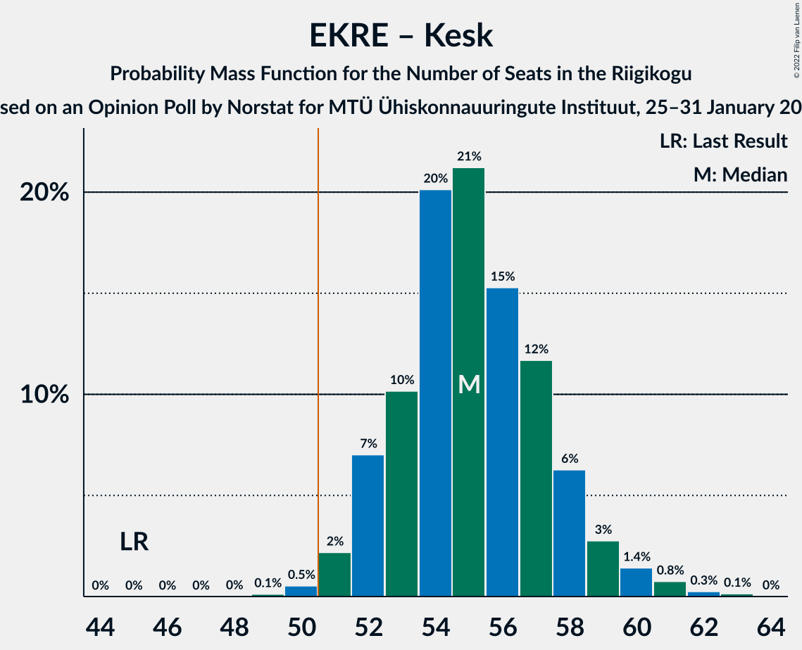

| Number of Seats | Probability | Accumulated | Special Marks |
|:---------------:|:-----------:|:-----------:|:-------------:|
| 45 | 0% | 100% | Last Result |
| 46 | 0% | 100% |  |
| 47 | 0% | 100% |  |
| 48 | 0% | 100% |  |
| 49 | 0.1% | 100% |  |
| 50 | 0.5% | 99.9% |  |
| 51 | 2% | 99.3% | Majority |
| 52 | 7% | 97% |  |
| 53 | 10% | 90% |  |
| 54 | 20% | 80% |  |
| 55 | 21% | 60% | Median |
| 56 | 15% | 39% |  |
| 57 | 12% | 23% |  |
| 58 | 6% | 12% |  |
| 59 | 3% | 5% |  |
| 60 | 1.4% | 3% |  |
| 61 | 0.8% | 1.2% |  |
| 62 | 0.3% | 0.4% |  |
| 63 | 0.1% | 0.2% |  |
| 64 | 0% | 0% |  |

### Eesti Konservatiivne Rahvaerakond – Eesti Reformierakond – Erakond Isamaa

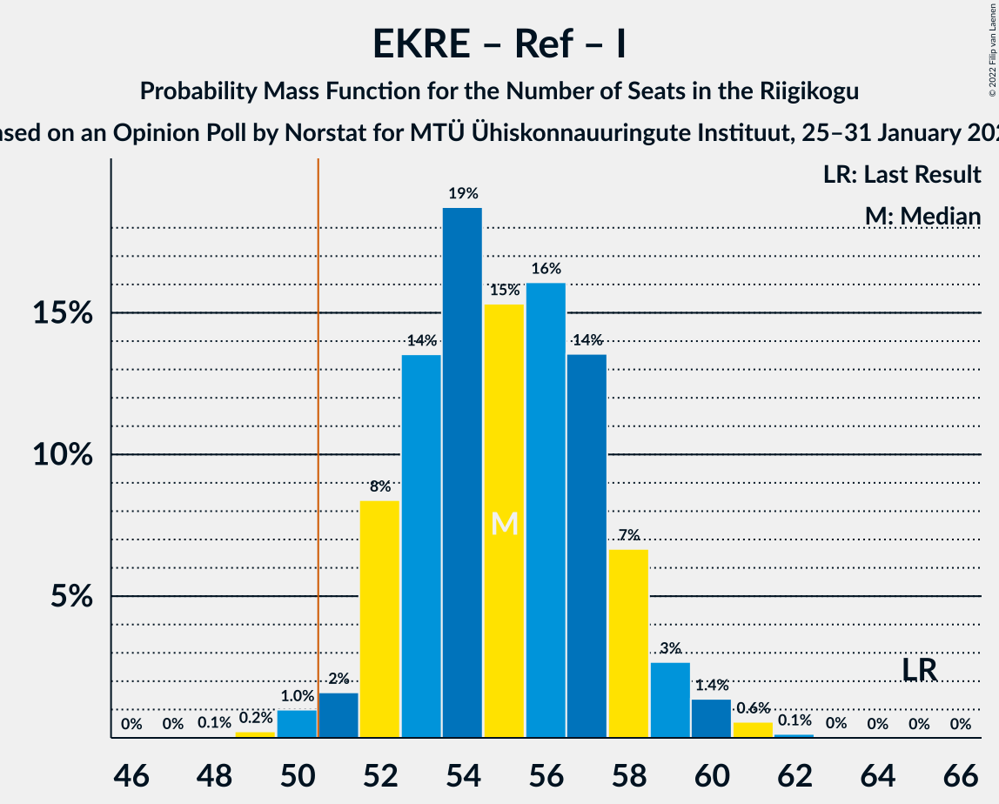

| Number of Seats | Probability | Accumulated | Special Marks |
|:---------------:|:-----------:|:-----------:|:-------------:|
| 48 | 0.1% | 100% |  |
| 49 | 0.2% | 99.9% |  |
| 50 | 1.0% | 99.7% |  |
| 51 | 2% | 98.7% | Majority |
| 52 | 8% | 97% |  |
| 53 | 14% | 89% |  |
| 54 | 19% | 75% |  |
| 55 | 15% | 56% | Median |
| 56 | 16% | 41% |  |
| 57 | 14% | 25% |  |
| 58 | 7% | 11% |  |
| 59 | 3% | 5% |  |
| 60 | 1.4% | 2% |  |
| 61 | 0.6% | 0.8% |  |
| 62 | 0.1% | 0.2% |  |
| 63 | 0% | 0% |  |
| 64 | 0% | 0% |  |
| 65 | 0% | 0% | Last Result |

### Eesti Konservatiivne Rahvaerakond – Eesti Reformierakond

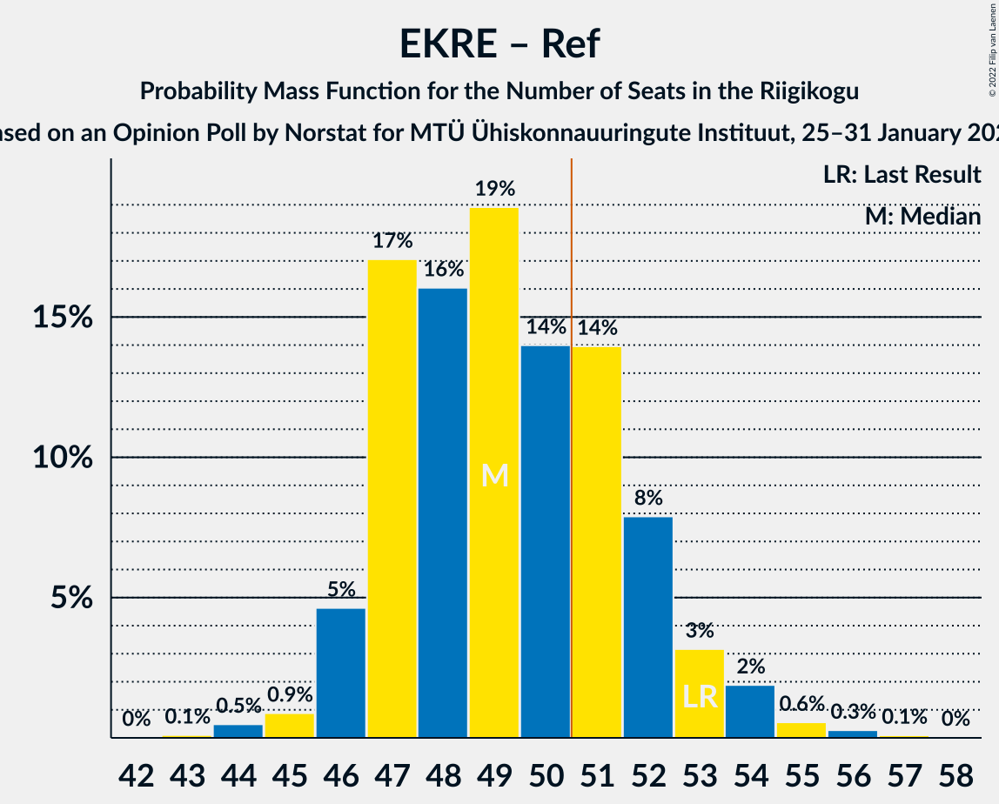

| Number of Seats | Probability | Accumulated | Special Marks |
|:---------------:|:-----------:|:-----------:|:-------------:|
| 43 | 0.1% | 100% |  |
| 44 | 0.5% | 99.9% |  |
| 45 | 0.9% | 99.4% |  |
| 46 | 5% | 98.5% |  |
| 47 | 17% | 94% |  |
| 48 | 16% | 77% |  |
| 49 | 19% | 61% | Median |
| 50 | 14% | 42% |  |
| 51 | 14% | 28% | Majority |
| 52 | 8% | 14% |  |
| 53 | 3% | 6% | Last Result |
| 54 | 2% | 3% |  |
| 55 | 0.6% | 1.0% |  |
| 56 | 0.3% | 0.4% |  |
| 57 | 0.1% | 0.1% |  |
| 58 | 0% | 0% |  |

### Eesti Keskerakond – Eesti Reformierakond

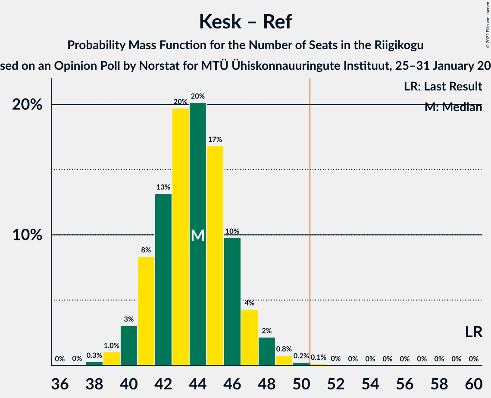

| Number of Seats | Probability | Accumulated | Special Marks |
|:---------------:|:-----------:|:-----------:|:-------------:|
| 38 | 0.3% | 100% |  |
| 39 | 1.0% | 99.7% |  |
| 40 | 3% | 98.7% |  |
| 41 | 8% | 96% |  |
| 42 | 13% | 87% |  |
| 43 | 20% | 74% |  |
| 44 | 20% | 54% | Median |
| 45 | 17% | 34% |  |
| 46 | 10% | 17% |  |
| 47 | 4% | 8% |  |
| 48 | 2% | 3% |  |
| 49 | 0.8% | 1.1% |  |
| 50 | 0.2% | 0.4% |  |
| 51 | 0.1% | 0.2% | Majority |
| 52 | 0% | 0% |  |
| 53 | 0% | 0% |  |
| 54 | 0% | 0% |  |
| 55 | 0% | 0% |  |
| 56 | 0% | 0% |  |
| 57 | 0% | 0% |  |
| 58 | 0% | 0% |  |
| 59 | 0% | 0% |  |
| 60 | 0% | 0% | Last Result |

### Eesti Keskerakond – Erakond Isamaa – Sotsiaaldemokraatlik Erakond

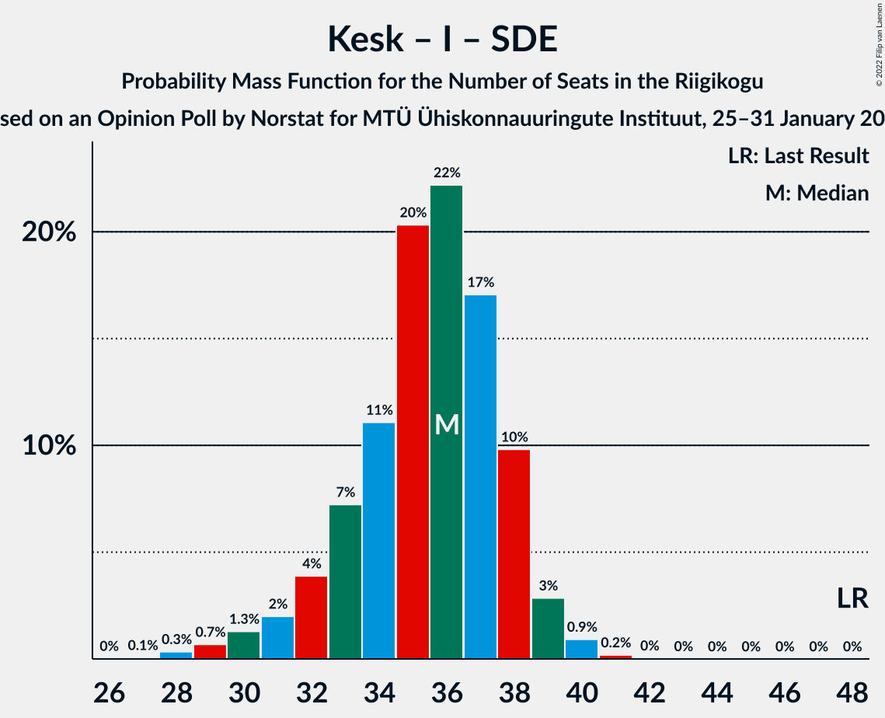

| Number of Seats | Probability | Accumulated | Special Marks |
|:---------------:|:-----------:|:-----------:|:-------------:|
| 27 | 0.1% | 100% |  |
| 28 | 0.3% | 99.9% |  |
| 29 | 0.7% | 99.6% |  |
| 30 | 1.3% | 98.9% |  |
| 31 | 2% | 98% |  |
| 32 | 4% | 96% |  |
| 33 | 7% | 92% |  |
| 34 | 11% | 84% |  |
| 35 | 20% | 73% |  |
| 36 | 22% | 53% | Median |
| 37 | 17% | 31% |  |
| 38 | 10% | 14% |  |
| 39 | 3% | 4% |  |
| 40 | 0.9% | 1.2% |  |
| 41 | 0.2% | 0.2% |  |
| 42 | 0% | 0% |  |
| 43 | 0% | 0% |  |
| 44 | 0% | 0% |  |
| 45 | 0% | 0% |  |
| 46 | 0% | 0% |  |
| 47 | 0% | 0% |  |
| 48 | 0% | 0% | Last Result |

### Eesti Konservatiivne Rahvaerakond – Sotsiaaldemokraatlik Erakond

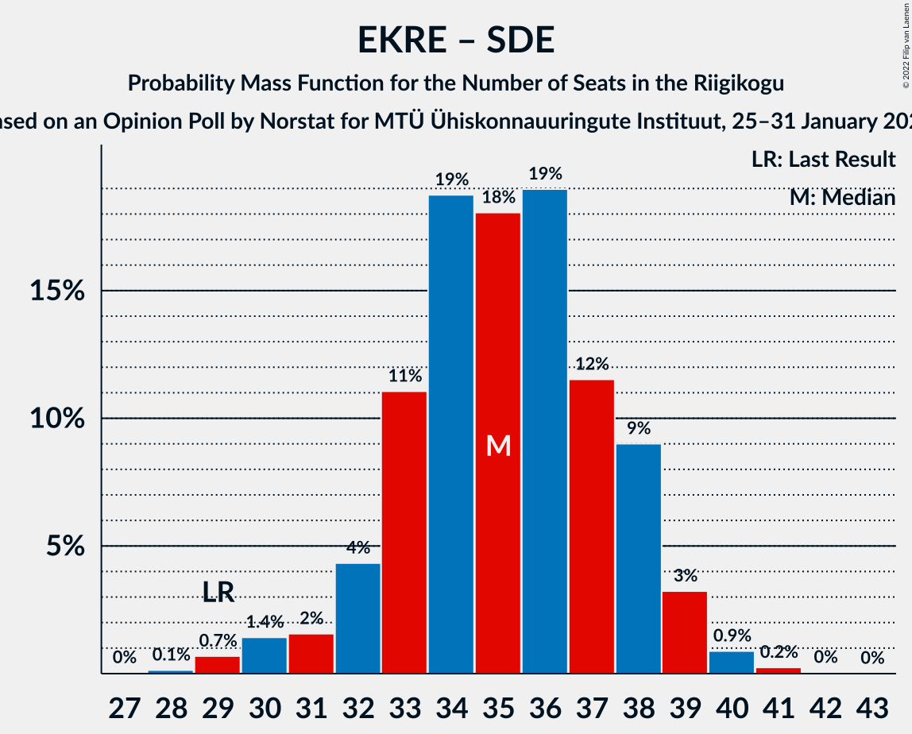

| Number of Seats | Probability | Accumulated | Special Marks |
|:---------------:|:-----------:|:-----------:|:-------------:|
| 28 | 0.1% | 100% |  |
| 29 | 0.7% | 99.8% | Last Result |
| 30 | 1.4% | 99.1% |  |
| 31 | 2% | 98% |  |
| 32 | 4% | 96% |  |
| 33 | 11% | 92% |  |
| 34 | 19% | 81% |  |
| 35 | 18% | 62% | Median |
| 36 | 19% | 44% |  |
| 37 | 12% | 25% |  |
| 38 | 9% | 13% |  |
| 39 | 3% | 4% |  |
| 40 | 0.9% | 1.2% |  |
| 41 | 0.2% | 0.3% |  |
| 42 | 0% | 0.1% |  |
| 43 | 0% | 0% |  |

### Eesti Keskerakond – Sotsiaaldemokraatlik Erakond

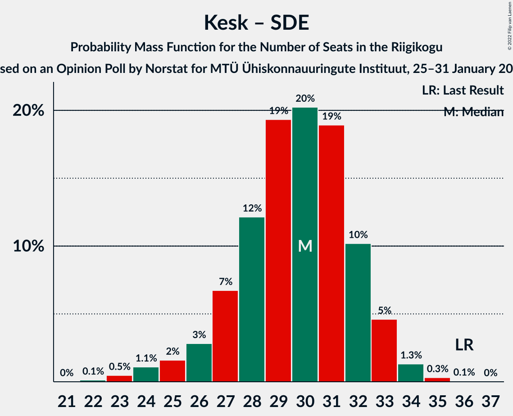

| Number of Seats | Probability | Accumulated | Special Marks |
|:---------------:|:-----------:|:-----------:|:-------------:|
| 22 | 0.1% | 100% |  |
| 23 | 0.5% | 99.9% |  |
| 24 | 1.1% | 99.4% |  |
| 25 | 2% | 98% |  |
| 26 | 3% | 97% |  |
| 27 | 7% | 94% |  |
| 28 | 12% | 87% |  |
| 29 | 19% | 75% |  |
| 30 | 20% | 56% | Median |
| 31 | 19% | 35% |  |
| 32 | 10% | 17% |  |
| 33 | 5% | 6% |  |
| 34 | 1.3% | 2% |  |
| 35 | 0.3% | 0.4% |  |
| 36 | 0.1% | 0.1% | Last Result |
| 37 | 0% | 0% |  |

### Eesti Reformierakond – Erakond Isamaa – Sotsiaaldemokraatlik Erakond

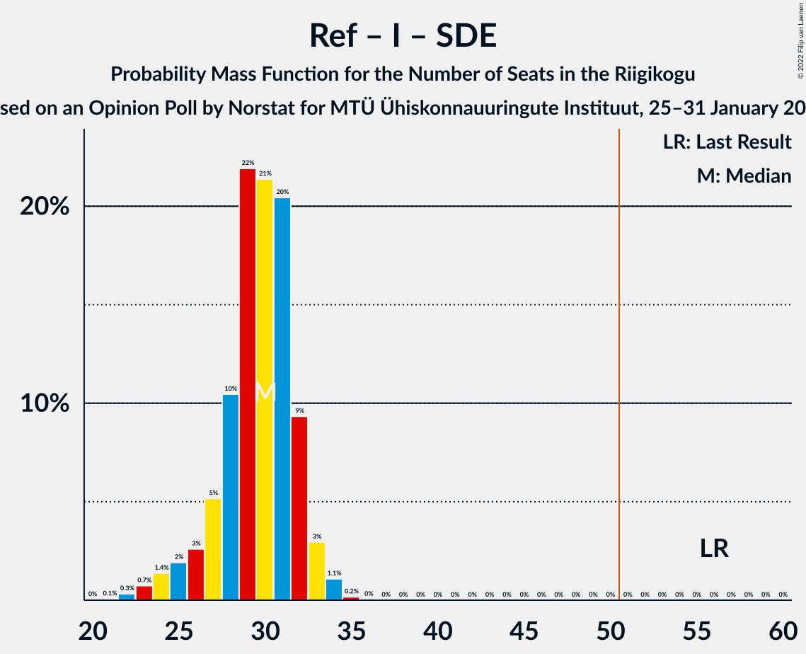

| Number of Seats | Probability | Accumulated | Special Marks |
|:---------------:|:-----------:|:-----------:|:-------------:|
| 21 | 0.1% | 100% |  |
| 22 | 0.3% | 99.9% |  |
| 23 | 0.7% | 99.6% |  |
| 24 | 1.4% | 98.8% |  |
| 25 | 2% | 97% |  |
| 26 | 3% | 96% |  |
| 27 | 5% | 93% |  |
| 28 | 10% | 88% |  |
| 29 | 22% | 77% |  |
| 30 | 21% | 55% | Median |
| 31 | 20% | 34% |  |
| 32 | 9% | 14% |  |
| 33 | 3% | 4% |  |
| 34 | 1.1% | 1.3% |  |
| 35 | 0.2% | 0.2% |  |
| 36 | 0% | 0.1% |  |
| 37 | 0% | 0% |  |
| 38 | 0% | 0% |  |
| 39 | 0% | 0% |  |
| 40 | 0% | 0% |  |
| 41 | 0% | 0% |  |
| 42 | 0% | 0% |  |
| 43 | 0% | 0% |  |
| 44 | 0% | 0% |  |
| 45 | 0% | 0% |  |
| 46 | 0% | 0% |  |
| 47 | 0% | 0% |  |
| 48 | 0% | 0% |  |
| 49 | 0% | 0% |  |
| 50 | 0% | 0% |  |
| 51 | 0% | 0% | Majority |
| 52 | 0% | 0% |  |
| 53 | 0% | 0% |  |
| 54 | 0% | 0% |  |
| 55 | 0% | 0% |  |
| 56 | 0% | 0% | Last Result |

### Eesti Reformierakond – Erakond Isamaa

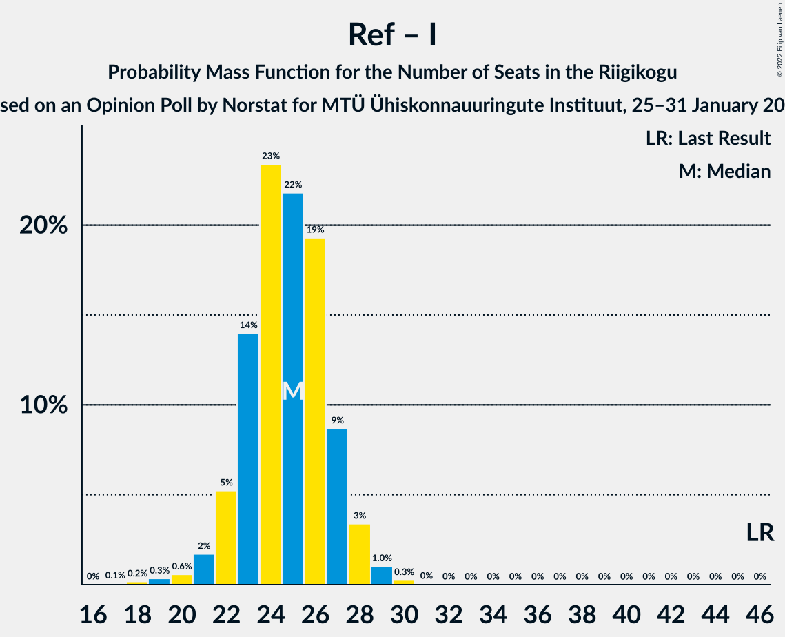

| Number of Seats | Probability | Accumulated | Special Marks |
|:---------------:|:-----------:|:-----------:|:-------------:|
| 17 | 0.1% | 100% |  |
| 18 | 0.2% | 99.9% |  |
| 19 | 0.3% | 99.7% |  |
| 20 | 0.6% | 99.4% |  |
| 21 | 2% | 98.8% |  |
| 22 | 5% | 97% |  |
| 23 | 14% | 92% |  |
| 24 | 23% | 78% |  |
| 25 | 22% | 55% | Median |
| 26 | 19% | 33% |  |
| 27 | 9% | 13% |  |
| 28 | 3% | 5% |  |
| 29 | 1.0% | 1.3% |  |
| 30 | 0.3% | 0.3% |  |
| 31 | 0% | 0.1% |  |
| 32 | 0% | 0% |  |
| 33 | 0% | 0% |  |
| 34 | 0% | 0% |  |
| 35 | 0% | 0% |  |
| 36 | 0% | 0% |  |
| 37 | 0% | 0% |  |
| 38 | 0% | 0% |  |
| 39 | 0% | 0% |  |
| 40 | 0% | 0% |  |
| 41 | 0% | 0% |  |
| 42 | 0% | 0% |  |
| 43 | 0% | 0% |  |
| 44 | 0% | 0% |  |
| 45 | 0% | 0% |  |
| 46 | 0% | 0% | Last Result |

### Eesti Reformierakond – Sotsiaaldemokraatlik Erakond

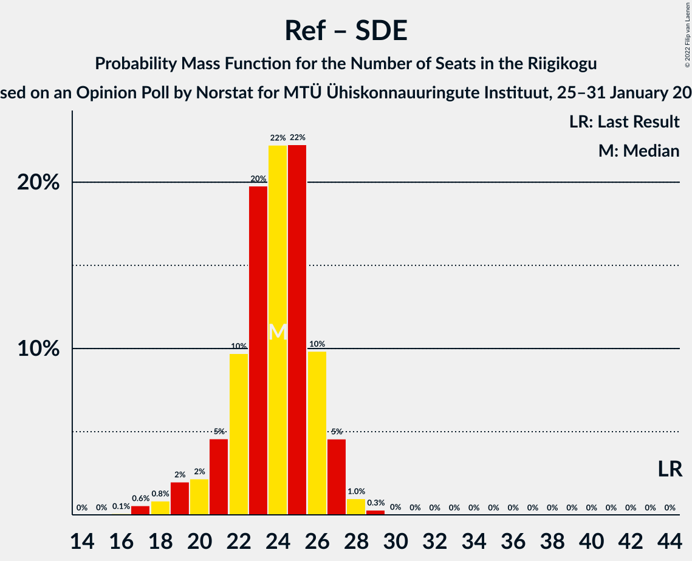

| Number of Seats | Probability | Accumulated | Special Marks |
|:---------------:|:-----------:|:-----------:|:-------------:|
| 16 | 0.1% | 100% |  |
| 17 | 0.6% | 99.9% |  |
| 18 | 0.8% | 99.3% |  |
| 19 | 2% | 98% |  |
| 20 | 2% | 97% |  |
| 21 | 5% | 94% |  |
| 22 | 10% | 90% |  |
| 23 | 20% | 80% |  |
| 24 | 22% | 60% | Median |
| 25 | 22% | 38% |  |
| 26 | 10% | 16% |  |
| 27 | 5% | 6% |  |
| 28 | 1.0% | 1.3% |  |
| 29 | 0.3% | 0.3% |  |
| 30 | 0% | 0% |  |
| 31 | 0% | 0% |  |
| 32 | 0% | 0% |  |
| 33 | 0% | 0% |  |
| 34 | 0% | 0% |  |
| 35 | 0% | 0% |  |
| 36 | 0% | 0% |  |
| 37 | 0% | 0% |  |
| 38 | 0% | 0% |  |
| 39 | 0% | 0% |  |
| 40 | 0% | 0% |  |
| 41 | 0% | 0% |  |
| 42 | 0% | 0% |  |
| 43 | 0% | 0% |  |
| 44 | 0% | 0% | Last Result |

## Technical Information

### Opinion Poll

+ **Polling firm:** Norstat
+ **Commissioner(s):** MTÜ Ühiskonnauuringute Instituut
+ **Fieldwork period:** 25–31 January 2022

### Calculations

+ **Sample size:** 1000
+ **Simulations done:** 1,048,576
+ **Error estimate:** 1.59%

