# Opinion Poll by Norstat for MTÜ Ühiskonnauuringute Instituut, 1–7 March 2022

<a href="#voting-intentions">Voting Intentions</a> | <a href="#seats">Seats</a> | <a href="#coalitions">Coalitions</a> | <a href="#technical-information">Technical Information</a>

## Voting Intentions

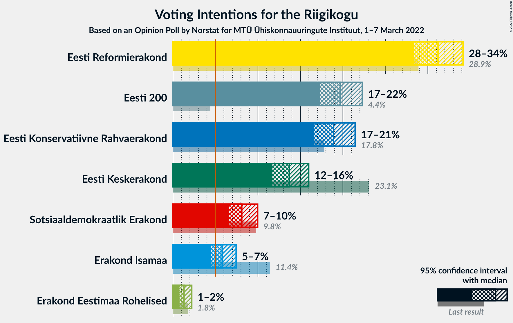

### Confidence Intervals

| Party | Last Result | Poll Result | 80% Confidence Interval | 90% Confidence Interval | 95% Confidence Interval | 99% Confidence Interval |
|:-----:|:-----------:|:-----------:|:-----------------------:|:-----------------------:|:-----------------------:|:-----------------------:|
| Eesti Reformierakond | 28.9% | 31.2% | 29.4–33.1% |28.9–33.7% |28.4–34.1% |27.5–35.1% |
| Eesti 200 | 4.4% | 19.7% | 18.2–21.4% |17.7–21.9% |17.3–22.3% |16.6–23.1% |
| Eesti Konservatiivne Rahvaerakond | 17.8% | 18.9% | 17.4–20.6% |16.9–21.0% |16.6–21.4% |15.9–22.3% |
| Eesti Keskerakond | 23.1% | 13.7% | 12.4–15.2% |12.0–15.6% |11.7–16.0% |11.1–16.7% |
| Sotsiaaldemokraatlik Erakond | 9.8% | 8.1% | 7.1–9.3% |6.8–9.7% |6.6–10.0% |6.1–10.6% |
| Erakond Isamaa | 11.4% | 5.8% | 5.0–6.9% |4.7–7.2% |4.5–7.4% |4.1–8.0% |
| Erakond Eestimaa Rohelised | 1.8% | 1.3% | 0.9–1.9% |0.8–2.1% |0.8–2.2% |0.6–2.5% |

*Note:* The poll result column reflects the actual value used in the calculations. Published results may vary slightly, and in addition be rounded to fewer digits.

## Seats

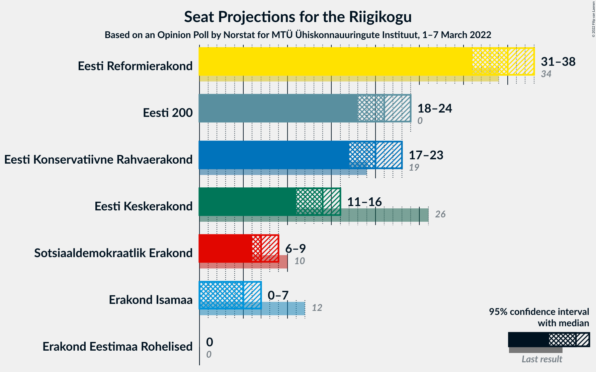

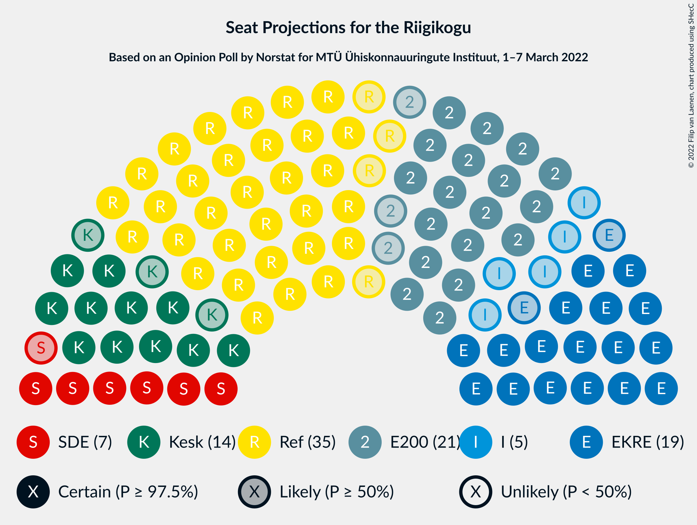

### Confidence Intervals

| Party | Last Result | Median | 80% Confidence Interval | 90% Confidence Interval | 95% Confidence Interval | 99% Confidence Interval |
|:-----:|:-----------:|:------:|:-----------------------:|:-----------------------:|:-----------------------:|:-----------------------:|
| <a href="#eesti-reformierakond">Eesti Reformierakond</a> | 34 | 35 | 32–37 |32–38 |31–38 |30–40 |
| <a href="#eesti-200">Eesti 200</a> | 0 | 21 | 19–23 |18–23 |18–24 |17–25 |
| <a href="#eesti-konservatiivne-rahvaerakond">Eesti Konservatiivne Rahvaerakond</a> | 19 | 20 | 18–22 |17–22 |17–23 |16–24 |
| <a href="#eesti-keskerakond">Eesti Keskerakond</a> | 26 | 14 | 12–15 |12–16 |11–16 |11–17 |
| <a href="#sotsiaaldemokraatlik-erakond">Sotsiaaldemokraatlik Erakond</a> | 10 | 7 | 6–9 |6–9 |6–9 |5–10 |
| <a href="#erakond-isamaa">Erakond Isamaa</a> | 12 | 5 | 0–6 |0–6 |0–7 |0–7 |
| <a href="#erakond-eestimaa-rohelised">Erakond Eestimaa Rohelised</a> | 0 | 0 | 0 |0 |0 |0 |

### Eesti Reformierakond

*For a full overview of the results for this party, see the [Eesti Reformierakond](party-eestireformierakond.html) page.*

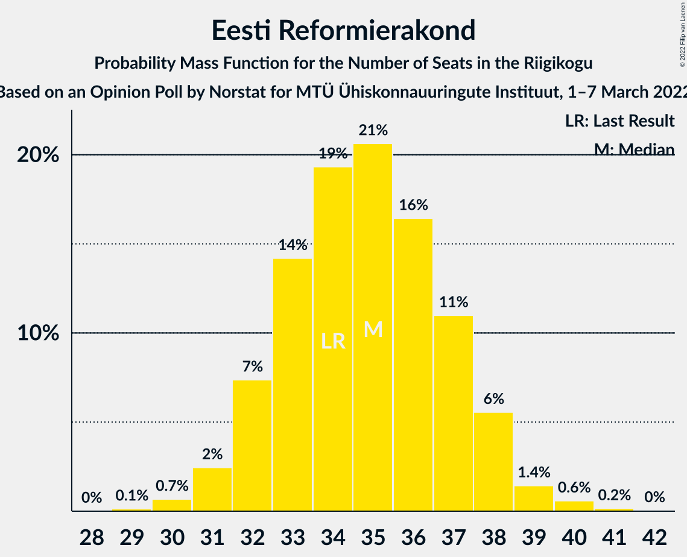

| Number of Seats | Probability | Accumulated | Special Marks |
|:---------------:|:-----------:|:-----------:|:-------------:|
| 29 | 0.1% | 100% |  |
| 30 | 0.7% | 99.9% |  |
| 31 | 2% | 99.2% |  |
| 32 | 7% | 97% |  |
| 33 | 14% | 89% |  |
| 34 | 19% | 75% | Last Result |
| 35 | 21% | 56% | Median |
| 36 | 16% | 35% |  |
| 37 | 11% | 19% |  |
| 38 | 6% | 8% |  |
| 39 | 1.4% | 2% |  |
| 40 | 0.6% | 0.8% |  |
| 41 | 0.2% | 0.2% |  |
| 42 | 0% | 0% |  |

### Eesti 200

*For a full overview of the results for this party, see the [Eesti 200](party-eesti200.html) page.*

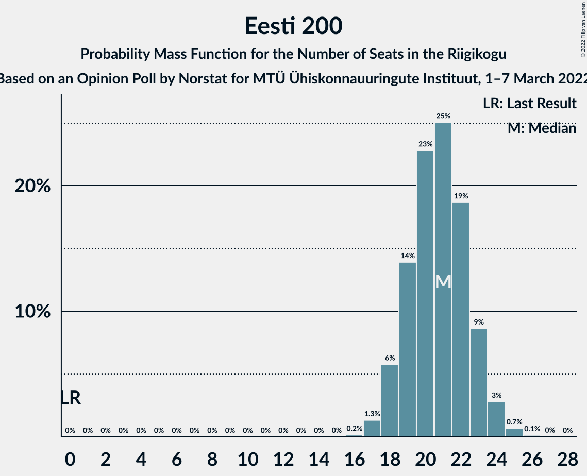

| Number of Seats | Probability | Accumulated | Special Marks |
|:---------------:|:-----------:|:-----------:|:-------------:|
| 0 | 0% | 100% | Last Result |
| 1 | 0% | 100% |  |
| 2 | 0% | 100% |  |
| 3 | 0% | 100% |  |
| 4 | 0% | 100% |  |
| 5 | 0% | 100% |  |
| 6 | 0% | 100% |  |
| 7 | 0% | 100% |  |
| 8 | 0% | 100% |  |
| 9 | 0% | 100% |  |
| 10 | 0% | 100% |  |
| 11 | 0% | 100% |  |
| 12 | 0% | 100% |  |
| 13 | 0% | 100% |  |
| 14 | 0% | 100% |  |
| 15 | 0% | 100% |  |
| 16 | 0.2% | 100% |  |
| 17 | 1.3% | 99.8% |  |
| 18 | 6% | 98.5% |  |
| 19 | 14% | 93% |  |
| 20 | 23% | 79% |  |
| 21 | 25% | 56% | Median |
| 22 | 19% | 31% |  |
| 23 | 9% | 12% |  |
| 24 | 3% | 4% |  |
| 25 | 0.7% | 0.8% |  |
| 26 | 0.1% | 0.2% |  |
| 27 | 0% | 0% |  |

### Eesti Konservatiivne Rahvaerakond

*For a full overview of the results for this party, see the [Eesti Konservatiivne Rahvaerakond](party-eestikonservatiivnerahvaerakond.html) page.*

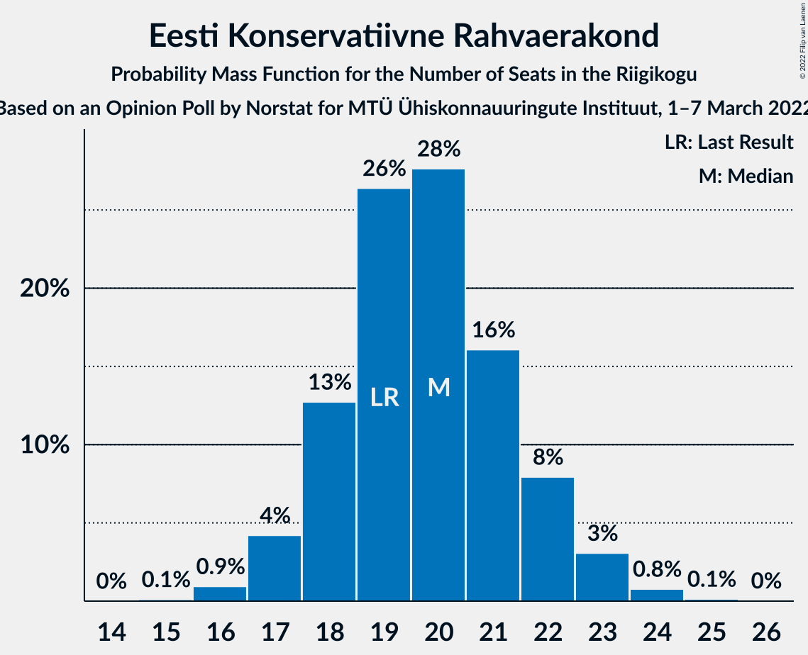

| Number of Seats | Probability | Accumulated | Special Marks |
|:---------------:|:-----------:|:-----------:|:-------------:|
| 15 | 0.1% | 100% |  |
| 16 | 0.9% | 99.9% |  |
| 17 | 4% | 98.9% |  |
| 18 | 13% | 95% |  |
| 19 | 26% | 82% | Last Result |
| 20 | 28% | 56% | Median |
| 21 | 16% | 28% |  |
| 22 | 8% | 12% |  |
| 23 | 3% | 4% |  |
| 24 | 0.8% | 0.9% |  |
| 25 | 0.1% | 0.2% |  |
| 26 | 0% | 0% |  |

### Eesti Keskerakond

*For a full overview of the results for this party, see the [Eesti Keskerakond](party-eestikeskerakond.html) page.*

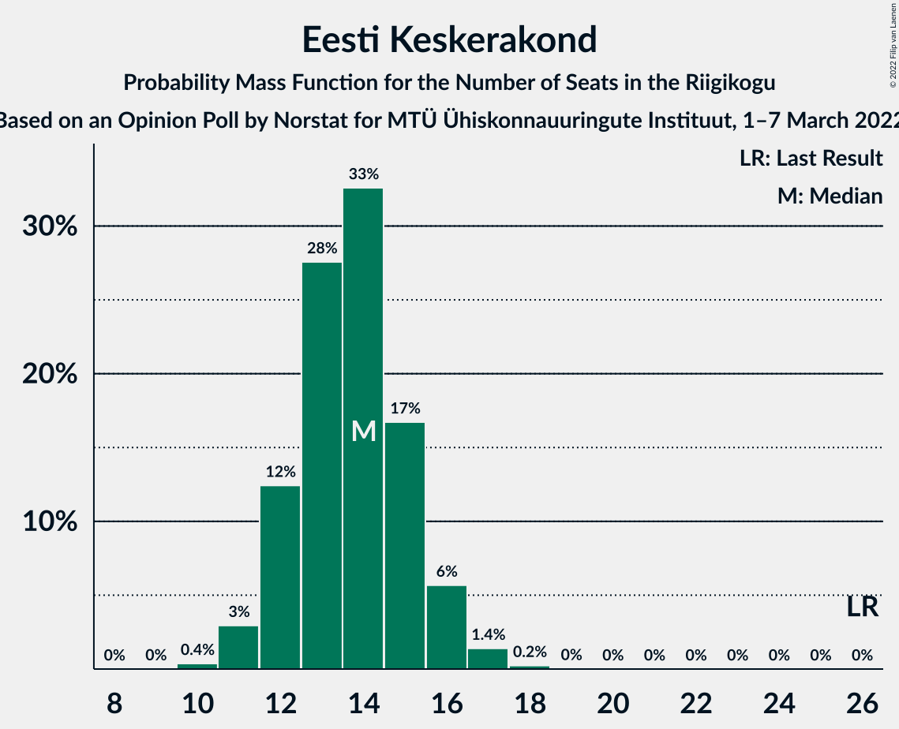

| Number of Seats | Probability | Accumulated | Special Marks |
|:---------------:|:-----------:|:-----------:|:-------------:|
| 10 | 0.4% | 100% |  |
| 11 | 3% | 99.6% |  |
| 12 | 12% | 97% |  |
| 13 | 28% | 84% |  |
| 14 | 33% | 57% | Median |
| 15 | 17% | 24% |  |
| 16 | 6% | 7% |  |
| 17 | 1.4% | 2% |  |
| 18 | 0.2% | 0.3% |  |
| 19 | 0% | 0% |  |
| 20 | 0% | 0% |  |
| 21 | 0% | 0% |  |
| 22 | 0% | 0% |  |
| 23 | 0% | 0% |  |
| 24 | 0% | 0% |  |
| 25 | 0% | 0% |  |
| 26 | 0% | 0% | Last Result |

### Sotsiaaldemokraatlik Erakond

*For a full overview of the results for this party, see the [Sotsiaaldemokraatlik Erakond](party-sotsiaaldemokraatlikerakond.html) page.*

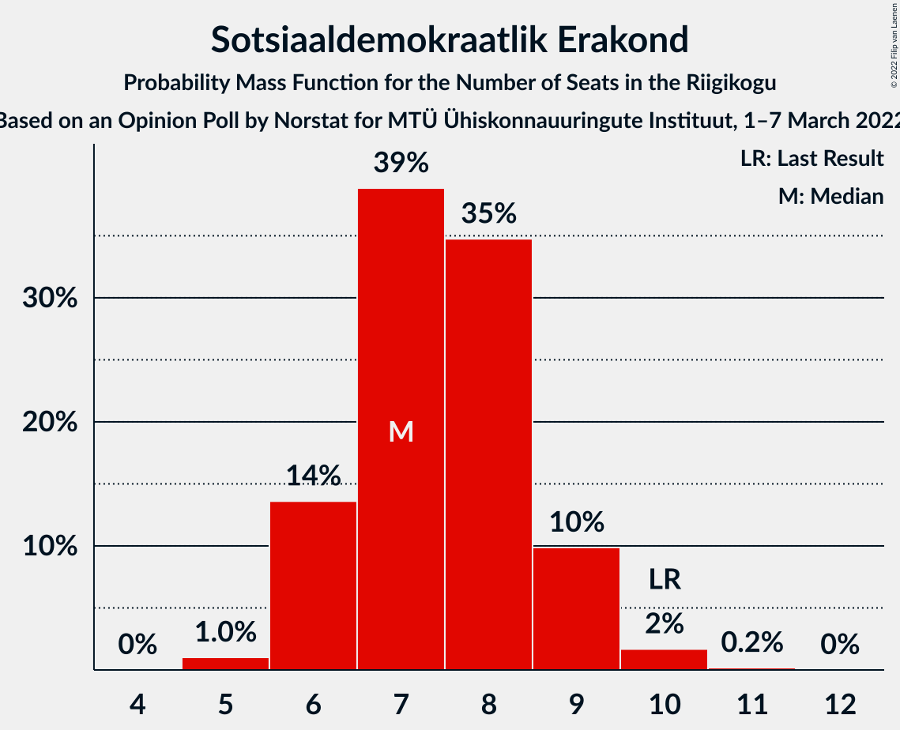

| Number of Seats | Probability | Accumulated | Special Marks |
|:---------------:|:-----------:|:-----------:|:-------------:|
| 5 | 1.0% | 100% |  |
| 6 | 14% | 99.0% |  |
| 7 | 39% | 85% | Median |
| 8 | 35% | 47% |  |
| 9 | 10% | 12% |  |
| 10 | 2% | 2% | Last Result |
| 11 | 0.2% | 0.2% |  |
| 12 | 0% | 0% |  |

### Erakond Isamaa

*For a full overview of the results for this party, see the [Erakond Isamaa](party-erakondisamaa.html) page.*

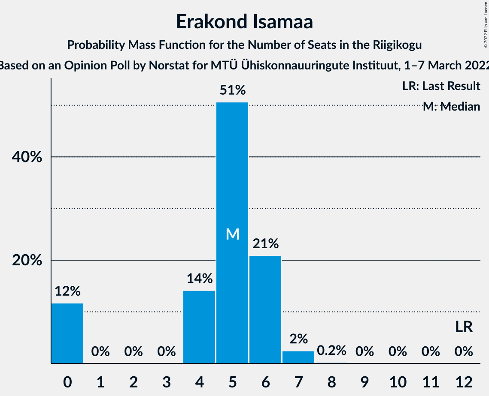

| Number of Seats | Probability | Accumulated | Special Marks |
|:---------------:|:-----------:|:-----------:|:-------------:|
| 0 | 12% | 100% |  |
| 1 | 0% | 88% |  |
| 2 | 0% | 88% |  |
| 3 | 0% | 88% |  |
| 4 | 14% | 88% |  |
| 5 | 51% | 74% | Median |
| 6 | 21% | 24% |  |
| 7 | 2% | 3% |  |
| 8 | 0.2% | 0.2% |  |
| 9 | 0% | 0% |  |
| 10 | 0% | 0% |  |
| 11 | 0% | 0% |  |
| 12 | 0% | 0% | Last Result |

### Erakond Eestimaa Rohelised

*For a full overview of the results for this party, see the [Erakond Eestimaa Rohelised](party-erakondeestimaarohelised.html) page.*

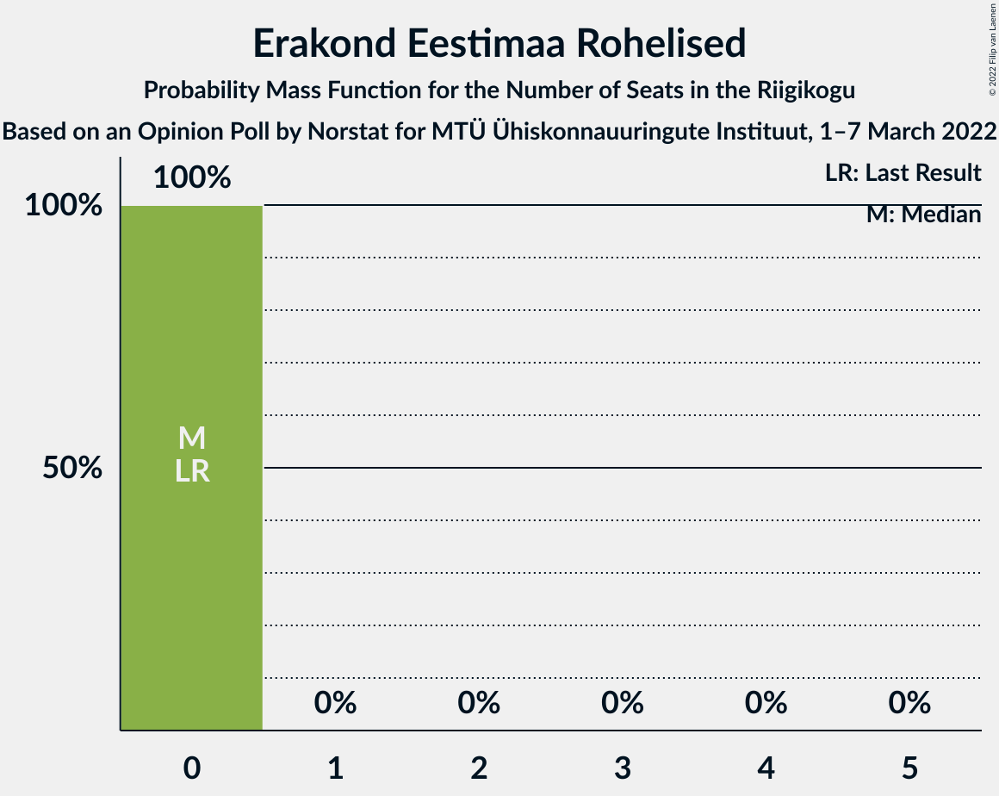

| Number of Seats | Probability | Accumulated | Special Marks |
|:---------------:|:-----------:|:-----------:|:-------------:|
| 0 | 100% | 100% | Last Result, Median |

## Coalitions

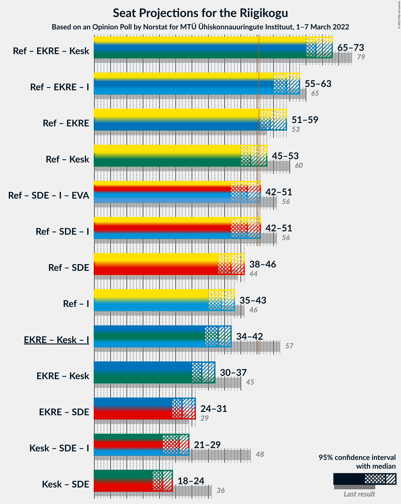

### Confidence Intervals

| Coalition | Last Result | Median | Majority? | 80% Confidence Interval | 90% Confidence Interval | 95% Confidence Interval | 99% Confidence Interval |
|:---------:|:-----------:|:------:|:---------:|:-----------------------:|:-----------------------:|:-----------------------:|:-----------------------:|
| Eesti Reformierakond – Eesti Konservatiivne Rahvaerakond – Eesti Keskerakond | 79 | 68 | 100% | 66–71 | 65–72 | 65–73 | 63–74 |
| Eesti Reformierakond – Eesti Konservatiivne Rahvaerakond – Erakond Isamaa | 65 | 59 | 100% | 57–61 | 56–62 | 55–63 | 54–64 |
| Eesti Reformierakond – Eesti Konservatiivne Rahvaerakond | 53 | 54 | 98% | 52–57 | 51–58 | 51–59 | 50–60 |
| Eesti Reformierakond – Eesti Keskerakond | 60 | 48 | 16% | 46–51 | 45–52 | 45–53 | 44–54 |
| Eesti Reformierakond – Sotsiaaldemokraatlik Erakond – Erakond Isamaa | 56 | 47 | 3% | 44–49 | 43–50 | 42–51 | 41–52 |
| Eesti Reformierakond – Sotsiaaldemokraatlik Erakond | 44 | 42 | 0% | 40–45 | 39–46 | 38–46 | 37–48 |
| Eesti Reformierakond – Erakond Isamaa | 46 | 39 | 0% | 37–42 | 36–43 | 35–43 | 33–44 |
| Eesti Konservatiivne Rahvaerakond – Eesti Keskerakond – Erakond Isamaa | 57 | 38 | 0% | 35–41 | 34–41 | 34–42 | 32–43 |
| Eesti Konservatiivne Rahvaerakond – Eesti Keskerakond | 45 | 33 | 0% | 31–36 | 31–36 | 30–37 | 29–38 |
| Eesti Konservatiivne Rahvaerakond – Sotsiaaldemokraatlik Erakond | 29 | 27 | 0% | 25–29 | 24–30 | 24–31 | 23–32 |
| Eesti Keskerakond – Sotsiaaldemokraatlik Erakond – Erakond Isamaa | 48 | 26 | 0% | 23–28 | 22–29 | 21–29 | 20–31 |
| Eesti Keskerakond – Sotsiaaldemokraatlik Erakond | 36 | 21 | 0% | 19–23 | 19–24 | 18–24 | 17–25 |

### Eesti Reformierakond – Eesti Konservatiivne Rahvaerakond – Eesti Keskerakond

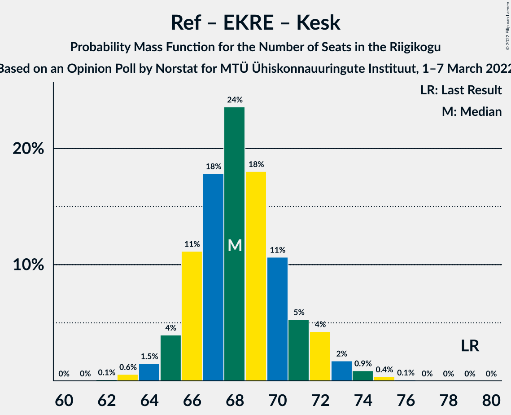

| Number of Seats | Probability | Accumulated | Special Marks |
|:---------------:|:-----------:|:-----------:|:-------------:|
| 62 | 0.1% | 100% |  |
| 63 | 0.6% | 99.9% |  |
| 64 | 1.5% | 99.3% |  |
| 65 | 4% | 98% |  |
| 66 | 11% | 94% |  |
| 67 | 18% | 83% |  |
| 68 | 24% | 65% |  |
| 69 | 18% | 41% | Median |
| 70 | 11% | 23% |  |
| 71 | 5% | 13% |  |
| 72 | 4% | 7% |  |
| 73 | 2% | 3% |  |
| 74 | 0.9% | 1.3% |  |
| 75 | 0.4% | 0.5% |  |
| 76 | 0.1% | 0.1% |  |
| 77 | 0% | 0% |  |
| 78 | 0% | 0% |  |
| 79 | 0% | 0% | Last Result |

### Eesti Reformierakond – Eesti Konservatiivne Rahvaerakond – Erakond Isamaa

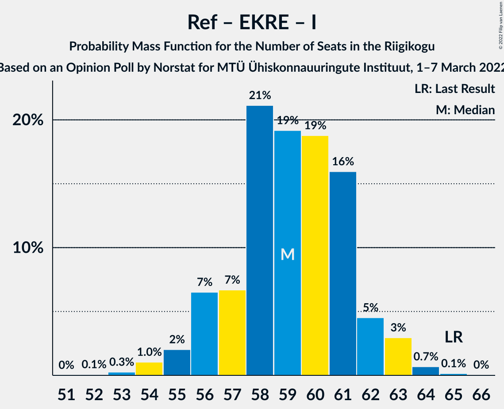

| Number of Seats | Probability | Accumulated | Special Marks |
|:---------------:|:-----------:|:-----------:|:-------------:|
| 52 | 0.1% | 100% |  |
| 53 | 0.3% | 99.9% |  |
| 54 | 1.0% | 99.7% |  |
| 55 | 2% | 98.6% |  |
| 56 | 7% | 97% |  |
| 57 | 7% | 90% |  |
| 58 | 21% | 83% |  |
| 59 | 19% | 62% |  |
| 60 | 19% | 43% | Median |
| 61 | 16% | 24% |  |
| 62 | 5% | 8% |  |
| 63 | 3% | 4% |  |
| 64 | 0.7% | 0.9% |  |
| 65 | 0.1% | 0.2% | Last Result |
| 66 | 0% | 0% |  |

### Eesti Reformierakond – Eesti Konservatiivne Rahvaerakond

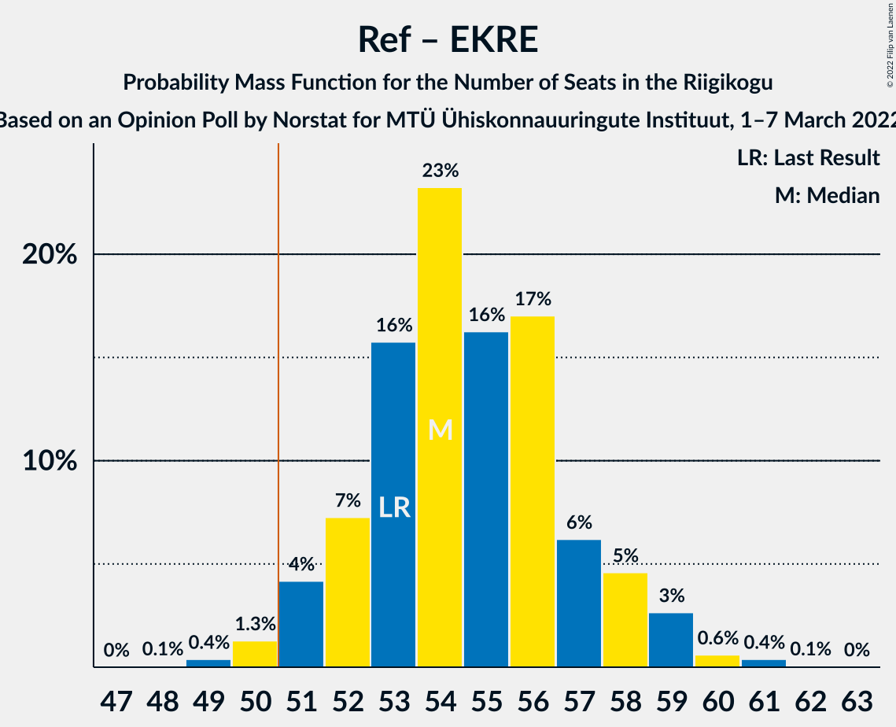

| Number of Seats | Probability | Accumulated | Special Marks |
|:---------------:|:-----------:|:-----------:|:-------------:|
| 48 | 0.1% | 100% |  |
| 49 | 0.4% | 99.9% |  |
| 50 | 1.3% | 99.5% |  |
| 51 | 4% | 98% | Majority |
| 52 | 7% | 94% |  |
| 53 | 16% | 87% | Last Result |
| 54 | 23% | 71% |  |
| 55 | 16% | 48% | Median |
| 56 | 17% | 32% |  |
| 57 | 6% | 15% |  |
| 58 | 5% | 8% |  |
| 59 | 3% | 4% |  |
| 60 | 0.6% | 1.1% |  |
| 61 | 0.4% | 0.5% |  |
| 62 | 0.1% | 0.1% |  |
| 63 | 0% | 0% |  |

### Eesti Reformierakond – Eesti Keskerakond

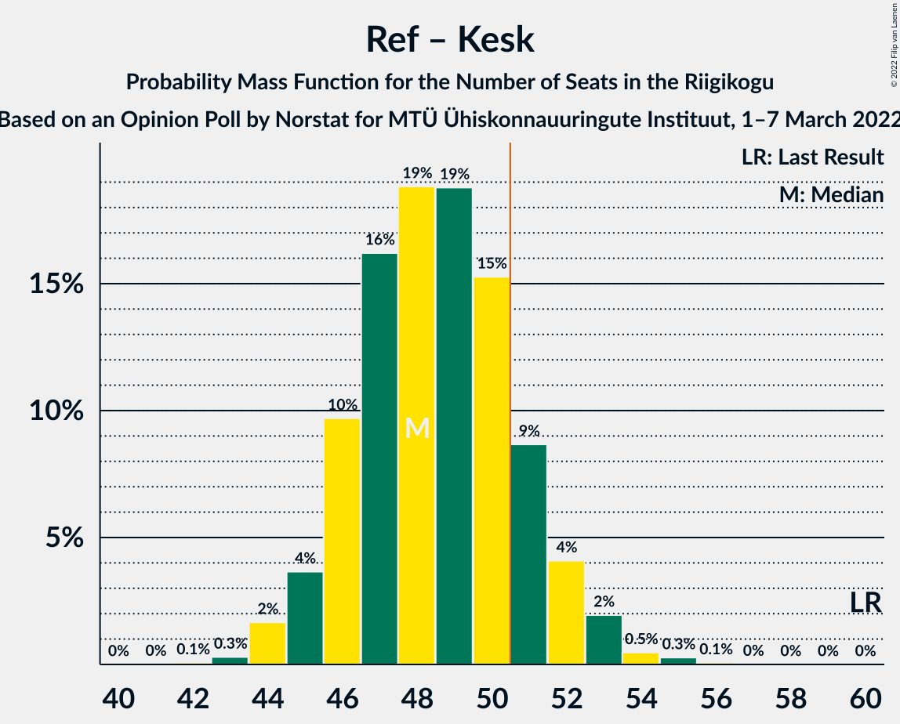

| Number of Seats | Probability | Accumulated | Special Marks |
|:---------------:|:-----------:|:-----------:|:-------------:|
| 42 | 0.1% | 100% |  |
| 43 | 0.3% | 99.9% |  |
| 44 | 2% | 99.6% |  |
| 45 | 4% | 98% |  |
| 46 | 10% | 94% |  |
| 47 | 16% | 85% |  |
| 48 | 19% | 68% |  |
| 49 | 19% | 50% | Median |
| 50 | 15% | 31% |  |
| 51 | 9% | 16% | Majority |
| 52 | 4% | 7% |  |
| 53 | 2% | 3% |  |
| 54 | 0.5% | 0.8% |  |
| 55 | 0.3% | 0.4% |  |
| 56 | 0.1% | 0.1% |  |
| 57 | 0% | 0% |  |
| 58 | 0% | 0% |  |
| 59 | 0% | 0% |  |
| 60 | 0% | 0% | Last Result |

### Eesti Reformierakond – Sotsiaaldemokraatlik Erakond – Erakond Isamaa

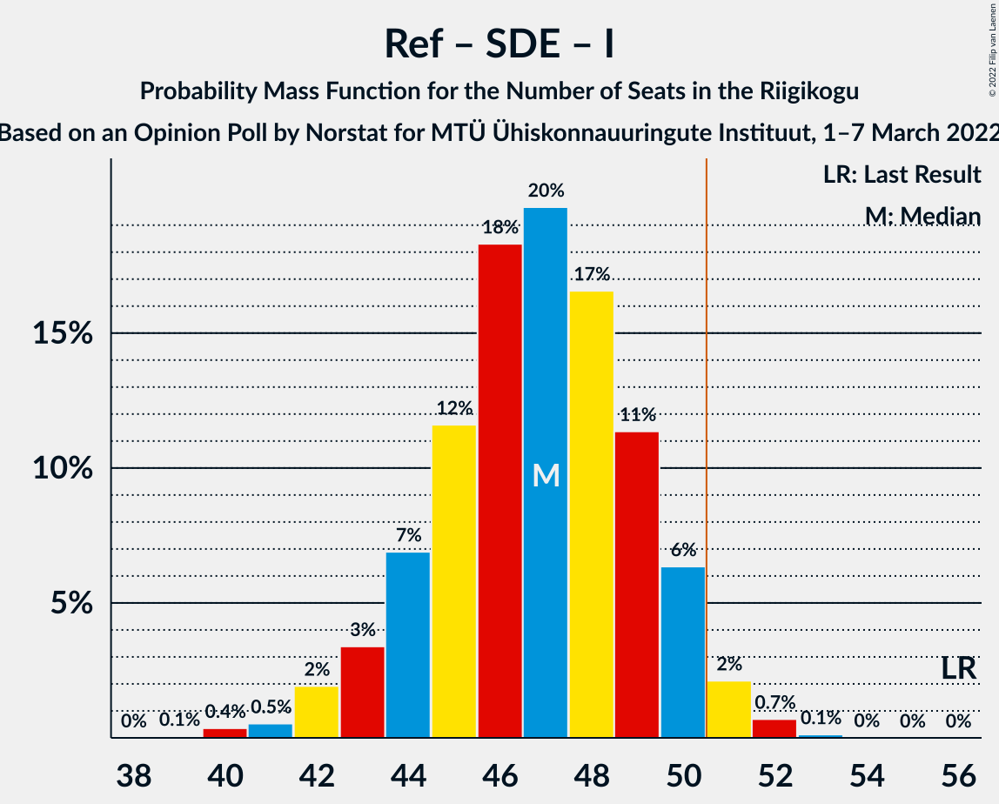

| Number of Seats | Probability | Accumulated | Special Marks |
|:---------------:|:-----------:|:-----------:|:-------------:|
| 39 | 0.1% | 100% |  |
| 40 | 0.4% | 99.9% |  |
| 41 | 0.5% | 99.6% |  |
| 42 | 2% | 99.0% |  |
| 43 | 3% | 97% |  |
| 44 | 7% | 94% |  |
| 45 | 12% | 87% |  |
| 46 | 18% | 75% |  |
| 47 | 20% | 57% | Median |
| 48 | 17% | 37% |  |
| 49 | 11% | 21% |  |
| 50 | 6% | 9% |  |
| 51 | 2% | 3% | Majority |
| 52 | 0.7% | 0.8% |  |
| 53 | 0.1% | 0.1% |  |
| 54 | 0% | 0% |  |
| 55 | 0% | 0% |  |
| 56 | 0% | 0% | Last Result |

### Eesti Reformierakond – Sotsiaaldemokraatlik Erakond

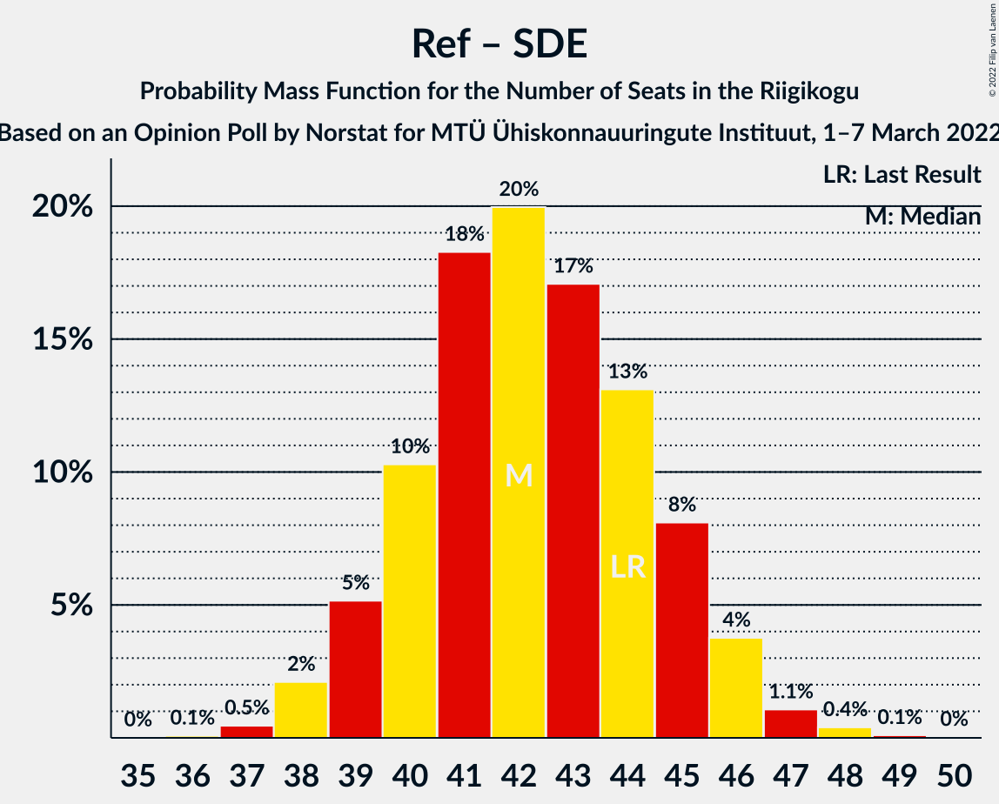

| Number of Seats | Probability | Accumulated | Special Marks |
|:---------------:|:-----------:|:-----------:|:-------------:|
| 36 | 0.1% | 100% |  |
| 37 | 0.5% | 99.9% |  |
| 38 | 2% | 99.4% |  |
| 39 | 5% | 97% |  |
| 40 | 10% | 92% |  |
| 41 | 18% | 82% |  |
| 42 | 20% | 64% | Median |
| 43 | 17% | 44% |  |
| 44 | 13% | 27% | Last Result |
| 45 | 8% | 13% |  |
| 46 | 4% | 5% |  |
| 47 | 1.1% | 2% |  |
| 48 | 0.4% | 0.5% |  |
| 49 | 0.1% | 0.1% |  |
| 50 | 0% | 0% |  |

### Eesti Reformierakond – Erakond Isamaa

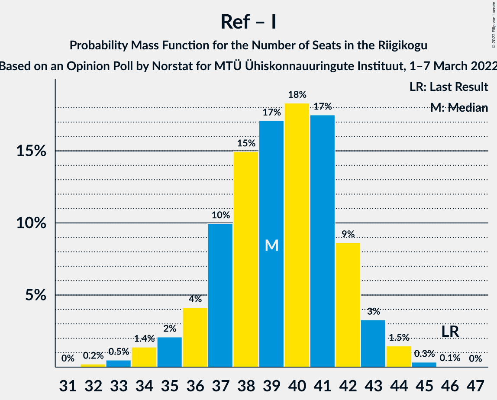

| Number of Seats | Probability | Accumulated | Special Marks |
|:---------------:|:-----------:|:-----------:|:-------------:|
| 32 | 0.2% | 100% |  |
| 33 | 0.5% | 99.7% |  |
| 34 | 1.4% | 99.3% |  |
| 35 | 2% | 98% |  |
| 36 | 4% | 96% |  |
| 37 | 10% | 92% |  |
| 38 | 15% | 82% |  |
| 39 | 17% | 67% |  |
| 40 | 18% | 50% | Median |
| 41 | 17% | 31% |  |
| 42 | 9% | 14% |  |
| 43 | 3% | 5% |  |
| 44 | 1.5% | 2% |  |
| 45 | 0.3% | 0.4% |  |
| 46 | 0.1% | 0.1% | Last Result |
| 47 | 0% | 0% |  |

### Eesti Konservatiivne Rahvaerakond – Eesti Keskerakond – Erakond Isamaa

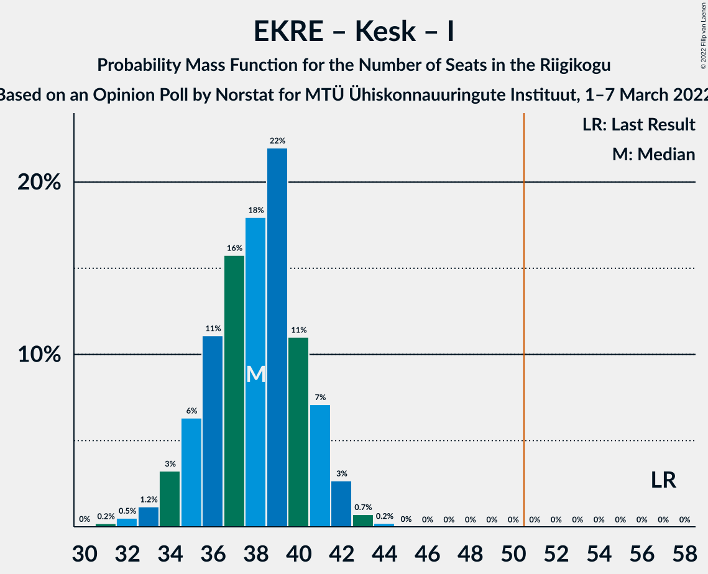

| Number of Seats | Probability | Accumulated | Special Marks |
|:---------------:|:-----------:|:-----------:|:-------------:|
| 31 | 0.2% | 100% |  |
| 32 | 0.5% | 99.8% |  |
| 33 | 1.2% | 99.3% |  |
| 34 | 3% | 98% |  |
| 35 | 6% | 95% |  |
| 36 | 11% | 89% |  |
| 37 | 16% | 77% |  |
| 38 | 18% | 62% |  |
| 39 | 22% | 44% | Median |
| 40 | 11% | 22% |  |
| 41 | 7% | 11% |  |
| 42 | 3% | 4% |  |
| 43 | 0.7% | 1.0% |  |
| 44 | 0.2% | 0.2% |  |
| 45 | 0% | 0% |  |
| 46 | 0% | 0% |  |
| 47 | 0% | 0% |  |
| 48 | 0% | 0% |  |
| 49 | 0% | 0% |  |
| 50 | 0% | 0% |  |
| 51 | 0% | 0% | Majority |
| 52 | 0% | 0% |  |
| 53 | 0% | 0% |  |
| 54 | 0% | 0% |  |
| 55 | 0% | 0% |  |
| 56 | 0% | 0% |  |
| 57 | 0% | 0% | Last Result |

### Eesti Konservatiivne Rahvaerakond – Eesti Keskerakond

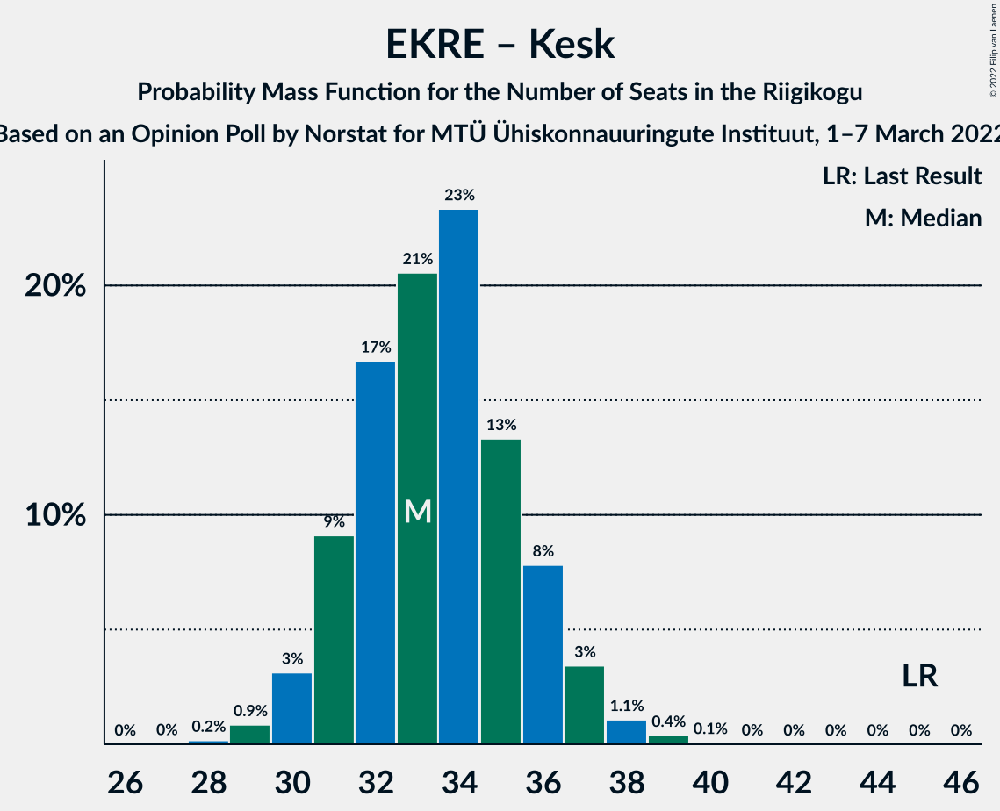

| Number of Seats | Probability | Accumulated | Special Marks |
|:---------------:|:-----------:|:-----------:|:-------------:|
| 28 | 0.2% | 100% |  |
| 29 | 0.9% | 99.8% |  |
| 30 | 3% | 98.9% |  |
| 31 | 9% | 96% |  |
| 32 | 17% | 87% |  |
| 33 | 21% | 70% |  |
| 34 | 23% | 49% | Median |
| 35 | 13% | 26% |  |
| 36 | 8% | 13% |  |
| 37 | 3% | 5% |  |
| 38 | 1.1% | 2% |  |
| 39 | 0.4% | 0.5% |  |
| 40 | 0.1% | 0.1% |  |
| 41 | 0% | 0% |  |
| 42 | 0% | 0% |  |
| 43 | 0% | 0% |  |
| 44 | 0% | 0% |  |
| 45 | 0% | 0% | Last Result |

### Eesti Konservatiivne Rahvaerakond – Sotsiaaldemokraatlik Erakond

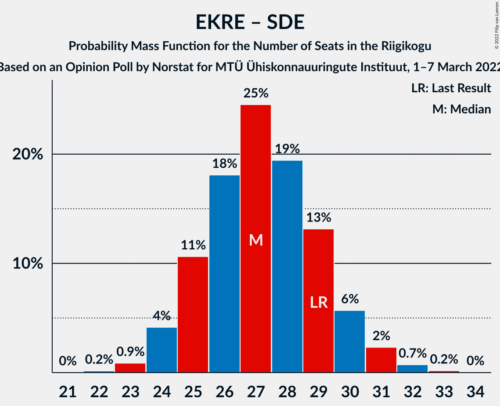

| Number of Seats | Probability | Accumulated | Special Marks |
|:---------------:|:-----------:|:-----------:|:-------------:|
| 22 | 0.2% | 100% |  |
| 23 | 0.9% | 99.8% |  |
| 24 | 4% | 99.0% |  |
| 25 | 11% | 95% |  |
| 26 | 18% | 84% |  |
| 27 | 25% | 66% | Median |
| 28 | 19% | 42% |  |
| 29 | 13% | 22% | Last Result |
| 30 | 6% | 9% |  |
| 31 | 2% | 3% |  |
| 32 | 0.7% | 0.9% |  |
| 33 | 0.2% | 0.2% |  |
| 34 | 0% | 0% |  |

### Eesti Keskerakond – Sotsiaaldemokraatlik Erakond – Erakond Isamaa

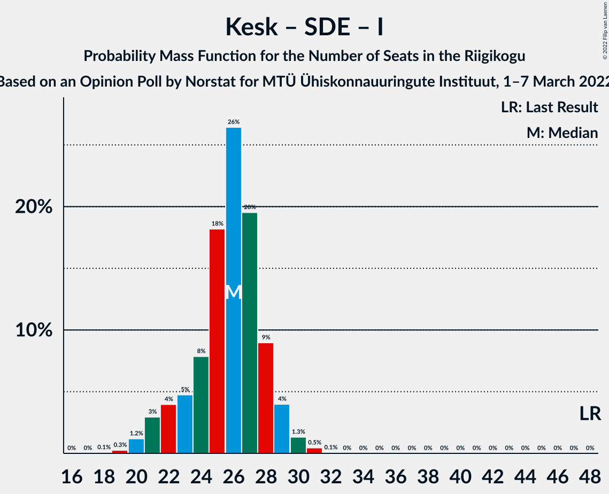

| Number of Seats | Probability | Accumulated | Special Marks |
|:---------------:|:-----------:|:-----------:|:-------------:|
| 18 | 0.1% | 100% |  |
| 19 | 0.3% | 99.9% |  |
| 20 | 1.2% | 99.7% |  |
| 21 | 3% | 98% |  |
| 22 | 4% | 96% |  |
| 23 | 5% | 92% |  |
| 24 | 8% | 87% |  |
| 25 | 18% | 79% |  |
| 26 | 26% | 61% | Median |
| 27 | 20% | 34% |  |
| 28 | 9% | 15% |  |
| 29 | 4% | 6% |  |
| 30 | 1.3% | 2% |  |
| 31 | 0.5% | 0.5% |  |
| 32 | 0.1% | 0.1% |  |
| 33 | 0% | 0% |  |
| 34 | 0% | 0% |  |
| 35 | 0% | 0% |  |
| 36 | 0% | 0% |  |
| 37 | 0% | 0% |  |
| 38 | 0% | 0% |  |
| 39 | 0% | 0% |  |
| 40 | 0% | 0% |  |
| 41 | 0% | 0% |  |
| 42 | 0% | 0% |  |
| 43 | 0% | 0% |  |
| 44 | 0% | 0% |  |
| 45 | 0% | 0% |  |
| 46 | 0% | 0% |  |
| 47 | 0% | 0% |  |
| 48 | 0% | 0% | Last Result |

### Eesti Keskerakond – Sotsiaaldemokraatlik Erakond

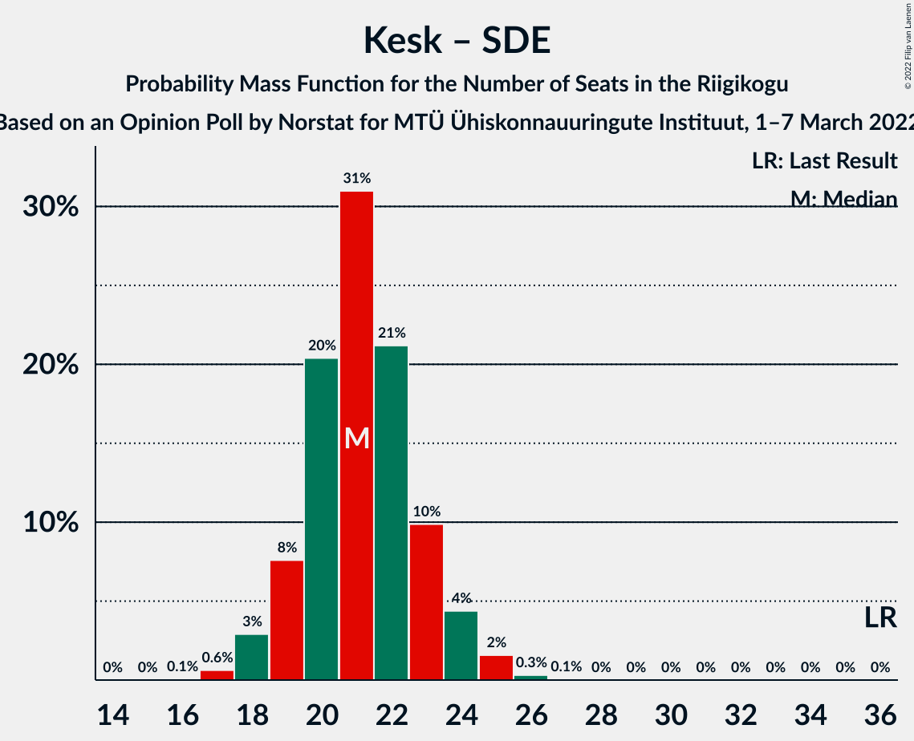

| Number of Seats | Probability | Accumulated | Special Marks |
|:---------------:|:-----------:|:-----------:|:-------------:|
| 16 | 0.1% | 100% |  |
| 17 | 0.6% | 99.9% |  |
| 18 | 3% | 99.3% |  |
| 19 | 8% | 96% |  |
| 20 | 20% | 89% |  |
| 21 | 31% | 68% | Median |
| 22 | 21% | 37% |  |
| 23 | 10% | 16% |  |
| 24 | 4% | 6% |  |
| 25 | 2% | 2% |  |
| 26 | 0.3% | 0.4% |  |
| 27 | 0.1% | 0.1% |  |
| 28 | 0% | 0% |  |
| 29 | 0% | 0% |  |
| 30 | 0% | 0% |  |
| 31 | 0% | 0% |  |
| 32 | 0% | 0% |  |
| 33 | 0% | 0% |  |
| 34 | 0% | 0% |  |
| 35 | 0% | 0% |  |
| 36 | 0% | 0% | Last Result |

## Technical Information

### Opinion Poll

+ **Polling firm:** Norstat
+ **Commissioner(s):** MTÜ Ühiskonnauuringute Instituut
+ **Fieldwork period:** 1–7 March 2022

### Calculations

+ **Sample size:** 1000
+ **Simulations done:** 1,048,576
+ **Error estimate:** 0.78%

