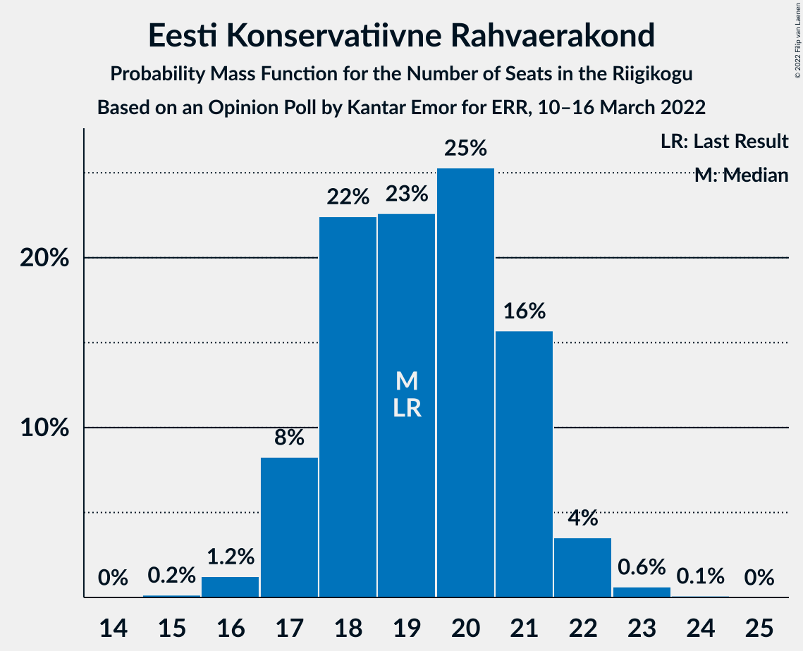

# Opinion Poll by Kantar Emor for ERR, 10–16 March 2022

<a href="#voting-intentions">Voting Intentions</a> | <a href="#seats">Seats</a> | <a href="#coalitions">Coalitions</a> | <a href="#technical-information">Technical Information</a>

## Voting Intentions

### Confidence Intervals

| Party | Last Result | Poll Result | 80% Confidence Interval | 90% Confidence Interval | 95% Confidence Interval | 99% Confidence Interval |
|:-----:|:-----------:|:-----------:|:-----------------------:|:-----------------------:|:-----------------------:|:-----------------------:|
| Eesti Reformierakond | 28.9% | 26.2% | 24.7–27.8% |24.2–28.3% |23.9–28.7% |23.2–29.5% |
| Eesti 200 | 4.4% | 19.2% | 17.8–20.6% |17.4–21.0% |17.1–21.4% |16.4–22.1% |
| Eesti Keskerakond | 23.1% | 18.1% | 16.8–19.6% |16.4–20.0% |16.1–20.3% |15.5–21.1% |
| Eesti Konservatiivne Rahvaerakond | 17.8% | 18.1% | 16.8–19.6% |16.4–20.0% |16.1–20.3% |15.5–21.1% |
| Sotsiaaldemokraatlik Erakond | 9.8% | 8.1% | 7.2–9.1% |6.9–9.4% |6.7–9.7% |6.3–10.2% |
| Erakond Isamaa | 11.4% | 6.0% | 5.3–7.0% |5.0–7.3% |4.9–7.5% |4.5–8.0% |
| Erakond Eestimaa Rohelised | 1.8% | 4.0% | 3.4–4.8% |3.2–5.0% |3.0–5.2% |2.8–5.6% |

*Note:* The poll result column reflects the actual value used in the calculations. Published results may vary slightly, and in addition be rounded to fewer digits.

## Seats

### Confidence Intervals

| Party | Last Result | Median | 80% Confidence Interval | 90% Confidence Interval | 95% Confidence Interval | 99% Confidence Interval |
|:-----:|:-----------:|:------:|:-----------------------:|:-----------------------:|:-----------------------:|:-----------------------:|
| <a href="#eesti-reformierakond">Eesti Reformierakond</a> | 34 | 29 | 27–31 |27–32 |26–32 |25–33 |
| <a href="#eesti-200">Eesti 200</a> | 0 | 20 | 19–22 |18–23 |18–23 |17–24 |
| <a href="#eesti-keskerakond">Eesti Keskerakond</a> | 26 | 19 | 18–21 |17–21 |17–22 |16–23 |
| <a href="#eesti-konservatiivne-rahvaerakond">Eesti Konservatiivne Rahvaerakond</a> | 19 | 19 | 18–21 |17–21 |17–22 |16–23 |
| <a href="#sotsiaaldemokraatlik-erakond">Sotsiaaldemokraatlik Erakond</a> | 10 | 8 | 6–9 |6–9 |6–9 |6–10 |
| <a href="#erakond-isamaa">Erakond Isamaa</a> | 12 | 5 | 4–6 |4–7 |0–7 |0–7 |
| <a href="#erakond-eestimaa-rohelised">Erakond Eestimaa Rohelised</a> | 0 | 0 | 0 |0 |0–4 |0–5 |

### Eesti Reformierakond

*For a full overview of the results for this party, see the [Eesti Reformierakond](party-eestireformierakond.html) page.*

| Number of Seats | Probability | Accumulated | Special Marks |
|:---------------:|:-----------:|:-----------:|:-------------:|
| 24 | 0.1% | 100% |  |
| 25 | 0.8% | 99.9% |  |
| 26 | 4% | 99.1% |  |
| 27 | 10% | 95% |  |
| 28 | 19% | 86% |  |
| 29 | 25% | 67% | Median |
| 30 | 24% | 42% |  |
| 31 | 10% | 18% |  |
| 32 | 5% | 7% |  |
| 33 | 2% | 2% |  |
| 34 | 0.3% | 0.3% | Last Result |
| 35 | 0.1% | 0.1% |  |
| 36 | 0% | 0% |  |

### Eesti 200

*For a full overview of the results for this party, see the [Eesti 200](party-eesti200.html) page.*

| Number of Seats | Probability | Accumulated | Special Marks |
|:---------------:|:-----------:|:-----------:|:-------------:|
| 0 | 0% | 100% | Last Result |
| 1 | 0% | 100% |  |
| 2 | 0% | 100% |  |
| 3 | 0% | 100% |  |
| 4 | 0% | 100% |  |
| 5 | 0% | 100% |  |
| 6 | 0% | 100% |  |
| 7 | 0% | 100% |  |
| 8 | 0% | 100% |  |
| 9 | 0% | 100% |  |
| 10 | 0% | 100% |  |
| 11 | 0% | 100% |  |
| 12 | 0% | 100% |  |
| 13 | 0% | 100% |  |
| 14 | 0% | 100% |  |
| 15 | 0% | 100% |  |
| 16 | 0.1% | 100% |  |
| 17 | 1.0% | 99.9% |  |
| 18 | 6% | 98.9% |  |
| 19 | 16% | 92% |  |
| 20 | 29% | 77% | Median |
| 21 | 29% | 47% |  |
| 22 | 11% | 18% |  |
| 23 | 6% | 7% |  |
| 24 | 0.9% | 1.2% |  |
| 25 | 0.2% | 0.3% |  |
| 26 | 0% | 0% |  |

### Eesti Keskerakond

*For a full overview of the results for this party, see the [Eesti Keskerakond](party-eestikeskerakond.html) page.*

| Number of Seats | Probability | Accumulated | Special Marks |
|:---------------:|:-----------:|:-----------:|:-------------:|
| 15 | 0.1% | 100% |  |
| 16 | 2% | 99.9% |  |
| 17 | 7% | 98% |  |
| 18 | 23% | 91% |  |
| 19 | 32% | 68% | Median |
| 20 | 19% | 36% |  |
| 21 | 12% | 16% |  |
| 22 | 4% | 5% |  |
| 23 | 0.6% | 0.7% |  |
| 24 | 0.1% | 0.1% |  |
| 25 | 0% | 0% |  |
| 26 | 0% | 0% | Last Result |

### Eesti Konservatiivne Rahvaerakond

*For a full overview of the results for this party, see the [Eesti Konservatiivne Rahvaerakond](party-eestikonservatiivnerahvaerakond.html) page.*

| Number of Seats | Probability | Accumulated | Special Marks |
|:---------------:|:-----------:|:-----------:|:-------------:|
| 15 | 0.2% | 100% |  |
| 16 | 1.2% | 99.8% |  |
| 17 | 8% | 98.6% |  |
| 18 | 22% | 90% |  |
| 19 | 23% | 68% | Last Result, Median |
| 20 | 25% | 45% |  |
| 21 | 16% | 20% |  |
| 22 | 4% | 4% |  |
| 23 | 0.6% | 0.7% |  |
| 24 | 0.1% | 0.1% |  |
| 25 | 0% | 0% |  |

### Sotsiaaldemokraatlik Erakond

*For a full overview of the results for this party, see the [Sotsiaaldemokraatlik Erakond](party-sotsiaaldemokraatlikerakond.html) page.*

| Number of Seats | Probability | Accumulated | Special Marks |
|:---------------:|:-----------:|:-----------:|:-------------:|
| 5 | 0.4% | 100% |  |
| 6 | 11% | 99.6% |  |
| 7 | 35% | 89% |  |
| 8 | 39% | 54% | Median |
| 9 | 13% | 15% |  |
| 10 | 2% | 2% | Last Result |
| 11 | 0.1% | 0.1% |  |
| 12 | 0% | 0% |  |

### Erakond Isamaa

*For a full overview of the results for this party, see the [Erakond Isamaa](party-erakondisamaa.html) page.*

| Number of Seats | Probability | Accumulated | Special Marks |
|:---------------:|:-----------:|:-----------:|:-------------:|
| 0 | 4% | 100% |  |
| 1 | 0% | 96% |  |
| 2 | 0% | 96% |  |
| 3 | 0% | 96% |  |
| 4 | 6% | 96% |  |
| 5 | 48% | 89% | Median |
| 6 | 35% | 41% |  |
| 7 | 6% | 6% |  |
| 8 | 0.3% | 0.3% |  |
| 9 | 0% | 0% |  |
| 10 | 0% | 0% |  |
| 11 | 0% | 0% |  |
| 12 | 0% | 0% | Last Result |

### Erakond Eestimaa Rohelised

*For a full overview of the results for this party, see the [Erakond Eestimaa Rohelised](party-erakondeestimaarohelised.html) page.*

| Number of Seats | Probability | Accumulated | Special Marks |
|:---------------:|:-----------:|:-----------:|:-------------:|
| 0 | 95% | 100% | Last Result, Median |
| 1 | 0% | 5% |  |
| 2 | 0% | 5% |  |
| 3 | 0% | 5% |  |
| 4 | 3% | 5% |  |
| 5 | 1.2% | 1.2% |  |
| 6 | 0% | 0% |  |

## Coalitions

### Confidence Intervals

| Coalition | Last Result | Median | Majority? | 80% Confidence Interval | 90% Confidence Interval | 95% Confidence Interval | 99% Confidence Interval |
|:---------:|:-----------:|:------:|:---------:|:-----------------------:|:-----------------------:|:-----------------------:|:-----------------------:|
| Eesti Reformierakond – Eesti Keskerakond – Eesti Konservatiivne Rahvaerakond | 79 | 68 | 100% | 65–70 | 65–71 | 64–71 | 63–73 |
| Eesti Reformierakond – Eesti Konservatiivne Rahvaerakond – Erakond Isamaa | 65 | 54 | 95% | 51–56 | 50–56 | 50–57 | 48–58 |
| Eesti Reformierakond – Eesti Keskerakond | 60 | 48 | 12% | 46–51 | 45–51 | 45–52 | 44–53 |
| Eesti Reformierakond – Eesti Konservatiivne Rahvaerakond | 53 | 48 | 12% | 46–51 | 45–51 | 45–52 | 44–54 |
| Eesti Keskerakond – Eesti Konservatiivne Rahvaerakond – Erakond Isamaa | 57 | 44 | 0% | 41–46 | 40–46 | 40–47 | 38–48 |
| Eesti Reformierakond – Sotsiaaldemokraatlik Erakond – Erakond Isamaa | 56 | 42 | 0% | 40–44 | 39–45 | 38–45 | 36–47 |
| Eesti Keskerakond – Eesti Konservatiivne Rahvaerakond | 45 | 38 | 0% | 36–41 | 36–41 | 35–42 | 34–43 |
| Eesti Reformierakond – Sotsiaaldemokraatlik Erakond | 44 | 37 | 0% | 35–39 | 34–40 | 34–40 | 33–41 |
| Eesti Reformierakond – Erakond Isamaa | 46 | 34 | 0% | 32–36 | 31–37 | 31–38 | 29–39 |
| Eesti Keskerakond – Sotsiaaldemokraatlik Erakond – Erakond Isamaa | 48 | 32 | 0% | 30–34 | 29–35 | 28–35 | 26–36 |
| Eesti Keskerakond – Sotsiaaldemokraatlik Erakond | 36 | 27 | 0% | 25–29 | 24–29 | 24–30 | 23–31 |
| Eesti Konservatiivne Rahvaerakond – Sotsiaaldemokraatlik Erakond | 29 | 27 | 0% | 25–29 | 24–29 | 24–30 | 23–31 |

### Eesti Reformierakond – Eesti Keskerakond – Eesti Konservatiivne Rahvaerakond

| Number of Seats | Probability | Accumulated | Special Marks |
|:---------------:|:-----------:|:-----------:|:-------------:|
| 61 | 0.1% | 100% |  |
| 62 | 0.3% | 99.9% |  |
| 63 | 0.8% | 99.6% |  |
| 64 | 3% | 98.7% |  |
| 65 | 8% | 96% |  |
| 66 | 14% | 88% |  |
| 67 | 23% | 74% | Median |
| 68 | 23% | 51% |  |
| 69 | 15% | 29% |  |
| 70 | 8% | 13% |  |
| 71 | 3% | 6% |  |
| 72 | 1.0% | 2% |  |
| 73 | 1.0% | 1.3% |  |
| 74 | 0.2% | 0.3% |  |
| 75 | 0.1% | 0.1% |  |
| 76 | 0% | 0% |  |
| 77 | 0% | 0% |  |
| 78 | 0% | 0% |  |
| 79 | 0% | 0% | Last Result |

### Eesti Reformierakond – Eesti Konservatiivne Rahvaerakond – Erakond Isamaa

| Number of Seats | Probability | Accumulated | Special Marks |
|:---------------:|:-----------:|:-----------:|:-------------:|
| 47 | 0.2% | 100% |  |
| 48 | 0.4% | 99.8% |  |
| 49 | 1.0% | 99.4% |  |
| 50 | 4% | 98% |  |
| 51 | 7% | 95% | Majority |
| 52 | 12% | 87% |  |
| 53 | 20% | 76% | Median |
| 54 | 23% | 56% |  |
| 55 | 17% | 32% |  |
| 56 | 11% | 15% |  |
| 57 | 3% | 4% |  |
| 58 | 1.2% | 1.4% |  |
| 59 | 0.2% | 0.2% |  |
| 60 | 0% | 0% |  |
| 61 | 0% | 0% |  |
| 62 | 0% | 0% |  |
| 63 | 0% | 0% |  |
| 64 | 0% | 0% |  |
| 65 | 0% | 0% | Last Result |

### Eesti Reformierakond – Eesti Keskerakond

| Number of Seats | Probability | Accumulated | Special Marks |
|:---------------:|:-----------:|:-----------:|:-------------:|
| 43 | 0.3% | 100% |  |
| 44 | 1.4% | 99.7% |  |
| 45 | 3% | 98% |  |
| 46 | 10% | 95% |  |
| 47 | 18% | 85% |  |
| 48 | 23% | 67% | Median |
| 49 | 19% | 44% |  |
| 50 | 13% | 25% |  |
| 51 | 7% | 12% | Majority |
| 52 | 3% | 5% |  |
| 53 | 1.0% | 1.4% |  |
| 54 | 0.3% | 0.4% |  |
| 55 | 0.1% | 0.1% |  |
| 56 | 0% | 0% |  |
| 57 | 0% | 0% |  |
| 58 | 0% | 0% |  |
| 59 | 0% | 0% |  |
| 60 | 0% | 0% | Last Result |

### Eesti Reformierakond – Eesti Konservatiivne Rahvaerakond

| Number of Seats | Probability | Accumulated | Special Marks |
|:---------------:|:-----------:|:-----------:|:-------------:|
| 42 | 0% | 100% |  |
| 43 | 0.4% | 99.9% |  |
| 44 | 1.2% | 99.6% |  |
| 45 | 4% | 98% |  |
| 46 | 9% | 95% |  |
| 47 | 16% | 86% |  |
| 48 | 22% | 70% | Median |
| 49 | 20% | 48% |  |
| 50 | 16% | 28% |  |
| 51 | 7% | 12% | Majority |
| 52 | 3% | 5% |  |
| 53 | 1.3% | 2% | Last Result |
| 54 | 0.6% | 0.7% |  |
| 55 | 0% | 0.1% |  |
| 56 | 0% | 0% |  |

### Eesti Keskerakond – Eesti Konservatiivne Rahvaerakond – Erakond Isamaa

| Number of Seats | Probability | Accumulated | Special Marks |
|:---------------:|:-----------:|:-----------:|:-------------:|
| 37 | 0.2% | 100% |  |
| 38 | 0.5% | 99.8% |  |
| 39 | 0.9% | 99.3% |  |
| 40 | 3% | 98% |  |
| 41 | 6% | 95% |  |
| 42 | 14% | 89% |  |
| 43 | 20% | 75% | Median |
| 44 | 24% | 55% |  |
| 45 | 17% | 31% |  |
| 46 | 10% | 14% |  |
| 47 | 3% | 4% |  |
| 48 | 1.1% | 1.3% |  |
| 49 | 0.1% | 0.2% |  |
| 50 | 0% | 0% |  |
| 51 | 0% | 0% | Majority |
| 52 | 0% | 0% |  |
| 53 | 0% | 0% |  |
| 54 | 0% | 0% |  |
| 55 | 0% | 0% |  |
| 56 | 0% | 0% |  |
| 57 | 0% | 0% | Last Result |

### Eesti Reformierakond – Sotsiaaldemokraatlik Erakond – Erakond Isamaa

| Number of Seats | Probability | Accumulated | Special Marks |
|:---------------:|:-----------:|:-----------:|:-------------:|
| 34 | 0% | 100% |  |
| 35 | 0.1% | 99.9% |  |
| 36 | 0.5% | 99.9% |  |
| 37 | 0.8% | 99.3% |  |
| 38 | 2% | 98.5% |  |
| 39 | 3% | 96% |  |
| 40 | 12% | 93% |  |
| 41 | 17% | 81% |  |
| 42 | 27% | 64% | Median |
| 43 | 19% | 37% |  |
| 44 | 11% | 17% |  |
| 45 | 5% | 7% |  |
| 46 | 2% | 2% |  |
| 47 | 0.5% | 0.5% |  |
| 48 | 0% | 0% |  |
| 49 | 0% | 0% |  |
| 50 | 0% | 0% |  |
| 51 | 0% | 0% | Majority |
| 52 | 0% | 0% |  |
| 53 | 0% | 0% |  |
| 54 | 0% | 0% |  |
| 55 | 0% | 0% |  |
| 56 | 0% | 0% | Last Result |

### Eesti Keskerakond – Eesti Konservatiivne Rahvaerakond

| Number of Seats | Probability | Accumulated | Special Marks |
|:---------------:|:-----------:|:-----------:|:-------------:|
| 33 | 0.1% | 100% |  |
| 34 | 0.9% | 99.9% |  |
| 35 | 3% | 98.9% |  |
| 36 | 9% | 96% |  |
| 37 | 15% | 87% |  |
| 38 | 25% | 72% | Median |
| 39 | 20% | 47% |  |
| 40 | 17% | 27% |  |
| 41 | 7% | 10% |  |
| 42 | 2% | 3% |  |
| 43 | 0.8% | 1.0% |  |
| 44 | 0.2% | 0.2% |  |
| 45 | 0% | 0% | Last Result |

### Eesti Reformierakond – Sotsiaaldemokraatlik Erakond

| Number of Seats | Probability | Accumulated | Special Marks |
|:---------------:|:-----------:|:-----------:|:-------------:|
| 31 | 0.1% | 100% |  |
| 32 | 0.4% | 99.9% |  |
| 33 | 2% | 99.5% |  |
| 34 | 6% | 98% |  |
| 35 | 13% | 91% |  |
| 36 | 22% | 78% |  |
| 37 | 26% | 56% | Median |
| 38 | 17% | 31% |  |
| 39 | 8% | 13% |  |
| 40 | 4% | 6% |  |
| 41 | 2% | 2% |  |
| 42 | 0.3% | 0.3% |  |
| 43 | 0.1% | 0.1% |  |
| 44 | 0% | 0% | Last Result |

### Eesti Reformierakond – Erakond Isamaa

| Number of Seats | Probability | Accumulated | Special Marks |
|:---------------:|:-----------:|:-----------:|:-------------:|
| 27 | 0.1% | 100% |  |
| 28 | 0.3% | 99.9% |  |
| 29 | 0.7% | 99.6% |  |
| 30 | 1.1% | 98.9% |  |
| 31 | 3% | 98% |  |
| 32 | 9% | 95% |  |
| 33 | 14% | 86% |  |
| 34 | 22% | 72% | Median |
| 35 | 25% | 50% |  |
| 36 | 15% | 25% |  |
| 37 | 7% | 10% |  |
| 38 | 2% | 3% |  |
| 39 | 0.6% | 0.7% |  |
| 40 | 0.1% | 0.1% |  |
| 41 | 0% | 0% |  |
| 42 | 0% | 0% |  |
| 43 | 0% | 0% |  |
| 44 | 0% | 0% |  |
| 45 | 0% | 0% |  |
| 46 | 0% | 0% | Last Result |

### Eesti Keskerakond – Sotsiaaldemokraatlik Erakond – Erakond Isamaa

| Number of Seats | Probability | Accumulated | Special Marks |
|:---------------:|:-----------:|:-----------:|:-------------:|
| 25 | 0.1% | 100% |  |
| 26 | 0.5% | 99.9% |  |
| 27 | 0.9% | 99.4% |  |
| 28 | 2% | 98% |  |
| 29 | 4% | 97% |  |
| 30 | 11% | 93% |  |
| 31 | 21% | 81% |  |
| 32 | 20% | 60% | Median |
| 33 | 22% | 40% |  |
| 34 | 11% | 18% |  |
| 35 | 5% | 7% |  |
| 36 | 1.0% | 1.3% |  |
| 37 | 0.3% | 0.3% |  |
| 38 | 0% | 0% |  |
| 39 | 0% | 0% |  |
| 40 | 0% | 0% |  |
| 41 | 0% | 0% |  |
| 42 | 0% | 0% |  |
| 43 | 0% | 0% |  |
| 44 | 0% | 0% |  |
| 45 | 0% | 0% |  |
| 46 | 0% | 0% |  |
| 47 | 0% | 0% |  |
| 48 | 0% | 0% | Last Result |

### Eesti Keskerakond – Sotsiaaldemokraatlik Erakond

| Number of Seats | Probability | Accumulated | Special Marks |
|:---------------:|:-----------:|:-----------:|:-------------:|
| 22 | 0.1% | 100% |  |
| 23 | 1.4% | 99.9% |  |
| 24 | 5% | 98% |  |
| 25 | 15% | 93% |  |
| 26 | 24% | 79% |  |
| 27 | 23% | 55% | Median |
| 28 | 19% | 32% |  |
| 29 | 8% | 12% |  |
| 30 | 3% | 4% |  |
| 31 | 0.8% | 1.0% |  |
| 32 | 0.1% | 0.1% |  |
| 33 | 0% | 0% |  |
| 34 | 0% | 0% |  |
| 35 | 0% | 0% |  |
| 36 | 0% | 0% | Last Result |

### Eesti Konservatiivne Rahvaerakond – Sotsiaaldemokraatlik Erakond

| Number of Seats | Probability | Accumulated | Special Marks |
|:---------------:|:-----------:|:-----------:|:-------------:|
| 22 | 0.1% | 100% |  |
| 23 | 1.0% | 99.8% |  |
| 24 | 6% | 98.8% |  |
| 25 | 12% | 93% |  |
| 26 | 25% | 81% |  |
| 27 | 21% | 56% | Median |
| 28 | 21% | 35% |  |
| 29 | 10% | 15% | Last Result |
| 30 | 4% | 5% |  |
| 31 | 0.7% | 0.9% |  |
| 32 | 0.1% | 0.1% |  |
| 33 | 0% | 0% |  |

## Technical Information

### Opinion Poll

+ **Polling firm:** Kantar Emor
+ **Commissioner(s):** ERR
+ **Fieldwork period:** 10–16 March 2022

### Calculations

+ **Sample size:** 1274
+ **Simulations done:** 1,048,576
+ **Error estimate:** 0.78%

