# Opinion Poll by Turu-uuringute AS, 19 March 2022

<a href="#voting-intentions">Voting Intentions</a> | <a href="#seats">Seats</a> | <a href="#coalitions">Coalitions</a> | <a href="#technical-information">Technical Information</a>

## Voting Intentions

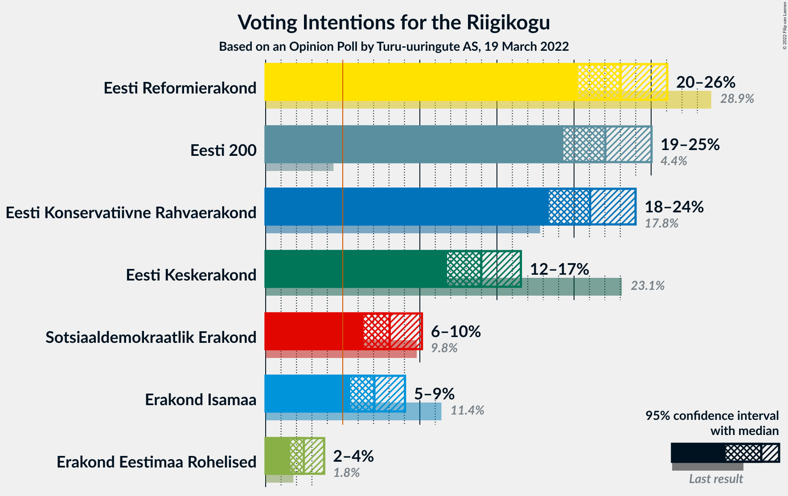

### Confidence Intervals

| Party | Last Result | Poll Result | 80% Confidence Interval | 90% Confidence Interval | 95% Confidence Interval | 99% Confidence Interval |
|:-----:|:-----------:|:-----------:|:-----------------------:|:-----------------------:|:-----------------------:|:-----------------------:|
| Eesti Reformierakond | 28.9% | 23.0% | 21.2–25.0% |20.7–25.6% |20.2–26.0% |19.4–27.0% |
| Eesti 200 | 4.4% | 22.0% | 20.2–24.0% |19.7–24.5% |19.3–25.0% |18.5–26.0% |
| Eesti Konservatiivne Rahvaerakond | 17.8% | 21.0% | 19.3–23.0% |18.8–23.5% |18.4–24.0% |17.6–24.9% |
| Eesti Keskerakond | 23.1% | 14.0% | 12.5–15.7% |12.1–16.1% |11.8–16.6% |11.1–17.4% |
| Sotsiaaldemokraatlik Erakond | 9.8% | 8.0% | 6.9–9.4% |6.6–9.8% |6.4–10.1% |5.9–10.8% |
| Erakond Isamaa | 11.4% | 7.1% | 6.0–8.4% |5.7–8.7% |5.5–9.0% |5.0–9.7% |
| Erakond Eestimaa Rohelised | 1.8% | 2.5% | 1.9–3.3% |1.7–3.6% |1.6–3.8% |1.4–4.3% |

*Note:* The poll result column reflects the actual value used in the calculations. Published results may vary slightly, and in addition be rounded to fewer digits.

## Seats

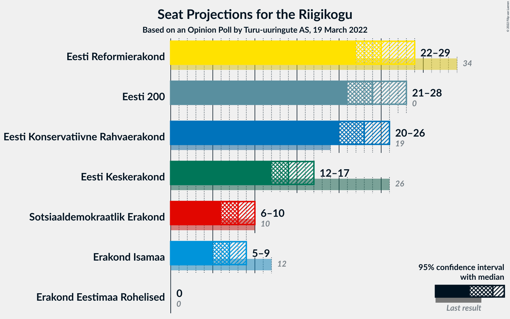

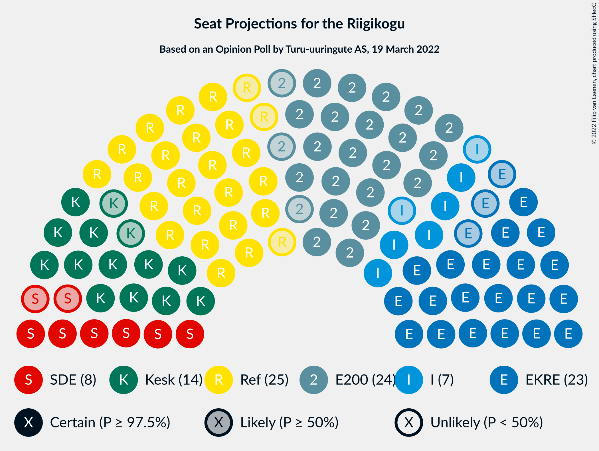

### Confidence Intervals

| Party | Last Result | Median | 80% Confidence Interval | 90% Confidence Interval | 95% Confidence Interval | 99% Confidence Interval |
|:-----:|:-----------:|:------:|:-----------------------:|:-----------------------:|:-----------------------:|:-----------------------:|
| <a href="#eesti-reformierakond">Eesti Reformierakond</a> | 34 | 25 | 23–28 |22–28 |22–29 |21–30 |
| <a href="#eesti-200">Eesti 200</a> | 0 | 24 | 22–26 |21–27 |21–28 |20–29 |
| <a href="#eesti-konservatiivne-rahvaerakond">Eesti Konservatiivne Rahvaerakond</a> | 19 | 23 | 21–25 |20–26 |20–26 |19–28 |
| <a href="#eesti-keskerakond">Eesti Keskerakond</a> | 26 | 14 | 13–16 |12–17 |12–17 |11–18 |
| <a href="#sotsiaaldemokraatlik-erakond">Sotsiaaldemokraatlik Erakond</a> | 10 | 8 | 6–9 |6–9 |6–10 |5–11 |
| <a href="#erakond-isamaa">Erakond Isamaa</a> | 12 | 7 | 5–8 |5–8 |5–9 |0–9 |
| <a href="#erakond-eestimaa-rohelised">Erakond Eestimaa Rohelised</a> | 0 | 0 | 0 |0 |0 |0 |

### Eesti Reformierakond

*For a full overview of the results for this party, see the [Eesti Reformierakond](party-eestireformierakond.html) page.*

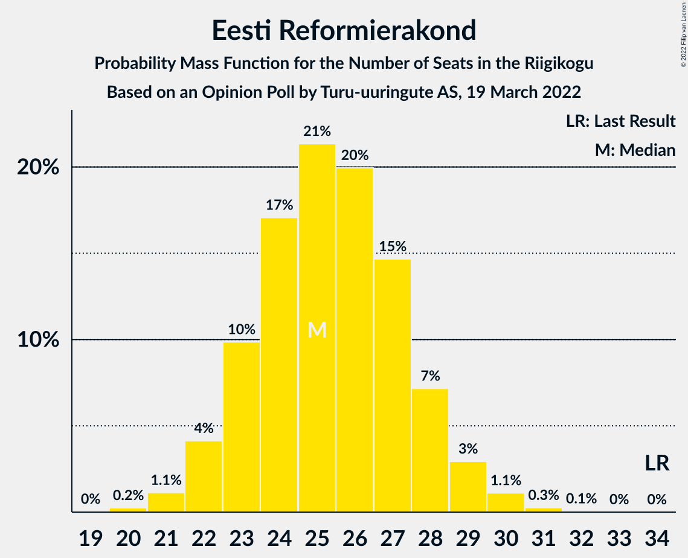

| Number of Seats | Probability | Accumulated | Special Marks |
|:---------------:|:-----------:|:-----------:|:-------------:|
| 20 | 0.2% | 100% |  |
| 21 | 1.1% | 99.7% |  |
| 22 | 4% | 98.6% |  |
| 23 | 10% | 94% |  |
| 24 | 17% | 85% |  |
| 25 | 21% | 68% | Median |
| 26 | 20% | 46% |  |
| 27 | 15% | 26% |  |
| 28 | 7% | 12% |  |
| 29 | 3% | 4% |  |
| 30 | 1.1% | 1.4% |  |
| 31 | 0.3% | 0.3% |  |
| 32 | 0.1% | 0.1% |  |
| 33 | 0% | 0% |  |
| 34 | 0% | 0% | Last Result |

### Eesti 200

*For a full overview of the results for this party, see the [Eesti 200](party-eesti200.html) page.*

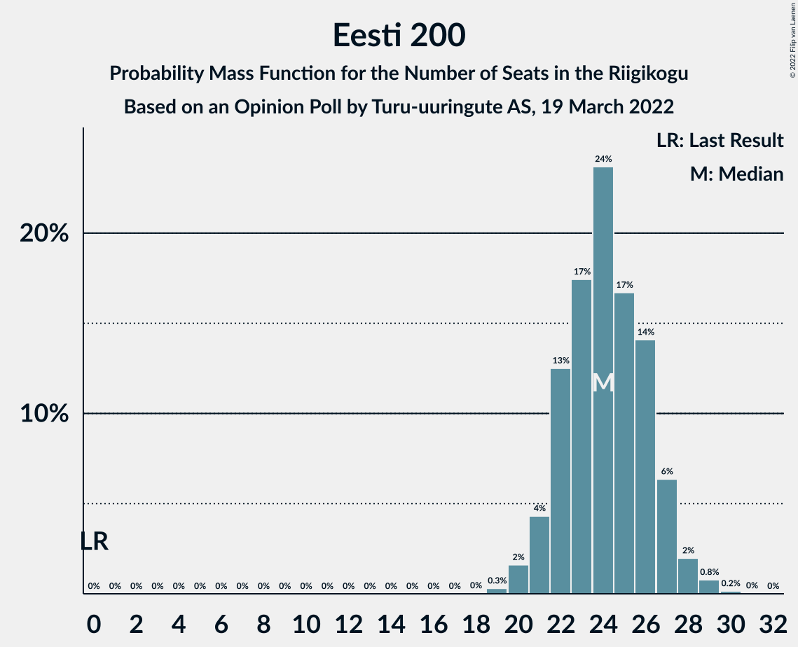

| Number of Seats | Probability | Accumulated | Special Marks |
|:---------------:|:-----------:|:-----------:|:-------------:|
| 0 | 0% | 100% | Last Result |
| 1 | 0% | 100% |  |
| 2 | 0% | 100% |  |
| 3 | 0% | 100% |  |
| 4 | 0% | 100% |  |
| 5 | 0% | 100% |  |
| 6 | 0% | 100% |  |
| 7 | 0% | 100% |  |
| 8 | 0% | 100% |  |
| 9 | 0% | 100% |  |
| 10 | 0% | 100% |  |
| 11 | 0% | 100% |  |
| 12 | 0% | 100% |  |
| 13 | 0% | 100% |  |
| 14 | 0% | 100% |  |
| 15 | 0% | 100% |  |
| 16 | 0% | 100% |  |
| 17 | 0% | 100% |  |
| 18 | 0% | 100% |  |
| 19 | 0.3% | 100% |  |
| 20 | 2% | 99.7% |  |
| 21 | 4% | 98% |  |
| 22 | 13% | 94% |  |
| 23 | 17% | 81% |  |
| 24 | 24% | 64% | Median |
| 25 | 17% | 40% |  |
| 26 | 14% | 23% |  |
| 27 | 6% | 9% |  |
| 28 | 2% | 3% |  |
| 29 | 0.8% | 1.0% |  |
| 30 | 0.2% | 0.2% |  |
| 31 | 0% | 0% |  |

### Eesti Konservatiivne Rahvaerakond

*For a full overview of the results for this party, see the [Eesti Konservatiivne Rahvaerakond](party-eestikonservatiivnerahvaerakond.html) page.*

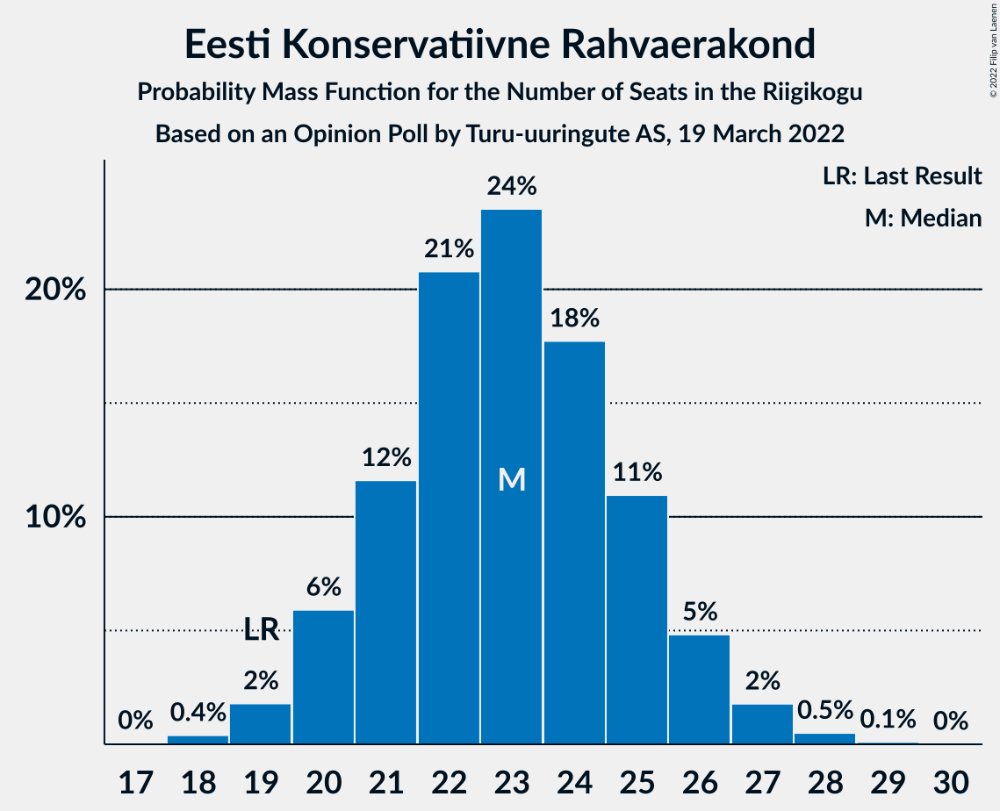

| Number of Seats | Probability | Accumulated | Special Marks |
|:---------------:|:-----------:|:-----------:|:-------------:|
| 17 | 0% | 100% |  |
| 18 | 0.4% | 99.9% |  |
| 19 | 2% | 99.5% | Last Result |
| 20 | 6% | 98% |  |
| 21 | 12% | 92% |  |
| 22 | 21% | 80% |  |
| 23 | 24% | 59% | Median |
| 24 | 18% | 36% |  |
| 25 | 11% | 18% |  |
| 26 | 5% | 7% |  |
| 27 | 2% | 2% |  |
| 28 | 0.5% | 0.6% |  |
| 29 | 0.1% | 0.1% |  |
| 30 | 0% | 0% |  |

### Eesti Keskerakond

*For a full overview of the results for this party, see the [Eesti Keskerakond](party-eestikeskerakond.html) page.*

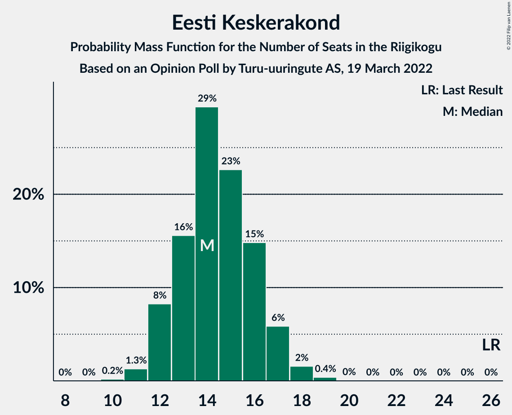

| Number of Seats | Probability | Accumulated | Special Marks |
|:---------------:|:-----------:|:-----------:|:-------------:|
| 10 | 0.2% | 100% |  |
| 11 | 1.3% | 99.8% |  |
| 12 | 8% | 98.5% |  |
| 13 | 16% | 90% |  |
| 14 | 29% | 75% | Median |
| 15 | 23% | 45% |  |
| 16 | 15% | 23% |  |
| 17 | 6% | 8% |  |
| 18 | 2% | 2% |  |
| 19 | 0.4% | 0.4% |  |
| 20 | 0% | 0.1% |  |
| 21 | 0% | 0% |  |
| 22 | 0% | 0% |  |
| 23 | 0% | 0% |  |
| 24 | 0% | 0% |  |
| 25 | 0% | 0% |  |
| 26 | 0% | 0% | Last Result |

### Sotsiaaldemokraatlik Erakond

*For a full overview of the results for this party, see the [Sotsiaaldemokraatlik Erakond](party-sotsiaaldemokraatlikerakond.html) page.*

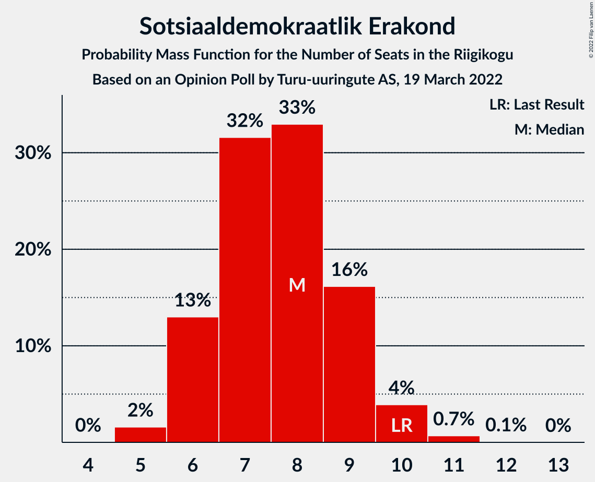

| Number of Seats | Probability | Accumulated | Special Marks |
|:---------------:|:-----------:|:-----------:|:-------------:|
| 5 | 2% | 100% |  |
| 6 | 13% | 98% |  |
| 7 | 32% | 85% |  |
| 8 | 33% | 54% | Median |
| 9 | 16% | 21% |  |
| 10 | 4% | 5% | Last Result |
| 11 | 0.7% | 0.8% |  |
| 12 | 0.1% | 0.1% |  |
| 13 | 0% | 0% |  |

### Erakond Isamaa

*For a full overview of the results for this party, see the [Erakond Isamaa](party-erakondisamaa.html) page.*

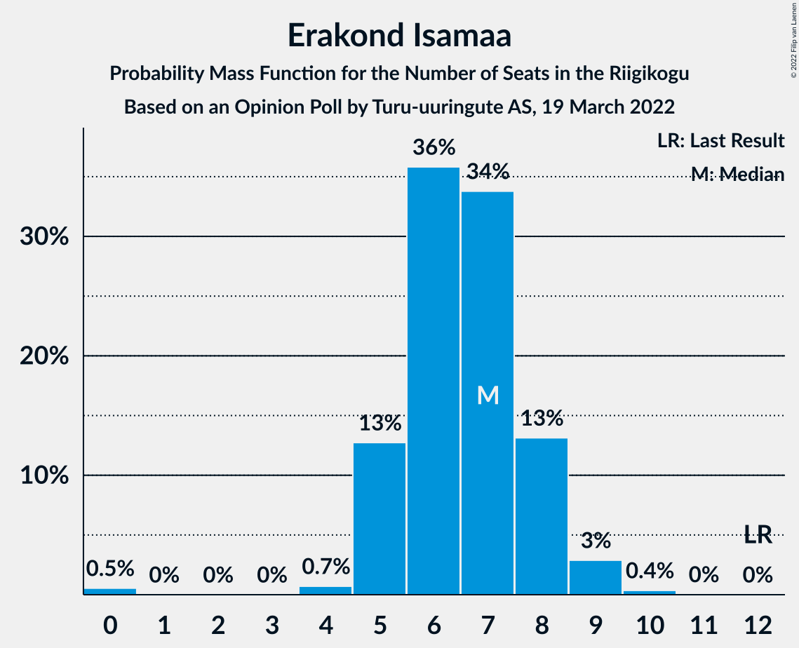

| Number of Seats | Probability | Accumulated | Special Marks |
|:---------------:|:-----------:|:-----------:|:-------------:|
| 0 | 0.5% | 100% |  |
| 1 | 0% | 99.5% |  |
| 2 | 0% | 99.5% |  |
| 3 | 0% | 99.5% |  |
| 4 | 0.7% | 99.5% |  |
| 5 | 13% | 98.7% |  |
| 6 | 36% | 86% |  |
| 7 | 34% | 50% | Median |
| 8 | 13% | 16% |  |
| 9 | 3% | 3% |  |
| 10 | 0.4% | 0.4% |  |
| 11 | 0% | 0% |  |
| 12 | 0% | 0% | Last Result |

### Erakond Eestimaa Rohelised

*For a full overview of the results for this party, see the [Erakond Eestimaa Rohelised](party-erakondeestimaarohelised.html) page.*

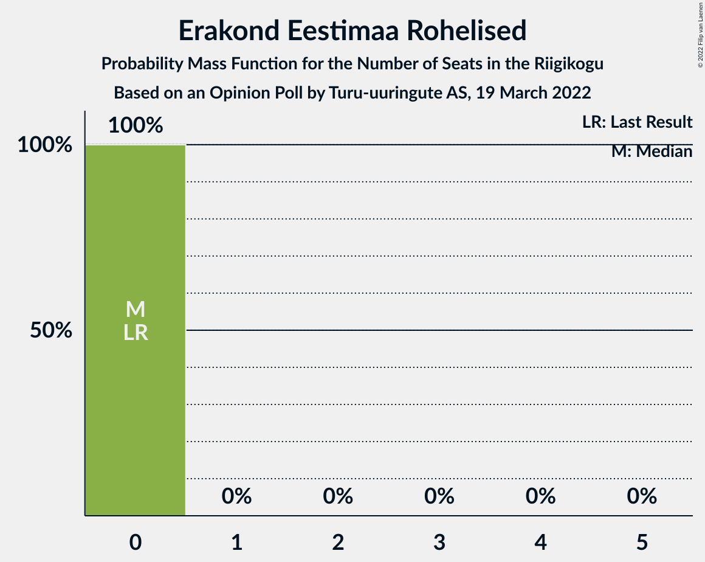

| Number of Seats | Probability | Accumulated | Special Marks |
|:---------------:|:-----------:|:-----------:|:-------------:|
| 0 | 100% | 100% | Last Result, Median |

## Coalitions

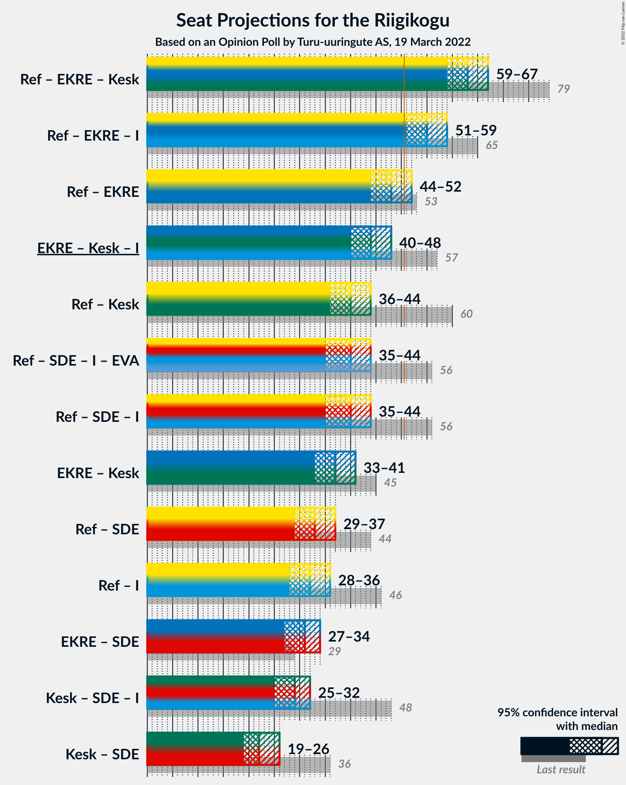

### Confidence Intervals

| Coalition | Last Result | Median | Majority? | 80% Confidence Interval | 90% Confidence Interval | 95% Confidence Interval | 99% Confidence Interval |
|:---------:|:-----------:|:------:|:---------:|:-----------------------:|:-----------------------:|:-----------------------:|:-----------------------:|
| Eesti Reformierakond – Eesti Konservatiivne Rahvaerakond – Eesti Keskerakond | 79 | 63 | 100% | 60–65 | 59–66 | 59–67 | 57–68 |
| Eesti Reformierakond – Eesti Konservatiivne Rahvaerakond – Erakond Isamaa | 65 | 55 | 98% | 52–58 | 51–58 | 51–59 | 49–60 |
| Eesti Reformierakond – Eesti Konservatiivne Rahvaerakond | 53 | 48 | 15% | 46–51 | 45–52 | 44–52 | 43–54 |
| Eesti Konservatiivne Rahvaerakond – Eesti Keskerakond – Erakond Isamaa | 57 | 44 | 0.1% | 41–47 | 40–47 | 40–48 | 38–49 |
| Eesti Reformierakond – Eesti Keskerakond | 60 | 40 | 0% | 37–42 | 36–43 | 36–44 | 35–45 |
| Eesti Reformierakond – Sotsiaaldemokraatlik Erakond – Erakond Isamaa | 56 | 40 | 0% | 37–42 | 36–43 | 35–44 | 34–45 |
| Eesti Konservatiivne Rahvaerakond – Eesti Keskerakond | 45 | 37 | 0% | 35–40 | 34–41 | 33–41 | 32–43 |
| Eesti Reformierakond – Sotsiaaldemokraatlik Erakond | 44 | 33 | 0% | 31–36 | 30–36 | 29–37 | 28–38 |
| Eesti Reformierakond – Erakond Isamaa | 46 | 32 | 0% | 29–34 | 29–35 | 28–36 | 27–37 |
| Eesti Konservatiivne Rahvaerakond – Sotsiaaldemokraatlik Erakond | 29 | 31 | 0% | 28–33 | 27–34 | 27–34 | 26–36 |
| Eesti Keskerakond – Sotsiaaldemokraatlik Erakond – Erakond Isamaa | 48 | 29 | 0% | 26–31 | 25–32 | 25–32 | 24–34 |
| Eesti Keskerakond – Sotsiaaldemokraatlik Erakond | 36 | 22 | 0% | 20–24 | 19–25 | 19–26 | 18–27 |

### Eesti Reformierakond – Eesti Konservatiivne Rahvaerakond – Eesti Keskerakond

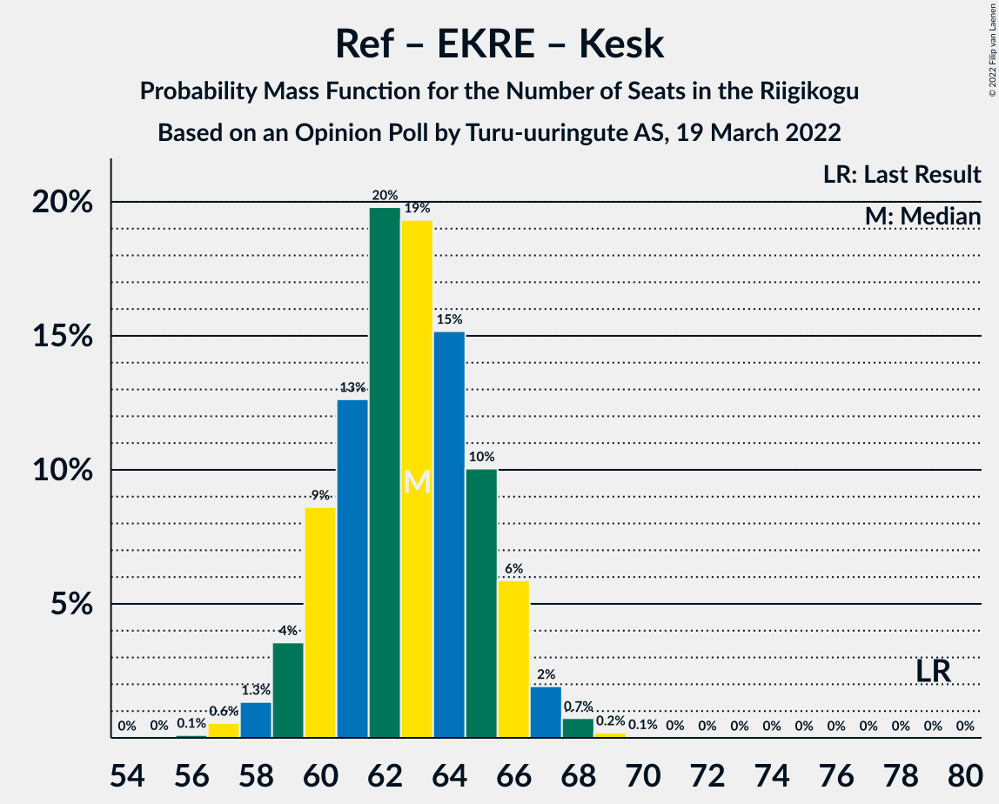

| Number of Seats | Probability | Accumulated | Special Marks |
|:---------------:|:-----------:|:-----------:|:-------------:|
| 56 | 0.1% | 100% |  |
| 57 | 0.6% | 99.9% |  |
| 58 | 1.3% | 99.3% |  |
| 59 | 4% | 98% |  |
| 60 | 9% | 94% |  |
| 61 | 13% | 86% |  |
| 62 | 20% | 73% | Median |
| 63 | 19% | 53% |  |
| 64 | 15% | 34% |  |
| 65 | 10% | 19% |  |
| 66 | 6% | 9% |  |
| 67 | 2% | 3% |  |
| 68 | 0.7% | 1.0% |  |
| 69 | 0.2% | 0.3% |  |
| 70 | 0.1% | 0.1% |  |
| 71 | 0% | 0% |  |
| 72 | 0% | 0% |  |
| 73 | 0% | 0% |  |
| 74 | 0% | 0% |  |
| 75 | 0% | 0% |  |
| 76 | 0% | 0% |  |
| 77 | 0% | 0% |  |
| 78 | 0% | 0% |  |
| 79 | 0% | 0% | Last Result |

### Eesti Reformierakond – Eesti Konservatiivne Rahvaerakond – Erakond Isamaa

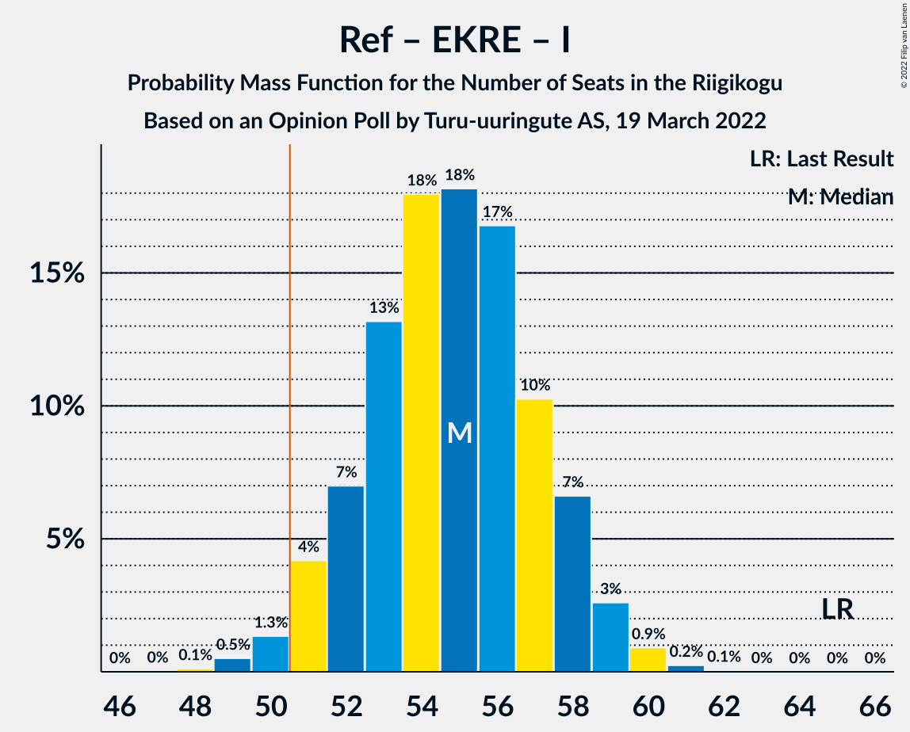

| Number of Seats | Probability | Accumulated | Special Marks |
|:---------------:|:-----------:|:-----------:|:-------------:|
| 48 | 0.1% | 100% |  |
| 49 | 0.5% | 99.8% |  |
| 50 | 1.3% | 99.3% |  |
| 51 | 4% | 98% | Majority |
| 52 | 7% | 94% |  |
| 53 | 13% | 87% |  |
| 54 | 18% | 74% |  |
| 55 | 18% | 56% | Median |
| 56 | 17% | 37% |  |
| 57 | 10% | 21% |  |
| 58 | 7% | 10% |  |
| 59 | 3% | 4% |  |
| 60 | 0.9% | 1.2% |  |
| 61 | 0.2% | 0.3% |  |
| 62 | 0.1% | 0.1% |  |
| 63 | 0% | 0% |  |
| 64 | 0% | 0% |  |
| 65 | 0% | 0% | Last Result |

### Eesti Reformierakond – Eesti Konservatiivne Rahvaerakond

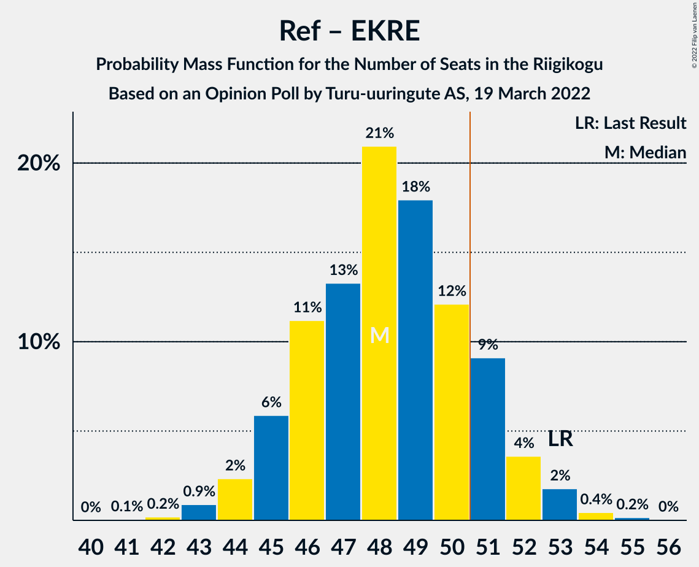

| Number of Seats | Probability | Accumulated | Special Marks |
|:---------------:|:-----------:|:-----------:|:-------------:|
| 41 | 0.1% | 100% |  |
| 42 | 0.2% | 99.9% |  |
| 43 | 0.9% | 99.7% |  |
| 44 | 2% | 98.8% |  |
| 45 | 6% | 97% |  |
| 46 | 11% | 91% |  |
| 47 | 13% | 79% |  |
| 48 | 21% | 66% | Median |
| 49 | 18% | 45% |  |
| 50 | 12% | 27% |  |
| 51 | 9% | 15% | Majority |
| 52 | 4% | 6% |  |
| 53 | 2% | 2% | Last Result |
| 54 | 0.4% | 0.7% |  |
| 55 | 0.2% | 0.2% |  |
| 56 | 0% | 0% |  |

### Eesti Konservatiivne Rahvaerakond – Eesti Keskerakond – Erakond Isamaa

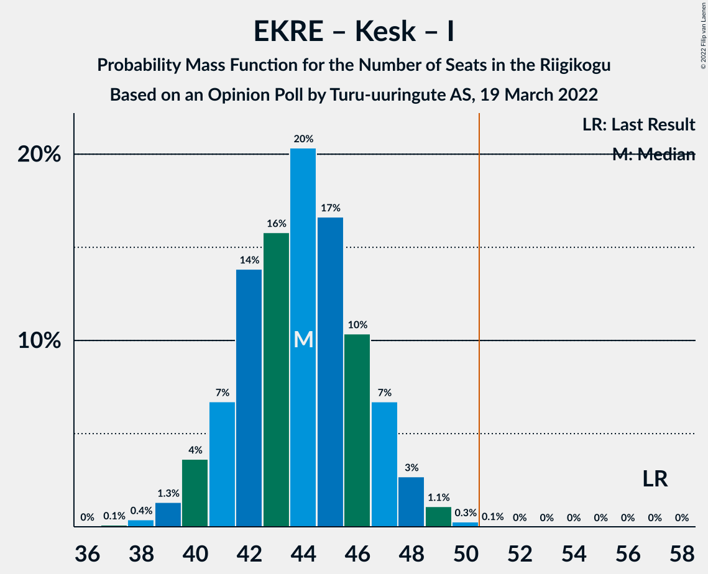

| Number of Seats | Probability | Accumulated | Special Marks |
|:---------------:|:-----------:|:-----------:|:-------------:|
| 37 | 0.1% | 100% |  |
| 38 | 0.4% | 99.9% |  |
| 39 | 1.3% | 99.5% |  |
| 40 | 4% | 98% |  |
| 41 | 7% | 95% |  |
| 42 | 14% | 88% |  |
| 43 | 16% | 74% |  |
| 44 | 20% | 58% | Median |
| 45 | 17% | 38% |  |
| 46 | 10% | 21% |  |
| 47 | 7% | 11% |  |
| 48 | 3% | 4% |  |
| 49 | 1.1% | 1.4% |  |
| 50 | 0.3% | 0.3% |  |
| 51 | 0.1% | 0.1% | Majority |
| 52 | 0% | 0% |  |
| 53 | 0% | 0% |  |
| 54 | 0% | 0% |  |
| 55 | 0% | 0% |  |
| 56 | 0% | 0% |  |
| 57 | 0% | 0% | Last Result |

### Eesti Reformierakond – Eesti Keskerakond

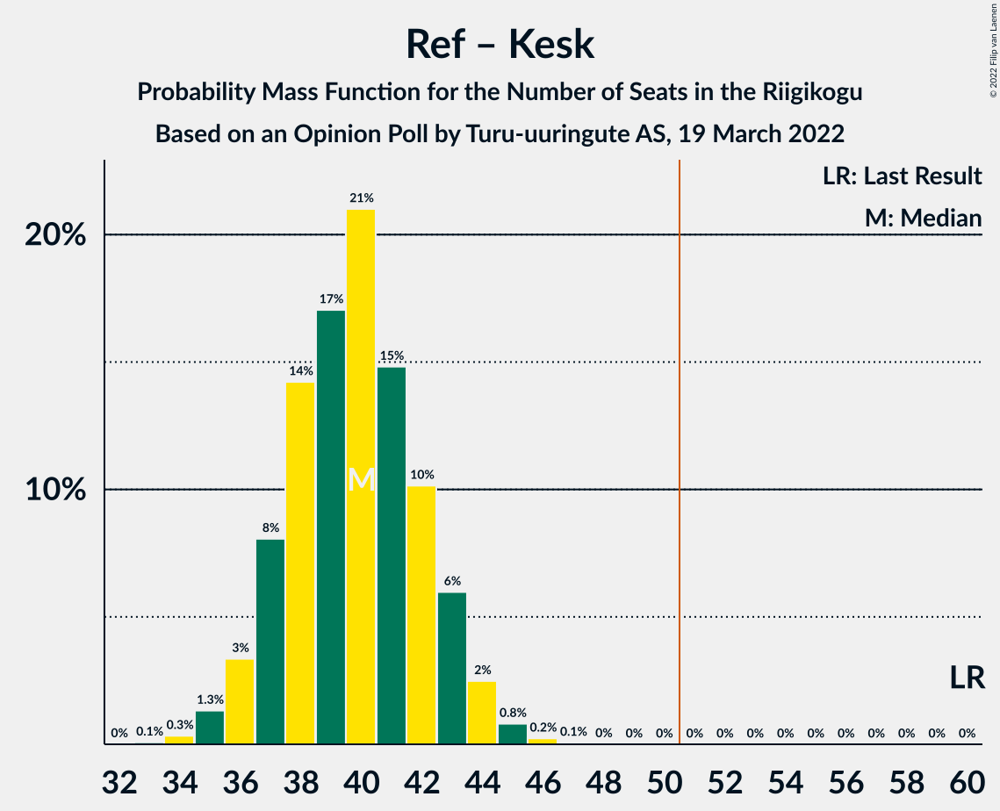

| Number of Seats | Probability | Accumulated | Special Marks |
|:---------------:|:-----------:|:-----------:|:-------------:|
| 33 | 0.1% | 100% |  |
| 34 | 0.3% | 99.9% |  |
| 35 | 1.3% | 99.6% |  |
| 36 | 3% | 98% |  |
| 37 | 8% | 95% |  |
| 38 | 14% | 87% |  |
| 39 | 17% | 73% | Median |
| 40 | 21% | 56% |  |
| 41 | 15% | 35% |  |
| 42 | 10% | 20% |  |
| 43 | 6% | 10% |  |
| 44 | 2% | 4% |  |
| 45 | 0.8% | 1.1% |  |
| 46 | 0.2% | 0.3% |  |
| 47 | 0.1% | 0.1% |  |
| 48 | 0% | 0% |  |
| 49 | 0% | 0% |  |
| 50 | 0% | 0% |  |
| 51 | 0% | 0% | Majority |
| 52 | 0% | 0% |  |
| 53 | 0% | 0% |  |
| 54 | 0% | 0% |  |
| 55 | 0% | 0% |  |
| 56 | 0% | 0% |  |
| 57 | 0% | 0% |  |
| 58 | 0% | 0% |  |
| 59 | 0% | 0% |  |
| 60 | 0% | 0% | Last Result |

### Eesti Reformierakond – Sotsiaaldemokraatlik Erakond – Erakond Isamaa

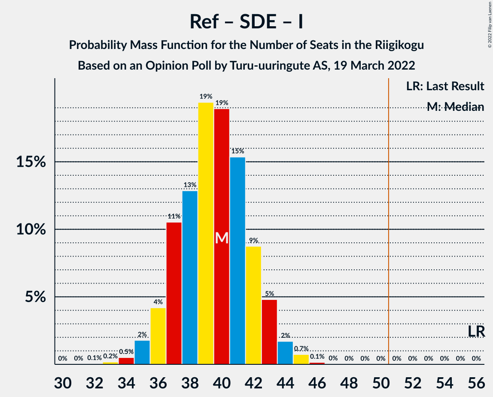

| Number of Seats | Probability | Accumulated | Special Marks |
|:---------------:|:-----------:|:-----------:|:-------------:|
| 32 | 0.1% | 100% |  |
| 33 | 0.2% | 99.9% |  |
| 34 | 0.5% | 99.7% |  |
| 35 | 2% | 99.2% |  |
| 36 | 4% | 97% |  |
| 37 | 11% | 93% |  |
| 38 | 13% | 83% |  |
| 39 | 19% | 70% |  |
| 40 | 19% | 50% | Median |
| 41 | 15% | 32% |  |
| 42 | 9% | 16% |  |
| 43 | 5% | 7% |  |
| 44 | 2% | 3% |  |
| 45 | 0.7% | 0.9% |  |
| 46 | 0.1% | 0.2% |  |
| 47 | 0% | 0% |  |
| 48 | 0% | 0% |  |
| 49 | 0% | 0% |  |
| 50 | 0% | 0% |  |
| 51 | 0% | 0% | Majority |
| 52 | 0% | 0% |  |
| 53 | 0% | 0% |  |
| 54 | 0% | 0% |  |
| 55 | 0% | 0% |  |
| 56 | 0% | 0% | Last Result |

### Eesti Konservatiivne Rahvaerakond – Eesti Keskerakond

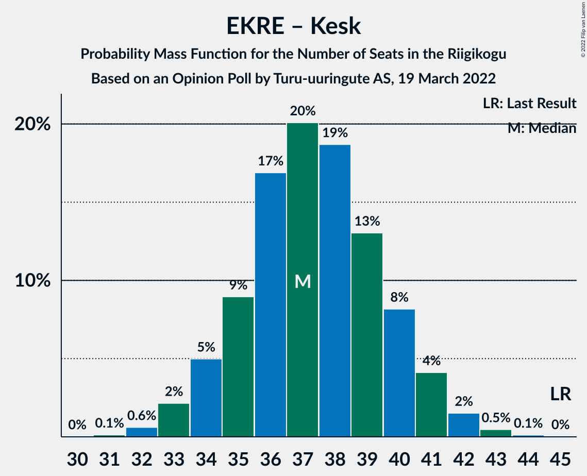

| Number of Seats | Probability | Accumulated | Special Marks |
|:---------------:|:-----------:|:-----------:|:-------------:|
| 31 | 0.1% | 100% |  |
| 32 | 0.6% | 99.8% |  |
| 33 | 2% | 99.2% |  |
| 34 | 5% | 97% |  |
| 35 | 9% | 92% |  |
| 36 | 17% | 83% |  |
| 37 | 20% | 66% | Median |
| 38 | 19% | 46% |  |
| 39 | 13% | 27% |  |
| 40 | 8% | 14% |  |
| 41 | 4% | 6% |  |
| 42 | 2% | 2% |  |
| 43 | 0.5% | 0.6% |  |
| 44 | 0.1% | 0.2% |  |
| 45 | 0% | 0% | Last Result |

### Eesti Reformierakond – Sotsiaaldemokraatlik Erakond

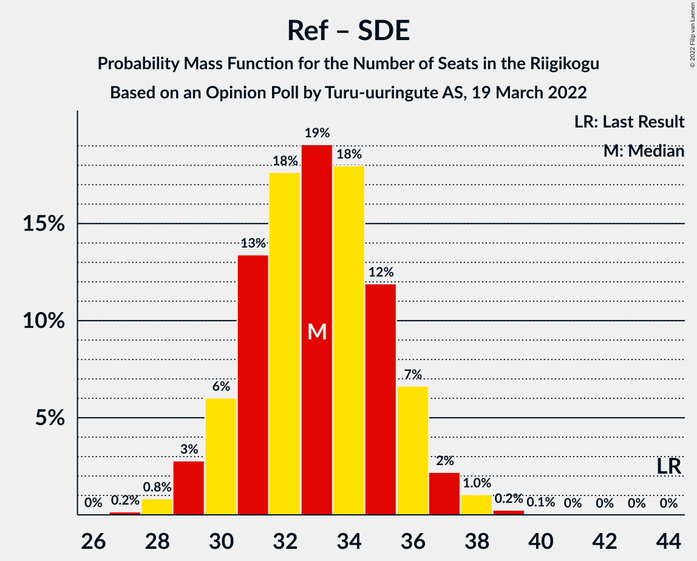

| Number of Seats | Probability | Accumulated | Special Marks |
|:---------------:|:-----------:|:-----------:|:-------------:|
| 27 | 0.2% | 100% |  |
| 28 | 0.8% | 99.8% |  |
| 29 | 3% | 99.0% |  |
| 30 | 6% | 96% |  |
| 31 | 13% | 90% |  |
| 32 | 18% | 77% |  |
| 33 | 19% | 59% | Median |
| 34 | 18% | 40% |  |
| 35 | 12% | 22% |  |
| 36 | 7% | 10% |  |
| 37 | 2% | 4% |  |
| 38 | 1.0% | 1.4% |  |
| 39 | 0.2% | 0.3% |  |
| 40 | 0.1% | 0.1% |  |
| 41 | 0% | 0% |  |
| 42 | 0% | 0% |  |
| 43 | 0% | 0% |  |
| 44 | 0% | 0% | Last Result |

### Eesti Reformierakond – Erakond Isamaa

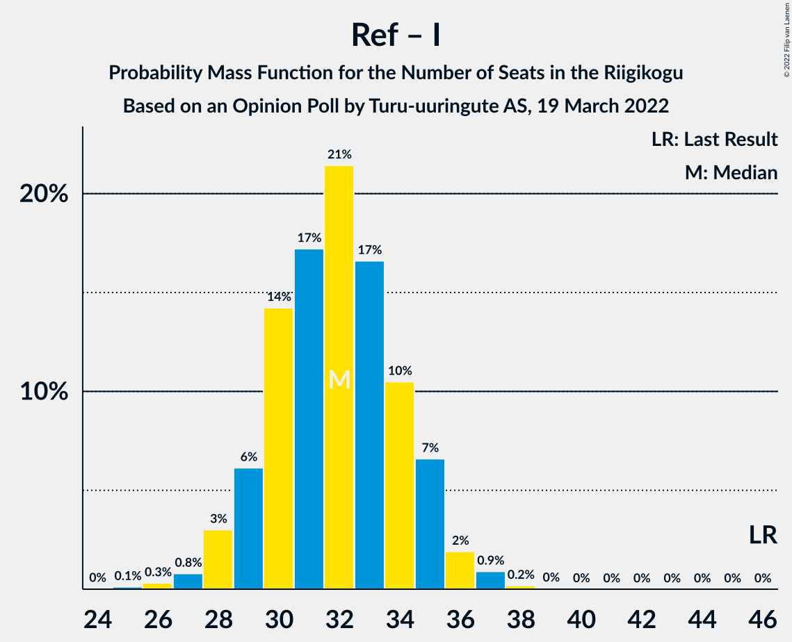

| Number of Seats | Probability | Accumulated | Special Marks |
|:---------------:|:-----------:|:-----------:|:-------------:|
| 25 | 0.1% | 100% |  |
| 26 | 0.3% | 99.8% |  |
| 27 | 0.8% | 99.5% |  |
| 28 | 3% | 98.7% |  |
| 29 | 6% | 96% |  |
| 30 | 14% | 90% |  |
| 31 | 17% | 75% |  |
| 32 | 21% | 58% | Median |
| 33 | 17% | 37% |  |
| 34 | 10% | 20% |  |
| 35 | 7% | 10% |  |
| 36 | 2% | 3% |  |
| 37 | 0.9% | 1.1% |  |
| 38 | 0.2% | 0.2% |  |
| 39 | 0% | 0.1% |  |
| 40 | 0% | 0% |  |
| 41 | 0% | 0% |  |
| 42 | 0% | 0% |  |
| 43 | 0% | 0% |  |
| 44 | 0% | 0% |  |
| 45 | 0% | 0% |  |
| 46 | 0% | 0% | Last Result |

### Eesti Konservatiivne Rahvaerakond – Sotsiaaldemokraatlik Erakond

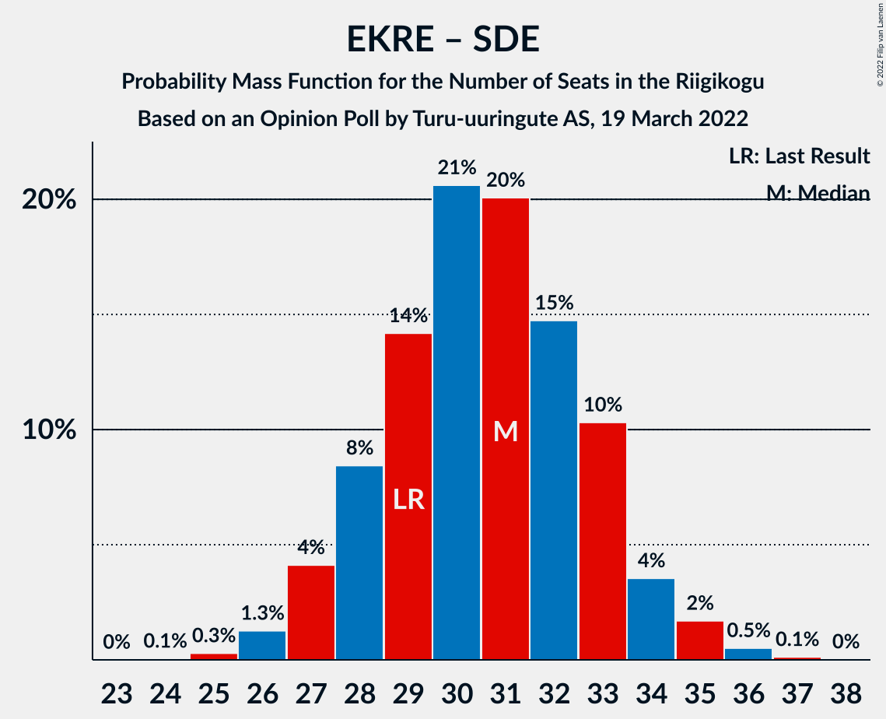

| Number of Seats | Probability | Accumulated | Special Marks |
|:---------------:|:-----------:|:-----------:|:-------------:|
| 24 | 0.1% | 100% |  |
| 25 | 0.3% | 99.9% |  |
| 26 | 1.3% | 99.6% |  |
| 27 | 4% | 98% |  |
| 28 | 8% | 94% |  |
| 29 | 14% | 86% | Last Result |
| 30 | 21% | 72% |  |
| 31 | 20% | 51% | Median |
| 32 | 15% | 31% |  |
| 33 | 10% | 16% |  |
| 34 | 4% | 6% |  |
| 35 | 2% | 2% |  |
| 36 | 0.5% | 0.7% |  |
| 37 | 0.1% | 0.2% |  |
| 38 | 0% | 0% |  |

### Eesti Keskerakond – Sotsiaaldemokraatlik Erakond – Erakond Isamaa

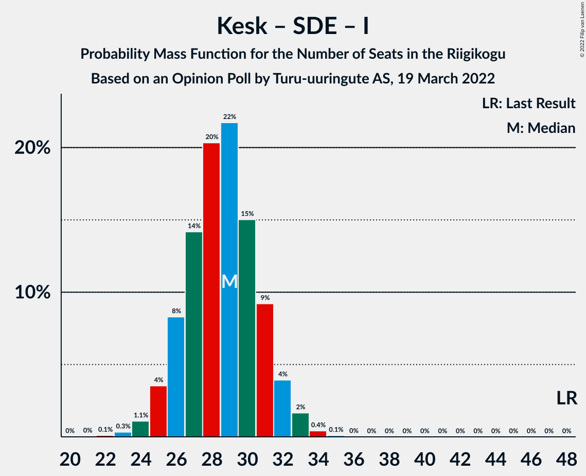

| Number of Seats | Probability | Accumulated | Special Marks |
|:---------------:|:-----------:|:-----------:|:-------------:|
| 21 | 0% | 100% |  |
| 22 | 0.1% | 99.9% |  |
| 23 | 0.3% | 99.8% |  |
| 24 | 1.1% | 99.5% |  |
| 25 | 4% | 98% |  |
| 26 | 8% | 95% |  |
| 27 | 14% | 87% |  |
| 28 | 20% | 72% |  |
| 29 | 22% | 52% | Median |
| 30 | 15% | 30% |  |
| 31 | 9% | 15% |  |
| 32 | 4% | 6% |  |
| 33 | 2% | 2% |  |
| 34 | 0.4% | 0.5% |  |
| 35 | 0.1% | 0.1% |  |
| 36 | 0% | 0% |  |
| 37 | 0% | 0% |  |
| 38 | 0% | 0% |  |
| 39 | 0% | 0% |  |
| 40 | 0% | 0% |  |
| 41 | 0% | 0% |  |
| 42 | 0% | 0% |  |
| 43 | 0% | 0% |  |
| 44 | 0% | 0% |  |
| 45 | 0% | 0% |  |
| 46 | 0% | 0% |  |
| 47 | 0% | 0% |  |
| 48 | 0% | 0% | Last Result |

### Eesti Keskerakond – Sotsiaaldemokraatlik Erakond

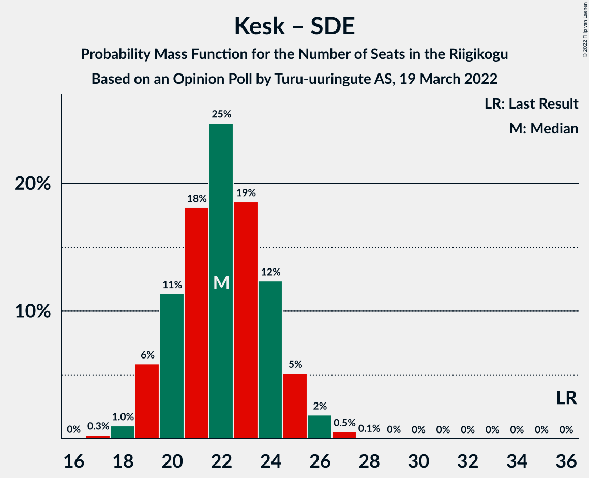

| Number of Seats | Probability | Accumulated | Special Marks |
|:---------------:|:-----------:|:-----------:|:-------------:|
| 17 | 0.3% | 100% |  |
| 18 | 1.0% | 99.7% |  |
| 19 | 6% | 98.7% |  |
| 20 | 11% | 93% |  |
| 21 | 18% | 81% |  |
| 22 | 25% | 63% | Median |
| 23 | 19% | 39% |  |
| 24 | 12% | 20% |  |
| 25 | 5% | 8% |  |
| 26 | 2% | 3% |  |
| 27 | 0.5% | 0.7% |  |
| 28 | 0.1% | 0.1% |  |
| 29 | 0% | 0% |  |
| 30 | 0% | 0% |  |
| 31 | 0% | 0% |  |
| 32 | 0% | 0% |  |
| 33 | 0% | 0% |  |
| 34 | 0% | 0% |  |
| 35 | 0% | 0% |  |
| 36 | 0% | 0% | Last Result |

## Technical Information

### Opinion Poll

+ **Polling firm:** Turu-uuringute AS
+ **Commissioner(s):** —
+ **Fieldwork period:** 19 March 2022

### Calculations

+ **Sample size:** 808
+ **Simulations done:** 1,048,576
+ **Error estimate:** 1.40%

