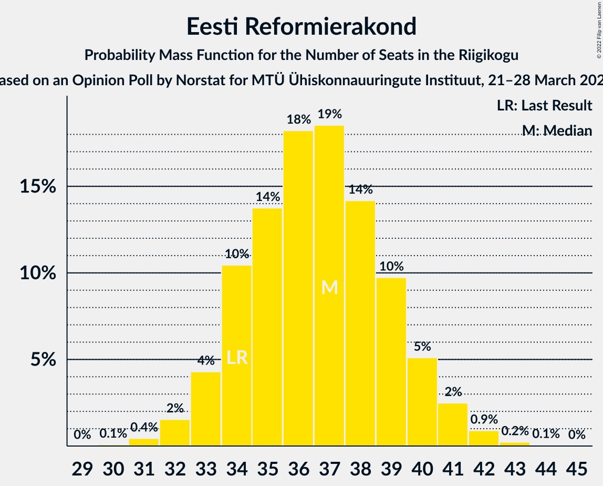

# Opinion Poll by Norstat for MTÜ Ühiskonnauuringute Instituut, 21–28 March 2022

<a href="#voting-intentions">Voting Intentions</a> | <a href="#seats">Seats</a> | <a href="#coalitions">Coalitions</a> | <a href="#technical-information">Technical Information</a>

## Voting Intentions

### Confidence Intervals

| Party | Last Result | Poll Result | 80% Confidence Interval | 90% Confidence Interval | 95% Confidence Interval | 99% Confidence Interval |
|:-----:|:-----------:|:-----------:|:-----------------------:|:-----------------------:|:-----------------------:|:-----------------------:|
| Eesti Reformierakond | 28.9% | 31.7% | 29.9–33.6% |29.3–34.2% |28.9–34.7% |28.0–35.6% |
| Eesti Konservatiivne Rahvaerakond | 17.8% | 22.0% | 20.4–23.7% |19.9–24.2% |19.5–24.7% |18.8–25.5% |
| Eesti 200 | 4.4% | 17.9% | 16.4–19.5% |16.0–20.0% |15.6–20.4% |15.0–21.2% |
| Eesti Keskerakond | 23.1% | 16.2% | 14.8–17.8% |14.4–18.2% |14.0–18.6% |13.4–19.4% |
| Sotsiaaldemokraatlik Erakond | 9.8% | 5.2% | 4.4–6.2% |4.2–6.5% |4.0–6.8% |3.6–7.3% |
| Erakond Isamaa | 11.4% | 4.1% | 3.4–5.0% |3.2–5.3% |3.0–5.5% |2.7–6.0% |
| Erakond Eestimaa Rohelised | 1.8% | 1.8% | 1.4–2.5% |1.2–2.7% |1.1–2.8% |1.0–3.2% |

*Note:* The poll result column reflects the actual value used in the calculations. Published results may vary slightly, and in addition be rounded to fewer digits.

## Seats

### Confidence Intervals

| Party | Last Result | Median | 80% Confidence Interval | 90% Confidence Interval | 95% Confidence Interval | 99% Confidence Interval |
|:-----:|:-----------:|:------:|:-----------------------:|:-----------------------:|:-----------------------:|:-----------------------:|
| <a href="#eesti-reformierakond">Eesti Reformierakond</a> | 34 | 37 | 34–39 |33–40 |33–41 |31–42 |
| <a href="#eesti-konservatiivne-rahvaerakond">Eesti Konservatiivne Rahvaerakond</a> | 19 | 24 | 22–27 |22–27 |21–28 |20–29 |
| <a href="#eesti-200">Eesti 200</a> | 0 | 19 | 17–21 |17–22 |16–22 |15–23 |
| <a href="#eesti-keskerakond">Eesti Keskerakond</a> | 26 | 17 | 15–19 |15–20 |14–20 |14–21 |
| <a href="#sotsiaaldemokraatlik-erakond">Sotsiaaldemokraatlik Erakond</a> | 10 | 5 | 0–6 |0–6 |0–6 |0–7 |
| <a href="#erakond-isamaa">Erakond Isamaa</a> | 12 | 0 | 0–4 |0–4 |0–5 |0–5 |
| <a href="#erakond-eestimaa-rohelised">Erakond Eestimaa Rohelised</a> | 0 | 0 | 0 |0 |0 |0 |

### Eesti Reformierakond

*For a full overview of the results for this party, see the [Eesti Reformierakond](party-eestireformierakond.html) page.*

| Number of Seats | Probability | Accumulated | Special Marks |
|:---------------:|:-----------:|:-----------:|:-------------:|
| 30 | 0.1% | 100% |  |
| 31 | 0.4% | 99.9% |  |
| 32 | 2% | 99.5% |  |
| 33 | 4% | 98% |  |
| 34 | 10% | 94% | Last Result |
| 35 | 14% | 83% |  |
| 36 | 18% | 69% |  |
| 37 | 19% | 51% | Median |
| 38 | 14% | 33% |  |
| 39 | 10% | 19% |  |
| 40 | 5% | 9% |  |
| 41 | 2% | 4% |  |
| 42 | 0.9% | 1.2% |  |
| 43 | 0.2% | 0.3% |  |
| 44 | 0.1% | 0.1% |  |
| 45 | 0% | 0% |  |

### Eesti Konservatiivne Rahvaerakond

*For a full overview of the results for this party, see the [Eesti Konservatiivne Rahvaerakond](party-eestikonservatiivnerahvaerakond.html) page.*

| Number of Seats | Probability | Accumulated | Special Marks |
|:---------------:|:-----------:|:-----------:|:-------------:|
| 19 | 0.1% | 100% | Last Result |
| 20 | 1.1% | 99.9% |  |
| 21 | 4% | 98.7% |  |
| 22 | 9% | 95% |  |
| 23 | 23% | 86% |  |
| 24 | 20% | 64% | Median |
| 25 | 18% | 44% |  |
| 26 | 15% | 26% |  |
| 27 | 7% | 10% |  |
| 28 | 2% | 4% |  |
| 29 | 1.1% | 1.3% |  |
| 30 | 0.2% | 0.2% |  |
| 31 | 0% | 0% |  |

### Eesti 200

*For a full overview of the results for this party, see the [Eesti 200](party-eesti200.html) page.*

| Number of Seats | Probability | Accumulated | Special Marks |
|:---------------:|:-----------:|:-----------:|:-------------:|
| 0 | 0% | 100% | Last Result |
| 1 | 0% | 100% |  |
| 2 | 0% | 100% |  |
| 3 | 0% | 100% |  |
| 4 | 0% | 100% |  |
| 5 | 0% | 100% |  |
| 6 | 0% | 100% |  |
| 7 | 0% | 100% |  |
| 8 | 0% | 100% |  |
| 9 | 0% | 100% |  |
| 10 | 0% | 100% |  |
| 11 | 0% | 100% |  |
| 12 | 0% | 100% |  |
| 13 | 0% | 100% |  |
| 14 | 0% | 100% |  |
| 15 | 0.6% | 100% |  |
| 16 | 4% | 99.4% |  |
| 17 | 10% | 96% |  |
| 18 | 19% | 86% |  |
| 19 | 25% | 67% | Median |
| 20 | 20% | 41% |  |
| 21 | 13% | 21% |  |
| 22 | 5% | 8% |  |
| 23 | 2% | 2% |  |
| 24 | 0.4% | 0.5% |  |
| 25 | 0.1% | 0.1% |  |
| 26 | 0% | 0% |  |

### Eesti Keskerakond

*For a full overview of the results for this party, see the [Eesti Keskerakond](party-eestikeskerakond.html) page.*

| Number of Seats | Probability | Accumulated | Special Marks |
|:---------------:|:-----------:|:-----------:|:-------------:|
| 13 | 0.4% | 100% |  |
| 14 | 2% | 99.6% |  |
| 15 | 8% | 97% |  |
| 16 | 21% | 89% |  |
| 17 | 28% | 68% | Median |
| 18 | 21% | 40% |  |
| 19 | 13% | 19% |  |
| 20 | 4% | 7% |  |
| 21 | 2% | 2% |  |
| 22 | 0.3% | 0.3% |  |
| 23 | 0% | 0% |  |
| 24 | 0% | 0% |  |
| 25 | 0% | 0% |  |
| 26 | 0% | 0% | Last Result |

### Sotsiaaldemokraatlik Erakond

*For a full overview of the results for this party, see the [Sotsiaaldemokraatlik Erakond](party-sotsiaaldemokraatlikerakond.html) page.*

| Number of Seats | Probability | Accumulated | Special Marks |
|:---------------:|:-----------:|:-----------:|:-------------:|
| 0 | 36% | 100% |  |
| 1 | 0% | 64% |  |
| 2 | 0% | 64% |  |
| 3 | 0% | 64% |  |
| 4 | 13% | 64% |  |
| 5 | 39% | 51% | Median |
| 6 | 11% | 12% |  |
| 7 | 0.8% | 0.8% |  |
| 8 | 0% | 0% |  |
| 9 | 0% | 0% |  |
| 10 | 0% | 0% | Last Result |

### Erakond Isamaa

*For a full overview of the results for this party, see the [Erakond Isamaa](party-erakondisamaa.html) page.*

| Number of Seats | Probability | Accumulated | Special Marks |
|:---------------:|:-----------:|:-----------:|:-------------:|
| 0 | 90% | 100% | Median |
| 1 | 0% | 10% |  |
| 2 | 0% | 10% |  |
| 3 | 0% | 10% |  |
| 4 | 6% | 10% |  |
| 5 | 4% | 4% |  |
| 6 | 0.2% | 0.2% |  |
| 7 | 0% | 0% |  |
| 8 | 0% | 0% |  |
| 9 | 0% | 0% |  |
| 10 | 0% | 0% |  |
| 11 | 0% | 0% |  |
| 12 | 0% | 0% | Last Result |

### Erakond Eestimaa Rohelised

*For a full overview of the results for this party, see the [Erakond Eestimaa Rohelised](party-erakondeestimaarohelised.html) page.*

| Number of Seats | Probability | Accumulated | Special Marks |
|:---------------:|:-----------:|:-----------:|:-------------:|
| 0 | 100% | 100% | Last Result, Median |

## Coalitions

### Confidence Intervals

| Coalition | Last Result | Median | Majority? | 80% Confidence Interval | 90% Confidence Interval | 95% Confidence Interval | 99% Confidence Interval |
|:---------:|:-----------:|:------:|:---------:|:-----------------------:|:-----------------------:|:-----------------------:|:-----------------------:|
| Eesti Reformierakond – Eesti Konservatiivne Rahvaerakond – Eesti Keskerakond | 79 | 78 | 100% | 75–82 | 74–82 | 73–83 | 72–84 |
| Eesti Reformierakond – Eesti Konservatiivne Rahvaerakond – Erakond Isamaa | 65 | 61 | 100% | 58–65 | 58–66 | 57–66 | 56–68 |
| Eesti Reformierakond – Eesti Konservatiivne Rahvaerakond | 53 | 61 | 100% | 58–64 | 57–65 | 56–66 | 55–67 |
| Eesti Reformierakond – Eesti Keskerakond | 60 | 54 | 93% | 51–57 | 50–58 | 49–59 | 48–60 |
| Eesti Konservatiivne Rahvaerakond – Eesti Keskerakond – Erakond Isamaa | 57 | 42 | 0% | 39–45 | 39–46 | 38–47 | 37–48 |
| Eesti Konservatiivne Rahvaerakond – Eesti Keskerakond | 45 | 41 | 0% | 39–44 | 38–45 | 38–46 | 36–47 |
| Eesti Reformierakond – Sotsiaaldemokraatlik Erakond – Erakond Isamaa | 56 | 40 | 0% | 37–43 | 36–44 | 35–45 | 34–46 |
| Eesti Reformierakond – Sotsiaaldemokraatlik Erakond | 44 | 40 | 0% | 37–43 | 36–44 | 35–44 | 34–45 |
| Eesti Reformierakond – Erakond Isamaa | 46 | 37 | 0% | 34–40 | 34–41 | 33–42 | 32–43 |
| Eesti Konservatiivne Rahvaerakond – Sotsiaaldemokraatlik Erakond | 29 | 28 | 0% | 24–31 | 23–31 | 23–32 | 21–33 |
| Eesti Keskerakond – Sotsiaaldemokraatlik Erakond – Erakond Isamaa | 48 | 21 | 0% | 17–24 | 16–25 | 16–26 | 15–27 |
| Eesti Keskerakond – Sotsiaaldemokraatlik Erakond | 36 | 21 | 0% | 17–24 | 16–24 | 15–25 | 15–25 |

### Eesti Reformierakond – Eesti Konservatiivne Rahvaerakond – Eesti Keskerakond

| Number of Seats | Probability | Accumulated | Special Marks |
|:---------------:|:-----------:|:-----------:|:-------------:|
| 70 | 0.1% | 100% |  |
| 71 | 0.4% | 99.9% |  |
| 72 | 0.9% | 99.5% |  |
| 73 | 2% | 98.7% |  |
| 74 | 4% | 96% |  |
| 75 | 7% | 93% |  |
| 76 | 14% | 86% |  |
| 77 | 17% | 72% |  |
| 78 | 14% | 55% | Median |
| 79 | 11% | 41% | Last Result |
| 80 | 11% | 31% |  |
| 81 | 8% | 20% |  |
| 82 | 7% | 12% |  |
| 83 | 3% | 5% |  |
| 84 | 1.3% | 2% |  |
| 85 | 0.3% | 0.3% |  |
| 86 | 0% | 0% |  |

### Eesti Reformierakond – Eesti Konservatiivne Rahvaerakond – Erakond Isamaa

| Number of Seats | Probability | Accumulated | Special Marks |
|:---------------:|:-----------:|:-----------:|:-------------:|
| 54 | 0.1% | 100% |  |
| 55 | 0.3% | 99.9% |  |
| 56 | 1.2% | 99.6% |  |
| 57 | 3% | 98% |  |
| 58 | 7% | 95% |  |
| 59 | 14% | 89% |  |
| 60 | 14% | 75% |  |
| 61 | 16% | 61% | Median |
| 62 | 13% | 45% |  |
| 63 | 11% | 32% |  |
| 64 | 9% | 21% |  |
| 65 | 6% | 11% | Last Result |
| 66 | 3% | 5% |  |
| 67 | 2% | 2% |  |
| 68 | 0.5% | 0.7% |  |
| 69 | 0.1% | 0.1% |  |
| 70 | 0% | 0% |  |

### Eesti Reformierakond – Eesti Konservatiivne Rahvaerakond

| Number of Seats | Probability | Accumulated | Special Marks |
|:---------------:|:-----------:|:-----------:|:-------------:|
| 53 | 0.1% | 100% | Last Result |
| 54 | 0.3% | 99.9% |  |
| 55 | 0.7% | 99.6% |  |
| 56 | 3% | 99.0% |  |
| 57 | 4% | 96% |  |
| 58 | 8% | 92% |  |
| 59 | 16% | 84% |  |
| 60 | 14% | 68% |  |
| 61 | 16% | 54% | Median |
| 62 | 12% | 38% |  |
| 63 | 9% | 26% |  |
| 64 | 8% | 17% |  |
| 65 | 6% | 9% |  |
| 66 | 2% | 4% |  |
| 67 | 1.2% | 2% |  |
| 68 | 0.3% | 0.3% |  |
| 69 | 0% | 0.1% |  |
| 70 | 0% | 0% |  |

### Eesti Reformierakond – Eesti Keskerakond

| Number of Seats | Probability | Accumulated | Special Marks |
|:---------------:|:-----------:|:-----------:|:-------------:|
| 46 | 0.1% | 100% |  |
| 47 | 0.2% | 99.9% |  |
| 48 | 0.6% | 99.8% |  |
| 49 | 2% | 99.1% |  |
| 50 | 4% | 97% |  |
| 51 | 9% | 93% | Majority |
| 52 | 13% | 84% |  |
| 53 | 15% | 71% |  |
| 54 | 20% | 56% | Median |
| 55 | 14% | 36% |  |
| 56 | 9% | 22% |  |
| 57 | 6% | 13% |  |
| 58 | 4% | 7% |  |
| 59 | 2% | 3% |  |
| 60 | 0.6% | 0.8% | Last Result |
| 61 | 0.2% | 0.3% |  |
| 62 | 0% | 0% |  |

### Eesti Konservatiivne Rahvaerakond – Eesti Keskerakond – Erakond Isamaa

| Number of Seats | Probability | Accumulated | Special Marks |
|:---------------:|:-----------:|:-----------:|:-------------:|
| 35 | 0.1% | 100% |  |
| 36 | 0.4% | 99.9% |  |
| 37 | 1.1% | 99.5% |  |
| 38 | 3% | 98% |  |
| 39 | 8% | 95% |  |
| 40 | 15% | 87% |  |
| 41 | 15% | 72% | Median |
| 42 | 15% | 57% |  |
| 43 | 19% | 42% |  |
| 44 | 11% | 24% |  |
| 45 | 6% | 13% |  |
| 46 | 4% | 7% |  |
| 47 | 2% | 3% |  |
| 48 | 0.8% | 1.1% |  |
| 49 | 0.2% | 0.3% |  |
| 50 | 0.1% | 0.1% |  |
| 51 | 0% | 0% | Majority |
| 52 | 0% | 0% |  |
| 53 | 0% | 0% |  |
| 54 | 0% | 0% |  |
| 55 | 0% | 0% |  |
| 56 | 0% | 0% |  |
| 57 | 0% | 0% | Last Result |

### Eesti Konservatiivne Rahvaerakond – Eesti Keskerakond

| Number of Seats | Probability | Accumulated | Special Marks |
|:---------------:|:-----------:|:-----------:|:-------------:|
| 35 | 0.1% | 100% |  |
| 36 | 0.6% | 99.8% |  |
| 37 | 2% | 99.2% |  |
| 38 | 5% | 98% |  |
| 39 | 10% | 93% |  |
| 40 | 17% | 82% |  |
| 41 | 16% | 65% | Median |
| 42 | 15% | 49% |  |
| 43 | 17% | 35% |  |
| 44 | 9% | 17% |  |
| 45 | 5% | 8% | Last Result |
| 46 | 2% | 4% |  |
| 47 | 0.9% | 1.2% |  |
| 48 | 0.2% | 0.3% |  |
| 49 | 0.1% | 0.1% |  |
| 50 | 0% | 0% |  |

### Eesti Reformierakond – Sotsiaaldemokraatlik Erakond – Erakond Isamaa

| Number of Seats | Probability | Accumulated | Special Marks |
|:---------------:|:-----------:|:-----------:|:-------------:|
| 33 | 0.2% | 100% |  |
| 34 | 0.7% | 99.8% |  |
| 35 | 2% | 99.0% |  |
| 36 | 4% | 97% |  |
| 37 | 7% | 93% |  |
| 38 | 10% | 86% |  |
| 39 | 13% | 76% |  |
| 40 | 16% | 63% |  |
| 41 | 15% | 47% |  |
| 42 | 13% | 32% | Median |
| 43 | 10% | 19% |  |
| 44 | 5% | 9% |  |
| 45 | 3% | 4% |  |
| 46 | 1.0% | 1.4% |  |
| 47 | 0.2% | 0.4% |  |
| 48 | 0.1% | 0.1% |  |
| 49 | 0% | 0% |  |
| 50 | 0% | 0% |  |
| 51 | 0% | 0% | Majority |
| 52 | 0% | 0% |  |
| 53 | 0% | 0% |  |
| 54 | 0% | 0% |  |
| 55 | 0% | 0% |  |
| 56 | 0% | 0% | Last Result |

### Eesti Reformierakond – Sotsiaaldemokraatlik Erakond

| Number of Seats | Probability | Accumulated | Special Marks |
|:---------------:|:-----------:|:-----------:|:-------------:|
| 32 | 0.1% | 100% |  |
| 33 | 0.3% | 99.9% |  |
| 34 | 1.3% | 99.5% |  |
| 35 | 2% | 98% |  |
| 36 | 6% | 96% |  |
| 37 | 8% | 90% |  |
| 38 | 12% | 82% |  |
| 39 | 14% | 71% |  |
| 40 | 16% | 56% |  |
| 41 | 15% | 41% |  |
| 42 | 13% | 26% | Median |
| 43 | 8% | 14% |  |
| 44 | 3% | 5% | Last Result |
| 45 | 1.5% | 2% |  |
| 46 | 0.4% | 0.5% |  |
| 47 | 0.1% | 0.1% |  |
| 48 | 0% | 0% |  |

### Eesti Reformierakond – Erakond Isamaa

| Number of Seats | Probability | Accumulated | Special Marks |
|:---------------:|:-----------:|:-----------:|:-------------:|
| 31 | 0.2% | 100% |  |
| 32 | 1.0% | 99.7% |  |
| 33 | 4% | 98.7% |  |
| 34 | 8% | 95% |  |
| 35 | 12% | 87% |  |
| 36 | 16% | 75% |  |
| 37 | 18% | 59% | Median |
| 38 | 15% | 41% |  |
| 39 | 12% | 26% |  |
| 40 | 8% | 14% |  |
| 41 | 3% | 6% |  |
| 42 | 2% | 3% |  |
| 43 | 0.8% | 1.2% |  |
| 44 | 0.3% | 0.4% |  |
| 45 | 0.1% | 0.1% |  |
| 46 | 0% | 0% | Last Result |

### Eesti Konservatiivne Rahvaerakond – Sotsiaaldemokraatlik Erakond

| Number of Seats | Probability | Accumulated | Special Marks |
|:---------------:|:-----------:|:-----------:|:-------------:|
| 20 | 0.1% | 100% |  |
| 21 | 0.5% | 99.9% |  |
| 22 | 2% | 99.4% |  |
| 23 | 4% | 98% |  |
| 24 | 9% | 94% |  |
| 25 | 6% | 85% |  |
| 26 | 12% | 79% |  |
| 27 | 13% | 67% |  |
| 28 | 16% | 54% |  |
| 29 | 16% | 38% | Last Result, Median |
| 30 | 12% | 22% |  |
| 31 | 7% | 10% |  |
| 32 | 2% | 3% |  |
| 33 | 0.9% | 1.0% |  |
| 34 | 0.2% | 0.2% |  |
| 35 | 0% | 0% |  |

### Eesti Keskerakond – Sotsiaaldemokraatlik Erakond – Erakond Isamaa

| Number of Seats | Probability | Accumulated | Special Marks |
|:---------------:|:-----------:|:-----------:|:-------------:|
| 14 | 0.3% | 100% |  |
| 15 | 2% | 99.7% |  |
| 16 | 6% | 98% |  |
| 17 | 8% | 92% |  |
| 18 | 7% | 84% |  |
| 19 | 8% | 77% |  |
| 20 | 9% | 69% |  |
| 21 | 12% | 60% |  |
| 22 | 17% | 48% | Median |
| 23 | 14% | 31% |  |
| 24 | 9% | 17% |  |
| 25 | 4% | 7% |  |
| 26 | 2% | 4% |  |
| 27 | 1.1% | 2% |  |
| 28 | 0.3% | 0.4% |  |
| 29 | 0.1% | 0.1% |  |
| 30 | 0% | 0% |  |
| 31 | 0% | 0% |  |
| 32 | 0% | 0% |  |
| 33 | 0% | 0% |  |
| 34 | 0% | 0% |  |
| 35 | 0% | 0% |  |
| 36 | 0% | 0% |  |
| 37 | 0% | 0% |  |
| 38 | 0% | 0% |  |
| 39 | 0% | 0% |  |
| 40 | 0% | 0% |  |
| 41 | 0% | 0% |  |
| 42 | 0% | 0% |  |
| 43 | 0% | 0% |  |
| 44 | 0% | 0% |  |
| 45 | 0% | 0% |  |
| 46 | 0% | 0% |  |
| 47 | 0% | 0% |  |
| 48 | 0% | 0% | Last Result |

### Eesti Keskerakond – Sotsiaaldemokraatlik Erakond

| Number of Seats | Probability | Accumulated | Special Marks |
|:---------------:|:-----------:|:-----------:|:-------------:|
| 14 | 0.4% | 100% |  |
| 15 | 2% | 99.5% |  |
| 16 | 6% | 97% |  |
| 17 | 9% | 91% |  |
| 18 | 8% | 82% |  |
| 19 | 8% | 74% |  |
| 20 | 10% | 65% |  |
| 21 | 13% | 55% |  |
| 22 | 18% | 42% | Median |
| 23 | 14% | 24% |  |
| 24 | 8% | 11% |  |
| 25 | 2% | 3% |  |
| 26 | 0.4% | 0.5% |  |
| 27 | 0.1% | 0.1% |  |
| 28 | 0% | 0% |  |
| 29 | 0% | 0% |  |
| 30 | 0% | 0% |  |
| 31 | 0% | 0% |  |
| 32 | 0% | 0% |  |
| 33 | 0% | 0% |  |
| 34 | 0% | 0% |  |
| 35 | 0% | 0% |  |
| 36 | 0% | 0% | Last Result |

## Technical Information

### Opinion Poll

+ **Polling firm:** Norstat
+ **Commissioner(s):** MTÜ Ühiskonnauuringute Instituut
+ **Fieldwork period:** 21–28 March 2022

### Calculations

+ **Sample size:** 1000
+ **Simulations done:** 1,048,576
+ **Error estimate:** 0.85%

