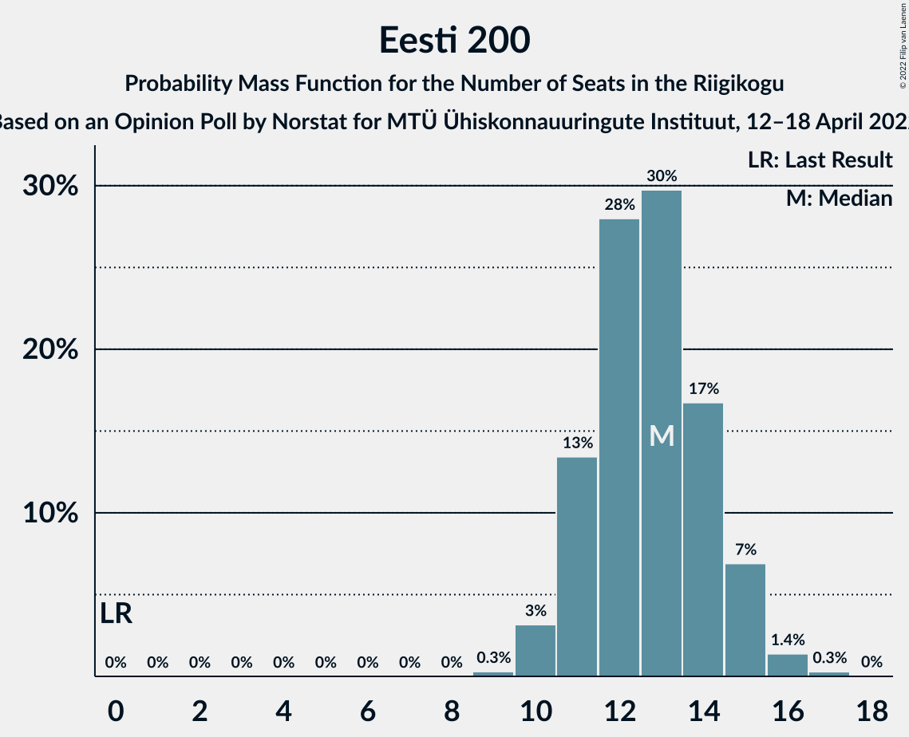

# Opinion Poll by Norstat for MTÜ Ühiskonnauuringute Instituut, 12–18 April 2022

<a href="#voting-intentions">Voting Intentions</a> | <a href="#seats">Seats</a> | <a href="#coalitions">Coalitions</a> | <a href="#technical-information">Technical Information</a>

## Voting Intentions

### Confidence Intervals

| Party | Last Result | Poll Result | 80% Confidence Interval | 90% Confidence Interval | 95% Confidence Interval | 99% Confidence Interval |
|:-----:|:-----------:|:-----------:|:-----------------------:|:-----------------------:|:-----------------------:|:-----------------------:|
| Eesti Reformierakond | 28.9% | 30.9% | 29.1–32.8% |28.5–33.4% |28.1–33.8% |27.3–34.8% |
| Eesti Konservatiivne Rahvaerakond | 17.8% | 22.5% | 20.9–24.3% |20.4–24.8% |20.0–25.2% |19.3–26.1% |
| Eesti Keskerakond | 23.1% | 18.5% | 17.0–20.1% |16.6–20.6% |16.2–21.0% |15.5–21.8% |
| Eesti 200 | 4.4% | 12.5% | 11.2–13.9% |10.9–14.3% |10.6–14.7% |10.0–15.4% |
| Sotsiaaldemokraatlik Erakond | 9.8% | 5.9% | 5.0–7.0% |4.8–7.3% |4.6–7.5% |4.2–8.1% |
| Erakond Isamaa | 11.4% | 5.3% | 4.5–6.3% |4.3–6.6% |4.1–6.9% |3.7–7.4% |
| Erakond Eestimaa Rohelised | 1.8% | 2.1% | 1.6–2.8% |1.5–3.0% |1.4–3.2% |1.2–3.6% |

*Note:* The poll result column reflects the actual value used in the calculations. Published results may vary slightly, and in addition be rounded to fewer digits.

## Seats

### Confidence Intervals

| Party | Last Result | Median | 80% Confidence Interval | 90% Confidence Interval | 95% Confidence Interval | 99% Confidence Interval |
|:-----:|:-----------:|:------:|:-----------------------:|:-----------------------:|:-----------------------:|:-----------------------:|
| <a href="#eesti-reformierakond">Eesti Reformierakond</a> | 34 | 35 | 33–38 |32–39 |32–40 |30–41 |
| <a href="#eesti-konservatiivne-rahvaerakond">Eesti Konservatiivne Rahvaerakond</a> | 19 | 25 | 22–27 |22–28 |21–28 |20–30 |
| <a href="#eesti-keskerakond">Eesti Keskerakond</a> | 26 | 20 | 18–22 |17–23 |17–23 |16–24 |
| <a href="#eesti-200">Eesti 200</a> | 0 | 13 | 11–14 |11–15 |10–15 |10–16 |
| <a href="#sotsiaaldemokraatlik-erakond">Sotsiaaldemokraatlik Erakond</a> | 10 | 5 | 0–6 |0–7 |0–7 |0–8 |
| <a href="#erakond-isamaa">Erakond Isamaa</a> | 12 | 5 | 0–6 |0–6 |0–6 |0–7 |
| <a href="#erakond-eestimaa-rohelised">Erakond Eestimaa Rohelised</a> | 0 | 0 | 0 |0 |0 |0 |

### Eesti Reformierakond

*For a full overview of the results for this party, see the [Eesti Reformierakond](party-eestireformierakond.html) page.*

| Number of Seats | Probability | Accumulated | Special Marks |
|:---------------:|:-----------:|:-----------:|:-------------:|
| 29 | 0.1% | 100% |  |
| 30 | 0.5% | 99.9% |  |
| 31 | 2% | 99.4% |  |
| 32 | 5% | 98% |  |
| 33 | 12% | 93% |  |
| 34 | 16% | 81% | Last Result |
| 35 | 18% | 65% | Median |
| 36 | 18% | 47% |  |
| 37 | 12% | 28% |  |
| 38 | 8% | 16% |  |
| 39 | 5% | 8% |  |
| 40 | 2% | 3% |  |
| 41 | 0.7% | 0.9% |  |
| 42 | 0.2% | 0.2% |  |
| 43 | 0.1% | 0.1% |  |
| 44 | 0% | 0% |  |

### Eesti Konservatiivne Rahvaerakond

*For a full overview of the results for this party, see the [Eesti Konservatiivne Rahvaerakond](party-eestikonservatiivnerahvaerakond.html) page.*

| Number of Seats | Probability | Accumulated | Special Marks |
|:---------------:|:-----------:|:-----------:|:-------------:|
| 19 | 0% | 100% | Last Result |
| 20 | 0.5% | 100% |  |
| 21 | 2% | 99.5% |  |
| 22 | 7% | 97% |  |
| 23 | 13% | 90% |  |
| 24 | 20% | 77% |  |
| 25 | 25% | 57% | Median |
| 26 | 16% | 32% |  |
| 27 | 9% | 16% |  |
| 28 | 5% | 7% |  |
| 29 | 2% | 2% |  |
| 30 | 0.6% | 0.7% |  |
| 31 | 0.1% | 0.1% |  |
| 32 | 0% | 0% |  |

### Eesti Keskerakond

*For a full overview of the results for this party, see the [Eesti Keskerakond](party-eestikeskerakond.html) page.*

| Number of Seats | Probability | Accumulated | Special Marks |
|:---------------:|:-----------:|:-----------:|:-------------:|
| 15 | 0.1% | 100% |  |
| 16 | 1.2% | 99.9% |  |
| 17 | 5% | 98.6% |  |
| 18 | 13% | 93% |  |
| 19 | 23% | 81% |  |
| 20 | 24% | 58% | Median |
| 21 | 18% | 34% |  |
| 22 | 10% | 16% |  |
| 23 | 4% | 6% |  |
| 24 | 1.2% | 2% |  |
| 25 | 0.3% | 0.3% |  |
| 26 | 0% | 0.1% | Last Result |
| 27 | 0% | 0% |  |

### Eesti 200

*For a full overview of the results for this party, see the [Eesti 200](party-eesti200.html) page.*

| Number of Seats | Probability | Accumulated | Special Marks |
|:---------------:|:-----------:|:-----------:|:-------------:|
| 0 | 0% | 100% | Last Result |
| 1 | 0% | 100% |  |
| 2 | 0% | 100% |  |
| 3 | 0% | 100% |  |
| 4 | 0% | 100% |  |
| 5 | 0% | 100% |  |
| 6 | 0% | 100% |  |
| 7 | 0% | 100% |  |
| 8 | 0% | 100% |  |
| 9 | 0.3% | 100% |  |
| 10 | 3% | 99.7% |  |
| 11 | 13% | 97% |  |
| 12 | 28% | 83% |  |
| 13 | 30% | 55% | Median |
| 14 | 17% | 25% |  |
| 15 | 7% | 9% |  |
| 16 | 1.4% | 2% |  |
| 17 | 0.3% | 0.3% |  |
| 18 | 0% | 0% |  |

### Sotsiaaldemokraatlik Erakond

*For a full overview of the results for this party, see the [Sotsiaaldemokraatlik Erakond](party-sotsiaaldemokraatlikerakond.html) page.*

| Number of Seats | Probability | Accumulated | Special Marks |
|:---------------:|:-----------:|:-----------:|:-------------:|
| 0 | 11% | 100% |  |
| 1 | 0% | 89% |  |
| 2 | 0% | 89% |  |
| 3 | 0% | 89% |  |
| 4 | 4% | 89% |  |
| 5 | 48% | 85% | Median |
| 6 | 30% | 37% |  |
| 7 | 7% | 7% |  |
| 8 | 0.7% | 0.7% |  |
| 9 | 0% | 0% |  |
| 10 | 0% | 0% | Last Result |

### Erakond Isamaa

*For a full overview of the results for this party, see the [Erakond Isamaa](party-erakondisamaa.html) page.*

| Number of Seats | Probability | Accumulated | Special Marks |
|:---------------:|:-----------:|:-----------:|:-------------:|
| 0 | 32% | 100% |  |
| 1 | 0% | 68% |  |
| 2 | 0% | 68% |  |
| 3 | 0% | 68% |  |
| 4 | 15% | 68% |  |
| 5 | 42% | 54% | Median |
| 6 | 11% | 12% |  |
| 7 | 1.0% | 1.0% |  |
| 8 | 0% | 0% |  |
| 9 | 0% | 0% |  |
| 10 | 0% | 0% |  |
| 11 | 0% | 0% |  |
| 12 | 0% | 0% | Last Result |

### Erakond Eestimaa Rohelised

*For a full overview of the results for this party, see the [Erakond Eestimaa Rohelised](party-erakondeestimaarohelised.html) page.*

| Number of Seats | Probability | Accumulated | Special Marks |
|:---------------:|:-----------:|:-----------:|:-------------:|
| 0 | 100% | 100% | Last Result, Median |

## Coalitions

### Confidence Intervals

| Coalition | Last Result | Median | Majority? | 80% Confidence Interval | 90% Confidence Interval | 95% Confidence Interval | 99% Confidence Interval |
|:---------:|:-----------:|:------:|:---------:|:-----------------------:|:-----------------------:|:-----------------------:|:-----------------------:|
| Eesti Reformierakond – Eesti Konservatiivne Rahvaerakond – Eesti Keskerakond | 79 | 80 | 100% | 77–84 | 76–85 | 76–86 | 75–88 |
| Eesti Reformierakond – Eesti Konservatiivne Rahvaerakond – Erakond Isamaa | 65 | 63 | 100% | 61–66 | 60–67 | 59–68 | 58–70 |
| Eesti Reformierakond – Eesti Konservatiivne Rahvaerakond | 53 | 60 | 100% | 57–64 | 56–65 | 56–65 | 54–68 |
| Eesti Reformierakond – Eesti Keskerakond | 60 | 55 | 98% | 52–58 | 51–59 | 51–60 | 50–63 |
| Eesti Konservatiivne Rahvaerakond – Eesti Keskerakond – Erakond Isamaa | 57 | 48 | 14% | 45–51 | 44–52 | 43–53 | 42–54 |
| Eesti Konservatiivne Rahvaerakond – Eesti Keskerakond | 45 | 45 | 0.7% | 42–48 | 41–49 | 41–50 | 39–51 |
| Eesti Reformierakond – Sotsiaaldemokraatlik Erakond – Erakond Isamaa | 56 | 44 | 0.1% | 40–47 | 39–47 | 38–48 | 37–49 |
| Eesti Reformierakond – Sotsiaaldemokraatlik Erakond | 44 | 40 | 0% | 37–43 | 36–44 | 35–45 | 34–46 |
| Eesti Reformierakond – Erakond Isamaa | 46 | 39 | 0% | 36–42 | 35–43 | 34–43 | 32–45 |
| Eesti Konservatiivne Rahvaerakond – Sotsiaaldemokraatlik Erakond | 29 | 30 | 0% | 27–32 | 26–33 | 25–34 | 23–35 |
| Eesti Keskerakond – Sotsiaaldemokraatlik Erakond – Erakond Isamaa | 48 | 29 | 0% | 24–31 | 24–32 | 22–33 | 20–34 |
| Eesti Keskerakond – Sotsiaaldemokraatlik Erakond | 36 | 25 | 0% | 22–27 | 21–28 | 19–29 | 18–30 |

### Eesti Reformierakond – Eesti Konservatiivne Rahvaerakond – Eesti Keskerakond

| Number of Seats | Probability | Accumulated | Special Marks |
|:---------------:|:-----------:|:-----------:|:-------------:|
| 73 | 0.1% | 100% |  |
| 74 | 0.3% | 99.9% |  |
| 75 | 2% | 99.7% |  |
| 76 | 5% | 98% |  |
| 77 | 10% | 93% |  |
| 78 | 20% | 83% |  |
| 79 | 12% | 64% | Last Result |
| 80 | 13% | 52% | Median |
| 81 | 9% | 39% |  |
| 82 | 9% | 30% |  |
| 83 | 9% | 21% |  |
| 84 | 6% | 12% |  |
| 85 | 2% | 5% |  |
| 86 | 1.1% | 3% |  |
| 87 | 1.0% | 2% |  |
| 88 | 0.9% | 1.3% |  |
| 89 | 0.4% | 0.5% |  |
| 90 | 0% | 0.1% |  |
| 91 | 0% | 0% |  |

### Eesti Reformierakond – Eesti Konservatiivne Rahvaerakond – Erakond Isamaa

| Number of Seats | Probability | Accumulated | Special Marks |
|:---------------:|:-----------:|:-----------:|:-------------:|
| 56 | 0% | 100% |  |
| 57 | 0.2% | 99.9% |  |
| 58 | 0.7% | 99.7% |  |
| 59 | 2% | 99.0% |  |
| 60 | 5% | 97% |  |
| 61 | 9% | 92% |  |
| 62 | 15% | 82% |  |
| 63 | 18% | 67% |  |
| 64 | 18% | 49% |  |
| 65 | 12% | 32% | Last Result, Median |
| 66 | 10% | 20% |  |
| 67 | 5% | 9% |  |
| 68 | 2% | 5% |  |
| 69 | 1.0% | 2% |  |
| 70 | 1.0% | 1.3% |  |
| 71 | 0.2% | 0.2% |  |
| 72 | 0.1% | 0.1% |  |
| 73 | 0% | 0% |  |

### Eesti Reformierakond – Eesti Konservatiivne Rahvaerakond

| Number of Seats | Probability | Accumulated | Special Marks |
|:---------------:|:-----------:|:-----------:|:-------------:|
| 53 | 0.1% | 100% | Last Result |
| 54 | 0.5% | 99.9% |  |
| 55 | 2% | 99.5% |  |
| 56 | 4% | 98% |  |
| 57 | 8% | 94% |  |
| 58 | 14% | 86% |  |
| 59 | 16% | 72% |  |
| 60 | 12% | 56% | Median |
| 61 | 15% | 44% |  |
| 62 | 11% | 29% |  |
| 63 | 7% | 18% |  |
| 64 | 5% | 11% |  |
| 65 | 3% | 5% |  |
| 66 | 1.3% | 2% |  |
| 67 | 0.5% | 1.1% |  |
| 68 | 0.4% | 0.5% |  |
| 69 | 0.1% | 0.1% |  |
| 70 | 0% | 0% |  |

### Eesti Reformierakond – Eesti Keskerakond

| Number of Seats | Probability | Accumulated | Special Marks |
|:---------------:|:-----------:|:-----------:|:-------------:|
| 48 | 0.1% | 100% |  |
| 49 | 0.2% | 99.9% |  |
| 50 | 2% | 99.7% |  |
| 51 | 3% | 98% | Majority |
| 52 | 5% | 95% |  |
| 53 | 16% | 90% |  |
| 54 | 16% | 73% |  |
| 55 | 12% | 57% | Median |
| 56 | 15% | 46% |  |
| 57 | 11% | 31% |  |
| 58 | 10% | 20% |  |
| 59 | 4% | 9% |  |
| 60 | 3% | 5% | Last Result |
| 61 | 1.0% | 2% |  |
| 62 | 0.5% | 1.1% |  |
| 63 | 0.5% | 0.6% |  |
| 64 | 0% | 0.1% |  |
| 65 | 0% | 0% |  |

### Eesti Konservatiivne Rahvaerakond – Eesti Keskerakond – Erakond Isamaa

| Number of Seats | Probability | Accumulated | Special Marks |
|:---------------:|:-----------:|:-----------:|:-------------:|
| 40 | 0.1% | 100% |  |
| 41 | 0.2% | 99.9% |  |
| 42 | 0.6% | 99.7% |  |
| 43 | 3% | 99.1% |  |
| 44 | 5% | 96% |  |
| 45 | 6% | 92% |  |
| 46 | 12% | 86% |  |
| 47 | 14% | 74% |  |
| 48 | 16% | 60% |  |
| 49 | 15% | 43% |  |
| 50 | 14% | 28% | Median |
| 51 | 7% | 14% | Majority |
| 52 | 4% | 8% |  |
| 53 | 2% | 3% |  |
| 54 | 0.8% | 1.3% |  |
| 55 | 0.3% | 0.4% |  |
| 56 | 0.1% | 0.1% |  |
| 57 | 0% | 0% | Last Result |

### Eesti Konservatiivne Rahvaerakond – Eesti Keskerakond

| Number of Seats | Probability | Accumulated | Special Marks |
|:---------------:|:-----------:|:-----------:|:-------------:|
| 38 | 0.1% | 100% |  |
| 39 | 0.6% | 99.9% |  |
| 40 | 2% | 99.3% |  |
| 41 | 5% | 98% |  |
| 42 | 10% | 93% |  |
| 43 | 14% | 82% |  |
| 44 | 17% | 68% |  |
| 45 | 18% | 51% | Last Result, Median |
| 46 | 13% | 33% |  |
| 47 | 9% | 21% |  |
| 48 | 7% | 12% |  |
| 49 | 3% | 5% |  |
| 50 | 2% | 3% |  |
| 51 | 0.5% | 0.7% | Majority |
| 52 | 0.1% | 0.2% |  |
| 53 | 0% | 0.1% |  |
| 54 | 0% | 0% |  |

### Eesti Reformierakond – Sotsiaaldemokraatlik Erakond – Erakond Isamaa

| Number of Seats | Probability | Accumulated | Special Marks |
|:---------------:|:-----------:|:-----------:|:-------------:|
| 35 | 0.1% | 100% |  |
| 36 | 0.3% | 99.9% |  |
| 37 | 0.7% | 99.6% |  |
| 38 | 1.4% | 98.9% |  |
| 39 | 4% | 97% |  |
| 40 | 6% | 94% |  |
| 41 | 8% | 88% |  |
| 42 | 11% | 81% |  |
| 43 | 15% | 70% |  |
| 44 | 16% | 55% |  |
| 45 | 16% | 39% | Median |
| 46 | 12% | 23% |  |
| 47 | 7% | 11% |  |
| 48 | 3% | 5% |  |
| 49 | 1.1% | 2% |  |
| 50 | 0.3% | 0.4% |  |
| 51 | 0.1% | 0.1% | Majority |
| 52 | 0% | 0% |  |
| 53 | 0% | 0% |  |
| 54 | 0% | 0% |  |
| 55 | 0% | 0% |  |
| 56 | 0% | 0% | Last Result |

### Eesti Reformierakond – Sotsiaaldemokraatlik Erakond

| Number of Seats | Probability | Accumulated | Special Marks |
|:---------------:|:-----------:|:-----------:|:-------------:|
| 32 | 0.1% | 100% |  |
| 33 | 0.3% | 99.9% |  |
| 34 | 0.8% | 99.6% |  |
| 35 | 1.5% | 98.8% |  |
| 36 | 3% | 97% |  |
| 37 | 5% | 94% |  |
| 38 | 10% | 89% |  |
| 39 | 16% | 79% |  |
| 40 | 18% | 63% | Median |
| 41 | 15% | 45% |  |
| 42 | 14% | 30% |  |
| 43 | 8% | 16% |  |
| 44 | 4% | 8% | Last Result |
| 45 | 2% | 4% |  |
| 46 | 0.8% | 1.1% |  |
| 47 | 0.2% | 0.3% |  |
| 48 | 0.1% | 0.1% |  |
| 49 | 0% | 0% |  |

### Eesti Reformierakond – Erakond Isamaa

| Number of Seats | Probability | Accumulated | Special Marks |
|:---------------:|:-----------:|:-----------:|:-------------:|
| 31 | 0.1% | 100% |  |
| 32 | 0.5% | 99.9% |  |
| 33 | 0.9% | 99.5% |  |
| 34 | 3% | 98.5% |  |
| 35 | 5% | 95% |  |
| 36 | 9% | 91% |  |
| 37 | 11% | 82% |  |
| 38 | 16% | 71% |  |
| 39 | 16% | 55% |  |
| 40 | 15% | 40% | Median |
| 41 | 11% | 24% |  |
| 42 | 7% | 13% |  |
| 43 | 4% | 6% |  |
| 44 | 1.4% | 2% |  |
| 45 | 0.5% | 0.7% |  |
| 46 | 0.1% | 0.2% | Last Result |
| 47 | 0% | 0% |  |

### Eesti Konservatiivne Rahvaerakond – Sotsiaaldemokraatlik Erakond

| Number of Seats | Probability | Accumulated | Special Marks |
|:---------------:|:-----------:|:-----------:|:-------------:|
| 22 | 0.2% | 100% |  |
| 23 | 0.5% | 99.8% |  |
| 24 | 1.3% | 99.3% |  |
| 25 | 2% | 98% |  |
| 26 | 5% | 96% |  |
| 27 | 8% | 91% |  |
| 28 | 10% | 83% |  |
| 29 | 15% | 73% | Last Result |
| 30 | 23% | 58% | Median |
| 31 | 17% | 35% |  |
| 32 | 10% | 18% |  |
| 33 | 4% | 8% |  |
| 34 | 3% | 4% |  |
| 35 | 0.7% | 0.9% |  |
| 36 | 0.2% | 0.2% |  |
| 37 | 0% | 0% |  |

### Eesti Keskerakond – Sotsiaaldemokraatlik Erakond – Erakond Isamaa

| Number of Seats | Probability | Accumulated | Special Marks |
|:---------------:|:-----------:|:-----------:|:-------------:|
| 19 | 0.2% | 100% |  |
| 20 | 0.5% | 99.7% |  |
| 21 | 0.8% | 99.2% |  |
| 22 | 1.3% | 98% |  |
| 23 | 2% | 97% |  |
| 24 | 6% | 95% |  |
| 25 | 7% | 89% |  |
| 26 | 10% | 82% |  |
| 27 | 11% | 72% |  |
| 28 | 11% | 62% |  |
| 29 | 16% | 50% |  |
| 30 | 14% | 35% | Median |
| 31 | 12% | 21% |  |
| 32 | 6% | 9% |  |
| 33 | 2% | 3% |  |
| 34 | 0.5% | 0.7% |  |
| 35 | 0.1% | 0.2% |  |
| 36 | 0% | 0% |  |
| 37 | 0% | 0% |  |
| 38 | 0% | 0% |  |
| 39 | 0% | 0% |  |
| 40 | 0% | 0% |  |
| 41 | 0% | 0% |  |
| 42 | 0% | 0% |  |
| 43 | 0% | 0% |  |
| 44 | 0% | 0% |  |
| 45 | 0% | 0% |  |
| 46 | 0% | 0% |  |
| 47 | 0% | 0% |  |
| 48 | 0% | 0% | Last Result |

### Eesti Keskerakond – Sotsiaaldemokraatlik Erakond

| Number of Seats | Probability | Accumulated | Special Marks |
|:---------------:|:-----------:|:-----------:|:-------------:|
| 17 | 0.1% | 100% |  |
| 18 | 0.6% | 99.9% |  |
| 19 | 2% | 99.2% |  |
| 20 | 2% | 97% |  |
| 21 | 3% | 96% |  |
| 22 | 6% | 92% |  |
| 23 | 11% | 87% |  |
| 24 | 18% | 76% |  |
| 25 | 20% | 58% | Median |
| 26 | 18% | 38% |  |
| 27 | 12% | 20% |  |
| 28 | 5% | 8% |  |
| 29 | 2% | 3% |  |
| 30 | 0.6% | 0.7% |  |
| 31 | 0.1% | 0.1% |  |
| 32 | 0% | 0% |  |
| 33 | 0% | 0% |  |
| 34 | 0% | 0% |  |
| 35 | 0% | 0% |  |
| 36 | 0% | 0% | Last Result |

## Technical Information

### Opinion Poll

+ **Polling firm:** Norstat
+ **Commissioner(s):** MTÜ Ühiskonnauuringute Instituut
+ **Fieldwork period:** 12–18 April 2022

### Calculations

+ **Sample size:** 1000
+ **Simulations done:** 1,048,576
+ **Error estimate:** 1.97%

