# Opinion Poll by Turu-uuringute AS, 18 April 2022

<a href="#voting-intentions">Voting Intentions</a> | <a href="#seats">Seats</a> | <a href="#coalitions">Coalitions</a> | <a href="#technical-information">Technical Information</a>

## Voting Intentions

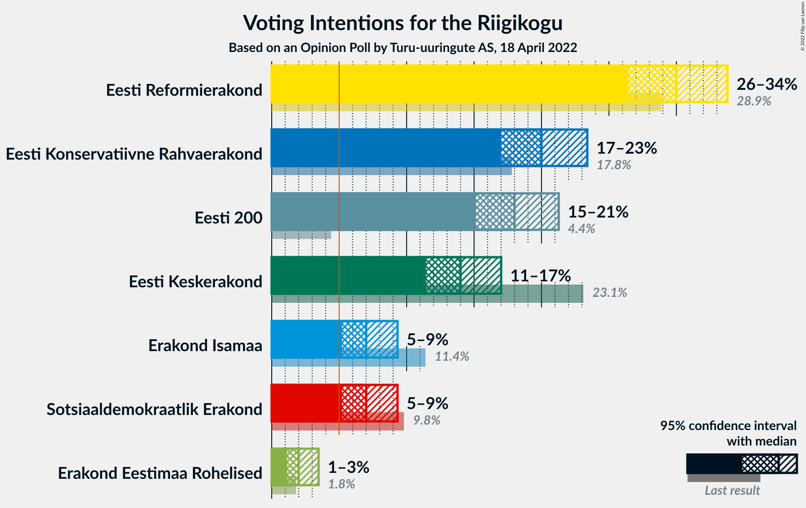

### Confidence Intervals

| Party | Last Result | Poll Result | 80% Confidence Interval | 90% Confidence Interval | 95% Confidence Interval | 99% Confidence Interval |
|:-----:|:-----------:|:-----------:|:-----------------------:|:-----------------------:|:-----------------------:|:-----------------------:|
| Eesti Reformierakond | 28.9% | 30.0% | 27.7–32.5% |27.0–33.2% |26.5–33.8% |25.4–35.0% |
| Eesti Konservatiivne Rahvaerakond | 17.8% | 20.0% | 18.0–22.2% |17.5–22.8% |17.0–23.4% |16.1–24.5% |
| Eesti 200 | 4.4% | 18.0% | 16.1–20.1% |15.6–20.7% |15.1–21.3% |14.3–22.3% |
| Eesti Keskerakond | 23.1% | 14.0% | 12.3–16.0% |11.8–16.5% |11.4–17.0% |10.7–18.0% |
| Sotsiaaldemokraatlik Erakond | 9.8% | 7.0% | 5.8–8.5% |5.5–8.9% |5.2–9.3% |4.7–10.1% |
| Erakond Isamaa | 11.4% | 7.0% | 5.8–8.5% |5.5–8.9% |5.2–9.3% |4.7–10.1% |
| Erakond Eestimaa Rohelised | 1.8% | 2.0% | 1.4–3.0% |1.3–3.2% |1.1–3.5% |0.9–4.0% |

*Note:* The poll result column reflects the actual value used in the calculations. Published results may vary slightly, and in addition be rounded to fewer digits.

## Seats

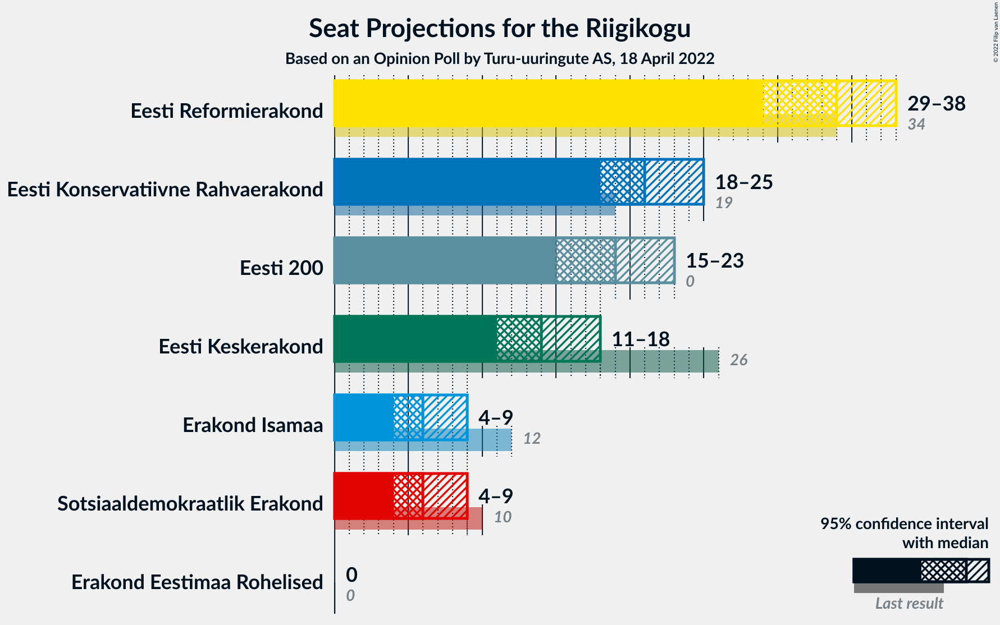

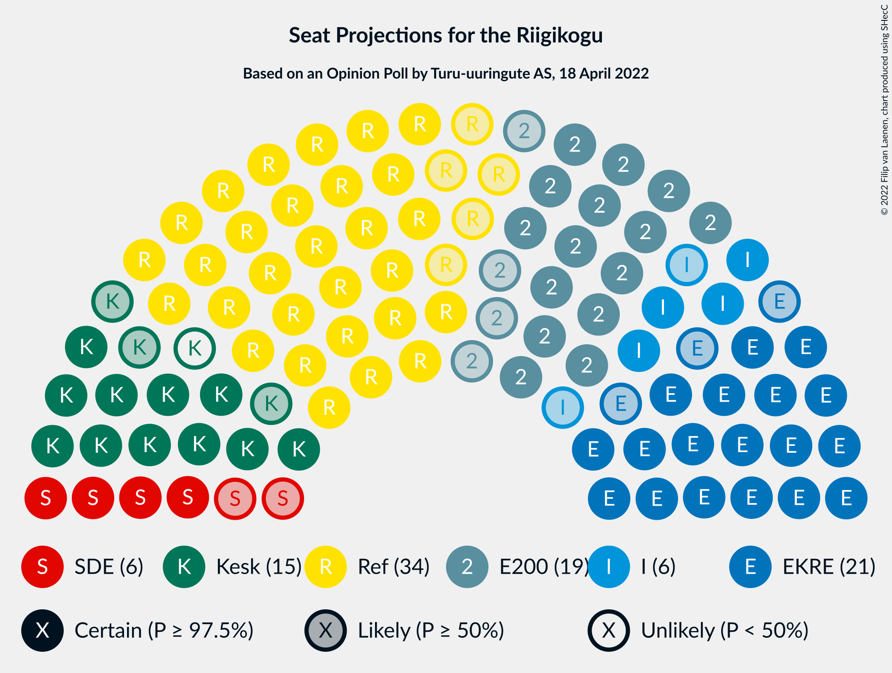

### Confidence Intervals

| Party | Last Result | Median | 80% Confidence Interval | 90% Confidence Interval | 95% Confidence Interval | 99% Confidence Interval |
|:-----:|:-----------:|:------:|:-----------------------:|:-----------------------:|:-----------------------:|:-----------------------:|
| <a href="#eesti-reformierakond">Eesti Reformierakond</a> | 34 | 34 | 31–37 |30–38 |29–38 |28–40 |
| <a href="#eesti-konservatiivne-rahvaerakond">Eesti Konservatiivne Rahvaerakond</a> | 19 | 21 | 19–24 |18–25 |18–25 |17–27 |
| <a href="#eesti-200">Eesti 200</a> | 0 | 19 | 17–21 |16–22 |15–23 |14–24 |
| <a href="#eesti-keskerakond">Eesti Keskerakond</a> | 26 | 14 | 12–16 |12–17 |11–18 |10–19 |
| <a href="#sotsiaaldemokraatlik-erakond">Sotsiaaldemokraatlik Erakond</a> | 10 | 6 | 5–8 |5–8 |4–9 |0–10 |
| <a href="#erakond-isamaa">Erakond Isamaa</a> | 12 | 6 | 5–8 |5–8 |4–9 |0–10 |
| <a href="#erakond-eestimaa-rohelised">Erakond Eestimaa Rohelised</a> | 0 | 0 | 0 |0 |0 |0 |

### Eesti Reformierakond

*For a full overview of the results for this party, see the [Eesti Reformierakond](party-eestireformierakond.html) page.*

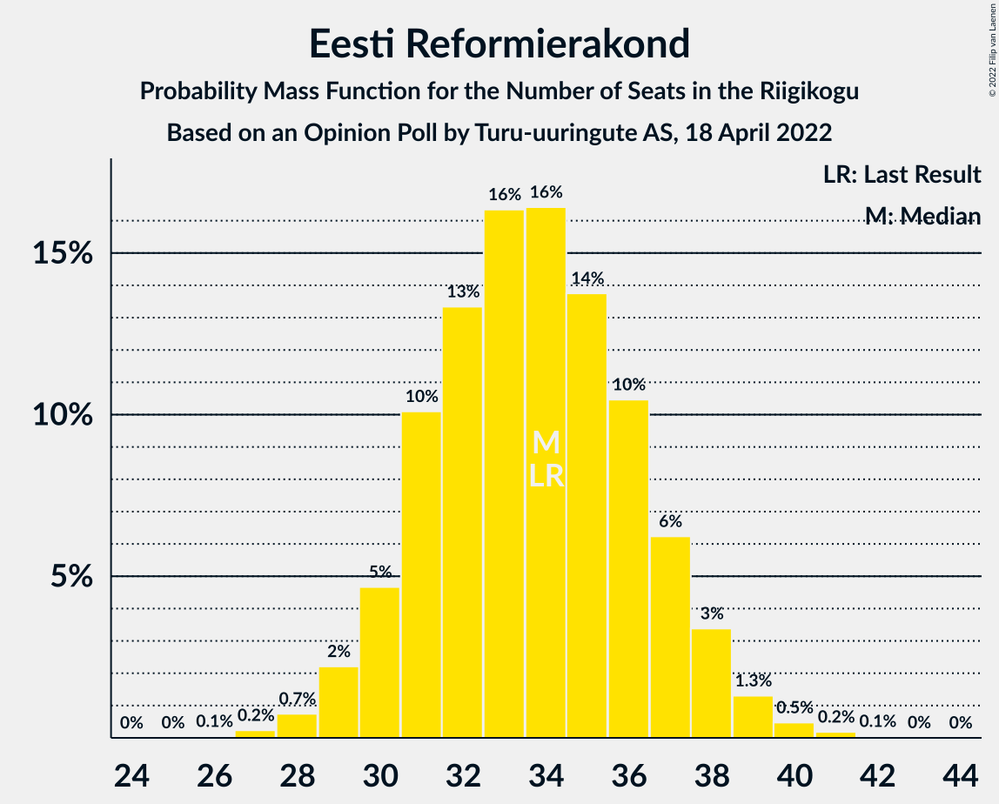

| Number of Seats | Probability | Accumulated | Special Marks |
|:---------------:|:-----------:|:-----------:|:-------------:|
| 26 | 0.1% | 100% |  |
| 27 | 0.2% | 99.9% |  |
| 28 | 0.7% | 99.7% |  |
| 29 | 2% | 99.0% |  |
| 30 | 5% | 97% |  |
| 31 | 10% | 92% |  |
| 32 | 13% | 82% |  |
| 33 | 16% | 69% |  |
| 34 | 16% | 52% | Last Result, Median |
| 35 | 14% | 36% |  |
| 36 | 10% | 22% |  |
| 37 | 6% | 12% |  |
| 38 | 3% | 5% |  |
| 39 | 1.3% | 2% |  |
| 40 | 0.5% | 0.7% |  |
| 41 | 0.2% | 0.3% |  |
| 42 | 0.1% | 0.1% |  |
| 43 | 0% | 0% |  |

### Eesti Konservatiivne Rahvaerakond

*For a full overview of the results for this party, see the [Eesti Konservatiivne Rahvaerakond](party-eestikonservatiivnerahvaerakond.html) page.*

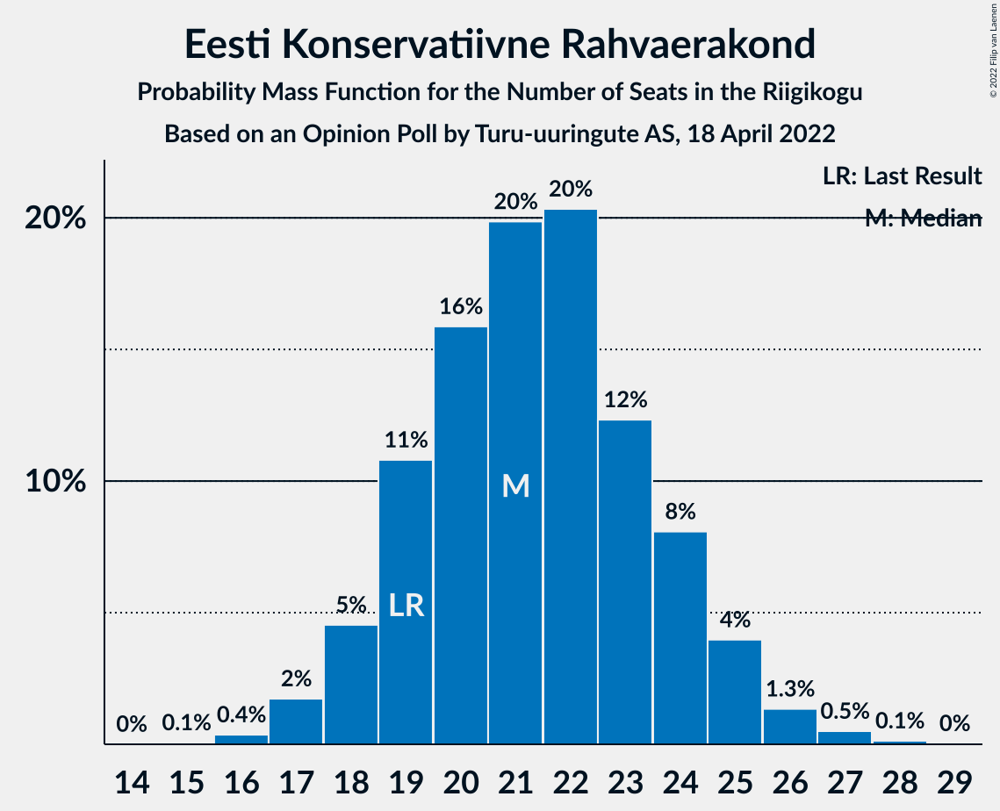

| Number of Seats | Probability | Accumulated | Special Marks |
|:---------------:|:-----------:|:-----------:|:-------------:|
| 15 | 0.1% | 100% |  |
| 16 | 0.4% | 99.9% |  |
| 17 | 2% | 99.6% |  |
| 18 | 5% | 98% |  |
| 19 | 11% | 93% | Last Result |
| 20 | 16% | 82% |  |
| 21 | 20% | 67% | Median |
| 22 | 20% | 47% |  |
| 23 | 12% | 26% |  |
| 24 | 8% | 14% |  |
| 25 | 4% | 6% |  |
| 26 | 1.3% | 2% |  |
| 27 | 0.5% | 0.7% |  |
| 28 | 0.1% | 0.2% |  |
| 29 | 0% | 0% |  |

### Eesti 200

*For a full overview of the results for this party, see the [Eesti 200](party-eesti200.html) page.*

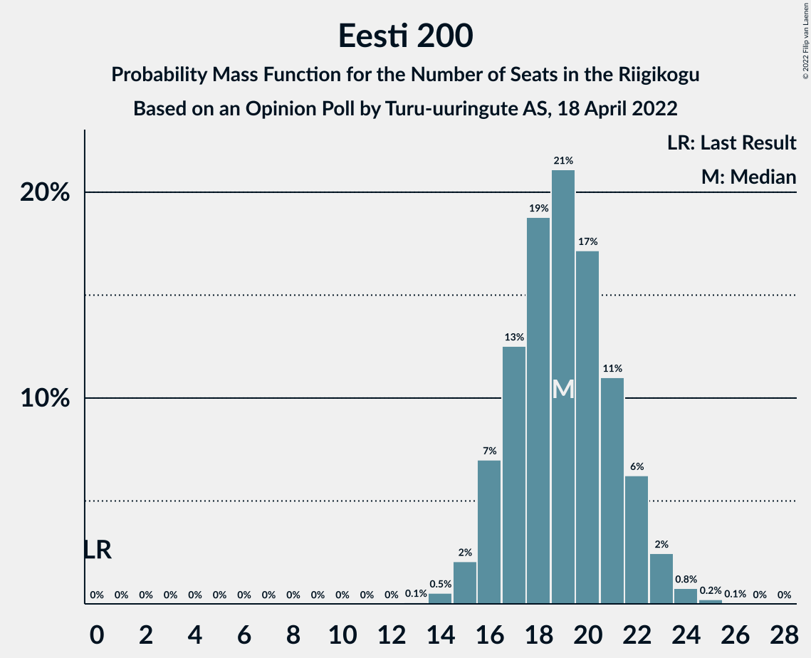

| Number of Seats | Probability | Accumulated | Special Marks |
|:---------------:|:-----------:|:-----------:|:-------------:|
| 0 | 0% | 100% | Last Result |
| 1 | 0% | 100% |  |
| 2 | 0% | 100% |  |
| 3 | 0% | 100% |  |
| 4 | 0% | 100% |  |
| 5 | 0% | 100% |  |
| 6 | 0% | 100% |  |
| 7 | 0% | 100% |  |
| 8 | 0% | 100% |  |
| 9 | 0% | 100% |  |
| 10 | 0% | 100% |  |
| 11 | 0% | 100% |  |
| 12 | 0% | 100% |  |
| 13 | 0.1% | 100% |  |
| 14 | 0.5% | 99.9% |  |
| 15 | 2% | 99.4% |  |
| 16 | 7% | 97% |  |
| 17 | 13% | 90% |  |
| 18 | 19% | 78% |  |
| 19 | 21% | 59% | Median |
| 20 | 17% | 38% |  |
| 21 | 11% | 21% |  |
| 22 | 6% | 10% |  |
| 23 | 2% | 3% |  |
| 24 | 0.8% | 1.0% |  |
| 25 | 0.2% | 0.3% |  |
| 26 | 0.1% | 0.1% |  |
| 27 | 0% | 0% |  |

### Eesti Keskerakond

*For a full overview of the results for this party, see the [Eesti Keskerakond](party-eestikeskerakond.html) page.*

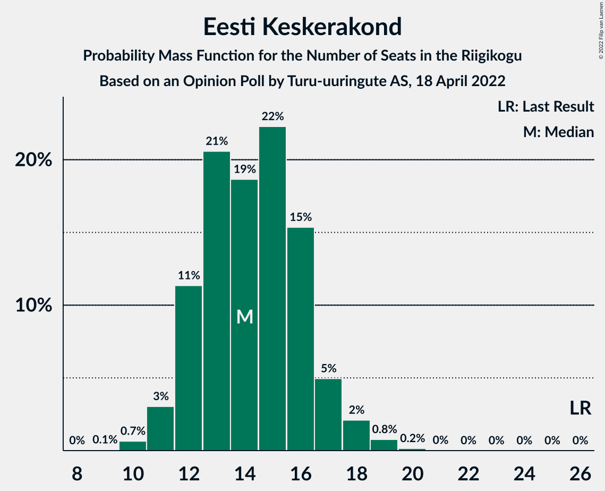

| Number of Seats | Probability | Accumulated | Special Marks |
|:---------------:|:-----------:|:-----------:|:-------------:|
| 9 | 0.1% | 100% |  |
| 10 | 0.7% | 99.9% |  |
| 11 | 3% | 99.3% |  |
| 12 | 11% | 96% |  |
| 13 | 21% | 85% |  |
| 14 | 19% | 64% | Median |
| 15 | 22% | 46% |  |
| 16 | 15% | 23% |  |
| 17 | 5% | 8% |  |
| 18 | 2% | 3% |  |
| 19 | 0.8% | 1.0% |  |
| 20 | 0.2% | 0.2% |  |
| 21 | 0% | 0% |  |
| 22 | 0% | 0% |  |
| 23 | 0% | 0% |  |
| 24 | 0% | 0% |  |
| 25 | 0% | 0% |  |
| 26 | 0% | 0% | Last Result |

### Sotsiaaldemokraatlik Erakond

*For a full overview of the results for this party, see the [Sotsiaaldemokraatlik Erakond](party-sotsiaaldemokraatlikerakond.html) page.*

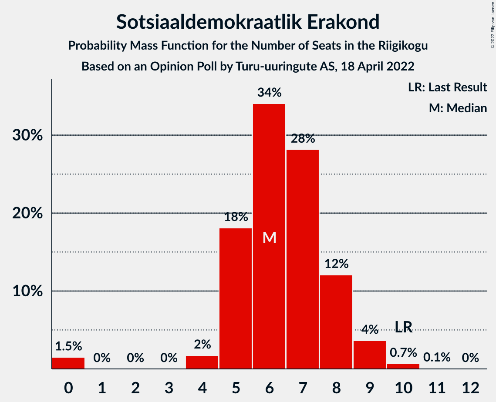

| Number of Seats | Probability | Accumulated | Special Marks |
|:---------------:|:-----------:|:-----------:|:-------------:|
| 0 | 1.5% | 100% |  |
| 1 | 0% | 98.5% |  |
| 2 | 0% | 98.5% |  |
| 3 | 0% | 98.5% |  |
| 4 | 2% | 98.5% |  |
| 5 | 18% | 97% |  |
| 6 | 34% | 79% | Median |
| 7 | 28% | 45% |  |
| 8 | 12% | 16% |  |
| 9 | 4% | 4% |  |
| 10 | 0.7% | 0.8% | Last Result |
| 11 | 0.1% | 0.1% |  |
| 12 | 0% | 0% |  |

### Erakond Isamaa

*For a full overview of the results for this party, see the [Erakond Isamaa](party-erakondisamaa.html) page.*

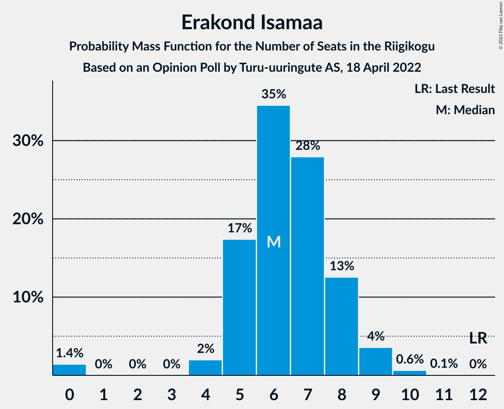

| Number of Seats | Probability | Accumulated | Special Marks |
|:---------------:|:-----------:|:-----------:|:-------------:|
| 0 | 1.4% | 100% |  |
| 1 | 0% | 98.6% |  |
| 2 | 0% | 98.6% |  |
| 3 | 0% | 98.6% |  |
| 4 | 2% | 98.6% |  |
| 5 | 17% | 97% |  |
| 6 | 35% | 79% | Median |
| 7 | 28% | 45% |  |
| 8 | 13% | 17% |  |
| 9 | 4% | 4% |  |
| 10 | 0.6% | 0.7% |  |
| 11 | 0.1% | 0.1% |  |
| 12 | 0% | 0% | Last Result |

### Erakond Eestimaa Rohelised

*For a full overview of the results for this party, see the [Erakond Eestimaa Rohelised](party-erakondeestimaarohelised.html) page.*

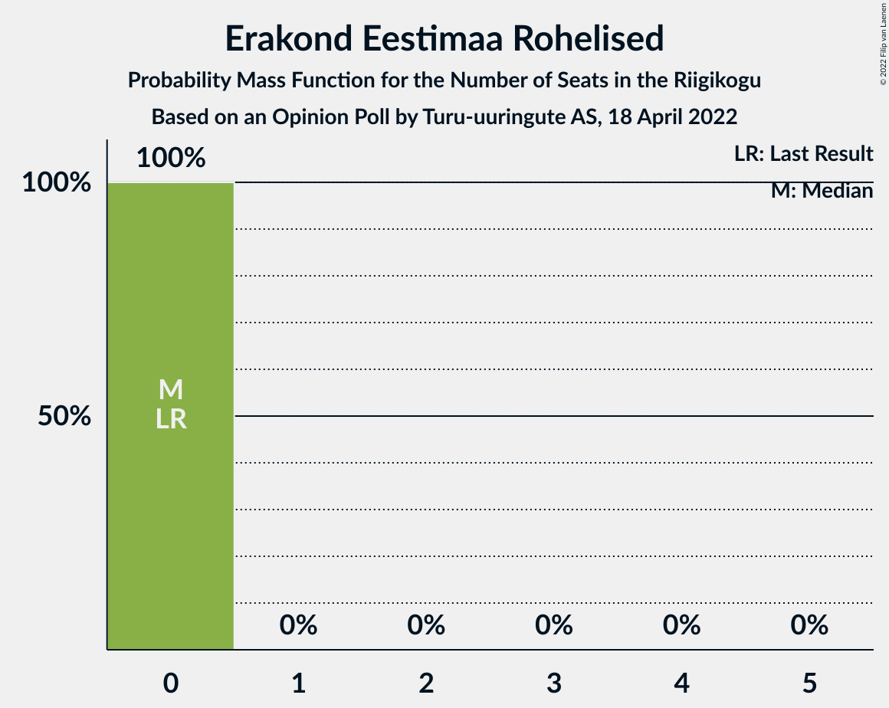

| Number of Seats | Probability | Accumulated | Special Marks |
|:---------------:|:-----------:|:-----------:|:-------------:|
| 0 | 100% | 100% | Last Result, Median |

## Coalitions

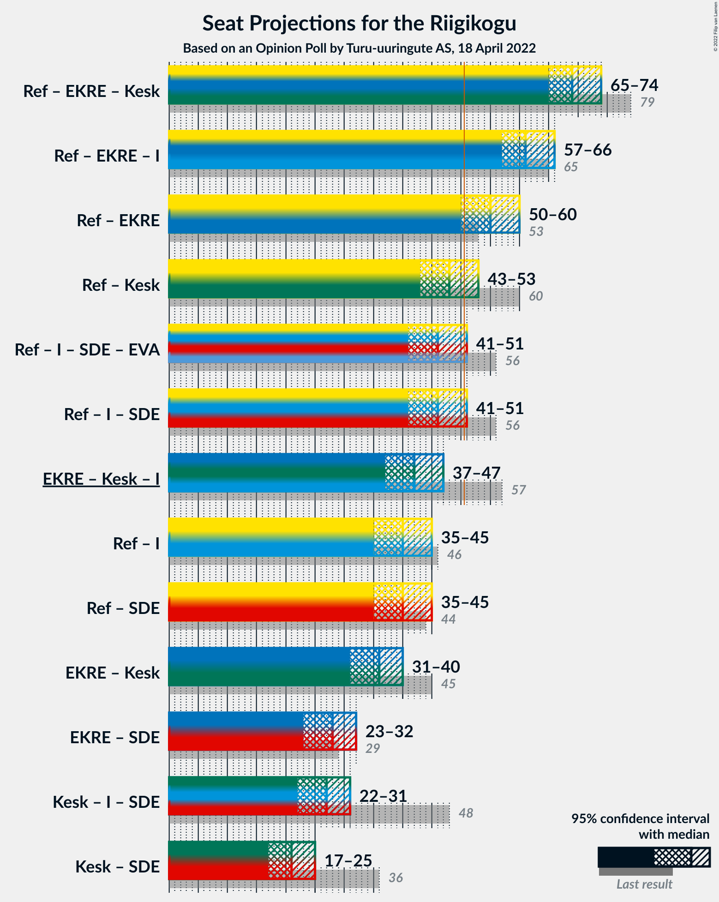

### Confidence Intervals

| Coalition | Last Result | Median | Majority? | 80% Confidence Interval | 90% Confidence Interval | 95% Confidence Interval | 99% Confidence Interval |
|:---------:|:-----------:|:------:|:---------:|:-----------------------:|:-----------------------:|:-----------------------:|:-----------------------:|
| Eesti Reformierakond – Eesti Konservatiivne Rahvaerakond – Eesti Keskerakond | 79 | 69 | 100% | 66–72 | 65–73 | 65–74 | 63–76 |
| Eesti Reformierakond – Eesti Konservatiivne Rahvaerakond – Erakond Isamaa | 65 | 61 | 100% | 58–65 | 57–65 | 57–66 | 55–68 |
| Eesti Reformierakond – Eesti Konservatiivne Rahvaerakond | 53 | 55 | 97% | 52–58 | 51–59 | 50–60 | 49–62 |
| Eesti Reformierakond – Eesti Keskerakond | 60 | 48 | 15% | 45–51 | 44–52 | 43–53 | 42–55 |
| Eesti Reformierakond – Erakond Isamaa – Sotsiaaldemokraatlik Erakond | 56 | 46 | 5% | 43–50 | 42–50 | 41–51 | 40–53 |
| Eesti Konservatiivne Rahvaerakond – Eesti Keskerakond – Erakond Isamaa | 57 | 42 | 0% | 39–45 | 38–46 | 37–47 | 36–48 |
| Eesti Reformierakond – Erakond Isamaa | 46 | 40 | 0% | 37–43 | 36–44 | 35–45 | 33–46 |
| Eesti Reformierakond – Sotsiaaldemokraatlik Erakond | 44 | 40 | 0% | 37–43 | 36–44 | 35–45 | 34–46 |
| Eesti Konservatiivne Rahvaerakond – Eesti Keskerakond | 45 | 36 | 0% | 33–39 | 32–40 | 31–40 | 30–42 |
| Eesti Konservatiivne Rahvaerakond – Sotsiaaldemokraatlik Erakond | 29 | 28 | 0% | 25–31 | 24–31 | 23–32 | 22–34 |
| Eesti Keskerakond – Erakond Isamaa – Sotsiaaldemokraatlik Erakond | 48 | 27 | 0% | 24–30 | 23–31 | 22–31 | 20–33 |
| Eesti Keskerakond – Sotsiaaldemokraatlik Erakond | 36 | 21 | 0% | 18–23 | 18–24 | 17–25 | 14–26 |

### Eesti Reformierakond – Eesti Konservatiivne Rahvaerakond – Eesti Keskerakond

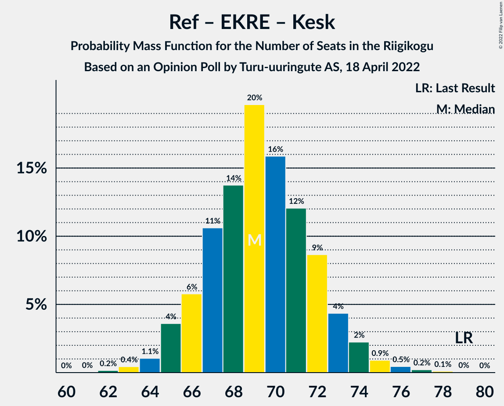

| Number of Seats | Probability | Accumulated | Special Marks |
|:---------------:|:-----------:|:-----------:|:-------------:|
| 62 | 0.2% | 100% |  |
| 63 | 0.4% | 99.8% |  |
| 64 | 1.1% | 99.4% |  |
| 65 | 4% | 98% |  |
| 66 | 6% | 95% |  |
| 67 | 11% | 89% |  |
| 68 | 14% | 78% |  |
| 69 | 20% | 65% | Median |
| 70 | 16% | 45% |  |
| 71 | 12% | 29% |  |
| 72 | 9% | 17% |  |
| 73 | 4% | 8% |  |
| 74 | 2% | 4% |  |
| 75 | 0.9% | 2% |  |
| 76 | 0.5% | 0.8% |  |
| 77 | 0.2% | 0.4% |  |
| 78 | 0.1% | 0.2% |  |
| 79 | 0% | 0% | Last Result |

### Eesti Reformierakond – Eesti Konservatiivne Rahvaerakond – Erakond Isamaa

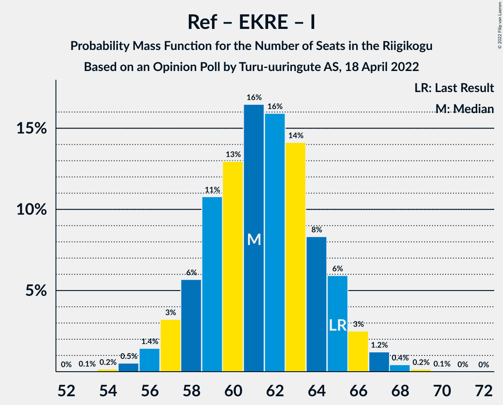

| Number of Seats | Probability | Accumulated | Special Marks |
|:---------------:|:-----------:|:-----------:|:-------------:|
| 53 | 0.1% | 100% |  |
| 54 | 0.2% | 99.9% |  |
| 55 | 0.5% | 99.8% |  |
| 56 | 1.4% | 99.2% |  |
| 57 | 3% | 98% |  |
| 58 | 6% | 95% |  |
| 59 | 11% | 89% |  |
| 60 | 13% | 78% |  |
| 61 | 16% | 65% | Median |
| 62 | 16% | 49% |  |
| 63 | 14% | 33% |  |
| 64 | 8% | 19% |  |
| 65 | 6% | 10% | Last Result |
| 66 | 3% | 4% |  |
| 67 | 1.2% | 2% |  |
| 68 | 0.4% | 0.7% |  |
| 69 | 0.2% | 0.2% |  |
| 70 | 0.1% | 0.1% |  |
| 71 | 0% | 0% |  |

### Eesti Reformierakond – Eesti Konservatiivne Rahvaerakond

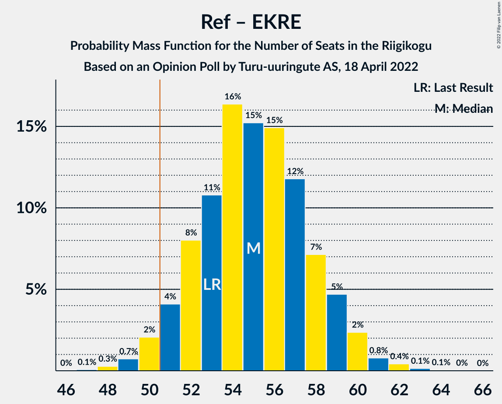

| Number of Seats | Probability | Accumulated | Special Marks |
|:---------------:|:-----------:|:-----------:|:-------------:|
| 47 | 0.1% | 100% |  |
| 48 | 0.3% | 99.9% |  |
| 49 | 0.7% | 99.6% |  |
| 50 | 2% | 98.9% |  |
| 51 | 4% | 97% | Majority |
| 52 | 8% | 93% |  |
| 53 | 11% | 85% | Last Result |
| 54 | 16% | 74% |  |
| 55 | 15% | 58% | Median |
| 56 | 15% | 42% |  |
| 57 | 12% | 27% |  |
| 58 | 7% | 16% |  |
| 59 | 5% | 9% |  |
| 60 | 2% | 4% |  |
| 61 | 0.8% | 1.4% |  |
| 62 | 0.4% | 0.7% |  |
| 63 | 0.1% | 0.2% |  |
| 64 | 0.1% | 0.1% |  |
| 65 | 0% | 0% |  |

### Eesti Reformierakond – Eesti Keskerakond

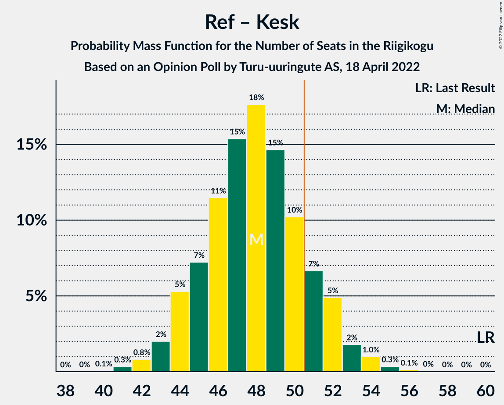

| Number of Seats | Probability | Accumulated | Special Marks |
|:---------------:|:-----------:|:-----------:|:-------------:|
| 40 | 0.1% | 100% |  |
| 41 | 0.3% | 99.9% |  |
| 42 | 0.8% | 99.6% |  |
| 43 | 2% | 98.8% |  |
| 44 | 5% | 97% |  |
| 45 | 7% | 91% |  |
| 46 | 11% | 84% |  |
| 47 | 15% | 73% |  |
| 48 | 18% | 57% | Median |
| 49 | 15% | 40% |  |
| 50 | 10% | 25% |  |
| 51 | 7% | 15% | Majority |
| 52 | 5% | 8% |  |
| 53 | 2% | 3% |  |
| 54 | 1.0% | 2% |  |
| 55 | 0.3% | 0.5% |  |
| 56 | 0.1% | 0.2% |  |
| 57 | 0% | 0.1% |  |
| 58 | 0% | 0% |  |
| 59 | 0% | 0% |  |
| 60 | 0% | 0% | Last Result |

### Eesti Reformierakond – Erakond Isamaa – Sotsiaaldemokraatlik Erakond

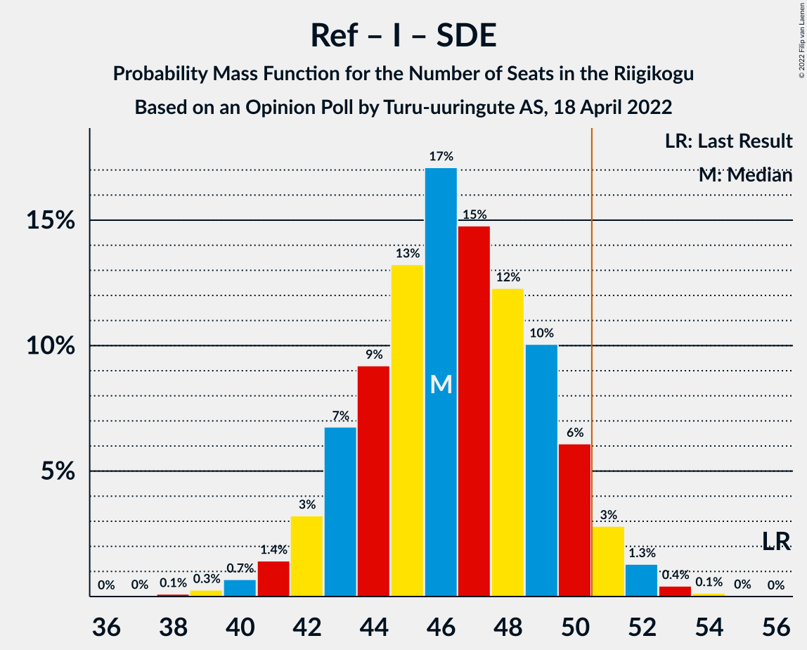

| Number of Seats | Probability | Accumulated | Special Marks |
|:---------------:|:-----------:|:-----------:|:-------------:|
| 38 | 0.1% | 100% |  |
| 39 | 0.3% | 99.8% |  |
| 40 | 0.7% | 99.6% |  |
| 41 | 1.4% | 98.9% |  |
| 42 | 3% | 97% |  |
| 43 | 7% | 94% |  |
| 44 | 9% | 87% |  |
| 45 | 13% | 78% |  |
| 46 | 17% | 65% | Median |
| 47 | 15% | 48% |  |
| 48 | 12% | 33% |  |
| 49 | 10% | 21% |  |
| 50 | 6% | 11% |  |
| 51 | 3% | 5% | Majority |
| 52 | 1.3% | 2% |  |
| 53 | 0.4% | 0.6% |  |
| 54 | 0.1% | 0.2% |  |
| 55 | 0% | 0.1% |  |
| 56 | 0% | 0% | Last Result |

### Eesti Konservatiivne Rahvaerakond – Eesti Keskerakond – Erakond Isamaa

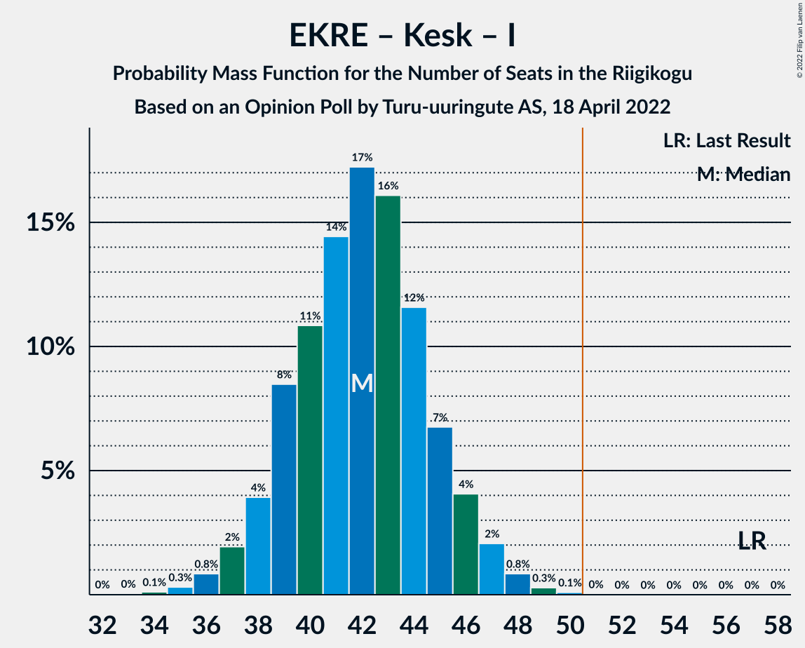

| Number of Seats | Probability | Accumulated | Special Marks |
|:---------------:|:-----------:|:-----------:|:-------------:|
| 33 | 0% | 100% |  |
| 34 | 0.1% | 99.9% |  |
| 35 | 0.3% | 99.8% |  |
| 36 | 0.8% | 99.5% |  |
| 37 | 2% | 98.7% |  |
| 38 | 4% | 97% |  |
| 39 | 8% | 93% |  |
| 40 | 11% | 84% |  |
| 41 | 14% | 73% | Median |
| 42 | 17% | 59% |  |
| 43 | 16% | 42% |  |
| 44 | 12% | 26% |  |
| 45 | 7% | 14% |  |
| 46 | 4% | 7% |  |
| 47 | 2% | 3% |  |
| 48 | 0.8% | 1.3% |  |
| 49 | 0.3% | 0.4% |  |
| 50 | 0.1% | 0.1% |  |
| 51 | 0% | 0% | Majority |
| 52 | 0% | 0% |  |
| 53 | 0% | 0% |  |
| 54 | 0% | 0% |  |
| 55 | 0% | 0% |  |
| 56 | 0% | 0% |  |
| 57 | 0% | 0% | Last Result |

### Eesti Reformierakond – Erakond Isamaa

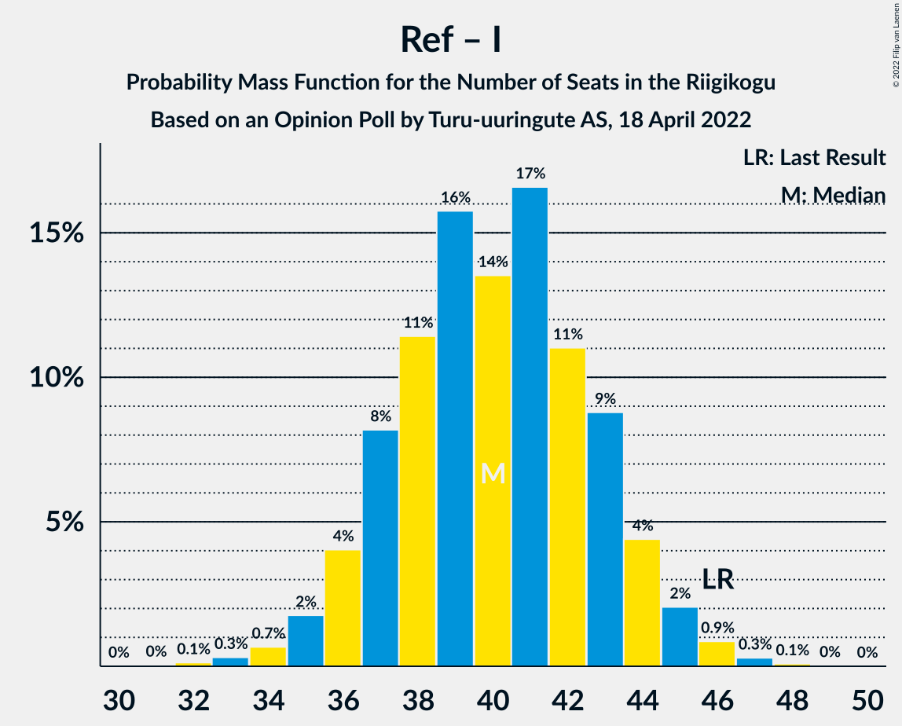

| Number of Seats | Probability | Accumulated | Special Marks |
|:---------------:|:-----------:|:-----------:|:-------------:|
| 31 | 0% | 100% |  |
| 32 | 0.1% | 99.9% |  |
| 33 | 0.3% | 99.8% |  |
| 34 | 0.7% | 99.5% |  |
| 35 | 2% | 98.8% |  |
| 36 | 4% | 97% |  |
| 37 | 8% | 93% |  |
| 38 | 11% | 85% |  |
| 39 | 16% | 73% |  |
| 40 | 14% | 58% | Median |
| 41 | 17% | 44% |  |
| 42 | 11% | 28% |  |
| 43 | 9% | 17% |  |
| 44 | 4% | 8% |  |
| 45 | 2% | 3% |  |
| 46 | 0.9% | 1.3% | Last Result |
| 47 | 0.3% | 0.4% |  |
| 48 | 0.1% | 0.1% |  |
| 49 | 0% | 0% |  |

### Eesti Reformierakond – Sotsiaaldemokraatlik Erakond

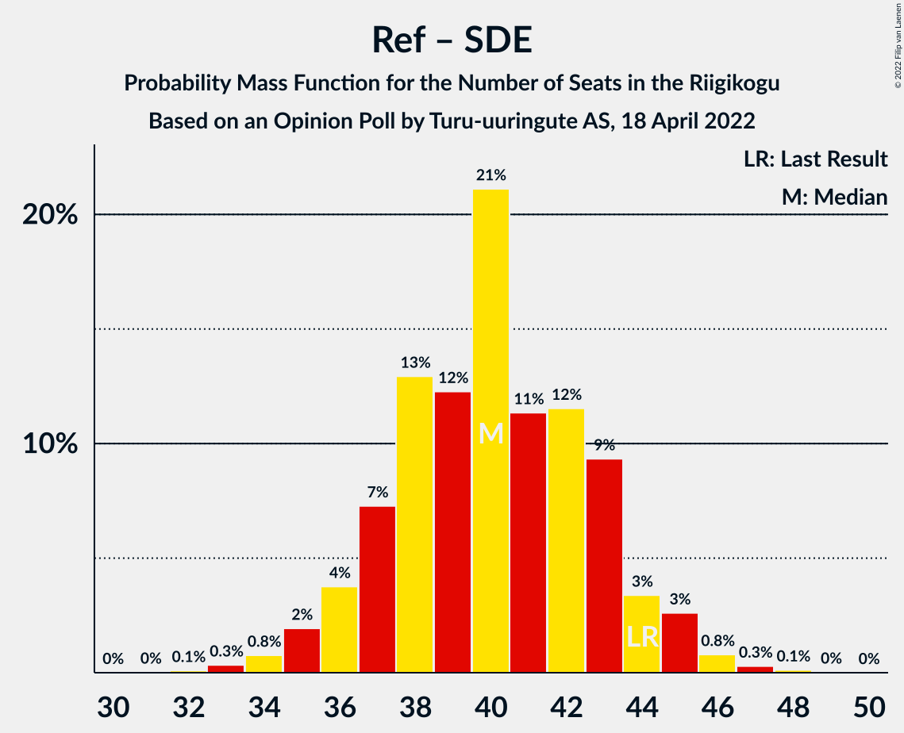

| Number of Seats | Probability | Accumulated | Special Marks |
|:---------------:|:-----------:|:-----------:|:-------------:|
| 32 | 0.1% | 100% |  |
| 33 | 0.3% | 99.9% |  |
| 34 | 0.8% | 99.5% |  |
| 35 | 2% | 98.8% |  |
| 36 | 4% | 97% |  |
| 37 | 7% | 93% |  |
| 38 | 13% | 86% |  |
| 39 | 12% | 73% |  |
| 40 | 21% | 61% | Median |
| 41 | 11% | 39% |  |
| 42 | 12% | 28% |  |
| 43 | 9% | 17% |  |
| 44 | 3% | 7% | Last Result |
| 45 | 3% | 4% |  |
| 46 | 0.8% | 1.2% |  |
| 47 | 0.3% | 0.4% |  |
| 48 | 0.1% | 0.2% |  |
| 49 | 0% | 0% |  |

### Eesti Konservatiivne Rahvaerakond – Eesti Keskerakond

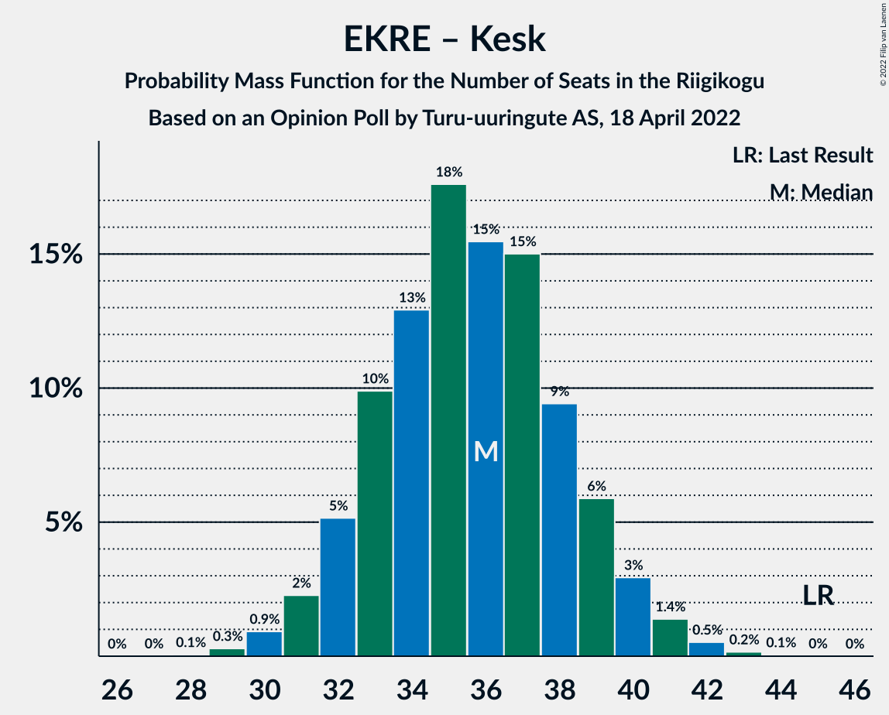

| Number of Seats | Probability | Accumulated | Special Marks |
|:---------------:|:-----------:|:-----------:|:-------------:|
| 28 | 0.1% | 100% |  |
| 29 | 0.3% | 99.9% |  |
| 30 | 0.9% | 99.6% |  |
| 31 | 2% | 98.7% |  |
| 32 | 5% | 96% |  |
| 33 | 10% | 91% |  |
| 34 | 13% | 81% |  |
| 35 | 18% | 68% | Median |
| 36 | 15% | 51% |  |
| 37 | 15% | 35% |  |
| 38 | 9% | 20% |  |
| 39 | 6% | 11% |  |
| 40 | 3% | 5% |  |
| 41 | 1.4% | 2% |  |
| 42 | 0.5% | 0.8% |  |
| 43 | 0.2% | 0.2% |  |
| 44 | 0.1% | 0.1% |  |
| 45 | 0% | 0% | Last Result |

### Eesti Konservatiivne Rahvaerakond – Sotsiaaldemokraatlik Erakond

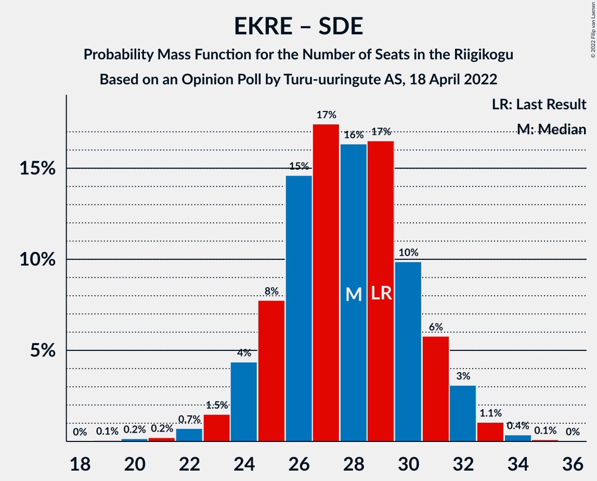

| Number of Seats | Probability | Accumulated | Special Marks |
|:---------------:|:-----------:|:-----------:|:-------------:|
| 19 | 0.1% | 100% |  |
| 20 | 0.2% | 99.9% |  |
| 21 | 0.2% | 99.8% |  |
| 22 | 0.7% | 99.5% |  |
| 23 | 1.5% | 98.8% |  |
| 24 | 4% | 97% |  |
| 25 | 8% | 93% |  |
| 26 | 15% | 85% |  |
| 27 | 17% | 71% | Median |
| 28 | 16% | 53% |  |
| 29 | 17% | 37% | Last Result |
| 30 | 10% | 20% |  |
| 31 | 6% | 10% |  |
| 32 | 3% | 5% |  |
| 33 | 1.1% | 2% |  |
| 34 | 0.4% | 0.5% |  |
| 35 | 0.1% | 0.1% |  |
| 36 | 0% | 0% |  |

### Eesti Keskerakond – Erakond Isamaa – Sotsiaaldemokraatlik Erakond

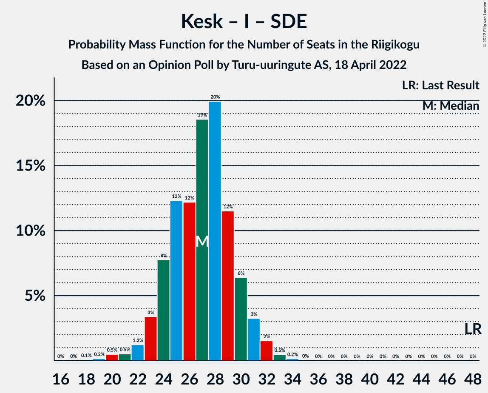

| Number of Seats | Probability | Accumulated | Special Marks |
|:---------------:|:-----------:|:-----------:|:-------------:|
| 18 | 0.1% | 100% |  |
| 19 | 0.2% | 99.9% |  |
| 20 | 0.5% | 99.7% |  |
| 21 | 0.5% | 99.2% |  |
| 22 | 1.2% | 98.7% |  |
| 23 | 3% | 97% |  |
| 24 | 8% | 94% |  |
| 25 | 12% | 86% |  |
| 26 | 12% | 74% | Median |
| 27 | 19% | 62% |  |
| 28 | 20% | 43% |  |
| 29 | 12% | 23% |  |
| 30 | 6% | 12% |  |
| 31 | 3% | 5% |  |
| 32 | 2% | 2% |  |
| 33 | 0.5% | 0.7% |  |
| 34 | 0.2% | 0.2% |  |
| 35 | 0% | 0% |  |
| 36 | 0% | 0% |  |
| 37 | 0% | 0% |  |
| 38 | 0% | 0% |  |
| 39 | 0% | 0% |  |
| 40 | 0% | 0% |  |
| 41 | 0% | 0% |  |
| 42 | 0% | 0% |  |
| 43 | 0% | 0% |  |
| 44 | 0% | 0% |  |
| 45 | 0% | 0% |  |
| 46 | 0% | 0% |  |
| 47 | 0% | 0% |  |
| 48 | 0% | 0% | Last Result |

### Eesti Keskerakond – Sotsiaaldemokraatlik Erakond

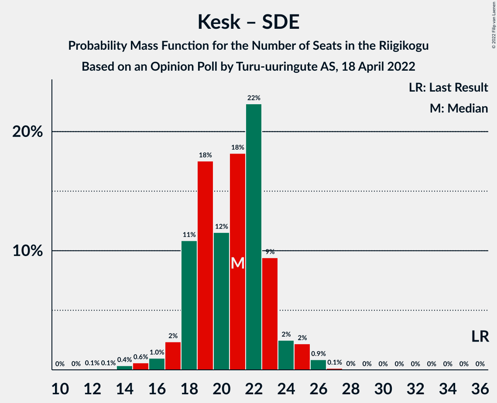

| Number of Seats | Probability | Accumulated | Special Marks |
|:---------------:|:-----------:|:-----------:|:-------------:|
| 12 | 0.1% | 100% |  |
| 13 | 0.1% | 99.9% |  |
| 14 | 0.4% | 99.8% |  |
| 15 | 0.6% | 99.5% |  |
| 16 | 1.0% | 98.9% |  |
| 17 | 2% | 98% |  |
| 18 | 11% | 96% |  |
| 19 | 18% | 85% |  |
| 20 | 12% | 67% | Median |
| 21 | 18% | 56% |  |
| 22 | 22% | 37% |  |
| 23 | 9% | 15% |  |
| 24 | 2% | 6% |  |
| 25 | 2% | 3% |  |
| 26 | 0.9% | 1.0% |  |
| 27 | 0.1% | 0.2% |  |
| 28 | 0% | 0% |  |
| 29 | 0% | 0% |  |
| 30 | 0% | 0% |  |
| 31 | 0% | 0% |  |
| 32 | 0% | 0% |  |
| 33 | 0% | 0% |  |
| 34 | 0% | 0% |  |
| 35 | 0% | 0% |  |
| 36 | 0% | 0% | Last Result |

## Technical Information

### Opinion Poll

+ **Polling firm:** Turu-uuringute AS
+ **Commissioner(s):** —
+ **Fieldwork period:** 18 April 2022

### Calculations

+ **Sample size:** 600
+ **Simulations done:** 1,048,576
+ **Error estimate:** 1.63%

