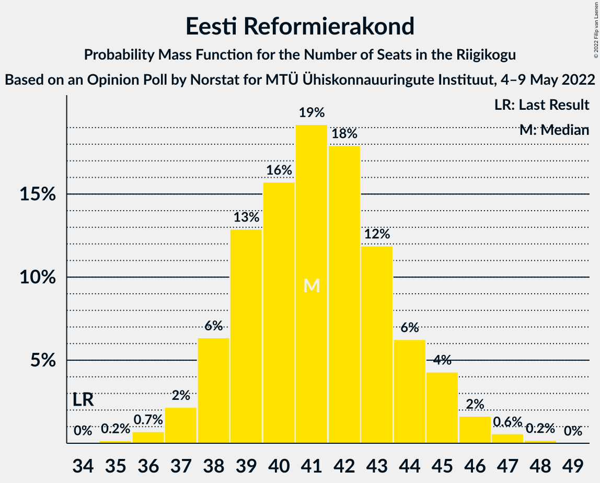

# Opinion Poll by Norstat for MTÜ Ühiskonnauuringute Instituut, 4–9 May 2022

<a href="#voting-intentions">Voting Intentions</a> | <a href="#seats">Seats</a> | <a href="#coalitions">Coalitions</a> | <a href="#technical-information">Technical Information</a>

## Voting Intentions

### Confidence Intervals

| Party | Last Result | Poll Result | 80% Confidence Interval | 90% Confidence Interval | 95% Confidence Interval | 99% Confidence Interval |
|:-----:|:-----------:|:-----------:|:-----------------------:|:-----------------------:|:-----------------------:|:-----------------------:|
| Eesti Reformierakond | 28.9% | 35.9% | 34.0–37.9% |33.4–38.4% |33.0–38.9% |32.1–39.9% |
| Eesti Konservatiivne Rahvaerakond | 17.8% | 19.0% | 17.5–20.7% |17.1–21.1% |16.7–21.6% |16.0–22.4% |
| Eesti Keskerakond | 23.1% | 16.5% | 15.1–18.1% |14.7–18.5% |14.3–18.9% |13.7–19.7% |
| Eesti 200 | 4.4% | 13.0% | 11.7–14.5% |11.4–14.9% |11.1–15.2% |10.5–16.0% |
| Sotsiaaldemokraatlik Erakond | 9.8% | 7.6% | 6.6–8.8% |6.3–9.1% |6.1–9.4% |5.7–10.0% |
| Erakond Isamaa | 11.4% | 5.0% | 4.2–6.0% |4.0–6.3% |3.8–6.5% |3.5–7.1% |
| Erakond Eestimaa Rohelised | 1.8% | 2.1% | 1.6–2.8% |1.5–3.0% |1.4–3.2% |1.2–3.6% |

*Note:* The poll result column reflects the actual value used in the calculations. Published results may vary slightly, and in addition be rounded to fewer digits.

## Seats

### Confidence Intervals

| Party | Last Result | Median | 80% Confidence Interval | 90% Confidence Interval | 95% Confidence Interval | 99% Confidence Interval |
|:-----:|:-----------:|:------:|:-----------------------:|:-----------------------:|:-----------------------:|:-----------------------:|
| <a href="#eesti-reformierakond">Eesti Reformierakond</a> | 34 | 41 | 39–44 |38–45 |37–45 |36–47 |
| <a href="#eesti-konservatiivne-rahvaerakond">Eesti Konservatiivne Rahvaerakond</a> | 19 | 20 | 18–22 |18–23 |17–23 |16–24 |
| <a href="#eesti-keskerakond">Eesti Keskerakond</a> | 26 | 17 | 15–19 |15–20 |14–20 |14–21 |
| <a href="#eesti-200">Eesti 200</a> | 0 | 13 | 11–15 |11–15 |11–16 |10–16 |
| <a href="#sotsiaaldemokraatlik-erakond">Sotsiaaldemokraatlik Erakond</a> | 10 | 7 | 6–8 |6–9 |5–9 |5–10 |
| <a href="#erakond-isamaa">Erakond Isamaa</a> | 12 | 4 | 0–5 |0–5 |0–6 |0–6 |
| <a href="#erakond-eestimaa-rohelised">Erakond Eestimaa Rohelised</a> | 0 | 0 | 0 |0 |0 |0 |

### Eesti Reformierakond

*For a full overview of the results for this party, see the [Eesti Reformierakond](party-eestireformierakond.html) page.*

| Number of Seats | Probability | Accumulated | Special Marks |
|:---------------:|:-----------:|:-----------:|:-------------:|
| 34 | 0% | 100% | Last Result |
| 35 | 0.2% | 100% |  |
| 36 | 0.7% | 99.8% |  |
| 37 | 2% | 99.1% |  |
| 38 | 6% | 97% |  |
| 39 | 13% | 91% |  |
| 40 | 16% | 78% |  |
| 41 | 19% | 62% | Median |
| 42 | 18% | 43% |  |
| 43 | 12% | 25% |  |
| 44 | 6% | 13% |  |
| 45 | 4% | 7% |  |
| 46 | 2% | 2% |  |
| 47 | 0.6% | 0.8% |  |
| 48 | 0.2% | 0.2% |  |
| 49 | 0% | 0% |  |

### Eesti Konservatiivne Rahvaerakond

*For a full overview of the results for this party, see the [Eesti Konservatiivne Rahvaerakond](party-eestikonservatiivnerahvaerakond.html) page.*

| Number of Seats | Probability | Accumulated | Special Marks |
|:---------------:|:-----------:|:-----------:|:-------------:|
| 15 | 0.1% | 100% |  |
| 16 | 0.6% | 99.9% |  |
| 17 | 3% | 99.3% |  |
| 18 | 11% | 96% |  |
| 19 | 21% | 85% | Last Result |
| 20 | 25% | 64% | Median |
| 21 | 18% | 39% |  |
| 22 | 13% | 21% |  |
| 23 | 7% | 8% |  |
| 24 | 1.4% | 2% |  |
| 25 | 0.2% | 0.3% |  |
| 26 | 0% | 0.1% |  |
| 27 | 0% | 0% |  |

### Eesti Keskerakond

*For a full overview of the results for this party, see the [Eesti Keskerakond](party-eestikeskerakond.html) page.*

| Number of Seats | Probability | Accumulated | Special Marks |
|:---------------:|:-----------:|:-----------:|:-------------:|
| 13 | 0.4% | 100% |  |
| 14 | 2% | 99.6% |  |
| 15 | 10% | 97% |  |
| 16 | 21% | 88% |  |
| 17 | 27% | 66% | Median |
| 18 | 22% | 40% |  |
| 19 | 12% | 18% |  |
| 20 | 4% | 6% |  |
| 21 | 1.1% | 1.4% |  |
| 22 | 0.2% | 0.2% |  |
| 23 | 0% | 0% |  |
| 24 | 0% | 0% |  |
| 25 | 0% | 0% |  |
| 26 | 0% | 0% | Last Result |

### Eesti 200

*For a full overview of the results for this party, see the [Eesti 200](party-eesti200.html) page.*

| Number of Seats | Probability | Accumulated | Special Marks |
|:---------------:|:-----------:|:-----------:|:-------------:|
| 0 | 0% | 100% | Last Result |
| 1 | 0% | 100% |  |
| 2 | 0% | 100% |  |
| 3 | 0% | 100% |  |
| 4 | 0% | 100% |  |
| 5 | 0% | 100% |  |
| 6 | 0% | 100% |  |
| 7 | 0% | 100% |  |
| 8 | 0% | 100% |  |
| 9 | 0.1% | 100% |  |
| 10 | 2% | 99.9% |  |
| 11 | 10% | 98% |  |
| 12 | 24% | 89% |  |
| 13 | 27% | 64% | Median |
| 14 | 23% | 37% |  |
| 15 | 11% | 14% |  |
| 16 | 3% | 3% |  |
| 17 | 0.4% | 0.5% |  |
| 18 | 0.1% | 0.1% |  |
| 19 | 0% | 0% |  |

### Sotsiaaldemokraatlik Erakond

*For a full overview of the results for this party, see the [Sotsiaaldemokraatlik Erakond](party-sotsiaaldemokraatlikerakond.html) page.*

| Number of Seats | Probability | Accumulated | Special Marks |
|:---------------:|:-----------:|:-----------:|:-------------:|
| 4 | 0.1% | 100% |  |
| 5 | 4% | 99.9% |  |
| 6 | 25% | 96% |  |
| 7 | 40% | 70% | Median |
| 8 | 24% | 30% |  |
| 9 | 6% | 6% |  |
| 10 | 0.6% | 0.7% | Last Result |
| 11 | 0% | 0% |  |

### Erakond Isamaa

*For a full overview of the results for this party, see the [Erakond Isamaa](party-erakondisamaa.html) page.*

| Number of Seats | Probability | Accumulated | Special Marks |
|:---------------:|:-----------:|:-----------:|:-------------:|
| 0 | 48% | 100% |  |
| 1 | 0% | 52% |  |
| 2 | 0% | 52% |  |
| 3 | 0% | 52% |  |
| 4 | 21% | 52% | Median |
| 5 | 28% | 31% |  |
| 6 | 3% | 3% |  |
| 7 | 0.2% | 0.2% |  |
| 8 | 0% | 0% |  |
| 9 | 0% | 0% |  |
| 10 | 0% | 0% |  |
| 11 | 0% | 0% |  |
| 12 | 0% | 0% | Last Result |

### Erakond Eestimaa Rohelised

*For a full overview of the results for this party, see the [Erakond Eestimaa Rohelised](party-erakondeestimaarohelised.html) page.*

| Number of Seats | Probability | Accumulated | Special Marks |
|:---------------:|:-----------:|:-----------:|:-------------:|
| 0 | 100% | 100% | Last Result, Median |

## Coalitions

### Confidence Intervals

| Coalition | Last Result | Median | Majority? | 80% Confidence Interval | 90% Confidence Interval | 95% Confidence Interval | 99% Confidence Interval |
|:---------:|:-----------:|:------:|:---------:|:-----------------------:|:-----------------------:|:-----------------------:|:-----------------------:|
| Eesti Reformierakond – Eesti Konservatiivne Rahvaerakond – Eesti Keskerakond | 79 | 78 | 100% | 75–82 | 75–82 | 74–83 | 73–84 |
| Eesti Reformierakond – Eesti Konservatiivne Rahvaerakond – Erakond Isamaa | 65 | 64 | 100% | 61–66 | 60–67 | 60–68 | 59–69 |
| Eesti Reformierakond – Eesti Konservatiivne Rahvaerakond | 53 | 61 | 100% | 58–64 | 58–65 | 57–66 | 56–67 |
| Eesti Reformierakond – Eesti Keskerakond | 60 | 58 | 100% | 55–61 | 55–62 | 54–63 | 53–64 |
| Eesti Reformierakond – Sotsiaaldemokraatlik Erakond – Erakond Isamaa | 56 | 51 | 54% | 48–53 | 47–54 | 46–55 | 45–56 |
| Eesti Reformierakond – Sotsiaaldemokraatlik Erakond | 44 | 48 | 14% | 45–51 | 45–52 | 44–53 | 43–54 |
| Eesti Reformierakond – Erakond Isamaa | 46 | 44 | 0.1% | 40–47 | 40–47 | 39–48 | 38–49 |
| Eesti Konservatiivne Rahvaerakond – Eesti Keskerakond – Erakond Isamaa | 57 | 40 | 0% | 36–42 | 35–43 | 35–44 | 34–45 |
| Eesti Konservatiivne Rahvaerakond – Eesti Keskerakond | 45 | 37 | 0% | 35–40 | 34–41 | 34–42 | 32–42 |
| Eesti Konservatiivne Rahvaerakond – Sotsiaaldemokraatlik Erakond | 29 | 27 | 0% | 25–30 | 24–30 | 24–31 | 23–32 |
| Eesti Keskerakond – Sotsiaaldemokraatlik Erakond – Erakond Isamaa | 48 | 27 | 0% | 23–30 | 23–30 | 22–31 | 21–32 |
| Eesti Keskerakond – Sotsiaaldemokraatlik Erakond | 36 | 24 | 0% | 22–26 | 21–27 | 21–28 | 20–29 |

### Eesti Reformierakond – Eesti Konservatiivne Rahvaerakond – Eesti Keskerakond

| Number of Seats | Probability | Accumulated | Special Marks |
|:---------------:|:-----------:|:-----------:|:-------------:|
| 72 | 0.2% | 100% |  |
| 73 | 0.9% | 99.8% |  |
| 74 | 3% | 98.9% |  |
| 75 | 7% | 96% |  |
| 76 | 13% | 90% |  |
| 77 | 16% | 77% |  |
| 78 | 13% | 61% | Median |
| 79 | 11% | 48% | Last Result |
| 80 | 14% | 37% |  |
| 81 | 12% | 23% |  |
| 82 | 7% | 11% |  |
| 83 | 3% | 4% |  |
| 84 | 0.6% | 0.8% |  |
| 85 | 0.2% | 0.2% |  |
| 86 | 0% | 0% |  |

### Eesti Reformierakond – Eesti Konservatiivne Rahvaerakond – Erakond Isamaa

| Number of Seats | Probability | Accumulated | Special Marks |
|:---------------:|:-----------:|:-----------:|:-------------:|
| 57 | 0.1% | 100% |  |
| 58 | 0.4% | 99.9% |  |
| 59 | 1.3% | 99.5% |  |
| 60 | 4% | 98% |  |
| 61 | 7% | 94% |  |
| 62 | 16% | 88% |  |
| 63 | 16% | 72% |  |
| 64 | 20% | 56% |  |
| 65 | 17% | 36% | Last Result, Median |
| 66 | 11% | 20% |  |
| 67 | 6% | 9% |  |
| 68 | 2% | 3% |  |
| 69 | 0.7% | 0.8% |  |
| 70 | 0.1% | 0.2% |  |
| 71 | 0% | 0% |  |

### Eesti Reformierakond – Eesti Konservatiivne Rahvaerakond

| Number of Seats | Probability | Accumulated | Special Marks |
|:---------------:|:-----------:|:-----------:|:-------------:|
| 53 | 0% | 100% | Last Result |
| 54 | 0.1% | 100% |  |
| 55 | 0.4% | 99.9% |  |
| 56 | 1.3% | 99.6% |  |
| 57 | 3% | 98% |  |
| 58 | 8% | 96% |  |
| 59 | 10% | 88% |  |
| 60 | 15% | 78% |  |
| 61 | 15% | 63% | Median |
| 62 | 18% | 48% |  |
| 63 | 12% | 31% |  |
| 64 | 10% | 19% |  |
| 65 | 5% | 9% |  |
| 66 | 2% | 3% |  |
| 67 | 0.8% | 1.1% |  |
| 68 | 0.2% | 0.3% |  |
| 69 | 0% | 0.1% |  |
| 70 | 0% | 0% |  |

### Eesti Reformierakond – Eesti Keskerakond

| Number of Seats | Probability | Accumulated | Special Marks |
|:---------------:|:-----------:|:-----------:|:-------------:|
| 51 | 0% | 100% | Majority |
| 52 | 0.3% | 99.9% |  |
| 53 | 1.0% | 99.7% |  |
| 54 | 3% | 98.7% |  |
| 55 | 6% | 96% |  |
| 56 | 12% | 90% |  |
| 57 | 16% | 78% |  |
| 58 | 16% | 62% | Median |
| 59 | 16% | 46% |  |
| 60 | 12% | 30% | Last Result |
| 61 | 9% | 18% |  |
| 62 | 5% | 8% |  |
| 63 | 3% | 4% |  |
| 64 | 0.9% | 1.2% |  |
| 65 | 0.2% | 0.3% |  |
| 66 | 0% | 0% |  |

### Eesti Reformierakond – Sotsiaaldemokraatlik Erakond – Erakond Isamaa

| Number of Seats | Probability | Accumulated | Special Marks |
|:---------------:|:-----------:|:-----------:|:-------------:|
| 44 | 0.2% | 100% |  |
| 45 | 1.0% | 99.7% |  |
| 46 | 3% | 98.8% |  |
| 47 | 5% | 96% |  |
| 48 | 10% | 91% |  |
| 49 | 14% | 81% |  |
| 50 | 13% | 66% |  |
| 51 | 15% | 54% | Majority |
| 52 | 15% | 39% | Median |
| 53 | 14% | 24% |  |
| 54 | 6% | 10% |  |
| 55 | 3% | 4% |  |
| 56 | 0.8% | 1.0% | Last Result |
| 57 | 0.2% | 0.2% |  |
| 58 | 0% | 0.1% |  |
| 59 | 0% | 0% |  |

### Eesti Reformierakond – Sotsiaaldemokraatlik Erakond

| Number of Seats | Probability | Accumulated | Special Marks |
|:---------------:|:-----------:|:-----------:|:-------------:|
| 41 | 0.1% | 100% |  |
| 42 | 0.2% | 99.9% |  |
| 43 | 0.9% | 99.7% |  |
| 44 | 3% | 98.8% | Last Result |
| 45 | 6% | 96% |  |
| 46 | 12% | 90% |  |
| 47 | 15% | 78% |  |
| 48 | 21% | 63% | Median |
| 49 | 18% | 42% |  |
| 50 | 10% | 24% |  |
| 51 | 6% | 14% | Majority |
| 52 | 5% | 9% |  |
| 53 | 2% | 3% |  |
| 54 | 0.8% | 1.1% |  |
| 55 | 0.3% | 0.3% |  |
| 56 | 0% | 0% |  |

### Eesti Reformierakond – Erakond Isamaa

| Number of Seats | Probability | Accumulated | Special Marks |
|:---------------:|:-----------:|:-----------:|:-------------:|
| 36 | 0% | 100% |  |
| 37 | 0.2% | 99.9% |  |
| 38 | 1.1% | 99.7% |  |
| 39 | 3% | 98.6% |  |
| 40 | 6% | 95% |  |
| 41 | 9% | 90% |  |
| 42 | 13% | 80% |  |
| 43 | 16% | 67% |  |
| 44 | 14% | 51% |  |
| 45 | 14% | 37% | Median |
| 46 | 12% | 24% | Last Result |
| 47 | 7% | 11% |  |
| 48 | 3% | 4% |  |
| 49 | 1.0% | 1.3% |  |
| 50 | 0.3% | 0.3% |  |
| 51 | 0.1% | 0.1% | Majority |
| 52 | 0% | 0% |  |

### Eesti Konservatiivne Rahvaerakond – Eesti Keskerakond – Erakond Isamaa

| Number of Seats | Probability | Accumulated | Special Marks |
|:---------------:|:-----------:|:-----------:|:-------------:|
| 33 | 0.2% | 100% |  |
| 34 | 0.9% | 99.8% |  |
| 35 | 4% | 98.9% |  |
| 36 | 6% | 95% |  |
| 37 | 6% | 89% |  |
| 38 | 9% | 83% |  |
| 39 | 14% | 73% |  |
| 40 | 17% | 59% |  |
| 41 | 21% | 42% | Median |
| 42 | 11% | 21% |  |
| 43 | 6% | 10% |  |
| 44 | 2% | 4% |  |
| 45 | 1.3% | 2% |  |
| 46 | 0.4% | 0.5% |  |
| 47 | 0.1% | 0.1% |  |
| 48 | 0% | 0% |  |
| 49 | 0% | 0% |  |
| 50 | 0% | 0% |  |
| 51 | 0% | 0% | Majority |
| 52 | 0% | 0% |  |
| 53 | 0% | 0% |  |
| 54 | 0% | 0% |  |
| 55 | 0% | 0% |  |
| 56 | 0% | 0% |  |
| 57 | 0% | 0% | Last Result |

### Eesti Konservatiivne Rahvaerakond – Eesti Keskerakond

| Number of Seats | Probability | Accumulated | Special Marks |
|:---------------:|:-----------:|:-----------:|:-------------:|
| 31 | 0.1% | 100% |  |
| 32 | 0.4% | 99.9% |  |
| 33 | 2% | 99.4% |  |
| 34 | 5% | 98% |  |
| 35 | 13% | 93% |  |
| 36 | 18% | 80% |  |
| 37 | 19% | 63% | Median |
| 38 | 15% | 44% |  |
| 39 | 13% | 29% |  |
| 40 | 9% | 16% |  |
| 41 | 4% | 7% |  |
| 42 | 2% | 3% |  |
| 43 | 0.4% | 0.5% |  |
| 44 | 0.1% | 0.1% |  |
| 45 | 0% | 0% | Last Result |

### Eesti Konservatiivne Rahvaerakond – Sotsiaaldemokraatlik Erakond

| Number of Seats | Probability | Accumulated | Special Marks |
|:---------------:|:-----------:|:-----------:|:-------------:|
| 22 | 0.2% | 100% |  |
| 23 | 1.4% | 99.7% |  |
| 24 | 5% | 98% |  |
| 25 | 12% | 94% |  |
| 26 | 17% | 81% |  |
| 27 | 22% | 64% | Median |
| 28 | 17% | 42% |  |
| 29 | 14% | 25% | Last Result |
| 30 | 7% | 11% |  |
| 31 | 2% | 3% |  |
| 32 | 0.7% | 0.8% |  |
| 33 | 0.1% | 0.2% |  |
| 34 | 0% | 0% |  |

### Eesti Keskerakond – Sotsiaaldemokraatlik Erakond – Erakond Isamaa

| Number of Seats | Probability | Accumulated | Special Marks |
|:---------------:|:-----------:|:-----------:|:-------------:|
| 20 | 0.2% | 100% |  |
| 21 | 0.7% | 99.8% |  |
| 22 | 3% | 99.1% |  |
| 23 | 6% | 96% |  |
| 24 | 13% | 90% |  |
| 25 | 10% | 76% |  |
| 26 | 14% | 67% |  |
| 27 | 14% | 53% |  |
| 28 | 15% | 39% | Median |
| 29 | 12% | 24% |  |
| 30 | 8% | 12% |  |
| 31 | 3% | 5% |  |
| 32 | 1.4% | 2% |  |
| 33 | 0.2% | 0.3% |  |
| 34 | 0.1% | 0.1% |  |
| 35 | 0% | 0% |  |
| 36 | 0% | 0% |  |
| 37 | 0% | 0% |  |
| 38 | 0% | 0% |  |
| 39 | 0% | 0% |  |
| 40 | 0% | 0% |  |
| 41 | 0% | 0% |  |
| 42 | 0% | 0% |  |
| 43 | 0% | 0% |  |
| 44 | 0% | 0% |  |
| 45 | 0% | 0% |  |
| 46 | 0% | 0% |  |
| 47 | 0% | 0% |  |
| 48 | 0% | 0% | Last Result |

### Eesti Keskerakond – Sotsiaaldemokraatlik Erakond

| Number of Seats | Probability | Accumulated | Special Marks |
|:---------------:|:-----------:|:-----------:|:-------------:|
| 19 | 0.2% | 100% |  |
| 20 | 1.0% | 99.8% |  |
| 21 | 4% | 98.8% |  |
| 22 | 10% | 95% |  |
| 23 | 20% | 85% |  |
| 24 | 24% | 65% | Median |
| 25 | 18% | 41% |  |
| 26 | 15% | 22% |  |
| 27 | 5% | 8% |  |
| 28 | 2% | 3% |  |
| 29 | 0.4% | 0.6% |  |
| 30 | 0.1% | 0.1% |  |
| 31 | 0% | 0% |  |
| 32 | 0% | 0% |  |
| 33 | 0% | 0% |  |
| 34 | 0% | 0% |  |
| 35 | 0% | 0% |  |
| 36 | 0% | 0% | Last Result |

## Technical Information

### Opinion Poll

+ **Polling firm:** Norstat
+ **Commissioner(s):** MTÜ Ühiskonnauuringute Instituut
+ **Fieldwork period:** 4–9 May 2022

### Calculations

+ **Sample size:** 1000
+ **Simulations done:** 1,048,576
+ **Error estimate:** 1.39%

