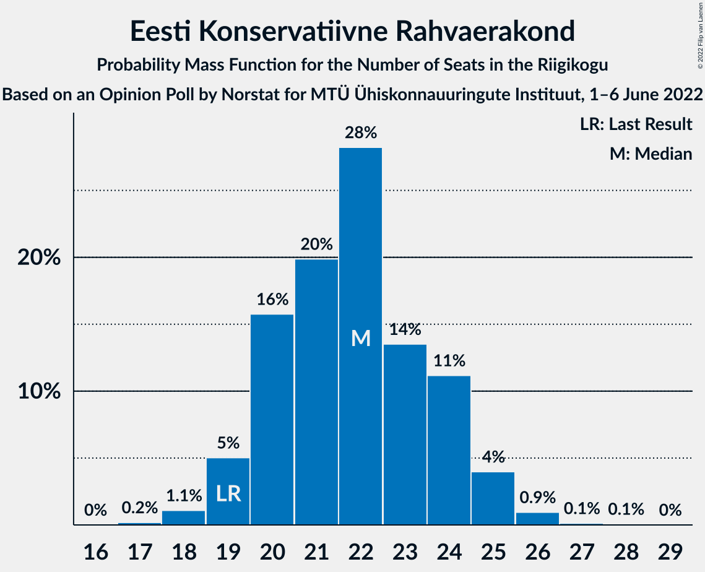

# Opinion Poll by Norstat for MTÜ Ühiskonnauuringute Instituut, 1–6 June 2022

<a href="#voting-intentions">Voting Intentions</a> | <a href="#seats">Seats</a> | <a href="#coalitions">Coalitions</a> | <a href="#technical-information">Technical Information</a>

## Voting Intentions

### Confidence Intervals

| Party | Last Result | Poll Result | 80% Confidence Interval | 90% Confidence Interval | 95% Confidence Interval | 99% Confidence Interval |
|:-----:|:-----------:|:-----------:|:-----------------------:|:-----------------------:|:-----------------------:|:-----------------------:|
| Eesti Reformierakond | 28.9% | 33.5% | 31.6–35.5% |31.1–36.0% |30.6–36.5% |29.8–37.4% |
| Eesti Konservatiivne Rahvaerakond | 17.8% | 20.8% | 19.2–22.5% |18.8–23.0% |18.4–23.4% |17.7–24.3% |
| Eesti Keskerakond | 23.1% | 20.5% | 18.9–22.2% |18.5–22.7% |18.1–23.1% |17.4–24.0% |
| Eesti 200 | 4.4% | 10.4% | 9.3–11.7% |8.9–12.1% |8.7–12.5% |8.1–13.1% |
| Erakond Isamaa | 11.4% | 6.8% | 5.9–7.9% |5.6–8.3% |5.4–8.5% |5.0–9.1% |
| Sotsiaaldemokraatlik Erakond | 9.8% | 5.8% | 5.0–6.9% |4.7–7.2% |4.5–7.4% |4.1–8.0% |
| Erakond Eestimaa Rohelised | 1.8% | 2.0% | 1.5–2.7% |1.4–2.9% |1.3–3.1% |1.1–3.4% |

*Note:* The poll result column reflects the actual value used in the calculations. Published results may vary slightly, and in addition be rounded to fewer digits.

## Seats

### Confidence Intervals

| Party | Last Result | Median | 80% Confidence Interval | 90% Confidence Interval | 95% Confidence Interval | 99% Confidence Interval |
|:-----:|:-----------:|:------:|:-----------------------:|:-----------------------:|:-----------------------:|:-----------------------:|
| <a href="#eesti-reformierakond">Eesti Reformierakond</a> | 34 | 37 | 35–40 |34–41 |34–41 |33–42 |
| <a href="#eesti-konservatiivne-rahvaerakond">Eesti Konservatiivne Rahvaerakond</a> | 19 | 22 | 20–24 |19–25 |19–25 |18–26 |
| <a href="#eesti-keskerakond">Eesti Keskerakond</a> | 26 | 21 | 19–24 |19–24 |19–25 |18–26 |
| <a href="#eesti-200">Eesti 200</a> | 0 | 10 | 9–11 |8–12 |8–12 |7–13 |
| <a href="#erakond-isamaa">Erakond Isamaa</a> | 12 | 6 | 5–7 |5–8 |4–8 |0–8 |
| <a href="#sotsiaaldemokraatlik-erakond">Sotsiaaldemokraatlik Erakond</a> | 10 | 5 | 0–6 |0–6 |0–7 |0–7 |
| <a href="#erakond-eestimaa-rohelised">Erakond Eestimaa Rohelised</a> | 0 | 0 | 0 |0 |0 |0 |

### Eesti Reformierakond

*For a full overview of the results for this party, see the [Eesti Reformierakond](party-eestireformierakond.html) page.*

| Number of Seats | Probability | Accumulated | Special Marks |
|:---------------:|:-----------:|:-----------:|:-------------:|
| 31 | 0.1% | 100% |  |
| 32 | 0.4% | 99.9% |  |
| 33 | 1.3% | 99.5% |  |
| 34 | 4% | 98% | Last Result |
| 35 | 13% | 94% |  |
| 36 | 16% | 81% |  |
| 37 | 20% | 65% | Median |
| 38 | 16% | 44% |  |
| 39 | 18% | 29% |  |
| 40 | 5% | 11% |  |
| 41 | 4% | 5% |  |
| 42 | 1.1% | 2% |  |
| 43 | 0.3% | 0.4% |  |
| 44 | 0.1% | 0.1% |  |
| 45 | 0% | 0% |  |

### Eesti Konservatiivne Rahvaerakond

*For a full overview of the results for this party, see the [Eesti Konservatiivne Rahvaerakond](party-eestikonservatiivnerahvaerakond.html) page.*

| Number of Seats | Probability | Accumulated | Special Marks |
|:---------------:|:-----------:|:-----------:|:-------------:|
| 17 | 0.2% | 100% |  |
| 18 | 1.1% | 99.8% |  |
| 19 | 5% | 98.7% | Last Result |
| 20 | 16% | 94% |  |
| 21 | 20% | 78% |  |
| 22 | 28% | 58% | Median |
| 23 | 14% | 30% |  |
| 24 | 11% | 16% |  |
| 25 | 4% | 5% |  |
| 26 | 0.9% | 1.2% |  |
| 27 | 0.1% | 0.2% |  |
| 28 | 0.1% | 0.1% |  |
| 29 | 0% | 0% |  |

### Eesti Keskerakond

*For a full overview of the results for this party, see the [Eesti Keskerakond](party-eestikeskerakond.html) page.*

| Number of Seats | Probability | Accumulated | Special Marks |
|:---------------:|:-----------:|:-----------:|:-------------:|
| 17 | 0.3% | 100% |  |
| 18 | 2% | 99.7% |  |
| 19 | 9% | 98% |  |
| 20 | 16% | 88% |  |
| 21 | 22% | 72% | Median |
| 22 | 26% | 50% |  |
| 23 | 13% | 24% |  |
| 24 | 8% | 11% |  |
| 25 | 3% | 3% |  |
| 26 | 0.5% | 0.6% | Last Result |
| 27 | 0.1% | 0.1% |  |
| 28 | 0% | 0% |  |

### Eesti 200

*For a full overview of the results for this party, see the [Eesti 200](party-eesti200.html) page.*

| Number of Seats | Probability | Accumulated | Special Marks |
|:---------------:|:-----------:|:-----------:|:-------------:|
| 0 | 0% | 100% | Last Result |
| 1 | 0% | 100% |  |
| 2 | 0% | 100% |  |
| 3 | 0% | 100% |  |
| 4 | 0% | 100% |  |
| 5 | 0% | 100% |  |
| 6 | 0% | 100% |  |
| 7 | 0.9% | 100% |  |
| 8 | 8% | 99.1% |  |
| 9 | 27% | 92% |  |
| 10 | 36% | 65% | Median |
| 11 | 21% | 29% |  |
| 12 | 7% | 8% |  |
| 13 | 1.2% | 1.4% |  |
| 14 | 0.1% | 0.1% |  |
| 15 | 0% | 0% |  |

### Erakond Isamaa

*For a full overview of the results for this party, see the [Erakond Isamaa](party-erakondisamaa.html) page.*

| Number of Seats | Probability | Accumulated | Special Marks |
|:---------------:|:-----------:|:-----------:|:-------------:|
| 0 | 0.6% | 100% |  |
| 1 | 0% | 99.4% |  |
| 2 | 0% | 99.4% |  |
| 3 | 0% | 99.4% |  |
| 4 | 2% | 99.4% |  |
| 5 | 25% | 97% |  |
| 6 | 45% | 73% | Median |
| 7 | 23% | 28% |  |
| 8 | 5% | 5% |  |
| 9 | 0.5% | 0.5% |  |
| 10 | 0% | 0% |  |
| 11 | 0% | 0% |  |
| 12 | 0% | 0% | Last Result |

### Sotsiaaldemokraatlik Erakond

*For a full overview of the results for this party, see the [Sotsiaaldemokraatlik Erakond](party-sotsiaaldemokraatlikerakond.html) page.*

| Number of Seats | Probability | Accumulated | Special Marks |
|:---------------:|:-----------:|:-----------:|:-------------:|
| 0 | 12% | 100% |  |
| 1 | 0% | 88% |  |
| 2 | 0% | 88% |  |
| 3 | 0% | 88% |  |
| 4 | 16% | 88% |  |
| 5 | 47% | 71% | Median |
| 6 | 22% | 24% |  |
| 7 | 3% | 3% |  |
| 8 | 0.2% | 0.2% |  |
| 9 | 0% | 0% |  |
| 10 | 0% | 0% | Last Result |

### Erakond Eestimaa Rohelised

*For a full overview of the results for this party, see the [Erakond Eestimaa Rohelised](party-erakondeestimaarohelised.html) page.*

| Number of Seats | Probability | Accumulated | Special Marks |
|:---------------:|:-----------:|:-----------:|:-------------:|
| 0 | 100% | 100% | Last Result, Median |

## Coalitions

### Confidence Intervals

| Coalition | Last Result | Median | Majority? | 80% Confidence Interval | 90% Confidence Interval | 95% Confidence Interval | 99% Confidence Interval |
|:---------:|:-----------:|:------:|:---------:|:-----------------------:|:-----------------------:|:-----------------------:|:-----------------------:|
| Eesti Reformierakond – Eesti Konservatiivne Rahvaerakond – Eesti Keskerakond | 79 | 80 | 100% | 78–83 | 78–85 | 77–85 | 76–87 |
| Eesti Reformierakond – Eesti Konservatiivne Rahvaerakond – Erakond Isamaa | 65 | 65 | 100% | 63–68 | 62–69 | 61–70 | 60–71 |
| Eesti Reformierakond – Eesti Keskerakond | 60 | 59 | 100% | 56–61 | 55–62 | 55–63 | 54–65 |
| Eesti Reformierakond – Eesti Konservatiivne Rahvaerakond | 53 | 59 | 100% | 57–62 | 56–63 | 55–63 | 54–65 |
| Eesti Konservatiivne Rahvaerakond – Eesti Keskerakond – Erakond Isamaa | 57 | 49 | 29% | 47–52 | 46–53 | 45–54 | 44–55 |
| Eesti Reformierakond – Erakond Isamaa – Sotsiaaldemokraatlik Erakond | 56 | 48 | 9% | 45–50 | 44–51 | 43–52 | 42–53 |
| Eesti Konservatiivne Rahvaerakond – Eesti Keskerakond | 45 | 43 | 0% | 41–46 | 40–47 | 39–47 | 38–49 |
| Eesti Reformierakond – Erakond Isamaa | 46 | 43 | 0% | 41–46 | 40–47 | 39–47 | 38–49 |
| Eesti Reformierakond – Sotsiaaldemokraatlik Erakond | 44 | 42 | 0% | 39–44 | 38–45 | 38–46 | 36–47 |
| Eesti Keskerakond – Erakond Isamaa – Sotsiaaldemokraatlik Erakond | 48 | 32 | 0% | 29–35 | 28–35 | 28–36 | 26–37 |
| Eesti Keskerakond – Sotsiaaldemokraatlik Erakond | 36 | 26 | 0% | 23–28 | 22–29 | 21–30 | 20–31 |
| Eesti Konservatiivne Rahvaerakond – Sotsiaaldemokraatlik Erakond | 29 | 26 | 0% | 24–29 | 22–29 | 21–30 | 20–31 |

### Eesti Reformierakond – Eesti Konservatiivne Rahvaerakond – Eesti Keskerakond

| Number of Seats | Probability | Accumulated | Special Marks |
|:---------------:|:-----------:|:-----------:|:-------------:|
| 75 | 0.1% | 100% |  |
| 76 | 0.6% | 99.9% |  |
| 77 | 3% | 99.3% |  |
| 78 | 8% | 96% |  |
| 79 | 20% | 88% | Last Result |
| 80 | 22% | 68% | Median |
| 81 | 21% | 46% |  |
| 82 | 11% | 26% |  |
| 83 | 6% | 15% |  |
| 84 | 3% | 9% |  |
| 85 | 3% | 6% |  |
| 86 | 1.5% | 2% |  |
| 87 | 0.7% | 0.8% |  |
| 88 | 0.1% | 0.1% |  |
| 89 | 0% | 0% |  |

### Eesti Reformierakond – Eesti Konservatiivne Rahvaerakond – Erakond Isamaa

| Number of Seats | Probability | Accumulated | Special Marks |
|:---------------:|:-----------:|:-----------:|:-------------:|
| 59 | 0.1% | 100% |  |
| 60 | 0.9% | 99.8% |  |
| 61 | 2% | 98.9% |  |
| 62 | 6% | 97% |  |
| 63 | 12% | 91% |  |
| 64 | 17% | 79% |  |
| 65 | 24% | 62% | Last Result, Median |
| 66 | 15% | 38% |  |
| 67 | 11% | 23% |  |
| 68 | 6% | 12% |  |
| 69 | 4% | 6% |  |
| 70 | 2% | 3% |  |
| 71 | 0.6% | 0.9% |  |
| 72 | 0.2% | 0.3% |  |
| 73 | 0.1% | 0.1% |  |
| 74 | 0% | 0% |  |

### Eesti Reformierakond – Eesti Keskerakond

| Number of Seats | Probability | Accumulated | Special Marks |
|:---------------:|:-----------:|:-----------:|:-------------:|
| 52 | 0% | 100% |  |
| 53 | 0.3% | 99.9% |  |
| 54 | 1.4% | 99.7% |  |
| 55 | 4% | 98% |  |
| 56 | 7% | 94% |  |
| 57 | 16% | 88% |  |
| 58 | 19% | 72% | Median |
| 59 | 19% | 53% |  |
| 60 | 14% | 34% | Last Result |
| 61 | 10% | 20% |  |
| 62 | 5% | 10% |  |
| 63 | 2% | 4% |  |
| 64 | 2% | 2% |  |
| 65 | 0.5% | 0.7% |  |
| 66 | 0.1% | 0.2% |  |
| 67 | 0% | 0.1% |  |
| 68 | 0% | 0% |  |

### Eesti Reformierakond – Eesti Konservatiivne Rahvaerakond

| Number of Seats | Probability | Accumulated | Special Marks |
|:---------------:|:-----------:|:-----------:|:-------------:|
| 53 | 0.1% | 100% | Last Result |
| 54 | 0.8% | 99.9% |  |
| 55 | 2% | 99.0% |  |
| 56 | 7% | 97% |  |
| 57 | 12% | 90% |  |
| 58 | 16% | 78% |  |
| 59 | 23% | 62% | Median |
| 60 | 15% | 39% |  |
| 61 | 12% | 24% |  |
| 62 | 6% | 12% |  |
| 63 | 4% | 6% |  |
| 64 | 1.3% | 2% |  |
| 65 | 0.5% | 0.8% |  |
| 66 | 0.2% | 0.3% |  |
| 67 | 0.1% | 0.1% |  |
| 68 | 0% | 0% |  |

### Eesti Konservatiivne Rahvaerakond – Eesti Keskerakond – Erakond Isamaa

| Number of Seats | Probability | Accumulated | Special Marks |
|:---------------:|:-----------:|:-----------:|:-------------:|
| 42 | 0.1% | 100% |  |
| 43 | 0.2% | 99.9% |  |
| 44 | 0.6% | 99.8% |  |
| 45 | 2% | 99.2% |  |
| 46 | 5% | 97% |  |
| 47 | 14% | 92% |  |
| 48 | 15% | 78% |  |
| 49 | 18% | 63% | Median |
| 50 | 16% | 45% |  |
| 51 | 15% | 29% | Majority |
| 52 | 8% | 14% |  |
| 53 | 4% | 6% |  |
| 54 | 2% | 3% |  |
| 55 | 0.8% | 1.0% |  |
| 56 | 0.2% | 0.2% |  |
| 57 | 0% | 0.1% | Last Result |
| 58 | 0% | 0% |  |

### Eesti Reformierakond – Erakond Isamaa – Sotsiaaldemokraatlik Erakond

| Number of Seats | Probability | Accumulated | Special Marks |
|:---------------:|:-----------:|:-----------:|:-------------:|
| 40 | 0.1% | 100% |  |
| 41 | 0.3% | 99.9% |  |
| 42 | 0.9% | 99.6% |  |
| 43 | 1.4% | 98.7% |  |
| 44 | 5% | 97% |  |
| 45 | 7% | 93% |  |
| 46 | 12% | 85% |  |
| 47 | 15% | 74% |  |
| 48 | 22% | 59% | Median |
| 49 | 16% | 37% |  |
| 50 | 12% | 22% |  |
| 51 | 6% | 9% | Majority |
| 52 | 3% | 4% |  |
| 53 | 0.8% | 0.9% |  |
| 54 | 0.1% | 0.2% |  |
| 55 | 0% | 0% |  |
| 56 | 0% | 0% | Last Result |

### Eesti Konservatiivne Rahvaerakond – Eesti Keskerakond

| Number of Seats | Probability | Accumulated | Special Marks |
|:---------------:|:-----------:|:-----------:|:-------------:|
| 37 | 0.1% | 100% |  |
| 38 | 0.5% | 99.9% |  |
| 39 | 2% | 99.5% |  |
| 40 | 5% | 97% |  |
| 41 | 13% | 92% |  |
| 42 | 14% | 79% |  |
| 43 | 20% | 65% | Median |
| 44 | 19% | 45% |  |
| 45 | 11% | 26% | Last Result |
| 46 | 9% | 15% |  |
| 47 | 3% | 6% |  |
| 48 | 1.4% | 2% |  |
| 49 | 0.8% | 1.0% |  |
| 50 | 0.2% | 0.2% |  |
| 51 | 0% | 0% | Majority |

### Eesti Reformierakond – Erakond Isamaa

| Number of Seats | Probability | Accumulated | Special Marks |
|:---------------:|:-----------:|:-----------:|:-------------:|
| 36 | 0.1% | 100% |  |
| 37 | 0.2% | 99.9% |  |
| 38 | 0.5% | 99.7% |  |
| 39 | 2% | 99.3% |  |
| 40 | 5% | 97% |  |
| 41 | 12% | 92% |  |
| 42 | 13% | 80% |  |
| 43 | 22% | 67% | Median |
| 44 | 18% | 45% |  |
| 45 | 14% | 27% |  |
| 46 | 8% | 14% | Last Result |
| 47 | 3% | 5% |  |
| 48 | 1.4% | 2% |  |
| 49 | 0.4% | 0.5% |  |
| 50 | 0.1% | 0.2% |  |
| 51 | 0% | 0% | Majority |

### Eesti Reformierakond – Sotsiaaldemokraatlik Erakond

| Number of Seats | Probability | Accumulated | Special Marks |
|:---------------:|:-----------:|:-----------:|:-------------:|
| 34 | 0% | 100% |  |
| 35 | 0.3% | 99.9% |  |
| 36 | 1.1% | 99.6% |  |
| 37 | 0.9% | 98.5% |  |
| 38 | 6% | 98% |  |
| 39 | 7% | 92% |  |
| 40 | 12% | 85% |  |
| 41 | 13% | 73% |  |
| 42 | 23% | 60% | Median |
| 43 | 14% | 37% |  |
| 44 | 13% | 22% | Last Result |
| 45 | 7% | 10% |  |
| 46 | 2% | 3% |  |
| 47 | 0.7% | 0.9% |  |
| 48 | 0.2% | 0.2% |  |
| 49 | 0% | 0% |  |

### Eesti Keskerakond – Erakond Isamaa – Sotsiaaldemokraatlik Erakond

| Number of Seats | Probability | Accumulated | Special Marks |
|:---------------:|:-----------:|:-----------:|:-------------:|
| 24 | 0.1% | 100% |  |
| 25 | 0.3% | 99.9% |  |
| 26 | 0.7% | 99.6% |  |
| 27 | 1.3% | 98.9% |  |
| 28 | 3% | 98% |  |
| 29 | 7% | 94% |  |
| 30 | 12% | 88% |  |
| 31 | 15% | 76% |  |
| 32 | 18% | 61% | Median |
| 33 | 20% | 43% |  |
| 34 | 13% | 23% |  |
| 35 | 7% | 11% |  |
| 36 | 3% | 3% |  |
| 37 | 0.6% | 0.7% |  |
| 38 | 0.1% | 0.2% |  |
| 39 | 0% | 0% |  |
| 40 | 0% | 0% |  |
| 41 | 0% | 0% |  |
| 42 | 0% | 0% |  |
| 43 | 0% | 0% |  |
| 44 | 0% | 0% |  |
| 45 | 0% | 0% |  |
| 46 | 0% | 0% |  |
| 47 | 0% | 0% |  |
| 48 | 0% | 0% | Last Result |

### Eesti Keskerakond – Sotsiaaldemokraatlik Erakond

| Number of Seats | Probability | Accumulated | Special Marks |
|:---------------:|:-----------:|:-----------:|:-------------:|
| 18 | 0% | 100% |  |
| 19 | 0.3% | 99.9% |  |
| 20 | 1.0% | 99.7% |  |
| 21 | 2% | 98.7% |  |
| 22 | 4% | 97% |  |
| 23 | 5% | 93% |  |
| 24 | 10% | 88% |  |
| 25 | 17% | 79% |  |
| 26 | 18% | 61% | Median |
| 27 | 19% | 43% |  |
| 28 | 15% | 24% |  |
| 29 | 6% | 9% |  |
| 30 | 2% | 3% |  |
| 31 | 0.5% | 0.6% |  |
| 32 | 0.1% | 0.1% |  |
| 33 | 0% | 0% |  |
| 34 | 0% | 0% |  |
| 35 | 0% | 0% |  |
| 36 | 0% | 0% | Last Result |

### Eesti Konservatiivne Rahvaerakond – Sotsiaaldemokraatlik Erakond

| Number of Seats | Probability | Accumulated | Special Marks |
|:---------------:|:-----------:|:-----------:|:-------------:|
| 19 | 0.1% | 100% |  |
| 20 | 0.4% | 99.8% |  |
| 21 | 2% | 99.4% |  |
| 22 | 3% | 97% |  |
| 23 | 4% | 95% |  |
| 24 | 7% | 91% |  |
| 25 | 16% | 84% |  |
| 26 | 19% | 68% |  |
| 27 | 21% | 49% | Median |
| 28 | 13% | 28% |  |
| 29 | 9% | 14% | Last Result |
| 30 | 4% | 5% |  |
| 31 | 0.8% | 1.0% |  |
| 32 | 0.2% | 0.2% |  |
| 33 | 0% | 0% |  |

## Technical Information

### Opinion Poll

+ **Polling firm:** Norstat
+ **Commissioner(s):** MTÜ Ühiskonnauuringute Instituut
+ **Fieldwork period:** 1–6 June 2022

### Calculations

+ **Sample size:** 1000
+ **Simulations done:** 1,048,576
+ **Error estimate:** 1.69%

