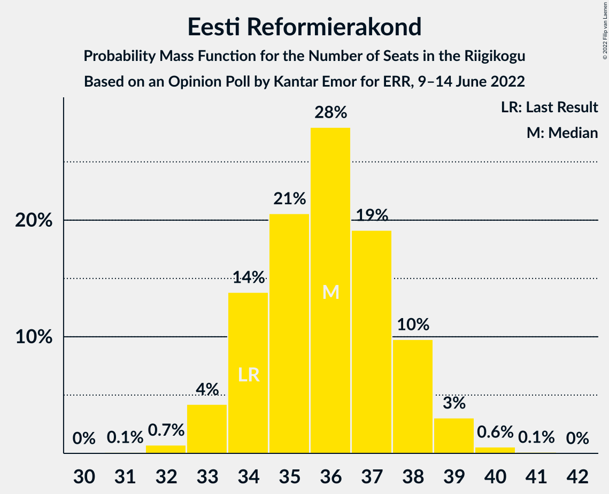

# Opinion Poll by Kantar Emor for ERR, 9–14 June 2022

<a href="#voting-intentions">Voting Intentions</a> | <a href="#seats">Seats</a> | <a href="#coalitions">Coalitions</a> | <a href="#technical-information">Technical Information</a>

## Voting Intentions

### Confidence Intervals

| Party | Last Result | Poll Result | 80% Confidence Interval | 90% Confidence Interval | 95% Confidence Interval | 99% Confidence Interval |
|:-----:|:-----------:|:-----------:|:-----------------------:|:-----------------------:|:-----------------------:|:-----------------------:|
| Eesti Reformierakond | 28.9% | 31.9% | 30.4–33.5% |30.0–33.9% |29.7–34.3% |28.9–35.1% |
| Eesti Konservatiivne Rahvaerakond | 17.8% | 18.0% | 16.8–19.3% |16.4–19.6% |16.1–20.0% |15.5–20.6% |
| Eesti Keskerakond | 23.1% | 15.0% | 13.9–16.2% |13.5–16.5% |13.3–16.8% |12.7–17.4% |
| Eesti 200 | 4.4% | 15.0% | 13.9–16.2% |13.5–16.5% |13.3–16.8% |12.7–17.4% |
| Erakond Isamaa | 11.4% | 9.0% | 8.1–10.0% |7.8–10.3% |7.7–10.5% |7.2–11.0% |
| Sotsiaaldemokraatlik Erakond | 9.8% | 8.0% | 7.2–9.0% |6.9–9.2% |6.7–9.5% |6.4–10.0% |
| Erakond Eestimaa Rohelised | 1.8% | 3.0% | 2.5–3.6% |2.4–3.8% |2.2–4.0% |2.0–4.3% |

*Note:* The poll result column reflects the actual value used in the calculations. Published results may vary slightly, and in addition be rounded to fewer digits.

## Seats

### Confidence Intervals

| Party | Last Result | Median | 80% Confidence Interval | 90% Confidence Interval | 95% Confidence Interval | 99% Confidence Interval |
|:-----:|:-----------:|:------:|:-----------------------:|:-----------------------:|:-----------------------:|:-----------------------:|
| <a href="#eesti-reformierakond">Eesti Reformierakond</a> | 34 | 36 | 34–38 |33–38 |33–39 |32–40 |
| <a href="#eesti-konservatiivne-rahvaerakond">Eesti Konservatiivne Rahvaerakond</a> | 19 | 19 | 17–20 |17–21 |17–21 |16–22 |
| <a href="#eesti-keskerakond">Eesti Keskerakond</a> | 26 | 15 | 14–17 |14–17 |13–17 |13–18 |
| <a href="#eesti-200">Eesti 200</a> | 0 | 16 | 14–16 |14–17 |13–17 |13–18 |
| <a href="#erakond-isamaa">Erakond Isamaa</a> | 12 | 8 | 7–9 |7–10 |7–10 |6–11 |
| <a href="#sotsiaaldemokraatlik-erakond">Sotsiaaldemokraatlik Erakond</a> | 10 | 7 | 6–8 |6–9 |6–9 |6–10 |
| <a href="#erakond-eestimaa-rohelised">Erakond Eestimaa Rohelised</a> | 0 | 0 | 0 |0 |0 |0 |

### Eesti Reformierakond

*For a full overview of the results for this party, see the [Eesti Reformierakond](party-eestireformierakond.html) page.*

| Number of Seats | Probability | Accumulated | Special Marks |
|:---------------:|:-----------:|:-----------:|:-------------:|
| 31 | 0.1% | 100% |  |
| 32 | 0.7% | 99.9% |  |
| 33 | 4% | 99.2% |  |
| 34 | 14% | 95% | Last Result |
| 35 | 21% | 81% |  |
| 36 | 28% | 61% | Median |
| 37 | 19% | 33% |  |
| 38 | 10% | 13% |  |
| 39 | 3% | 4% |  |
| 40 | 0.6% | 0.7% |  |
| 41 | 0.1% | 0.1% |  |
| 42 | 0% | 0% |  |

### Eesti Konservatiivne Rahvaerakond

*For a full overview of the results for this party, see the [Eesti Konservatiivne Rahvaerakond](party-eestikonservatiivnerahvaerakond.html) page.*

| Number of Seats | Probability | Accumulated | Special Marks |
|:---------------:|:-----------:|:-----------:|:-------------:|
| 15 | 0.1% | 100% |  |
| 16 | 2% | 99.9% |  |
| 17 | 11% | 98% |  |
| 18 | 27% | 87% |  |
| 19 | 34% | 60% | Last Result, Median |
| 20 | 19% | 26% |  |
| 21 | 6% | 7% |  |
| 22 | 1.2% | 1.3% |  |
| 23 | 0.1% | 0.1% |  |
| 24 | 0% | 0% |  |

### Eesti Keskerakond

*For a full overview of the results for this party, see the [Eesti Keskerakond](party-eestikeskerakond.html) page.*

| Number of Seats | Probability | Accumulated | Special Marks |
|:---------------:|:-----------:|:-----------:|:-------------:|
| 12 | 0.4% | 100% |  |
| 13 | 4% | 99.5% |  |
| 14 | 24% | 96% |  |
| 15 | 32% | 72% | Median |
| 16 | 27% | 39% |  |
| 17 | 10% | 12% |  |
| 18 | 2% | 2% |  |
| 19 | 0.2% | 0.2% |  |
| 20 | 0% | 0% |  |
| 21 | 0% | 0% |  |
| 22 | 0% | 0% |  |
| 23 | 0% | 0% |  |
| 24 | 0% | 0% |  |
| 25 | 0% | 0% |  |
| 26 | 0% | 0% | Last Result |

### Eesti 200

*For a full overview of the results for this party, see the [Eesti 200](party-eesti200.html) page.*

| Number of Seats | Probability | Accumulated | Special Marks |
|:---------------:|:-----------:|:-----------:|:-------------:|
| 0 | 0% | 100% | Last Result |
| 1 | 0% | 100% |  |
| 2 | 0% | 100% |  |
| 3 | 0% | 100% |  |
| 4 | 0% | 100% |  |
| 5 | 0% | 100% |  |
| 6 | 0% | 100% |  |
| 7 | 0% | 100% |  |
| 8 | 0% | 100% |  |
| 9 | 0% | 100% |  |
| 10 | 0% | 100% |  |
| 11 | 0% | 100% |  |
| 12 | 0.4% | 100% |  |
| 13 | 4% | 99.6% |  |
| 14 | 14% | 95% |  |
| 15 | 30% | 81% |  |
| 16 | 41% | 51% | Median |
| 17 | 9% | 10% |  |
| 18 | 1.2% | 1.4% |  |
| 19 | 0.2% | 0.2% |  |
| 20 | 0% | 0% |  |

### Erakond Isamaa

*For a full overview of the results for this party, see the [Erakond Isamaa](party-erakondisamaa.html) page.*

| Number of Seats | Probability | Accumulated | Special Marks |
|:---------------:|:-----------:|:-----------:|:-------------:|
| 6 | 0.5% | 100% |  |
| 7 | 10% | 99.5% |  |
| 8 | 44% | 89% | Median |
| 9 | 38% | 45% |  |
| 10 | 7% | 8% |  |
| 11 | 0.8% | 0.8% |  |
| 12 | 0% | 0% | Last Result |

### Sotsiaaldemokraatlik Erakond

*For a full overview of the results for this party, see the [Sotsiaaldemokraatlik Erakond](party-sotsiaaldemokraatlikerakond.html) page.*

| Number of Seats | Probability | Accumulated | Special Marks |
|:---------------:|:-----------:|:-----------:|:-------------:|
| 5 | 0.3% | 100% |  |
| 6 | 11% | 99.7% |  |
| 7 | 50% | 88% | Median |
| 8 | 32% | 38% |  |
| 9 | 6% | 6% |  |
| 10 | 0.5% | 0.5% | Last Result |
| 11 | 0% | 0% |  |

### Erakond Eestimaa Rohelised

*For a full overview of the results for this party, see the [Erakond Eestimaa Rohelised](party-erakondeestimaarohelised.html) page.*

| Number of Seats | Probability | Accumulated | Special Marks |
|:---------------:|:-----------:|:-----------:|:-------------:|
| 0 | 100% | 100% | Last Result, Median |

## Coalitions

### Confidence Intervals

| Coalition | Last Result | Median | Majority? | 80% Confidence Interval | 90% Confidence Interval | 95% Confidence Interval | 99% Confidence Interval |
|:---------:|:-----------:|:------:|:---------:|:-----------------------:|:-----------------------:|:-----------------------:|:-----------------------:|
| Eesti Reformierakond – Eesti Konservatiivne Rahvaerakond – Eesti Keskerakond | 79 | 70 | 100% | 68–72 | 68–72 | 67–73 | 66–74 |
| Eesti Reformierakond – Eesti Konservatiivne Rahvaerakond – Erakond Isamaa | 65 | 63 | 100% | 61–65 | 61–66 | 60–66 | 59–67 |
| Eesti Reformierakond – Eesti Konservatiivne Rahvaerakond | 53 | 55 | 99.7% | 53–56 | 52–57 | 52–58 | 51–59 |
| Eesti Reformierakond – Erakond Isamaa – Sotsiaaldemokraatlik Erakond | 56 | 52 | 79% | 50–54 | 49–54 | 49–55 | 48–56 |
| Eesti Reformierakond – Eesti Keskerakond | 60 | 51 | 66% | 49–53 | 49–54 | 48–54 | 47–55 |
| Eesti Reformierakond – Erakond Isamaa | 46 | 44 | 0% | 42–46 | 42–47 | 41–47 | 41–48 |
| Eesti Reformierakond – Sotsiaaldemokraatlik Erakond | 44 | 43 | 0% | 41–45 | 41–46 | 40–46 | 39–47 |
| Eesti Konservatiivne Rahvaerakond – Eesti Keskerakond – Erakond Isamaa | 57 | 42 | 0% | 40–44 | 40–45 | 40–45 | 39–46 |
| Eesti Konservatiivne Rahvaerakond – Eesti Keskerakond | 45 | 34 | 0% | 32–36 | 32–36 | 31–37 | 30–38 |
| Eesti Keskerakond – Erakond Isamaa – Sotsiaaldemokraatlik Erakond | 48 | 31 | 0% | 29–33 | 29–33 | 28–34 | 28–35 |
| Eesti Konservatiivne Rahvaerakond – Sotsiaaldemokraatlik Erakond | 29 | 26 | 0% | 24–28 | 24–28 | 24–29 | 23–30 |
| Eesti Keskerakond – Sotsiaaldemokraatlik Erakond | 36 | 22 | 0% | 21–24 | 21–25 | 20–25 | 19–26 |

### Eesti Reformierakond – Eesti Konservatiivne Rahvaerakond – Eesti Keskerakond

| Number of Seats | Probability | Accumulated | Special Marks |
|:---------------:|:-----------:|:-----------:|:-------------:|
| 65 | 0.1% | 100% |  |
| 66 | 0.8% | 99.9% |  |
| 67 | 3% | 99.2% |  |
| 68 | 12% | 96% |  |
| 69 | 25% | 84% |  |
| 70 | 26% | 59% | Median |
| 71 | 23% | 33% |  |
| 72 | 7% | 10% |  |
| 73 | 3% | 4% |  |
| 74 | 0.6% | 0.7% |  |
| 75 | 0% | 0% |  |
| 76 | 0% | 0% |  |
| 77 | 0% | 0% |  |
| 78 | 0% | 0% |  |
| 79 | 0% | 0% | Last Result |

### Eesti Reformierakond – Eesti Konservatiivne Rahvaerakond – Erakond Isamaa

| Number of Seats | Probability | Accumulated | Special Marks |
|:---------------:|:-----------:|:-----------:|:-------------:|
| 58 | 0.1% | 100% |  |
| 59 | 0.7% | 99.9% |  |
| 60 | 3% | 99.2% |  |
| 61 | 12% | 96% |  |
| 62 | 18% | 84% |  |
| 63 | 26% | 66% | Median |
| 64 | 25% | 40% |  |
| 65 | 9% | 15% | Last Result |
| 66 | 4% | 5% |  |
| 67 | 0.8% | 1.0% |  |
| 68 | 0.2% | 0.2% |  |
| 69 | 0% | 0% |  |

### Eesti Reformierakond – Eesti Konservatiivne Rahvaerakond

| Number of Seats | Probability | Accumulated | Special Marks |
|:---------------:|:-----------:|:-----------:|:-------------:|
| 50 | 0.2% | 100% |  |
| 51 | 2% | 99.7% | Majority |
| 52 | 7% | 98% |  |
| 53 | 11% | 91% | Last Result |
| 54 | 27% | 80% |  |
| 55 | 22% | 53% | Median |
| 56 | 21% | 30% |  |
| 57 | 6% | 10% |  |
| 58 | 3% | 3% |  |
| 59 | 0.5% | 0.6% |  |
| 60 | 0.1% | 0.1% |  |
| 61 | 0% | 0% |  |

### Eesti Reformierakond – Erakond Isamaa – Sotsiaaldemokraatlik Erakond

| Number of Seats | Probability | Accumulated | Special Marks |
|:---------------:|:-----------:|:-----------:|:-------------:|
| 47 | 0.2% | 100% |  |
| 48 | 0.9% | 99.8% |  |
| 49 | 6% | 98.9% |  |
| 50 | 14% | 93% |  |
| 51 | 27% | 79% | Median, Majority |
| 52 | 26% | 52% |  |
| 53 | 16% | 26% |  |
| 54 | 7% | 10% |  |
| 55 | 2% | 3% |  |
| 56 | 0.9% | 0.9% | Last Result |
| 57 | 0.1% | 0.1% |  |
| 58 | 0% | 0% |  |

### Eesti Reformierakond – Eesti Keskerakond

| Number of Seats | Probability | Accumulated | Special Marks |
|:---------------:|:-----------:|:-----------:|:-------------:|
| 46 | 0.1% | 100% |  |
| 47 | 0.6% | 99.9% |  |
| 48 | 4% | 99.3% |  |
| 49 | 12% | 95% |  |
| 50 | 18% | 84% |  |
| 51 | 26% | 66% | Median, Majority |
| 52 | 23% | 39% |  |
| 53 | 11% | 16% |  |
| 54 | 4% | 6% |  |
| 55 | 1.2% | 1.5% |  |
| 56 | 0.2% | 0.2% |  |
| 57 | 0% | 0% |  |
| 58 | 0% | 0% |  |
| 59 | 0% | 0% |  |
| 60 | 0% | 0% | Last Result |

### Eesti Reformierakond – Erakond Isamaa

| Number of Seats | Probability | Accumulated | Special Marks |
|:---------------:|:-----------:|:-----------:|:-------------:|
| 40 | 0.4% | 100% |  |
| 41 | 3% | 99.6% |  |
| 42 | 9% | 97% |  |
| 43 | 17% | 88% |  |
| 44 | 26% | 71% | Median |
| 45 | 26% | 45% |  |
| 46 | 11% | 19% | Last Result |
| 47 | 5% | 8% |  |
| 48 | 2% | 2% |  |
| 49 | 0.3% | 0.3% |  |
| 50 | 0% | 0% |  |

### Eesti Reformierakond – Sotsiaaldemokraatlik Erakond

| Number of Seats | Probability | Accumulated | Special Marks |
|:---------------:|:-----------:|:-----------:|:-------------:|
| 38 | 0.1% | 100% |  |
| 39 | 0.5% | 99.9% |  |
| 40 | 3% | 99.4% |  |
| 41 | 10% | 97% |  |
| 42 | 16% | 87% |  |
| 43 | 32% | 71% | Median |
| 44 | 21% | 39% | Last Result |
| 45 | 12% | 19% |  |
| 46 | 5% | 6% |  |
| 47 | 1.3% | 2% |  |
| 48 | 0.1% | 0.2% |  |
| 49 | 0% | 0% |  |

### Eesti Konservatiivne Rahvaerakond – Eesti Keskerakond – Erakond Isamaa

| Number of Seats | Probability | Accumulated | Special Marks |
|:---------------:|:-----------:|:-----------:|:-------------:|
| 38 | 0.4% | 100% |  |
| 39 | 2% | 99.6% |  |
| 40 | 9% | 98% |  |
| 41 | 14% | 89% |  |
| 42 | 30% | 75% | Median |
| 43 | 21% | 45% |  |
| 44 | 16% | 24% |  |
| 45 | 6% | 8% |  |
| 46 | 1.4% | 2% |  |
| 47 | 0.4% | 0.5% |  |
| 48 | 0% | 0% |  |
| 49 | 0% | 0% |  |
| 50 | 0% | 0% |  |
| 51 | 0% | 0% | Majority |
| 52 | 0% | 0% |  |
| 53 | 0% | 0% |  |
| 54 | 0% | 0% |  |
| 55 | 0% | 0% |  |
| 56 | 0% | 0% |  |
| 57 | 0% | 0% | Last Result |

### Eesti Konservatiivne Rahvaerakond – Eesti Keskerakond

| Number of Seats | Probability | Accumulated | Special Marks |
|:---------------:|:-----------:|:-----------:|:-------------:|
| 29 | 0.1% | 100% |  |
| 30 | 0.6% | 99.9% |  |
| 31 | 3% | 99.3% |  |
| 32 | 10% | 96% |  |
| 33 | 25% | 86% |  |
| 34 | 23% | 61% | Median |
| 35 | 23% | 38% |  |
| 36 | 11% | 15% |  |
| 37 | 3% | 4% |  |
| 38 | 0.7% | 0.8% |  |
| 39 | 0.1% | 0.1% |  |
| 40 | 0% | 0% |  |
| 41 | 0% | 0% |  |
| 42 | 0% | 0% |  |
| 43 | 0% | 0% |  |
| 44 | 0% | 0% |  |
| 45 | 0% | 0% | Last Result |

### Eesti Keskerakond – Erakond Isamaa – Sotsiaaldemokraatlik Erakond

| Number of Seats | Probability | Accumulated | Special Marks |
|:---------------:|:-----------:|:-----------:|:-------------:|
| 27 | 0.4% | 100% |  |
| 28 | 3% | 99.6% |  |
| 29 | 12% | 97% |  |
| 30 | 22% | 85% | Median |
| 31 | 30% | 63% |  |
| 32 | 19% | 33% |  |
| 33 | 10% | 14% |  |
| 34 | 3% | 4% |  |
| 35 | 0.7% | 0.8% |  |
| 36 | 0.1% | 0.1% |  |
| 37 | 0% | 0% |  |
| 38 | 0% | 0% |  |
| 39 | 0% | 0% |  |
| 40 | 0% | 0% |  |
| 41 | 0% | 0% |  |
| 42 | 0% | 0% |  |
| 43 | 0% | 0% |  |
| 44 | 0% | 0% |  |
| 45 | 0% | 0% |  |
| 46 | 0% | 0% |  |
| 47 | 0% | 0% |  |
| 48 | 0% | 0% | Last Result |

### Eesti Konservatiivne Rahvaerakond – Sotsiaaldemokraatlik Erakond

| Number of Seats | Probability | Accumulated | Special Marks |
|:---------------:|:-----------:|:-----------:|:-------------:|
| 22 | 0.3% | 100% |  |
| 23 | 2% | 99.7% |  |
| 24 | 8% | 98% |  |
| 25 | 21% | 89% |  |
| 26 | 32% | 69% | Median |
| 27 | 22% | 37% |  |
| 28 | 11% | 15% |  |
| 29 | 3% | 4% | Last Result |
| 30 | 0.5% | 0.6% |  |
| 31 | 0.1% | 0.1% |  |
| 32 | 0% | 0% |  |

### Eesti Keskerakond – Sotsiaaldemokraatlik Erakond

| Number of Seats | Probability | Accumulated | Special Marks |
|:---------------:|:-----------:|:-----------:|:-------------:|
| 19 | 0.7% | 100% |  |
| 20 | 4% | 99.3% |  |
| 21 | 18% | 96% |  |
| 22 | 29% | 78% | Median |
| 23 | 24% | 49% |  |
| 24 | 18% | 25% |  |
| 25 | 5% | 6% |  |
| 26 | 0.8% | 1.0% |  |
| 27 | 0.1% | 0.2% |  |
| 28 | 0% | 0% |  |
| 29 | 0% | 0% |  |
| 30 | 0% | 0% |  |
| 31 | 0% | 0% |  |
| 32 | 0% | 0% |  |
| 33 | 0% | 0% |  |
| 34 | 0% | 0% |  |
| 35 | 0% | 0% |  |
| 36 | 0% | 0% | Last Result |

## Technical Information

### Opinion Poll

+ **Polling firm:** Kantar Emor
+ **Commissioner(s):** ERR
+ **Fieldwork period:** 9–14 June 2022

### Calculations

+ **Sample size:** 1537
+ **Simulations done:** 1,048,576
+ **Error estimate:** 1.62%

