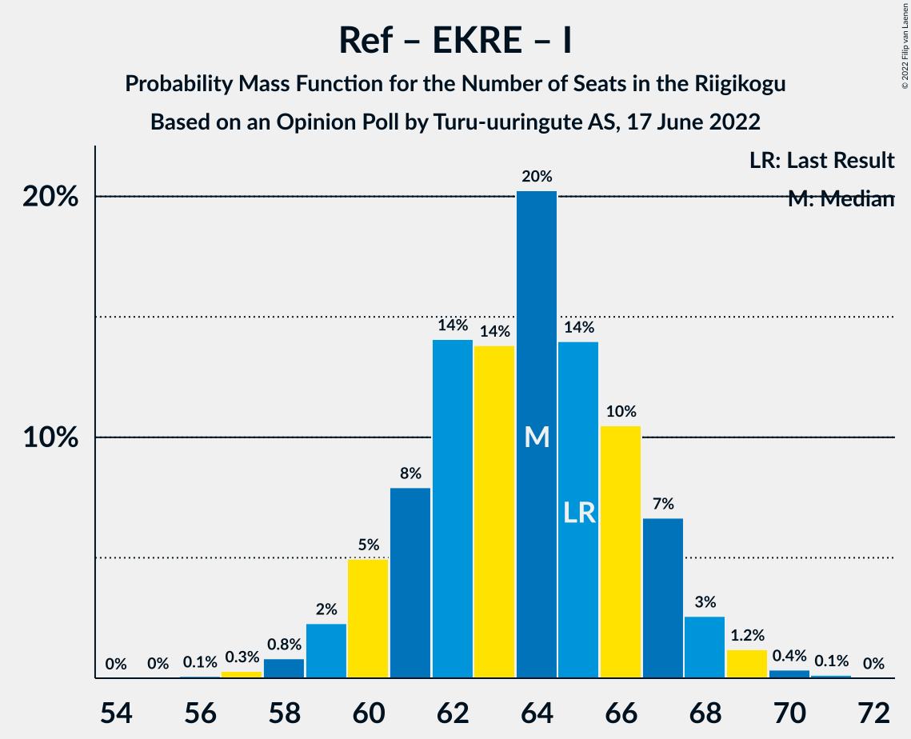

# Opinion Poll by Turu-uuringute AS, 17 June 2022

<a href="#voting-intentions">Voting Intentions</a> | <a href="#seats">Seats</a> | <a href="#coalitions">Coalitions</a> | <a href="#technical-information">Technical Information</a>

## Voting Intentions

### Confidence Intervals

| Party | Last Result | Poll Result | 80% Confidence Interval | 90% Confidence Interval | 95% Confidence Interval | 99% Confidence Interval |
|:-----:|:-----------:|:-----------:|:-----------------------:|:-----------------------:|:-----------------------:|:-----------------------:|
| Eesti Reformierakond | 28.9% | 31.0% | 28.7–33.5% |28.0–34.2% |27.4–34.8% |26.3–36.0% |
| Eesti Konservatiivne Rahvaerakond | 17.8% | 18.0% | 16.1–20.1% |15.6–20.7% |15.1–21.3% |14.3–22.3% |
| Eesti Keskerakond | 23.1% | 17.0% | 15.2–19.1% |14.6–19.7% |14.2–20.2% |13.4–21.3% |
| Eesti 200 | 4.4% | 12.0% | 10.4–13.9% |10.0–14.4% |9.6–14.9% |8.9–15.8% |
| Erakond Isamaa | 11.4% | 10.0% | 8.6–11.7% |8.2–12.2% |7.8–12.7% |7.2–13.5% |
| Sotsiaaldemokraatlik Erakond | 9.8% | 8.0% | 6.7–9.6% |6.4–10.1% |6.1–10.5% |5.5–11.3% |
| Erakond Eestimaa Rohelised | 1.8% | 1.0% | 0.6–1.8% |0.5–2.0% |0.5–2.2% |0.3–2.6% |

*Note:* The poll result column reflects the actual value used in the calculations. Published results may vary slightly, and in addition be rounded to fewer digits.

## Seats

### Confidence Intervals

| Party | Last Result | Median | 80% Confidence Interval | 90% Confidence Interval | 95% Confidence Interval | 99% Confidence Interval |
|:-----:|:-----------:|:------:|:-----------------------:|:-----------------------:|:-----------------------:|:-----------------------:|
| <a href="#eesti-reformierakond">Eesti Reformierakond</a> | 34 | 35 | 32–38 |31–39 |31–40 |29–41 |
| <a href="#eesti-konservatiivne-rahvaerakond">Eesti Konservatiivne Rahvaerakond</a> | 19 | 19 | 17–21 |16–22 |15–23 |14–24 |
| <a href="#eesti-keskerakond">Eesti Keskerakond</a> | 26 | 18 | 16–20 |15–21 |14–22 |13–23 |
| <a href="#eesti-200">Eesti 200</a> | 0 | 12 | 10–14 |10–15 |9–15 |8–16 |
| <a href="#erakond-isamaa">Erakond Isamaa</a> | 12 | 10 | 8–11 |8–12 |7–13 |7–14 |
| <a href="#sotsiaaldemokraatlik-erakond">Sotsiaaldemokraatlik Erakond</a> | 10 | 7 | 6–9 |6–10 |5–10 |5–11 |
| <a href="#erakond-eestimaa-rohelised">Erakond Eestimaa Rohelised</a> | 0 | 0 | 0 |0 |0 |0 |

### Eesti Reformierakond

*For a full overview of the results for this party, see the [Eesti Reformierakond](party-eestireformierakond.html) page.*

| Number of Seats | Probability | Accumulated | Special Marks |
|:---------------:|:-----------:|:-----------:|:-------------:|
| 28 | 0.1% | 100% |  |
| 29 | 0.6% | 99.8% |  |
| 30 | 2% | 99.3% |  |
| 31 | 4% | 98% |  |
| 32 | 7% | 94% |  |
| 33 | 12% | 86% |  |
| 34 | 17% | 74% | Last Result |
| 35 | 17% | 58% | Median |
| 36 | 15% | 41% |  |
| 37 | 12% | 26% |  |
| 38 | 7% | 13% |  |
| 39 | 3% | 6% |  |
| 40 | 2% | 3% |  |
| 41 | 0.6% | 0.9% |  |
| 42 | 0.2% | 0.3% |  |
| 43 | 0.1% | 0.1% |  |
| 44 | 0% | 0% |  |

### Eesti Konservatiivne Rahvaerakond

*For a full overview of the results for this party, see the [Eesti Konservatiivne Rahvaerakond](party-eestikonservatiivnerahvaerakond.html) page.*

| Number of Seats | Probability | Accumulated | Special Marks |
|:---------------:|:-----------:|:-----------:|:-------------:|
| 13 | 0.1% | 100% |  |
| 14 | 0.4% | 99.9% |  |
| 15 | 2% | 99.5% |  |
| 16 | 7% | 97% |  |
| 17 | 10% | 91% |  |
| 18 | 24% | 81% |  |
| 19 | 18% | 57% | Last Result, Median |
| 20 | 18% | 39% |  |
| 21 | 14% | 21% |  |
| 22 | 4% | 8% |  |
| 23 | 3% | 4% |  |
| 24 | 0.7% | 1.0% |  |
| 25 | 0.2% | 0.2% |  |
| 26 | 0.1% | 0.1% |  |
| 27 | 0% | 0% |  |

### Eesti Keskerakond

*For a full overview of the results for this party, see the [Eesti Keskerakond](party-eestikeskerakond.html) page.*

| Number of Seats | Probability | Accumulated | Special Marks |
|:---------------:|:-----------:|:-----------:|:-------------:|
| 12 | 0.1% | 100% |  |
| 13 | 0.5% | 99.9% |  |
| 14 | 2% | 99.4% |  |
| 15 | 7% | 97% |  |
| 16 | 14% | 90% |  |
| 17 | 22% | 77% |  |
| 18 | 21% | 54% | Median |
| 19 | 16% | 33% |  |
| 20 | 10% | 17% |  |
| 21 | 5% | 7% |  |
| 22 | 2% | 3% |  |
| 23 | 0.5% | 0.7% |  |
| 24 | 0.1% | 0.2% |  |
| 25 | 0% | 0% |  |
| 26 | 0% | 0% | Last Result |

### Eesti 200

*For a full overview of the results for this party, see the [Eesti 200](party-eesti200.html) page.*

| Number of Seats | Probability | Accumulated | Special Marks |
|:---------------:|:-----------:|:-----------:|:-------------:|
| 0 | 0% | 100% | Last Result |
| 1 | 0% | 100% |  |
| 2 | 0% | 100% |  |
| 3 | 0% | 100% |  |
| 4 | 0% | 100% |  |
| 5 | 0% | 100% |  |
| 6 | 0% | 100% |  |
| 7 | 0% | 100% |  |
| 8 | 0.5% | 100% |  |
| 9 | 4% | 99.4% |  |
| 10 | 12% | 96% |  |
| 11 | 23% | 84% |  |
| 12 | 25% | 60% | Median |
| 13 | 21% | 36% |  |
| 14 | 9% | 15% |  |
| 15 | 4% | 5% |  |
| 16 | 1.0% | 1.3% |  |
| 17 | 0.2% | 0.3% |  |
| 18 | 0.1% | 0.1% |  |
| 19 | 0% | 0% |  |

### Erakond Isamaa

*For a full overview of the results for this party, see the [Erakond Isamaa](party-erakondisamaa.html) page.*

| Number of Seats | Probability | Accumulated | Special Marks |
|:---------------:|:-----------:|:-----------:|:-------------:|
| 6 | 0.4% | 100% |  |
| 7 | 4% | 99.6% |  |
| 8 | 13% | 96% |  |
| 9 | 28% | 82% |  |
| 10 | 27% | 54% | Median |
| 11 | 17% | 27% |  |
| 12 | 7% | 10% | Last Result |
| 13 | 2% | 3% |  |
| 14 | 0.5% | 0.6% |  |
| 15 | 0.1% | 0.1% |  |
| 16 | 0% | 0% |  |

### Sotsiaaldemokraatlik Erakond

*For a full overview of the results for this party, see the [Sotsiaaldemokraatlik Erakond](party-sotsiaaldemokraatlikerakond.html) page.*

| Number of Seats | Probability | Accumulated | Special Marks |
|:---------------:|:-----------:|:-----------:|:-------------:|
| 0 | 0.1% | 100% |  |
| 1 | 0% | 99.9% |  |
| 2 | 0% | 99.9% |  |
| 3 | 0% | 99.9% |  |
| 4 | 0.2% | 99.9% |  |
| 5 | 3% | 99.8% |  |
| 6 | 17% | 96% |  |
| 7 | 30% | 79% | Median |
| 8 | 28% | 49% |  |
| 9 | 14% | 20% |  |
| 10 | 5% | 6% | Last Result |
| 11 | 1.1% | 1.2% |  |
| 12 | 0.1% | 0.2% |  |
| 13 | 0% | 0% |  |

### Erakond Eestimaa Rohelised

*For a full overview of the results for this party, see the [Erakond Eestimaa Rohelised](party-erakondeestimaarohelised.html) page.*

| Number of Seats | Probability | Accumulated | Special Marks |
|:---------------:|:-----------:|:-----------:|:-------------:|
| 0 | 100% | 100% | Last Result, Median |

## Coalitions

### Confidence Intervals

| Coalition | Last Result | Median | Majority? | 80% Confidence Interval | 90% Confidence Interval | 95% Confidence Interval | 99% Confidence Interval |
|:---------:|:-----------:|:------:|:---------:|:-----------------------:|:-----------------------:|:-----------------------:|:-----------------------:|
| Eesti Reformierakond – Eesti Konservatiivne Rahvaerakond – Eesti Keskerakond | 79 | 72 | 100% | 69–74 | 68–75 | 67–76 | 66–77 |
| Eesti Reformierakond – Eesti Konservatiivne Rahvaerakond – Erakond Isamaa | 65 | 64 | 100% | 61–67 | 60–67 | 59–68 | 58–70 |
| Eesti Reformierakond – Eesti Konservatiivne Rahvaerakond | 53 | 54 | 93% | 51–57 | 50–58 | 49–58 | 48–60 |
| Eesti Reformierakond – Eesti Keskerakond | 60 | 53 | 83% | 50–56 | 49–57 | 48–57 | 47–59 |
| Eesti Reformierakond – Erakond Isamaa – Sotsiaaldemokraatlik Erakond | 56 | 52 | 77% | 49–55 | 48–56 | 47–57 | 46–58 |
| Eesti Konservatiivne Rahvaerakond – Eesti Keskerakond – Erakond Isamaa | 57 | 47 | 5% | 44–49 | 42–51 | 42–51 | 40–52 |
| Eesti Reformierakond – Erakond Isamaa | 46 | 45 | 0.8% | 42–48 | 41–49 | 40–50 | 38–51 |
| Eesti Reformierakond – Sotsiaaldemokraatlik Erakond | 44 | 42 | 0% | 39–46 | 39–46 | 38–47 | 36–49 |
| Eesti Konservatiivne Rahvaerakond – Eesti Keskerakond | 45 | 37 | 0% | 34–40 | 33–41 | 32–41 | 31–43 |
| Eesti Keskerakond – Erakond Isamaa – Sotsiaaldemokraatlik Erakond | 48 | 35 | 0% | 32–38 | 31–39 | 31–40 | 29–41 |
| Eesti Konservatiivne Rahvaerakond – Sotsiaaldemokraatlik Erakond | 29 | 26 | 0% | 24–29 | 23–30 | 22–31 | 21–32 |
| Eesti Keskerakond – Sotsiaaldemokraatlik Erakond | 36 | 25 | 0% | 23–28 | 22–29 | 21–29 | 20–31 |

### Eesti Reformierakond – Eesti Konservatiivne Rahvaerakond – Eesti Keskerakond

| Number of Seats | Probability | Accumulated | Special Marks |
|:---------------:|:-----------:|:-----------:|:-------------:|
| 64 | 0.1% | 100% |  |
| 65 | 0.3% | 99.9% |  |
| 66 | 0.8% | 99.6% |  |
| 67 | 2% | 98.8% |  |
| 68 | 3% | 97% |  |
| 69 | 6% | 94% |  |
| 70 | 11% | 88% |  |
| 71 | 19% | 77% |  |
| 72 | 22% | 57% | Median |
| 73 | 16% | 35% |  |
| 74 | 11% | 19% |  |
| 75 | 4% | 8% |  |
| 76 | 2% | 3% |  |
| 77 | 0.9% | 1.2% |  |
| 78 | 0.2% | 0.3% |  |
| 79 | 0.1% | 0.1% | Last Result |
| 80 | 0% | 0% |  |

### Eesti Reformierakond – Eesti Konservatiivne Rahvaerakond – Erakond Isamaa

| Number of Seats | Probability | Accumulated | Special Marks |
|:---------------:|:-----------:|:-----------:|:-------------:|
| 56 | 0.1% | 100% |  |
| 57 | 0.3% | 99.9% |  |
| 58 | 0.8% | 99.6% |  |
| 59 | 2% | 98.8% |  |
| 60 | 5% | 96% |  |
| 61 | 8% | 92% |  |
| 62 | 14% | 84% |  |
| 63 | 14% | 70% |  |
| 64 | 20% | 56% | Median |
| 65 | 14% | 35% | Last Result |
| 66 | 10% | 21% |  |
| 67 | 7% | 11% |  |
| 68 | 3% | 4% |  |
| 69 | 1.2% | 2% |  |
| 70 | 0.4% | 0.5% |  |
| 71 | 0.1% | 0.2% |  |
| 72 | 0% | 0% |  |

### Eesti Reformierakond – Eesti Konservatiivne Rahvaerakond

| Number of Seats | Probability | Accumulated | Special Marks |
|:---------------:|:-----------:|:-----------:|:-------------:|
| 46 | 0.1% | 100% |  |
| 47 | 0.3% | 99.9% |  |
| 48 | 0.9% | 99.6% |  |
| 49 | 2% | 98.6% |  |
| 50 | 4% | 97% |  |
| 51 | 6% | 93% | Majority |
| 52 | 13% | 87% |  |
| 53 | 15% | 74% | Last Result |
| 54 | 17% | 59% | Median |
| 55 | 18% | 42% |  |
| 56 | 11% | 24% |  |
| 57 | 7% | 13% |  |
| 58 | 4% | 6% |  |
| 59 | 1.4% | 2% |  |
| 60 | 0.7% | 1.0% |  |
| 61 | 0.2% | 0.3% |  |
| 62 | 0.1% | 0.1% |  |
| 63 | 0% | 0% |  |

### Eesti Reformierakond – Eesti Keskerakond

| Number of Seats | Probability | Accumulated | Special Marks |
|:---------------:|:-----------:|:-----------:|:-------------:|
| 45 | 0.1% | 100% |  |
| 46 | 0.3% | 99.9% |  |
| 47 | 1.0% | 99.6% |  |
| 48 | 2% | 98.6% |  |
| 49 | 4% | 96% |  |
| 50 | 9% | 92% |  |
| 51 | 13% | 83% | Majority |
| 52 | 15% | 70% |  |
| 53 | 18% | 56% | Median |
| 54 | 14% | 38% |  |
| 55 | 12% | 23% |  |
| 56 | 6% | 12% |  |
| 57 | 4% | 6% |  |
| 58 | 1.4% | 2% |  |
| 59 | 0.5% | 0.8% |  |
| 60 | 0.2% | 0.3% | Last Result |
| 61 | 0.1% | 0.1% |  |
| 62 | 0% | 0% |  |

### Eesti Reformierakond – Erakond Isamaa – Sotsiaaldemokraatlik Erakond

| Number of Seats | Probability | Accumulated | Special Marks |
|:---------------:|:-----------:|:-----------:|:-------------:|
| 44 | 0% | 100% |  |
| 45 | 0.2% | 99.9% |  |
| 46 | 0.6% | 99.7% |  |
| 47 | 2% | 99.1% |  |
| 48 | 3% | 97% |  |
| 49 | 9% | 94% |  |
| 50 | 9% | 86% |  |
| 51 | 16% | 77% | Majority |
| 52 | 15% | 61% | Median |
| 53 | 17% | 46% |  |
| 54 | 10% | 28% |  |
| 55 | 10% | 19% |  |
| 56 | 5% | 9% | Last Result |
| 57 | 3% | 4% |  |
| 58 | 0.9% | 1.3% |  |
| 59 | 0.3% | 0.5% |  |
| 60 | 0.1% | 0.1% |  |
| 61 | 0% | 0% |  |

### Eesti Konservatiivne Rahvaerakond – Eesti Keskerakond – Erakond Isamaa

| Number of Seats | Probability | Accumulated | Special Marks |
|:---------------:|:-----------:|:-----------:|:-------------:|
| 39 | 0.2% | 100% |  |
| 40 | 0.3% | 99.8% |  |
| 41 | 1.4% | 99.4% |  |
| 42 | 3% | 98% |  |
| 43 | 4% | 95% |  |
| 44 | 13% | 91% |  |
| 45 | 10% | 77% |  |
| 46 | 17% | 68% |  |
| 47 | 19% | 51% | Median |
| 48 | 9% | 31% |  |
| 49 | 12% | 22% |  |
| 50 | 5% | 10% |  |
| 51 | 3% | 5% | Majority |
| 52 | 2% | 2% |  |
| 53 | 0.2% | 0.5% |  |
| 54 | 0.2% | 0.2% |  |
| 55 | 0% | 0% |  |
| 56 | 0% | 0% |  |
| 57 | 0% | 0% | Last Result |

### Eesti Reformierakond – Erakond Isamaa

| Number of Seats | Probability | Accumulated | Special Marks |
|:---------------:|:-----------:|:-----------:|:-------------:|
| 37 | 0.1% | 100% |  |
| 38 | 0.4% | 99.9% |  |
| 39 | 0.9% | 99.5% |  |
| 40 | 2% | 98.6% |  |
| 41 | 6% | 96% |  |
| 42 | 9% | 91% |  |
| 43 | 13% | 82% |  |
| 44 | 15% | 69% |  |
| 45 | 19% | 54% | Median |
| 46 | 13% | 36% | Last Result |
| 47 | 10% | 23% |  |
| 48 | 6% | 12% |  |
| 49 | 4% | 6% |  |
| 50 | 2% | 3% |  |
| 51 | 0.5% | 0.8% | Majority |
| 52 | 0.2% | 0.2% |  |
| 53 | 0.1% | 0.1% |  |
| 54 | 0% | 0% |  |

### Eesti Reformierakond – Sotsiaaldemokraatlik Erakond

| Number of Seats | Probability | Accumulated | Special Marks |
|:---------------:|:-----------:|:-----------:|:-------------:|
| 35 | 0.1% | 100% |  |
| 36 | 0.4% | 99.9% |  |
| 37 | 1.5% | 99.5% |  |
| 38 | 2% | 98% |  |
| 39 | 8% | 96% |  |
| 40 | 6% | 88% |  |
| 41 | 17% | 82% |  |
| 42 | 15% | 65% | Median |
| 43 | 15% | 49% |  |
| 44 | 16% | 35% | Last Result |
| 45 | 7% | 19% |  |
| 46 | 8% | 12% |  |
| 47 | 2% | 4% |  |
| 48 | 2% | 2% |  |
| 49 | 0.4% | 0.6% |  |
| 50 | 0.1% | 0.2% |  |
| 51 | 0% | 0% | Majority |

### Eesti Konservatiivne Rahvaerakond – Eesti Keskerakond

| Number of Seats | Probability | Accumulated | Special Marks |
|:---------------:|:-----------:|:-----------:|:-------------:|
| 29 | 0% | 100% |  |
| 30 | 0.2% | 99.9% |  |
| 31 | 0.7% | 99.7% |  |
| 32 | 2% | 99.0% |  |
| 33 | 4% | 97% |  |
| 34 | 9% | 93% |  |
| 35 | 13% | 84% |  |
| 36 | 16% | 71% |  |
| 37 | 16% | 55% | Median |
| 38 | 16% | 38% |  |
| 39 | 10% | 22% |  |
| 40 | 7% | 12% |  |
| 41 | 3% | 5% |  |
| 42 | 2% | 2% |  |
| 43 | 0.4% | 0.7% |  |
| 44 | 0.2% | 0.2% |  |
| 45 | 0% | 0% | Last Result |

### Eesti Keskerakond – Erakond Isamaa – Sotsiaaldemokraatlik Erakond

| Number of Seats | Probability | Accumulated | Special Marks |
|:---------------:|:-----------:|:-----------:|:-------------:|
| 28 | 0.1% | 100% |  |
| 29 | 0.5% | 99.8% |  |
| 30 | 1.3% | 99.3% |  |
| 31 | 4% | 98% |  |
| 32 | 6% | 94% |  |
| 33 | 14% | 88% |  |
| 34 | 14% | 74% |  |
| 35 | 17% | 59% | Median |
| 36 | 17% | 42% |  |
| 37 | 11% | 25% |  |
| 38 | 8% | 14% |  |
| 39 | 3% | 6% |  |
| 40 | 2% | 3% |  |
| 41 | 0.6% | 0.8% |  |
| 42 | 0.2% | 0.3% |  |
| 43 | 0.1% | 0.1% |  |
| 44 | 0% | 0% |  |
| 45 | 0% | 0% |  |
| 46 | 0% | 0% |  |
| 47 | 0% | 0% |  |
| 48 | 0% | 0% | Last Result |

### Eesti Konservatiivne Rahvaerakond – Sotsiaaldemokraatlik Erakond

| Number of Seats | Probability | Accumulated | Special Marks |
|:---------------:|:-----------:|:-----------:|:-------------:|
| 20 | 0.1% | 100% |  |
| 21 | 0.5% | 99.8% |  |
| 22 | 2% | 99.3% |  |
| 23 | 5% | 97% |  |
| 24 | 10% | 93% |  |
| 25 | 16% | 83% |  |
| 26 | 18% | 68% | Median |
| 27 | 19% | 50% |  |
| 28 | 14% | 31% |  |
| 29 | 9% | 17% | Last Result |
| 30 | 5% | 8% |  |
| 31 | 2% | 3% |  |
| 32 | 0.7% | 1.1% |  |
| 33 | 0.3% | 0.3% |  |
| 34 | 0.1% | 0.1% |  |
| 35 | 0% | 0% |  |

### Eesti Keskerakond – Sotsiaaldemokraatlik Erakond

| Number of Seats | Probability | Accumulated | Special Marks |
|:---------------:|:-----------:|:-----------:|:-------------:|
| 18 | 0% | 100% |  |
| 19 | 0.1% | 99.9% |  |
| 20 | 0.6% | 99.8% |  |
| 21 | 2% | 99.2% |  |
| 22 | 5% | 97% |  |
| 23 | 12% | 92% |  |
| 24 | 16% | 80% |  |
| 25 | 19% | 64% | Median |
| 26 | 19% | 46% |  |
| 27 | 12% | 27% |  |
| 28 | 9% | 15% |  |
| 29 | 4% | 6% |  |
| 30 | 2% | 2% |  |
| 31 | 0.6% | 0.8% |  |
| 32 | 0.2% | 0.2% |  |
| 33 | 0% | 0% |  |
| 34 | 0% | 0% |  |
| 35 | 0% | 0% |  |
| 36 | 0% | 0% | Last Result |

## Technical Information

### Opinion Poll

+ **Polling firm:** Turu-uuringute AS
+ **Commissioner(s):** —
+ **Fieldwork period:** 17 June 2022

### Calculations

+ **Sample size:** 600
+ **Simulations done:** 1,048,576
+ **Error estimate:** 1.57%

