# Opinion Poll by Norstat for MTÜ Ühiskonnauuringute Instituut, 14–20 June 2022

<a href="#voting-intentions">Voting Intentions</a> | <a href="#seats">Seats</a> | <a href="#coalitions">Coalitions</a> | <a href="#technical-information">Technical Information</a>

## Voting Intentions

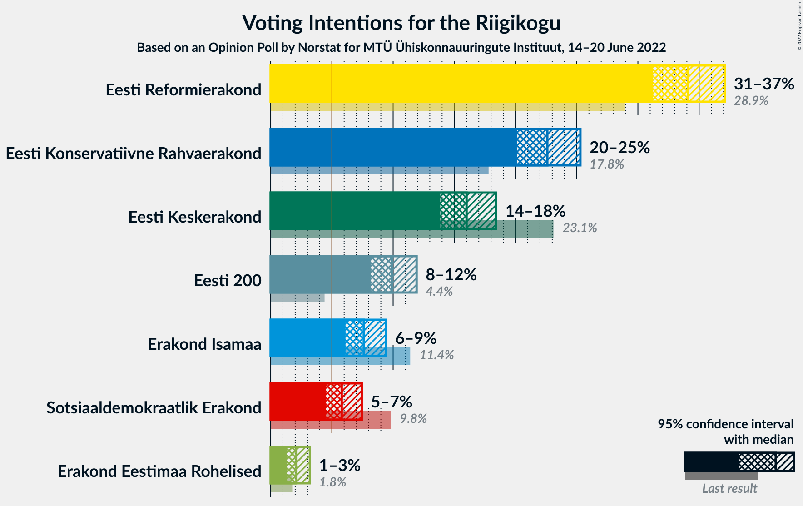

### Confidence Intervals

| Party | Last Result | Poll Result | 80% Confidence Interval | 90% Confidence Interval | 95% Confidence Interval | 99% Confidence Interval |
|:-----:|:-----------:|:-----------:|:-----------------------:|:-----------------------:|:-----------------------:|:-----------------------:|
| Eesti Reformierakond | 28.9% | 34.1% | 32.2–36.1% |31.7–36.6% |31.2–37.1% |30.3–38.0% |
| Eesti Konservatiivne Rahvaerakond | 17.8% | 22.6% | 21.0–24.4% |20.5–24.9% |20.1–25.3% |19.4–26.2% |
| Eesti Keskerakond | 23.1% | 16.0% | 14.6–17.6% |14.2–18.0% |13.9–18.4% |13.2–19.2% |
| Eesti 200 | 4.4% | 9.9% | 8.8–11.2% |8.5–11.6% |8.2–11.9% |7.7–12.6% |
| Erakond Isamaa | 11.4% | 7.6% | 6.6–8.8% |6.3–9.1% |6.1–9.4% |5.7–10.0% |
| Sotsiaaldemokraatlik Erakond | 9.8% | 5.8% | 5.0–6.9% |4.7–7.2% |4.5–7.4% |4.1–8.0% |
| Erakond Eestimaa Rohelised | 1.8% | 2.1% | 1.6–2.8% |1.5–3.0% |1.4–3.2% |1.2–3.6% |

*Note:* The poll result column reflects the actual value used in the calculations. Published results may vary slightly, and in addition be rounded to fewer digits.

## Seats

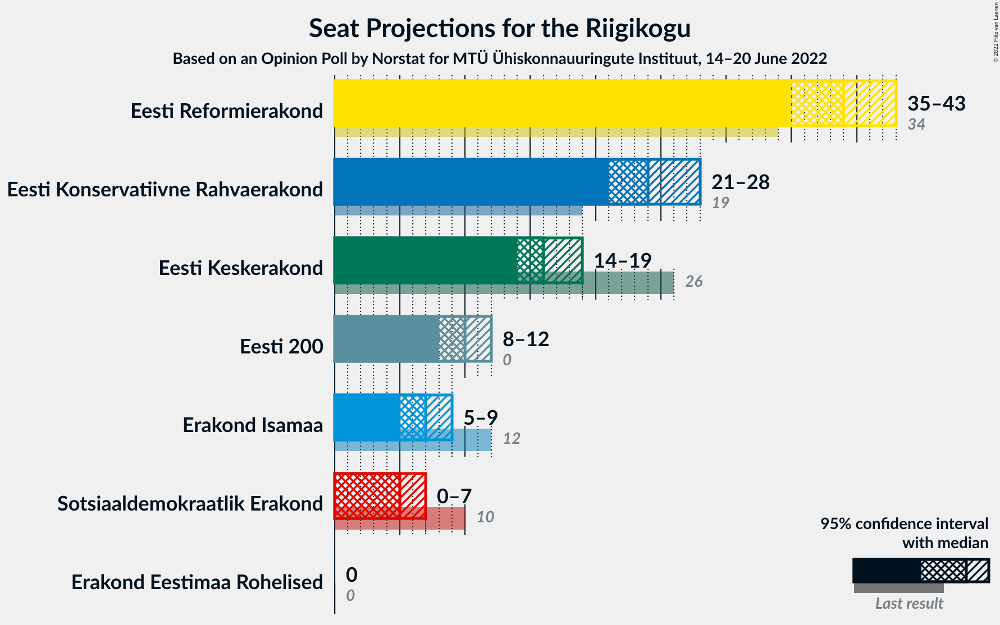

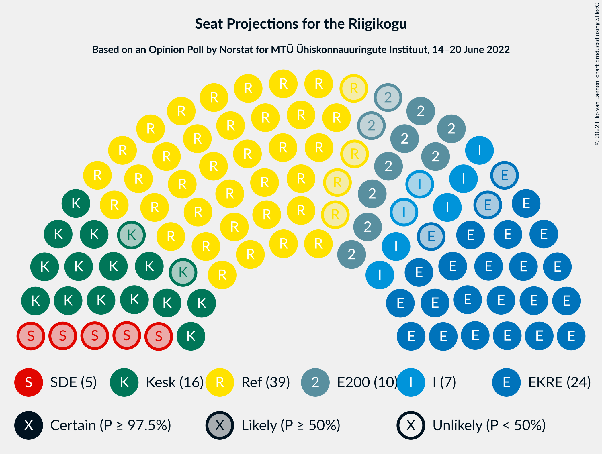

### Confidence Intervals

| Party | Last Result | Median | 80% Confidence Interval | 90% Confidence Interval | 95% Confidence Interval | 99% Confidence Interval |
|:-----:|:-----------:|:------:|:-----------------------:|:-----------------------:|:-----------------------:|:-----------------------:|
| <a href="#eesti-reformierakond">Eesti Reformierakond</a> | 34 | 39 | 36–41 |36–42 |35–43 |34–44 |
| <a href="#eesti-konservatiivne-rahvaerakond">Eesti Konservatiivne Rahvaerakond</a> | 19 | 24 | 22–27 |22–27 |21–28 |20–29 |
| <a href="#eesti-keskerakond">Eesti Keskerakond</a> | 26 | 16 | 15–18 |14–19 |14–19 |13–20 |
| <a href="#eesti-200">Eesti 200</a> | 0 | 10 | 8–11 |8–11 |8–12 |7–12 |
| <a href="#erakond-isamaa">Erakond Isamaa</a> | 12 | 7 | 6–8 |6–9 |5–9 |5–10 |
| <a href="#sotsiaaldemokraatlik-erakond">Sotsiaaldemokraatlik Erakond</a> | 10 | 5 | 0–6 |0–6 |0–7 |0–7 |
| <a href="#erakond-eestimaa-rohelised">Erakond Eestimaa Rohelised</a> | 0 | 0 | 0 |0 |0 |0 |

### Eesti Reformierakond

*For a full overview of the results for this party, see the [Eesti Reformierakond](party-eestireformierakond.html) page.*

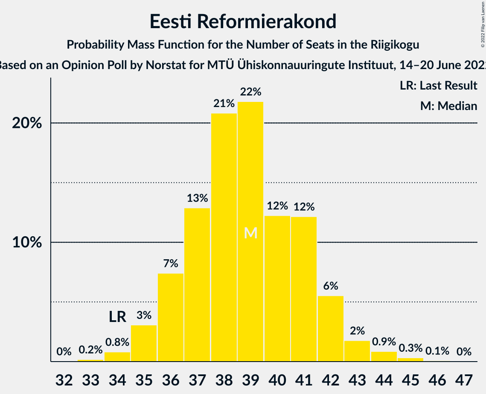

| Number of Seats | Probability | Accumulated | Special Marks |
|:---------------:|:-----------:|:-----------:|:-------------:|
| 33 | 0.2% | 100% |  |
| 34 | 0.8% | 99.8% | Last Result |
| 35 | 3% | 99.0% |  |
| 36 | 7% | 96% |  |
| 37 | 13% | 88% |  |
| 38 | 21% | 76% |  |
| 39 | 22% | 55% | Median |
| 40 | 12% | 33% |  |
| 41 | 12% | 21% |  |
| 42 | 6% | 9% |  |
| 43 | 2% | 3% |  |
| 44 | 0.9% | 1.3% |  |
| 45 | 0.3% | 0.4% |  |
| 46 | 0.1% | 0.1% |  |
| 47 | 0% | 0% |  |

### Eesti Konservatiivne Rahvaerakond

*For a full overview of the results for this party, see the [Eesti Konservatiivne Rahvaerakond](party-eestikonservatiivnerahvaerakond.html) page.*

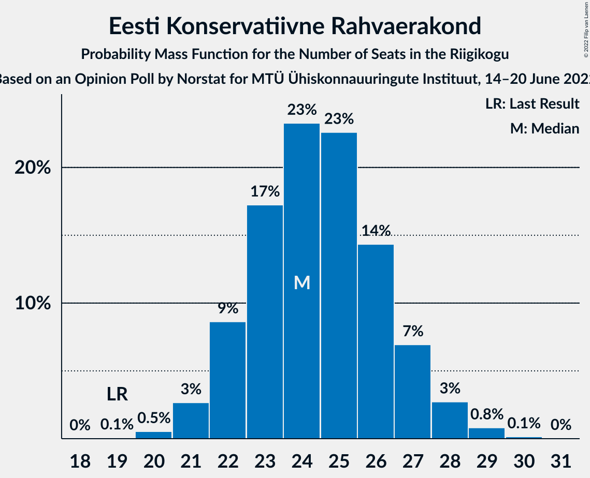

| Number of Seats | Probability | Accumulated | Special Marks |
|:---------------:|:-----------:|:-----------:|:-------------:|
| 19 | 0.1% | 100% | Last Result |
| 20 | 0.5% | 99.9% |  |
| 21 | 3% | 99.4% |  |
| 22 | 9% | 97% |  |
| 23 | 17% | 88% |  |
| 24 | 23% | 71% | Median |
| 25 | 23% | 48% |  |
| 26 | 14% | 25% |  |
| 27 | 7% | 11% |  |
| 28 | 3% | 4% |  |
| 29 | 0.8% | 1.0% |  |
| 30 | 0.1% | 0.2% |  |
| 31 | 0% | 0% |  |

### Eesti Keskerakond

*For a full overview of the results for this party, see the [Eesti Keskerakond](party-eestikeskerakond.html) page.*

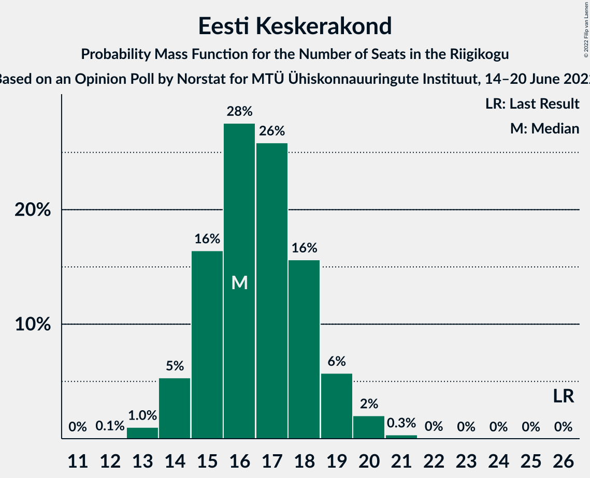

| Number of Seats | Probability | Accumulated | Special Marks |
|:---------------:|:-----------:|:-----------:|:-------------:|
| 12 | 0.1% | 100% |  |
| 13 | 1.0% | 99.9% |  |
| 14 | 5% | 98.9% |  |
| 15 | 16% | 94% |  |
| 16 | 28% | 77% | Median |
| 17 | 26% | 50% |  |
| 18 | 16% | 24% |  |
| 19 | 6% | 8% |  |
| 20 | 2% | 2% |  |
| 21 | 0.3% | 0.4% |  |
| 22 | 0% | 0.1% |  |
| 23 | 0% | 0% |  |
| 24 | 0% | 0% |  |
| 25 | 0% | 0% |  |
| 26 | 0% | 0% | Last Result |

### Eesti 200

*For a full overview of the results for this party, see the [Eesti 200](party-eesti200.html) page.*

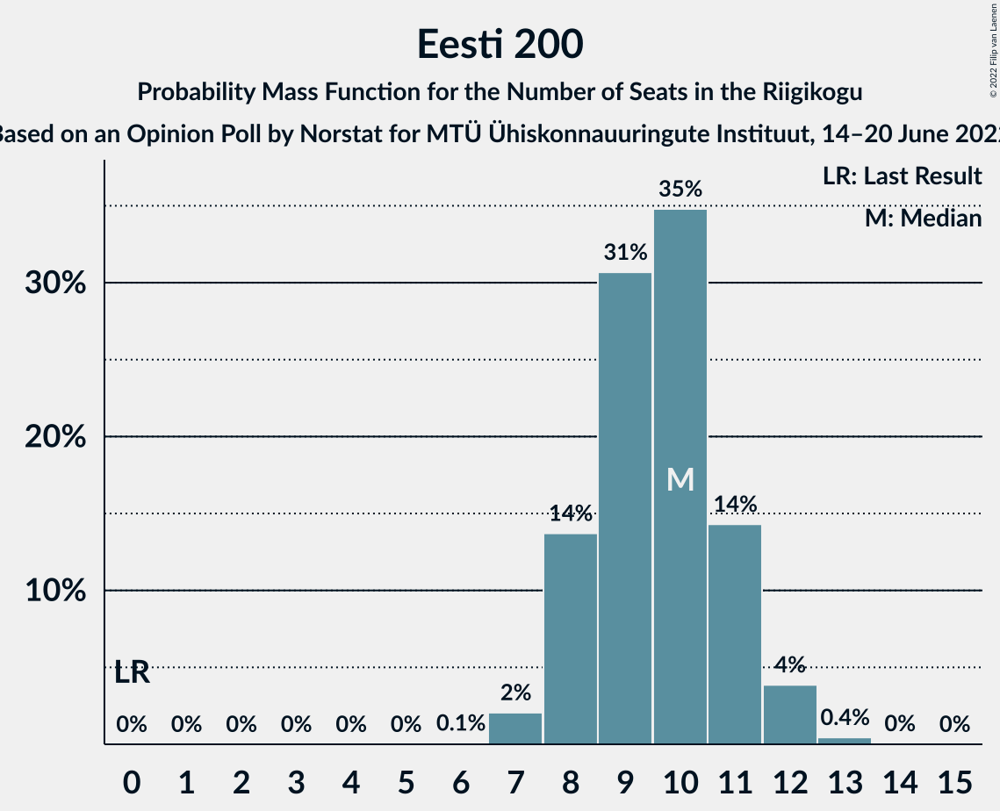

| Number of Seats | Probability | Accumulated | Special Marks |
|:---------------:|:-----------:|:-----------:|:-------------:|
| 0 | 0% | 100% | Last Result |
| 1 | 0% | 100% |  |
| 2 | 0% | 100% |  |
| 3 | 0% | 100% |  |
| 4 | 0% | 100% |  |
| 5 | 0% | 100% |  |
| 6 | 0.1% | 100% |  |
| 7 | 2% | 99.9% |  |
| 8 | 14% | 98% |  |
| 9 | 31% | 84% |  |
| 10 | 35% | 53% | Median |
| 11 | 14% | 19% |  |
| 12 | 4% | 4% |  |
| 13 | 0.4% | 0.5% |  |
| 14 | 0% | 0.1% |  |
| 15 | 0% | 0% |  |

### Erakond Isamaa

*For a full overview of the results for this party, see the [Erakond Isamaa](party-erakondisamaa.html) page.*

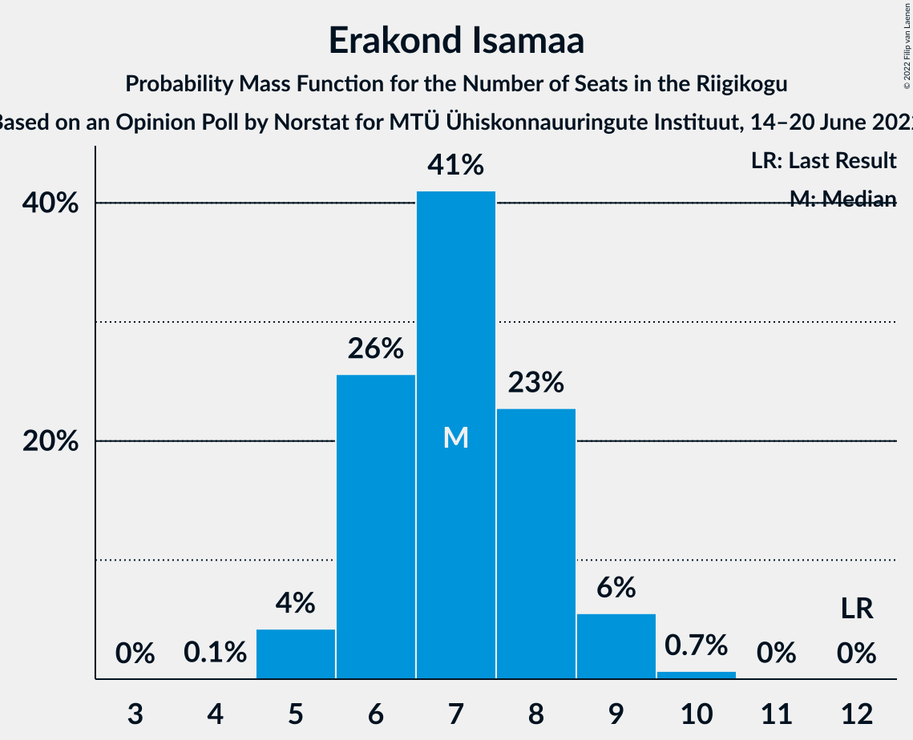

| Number of Seats | Probability | Accumulated | Special Marks |
|:---------------:|:-----------:|:-----------:|:-------------:|
| 4 | 0.1% | 100% |  |
| 5 | 4% | 99.9% |  |
| 6 | 26% | 96% |  |
| 7 | 41% | 70% | Median |
| 8 | 23% | 29% |  |
| 9 | 6% | 6% |  |
| 10 | 0.7% | 0.7% |  |
| 11 | 0% | 0% |  |
| 12 | 0% | 0% | Last Result |

### Sotsiaaldemokraatlik Erakond

*For a full overview of the results for this party, see the [Sotsiaaldemokraatlik Erakond](party-sotsiaaldemokraatlikerakond.html) page.*

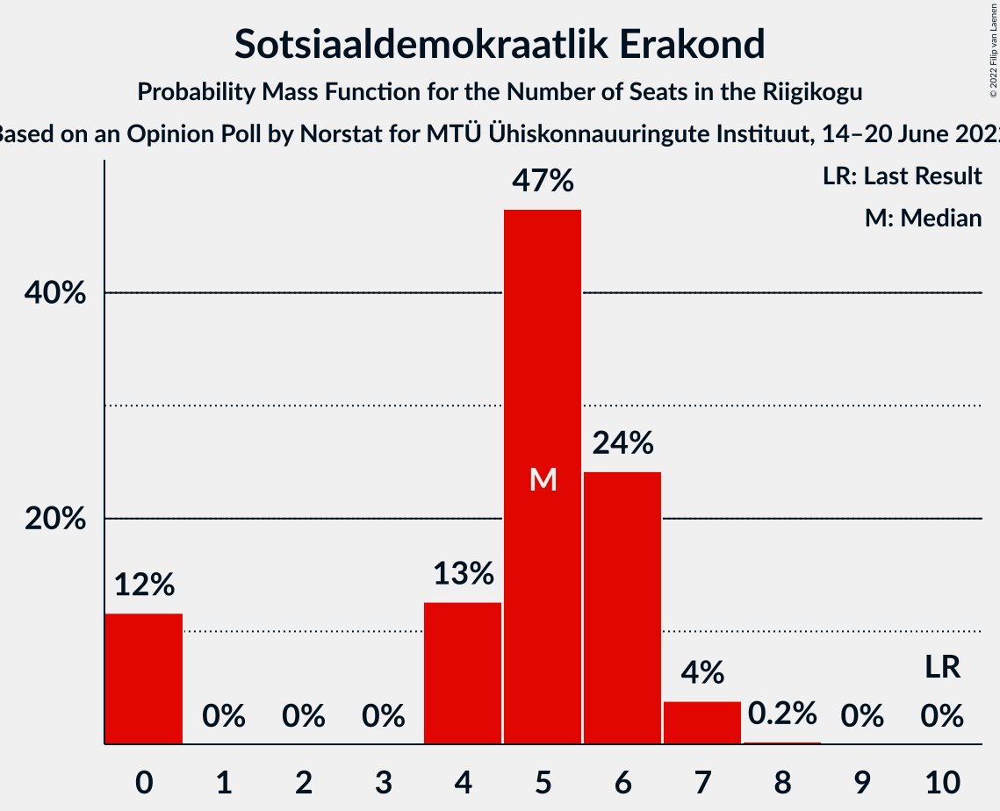

| Number of Seats | Probability | Accumulated | Special Marks |
|:---------------:|:-----------:|:-----------:|:-------------:|
| 0 | 12% | 100% |  |
| 1 | 0% | 88% |  |
| 2 | 0% | 88% |  |
| 3 | 0% | 88% |  |
| 4 | 13% | 88% |  |
| 5 | 47% | 76% | Median |
| 6 | 24% | 28% |  |
| 7 | 4% | 4% |  |
| 8 | 0.2% | 0.3% |  |
| 9 | 0% | 0% |  |
| 10 | 0% | 0% | Last Result |

### Erakond Eestimaa Rohelised

*For a full overview of the results for this party, see the [Erakond Eestimaa Rohelised](party-erakondeestimaarohelised.html) page.*

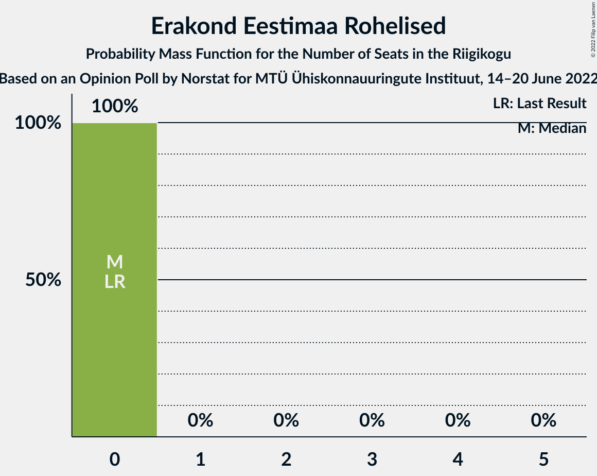

| Number of Seats | Probability | Accumulated | Special Marks |
|:---------------:|:-----------:|:-----------:|:-------------:|
| 0 | 100% | 100% | Last Result, Median |

## Coalitions

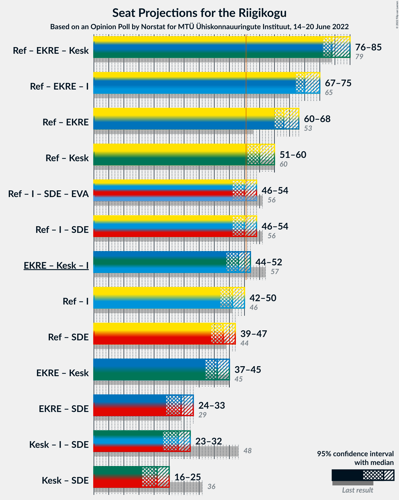

### Confidence Intervals

| Coalition | Last Result | Median | Majority? | 80% Confidence Interval | 90% Confidence Interval | 95% Confidence Interval | 99% Confidence Interval |
|:---------:|:-----------:|:------:|:---------:|:-----------------------:|:-----------------------:|:-----------------------:|:-----------------------:|
| Eesti Reformierakond – Eesti Konservatiivne Rahvaerakond – Eesti Keskerakond | 79 | 79 | 100% | 78–82 | 77–84 | 76–85 | 75–86 |
| Eesti Reformierakond – Eesti Konservatiivne Rahvaerakond – Erakond Isamaa | 65 | 70 | 100% | 68–73 | 67–74 | 67–75 | 65–77 |
| Eesti Reformierakond – Eesti Konservatiivne Rahvaerakond | 53 | 63 | 100% | 61–66 | 60–67 | 60–68 | 58–69 |
| Eesti Reformierakond – Eesti Keskerakond | 60 | 55 | 99.3% | 53–58 | 52–59 | 51–60 | 50–61 |
| Eesti Reformierakond – Erakond Isamaa – Sotsiaaldemokraatlik Erakond | 56 | 50 | 47% | 48–53 | 47–54 | 46–54 | 45–55 |
| Eesti Konservatiivne Rahvaerakond – Eesti Keskerakond – Erakond Isamaa | 57 | 48 | 11% | 45–51 | 45–52 | 44–52 | 43–54 |
| Eesti Reformierakond – Erakond Isamaa | 46 | 46 | 2% | 43–48 | 43–49 | 42–50 | 41–52 |
| Eesti Reformierakond – Sotsiaaldemokraatlik Erakond | 44 | 43 | 0% | 41–46 | 40–47 | 39–47 | 37–48 |
| Eesti Konservatiivne Rahvaerakond – Eesti Keskerakond | 45 | 41 | 0% | 38–43 | 38–44 | 37–45 | 36–46 |
| Eesti Konservatiivne Rahvaerakond – Sotsiaaldemokraatlik Erakond | 29 | 29 | 0% | 26–32 | 25–32 | 24–33 | 23–34 |
| Eesti Keskerakond – Erakond Isamaa – Sotsiaaldemokraatlik Erakond | 48 | 28 | 0% | 25–31 | 24–31 | 23–32 | 22–33 |
| Eesti Keskerakond – Sotsiaaldemokraatlik Erakond | 36 | 21 | 0% | 18–24 | 17–24 | 16–25 | 15–26 |

### Eesti Reformierakond – Eesti Konservatiivne Rahvaerakond – Eesti Keskerakond

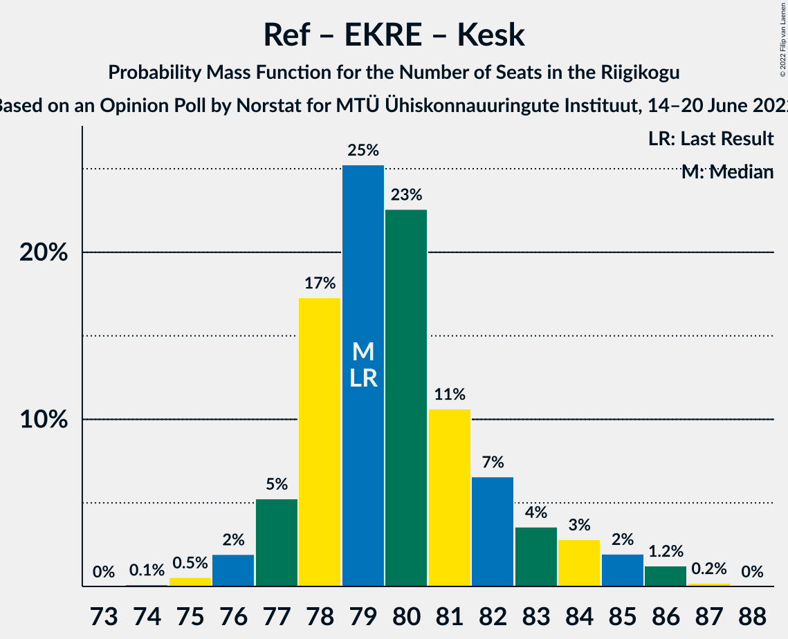

| Number of Seats | Probability | Accumulated | Special Marks |
|:---------------:|:-----------:|:-----------:|:-------------:|
| 74 | 0.1% | 100% |  |
| 75 | 0.5% | 99.9% |  |
| 76 | 2% | 99.3% |  |
| 77 | 5% | 97% |  |
| 78 | 17% | 92% |  |
| 79 | 25% | 75% | Last Result, Median |
| 80 | 23% | 50% |  |
| 81 | 11% | 27% |  |
| 82 | 7% | 16% |  |
| 83 | 4% | 10% |  |
| 84 | 3% | 6% |  |
| 85 | 2% | 3% |  |
| 86 | 1.2% | 1.5% |  |
| 87 | 0.2% | 0.2% |  |
| 88 | 0% | 0% |  |

### Eesti Reformierakond – Eesti Konservatiivne Rahvaerakond – Erakond Isamaa

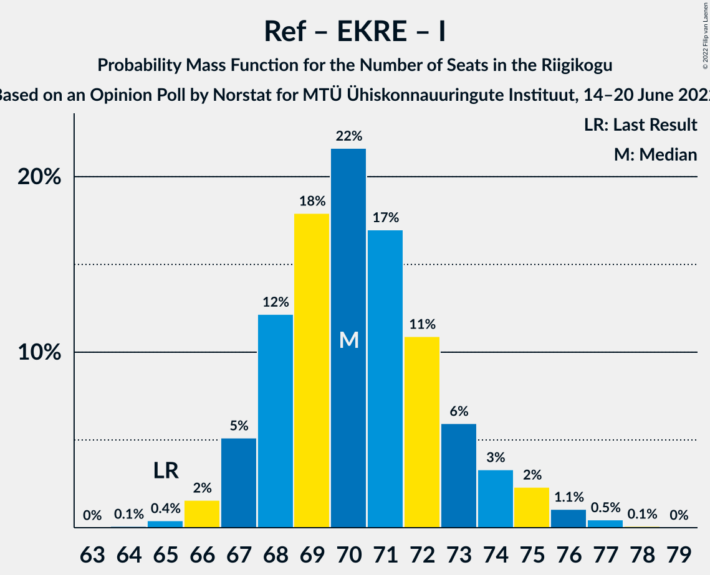

| Number of Seats | Probability | Accumulated | Special Marks |
|:---------------:|:-----------:|:-----------:|:-------------:|
| 64 | 0.1% | 100% |  |
| 65 | 0.4% | 99.9% | Last Result |
| 66 | 2% | 99.5% |  |
| 67 | 5% | 98% |  |
| 68 | 12% | 93% |  |
| 69 | 18% | 81% |  |
| 70 | 22% | 63% | Median |
| 71 | 17% | 41% |  |
| 72 | 11% | 24% |  |
| 73 | 6% | 13% |  |
| 74 | 3% | 7% |  |
| 75 | 2% | 4% |  |
| 76 | 1.1% | 2% |  |
| 77 | 0.5% | 0.6% |  |
| 78 | 0.1% | 0.1% |  |
| 79 | 0% | 0% |  |

### Eesti Reformierakond – Eesti Konservatiivne Rahvaerakond

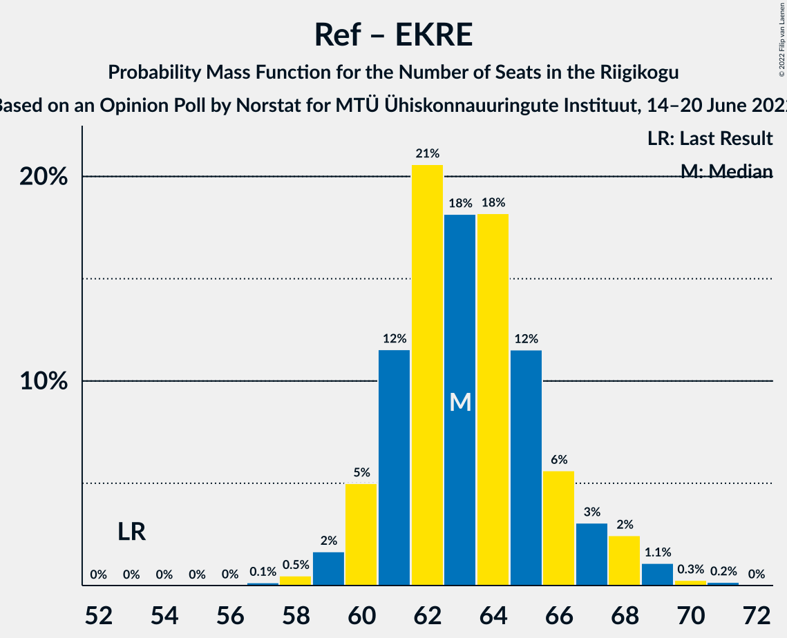

| Number of Seats | Probability | Accumulated | Special Marks |
|:---------------:|:-----------:|:-----------:|:-------------:|
| 53 | 0% | 100% | Last Result |
| 54 | 0% | 100% |  |
| 55 | 0% | 100% |  |
| 56 | 0% | 100% |  |
| 57 | 0.1% | 100% |  |
| 58 | 0.5% | 99.8% |  |
| 59 | 2% | 99.4% |  |
| 60 | 5% | 98% |  |
| 61 | 12% | 93% |  |
| 62 | 21% | 81% |  |
| 63 | 18% | 61% | Median |
| 64 | 18% | 42% |  |
| 65 | 12% | 24% |  |
| 66 | 6% | 13% |  |
| 67 | 3% | 7% |  |
| 68 | 2% | 4% |  |
| 69 | 1.1% | 2% |  |
| 70 | 0.3% | 0.5% |  |
| 71 | 0.2% | 0.2% |  |
| 72 | 0% | 0% |  |

### Eesti Reformierakond – Eesti Keskerakond

| Number of Seats | Probability | Accumulated | Special Marks |
|:---------------:|:-----------:|:-----------:|:-------------:|
| 49 | 0.1% | 100% |  |
| 50 | 0.6% | 99.9% |  |
| 51 | 2% | 99.3% | Majority |
| 52 | 5% | 97% |  |
| 53 | 11% | 92% |  |
| 54 | 16% | 81% |  |
| 55 | 19% | 65% | Median |
| 56 | 18% | 46% |  |
| 57 | 13% | 28% |  |
| 58 | 8% | 15% |  |
| 59 | 4% | 7% |  |
| 60 | 2% | 3% | Last Result |
| 61 | 0.7% | 1.2% |  |
| 62 | 0.3% | 0.5% |  |
| 63 | 0.1% | 0.1% |  |
| 64 | 0% | 0% |  |

### Eesti Reformierakond – Erakond Isamaa – Sotsiaaldemokraatlik Erakond

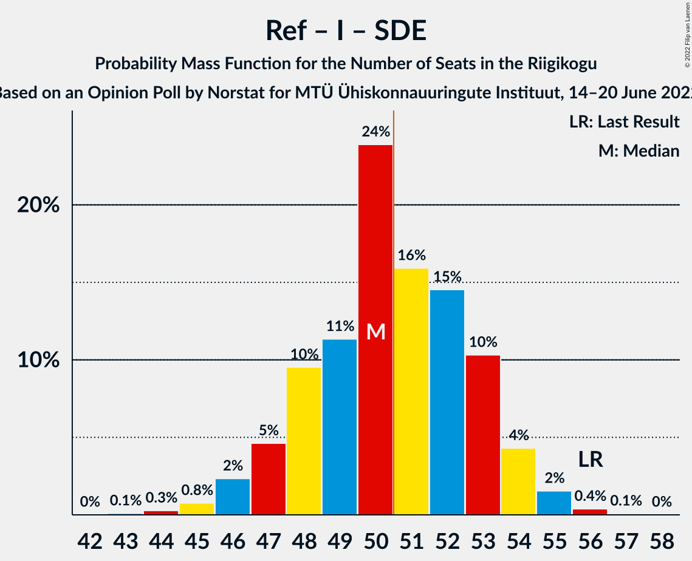

| Number of Seats | Probability | Accumulated | Special Marks |
|:---------------:|:-----------:|:-----------:|:-------------:|
| 43 | 0.1% | 100% |  |
| 44 | 0.3% | 99.9% |  |
| 45 | 0.8% | 99.6% |  |
| 46 | 2% | 98.8% |  |
| 47 | 5% | 97% |  |
| 48 | 10% | 92% |  |
| 49 | 11% | 82% |  |
| 50 | 24% | 71% |  |
| 51 | 16% | 47% | Median, Majority |
| 52 | 15% | 31% |  |
| 53 | 10% | 17% |  |
| 54 | 4% | 6% |  |
| 55 | 2% | 2% |  |
| 56 | 0.4% | 0.5% | Last Result |
| 57 | 0.1% | 0.1% |  |
| 58 | 0% | 0% |  |

### Eesti Konservatiivne Rahvaerakond – Eesti Keskerakond – Erakond Isamaa

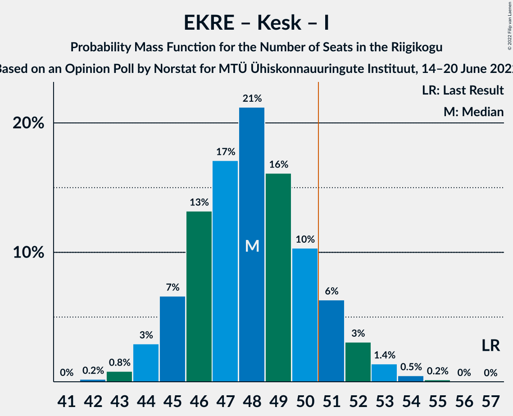

| Number of Seats | Probability | Accumulated | Special Marks |
|:---------------:|:-----------:|:-----------:|:-------------:|
| 42 | 0.2% | 100% |  |
| 43 | 0.8% | 99.8% |  |
| 44 | 3% | 99.0% |  |
| 45 | 7% | 96% |  |
| 46 | 13% | 89% |  |
| 47 | 17% | 76% | Median |
| 48 | 21% | 59% |  |
| 49 | 16% | 38% |  |
| 50 | 10% | 22% |  |
| 51 | 6% | 11% | Majority |
| 52 | 3% | 5% |  |
| 53 | 1.4% | 2% |  |
| 54 | 0.5% | 0.7% |  |
| 55 | 0.2% | 0.2% |  |
| 56 | 0% | 0% |  |
| 57 | 0% | 0% | Last Result |

### Eesti Reformierakond – Erakond Isamaa

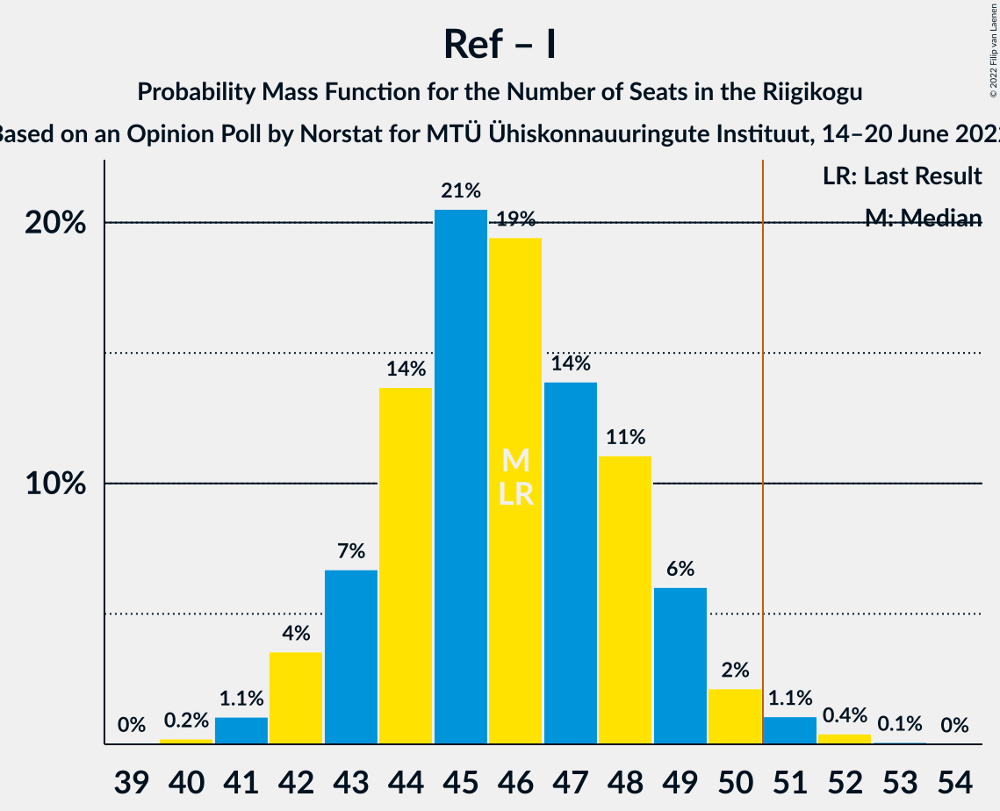

| Number of Seats | Probability | Accumulated | Special Marks |
|:---------------:|:-----------:|:-----------:|:-------------:|
| 39 | 0% | 100% |  |
| 40 | 0.2% | 99.9% |  |
| 41 | 1.1% | 99.7% |  |
| 42 | 4% | 98.7% |  |
| 43 | 7% | 95% |  |
| 44 | 14% | 88% |  |
| 45 | 21% | 75% |  |
| 46 | 19% | 54% | Last Result, Median |
| 47 | 14% | 35% |  |
| 48 | 11% | 21% |  |
| 49 | 6% | 10% |  |
| 50 | 2% | 4% |  |
| 51 | 1.1% | 2% | Majority |
| 52 | 0.4% | 0.5% |  |
| 53 | 0.1% | 0.1% |  |
| 54 | 0% | 0% |  |

### Eesti Reformierakond – Sotsiaaldemokraatlik Erakond

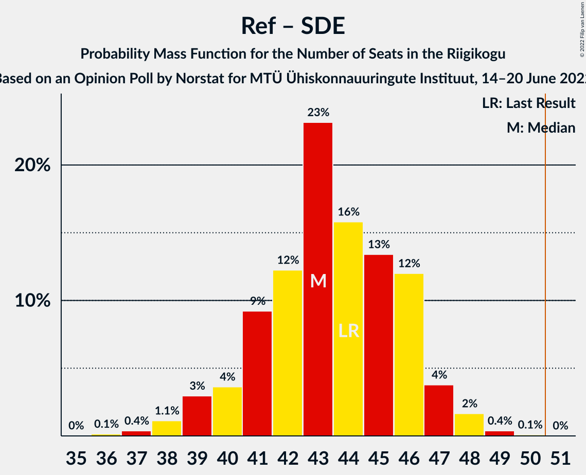

| Number of Seats | Probability | Accumulated | Special Marks |
|:---------------:|:-----------:|:-----------:|:-------------:|
| 36 | 0.1% | 100% |  |
| 37 | 0.4% | 99.8% |  |
| 38 | 1.1% | 99.4% |  |
| 39 | 3% | 98% |  |
| 40 | 4% | 95% |  |
| 41 | 9% | 92% |  |
| 42 | 12% | 83% |  |
| 43 | 23% | 70% |  |
| 44 | 16% | 47% | Last Result, Median |
| 45 | 13% | 31% |  |
| 46 | 12% | 18% |  |
| 47 | 4% | 6% |  |
| 48 | 2% | 2% |  |
| 49 | 0.4% | 0.5% |  |
| 50 | 0.1% | 0.1% |  |
| 51 | 0% | 0% | Majority |

### Eesti Konservatiivne Rahvaerakond – Eesti Keskerakond

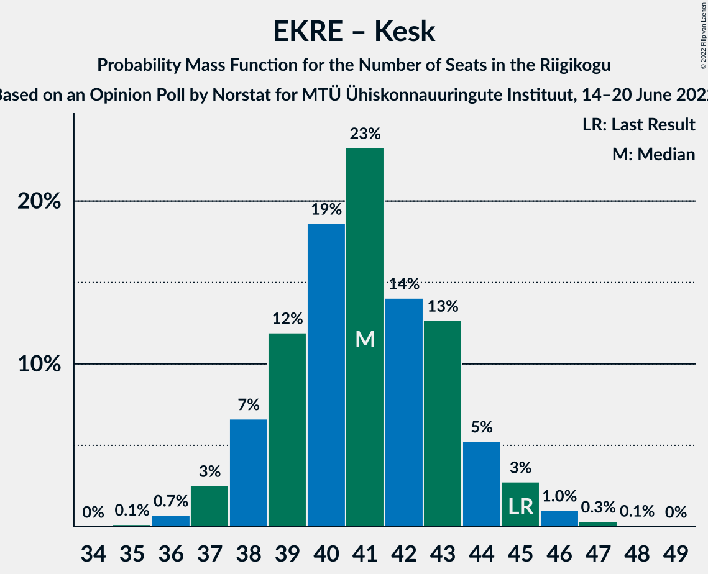

| Number of Seats | Probability | Accumulated | Special Marks |
|:---------------:|:-----------:|:-----------:|:-------------:|
| 35 | 0.1% | 100% |  |
| 36 | 0.7% | 99.8% |  |
| 37 | 3% | 99.1% |  |
| 38 | 7% | 97% |  |
| 39 | 12% | 90% |  |
| 40 | 19% | 78% | Median |
| 41 | 23% | 59% |  |
| 42 | 14% | 36% |  |
| 43 | 13% | 22% |  |
| 44 | 5% | 9% |  |
| 45 | 3% | 4% | Last Result |
| 46 | 1.0% | 1.5% |  |
| 47 | 0.3% | 0.4% |  |
| 48 | 0.1% | 0.1% |  |
| 49 | 0% | 0% |  |

### Eesti Konservatiivne Rahvaerakond – Sotsiaaldemokraatlik Erakond

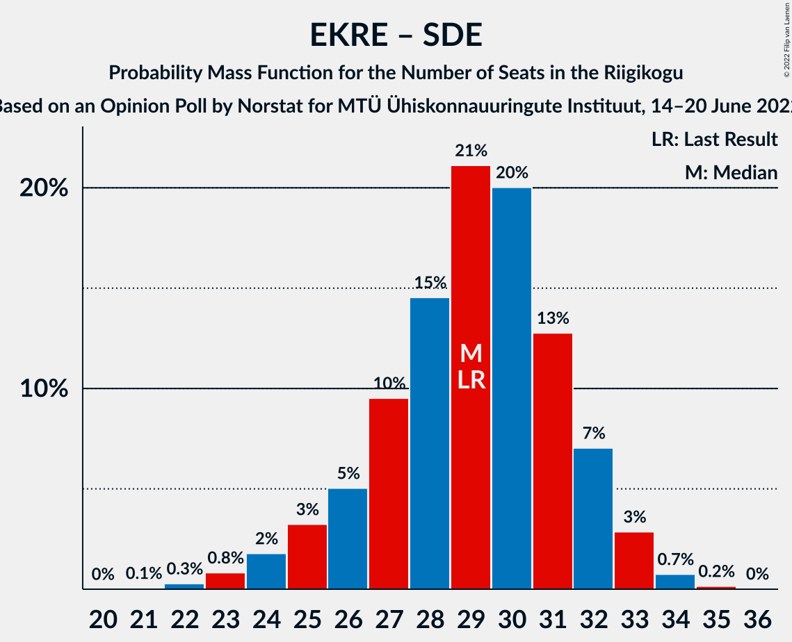

| Number of Seats | Probability | Accumulated | Special Marks |
|:---------------:|:-----------:|:-----------:|:-------------:|
| 21 | 0.1% | 100% |  |
| 22 | 0.3% | 99.9% |  |
| 23 | 0.8% | 99.7% |  |
| 24 | 2% | 98.8% |  |
| 25 | 3% | 97% |  |
| 26 | 5% | 94% |  |
| 27 | 10% | 89% |  |
| 28 | 15% | 79% |  |
| 29 | 21% | 65% | Last Result, Median |
| 30 | 20% | 44% |  |
| 31 | 13% | 24% |  |
| 32 | 7% | 11% |  |
| 33 | 3% | 4% |  |
| 34 | 0.7% | 0.9% |  |
| 35 | 0.2% | 0.2% |  |
| 36 | 0% | 0% |  |

### Eesti Keskerakond – Erakond Isamaa – Sotsiaaldemokraatlik Erakond

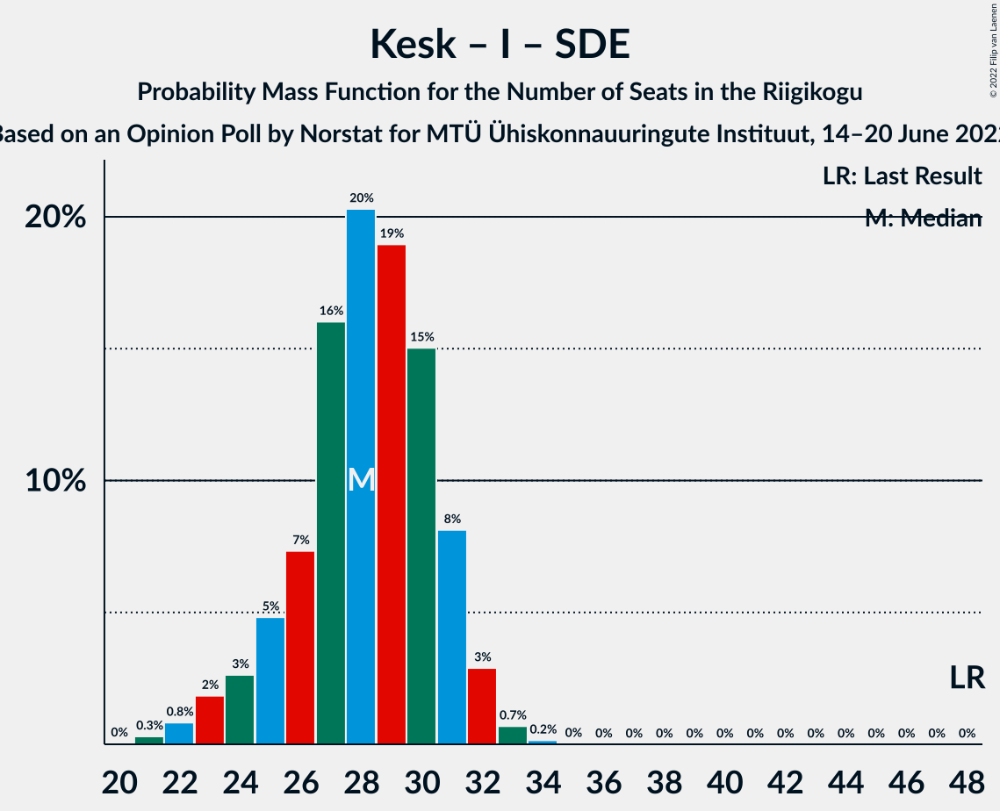

| Number of Seats | Probability | Accumulated | Special Marks |
|:---------------:|:-----------:|:-----------:|:-------------:|
| 21 | 0.3% | 100% |  |
| 22 | 0.8% | 99.7% |  |
| 23 | 2% | 98.8% |  |
| 24 | 3% | 97% |  |
| 25 | 5% | 94% |  |
| 26 | 7% | 90% |  |
| 27 | 16% | 82% |  |
| 28 | 20% | 66% | Median |
| 29 | 19% | 46% |  |
| 30 | 15% | 27% |  |
| 31 | 8% | 12% |  |
| 32 | 3% | 4% |  |
| 33 | 0.7% | 0.9% |  |
| 34 | 0.2% | 0.2% |  |
| 35 | 0% | 0% |  |
| 36 | 0% | 0% |  |
| 37 | 0% | 0% |  |
| 38 | 0% | 0% |  |
| 39 | 0% | 0% |  |
| 40 | 0% | 0% |  |
| 41 | 0% | 0% |  |
| 42 | 0% | 0% |  |
| 43 | 0% | 0% |  |
| 44 | 0% | 0% |  |
| 45 | 0% | 0% |  |
| 46 | 0% | 0% |  |
| 47 | 0% | 0% |  |
| 48 | 0% | 0% | Last Result |

### Eesti Keskerakond – Sotsiaaldemokraatlik Erakond

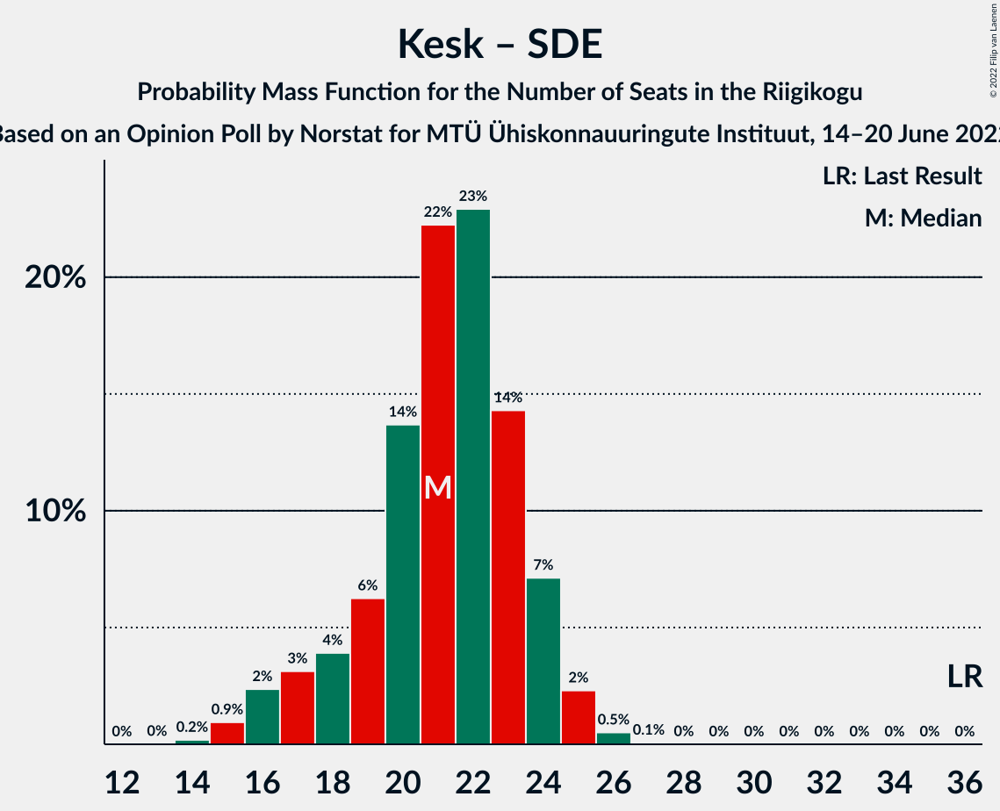

| Number of Seats | Probability | Accumulated | Special Marks |
|:---------------:|:-----------:|:-----------:|:-------------:|
| 14 | 0.2% | 100% |  |
| 15 | 0.9% | 99.8% |  |
| 16 | 2% | 98.8% |  |
| 17 | 3% | 96% |  |
| 18 | 4% | 93% |  |
| 19 | 6% | 89% |  |
| 20 | 14% | 83% |  |
| 21 | 22% | 69% | Median |
| 22 | 23% | 47% |  |
| 23 | 14% | 24% |  |
| 24 | 7% | 10% |  |
| 25 | 2% | 3% |  |
| 26 | 0.5% | 0.6% |  |
| 27 | 0.1% | 0.1% |  |
| 28 | 0% | 0% |  |
| 29 | 0% | 0% |  |
| 30 | 0% | 0% |  |
| 31 | 0% | 0% |  |
| 32 | 0% | 0% |  |
| 33 | 0% | 0% |  |
| 34 | 0% | 0% |  |
| 35 | 0% | 0% |  |
| 36 | 0% | 0% | Last Result |

## Technical Information

### Opinion Poll

+ **Polling firm:** Norstat
+ **Commissioner(s):** MTÜ Ühiskonnauuringute Instituut
+ **Fieldwork period:** 14–20 June 2022

### Calculations

+ **Sample size:** 1000
+ **Simulations done:** 1,048,576
+ **Error estimate:** 1.07%

