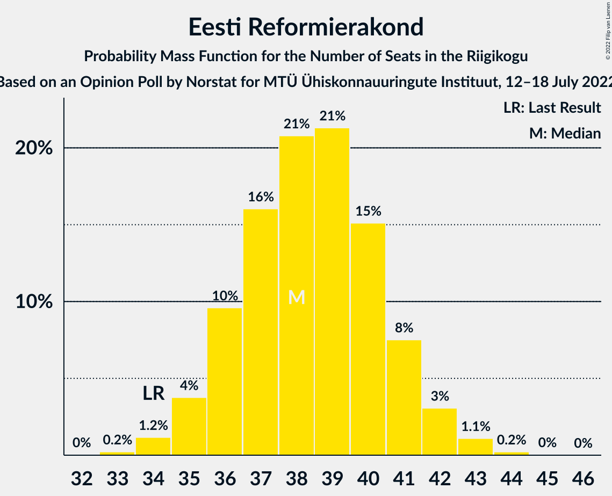

# Opinion Poll by Norstat for MTÜ Ühiskonnauuringute Instituut, 12–18 July 2022

<a href="#voting-intentions">Voting Intentions</a> | <a href="#seats">Seats</a> | <a href="#coalitions">Coalitions</a> | <a href="#technical-information">Technical Information</a>

## Voting Intentions

### Confidence Intervals

| Party | Last Result | Poll Result | 80% Confidence Interval | 90% Confidence Interval | 95% Confidence Interval | 99% Confidence Interval |
|:-----:|:-----------:|:-----------:|:-----------------------:|:-----------------------:|:-----------------------:|:-----------------------:|
| Eesti Reformierakond | 28.9% | 33.9% | 32.0–35.9% |31.5–36.4% |31.0–36.9% |30.1–37.8% |
| Eesti Keskerakond | 23.1% | 18.0% | 16.5–19.6% |16.1–20.1% |15.7–20.5% |15.1–21.3% |
| Eesti Konservatiivne Rahvaerakond | 17.8% | 16.8% | 15.4–18.4% |15.0–18.9% |14.6–19.3% |13.9–20.0% |
| Erakond Isamaa | 11.4% | 10.7% | 9.5–12.1% |9.2–12.4% |8.9–12.8% |8.4–13.4% |
| Sotsiaaldemokraatlik Erakond | 9.8% | 8.8% | 7.7–10.1% |7.5–10.4% |7.2–10.7% |6.7–11.4% |
| Eesti 200 | 4.4% | 8.3% | 7.3–9.5% |7.0–9.9% |6.7–10.2% |6.3–10.8% |
| Erakond Eestimaa Rohelised | 1.8% | 1.7% | 1.3–2.4% |1.2–2.5% |1.1–2.7% |0.9–3.1% |

*Note:* The poll result column reflects the actual value used in the calculations. Published results may vary slightly, and in addition be rounded to fewer digits.

## Seats

### Confidence Intervals

| Party | Last Result | Median | 80% Confidence Interval | 90% Confidence Interval | 95% Confidence Interval | 99% Confidence Interval |
|:-----:|:-----------:|:------:|:-----------------------:|:-----------------------:|:-----------------------:|:-----------------------:|
| <a href="#eesti-reformierakond">Eesti Reformierakond</a> | 34 | 38 | 36–41 |35–41 |35–42 |34–43 |
| <a href="#eesti-keskerakond">Eesti Keskerakond</a> | 26 | 19 | 17–21 |17–21 |16–22 |15–23 |
| <a href="#eesti-konservatiivne-rahvaerakond">Eesti Konservatiivne Rahvaerakond</a> | 19 | 17 | 16–19 |15–20 |15–20 |14–21 |
| <a href="#erakond-isamaa">Erakond Isamaa</a> | 12 | 10 | 9–12 |9–12 |8–13 |8–13 |
| <a href="#sotsiaaldemokraatlik-erakond">Sotsiaaldemokraatlik Erakond</a> | 10 | 8 | 7–10 |7–10 |6–10 |6–11 |
| <a href="#eesti-200">Eesti 200</a> | 0 | 8 | 7–9 |6–9 |6–10 |5–10 |
| <a href="#erakond-eestimaa-rohelised">Erakond Eestimaa Rohelised</a> | 0 | 0 | 0 |0 |0 |0 |

### Eesti Reformierakond

*For a full overview of the results for this party, see the [Eesti Reformierakond](party-eestireformierakond.html) page.*

| Number of Seats | Probability | Accumulated | Special Marks |
|:---------------:|:-----------:|:-----------:|:-------------:|
| 33 | 0.2% | 100% |  |
| 34 | 1.2% | 99.7% | Last Result |
| 35 | 4% | 98.6% |  |
| 36 | 10% | 95% |  |
| 37 | 16% | 85% |  |
| 38 | 21% | 69% | Median |
| 39 | 21% | 48% |  |
| 40 | 15% | 27% |  |
| 41 | 8% | 12% |  |
| 42 | 3% | 4% |  |
| 43 | 1.1% | 1.4% |  |
| 44 | 0.2% | 0.3% |  |
| 45 | 0% | 0.1% |  |
| 46 | 0% | 0% |  |

### Eesti Keskerakond

*For a full overview of the results for this party, see the [Eesti Keskerakond](party-eestikeskerakond.html) page.*

| Number of Seats | Probability | Accumulated | Special Marks |
|:---------------:|:-----------:|:-----------:|:-------------:|
| 14 | 0.1% | 100% |  |
| 15 | 0.7% | 99.9% |  |
| 16 | 4% | 99.2% |  |
| 17 | 12% | 95% |  |
| 18 | 25% | 83% |  |
| 19 | 27% | 58% | Median |
| 20 | 19% | 31% |  |
| 21 | 9% | 12% |  |
| 22 | 3% | 3% |  |
| 23 | 0.6% | 0.7% |  |
| 24 | 0.1% | 0.1% |  |
| 25 | 0% | 0% |  |
| 26 | 0% | 0% | Last Result |

### Eesti Konservatiivne Rahvaerakond

*For a full overview of the results for this party, see the [Eesti Konservatiivne Rahvaerakond](party-eestikonservatiivnerahvaerakond.html) page.*

| Number of Seats | Probability | Accumulated | Special Marks |
|:---------------:|:-----------:|:-----------:|:-------------:|
| 13 | 0.1% | 100% |  |
| 14 | 2% | 99.9% |  |
| 15 | 6% | 98% |  |
| 16 | 18% | 92% |  |
| 17 | 30% | 74% | Median |
| 18 | 24% | 44% |  |
| 19 | 13% | 20% | Last Result |
| 20 | 5% | 7% |  |
| 21 | 1.2% | 1.5% |  |
| 22 | 0.2% | 0.2% |  |
| 23 | 0% | 0% |  |

### Erakond Isamaa

*For a full overview of the results for this party, see the [Erakond Isamaa](party-erakondisamaa.html) page.*

| Number of Seats | Probability | Accumulated | Special Marks |
|:---------------:|:-----------:|:-----------:|:-------------:|
| 7 | 0.3% | 100% |  |
| 8 | 4% | 99.7% |  |
| 9 | 16% | 96% |  |
| 10 | 34% | 80% | Median |
| 11 | 31% | 45% |  |
| 12 | 12% | 15% | Last Result |
| 13 | 3% | 3% |  |
| 14 | 0.4% | 0.4% |  |
| 15 | 0% | 0% |  |

### Sotsiaaldemokraatlik Erakond

*For a full overview of the results for this party, see the [Sotsiaaldemokraatlik Erakond](party-sotsiaaldemokraatlikerakond.html) page.*

| Number of Seats | Probability | Accumulated | Special Marks |
|:---------------:|:-----------:|:-----------:|:-------------:|
| 5 | 0.1% | 100% |  |
| 6 | 3% | 99.9% |  |
| 7 | 18% | 97% |  |
| 8 | 39% | 79% | Median |
| 9 | 29% | 40% |  |
| 10 | 9% | 11% | Last Result |
| 11 | 2% | 2% |  |
| 12 | 0.1% | 0.2% |  |
| 13 | 0% | 0% |  |

### Eesti 200

*For a full overview of the results for this party, see the [Eesti 200](party-eesti200.html) page.*

| Number of Seats | Probability | Accumulated | Special Marks |
|:---------------:|:-----------:|:-----------:|:-------------:|
| 0 | 0% | 100% | Last Result |
| 1 | 0% | 100% |  |
| 2 | 0% | 100% |  |
| 3 | 0% | 100% |  |
| 4 | 0% | 100% |  |
| 5 | 0.6% | 100% |  |
| 6 | 8% | 99.4% |  |
| 7 | 32% | 91% |  |
| 8 | 40% | 59% | Median |
| 9 | 15% | 19% |  |
| 10 | 3% | 4% |  |
| 11 | 0.4% | 0.4% |  |
| 12 | 0% | 0% |  |

### Erakond Eestimaa Rohelised

*For a full overview of the results for this party, see the [Erakond Eestimaa Rohelised](party-erakondeestimaarohelised.html) page.*

| Number of Seats | Probability | Accumulated | Special Marks |
|:---------------:|:-----------:|:-----------:|:-------------:|
| 0 | 100% | 100% | Last Result, Median |

## Coalitions

### Confidence Intervals

| Coalition | Last Result | Median | Majority? | 80% Confidence Interval | 90% Confidence Interval | 95% Confidence Interval | 99% Confidence Interval |
|:---------:|:-----------:|:------:|:---------:|:-----------------------:|:-----------------------:|:-----------------------:|:-----------------------:|
| Eesti Reformierakond – Eesti Keskerakond – Eesti Konservatiivne Rahvaerakond | 79 | 75 | 100% | 73–77 | 72–77 | 71–78 | 70–79 |
| Eesti Reformierakond – Eesti Konservatiivne Rahvaerakond – Erakond Isamaa | 65 | 66 | 100% | 64–68 | 63–69 | 63–70 | 62–71 |
| Eesti Reformierakond – Eesti Keskerakond | 60 | 57 | 100% | 55–59 | 54–60 | 54–61 | 52–62 |
| Eesti Reformierakond – Erakond Isamaa – Sotsiaaldemokraatlik Erakond | 56 | 57 | 100% | 55–59 | 54–60 | 53–61 | 52–62 |
| Eesti Reformierakond – Eesti Konservatiivne Rahvaerakond | 53 | 56 | 99.8% | 53–58 | 53–59 | 52–59 | 51–60 |
| Eesti Reformierakond – Erakond Isamaa | 46 | 49 | 17% | 46–51 | 46–52 | 45–53 | 44–54 |
| Eesti Keskerakond – Eesti Konservatiivne Rahvaerakond – Erakond Isamaa | 57 | 47 | 2% | 44–49 | 44–50 | 43–50 | 42–51 |
| Eesti Reformierakond – Sotsiaaldemokraatlik Erakond | 44 | 47 | 2% | 44–49 | 44–50 | 43–50 | 42–51 |
| Eesti Keskerakond – Erakond Isamaa – Sotsiaaldemokraatlik Erakond | 48 | 38 | 0% | 35–40 | 34–41 | 34–41 | 33–42 |
| Eesti Keskerakond – Eesti Konservatiivne Rahvaerakond | 45 | 36 | 0% | 34–38 | 33–39 | 33–40 | 32–41 |
| Eesti Keskerakond – Sotsiaaldemokraatlik Erakond | 36 | 27 | 0% | 25–29 | 24–30 | 24–30 | 23–31 |
| Eesti Konservatiivne Rahvaerakond – Sotsiaaldemokraatlik Erakond | 29 | 26 | 0% | 24–28 | 23–28 | 23–29 | 22–30 |

### Eesti Reformierakond – Eesti Keskerakond – Eesti Konservatiivne Rahvaerakond

| Number of Seats | Probability | Accumulated | Special Marks |
|:---------------:|:-----------:|:-----------:|:-------------:|
| 69 | 0.1% | 100% |  |
| 70 | 0.6% | 99.9% |  |
| 71 | 2% | 99.3% |  |
| 72 | 7% | 97% |  |
| 73 | 15% | 91% |  |
| 74 | 23% | 75% | Median |
| 75 | 24% | 53% |  |
| 76 | 18% | 29% |  |
| 77 | 7% | 11% |  |
| 78 | 3% | 4% |  |
| 79 | 0.6% | 0.7% | Last Result |
| 80 | 0.1% | 0.1% |  |
| 81 | 0% | 0% |  |

### Eesti Reformierakond – Eesti Konservatiivne Rahvaerakond – Erakond Isamaa

| Number of Seats | Probability | Accumulated | Special Marks |
|:---------------:|:-----------:|:-----------:|:-------------:|
| 60 | 0.1% | 100% |  |
| 61 | 0.4% | 99.9% |  |
| 62 | 1.3% | 99.5% |  |
| 63 | 4% | 98% |  |
| 64 | 10% | 94% |  |
| 65 | 20% | 84% | Last Result, Median |
| 66 | 23% | 64% |  |
| 67 | 18% | 41% |  |
| 68 | 15% | 23% |  |
| 69 | 5% | 8% |  |
| 70 | 2% | 3% |  |
| 71 | 0.4% | 0.6% |  |
| 72 | 0.1% | 0.1% |  |
| 73 | 0% | 0% |  |

### Eesti Reformierakond – Eesti Keskerakond

| Number of Seats | Probability | Accumulated | Special Marks |
|:---------------:|:-----------:|:-----------:|:-------------:|
| 51 | 0.1% | 100% | Majority |
| 52 | 0.5% | 99.9% |  |
| 53 | 1.5% | 99.4% |  |
| 54 | 5% | 98% |  |
| 55 | 10% | 93% |  |
| 56 | 17% | 83% |  |
| 57 | 22% | 66% | Median |
| 58 | 20% | 44% |  |
| 59 | 15% | 25% |  |
| 60 | 6% | 10% | Last Result |
| 61 | 3% | 4% |  |
| 62 | 0.8% | 1.0% |  |
| 63 | 0.2% | 0.2% |  |
| 64 | 0% | 0% |  |

### Eesti Reformierakond – Erakond Isamaa – Sotsiaaldemokraatlik Erakond

| Number of Seats | Probability | Accumulated | Special Marks |
|:---------------:|:-----------:|:-----------:|:-------------:|
| 51 | 0.1% | 100% | Majority |
| 52 | 0.5% | 99.9% |  |
| 53 | 2% | 99.4% |  |
| 54 | 5% | 97% |  |
| 55 | 11% | 92% |  |
| 56 | 19% | 81% | Last Result, Median |
| 57 | 20% | 62% |  |
| 58 | 20% | 42% |  |
| 59 | 14% | 22% |  |
| 60 | 5% | 8% |  |
| 61 | 2% | 3% |  |
| 62 | 0.6% | 0.8% |  |
| 63 | 0.1% | 0.1% |  |
| 64 | 0% | 0% |  |

### Eesti Reformierakond – Eesti Konservatiivne Rahvaerakond

| Number of Seats | Probability | Accumulated | Special Marks |
|:---------------:|:-----------:|:-----------:|:-------------:|
| 50 | 0.2% | 100% |  |
| 51 | 0.9% | 99.8% | Majority |
| 52 | 3% | 98.9% |  |
| 53 | 6% | 96% | Last Result |
| 54 | 14% | 90% |  |
| 55 | 20% | 76% | Median |
| 56 | 23% | 56% |  |
| 57 | 15% | 33% |  |
| 58 | 11% | 17% |  |
| 59 | 4% | 7% |  |
| 60 | 2% | 2% |  |
| 61 | 0.4% | 0.5% |  |
| 62 | 0.1% | 0.1% |  |
| 63 | 0% | 0% |  |

### Eesti Reformierakond – Erakond Isamaa

| Number of Seats | Probability | Accumulated | Special Marks |
|:---------------:|:-----------:|:-----------:|:-------------:|
| 43 | 0.2% | 100% |  |
| 44 | 0.9% | 99.8% |  |
| 45 | 3% | 98.9% |  |
| 46 | 6% | 96% | Last Result |
| 47 | 13% | 90% |  |
| 48 | 22% | 76% | Median |
| 49 | 17% | 54% |  |
| 50 | 20% | 37% |  |
| 51 | 10% | 17% | Majority |
| 52 | 4% | 7% |  |
| 53 | 2% | 3% |  |
| 54 | 0.4% | 0.5% |  |
| 55 | 0.1% | 0.1% |  |
| 56 | 0% | 0% |  |

### Eesti Keskerakond – Eesti Konservatiivne Rahvaerakond – Erakond Isamaa

| Number of Seats | Probability | Accumulated | Special Marks |
|:---------------:|:-----------:|:-----------:|:-------------:|
| 40 | 0% | 100% |  |
| 41 | 0.2% | 99.9% |  |
| 42 | 1.1% | 99.7% |  |
| 43 | 4% | 98.6% |  |
| 44 | 9% | 95% |  |
| 45 | 14% | 86% |  |
| 46 | 20% | 72% | Median |
| 47 | 22% | 52% |  |
| 48 | 15% | 30% |  |
| 49 | 10% | 15% |  |
| 50 | 4% | 6% |  |
| 51 | 1.3% | 2% | Majority |
| 52 | 0.4% | 0.4% |  |
| 53 | 0.1% | 0.1% |  |
| 54 | 0% | 0% |  |
| 55 | 0% | 0% |  |
| 56 | 0% | 0% |  |
| 57 | 0% | 0% | Last Result |

### Eesti Reformierakond – Sotsiaaldemokraatlik Erakond

| Number of Seats | Probability | Accumulated | Special Marks |
|:---------------:|:-----------:|:-----------:|:-------------:|
| 41 | 0.2% | 100% |  |
| 42 | 1.0% | 99.8% |  |
| 43 | 3% | 98.7% |  |
| 44 | 6% | 96% | Last Result |
| 45 | 16% | 90% |  |
| 46 | 22% | 74% | Median |
| 47 | 19% | 52% |  |
| 48 | 16% | 33% |  |
| 49 | 11% | 17% |  |
| 50 | 4% | 6% |  |
| 51 | 2% | 2% | Majority |
| 52 | 0.3% | 0.4% |  |
| 53 | 0.1% | 0.1% |  |
| 54 | 0% | 0% |  |

### Eesti Keskerakond – Erakond Isamaa – Sotsiaaldemokraatlik Erakond

| Number of Seats | Probability | Accumulated | Special Marks |
|:---------------:|:-----------:|:-----------:|:-------------:|
| 32 | 0.2% | 100% |  |
| 33 | 1.2% | 99.8% |  |
| 34 | 4% | 98.6% |  |
| 35 | 9% | 95% |  |
| 36 | 13% | 86% |  |
| 37 | 23% | 73% | Median |
| 38 | 22% | 50% |  |
| 39 | 16% | 28% |  |
| 40 | 6% | 12% |  |
| 41 | 4% | 5% |  |
| 42 | 1.2% | 1.5% |  |
| 43 | 0.2% | 0.3% |  |
| 44 | 0% | 0% |  |
| 45 | 0% | 0% |  |
| 46 | 0% | 0% |  |
| 47 | 0% | 0% |  |
| 48 | 0% | 0% | Last Result |

### Eesti Keskerakond – Eesti Konservatiivne Rahvaerakond

| Number of Seats | Probability | Accumulated | Special Marks |
|:---------------:|:-----------:|:-----------:|:-------------:|
| 30 | 0% | 100% |  |
| 31 | 0.3% | 99.9% |  |
| 32 | 1.4% | 99.6% |  |
| 33 | 4% | 98% |  |
| 34 | 11% | 94% |  |
| 35 | 19% | 83% |  |
| 36 | 20% | 64% | Median |
| 37 | 21% | 43% |  |
| 38 | 13% | 23% |  |
| 39 | 6% | 10% |  |
| 40 | 3% | 3% |  |
| 41 | 0.6% | 0.8% |  |
| 42 | 0.2% | 0.2% |  |
| 43 | 0% | 0% |  |
| 44 | 0% | 0% |  |
| 45 | 0% | 0% | Last Result |

### Eesti Keskerakond – Sotsiaaldemokraatlik Erakond

| Number of Seats | Probability | Accumulated | Special Marks |
|:---------------:|:-----------:|:-----------:|:-------------:|
| 22 | 0.2% | 100% |  |
| 23 | 1.0% | 99.8% |  |
| 24 | 4% | 98.8% |  |
| 25 | 11% | 95% |  |
| 26 | 21% | 84% |  |
| 27 | 21% | 63% | Median |
| 28 | 23% | 42% |  |
| 29 | 13% | 19% |  |
| 30 | 4% | 6% |  |
| 31 | 2% | 2% |  |
| 32 | 0.4% | 0.5% |  |
| 33 | 0.1% | 0.1% |  |
| 34 | 0% | 0% |  |
| 35 | 0% | 0% |  |
| 36 | 0% | 0% | Last Result |

### Eesti Konservatiivne Rahvaerakond – Sotsiaaldemokraatlik Erakond

| Number of Seats | Probability | Accumulated | Special Marks |
|:---------------:|:-----------:|:-----------:|:-------------:|
| 21 | 0.4% | 100% |  |
| 22 | 2% | 99.6% |  |
| 23 | 6% | 98% |  |
| 24 | 15% | 92% |  |
| 25 | 24% | 77% | Median |
| 26 | 24% | 53% |  |
| 27 | 16% | 28% |  |
| 28 | 8% | 12% |  |
| 29 | 3% | 4% | Last Result |
| 30 | 0.8% | 0.9% |  |
| 31 | 0.1% | 0.2% |  |
| 32 | 0% | 0% |  |

## Technical Information

### Opinion Poll

+ **Polling firm:** Norstat
+ **Commissioner(s):** MTÜ Ühiskonnauuringute Instituut
+ **Fieldwork period:** 12–18 July 2022

### Calculations

+ **Sample size:** 1000
+ **Simulations done:** 1,048,576
+ **Error estimate:** 1.22%

