# Opinion Poll by Kantar Emor for ERR, 14–20 July 2022

<a href="#voting-intentions">Voting Intentions</a> | <a href="#seats">Seats</a> | <a href="#coalitions">Coalitions</a> | <a href="#technical-information">Technical Information</a>

## Voting Intentions

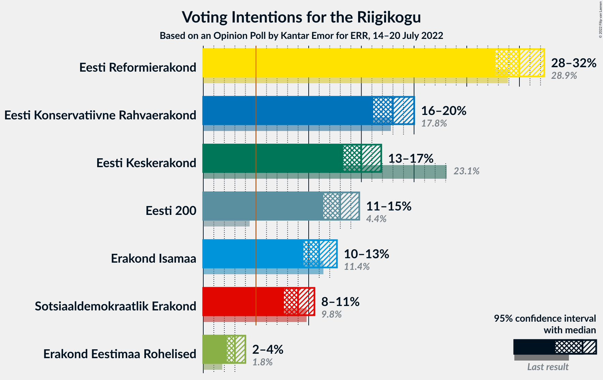

### Confidence Intervals

| Party | Last Result | Poll Result | 80% Confidence Interval | 90% Confidence Interval | 95% Confidence Interval | 99% Confidence Interval |
|:-----:|:-----------:|:-----------:|:-----------------------:|:-----------------------:|:-----------------------:|:-----------------------:|
| Eesti Reformierakond | 28.9% | 30.0% | 28.5–31.5% |28.1–32.0% |27.7–32.4% |27.0–33.1% |
| Eesti Konservatiivne Rahvaerakond | 17.8% | 18.0% | 16.8–19.3% |16.4–19.7% |16.1–20.0% |15.6–20.7% |
| Eesti Keskerakond | 23.1% | 15.0% | 13.9–16.2% |13.5–16.6% |13.3–16.9% |12.7–17.5% |
| Eesti 200 | 4.4% | 13.0% | 11.9–14.2% |11.6–14.5% |11.4–14.8% |10.9–15.4% |
| Erakond Isamaa | 11.4% | 11.0% | 10.0–12.1% |9.7–12.4% |9.5–12.7% |9.1–13.2% |
| Sotsiaaldemokraatlik Erakond | 9.8% | 9.0% | 8.1–10.0% |7.9–10.3% |7.7–10.5% |7.2–11.1% |
| Erakond Eestimaa Rohelised | 1.8% | 3.0% | 2.5–3.6% |2.4–3.8% |2.2–4.0% |2.0–4.3% |

*Note:* The poll result column reflects the actual value used in the calculations. Published results may vary slightly, and in addition be rounded to fewer digits.

## Seats

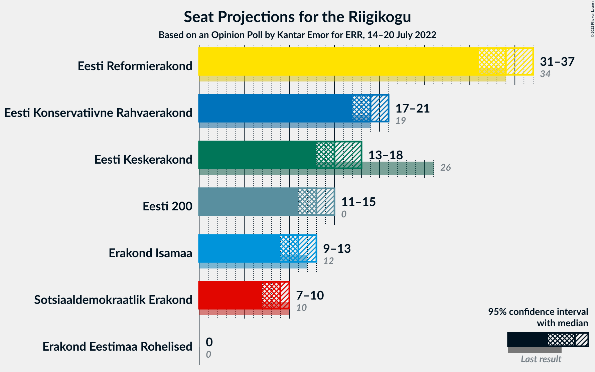

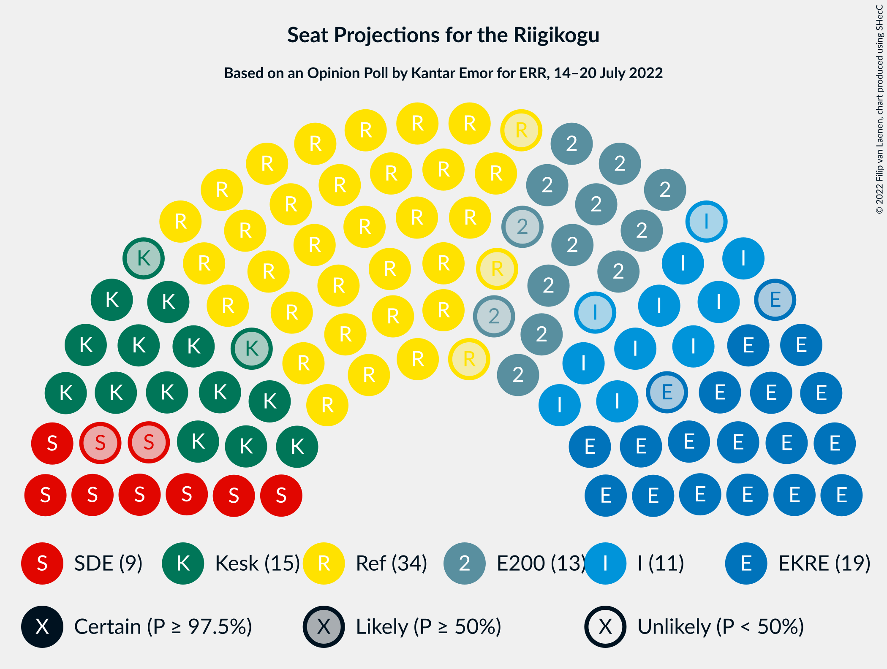

### Confidence Intervals

| Party | Last Result | Median | 80% Confidence Interval | 90% Confidence Interval | 95% Confidence Interval | 99% Confidence Interval |
|:-----:|:-----------:|:------:|:-----------------------:|:-----------------------:|:-----------------------:|:-----------------------:|
| <a href="#eesti-reformierakond">Eesti Reformierakond</a> | 34 | 34 | 32–36 |32–36 |31–37 |30–38 |
| <a href="#eesti-konservatiivne-rahvaerakond">Eesti Konservatiivne Rahvaerakond</a> | 19 | 19 | 17–21 |17–21 |17–21 |16–22 |
| <a href="#eesti-keskerakond">Eesti Keskerakond</a> | 26 | 15 | 14–17 |14–17 |13–18 |13–18 |
| <a href="#eesti-200">Eesti 200</a> | 0 | 13 | 12–14 |12–15 |11–15 |11–16 |
| <a href="#erakond-isamaa">Erakond Isamaa</a> | 12 | 11 | 10–12 |9–12 |9–13 |9–13 |
| <a href="#sotsiaaldemokraatlik-erakond">Sotsiaaldemokraatlik Erakond</a> | 10 | 9 | 8–10 |7–10 |7–10 |7–11 |
| <a href="#erakond-eestimaa-rohelised">Erakond Eestimaa Rohelised</a> | 0 | 0 | 0 |0 |0 |0 |

### Eesti Reformierakond

*For a full overview of the results for this party, see the [Eesti Reformierakond](party-eestireformierakond.html) page.*

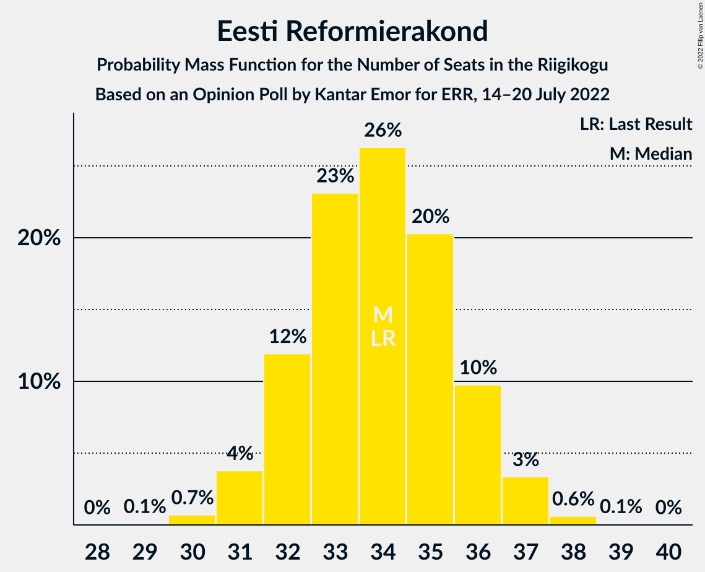

| Number of Seats | Probability | Accumulated | Special Marks |
|:---------------:|:-----------:|:-----------:|:-------------:|
| 29 | 0.1% | 100% |  |
| 30 | 0.7% | 99.9% |  |
| 31 | 4% | 99.2% |  |
| 32 | 12% | 95% |  |
| 33 | 23% | 84% |  |
| 34 | 26% | 60% | Last Result, Median |
| 35 | 20% | 34% |  |
| 36 | 10% | 14% |  |
| 37 | 3% | 4% |  |
| 38 | 0.6% | 0.7% |  |
| 39 | 0.1% | 0.1% |  |
| 40 | 0% | 0% |  |

### Eesti Konservatiivne Rahvaerakond

*For a full overview of the results for this party, see the [Eesti Konservatiivne Rahvaerakond](party-eestikonservatiivnerahvaerakond.html) page.*

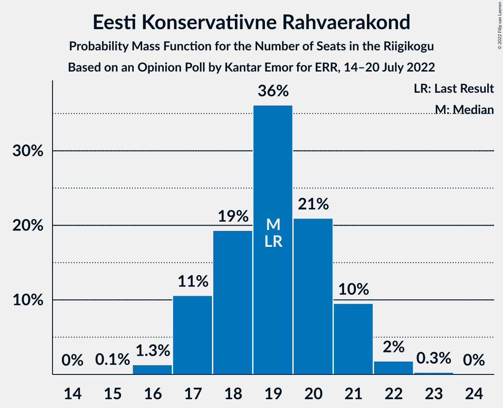

| Number of Seats | Probability | Accumulated | Special Marks |
|:---------------:|:-----------:|:-----------:|:-------------:|
| 15 | 0.1% | 100% |  |
| 16 | 1.3% | 99.9% |  |
| 17 | 11% | 98.6% |  |
| 18 | 19% | 88% |  |
| 19 | 36% | 69% | Last Result, Median |
| 20 | 21% | 33% |  |
| 21 | 10% | 12% |  |
| 22 | 2% | 2% |  |
| 23 | 0.3% | 0.3% |  |
| 24 | 0% | 0% |  |

### Eesti Keskerakond

*For a full overview of the results for this party, see the [Eesti Keskerakond](party-eestikeskerakond.html) page.*

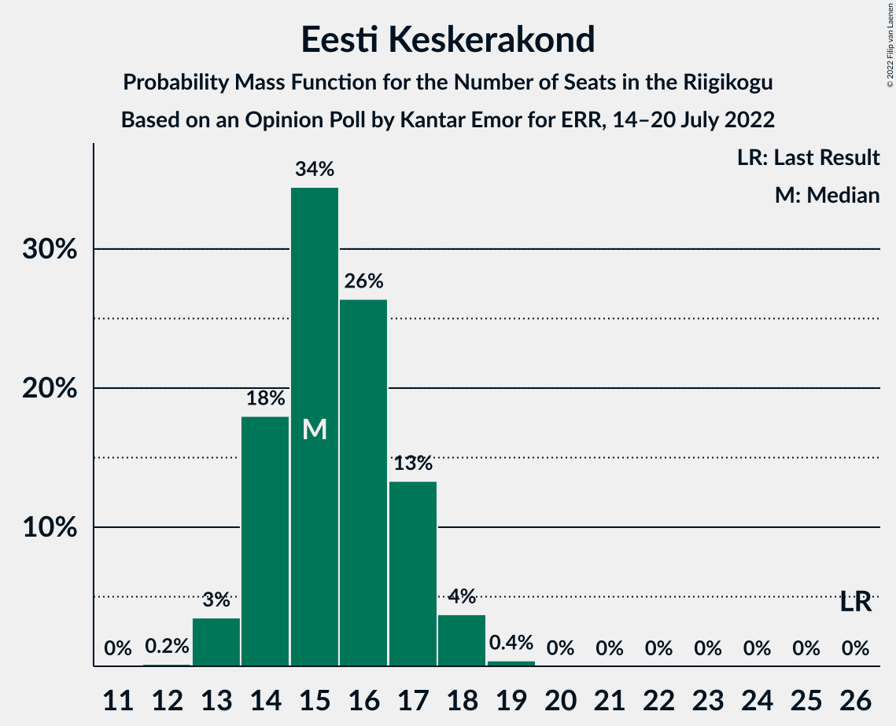

| Number of Seats | Probability | Accumulated | Special Marks |
|:---------------:|:-----------:|:-----------:|:-------------:|
| 12 | 0.2% | 100% |  |
| 13 | 3% | 99.8% |  |
| 14 | 18% | 96% |  |
| 15 | 34% | 78% | Median |
| 16 | 26% | 44% |  |
| 17 | 13% | 17% |  |
| 18 | 4% | 4% |  |
| 19 | 0.4% | 0.4% |  |
| 20 | 0% | 0% |  |
| 21 | 0% | 0% |  |
| 22 | 0% | 0% |  |
| 23 | 0% | 0% |  |
| 24 | 0% | 0% |  |
| 25 | 0% | 0% |  |
| 26 | 0% | 0% | Last Result |

### Eesti 200

*For a full overview of the results for this party, see the [Eesti 200](party-eesti200.html) page.*

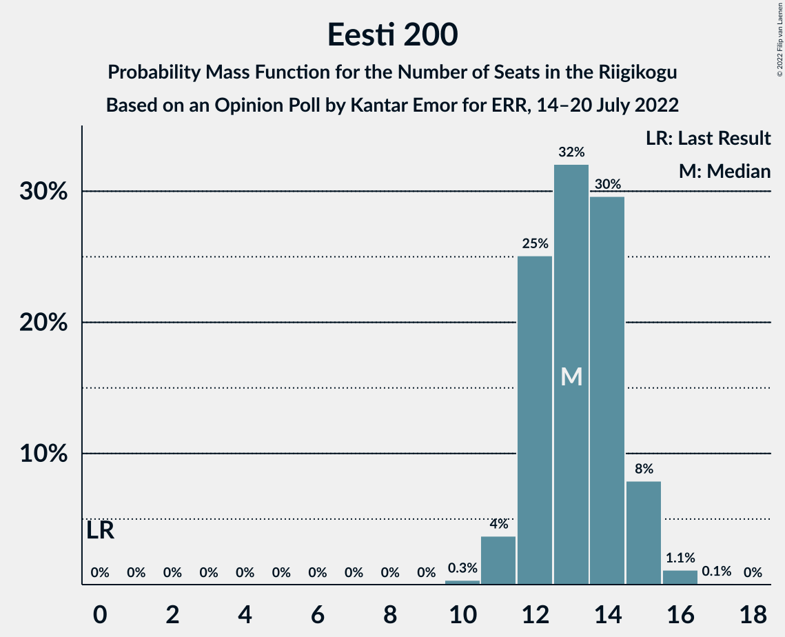

| Number of Seats | Probability | Accumulated | Special Marks |
|:---------------:|:-----------:|:-----------:|:-------------:|
| 0 | 0% | 100% | Last Result |
| 1 | 0% | 100% |  |
| 2 | 0% | 100% |  |
| 3 | 0% | 100% |  |
| 4 | 0% | 100% |  |
| 5 | 0% | 100% |  |
| 6 | 0% | 100% |  |
| 7 | 0% | 100% |  |
| 8 | 0% | 100% |  |
| 9 | 0% | 100% |  |
| 10 | 0.3% | 100% |  |
| 11 | 4% | 99.6% |  |
| 12 | 25% | 96% |  |
| 13 | 32% | 71% | Median |
| 14 | 30% | 39% |  |
| 15 | 8% | 9% |  |
| 16 | 1.1% | 1.2% |  |
| 17 | 0.1% | 0.1% |  |
| 18 | 0% | 0% |  |

### Erakond Isamaa

*For a full overview of the results for this party, see the [Erakond Isamaa](party-erakondisamaa.html) page.*

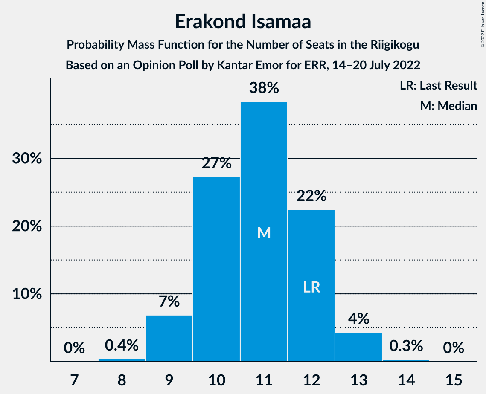

| Number of Seats | Probability | Accumulated | Special Marks |
|:---------------:|:-----------:|:-----------:|:-------------:|
| 8 | 0.4% | 100% |  |
| 9 | 7% | 99.6% |  |
| 10 | 27% | 93% |  |
| 11 | 38% | 65% | Median |
| 12 | 22% | 27% | Last Result |
| 13 | 4% | 5% |  |
| 14 | 0.3% | 0.3% |  |
| 15 | 0% | 0% |  |

### Sotsiaaldemokraatlik Erakond

*For a full overview of the results for this party, see the [Sotsiaaldemokraatlik Erakond](party-sotsiaaldemokraatlikerakond.html) page.*

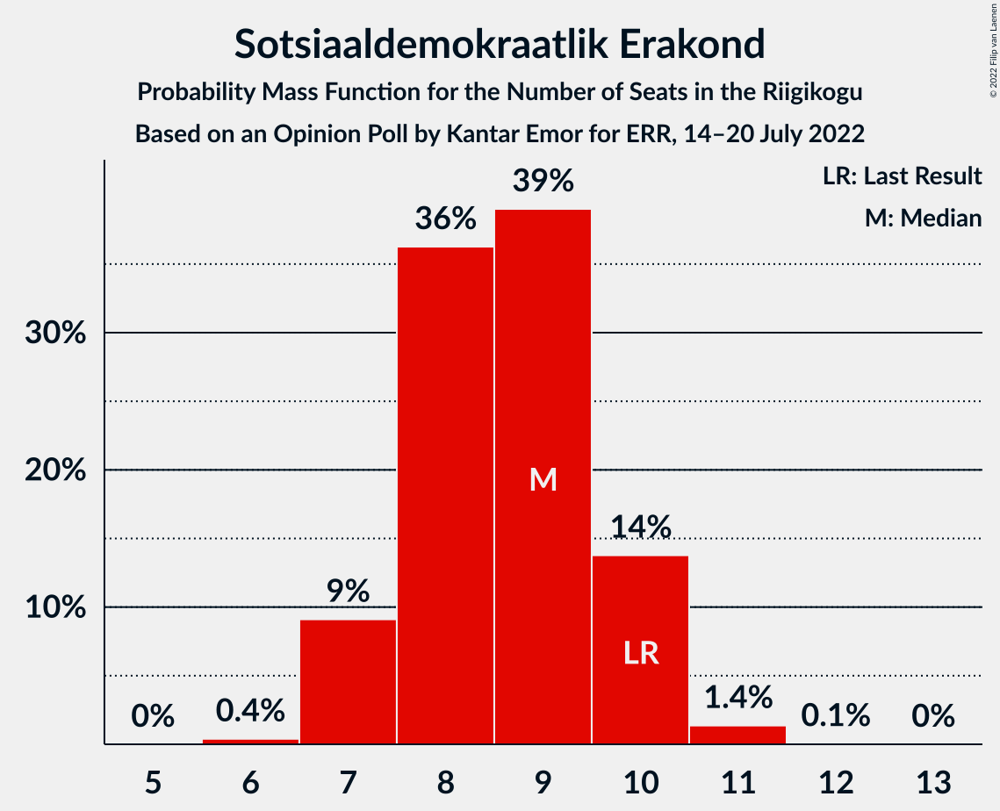

| Number of Seats | Probability | Accumulated | Special Marks |
|:---------------:|:-----------:|:-----------:|:-------------:|
| 6 | 0.4% | 100% |  |
| 7 | 9% | 99.6% |  |
| 8 | 36% | 90% |  |
| 9 | 39% | 54% | Median |
| 10 | 14% | 15% | Last Result |
| 11 | 1.4% | 1.4% |  |
| 12 | 0.1% | 0.1% |  |
| 13 | 0% | 0% |  |

### Erakond Eestimaa Rohelised

*For a full overview of the results for this party, see the [Erakond Eestimaa Rohelised](party-erakondeestimaarohelised.html) page.*

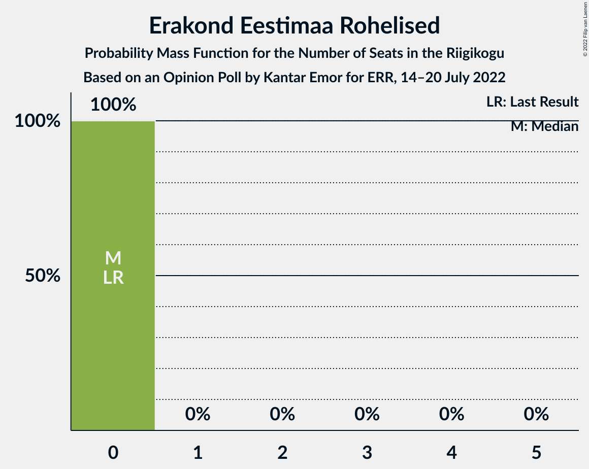

| Number of Seats | Probability | Accumulated | Special Marks |
|:---------------:|:-----------:|:-----------:|:-------------:|
| 0 | 100% | 100% | Last Result, Median |

## Coalitions

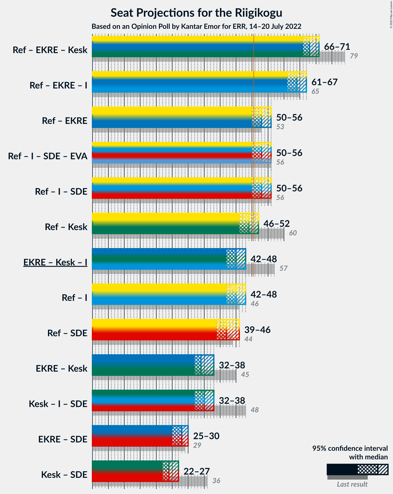

### Confidence Intervals

| Coalition | Last Result | Median | Majority? | 80% Confidence Interval | 90% Confidence Interval | 95% Confidence Interval | 99% Confidence Interval |
|:---------:|:-----------:|:------:|:---------:|:-----------------------:|:-----------------------:|:-----------------------:|:-----------------------:|
| Eesti Reformierakond – Eesti Konservatiivne Rahvaerakond – Eesti Keskerakond | 79 | 68 | 100% | 67–71 | 66–71 | 66–71 | 65–72 |
| Eesti Reformierakond – Eesti Konservatiivne Rahvaerakond – Erakond Isamaa | 65 | 64 | 100% | 62–66 | 61–66 | 61–67 | 60–68 |
| Eesti Reformierakond – Eesti Konservatiivne Rahvaerakond | 53 | 53 | 94% | 51–55 | 50–55 | 50–56 | 49–57 |
| Eesti Reformierakond – Erakond Isamaa – Sotsiaaldemokraatlik Erakond | 56 | 53 | 96% | 51–55 | 51–56 | 50–56 | 49–57 |
| Eesti Reformierakond – Eesti Keskerakond | 60 | 49 | 21% | 47–51 | 47–52 | 46–52 | 45–54 |
| Eesti Konservatiivne Rahvaerakond – Eesti Keskerakond – Erakond Isamaa | 57 | 45 | 0% | 43–47 | 43–48 | 42–48 | 41–49 |
| Eesti Reformierakond – Erakond Isamaa | 46 | 45 | 0% | 43–47 | 42–47 | 42–48 | 41–49 |
| Eesti Reformierakond – Sotsiaaldemokraatlik Erakond | 44 | 42 | 0% | 41–44 | 40–45 | 39–46 | 39–47 |
| Eesti Konservatiivne Rahvaerakond – Eesti Keskerakond | 45 | 34 | 0% | 33–37 | 32–37 | 32–38 | 31–38 |
| Eesti Keskerakond – Erakond Isamaa – Sotsiaaldemokraatlik Erakond | 48 | 35 | 0% | 33–37 | 33–37 | 32–38 | 31–39 |
| Eesti Konservatiivne Rahvaerakond – Sotsiaaldemokraatlik Erakond | 29 | 28 | 0% | 26–29 | 25–30 | 25–30 | 24–31 |
| Eesti Keskerakond – Sotsiaaldemokraatlik Erakond | 36 | 24 | 0% | 22–26 | 22–26 | 22–27 | 21–28 |

### Eesti Reformierakond – Eesti Konservatiivne Rahvaerakond – Eesti Keskerakond

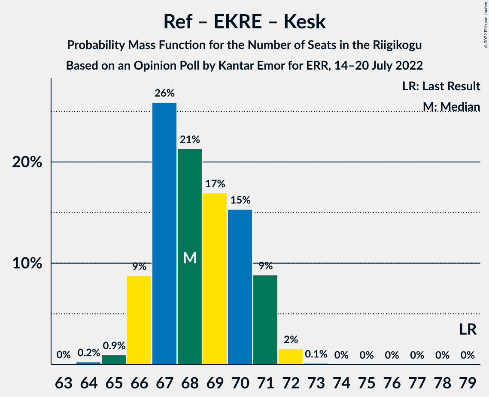

| Number of Seats | Probability | Accumulated | Special Marks |
|:---------------:|:-----------:|:-----------:|:-------------:|
| 64 | 0.2% | 100% |  |
| 65 | 0.9% | 99.7% |  |
| 66 | 9% | 98.8% |  |
| 67 | 26% | 90% |  |
| 68 | 21% | 64% | Median |
| 69 | 17% | 43% |  |
| 70 | 15% | 26% |  |
| 71 | 9% | 10% |  |
| 72 | 2% | 2% |  |
| 73 | 0.1% | 0.1% |  |
| 74 | 0% | 0% |  |
| 75 | 0% | 0% |  |
| 76 | 0% | 0% |  |
| 77 | 0% | 0% |  |
| 78 | 0% | 0% |  |
| 79 | 0% | 0% | Last Result |

### Eesti Reformierakond – Eesti Konservatiivne Rahvaerakond – Erakond Isamaa

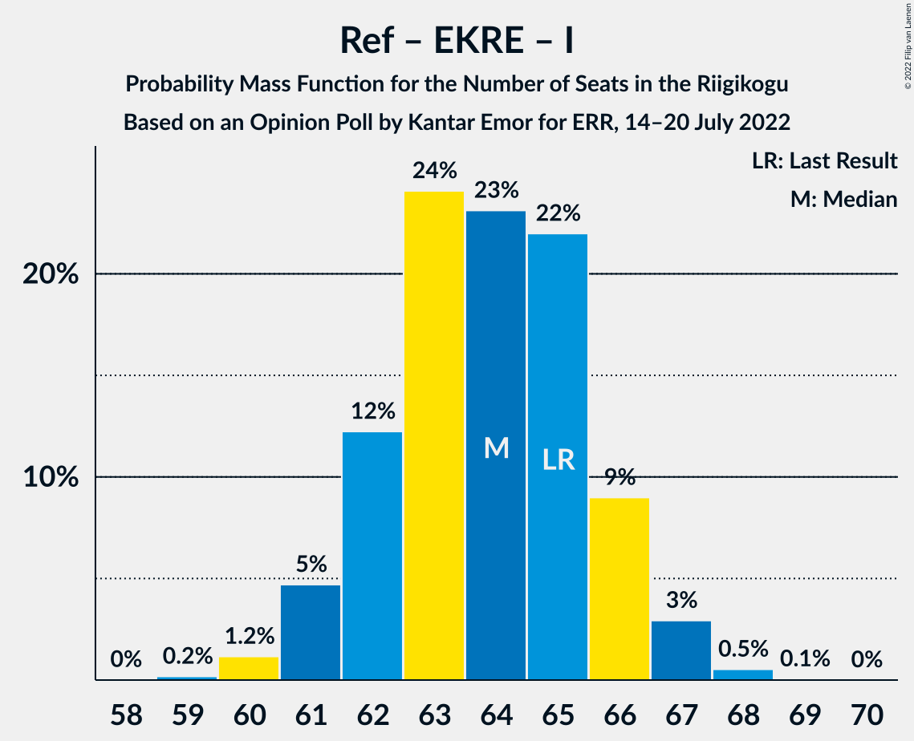

| Number of Seats | Probability | Accumulated | Special Marks |
|:---------------:|:-----------:|:-----------:|:-------------:|
| 59 | 0.2% | 100% |  |
| 60 | 1.2% | 99.8% |  |
| 61 | 5% | 98.6% |  |
| 62 | 12% | 94% |  |
| 63 | 24% | 82% |  |
| 64 | 23% | 58% | Median |
| 65 | 22% | 34% | Last Result |
| 66 | 9% | 13% |  |
| 67 | 3% | 4% |  |
| 68 | 0.5% | 0.6% |  |
| 69 | 0.1% | 0.1% |  |
| 70 | 0% | 0% |  |

### Eesti Reformierakond – Eesti Konservatiivne Rahvaerakond

| Number of Seats | Probability | Accumulated | Special Marks |
|:---------------:|:-----------:|:-----------:|:-------------:|
| 48 | 0.2% | 100% |  |
| 49 | 1.0% | 99.8% |  |
| 50 | 5% | 98.8% |  |
| 51 | 13% | 94% | Majority |
| 52 | 20% | 81% |  |
| 53 | 25% | 61% | Last Result, Median |
| 54 | 20% | 36% |  |
| 55 | 11% | 16% |  |
| 56 | 4% | 5% |  |
| 57 | 0.9% | 1.1% |  |
| 58 | 0.1% | 0.2% |  |
| 59 | 0% | 0% |  |

### Eesti Reformierakond – Erakond Isamaa – Sotsiaaldemokraatlik Erakond

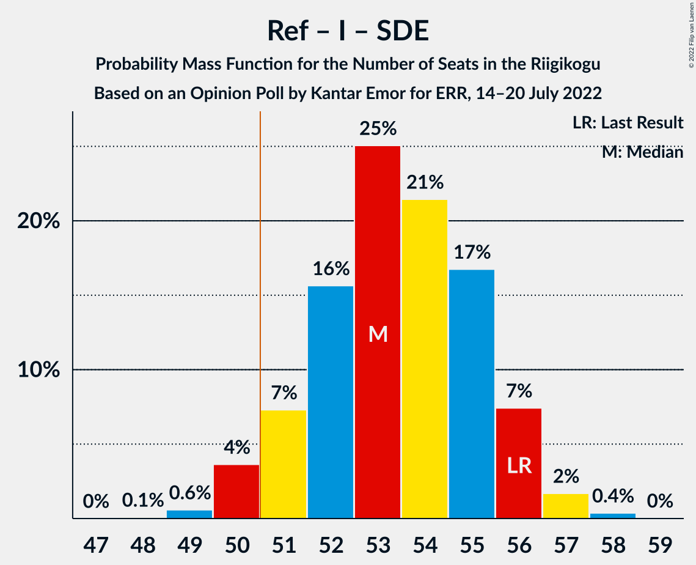

| Number of Seats | Probability | Accumulated | Special Marks |
|:---------------:|:-----------:|:-----------:|:-------------:|
| 48 | 0.1% | 100% |  |
| 49 | 0.6% | 99.9% |  |
| 50 | 4% | 99.3% |  |
| 51 | 7% | 96% | Majority |
| 52 | 16% | 88% |  |
| 53 | 25% | 73% |  |
| 54 | 21% | 48% | Median |
| 55 | 17% | 26% |  |
| 56 | 7% | 10% | Last Result |
| 57 | 2% | 2% |  |
| 58 | 0.4% | 0.4% |  |
| 59 | 0% | 0% |  |

### Eesti Reformierakond – Eesti Keskerakond

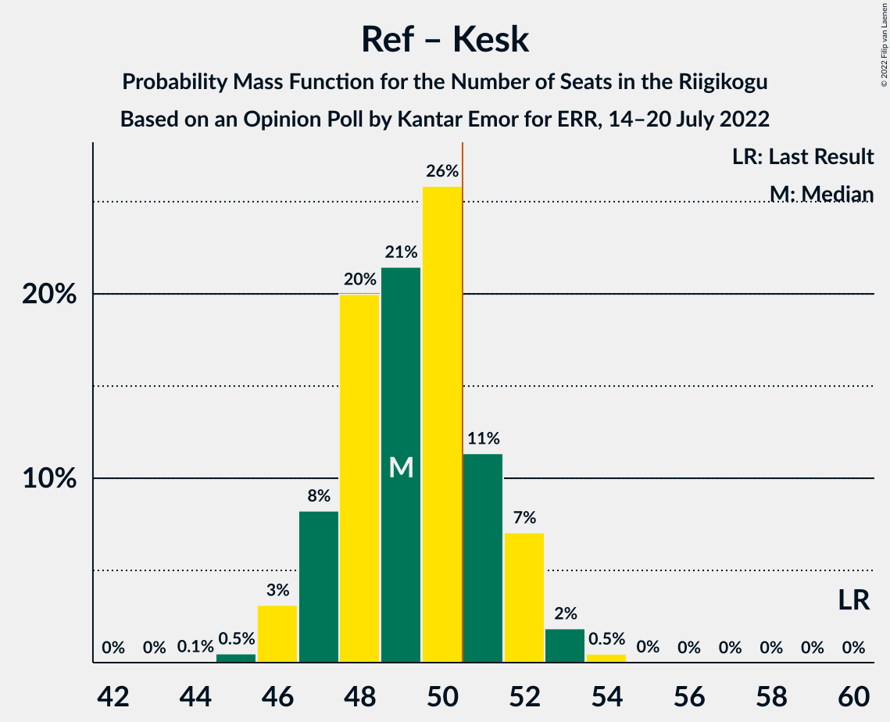

| Number of Seats | Probability | Accumulated | Special Marks |
|:---------------:|:-----------:|:-----------:|:-------------:|
| 44 | 0.1% | 100% |  |
| 45 | 0.5% | 99.9% |  |
| 46 | 3% | 99.4% |  |
| 47 | 8% | 96% |  |
| 48 | 20% | 88% |  |
| 49 | 21% | 68% | Median |
| 50 | 26% | 47% |  |
| 51 | 11% | 21% | Majority |
| 52 | 7% | 9% |  |
| 53 | 2% | 2% |  |
| 54 | 0.5% | 0.5% |  |
| 55 | 0% | 0.1% |  |
| 56 | 0% | 0% |  |
| 57 | 0% | 0% |  |
| 58 | 0% | 0% |  |
| 59 | 0% | 0% |  |
| 60 | 0% | 0% | Last Result |

### Eesti Konservatiivne Rahvaerakond – Eesti Keskerakond – Erakond Isamaa

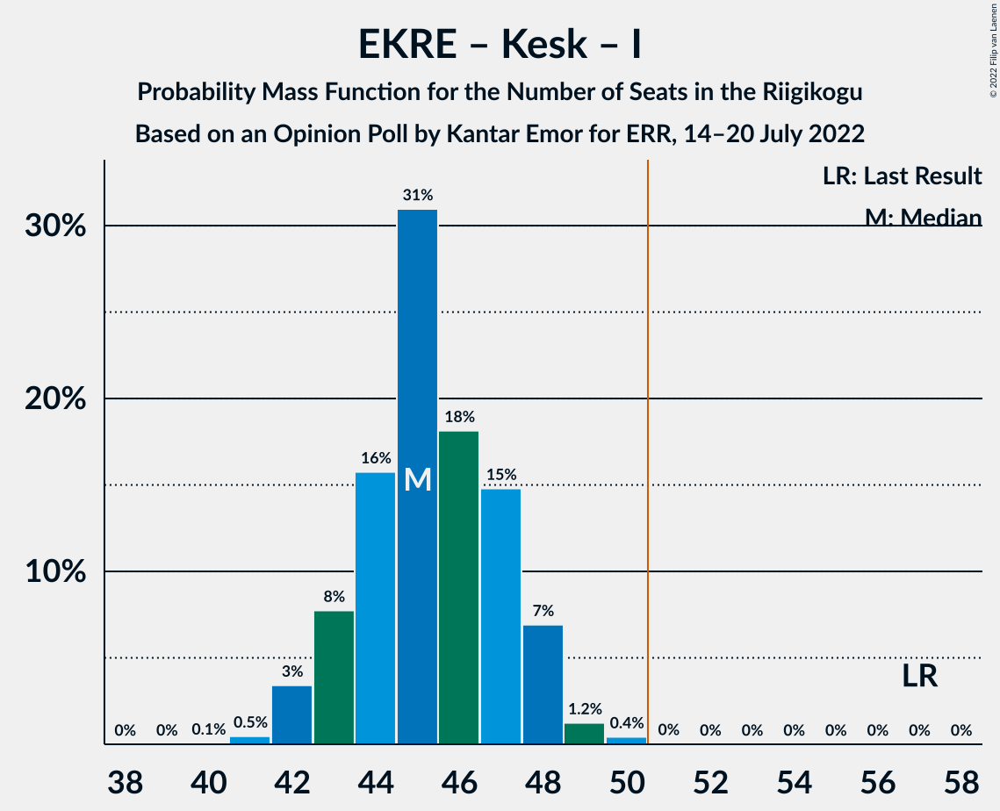

| Number of Seats | Probability | Accumulated | Special Marks |
|:---------------:|:-----------:|:-----------:|:-------------:|
| 40 | 0.1% | 100% |  |
| 41 | 0.5% | 99.9% |  |
| 42 | 3% | 99.5% |  |
| 43 | 8% | 96% |  |
| 44 | 16% | 88% |  |
| 45 | 31% | 73% | Median |
| 46 | 18% | 42% |  |
| 47 | 15% | 23% |  |
| 48 | 7% | 9% |  |
| 49 | 1.2% | 2% |  |
| 50 | 0.4% | 0.5% |  |
| 51 | 0% | 0% | Majority |
| 52 | 0% | 0% |  |
| 53 | 0% | 0% |  |
| 54 | 0% | 0% |  |
| 55 | 0% | 0% |  |
| 56 | 0% | 0% |  |
| 57 | 0% | 0% | Last Result |

### Eesti Reformierakond – Erakond Isamaa

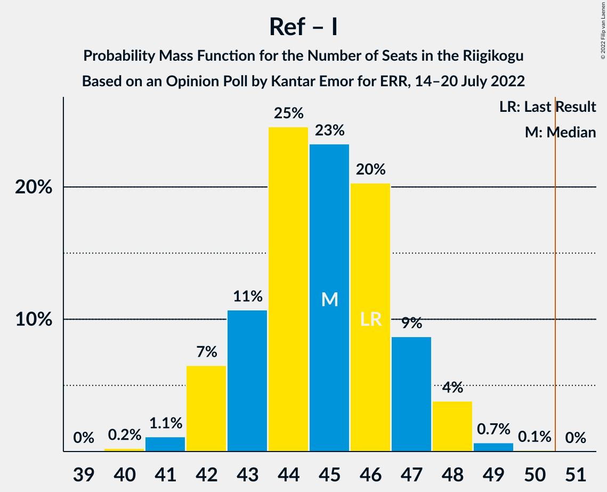

| Number of Seats | Probability | Accumulated | Special Marks |
|:---------------:|:-----------:|:-----------:|:-------------:|
| 40 | 0.2% | 100% |  |
| 41 | 1.1% | 99.7% |  |
| 42 | 7% | 98.6% |  |
| 43 | 11% | 92% |  |
| 44 | 25% | 81% |  |
| 45 | 23% | 57% | Median |
| 46 | 20% | 34% | Last Result |
| 47 | 9% | 13% |  |
| 48 | 4% | 5% |  |
| 49 | 0.7% | 0.8% |  |
| 50 | 0.1% | 0.1% |  |
| 51 | 0% | 0% | Majority |

### Eesti Reformierakond – Sotsiaaldemokraatlik Erakond

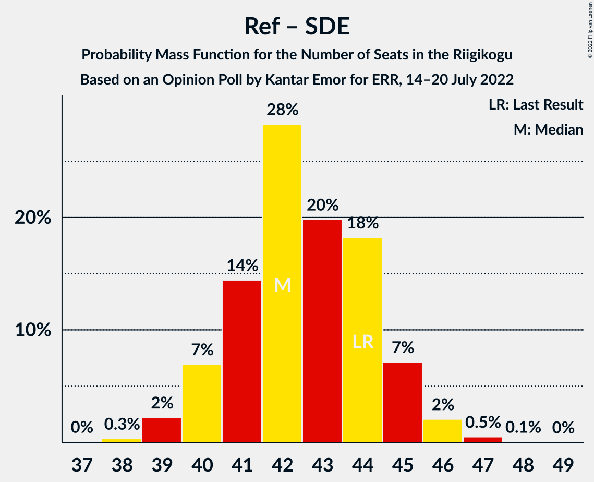

| Number of Seats | Probability | Accumulated | Special Marks |
|:---------------:|:-----------:|:-----------:|:-------------:|
| 37 | 0% | 100% |  |
| 38 | 0.3% | 99.9% |  |
| 39 | 2% | 99.6% |  |
| 40 | 7% | 97% |  |
| 41 | 14% | 90% |  |
| 42 | 28% | 76% |  |
| 43 | 20% | 48% | Median |
| 44 | 18% | 28% | Last Result |
| 45 | 7% | 10% |  |
| 46 | 2% | 3% |  |
| 47 | 0.5% | 0.5% |  |
| 48 | 0.1% | 0.1% |  |
| 49 | 0% | 0% |  |

### Eesti Konservatiivne Rahvaerakond – Eesti Keskerakond

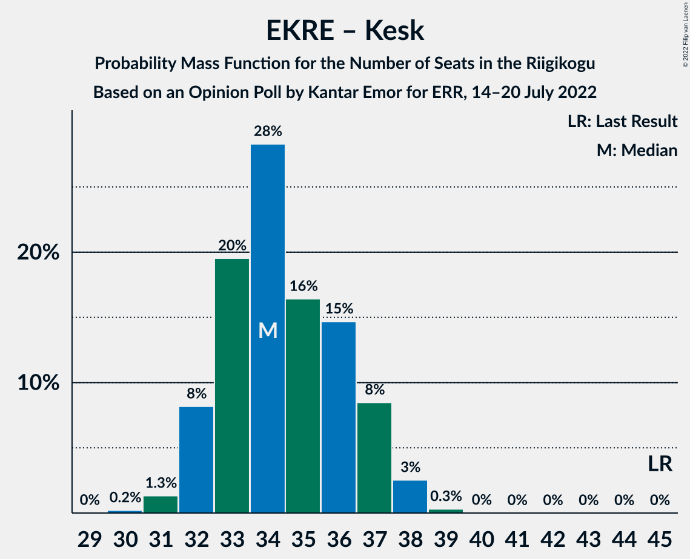

| Number of Seats | Probability | Accumulated | Special Marks |
|:---------------:|:-----------:|:-----------:|:-------------:|
| 30 | 0.2% | 100% |  |
| 31 | 1.3% | 99.8% |  |
| 32 | 8% | 98% |  |
| 33 | 20% | 90% |  |
| 34 | 28% | 71% | Median |
| 35 | 16% | 42% |  |
| 36 | 15% | 26% |  |
| 37 | 8% | 11% |  |
| 38 | 3% | 3% |  |
| 39 | 0.3% | 0.3% |  |
| 40 | 0% | 0% |  |
| 41 | 0% | 0% |  |
| 42 | 0% | 0% |  |
| 43 | 0% | 0% |  |
| 44 | 0% | 0% |  |
| 45 | 0% | 0% | Last Result |

### Eesti Keskerakond – Erakond Isamaa – Sotsiaaldemokraatlik Erakond

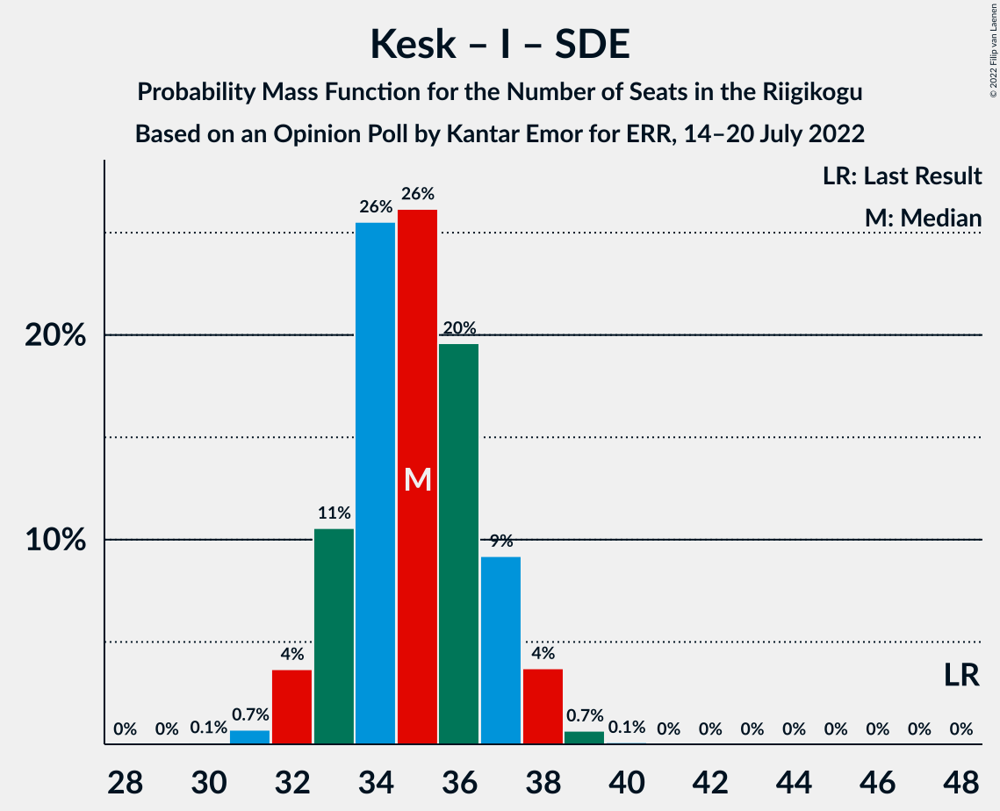

| Number of Seats | Probability | Accumulated | Special Marks |
|:---------------:|:-----------:|:-----------:|:-------------:|
| 30 | 0.1% | 100% |  |
| 31 | 0.7% | 99.9% |  |
| 32 | 4% | 99.2% |  |
| 33 | 11% | 96% |  |
| 34 | 26% | 85% |  |
| 35 | 26% | 59% | Median |
| 36 | 20% | 33% |  |
| 37 | 9% | 14% |  |
| 38 | 4% | 4% |  |
| 39 | 0.7% | 0.8% |  |
| 40 | 0.1% | 0.1% |  |
| 41 | 0% | 0% |  |
| 42 | 0% | 0% |  |
| 43 | 0% | 0% |  |
| 44 | 0% | 0% |  |
| 45 | 0% | 0% |  |
| 46 | 0% | 0% |  |
| 47 | 0% | 0% |  |
| 48 | 0% | 0% | Last Result |

### Eesti Konservatiivne Rahvaerakond – Sotsiaaldemokraatlik Erakond

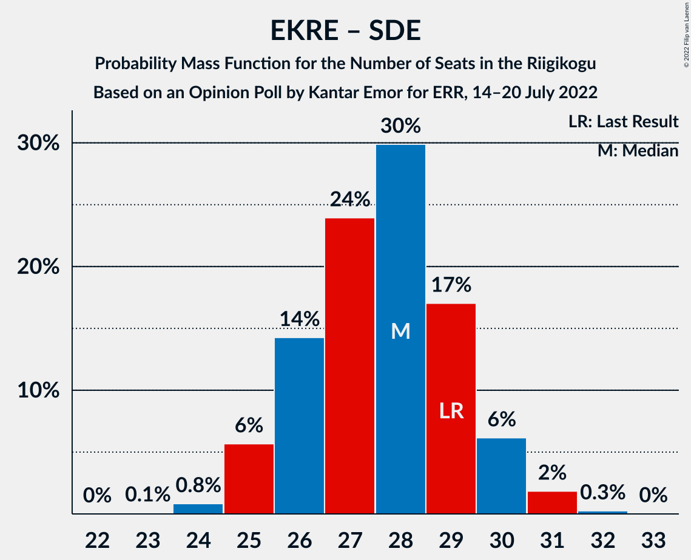

| Number of Seats | Probability | Accumulated | Special Marks |
|:---------------:|:-----------:|:-----------:|:-------------:|
| 23 | 0.1% | 100% |  |
| 24 | 0.8% | 99.9% |  |
| 25 | 6% | 99.1% |  |
| 26 | 14% | 93% |  |
| 27 | 24% | 79% |  |
| 28 | 30% | 55% | Median |
| 29 | 17% | 25% | Last Result |
| 30 | 6% | 8% |  |
| 31 | 2% | 2% |  |
| 32 | 0.3% | 0.3% |  |
| 33 | 0% | 0% |  |

### Eesti Keskerakond – Sotsiaaldemokraatlik Erakond

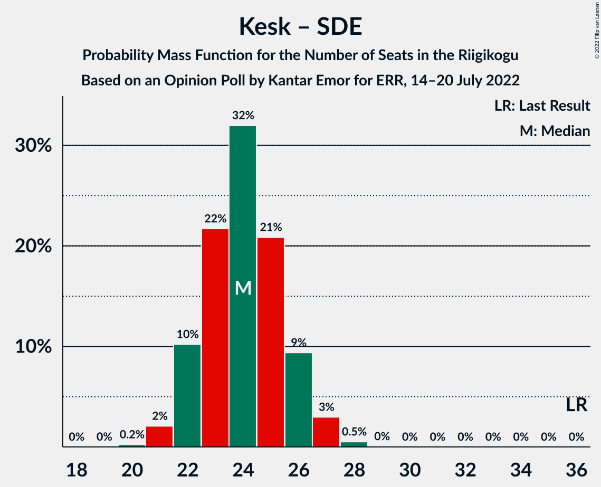

| Number of Seats | Probability | Accumulated | Special Marks |
|:---------------:|:-----------:|:-----------:|:-------------:|
| 20 | 0.2% | 100% |  |
| 21 | 2% | 99.8% |  |
| 22 | 10% | 98% |  |
| 23 | 22% | 87% |  |
| 24 | 32% | 66% | Median |
| 25 | 21% | 34% |  |
| 26 | 9% | 13% |  |
| 27 | 3% | 4% |  |
| 28 | 0.5% | 0.6% |  |
| 29 | 0% | 0.1% |  |
| 30 | 0% | 0% |  |
| 31 | 0% | 0% |  |
| 32 | 0% | 0% |  |
| 33 | 0% | 0% |  |
| 34 | 0% | 0% |  |
| 35 | 0% | 0% |  |
| 36 | 0% | 0% | Last Result |

## Technical Information

### Opinion Poll

+ **Polling firm:** Kantar Emor
+ **Commissioner(s):** ERR
+ **Fieldwork period:** 14–20 July 2022

### Calculations

+ **Sample size:** 1501
+ **Simulations done:** 1,048,576
+ **Error estimate:** 1.04%

