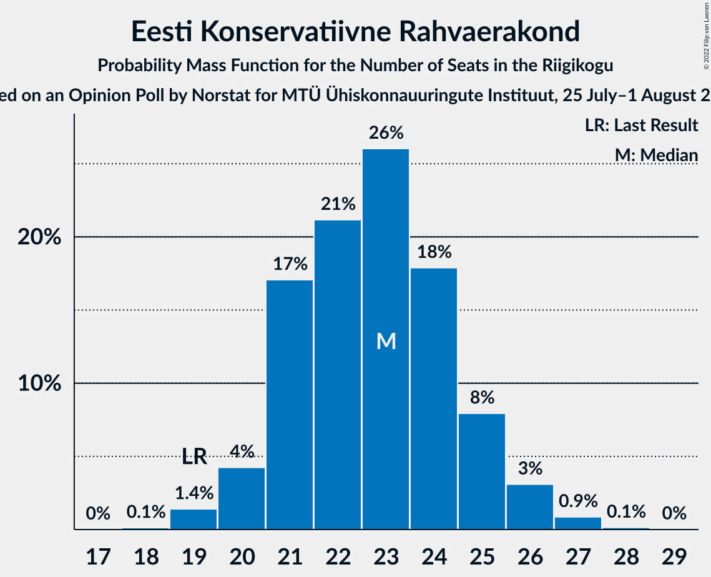

# Opinion Poll by Norstat for MTÜ Ühiskonnauuringute Instituut, 25 July–1 August 2022

<a href="#voting-intentions">Voting Intentions</a> | <a href="#seats">Seats</a> | <a href="#coalitions">Coalitions</a> | <a href="#technical-information">Technical Information</a>

## Voting Intentions

### Confidence Intervals

| Party | Last Result | Poll Result | 80% Confidence Interval | 90% Confidence Interval | 95% Confidence Interval | 99% Confidence Interval |
|:-----:|:-----------:|:-----------:|:-----------------------:|:-----------------------:|:-----------------------:|:-----------------------:|
| Eesti Reformierakond | 28.9% | 35.5% | 33.6–37.5% |33.1–38.0% |32.6–38.5% |31.7–39.5% |
| Eesti Konservatiivne Rahvaerakond | 17.8% | 21.8% | 20.2–23.5% |19.7–24.0% |19.3–24.5% |18.6–25.3% |
| Eesti Keskerakond | 23.1% | 16.6% | 15.2–18.2% |14.8–18.6% |14.4–19.0% |13.8–19.8% |
| Erakond Isamaa | 11.4% | 9.0% | 7.9–10.3% |7.6–10.6% |7.4–10.9% |6.9–11.6% |
| Sotsiaaldemokraatlik Erakond | 9.8% | 8.5% | 7.5–9.7% |7.2–10.1% |6.9–10.4% |6.5–11.0% |
| Eesti 200 | 4.4% | 6.7% | 5.8–7.8% |5.5–8.1% |5.3–8.4% |4.9–9.0% |
| Erakond Eestimaa Rohelised | 1.8% | 1.7% | 1.3–2.4% |1.2–2.5% |1.1–2.7% |0.9–3.1% |

*Note:* The poll result column reflects the actual value used in the calculations. Published results may vary slightly, and in addition be rounded to fewer digits.

## Seats

### Confidence Intervals

| Party | Last Result | Median | 80% Confidence Interval | 90% Confidence Interval | 95% Confidence Interval | 99% Confidence Interval |
|:-----:|:-----------:|:------:|:-----------------------:|:-----------------------:|:-----------------------:|:-----------------------:|
| <a href="#eesti-reformierakond">Eesti Reformierakond</a> | 34 | 40 | 37–42 |37–42 |36–43 |35–44 |
| <a href="#eesti-konservatiivne-rahvaerakond">Eesti Konservatiivne Rahvaerakond</a> | 19 | 23 | 21–25 |20–25 |20–26 |19–27 |
| <a href="#eesti-keskerakond">Eesti Keskerakond</a> | 26 | 17 | 15–18 |15–19 |14–19 |13–20 |
| <a href="#erakond-isamaa">Erakond Isamaa</a> | 12 | 8 | 7–10 |7–10 |6–10 |6–11 |
| <a href="#sotsiaaldemokraatlik-erakond">Sotsiaaldemokraatlik Erakond</a> | 10 | 8 | 7–9 |6–9 |6–10 |5–10 |
| <a href="#eesti-200">Eesti 200</a> | 0 | 6 | 5–7 |5–7 |4–8 |0–8 |
| <a href="#erakond-eestimaa-rohelised">Erakond Eestimaa Rohelised</a> | 0 | 0 | 0 |0 |0 |0 |

### Eesti Reformierakond

*For a full overview of the results for this party, see the [Eesti Reformierakond](party-eestireformierakond.html) page.*

| Number of Seats | Probability | Accumulated | Special Marks |
|:---------------:|:-----------:|:-----------:|:-------------:|
| 34 | 0.2% | 100% | Last Result |
| 35 | 1.1% | 99.7% |  |
| 36 | 3% | 98.6% |  |
| 37 | 8% | 95% |  |
| 38 | 16% | 87% |  |
| 39 | 19% | 71% |  |
| 40 | 20% | 52% | Median |
| 41 | 15% | 32% |  |
| 42 | 12% | 17% |  |
| 43 | 3% | 4% |  |
| 44 | 1.3% | 2% |  |
| 45 | 0.4% | 0.4% |  |
| 46 | 0.1% | 0.1% |  |
| 47 | 0% | 0% |  |

### Eesti Konservatiivne Rahvaerakond

*For a full overview of the results for this party, see the [Eesti Konservatiivne Rahvaerakond](party-eestikonservatiivnerahvaerakond.html) page.*

| Number of Seats | Probability | Accumulated | Special Marks |
|:---------------:|:-----------:|:-----------:|:-------------:|
| 18 | 0.1% | 100% |  |
| 19 | 1.4% | 99.9% | Last Result |
| 20 | 4% | 98% |  |
| 21 | 17% | 94% |  |
| 22 | 21% | 77% |  |
| 23 | 26% | 56% | Median |
| 24 | 18% | 30% |  |
| 25 | 8% | 12% |  |
| 26 | 3% | 4% |  |
| 27 | 0.9% | 1.0% |  |
| 28 | 0.1% | 0.2% |  |
| 29 | 0% | 0% |  |

### Eesti Keskerakond

*For a full overview of the results for this party, see the [Eesti Keskerakond](party-eestikeskerakond.html) page.*

| Number of Seats | Probability | Accumulated | Special Marks |
|:---------------:|:-----------:|:-----------:|:-------------:|
| 13 | 0.7% | 100% |  |
| 14 | 4% | 99.3% |  |
| 15 | 14% | 95% |  |
| 16 | 27% | 81% |  |
| 17 | 28% | 54% | Median |
| 18 | 17% | 26% |  |
| 19 | 7% | 9% |  |
| 20 | 2% | 2% |  |
| 21 | 0.4% | 0.4% |  |
| 22 | 0% | 0% |  |
| 23 | 0% | 0% |  |
| 24 | 0% | 0% |  |
| 25 | 0% | 0% |  |
| 26 | 0% | 0% | Last Result |

### Erakond Isamaa

*For a full overview of the results for this party, see the [Erakond Isamaa](party-erakondisamaa.html) page.*

| Number of Seats | Probability | Accumulated | Special Marks |
|:---------------:|:-----------:|:-----------:|:-------------:|
| 5 | 0.1% | 100% |  |
| 6 | 3% | 99.9% |  |
| 7 | 15% | 97% |  |
| 8 | 41% | 83% | Median |
| 9 | 29% | 42% |  |
| 10 | 11% | 12% |  |
| 11 | 1.2% | 1.3% |  |
| 12 | 0.1% | 0.1% | Last Result |
| 13 | 0% | 0% |  |

### Sotsiaaldemokraatlik Erakond

*For a full overview of the results for this party, see the [Sotsiaaldemokraatlik Erakond](party-sotsiaaldemokraatlikerakond.html) page.*

| Number of Seats | Probability | Accumulated | Special Marks |
|:---------------:|:-----------:|:-----------:|:-------------:|
| 5 | 0.6% | 100% |  |
| 6 | 8% | 99.4% |  |
| 7 | 33% | 91% |  |
| 8 | 37% | 58% | Median |
| 9 | 17% | 21% |  |
| 10 | 3% | 3% | Last Result |
| 11 | 0.4% | 0.4% |  |
| 12 | 0% | 0% |  |

### Eesti 200

*For a full overview of the results for this party, see the [Eesti 200](party-eesti200.html) page.*

| Number of Seats | Probability | Accumulated | Special Marks |
|:---------------:|:-----------:|:-----------:|:-------------:|
| 0 | 0.9% | 100% | Last Result |
| 1 | 0% | 99.1% |  |
| 2 | 0% | 99.1% |  |
| 3 | 0% | 99.1% |  |
| 4 | 3% | 99.1% |  |
| 5 | 24% | 96% |  |
| 6 | 49% | 72% | Median |
| 7 | 21% | 23% |  |
| 8 | 2% | 3% |  |
| 9 | 0.2% | 0.2% |  |
| 10 | 0% | 0% |  |

### Erakond Eestimaa Rohelised

*For a full overview of the results for this party, see the [Erakond Eestimaa Rohelised](party-erakondeestimaarohelised.html) page.*

| Number of Seats | Probability | Accumulated | Special Marks |
|:---------------:|:-----------:|:-----------:|:-------------:|
| 0 | 100% | 100% | Last Result, Median |

## Coalitions

### Confidence Intervals

| Coalition | Last Result | Median | Majority? | 80% Confidence Interval | 90% Confidence Interval | 95% Confidence Interval | 99% Confidence Interval |
|:---------:|:-----------:|:------:|:---------:|:-----------------------:|:-----------------------:|:-----------------------:|:-----------------------:|
| Eesti Reformierakond – Eesti Konservatiivne Rahvaerakond – Eesti Keskerakond | 79 | 79 | 100% | 77–81 | 77–82 | 76–82 | 75–84 |
| Eesti Reformierakond – Eesti Konservatiivne Rahvaerakond – Erakond Isamaa | 65 | 71 | 100% | 68–73 | 68–73 | 67–74 | 66–75 |
| Eesti Reformierakond – Eesti Konservatiivne Rahvaerakond | 53 | 62 | 100% | 60–64 | 59–65 | 59–66 | 58–67 |
| Eesti Reformierakond – Eesti Keskerakond | 60 | 56 | 99.9% | 54–59 | 53–59 | 53–60 | 51–61 |
| Eesti Reformierakond – Erakond Isamaa – Sotsiaaldemokraatlik Erakond | 56 | 56 | 99.7% | 53–58 | 53–59 | 52–59 | 51–61 |
| Eesti Konservatiivne Rahvaerakond – Eesti Keskerakond – Erakond Isamaa | 57 | 48 | 8% | 45–50 | 45–51 | 44–52 | 43–53 |
| Eesti Reformierakond – Erakond Isamaa | 46 | 48 | 8% | 45–50 | 45–51 | 44–52 | 43–53 |
| Eesti Reformierakond – Sotsiaaldemokraatlik Erakond | 44 | 47 | 4% | 45–50 | 44–50 | 44–51 | 42–52 |
| Eesti Konservatiivne Rahvaerakond – Eesti Keskerakond | 45 | 39 | 0% | 37–42 | 37–42 | 36–43 | 35–44 |
| Eesti Keskerakond – Erakond Isamaa – Sotsiaaldemokraatlik Erakond | 48 | 33 | 0% | 31–35 | 30–36 | 29–36 | 28–37 |
| Eesti Konservatiivne Rahvaerakond – Sotsiaaldemokraatlik Erakond | 29 | 30 | 0% | 28–33 | 28–33 | 27–34 | 26–35 |
| Eesti Keskerakond – Sotsiaaldemokraatlik Erakond | 36 | 24 | 0% | 23–26 | 22–27 | 21–28 | 20–29 |

### Eesti Reformierakond – Eesti Konservatiivne Rahvaerakond – Eesti Keskerakond

| Number of Seats | Probability | Accumulated | Special Marks |
|:---------------:|:-----------:|:-----------:|:-------------:|
| 74 | 0.2% | 100% |  |
| 75 | 0.7% | 99.8% |  |
| 76 | 3% | 99.1% |  |
| 77 | 11% | 96% |  |
| 78 | 23% | 85% |  |
| 79 | 25% | 61% | Last Result |
| 80 | 22% | 37% | Median |
| 81 | 9% | 15% |  |
| 82 | 4% | 5% |  |
| 83 | 1.0% | 2% |  |
| 84 | 0.3% | 0.7% |  |
| 85 | 0.2% | 0.3% |  |
| 86 | 0.1% | 0.1% |  |
| 87 | 0% | 0.1% |  |
| 88 | 0% | 0% |  |

### Eesti Reformierakond – Eesti Konservatiivne Rahvaerakond – Erakond Isamaa

| Number of Seats | Probability | Accumulated | Special Marks |
|:---------------:|:-----------:|:-----------:|:-------------:|
| 65 | 0.1% | 100% | Last Result |
| 66 | 0.6% | 99.8% |  |
| 67 | 3% | 99.3% |  |
| 68 | 8% | 97% |  |
| 69 | 11% | 89% |  |
| 70 | 23% | 78% |  |
| 71 | 28% | 56% | Median |
| 72 | 14% | 28% |  |
| 73 | 9% | 14% |  |
| 74 | 3% | 5% |  |
| 75 | 1.0% | 1.3% |  |
| 76 | 0.2% | 0.4% |  |
| 77 | 0.1% | 0.1% |  |
| 78 | 0.1% | 0.1% |  |
| 79 | 0% | 0% |  |

### Eesti Reformierakond – Eesti Konservatiivne Rahvaerakond

| Number of Seats | Probability | Accumulated | Special Marks |
|:---------------:|:-----------:|:-----------:|:-------------:|
| 53 | 0% | 100% | Last Result |
| 54 | 0% | 100% |  |
| 55 | 0% | 100% |  |
| 56 | 0.1% | 100% |  |
| 57 | 0.4% | 99.9% |  |
| 58 | 1.0% | 99.5% |  |
| 59 | 4% | 98.5% |  |
| 60 | 10% | 95% |  |
| 61 | 16% | 85% |  |
| 62 | 23% | 68% |  |
| 63 | 20% | 46% | Median |
| 64 | 15% | 25% |  |
| 65 | 6% | 10% |  |
| 66 | 3% | 4% |  |
| 67 | 1.0% | 1.3% |  |
| 68 | 0.2% | 0.3% |  |
| 69 | 0.1% | 0.1% |  |
| 70 | 0% | 0% |  |

### Eesti Reformierakond – Eesti Keskerakond

| Number of Seats | Probability | Accumulated | Special Marks |
|:---------------:|:-----------:|:-----------:|:-------------:|
| 50 | 0.1% | 100% |  |
| 51 | 0.5% | 99.9% | Majority |
| 52 | 2% | 99.4% |  |
| 53 | 4% | 98% |  |
| 54 | 11% | 93% |  |
| 55 | 14% | 82% |  |
| 56 | 24% | 68% |  |
| 57 | 17% | 43% | Median |
| 58 | 14% | 26% |  |
| 59 | 8% | 12% |  |
| 60 | 2% | 4% | Last Result |
| 61 | 1.0% | 1.3% |  |
| 62 | 0.2% | 0.3% |  |
| 63 | 0.1% | 0.1% |  |
| 64 | 0% | 0% |  |

### Eesti Reformierakond – Erakond Isamaa – Sotsiaaldemokraatlik Erakond

| Number of Seats | Probability | Accumulated | Special Marks |
|:---------------:|:-----------:|:-----------:|:-------------:|
| 50 | 0.3% | 100% |  |
| 51 | 1.1% | 99.7% | Majority |
| 52 | 3% | 98.5% |  |
| 53 | 9% | 95% |  |
| 54 | 11% | 86% |  |
| 55 | 19% | 75% |  |
| 56 | 22% | 56% | Last Result, Median |
| 57 | 18% | 33% |  |
| 58 | 10% | 16% |  |
| 59 | 3% | 6% |  |
| 60 | 2% | 2% |  |
| 61 | 0.4% | 0.5% |  |
| 62 | 0.1% | 0.1% |  |
| 63 | 0% | 0% |  |

### Eesti Konservatiivne Rahvaerakond – Eesti Keskerakond – Erakond Isamaa

| Number of Seats | Probability | Accumulated | Special Marks |
|:---------------:|:-----------:|:-----------:|:-------------:|
| 42 | 0.1% | 100% |  |
| 43 | 0.7% | 99.8% |  |
| 44 | 2% | 99.1% |  |
| 45 | 7% | 97% |  |
| 46 | 17% | 90% |  |
| 47 | 20% | 73% |  |
| 48 | 18% | 53% | Median |
| 49 | 17% | 35% |  |
| 50 | 10% | 18% |  |
| 51 | 5% | 8% | Majority |
| 52 | 2% | 3% |  |
| 53 | 0.6% | 0.8% |  |
| 54 | 0.2% | 0.2% |  |
| 55 | 0% | 0% |  |
| 56 | 0% | 0% |  |
| 57 | 0% | 0% | Last Result |

### Eesti Reformierakond – Erakond Isamaa

| Number of Seats | Probability | Accumulated | Special Marks |
|:---------------:|:-----------:|:-----------:|:-------------:|
| 42 | 0.1% | 100% |  |
| 43 | 0.7% | 99.8% |  |
| 44 | 3% | 99.1% |  |
| 45 | 7% | 97% |  |
| 46 | 11% | 90% | Last Result |
| 47 | 19% | 79% |  |
| 48 | 20% | 59% | Median |
| 49 | 20% | 40% |  |
| 50 | 12% | 20% |  |
| 51 | 5% | 8% | Majority |
| 52 | 2% | 3% |  |
| 53 | 0.6% | 0.8% |  |
| 54 | 0.1% | 0.2% |  |
| 55 | 0% | 0% |  |

### Eesti Reformierakond – Sotsiaaldemokraatlik Erakond

| Number of Seats | Probability | Accumulated | Special Marks |
|:---------------:|:-----------:|:-----------:|:-------------:|
| 41 | 0.1% | 100% |  |
| 42 | 0.5% | 99.9% |  |
| 43 | 2% | 99.4% |  |
| 44 | 4% | 98% | Last Result |
| 45 | 11% | 93% |  |
| 46 | 15% | 82% |  |
| 47 | 20% | 67% |  |
| 48 | 18% | 47% | Median |
| 49 | 17% | 29% |  |
| 50 | 8% | 12% |  |
| 51 | 2% | 4% | Majority |
| 52 | 0.8% | 1.2% |  |
| 53 | 0.3% | 0.4% |  |
| 54 | 0% | 0.1% |  |
| 55 | 0% | 0% |  |

### Eesti Konservatiivne Rahvaerakond – Eesti Keskerakond

| Number of Seats | Probability | Accumulated | Special Marks |
|:---------------:|:-----------:|:-----------:|:-------------:|
| 34 | 0.2% | 100% |  |
| 35 | 1.1% | 99.8% |  |
| 36 | 4% | 98.8% |  |
| 37 | 7% | 95% |  |
| 38 | 21% | 88% |  |
| 39 | 23% | 67% |  |
| 40 | 17% | 44% | Median |
| 41 | 12% | 27% |  |
| 42 | 9% | 14% |  |
| 43 | 3% | 5% |  |
| 44 | 1.1% | 2% |  |
| 45 | 0.4% | 0.5% | Last Result |
| 46 | 0.1% | 0.1% |  |
| 47 | 0% | 0% |  |

### Eesti Keskerakond – Erakond Isamaa – Sotsiaaldemokraatlik Erakond

| Number of Seats | Probability | Accumulated | Special Marks |
|:---------------:|:-----------:|:-----------:|:-------------:|
| 27 | 0.1% | 100% |  |
| 28 | 0.5% | 99.9% |  |
| 29 | 2% | 99.4% |  |
| 30 | 6% | 97% |  |
| 31 | 14% | 91% |  |
| 32 | 21% | 77% |  |
| 33 | 22% | 56% | Median |
| 34 | 20% | 34% |  |
| 35 | 8% | 14% |  |
| 36 | 4% | 6% |  |
| 37 | 1.2% | 2% |  |
| 38 | 0.4% | 0.5% |  |
| 39 | 0.1% | 0.1% |  |
| 40 | 0% | 0% |  |
| 41 | 0% | 0% |  |
| 42 | 0% | 0% |  |
| 43 | 0% | 0% |  |
| 44 | 0% | 0% |  |
| 45 | 0% | 0% |  |
| 46 | 0% | 0% |  |
| 47 | 0% | 0% |  |
| 48 | 0% | 0% | Last Result |

### Eesti Konservatiivne Rahvaerakond – Sotsiaaldemokraatlik Erakond

| Number of Seats | Probability | Accumulated | Special Marks |
|:---------------:|:-----------:|:-----------:|:-------------:|
| 25 | 0.1% | 100% |  |
| 26 | 0.6% | 99.9% |  |
| 27 | 3% | 99.3% |  |
| 28 | 9% | 97% |  |
| 29 | 17% | 87% | Last Result |
| 30 | 21% | 71% |  |
| 31 | 24% | 49% | Median |
| 32 | 14% | 25% |  |
| 33 | 7% | 12% |  |
| 34 | 3% | 4% |  |
| 35 | 1.0% | 1.2% |  |
| 36 | 0.2% | 0.2% |  |
| 37 | 0% | 0% |  |

### Eesti Keskerakond – Sotsiaaldemokraatlik Erakond

| Number of Seats | Probability | Accumulated | Special Marks |
|:---------------:|:-----------:|:-----------:|:-------------:|
| 20 | 0.5% | 100% |  |
| 21 | 2% | 99.5% |  |
| 22 | 7% | 97% |  |
| 23 | 19% | 91% |  |
| 24 | 26% | 72% |  |
| 25 | 24% | 46% | Median |
| 26 | 14% | 23% |  |
| 27 | 6% | 9% |  |
| 28 | 2% | 3% |  |
| 29 | 0.7% | 0.8% |  |
| 30 | 0.1% | 0.1% |  |
| 31 | 0% | 0% |  |
| 32 | 0% | 0% |  |
| 33 | 0% | 0% |  |
| 34 | 0% | 0% |  |
| 35 | 0% | 0% |  |
| 36 | 0% | 0% | Last Result |

## Technical Information

### Opinion Poll

+ **Polling firm:** Norstat
+ **Commissioner(s):** MTÜ Ühiskonnauuringute Instituut
+ **Fieldwork period:** 25 July–1 August 2022

### Calculations

+ **Sample size:** 1000
+ **Simulations done:** 1,048,576
+ **Error estimate:** 2.33%

