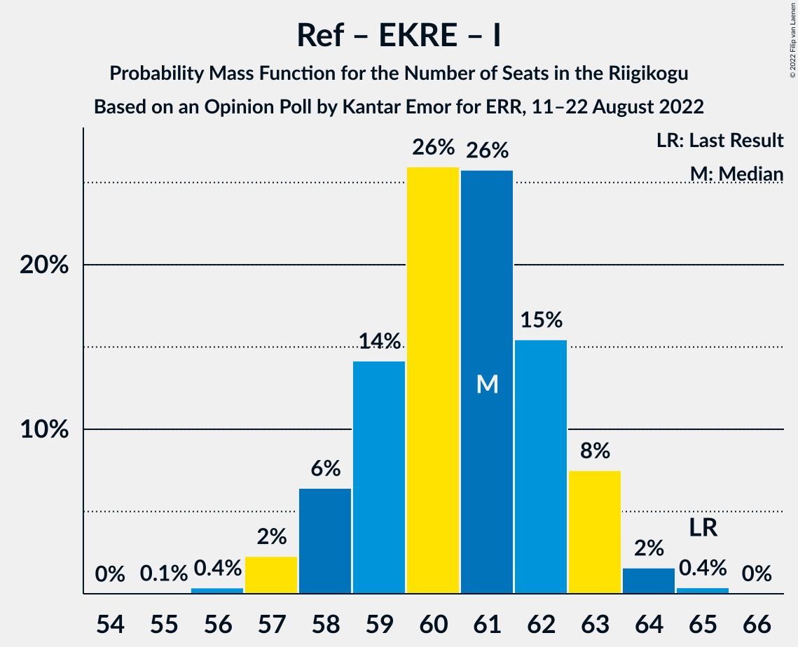

# Opinion Poll by Kantar Emor for ERR, 11–22 August 2022

<a href="#voting-intentions">Voting Intentions</a> | <a href="#seats">Seats</a> | <a href="#coalitions">Coalitions</a> | <a href="#technical-information">Technical Information</a>

## Voting Intentions

### Confidence Intervals

| Party | Last Result | Poll Result | 80% Confidence Interval | 90% Confidence Interval | 95% Confidence Interval | 99% Confidence Interval |
|:-----:|:-----------:|:-----------:|:-----------------------:|:-----------------------:|:-----------------------:|:-----------------------:|
| Eesti Reformierakond | 28.9% | 31.3% | 29.8–32.9% |29.4–33.3% |29.0–33.7% |28.3–34.4% |
| Eesti Konservatiivne Rahvaerakond | 17.8% | 18.2% | 16.9–19.5% |16.6–19.9% |16.3–20.2% |15.7–20.8% |
| Eesti Keskerakond | 23.1% | 16.2% | 15.0–17.5% |14.7–17.8% |14.4–18.1% |13.9–18.7% |
| Eesti 200 | 4.4% | 13.1% | 12.1–14.3% |11.8–14.6% |11.5–15.0% |11.0–15.5% |
| Sotsiaaldemokraatlik Erakond | 9.8% | 11.1% | 10.1–12.2% |9.8–12.5% |9.6–12.8% |9.2–13.3% |
| Erakond Isamaa | 11.4% | 7.1% | 6.3–8.0% |6.1–8.2% |5.9–8.5% |5.5–8.9% |
| Erakond Eestimaa Rohelised | 1.8% | 2.0% | 1.6–2.6% |1.5–2.8% |1.4–2.9% |1.3–3.2% |

*Note:* The poll result column reflects the actual value used in the calculations. Published results may vary slightly, and in addition be rounded to fewer digits.

## Seats

### Confidence Intervals

| Party | Last Result | Median | 80% Confidence Interval | 90% Confidence Interval | 95% Confidence Interval | 99% Confidence Interval |
|:-----:|:-----------:|:------:|:-----------------------:|:-----------------------:|:-----------------------:|:-----------------------:|
| <a href="#eesti-reformierakond">Eesti Reformierakond</a> | 34 | 35 | 33–37 |33–37 |32–38 |31–39 |
| <a href="#eesti-konservatiivne-rahvaerakond">Eesti Konservatiivne Rahvaerakond</a> | 19 | 19 | 18–21 |17–21 |17–21 |16–22 |
| <a href="#eesti-keskerakond">Eesti Keskerakond</a> | 26 | 17 | 15–18 |15–19 |15–19 |14–20 |
| <a href="#eesti-200">Eesti 200</a> | 0 | 13 | 12–14 |11–15 |11–15 |11–16 |
| <a href="#sotsiaaldemokraatlik-erakond">Sotsiaaldemokraatlik Erakond</a> | 10 | 11 | 10–12 |9–12 |9–13 |9–13 |
| <a href="#erakond-isamaa">Erakond Isamaa</a> | 12 | 6 | 5–7 |5–8 |5–8 |5–8 |
| <a href="#erakond-eestimaa-rohelised">Erakond Eestimaa Rohelised</a> | 0 | 0 | 0 |0 |0 |0 |

### Eesti Reformierakond

*For a full overview of the results for this party, see the [Eesti Reformierakond](party-eestireformierakond.html) page.*

| Number of Seats | Probability | Accumulated | Special Marks |
|:---------------:|:-----------:|:-----------:|:-------------:|
| 30 | 0.1% | 100% |  |
| 31 | 0.5% | 99.9% |  |
| 32 | 3% | 99.4% |  |
| 33 | 9% | 97% |  |
| 34 | 21% | 88% | Last Result |
| 35 | 28% | 67% | Median |
| 36 | 22% | 39% |  |
| 37 | 11% | 16% |  |
| 38 | 4% | 5% |  |
| 39 | 0.9% | 1.0% |  |
| 40 | 0.1% | 0.2% |  |
| 41 | 0% | 0% |  |

### Eesti Konservatiivne Rahvaerakond

*For a full overview of the results for this party, see the [Eesti Konservatiivne Rahvaerakond](party-eestikonservatiivnerahvaerakond.html) page.*

| Number of Seats | Probability | Accumulated | Special Marks |
|:---------------:|:-----------:|:-----------:|:-------------:|
| 15 | 0.1% | 100% |  |
| 16 | 1.4% | 99.9% |  |
| 17 | 8% | 98.5% |  |
| 18 | 24% | 90% |  |
| 19 | 32% | 67% | Last Result, Median |
| 20 | 23% | 34% |  |
| 21 | 9% | 11% |  |
| 22 | 2% | 2% |  |
| 23 | 0.2% | 0.2% |  |
| 24 | 0% | 0% |  |

### Eesti Keskerakond

*For a full overview of the results for this party, see the [Eesti Keskerakond](party-eestikeskerakond.html) page.*

| Number of Seats | Probability | Accumulated | Special Marks |
|:---------------:|:-----------:|:-----------:|:-------------:|
| 13 | 0.1% | 100% |  |
| 14 | 2% | 99.9% |  |
| 15 | 13% | 98% |  |
| 16 | 30% | 85% |  |
| 17 | 32% | 55% | Median |
| 18 | 17% | 23% |  |
| 19 | 5% | 6% |  |
| 20 | 0.7% | 0.8% |  |
| 21 | 0% | 0.1% |  |
| 22 | 0% | 0% |  |
| 23 | 0% | 0% |  |
| 24 | 0% | 0% |  |
| 25 | 0% | 0% |  |
| 26 | 0% | 0% | Last Result |

### Eesti 200

*For a full overview of the results for this party, see the [Eesti 200](party-eesti200.html) page.*

| Number of Seats | Probability | Accumulated | Special Marks |
|:---------------:|:-----------:|:-----------:|:-------------:|
| 0 | 0% | 100% | Last Result |
| 1 | 0% | 100% |  |
| 2 | 0% | 100% |  |
| 3 | 0% | 100% |  |
| 4 | 0% | 100% |  |
| 5 | 0% | 100% |  |
| 6 | 0% | 100% |  |
| 7 | 0% | 100% |  |
| 8 | 0% | 100% |  |
| 9 | 0% | 100% |  |
| 10 | 0.3% | 100% |  |
| 11 | 5% | 99.7% |  |
| 12 | 23% | 95% |  |
| 13 | 38% | 72% | Median |
| 14 | 25% | 34% |  |
| 15 | 8% | 9% |  |
| 16 | 1.0% | 1.1% |  |
| 17 | 0.1% | 0.1% |  |
| 18 | 0% | 0% |  |

### Sotsiaaldemokraatlik Erakond

*For a full overview of the results for this party, see the [Sotsiaaldemokraatlik Erakond](party-sotsiaaldemokraatlikerakond.html) page.*

| Number of Seats | Probability | Accumulated | Special Marks |
|:---------------:|:-----------:|:-----------:|:-------------:|
| 8 | 0.3% | 100% |  |
| 9 | 7% | 99.7% |  |
| 10 | 43% | 93% | Last Result |
| 11 | 26% | 50% | Median |
| 12 | 19% | 24% |  |
| 13 | 4% | 5% |  |
| 14 | 0.1% | 0.2% |  |
| 15 | 0% | 0% |  |

### Erakond Isamaa

*For a full overview of the results for this party, see the [Erakond Isamaa](party-erakondisamaa.html) page.*

| Number of Seats | Probability | Accumulated | Special Marks |
|:---------------:|:-----------:|:-----------:|:-------------:|
| 4 | 0.2% | 100% |  |
| 5 | 10% | 99.8% |  |
| 6 | 47% | 90% | Median |
| 7 | 36% | 43% |  |
| 8 | 6% | 7% |  |
| 9 | 0.3% | 0.3% |  |
| 10 | 0% | 0% |  |
| 11 | 0% | 0% |  |
| 12 | 0% | 0% | Last Result |

### Erakond Eestimaa Rohelised

*For a full overview of the results for this party, see the [Erakond Eestimaa Rohelised](party-erakondeestimaarohelised.html) page.*

| Number of Seats | Probability | Accumulated | Special Marks |
|:---------------:|:-----------:|:-----------:|:-------------:|
| 0 | 100% | 100% | Last Result, Median |

## Coalitions

### Confidence Intervals

| Coalition | Last Result | Median | Majority? | 80% Confidence Interval | 90% Confidence Interval | 95% Confidence Interval | 99% Confidence Interval |
|:---------:|:-----------:|:------:|:---------:|:-----------------------:|:-----------------------:|:-----------------------:|:-----------------------:|
| Eesti Reformierakond – Eesti Konservatiivne Rahvaerakond – Eesti Keskerakond | 79 | 71 | 100% | 69–73 | 68–73 | 68–74 | 67–74 |
| Eesti Reformierakond – Eesti Konservatiivne Rahvaerakond – Erakond Isamaa | 65 | 61 | 100% | 59–62 | 58–63 | 57–63 | 57–64 |
| Eesti Reformierakond – Eesti Konservatiivne Rahvaerakond | 53 | 54 | 99.1% | 52–56 | 52–57 | 51–57 | 50–58 |
| Eesti Reformierakond – Eesti Keskerakond | 60 | 52 | 78% | 50–54 | 49–54 | 49–55 | 48–56 |
| Eesti Reformierakond – Sotsiaaldemokraatlik Erakond – Erakond Isamaa | 56 | 52 | 91% | 51–54 | 50–55 | 49–55 | 48–56 |
| Eesti Reformierakond – Sotsiaaldemokraatlik Erakond | 44 | 46 | 0.1% | 44–48 | 43–48 | 43–49 | 42–50 |
| Eesti Konservatiivne Rahvaerakond – Eesti Keskerakond – Erakond Isamaa | 57 | 42 | 0% | 40–44 | 39–45 | 39–45 | 38–46 |
| Eesti Reformierakond – Erakond Isamaa | 46 | 41 | 0% | 40–43 | 39–44 | 39–44 | 38–45 |
| Eesti Konservatiivne Rahvaerakond – Eesti Keskerakond | 45 | 36 | 0% | 34–38 | 33–38 | 33–39 | 32–39 |
| Eesti Keskerakond – Sotsiaaldemokraatlik Erakond – Erakond Isamaa | 48 | 34 | 0% | 32–36 | 31–36 | 31–37 | 30–38 |
| Eesti Konservatiivne Rahvaerakond – Sotsiaaldemokraatlik Erakond | 29 | 30 | 0% | 28–32 | 27–32 | 27–32 | 26–33 |
| Eesti Keskerakond – Sotsiaaldemokraatlik Erakond | 36 | 27 | 0% | 26–29 | 25–30 | 25–30 | 24–31 |

### Eesti Reformierakond – Eesti Konservatiivne Rahvaerakond – Eesti Keskerakond

| Number of Seats | Probability | Accumulated | Special Marks |
|:---------------:|:-----------:|:-----------:|:-------------:|
| 66 | 0.1% | 100% |  |
| 67 | 1.1% | 99.9% |  |
| 68 | 5% | 98.8% |  |
| 69 | 12% | 94% |  |
| 70 | 24% | 82% |  |
| 71 | 26% | 58% | Median |
| 72 | 20% | 32% |  |
| 73 | 10% | 12% |  |
| 74 | 2% | 3% |  |
| 75 | 0.3% | 0.4% |  |
| 76 | 0% | 0% |  |
| 77 | 0% | 0% |  |
| 78 | 0% | 0% |  |
| 79 | 0% | 0% | Last Result |

### Eesti Reformierakond – Eesti Konservatiivne Rahvaerakond – Erakond Isamaa

| Number of Seats | Probability | Accumulated | Special Marks |
|:---------------:|:-----------:|:-----------:|:-------------:|
| 55 | 0.1% | 100% |  |
| 56 | 0.4% | 99.9% |  |
| 57 | 2% | 99.6% |  |
| 58 | 6% | 97% |  |
| 59 | 14% | 91% |  |
| 60 | 26% | 77% | Median |
| 61 | 26% | 51% |  |
| 62 | 15% | 25% |  |
| 63 | 8% | 10% |  |
| 64 | 2% | 2% |  |
| 65 | 0.4% | 0.4% | Last Result |
| 66 | 0% | 0% |  |

### Eesti Reformierakond – Eesti Konservatiivne Rahvaerakond

| Number of Seats | Probability | Accumulated | Special Marks |
|:---------------:|:-----------:|:-----------:|:-------------:|
| 49 | 0.1% | 100% |  |
| 50 | 0.7% | 99.9% |  |
| 51 | 4% | 99.1% | Majority |
| 52 | 9% | 95% |  |
| 53 | 20% | 86% | Last Result |
| 54 | 27% | 67% | Median |
| 55 | 21% | 40% |  |
| 56 | 12% | 18% |  |
| 57 | 5% | 6% |  |
| 58 | 1.1% | 1.3% |  |
| 59 | 0.2% | 0.2% |  |
| 60 | 0% | 0% |  |

### Eesti Reformierakond – Eesti Keskerakond

| Number of Seats | Probability | Accumulated | Special Marks |
|:---------------:|:-----------:|:-----------:|:-------------:|
| 47 | 0.2% | 100% |  |
| 48 | 2% | 99.7% |  |
| 49 | 4% | 98% |  |
| 50 | 17% | 94% |  |
| 51 | 19% | 78% | Majority |
| 52 | 27% | 59% | Median |
| 53 | 19% | 32% |  |
| 54 | 9% | 12% |  |
| 55 | 3% | 4% |  |
| 56 | 0.7% | 0.7% |  |
| 57 | 0.1% | 0.1% |  |
| 58 | 0% | 0% |  |
| 59 | 0% | 0% |  |
| 60 | 0% | 0% | Last Result |

### Eesti Reformierakond – Sotsiaaldemokraatlik Erakond – Erakond Isamaa

| Number of Seats | Probability | Accumulated | Special Marks |
|:---------------:|:-----------:|:-----------:|:-------------:|
| 47 | 0.1% | 100% |  |
| 48 | 1.1% | 99.9% |  |
| 49 | 3% | 98.8% |  |
| 50 | 5% | 96% |  |
| 51 | 25% | 91% | Majority |
| 52 | 29% | 66% | Median |
| 53 | 14% | 37% |  |
| 54 | 15% | 23% |  |
| 55 | 7% | 8% |  |
| 56 | 0.9% | 1.3% | Last Result |
| 57 | 0.3% | 0.3% |  |
| 58 | 0% | 0% |  |

### Eesti Reformierakond – Sotsiaaldemokraatlik Erakond

| Number of Seats | Probability | Accumulated | Special Marks |
|:---------------:|:-----------:|:-----------:|:-------------:|
| 41 | 0.2% | 100% |  |
| 42 | 1.3% | 99.8% |  |
| 43 | 4% | 98% |  |
| 44 | 13% | 94% | Last Result |
| 45 | 25% | 81% |  |
| 46 | 24% | 56% | Median |
| 47 | 17% | 32% |  |
| 48 | 10% | 15% |  |
| 49 | 4% | 5% |  |
| 50 | 1.0% | 1.1% |  |
| 51 | 0.1% | 0.1% | Majority |
| 52 | 0% | 0% |  |

### Eesti Konservatiivne Rahvaerakond – Eesti Keskerakond – Erakond Isamaa

| Number of Seats | Probability | Accumulated | Special Marks |
|:---------------:|:-----------:|:-----------:|:-------------:|
| 37 | 0.1% | 100% |  |
| 38 | 1.1% | 99.9% |  |
| 39 | 4% | 98.8% |  |
| 40 | 9% | 94% |  |
| 41 | 21% | 85% |  |
| 42 | 24% | 64% | Median |
| 43 | 22% | 40% |  |
| 44 | 13% | 18% |  |
| 45 | 5% | 6% |  |
| 46 | 0.9% | 1.0% |  |
| 47 | 0.1% | 0.2% |  |
| 48 | 0% | 0% |  |
| 49 | 0% | 0% |  |
| 50 | 0% | 0% |  |
| 51 | 0% | 0% | Majority |
| 52 | 0% | 0% |  |
| 53 | 0% | 0% |  |
| 54 | 0% | 0% |  |
| 55 | 0% | 0% |  |
| 56 | 0% | 0% |  |
| 57 | 0% | 0% | Last Result |

### Eesti Reformierakond – Erakond Isamaa

| Number of Seats | Probability | Accumulated | Special Marks |
|:---------------:|:-----------:|:-----------:|:-------------:|
| 37 | 0.4% | 100% |  |
| 38 | 2% | 99.6% |  |
| 39 | 7% | 98% |  |
| 40 | 12% | 91% |  |
| 41 | 29% | 78% | Median |
| 42 | 26% | 49% |  |
| 43 | 15% | 23% |  |
| 44 | 6% | 9% |  |
| 45 | 2% | 2% |  |
| 46 | 0.3% | 0.4% | Last Result |
| 47 | 0.1% | 0.1% |  |
| 48 | 0% | 0% |  |

### Eesti Konservatiivne Rahvaerakond – Eesti Keskerakond

| Number of Seats | Probability | Accumulated | Special Marks |
|:---------------:|:-----------:|:-----------:|:-------------:|
| 31 | 0.2% | 100% |  |
| 32 | 2% | 99.8% |  |
| 33 | 6% | 98% |  |
| 34 | 13% | 92% |  |
| 35 | 24% | 79% |  |
| 36 | 26% | 55% | Median |
| 37 | 18% | 29% |  |
| 38 | 9% | 11% |  |
| 39 | 2% | 3% |  |
| 40 | 0.4% | 0.4% |  |
| 41 | 0% | 0.1% |  |
| 42 | 0% | 0% |  |
| 43 | 0% | 0% |  |
| 44 | 0% | 0% |  |
| 45 | 0% | 0% | Last Result |

### Eesti Keskerakond – Sotsiaaldemokraatlik Erakond – Erakond Isamaa

| Number of Seats | Probability | Accumulated | Special Marks |
|:---------------:|:-----------:|:-----------:|:-------------:|
| 29 | 0.2% | 100% |  |
| 30 | 0.6% | 99.8% |  |
| 31 | 6% | 99.2% |  |
| 32 | 10% | 93% |  |
| 33 | 27% | 83% |  |
| 34 | 26% | 56% | Median |
| 35 | 20% | 31% |  |
| 36 | 8% | 11% |  |
| 37 | 2% | 3% |  |
| 38 | 0.7% | 0.7% |  |
| 39 | 0% | 0.1% |  |
| 40 | 0% | 0% |  |
| 41 | 0% | 0% |  |
| 42 | 0% | 0% |  |
| 43 | 0% | 0% |  |
| 44 | 0% | 0% |  |
| 45 | 0% | 0% |  |
| 46 | 0% | 0% |  |
| 47 | 0% | 0% |  |
| 48 | 0% | 0% | Last Result |

### Eesti Konservatiivne Rahvaerakond – Sotsiaaldemokraatlik Erakond

| Number of Seats | Probability | Accumulated | Special Marks |
|:---------------:|:-----------:|:-----------:|:-------------:|
| 25 | 0.1% | 100% |  |
| 26 | 0.8% | 99.9% |  |
| 27 | 4% | 99.2% |  |
| 28 | 14% | 95% |  |
| 29 | 25% | 81% | Last Result |
| 30 | 27% | 56% | Median |
| 31 | 19% | 29% |  |
| 32 | 8% | 10% |  |
| 33 | 2% | 2% |  |
| 34 | 0.4% | 0.4% |  |
| 35 | 0% | 0% |  |

### Eesti Keskerakond – Sotsiaaldemokraatlik Erakond

| Number of Seats | Probability | Accumulated | Special Marks |
|:---------------:|:-----------:|:-----------:|:-------------:|
| 23 | 0.1% | 100% |  |
| 24 | 1.4% | 99.8% |  |
| 25 | 7% | 98% |  |
| 26 | 18% | 92% |  |
| 27 | 29% | 74% |  |
| 28 | 25% | 45% | Median |
| 29 | 14% | 20% |  |
| 30 | 5% | 6% |  |
| 31 | 1.1% | 1.3% |  |
| 32 | 0.1% | 0.2% |  |
| 33 | 0% | 0% |  |
| 34 | 0% | 0% |  |
| 35 | 0% | 0% |  |
| 36 | 0% | 0% | Last Result |

## Technical Information

### Opinion Poll

+ **Polling firm:** Kantar Emor
+ **Commissioner(s):** ERR
+ **Fieldwork period:** 11–22 August 2022

### Calculations

+ **Sample size:** 1514
+ **Simulations done:** 1,048,576
+ **Error estimate:** 0.64%

