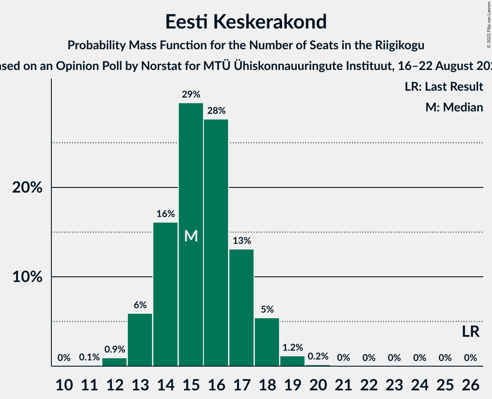
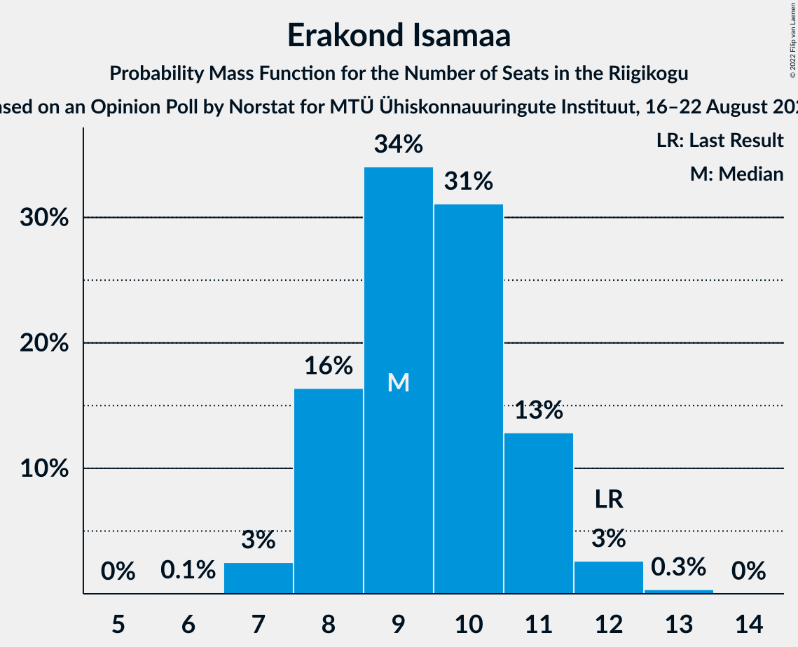
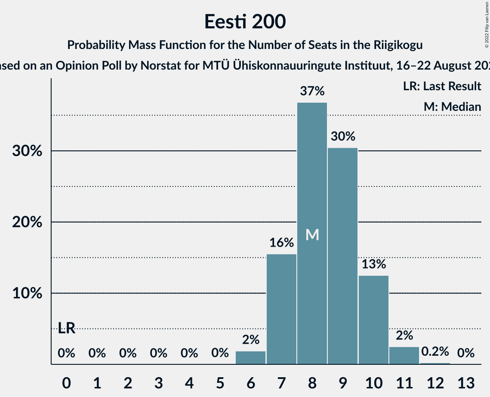

# Opinion Poll by Norstat for MTÜ Ühiskonnauuringute Instituut, 16–22 August 2022

<a href="#voting-intentions">Voting Intentions</a> | <a href="#seats">Seats</a> | <a href="#coalitions">Coalitions</a> | <a href="#technical-information">Technical Information</a>

## Voting Intentions

### Confidence Intervals

| Party | Last Result | Poll Result | 80% Confidence Interval | 90% Confidence Interval | 95% Confidence Interval | 99% Confidence Interval |
|:-----:|:-----------:|:-----------:|:-----------------------:|:-----------------------:|:-----------------------:|:-----------------------:|
| Eesti Reformierakond | 28.9% | 35.1% | 33.2–37.1% |32.7–37.6% |32.2–38.1% |31.3–39.1% |
| Eesti Konservatiivne Rahvaerakond | 17.8% | 20.1% | 18.5–21.8% |18.1–22.3% |17.7–22.7% |17.0–23.5% |
| Eesti Keskerakond | 23.1% | 15.2% | 13.8–16.8% |13.4–17.2% |13.1–17.6% |12.5–18.3% |
| Erakond Isamaa | 11.4% | 9.9% | 8.8–11.2% |8.5–11.6% |8.2–11.9% |7.7–12.6% |
| Eesti 200 | 4.4% | 9.0% | 7.9–10.3% |7.6–10.6% |7.4–10.9% |6.9–11.6% |
| Sotsiaaldemokraatlik Erakond | 9.8% | 7.4% | 6.4–8.6% |6.2–8.9% |5.9–9.2% |5.5–9.8% |
| Erakond Eestimaa Rohelised | 1.8% | 2.2% | 1.7–2.9% |1.6–3.1% |1.4–3.3% |1.2–3.7% |

*Note:* The poll result column reflects the actual value used in the calculations. Published results may vary slightly, and in addition be rounded to fewer digits.

## Seats

### Confidence Intervals

| Party | Last Result | Median | 80% Confidence Interval | 90% Confidence Interval | 95% Confidence Interval | 99% Confidence Interval |
|:-----:|:-----------:|:------:|:-----------------------:|:-----------------------:|:-----------------------:|:-----------------------:|
| <a href="#eesti-reformierakond">Eesti Reformierakond</a> | 34 | 40 | 37–42 |37–43 |36–43 |35–45 |
| <a href="#eesti-konservatiivne-rahvaerakond">Eesti Konservatiivne Rahvaerakond</a> | 19 | 21 | 19–23 |19–24 |18–24 |17–25 |
| <a href="#eesti-keskerakond">Eesti Keskerakond</a> | 26 | 15 | 14–17 |13–18 |13–18 |12–19 |
| <a href="#erakond-isamaa">Erakond Isamaa</a> | 12 | 9 | 8–11 |8–11 |7–12 |7–12 |
| <a href="#eesti-200">Eesti 200</a> | 0 | 8 | 7–10 |7–10 |7–11 |6–11 |
| <a href="#sotsiaaldemokraatlik-erakond">Sotsiaaldemokraatlik Erakond</a> | 10 | 7 | 6–8 |5–8 |5–9 |5–9 |
| <a href="#erakond-eestimaa-rohelised">Erakond Eestimaa Rohelised</a> | 0 | 0 | 0 |0 |0 |0 |

### Eesti Reformierakond

*For a full overview of the results for this party, see the [Eesti Reformierakond](party-eestireformierakond.html) page.*

| Number of Seats | Probability | Accumulated | Special Marks |
|:---------------:|:-----------:|:-----------:|:-------------:|
| 34 | 0.2% | 100% | Last Result |
| 35 | 0.7% | 99.8% |  |
| 36 | 3% | 99.1% |  |
| 37 | 8% | 96% |  |
| 38 | 13% | 88% |  |
| 39 | 20% | 75% |  |
| 40 | 22% | 55% | Median |
| 41 | 16% | 33% |  |
| 42 | 12% | 18% |  |
| 43 | 4% | 6% |  |
| 44 | 1.5% | 2% |  |
| 45 | 0.4% | 0.5% |  |
| 46 | 0.1% | 0.1% |  |
| 47 | 0% | 0% |  |

### Eesti Konservatiivne Rahvaerakond

*For a full overview of the results for this party, see the [Eesti Konservatiivne Rahvaerakond](party-eestikonservatiivnerahvaerakond.html) page.*

| Number of Seats | Probability | Accumulated | Special Marks |
|:---------------:|:-----------:|:-----------:|:-------------:|
| 17 | 0.5% | 100% |  |
| 18 | 3% | 99.5% |  |
| 19 | 10% | 97% | Last Result |
| 20 | 17% | 87% |  |
| 21 | 30% | 70% | Median |
| 22 | 21% | 40% |  |
| 23 | 13% | 20% |  |
| 24 | 5% | 7% |  |
| 25 | 1.5% | 2% |  |
| 26 | 0.2% | 0.3% |  |
| 27 | 0% | 0.1% |  |
| 28 | 0% | 0% |  |

### Eesti Keskerakond

*For a full overview of the results for this party, see the [Eesti Keskerakond](party-eestikeskerakond.html) page.*

| Number of Seats | Probability | Accumulated | Special Marks |
|:---------------:|:-----------:|:-----------:|:-------------:|
| 11 | 0.1% | 100% |  |
| 12 | 0.9% | 99.9% |  |
| 13 | 6% | 99.0% |  |
| 14 | 16% | 93% |  |
| 15 | 29% | 77% | Median |
| 16 | 28% | 47% |  |
| 17 | 13% | 20% |  |
| 18 | 5% | 7% |  |
| 19 | 1.2% | 1.3% |  |
| 20 | 0.2% | 0.2% |  |
| 21 | 0% | 0% |  |
| 22 | 0% | 0% |  |
| 23 | 0% | 0% |  |
| 24 | 0% | 0% |  |
| 25 | 0% | 0% |  |
| 26 | 0% | 0% | Last Result |

### Erakond Isamaa

*For a full overview of the results for this party, see the [Erakond Isamaa](party-erakondisamaa.html) page.*

| Number of Seats | Probability | Accumulated | Special Marks |
|:---------------:|:-----------:|:-----------:|:-------------:|
| 6 | 0.1% | 100% |  |
| 7 | 3% | 99.9% |  |
| 8 | 16% | 97% |  |
| 9 | 34% | 81% | Median |
| 10 | 31% | 47% |  |
| 11 | 13% | 16% |  |
| 12 | 3% | 3% | Last Result |
| 13 | 0.3% | 0.4% |  |
| 14 | 0% | 0% |  |

### Eesti 200

*For a full overview of the results for this party, see the [Eesti 200](party-eesti200.html) page.*

| Number of Seats | Probability | Accumulated | Special Marks |
|:---------------:|:-----------:|:-----------:|:-------------:|
| 0 | 0% | 100% | Last Result |
| 1 | 0% | 100% |  |
| 2 | 0% | 100% |  |
| 3 | 0% | 100% |  |
| 4 | 0% | 100% |  |
| 5 | 0% | 100% |  |
| 6 | 2% | 100% |  |
| 7 | 16% | 98% |  |
| 8 | 37% | 83% | Median |
| 9 | 30% | 46% |  |
| 10 | 13% | 15% |  |
| 11 | 2% | 3% |  |
| 12 | 0.2% | 0.3% |  |
| 13 | 0% | 0% |  |

### Sotsiaaldemokraatlik Erakond

*For a full overview of the results for this party, see the [Sotsiaaldemokraatlik Erakond](party-sotsiaaldemokraatlikerakond.html) page.*

| Number of Seats | Probability | Accumulated | Special Marks |
|:---------------:|:-----------:|:-----------:|:-------------:|
| 4 | 0.3% | 100% |  |
| 5 | 7% | 99.7% |  |
| 6 | 36% | 92% |  |
| 7 | 37% | 56% | Median |
| 8 | 16% | 20% |  |
| 9 | 3% | 3% |  |
| 10 | 0.2% | 0.2% | Last Result |
| 11 | 0% | 0% |  |

### Erakond Eestimaa Rohelised

*For a full overview of the results for this party, see the [Erakond Eestimaa Rohelised](party-erakondeestimaarohelised.html) page.*

| Number of Seats | Probability | Accumulated | Special Marks |
|:---------------:|:-----------:|:-----------:|:-------------:|
| 0 | 100% | 100% | Last Result, Median |

## Coalitions

### Confidence Intervals

| Coalition | Last Result | Median | Majority? | 80% Confidence Interval | 90% Confidence Interval | 95% Confidence Interval | 99% Confidence Interval |
|:---------:|:-----------:|:------:|:---------:|:-----------------------:|:-----------------------:|:-----------------------:|:-----------------------:|
| Eesti Reformierakond – Eesti Konservatiivne Rahvaerakond – Eesti Keskerakond | 79 | 76 | 100% | 74–78 | 74–79 | 73–79 | 72–80 |
| Eesti Reformierakond – Eesti Konservatiivne Rahvaerakond – Erakond Isamaa | 65 | 70 | 100% | 68–73 | 68–73 | 67–74 | 66–75 |
| Eesti Reformierakond – Eesti Konservatiivne Rahvaerakond | 53 | 61 | 100% | 59–63 | 58–64 | 57–65 | 56–66 |
| Eesti Reformierakond – Erakond Isamaa – Sotsiaaldemokraatlik Erakond | 56 | 56 | 99.8% | 54–58 | 53–59 | 52–60 | 51–61 |
| Eesti Reformierakond – Eesti Keskerakond | 60 | 55 | 99.2% | 53–58 | 52–58 | 52–59 | 50–60 |
| Eesti Reformierakond – Erakond Isamaa | 46 | 49 | 23% | 47–52 | 46–52 | 46–53 | 44–54 |
| Eesti Konservatiivne Rahvaerakond – Eesti Keskerakond – Erakond Isamaa | 57 | 46 | 0.9% | 44–49 | 43–49 | 43–50 | 41–51 |
| Eesti Reformierakond – Sotsiaaldemokraatlik Erakond | 44 | 46 | 1.5% | 44–49 | 43–49 | 43–50 | 42–51 |
| Eesti Konservatiivne Rahvaerakond – Eesti Keskerakond | 45 | 37 | 0% | 34–39 | 34–40 | 33–40 | 32–41 |
| Eesti Keskerakond – Erakond Isamaa – Sotsiaaldemokraatlik Erakond | 48 | 32 | 0% | 29–34 | 29–35 | 28–35 | 27–36 |
| Eesti Konservatiivne Rahvaerakond – Sotsiaaldemokraatlik Erakond | 29 | 28 | 0% | 26–30 | 25–31 | 25–31 | 24–32 |
| Eesti Keskerakond – Sotsiaaldemokraatlik Erakond | 36 | 22 | 0% | 20–24 | 20–25 | 19–25 | 18–26 |

### Eesti Reformierakond – Eesti Konservatiivne Rahvaerakond – Eesti Keskerakond

| Number of Seats | Probability | Accumulated | Special Marks |
|:---------------:|:-----------:|:-----------:|:-------------:|
| 71 | 0.1% | 100% |  |
| 72 | 0.7% | 99.8% |  |
| 73 | 3% | 99.2% |  |
| 74 | 9% | 96% |  |
| 75 | 18% | 87% |  |
| 76 | 20% | 70% | Median |
| 77 | 23% | 50% |  |
| 78 | 17% | 27% |  |
| 79 | 7% | 9% | Last Result |
| 80 | 2% | 2% |  |
| 81 | 0.4% | 0.4% |  |
| 82 | 0% | 0.1% |  |
| 83 | 0% | 0% |  |

### Eesti Reformierakond – Eesti Konservatiivne Rahvaerakond – Erakond Isamaa

| Number of Seats | Probability | Accumulated | Special Marks |
|:---------------:|:-----------:|:-----------:|:-------------:|
| 65 | 0.2% | 100% | Last Result |
| 66 | 1.0% | 99.8% |  |
| 67 | 4% | 98.7% |  |
| 68 | 8% | 95% |  |
| 69 | 16% | 87% |  |
| 70 | 23% | 70% | Median |
| 71 | 20% | 48% |  |
| 72 | 17% | 27% |  |
| 73 | 7% | 10% |  |
| 74 | 2% | 3% |  |
| 75 | 0.7% | 0.8% |  |
| 76 | 0.1% | 0.1% |  |
| 77 | 0% | 0% |  |

### Eesti Reformierakond – Eesti Konservatiivne Rahvaerakond

| Number of Seats | Probability | Accumulated | Special Marks |
|:---------------:|:-----------:|:-----------:|:-------------:|
| 53 | 0% | 100% | Last Result |
| 54 | 0% | 100% |  |
| 55 | 0.1% | 100% |  |
| 56 | 0.7% | 99.8% |  |
| 57 | 2% | 99.1% |  |
| 58 | 6% | 97% |  |
| 59 | 12% | 91% |  |
| 60 | 18% | 79% |  |
| 61 | 22% | 60% | Median |
| 62 | 18% | 38% |  |
| 63 | 12% | 20% |  |
| 64 | 5% | 8% |  |
| 65 | 2% | 3% |  |
| 66 | 0.5% | 0.6% |  |
| 67 | 0.1% | 0.1% |  |
| 68 | 0% | 0% |  |

### Eesti Reformierakond – Erakond Isamaa – Sotsiaaldemokraatlik Erakond

| Number of Seats | Probability | Accumulated | Special Marks |
|:---------------:|:-----------:|:-----------:|:-------------:|
| 50 | 0.2% | 100% |  |
| 51 | 0.9% | 99.8% | Majority |
| 52 | 2% | 98.9% |  |
| 53 | 6% | 97% |  |
| 54 | 12% | 90% |  |
| 55 | 20% | 78% |  |
| 56 | 22% | 58% | Last Result, Median |
| 57 | 17% | 36% |  |
| 58 | 11% | 19% |  |
| 59 | 6% | 8% |  |
| 60 | 2% | 3% |  |
| 61 | 0.6% | 0.7% |  |
| 62 | 0.1% | 0.1% |  |
| 63 | 0% | 0% |  |

### Eesti Reformierakond – Eesti Keskerakond

| Number of Seats | Probability | Accumulated | Special Marks |
|:---------------:|:-----------:|:-----------:|:-------------:|
| 49 | 0.1% | 100% |  |
| 50 | 0.6% | 99.9% |  |
| 51 | 2% | 99.2% | Majority |
| 52 | 5% | 98% |  |
| 53 | 11% | 92% |  |
| 54 | 18% | 82% |  |
| 55 | 19% | 63% | Median |
| 56 | 19% | 44% |  |
| 57 | 15% | 25% |  |
| 58 | 7% | 10% |  |
| 59 | 2% | 3% |  |
| 60 | 0.8% | 1.0% | Last Result |
| 61 | 0.2% | 0.2% |  |
| 62 | 0% | 0% |  |

### Eesti Reformierakond – Erakond Isamaa

| Number of Seats | Probability | Accumulated | Special Marks |
|:---------------:|:-----------:|:-----------:|:-------------:|
| 43 | 0.1% | 100% |  |
| 44 | 0.6% | 99.9% |  |
| 45 | 2% | 99.2% |  |
| 46 | 5% | 98% | Last Result |
| 47 | 11% | 92% |  |
| 48 | 16% | 82% |  |
| 49 | 23% | 65% | Median |
| 50 | 19% | 42% |  |
| 51 | 13% | 23% | Majority |
| 52 | 7% | 11% |  |
| 53 | 3% | 4% |  |
| 54 | 0.9% | 1.1% |  |
| 55 | 0.2% | 0.2% |  |
| 56 | 0% | 0% |  |

### Eesti Konservatiivne Rahvaerakond – Eesti Keskerakond – Erakond Isamaa

| Number of Seats | Probability | Accumulated | Special Marks |
|:---------------:|:-----------:|:-----------:|:-------------:|
| 40 | 0.1% | 100% |  |
| 41 | 0.6% | 99.9% |  |
| 42 | 2% | 99.3% |  |
| 43 | 5% | 98% |  |
| 44 | 11% | 92% |  |
| 45 | 21% | 81% | Median |
| 46 | 18% | 61% |  |
| 47 | 21% | 43% |  |
| 48 | 12% | 22% |  |
| 49 | 7% | 10% |  |
| 50 | 2% | 3% |  |
| 51 | 0.7% | 0.9% | Majority |
| 52 | 0.1% | 0.2% |  |
| 53 | 0% | 0% |  |
| 54 | 0% | 0% |  |
| 55 | 0% | 0% |  |
| 56 | 0% | 0% |  |
| 57 | 0% | 0% | Last Result |

### Eesti Reformierakond – Sotsiaaldemokraatlik Erakond

| Number of Seats | Probability | Accumulated | Special Marks |
|:---------------:|:-----------:|:-----------:|:-------------:|
| 40 | 0.1% | 100% |  |
| 41 | 0.3% | 99.9% |  |
| 42 | 1.5% | 99.6% |  |
| 43 | 4% | 98% |  |
| 44 | 8% | 94% | Last Result |
| 45 | 17% | 86% |  |
| 46 | 20% | 68% |  |
| 47 | 19% | 49% | Median |
| 48 | 16% | 29% |  |
| 49 | 9% | 13% |  |
| 50 | 3% | 5% |  |
| 51 | 1.1% | 1.5% | Majority |
| 52 | 0.3% | 0.4% |  |
| 53 | 0.1% | 0.1% |  |
| 54 | 0% | 0% |  |

### Eesti Konservatiivne Rahvaerakond – Eesti Keskerakond

| Number of Seats | Probability | Accumulated | Special Marks |
|:---------------:|:-----------:|:-----------:|:-------------:|
| 31 | 0.1% | 100% |  |
| 32 | 0.8% | 99.8% |  |
| 33 | 3% | 99.1% |  |
| 34 | 7% | 96% |  |
| 35 | 14% | 89% |  |
| 36 | 19% | 74% | Median |
| 37 | 23% | 55% |  |
| 38 | 18% | 32% |  |
| 39 | 8% | 14% |  |
| 40 | 4% | 6% |  |
| 41 | 1.3% | 2% |  |
| 42 | 0.4% | 0.5% |  |
| 43 | 0.1% | 0.1% |  |
| 44 | 0% | 0% |  |
| 45 | 0% | 0% | Last Result |

### Eesti Keskerakond – Erakond Isamaa – Sotsiaaldemokraatlik Erakond

| Number of Seats | Probability | Accumulated | Special Marks |
|:---------------:|:-----------:|:-----------:|:-------------:|
| 26 | 0.1% | 100% |  |
| 27 | 0.7% | 99.9% |  |
| 28 | 3% | 99.2% |  |
| 29 | 7% | 96% |  |
| 30 | 16% | 89% |  |
| 31 | 21% | 74% | Median |
| 32 | 23% | 52% |  |
| 33 | 15% | 29% |  |
| 34 | 9% | 14% |  |
| 35 | 4% | 5% |  |
| 36 | 1.1% | 1.4% |  |
| 37 | 0.3% | 0.3% |  |
| 38 | 0% | 0% |  |
| 39 | 0% | 0% |  |
| 40 | 0% | 0% |  |
| 41 | 0% | 0% |  |
| 42 | 0% | 0% |  |
| 43 | 0% | 0% |  |
| 44 | 0% | 0% |  |
| 45 | 0% | 0% |  |
| 46 | 0% | 0% |  |
| 47 | 0% | 0% |  |
| 48 | 0% | 0% | Last Result |

### Eesti Konservatiivne Rahvaerakond – Sotsiaaldemokraatlik Erakond

| Number of Seats | Probability | Accumulated | Special Marks |
|:---------------:|:-----------:|:-----------:|:-------------:|
| 23 | 0.3% | 100% |  |
| 24 | 1.5% | 99.7% |  |
| 25 | 5% | 98% |  |
| 26 | 12% | 93% |  |
| 27 | 21% | 81% |  |
| 28 | 23% | 60% | Median |
| 29 | 20% | 37% | Last Result |
| 30 | 11% | 17% |  |
| 31 | 4% | 6% |  |
| 32 | 1.1% | 2% |  |
| 33 | 0.4% | 0.4% |  |
| 34 | 0.1% | 0.1% |  |
| 35 | 0% | 0% |  |

### Eesti Keskerakond – Sotsiaaldemokraatlik Erakond

| Number of Seats | Probability | Accumulated | Special Marks |
|:---------------:|:-----------:|:-----------:|:-------------:|
| 17 | 0.1% | 100% |  |
| 18 | 0.7% | 99.9% |  |
| 19 | 3% | 99.2% |  |
| 20 | 10% | 96% |  |
| 21 | 22% | 87% |  |
| 22 | 23% | 64% | Median |
| 23 | 23% | 41% |  |
| 24 | 12% | 19% |  |
| 25 | 5% | 7% |  |
| 26 | 1.4% | 2% |  |
| 27 | 0.3% | 0.3% |  |
| 28 | 0% | 0% |  |
| 29 | 0% | 0% |  |
| 30 | 0% | 0% |  |
| 31 | 0% | 0% |  |
| 32 | 0% | 0% |  |
| 33 | 0% | 0% |  |
| 34 | 0% | 0% |  |
| 35 | 0% | 0% |  |
| 36 | 0% | 0% | Last Result |

## Technical Information

### Opinion Poll

+ **Polling firm:** Norstat
+ **Commissioner(s):** MTÜ Ühiskonnauuringute Instituut
+ **Fieldwork period:** 16–22 August 2022

### Calculations

+ **Sample size:** 1000
+ **Simulations done:** 1,048,576
+ **Error estimate:** 1.49%

